# 第七章： Kubernetes 控制器

概述

本章介绍了 Kubernetes 控制器的概念，并解释了如何使用它们来创建复制的部署。我们将描述不同类型的控制器的使用，如 ReplicaSets、部署、DaemonSets、StatefulSets 和 Jobs。您将学习如何为特定用例选择合适的控制器。通过实际操作练习，我们将指导您如何使用所需的配置来部署应用程序的多个 Pod 副本。您还将学习如何使用各种命令来管理它们。

# 介绍

在之前的章节中，我们创建了不同的 Pod，手动管理它们的生命周期，并为它们添加了元数据（标签或注释）来帮助组织和识别各种 Pod。在本章中，我们将看看一些 Kubernetes 对象，帮助您以声明方式管理多个副本 Pod。

在生产环境中部署应用程序时，有几个原因会让您希望拥有多个 Pod 的副本。拥有多个副本可以确保在一个或多个 Pod 失败的情况下，您的应用程序仍然可以正常工作。除了处理故障之外，复制还允许您在不同的副本之间平衡负载，以便一个 Pod 不会因为大量请求而过载，从而使您能够轻松地处理比单个 Pod 能够处理的更高流量。

Kubernetes 支持不同的控制器，您可以用于复制，如 ReplicaSets、部署、DaemonSets、StatefulSets 和 Jobs。控制器是一个对象，确保您的应用程序在其整个运行时处于所需状态。每个控制器都对特定的用例有用。在本章中，我们将逐个探索一些最常用的控制器，并了解如何以及何时在实际场景中使用它们。

# ReplicaSets

如前所述，拥有应用程序的多个副本可以确保即使一些副本失败，应用程序仍然可用。这也使我们能够轻松地扩展我们的应用程序以平衡负载以提供更多的流量。例如，如果我们正在构建一个向用户公开的 Web 应用程序，我们希望至少有两个应用程序副本，以防其中一个失败或意外死机。我们还希望失败的副本能够自行恢复。除此之外，如果我们的流量开始增长，我们希望增加运行我们的应用程序的 Pod（副本）的数量。ReplicaSet 是一个 Kubernetes 控制器，它在任何给定时间保持一定数量的 Pod 运行。

ReplicaSet 充当 Kubernetes 集群中不同节点上多个 Pod 的监督者。ReplicaSet 将终止或启动新的 Pod 以匹配 ReplicaSet 模板中指定的配置。因此，即使您的应用程序只需要一个 Pod，使用 ReplicaSet 也是一个好主意。即使有人删除了唯一运行的 Pod，ReplicaSet 也会确保创建一个新的 Pod 来替代它，从而确保始终有一个 Pod 在运行。

ReplicaSet 可以用来可靠地运行单个 Pod，也可以用来运行多个相同 Pod 的实例。

## ReplicaSet 配置

让我们首先看一个 ReplicaSet 配置的示例，然后我们将介绍不同字段的含义：

```
apiVersion: apps/v1
kind: ReplicaSet
metadata:
  name: nginx-replicaset
  labels:
    app: nginx
spec:
  replicas: 2
  selector:
    matchLabels:
      environment: production
  template:
    metadata:
      labels:
        environment: production
    spec:
      containers:
      - name: nginx-container
        image: nginx
```

与 Pod 配置一样，ReplicaSet 还需要字段，如`apiVersion`，`kind`和`metadata`。对于 ReplicaSet，API 版本`apps/v1`是当前版本，`kind`字段将始终为`ReplicaSet`。到目前为止，在 Pod 配置中看到的一个不同的字段是`spec`。

现在，我们将看到在`spec`字段中需要指定哪些信息。

### 副本

在`spec`下的`replicas`字段指定 ReplicaSet 应保持同时运行多少个 Pod。您可以在前面的示例中看到以下值：

```
replicas: 2
```

ReplicaSet 将创建或删除 Pod 以匹配这个数字。如果未指定，默认值为`1`。

### Pod 模板

在`template`字段中，我们将指定我们想要使用这个 ReplicaSet 运行的 Pod 的模板。这个 Pod 模板将与我们在前两章中使用的 Pod 模板完全相同。通常情况下，我们可以向 Pod 添加标签和注释的元数据。当有需要时，ReplicaSet 将使用这个 Pod 模板来创建新的 Pod。前面示例中的以下部分包括模板：

```
template:
  metadata:
    labels:
      environment: production
  spec:
    containers:
    - name: nginx-container
      image: nginx
```

### Pod 选择器

这是一个非常重要的部分。在`spec`下的`selector`字段中，我们可以指定标签选择器，ReplicaSet 将使用这些选择器来识别要管理的 Pod：

```
selector:
  matchLabels:
    environment: production
```

前面的示例确保我们的控制器只管理具有`environment: production`标签的 Pod。

现在让我们继续创建我们的第一个 ReplicaSet。

## 练习 7.01：使用 nginx 容器创建一个简单的 ReplicaSet

在这个练习中，我们将创建一个简单的 ReplicaSet，并检查由它创建的 Pod。要成功完成这个练习，请执行以下步骤：

1.  创建一个名为`replicaset-nginx.yaml`的文件，内容如下：

```
apiVersion: apps/v1
kind: ReplicaSet
metadata:
  name: nginx-replicaset
  labels:
    app: nginx
spec:
  replicas: 2
  selector:
    matchLabels:
      environment: production
  template:
    metadata:
      labels:
        environment: production
    spec:
      containers:
      - name: nginx-container
        image: nginx
```

如您在配置的突出显示部分所见，我们有三个字段：`replicas`、`selector`和`template`。我们将副本的数量设置为`2`。Pod 选择器已经设置，这样 ReplicaSet 将管理具有`environment: production`标签的 Pod。Pod 模板具有我们在前几章中使用的简单 Pod 配置。我们已确保 Pod 标签选择器与模板中的 Pod 标签完全匹配。

1.  运行以下命令，使用前面的配置创建 ReplicaSet：

```
kubectl create -f replicaset-nginx.yaml
```

您应该看到以下响应：

```
replicaset.apps/nginx-replicaset created
```

1.  使用`kubectl get`命令验证 ReplicaSet 是否已创建：

```
kubectl get rs nginx-replicaset
```

请注意，在所有 kubectl 命令中，`rs`是`replicaset`的缩写形式。

您应该看到以下响应：

```
NAME               DESIRED    CURRENT    READY    AGE
nginx-replicaset   2          2          2        30s
```

如您所见，我们有一个具有两个期望副本的 ReplicaSet，就像我们在*步骤 1*中在`replicaset-nginx.yaml`中定义的那样。

1.  使用以下命令验证 Pod 是否实际创建：

```
kubectl get pods
```

您应该得到以下响应：

```
NAME                     READY    STATUS   RESTARTS   AGE
nginx-replicaset-b8fwt   1/1      Running  0          51s
nginx-replicaset-k4h9r   1/1      Running  0          51s
```

我们可以看到，由 ReplicaSet 创建的 Pod 的名称以 ReplicaSet 的名称作为前缀。

1.  现在我们已经创建了我们的第一个 ReplicaSet，让我们更详细地查看它，以了解在创建过程中实际发生了什么。为了做到这一点，我们可以在终端中使用以下命令描述我们刚刚创建的 ReplicaSet：

```
kubectl describe rs nginx-replicaset
```

您应该看到类似以下的输出：

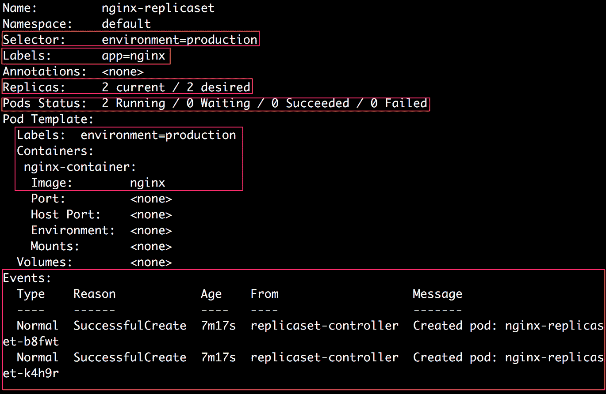

图 7.1：描述 nginx-replicaset

1.  接下来，我们将检查由此副本集创建的 Pod，并验证它们是否已按正确的配置创建。运行以下命令以获取正在运行的 Pod 的列表：

```
kubectl get pods
```

您应该看到以下响应：

```
NAME                     READY    STATUS   RESTARTS   AGE
nginx-replicaset-b8fwt   1/1      Running  0          38m
nginx-replicaset-k4h9r   1/1      Running  0          38m
```

1.  运行以下命令来描述其中一个 Pod，复制其名称：

```
kubectl describe pod <pod_name>
```

您应该看到类似以下的输出：

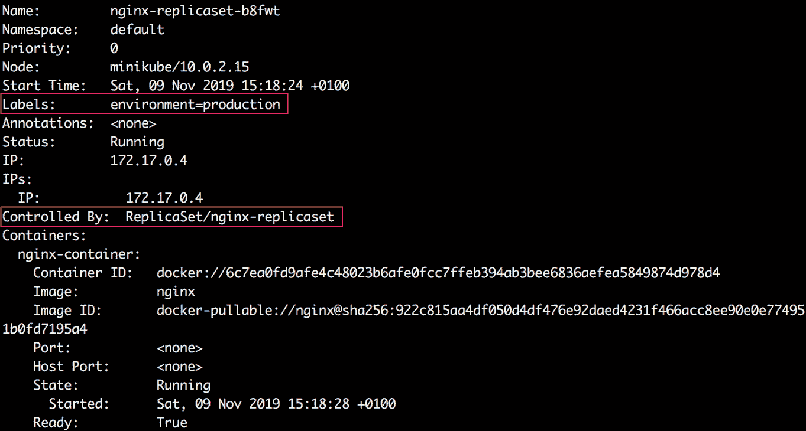

图 7.2：列出 Pods

在上述输出的突出部分中，我们可以清楚地看到该 Pod 具有`environment=production`标签，并由`ReplicaSet/nginx-replicaset`控制。

因此，在本练习中我们创建了一个简单的副本集。在接下来的子主题中，我们将逐步了解正在运行的副本集的突出部分。

### 副本集上的标签

考虑来自*图 7.1*中显示的输出的以下行：

```
Labels:       app=nginx
```

它显示了所期望的，副本集是通过一个名为`app`的标签键和值为`nginx`来创建的。

### 副本集的选择器

现在，考虑来自*图 7.1*中显示的输出的以下行：

```
Selector:     environment=production
```

这表明副本集配置了一个`environment=production`的 Pod 选择器。这意味着这个副本集将尝试获取具有这个标签的 Pod。

### 副本

考虑来自*图 7.1*中显示的输出的以下行：

```
Replicas:     2 current / 2 desired
```

我们可以看到副本集对于 Pod 的期望数量为`2`，并且还显示当前有两个副本存在。

### Pod 的状态

虽然`副本`字段只显示当前存在的 Pod 数量，`Pod 的状态`显示了这些 Pod 的实际状态：

```
Pods Status:  2 Running / 0 Waiting / 0 Succeeded / 0 Failed
```

我们可以看到当前有两个 Pod 在此副本集下运行。

### Pod 模板

现在，让我们考虑*图 7.1*中显示的输出的`Pod 模板`部分。我们可以看到 Pod 模板与配置中描述的相同。

### 事件

在*图 7.1*中显示的输出的最后一部分中，我们可以看到有两个事件，这表示创建了两个 Pod 以达到副本集中两个 Pod 的期望数量。

在上一个练习中，我们创建了一个副本集来维护一定数量的运行副本。现在，让我们考虑一种情况，即某些节点或 Pod 由于某种原因失败。我们将看到副本集在这种情况下的行为。

## 练习 7.02：删除 ReplicaSet 管理的 Pod

在这个练习中，我们将删除 ReplicaSet 管理的一个 Pod，以查看它的响应。这样，我们将模拟在 ReplicaSet 运行时单个或多个 Pod 失败的情况：

注意

在这个练习中，我们将假设您已经成功完成了上一个练习，因为我们将重用在那个练习中创建的 ReplicaSet。

1.  验证 ReplicaSet 创建的 Pod 是否仍在运行：

```
kubectl get pods
```

您应该看到类似于以下响应：

```
NAME                     READY    STATUS   RESTARTS   AGE
nginx-replicaset-9tgb9   1/1      Running  0          103s
nginx-replicaset-zdjb5   1/1      Running  0          103s
```

1.  使用以下命令删除第一个 Pod，以模拟运行时的 Pod 故障：

```
kubectl delete pod <pod_name>
```

您应该看到类似于以下的响应：

```
pod "nginx-replicaset-9tgb9" deleted
```

1.  描述 ReplicaSet 并检查事件：

```
kubectl describe rs nginx-replicaset
```

您应该看到类似于以下的输出：

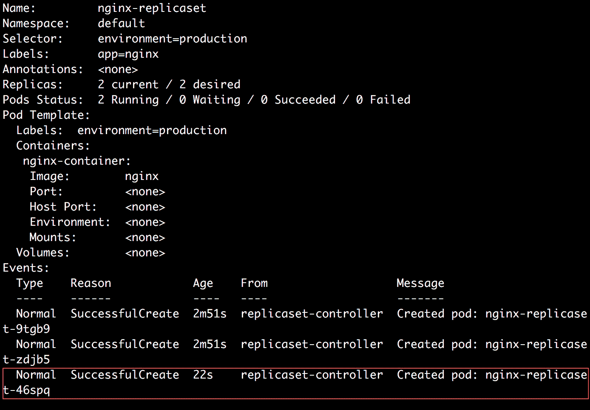

图 7.3：描述 ReplicaSet

在前面的输出中，我们可以看到在删除一个 Pod 之后，ReplicaSet 会使用 ReplicaSet 配置中“模板”部分的 Pod 配置创建一个新的 Pod。即使我们删除了 ReplicaSet 管理的所有 Pod，它们也会被重新创建。因此，要永久删除所有 Pod 并避免 Pod 的重新创建，我们需要删除 ReplicaSet 本身。

1.  运行以下命令删除 ReplicaSet：

```
kubectl delete rs nginx-replicaset
```

您应该看到以下响应：

```
replicaset.apps "nginx-replicaset" deleted
```

如前面的输出所示，`nginx-replicaset` ReplicaSet 已被删除。

1.  运行以下命令验证 ReplicaSet 管理的 Pod 也已被删除：

```
kubectl get pods
```

您应该得到以下响应：

```
No resources found in default namespace
```

从这个输出中可以看出，我们可以验证 Pod 已被删除。

假设您已经部署了一个用于测试的单个 Pod。现在，它已经准备好上线。您将从开发到生产应用所需的标签更改，并且现在您希望使用 ReplicaSet 来控制这一切。我们将在下面的练习中看到如何做到这一点。

## 练习 7.03：创建一个已存在匹配 Pod 的 ReplicaSet

在这个练习中，我们将创建一个与 ReplicaSet 中 Pod 模板匹配的 Pod，然后创建 ReplicaSet。我们的目标是证明新创建的 ReplicaSet 将获取现有的 Pod，并开始管理它，就好像它自己创建了该 Pod 一样。

为了成功完成这个练习，请执行以下步骤：

1.  创建一个名为`pod-matching-replicaset.yaml`的文件，内容如下：

```
apiVersion: v1
kind: Pod
metadata:
  name: pod-matching-replicaset
  labels:
    environment: production
spec:
  containers:
  - name: first-container
    image: nginx
```

1.  运行以下命令使用上述配置来创建 Pod：

```
kubectl create -f pod-matching-replicaset.yaml
```

你应该看到以下响应：

```
pod/pod-matching-replicaset created
```

1.  创建一个名为 `replicaset-nginx.yaml` 的文件，内容如下：

```
apiVersion: apps/v1
kind: ReplicaSet
metadata:
  name: nginx-replicaset
  labels:
    app: nginx
spec:
  replicas: 2
  selector:
    matchLabels:
      environment: production
  template:
    metadata:
      labels:
        environment: production
    spec:
      containers:
      - name: nginx-container
        image: nginx
```

1.  运行以下命令使用上述配置来创建 ReplicaSet：

```
kubectl create -f replicaset-nginx.yaml
```

你应该看到类似以下的响应：

```
replicaset.apps/nginx-replicaset created
```

这个输出表明 Pod 已经被创建。

1.  运行以下命令来检查 ReplicaSet 的状态：

```
kubectl get rs nginx-replicaset
```

你应该得到以下响应：

```
NAME               DESIRED   CURRENT   READY   AGE
nginx-replicaset   2         2         2       2
```

我们可以看到目前有两个由 ReplicaSet 管理的 Pod，符合预期。

1.  接下来，让我们使用以下命令来检查正在运行的 Pod：

```
kubectl get pods
```

你应该看到类似以下的输出：

```
NAME                     READY      STATUS    RESTARTS    AGE
nginx-replicaset-4dr7s   1/1        Running   0           28s
pod-matching-replicaset  1/1        Running   0           81s
```

在这个输出中，我们可以看到手动创建的名为 `pod-matching-replicaset` 的 Pod 仍在运行，并且 `nginx-replicaset` ReplicaSet 只创建了一个新的 Pod。

1.  接下来，我们将使用 `kubectl describe` 命令来检查名为 `pod-matching-replicaset` 的 Pod 是否被 ReplicaSet 管理：

```
kubectl describe pod pod-matching-replicaset
```

你应该看到类似以下的输出：

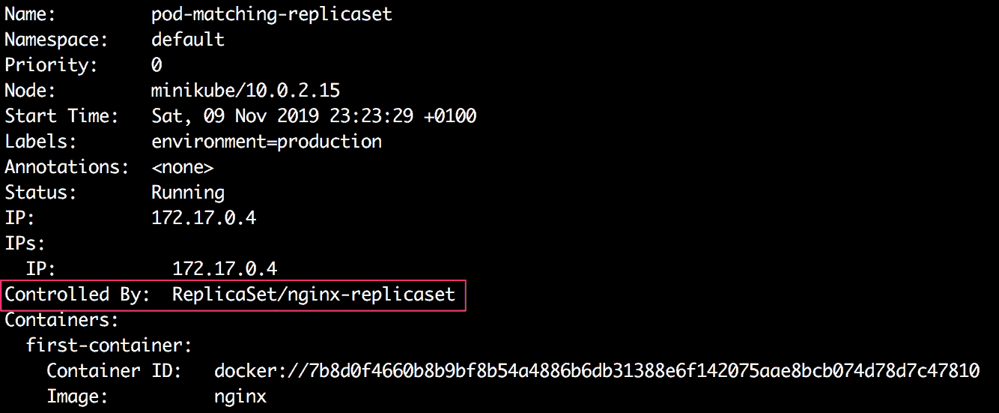

图 7.4：描述 Pod

在截断输出的突出部分中，我们可以看到即使这个 Pod 在 ReplicaSet 事件存在之前是手动创建的，现在这个 Pod 也是由 ReplicaSet 自己管理的。

1.  接下来，我们将描述 ReplicaSet，以查看它触发了多少个 Pod 的创建：

```
kubectl describe rs nginx-replicaset
```

你应该看到类似以下的输出：

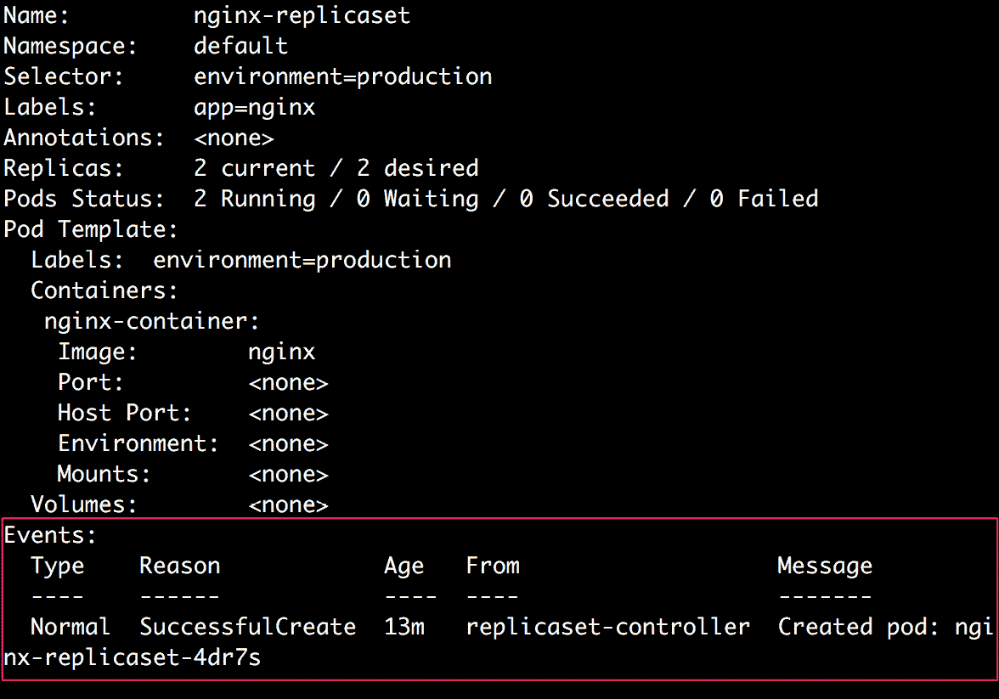

图 7.5：描述 ReplicaSet

1.  运行以下命令来删除 ReplicaSet 进行清理：

```
kubectl delete rs nginx-replicaset
```

你应该看到以下响应：

```
replicaset.apps "nginx-replicaset" deleted
```

因此，我们可以看到 ReplicaSet 能够获取现有的 Pod，只要它们符合标签选择器的条件。在存在更多匹配的 Pod 的情况下，ReplicaSet 将终止一些 Pod 以维持正在运行的 Pod 的总数。

另一个常见的操作是在之前创建的 ReplicaSet 上进行水平扩展。假设你创建了一个具有一定数量副本的 ReplicaSet，后来你需要有更多或更少的副本来管理增加或减少的需求。让我们看看如何在下一个练习中扩展副本的数量。

## 练习 7.04：在创建后扩展 ReplicaSet

在这个练习中，我们将创建一个具有两个副本的 ReplicaSet，然后修改它以增加副本的数量。然后，我们将减少副本的数量。

为了成功完成这个练习，请执行以下步骤：

1.  创建一个名为`replicaset-nginx.yaml`的文件，内容如下：

```
apiVersion: apps/v1
kind: ReplicaSet
metadata:
  name: nginx-replicaset
  labels:
    app: nginx
spec:
  replicas: 2
  selector:
    matchLabels:
      environment: production
  template:
    metadata:
      labels:
        environment: production
    spec:
      containers:
      - name: nginx-container
        image: nginx
```

1.  运行以下命令来使用`kubectl apply`命令创建 ReplicaSet，如前面的代码所述：

```
kubectl apply -f replicaset-nginx.yaml
```

你应该会得到以下响应：

```
replicaset.apps/nginx-replicaset created
```

1.  运行以下命令来检查所有现有的 Pod：

```
kubectl get pods
```

你应该会得到类似以下的响应：

```
NAME                     READY    STATUS    RESTARTS    AGE
nginx-replicaset-99tj7   1/1      Running   0           23s
nginx-replicaset-s4stt   1/1      Running   0           23s
```

我们可以看到有两个由副本集创建的 Pod。

1.  运行以下命令来扩展 ReplicaSet 的副本数量到`4`：

```
kubectl scale --replicas=4 rs nginx-replicaset
```

你应该会看到以下响应：

```
replicaset.apps/nginx-replicaset scaled
```

1.  运行以下命令来检查所有正在运行的 Pod：

```
kubectl get pods
```

你应该会看到类似以下的输出：

```
NAME                     READY    STATUS    RESTARTS    AGE
nginx-replicaset-99tj7   1/1      Running   0           75s
nginx-replicaset-klh6k   1/1      Running   0           21s
nginx-replicaset-lrqsk   1/1      Running   0           21s
nginx-replicaset-s4stt   1/1      Running   0           75s
```

我们可以看到现在总共有四个 Pod。在我们应用新配置后，ReplicaSet 创建了两个新的 Pod。

1.  接下来，让我们运行以下命令来将副本的数量缩减到`1`：

```
kubectl scale --replicas=1 rs nginx-replicaset
```

你应该会看到以下响应：

```
replicaset.apps/nginx-replicaset scaled
```

1.  运行以下命令来检查所有正在运行的 Pod：

```
kubectl get pods
```

你应该会看到类似以下的响应：

```
nginx-replicaset-s4stt   1/1      Running   0           11m
```

我们可以看到这一次，ReplicaSet 删除了所有超出期望数量`1`的 Pod，并只保留了一个副本在运行。

1.  运行以下命令来删除 ReplicaSet 以进行清理：

```
kubectl delete rs nginx-replicaset
```

你应该会看到以下响应：

```
replicaset.apps "nginx-replicaset" deleted
```

在这个练习中，我们已经成功地扩展和缩减了副本的数量。如果您的应用程序的流量增加或减少，这可能特别有用。

# 部署

部署是一个 Kubernetes 对象，它充当了 ReplicaSet 的包装器，并使其更容易使用。一般来说，为了管理复制的服务，建议您使用部署，而部署又管理 ReplicaSet 和 ReplicaSet 创建的 Pod。

使用 Deployment 的主要动机是它保留了修订版本的历史记录。每当对 ReplicaSet 或底层 Pod 进行更改时，Deployment 都会记录 ReplicaSet 的新修订版本。这样，使用 Deployment 可以轻松回滚到先前的状态或版本。请记住，每次回滚也会为 Deployment 创建一个新的修订版本。以下图表概述了管理容器化应用程序的不同对象的层次结构：

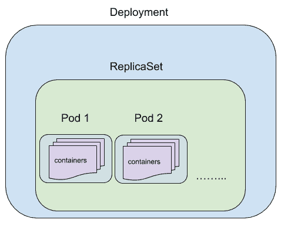

图 7.6：Deployment、ReplicaSet、Pod 和容器的层次结构

## Deployment 配置

Deployment 的配置实际上与 ReplicaSet 的配置非常相似。以下是一个 Deployment 配置的示例：

```
apiVersion: apps/v1
kind: Deployment
metadata:
  name: nginx-deployment
  labels:
    app: nginx
spec:
  replicas: 3
  strategy:
    type: RollingUpdate
    rollingUpdate:
      maxUnavailable: 1
      maxSurge: 1
  selector:
    matchLabels:
      app: nginx
      environment: production
  template:
    metadata:
      labels:
        app: nginx
        environment: production
    spec:
      containers:
      - name: nginx-container
        image: nginx
```

`kind`字段的值为`Deployment`。其余配置与 ReplicaSets 的配置相同。Deployments 还具有与 ReplicaSets 相同方式使用的`replicas`、`selector`和 Pod `template`字段。

### 策略

在`spec`下的`strategy`字段中，我们可以指定 Deployment 在用新的 Pod 替换旧的 Pod 时应使用的策略。这可以是`RollingUpdate`或`Recreate`。默认值为`RollingUpdate`。

**RollingUpdate**

这是一种用于更新 Deployment 而不会有任何停机时间的策略。使用`RollingUpdate`策略，控制器逐个更新 Pods。因此，在任何给定时间，总会有一些 Pod 在运行。当您想要更新 Pod 模板而不为应用程序带来任何停机时间时，这种策略特别有帮助。但是，请注意，进行滚动更新意味着可能会同时运行两个不同版本的 Pod（旧版本和新版本）。

如果应用程序提供静态信息，通常情况下这是可以接受的，因为使用两个不同版本的应用程序提供流量通常不会造成任何伤害，只要提供的信息是相同的。因此，对于这些应用程序，`RollingUpdate`通常是一个很好的策略。一般来说，我们可以将`RollingUpdate`用于新版本存储的数据可以被旧版本的应用程序读取和处理的应用程序。

以下是将策略设置为`RollingUpdate`的示例配置：

```
strategy:
  type: RollingUpdate
  rollingUpdate:
    maxUnavailable: 1
    maxSurge: 1
```

`maxUnavailable`是在更新期间可以不可用的 Pod 的最大数量。此字段可以指定为表示不可用 Pod 的最大数量的整数，也可以指定为表示可以不可用的总副本的百分比的字符串。对于前面的示例配置，Kubernetes 将确保在应用更新时不会有超过一个副本不可用。`maxUnavailable`的默认值为`25%`。

`maxSurge`是可以在所需的 Pod 数量（在`replicas`字段中指定）之上调度/创建的最大 Pod 数量。这个字段也可以指定为整数或百分比字符串，就像`maxUnavailable`一样。`maxSurge`的默认值也是`25%`。

因此，在前面的示例中，我们告诉 Kubernetes 控制器以一次一个 Pod 的方式更新 Pod，以便永远不会有超过一个 Pod 不可用，并且永远不会有超过四个 Pod 被调度。

`maxUnavailable`和`maxSurge`这两个参数可以用于调整部署的可用性和扩展部署的速度。例如，`maxUnavailable: 0`和`maxSurge: "30%"`可以确保快速扩展，同时始终保持所需的容量。`maxUnavailable: "15%"`和`maxSurge: 0`可以确保在不使用任何额外容量的情况下执行部署，但最多可能会有 15%的 Pod 不运行。

重新创建

在这种策略中，所有现有的 Pod 都被杀死，然后使用更新的配置创建新的 Pod。这意味着在更新期间会有一些停机时间。然而，这确保了部署中运行的所有 Pod 将是相同的版本（旧的或新的）。当与需要具有共享状态的应用程序 Pod 一起工作时，这种策略特别有用，因此我们不能同时运行两个不同版本的 Pod。可以指定此策略如下：

```
strategy:
  type: Recreate
```

使用“重新创建”更新策略的一个很好的用例是，如果我们需要在新代码可以使用之前运行一些数据迁移或数据处理。在这种情况下，我们需要使用“重新创建”策略，因为我们不能承受任何新代码与旧代码一起运行而没有先运行迁移或处理所有 Pod 的情况。

现在我们已经研究了部署配置中的不同字段，让我们在以下练习中实现它们。

## 练习 7.05：创建一个带有 Nginx 容器的简单部署

在这个练习中，我们将使用前一节中描述的配置创建我们的第一个部署 Pod。

要成功完成这个练习，请执行以下步骤：

1.  创建一个名为`nginx-deployment.yaml`的文件，内容如下：

```
apiVersion: apps/v1
kind: Deployment
metadata:
  name: nginx-deployment
  labels:
    app: nginx
spec:
  replicas: 3
  selector:
    matchLabels:
      app: nginx
      environment: production
  template:
    metadata:
      labels:
        app: nginx
        environment: production
    spec:
      containers:
      - name: nginx-container
        image: nginx
```

在这个配置中，我们可以看到部署将有三个带有`app: nginx`和`environment: production`标签的 Pod 的副本运行。

1.  运行以下命令以创建前面步骤中定义的部署：

```
kubectl apply -f nginx-deployment.yaml
```

你应该看到以下响应：

```
deployment.apps/nginx-deployment created
```

1.  运行以下命令以检查部署的状态：

```
kubectl get deployment nginx-deployment
```

你应该看到类似以下的响应：

```
NAME              READY    UP-TO-DATE    AVAILABLE   AGE
nginx-deployment  3/3      3             3           26m
```

1.  运行以下命令以检查所有正在运行的 Pod：

```
kubectl get pods
```

你应该看到类似以下的响应：

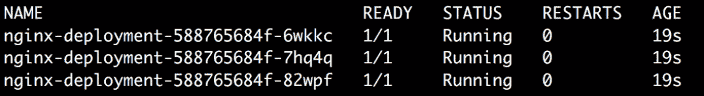

图 7.7：由部署创建的 Pod 列表

我们可以看到部署已经创建了三个 Pod，就像我们期望的那样。

让我们试着理解自动分配给 Pod 的名称。`nginx-deployment`创建了一个名为`nginx-deployment-588765684f`的 ReplicaSet。然后，ReplicaSet 创建了三个 Pod 的副本，每个 Pod 的名称都以 ReplicaSet 的名称为前缀，后跟一个唯一的标识符。

1.  现在我们已经创建了我们的第一个部署，让我们更详细地了解一下，以了解在创建过程中实际发生了什么。为了做到这一点，我们可以使用以下命令在终端中描述我们刚刚创建的部署：

```
kubectl describe rs nginx-deployment
```

你应该看到类似这样的输出：

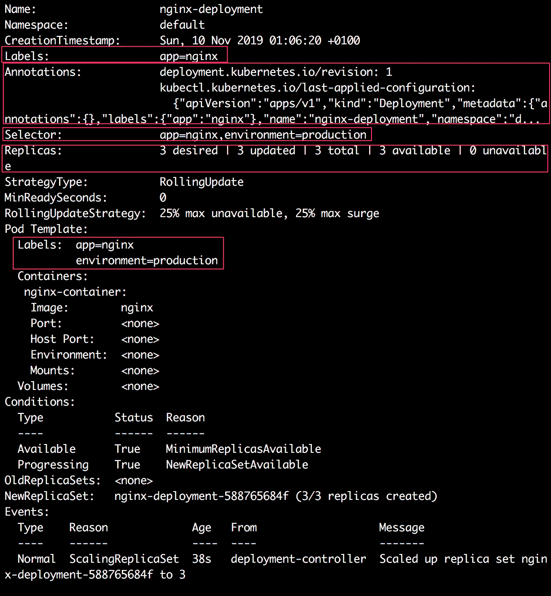

图 7.8：描述 nginx-deployment

此输出显示了我们刚刚创建的部署的各种细节。在接下来的子主题中，我们将逐步介绍前面输出的突出部分，以了解正在运行的部署。

### 部署上的标签和注释

与 ReplicaSets 类似，我们可以在*图 7.8*中显示的输出中看到以下行：

```
Labels:    app=nginx
```

这表明部署是使用`app=nginx`标签创建的。现在，让我们考虑输出中的下一个字段：

```
Annotations:    deployment.kubernetes.io/revision: 1
                kubectl.kubernetes.io/last-applied-configuration:
{"apiVersion":"apps/v1","kind":"Deployment","metadata":{"annotations":{},"labels":{"app":"nginx"},"name":"nginx-deployment","namespace":"d...
```

部署自动添加了两个注释。

**修订注释**

Kubernetes 控制器添加了一个带有`deployment.kubernetes.io/revision`键的注释，其中包含了特定部署的修订次数的信息。

**最后应用的配置注释**

控制器添加的另一个注释具有`kubectl.kubernetes.io/last-applied-configuration`键，其中包含应用于部署的最后配置（以 JSON 格式）。如果新的修订版本不起作用，此注释特别有助于将部署回滚到先前的修订版本。

### 部署的选择器

现在，考虑输出中*图 7.8*中显示的以下行：

```
Selector:    app=nginx,environment=production
```

这显示了部署配置的 Pod 选择器。因此，此部署将尝试获取具有这两个标签的 Pod。

### 副本

考虑输出中*图 7.8*中显示的以下行：

```
Replicas:    3 desired | 3 updated | 3 total | 3 available | 0 unavailable
```

我们可以看到，部署对于 Pod 的期望计数为`3`，并且还显示当前存在`3`个副本。

## 回滚部署

在实际场景中，当更改部署配置时可能会出错。您可以轻松撤消更改并回滚到先前稳定的部署修订版本。

我们可以使用`kubectl rollout`命令来检查修订历史和回滚。但是，为了使其工作，当我们使用任何`apply`或`set`命令修改部署时，我们还需要使用`--record`标志。此标志记录发布历史。然后，您可以使用以下命令查看发布历史：

```
kubectl rollout history deployment <deployment_name>
```

然后，我们可以使用以下命令撤消任何更新：

```
kubectl rollout undo deployment <deployment_name>
```

让我们在以下练习中更仔细地看看这是如何工作的：

## 练习 7.06：回滚部署

在这个练习中，我们将更新部署两次。我们将在第二次更新中故意出错，并尝试回滚到先前的修订版本：

1.  创建一个名为`app-deployment.yaml`的文件，内容如下：

```
apiVersion: apps/v1
kind: Deployment
metadata:
  name: app-deployment
  labels:
    environment: production
spec:
  replicas: 3
  selector:
    matchLabels:
      app: nginx
      environment: production
  template:
    metadata:
      labels:
        app: nginx
        environment: production
    spec:
      containers:
      - name: nginx-container
        image: nginx
```

1.  运行以下命令来创建部署：

```
kubectl apply -f app-deployment.yaml
```

您应该会看到以下响应：

```
deployment.apps/app-deployment created
```

1.  运行以下命令来检查新创建的部署的发布历史：

```
kubectl rollout history deployment app-deployment
```

您应该会看到以下响应：

```
deployment.apps/app-deployment
REVISION     CHANGE-CAUSE
1            <none>
```

此输出显示，截至目前，部署没有发布历史记录。

1.  对于第一次更新，让我们将容器的名称更改为`nginx`而不是`nginx-container`。使用以下内容更新`app-deployment.yaml`文件：

```
apiVersion: apps/v1
kind: Deployment
metadata:
  name: app-deployment
  labels:
    environment: production
spec:
  replicas: 3
  selector:
    matchLabels:
      app: nginx
      environment: production
  template:
    metadata:
      labels:
        app: nginx
        environment: production
    spec:
      containers:
      - name: nginx
        image: nginx
```

正如您所看到的，此模板中唯一更改的是容器的名称。

1.  使用`kubectl apply`命令应用更改的配置，并使用`--record`标志。`--record`标志确保将部署的更新记录在部署的发布历史中：

```
kubectl apply -f app-deployment.yaml --record
```

您应该看到以下响应：

```
deployment.apps/app-deployment configured
```

请注意，由 `--record` 标志维护的滚动历史与注释中存储的过去配置不同，我们在“部署的标签和注释”子部分中看到了这一点。

1.  等待几秒钟，让部署重新创建具有更新的 Pod 配置的 Pods，然后运行以下命令来检查部署的滚动历史：

```
kubectl rollout history deployment app-deployment
```

您应该看到以下响应：

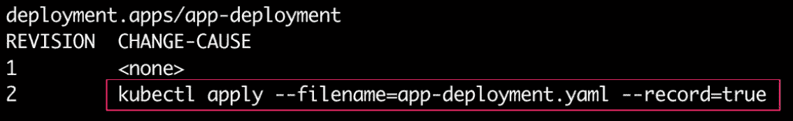

图 7.9：检查部署历史

在输出中，我们可以看到部署的第二个修订版本已经创建。它还跟踪了用于更新部署的命令。

1.  接下来，让我们更新部署，并假设我们在这样做时犯了一个错误。在这个例子中，我们将使用 `set image` 命令将容器镜像更新为 `ngnx`（注意有意的拼写错误），而不是 `nginx`：

```
kubectl set image deployment app-deployment nginx=ngnx --record
```

您应该看到以下响应：

```
deployment.apps/app-deployment image updated
```

1.  等待几秒钟，让 Kubernetes 重新创建新的容器，然后使用 `kubectl rollout status` 命令检查部署的滚动状态：

```
kubectl rollout status deployment app-deployment
```

您应该看到以下响应：

```
Waiting for deployment "app-deployment" rollout to finish: 1 out of 3 new replicas have been updated...
```

在这个输出中，我们可以看到新的副本都还没有准备好。按 *Ctrl* + *C* 退出并继续。

1.  运行以下命令检查 Pods 的状态：

```
kubectl get pods
```

您应该看到以下输出：

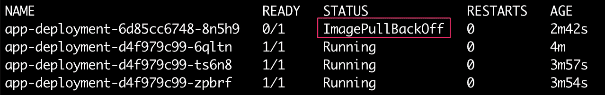

图 7.10：检查 Pods 的状态

我们可以在输出中看到，新创建的 Pod 出现了`ImagePullBackOff`错误，这意味着 Pods 无法拉取镜像。这是预期的，因为我们在镜像名称中有一个拼写错误。

1.  接下来，再次使用以下命令检查部署的修订历史：

```
kubectl rollout history deployment app-deployment
```

您应该看到以下响应：

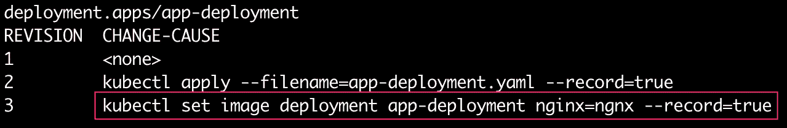

图 7.11：检查部署的滚动历史

我们可以看到使用包含拼写错误的 `set image` 命令创建了部署的第三个修订版本。现在，我们假装在更新部署时犯了一个错误，我们将看到如何撤消这个错误并回滚到部署的最后一个稳定修订版本。

1.  运行以下命令回滚到上一个修订版本：

```
kubectl rollout undo deployment app-deployment
```

您应该看到以下响应：

```
deployment.apps/app-deployment rolled back
```

正如我们在这个输出中所看到的，Deployment 没有回滚到以前的修订版本。为了练习，我们可能希望回滚到与以前的修订版本不同的修订版本。我们可以使用 `--to-revision` 标志来指定我们想要回滚到的修订版本号。例如，在前面的情况下，我们可以使用以下命令，结果将完全相同：

```
kubectl rollout undo deployment app-deployment --to-revision=2
```

1.  再次运行以下命令以检查 Deployment 的升级历史：

```
kubectl rollout history deployment app-deployment
```

你应该看到以下输出：

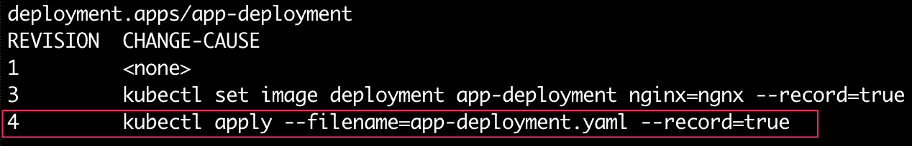

图 7.12：回滚后 Deployment 的升级历史

我们可以在这个输出中看到一个新的修订版本被创建，应用了之前的修订版本 2。我们可以看到修订版本 2 不再出现在修订版本列表中。这是因为升级总是以滚动向前的方式进行的。这意味着每当我们更新一个修订版本时，都会创建一个更高编号的新修订版本。同样，在回滚到修订版本 2 的情况下，修订版本 2 变成了修订版本 4。

在这个练习中，我们探索了许多与更新 Deployment、进行一些更改的滚动向前、跟踪 Deployment 历史、撤消一些更改以及回滚到以前修订版本相关的可能操作。

# StatefulSets

StatefulSets 用于管理有状态的副本。与 Deployment 类似，StatefulSet 从相同的 Pod 模板创建和管理指定数量的 Pod 副本。然而，StatefulSets 与 Deployments 的不同之处在于它们为每个 Pod 保持唯一的标识。因此，即使所有的 Pods 规格相同，它们也不是可互换的。每个 Pod 都有一个固定的标识，应用代码可以使用它来管理特定 Pod 上的应用状态。对于具有 *n* 个副本的 StatefulSet，每个 Pod 被分配一个介于 *0* 和 *n – 1* 之间的唯一整数序数。Pod 的名称反映了分配给它们的整数标识。创建 StatefulSet 时，所有的 Pods 都按照它们的整数序数顺序创建。

StatefulSet 管理的每个 Pod 都将保持它们的固定标识（整数序数），即使 Pod 重新启动。例如，如果特定的 Pod 崩溃或被删除，将创建一个新的 Pod，并分配与旧 Pod 相同的固定标识。

## StatefulSet 配置

StatefulSet 的配置也与 ReplicaSet 非常相似。以下是一个 StatefulSet 配置的示例：

```
apiVersion: apps/v1
kind: StatefulSet
metadata:
  name: example-statefulset
spec:
  replicas: 3
  selector:
    matchLabels:
      environment: production
  template:
    metadata:
      labels:
        environment: production
    spec:
      containers:
      - name: name-container
        image: image_name
```

正如我们在前面的配置中所看到的，StatefulSet 的`apiVersion`是`apps/v1`，`kind`是`StatefulSet`。其余字段的使用方式与 ReplicaSets 相同。

注意

在*第十四章*《在 Kubernetes 中运行有状态的组件》中，您将学习如何在多节点集群上实现 StatefulSets。

### StatefulSets 的用例

+   如果您需要持久存储，StatefulSets 非常有用。使用 StatefulSet，您可以将数据分区并存储在不同的 Pods 中。在这种情况下，一个 Pod 可能会关闭，一个新的 Pod 以相同的标识启动，并且具有之前由旧 Pod 存储的相同数据分区。

+   如果您需要有序的更新或扩展，也可以使用 StatefulSet。例如，如果您希望按照为它们分配的标识的顺序创建或更新 Pods，使用 StatefulSet 是一个好主意。

# DaemonSets

DaemonSets 用于管理集群中所有或选定节点上特定 Pod 的创建。如果我们配置一个 DaemonSet 在所有节点上创建 Pods，那么如果向集群添加新节点，将会创建新的 Pods 在这些新节点上运行。同样，如果一些节点从集群中移除，运行在这些节点上的 Pods 将被销毁。

## DaemonSets 的用例

+   日志记录：DaemonSet 最常见的用例之一是在所有节点上管理运行日志收集 Pod。这些 Pods 可用于从所有节点收集日志，然后在日志处理管道中处理它们。

+   本地数据缓存：DaemonSet 也可以用于在所有节点上管理缓存 Pod。其他应用 Pods 可以使用这些 Pods 来临时存储缓存数据。

+   监控：DaemonSet 的另一个用例是在所有节点上管理运行监控 Pod。这可用于收集特定节点上运行的 Pod 的系统或应用级别指标。

## DaemonSet 配置

DaemonSet 的配置也与 ReplicaSet 或 Deployment 非常相似。以下是一个 DaemonSet 配置的示例：

```
apiVersion: apps/v1
kind: DaemonSet
metadata:
  name: daemonset-example
  labels:
    app: daemonset-example
spec:
  selector:
    matchLabels:
      app: daemonset-example
  template:
    metadata:
      labels:
        app: daemonset-example
    spec:
      containers:
      - name: busybox-container
        image: busybox
        args:
        - /bin/sh
        - -c
        - sleep 10000
```

正如我们在前面的配置中所看到的，DaemonSet 的`apiVersion`设置为`apps/v1`，`kind`设置为`DaemonSet`。其余字段的使用方式与 ReplicaSets 相同。

为了限制本书的范围，我们不会涵盖实现 DaemonSets 的详细信息。

在本章中，您已经了解了 ReplicaSets，它帮助我们管理运行应用程序的多个 Pod 副本，以及 Deployment 如何作为 ReplicaSet 的包装器添加一些功能来控制更新的发布和维护更新历史记录，并在需要时回滚。然后，我们了解了 StatefulSets，如果我们需要将每个副本视为唯一实体，则非常有用。我们还了解了 DaemonSets 如何允许我们在每个节点上调度一个 Pod。

所有这些控制器都有一个共同的特点——它们对于需要持续运行的应用程序或工作负载非常有用。然而，一些工作负载具有优雅的结论，任务完成后无需保持 Pod 运行。为此，Kubernetes 有一个称为 Job 的控制器。让我们在下一节中看看这个。

# Jobs

Job 是 Kubernetes 中的一个监督者，可以用来管理应该运行确定任务然后优雅终止的 Pod。Job 创建指定数量的 Pod，并确保它们成功完成其工作负载或任务。当创建 Job 时，它会创建并跟踪其配置中指定的 Pod。当指定数量的 Pod 成功完成时，Job 被视为完成。如果 Pod 因底层节点故障而失败，Job 将创建一个新的 Pod 来替换它。这也意味着在 Pod 上运行的应用程序或代码应该能够优雅地处理在进程运行时出现新的 Pod 的情况。

Job 创建的 Pod 在作业完成后不会被删除。Pod 会运行到完成并以“已完成”状态留在集群中。

Job 可以以几种不同的方式使用：

+   最简单的用例是创建一个只运行一个 Pod 直到完成的 Job。如果正在运行的 Pod 失败，Job 将只创建额外的新 Pod。例如，Job 可用于一次性或定期数据分析工作或用于机器学习模型的训练。

+   Job 也可以用于并行处理。我们可以指定多个成功的 Pod 完成，以确保 Job 仅在一定数量的 Pod 成功终止时才完成。

## Job 配置

Job 的配置遵循与 ReplicaSet 或 Deployment 类似的模式。以下是 Job 配置的示例：

```
apiVersion: batch/v1
kind: Job
metadata:
  name: one-time-job
spec:
  template:
    spec:
      containers:
      - name: busybox-container
        image: busybox
        args:
        - /bin/sh
        - -c
        - date
      restartPolicy: OnFailure
```

作业对象的`apiVersion`字段设置为`batch/v1`。`batch` API 组包含与批处理作业相关的对象。`kind`字段设置为`Job`。

### 机器学习中作业的用例

作业非常适合批处理过程 - 在退出之前运行一定时间的过程。这使得作业非常适合许多类型的生产机器学习任务，如特征工程、交叉验证、模型训练和批量推断。例如，您可以创建一个 Kubernetes 作业来训练一个机器学习模型，并将模型和训练元数据持久化到外部存储。然后，您可以创建另一个作业来执行批量推断。这个作业将创建一个 Pod，从存储中获取预训练模型，将模型和数据加载到内存中，执行推断，并存储预测结果。

## 练习 7.07：创建一个在有限时间内完成的简单作业

在这个练习中，我们将创建我们的第一个作业，该作业将运行一个简单等待 10 秒然后完成的容器。

要成功完成此练习，请执行以下步骤：

1.  创建一个名为`one-time-job.yaml`的文件，内容如下：

```
apiVersion: batch/v1
kind: Job
metadata:
  name: one-time-job
spec:
  template:
    spec:
      containers:
      - name: busybox-container
        image: busybox
        args:
        - /bin/sh
        - -c
        - date; sleep 20; echo "Bye"
      restartPolicy: OnFailure
```

1.  运行以下命令，使用`kubectl apply`命令创建部署：

```
kubectl apply -f one-time-job.yaml
```

您应该看到以下响应：

```
job.batch/one-time-job created
```

1.  运行以下命令以检查作业的状态：

```
kubectl get jobs
```

您应该看到类似于这样的响应：

```
NAME           COMPLETIONS    DURATION    AGE
one-time-job   0/1            3s          3s
```

我们可以看到作业需要一个完成，并且尚未完成。

1.  运行以下命令来检查运行作业的 Pod 的状态：

```
kubectl get pods
```

请注意，您应该在作业完成之前运行此命令以查看此处显示的响应：

```
NAME                READY    STATUS    RESTARTS    AGE
one-time-job-bzz8l  1/1      Running   0           7s
```

我们可以看到作业已经创建了一个名为`one-time-job-bzz8l`的 Pod 来运行作业模板中指定的任务。

1.  接下来，运行以下命令来检查由作业创建的 Pod 的日志：

```
kubectl logs -f <pod_name>
```

您应该看到类似以下的日志：

```
Sun   Nov 10 15:20:19 UTC 2019
Bye
```

我们可以看到 Pod 打印了日期，等待了 20 秒，然后在终端打印了`Bye`。

1.  让我们使用以下命令再次检查作业的状态：

```
kubectl get job one-time-job
```

您应该看到类似于这样的响应：

```
NAME           COMPLETIONS     DURATION    AGE
one-time-job   1/1             24s         14m
```

我们可以看到作业现在已经完成。

1.  运行以下命令以验证 Pod 是否已完成运行：

```
kubectl get pods
```

您应该看到类似于这样的响应：

```
NAME                 READY    STATUS     RESTARTS    AGE
one-time-job-whw79   0/1      Completed  0           32m
```

我们可以看到 Pod 的状态为`Completed`。

1.  运行以下命令以删除作业（以及它创建的 Pod）进行清理：

```
kubectl delete job one-time-job
```

您应该看到以下响应：

```
job.batch "one-time-job" deleted
```

在这个练习中，我们创建了一个一次性作业，并验证了作业创建的 Pod 是否运行完成。为了简洁起见，我们将不在本次研讨会中实施并行任务的作业。

接下来，让我们通过一个活动来总结本章，我们将在其中创建一个部署，并汇集本章学到的几个想法。

## 活动 7.01：创建运行应用程序的部署

考虑这样一个情景，你正在与产品/应用团队合作，他们现在准备将他们的应用投入生产，并需要你的帮助以可复制和可靠的方式部署它。在本练习范围内，考虑应用的以下要求：

+   默认副本数量应为 6。

+   为简单起见，您可以使用`nginx`镜像来运行 Pod 中的容器。

+   确保所有 Pod 都具有以下两个标签及其对应的值：

```
chapter=controllers
activity=1
```

+   部署的更新策略应为`RollingUpdate`。最坏的情况下，Pod 的数量不应该超过一半，同样，在任何时候都不应该超过期望 Pod 数量的 150%。

一旦部署创建完成，您应该能够执行以下任务：

+   将副本数量扩展到 10。

+   将副本数量缩减到 5。

注意

理想情况下，您希望将此部署创建在不同的命名空间中，以使其与您在先前练习中创建的其他内容分开。因此，可以随意创建一个命名空间，并在该命名空间中创建部署。

以下是执行此活动的高级步骤：

1.  为此活动创建一个命名空间。

1.  编写部署配置。确保它满足所有指定的要求。

1.  使用上一步的配置创建部署。

1.  验证部署创建了六个 Pod。

1.  执行前面提到的两个任务，并在每个步骤执行后验证 Pod 的数量。

您应该能够获取 Pod 的列表，以检查是否可以扩展 Pod 的数量，如下图所示：

图 7.13：检查 Pod 的数量是否扩展

](image/B14870_07_13.jpg)

图 7.13：检查 Pod 的数量是否扩展

同样，您还应该能够缩减并检查 Pod 的数量，如下所示：

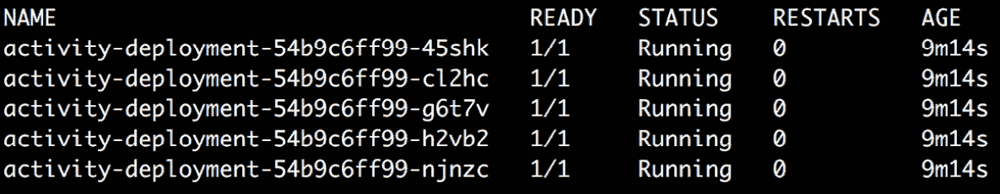

](image/B14870_07_14.jpg)

图 7.14：检查 Pod 数量是否缩减

注意

此活动的解决方案可在以下地址找到：[`packt.live/304PEoD`](https://packt.live/304PEoD)。

# 总结

Kubernetes 将 Pod 视为短暂的实体，理想情况下，您不应该在单个 Pod 中部署任何应用程序或微服务。Kubernetes 提供了各种控制器来利用各种好处，包括自动复制、健康监控和自动扩展。

在本章中，我们介绍了不同类型的控制器，并了解了何时使用每种控制器。我们创建了 ReplicaSets，并观察了它们如何管理 Pods。我们学会了何时使用 DaemonSets 和 StatefulSets。我们还创建了一个 Deployment，并学会了如何扩展和缩减副本的数量，以及如何回滚到 Deployment 的早期版本。最后，我们学会了如何为一次性任务创建 Jobs。当您在即将到来的章节中看到时，所有这些控制器都将在您想要部署生产就绪的应用程序或工作负载时发挥作用。

在下一章中，我们将看到如何发现和访问由 Deployment 或 ReplicaSet 管理的 Pods 或副本。
