# 第八章：8. 服务发现

概述

在本章中，我们将看看如何在先前章节中创建的各种对象之间路由流量，并使它们能够在集群内外被发现。本章还介绍了 Kubernetes 服务的概念，并解释了如何使用它们来公开使用部署控制器部署的应用程序。通过本章的学习，您将能够使您的应用程序对外部世界可访问。您还将了解不同类型的服务，并能够使用它们使不同的 Pod 集合相互交互。

# 介绍

在过去的几章中，我们学习了有关 Pod 和部署的知识，这有助于我们运行容器化应用程序。现在我们已经具备了部署我们的应用程序的能力，在本章中，我们将研究一些 API 对象，这些对象可以帮助我们进行网络设置，以确保我们的用户可以访问我们的应用程序，并且我们应用程序的不同组件以及不同的应用程序可以一起工作。

正如我们在之前的章节中所看到的，每个 Kubernetes Pod 都有其 IP 地址。然而，设置网络并连接所有内容并不像编写 Pod IP 地址那样简单。我们不能依赖单个 Pod 可靠地运行我们的应用程序。因此，我们使用部署来确保在任何给定时刻，我们将在集群中运行特定类型的 Pod 的固定数量。然而，这意味着在应用程序运行时，我们可以容忍一定数量的 Pod 失败，因为新的 Pod 会自动创建以取代它们。因此，这些 Pod 的 IP 地址不会保持不变。例如，如果我们有一组运行前端应用程序的 Pod，需要与集群内运行后端应用程序的另一组 Pod 进行通信，我们需要找到一种方法使这些 Pod 可被发现。

为了解决这个问题，我们使用 Kubernetes 服务。服务允许我们使一组逻辑 Pod（例如，所有由部署管理的 Pod）可被发现，并且可以被集群内运行的其他 Pod 或外部世界访问。

# 服务

服务定义了一组逻辑 Pod 可以被访问的策略。Kubernetes 服务使我们的应用程序的各个组件之间以及不同应用程序之间进行通信。服务帮助我们将应用程序与其他应用程序或用户连接起来。例如，假设我们有一组运行应用程序前端的 Pod，一组运行后端的 Pod，以及另一组连接数据源的 Pod。前端是用户需要直接交互的部分。然后前端需要连接到后端，后端又需要与外部数据源进行通信。

假设您正在制作一个调查应用程序，该应用程序还允许用户根据其调查结果进行可视化。使用一点简化，我们可以想象三个部署 - 一个运行表单前端以收集数据，另一个验证和存储数据，第三个运行数据可视化应用程序。以下图表应该帮助您想象服务如何在路由流量和公开不同组件方面发挥作用：

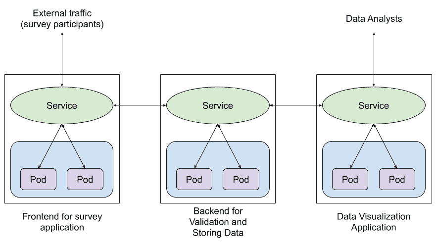

图 8.1：使用服务将流量路由到集群内部和集群内部

因此，服务的抽象有助于保持应用程序的不同部分解耦，并使它们之间能够进行通信。在传统（非 Kubernetes）环境中，您可能期望不同的组件通过运行不同资源的不同 VM 或裸金属机器的 IP 地址相互链接。在使用 Kubernetes 时，将不同资源链接在一起的主要方式是使用标签和标签选择器，这允许部署轻松替换失败的 Pod 或根据需要扩展部署的数量。因此，您可以将服务视为 IP 地址和基于标签选择器的不同资源链接机制之间的翻译层。因此，您只需指向一个服务，它将负责将流量路由到适当的应用程序，而不管与应用程序关联的副本 Pod 的数量或这些 Pod 运行在哪些节点上。

## 服务配置

与 Pod、ReplicaSets 和部署的配置类似，服务的配置也包含四个高级字段；即`apiVersion`、`kind`、`metadata`和`spec`。

以下是服务的示例清单：

```
apiVersion: v1
kind: Service
metadata:
  name: sample-service
spec:
  ports:
    - port: 80
      targetPort: 80
  selector:
      key: value
```

对于一个服务，`apiVersion`是`v1`，`kind`总是`Service`。在`metadata`字段中，我们将指定服务的名称。除了名称，我们还可以在`metadata`字段中添加`labels`和`annotations`。

`spec`字段的内容取决于我们想要创建的服务类型。在下一节中，我们将了解不同类型的服务并理解`spec`字段的配置的各个部分。

## 服务类型

有四种不同类型的服务：

+   **NodePort**：这种类型的服务使内部 Pod 在其所在的节点上的端口上可访问。

+   **ClusterIP**：这种类型的服务在集群内的特定 IP 上暴露服务。这是默认的服务类型。

+   **LoadBalancer**：这种类型的服务使用云提供商提供的负载均衡器在外部暴露应用程序。

+   **ExternalName**：这种类型的服务指向 DNS 而不是一组 Pod。其他类型的服务使用标签选择器来选择要暴露的 Pod。这是一种特殊类型的服务，默认情况下不使用任何选择器。

我们将在接下来的章节中更仔细地看看所有这些服务。

## NodePort 服务

NodePort 服务在集群中的所有节点上都使用相同的端口暴露应用程序。Pod 可能在集群中的所有节点或部分节点上运行。

在一个简化的情况下，集群中只有一个节点时，服务会在服务配置的端口上暴露所有选定的 Pod。然而，在更实际的情况下，Pod 可能在多个节点上运行，服务跨越所有节点并在所有节点上的特定端口上暴露 Pod。这样，应用程序可以使用以下 IP/端口组合从 Kubernetes 集群外部访问：`<NodeIP>:<NodePort>`。

一个示例服务的`config`文件看起来像这样：

```
apiVersion: v1
kind: Service
metadata:
  name: nginx-service
spec:
  type: NodePort
  ports:
    - targetPort: 80
      port: 80
nodePort: 32023
  selector:
      app: nginx
      environment: production
```

正如我们所看到的，`NodePort`服务的定义中涉及了三个端口。让我们来看看这些：

+   `targetPort`：这个字段代表了 Pod 上运行的应用程序暴露的端口。这是服务转发请求的端口。默认情况下，`targetPort`设置为与`port`字段相同的值。

+   `port`：这个字段代表了服务本身的端口。

+   `nodePort`：这个字段代表了我们可以用来访问服务本身的节点上的端口。

除了端口，服务`spec`部分还有另一个字段叫做`selector`。这个部分用于指定一个 Pod 需要具有哪些标签，才能被服务选中。一旦这个服务被创建，它将识别所有具有`app: nginx`和`environment: production`标签的 Pod，并为所有这样的 Pod 添加端点。我们将在下一个练习中更详细地了解端点。

## 练习 8.01：使用 Nginx 容器创建一个简单的 NodePort 服务

在这个练习中，我们将创建一个简单的 NodePort 服务，使用 Nginx 容器。默认情况下，Nginx 容器在 Pod 上暴露端口`80`，并显示一个 HTML 页面，上面写着`Welcome to nginx!`。我们将确保我们可以从本地机器的浏览器访问该页面。

要成功完成这个练习，请执行以下步骤：

1.  创建一个名为`nginx-deployment.yaml`的文件，内容如下：

```
apiVersion: apps/v1
kind: Deployment
metadata:
  name: nginx-deployment
  labels:
    app: nginx
spec:
  replicas: 3
  strategy:
    type: Recreate
  selector:
    matchLabels:
      app: nginx
      environment: production
  template:
    metadata:
      labels:
        app: nginx
        environment: production
    spec:
      containers:
      - name: nginx-container
        image: nginx
```

1.  运行以下命令使用`kubectl apply`命令创建部署：

```
kubectl apply -f nginx-deployment.yaml
```

您应该得到以下输出：

```
deployment.apps/nginx-deployment created
```

正如我们所看到的，`nginx-deployment`已经被创建。

1.  运行以下命令验证部署是否创建了三个副本：

```
kubectl get pods
```

您应该看到类似以下的响应：

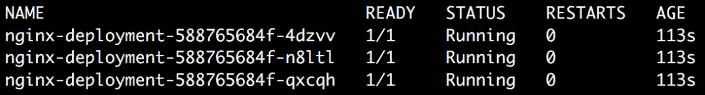

图 8.2：获取所有 Pod

1.  创建一个名为`nginx-service-nodeport.yaml`的文件，内容如下：

```
apiVersion: v1
kind: Service
metadata:
  name: nginx-service-nodeport
spec:
  type: NodePort
  ports:
    - port: 80
      targetPort: 80
      nodePort: 32023
  selector:
      app: nginx
      environment: production
```

1.  运行以下命令来创建服务：

```
kubectl create -f nginx-service-nodeport.yaml
```

您应该看到以下输出：

```
service/nginx-service-nodeport created
```

或者，我们可以使用`kubectl expose`命令来暴露一个部署或一个 Pod，使用 Kubernetes 服务。以下命令还将创建一个名为`nginx-service-nodeport`的 NodePort 服务，`port`和`targetPort`设置为`80`。唯一的区别是，这个命令不允许我们自定义`nodePort`字段。使用`kubectl expose`命令创建服务时，`nodePort`会自动分配：

```
kubectl expose deployment nginx-deployment --name=nginx-service-nodeport --port=80 --target-port=80 --type=NodePort
```

如果我们使用这个命令创建服务，我们将能够在下一步中找出`nodePort`自动分配给服务的是什么。

1.  运行以下命令以验证服务是否已创建：

```
kubectl get service
```

这应该会得到类似以下的响应：

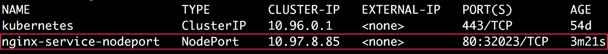

图 8.3：获取 NodePort 服务

您可以忽略名为`kubernetes`的额外服务，这个服务在我们创建服务之前已经存在。这个服务用于在集群内部暴露 Kubernetes API。

1.  运行以下命令以验证 Service 是否以正确的配置创建：

```
kubectl describe service nginx-service-nodeport
```

这应该给我们以下输出：

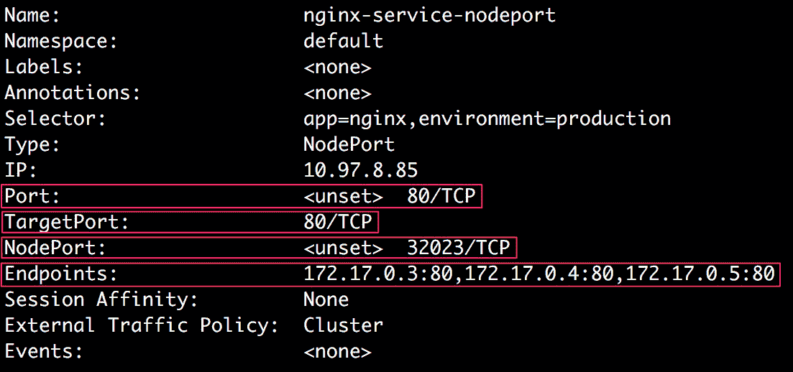

图 8.4：描述 NodePort 服务

在输出的突出显示部分，我们可以确认 Service 是使用正确的`Port`，`TargetPort`和`NodePort`字段创建的。

还有另一个字段叫做`Endpoints`。我们可以看到这个字段的值是一个 IP 地址列表；即`172.17.0.3:80`，`172.17.0.4:80`和`172.17.0.5:80`。这些 IP 地址分别指向由`nginx-deployment`创建的三个 Pod 分配的 IP 地址，以及所有这些 Pod 公开的目标端口。我们可以使用`kubectl get pods`命令以及`custom-columns`输出格式来获取所有三个 Pod 的 IP 地址。我们可以使用`status.podIP`字段创建自定义列输出，该字段包含正在运行的 Pod 的 IP 地址。

1.  运行以下命令以查看所有三个 Pod 的 IP 地址：

```
kubectl get pods -o custom-columns=IP:status.podIP
```

您应该看到以下输出：

```
IP
172.17.0.4
172.17.0.3
172.17.0.5
```

因此，我们可以看到 Service 的`Endpoints`字段实际上指向我们三个 Pod 的 IP 地址。

正如我们所知，在 NodePort 服务的情况下，我们可以使用节点的 IP 地址和服务在节点上公开的端口来访问 Pod 的应用程序。为此，我们需要找出 Kubernetes 集群中节点的 IP 地址。

1.  运行以下命令以获取本地运行的 Kubernetes 集群的 IP 地址：

```
minikube ip
```

您应该看到以下响应：

```
192.168.99.100
```

1.  运行以下命令，使用`curl`发送请求到我们从上一步获得的 IP 地址的端口`32023`：

```
curl 192.168.99.100:32023
```

您应该会收到 Nginx 的响应：

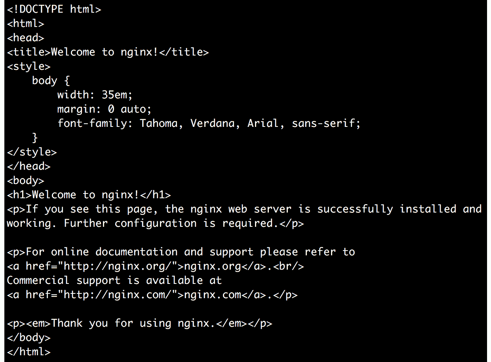

图 8.5：发送 curl 请求以检查 NodePort 服务

1.  最后，打开浏览器并输入`192.168.99.100:32023`，以确保我们可以进入以下页面：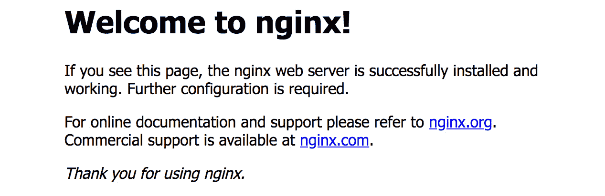

图 8.6：在浏览器中访问应用程序

注意

理想情况下，您希望为每个练习和活动创建不同的命名空间中的对象，以使它们与您的其他对象分开。因此，可以随意创建一个命名空间并在该命名空间中创建部署。或者，您可以确保清理掉以下命令中显示的任何对象，以确保没有干扰。

1.  删除部署和服务，以确保在本章节的其余练习中你在干净的环境中工作：

```
kubectl delete deployment nginx-deployment
```

你应该看到以下响应：

```
deployment.apps "nginx-deployment" deleted
```

现在，使用以下命令删除该服务：

```
kubectl delete service nginx-service-nodeport
```

你应该看到这个响应：

```
service "nginx-service-nodeport" deleted
```

在这个练习中，我们创建了一个具有三个 Nginx 容器副本的部署（这可以替换为在容器中运行的任何真实应用程序），并使用 NodePort 服务暴露了该应用程序。

## ClusterIP 服务

正如我们之前提到的，ClusterIP 服务会在集群内部暴露运行在 Pod 上的应用程序的 IP 地址。这使得 ClusterIP 服务成为在同一集群内不同类型的 Pod 之间进行通信的良好选择。

例如，让我们考虑一个简单调查应用的例子。假设我们有一个调查应用，用于向用户展示表单，用户可以在其中填写调查。它运行在由`survey-frontend`部署管理的一组 Pod 上。我们还有另一个应用，负责验证和存储用户填写的数据。它运行在由`survey-backend`部署管理的一组 Pod 上。这个后端应用需要被调查前端应用内部访问。我们可以使用 ClusterIP 服务来暴露后端应用，以便前端 Pod 可以使用单个 IP 地址轻松访问后端应用。

### 服务配置

以下是 ClusterIP 服务配置的示例：

```
apiVersion: v1
kind: Service
metadata:
  name: nginx-service
spec:
  type: ClusterIP
  ports:
    - targetPort: 80
      port: 80
  selector:
      app: nginx
      environment: production
```

服务的`type`设置为`ClusterIP`。这种类型的服务只需要两个端口：`targetPort`和`port`。它们分别代表了应用程序在 Pod 上暴露的端口和在给定集群 IP 上创建的服务的端口。

与 NodePort 服务类似，ClusterIP 服务的配置也需要一个`selector`部分，用于决定服务选择哪些 Pod。在这个例子中，这个服务将选择所有具有`app: nginx`和`environment: production`标签的 Pod。我们将根据类似的示例在下一个练习中创建一个简单的 ClusterIP 服务。

## 练习 8.02：使用 Nginx 容器创建一个简单的 ClusterIP 服务

在这个练习中，我们将使用 Nginx 容器创建一个简单的 ClusterIP 服务。默认情况下，Nginx 容器在 Pod 上暴露端口`80`，显示一个 HTML 页面，上面写着`Welcome to nginx!`。我们将确保我们可以使用`curl`命令从 Kubernetes 集群内部访问该页面。让我们开始吧：

1.  创建一个名为`nginx-deployment.yaml`的文件，内容如下：

```
apiVersion: apps/v1
kind: Deployment
metadata:
  name: nginx-deployment
  labels:
    app: nginx
spec:
  replicas: 3
  strategy:
    type: Recreate
  selector:
    matchLabels:
      app: nginx
      environment: production
  template:
    metadata:
      labels:
        app: nginx
        environment: production
    spec:
      containers:
      - name: nginx-container
        image: nginx
```

1.  运行以下命令，使用`kubectl apply`命令创建部署：

```
kubectl create -f nginx-deployment.yaml
```

您应该看到以下响应：

```
deployment.apps/nginx-deployment created
```

1.  运行以下命令以验证部署是否已创建三个副本：

```
kubectl get pods
```

您应该看到类似以下的输出：

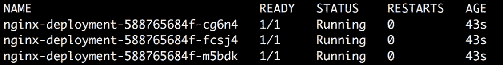

图 8.7：获取所有 Pod

1.  创建一个名为`nginx-service-clusterip.yaml`的文件，内容如下：

```
apiVersion: v1
kind: Service
metadata:
  name: nginx-service-clusterip
spec:
  type: ClusterIP
  ports:
    - port: 80
      targetPort: 80
  selector:
      app: nginx
      environment: production
```

1.  运行以下命令以创建服务：

```
kubectl create -f nginx-service-clusterip.yaml
```

您应该看到以下响应：

```
service/nginx-service-clusterip created
```

1.  运行以下命令以验证服务是否已创建：

```
kubectl get service
```

您应该看到以下响应：

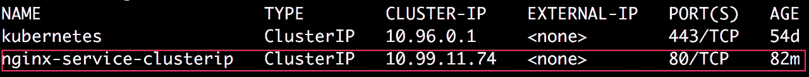

图 8.8：获取 ClusterIP 服务

1.  运行以下命令以验证服务是否已使用正确的配置创建：

```
kubectl describe service nginx-service-clusterip
```

您应该看到以下响应：

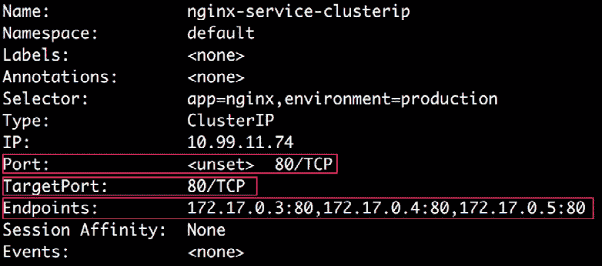

图 8.9：描述 ClusterIP 服务

我们可以看到服务已使用正确的`Port`和`TargetPort`字段创建。在`Endpoints`字段中，我们可以看到 Pod 的 IP 地址，以及这些 Pod 上的目标端口。

1.  运行以下命令以查看所有三个 Pod 的 IP 地址：

```
kubectl get pods -o custom-columns=IP:status.podIP
```

您应该看到以下响应：

```
IP
172.17.0.5
172.17.0.3
172.17.0.4
```

因此，我们可以看到服务的`Endpoints`字段实际上指向我们三个 Pod 的 IP 地址。

1.  运行以下命令以获取服务的集群 IP：

```
kubectl get service nginx-service-clusterip
```

这将产生以下输出：


图 8.10：从服务获取集群 IP

正如我们所看到的，服务的集群 IP 是`10.99.11.74`。

我们知道，在 ClusterIP 服务的情况下，我们可以从集群内部访问其端点上运行的应用程序。因此，我们需要进入集群以检查这是否真的有效。

1.  运行以下命令通过 SSH 访问`minikube`节点：

```
minikube ssh
```

你会看到以下响应：

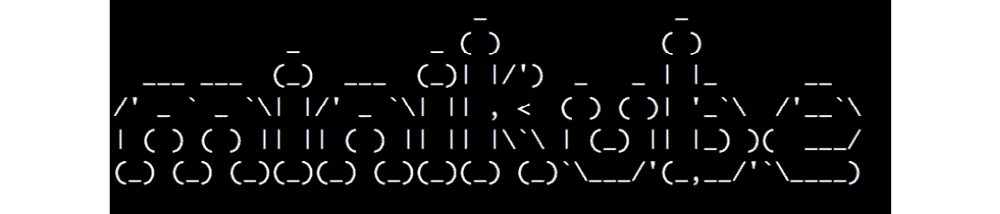

图 8.11：SSH 进入 minikube 节点

1.  现在我们在集群内部，我们可以尝试访问服务的集群 IP 地址，看看我们是否可以访问运行 Nginx 的 Pods：

```
curl 10.99.11.74
```

应该看到来自 Nginx 的以下响应：

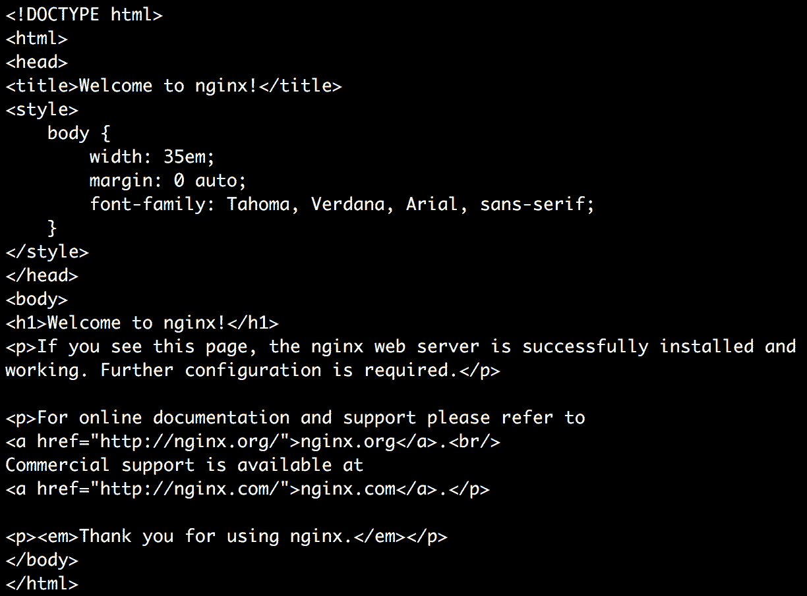

图 8.12：从集群内部向服务发送 curl 请求

在这里，我们可以看到`curl`返回默认 Nginx 欢迎页面的 HTML 代码。因此，我们可以成功访问我们的 Nginx Pods。接下来，我们将删除 Pods 和 Services。

1.  运行以下命令退出 minikube 内部的 SSH 会话：

```
exit
```

1.  删除部署和服务，以确保在本章的后续练习中您正在处理干净的环境：

```
kubectl delete deployment nginx-deployment
```

你应该看到以下响应：

```
deployment.apps "nginx-deployment" deleted
```

使用以下命令删除服务：

```
kubectl delete service nginx-service-clusterip
```

你应该看到以下响应：

```
service "nginx-service-clusterip" deleted
```

在这个练习中，我们能够在单个 IP 地址上公开运行在多个 Pods 上的应用程序。这可以被同一集群内运行的所有其他 Pods 访问。

### 为服务选择自定义 IP 地址

在上一个练习中，我们看到服务是使用 Kubernetes 集群内的随机可用 IP 地址创建的。如果需要，我们也可以指定 IP 地址。如果我们已经为特定地址有 DNS 条目并且想要重用它作为我们的服务，这可能特别有用。

我们可以通过将`spec.clusterIP`字段设置为我们希望服务使用的 IP 地址的值来实现这一点。在该字段中指定的 IP 地址应为有效的 IPv4 或 IPv6 地址。如果使用无效的 IP 地址创建服务，API 服务器将返回错误。

## 练习 8.03：使用自定义 IP 创建 ClusterIP 服务

在这个练习中，我们将使用自定义 IP 地址创建一个 ClusterIP 服务。我们将尝试一个随机的 IP 地址。与之前的练习一样，我们将确保我们可以使用`curl`命令访问 Kubernetes 集群内的默认 Nginx 页面。让我们开始吧：

1.  创建一个名为`nginx-deployment.yaml`的文件，内容与本章前面练习中使用的内容相同。

1.  运行以下命令以创建部署：

```
kubectl create -f nginx-deployment.yaml
```

您应该看到以下响应：

```
deployment.apps/nginx-deployment created
```

1.  创建一个名为`nginx-service-custom-clusterip.yaml`的文件，内容如下：

```
apiVersion: v1
kind: Service
metadata:
  name: nginx-service-custom-clusterip
spec:
  type: ClusterIP
  ports:
    - port: 80
      targetPort: 80
  clusterIP: 10.90.10.70
  selector:
      app: nginx
      environment: production
```

目前使用的是一个随机的 ClusterIP 值。

1.  运行以下命令以创建具有上述配置的服务：

```
kubectl create -f nginx-service-custom-clusterip.yaml
```

您应该看到以下响应：

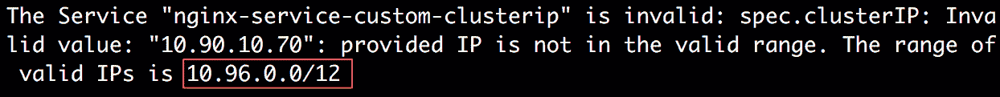

图 8.13：由于 IP 地址不正确而导致服务创建失败

正如我们所看到的，该命令给出了一个错误，因为我们使用的 IP 地址（`10.90.10.70`）不在有效的 IP 范围内。正如在前面的输出中所强调的，有效的 IP 范围是`10.96.0.0/12`。

我们实际上可以在创建服务之前使用`kubectl cluster-info dump`命令找到这些有效的 IP 地址范围。它提供了大量可用于集群调试和诊断的信息。我们可以在命令的输出中过滤`service-cluster-ip-range`字符串，以找出我们可以在集群中使用的有效 IP 地址范围。以下命令将输出有效的 IP 范围：

```
kubectl cluster-info dump | grep -m 1 service-cluster-ip-range
```

您应该看到以下输出：

```
"--service-cluster-ip-range=10.96.0.0/12",
```

然后，我们可以为我们的服务使用适当的`clusterIP` IP 地址。

1.  通过将`clusterIP`的值更改为`10.96.0.5`来修改`nginx-service-custom-clusterip.yaml`文件，因为这是一个有效的值：

```
apiVersion: v1
kind: Service
metadata:
  name: nginx-service-custom-clusterip
spec:
  type: ClusterIP
  ports:
    - port: 80
      targetPort: 80
  clusterIP: 10.96.0.5
  selector:
      app: nginx
      environment: production
```

1.  再次运行以下命令以创建服务：

```
kubectl create -f nginx-service-custom-clusterip.yaml
```

您应该看到以下输出：

```
service/nginx-service-custom-clusterip created
```

我们可以看到服务已成功创建。

1.  运行以下命令以确保服务是使用我们在配置中指定的自定义 ClusterIP 创建的：

```
kubectl get service nginx-service-custom-clusterip
```

您应该看到以下输出：

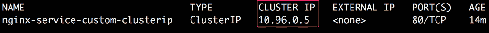

图 8.14：从服务获取 ClusterIP

在这里，我们可以确认服务确实是使用配置中提到的 IP 地址`10.96.0.5`创建的。

1.  接下来，让我们确认我们可以使用集群内的自定义 IP 地址访问服务：

```
minikube ssh
```

您应该看到以下响应：


图 8.15：SSH 进入 minikube 节点

1.  现在，运行以下命令，使用`curl`向`10.96.0.5:80`发送请求：

```
curl 10.96.0.5
```

我们故意在`curl`请求中跳过了端口号（`80`），因为默认情况下，curl 假定端口号为`80`。如果服务使用不同的端口号，我们将不得不在 curl 请求中明确指定。您应该看到以下输出：

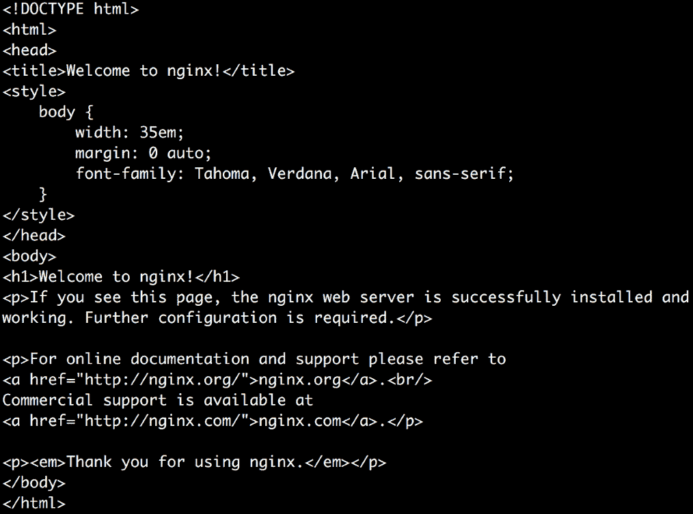

图 8.16：从 minikube 节点向服务发送 curl 请求

因此，我们可以看到我们能够从集群内部访问我们的服务，并且该服务可以在我们为`clusterIP`定义的 IP 地址上访问。

## LoadBalancer 服务

LoadBalancer 服务使用云提供商提供的负载均衡器来外部公开应用程序。这种类型的服务没有默认的本地实现，只能使用云提供商部署。当创建`LoadBalancer`类型的服务时，云提供商会提供一个负载均衡器。

因此，LoadBalancer 服务基本上是 NodePort 服务的超集。LoadBalancer 服务使用云提供商提供的实现，并为服务分配外部 IP 地址。

`LoadBalancer`服务的配置取决于云提供商。每个云提供商都需要您添加一组特定的元数据，以注释的形式。以下是`LoadBalancer`服务配置的简化示例：

```
apiVersion: v1
kind: Service
metadata:
  name: loadbalancer-service
spec:
  type: LoadBalancer
  clusterIP: 10.90.10.0
  ports:
    - targetPort: 8080
      port: 80
  selector:
    app: nginx
    environment: production
```

## ExternalName 服务

ExternalName 服务将服务映射到 DNS 名称。在 ExternalName 服务的情况下，没有代理或转发。重定向请求发生在 DNS 级别。当请求服务时，将返回一个 CNAME 记录，其值为在服务配置中设置的 DNS 名称。

ExternalName 服务的配置不包含任何选择器。它看起来是这样的：

```
apiVersion: v1
kind: Service
metadata:
  name: externalname-service
spec:
  type: ExternalName
  externalName: my.example.domain.com
```

前面的服务模板将`externalname-service`映射到一个 DNS 名称；例如，`my.example.domain.com`。

假设您正在将生产应用程序迁移到一个新的 Kubernetes 集群。一个很好的方法是首先从无状态的部分开始，并将它们首先移动到 Kubernetes 集群。在迁移过程中，您需要确保 Kubernetes 集群中的这些无状态部分仍然可以访问其他生产服务，例如数据库存储或其他后端服务/ API。在这种情况下，我们可以简单地创建一个 ExternalName 服务，以便我们的新集群中的 Pod 可以仍然访问旧集群中的资源，这些资源超出了新集群的范围。因此，ExternalName 提供了 Kubernetes 应用程序与运行在 Kubernetes 集群之外的外部服务之间的通信。

# 入口

Ingress 是一个定义规则的对象，用于管理对 Kubernetes 集群中服务的外部访问。通常，Ingress 充当互联网和集群内运行的服务之间的中间人：

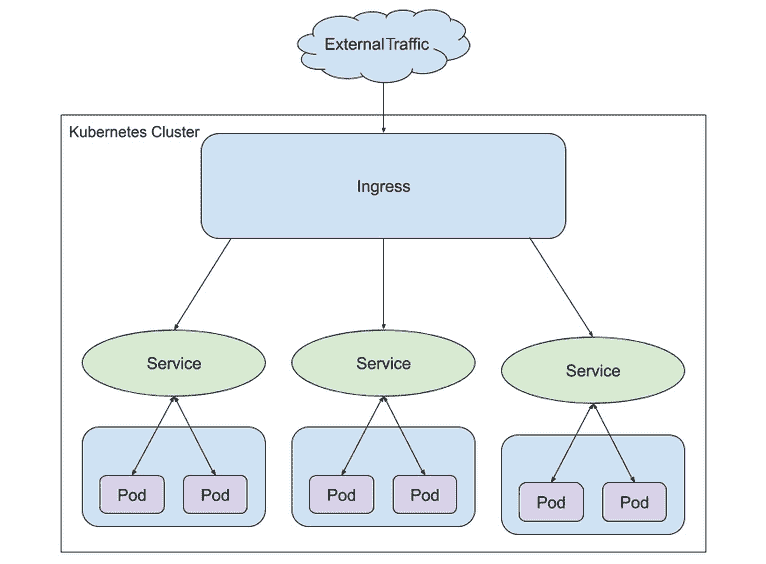

图 8.17：入口

您将在*第十二章*“您的应用程序和 HA”中学到更多关于 Ingress 以及使用它的主要动机。因此，在这里我们不会涵盖 Ingress 的实现。

现在我们已经了解了 Kubernetes 中不同类型的服务，我们将实现所有这些服务，以了解它们在实际情况下如何一起工作。

## 活动 8.01：创建一个服务来暴露运行在 Pod 上的应用程序

考虑这样一个情景，你正在与产品团队合作，他们创建了一个调查应用程序，该应用程序有两个独立和解耦的组件 - 前端和后端。调查应用程序的前端组件呈现调查表单，并需要向外部用户公开。它还需要与后端组件通信，后端负责验证和存储调查的响应。

在本活动范围内，考虑以下任务：

1.  为了避免使这项活动过于复杂，您可以部署 Apache 服务器（[`hub.docker.com/_/httpd`](https://hub.docker.com/_/httpd)）作为前端，并且我们可以将其默认的占位符主页视为应该对调查申请人可见的组件。公开前端应用程序，以便在主机节点的端口`31000`上可以访问它。

1.  对于后端应用程序，部署一个 Nginx 服务器。我们将把 Nginx 的默认主页视为您应该能够从后端看到的页面。公开后端应用程序，以便前端应用程序 Pod 在同一集群中可以访问它。

默认情况下，Apache 和 Nginx 在 Pod 上以端口`80`公开。

注意

我们在这里使用 Apache 和 Nginx 来保持活动简单。在实际情况下，这两者将被替换为前端调查站点和调查应用程序的后端数据分析组件，以及用于存储所有调查数据的数据库组件。

1.  为了确保前端应用程序知道后端应用程序服务，向包含后端服务的 IP 和端口地址的前端应用程序 Pod 添加环境变量。这将确保前端应用程序知道将请求发送到后端应用程序的位置。

要向 Pod 添加环境变量，可以在 Pod 配置的`spec`部分中添加一个名为`env`的字段，其中包含我们想要添加的所有环境变量的名称和值对的列表。以下是如何添加名为`APPLICATION_TYPE`的环境变量，其值为`Frontend`的示例：

```
apiVersion: v1
kind: Pod
metadata:
  name: environment-variables-example
  labels:
    application: frontend
spec:
  containers:
  - name: apache-httpd
    image: httpd
    env:
    - name: APPLICATION_TYPE
      value: "Frontend"
```

注意

我们在这里使用了一个叫做`ConfigMap`的东西来添加环境变量。我们将在*第十章* *ConfigMaps 和 Secrets*中学到更多关于它们的知识。

1.  假设根据对应用程序的负载测试，您估计最初需要五个前端应用程序副本和四个后端应用程序副本。

以下是您需要执行的高级步骤，以完成此活动：

1.  为此活动创建一个命名空间。

1.  为后端应用程序编写适当的部署配置，并创建部署。

1.  为后端应用程序编写适当的服务配置，包括适当的服务类型，并创建服务。

1.  确保后端应用程序可以按预期访问。

1.  为前端应用程序编写适当的部署配置。确保为后端应用程序服务的 IP 地址和端口地址设置了环境变量。

1.  为前端应用程序创建一个部署。

1.  为前端应用程序编写适当的服务配置，包括适当的服务类型，并创建服务。

1.  确保前端应用程序在主机节点的端口`31000`上按预期可访问。

**预期输出：**

在练习结束时，您应该能够使用主机 IP 地址和端口`31000`在浏览器中访问前端应用程序。您应该在浏览器中看到以下输出：


图 8.18：活动 8.01 的预期输出

注意

此活动的解决方案可在以下地址找到：[`packt.live/304PEoD`](https://packt.live/304PEoD)。

# 总结

在本章中，我们介绍了在 Pod 上运行的应用程序的不同暴露方式。我们已经看到了如何使用 ClusterIP 服务来在集群内部暴露应用程序。我们还看到了如何使用 NodePort 服务来在集群外部暴露应用程序。我们还简要介绍了 LoadBalancer 和 ExternalName 服务。

现在我们已经创建了一个部署，并学会了如何使它可以从外部世界访问，在下一章中，我们将专注于存储方面。在那里，我们将涵盖在磁盘上读取和存储数据，在 Pod 之间和跨 Pod。
