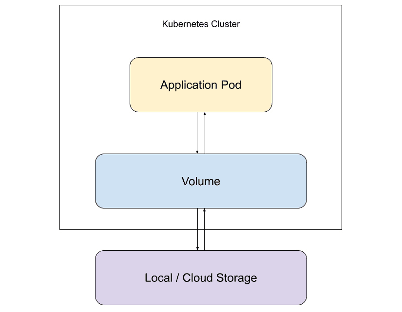
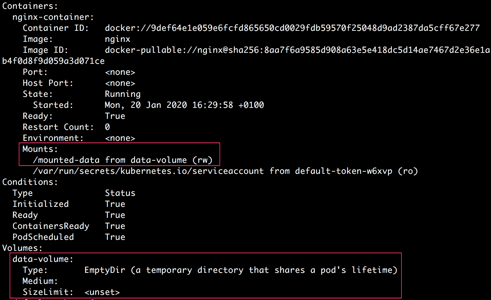
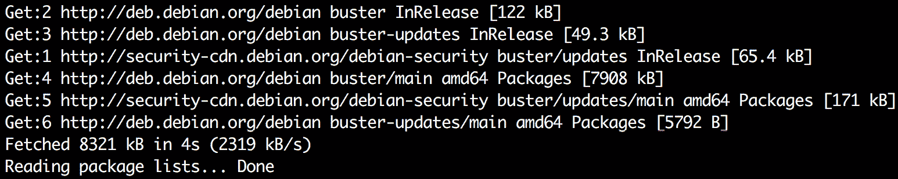
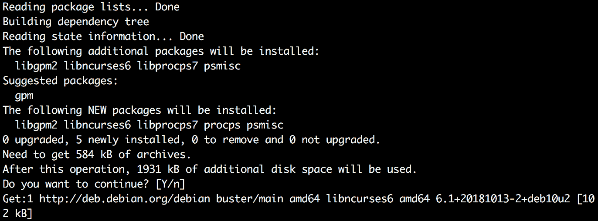
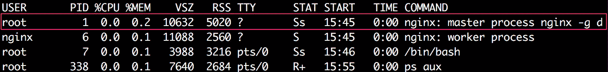
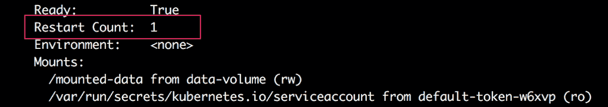
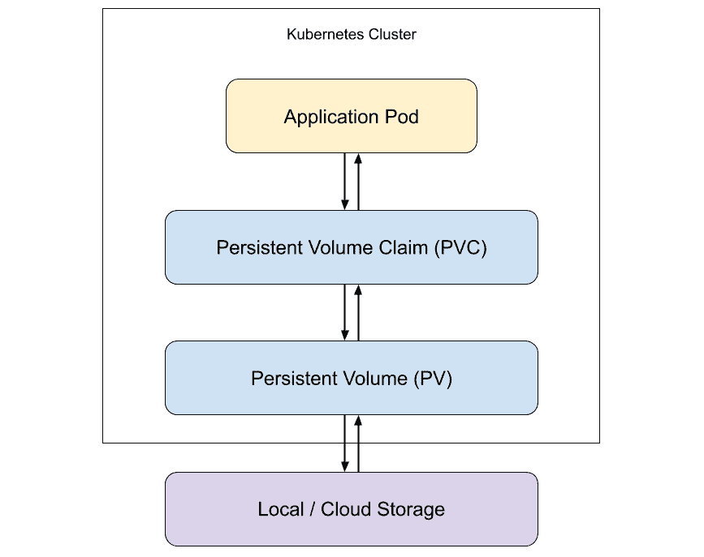
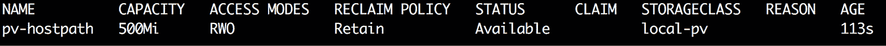

# 9. 在磁盘上存储和读取数据

概述

本章介绍了使用卷来存储或读取容器内部运行的数据的概念。在本章结束时，您将能够创建卷来临时存储数据在一个 pod 中，独立于容器的生命周期，并在同一个 pod 内的不同容器之间共享数据。您还将学习如何使用**持久卷**（**PVs**）来在集群中独立于 pod 生命周期存储数据。我们还将介绍如何创建**持久卷声明**（**PVCs**）来动态配置卷并在 pod 内使用它们。

# 介绍

在之前的章节中，我们创建了部署来创建应用程序的多个副本，并使用服务公开了我们的应用程序。然而，我们还没有完全探讨 Kubernetes 如何促进应用程序存储和读取数据，这是本章的主题。

在实践中，大多数应用程序以某种方式与数据交互。可能我们有一个需要从文件中读取数据的应用程序。同样，我们的应用程序可能需要在本地写入一些数据，以便应用程序的其他部分或不同的应用程序来读取。例如，如果我们有一个运行主应用程序的容器，它在本地产生一些日志，我们希望有一个旁路容器（这是一个与主应用程序容器一起在 pod 中运行的第二个容器），可以在同一个 pod 中运行以读取和处理主应用程序产生的本地日志。然而，为了实现这一点，我们需要找到一种在同一个 pod 中的不同容器之间共享存储的方法。

假设我们正在一个 pod 中训练一个机器学习模型。在模型训练的中间阶段，我们需要在磁盘上本地存储一些数据。同样，最终结果 - 训练好的模型 - 也需要被存储在磁盘上，以便即使 pod 终止后也可以稍后检索。对于这种用例，我们需要一种方式来为 pod 分配一些存储空间，以便在 pod 的生命周期之外存在写入该存储的数据。

同样，我们可能有一些数据需要被同一应用程序的多个副本写入或读取。当这些 pod 副本中的一些崩溃和/或重新启动时，这些数据也应该持久存在。例如，如果我们有一个电子商务网站，我们可能希望将用户数据以及库存记录存储在数据库中。这些数据需要在 pod 重新启动以及部署更新或回滚时持久存在。

为了实现这些目的，Kubernetes 提供了一个称为卷的抽象。**持久卷**（**PV**）是您将遇到的最常见类型的卷。在本章中，我们将涵盖这一点，以及许多其他类型的卷。我们将学习如何使用它们，并按需进行配置。

# 卷

假设我们有一个 pod 在本地磁盘上存储一些数据。现在，如果存储数据的容器崩溃并重新启动，数据将丢失。新容器将以分配的空白磁盘空间开始。因此，我们甚至不能依赖容器本身来临时存储数据。

我们可能还有这样一种情况，即 pod 中的一个容器存储了一些需要被同一 pod 中的其他容器访问的数据。

Kubernetes 卷抽象解决了这两个问题。下面是一个显示卷及其与物理存储和应用程序交互的图表：



图 9.1：卷作为应用程序的存储抽象

从这个图表中可以看出，卷被暴露给应用程序作为一个抽象，最终将数据存储在您可能正在使用的任何类型的物理存储上。

Kubernetes 卷的生命周期与使用它的 pod 的生命周期相同。换句话说，即使 pod 中的容器重新启动，新容器也将使用相同的卷。因此，数据在容器重新启动时不会丢失。然而，一旦一个 pod 终止或重新启动，卷就会停止存在，数据也会丢失。为了解决这个问题，我们可以使用 PVs，我们将在本章后面介绍。

## 如何使用卷

卷在 pod 规范中定义。以下是一个带有卷的 pod 配置的示例：

```
apiVersion: v1
kind: Pod
metadata:
  name: pod-with-emptydir-volume
spec:
  restartPolicy: Never
  containers:
  - image: ubuntu
    name: ubuntu-container
    volumeMounts:
    - mountPath: /data
      name: data-volume
  volumes:
  - name: data-volume
    emptyDir: {}
```

正如我们在前面的配置中所看到的，要定义一个卷，pod 配置需要设置两个字段：

+   `.spec.volumes`字段定义了这个 pod 计划使用的卷。

+   `.spec.containers.volumeMounts`定义了在各个容器中挂载这些卷的位置。这将为所有容器单独定义。

## 定义卷

在前面的示例中，`.spec.volumes`字段有两个字段，定义了卷的配置：

+   `name`：这是卷的名称，当卷被挂载时，它将在容器的`volumeMounts`字段中被引用。它必须是有效的 DNS 名称。卷的名称必须在单个 pod 内是唯一的。

+   `emptyDir`：这取决于所使用的卷的类型（在前面的示例中是`emptyDir`）。这定义了卷的实际配置。我们将在下一节中通过一些示例来介绍卷的类型。

## 挂载卷

每个容器都需要单独指定`volumeMounts`来挂载卷。在前面的示例中，您可以看到`.spec.containers[*].volumeMounts`配置具有以下字段：

+   `name`：这是需要为此容器挂载的卷的名称。

+   `mountPath`：这是容器内应该挂载卷的路径。每个容器可以在不同的路径上挂载相同的卷。

除了这些之外，我们还可以设置两个其他值得注意的字段：

+   `subPath`：这是一个可选字段，包含需要在容器上挂载的卷的路径。默认情况下，卷是从其根目录挂载的。此字段可用于仅挂载卷中的子目录，而不是整个卷。例如，如果您将相同的卷用于多个用户，将子路径挂载到容器上比在卷的根目录上挂载更有用。

+   `readonly`：这是一个可选标志，用于确定挂载的卷是否为只读。默认情况下，卷是以读写方式挂载的。

## 卷的类型

正如前面提到的，Kubernetes 支持多种类型的卷，大多数类型的卷的可用性取决于您使用的云提供商。AWS、Azure 和 Google Cloud 都支持不同类型的卷。

让我们详细看一些常见类型的卷。

### emptyDir

`emptyDir`卷是指在分配给节点的 pod 上创建的空目录。它只存在于 pod 存在的时间。在 pod 内运行的所有容器都可以从该目录中写入和读取文件。相同的`emptyDir`卷可以挂载到不同的路径以供不同的容器使用。

这是一个使用`emptyDir`卷的 pod 配置的示例：

```
apiVersion: v1
kind: Pod
metadata:
  name: pod-with-emptydir-volume
spec:
  restartPolicy: Never
  containers:
  - image: ubuntu
    name: ubuntu-container
    volumeMounts:
    - mountPath: /data
      name: data-volume
volumes:
  - name: data-volume
    emptyDir: {}
```

在这个例子中，`{}`表示`emptyDir`卷将以默认方式定义。默认情况下，`emptyDir`卷存储在磁盘或 SSD 上，具体取决于环境。我们可以通过将`.emptyDir.medium`字段设置为`Memory`来将其更改为使用 RAM。

因此，我们可以修改前面的 pod 配置的`volumes`部分，使用内存支持的`emptyDir`卷，如下所示：

```
  volumes:
  - name: data-volume
    emptyDir:
      medium: Memory
```

这通知 Kubernetes 使用基于 RAM 的文件系统（tmpfs）来存储卷。尽管与磁盘上的数据相比，tmpfs 非常快，但使用内存卷有一些缺点。首先，tmpfs 存储在节点重启时会被清除。其次，存储在基于内存的卷中的数据会计入容器的内存限制。因此，在使用基于内存的卷时需要小心。

我们还可以通过设置`.volumes.emptyDir.sizeLimit`字段来指定要在`emptyDir`卷中使用的存储的大小限制。这个大小限制适用于基于磁盘和基于内存的`emptyDir`卷。对于基于内存的卷，允许的最大使用量将是`sizeLimit`字段值或 pod 中所有容器的内存限制之和中较低的那个。

**用例**

`emptyDir`卷的一些用例如下：

+   需要大量空间进行计算的临时临时空间，例如磁盘上的归并排序

+   存储长时间计算的检查点所需的存储空间，例如训练机器学习模型，其中需要保存进度以便从崩溃中恢复

### hostPath

`hostPath`卷用于将主机节点文件系统中的文件或目录挂载到 pod 中。

这是一个使用`hostPath`卷的 pod 配置的示例：

```
apiVersion: v1
kind: Pod
metadata:
  name: pod-with-hostpath-volume
spec:
  restartPolicy: Never
  containers:
  - image: ubuntu
    name: ubuntu-container
    volumeMounts:
    - mountPath: /data
      name: data-volume
  volumes:
  - name: data-volume
    hostPath:
      path: /tmp
      type: Directory
```

在这个例子中，主机节点上的`/home/user/data`目录将挂载到容器上的`/data`路径上。让我们看一下`hostPath`下的两个字段：

+   `path`：这是将要挂载在挂载此卷的容器上的目录或文件的路径。它也可以是一个符号链接指向目录或文件，一个 UNIX 套接字的地址，或者一个字符或块设备，取决于`type`字段。

+   `type`：这是一个可选字段，允许我们指定卷的类型。如果指定了此字段，将在挂载`hostPath`卷之前执行某些检查。

`type`字段支持以下值：

+   `""`（空字符串）：这是默认值，意味着在挂载`hostPath`卷之前不会执行任何检查。如果指定的路径在节点上不存在，Pod 仍将被创建，而不会验证路径的存在。因此，Pod 将因此错误而不断崩溃。

+   `DirectoryOrCreate`：这意味着指定的目录路径在主机节点上可能已经存在，也可能不存在。如果不存在，将创建一个空目录。

+   `Directory`：这意味着主机节点上必须存在指定路径的目录。如果指定路径上的目录不存在，创建 Pod 时将出现`FailedMount`错误，表示`hostPath`类型检查失败。

+   `FileOrCreate`：这意味着指定的文件路径在主机节点上可能已经存在，也可能不存在。如果不存在，将创建一个空文件。

+   `File`：这意味着主机节点上必须存在指定路径的文件。

+   `Socket`：这意味着必须在指定的路径上存在一个 UNIX 套接字。

+   `CharDevice`：这意味着在指定路径上必须存在一个字符设备。

+   `BlockDevice`：这意味着在指定路径上必须存在一个块设备。

**用例**

在大多数情况下，您的应用程序不需要`hostPath`卷。但是，有一些利基用例可能特别有用。`hostPath`卷的一些用例如下：

+   只有在运行 Pod 之前主机节点上存在特定主机路径时才允许创建 Pod。例如，一个 Pod 可能需要一些秘密或凭据存在于主机上的文件中才能运行。

+   运行需要访问 Docker 内部的容器。我们可以通过将`hostPath`设置为`/var/lib/docker`来实现。

注意

除了这里介绍的两种类型的 Volume 外，Kubernetes 还支持许多其他类型，其中一些是特定于某些云平台的。您可以在[`kubernetes.io/docs/concepts/storage/volumes/#types-of-volumes`](https://kubernetes.io/docs/concepts/storage/volumes/#types-of-volumes)找到更多信息。

在前面的章节中，我们学习了有关 Volumes 以及如何使用它们的不同类型的知识。在接下来的练习中，我们将把这些概念付诸实践，并在 pod 中使用 Volumes。

## 练习 9.01：创建一个带有 emptyDir Volume 的 Pod

在这个练习中，我们将创建一个带有`emptyDir` Volume 的基本 pod。我们还将模拟手动写入数据，然后确保 Volume 中存储的数据在容器重新启动时保持不变：

1.  创建一个名为`pod-with-emptydir-volume.yaml`的文件，内容如下：

```
apiVersion: v1
kind: Pod
metadata:
  name: pod-with-emptydir-volume
spec:
  containers:
  - image: nginx
    name: nginx-container
    volumeMounts: 
    - mountPath: /mounted-data
      name: data-volume
  volumes:
  - name: data-volume
emptyDir: {}
```

在这个 pod 配置中，我们使用了一个挂载在`/mounted-data`目录下的`emptyDir` Volume。

1.  运行以下命令以使用前面的配置创建 pod：

```
kubectl create -f pod-with-emptydir-volume.yaml
```

您应该看到以下响应：

```
pod/pod-with-emptydir-volume created
```

1.  运行以下命令以确认 pod 已创建并准备就绪：

```
kubectl get pod pod-with-emptydir-volume
```

您应该看到以下响应：

```
NAME                       READY   STATUS   RESTARTS   AGE
pod-with-emptydir-volume   1/1     Running  0          20s
```

1.  运行以下命令以描述 pod，以便我们可以验证该 pod 上挂载了正确的 Volume：

```
kubectl describe pod pod-with-emptydir-volume
```

这将产生很长的输出。在终端输出中查找以下部分：



图 9.2：描述具有挂载的 emptyDir 卷的 pod

如前面的图像所示，名为`data-volume`的`emptyDir` Volume 已创建，并且它被挂载在`nginx-container`上的`/mounted-data`路径上。我们可以看到 Volume 已以`rw`模式挂载，表示读写。

现在我们已经验证了 pod 是使用正确的 Volume 配置创建的，我们将手动向该路径写入一些数据。在实践中，这种写入将由您的应用程序代码完成。

1.  现在，我们将使用`kubectl exec`命令在 pod 内部运行 Bash shell：

```
kubectl exec pod-with-emptydir-volume -it /bin/bash
```

您应该在终端屏幕上看到以下内容：

```
root@pod-with-emptydir-volume:/#
```

现在，这将允许您通过 SSH 连接在运行`nginx-container`中的 Bash shell 上运行命令。请注意，我们是以 root 用户身份运行的。

注意

如果 pod 中运行了一个 sidecar 容器（或者一个 pod 中有多个容器），那么你可以通过添加`-c`参数来控制`kubectl exec`命令的执行位置，以指定容器，就像你将在下一个练习中看到的那样。

1.  运行以下命令来检查 pod 的根目录的内容：

```
ls
```

你应该看到类似于这样的输出：

```
bin   dev  home  lib64  mnt          opt   root  sbin   sys   usr
boot  etc  lib   media  mounted-data proc  run   srv    tmp   var
```

注意到有一个名为`mounted-data`的目录。

1.  运行以下命令进入`mounted-data`目录并检查其内容：

```
cd mounted-data
ls
```

你应该看到一个空白的输出，如下所示：

```
root@pod-with-emptydir-volume:/mounted-data#
```

这个输出表明`mounted-data`目录是空的，这是预期的，因为我们没有任何在 pod 内运行的代码会写入这个路径。

1.  运行以下命令在`mounted-data`目录内创建一个简单的文本文件：

```
echo "Manually stored data" > manual-data.txt
```

1.  现在，再次运行`ls`命令来检查目录的内容：

```
ls
```

你应该看到以下输出：

```
manual-data.txt
```

因此，我们已经在挂载卷目录中创建了一个新文件并添加了一些内容。现在，我们的目标是验证如果容器重新启动，这些数据是否仍然存在。

1.  为了重新启动容器，我们将杀死`nginx`进程，这将触发重新启动。运行以下命令安装 procps 软件包，以便我们可以使用`ps`命令找到我们想要杀死的进程的进程 ID（PID）。首先，更新软件包列表：

```
sudo apt-get update
```

你应该看到类似于以下的输出：



图 9.3：apt-get 更新

我们的软件包列表已经更新，现在我们准备安装 procps。

1.  使用以下命令安装 procps：

```
sudo apt-get install procps
```

在提示确认安装时输入*Y*，然后安装将继续并输出类似于以下内容：



图 9.4：使用 apt-get 安装 procps

1.  现在，运行以下命令来检查容器上运行的进程列表：

```
ps aux
```

你应该看到以下输出：



图 9.5：运行中的进程列表

在输出中，我们可以看到除了其他几个进程外，`nginx`主进程以`PID`为`1`的形式运行。

1.  运行以下命令来杀死`nginx`主进程：

```
kill 1
```

你应该看到以下响应：


图 9.6：杀死容器

输出显示终端退出了 pod 上的 Bash 会话。这是因为容器被杀死。`137`退出代码表示该会话被手动干预杀死。

1.  运行以下命令以获取 pod 的状态：

```
kubectl describe pod pod-with-emptydir-volume
```

观察您获得的输出中的以下部分：



图 9.7：描述 pod

您将看到`nginx-container`现在有一个`Restart Count`字段，其值为`1`。这意味着在我们杀死它后容器被重新启动。请注意，重新启动容器不会触发 pod 的重新启动。因此，我们应该期望 Volume 中存储的数据仍然存在。让我们在下一步中验证一下。

1.  让我们再次在 pod 内运行 Bash，并转到`/mounted-data`目录：

```
kubectl exec pod-with-emptydir-volume -it /bin/bash
cd mounted-data
```

您将看到以下输出：

```
root@pod-with-emptydir-volume:/# cd mounted data/
```

1.  运行以下命令以检查`/mounted-data`目录的内容：

```
ls
```

您将看到以下输出：

```
manual-data.txt
```

这个输出表明我们在杀死容器之前创建的文件仍然存在于 Volume 中。

1.  运行以下命令以验证我们在 Volume 中创建的文件的内容：

```
cat manual-data.txt
```

您将看到以下输出：

```
Manually stored data
```

这个输出表明，我们存储在 Volume 中的数据即使在容器重新启动时也保持完整。

1.  运行以下命令以删除 pod：

```
kubectl delete pod pod-with-emptydir-volume
```

您将看到以下输出，确认 pod 已被删除：

```
pod "pod-with-emptydir-volume" deleted
```

在这个练习中，我们创建了一个带有`emptyDir`卷的 pod，检查了 pod 是否创建了一个空目录挂载在容器内的正确路径，并验证了我们可以在该目录内写入数据，并且只要 pod 仍在运行，数据就会在容器重新启动时保持完整。

现在，让我们转移到一个场景，让我们观察一些更多卷的用途。让我们考虑这样一个场景，我们有一个应用 pod，运行了三个容器。我们可以假设其中三个容器中有两个正在提供流量，并且它们将日志转储到一个共享文件中。第三个容器充当一个 sidecar 监控容器，从文件中读取日志，并将其转储到外部日志存储系统，以便进一步分析和警报。让我们在下一个练习中考虑这种情况，并了解如何利用 pod 的三个容器之间共享的`emptyDir`卷。

## 练习 9.02：创建一个由三个容器共享 emptyDir 卷的 Pod

在这个练习中，我们将展示`emptyDir`卷的一些更多用途，并在同一个 pod 中的三个容器之间共享它。每个容器将在不同的本地路径挂载相同的卷：

1.  创建一个名为`shared-emptydir-volume.yaml`的文件，内容如下：

```
apiVersion: v1
kind: Pod
metadata:
  name: shared-emptydir-volume
spec:
  containers:
  - image: ubuntu
    name: container-1
    command: ['/bin/bash', '-ec', 'sleep 3600']
    volumeMounts:
    - mountPath: /mounted-data-1
      name: data-volume
  - image: ubuntu
    name: container-2
    command: ['/bin/bash', '-ec', 'sleep 3600']
    volumeMounts:
    - mountPath: /mounted-data-2
      name: data-volume
  - image: ubuntu
    name: container-3
    command: ['/bin/bash', '-ec', 'sleep 3600']
    volumeMounts:
    - mountPath: /mounted-data-3
      name: data-volume
  volumes:
  - name: data-volume
    emptyDir: {}
```

在这个配置中，我们定义了一个名为`data-volume`的`emptyDir`卷，它被挂载在三个容器的不同路径上。

请注意，每个容器都被配置为在启动时运行一个使它们休眠 1 小时的命令。这是为了保持`ubuntu`容器运行，以便我们可以在容器上执行以下操作。默认情况下，`ubuntu`容器被配置为运行指定的命令并在完成后退出。

1.  运行以下命令以使用上述配置创建 pod：

```
kubectl create -f shared-emptydir-volume.yaml
```

您将看到以下输出：

```
pod/shared-emptydir-volume created
```

1.  运行以下命令来检查 pod 的状态：

```
kubectl get pod shared-emptydir-volume
```

您将看到以下输出：

```
NAME                     READY   STATUS    RESTARTS   AGE
shared-emptydir-volume   3/3     Running   0          13s
```

此输出表明此 pod 内的所有三个容器都在运行。

1.  接下来，我们将运行以下命令在第一个容器中运行 Bash：

```
kubectl exec shared-emptydir-volume -c container-1 -it -- /bin/bash
```

这里，`-c`标志用于指定我们要在其中运行 Bash 的容器。您将在终端中看到以下内容：

```
root@shared-emptydir-volume:/#
```

1.  运行以下命令来检查容器中根目录的内容：

```
ls
```

您将看到以下输出：


图 9.8：列出容器内根目录的内容

我们可以看到`mounted-data-1`目录已在容器中创建。此外，您还可以看到在典型的 Ubuntu 根目录中会看到的目录列表，以及我们创建的`mounted-data-1`目录。

1.  现在，我们将进入`mounted-data-1`目录并创建一个带有一些文本的简单文本文件：

```
cd mounted-data-1
echo 'Data written on container-1' > data-1.txt
```

1.  运行以下命令来验证文件是否已存储：

```
ls
```

您将看到以下输出：

```
data-1.txt
```

1.  运行以下命令退出`container-1`并返回到您的主机终端：

```
exit
```

1.  现在，让我们在第二个容器中运行 Bash，它的名称是`container-2`：

```
kubectl exec shared-emptydir-volume -c container-2 -it -- /bin/bash
```

您将在终端中看到以下内容：

```
root@shared-emptydir-volume:/#
```

1.  运行以下命令来定位容器中根目录中的挂载目录：

```
ls
```

您将看到以下输出：


图 9.9：列出容器内根目录的内容

注意名为`mounted-data-2`的目录，这是我们在`container-2`中的卷的挂载点。

1.  运行以下命令检查`mounted-data-2`目录的内容：

```
cd mounted-data-2
ls
```

你会看到以下输出：

```
data-1.txt
```

这个输出表明，已经有一个名为`data-1.txt`的文件，我们之前在`container-1`中创建过。

1.  让我们验证这是否是我们在早期步骤中创建的同一个文件。运行以下命令检查该文件的内容：

```
cat data-1.txt
```

你会看到以下输出：

```
Data written on container-1
```

这个输出验证了这是我们在这个练习的早期步骤中创建的同一个文件。

1.  运行以下命令在该目录中写入一个名为`data-2.txt`的新文件：

```
echo 'Data written on container-2' > data-2.txt
```

1.  现在，让我们确认文件已经创建：

```
ls
```

你应该看到以下输出：

```
data-1.txt   data-2.txt
```

正如你在截图中看到的，新文件已经创建，现在挂载目录中有两个文件——`data-1.txt`和`data-2.txt`。

1.  运行以下命令退出该容器上的 Bash 会话：

```
exit
```

1.  现在，让我们在`container-3`中运行 Bash：

```
kubectl exec shared-emptydir-volume -c container-3 -it -- /bin/bash
```

你会在终端上看到以下内容：

```
root@shared-empty-dir-volume:/#
```

1.  进入`/mounted-data-3`目录并检查其内容：

```
cd mounted-data-3
ls
```

你会看到以下输出：

```
data-1.txt   data-2.txt
```

这个输出显示，这个容器可以看到我们之前在`container-1`和`container-2`中创建的两个文件——`data-1.txt`和`data-2.txt`。

1.  运行以下命令验证第一个文件`data-1.txt`的内容：

```
cat data-1.txt
```

你应该看到以下输出：

```
Data written on container-1
```

1.  运行以下命令验证第二个文件`data-2.txt`的内容：

```
cat data-2.txt
```

你应该看到以下输出：

```
Data written on container-2
```

最后两个命令的输出证明，任何一个容器在挂载卷上写入的数据都可以被其他容器读取。接下来，我们将验证其他容器是否有权限写入特定容器写入的数据。

1.  运行以下命令覆盖`data-2.txt`文件的内容：

```
echo 'Data updated on container 3' > data-2.txt
```

1.  接下来，让我们退出`container-3`：

```
exit
```

1.  运行以下命令再次在`container-1`中运行 Bash：

```
kubectl exec shared-emptydir-volume -c container-1 -it -- /bin/bash
```

你会在终端上看到以下内容：

```
root@shared-emptydir-volume:/#
```

1.  运行以下命令检查`data-2.txt`文件的内容：

```
cat mounted-data-1/data-2.txt
```

你应该看到以下输出：

```
Data updated on container 3
```

这个输出表明，被`container-3`覆盖的数据也可以被其他容器读取。

1.  运行以下命令退出`container-3`中的 SSH 会话：

```
exit
```

1.  运行以下命令以删除 pod：

```
kubectl delete pod shared-emptydir-volume
```

您应该看到以下输出，表明 pod 已被删除：

```
pod "shared-emptydir-volume" deleted
```

在这个练习中，我们学习了如何使用卷，并验证了相同的卷可以挂载到不同容器中的不同路径。我们还看到使用相同卷的容器可以读取或写入（或覆盖）卷的内容。

# 持久卷

到目前为止，我们看到的卷有一个限制，即它们的生命周期取决于 pod 的生命周期。例如，当使用它们的 pod 被删除或重新启动时，emptyDir 或 hostPath 等卷将被删除。例如，如果我们使用卷来存储电子商务网站的用户数据和库存记录，当应用程序 pod 重新启动时，数据将被删除。因此，卷不适合存储您想要持久保存的数据。

为了解决这个问题，Kubernetes 支持以**持久卷**（**PV**）的形式提供持久存储。PV 是 Kubernetes 集群中表示存储块的对象。它可以由集群管理员预先配置，也可以动态配置。PV 可以被视为集群资源，就像节点一样，因此它不限于单个命名空间。这些卷的工作方式类似于我们在之前章节中看到的卷。PV 的生命周期不依赖于使用 PV 的任何 pod 的生命周期。然而，从 pod 的角度来看，使用普通卷和 PV 没有区别。

为了使用 PV，需要创建一个**持久卷索赔**（**PVC**）。PVC 是用户或 pod 对存储的请求。PVC 可以请求特定大小的存储和特定的访问模式。PVC 实际上是用户访问各种存储资源的抽象方式。PVC 由命名空间范围，因此 pod 只能访问在同一命名空间中创建的 PVC。

注意

任何时候，PV 只能绑定到一个 PVC。

以下是一个显示应用程序如何与 PV 和 PVC 交互的图表：



图 9.10：PV 和 PVC 如何共同为您的应用程序 pod 提供存储

如图所示，Kubernetes 使用 PV 和 PVC 的组合来为您的应用程序提供存储。PVC 基本上是提供符合特定条件的 PV 的请求。

这是与我们在先前练习中看到的有显著变化，我们在那里直接在 pod 定义中创建了卷。请求（PVC）和实际存储抽象（PV）的分离使应用程序开发人员不必担心集群上存在的所有不同 PV 的具体情况和状态；他们只需根据应用程序的要求创建 PVC，然后在 pod 中使用它。这种松散的绑定还允许整个系统在 pod 重新启动的情况下保持稳定和可靠。

与卷类似，Kubernetes 支持几种类型的 PV。其中一些可能特定于您的云平台。您可以在此链接找到不同支持类型的列表：[`kubernetes.io/docs/concepts/storage/persistent-volumes/#types-of-persistent-volumes`](https://kubernetes.io/docs/concepts/storage/persistent-volumes/#types-of-persistent-volumes)

## 持久卷配置

以下是 PV 配置的示例：

```
apiVersion: v1
kind: PersistentVolume
metadata:
  name: example-persistent-volume
spec: 
  storageClassName: standard
  capacity:
    storage: 10Gi
  volumeMode: Filesystem
  accessModes:
    - ReadWriteMany
  persistentVolumeReclaimPolicy: Retain
  nfs:
    server: 172.10.1.1
    path: /tmp/pv
```

与往常一样，PV 对象还具有我们已经看到的三个字段：`apiVersion`、`kind`和`metadata`。由于这是一种`nfs`类型的 PV，我们在配置中有`nfs`部分。让我们逐个浏览 PV `spec`部分中的一些重要字段。

### storageClassName

每个 PV 都属于某个存储类别。我们使用`storageClassName`字段定义 PV 关联的存储类别的名称。StorageClass 是 Kubernetes 对象，为管理员提供了描述他们支持的不同类型或存储配置文件的方式。在前面的示例中，`standard`只是存储类别的一个示例。

不同的存储类别允许您根据应用程序的特定需求，基于性能和容量为不同的应用程序分配不同类型的存储。每个集群管理员都可以配置自己的存储类别。每个存储类别可以有自己的提供程序、备份策略或管理员确定的回收策略。提供程序是确定如何为特定类型的 PV 提供存储的系统。Kubernetes 支持一组内部提供程序以及用户可以实现的外部提供程序。关于如何使用或创建提供程序的详细信息，但是超出了本书的范围。

属于特定存储类的 PV 只能绑定到请求该特定类的 PVC。请注意，这是一个可选字段。没有存储类字段的任何 PV 只对不请求特定存储类的 PVC 可用。

### 容量

该字段表示 PV 的存储容量。我们可以像定义 Pod 规范中的内存和 CPU 限制字段一样设置这个字段。在前面的示例规范中，我们将容量设置为 10 GiB。

### volumeMode

`volumeMode`字段表示我们希望如何使用存储。它可以有两个可能的值：`Filesystem`（默认）和`Block`。我们可以将`volumeMode`字段设置为`Block`，以便使用原始块设备作为存储，或者设置为`Filesystem`以在持久卷上使用传统文件系统。

### 访问模式

PV 的访问模式表示挂载卷允许的功能。一个卷一次只能使用一个支持的访问模式进行挂载。有三种可能的访问模式：

+   `ReadWriteOnce`（`RWO`）：仅由单个节点挂载为读写

+   `ReadOnlyMany`（`ROX`）：由多个节点挂载为只读

+   `ReadWriteMany`（`RWX`）：由多个节点挂载为读写

请注意，并非所有类型的卷都支持所有访问模式。请检查允许的访问模式的参考文献，以了解您正在使用的特定类型的卷的访问模式。

### 持久卷回收策略

用户完成卷的使用后，他们可以删除他们的 PVC，这样就可以回收 PV 资源。回收策略字段表示在释放后允许声明 PV 的策略。PV 被*释放*意味着 PV 不再与 PVC 相关联，因为 PVC 已被删除。然后，PV 可供任何其他 PVC 使用，或者换句话说，*回收*。PV 是否可以被重用取决于回收策略。该字段有三个可能的值：

+   `Retain`：此回收策略表示即使 PV 已被释放，存储在 PV 中的数据也会保留。管理员需要手动删除存储中的数据。在此策略中，PV 标记为`Released`而不是`Available`。因此，`Released` PV 可能不一定为空。

+   `回收`: 使用此回收策略意味着一旦 PV 被释放，卷上的数据将使用基本的`rm -rf`命令删除。这将标记 PV 为`可用`，因此可以再次声明。使用动态配置比使用此回收策略更好。我们将在下一节讨论动态配置。

+   `删除`: 使用此回收策略意味着一旦 PV 被释放，底层存储中存储的数据以及 PV 本身将被删除。

注意

不同的云环境对回收策略有不同的默认值。因此，请确保您检查您使用的云环境的回收策略的默认值，以避免意外删除 PV 中的数据。

## PV 状态

在其生命周期的任何时刻，PV 可以具有以下状态之一：

+   `可用`: 这表示 PV 可以被声明。

+   `绑定`: 这表示 PV 已绑定到 PVC。

+   `发布`: 这表示绑定到此资源的 PVC 已被删除；但是，它尚未被其他 PVC 回收。

+   `失败`: 这表示回收过程中出现了失败。

既然我们已经看了 PV 的各个方面，让我们来看看 PVC。

## 持久卷声明配置

以下是 PVC 配置的示例：

```
apiVersion: v1
kind: PersistentVolumeClaim
metadata:
  name: example-persistent-volume-claim
spec:
  storageClassName: standard
  resources:
    requests:
      storage: 500Mi
  volumeMode: Filesystem
  accessModes:
    - ReadWriteMany
  selector:
    matchLabels:
      environment: "prod"
```

同样，通常情况下，PVC 对象也有三个我们已经看到的字段：`apiVersion`，`kind`和`metadata`。让我们逐个查看 PVC `spec`部分中的一些重要字段。

### storageClassName

PVC 可以通过指定`storageClassName`字段来请求特定类别的存储。只有指定存储类的 PV 才能绑定到这样的 PVC。

如果`storageClassName`字段设置为空字符串（`""`），这些 PVC 只会绑定到没有设置存储类的 PV。

另一方面，如果 PVC 中的`storageClassName`字段未设置，则取决于管理员是否启用了`DefaultStorageClass`。如果为集群设置了默认存储类，则没有设置`storageClassName`字段的 PVC 将绑定到具有该默认存储类的 PV。否则，没有设置`storageClassName`字段的 PVC 将只绑定到没有设置存储类的 PV。

### 资源

就像我们学到的 pod 可以发出特定的资源请求一样，PVC 也可以通过指定`requests`和`limits`字段来以类似的方式请求资源，这是可选的。只有满足资源请求的 PV 才能绑定到 PVC 上。

### volumeMode

PVC 遵循与 PV 相同的约定，以指示将存储用作文件系统或原始块设备。只有与 PVC 配置中指定的卷模式相同的 PV 才能绑定到 PVC。

### accessMode

PVC 应该指定它需要的访问模式，并且根据该访问模式的可用性分配 PV。

### selectors

与服务中的 pod 选择器类似，PVC 可以使用`matchLabels`和/或`matchExpressions`字段来指定可以满足特定声明的卷的条件。只有满足`selectors`字段中指定条件的 PV 才会被考虑为声明。当这两个字段一起作为选择器使用时，两个字段指定的条件将使用 AND 操作进行组合。

## 如何使用持久卷

为了使用 PV，我们有以下三个步骤：配置卷，将其绑定到声明（PVC），并在 pod 上使用声明作为卷。让我们详细了解这些步骤。

### 第一步 - 配置卷

卷可以通过两种方式进行配置 - 静态和动态：

+   **静态**：在静态配置中，集群管理员必须预先配置多个 PV，然后它们才能作为可用资源提供给 PVC。

+   **动态**：如果您使用动态配置，管理员不需要预先配置所有 PV。在这种配置中，集群将根据请求的存储类动态为 PVC 配置 PV。因此，当应用程序或微服务需要更多存储时，Kubernetes 可以自动处理并根据需要扩展云基础设施。

我们将在后面的部分更详细地介绍动态配置。

### 第二步 - 将卷绑定到声明

在这一步中，需要使用请求的存储限制、特定的访问模式和特定的存储类来创建 PVC。每当创建新的 PVC 时，Kubernetes 控制器将搜索与其条件匹配的 PV。如果找到与所有 PVC 条件匹配的 PV，它将绑定声明到 PV 上。每个 PV 一次只能绑定到一个 PVC。

### 第三步 - 使用声明

一旦 PV 被配置并绑定到 PVC，pod 就可以将 PV 作为 Volume 使用。接下来，当 pod 使用 PVC 作为 Volume 时，Kubernetes 将会找到与该 PVC 绑定的 PV，并将其挂载到 pod 上。

以下是使用 PVC 作为 Volume 的 pod 配置示例：

```
apiVersion: v1
kind: Pod
metadata:
  name: pod-pvc-as-volume
spec:
  containers:
  - image: nginx
    name: nginx-application
    volumeMounts:
    - mountPath: /data/application
      name: example-storage
  volumes:
  - name: example-storage
    persistentVolumeClaim:
      claimName: example-claim
```

在这个例子中，我们假设已经有一个名为`example-claim`的 PVC 已经绑定到`PersistentVolume`。pod 配置指定`persistentVolumeClaim`作为 Volume 的类型，并指定要使用的 claim 的名称。Kubernetes 将会找到实际绑定到该 claim 的 PV，并将其挂载到容器内的`/data/application`目录下。

注意

为了使这个工作，pod 和 PVC 必须在同一个命名空间中。这是因为 Kubernetes 只会在 pod 的命名空间中寻找 claim，如果找不到 PVC，pod 将无法被调度。在这种情况下，pod 将会被卡在`Pending`状态，直到被删除。

现在，让我们通过创建一个使用 PV 的 pod 来将这些概念付诸实践。

## 练习 9.03：创建使用 PersistentVolume 进行存储的 Pod

在这个练习中，我们首先假装集群管理员提前配置了 PV。接下来，假设是开发人员的角色，我们将创建一个绑定到 PV 的 PVC。之后，我们将创建一个使用这个 claim 作为 Volume 挂载到一个容器上的 pod：

1.  首先，我们将通过 SSH 访问主机节点。在 Minikube 的情况下，我们可以使用以下命令来做到：

```
minikube ssh
```

你应该会看到类似于以下的输出：


图 9.11：SSH 到 minikube 节点

1.  运行以下命令在`/mnt`目录下创建一个名为`data`的目录：

```
sudo mkdir /mnt/data
```

1.  运行以下命令在`/mnt/data`目录下创建一个名为`data.txt`的文件：

```
sudo bash -ec 'echo "Data written on host node" > /mnt/data/data.txt'
```

这个命令应该会创建一个名为`data.txt`的文件，其中包含`Data written on host node`的内容。我们将使用这个文件的内容在稍后的阶段验证，我们可以成功地使用 PV 和 PVC 在容器上挂载这个目录。

1.  运行以下命令退出主机节点：

```
exit
```

这将会把我们带回到本地机器终端，我们可以在那里运行`kubectl`命令。

1.  创建一个名为`pv-hostpath.yaml`的文件，内容如下：

```
apiVersion: v1
kind: PersistentVolume
metadata:
  name: pv-hostpath
spec:
  storageClassName: local-pv
  capacity:
    storage: 500Mi
  accessModes:
    - ReadWriteOnce
  hostPath:
    path: /mnt/data
```

在这个 PV 配置中，我们使用了`local-pv`存储类。Volume 将托管在主机节点的`/mnt/data`路径上。卷的大小将为`500Mi`，访问模式将为`ReadWriteOnce`。

1.  运行以下命令来使用前面的配置创建 PV：

```
kubectl create -f pv-hostpath.yaml
```

你应该看到以下输出：

```
persistentvolume/pv-hostpath created
```

1.  运行以下命令来检查我们刚刚创建的 PV 的状态：

```
kubectl get pv pv-hostpath
```

正如你在这个命令中看到的那样，`pv`是`PersistentVolume`的一个被接受的缩写。你应该看到以下输出：



图 9.12：检查 PV 的状态

在前面的输出中，我们可以看到 Volume 已经使用所需的配置创建，并且其状态为`Available`。

1.  创建一个名为`pvc-local.yaml`的文件，内容如下：

```
apiVersion: v1
kind: PersistentVolumeClaim
metadata:
  name: pvc-local
spec:
  storageClassName: local-pv
  accessModes:
    - ReadWriteOnce
  resources:
    requests:
      storage: 100Mi
```

在这个配置中，我们有一个声明，请求一个带有`local-pv`存储类、`ReadWriteOnce`访问模式和`100Mi`存储大小的 Volume。

1.  运行以下命令来创建这个 PVC：

```
kubectl create -f pvc-local.yaml
```

你应该看到以下输出：

```
persistentvolumeclaim/pvc-local created
```

一旦我们创建了这个 PVC，Kubernetes 将搜索匹配的 PV 来满足这个声明。

1.  运行以下命令来检查这个 PVC 的状态：

```
kubectl get pvc pvc-local
```

你应该看到以下输出：


图 9.13：检查声明的状态

正如我们在这个输出中看到的那样，PVC 已经使用所需的配置创建，并立即绑定到我们在此练习的早期步骤中创建的名为`pv-hostpath`的现有 PV。

1.  接下来，我们可以创建一个将使用这个 PVC 作为 Volume 的 pod。创建一个名为`pod-local-pvc.yaml`的文件，内容如下：

```
apiVersion: v1
kind: Pod
metadata:
  name: pod-local-pvc
spec:
  restartPolicy: Never
  containers:
  - image: ubuntu
    name: ubuntu-container
    command: ['/bin/bash', '-ec', 'cat /data/application/data.txt']
    volumeMounts:
    - mountPath: /data/application
      name: local-volume
  volumes:
  - name: local-volume
    persistentVolumeClaim:
claimName: pvc-local
```

pod 将使用名为`pvc-local`的 PVC 作为 Volume，并在容器中的`/data/application`路径上挂载它。此外，我们有一个容器将在启动时运行`cat /data/application/data.txt`命令。这只是一个简化的例子，我们将展示最初在主机节点的 PV 目录中写入的数据现在可用于这个 pod。

1.  运行以下命令来创建这个 pod：

```
kubectl create -f pod-local-pvc.yaml
```

你应该看到以下输出：

```
pod/pod-local-pvc created
```

这个输出表明 pod 已经成功创建。

1.  运行以下命令来检查我们刚刚创建的 pod 的状态：

```
kubectl get pod pod-local-pvc
```

你应该看到以下输出：

```
NAME             READY     STATUS      RESTARTS    AGE
pod-local-pvc    0/1       Completed   1           7s
```

在这个输出中，我们可以看到 pod 已经成功完成，因为这次我们没有添加任何休眠命令。

1.  运行以下命令来检查日志。我们期望在日志中看到`cat /data/application/data.txt`命令的输出：

```
kubectl logs pod-local-pvc
```

您应该看到以下输出：

```
Data written on host node
```

这个输出清楚地表明这个 pod 可以访问我们在`/mnt/data/data.txt`创建的文件。这个文件是容器中挂载在`/data/application`目录中的一部分。

1.  现在，让我们清理本练习中创建的资源。使用以下命令删除 pod：

```
kubectl delete pod pod-local-pvc
```

您应该看到以下输出，表明 pod 已被删除：

```
pod "pod-local-pvc" deleted
```

1.  使用以下命令删除 PVC：

```
kubectl delete pvc pvc-local
```

您应该看到以下输出，表明 PVC 已被删除：

```
persistentvolumeclaim "pvc-local" deleted
```

请注意，如果我们在删除 PVC 之前尝试删除 PV，PV 将被卡在`Terminating`阶段，并且将等待 PVC 释放它。因此，我们需要在删除 PV 之前先删除绑定到 PV 的 PVC。

1.  现在我们的 PVC 已被删除，我们可以安全地通过运行以下命令删除 PV：

```
kubectl delete pv pv-hostpath
```

您应该看到以下输出，表明 PV 已被删除：

```
persistentvolume "pv-hostpath" deleted
```

在这个练习中，我们学习了如何配置 PV，创建声明来使用这些卷，然后在 pod 内部使用这些 PVC 作为卷。

# 动态配置

在本章的前几节中，我们看到集群管理员需要为我们配置 PV，然后我们才能将其用作应用程序的存储。为了解决这个问题，Kubernetes 也支持动态卷配置。动态卷配置使得可以按需创建存储卷。这消除了管理员在创建任何 PVC 之前创建卷的需要。只有在有要求时才会配置卷。

为了启用动态配置，管理员需要创建一个或多个存储类，用户可以在其声明中使用这些存储类来使用动态配置。这些`StorageClass`对象需要指定将使用的配置程序以及其参数。配置程序取决于环境。每个云提供商支持不同的配置程序，因此请确保您在集群中创建此类存储类时与您的云提供商进行核实。

以下是在 AWS 平台上创建新`StorageClass`的配置示例：

```
apiVersion: storage.k8s.io/v1
kind: StorageClass
metadata:
  name: example-storage-class
provisioner: kubernetes.io/aws-ebs
parameters:
  type: io1
  iopsPerGB: "10"
  fsType: ext4
```

在这种配置中，使用了`kubernetes.io/aws-ebs` provisioner - EBS 代表弹性块存储，仅在 AWS 上可用。这个 provisioner 需要各种参数，包括`type`，我们可以使用它来指定我们想要为这个存储类使用什么类型的磁盘。请查看 AWS 文档，了解我们可以使用的各种参数及其可能的值。provisioner 和所需的参数将根据你使用的云提供商而改变。

一旦集群管理员创建了一个存储类，用户就可以创建一个 PVC，请求使用该存储类名称在`storageClassName`字段中设置的存储。Kubernetes 将自动提供存储卷，创建一个满足要求的存储类的 PV 对象，并将其绑定到声明：

以下是使用我们之前定义的存储类的 PVC 的配置示例：

```
apiVersion: v1
kind: PersistentVolumeClaim
metadata:
  name: example-pvc
spec:
  storageClassName: example-storage-class
  accessModes:
    - ReadWriteOnce
  resources:
    requests:
      storage: 1Gi
```

正如我们所看到的，PVC 的配置保持不变，只是现在，我们必须使用集群管理员为我们创建的存储类。

一旦声明被绑定到一个自动创建的 Volume，我们可以创建使用该 PVC 作为 Volume 的 pod，就像我们在前面的部分中看到的那样。一旦声明被删除，Volume 就会被自动删除。

## 活动 9.01：创建一个使用动态配置的持久卷的 Pod

考虑一下，你是一个集群管理员，首先需要创建一个自定义的存储类，以便让使用你的集群的开发人员动态地提供 PV。要在 minikube 集群上创建一个存储类，你可以使用`k8s.io/minikube-hostpath` provisioner，不需要任何额外的参数，就像我们在*动态配置*部分的`StorageClass`示例中所示的那样。

接下来，作为开发人员或集群用户，使用以下规格声明一个带有 100Mi 存储请求的 PV，并将其挂载到使用以下规格创建的 pod 中的容器中：

1.  该 pod 应该有两个容器。

1.  两个容器应该在本地挂载相同的 PV。

1.  第一个容器应该向 PV 中写入一些数据，第二个容器应该读取并打印出第一个容器写入的数据。

为简单起见，考虑从第一个容器向 PV 中的文件写入一个简单的字符串。对于第二个容器，添加一些等待时间，以便第二个容器在完全写入之前不开始读取数据。然后，后一个容器应该读取并打印出第一个容器写入的文件的内容。

注意

理想情况下，您希望将此部署创建在一个不同的命名空间中，以使其与您在这些练习期间创建的其他内容分开。因此，请随意创建一个命名空间，并在该命名空间中创建此活动的所有对象。

执行此活动的高级步骤如下：

1.  为此活动创建一个命名空间。

1.  使用给定的信息编写适当的存储类配置，并创建`StorageClass`对象。

1.  使用在上一步创建的存储类编写 PVC 的适当配置。使用此配置创建 PVC。

1.  验证声明是否绑定到了与我们在*步骤 2*中创建的相同存储类的自动创建的 PV。

1.  使用给定的信息和上一步的 PVC 作为卷，编写适当的 pod 配置。使用此配置创建 pod。

1.  验证其中一个容器是否可以读取另一个容器写入 PV 的文件的内容。

您应该能够检查第二个容器的日志，并验证第一个容器在 PV 中写入的数据是否可以被第二个容器读取，如下面的输出所示：

```
Data written by container-1
```

注意

此活动的解决方案可以在以下地址找到：[`packt.live/304PEoD`](https://packt.live/304PEoD)。

# 总结

正如我们在介绍中提到的，大多数应用程序需要出于许多不同的原因存储或检索数据。在本章中，我们看到 Kubernetes 提供了各种方式来为存储应用程序的状态以及长期存储数据提供存储。

我们已经介绍了如何在 Pod 内运行的应用程序中使用存储的方法。我们看到了如何使用不同类型的卷来在同一 Pod 中运行的容器之间共享临时数据。我们还学习了如何在 Pod 重新启动时持久化数据。我们学会了如何手动配置 PV 来创建 PVC，并将其绑定到这些卷，以及如何创建可以使用这些声明作为其容器上挂载的卷的 Pod。接下来，我们学会了如何仅使用预先创建的存储类和 PVC 动态请求存储。我们还了解了这些卷与 Pod 的生命周期之间的关系。

在下一章中，我们将进一步扩展这些概念，并学习如何存储应用程序配置和机密信息。
