# 10. ConfigMaps 和 Secrets

概述

在本章中，我们将学习如何将应用程序配置数据与应用程序本身解耦，并采取这种方法的优势。在本章结束时，您将能够定义 Kubernetes ConfigMap 和 Secret 对象，运行一个使用来自 ConfigMaps 和 Secrets 的数据的简单 Pod，描述将配置数据与应用程序解耦的优势，并使用 ConfigMaps 和 Secrets 将应用程序配置数据与应用程序容器解耦。

# 介绍

在*第五章*，*Pods*中，我们了解到 Pods 是 Kubernetes 中部署的最小单位。Pods 可以有多个容器，每个容器可以有一个与之关联的容器镜像。这个容器镜像通常打包了您计划运行的目标应用程序。一旦开发人员确信代码按预期运行，下一步就是将代码推广到测试、集成和生产环境。

容易，对吧？然而，一个问题是，当我们将打包的容器从一个环境移动到另一个环境时，尽管应用程序保持不变，但它需要特定于环境的数据，例如连接到的数据库 URL。为了解决这个问题，我们可以以这样的方式编写我们的应用程序，使得环境特定的数据由部署到的环境提供给应用程序。

在本章中，我们将发现 Kubernetes 提供了什么来将**特定于环境的数据**与我们的应用程序容器关联起来，而不改变我们的容器镜像。有多种方法可以为我们的应用程序提供**特定于环境的配置**数据：

1.  为 Pods 提供命令行参数。

1.  为 Pods 提供环境变量。

1.  在容器中挂载配置文件。

首先，我们需要使用一个叫做**ConfigMap**的对象来定义我们的配置数据。一旦数据被定义并加载到 Kubernetes 中，第二步就是将定义的数据提供给您的应用程序。

然而，如果您有敏感数据，比如数据库密码，您想提供给应用程序容器怎么办？好吧，Kubernetes **Secret** 提供了一种定义敏感数据给应用程序的方法。

ConfigMap 和 Secret 对象都具有类似的目的。两者都提供了一种定义数据的方式，可以将其注入到应用程序中，以便相同的容器可以在不同的环境中使用。它们之间的区别很小，我们将在本章后面详细学习。简单来说，Secrets 旨在保存机密数据（例如密码、私钥等），而 ConfigMaps 更适用于一般配置数据，例如数据库位置。ConfigMaps 和 Secrets 驻留在创建它们的特定命名空间中。它们只能被驻留在相同命名空间中的 Pods 引用。

Kubernetes 使用名为**etcd**的内部键值存储作为其数据库，用于存储在 Kubernetes 中定义的所有对象。由于 ConfigMaps 和 Secrets 是 Kubernetes 对象，它们被存储在内部键值存储中。

让我们先深入了解一下 ConfigMaps。

# 什么是 ConfigMap？

ConfigMap 允许我们定义与应用程序相关的数据。ConfigMap 将应用程序数据与应用程序解耦，以便相同的应用程序可以在不同的环境中移植。它还提供了一种从相同容器镜像中的运行服务中注入定制数据的方式。

ConfigMaps 可以通过文字值或来自文件或目录中的所有文件来创建。请注意，我们存储在 ConfigMaps 中的主要数据是用于非敏感配置，例如配置文件或环境变量。

一旦定义了 ConfigMap，它将通过环境变量或一组文件加载到应用程序中。然后，应用程序可以将文件视为本地文件并从中读取。需要注意的是（从 Kubernetes 的 1.9.6 版本开始），从 ConfigMaps 加载的文件是只读的。ConfigMaps 还可以保存系统应用程序的配置数据，例如操作员和控制器。

在接下来的练习中，您将看到定义 ConfigMaps 的不同方式以及使 ConfigMap 数据可用于运行的 Pod 的不同方式。

让我们看看 Kubernetes 在 ConfigMap 创建方面提供了什么。Kubernetes 帮助命令提供了一个很好的起点：

```
kubectl create configmap --help
```

您应该看到以下响应：

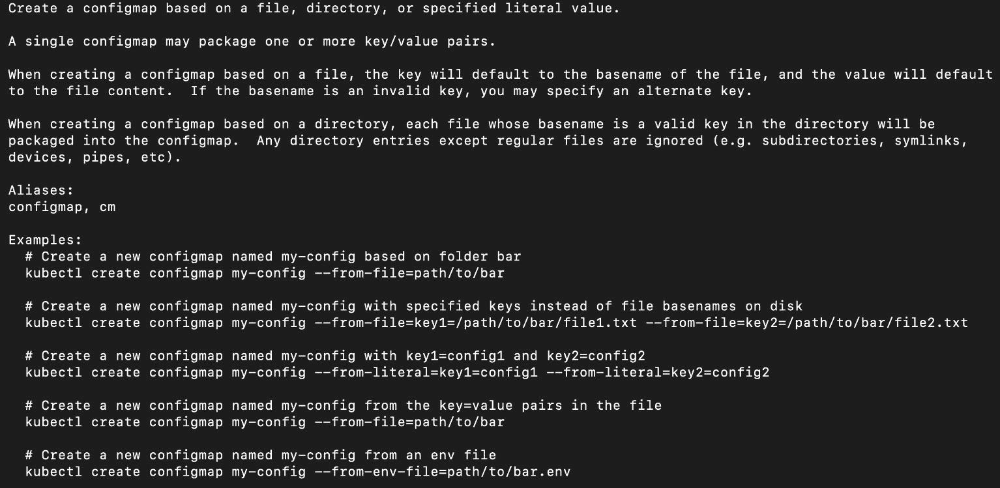

图 10.1：Kubernetes 内置帮助创建 ConfigMap

从前面的输出中可以看出，ConfigMaps 可以用于创建单个值、值列表，或者整个文件或目录。我们将在本章的练习中学习如何分别执行这些操作。请注意，创建 ConfigMap 的命令格式如下：

```
kubectl create configmap <map-name> <data-source>
```

这里，`<map-name>` 是您想要分配给 ConfigMap 的名称，`<data-source>` 是要从中提取数据的目录、文件或文字值。

数据源对应于 ConfigMap 中的键值对，其中：

+   **键**是您在命令行上提供的文件名或键

+   **值**是您在命令行上提供的文件内容或文字值

在开始练习之前，让我们确保您的 Kubernetes 正在运行，并且您可以向其发出命令。我们将使用 minikube 在您的本地计算机上轻松运行单节点集群。

使用以下命令启动 minikube：

```
minikube start
```

当 minikube 启动时，您应该看到以下响应：

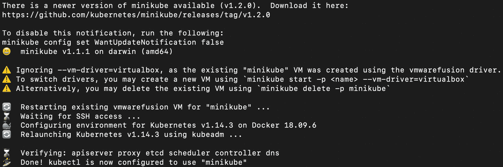

图 10.2：启动 minikube

对于本章中的所有练习，我们建议创建一个新的命名空间。回想一下*第五章*，*Pods*，命名空间是 Kubernetes 将解决方案组件分组在一起的方式。命名空间可以用于应用策略、配额，并且还可以用于分隔资源，如果相同的 Kubernetes 资源被不同的团队使用。

在下一个练习中，我们将使用 kubectl CLI 命令从文字值创建一个 ConfigMap。其思想是我们有一些配置数据（例如，主数据库名称），我们可以将其注入到 MySQL Pod 中，并且它将根据给定的环境变量创建数据库。这组命令也可以用于负责在多个环境中进行应用部署的自动化代码流水线中。

## 练习 10.01：从文字值创建 ConfigMap 并将其挂载到 Pod 上使用环境变量

在这个练习中，我们将在 Kubernetes 集群中创建一个 ConfigMap。此练习展示了如何使用键值模式创建 ConfigMaps。请按照以下步骤完成练习：

1.  首先，让我们开始创建一个命名空间，用于本章中的所有练习。

```
kubectl create namespace configmap-test
```

您应该看到以下响应：

```
namespace/configmap-test created
```

注意

除非另有说明，我们将在本章的所有练习中使用 `configmap-test` 命名空间。

1.  首先，让我们创建一个包含单个名称-值对的 ConfigMap。使用此处显示的命令：

```
kubectl create configmap singlevalue-map --from-literal=partner-url=https://www.auppost.com.au --namespace configmap-test 
```

您应该在终端中看到以下输出：

```
configmap/singlevalue-map created
```

1.  创建 ConfigMap 后，让我们通过发出命令来获取命名空间中的所有 ConfigMap 来确认它是否已创建：

```
kubectl get configmaps --namespace configmap-test
```

由于`singlevalue-map`是`configmap-test`命名空间中唯一的 ConfigMap，您应该看到类似以下内容的输出：

```
NAME                 DATA     AGE
singlevalue-map      1        111s
```

1.  让我们看看 Kubernetes ConfigMap 对象是什么样子的。输入以下 Kubernetes `get`命令：

```
kubectl get configmap singlevalue-map -o yaml --namespace configmap-test
```

完整对象应该描述为以下内容：

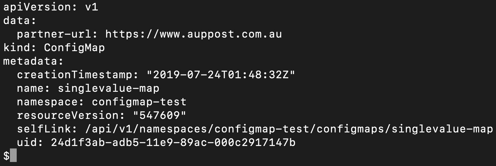

图 10.3：描述 singlevalue-map

正如您在前述输出的第三行中所看到的，ConfigMap 已创建，并且我们输入的文字值作为键值对出现在 ConfigMap 的`data`部分中。

1.  现在，我们将创建一个名为`configmap-as-env.yaml`的 YAML 文件，以创建一个 Pod，我们将从我们的 ConfigMap 中注入字段作为环境变量。使用您喜欢的文本编辑器，创建一个包含以下内容的 YAML 文件：

```
apiVersion: v1
kind: Pod
metadata:
  name: configmap-env-pod
spec:
  containers:
    - name: configmap-container
      image: k8s.gcr.io/busybox
      command: [ "/bin/sh", "-c", "env" ]
      envFrom:
      - configMapRef:
          name: singlevalue-map
```

您可以看到前述文件中的`envFrom`部分正在从 ConfigMap 加载数据。

1.  让我们根据前述规范创建一个 Pod。此 Pod 使用**busybox**容器映像，该映像运行在前述步骤中提到的 YAML 文件的`command`部分中指定的命令：

```
kubectl create -f configmap-as-env.yaml --namespace configmap-test
```

您应该看到以下输出：

```
pod/configmap-env-pod created
```

1.  让我们使用以下命令检查此 Pod 的日志：

```
kubectl logs -f configmap-env-pod --namespace configmap-test
```

您应该看到如下所示的日志：

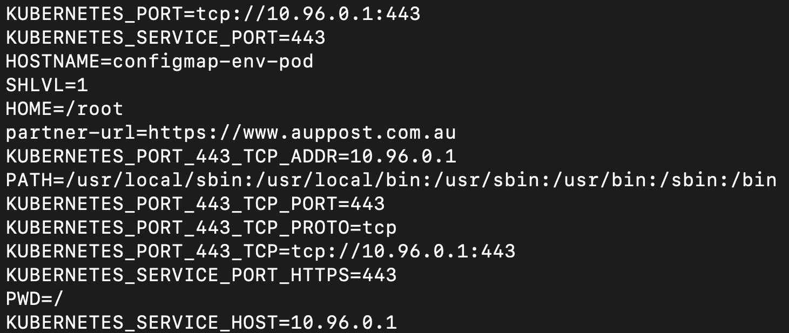

图 10.4：获取 configmap-env-pod 的日志

`[ "/bin/sh", "-c", "env" ]`命令将显示加载到 Pod 中的所有环境变量。在 ConfigMap 中，我们已将属性名称定义为`partner-url`，这是输出的一部分。

在这个练习中，环境变量的名称`partner-url`与我们的键值对中的键相同。我们还可以使环境变量的名称与键不同。例如，如果我们想要将`partner-server-location`作为我们环境变量的名称，我们可以用以下内容替换练习中 YAML 文件的内容：

```
apiVersion: v1
kind: Pod
metadata:
  name: configmap-multi-env-pod
spec:
  containers:
    - name: configmap-container
      image: k8s.gcr.io/busybox
      command: [ "/bin/sh", "-c", "echo $(partner-server-location)"         ]
      env:
        - name: partner-server-location
          valueFrom:
            configMapKeyRef:
              name: singlevalue-map
              key: partner-url
```

特别注意前面 YAML 文件中的`env`部分。`env`后的第一个`name`字段定义了环境变量的名称，`configMapKeyRef`下的`key`字段定义了 ConfigMap 中的键的名称。

## 从文件定义一个 ConfigMap 并将其加载到 Pod 上

在这一部分，我们将从文件创建一个 ConfigMap，然后将文件加载到应用程序 Pod 上。如前所述，这个新挂载的文件将作为本地文件对 Pod 内运行的应用程序可访问。

当应用程序将其配置数据存储在外部时，这是很常见的，这样可以更容易地在不同环境中进行升级和容器镜像的补丁。我们可以在源代码控制存储库中拥有这样一个文件，并且使用 ConfigMap 在正确的容器中加载正确的文件。

让我们通过一个例子来理解这一点。想象一下，你编写了一个连接到数据库存储信息的 Web 应用程序。当你在开发环境部署应用程序时，你会想要连接到开发数据库。一旦你确信应用程序正常工作，你会想要将应用程序部署到测试环境。由于应用程序打包在一个容器中，你不希望改变容器来部署应用程序到测试环境。但是在测试环境中运行应用程序时，你需要连接到一个不同的数据库。一个简单的解决方案是配置你的应用程序从文件中读取数据库服务器的 URL，并且该文件可以通过 ConfigMap 挂载。这样，文件不作为容器的一部分打包，而是通过 Kubernetes 从外部注入；因此，你不需要修改你的容器化应用程序。另一个用例是外部软件供应商可以提供一个容器镜像，并且可以根据特定客户的要求挂载任何特定的配置设置到镜像上。

## 练习 10.02：从文件创建一个 ConfigMap

在这个练习中，我们将从文件创建一个 ConfigMap，然后可以挂载到任何 Pod 上：

1.  首先，创建一个名为`application.properties`的文件，其中包含以下配置细节。你可以使用你喜欢的文本编辑器：

```
partner-url=https://www.fedex.com
partner-key=1234
```

1.  现在，使用以下命令从文件创建一个 ConfigMap：

```
kubectl create configmap full-file-map --from-file=./application.properties --namespace configmap-test
```

你应该看到以下输出，表明 ConfigMap 已经被创建：

```
configmap/full-file-map created
```

1.  获取所有 ConfigMaps 的列表以确认我们的 ConfigMap 已经创建：

```
kubectl get configmaps --namespace configmap-test
```

您应该看到所有 ConfigMaps 的列表，如下所示：

```
NAME               DATA      AGE
full-file-map      1         109m
singlevalue-map    1         127m
```

您可以看到 ConfigMaps 的名称与它们拥有的键的数量一起显示。

您可能会想知道，为什么这个输出只显示一个键，即使我们添加了两个键？让我们在下一步中理解这一点。

1.  让我们看看如何使用以下命令存储 ConfigMap：

```
kubectl get configmap full-file-map -o yaml --namespace configmap-test
```

您应该看到以下输出：

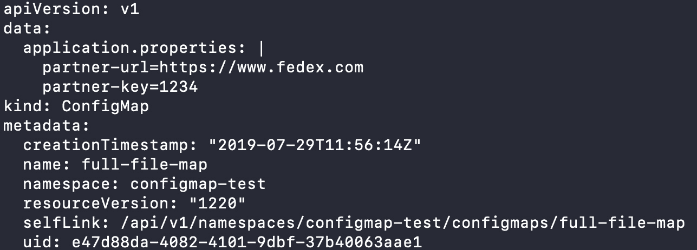

图 10.5：获取完整文件映射的详细信息

请注意，文件名`application.properties`成为`data`部分下的**key**，整个文件负载是 key 的**value**。

1.  现在我们已经定义了我们的 ConfigMap，下一步是将其挂载到容器上。创建一个名为`mount-configmap-as-volume.yaml`的 YAML 文件，用以下内容作为我们的 Pod 配置：

```
apiVersion: v1
kind: Pod
metadata:
  name: configmap-test-pod
spec:
  containers:
    - name: configmap-container
      image: k8s.gcr.io/busybox
      command: [ "/bin/sh", "-c", "ls /etc/appconfig/" ]
      volumeMounts:
      - name: config-volume
        mountPath: /etc/appconfig
  volumes:
    - name: config-volume
      configMap:
        # Provide the name of the ConfigMap containing the           files you want
        # to add to the container
        name: full-file-map
  restartPolicy: Never
```

首先，让我们专注于前面文件中的`volumes`部分。在这个部分中，我们指示 Kubernetes 从名为`full-file-map`的 ConfigMap 中定义一个卷。

其次，在`volumeMounts`部分，我们定义 Kubernetes 应该在`/etc/appconfig`目录中挂载卷。

请注意容器中的`command`字段允许我们配置容器在启动时要执行的命令。在这个例子中，我们运行`ls`命令，这是一个列出目录内容的 Linux 命令。这类似于 Windows 的`dir`命令。这将打印出我们挂载了 ConfigMap 的`/etc/appconfig`目录的内容。

注意

`volume`和`volumeMounts`部分下的`name`字段必须相同，以便 Kubernetes 可以识别哪个`volume`与哪个`volumeMounts`相关联。

1.  现在，使用以下命令使用我们刚刚创建的 YAML 文件启动一个 Pod：

```
kubectl create -f mount-configmap-as-volume.yaml --namespace configmap-test
```

您应该收到一个回复，说 Pod 已经创建：

```
pod/configmap-test-pod created
```

1.  我们使用的 YAML 文件指定了 Pod 的名称为`configmap-test-pod`，并配置它只显示文件夹的内容。要验证这一点，只需发出以下命令以获取 Pod 的输出日志：

```
kubectl logs -f configmap-test-pod --namespace configmap-test
```

这应该打印出`application.properties`，这是我们放在文件夹中的文件：

```
application.properties
```

如您所见，我们得到了`/etc/appconfig`的内容，这是 Pod 中`ls`命令的输出。

您刚刚成功定义了一个 ConfigMap，并将其作为文件挂载到一个打印文件名的 Pod 中。

## 练习 10.03：从文件夹创建 ConfigMap

在这个练习中，我们将所有文件加载到一个文件夹中作为 ConfigMap。每个文件名都成为 ConfigMap 的一个键，当您挂载它时，所有文件都将挂载到`volumeMounts`位置（如在 YAML 文件中为容器定义的）：

1.  在一个新文件夹中创建两个文件。将其中一个命名为`fileone.txt`，其内容为`file one`，将另一个命名为`filetwo.txt`，其内容为`file two`。此练习的文件夹名称可以是任意的。您可以使用`ls`命令确认已创建文件：

```
ls
```

您将看到以下文件列表：

```
fileone.txt     filetwo.txt
```

1.  使用以下命令从文件夹创建 ConfigMap。请注意，我们只提到文件夹的名称，而不是指定文件名：

```
kubectl create configmap map-from-folder --from-file=./ -n configmap-test
```

您应该看到以下响应：

```
configmap/map-from-folder created
```

1.  现在，让我们描述一下 ConfigMap，看看它包含什么：

```
kubectl describe configmap map-from-folder -n configmap-test
```

您应该看到以下输出：

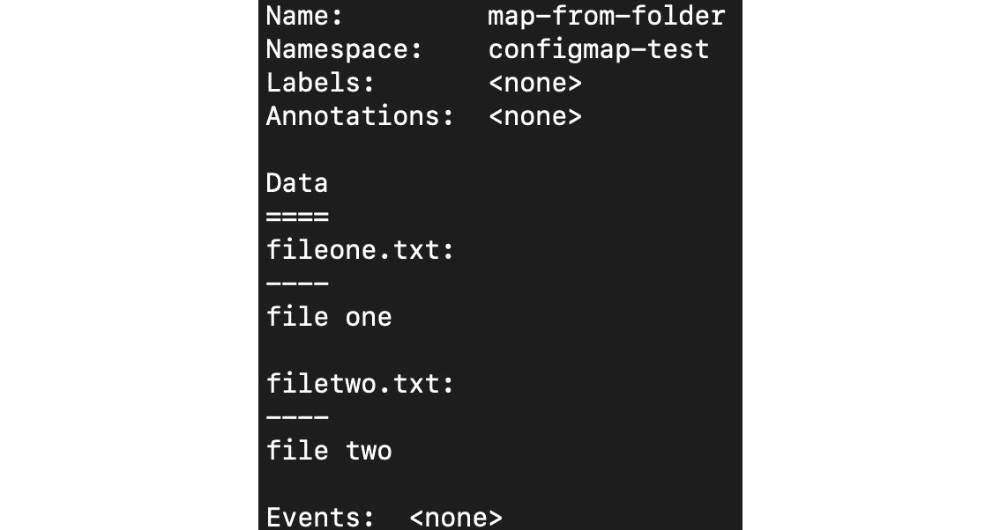

图 10.6：描述了从文件夹创建的 ConfigMap

请注意，ConfigMap 中有两个键-每个文件一个，即`fileone.txt`和`filetwo.txt`。键的值是文件的内容。因此，我们可以看到可以从文件夹中的所有文件创建 ConfigMap。

# 什么是秘密？

ConfigMap 提供了一种将应用程序配置数据与应用程序本身解耦的方法。但是，ConfigMap 的问题在于它将数据以明文形式存储为 Kubernetes 对象。如果我们想要存储一些**敏感数据**，例如数据库密码，该怎么办？Kubernetes Secret 提供了一种存储敏感数据的方式，然后可以将其提供给需要的应用程序。

## 秘密与 ConfigMap

您可以将秘密视为与 ConfigMap 相同，具有以下区别：

1.  与 ConfigMap 不同，秘密旨在存储少量（秘密为 1 MB）敏感数据。秘密是**base64**编码的，因此我们不能将其视为安全。它还可以存储二进制数据，例如公钥或私钥。

1.  Kubernetes 确保只将秘密传递给运行需要相应秘密的 Pod 的节点。

注意

存储敏感数据的另一种方法是使用诸如 HashiCorp Vault 之类的保险库解决方案。我们已经将这样的实现超出了研讨会的范围。

但是等等；如果 Kubernetes Secrets 由于它们的 base64 编码而不够安全，那么存储极其敏感的数据的解决方案是什么？一种方法是对其进行加密，然后将其存储在 Secrets 中。数据可以在加载到 Pod 时进行解密，尽管我们将此实现范围之外的实现。

一旦我们定义了我们的 Secrets，我们需要将它们暴露给应用程序 Pods。我们将 Secrets 暴露给运行的应用程序的方式与 ConfigMaps 相同，即通过将它们挂载为环境变量或文件。

与 ConfigMaps 一样，让我们使用 Kubernetes 提供的`secret`的内置`help`命令来查看提供的 Secrets 的类型：

```
kubectl create secret --help
```

`help`命令应该显示如下内容：

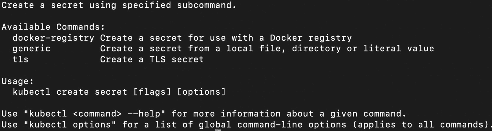

图 10.7：Secret 的内置帮助命令的输出

如您在前面的输出中所见，`Available Commands`部分列出了三种类型的 Secrets：

+   `generic`：通用 Secret 包含任何自定义键值对。

+   `tls`：TLS Secret 是一种用于使用 TLS 协议进行通信的公钥-私钥对的特殊类型的 Secret。

+   `docker-registry`：这是一种特殊类型的 Secret，用于存储访问 Docker 注册表的用户名、密码和电子邮件地址。

我们将在接下来的练习中深入探讨这些 Secrets 的实现和用途。

## 练习 10.04：从文字值定义一个 Secret，并将值加载到 Pod 作为环境变量

在这个练习中，我们将从文字值定义一个 Secret，并将其作为环境变量加载到运行中的 Kubernetes Pod 中。这个文字值可能是您内部数据库的密码。由于我们从文字值创建这个 Secret，它将被归类为**通用** Secret。按照以下步骤执行练习：

1.  首先，使用以下命令创建一个将保存简单密码的 Secret：

```
kubectl create secret generic test-secret --from-literal=password=secretvalue --namespace configmap-test
```

您应该得到以下响应：

```
secret/test-secret created
```

1.  一旦我们定义了我们的 Secret，我们可以使用 Kubernetes 的`describe`命令获取更多关于它的详细信息：

```
kubectl describe secret test-secret --namespace configmap-test
```

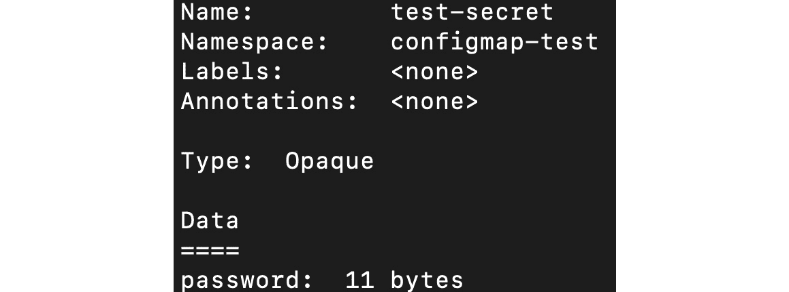

图 10.8：描述 test-secret

您可以看到它将我们的值存储在`password`键下：

1.  现在我们的 Secret 已创建，我们将在 Pod 中将其挂载为环境变量。要创建一个 Pod，请创建一个名为`mount-secret-as-env.yaml`的 YAML 文件，内容如下：

```
apiVersion: v1
kind: Pod
metadata:
  name: secret-env-pod
spec:
  containers:
    - name: secret-container
      image: k8s.gcr.io/busybox
      command: [ "/bin/sh", "-c", "env" ]
      envFrom:
      - secretRef:
          name: test-secret
```

注意`envFrom`部分，其中提到要加载的秘密。在容器的`command`部分中，我们指定了`env`命令，这将使容器显示加载到 Pod 中的所有环境变量。

1.  现在，让我们使用 YAML 配置来创建一个 Pod，并看它的运行情况：

```
kubectl create -f mount-secret-as-env.yaml --namespace=configmap-test
```

您应该会看到以下类似的回应：

```
pod/secret-env-pod created
```

1.  现在，让我们获取 Pod 的日志，以查看容器显示的所有环境变量：

```
kubectl logs -f secret-env-pod --namespace=configmap-test
```

您应该会看到类似以下截图的日志：

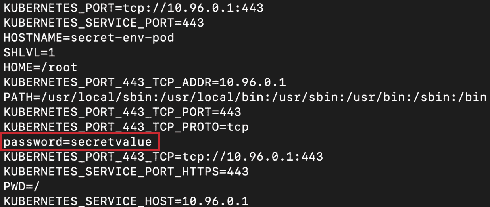

图 10.9：从 secret-env-pod 获取日志

正如您在前面的输出的突出显示行中所看到的，`password`键显示为`secretvalue`，这就是我们指定的值。

以下练习演示了如何使用公私钥组合，并将私钥文件挂载到 Pod 中。然后，公钥可以提供给连接到该 Pod 的任何其他服务，但本练习中没有演示。使用一个单独的文件作为秘密使我们能够使用任何类型的文件，而不仅仅是简单的键值字符串。这就打开了使用私钥存储等二进制文件的可能性。

## 练习 10.05：从文件定义一个秘钥，并将值作为文件加载到 Pod 上

在这个练习中，我们将创建一个私钥，将其存储在一个新的秘密中，然后将其加载到一个 Pod 中作为一个文件：

1.  首先，让我们创建一个私钥。我们将使用一个用于创建 SSH 密钥的工具。在终端中输入以下命令：

```
ssh-keygen -f ~/test_rsa -t rsa -b 4096 -C "test@example.com"
```

如果提示，请不要为密钥提供任何密码。

注意

如果您需要更多关于 SSH 协议及其用途的信息，请参考[`www.ssh.com/ssh/protocol/`](https://www.ssh.com/ssh/protocol/)。

执行成功后，您将看到两个名为`test_rsa`和`test_rsa.pub`的文件。您应该会看到类似于这里显示的输出：

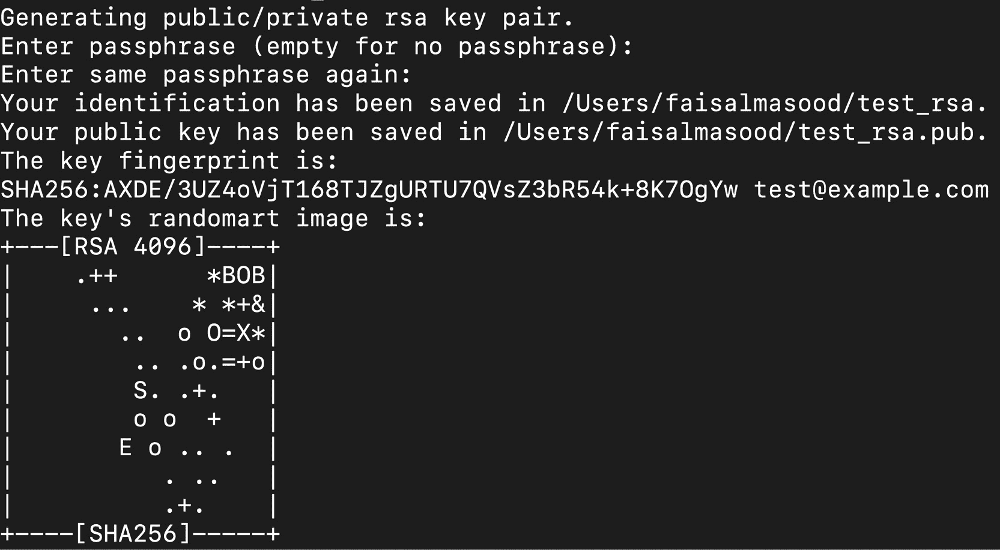

图 10.10：创建 SSH 密钥

您的输出可能与此处显示的不完全相同，因为密钥是随机的。

注意

大多数 Linux 发行版都包括`ssh-keygen`工具。但是，如果您没有或无法使用`ssh-keygen`，您可以使用任何其他文件代替私钥来进行此练习。

1.  现在，让我们将新创建的私钥加载为一个秘密。这次，我们将使用`create secret`命令的`from-file`参数：

```
kubectl create secret generic test-key-secret --from-file=private-key=/Users/faisalmassod/test_rsa --namespace=configmap-test
```

您应该会得到这样的回应：

```
secret/test-key-secret created
```

1.  创建了 Secret 之后，我们可以使用`describe`命令获取其详细信息：

```
kubectl describe secret test-key-secret --namespace=configmap-test
```

秘密应该描述如下：

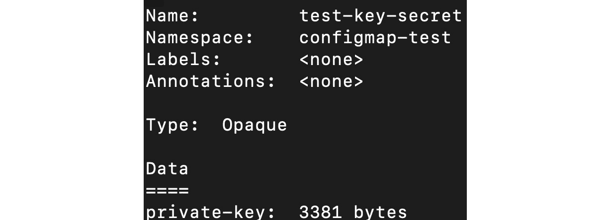

图 10.11：描述 test-key-secret

1.  现在我们的 Secret 已经创建，让我们将其挂载到一个 Pod 上。这个过程类似于挂载 ConfigMap。首先，创建一个名为`mount-secret-as-volume.yaml`的 YAML 文件，内容如下：

```
apiVersion: v1
kind: Pod
metadata:
  name: secret-test-pod
spec:
  containers:
    - name: secret-container
      image: k8s.gcr.io/busybox
      command: [ "/bin/sh", "-c", "ls /etc/appconfig/; cat         /etc/appconfig/private-key" ]
      volumeMounts:
      - name: secret-volume
        mountPath: /etc/appconfig
  volumes:
    - name: secret-volume
      secret:
        # Provide the name of the Secret containing the files           you want
        # to add to the container
        secretName: test-key-secret
```

在前面的 Pod 规范中，请注意`volumes`的挂载方式与我们之前挂载 ConfigMap 的方式相同。在`volumes`部分，我们指示 Kubernetes 从我们的 Secret 中定义一个卷。在`volumeMounts`部分，我们定义了 Kubernetes 应该将卷挂载到的特定路径。`"/bin/sh", "-c", "ls /etc/appconfig/; cat /etc/appconfig/private-key"`命令将打印出作为 Secret 加载到其中的文件的内容。

注意

`volume`和`volumeMounts`部分的`name`字段必须相同，这样 Kubernetes 才能识别哪个`volume`与哪个`volumeMounts`相关联。在本例中，我们在两个地方都使用了`secret-volume`作为名称。

1.  现在，让我们使用以下命令使用 YAML 文件作为 Pod 定义来创建一个 Pod：

```
kubectl create -f mount-secret-as-volume.yaml --namespace=configmap-test
```

如果 Pod 成功创建，您应该会看到以下输出：

```
pod/secret-test-pod created
```

1.  要检查我们的 Pod 是否加载了 Secret，我们可以获取其日志并检查它们。使用以下命令：

```
kubectl logs -f secret-test-pod --namespace=configmap-test
```

日志应该显示私钥的内容，如下所示：

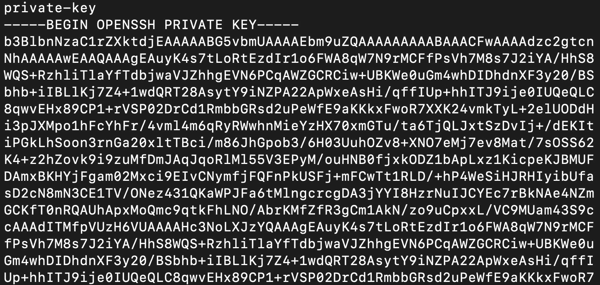

图 10.12：获取 secret-test-pod 的日志

从日志中可以看出，容器显示了挂载到 Pod 上的 Secret 的内容。

注意

由于 SSH 密钥是随机的，您的输出可能与此处显示的内容不完全相同。

1.  SSH 密钥是随机的，因此每次您都会得到不同的输出。您可以尝试多次进行此练习并自行查看。确保每次要么删除 Pod，要么更改名称。您可以使用以下命令删除 Pod：

```
kubectl delete pod secret-test-pod --namespace=configmap-test
```

如果 Pod 成功删除，您将看到以下输出：

```
pod "secret-test-pod" deleted
```

在这个练习中，我们使用另一个工具创建了一个密钥对，并将私钥加载到我们的 Pod 中，将其作为二进制文件进行挂载。然而，在 TLS 协议中，公私钥对用于加密，这是一种用于保护网络流量的加密标准。

注意

要了解有关 TLS 的更多信息，请参考[`www.cloudflare.com/learning/ssl/transport-layer-security-tls/`](https://www.cloudflare.com/learning/ssl/transport-layer-security-tls/)。

Kubernetes 提供了自己的方式来创建密钥对并存储 TLS 密钥。让我们看看如何在以下练习中创建 TLS Secret。

## 练习 10.06：创建 TLS 密钥

在这个练习中，我们将看到如何创建一个可以存储 TLS 加密密钥的 Secret：

1.  使用以下命令创建一对私钥-公钥：

```
openssl req -x509 -nodes -days 365 -newkey rsa:2048 -keyout tls.key -out tls.crt -subj "/CN=kube.example.com"
```

此命令将在名为`tls.key`的文件中创建私钥，并在名为`tls.crt`的文件中创建公钥证书。

注意

有关此处如何使用**openssl**工具的更多详细信息，请参考[`www.openssl.org/docs/manmaster/man1/req.html`](https://www.openssl.org/docs/manmaster/man1/req.html)。

如果密钥成功生成，您应该看到以下输出：

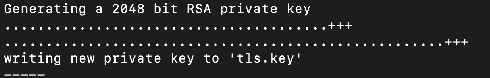

图 10.13：创建 SSL 密钥

1.  一旦成功，我们可以使用以下命令创建一个 Secret 来保存文件：

```
kubectl create secret tls test-tls --key="tls.key" --cert="tls.crt" --namespace=configmap-test
```

一旦 Secret 成功创建，您将看到以下输出：

```
secret/test-tls created
```

1.  使用以下命令列出`configmap-test`命名空间中的所有 Secrets，以验证我们的 Secret 是否已创建：

```
kubectl get secrets --namespace configmap-test
```

我们的 Secret 必须列在以下输出中：

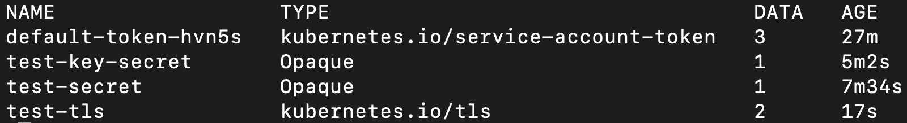

图 10.14：列出 configmap-test 中的所有 Secrets

1.  如果我们对新创建的 Secret 发出`describe`命令，您会看到它将两部分，即公钥和私钥，存储为 Secret 的两个不同键：

```
kubectl describe secrets test-tls --namespace configmap-test
```

您应该看到以下响应：

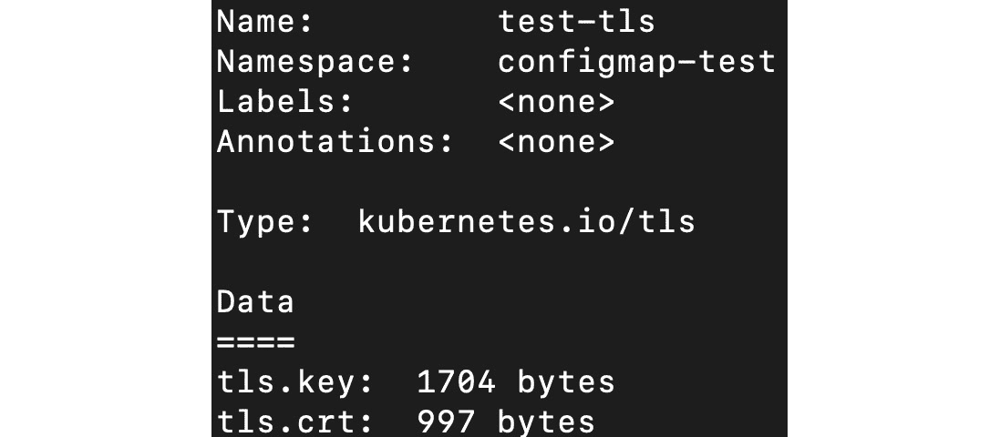

图 10.15：描述 test-tls

因此，我们使用 Kubernetes 提供的一组特殊命令创建了一组 TLS 的公钥-私钥。这个 Secret 可以以与*练习 10.05*中演示的类似方式挂载，即*从文件定义 Secret 并将值加载到 Pod 中作为文件*。

另一个常见的任务是从外部 Docker 注册表中获取 Docker 镜像。许多组织使用企业容器注册表（例如 Nexus）来存储其应用程序，然后根据需要获取和部署。Kubernetes 还提供了一种特殊类型的 Secret 来存储访问这些 Docker 注册表的身份验证信息。让我们看看如何在以下练习中实现它。

## 练习 10.07：创建一个 docker-registry Secret

在这个练习中，我们将创建一个**docker-registry** Secret，用于在从注册表获取 Docker 镜像时进行身份验证：

1.  我们可以直接使用以下命令创建 Secret：

```
kubectl create secret docker-registry test-docker-registry-secret --docker-username=test --docker-password=testpassword --docker-email=example@a.com --namespace configmap-test
```

正如你在命令参数中所看到的，我们需要指定 Docker 帐户的用户名、密码和电子邮件地址。一旦 Secret 被创建，你应该会看到以下响应：

```
secret/test-docker-registry-secret created
```

1.  通过使用以下命令来验证它是否已创建：

```
kubectl get secrets test-docker-registry-secret --namespace configmap-test
```

你应该看到`test-docker-registry-secret`如下输出所示：

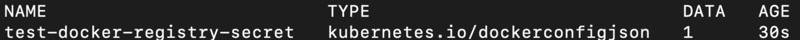

图 10.16：检查 test-docker-registry-secret

1.  让我们使用`describe`命令并获取有关我们的 Secret 的更多详细信息：

```
kubectl describe secrets test-docker-registry-secret --namespace configmap-test
```

该命令应返回以下详细信息：

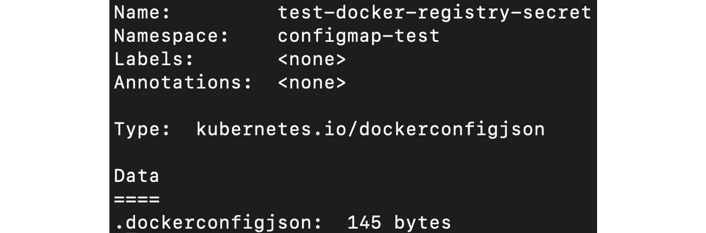

图 10.17：描述 test-docker-registry-secret

正如你在前面的输出的`Data`部分中所看到的，已创建了一个名为`.dockerconfigjson`的单个键。

注意

这个练习只是一种加载`.dockerconfigjson`文件的简单方法。你可以使用其他方法手动创建和加载文件，并实现我们在这个练习中的相同目标。

## 活动 10.01：使用 ConfigMap 和 Secret 来推广应用程序通过不同阶段

假设我们有一个应用程序，我们想要将其推广到不同的环境。你的任务是将应用程序从测试环境推广到生产环境，每个环境都有不同的配置数据。

在这个活动中，我们将使用 ConfigMap 和 Secret 来轻松地为应用程序在其生命周期的不同阶段重新配置。这也应该让你了解到，将 ConfigMap 数据和 Secret 数据与应用程序分离可以帮助应用程序更容易地在开发和部署的各个阶段之间过渡。

这些指南应该帮助你完成这个活动：

1.  定义一个名为`my-app-test`的命名空间。

1.  在`my-app-test`命名空间中定义一个名为`my-app-data`的 ConfigMap，并具有以下键值：

```
external-system-location=https://testvendor.example.com
external-system-basic-auth-username=user123
```

1.  在`my-app-test`命名空间中定义一个名为`my-app-secret`的 Secret，并具有以下键值：

```
external-system-basic-auth-password=password123
```

1.  定义一个 Pod 规范，并在`/etc/app-data`文件夹中部署 ConfigMap，文件名为`application-data.properties`。

1.  定义一个 Pod 规范，并在`/etc/secure-data`文件夹中部署 Secret，文件名为`application-secure.properties`。

1.  运行 Pod，以便它显示 ConfigMap 和 Secret 中的所有内容。你应该看到类似这样的东西：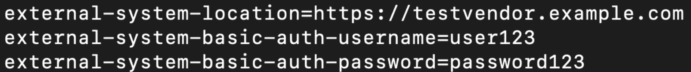

图 10.18：测试环境的键值

1.  定义另一个名为`my-app-production`的命名空间。

1.  在`my-app-production`中定义一个名为`my-app-data`的 ConfigMap，具有以下键值：

```
external-system-location=https://vendor.example.com
external-system-basic-auth-username=activityapplicationuser
```

1.  在`my-app-production`中定义一个名为`my-app-secret`的 Secret，具有以下键值：

```
external-system-basic-auth-password=A#4b*(1=B88%tFr3
```

1.  使用与*步骤 5*中定义的相同的 Pod 规范，并在`my-app-production`命名空间中运行 Pod。

1.  检查在`my-app-production`中运行的应用程序是否显示了正确的数据。你应该看到类似这样的输出：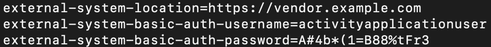

图 10.19：生产环境的键值

注意

这个活动的解决方案可以在以下地址找到：[`packt.live/304PEoD`](https://packt.live/304PEoD)。GitHub 存储库还包括了一个用于此活动的 Bash 脚本，它将自动执行所有这些解决方案步骤。但是，请查看解决方案中提供的详细步骤，以完全了解如何执行该活动。

# 摘要

在本章中，我们已经看到 Kubernetes 提供的不同方式，用于将环境特定数据与作为容器运行的应用程序相关联。

Kubernetes 提供了将敏感数据存储为 Secrets 和将普通应用程序数据存储为 ConfigMaps 的方式。我们还看到了如何通过 CLI 创建 ConfigMaps 和 Secrets，并将它们与我们的容器关联起来。通过命令行运行所有内容将有助于自动化这些步骤，并提高应用程序的整体灵活性。

将数据与容器关联使我们能够在 IT 系统的不同环境中使用相同的容器（例如，在测试和生产环境中）。在不同环境中使用相同的容器为 IT 流程提供了安全和可信的代码推广技术。每个团队都可以将容器作为部署单元，并对容器进行签名，以便其他方可以信任该容器。这也为分发代码提供了一种可信赖的方式，不仅可以在同一 IT 组织内部，还可以跨多个组织之间进行。例如，软件供应商可以直接向您提供打包软件的容器。然后可以使用 ConfigMaps 和 Secrets 来提供特定的配置，以在您的组织中使用打包软件。

接下来的章节都是关于部署 Kubernetes 并在高可用模式下运行它。这些章节将为您提供关于如何运行稳定的 Kubernetes 集群的基本和实用知识。
