# 第十一章： 构建您自己的 HA 集群

概述

在本章中，我们将学习 Kubernetes 如何使我们能够部署具有显著弹性的基础设施，以及如何在 AWS 云中设置一个高可用性的 Kubernetes 集群。本章将帮助您了解是什么使 Kubernetes 能够用于高可用性部署，并帮助您在为您的用例设计生产环境时做出正确的选择。在本章结束时，您将能够在 AWS 上设置一个适当的集群基础设施，以支持您的高可用性（HA）Kubernetes 集群。您还将能够在生产环境中部署应用程序。

# 介绍

在之前的章节中，您了解了应用程序容器化、Kubernetes 的工作原理，以及 Kubernetes 中的一些“专有名词”或“对象”，这些对象允许您创建一种声明式的应用程序架构，Kubernetes 将代表您执行。

软件和硬件的不稳定在所有环境中都是现实。随着应用程序对更高可用性的需求越来越高，基础设施的缺陷变得更加明显。Kubernetes 是专门为帮助解决容器化应用程序的这一挑战而构建的。但是 Kubernetes 本身呢？作为集群操作员，我们是不是要从像鹰一样监视我们的单个服务器，转而监视我们的单个 Kubernetes 控制基础设施呢？

事实证明，这一方面是 Kubernetes 设计考虑的一个方面。Kubernetes 的设计目标之一是能够经受住其自身基础设施的不稳定性。这意味着当正确设置时，Kubernetes 控制平面可以经受相当多的灾难，包括：

+   网络分裂/分区

+   控制平面（主节点）服务器故障

+   etcd 中的数据损坏

+   许多其他影响可用性的不太严重的事件

不仅可以 Kubernetes 帮助您的应用程序容忍故障，而且您可以放心，因为 Kubernetes 也可以容忍其自身控制基础设施的故障。在本章中，我们将建立一个属于我们自己的集群，并确保它具有高可用性。高可用性意味着系统非常可靠，几乎总是可用的。这并不意味着其中的一切总是完美运行；它只意味着每当用户或客户端需要某些东西时，架构规定 API 服务器应该“可用”来完成工作。这意味着我们必须为我们的应用程序设计一个系统，以自动响应并对任何故障采取纠正措施。

在本章中，我们将看看 Kubernetes 如何整合这些措施来容忍其自身控制架构中的故障。然后，您将有机会进一步扩展这个概念，通过设计您的应用程序来利用这种横向可扩展、容错的架构。但首先，让我们看看机器中不同齿轮如何一起转动，使其具有高可用性。

# Kubernetes 组件如何一起实现高可用性

您已经在《第二章》《Kubernetes 概述》中学到了 Kubernetes 的各个部分是如何一起工作，为您的应用程序容器提供运行时的。但我们需要更深入地研究这些组件如何一起实现高可用性。为了做到这一点，我们将从 Kubernetes 的内存库，也就是 etcd 开始。

## etcd

正如您在之前的章节中学到的，etcd 是存储所有 Kubernetes 配置的地方。这使得它可以说是集群中最重要的组件，因为 etcd 中的更改会影响一切的状态。更具体地说，对 etcd 中的键值对的任何更改都会导致 Kubernetes 的其他组件对此更改做出反应，这可能会导致对您的应用程序的中断。为了实现 Kubernetes 的高可用性，最好有多个 etcd 节点。

但是，当您将多个节点添加到像 etcd 这样的最终一致性数据存储中时，会出现更多的挑战。您是否必须向每个节点写入以保持状态的更改？复制是如何工作的？我们是从一个节点读取还是尽可能多地读取？它如何处理网络故障和分区？谁是集群的主节点，领导者选举是如何工作的？简短的答案是，通过设计，etcd 使这些挑战要么不存在，要么易于处理。etcd 使用一种称为**Raft**的共识算法来实现复制和容错，以解决上述许多问题。因此，如果我们正在构建一个 Kubernetes 高可用性集群，我们需要确保正确设置多个节点（最好是奇数，以便更容易进行领导者选举）的 etcd 集群，并且我们可以依靠它。

注意

etcd 中的领导者选举是一个过程，数据库软件的多个实例共同投票，决定哪个主机将成为处理实现数据库一致性所需的任何问题的权威。有关更多详细信息，请参阅此链接：[`raft.github.io/`](https://raft.github.io/)

## 网络和 DNS

许多在 Kubernetes 上运行的应用程序都需要某种形式的网络才能发挥作用。因此，在为您的集群设计拓扑时，网络是一个重要考虑因素。例如，您的网络应该能够支持应用程序使用的所有协议，包括 Kubernetes 使用的协议。Kubernetes 本身在主节点、节点和 etcd 之间的所有通信都使用 TCP，它还使用 UDP 进行内部域名解析，也就是服务发现。您的网络还应该配置为至少具有与您计划在集群中拥有的节点数量一样多的 IP 地址。例如，如果您计划在集群中拥有超过 256 台机器（节点），那么您可能不应该使用/24 或更高的 IP CIDR 地址空间，因为这样只有 255 个或更少的可用 IP 地址。

在本次研讨会的后续部分，我们将讨论作为集群操作员需要做出的安全决策。然而，在本节中，我们不会讨论这些问题，因为它们与 Kubernetes 实现高可用性的能力没有直接关系。我们将在 *第十三章* *Kubernetes 中的运行时和网络安全* 中处理 Kubernetes 的安全性。

最后要考虑的一件事是你的主节点和工作节点所在的网络，即每个主节点都应该能够与每个工作节点通信。这一点很重要，因为每个主节点都要与工作节点上运行的 Kubelet 进程通信，以确定整个集群的状态。

## 节点和主服务器的位置和资源

由于 etcd 的 Raft 算法的设计，它允许 Kubernetes 的键值存储中发生分布式一致性，我们能够运行多个主节点，每个主节点都能够控制整个集群，而不必担心它们会独立行动（换句话说，变得不受控制）。提醒一下，主节点不同步在 Kubernetes 中是一个问题，考虑到你的应用程序的运行时是由 Kubernetes 代表你发出的命令来控制的。如果由于主节点之间的状态同步问题而导致这些命令发生冲突，那么你的应用程序运行时将受到影响。通过引入多个主节点，我们再次提供了对可能危及集群可用性的故障和网络分区的抵抗力。

Kubernetes 实际上能够以“无头”模式运行。这意味着 Kubelets（工作节点）最后从主节点接收的任何指令都将继续执行，直到可以重新与主节点通信。理论上，这意味着部署在 Kubernetes 上的应用程序可以无限期地运行，即使整个控制平面（所有主节点）崩溃，应用程序所在的工作节点上的 Pods 没有发生任何变化。显然，这是集群可用性的最坏情况，但令人放心的是，即使在最坏的情况下，应用程序不一定会遭受停机时间。

当您计划设计和容量高可用性部署 Kubernetes 时，重要的是要了解一些关于您的网络设计的事情，我们之前讨论过。例如，如果您在流行的云提供商中运行集群，它们可能有“可用区”的概念。数据中心环境的类似概念可能是物理隔离的数据中心。如果可能的话，每个可用区应至少有一个主节点和多个工作节点。这很重要，因为在可用区（数据中心）停机的情况下，您的集群仍然能够在剩余的可用区内运行。这在以下图表中有所说明：

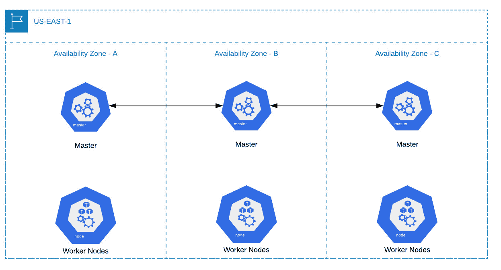

图 11.1：可用区停机前的集群

假设可用区 C 完全停机，或者至少我们不再能够与其中运行的任何服务器进行通信。现在集群的行为如下：

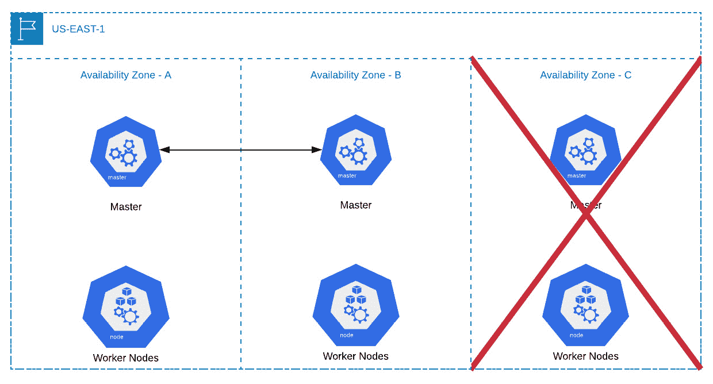

图 11.2：可用区停机后的集群

正如您在图表中所看到的，Kubernetes 仍然可以执行。此外，如果在可用区 C 中运行的节点的丢失导致应用程序不再处于其期望的状态，这是由应用程序的 Kubernetes 清单所决定的，剩余的主节点将工作以在剩余的工作节点上安排中断的工作负载。

注意

根据您的 Kubernetes 集群中工作节点的数量，您可能需要计划额外的资源约束，因为运行连接到多个工作节点的主节点所需的 CPU 功率。您可以使用此链接中的图表来确定应该部署用于控制您的集群的主节点的资源要求：[`kubernetes.io/docs/setup/best-practices/cluster-large/`](https://kubernetes.io/docs/setup/best-practices/cluster-large/)

## 容器网络接口和集群 DNS

关于您的集群，您需要做出的下一个决定是容器本身如何在每个节点之间进行通信。Kubernetes 本身有一个容器网络接口称为**kubenet**，这是我们在本章中将使用的。

对于较小的部署和简单的操作，从容器网络接口（CNI）的角度来看，kubenet 已经超出了这些集群的需求。然而，它并不适用于每种工作负载和网络拓扑。因此，Kubernetes 提供了对几种不同 CNI 的支持。在考虑容器网络接口的高可用性时，您会希望选择性能最佳且稳定的选项。本文介绍 Kubernetes 的范围超出了讨论每种 CNI 提供的内容。

注意

如果您计划使用托管的 Kubernetes 服务提供商或计划拥有更复杂的网络拓扑，比如单个 VPC 内的多个子网，kubenet 将无法满足您的需求。在这种情况下，您将不得不选择更高级的选项。有关选择适合您环境的正确 CNI 的更多信息，请参阅此处：[`chrislovecnm.com/kubernetes/cni/choosing-a-cni-provider/`](https://chrislovecnm.com/kubernetes/cni/choosing-a-cni-provider/)

## 容器运行时接口

您将不得不做出的最终决定之一是您的容器将如何在工作节点上运行。Kubernetes 的默认选择是 Docker 容器运行时接口，最初 Kubernetes 是为了与 Docker 配合而构建的。然而，自那时以来，已经开发了开放标准，其他容器运行时接口现在与 Kubernetes API 兼容。一般来说，集群操作员倾向于坚持使用 Docker，因为它非常成熟。即使您想探索其他选择，也请记住，在设计能够维持工作负载和 Kubernetes 高可用性的拓扑时，您可能会选择更成熟和稳定的选项，比如 Docker。

注意

您可以在此页面找到与 Kubernetes 兼容的其他一些容器运行时接口：[`kubernetes.io/docs/setup/production-environment/container-runtimes/`](https://kubernetes.io/docs/setup/production-environment/container-runtimes/)

## 容器存储接口

最近的 Kubernetes 版本引入了与数据中心和云提供商中可用的持久性工具进行交互的改进方法，例如存储阵列和 blob 存储。最重要的改进是引入和标准化了用于管理 Kubernetes 中的`StorageClass`，`PersistentVolume`和`PersistentVolumeClaim`的容器存储接口。对于高可用集群的考虑，您需要针对每个应用程序做出更具体的存储决策。例如，如果您的应用程序使用亚马逊 EBS 卷，这些卷必须驻留在一个可用区内，那么您将需要确保工作节点具有适当的冗余，以便在发生故障时可以重新安排依赖于该卷的 Pod。有关 CSI 驱动程序和实现的更多信息，请访问：[`kubernetes-csi.github.io/docs/`](https://kubernetes-csi.github.io/docs/)

# 构建一个以高可用性为重点的 Kubernetes 集群

希望通过阅读前面的部分，您开始意识到当您首次接触这个主题时，Kubernetes 并不像看起来那么神奇。它本身是一个非常强大的工具，但当我们充分利用其在高可用配置中运行的能力时，Kubernetes 真正发挥作用。现在我们将看到如何实施它，并实际使用集群生命周期管理工具构建一个集群。但在我们这样做之前，我们需要了解我们可以部署和管理 Kubernetes 集群的不同方式。

## 自管理与供应商管理的 Kubernetes 解决方案

亚马逊网络服务，谷歌云平台，微软 Azure，以及几乎所有其他主要的云服务提供商都提供了托管的 Kubernetes 解决方案。因此，当您决定如何构建和运行您的集群时，您应该考虑一些不同的托管提供商及其战略性的提供，以确定它们是否符合您的业务需求和目标。例如，如果您使用亚马逊网络服务，那么 Amazon EKS 可能是一个可行的解决方案。

选择托管服务提供商而不是开源和自我管理的解决方案存在一些权衡。例如，很多集群组装的繁重工作都已经为您完成，但在这个过程中您放弃了很多控制权。因此，您需要决定您对能够控制 Kubernetes 主平面有多少价值，以及您是否希望能够选择您的容器网络接口或容器运行时接口。出于本教程的目的，我们将使用开源解决方案，因为它可以部署在任何地方，并且还可以帮助我们理解 Kubernetes 的工作原理以及应该如何配置。

注意

请确保您拥有 AWS 账户并能够使用 AWS CLI 访问：[`aws.amazon.com/cli`](https://aws.amazon.com/cli)。

如果您无法访问它，请按照上面的链接中的说明操作。

假设我们现在想要对我们的集群有更多的控制，并且愿意自己管理它，让我们看一些可以用于设置集群的开源工具。

## kops

我们将使用一个更受欢迎的开源安装工具来完成这个过程，这个工具叫做**kops**，它代表**Kubernetes Operations**。它是一个完整的集群生命周期管理工具，并且具有非常易于理解的 API。作为集群创建/更新过程的一部分，kops 可以生成 Terraform 配置文件，因此您可以将基础设施升级过程作为自己流程的一部分运行。它还具有良好的工具支持 Kubernetes 版本之间的升级路径。

注意

Terraform 是一个基础设施生命周期管理工具，我们将在下一章中简要了解。

kops 的一些缺点是它往往落后于 Kubernetes 的两个版本，它并不总是能够像其他工具那样快速响应漏洞公告，并且目前仅限于在 AWS、GCP 和 OpenStack 中创建集群。

我们决定在本章中使用 kops 来管理我们的集群生命周期的原因有四个：

+   我们希望选择一个工具，可以将一些更令人困惑的 Kubernetes 设置抽象化，以便让您更容易进行集群管理。

+   它支持的云平台不仅仅是 AWS，因此如果您选择不使用亚马逊，您不必被锁定在亚马逊上。

+   它支持对 Kubernetes 基础设施进行广泛的定制，例如选择 CNI 提供程序、决定 VPC 网络拓扑和节点实例组定制。

+   它对零停机集群版本升级有一流的支持，并自动处理该过程。

## 其他常用工具

除了 kops 之外，还有其他几种工具可以用来设置 Kubernetes 集群。您可以在此链接找到完整的列表：[`kubernetes.io/docs/setup/#production-environment`](https://kubernetes.io/docs/setup/#production-environment)。

我们在这里提到其中一些，以便您了解有哪些可用的工具：

+   **kubeadm**：这是从 Kubernetes 源代码生成的工具，它将允许对 Kubernetes 的每个组件进行最大程度的控制。它可以部署在任何环境中。

使用 kubeadm 需要对 Kubernetes 有专家级的了解才能发挥作用。它给集群管理员留下了很少的错误空间，并且使用 kubeadm 升级集群是复杂的。

+   **Kubespray**：这使用 Ansible/Vagrant 风格的配置管理，这对许多 IT 专业人士来说是熟悉的。它更适用于基础设施更为静态而非动态的环境（如云）。Kubespray 非常可组合和可配置，从工具的角度来看。它还允许在裸机服务器上部署集群。关键是要注意协调集群组件和硬件和操作系统的软件升级。由于您提供了云提供商所做的许多功能，您必须确保您的升级过程不会破坏运行在集群之上的应用程序。

因为 Kubespray 使用 Ansible 进行配置，您受到了用于配置大型集群并保持其规范性的 Ansible 底层限制的限制。目前，Kubespray 仅限于以下环境：AWS、GCP、Azure、OpenStack、vSphere、Packet、Oracle Cloud Infrastructure 或您自己的裸机安装。

## Kubernetes 中的身份验证和身份

Kubernetes 使用两个概念进行身份验证：ServiceAccounts 用于标识在 Pods 内运行的进程，而 User Accounts 用于标识人类用户。我们将在本章的后续主题中查看 ServiceAccounts，但首先让我们了解 User Accounts。

从一开始，Kubernetes 一直试图对用户帐户的任何形式的身份验证和身份保持非常中立，因为大多数公司都有一种非常特定的用户身份验证方式。有些使用 Microsoft Active Directory 和 Kerberos，有些可能使用 Unix 密码和 UGW 权限集，有些可能使用云提供商或基于软件的 IAM 解决方案。此外，组织可能使用多种不同的身份验证策略。

因此，Kubernetes 没有内置的身份管理或必需的身份验证方式。相反，它有身份验证“策略”的概念。策略本质上是 Kubernetes 将身份验证的验证委托给另一个系统或方法的方式。

在本章中，我们将使用基于 x509 证书的身份验证。X509 证书身份验证基本上利用了 Kubernetes 证书颁发机构和通用名称/组织名称。由于 Kubernetes RBAC 规则使用`用户名`和`组名`将经过身份验证的身份映射到权限集，x509`通用名称`成为 Kubernetes 的`用户名`，而`组织名称`成为 Kubernetes 中的`组名`。kops 会自动为您提供基于 x509 的身份验证证书，因此几乎不用担心；但是当涉及添加自己的用户时，您需要注意这一点。

注意

Kubernetes RBAC 代表基于角色的访问控制，它允许我们根据用户的角色允许或拒绝对某些访问的访问。这将在*第十三章*《Kubernetes 中的运行时和网络安全》中更深入地介绍。

kops 的一个有趣特性是，你可以像使用 kubectl 管理集群资源一样使用它来管理集群资源。kops 处理节点的方式类似于 Kubernetes 处理 Pod 的方式。就像 Kubernetes 有一个名为“Deployment”的资源来管理一组 Pods，kops 有一个名为**InstanceGroup**的资源（也可以用它的简写形式`ig`）来管理一组节点。在 AWS 的情况下，kops InstanceGroup 实际上创建了一个 AWS EC2 自动扩展组。

扩展这个比较，`kops get instancegroups`或`kops get ig`类似于`kubectl get deployments`，`kops edit`的工作方式类似于`kubectl edit`。我们将在本章后面的活动中使用这个功能，但首先，让我们在下面的练习中启动和运行我们的基本 HA 集群基础设施。

注意

在本章中，命令是使用 Zsh shell 运行的。但是，它们与 Bash 完全兼容。

## 练习 11.01：设置我们的 Kubernetes 集群

注意

这个练习将超出 AWS 免费套餐的范围，该套餐通常赠送给新账户持有者的前 12 个月。EC2 的定价信息可以在这里找到：[`aws.amazon.com/ec2/pricing/`](https://aws.amazon.com/ec2/pricing/)

此外，您应该记得在本章结束时删除您的实例，以停止对您消耗的 AWS 资源进行计费。

在这个练习中，我们将准备在 AWS 上运行 Kubernetes 集群的基础设施。选择 AWS 并没有什么特别之处；Kubernetes 是平台无关的，尽管它已经有了允许它与本地 AWS 服务（EBS、EC2 和 IAM）集成的代码，代表集群运营商。这对于 Azure、GCP、IBM Cloud 和许多其他云平台也是如此。

我们将建立一个具有以下规格的集群：

+   三个主节点

+   三个 etcd 节点（为了简单起见，我们将在主节点上运行这些节点）

+   两个工作节点

+   至少两个可用区

一旦我们设置好了我们的集群，我们将在下一个练习中在其上部署一个应用程序。现在按照以下步骤完成这个练习：

1.  确保您已按*前言*中的说明安装了 kops。使用以下命令验证 kops 是否已正确安装和配置：

```
kops version
```

您应该看到以下响应：

```
Version 1.15.0 (git-9992b4055)
```

现在在我们继续以下步骤之前，我们需要在 AWS 中进行一些设置。以下大部分设置都是可配置的，但为了方便起见，我们将为您做出一些决定。

1.  首先，我们将设置一个 AWS IAM 用户，kops 将用它来提供您的基础设施。在您的终端中依次运行以下命令：

```
aws iam create-group --group-name kops
aws iam attach-group-policy --policy-arn arn:aws:iam::aws:policy/AmazonEC2FullAccess --group-name kops
aws iam attach-group-policy --policy-arn arn:aws:iam::aws:policy/AmazonRoute53FullAccess --group-name kops
aws iam attach-group-policy --policy-arn arn:aws:iam::aws:policy/AmazonS3FullAccess --group-name kops
aws iam attach-group-policy --policy-arn arn:aws:iam::aws:policy/IAMFullAccess --group-name kops
aws iam attach-group-policy --policy-arn arn:aws:iam::aws:policy/AmazonVPCFullAccess --group-name kops
aws iam create-user --user-name kops
aws iam add-user-to-group --user-name kops --group-name kops
aws iam create-access-key --user-name kops
```

您应该看到类似于这样的输出：

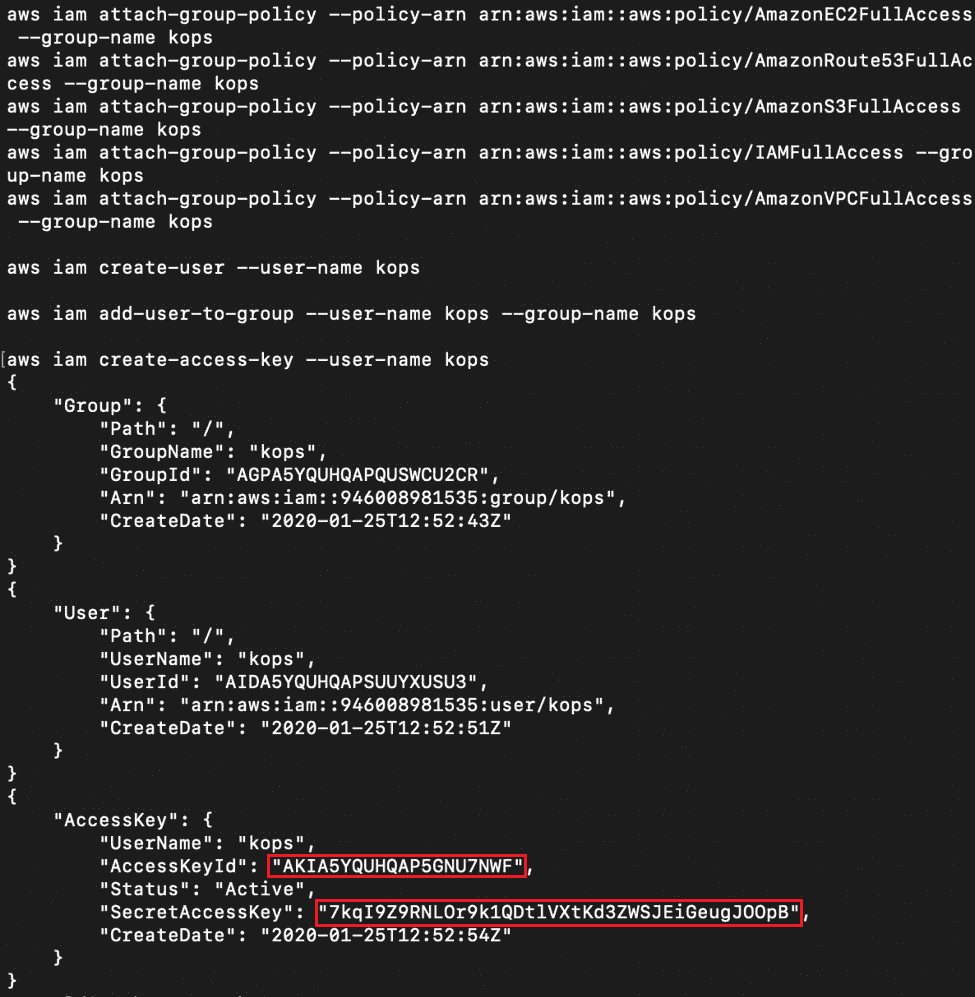

图 11.3：为 kops 设置 IAM 用户

注意突出显示的`AccessKeyID`和`SecretAccessKey`字段，这是您将收到的输出。这是敏感信息，前面截图中的密钥当然将被作者作废。我们将需要突出显示的信息进行下一步操作。

1.  接下来，我们需要将为 kops 创建的凭据导出为环境变量，用于我们的终端会话。使用前一步截图中的突出信息：

```
export AWS_ACCESS_KEY_ID=<AccessKeyId>
export AWS_SECRET_ACCESS_KEY=<SecretAccessKey>
```

1.  接下来，我们需要为 kops 创建一个 S3 存储桶来存储其状态。要创建一个随机的存储桶名称，请运行以下命令：

```
export BUCKET_NAME="kops-$(LC_ALL=C tr -dc 'a-z0-9' </dev/urandom | head -c 13 ; echo)" && echo $BUCKET_NAME
```

第二个命令输出创建的 S3 存储桶的名称，您应该看到类似以下的响应：

```
kops-aptjv0e9o2wet
```

1.  运行以下命令，使用 AWS CLI 创建所需的存储桶：

```
aws s3 mb s3://$BUCKET_NAME --region us-west-2
```

在这里，我们使用`us-west-2`地区。如果您愿意，您可以使用离您更近的地区。对于成功创建存储桶，您应该看到以下响应：

```
make_bucket: kops-aptjv0e9o2wet
```

现在我们有了 S3 存储桶，我们可以开始设置我们的集群。我们可以选择许多选项，但现在我们将使用默认设置。

1.  导出您的集群名称和 kops 将用于存储其状态的 S3 存储桶的名称：

```
export NAME=myfirstcluster.k8s.local
export KOPS_STATE_STORE=s3://$BUCKET_NAME
```

1.  生成所有的配置并将其存储在之前的 S3 存储桶中，使用以下命令创建一个 Kubernetes 集群：

```
kops create cluster --zones us-west-2a,us-west-2b,us-west-2c --master-count=3 --kubernetes-version=1.15.0 --name $NAME
```

通过传递`--zones`参数，我们正在指定我们希望集群跨越的可用区域，并通过指定`master-count=3`参数，我们有效地表示我们要使用一个高可用的 Kubernetes 集群。默认情况下，kops 将创建两个工作节点。

请注意，这实际上并没有创建集群，而是创建了一系列的预检查，以便我们可以在短时间内创建一个集群。它通知我们，为了访问 AWS 实例，我们需要提供一个公钥 - 默认搜索位置是`~/.ssh/id_rsa.pub`。

1.  现在，我们需要创建一个 SSH 密钥，以添加到所有的主节点和工作节点，这样我们就可以用 SSH 登录到它们。使用以下命令：

```
kops create secret --name myfirstcluster.k8s.local sshpublickey admin -i ~/.ssh/id_rsa.pub
```

秘钥类型（`sshpublickey`）是 kops 为此操作保留的特殊关键字。更多信息可以在此链接找到：[`github.com/kubernetes/kops/blob/master/docs/cli/kops_create_secret_sshpublickey.md`](https://github.com/kubernetes/kops/blob/master/docs/cli/kops_create_secret_sshpublickey.md)。

注意

在这里指定的密钥`~/.ssh/id_rsa.pub`将是 kops 要分发到所有主节点和工作节点并可用于从本地计算机到运行服务器进行诊断或维护目的的密钥。

您可以使用以下命令使用密钥以管理员帐户登录：

```
ssh -i ~/.ssh/id_rsa admin@<public_ip_of_instance>
```

虽然这对于这个练习并不是必需的，但你会发现这对以后的章节很有用。

1.  要查看我们的配置，请运行以下命令：

```
kops edit cluster $NAME
```

这将打开您的文本编辑器，并显示我们集群的定义，如下所示：

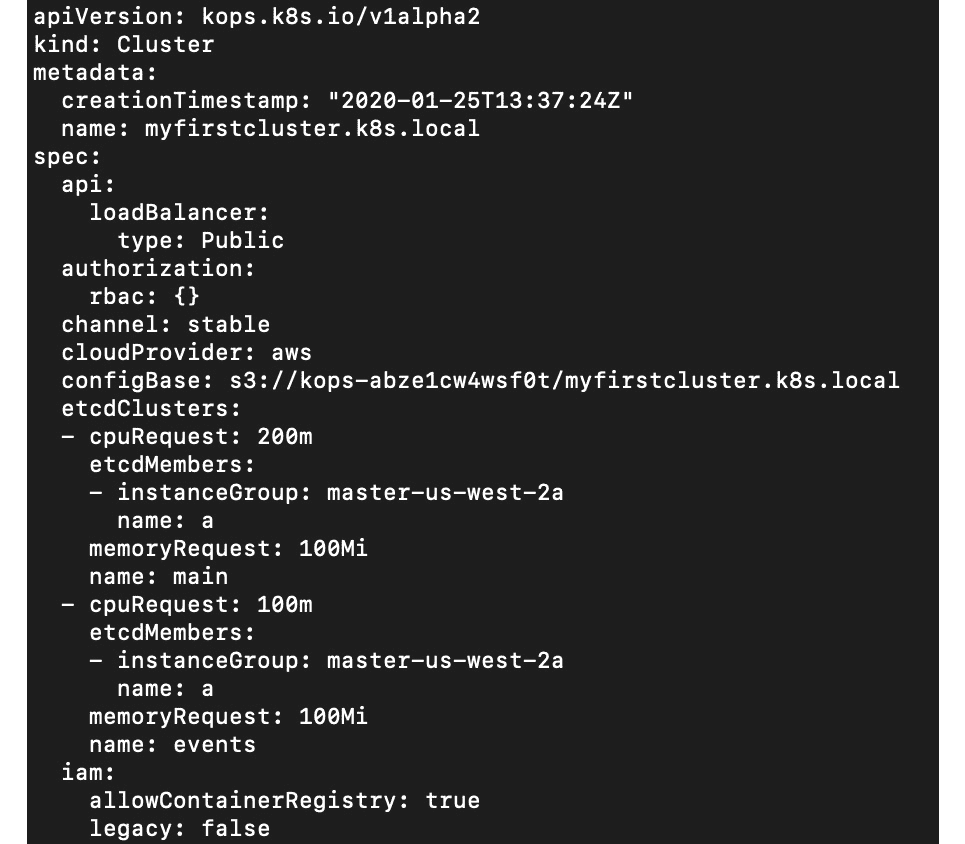

图 11.4：检查我们集群的定义

为了简洁起见，我们已经截取了这个屏幕截图。在这一点上，你可以进行任何编辑，但是对于这个练习，我们将继续进行而不进行任何更改。为了简洁起见，我们将不在本研讨会的范围内保留此规范的描述。如果您想了解 kops 的`clusterSpec`中各种元素的更多细节，可以在这里找到更多详细信息：[`github.com/kubernetes/kops/blob/master/docs/cluster_spec.md`](https://github.com/kubernetes/kops/blob/master/docs/cluster_spec.md)。

1.  现在，拿出我们在 S3 中生成并存储的配置，并实际运行命令，以使 AWS 基础设施与我们在配置文件中所说的想要的状态相一致：

```
kops update cluster $NAME --yes
```

注意

默认情况下，kops 中的所有命令都是 dry-run（除了一些验证步骤外，实际上什么都不会发生），除非您指定`--yes`标志。这是一种保护措施，以防止您在生产环境中意外地对集群造成危害。

这将需要很长时间，但完成后，我们将拥有一个可工作的 Kubernetes HA 集群。您应该看到以下响应：

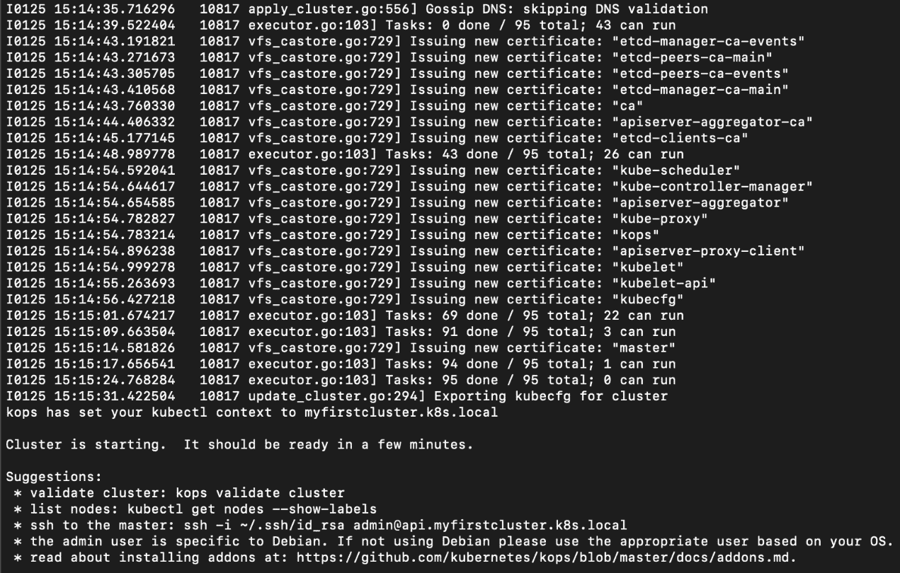

图 11.5：更新集群以匹配生成的定义

1.  为了验证我们的集群是否正在运行，让我们运行以下命令。这可能需要 5-10 分钟才能完全运行：

```
kops validate cluster
```

您应该看到以下响应：

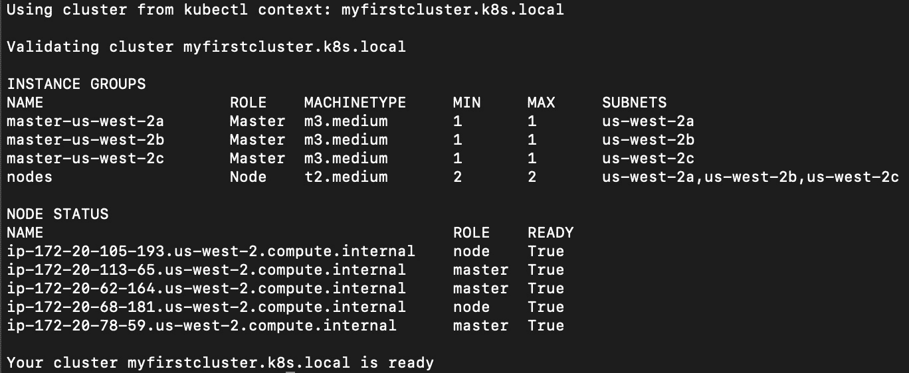

图 11.6：验证我们的集群

从这个屏幕截图中，我们可以看到我们有三个 Kubernetes 主节点分布在不同的可用区，并且两个工作节点分布在三个可用区中的两个（使这个集群具有高可用性）。此外，所有节点以及集群似乎都是健康的。

注意

请记住，您的集群资源仍在运行。如果您计划在一段时间后继续进行下一个练习，您可能希望删除此集群以停止对 AWS 资源的计费。要删除此集群，您可以使用以下命令：

`kops delete cluster --name ${NAME} --yes`

## Kubernetes Service Accounts

正如我们之前学到的，Kubernetes ServiceAccount 对象用作 Pod 内部进程的标识标记。虽然 Kubernetes 不管理和验证人类用户的身份，但它管理和验证 ServiceAccount 对象。然后，类似于用户，您可以允许 ServiceAccount 对 Kubernetes 资源进行基于角色的访问。

ServiceAccount 充当使用**JSON Web Token**（**JWT**）样式、基于标头的身份验证方式对集群进行身份验证的一种方式。每个 ServiceAccount 都与一个令牌配对，该令牌存储在由 Kubernetes API 创建的秘密中，然后挂载到与该 ServiceAccount 关联的 Pod 中。每当 Pod 中的任何进程需要发出 API 请求时，它会将令牌与请求一起传递给 API 服务器，Kubernetes 会将该请求映射到 ServiceAccount。基于该身份，Kubernetes 可以确定应该授予该进程对资源/对象（授权）的访问级别。通常，ServiceAccount 只分配给集群内部的 Pod 使用，因为它们只用于内部使用。ServiceAccount 是一个 Kubernetes 命名空间范围的对象。

ServiceAccount 的示例规范如下：

```
apiVersion: v1
kind: ServiceAccount
metadata:
  name: admin-user
  namespace: kube-system
```

我们将在下一个练习中使用这个示例。您可以通过在对象的定义中包含这个字段来将这个 ServiceAccount 附加到一个对象，比如一个 Kubernetes 部署：

```
serviceAccountName: admin-user
```

如果您创建一个 Kubernetes 对象而没有指定服务账户，它将会被创建为`default`服务账户。`default`服务账户是 Kubernetes 为每个命名空间创建的。

在接下来的练习中，我们将在我们的集群上部署 Kubernetes 仪表板。Kubernetes 仪表板可以说是任何 Kubernetes 集群中运行的最有用的工具之一。它对于调试 Kubernetes 中的工作负载配置问题非常有用。

注意

您可以在这里找到更多信息：[`kubernetes.io/docs/tasks/access-application-cluster/web-ui-dashboard/`](https://kubernetes.io/docs/tasks/access-application-cluster/web-ui-dashboard/)。

## 练习 11.02：在我们的 HA 集群上部署应用程序

在这个练习中，我们将使用在上一个练习中部署的相同集群，并部署 Kubernetes 仪表板。如果您已经删除了集群资源，请重新运行上一个练习。kops 将自动将所需的信息添加到本地 Kube 配置文件中以连接到集群，并将该集群设置为默认上下文。

由于 Kubernetes 仪表板是一个帮助我们进行管理任务的应用程序，`default` ServiceAccount 没有足够的权限。在这个练习中，我们将创建一个具有广泛权限的新 ServiceAccount：

1.  首先，我们将应用直接从官方 Kubernetes 存储库获取的 Kubernetes 仪表板清单。这个清单定义了我们应用程序所需的所有对象。运行以下命令：

```
kubectl apply -f https://raw.githubusercontent.com/kubernetes/dashboard/v2.0.0-beta1/aio/deploy/recommended.yaml
```

您应该看到以下响应：

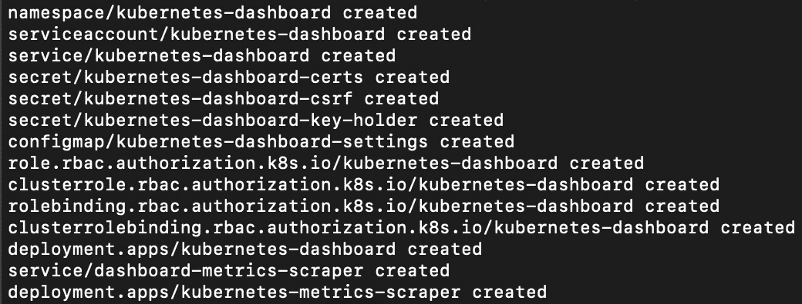

图 11.7：应用 Kubernetes 仪表板的清单

1.  接下来，我们需要配置一个 ServiceAccount 来访问仪表板。为此，请创建一个名为`sa.yaml`的文件，并包含以下内容：

```
apiVersion: v1
kind: ServiceAccount
metadata:
  name: admin-user
  namespace: kube-system
---
apiVersion: rbac.authorization.k8s.io/v1
kind: ClusterRoleBinding
metadata:
  name: admin-user
roleRef:
  apiGroup: rbac.authorization.k8s.io
  kind: ClusterRole
  name: cluster-admin
subjects:
- kind: ServiceAccount
  name: admin-user
  namespace: kube-system
```

注意

我们给这个用户非常宽松的权限，所以请小心处理访问令牌。ClusterRole 和 ClusterRoleBinding 对象是 RBAC 策略的一部分，这在《第十三章》《Kubernetes 中的运行时和网络安全》中有所涵盖。

1.  接下来，运行以下命令：

```
kubectl apply -f sa.yaml
```

您应该看到这个响应：

```
serviceaccount/admin-user created
clusterrolebinding.rbac.authorization.k8s.io/admin-user created
```

1.  现在，让我们通过运行以下命令来确认 ServiceAccount 的详细信息：

```
kubectl describe serviceaccount -n kube-system admin-user
```

您应该看到以下响应：

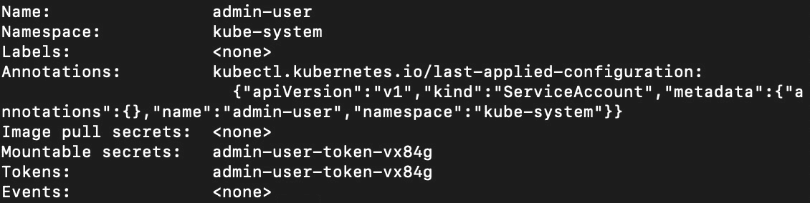

图 11.8：检查我们的 ServiceAccount

当您在 Kubernetes 中创建一个 ServiceAccount 时，它还会在相同的命名空间中创建一个包含用于对 API 服务器进行 API 调用所需的 JWT 内容的 Secret。正如我们从前面的截图中所看到的，这种情况下的 Secret 的名称是`admin-user-token-vx84g`。

1.  让我们检查`secret`对象：

```
kubectl get secret -n kube-system -o yaml admin-user-token-vx84g
```

您应该看到以下输出：

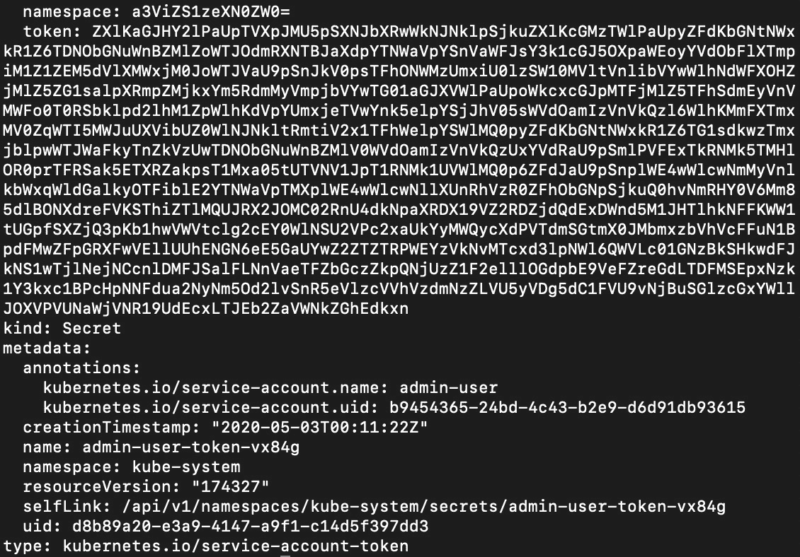

图 11.9：检查我们的 ServiceAccount 中的令牌

这是输出的一个截断截图。正如我们所看到的，我们在这个秘密中有一个令牌。请注意，这是 Base64 编码的，我们将在下一步中解码。

1.  现在我们需要账户 Kubernetes 为我们创建的令牌的内容，所以让我们使用这个命令：

```
kubectl -n kube-system get secret $(kubectl -n kube-system get secret | grep admin-user | awk '{print $1}') -o jsonpath='{.data.token}' | base64 --decode
```

让我们分解这个命令。该命令获取名为`admin-user`的密钥，因为我们创建了一个具有该名称的 ServiceAccount。当在 Kubernetes 中创建 ServiceAccount 时，它会放置一个与我们用于对集群进行身份验证的令牌同名的密钥。命令的其余部分是用于将结果解码为有用的形式以便复制和粘贴到仪表板中的语法糖。您应该得到如下截图所示的输出：

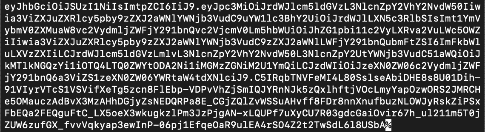

图 11.10：获取与 admin-user ServiceAccount 关联的令牌的内容

复制您收到的输出，但要小心不要复制输出末尾看到的`$`或`%`符号（在 Bash 或 Zsh 中看到）。

1.  默认情况下，Kubernetes 仪表板不会暴露给集群外的公共互联网。因此，为了使用浏览器访问它，我们需要一种允许浏览器与 Kubernetes 容器网络内的 Pod 进行通信的方式。一个有用的方法是使用内置在`kubectl`中的代理：

```
kubectl proxy
```

您应该看到这个响应：

```
Starting to serve on 127.0.0.1:8001
```

1.  打开浏览器并导航到以下 URL：

```
http://localhost:8001/api/v1/namespaces/kubernetes-dashboard/services/https:kubernetes-dashboard:/proxy/
```

您应该看到以下提示：

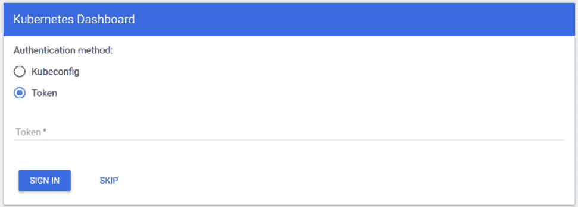

图 11.11：输入令牌以登录 Kubernetes 仪表板

粘贴从*步骤 4*复制的令牌，然后单击`SIGN IN`按钮。

成功登录后，您应该看到仪表板如下截图所示：

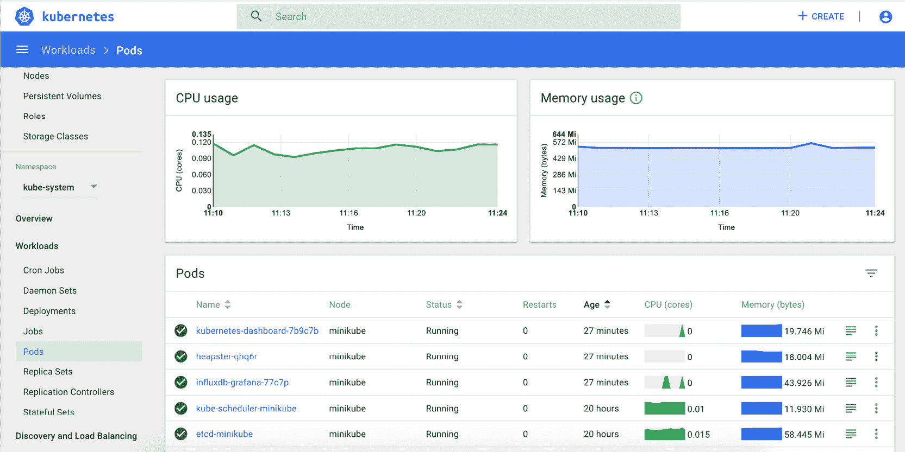

图 11.12：Kubernetes 仪表板登陆页面

在这个练习中，我们已经部署了 Kubernetes 仪表板到集群，以便您可以从方便的 GUI 管理您的应用程序。在部署此应用程序的过程中，我们已经看到了如何为我们的集群创建 ServiceAccounts。

在本章中，您已经学会了如何使用 kops 创建云基础架构，以创建一个高可用的 Kubernetes 集群。然后，我们部署了 Kubernetes 仪表板，并在此过程中了解了 ServiceAccounts。现在您已经看到了创建集群并在其上运行应用程序所需的步骤，我们将创建另一个集群，并在接下来的活动中看到其弹性。

## 活动 11.01：测试高可用集群的弹性

在这个活动中，我们将测试我们自己创建的 Kubernetes 集群的弹性。以下是进行此活动的一些指南：

1.  部署 Kubernetes 仪表板。但是这次，将运行应用程序的部署的副本计数设置为高于`1`的值。

Kubernetes Dashboard 应用程序在由名为`kubernetes-dashboard`的部署管理的 Pod 上运行，该部署在名为`kubernetes-dashboard`的命名空间中运行。这是您需要操作的部署。

1.  现在，开始从 AWS 控制台关闭各种节点，以删除节点，删除 Pod，并尽力使底层系统不稳定。

1.  在您尝试关闭集群的每次尝试后，如果控制台仍然可访问，请刷新 Kubernetes 控制台。只要从应用程序获得任何响应，这意味着集群和我们的应用程序（在本例中为 Kubernetes 仪表板）仍然在线。只要应用程序在线，您应该能够访问 Kubernetes 仪表板，如下截图所示：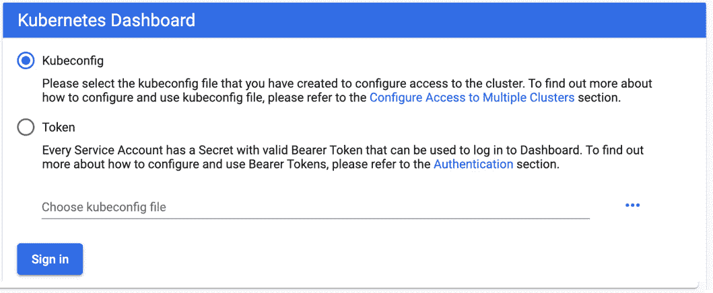

图 11.13：Kubernetes 仪表板提示输入令牌

此截图仅显示您需要输入令牌的提示，但足以表明我们的应用程序在线。如果您的请求超时，这意味着我们的集群不再可用。

1.  加入另一个节点到这个集群。

为了实现这一点，您需要找到并编辑管理节点的 InstanceGroup 资源。规范包含`maxSize`和`minSize`字段，您可以操纵这些字段来控制节点的数量。当您更新您的集群以匹配修改后的规范时，您应该能够看到三个节点，如下截图所示：

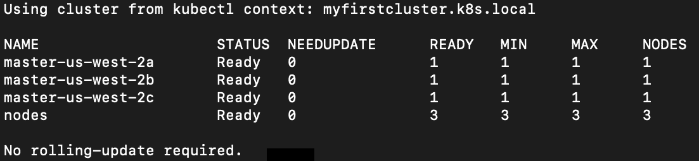

图 11.14：集群中主节点和工作节点的数量

注意

此活动的解决方案可在以下地址找到：[`packt.live/304PEoD`](https://packt.live/304PEoD)。确保在完成活动后删除您的集群。有关如何删除集群的更多详细信息，请参见以下部分（*删除我们的集群*）。

## 删除我们的集群

一旦我们完成了本章中的所有练习和活动，您应该通过运行以下命令来删除集群：

```
kops delete cluster --name ${NAME} --yes
```

您应该看到这个响应：

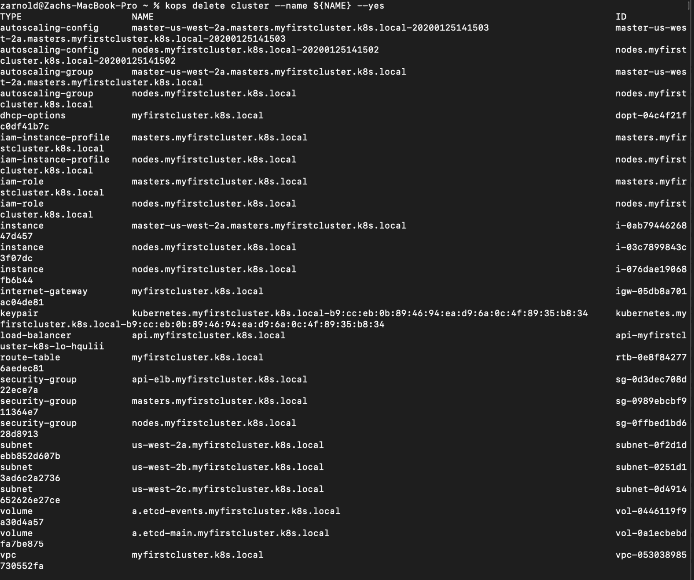

图 11.15：删除我们的集群

在这一点上，您不应该再从 AWS 那里收到本章中您所创建的 Kubernetes 基础架构的费用。

# 总结

高可用基础架构是实现应用程序高可用性的关键组成部分之一。Kubernetes 是一个设计非常精良的工具，具有许多内置的弹性特性，使其能够经受住重大的网络和计算事件。它致力于防止这些事件影响您的应用程序。在我们探索高可用性系统时，我们调查了 Kubernetes 的一些组件以及它们如何共同实现高可用性。然后，我们使用 kops 集群生命周期管理工具在 AWS 上构建了一个旨在实现高可用性的集群。

在下一章中，我们将看看如何通过利用 Kubernetes 原语来确保高可用性，使我们的应用程序更具弹性。
