# 第十二章：12\. 您的应用程序和 HA

概述

在这一章中，我们将通过使用 Terraform 和 Amazon **Elastic Kubernetes Service** (**EKS**)来探索 Kubernetes 集群的生命周期管理。我们还将部署一个应用程序，并学习一些原则，使应用程序更适合 Kubernetes 环境。

本章将指导您如何使用 Terraform 创建一个功能齐全、高可用的 Kubernetes 环境。您将在集群中部署一个应用程序，并修改其功能，使其适用于高可用环境。我们还将学习如何通过使用 Kubernetes 入口资源将来自互联网的流量传输到集群中运行的应用程序。

# 介绍

在上一章中，我们在云环境中设置了我们的第一个多节点 Kubernetes 集群。在本节中，我们将讨论如何为我们的应用程序操作 Kubernetes 集群，即我们将使用集群来运行除了仪表板之外的容器化应用程序。

由于 Kubernetes 的用途与集群操作员所能想象的一样多，因此 Kubernetes 的用例各不相同。因此，我们将对我们为集群操作的应用程序类型做一些假设。我们将优化一个工作流程，用于在基于云的环境中部署具有高可用性要求的具有有状态后端的无状态 Web 应用程序。通过这样做，我们希望能够涵盖人们通常使用 Kubernetes 集群的大部分内容。

Kubernetes 可以用于几乎任何事情。即使我们所涵盖的内容与您对 Kubernetes 的用例不完全匹配，也值得研究，因为这一点很重要。在本章中，我们要做的只是在云中运行一个 Web 应用程序的示例工作流程。一旦您学习了本章中我们将用于运行示例工作流程的原则，您可以在互联网上查找许多其他资源，帮助您发现其他优化工作流程的方式，如果这不符合您的用例。

但在我们继续确保我们将在集群上运行的应用程序的高可用性之前，让我们退一步考虑一下你的云基础设施的高可用性要求。为了在应用程序级别保持高可用性，同样重要的是我们以同样的目标来管理我们的基础设施。这让我们开始讨论基础设施生命周期管理。

# 基础设施生命周期管理概述

简单来说，基础设施生命周期管理是指我们如何在服务器的有用生命周期的每个阶段管理我们的服务器。这涉及到提供、维护和 decommissioning 物理硬件或云资源。由于我们正在利用云基础设施，我们应该利用基础设施生命周期管理工具来以编程方式提供和取消资源。为了理解这一点为什么重要，让我们考虑以下例子。

想象一下，你是一名系统管理员、DevOps 工程师、站点可靠性工程师，或者其他需要处理公司服务器基础设施的角色，而这家公司是数字新闻行业的公司。这意味着，这家公司的员工主要输出的是他们在网站上发布的信息。现在，想象一下，整个网站都在你公司服务器房的一台服务器上运行。服务器上运行的应用程序是一个带有 MySQL 后端的 PHP 博客网站。有一天，一篇文章突然爆红，你突然要处理的流量比前一天多得多。你会怎么做？网站一直崩溃（如果加载的话），你的公司正在因为你试图找到解决方案而损失金钱。

你的解决方案是开始分离关注点并隔离单点故障。你首先要做的是购买更多的硬件并开始配置它，希望能够水平扩展网站。做完这些之后，你运行了五台服务器，其中一台运行着 HAProxy，它负载均衡连接到运行在三台服务器上的 PHP 应用程序和一个数据库服务器上。好吧，现在你觉得你已经控制住了。然而，并非所有的服务器硬件都是一样的——它们运行着不同的 Linux 发行版，每台机器的资源需求也不同，对每台服务器进行补丁、升级和维护变得困难。好巧不巧，又一篇文章突然爆红，你突然面临着比当前硬件能处理的请求量多五倍的情况。现在你该怎么办？继续水平扩展？然而，你只是一个人，所以在配置下一组服务器时很可能会出错。由于这个错误，你以新颖的方式使网站崩溃了，管理层对此并不高兴。你读到这里是不是感到和我写这篇文章时一样紧张？

正是因为配置错误，工程师们开始利用工具和配置编写源代码来定义他们的拓扑结构。这样，如果需要对基础设施状态进行变更，就可以跟踪、控制并以一种使代码负责解决你声明的基础设施状态与实际观察到的状态之间差异的方式进行部署。

基础设施的好坏取决于围绕它的生命周期管理工具和运行在其之上的应用程序。这意味着，如果你的集群构建得很好，但没有工具可以成功地更新集群上的应用程序，那么它就不会为你服务。在本章中，我们将从应用程序级别的视角来看如何利用持续集成构建流水线以零停机、云原生的方式推出新的应用程序更新。

在本章中，我们将为您提供一个测试应用程序进行管理。我们还将使用一个名为**Terraform**的基础设施生命周期管理工具，以更有效地管理 Kubernetes 云基础设施的部署。本章应该能帮助您开发出一套有效的技能，让您能够在 Kubernetes 环境中快速开始创建自己的应用程序交付流水线。

# Terraform

在上一章中，我们使用**kops**从头开始创建了一个 Kubernetes 集群。然而，这个过程可能被视为繁琐且难以复制，这会导致配置错误的高概率，从而在应用程序运行时导致意外事件。幸运的是，有一个非常强大的社区支持的工具，可以很好地解决这个问题，适用于在**亚马逊网络服务**（**AWS**）以及其他几个云平台上运行的 Kubernetes 集群，比如 Azure、**谷歌云平台**（**GCP**）等。

Terraform 是一种通用的基础设施生命周期管理工具；也就是说，Terraform 可以通过代码管理您的基础设施的状态。Terraform 最初创建时的目标是创建一种语言（**HashiCorp 配置语言**（**HCL**））和运行时，可以以可重复的方式创建基础设施，并以与我们控制应用程序源代码变更相同的方式控制对基础设施的变更——通过拉取请求、审查和版本控制。Terraform 自那时以来已经有了相当大的发展，现在是一种通用的配置管理工具。在本章中，我们将使用其最经典的意义上的基础设施生命周期管理的原始功能。

Terraform 文件是用一种叫做 HCL 的语言编写的。HCL 看起来很像 YAML 和 JSON，但有一些不同之处。例如，HCL 支持在其文件中对其他资源的引用进行插值，并能够确定需要创建资源的顺序，以确保依赖于其他资源创建的资源不会以错误的顺序创建。Terraform 文件的文件扩展名是`.tf`。

您可以将 Terraform 文件视为以类似的方式指定整个基础设施的期望状态，例如，Kubernetes YAML 文件将指定部署的期望状态。这允许声明式地管理整个基础设施。因此，我们得到了**基础设施即代码**（**IaC**）的管理思想。

Terraform 分为两个阶段——**计划**和**应用**。这是为了确保您有机会在进行更改之前审查基础设施更改。Terraform 假设它独自负责对基础设施的所有状态更改。因此，如果您使用 Terraform 来管理基础设施，通过任何其他方式进行基础设施更改（例如，通过 AWS 控制台添加资源）是不明智的。这是因为如果您进行更改并且没有确保它在 Terraform 文件中得到更新，那么下次应用 Terraform 文件时，它将删除您一次性的更改。这不是一个错误，这是一个功能，这次是真的。这样做的原因是，当您跟踪基础设施作为代码时，每个更改都可以被跟踪、审查和使用自动化工具进行管理，例如 CI/CD 流水线。因此，如果您的系统状态偏离了书面状态，那么 Terraform 将负责将您观察到的基础设施与您书面记录的内容进行调和。

在本章中，我们将向您介绍 Terraform，因为它在行业中被广泛使用，作为管理基础设施的便捷方式。但是，我们不会深入到使用 Terraform 创建每一个 AWS 资源，以便让我们的讨论集中在 Kubernetes 上。我们只会进行一个快速演示，以确保您理解一些基本原则。

注意

您可以在本书中了解有关在 AWS 中使用 Terraform 的更多信息：[`www.packtpub.com/networking-and-servers/getting-started-terraform-second-edition`](https://www.packtpub.com/networking-and-servers/getting-started-terraform-second-edition)

## 练习 12.01：使用 Terraform 创建 S3 存储桶

在这个练习中，我们将实现一些常用的命令，这些命令在使用 Terraform 时会用到，并向您介绍一个 Terraform 文件，该文件将是我们基础设施的定义。

注意

Terraform 将代表我们在 AWS 上创建资源，这将花费你的钱。

1.  首先，让我们创建一个目录，我们将在其中进行 Terraform 更改，然后我们将导航到该目录：

```
mkdir -p ~/Desktop/eks_terraform_demo
cd Desktop/eks_terraform_demo/
```

1.  现在，我们要创建我们的第一个 Terraform 文件。Terraform 文件的扩展名是`.tf`。创建一个名为`main.tf`的文件（与其他一些语言不同，单词`main`没有特殊意义），内容如下：

```
resource "aws_s3_bucket" "my_bucket" {
  bucket = "<<NAME>>-test-bucket"
  acl    = "private"
}
```

这个块有一个叫做`aws_s3_bucket`的定义，这意味着它将创建一个 Amazon S3 存储桶，其名称在`bucket`字段中指定。`acl="private"`行表示我们不允许公共访问这个存储桶。请确保用您自己的唯一名称替换`<<NAME>>`。

1.  要开始使用 Terraform，我们需要初始化它。因此，让我们用以下命令来做到这一点：

```
terraform init
```

您应该看到以下响应：

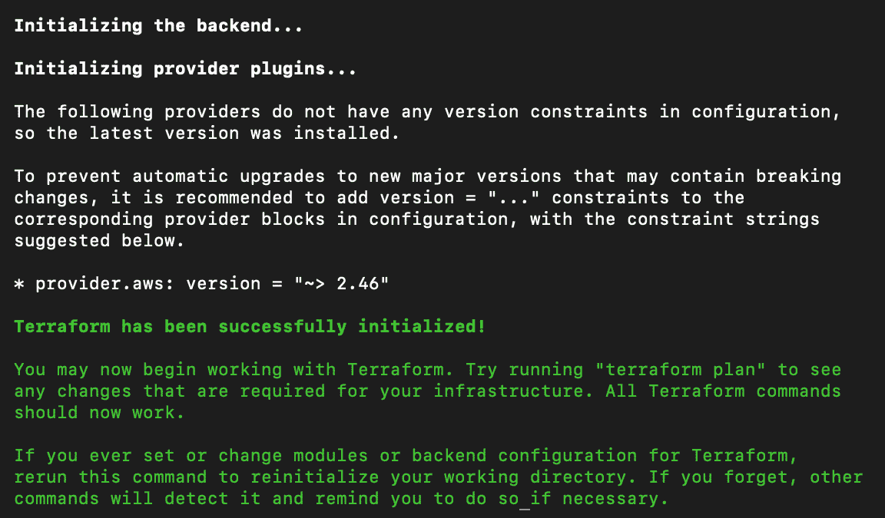

图 12.1：初始化 Terraform

1.  运行以下命令，让 Terraform 确定创建资源的计划，这些资源由我们之前创建的`main.tf`文件定义：

```
terraform plan
```

您将被提示输入一个 AWS 区域。使用离您最近的一个。在下面的屏幕截图中，我们使用的是`us-west-2`：

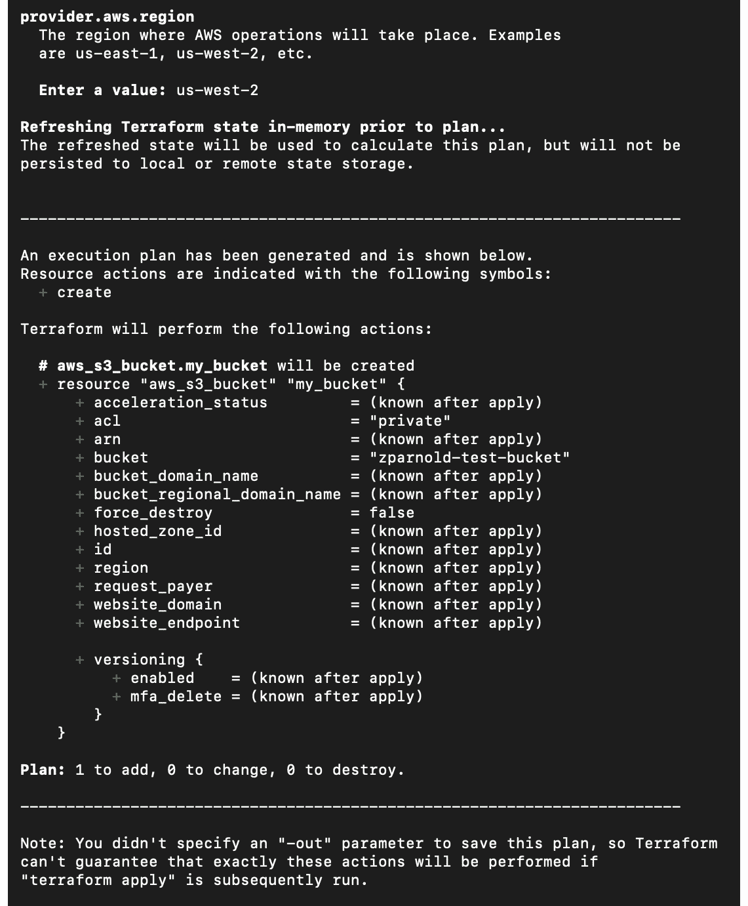

图 12.2：计算创建 S3 存储桶所需的集群资源的必要更改

因此，我们可以看到 Terraform 已经使用我们在上一章*练习 11.01，在我们的 Kubernetes 集群中设置 AWS 账户*中设置的访问密钥访问了我们的 AWS 账户，并计算了为使我们的 AWS 环境看起来像我们在 Terraform 文件中定义的那样需要做什么。正如我们在屏幕截图中看到的，它计划为我们添加一个 S3 存储桶，这正是我们想要的。

注意

Terraform 将尝试应用当前工作目录中所有扩展名为`.tf`的文件。

在上一个屏幕截图中，我们可以看到`terraform`命令指示我们没有指定`-out`参数，因此它不会保证精确计划将被应用。这是因为您的 AWS 基础设施中的某些内容可能已经从计划时发生了变化。假设您今天计划了一个计划。然后，稍后，您添加或删除了一些资源。因此，为了实现给定状态所需的修改将是不同的。因此，除非您指定`-out`参数，否则 Terraform 将在应用之前重新计算其计划。

1.  运行以下命令来应用配置并创建我们 Terraform 文件中指定的资源：

```
terraform apply
```

Terraform 将为我们提供一次机会来审查计划并在对 AWS 资源进行更改之前决定我们想要做什么：

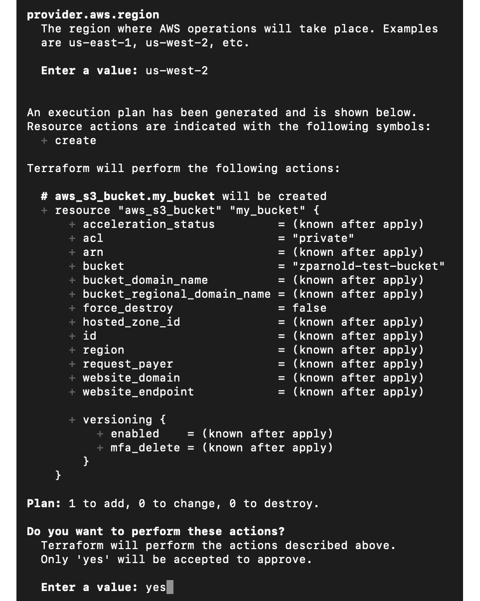

图 12.3：计算更改并确认创建 S3 存储桶的提示

如前所述，即使我们使用`apply`命令，Terraform 也计算了所需的更改。确认 Terraform 显示的操作，然后输入`yes`以执行显示的计划。现在，Terraform 已经为我们创建了一个 S3 存储桶：

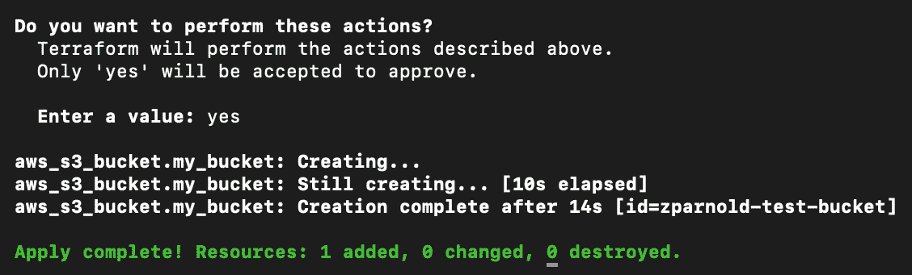

图 12.4：确认后创建 S3 存储桶

1.  现在，我们将销毁我们创建的所有资源，以便在进行下一个练习之前进行清理。要销毁它们，请运行以下命令：

```
terraform destroy
```

再次，要确认此操作，您必须在提示时明确允许 Terraform 销毁您的资源，输入`yes`，如以下屏幕截图所示：

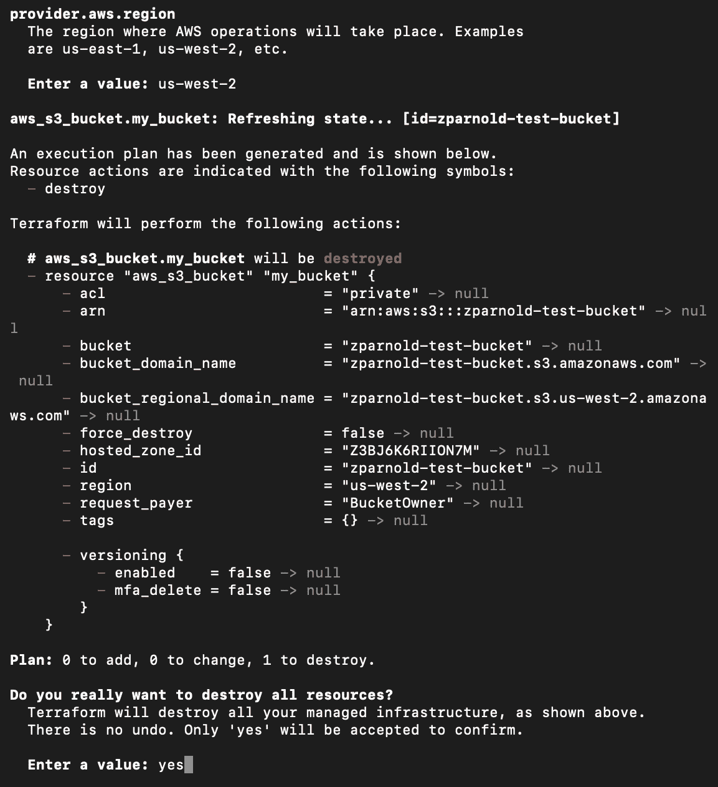

图 12.5：使用 Terraform 销毁资源

在这个练习中，我们演示了如何使用 Terraform 创建单个资源（S3 存储桶），以及如何销毁存储桶。这应该让您熟悉了 Terraform 的简单工具，并且我们现在将进一步扩展这些概念。

现在，让我们使用 Terraform 创建一个 Kubernetes 集群。上次，我们构建并管理了自己的集群控制平面。由于几乎每个云提供商都为他们的客户提供此服务，我们将利用由 AWS 提供的 Kubernetes 的托管服务 Amazon 弹性 Kubernetes 服务（EKS）。

当我们使用托管的 Kubernetes 服务时，以下内容由云服务供应商处理：

+   管理和保护 etcd

+   管理和保护用户身份验证

+   管理控制平面组件，如控制器管理器、调度器和 API 服务器

+   在您的网络中运行的 Pod 之间进行 CNI 配置

控制平面通过绑定到您的 VPC 的弹性网络接口暴露给您的节点。您仍然需要管理工作节点，它们作为您帐户中的 EC2 实例运行。因此，使用托管服务允许您专注于使用 Kubernetes 完成的工作，但缺点是对控制平面没有非常精细的控制。

注意

由于 AWS 处理集群的用户身份验证，我们将不得不使用 AWS IAM 凭据来访问我们的 Kubernetes 集群。我们可以在我们的机器上利用 AWS IAM Authenticator 二进制文件来做到这一点。关于这一点，我们将在接下来的章节中详细介绍。

## 练习 12.02：使用 Terraform 创建 EKS 集群

对于这个练习，我们将使用我们已经提供的`main.tf`文件来创建一个生产就绪、高可用的 Kubernetes 集群。

注意

这个 Terraform 文件是从[`github.com/terraform-aws-modules/terraform-aws-eks/tree/master/examples`](https://github.com/terraform-aws-modules/terraform-aws-eks/tree/master/examples)提供的示例进行了调整。

这将使 Terraform 能够创建以下内容：

+   一个具有 IP 地址空间`10.0.0.0/16`的 VPC。它将有三个公共子网，每个子网都有`/24`（`255`）个 IP 地址。

+   路由表和 VPC 的互联网网关需要正常工作。

+   控制平面与节点通信的安全组，以及在允许和必需的端口上接收来自外部世界的流量。

+   EKS 控制平面的 IAM 角色（执行诸如代表您创建服务的**ELB**（弹性负载均衡器）等任务）和节点（处理与 EC2 API 相关的问题）。

+   EKS 控制平面以及与您的 VPC 和节点的所有必要连接的设置。

+   一个用于节点加入集群的**ASG**（自动扩展组）（它将提供两个**m4.large**实例）。

+   生成一个 kubeconfig 文件和一个 ConfigMap，这对于节点加入集群以及与集群通信是必要的。

这是一个相对安全和稳定的方式，可以创建一个能够可靠处理生产工作负载的 Kubernetes 集群。让我们开始练习：

1.  使用以下命令获取我们提供的`main.tf`文件：

```
curl -O https://raw.githubusercontent.com/PacktWorkshops/Kubernetes-Workshop/master/Chapter12/Exercise12.02/main.tf
```

这将替换现有的`main.tf`文件，如果您仍然拥有来自上一个练习的文件。请注意，您的目录中不应该有任何其他 Terraform 文件。

1.  现在，我们需要 Terraform 将在`main.tf`文件中定义的状态应用到您的云基础设施上。为此，请使用以下命令：

```
terraform apply
```

注意

不应该使用我们在上一章生成的用于 kops 的 AWS IAM 用户来执行这些命令，而是应该使用具有 AWS 账户管理员访问权限的用户，以确保没有意外的权限问题。

这可能需要大约 10 分钟才能完成。您应该会看到一个非常长的输出，类似于以下内容：

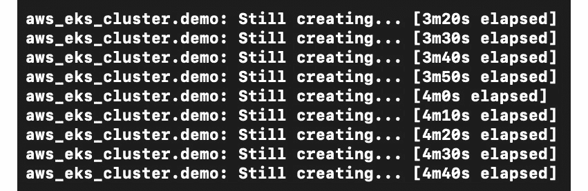

图 12.6：为我们的 EKS 集群创建资源

完成后，将会有两个终端输出——一个用于节点的 ConfigMap，一个用于访问集群的 kubeconfig 文件，如下截图所示：

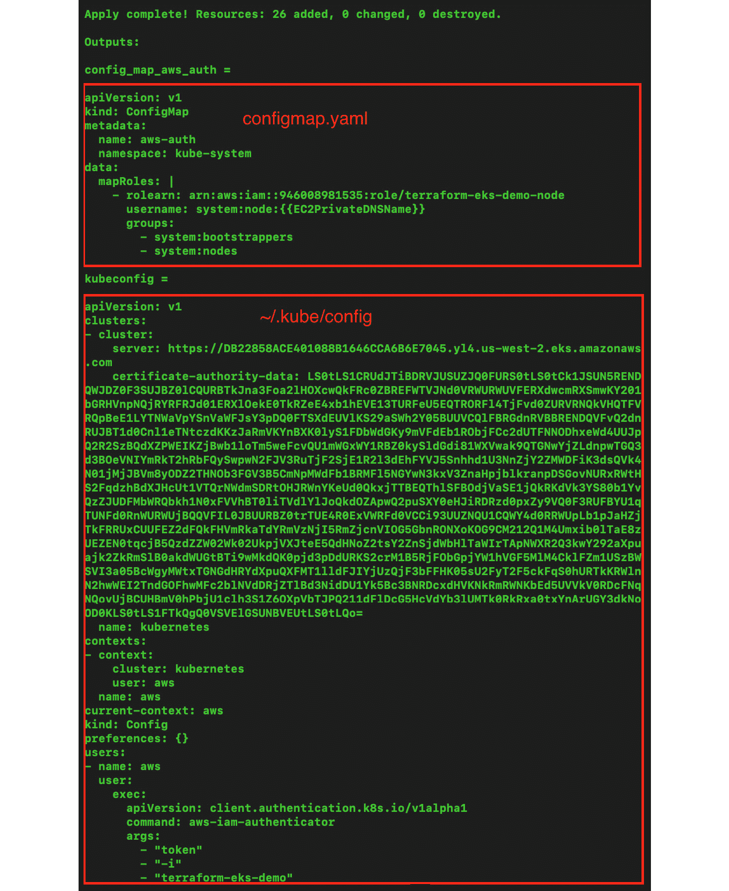

图 12.7：获取访问我们的集群所需的信息

将 ConfigMap 复制到一个文件中，并将其命名为`configmap.yaml`，然后将 kubeconfig 文件复制并写入计算机上的`~/.kube/config`文件。

1.  现在，我们需要应用更改，以允许我们的工作节点与控制平面通信。这是一个用于将工作节点加入到您的 EKS 集群的 YAML 格式文件；我们已经将其保存为`configmap.yaml`。运行以下命令：

```
kubectl apply -f configmap.yaml
```

注意

要运行此命令，您需要在计算机上安装`aws-iam-authenticator`二进制文件。要执行此操作，请按照此处的说明操作：[`docs.aws.amazon.com/eks/latest/userguide/install-aws-iam-authenticator.html`](https://docs.aws.amazon.com/eks/latest/userguide/install-aws-iam-authenticator.html)。

这将应用允许 Kubernetes 集群与节点通信的 ConfigMap。您应该会看到以下响应：

```
configmap/aws-auth created
```

1.  现在，让我们验证一切是否正常运行。在终端中运行以下命令：

```
kubectl get node
```

您应该会看到以下输出：

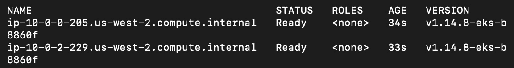

图 12.8：检查我们的节点是否可访问

在这个阶段，我们使用 EKS 作为控制平面，有两个工作节点的运行中的 Kubernetes 集群。

注意

请记住，您的集群资源将保持在线，直到您删除它们。如果您计划稍后回到以下练习，您可能希望删除您的集群以减少账单。要执行此操作，请运行`terraform destroy`。要重新上线您的集群，请再次运行此练习。

现在我们已经设置好了集群，在接下来的部分，让我们来看一下一个高效灵活的方法，将流量引导到集群上运行的任何应用程序。

# Kubernetes Ingress

在 Kubernetes 项目的早期阶段，Service 对象用于将外部流量传输到运行的 Pod。您只有两种选择来从外部获取流量 - 使用 NodePort 服务或 LoadBalancer 服务。在公共云提供商环境中，后者是首选，因为集群会自动管理设置安全组/防火墙规则，并将 LoadBalancer 指向工作节点上的正确端口。但是，这种方法有一个小问题，特别是对于刚开始使用 Kubernetes 或预算紧张的人。问题是一个 LoadBalancer 只能指向单个 Kubernetes 服务对象。

现在，想象一下您在 Kubernetes 中运行了 100 个微服务，所有这些微服务都需要公开。在 AWS 中，ELB（由 AWS 提供的负载均衡器）的平均成本大约为每月 20 美元。因此，在这种情况下，您每月支付 2000 美元，只是为了有获取流量进入您的集群的选项，并且我们还没有考虑网络的额外成本。

让我们再了解一下 Kubernetes 服务对象和 AWS 负载均衡器之间的一对一关系的另一个限制。假设对于您的项目，您需要将内部 Kubernetes 服务的基于路径的映射到同一负载平衡端点。假设您在`api.example.io`上运行一个 Web 服务，并且希望`api.example.io/users`转到一个微服务，`api.examples.io/weather`转到另一个完全独立的微服务。在 Ingress 到来之前，您需要设置自己的 Kubernetes 服务并对应用进行内部路径解析。

这现在不再是一个问题，因为 Kubernetes Ingress 资源的出现。Kubernetes Ingress 资源旨在与 Ingress 控制器一起运行（这是一个在您的集群中运行的应用程序，监视 Kubernetes API 服务器对 Ingress 资源的更改）。这两个组件一起允许您定义多个 Kubernetes 服务，它们本身不必被外部公开，也可以通过单个负载均衡端点进行路由。让我们看一下以下图表，以更好地理解这一点：

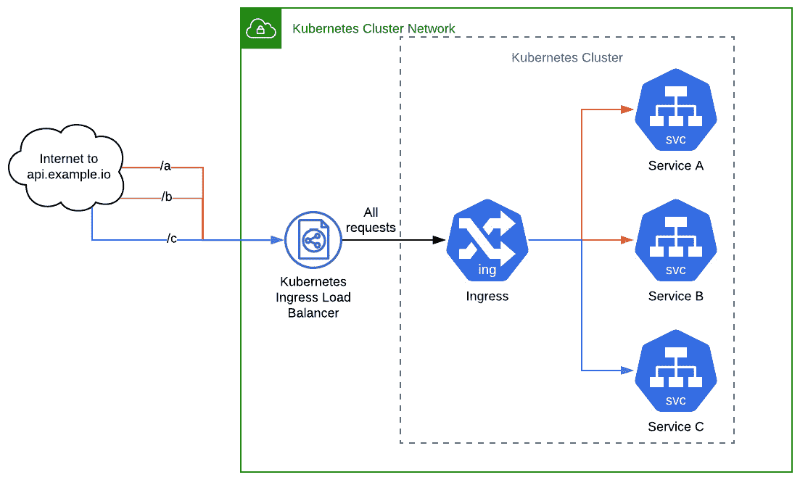

图 12.9：使用 Ingress 将流量路由到我们的服务

在这个例子中，所有请求都是从互联网路由到`api.example.io`。一个请求将转到`api.example.io/a`，另一个将转到`api.example.io/b`，最后一个将转到`api.example.io/c`。这些请求都将发送到一个负载均衡器和一个 Kubernetes 服务，通过 Kubernetes Ingress 资源进行控制。这个 Ingress 资源将流量从单个 Ingress 端点转发到它配置为转发流量的服务。在接下来的章节中，我们将设置`ingress-nginx` Ingress 控制器，这是 Kubernetes 社区中常用的开源工具用于 Ingress。然后，我们将配置 Ingress 以允许流量进入我们的集群，以访问我们的高可用应用程序。

# 在 Kubernetes 上运行的高可用应用程序

现在您有机会启动一个 EKS 集群并了解 Ingress，让我们向您介绍我们的应用程序。我们提供了一个示例应用程序，它有一个缺陷，阻止它成为云原生，并真正能够在 Kubernetes 中进行水平扩展。我们将在接下来的练习中部署这个应用程序并观察其行为。然后，在下一节中，我们将部署这个应用程序的修改版本，并观察它如何更适合实现我们所述的高可用目标。

## 练习 12.03：在 Kubernetes 中部署多副本非高可用应用程序

在这个练习中，我们将部署一个不具备水平扩展能力的应用程序版本。我们将尝试对其进行扩展，并观察阻止其水平扩展的问题：

注意

我们已经在 GitHub 存储库中提供了此应用程序的源代码以供参考。但是，由于我们的重点是 Kubernetes，我们将在此练习中使用命令直接从存储库中获取它。

1.  使用以下命令获取运行应用程序所需的所有对象的清单：

```
curl https://raw.githubusercontent.com/PacktWorkshops/Kubernetes-Workshop/master/Chapter12/Exercise12.03/without_redis.yaml > without_redis.yaml
```

这应该会将清单下载到您当前的目录中：

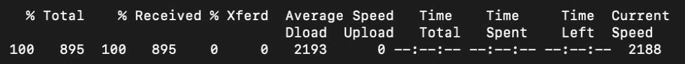

图 12.10：下载应用程序清单

如果您查看清单，您会发现它包含一个运行单个 Pod 副本的部署和一个 ClusterIP 类型的服务，用于将流量路由到它。

1.  然后，创建一个 Kubernetes 部署和服务对象，以便我们可以运行我们的应用程序：

```
kubectl apply -f without_redis.yaml
```

您应该会看到以下响应：

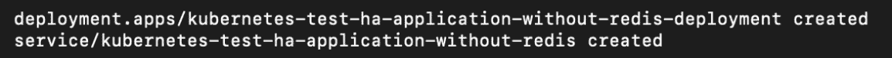

图 12.11：为我们的应用程序创建资源

1.  现在，我们需要添加一个 Kubernetes Ingress 资源，以便能够访问这个网站。要开始使用 Kubernetes Ingress，我们需要运行以下命令：

```
kubectl apply -f https://raw.githubusercontent.com/kubernetes/ingress-nginx/nginx-0.30.0/deploy/static/mandatory.yaml 
kubectl apply -f https://raw.githubusercontent.com/kubernetes/ingress-nginx/nginx-0.30.0/deploy/static/provider/aws/service-l4.yaml 
kubectl apply -f https://raw.githubusercontent.com/kubernetes/ingress-nginx/nginx-0.30.0/deploy/static/provider/aws/patch-configmap-l4.yaml 
```

这三个命令将为 EKS 部署 Nginx Ingress 控制器实现。您应该看到以下响应：

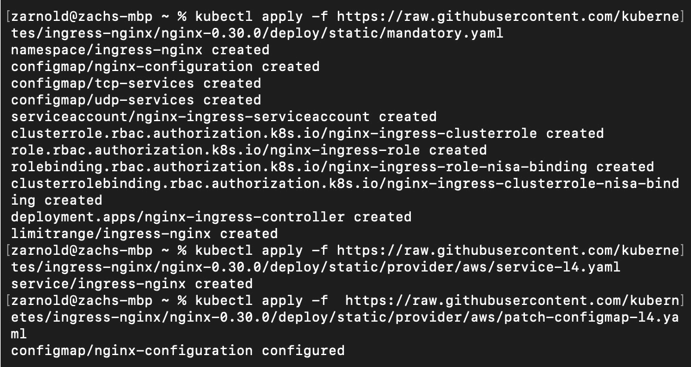

图 12.12：实现 Ingress 控制器

注意

此命令仅适用于 AWS 云提供商。如果您在另一个平台上运行集群，您需要从[`kubernetes.github.io/ingress-nginx/deploy/#aws`](https://kubernetes.github.io/ingress-nginx/deploy/#aws)找到适当的链接。

1.  然后，我们需要为自己创建一个 Ingress。在我们所在的同一文件夹中，让我们创建一个名为`ingress.yaml`的文件，内容如下：

```
apiVersion: networking.k8s.io/v1beta1
kind: Ingress
metadata:
  name: ingress
  annotations:
    nginx.ingress.kubernetes.io/rewrite-target: /
spec:
  rules:
    - host: counter.com
      http:
        paths:
          - path: /
            backend:
              serviceName: kubernetes-test-ha-application-                without-redis
              servicePort: 80
```

1.  现在，使用以下命令运行 Ingress：

```
kubectl apply -f ingress.yaml
```

您应该看到以下响应：

```
ingress.networking.k8s.io/ingress created
```

1.  现在，我们将配置 Ingress 控制器，使得当请求到达具有`Host:`头部为`counter.com`的负载均衡器时，它应该转发到端口`80`上的`kubernetes-test-ha-application-without-redis`服务。

首先，让我们找到我们需要访问的 URL：

```
kubectl describe svc -n ingress-nginx ingress-nginx
```

您应该看到类似以下的输出：

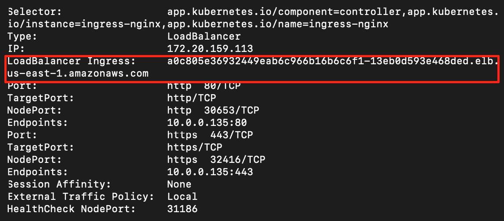

图 12.13：检查访问 Ingress 负载均衡器端点的 URL

从前面的截图中，注意 Kubernetes 在 AWS 为我们创建的 Ingress 负载均衡器端点如下：

```
a0c805e36932449eab6c966b16b6cf1-13eb0d593e468ded.elb.us-east-1.amazonaws.com
```

您的值可能与前面的值不同，您应该使用您设置的值。

1.  现在，让我们使用`curl`访问端点：

```
curl -H 'Host: counter.com' a0c805e36932449eab6c966b16b6cf1-13eb0d593e468ded.elb.us-east-1.amazonaws.com/get-number
```

您应该得到类似以下的响应：

```
{number: 1}%
```

如果您多次运行它，您会看到每次数字增加 1：

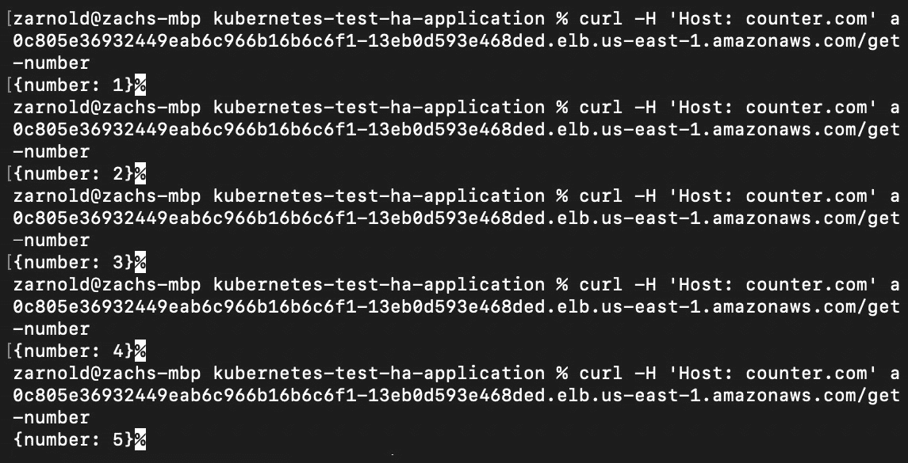

图 12.14：重复访问我们的应用程序

1.  现在，让我们发现应用程序的问题。为了使应用程序具有高可用性，我们需要同时运行多个副本，以便至少允许一个副本不可用。这反过来使应用程序能够容忍故障。为了扩展应用程序，我们将运行以下命令：

```
kubectl scale deployment --replicas=3 kubernetes-test-ha-application-without-redis-deployment
```

您应该看到以下响应：

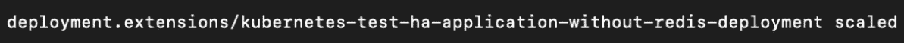

图 12.15：扩展应用部署

1.  现在，尝试多次访问应用，就像我们在*步骤 7*中所做的那样：

```
curl -H 'Host: counter.com' a3960d10c980e40f99887ea068f41b7b-1447612395.us-east-1.elb.amazonaws.com/get-number
```

您应该看到类似以下的响应：

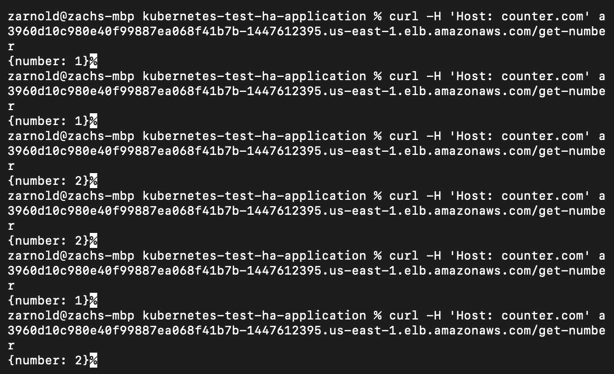

图 12.16：重复访问扩展应用以观察行为

注意

这个输出可能对您来说并不完全相同，但如果您看到前几次尝试时数字在增加，请继续访问应用。您将能够在几次尝试后观察到问题行为。

这个输出突出了我们应用的问题——数量并不总是增加。为什么呢？因为负载均衡器可能会将请求传递给任何一个副本，接收请求的副本会根据其本地状态返回响应。

# 处理有状态的应用

前面的练习展示了在分布式环境中处理有状态应用的挑战。简而言之，无状态应用是一种不保存客户端在一个会话中生成的数据以便在下一个会话中使用的应用程序。这意味着一般来说，无状态应用完全依赖于输入来推导其输出。想象一个服务器显示一个静态网页，不需要因任何原因而改变。在现实世界中，无状态应用通常需要与有状态应用结合，以便为客户或应用的消费者创建有用的体验。当然，也有例外。

有状态的应用是一种其输出取决于多个因素的应用，比如用户输入、来自其他应用的输入以及过去保存的事件。这些因素被称为应用的“状态”，它决定了应用的行为。创建具有多个副本的分布式应用最重要的部分之一是，用于生成输出的任何状态都需要在所有副本之间共享。如果您的应用的不同副本使用不同的状态，那么您的应用将会展现基于请求路由到哪个副本的随机行为。这实际上违背了使用副本水平扩展应用的目的。

在前面的练习中，对于每个副本都能以正确的数字进行响应，我们需要将该数字的存储移到每个副本之外。为了做到这一点，我们需要修改应用程序。让我们想一想如何做到这一点。我们能否使用另一个请求在副本之间传递数字？我们能否指定每个副本只能以其分配的数字的倍数进行响应？（如果我们有三个副本，一个只会以`1`、`4`、`7`…进行响应，另一个会以`2`、`5`、`8`…进行响应，最后一个会以`3`、`6`、`9`…进行响应。）或者，我们可以将数字存储在外部状态存储中，比如数据库？无论我们选择什么，前进的道路都将涉及在 Kubernetes 中更新我们正在运行的应用程序。因此，我们需要简要讨论一下如何做到这一点。

## CI/CD 流水线

借助容器化技术和容器镜像标签修订策略的帮助，我们可以相对轻松地对我们的应用程序进行增量更新。就像源代码和基础设施代码一样，我们可以将执行构建和部署流水线步骤的脚本和 Kubernetes 清单版本化，存储在诸如**git**之类的工具中。这使我们能够对我们的集群中的软件更新发生的方式有极大的可见性和灵活性，使用 CI 和 CD 等方法来控制。

对于不熟悉的人来说，**CI/CD**代表**持续集成和持续部署/交付**。CI 方面使用工具，如 Jenkins 或 Concourse CI，将新的更改集成到我们的源代码中，进行可重复的测试和组装我们的代码成最终的构件以进行部署。CI 的目标是多方面的，但以下是一些好处：

+   如果测试充分，软件中的缺陷会在流程的早期被发现。

+   可重复的步骤在部署到环境时会产生可重复的结果。

+   可见性存在是为了与利益相关者沟通功能的状态。

+   它鼓励频繁的软件更新，以使开发人员确信他们的新代码不会破坏现有的功能。

CD 的另一部分是将自动化机制整合到不断向最终用户交付小型更新的过程中，例如在 Kubernetes 中更新部署对象并跟踪部署状态。CI/CD 流水线是当前主流的 DevOps 模型。

理想情况下，CI/CD 流水线应该能够可靠地、可预测地将代码从开发人员的机器带到生产环境，尽量减少手动干预。CI 流水线理想上应该包括编译（必要时）、测试和最终应用程序组装的组件（在 Kubernetes 集群的情况下，这是一个容器）。

CD 流水线应该有一种自动化与基础设施交互的方式，以获取应用程序修订版并部署它，以及任何依赖配置和一次性部署任务，使得所需版本的软件成为软件的运行版本，通过某种策略（比如在 Kubernetes 中使用 Deployment 对象）。它还应该包括遥测工具，以观察部署对周围环境的即时影响。

我们在上一节观察到的问题是，我们的应用程序中的每个副本都是根据其本地状态返回一个数字通过 HTTP。为了解决这个问题，我们建议使用外部状态存储（数据库）来管理应用程序的每个副本之间共享的信息（数字）。我们有几种状态存储的选择。我们选择 Redis，只是因为它很容易上手，而且很容易理解。Redis 是一个高性能的键值数据库，很像 etcd。在我们的示例重构中，我们将通过设置一个名为`num`的键来在副本之间共享状态，值是我们想要返回的递增整数值。在每个请求期间，这个值将被递增并存储回数据库，以便每个副本都可以使用最新的信息。

每家公司和个人都有自己管理部署新代码版本的不同流程。因此，我们将使用简单的命令来执行我们的步骤，可以通过 Bash 和您选择的工具自动化。

## 练习 12.04：使用状态管理部署应用程序

在这个练习中，我们将部署一个修改过的应用程序版本，这是我们在上一个练习中部署的应用程序的修改版本。作为提醒，这个应用程序会计算它被访问的次数，并以 JSON 格式返回给请求者。然而，在上一个练习的结尾，我们观察到在*图 12.16*中，当我们使用多个副本水平扩展这个应用程序时，我们得到的数字并不总是增加的。

注意

我们已经在 GitHub 存储库中提供了这个应用程序的源代码供您参考。然而，由于我们的重点是 Kubernetes，我们将在这个练习中使用命令直接从存储库中获取它。

在这个修改后的应用程序版本中，我们重构了我们的代码，以添加将这个增长计数存储在 Redis 数据库中的功能。这允许我们拥有多个应用程序副本，但每次向端点发出请求时，计数都会增加：

注意

在我们的 Redis 实现中，我们没有使用事务来设置获取后的计数。因此，当我们更新数据库中的值时，有很小的机会获取并处理旧信息，这可能导致意外的结果。

1.  使用以下命令获取此应用程序所需的所有对象的清单：

```
curl https://raw.githubusercontent.com/PacktWorkshops/Kubernetes-Workshop/master/Chapter12/Exercise12.04/with_redis.yaml > with_redis.yaml
```

您应该看到类似以下的响应：

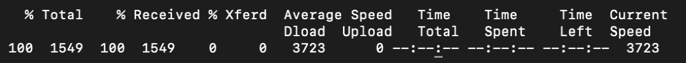

图 12.17：下载修改后应用程序的清单

如果您打开这个清单，您会看到我们为我们的应用程序运行了三个副本的部署：一个 ClusterIP 服务来暴露它，一个运行一个副本的 Redis 部署，以及另一个 ClusterIP 服务来暴露 Redis。我们还修改了之前创建的 Ingress 对象，指向新的服务。

1.  现在，是时候在 Kubernetes 上部署它了。我们可以运行以下命令：

```
kubectl apply -f with_redis.yaml
```

您应该看到类似以下的响应：

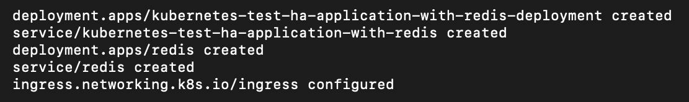

图 12.18：创建集群所需的资源

1.  现在，让我们看看这个应用程序通过以下命令给我们带来了什么：

```
curl -H 'Host: counter.com' a3960d10c980e40f99887ea068f41b7b-1447612395.us-east-1.elb.amazonaws.com/get-number
```

重复运行此命令。您应该能够看到一个递增的数字，如下所示：

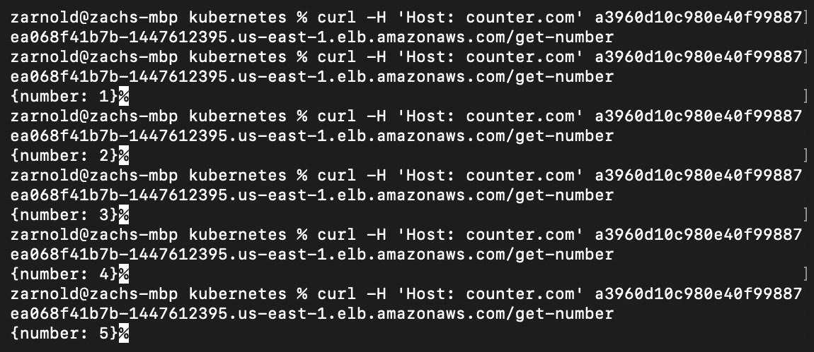

图 12.19：具有一致增长数字的可预测输出

如您在前面的输出中所看到的，程序现在按顺序输出数字，因为我们的 Deployment 的所有副本现在共享一个负责管理应用程序状态（Redis）的单个数据存储。

如果您想创建一个真正高可用、容错的软件系统，还有许多其他范式需要转变，这超出了本书详细探讨的范围。但是，您可以在此链接查看有关分布式系统的更多信息：[`www.packtpub.com/virtualization-and-cloud/hands-microservices-kubernetes`](https://www.packtpub.com/virtualization-and-cloud/hands-microservices-kubernetes)

注意

再次记住，此时您的集群资源仍在运行。如果您希望稍后继续进行活动，请不要忘记使用`terraform destroy`拆除您的集群。

现在，我们已经构建了具有持久性和在不同副本之间共享其状态能力的应用程序，我们将在接下来的活动中进一步扩展它。

## 活动 12.01：扩展我们应用程序的状态管理

目前，我们的应用程序可以利用运行在 Kubernetes 集群内部的共享 Redis 数据库来管理我们在获取时返回给用户的变量计数器。

但是，假设我们暂时不信任 Kubernetes 能够可靠地管理 Redis 容器（因为它是一个易失性的内存数据存储），而是希望使用 AWS ElastiCache 来管理。您在此活动中的目标是使用本章学习的工具修改我们的应用程序，使其与 AWS ElastiCache 配合使用。

您可以使用以下指南完成此活动：

1.  使用 Terraform 来配置 ElastiCache。

您可以在此链接找到为配置 ElastiCache 所需的参数值：[`www.terraform.io/docs/providers/aws/r/elasticache_cluster.html#redis-instance`](https://www.terraform.io/docs/providers/aws/r/elasticache_cluster.html#redis-instance)。

1.  将应用程序更改为连接到 Redis。您需要在 Kubernetes Deployment 中使用环境变量。当您运行`terraform apply`命令时，您可以在`redis_address`字段中找到所需的信息。

1.  将 ElastiCache 端点添加到适当的 Kubernetes 清单环境变量中。

1.  使用任何您想要的工具在 Kubernetes 集群上推出新版本的代码。

到最后，您应该能够观察到应用程序的响应类似于我们在上一个练习中看到的，但这一次，它将使用 ElastiCache 来进行状态管理：

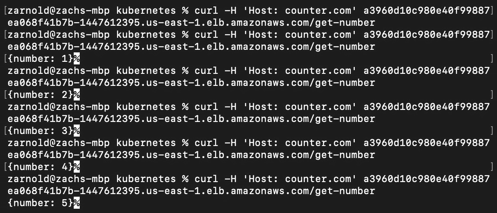

图 12.20：活动 12.01 的预期输出

注意

此活动的解决方案可以在以下地址找到：[`packt.live/304PEoD`](https://packt.live/304PEoD)。请记住，您的集群资源将保持在线，直到您删除它们。要删除集群，您需要运行`terraform destroy`。

# 摘要

在本书的早期章节中，我们探讨了 Kubernetes 如何与声明性应用程序管理方法相配合；也就是说，您定义所需的状态，然后让 Kubernetes 来处理其余的事情。在本章中，我们看了一些工具，这些工具可以帮助我们以类似的方式管理我们的云基础设施。我们介绍了 Terraform 作为一种可以帮助我们管理基础设施状态的工具，并介绍了将基础设施视为代码的概念。

然后，我们使用 Terraform 在 Amazon EKS 中创建了一个基本安全、生产就绪的 Kubernetes 集群。我们研究了 Ingress 对象，并了解了使用它的主要动机，以及它提供的各种优势。然后，我们在一个高可用的 Kubernetes 集群上部署了两个应用程序版本，并探讨了一些允许我们改进水平扩展有状态应用程序的概念。这让我们一窥了运行有状态应用程序所面临的挑战，并且我们将在*第十四章*中探讨更多处理这些挑战的方法，*在 Kubernetes 中运行有状态组件*。

在下一章中，我们将继续查看如何通过进一步保护我们的集群来继续准备生产。
