# 第十三章：13\. Kubernetes 中的运行时和网络安全

概述

在本章中，我们将看看各种资源，我们可以使用来保护在我们集群中运行的工作负载。我们还将了解一个粗略的威胁模型，并将其应用于设计一个安全的集群，以便我们可以防御我们的集群和应用程序免受各种威胁。到本章结束时，您将能够创建 Role 和 ClusterRole，以及 RoleBinding 和 ClusterRoleBinding 来控制任何进程或用户对 Kubernetes API 服务器和对象的访问。然后，您将学习如何创建 NetworkPolicy 来限制应用程序与数据库之间的通信。您还将学习如何创建 PodSecurityPolicy 来确保应用程序的运行组件符合定义的限制。

# 介绍

在过去的几章中，我们戴上了 DevOps 的帽子，学习了如何在 Kubernetes 中设置集群，以及如何安全地部署新的应用程序版本而不会中断。

现在，是时候稍微转换一下，摘下我们的 DevOps 帽子，戴上我们的安全分析师帽子。首先，我们将看看有人可能攻击我们的 Kubernetes 集群的地方，以及未经授权的用户如何可能在我们的集群中造成严重破坏。之后，我们将介绍 Kubernetes 的一些安全原语以及我们如何对抗最常见的攻击形式。最后，我们将进一步修改我们的应用程序，并演示一些这些安全原语是如何工作的。

但在我们开始任何工作之前，让我们首先简要地看一下现代 Web 应用程序安全的各个关注领域，以及为我们的集群实施有效安全的基本范式。我们将首先检查我们所谓的“云原生安全的 4C”。

# 威胁建模

本章的范围远远超出了充分教授许多必要的安全学科的范围，以便您对现代工作负载安全应该如何实施和编排有严格的理解。然而，我们将简要了解我们应该如何思考。威胁建模是一种学科，我们在其中检查我们的应用程序可能受到攻击或未经授权使用的各个领域。

例如，考虑一个 HTTP Web 服务器。它通常会暴露端口 80 和 443 以提供 Web 流量服务，但它也作为潜在攻击者的入口点。它可能在某个端口上暴露 Web 管理控制台。它可能打开某些其他管理端口和 API 访问，以允许其他软件进行自动化管理。应用程序运行时可能需要定期处理敏感数据。用于创建和交付应用程序的整个端到端流水线可能暴露出各种容易受到攻击的点。应用程序依赖的加密算法可能会因暴力攻击的增加而被破坏或过时。所有这些都代表了我们的应用程序可能受到攻击的各个领域。

组织应用程序的一些攻击向量的简单方法是记住缩写**STRIDE**。它代表以下类型的攻击：

+   **S**欺骗：用户或应用程序伪装成其他人。

+   **T**篡改：未经相关利益相关者同意更改任何数据或提供信息。

+   **R**否认：否认参与行为或无法追踪特定用户的任何行为。

+   **I**信息泄露：窃取你未被授权获取的特权或敏感信息。

+   **D**拒绝服务：向服务器发送虚假请求以使其资源饱和，并拒绝其提供预期目的的能力。

+   **E**特权提升：通过利用漏洞获得对受限资源或特权的访问。

许多黑客发动的攻击都旨在执行上述一项或多项行动，通常是为了危害我们数据的机密性、完整性和可用性。考虑到这一点，我们可以使用一个心智模型来思考我们的系统可能存在威胁的各个部分在现代云原生应用程序堆栈中的位置。这个心智模型被称为“云原生安全的 4C”，我们将使用它来组织我们对 Kubernetes 安全原语的探索。理想情况下，通过利用所有这些原语，这应该能够让您对应用程序在 Kubernetes 环境中对抗类 STRIDE 攻击具有较高的信心。

## 云原生安全的 4C

安全可以并且应该组织成层。这被认为是安全的“深度防御”方法，并且被技术界普遍认为是防止任何单个组件暴露整个系统的最佳方式。当涉及到云原生应用程序时，我们认为安全分为四个层次：保护您的代码、容器、集群和云。以下图表显示了它们是如何组织的。这帮助我们想象，如果在较低层次发生了妥协，它几乎肯定会妥协依赖它的更高层次：

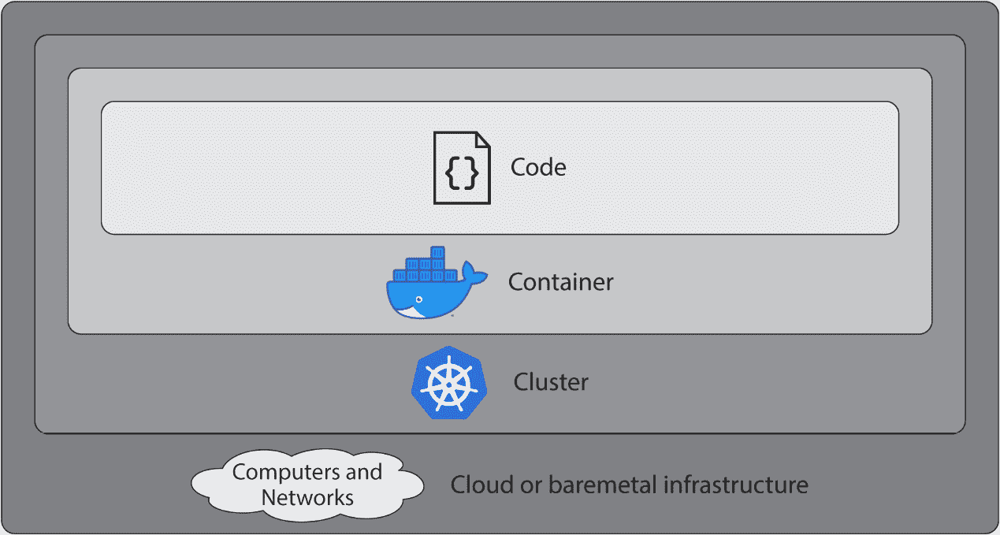

图 13.1：云原生安全的 4C

由于本书侧重于 Kubernetes，我们将重点关注集群安全，然后开始在我们的示例应用程序中实施一些建议。

注意

有关其他 C 的建议，请查看此链接：[`kubernetes.io/docs/concepts/security/overview/`](https://kubernetes.io/docs/concepts/security/overview/)。

# 集群安全

一种思考 Kubernetes 的方式是将其视为一个巨大的自我编排的计算、网络和存储池。因此，在许多方面，Kubernetes *就像一个云平台*。理解这种等价性很重要，因为这种心理抽象使我们能够以集群操作员与集群开发人员的不同方式进行推理。集群操作员希望确保集群的所有组件都安全，并且针对任何工作负载进行了加固。集群开发人员将关注确保他们为 Kubernetes 定义的工作负载在集群内安全运行。

在这里，您的工作变得有点容易 - 大多数 Kubernetes 的云提供商提供的服务将为您确保 Kubernetes 控制平面的安全。如果由于某种原因，您无法利用云提供商的服务，您将希望在此链接的文档中阅读有关在此链接上保护您的集群的更多信息：[`kubernetes.io/docs/tasks/administer-cluster/securing-a-cluster/`](https://kubernetes.io/docs/tasks/administer-cluster/securing-a-cluster/)。

即使您使用的是云提供商的服务，仅仅因为他们在保护您的控制平面并不意味着您的 Kubernetes 集群是安全的。您不能依赖于云提供商的安全性的原因是，您的应用程序、其容器或糟糕的策略实施可能会使您的基础设施非常容易受到攻击。因此，现在，我们需要讨论如何在集群内保护工作负载。

注意

Kubernetes 社区正在积极开展工作，以改进安全概念和实施。相关的 Kubernetes 文档应经常重新审视，以确定是否已经进行了改进。

为了加强我们内部集群的安全性，我们需要关注以下三个概念：

+   **Kubernetes RBAC**：这是 Kubernetes 的主要策略引擎。它定义了一套角色和权限系统，以及如何将权限授予这些角色。

+   **网络策略**：这些是（取决于您的容器网络接口插件）在 Pod 之间充当“防火墙”的策略。将它们视为 Kubernetes 感知的网络访问控制列表。

+   **Pod 安全策略**：这些是在特定范围（命名空间、整个集群）定义的，并且作为 Pod 在 Kubernetes 中允许运行的定义。

我们不会涵盖在 etcd 中对 Kubernetes Secrets 进行加密，因为大多数云提供商要么为您处理这个问题，要么实现是特定于该云提供商的（例如 AWS KMS）。

# Kubernetes RBAC

在我们深入研究 RBAC 之前，请回顾一下*第四章*中关于 Kubernetes 如何授权对 API 的请求的内容，我们了解到有三个阶段-认证、授权和准入控制。我们将在*第十六章*中更多地了解准入控制器。

Kubernetes 支持多种不同的集群认证方法，您需要参考您的云提供商的文档，以获取有关其特定实现的更多详细信息。

授权逻辑是通过一种称为**RBAC**的东西处理的。它代表**基于角色的访问控制**，是我们约束某些用户和组只能执行其工作所需的最低权限的基础。这基于软件安全中的一个概念，称为“最小特权原则”。例如，如果你是一家信用卡处理公司的软件工程师，**PCI DSS**合规要求你不应该访问生产集群和客户数据。因此，如果你确实可以访问生产集群，你应该有一个没有特权的角色。

RBAC 是由集群管理员通过四种不同的 API 对象实现的：**Roles**、**RoleBindings**、**ClusterRoles**和**ClusterRoleBindings**。让我们通过检查一个图表来看它们是如何一起工作的：

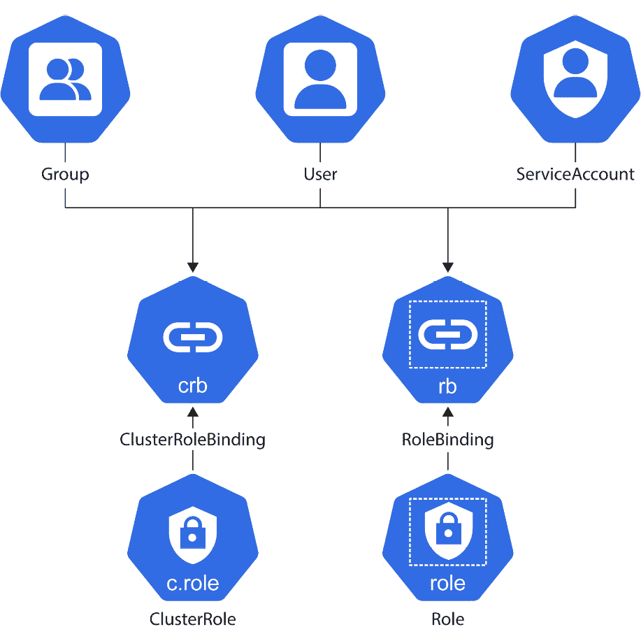

图 13.2：不同对象相互作用以实现 RBAC

在这个图表中，我们可以看到 Kubernetes 的`User`/`Group`和`ServiceAccount`对象通过绑定到`Role`或`ClusterRole`来获得他们的权限。让我们分别了解这些对象。

## 角色

这是一个 Role 的样本规范：

```
apiVersion: rbac.authorization.k8s.io/v1
kind: Role
metadata:
  namespace: default
  name: test-role
rules:
  - verbs:
      - "list"
    apiGroups:
      - ""
    resources:
      - "pods"
```

各种字段定义了 Role 应该具有的权限：

+   `namespace`：Roles 适用于 Kubernetes 命名空间，这在这个字段中定义。这使得 Role 与 ClusterRole 不同，后者的权限适用于集群中的任何命名空间。

+   `动词`：这些描述了我们允许的 Kubernetes 操作。一些常用动词的例子包括`get`、`list`、`watch`、`create`、`update`和`delete`。还有更多，但这些通常对大多数用例来说已经足够了。如果需要复习，请参考*第四章*的*Kubernetes API*部分，*如何与 Kubernetes（API 服务器）通信*。

+   `apiGroups`：这些描述了 Role 将访问的 Kubernetes API 组。这些被指定为`<group>/<version>`（比如`apps/v1`）。如果使用 CustomResourceDefinitions，这些 API 组也可以在这里引用。

注意

Kubernetes 随附的 API 组的完整列表可以在这里找到（截至版本 1.18）：[`kubernetes.io/docs/reference/generated/kubernetes-api/v1.18/`](https://kubernetes.io/docs/reference/generated/kubernetes-api/v1.18/)。

+   `resources`：这些描述了我们正在讨论的 API 对象，并由对象定义的`Kind`字段中的值定义；例如，`deployment`、`secret`、`configmap`、`pod`、`node`等。

## RoleBinding

如前图所示，RoleBinding 将角色绑定或关联到 ServiceAccounts、用户或用户组。以下是 RoleBinding 的示例规范：

```
apiVersion: rbac.authorization.k8s.io/v1
kind: RoleBinding
metadata:
  name: test-role-binding
  namespace: default
roleRef:
  name: test-role
  kind: ClusterRole
  apiGroup: rbac.authorization.k8s.io
subjects:
  - kind: ServiceAccount
    name: test-sa
    namespace: default 
```

此规范定义了应该能够使用角色执行需要在 Kubernetes 中进行授权的操作的主体：

+   `subjects`：这指的是经过身份验证的 ServiceAccount、用户或应该能够使用此角色的组。

+   `roleRef`：这指的是他们可以承担的角色。

## ClusterRole

ClusterRole 在每个方面都与 Role 相同，除了一个方面。它不仅在一个 Kubernetes 命名空间内授予权限，而且在整个集群范围内授予权限。

## ClusterRoleBinding

这与 RoleBinding 相同，只是它必须绑定到 ClusterRole 而不是 Role。您不能将 ClusterRoleBinding 绑定到 Role，也不能将 RoleBinding 绑定到 ClusterRole。

## 有关 RBAC 策略的一些重要说明

+   RBAC 策略文档仅允许。这意味着，默认情况下，主体没有访问权限，只有通过 RoleBinding 或 ClusterRoleBinding 才能具有相应角色或集群角色中规定的特定访问权限。

+   绑定是不可变的。这意味着一旦您将主体绑定到角色或集群角色，就无法更改。这是为了防止特权升级。因此，实体可以被授予修改对象的权限（对于许多用例来说已经足够好），同时防止它提升自己的特权。如果需要修改绑定，只需删除并重新创建。

+   一个可以创建其他 ClusterRoles 和 Roles 的 ClusterRole 或 Role 只能授予最多与其相同的权限。否则，这将是一个明显的特权升级路径。

## 服务账户

在前几章中，当我们学习有关 Minikube 和 Kops 的身份验证时，我们看到 Kubernetes 生成了我们使用的证书。在 EKS 的情况下，使用了 AWS IAM 角色和 AWS IAM Authenticator。

事实证明，Kubernetes 有一个特殊的对象类型，允许集群内的资源与 API 服务器进行身份验证。

我们可以使用 ServiceAccount 资源来允许 Pods 接收 Kubernetes 生成的令牌，它将传递给 API 服务器进行身份验证。所有官方的 Kubernetes 客户端库都支持这种类型的身份验证，因此这是从集群内部进行程序化 Kubernetes 集群访问的首选方法。

当您以集群管理员身份运行时，可以使用`kubectl`使用`--as`参数对特定 ServiceAccount 进行身份验证。对于之前显示的示例 ServiceAccount，这将看起来像这样：

```
kubectl --as=system:serviceaccount:default:test-sa get pods
```

我们将学习这些对象如何一起工作，以便在以下练习中控制访问。

## 练习 13.01：创建 Kubernetes RBAC ClusterRole

在这个练习中，我们将创建一个 ClusterRole 和 ClusterRoleBinding。然后，我们将成为用户并继承他们的权限，如 ClusterRole 所定义的，并演示 Kubernetes 如何基于规则阻止对某些 API 的访问。让我们开始吧：

1.  首先，我们将从我们在*练习 12.02*中使用的 Terraform 文件中重新创建 EKS 集群，*使用 Terraform 创建 EKS 集群*。如果您已经有`main.tf`文件，可以使用它。否则，您可以运行以下命令获取它：

```
curl -O https://raw.githubusercontent.com/PacktWorkshops/Kubernetes-Workshop/master/Chapter12/Exercise12.02/main.tf
```

现在，依次使用以下两个命令，将您的集群资源恢复运行：

```
terraform init
terraform apply
```

注意：

在执行任何这些练习之后，如果您计划在较长时间后继续进行以下练习，最好释放集群资源以停止 AWS 计费。您可以使用`terraform destroy`命令来做到这一点。然后，当您准备进行练习或活动时，可以运行此步骤将所有内容恢复在线。

如果任何练习或活动依赖于在先前练习中创建的对象，您还需要重新创建这些对象。

1.  现在，我们将为我们的 RBAC 资源创建三个 YAML 文件。第一个是一个 ServiceAccount，它允许我们通过集群授予的身份和认证令牌。创建一个名为`sa.yaml`的文件，内容如下：

```
apiVersion: v1
kind: ServiceAccount
metadata:
  name: test-sa
  namespace: default
```

1.  接下来，我们将创建一个 ClusterRole 对象并分配一些权限。创建一个名为`cr.yaml`的文件，内容如下：

```
apiVersion: rbac.authorization.k8s.io/v1
kind: ClusterRole
metadata:
  namespace: default
  name: test-sa-cluster-role
rules:
  - verbs:
      - "list"
    apiGroups:
      - ""
    resources:
      - "pods"
```

我们正在定义一个`ClusterRole`，它具有列出任何命名空间中所有 Pod 的能力，但其他操作不能执行。

1.  接下来，我们将创建一个`ClusterRoleBinding`对象，将创建的 ServiceAccount 和 ClusterRole 绑定在一起。创建一个名为`crb.yaml`的文件，内容如下：

```
apiVersion: rbac.authorization.k8s.io/v1
kind: ClusterRoleBinding
metadata:
  name: test-sa-cluster-role-binding
  namespace: default
roleRef:
  name: test-sa-cluster-role
  kind: ClusterRole
  apiGroup: rbac.authorization.k8s.io
subjects:
  - kind: ServiceAccount
    name: test-sa
    namespace: default
```

在这些文件中，我们定义了三个对象：`ServiceAccount`、`ClusterRole`和`ClusterRoleBinding`。

1.  运行以下命令来创建此 RBAC 策略，以及我们的 ServiceAccount：

```
kubectl apply -f sa.yaml -f cr.yaml -f crb.yaml
```

您应该看到以下响应：

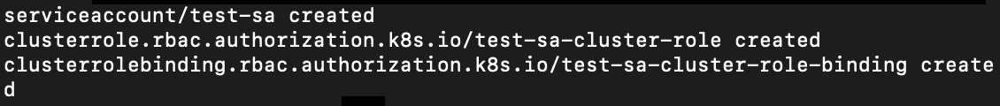

图 13.3：创建 ServiceAccount、ClusterRole 和 ClusterRoleBinding

1.  在接下来的步骤中，我们将演示使用我们的服务账户的 ClusterRole 将阻止我们描述 Pods。但在那之前，让我们先获取 Pod 的列表，并证明一切仍然正常工作。通过运行以下命令来实现：

```
kubectl get pods --all-namespaces
```

您应该看到以下响应：

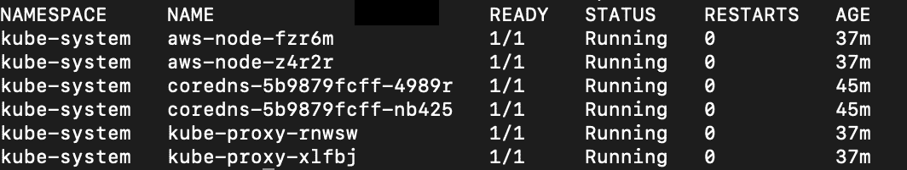

图 13.4：获取 Pod 列表

1.  现在，让我们描述第一个 Pod。这里第一个 Pod 的名称是`aws-node-fzr6m`。在这种情况下，`describe`命令将如下所示：

```
kubectl describe pod -n kube-system aws-node-fzr6m
```

请使用您集群中的 Pod 名称。您应该看到类似以下的响应：

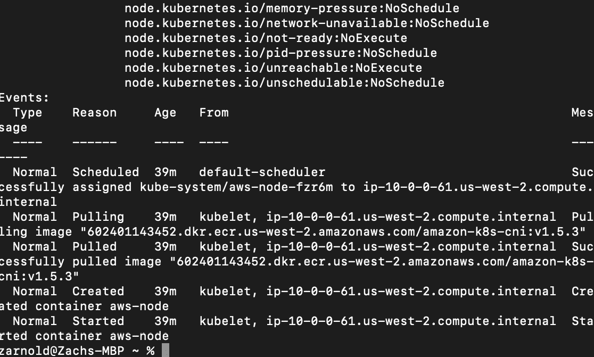

图 13.5：描述 aws-node-fzr6m Pod

上述截图显示了`describe`命令输出的截断版本。

1.  现在，我们将运行与之前相同的命令，但这次假装是使用当前绑定到我们创建的 ClusterRole 和 ClusterRoleBinding 的 ServiceAccount 的用户。我们将使用`kubectl`的`--as`参数来实现这一点。因此，命令将如下所示：

```
kubectl --as=system:serviceaccount:default:test-sa get pods --all-namespaces
```

请注意，我们可以假设 ClusterRole，因为我们是我们创建的集群中的管理员。您应该看到以下响应：

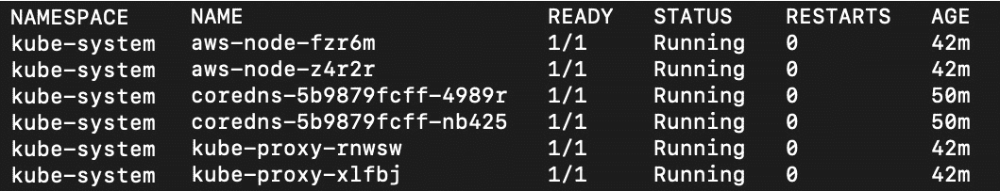

图 13.6：假设 test-sa ServiceAccount 获取 Pod 列表

确实，这仍然有效。正如您可能还记得的那样，从*步骤 3*中可以看到，我们提到了`list`作为一个允许的动词，这是用于获取某种类型的所有资源列表的动词。

1.  现在，让我们看看如果具有我们创建的 ClusterRole 的用户尝试描述一个 Pod 会发生什么：

```
kubectl --as=system:serviceaccount:default:test-sa describe pod -n kube-system aws-node-fzr6m
```

您应该看到以下响应：

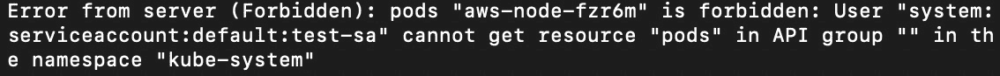

图 13.7：禁止错误

kubectl `describe`命令使用`get`动词。回想一下*步骤 3*，它不在我们的 ClusterRole 允许的动词列表中。

如果这是一个用户（或黑客）试图使用任何不允许的命令，我们将成功阻止它。Kubernetes 文档网站上有许多实用的 RBAC 示例。在本章中讨论 Kubernetes 中所有 RBAC 的设计模式超出了范围。我们只能说：在可能的情况下，您应该实践“最小特权原则”，以限制对 Kubernetes API 服务器的不必要访问。也就是说，每个人都应该获得完成工作所需的最低访问级别；并非每个人都需要成为集群管理员。

虽然我们无法就公司的安全性做出具体建议，但我们可以说有一些不错的“经验法则”，可以表述如下：

+   在可能的情况下，尝试将集群贡献者/用户放在角色中，而不是 ClusterRole 中。由于角色受到命名空间的限制，这将防止用户未经授权地访问另一个命名空间。

+   只有集群管理员应该访问 ClusterRoles，这应该是有限且临时的。例如，如果您进行值班轮换，工程师负责您的服务的可用性，那么他们在值班期间应该只有管理员 ClusterRole。

# 网络策略

Kubernetes 中的 NetworkPolicy 对象本质上是 Pod 和命名空间级别的网络访问控制列表。它们通过使用标签选择（例如服务）或指示 CIDR IP 地址范围来允许特定端口/协议上的访问。

这对于确保安全非常有帮助，特别是当您在集群上运行多个微服务时。现在，想象一下您有一个为您的公司托管许多应用程序的集群。它托管了一个运行开源库的营销网站，一个包含敏感数据的数据库服务器，以及一个控制对该数据访问的应用服务器。如果营销网站不需要访问数据库，那么它就不应该被允许访问数据库。通过使用 NetworkPolicy，我们可以防止营销网站中的漏洞或错误允许攻击者扩大攻击，以便他们可以通过阻止营销网站 Pod 甚至无法与数据库通信来访问您的业务数据。让我们来看一个示例 NetworkPolicy 文档并解释它：

```
apiVersion: networking.k8s.io/v1
kind: NetworkPolicy
metadata:
  name: sample-network-policy
  namespace: my-namespace
spec:
  podSelector:
    matchLabels:
      role: db
  policyTypes:
  - Ingress
  - Egress
  ingress:
  - from:
    - ipBlock:
        cidr: 192.18.0.0/16
        except:
        - 192.18.1.0/24
    - namespaceSelector:
        matchLabels:
          project: sample-project
    - podSelector:
        matchLabels:
          role: frontend
    ports:
    - protocol: TCP
      port: 3257
  egress:
  - to:
    - ipBlock:
        cidr: 10.0.0.0/24
    ports:
    - protocol: TCP
      port: 5832
```

让我们来看看这个 NetworkPolicy 的一些字段：

+   它包含了我们在本章前面描述的标准`apiVersion`，`kind`和`metadata`字段。

+   `podSelector`：它应该在命名空间中查找的标签，以应用策略。

+   `policyTypes`：可以是入口、出口或两者。这意味着网络策略适用于被选择的 Pod 中进入的流量、离开被选择的 Pod 的流量，或两者。

+   `Ingress`：这需要一个`from`块，定义了策略中流量可以从哪里发起。这可以是一个命名空间、一个 Pod 选择器或一个 IP 地址块和端口组合。

+   `Egress`：这需要一个`to`块，并定义了网络策略中允许流量去哪里。这可以是一个命名空间、一个 Pod 选择器或一个 IP 地址块和端口组合。

您的 CNI 可能没有成熟的 NetworkPolicies 实现，因此请务必查阅您的云提供商的文档以获取更多信息。在我们使用 EKS 设置的集群中，它使用的是 Amazon CNI。我们可以使用**Calico**，一个开源项目，来增强现有的 EKS CNI，并弥补在执行 NetworkPolicy 声明方面的不足。值得一提的是，Calico 也可以作为 CNI 使用，但我们将只在以下练习中使用其补充功能来执行 NetworkPolicy。

## 练习 13.02：创建 NetworkPolicy

在这个练习中，我们将实现 Calico 来增强 Amazon CNI 在 EKS 中可用的 NetworkPolicy 声明的即插即用执行。让我们开始吧：

1.  运行以下命令安装带有 Calico 的 Amazon CNI：

```
kubectl apply -f https://raw.githubusercontent.com/aws/amazon-vpc-cni-k8s/release-1.5/config/v1.5/calico.yaml
```

你应该看到类似于以下的响应：

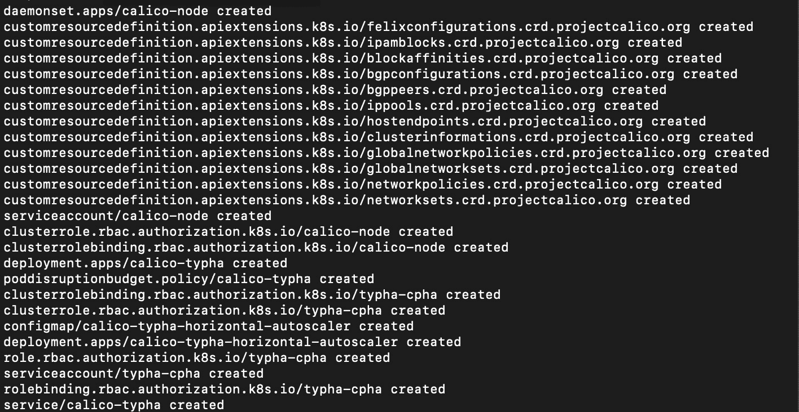

图 13.8：安装带有 Calico 的 Amazon CNI

1.  要验证您是否成功部署了与 Calico 对应的 DaemonSet，请使用以下命令：

```
kubectl get daemonset calico-node --namespace kube-system
```

您应该看到`calico-node` DaemonSet，如下所示：

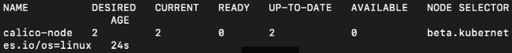

图 13.9：检查 calico-node DaemonSet

1.  现在，让我们创建我们的 NetworkPolicy 对象。首先，创建一个名为`net_pol_all_deny.yaml`的文件，内容如下：

```
apiVersion: networking.k8s.io/v1
kind: NetworkPolicy
metadata:
  name: default-deny
spec:
  podSelector: {}
  policyTypes:
    - Ingress
    - Egress
```

这个策略是一个非常简单的 NetworkPolicy。它表示不允许流入或流出集群的 Pod 之间的流量。这是我们将继续扩展我们应用程序的安全基础。

1.  让我们使用以下命令应用我们的策略：

```
kubectl apply -f net_pol_all_deny.yaml
```

你应该看到以下响应：

```
networkpolicy.networking.k8s.io/default-deny created
```

现在，我们的集群中没有流量流动。我们可以通过部署我们的应用程序来证明这一点，因为它需要网络来与自身通信。

1.  作为一个测试应用程序，我们将使用与*Exercise 12.04*，*部署应用程序版本更新*中使用的相同应用程序。如果您已经有该 YAML 文件，可以使用它。否则，运行以下命令以在您的工作目录中获取该文件：

```
curl -O https://raw.githubusercontent.com/PacktWorkshops/Kubernetes-Workshop/master/Chapter12/Exercise12.04/with_redis.yaml
```

然后，使用以下命令部署应用程序：

```
kubectl apply -f with_redis.yaml
```

你应该看到以下响应：

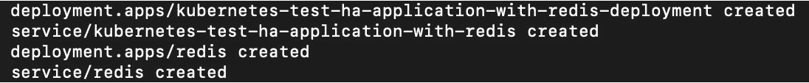

图 13.10：部署我们的应用程序

1.  现在，让我们使用以下命令检查我们部署的状态：

```
kubectl describe deployment kubernetes-test-ha-application-with-redis-deployment
```

你应该看到以下响应：

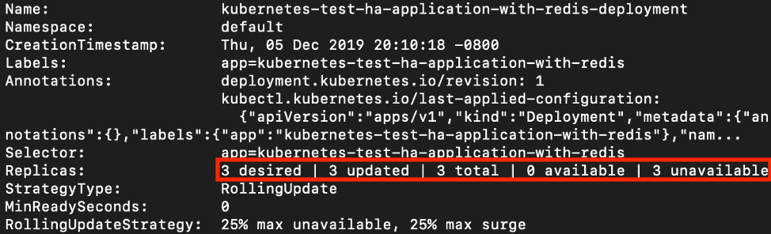

图 13.11：检查我们应用程序的状态

这是一个截断的截图。正如你所看到的，我们有一个问题，即无法与 Redis 通信。修复这个问题将是*Activity 13.01*，*超越基本操作*的一部分。

1.  现在我们将测试网络访问，因此在一个单独的终端窗口中，让我们启动我们的代理：

```
kubectl proxy
```

你应该看到这个响应：

```
Starting to serve on 127.0.0.1:8001
```

验证 NetworkPolicy 是否阻止流量的另一种方法是使用我们的`curl`命令：

```
curl localhost:8001/api/v1/namespaces/default/services/kubernetes-test-ha-application-with-redis:/proxy/get-number
```

你应该看到类似于这样的响应：

```
Error: 'dial tcp 10.0.0.193:8080: i/o timeout'
Trying to reach: 'http:10.0.0.193:8080/get-number'%
```

正如我们所看到的，我们能够防止 Kubernetes 集群中 Pod 之间的未经授权通信。通过利用 NetworkPolicies，我们可以防止攻击者在能够 compromise 集群、容器或源代码的一些组件后造成进一步的破坏。

# PodSecurityPolicy

到目前为止，我们已经学习并测试了 Kubernetes RBAC 以防止未经授权的 API 服务器访问，并且还应用了 NetworkPolicy 以防止不必要的网络通信。网络之外安全性的下一个最重要领域是应用程序运行时。攻击者需要访问网络来进出，但他们还需要一个容易受攻击的运行时来做更严重的事情。这就是 Kubernetes PodSecurityPolicy 对象帮助防止这种情况发生的地方。

PodSecurityPolicy 对象与特定类型的 AdmissionController 重叠，并允许集群操作员动态定义已被允许在集群上调度的 Pod 的最低运行时要求。

为了确切了解 PodSecurityPolicies 如何有用，让我们考虑以下情景。您是一家大型金融机构的 Kubernetes 集群管理员。您的公司以符合 ITIL 的方式（ITIL 是 IT 服务的标准变更管理框架）使用基于票据的变更管理软件，以确保对环境所做的更改是稳定的。这可以防止开发人员在生产环境中做出灾难性的事情。为了跟上客户要求的市场变化速度，您需要一种程序化的方式来使开发人员能够更自主地进行更改管理。但您还需要以安全和符合某些标准的方式来做到这一点。PodSecurityPolicies 帮助我们做到这一点，因为它们允许管理员在软件中创建策略定义，并在 Pod 被允许进入集群时执行。这意味着开发人员可以更快地移动，而集群管理员仍然可以证明他们的环境完全符合设定的标准。

进一步扩展这种情况，您可能希望阻止用户将其容器以 root 用户身份运行，以防攻击者利用 Docker 中的任何漏洞。通过应用 PodSecurityPolicy，您可以防止用户意外部署不安全的容器。

既然我们已经看到它们如何有用，让我们考虑一个示例 PodSecurityPolicy 并对其进行检查：

```
apiVersion: policy/v1beta1
kind: PodSecurityPolicy
metadata:
  name: psp-example
  namespace: default
spec:
  privileged: true
  seLinux:
    rule: RunAsAny
  supplementalGroups:
    rule: MustRunAs
    ranges:
      - min: 1
        max: 2500
  runAsUser:
    rule: MustRunAsNonRoot
  fsGroup:
    rule: MustRunAs
    ranges:
      - min: 655
        max: 655
  volumes:
    - '*'
```

让我们在这里检查一些值得注意的字段：

+   `metadata.namespace`: 这将在`default`命名空间中创建 PodSecurityPolicy，并将应用于同一命名空间中的 Pod。

+   `privileged`: 这控制容器是否允许在节点上以特权执行上下文中运行，这实际上授予容器对主机的根级访问权限。您可以在这里找到有关特权容器的更多信息：[`docs.docker.com/engine/reference/run/#runtime-privilege-and-linux-capabilities`](https://docs.docker.com/engine/reference/run/#runtime-privilege-and-linux-capabilities)。

+   `seLinux`: 这定义了任何 SELinux 设置。一些 Kubernetes 集群在 SELinux 环境中运行，这些环境在集群外实现了称为“强制访问控制”的东西。这允许将这些控制投影到集群中。通过声明`RunAsAny`，我们允许任何 SELinux 用户。

+   `supplementalGroups`: 这是策略的一个强制字段。它基本上告诉我们，我们允许任何 Linux 用户组 ID（GID）。在此示例规范中，我们说允许来自 ID 为 1 到 2500 的任何 Linux 用户组的用户。

+   `runAsUser`: 这允许我们指定可以在 Pod 中运行任何进程的特定 Linux 用户。通过声明`MustRunAsNonRoot`，我们说 Pod 中的任何进程都不能以 root 权限运行。

+   `fsGroup`: 这是容器进程必须以其运行的 Linux 组 ID，以便与集群上的某些卷进行交互。因此，即使 Pod 上存在卷，我们也可以限制该 Pod 中的某些进程访问它。在此示例规范中，我们说只有具有 GID 为 655 的`devops`组中的 Linux 用户可以访问该卷。这将适用于 Pod 在集群中的位置或卷的位置。

+   `卷`: 这使我们能够允许可以挂载到该 Pod 的不同类型的卷，例如`configmap`或`persistentVolumeClaim`。在此示例规范中，我们已经指定了`*`（星号），这意味着所有类型的卷都可以被该 Pod 中的进程使用。

现在我们已经了解了规范中不同字段的含义，我们将在以下练习中创建一个 PodSecurityPolicy。

## 练习 13.03：创建和测试 PodSecurityPolicy

在这个练习中，我们将创建一个 PodSecurityPolicy 并将其应用到我们的集群，以演示我们应用后集群中 Pod 必须遵守的功能类型。让我们开始吧：

1.  创建一个名为`pod_security_policy_example.yaml`的文件，内容如下：

```
apiVersion: policy/v1beta1
kind: PodSecurityPolicy
metadata:
  name: psp-example
  namespace: default
spec:
  privileged: false
  seLinux:
    rule: RunAsAny
  supplementalGroups:
    rule: MustRunAs
    ranges:
      - min: 1
        max: 2500
  runAsUser:
    rule: MustRunAsNonRoot
  fsGroup:
    rule: MustRunAs
    ranges:
      - min: 655
        max: 655
  volumes:
    - '*'
```

1.  要将此应用到集群中，请运行以下命令：

```
kubectl apply -f pod_security_policy_example.yaml
```

您应该会看到以下响应：

```
podsecuritypolicy.policy/psp-example created
```

为了检查我们的策略是否得到执行，让我们尝试创建一个不符合这个策略的 Pod。现在我们有一个名为`MustRunAsNonRoot`的策略，所以我们应该尝试以 root 身份运行一个容器，看看会发生什么。

1.  要创建一个违反这个 PodSecurityPolicy 的 Docker 容器，首先创建一个名为`Dockerfile`的文件，内容如下：

```
FROM debian:latest
USER 0
CMD echo $(whoami)
```

这个`Dockerfile`的第二行切换到 root 用户（由 UID `0`表示），然后`echo`命令应该告诉我们在容器启动时运行的用户是谁。

1.  通过运行以下命令构建 Docker 镜像：

```
docker build -t root .
```

您应该会看到以下响应：

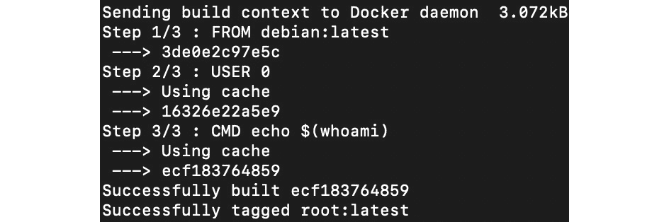

图 13.12：构建我们的 Docker 镜像

1.  让我们运行我们的 Docker 容器：

```
docker run root:latest
```

您应该会看到以下响应：

```
root
```

正如我们所看到的，这个容器将以 root 身份运行。

1.  现在，我们需要从这个容器创建一个 Pod。创建一个名为`pod.yaml`的文件，内容如下：

```
apiVersion: v1
kind: Pod
metadata:
  name: rooter
spec:
  containers:
    - name: rooter
      image: packtworkshops/the-kubernetes-workshop:root-tester
```

您可以将自己的镜像推送到 Docker Hub 存储库并替换此链接，或者您可以使用我们已经提供的容器以方便使用。作为一个一般的经验法则，当下载某些应该以 root 访问权限运行的东西时，您应该始终小心。

1.  默认情况下，PodSecurityPolicy 在用户、组或 ServiceAccount 上安装了`use`权限之前不会执行任何操作，这些用户、组或 ServiceAccount 将创建 Pod。为了模仿这一点，我们将快速创建一个 ServiceAccount：

```
kubectl create serviceaccount fake-user
```

您应该会看到以下响应：

```
serviceaccount/fake-user created
```

1.  现在，让我们创建一个将受到这个 PodSecurityPolicy 约束的角色：

```
kubectl create role psp:unprivileged --verb=use --resource=podsecuritypolicy --resource-name=psp-example
```

请注意，这是创建角色的另一种快速方法。在这里，`psp:unprivileged`对应于角色的名称，而标志对应于我们之前学习的字段。我们使用`--resource-name`标志将角色应用到我们特定的 PodSecurityPolicy。您应该会得到以下响应：

```
role.rbac.authorization.k8s.io/psp:unprivileged created
```

1.  让我们使用 RoleBinding 将这个角色绑定到我们的 ServiceAccount：

```
kubectl create rolebinding fake-user:psp:unprivileged --role=psp:unprivileged --serviceaccount=psp-example:fake-user
```

在这里，我们使用了类似于上一步中使用的命令。您应该会看到以下响应：

```
rolebinding.rbac.authorization.k8s.io/fake-user: psp:unprivileged created
```

1.  现在，让我们假扮成这个用户，尝试创建这个 Pod：

```
kubectl --as=system:serviceaccount:psp-example:fake-user apply -f pod.yaml
```

您应该会看到以下响应：

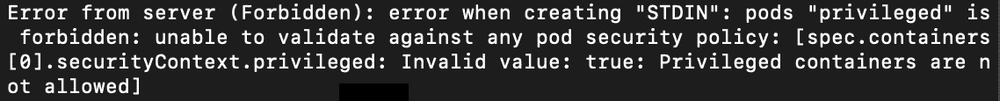

图 13.13：尝试在假用户 ServiceAccount 的假设下创建 Pod

在本章的开头，我们探讨了集群安全的 4C，然后在本章的整个过程中，我们看到了 Kubernetes 允许我们以不同的方式加固集群以抵御各种攻击的方法。我们了解到 RBAC 策略允许我们控制对 API 和对象的访问，NetworkPolicy 允许我们加固网络拓扑，而 PodSecurityPolicy 则帮助我们防止受损的运行时。

现在，让我们在以下活动中将这些概念结合起来。

## 活动 13.01：保护我们的应用程序

就目前而言，我们在上一章中的应用程序已经相当安全了。但是，我们需要做的是防止用户部署特权 Pod，并确保我们的应用程序可以与外部世界和其数据存储通信。对于这个应用程序的正确解决方案应该具有以下功能：

+   应用程序应该无缝工作，就像我们在上一章中演示的那样，但现在，它应该阻止任何不必要的网络流量。这里的不必要是指只有与 Redis 服务器通信的 Pod 应用程序，而且该应用程序只能与其他 IP 范围通信。

+   在*Exercise 13.02*，*Creating a NetworkPolicy*中，我们看到由于高度限制性的 NetworkPolicy，我们的应用程序无法工作。然而，在这种情况下，您应该看到应用程序运行并输出类似于以下内容的内容：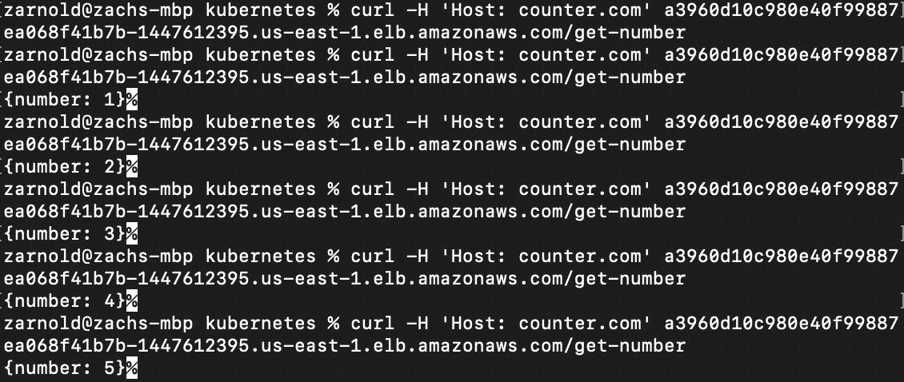

图 13.14：活动 13.01 的预期输出

以下是一些可以帮助您完成此活动的步骤：

1.  确保您拥有集群基础架构和*Exercise 13.01, Creating a Kubernetes RBAC ClusterRole*中的所有对象。

1.  创建名为`pod_security_policy.yaml`的文件（然后应用它）。在创建此文件时，请记住上面第一个要点中描述的功能。您可能需要重新访问*PodSecurityPolicy*部分，在那里我们详细描述了此类文件中使用的每个字段。

1.  创建一个名为`network_policy.yaml`的文件。在创建此文件时，请记住上面第二个要求中列出的内容。您可能需要重新访问*NetworkPolicies*部分，我们在其中详细描述了此类文件中使用的每个字段。确保在创建后应用此策略。

1.  如果您的集群中仍在部署*Exercise 14.02, Creating a NetworkPolicy*中的应用程序，则可以继续下一步。否则，请重新运行该练习中的*步骤 5*和*6*。

1.  现在，测试该应用程序。

注意

此活动的解决方案可在以下地址找到：[`packt.live/304PEoD`](https://packt.live/304PEoD)。

另外，考虑在完成本章后删除 NetworkPolicy 和 PodSecurityPolicy，以避免对后续章节造成干扰。

# 摘要

在我们构建生产就绪的 Kubernetes 环境的过程中，安全性是一个关键方面。考虑到这一点，在本章中，我们研究了威胁建模如何让我们以对抗性的方式思考我们的应用基础架构，以及它如何告诉我们如何防御攻击。然后，我们看了一下云原生安全的 4C，以了解我们的攻击面在哪里，然后看了一下 Kubernetes 如何帮助我们在集群中安全地运行工作负载。

Kubernetes 具有几个安全功能，我们可以利用这些功能来保护我们的集群。我们了解了三个重要的安全措施：RBAC、NetworkPolicies 和 PodSecurityPolicies。我们还了解了它们在保护对集群的访问、保护容器网络和保护容器运行时方面的各种应用。

在下一章中，我们将探讨如何在 Kubernetes 中管理存储对象，并处理具有状态的应用程序。
