# 第十四章： 在 Kubernetes 中运行有状态的组件

概述

在本章中，我们将扩展我们的技能，超越无状态应用程序，学习如何处理有状态应用程序。我们将了解 Kubernetes 集群操作员可用的各种状态保留机制，并推导出一个心智模型，以确定在何处可以调用某些选项来有效运行应用程序。我们还将介绍 Helm，这是一个用于部署具有各种 Kubernetes 对象的复杂应用程序的有用工具。

通过本章的学习，您将能够同时使用 StatefulSets 和 PersistentVolumes 来运行需要在 Pod 中断期间保留基于磁盘的状态的应用。您还将能够使用 Helm charts 部署应用程序。

# 介绍

根据您到目前为止学到的一切，您知道 Pod 和其中运行的容器被认为是短暂的。这意味着不能依赖它们的稳定性，因为 Kubernetes 将会干预并将它们移动到集群中的其他位置，以符合集群中各种清单指定的期望状态。但是这里存在一个问题 - 我们该如何处理我们的应用程序的部分，这些部分依赖于从一次交互到下一次交互的状态持久化？如果没有诸如可预测的 Pod 命名和可靠的存储操作等特定保证（我们将在本章后面学习），这样的有状态组件可能会在 Kubernetes 重新启动相关 Pod 或将其移动时失败。然而，在深入讨论上述主题的细节之前，让我们简要谈谈有状态应用程序以及在容器化环境中运行它们的挑战。

# 有状态应用

我们在《第十二章，您的应用程序和 HA》中简要介绍了有状态性的概念。应用程序的有状态组件几乎对世界上所有的信息技术系统都是必需的。它们对于保持账户详细信息、交易记录、HTTP 请求信息以及许多其他用途都是必需的。在生产环境中运行这些应用程序的挑战部分原因几乎总是与网络或持久性机制有关。无论是旋转金属盘、闪存存储、块存储还是其他尚未被发明的工具，持久性在各种形式中都是非常难以处理的。这种困难的部分原因是因为所有这些形式都存在失败的非零概率，一旦你需要在生产环境中拥有数百甚至数千个存储设备，这个概率就会变得非常显著。如今，许多云服务提供商将为客户提供帮助，并提供托管服务来解决这个困难。在 AWS 的情况下，我们有诸如 S3、EBS、RDS、DynamoDB、Elasticache 等工具，这些工具可以帮助开发人员和运营商在没有太多重复工作的情况下顺利运行有状态应用程序（前提是您可以接受供应商锁定）。

一些公司在运行有状态应用和它们所依赖的持久性机制时面临的另一个权衡是，要么培训和维护一大批能够保持这些记录系统在线、健康和最新的员工，要么尝试开发一套工具和程序化强制执行的常见运营场景。这两种方法在组织规模扩大时所需的人力维护工作量上有所不同。

例如，以人为中心的运营方法一开始可以让事情迅速进行，但所有运营成本都会随着应用规模线性增长，最终，官僚主义会导致每次新员工的生产力回报递减。以软件为中心的方法需要更高的前期投资，但成本随着应用规模的对数增长，并且在出现意外错误时有更高的级联故障概率。

这些操作场景的一些例子包括配置和配置、正常操作、扩展输入/输出、备份和异常操作。异常操作的例子包括网络故障、硬盘故障、磁盘数据损坏、安全漏洞和特定应用程序的不规则性。特定应用程序的不规则性的例子可能包括处理特定于 MySQL 的排序问题、处理 S3 最终一致性读取故障、etcd Raft 协议解决错误等。

许多公司发现，他们更容易支付供应商支持费用，使用云托管产品提供，或者重新培训员工，而不是开发编程状态管理流程和软件。

Kubernetes 启用的开发生命周期的一个好处在于工作负载定义方面。公司越是努力地严格定义计算的最小逻辑单元（一个 pod 模板或 PersistentVolume 定义），它们就越能为 Kubernetes 干预不规则操作并适当编排整个应用做好准备。这在很大程度上是因为 Kubernetes 编排是一个经典的动态约束满足问题（CSP）。CSP 求解器可以利用的约束形式的信息越多，工作负载编排就会变得更可预测，因为可行稳态解的数量会减少。因此，以可预测的工作负载编排为最终目标，我们是否可以在 Kubernetes 中运行应用的状态组件？答案是毫无疑问的肯定。在 Kubernetes 中运行有状态的工作负载常常让人犹豫不决。我们从本书的开头就说过，pod 是短暂的，不应该依赖它们的稳定性，因为在节点故障的情况下，它们将被移动和重新启动。因此，在你决定在 Kubernetes 中运行数据库太冒险之前，请考虑一下——世界上最大的搜索引擎公司在一个与 Kubernetes 非常相似的工具中运行数据库。这告诉我们，不仅可能，而且实际上更好的是努力定义工作负载，使它们可以由编排器运行，因为它可能比人类更快地处理应用程序故障。

那么，我们如何实现这一点呢？对这个问题的答案是使用你之前学过的两个 Kubernetes 对象的组合-**PersistentVolumes**和**StatefulSets**。这些在*第 7*和*第 9*章介绍过，所以我们不会在这里详细说明它们的用法，除了说我们将把所有介绍性的主题结合起来，形成一个与*我们的应用*相关的示例。

有效的有状态工作负载编排的关键是模块化和抽象。这些是基本的软件概念，工程师们学习它们以便设计良构架构的软件系统，同样适用于良构架构的基础设施系统。让我们考虑下面的图表，作为在 Kubernetes 中运行数据库时模块化的一个例子：

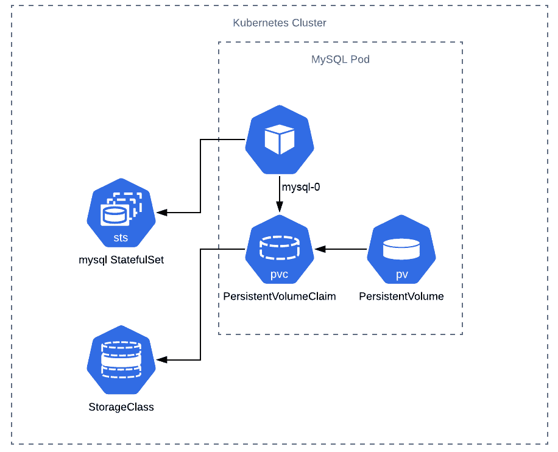

图 14.1：Kubernetes 中的模块化有状态组件

正如你在前面的图表中所看到的，并且在本书中学到的，Kubernetes 由模块化组件组成。因此，通过利用 StatefulSet 资源，我们可以组合使用 PersistentVolumes、PersistentVolumeClaims、StorageClasses、pods 以及围绕它们的生命周期的一些特殊规则，从而更强有力地保证我们应用程序的持久性层的状态。

# 理解 StatefulSets

在*图 14.1*中，我们可以看到 StatefulSet 被调用来管理 pod 的生命周期。StatefulSet（在 Kubernetes 的旧版本中，这被称为 PetSet）的操作方式与部署非常相似，我们提供一个 pod 模板，指定我们要运行的内容以及我们要运行多少个实例。StatefulSet 和部署之间的区别在于以下几点：

+   **一个可以依赖于 DNS 查询的清晰命名方案**：

这意味着在前面的图中，当我们将一个 StatefulSet 命名为`mysql`时，该 StatefulSet 中的第一个 pod 将始终是`mysql-0`。这与传统部署不同，传统部署中 pod 的 ID 是随机分配的。这也意味着，如果你有一个名为`mysql-2`的 pod，它崩溃了，它将在集群中使用完全相同的名称复活。

+   **更新必须进行的明确有序方式**：

根据此 StatefulSet 中的更新策略，每个 pod 将按非常特定的顺序关闭。因此，如果您有一个众所周知的升级路径（例如在 MySQL 的次要软件修订版本的情况下），您应该能够利用 Kubernetes 提供的软件更新策略之一。

+   **可靠的存储操作**：

由于存储是有状态解决方案中最关键的部分，因此 StatefulSet 采取的确定性操作至关重要。默认情况下，为 StatefulSet 配置的任何 PersistentVolume 都将被保留，即使该 StatefulSet 已被删除。虽然此行为旨在防止数据意外删除，但在测试期间可能会导致云提供商产生重大费用，因此您应该密切监视此行为。

+   **必须在 StatefulSet 中定义的 serviceName 字段**：

这个`serviceName`字段必须指向一个称为“无头”的服务，该服务指向这组 pod。这是为了允许使用常见的 Kubernetes DNS 语法单独地寻址这些 pod。例如，如果我的 StatefulSet 正在 default 命名空间中运行，并且名称为`zachstatefulset`，那么第一个 pod 将具有 DNS 条目`zachstatefulset-0.default.svc.cluster.local`。如果此 pod 失败，任何替换 pod 都将使用相同的 DNS 条目。

有关无头服务的更多信息，请访问此链接：[`kubernetes.io/docs/concepts/services-networking/service/#headless-services`](https://kubernetes.io/docs/concepts/services-networking/service/#headless-services)。

## 部署与 StatefulSets

现在您已经以稍微更细粒度的方式介绍了 StatefulSets，那么在选择使用 PersistentVolumeClaim 的 StatefulSet 和部署之间应该根据什么基础进行选择呢？答案取决于您希望编排的内容。

从理论上讲，您可以使用两种类型的 Kubernetes 对象实现类似的行为。两者都创建 pod，都有更新策略，都可以使用 PVC 来创建和管理 PersistentVolume 对象。StatefulSets 的设计目的是为了提供前面列出的保证。通常，在编排数据库、文件服务器和其他形式的敏感持久性依赖应用程序时，您会希望有这些保证。

当我们了解到 StatefulSets 对于可预测地运行应用程序的有状态组件是有用的时，让我们看一个与我们相关的具体例子。正如您从以前的章节中回忆起，我们有一个小型计数器应用程序，我们正在重构以利用尽可能多的云原生原则。在本章中，我们将替换状态持久性机制并尝试一个新的引擎。

# 进一步重构我们的应用程序

我们现在希望将我们的应用程序进一步发展到云原生原则。让我们考虑一下，我们计数器应用程序的产品经理说我们的负载量非常大（您可以通过您的可观察性工具集来确认这一点），有些人并不总是得到一个严格递增的数字；有时，他们会得到相同数字的重复。因此，您与同事商讨后得出结论，为了保证递增的数字，您需要保证数据在应用程序中的访问和持久性。

具体来说，您需要保证针对此数据存储的操作是原子唯一的，在操作之间是一致的，与其他操作是隔离的，并且在故障时是持久的。也就是说，您正在寻找一个符合 ACID 标准的数据库。

注

有关 ACID 合规性的更多信息，请访问此链接：[`database.guide/what-is-acid-in-databases/`](https://database.guide/what-is-acid-in-databases/)。

团队希望能够使用数据库，但他们宁愿不支付 AWS 运行该数据库的费用。如果他们以后在 GCP 或 Azure 上找到更好的交易，他们也宁愿不被锁定在 AWS 上。

因此，在谷歌上简要查看了一些选项后，您的团队决定使用 MySQL。MySQL 是更受欢迎的开源 RDBMS 解决方案之一，因此有很多关于在 Kubernetes 中作为数据库解决方案实施的文档、支持和社区建议。

现在，开始更改您的代码以支持使用 MySQL 支持的事务来递增计数器。因此，为了做到这一点，我们需要改变一些事情：

+   更改我们的应用程序代码，以使用 SQL 而不是 Redis 来访问数据并递增计数器。

+   修改我们的 Kubernetes 集群，以运行 MySQL 而不是 Redis。

+   确保在发生灾难性故障时数据库下面的存储的持久性。

您可能会问自己为什么集群操作员或管理员需要能够理解和重构代码。Kubernetes 的出现加速了软件行业利用 DevOps 工具、实践和文化开始更快、更可预测地为客户提供价值的趋势。这意味着开始使用软件而不是人来扩展我们的操作。我们需要强大的自动化来取代以人为中心的流程，以便能够保证功能和交付速度。因此，基础架构设计师或管理员具有系统级软件工程经验，使他们能够协助重构代码库以利用更多的云原生实践，对他们的职业来说是一个巨大的好处，很快可能会成为所有 DevOps 工程师的工作要求。因此，让我们看看如何重构我们的应用程序以使用 MySQL 进行 StatefulSets 的事务处理。

注意

如果您还不熟悉编程，或者对作者选择的语言的语法（例如本例中的 Golang）不熟悉，您不必担心-所有解决方案都已经被解决并准备好使用。

首先，让我们检查*Exercise 12.04*，*使用状态管理部署应用程序*的代码：

main.go

```
28 if r.Method == "GET" { 
29     val, err := client.Get("num").Result() 
30     if err == redis.Nil { 
31         fmt.Println("num does not exist") 
32         err := client.Set("num", "0", 0).Err() 
33         if err != nil { 
34             panic(err) 
35         } 
36     } else if err != nil { 
37         w.WriteHeader(500) 
38         panic(err) 
39     } else { 
40         fmt.Println("num", val) 
41         num, err := strconv.Atoi(val) 
42         if err != nil { 
43             w.WriteHeader(500) 
44             fmt.Println(err) 
45         } else { 
46             num++ 
47             err := client.Set("num", strconv.Itoa(num), 0).Err() 
48             if err != nil { 
49                 panic(err) 
50             } 
51             fmt.Fprintf(w, "{number: %d}", num) 
52         } 
53 } 
```

此步骤的完整代码可以在[`packt.live/3jSWTHB`](https://packt.live/3jSWTHB)找到。

在上述代码中突出显示了我们访问持久层的两个实例。正如您所看到的，我们不仅没有使用事务，而且在代码中操作了值，因此无法保证这是一个严格递增的计数器。为了做到这一点，我们必须改变我们的策略。

注意

您可以在此链接找到使用 MySQL 容器所需的信息：[`hub.docker.com/_/mysql?tab=description`](https://hub.docker.com/_/mysql?tab=description)。

我们提供了使用 SQL 的重构应用程序。让我们来看看重构应用程序的代码：

main.go

```
38 fmt.Println("Starting HTTP server") 
39 http.HandleFunc("/get-number", func(w http.ResponseWriter, r      *http.Request) { 
40     if r.Method == "GET" { 
41         tx, err := db.Begin() 
42             if err != nil { 
43         panic(err) 
44         } 
45         _, err = tx.Exec(t1) 
46         if err != nil { 
47             tx.Rollback() 
48             fmt.Println(err) 
49         } 
50         err = tx.Commit() 
51         if err != nil { 
52             fmt.Println(err) 
53         } 
54         row := db.QueryRow(t2, 1) 
55         switch err := row.Scan(&num); err { 
56         case sql.ErrNoRows: 
57             fmt.Println("No rows were returned!") 
58         case nil: 
59             fmt.Fprintf(w, "{number: %d}\n", num) 
60         default: 
61             panic(err) 
62         } 
63     } else { 
64         w.WriteHeader(400) 
65         fmt.Fprint(w, "{\"error\": \"Only GET HTTP method is                supported.\"}") 
66     } 
67 }
```

此步骤的完整代码可以在[`packt.live/35ck7nX`](https://packt.live/35ck7nX)找到。

正如您所看到的，它与 Redis 代码大致相同，只是现在我们的值是在事务中设置的。与 Redis 不同，MySQL 不是一种易失性的内存数据存储，因此对数据库的操作必须持久化到磁盘才能成功，并且理想情况下，它们应该持久化到在 pod 中断时不会消失的磁盘上。让我们在下一个练习中设置我们应用程序的其他必需组件。

## 练习 14.01：部署带有 MySQL 后端的计数器应用

在这个练习中，我们将重新配置我们的计数器应用程序，使其与 MySQL 后端一起工作：

1.  首先，我们将从 Terraform 文件中重新创建您的 EKS 集群*练习 12.02*，*使用 Terraform 在 EKS 上创建集群*。如果您已经有`main.tf`文件，可以使用它。否则，您可以运行以下命令获取它：

```
curl -O https://raw.githubusercontent.com/PacktWorkshops/Kubernetes-Workshop/master/Chapter12/Exercise12.02/main.tf
```

现在，依次使用以下两个命令来启动并运行您的集群资源：

```
terraform init
terraform apply
```

注意

在执行任何练习之后，如果您计划在相当长的时间后继续进行以下练习，最好将集群资源分配给您以阻止 AWS 向您收费。您可以使用`terraform destroy`命令来做到这一点。然后，当您准备进行练习或活动时，可以运行此步骤将所有内容恢复在线。

如果任何练习或活动依赖于在先前练习中创建的对象，则您还需要重新创建这些对象。

1.  运行以下命令获取定义所有所需对象的清单文件`with_mysql.yaml`：

```
curl -O https://raw.githubusercontent.com/PacktWorkshops/Kubernetes-Workshop/master/Chapter14/Exercise14.01/with_mysql.yaml
```

打开文件进行检查，以便我们可以检查这个 StatefulSet：

使用 MySQL.yaml

```
44 apiVersion: apps/v1 
45 kind: StatefulSet 
46 metadata: 
47   name: mysql 
48 spec: 
49   selector: 
50    matchLabels: 
51       app: mysql 
52   serviceName: mysql 
53   replicas: 1 
54   template: 
55     metadata: 
56       labels: 
57         app: mysql 
58     spec: 
```

此步骤的完整代码可以在[`packt.live/2R2WN3x`](https://packt.live/2R2WN3x)找到。

注意

在这里，PersistentVolumeClaim 在启动时会自动将 10 GiB 卷从 Amazon EBS 绑定到每个 pod。 Kubernetes 将使用我们在 Terraform 文件中定义的 IAM 角色自动配置 EBS 卷。

当 pod 因任何原因中断时，Kubernetes 将在重新启动时自动将适当的 PersistentVolume 重新绑定到 pod，即使它在不同的工作节点上，只要它在相同的可用区。

1.  让我们通过运行以下命令将其应用到我们的集群：

```
kubectl apply -f with_mysql.yaml
```

您应该看到这个响应：

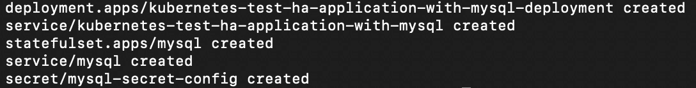

图 14.2：部署使用 MySQL 后端的重构应用程序

1.  现在在这个窗口运行`kubectl proxy`，然后让我们打开另一个终端窗口：

```
kubectl proxy
```

你应该看到这个回应：

```
Starting to serve on 127.0.0.1:8001
```

1.  在另一个窗口中，运行以下命令来访问我们的应用程序：

```
curl localhost:8001/api/v1/namespaces/default/services/kubernetes-test-ha-application-with-mysql:/proxy/get-number
```

你应该看到这个回应：

```
{number: 1}
```

您应该看到应用程序按预期运行，就像我们在前几章中看到的那样。就像那样，我们有一个使用 MySQL 持久化数据的工作 StatefulSet 与我们的应用程序。 

正如我们所说的，导致集群操作员不追求 StatefulSets 作为管理数据基础设施的一种方式的原因之一是错误地认为 PersistentVolumes 中的信息和它们绑定的 pod 一样短暂。这是不正确的。由 StatefulSet 创建的 PersistentVolumeClaims 如果删除了 pod 甚至 StatefulSet 也不会被删除。这是为了不惜一切代价保护这些卷中包含的数据。因此，对于清理，我们需要单独删除 PersistentVolume。集群操作员还可以利用其他工具来防止发生这种情况，例如更改 PersistentVolumes（或者创建它的 StorageClass）的回收策略。

## 练习 14.02：测试 PersistentVolumes 中 StatefulSet 数据的弹性

在这个练习中，我们将从上一个练习中离开的地方继续，并通过删除一个资源来测试我们应用程序中的数据的弹性，看看 Kubernetes 如何响应：

1.  现在到了有趣的部分，让我们尝试通过删除 MySQL pod 来测试我们持久性机制的弹性：

```
kubectl delete pod mysql-0
```

你应该看到这个回应：

```
pod "mysql-0" deleted
```

1.  此时应用可能会崩溃，但如果在删除 pod 之前几秒钟后再次尝试前面的`curl`命令，它应该会自动从我们删除 pod 之前的数字继续计数。我们可以通过尝试再次访问应用程序来验证这一点：

```
curl localhost:8001/api/v1/namespaces/default/services/kubernetes-test-ha-application-with-mysql:/proxy/get-number
```

您应该看到类似以下的回应：

```
{number: 2}
```

正如您所看到的，我们不仅从应用程序获得了有效的响应，而且还获得了序列中的下一个数字（`2`），这意味着当我们丢失 MySQL pod 并且 Kubernetes 恢复它时，没有丢失数据。

创建了这个 StatefulSet 之后，清理它并不像运行`kubectl delete -f with_mysql.yaml`那样简单。这是因为 Kubernetes 不会自动销毁由 StatefulSet 创建的 PersistentVolume。

注意

这也意味着，即使我们尝试使用`terraform destroy`删除所有 AWS 资源，我们仍将无限期地支付 AWS 中的孤立 EBS 卷（在这个示例中，我们不希望这样）。

1.  因此，为了清理，我们需要找出哪些 PersistentVolumes 绑定到这个 StatefulSet。让我们列出集群默认命名空间中的 PersistentVolumes：

```
kubectl get pv
```

您应该看到类似于以下的响应：

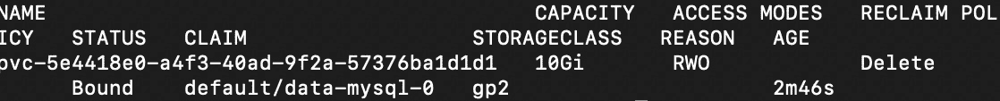

图 14.3：获取持久卷列表

1.  看起来我们有一个名为`data-mysql-0`的 PersistentVolume，这是我们想要删除的。首先，我们需要删除创建它的对象。因此，让我们首先删除我们的应用程序及其所有组件：

```
kubectl delete -f with_mysql.yaml
```

您应该看到这个响应：

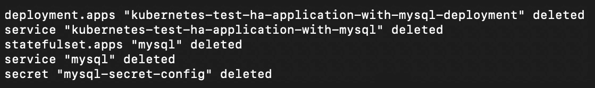

图 14.4：删除与 MySQL 关联的持久卷

1.  让我们检查一下我们试图删除的持久卷：

```
kubectl get pv
```

您应该看到类似于这样的响应：

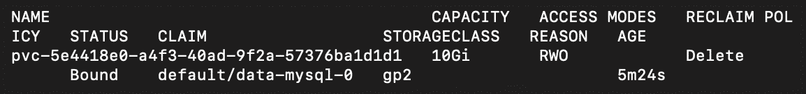

图 14.5：获取持久卷列表

从这个图像中，看起来我们的卷还在那里。

1.  我们需要删除创建它的 PersistentVolume 和 PersistentVolumeClaim。为此，让我们首先运行以下命令：

```
kubectl delete pvc data-mysql-0
```

您应该看到这个响应：

```
persistentvolumeclaim "data-mysql-0" deleted
```

一旦我们删除 PersistentVolumeClaim，PersistentVolume 就变为`unbound`，并且受到其回收策略的约束，我们可以在上一步的截图中看到。在这种情况下，策略是删除底层存储卷。

1.  为了验证 PV 是否已删除，让我们运行以下命令：

```
kubectl get pv
```

您应该看到以下响应：

```
No resources found in default namespace.
```

正如在这个截图中所显示的，我们的 PersistentVolume 现在已被删除。

注意

如果您的情况的回收策略不是`Delete`，您还需要手动删除 PersistentVolume。

1.  现在我们已经清理了我们的 PersistentVolumes 和 PersistentVolumeClaims，我们可以继续按照通常的方式进行清理，通过运行以下命令：

```
terraform destroy
```

您应该看到一个以此截图结束的响应：

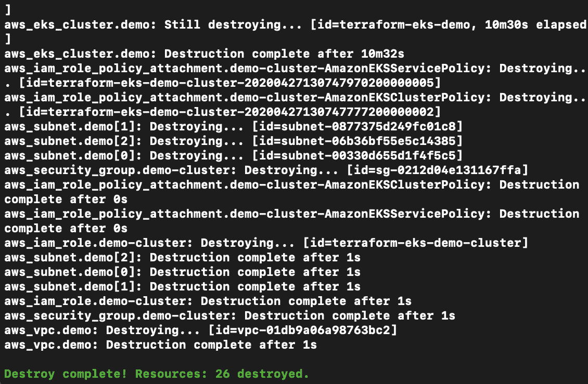

图 14.6：清理 Terraform 创建的资源

在这个练习中，我们已经看到了 Kubernetes 在删除 StatefulSet 时尝试保留 PersistentVolumes。我们还看到了当我们实际想要删除 PersistentVolume 时应该如何进行。

现在我们已经看到了如何设置 StatefulSet 并运行附加到其上的 MySQL 数据库，我们将在接下来的活动中进一步扩展高可用性的原则。不过，在我们这样做之前，我们需要解决 Kubernetes 清单蔓延的问题，因为似乎需要更多的 YAML 清单来实现构建高可用性有状态应用的目标。在接下来的部分中，我们将了解一个工具，它将帮助我们更好地组织和管理应用的清单。

# Helm

在本节中，我们将看一下一个在 Kubernetes 生态系统中非常有帮助的工具，称为 Helm。Helm 是由微软创建的，因为很快就显而易见，对于任何规模的 Kubernetes 部署（例如，涉及 20 个或更多独立组件、可观察性工具、服务和其他对象的部署），需要跟踪大量的 YAML 清单。再加上许多公司运行除了生产环境之外的多个环境，您需要能够使它们彼此保持同步，这样您就开始面临一个难以控制的问题。

Helm 允许您编写 Kubernetes 清单模板，您可以向其提供参数以覆盖任何默认值，然后 Helm 会为您创建适当的 Kubernetes 清单。因此，您可以将 Helm 用作一种软件包管理器，您可以使用 Helm 图表部署整个应用程序，并在安装之前调整一些小参数。使用 Helm 的另一种方式是作为模板引擎。它允许经验丰富的 Kubernetes 操作员仅编写一次良好的模板，然后可以被不熟悉 Kubernetes 清单语法的人成功地创建 Kubernetes 资源。Helm 图表可以通过参数设置任意数量的字段，并且可以根据不同的需求调整基本模板以部署软件或微服务的大不相同的实现。

Helm 软件包称为“图表”，它们具有特定的文件夹结构。您可以使用来自 Git 的共享 Helm 图表存储库，Artifactory 服务器或本地文件系统。在即将进行的练习中，我们将查看一个 Helm 图表并在我们的集群上安装它。

这是一个很好的机会来介绍 Helm，因为如果你一直在学习 Kubernetes，你已经写了相当多的 YAML 并将其应用到了你的集群中。此外，我们所写的很多内容都是我们以前见过的东西的重复。因此，利用 Helm 的模板功能将有助于打包类似的组件并使用 Kubernetes 进行交付。你不一定要利用 Helm 的模板组件来使用它，但这样做会有所帮助，因为你可以重复使用图表来生成不同排列的 Kubernetes 对象。

注意

我们将使用 Helm 3，它与其前身 Helm 2 有很大的不同，并且最近才发布。如果你熟悉 Helm 2 并想了解其中的区别，你可以参考这个链接上的文档：[`v3.helm.sh/docs/faq/#changes-since-helm-2`](https://v3.helm.sh/docs/faq/#changes-since-helm-2)。

Helm 的详细覆盖范围超出了本书的范围，但这里介绍的基本知识是一个很好的起点，也让我们明白了不同的工具和技术如何一起工作，以消除 Kubernetes 中复杂应用编排的几个障碍。

让我们看看如何创建一个图表（这是 Helm 术语中的一个包）并将其应用到一个集群中。然后，我们将了解 Helm 如何从 Helm 图表生成 Kubernetes 清单文件。

让我们通过运行以下命令来创建一个新的 Helm 图表：

```
helm create chart-dev
```

你应该会看到以下的回应：

```
Creating chart-dev
```

当你创建一个新的图表时，Helm 会默认生成一个 NGINX 的图表作为占位符应用。这将为我们创建一个新的文件夹和骨架图表供我们检查。

注意

在接下来的部分中，请确保你已经按照*前言*中的说明安装了`tree`。

让我们使用 Linux 的`tree`命令来看看 Helm 为我们做了什么：

```
tree .
```

你应该会看到类似以下的回应：

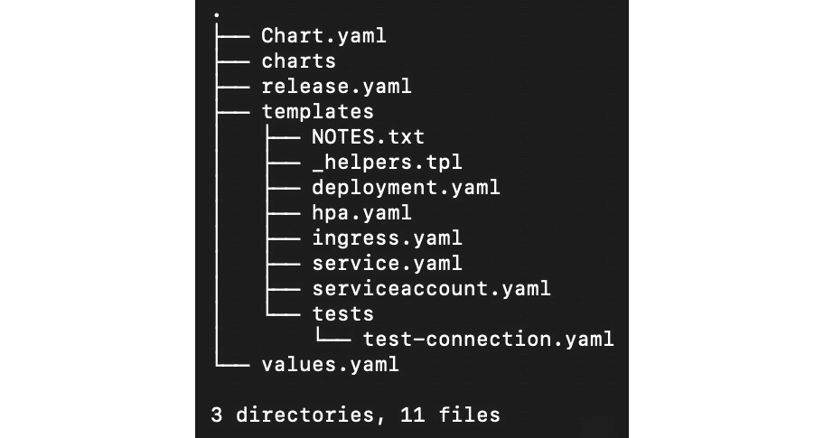

图 14.7：Helm 图表的目录结构

注意`templates`文件夹和`values.yaml`文件。Helm 通过使用`values.yaml`文件中的值，并将这些值填充到`templates`文件夹中的文件中相应的占位符中。让我们来看一下`values.yaml`文件的一部分：

values.yaml

```
1  # Default values for chart-dev.
2  # This is a YAML-formatted file.
3  # Declare variables to be passed into your templates.
4  
5  replicaCount: 1
6  
7  image:
8    repository: nginx
9    pullPolicy: IfNotPresent
10   # Overrides the image tag whose default is the chart appVersion.
11   tag: ""
12 
13 imagePullSecrets: []
14 nameOverride: ""
15 fullnameOverride: ""
```

这一步的完整代码可以在[`packt.live/33ej2cO`](https://packt.live/33ej2cO)找到。

正如我们在这里所看到的，这不是一个 Kubernetes 清单，但它看起来有许多相同的字段。在前面的片段中，我们已经突出显示了整个`image`块。这有三个字段（`repository`，`pullPolicy`和`tag`），每个字段都有其相应的值。

另一个值得注意的文件是`Chart.yaml`。此文件中的以下行与我们的讨论相关：

```
appVersion: 1.16.0
```

注意

您可以在此链接找到完整的文件：[`packt.live/2FboR2a`](https://packt.live/2FboR2a)。

文件中的注释对这意味着的描述相当详细：*“这是部署的应用程序的版本号。每次对应用程序进行更改时，应递增此版本号。版本不应遵循语义化版本。它们应反映应用程序正在使用的版本。”*

那么，Helm 是如何将这些组装成我们期望的传统 Kubernetes 清单格式的呢？要了解这一点，让我们检查`templates`文件夹中`deployment.yaml`文件的相应部分：

部署.yaml

```
30  containers:
31    - name: {{ .Chart.Name }}
32      securityContext:
33        {{- toYaml .Values.securityContext | nindent 12 }}
34      image: "{{ .Values.image.repository }}:{{ .Values.image.tag |           default .Chart.AppVersion }}"
35      imagePullPolicy: {{ .Values.image.pullPolicy }}
```

此步骤的完整代码可以在此链接找到：[`packt.live/3k0OGRL`](https://packt.live/3k0OGRL)。

这个文件看起来更像是一个 Kubernetes 清单，其中添加了许多变量。将`deployment.yaml`中的模板占位符与`values.yaml`和`Chart.yaml`中的观察结果进行比较，我们可以推断出以下内容：

+   `{{ .Values.image.repository }}`将被解释为`nginx`。

+   `{{ .Values.image.tag | default .Chart.AppVersion }}`将被解释为`1.16.0`。

因此，我们得到了我们部署规范的结果字段`image: nginx:1.16.0`。

这是我们第一次看到 Helm 模板语言。对于那些熟悉模板引擎（如 Jinja，Go 模板或 Twig）的人来说，这种语法应该看起来很熟悉。如前所述，我们不会深入了解 Helm 的太多细节，但您可以在此链接找到有关 Helm 文档的更多信息：[`helm.sh/docs/chart_template_guide/`](https://helm.sh/docs/chart_template_guide/)。

现在，让我们安装我们生成的示例图表`chart-dev`。这个图表将在我们的 Kubernetes 集群中部署一个示例 NGINX 应用程序。要安装 Helm 图表，命令如下所示：

```
helm install [NAME] [CHART] [flags]
```

我们可以使用`--generate-name`来获取一个随机名称。此外，由于我们已经在`chart-dev`目录中，我们可以直接使用当前工作目录根目录中的`values.yaml`：

```
helm install --generate-name -f values.yaml .
```

您应该看到以下响应：

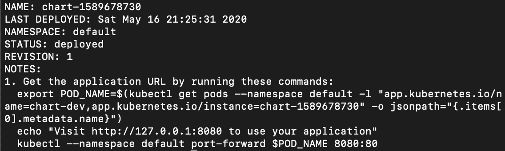

图 14.8：安装 Helm 图表

请注意，在输出中，您将收到关于接下来要做什么的说明。这些是来自`templates/NOTES.txt`文件的可定制说明。当您制作自己的 Helm 图表时，您可以使用这些来指导使用图表的人。现在，让我们运行这些命令。

注意

此输出中的确切值根据您的特定环境进行了定制，因此您应该从终端输出中复制命令。这适用于以下命令。

第一个命令将 pod 名称设置为名为`POD_NAME`的环境变量：

```
export POD_NAME=$(kubectl get pods --namespace default -l "app.kubernetes.io/name=chart-dev,app.kubernetes.io/instance=chart-1589678730" -o jsonpath="{.items[0].metadata.name}")
```

我们将跳过`echo`命令；它只是告诉您如何访问您的应用程序。存在这个`echo`命令的原因是为了显示终端输出中接下来的命令是什么。

现在在访问我们的应用程序之前，我们需要进行一些端口转发。下一个命令将在您的主机上将端口`8080`映射到 pod 上的端口`80`：

```
kubectl --namespace default port-forward $POD_NAME 8080:80
```

您应该看到这个响应：

```
Forwarding from 127.0.0.1:8080 ->80
Forwarding from [::1]:8080 -> 80
```

现在让我们尝试访问 NGINX。在浏览器中，转到`localhost:8080`。您应该能够看到默认的 NGINX 欢迎页面：

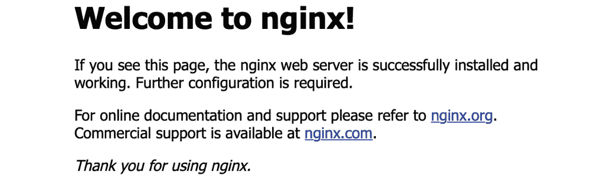

图 14.9：访问我们的默认 NGINX 测试应用程序

您可以通过删除我们的资源来清理这个。首先，让我们通过获取 Helm 在您的集群中安装的所有发布的列表来获得此发布的生成名称：

```
helm ls
```

您应该看到类似于这样的响应：

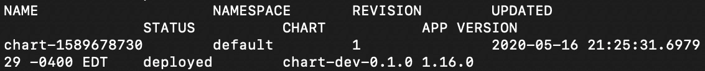

图 14.10：获取 Helm 安装的所有应用程序列表

现在，我们可以按以下方式删除发布：

```
helm uninstall chart-1589678730
```

使用前面输出中的名称。您应该看到这个响应：

```
release "chart-1589678730" uninstalled
```

就像那样，我们已经编写了我们的第一个图表。所以，让我们继续进行下一个练习，我们将学习 Helm 如何确切地使我们的工作变得更容易。

## 练习 14.03：为我们的基于 Redis 的计数器应用创建图表

在上一节中，我们创建了一个通用的 Helm 图表，但是如果我们想为我们的软件制作自己的图表呢？在这个练习中，我们将创建一个 Helm 图表，该图表将使用 Helm 从*第十二章*“您的应用程序和 HA”中部署我们的 HA 基于 Redis 的解决方案。

1.  如果您在`chart-dev`目录中，导航到父目录：

```
cd ..
```

1.  让我们首先制作一个全新的 Helm 图表：

```
helm create redis-based-counter && cd redis-based-counter
```

您应该看到这个响应：

```
Creating redis-based-counter
```

1.  现在让我们从图表中删除不必要的文件：

```
rm templates/NOTES.txt; \
rm templates/*.yaml; \
rm -r templates/tests/; \
cd templates
```

1.  现在，我们需要进入图表的`templates`文件夹，并从我们的存储库中复制 Redis 计数应用程序的文件：

```
curl -O https://raw.githubusercontent.com/PacktWorkshops/Kubernetes-Workshop/master/Chapter14/Exercise14.03/templates/redis-deployment.yaml; \
curl -O https://raw.githubusercontent.com/PacktWorkshops/Kubernetes-Workshop/master/Chapter14/Exercise14.03/templates/deployment.yaml;\
curl -O https://raw.githubusercontent.com/PacktWorkshops/Kubernetes-Workshop/master/Chapter14/Exercise14.03/templates/redis-service.yaml; \
curl -O https://raw.githubusercontent.com/PacktWorkshops/Kubernetes-Workshop/master/Chapter14/Exercise14.03/templates/service.yaml
```

您可能还记得之前的章节中，我们有多个 Kubernetes 清单共享一个文件，由`---` YAML 文件分隔符字符串分隔。现在我们有了一个管理 Kubernetes 清单的工具，最好将它们保存在单独的文件中，以便我们可以独立管理它们。捆绑的工作现在将由 Helm 来处理。

1.  `templates`文件夹中应该有四个文件。让我们确认一下：

```
tree .
```

您应该会看到以下响应：

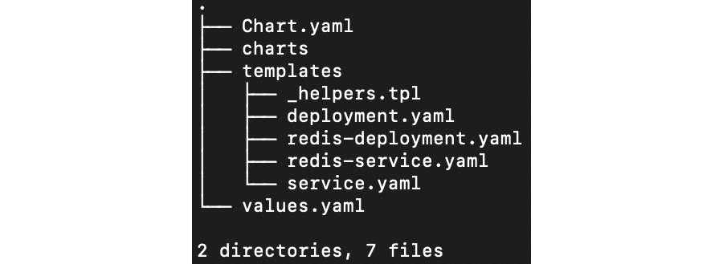

图 14.11：我们应用程序的预期文件结构

1.  现在我们需要修改`values.yaml`文件。从该文件中删除所有内容，然后只复制以下内容：

```
deployment:
  replicas: 3
redis:
  version: 3
```

1.  现在，为了将它们连接在一起，我们需要编辑`deployment.yaml`和`redis-deployment.yaml`。我们首先要编辑的是`deployment.yaml`。我们应该用模板替换`replicas: 3`，如下清单中的突出显示行所示：

```
apiVersion: apps/v1
kind: Deployment
metadata:
  name: kubernetes-test-ha-application-with-redis-deployment
  labels:
    app: kubernetes-test-ha-application-with-redis
spec:
  replicas: {{ .Values.deployment.replicas }}
  selector:
    matchLabels:
      app: kubernetes-test-ha-application-with-redis
  template:
    metadata:
      labels:
        app: kubernetes-test-ha-application-with-redis
    spec:
      containers:
        - name: kubernetes-test-ha-application-with-redis
          image: packtworkshops/the-kubernetes-workshop:demo-app-            with-redis
          imagePullPolicy: Always
          ports:
            - containerPort: 8080
          env:
            - name: REDIS_SVC_ADDR
              value: "redis.default:6379"
```

1.  接下来，编辑`redis-deployment.yaml`文件，并添加一个类似的模板语言块，如下清单中的突出显示行所示：

```
apiVersion: apps/v1 # for versions before 1.9.0 use apps/v1beta2
kind: Deployment
metadata:
  name: redis
  labels:
    app: redis
spec:
  selector:
    matchLabels:
      app: redis
  replicas: 1
  template:
    metadata:
      labels:
        app: redis
    spec:
      containers:
        - name: master
          image: redis:{{ .Values.redis.version }}
          resources:
            requests:
              cpu: 100m
              memory: 100Mi
          ports:
            - containerPort: 6379
```

1.  现在让我们使用 Helm 安装我们的应用程序：

```
helm install --generate-name -f values.yaml .
```

您应该会看到类似于这样的响应：


图 14.12：使用自动生成的名称安装我们的 Helm 图表

1.  要检查我们的应用程序是否在线，我们可以获取部署列表：

```
kubectl get deployment
```

您应该会看到以下输出：

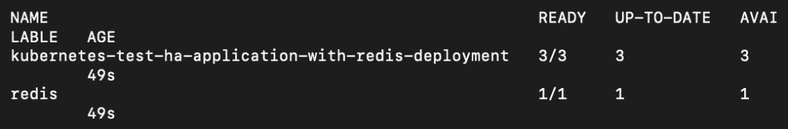

图 14.13：获取部署列表

如您所见，Helm 已部署了我们的应用程序部署，以及为其部署的 Redis 后端。有了这些技能，您很快就会成为 Helm 的船长。

在接下来的活动中，我们将结合本章学到的两件事情——重构我们的应用程序以用于有状态的组件，然后将其部署为 Helm 图表。

## 活动 14.01：将我们的 StatefulSet 部署为图表

现在您已经有了 MySQL、StatefulSets 和 Helm 资源管理的经验，您的任务是将*练习 14.01*、*14.02*和*14.03*中学到的知识结合起来。

对于这个活动，我们将重构我们基于 Redis 的应用程序，使用 StatefulSets 来使用 MySQL 作为后端数据存储，并使用 Helm 进行部署。

遵循这些高级指南完成活动：

1.  按照*Exercise 14.01*的*step 1*中所示设置所需的集群基础设施，部署一个带有 MySQL 后端的计数器应用。

1.  引入一个名为`counter-mysql`的新 Helm 图表。

1.  创建一个使用 MySQL 作为后端的计数器应用的模板。

1.  为我们的 MySQL StatefulSet 创建一个模板。

1.  在适当的地方使用 Kubernetes Service 对象将所有内容连接起来。

1.  配置模板，使`values.yaml`文件能够更改 MySQL 的版本。

1.  测试应用程序。您应该看到与我们在以前的练习中看到的计数器应用程序类似的输出：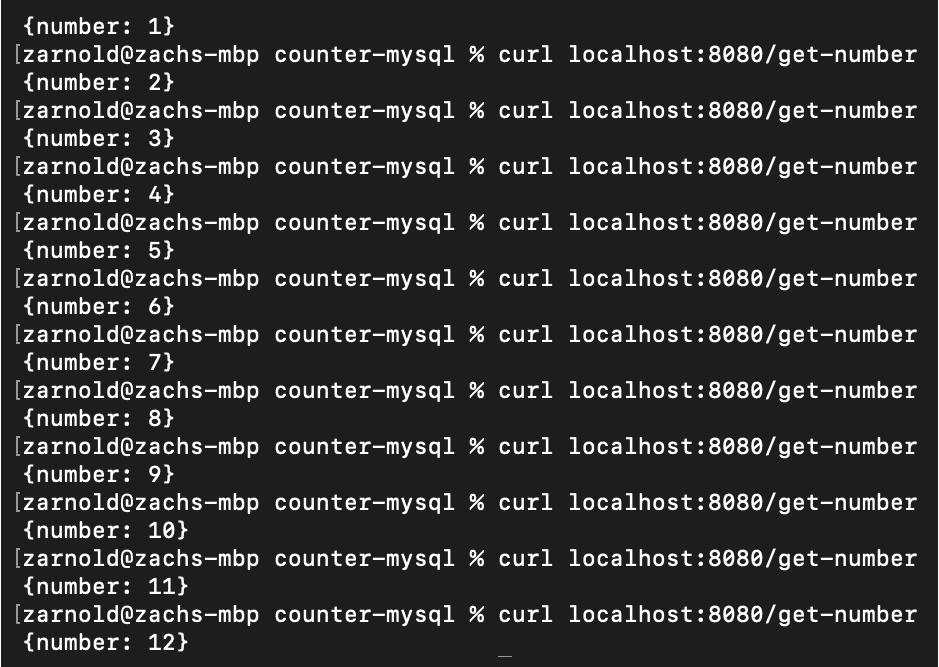

图 14.14：活动 14.01 的预期输出

注意

此活动的解决方案可以在以下地址找到：[`packt.live/304PEoD`](https://packt.live/304PEoD)。

此外，不要忘记使用`terraform destroy`命令清理云资源，以防止 AWS 在活动结束后向您收费。

# 总结

在本章的过程中，我们已经应用了我们的技能，以便能够在我们的示例应用程序中利用 StatefulSets。我们已经看到了如何以编程方式考虑运行软件的有状态部分，以及如何重构应用程序以利用状态持久性的变化。最后，我们学会了如何创建和运行 Kubernetes StatefulSets，这将使我们能够在集群中运行有状态的组件，并对工作负载的运行方式做出保证。

具备管理 Kubernetes 集群上有状态组件所需的技能是能够有效地在许多现实世界的应用中操作的重要一步。

在下一章中，我们将更多地讨论使用 Metrics Server、HorizontalPodAutoscalers 和 ClusterAutoscaler 进行数据驱动的应用编排。我们将学习这些对象如何帮助我们应对运行在 Kubernetes 集群上的应用的需求变化。
