# 第十五章： Kubernetes 中的监控和自动扩展

概述

本章将介绍 Kubernetes 如何使您能够监视集群和工作负载，然后使用收集的数据自动驱动某些决策。您将了解 Kubernetes Metric Server，它汇总了所有集群运行时信息，使您能够使用这些信息来驱动应用程序运行时的扩展决策。我们将指导您如何使用 Kubernetes Metrics 服务器和 Prometheus 设置监控，然后使用 Grafana 来可视化这些指标。到本章结束时，您还将学会如何自动扩展您的应用程序以充分利用所提供的基础设施的资源，以及根据需要自动扩展您的集群基础设施。

# 介绍

让我们花一点时间回顾一下我们在这一系列章节中的进展，从第十一章“构建您自己的 HA 集群”开始。我们首先使用 kops 设置了一个 Kubernetes 集群，以高可用的方式配置 AWS 基础设施。然后，我们使用 Terraform 和一些脚本来提高集群的稳定性，并部署我们的简单计数器应用程序。之后，我们开始加固安全性，并使用 Kubernetes/云原生原则增加我们应用程序的可用性。最后，我们学会了运行一个负责使用事务来确保我们始终从我们的应用程序中获得一系列递增数字的有状态数据库。

在本章中，我们将探讨如何利用 Kubernetes 已有的关于我们应用程序的数据，驱动和自动化关于调整其规模的决策过程，以便始终使其适合我们的负载。由于观察应用程序指标、调度和启动容器以及从头开始引导节点需要时间，因此这种扩展并非瞬间发生，但最终（通常在几分钟内）会平衡集群上执行负载工作所需的 Pod 和节点数量。为了实现这一点，我们需要一种获取这些数据、理解/解释这些数据并利用这些数据向 Kubernetes 反馈指令的方法。幸运的是，Kubernetes 中已经有一些工具可以帮助我们做到这一点。这些工具包括 Kubernetes Metric Server、HorizontalPodAutoscalers（HPAs）和 ClusterAutoscaler。

# Kubernetes 监控

Kubernetes 内置支持提供有关基础设施组件以及各种 Kubernetes 对象的有用监控信息。 Kubernetes Metrics 服务器是一个组件（不是内置的），它会在 API 服务器的 API 端点上收集和公开指标数据。 Kubernetes 使用这些数据来管理 Pod 的扩展，但这些数据也可以被第三方工具（如 Prometheus）抓取，供集群操作员使用。 Prometheus 具有一些非常基本的数据可视化功能，并且主要用作度量收集和存储工具，因此您可以使用更强大和有用的数据可视化工具，如 Grafana。 Grafana 允许集群管理员创建有用的仪表板来监视其集群。 您可以在此链接了解有关 Kubernetes 监控架构的更多信息：[`github.com/kubernetes/community/blob/master/contributors/design-proposals/instrumentation/monitoring_architecture.md`](https://github.com/kubernetes/community/blob/master/contributors/design-proposals/instrumentation/monitoring_architecture.md)。

以下是我们在图表中的展示：

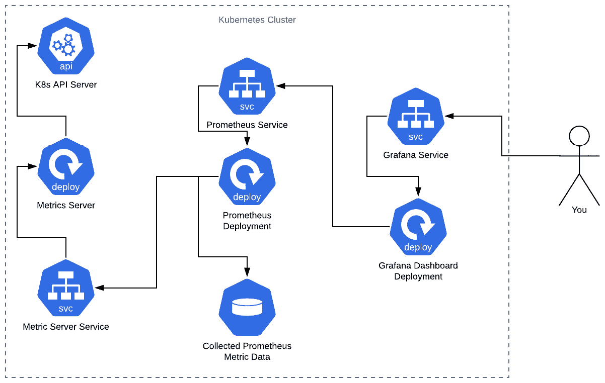

图 15.1：我们将在本章实施的监控管道概述

该图表代表了通过各种 Kubernetes 对象实施监控管道的方式。 总之，监控管道将按以下方式工作：

1.  Kubernetes 的各个组件已经被调整，以提供各种指标。 Kubernetes Metrics 服务器将从这些组件中获取这些指标。

1.  Kubernetes Metrics 服务器将在 API 端点上公开这些指标。

1.  Prometheus 将访问此 API 端点，抓取这些指标，并将其添加到其特殊数据库中。

1.  Grafana 将查询 Prometheus 数据库，收集这些指标，并在整洁的仪表板上以图表和其他可视化形式呈现。

现在，让我们逐个查看之前提到的每个组件，以更好地理解它们。

## Kubernetes Metrics API/Metrics 服务器

Kubernetes Metrics server（以前称为 Heapster）收集并公开所有 Kubernetes 组件和对象的运行状态的度量数据。节点、控制平面组件、运行中的 pod 以及任何 Kubernetes 对象都可以通过 Metrics server 进行观察。它收集的一些度量的例子包括 Deployment/ReplicaSet 中所需 pod 的数量，该部署中处于`Ready`状态的 pod 的数量，以及每个容器的 CPU 和内存利用率。

在收集与我们编排应用程序相关的信息时，我们将主要使用默认公开的度量。

## Prometheus

Prometheus 是一个度量收集器、时间序列数据库和警报管理器，几乎可以用于任何事情。它利用抓取功能从运行中的进程中提取度量，这些度量以 Prometheus 格式在定义的间隔内暴露。然后这些度量将存储在它们自己的时间序列数据库中，您可以对这些数据运行查询，以获取运行应用程序状态的快照。

它还带有警报管理器功能，允许您设置触发器以警报您的值班管理员。例如，您可以配置警报管理器，如果您的一个节点的 CPU 利用率在 15 分钟内超过 90%，则自动触发警报。警报管理器可以与多个第三方服务进行接口，通过各种方式发送警报，如电子邮件、聊天消息或短信电话警报。

注意：

如果您想了解更多关于 Prometheus 的信息，可以参考这本书：[`www.packtpub.com/virtualization-and-cloud/hands-infrastructure-monitoring-prometheus`](https://www.packtpub.com/virtualization-and-cloud/hands-infrastructure-monitoring-prometheus)。

## Grafana

Grafana 是一个开源工具，可用于可视化数据并创建有用的仪表板。Grafana 将查询 Prometheus 数据库以获取度量，并在仪表板图表上绘制它们，这样人类更容易理解并发现趋势或差异。在运行生产集群时，这些工具是必不可少的，因为它们帮助我们快速发现基础设施中的问题并解决问题。

## 监控您的应用程序

虽然应用程序监控超出了本书的范围，但我们将提供一些粗略的指南，以便您可以在这个主题上进行更多的探索。我们建议您以 Prometheus 格式公开应用程序的指标，并使用 Prometheus 对其进行抓取；大多数语言都有许多库可以帮助实现这一点。

另一种方法是使用适用于各种应用程序的 Prometheus 导出器。导出器从应用程序中收集指标并将它们暴露给 API 端点，以便 Prometheus 可以对其进行抓取。您可以在此链接找到一些常见应用程序的开源导出器：[`prometheus.io/docs/instrumenting/exporters/`](https://prometheus.io/docs/instrumenting/exporters/)。

对于您的自定义应用程序和框架，您可以使用 Prometheus 提供的库创建自己的导出器。您可以在此链接找到相关的指南：[`prometheus.io/docs/instrumenting/writing_exporters/`](https://prometheus.io/docs/instrumenting/writing_exporters/)。

一旦您从应用程序中公开并抓取了指标，您可以在 Grafana 仪表板中呈现它们，类似于我们将为监控 Kubernetes 组件创建的仪表板。

## 练习 15.01：设置 Metrics Server 并观察 Kubernetes 对象

在这个练习中，我们将为我们的集群设置 Kubernetes 对象的监控，并运行一些查询和创建可视化来查看发生了什么。我们将安装 Prometheus、Grafana 和 Kubernetes Metrics server：

1.  首先，我们将从*练习 12.02*中的 Terraform 文件重新创建您的 EKS 集群，*使用 Terraform 创建 EKS 集群*。如果您已经有了`main.tf`文件，您可以使用它。否则，您可以运行以下命令来获取它：

```
curl -O https://github.com/PacktWorkshops/Kubernetes-Workshop/blob/master/Chapter12/Exercise12.02/main.tf
```

现在，依次使用以下两个命令来启动和运行您的集群资源：

```
terraform init
terraform apply
```

注意

您将需要`jq`来运行以下命令。`jq`是一个简单的操作 JSON 数据的工具。如果您还没有安装它，您可以使用以下命令来安装：`sudo apt install jq`。

1.  为了在我们的集群中设置 Kubernetes Metrics server，我们需要按顺序运行以下命令：

```
curl -O https://raw.githubusercontent.com/PacktWorkshops/Kubernetes-Workshop/master/Chapter15/Exercise15.01/metrics_server.yaml
kubectl apply -f metrics_server.yaml
```

您应该会看到类似以下的响应：

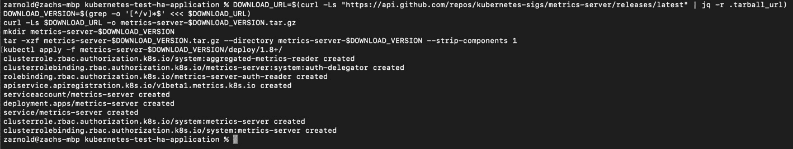

图 15.2：部署 Metrics server 所需的所有对象

1.  为了测试这一点，让我们运行以下命令：

```
kubectl get --raw "/apis/metrics.k8s.io/v1beta1/nodes"
```

注意

如果您收到`ServiceUnavailable`错误，请检查防火墙规则是否允许 API 服务器与运行 Metrics 服务器的节点进行通信。

我们经常使用`kubectl get`命令来命名对象。我们在*第四章*中看到，Kubectl 解释请求，将请求指向适当的端点，并以可读格式格式化结果。但是在这里，由于我们在 API 服务器上创建了自定义端点，我们必须使用`--raw`标志指向它。您应该看到类似以下的响应：

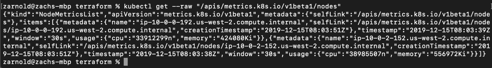

图 15.3：来自 Kubernetes Metrics 服务器的响应

正如我们在这里看到的，响应包含定义度量命名空间、度量值和度量元数据的 JSON 块，例如节点名称和可用区。但是，这些指标并不是非常可读的。我们将利用 Prometheus 对它们进行聚合，然后使用 Grafana 将聚合指标呈现在简洁的仪表板中。

1.  现在，我们正在聚合度量数据。让我们开始使用 Prometheus 和 Grafana 进行抓取和可视化。为此，我们将使用 Helm 安装 Prometheus 和 Grafana。运行以下命令：

```
helm install --generate-name stable/prometheus
```

注意

如果您是第一次安装和运行 helm，您需要运行以下命令来获取稳定的存储库：

`help repo add stable https://kubernetes-charts.storage.googleapis.com/`

您应该看到类似以下的输出：

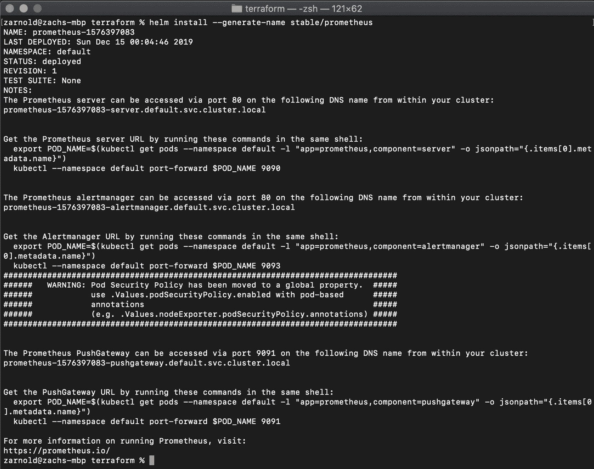

图 15.4：安装 Prometheus 的 Helm 图表

1.  现在，让我们以类似的方式安装 Grafana：

```
helm install --generate-name stable/grafana
```

您应该看到以下响应：

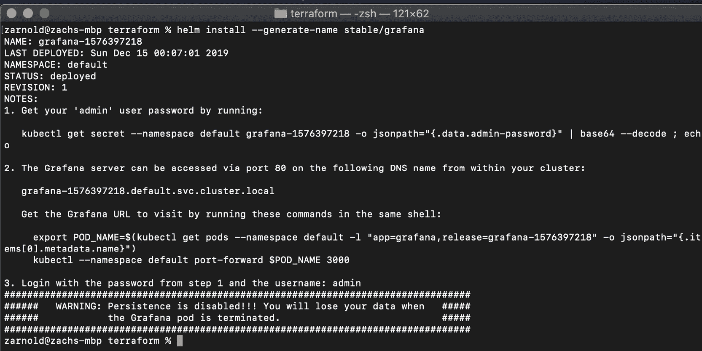

图 15.5：安装 Grafana 的 Helm 图表

在此截图中，请注意`NOTES:`部分，其中列出了两个步骤。按照这些步骤获取 Grafana 管理员密码和访问 Grafana 的端点。

1.  在这里，我们正在运行 Grafana 在上一步输出中显示的第一个命令：

```
kubectl get secret --namespace default grafana-1576397218 -o jsonpath="{.data.admin-password}" | base64 --decode ; echo
```

请使用您获得的命令版本；命令将被定制为您的实例。此命令获取您的密码，该密码存储在一个秘密中，解码它，并在您的终端输出中回显它，以便您可以将其复制以供后续步骤使用。您应该看到类似以下的响应：

```
brM8aEVPCJtRtu0XgHVLWcBwJ76wBixUqkCmwUK)
```

1.  现在，让我们运行 Grafana 要求我们运行的下两个命令，如*图 15.5*中所示：

```
export POD_NAME=$(kubectl get pods --namespace default -l "app.kubernetes.io/name=grafana,app.kubernetes.io/instance=grafana-1576397218" -o jsonpath="{.items[0].metadata.name}")
kubectl --namespace default port-forward $POD_NAME 3000
```

再次使用您的实例获取的命令，因为这将是定制的。这些命令会找到 Grafana 正在运行的 Pod，然后将本地机器的端口映射到它，以便我们可以轻松访问它。您应该会看到以下响应：

```
Forwarding from 127.0.0.1:3000 -> 3000
Forwarding from [::1]:3000 -> 3000
```

注意

在这一步，如果您在获取正确的 Pod 名称时遇到任何问题，您可以简单地运行`kubectl get pods`来找到运行 Grafana 的 Pod 的名称，并使用该名称代替 shell（`$POD_NAME`）变量。因此，您的命令将类似于这样：

`kubectl --namespace default port-forward grafana-1591658222-7cd4d8b7df-b2hlm 3000`。

1.  现在，打开浏览器并访问`http://localhost:3000`以访问 Grafana。您应该会看到以下着陆页面：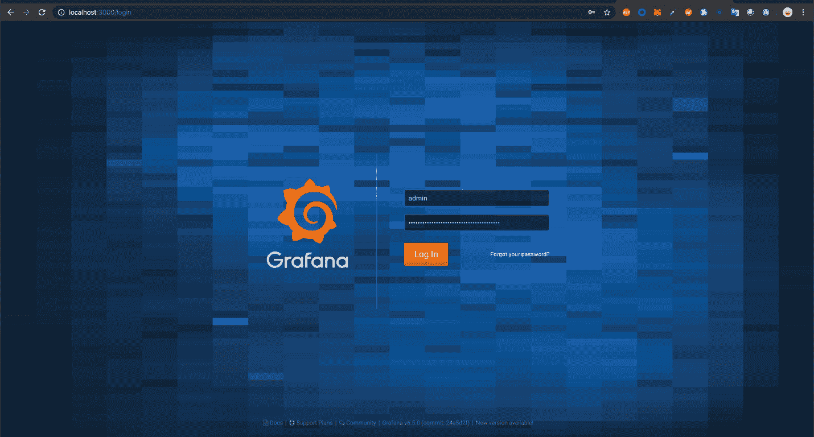

图 15.6：Grafana 仪表板的登录页面

默认用户名是`admin`，密码是*步骤 6*输出中的值。使用该值登录。

1.  成功登录后，您应该会看到此页面：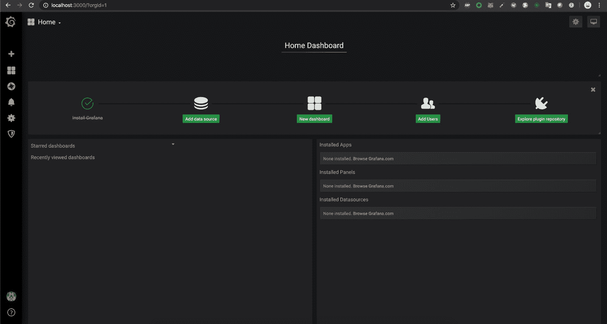

图 15.7：Grafana 主页仪表板

1.  现在，让我们为 Kubernetes 指标创建一个仪表板。为此，我们需要将 Prometheus 设置为 Grafana 的数据源。在左侧边栏中，点击`配置`，然后点击`数据源`：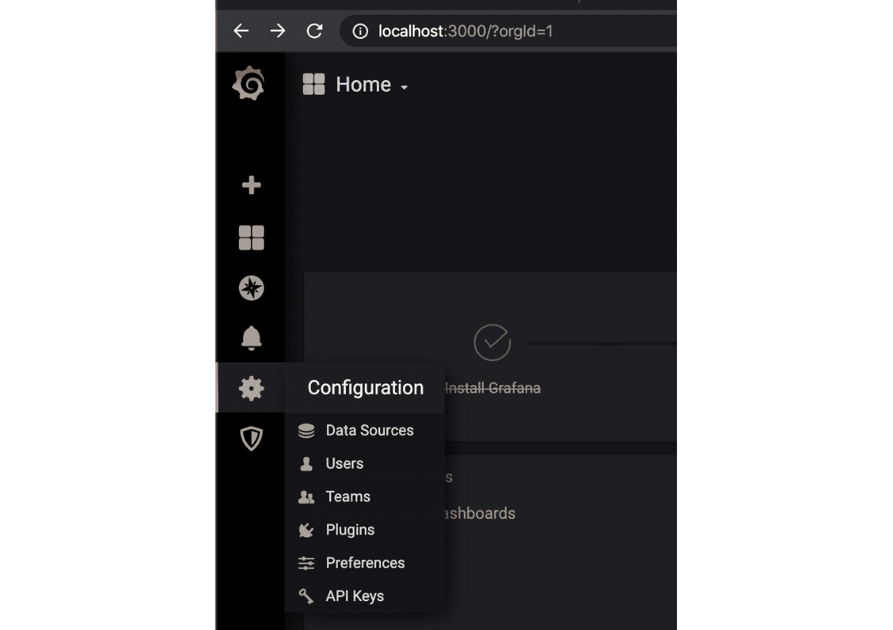

图 15.8：从配置菜单中选择数据源

1.  您将看到此页面：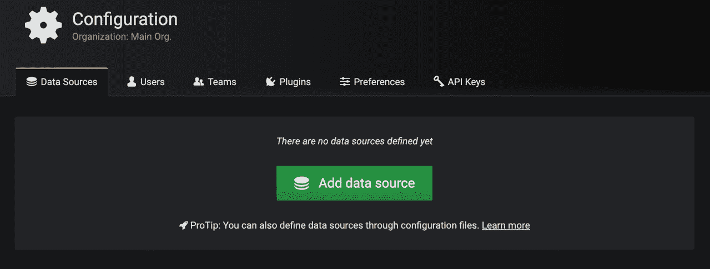

图 15.9：添加数据源选项

现在，点击`添加数据源`按钮。

1.  您应该会看到带有几个数据库选项的页面。Prometheus 应该在顶部。点击它：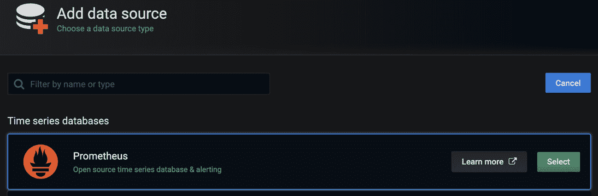

图 15.10：选择 Prometheus 作为 Grafana 仪表板的数据源

现在，在我们继续到下一个屏幕之前，在这里，我们需要获取 Grafana 将用于从集群内部访问 Prometheus 数据库的 URL。我们将在下一步中执行此操作。

1.  打开一个新的终端窗口并运行以下命令：

```
kubectl get svc --all-namespaces
```

您应该会看到类似以下的响应：

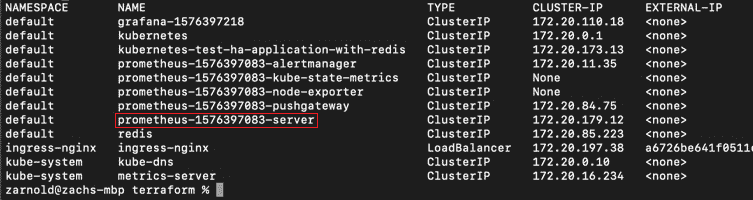

图 15.11：获取所有服务的列表

复制以`prometheus`开头并以`server`结尾的服务的名称。

1.  在*步骤 12*之后，您将看到以下屏幕截图所示的屏幕：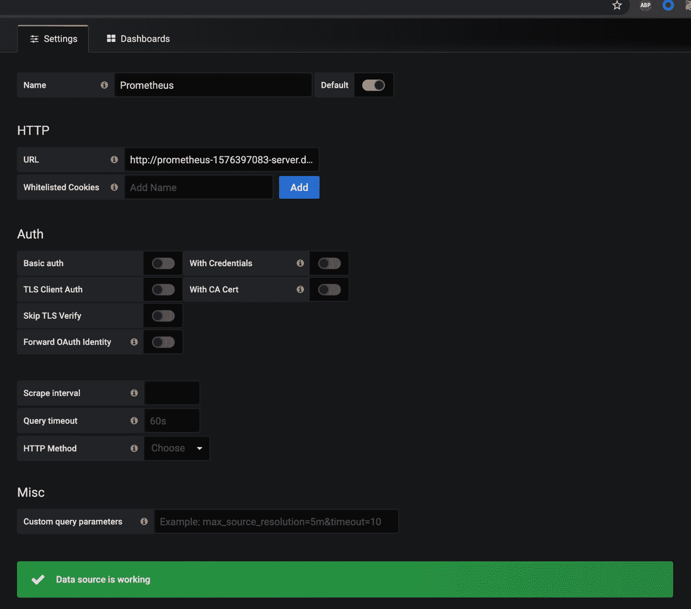

图 15.12：在 Grafana 中输入我们 Prometheus 服务的地址

在`HTTP`部分的`URL`字段中，输入以下值：

```
http://<YOUR_PROMETHEUS_SERVICE_NAME>.default
```

请注意，您应该看到`数据源正在工作`，如前面的屏幕截图所示。然后，点击底部的`保存并测试`按钮。我们在 URL 中添加`.default`的原因是我们将此 Helm 图表部署到了`default` Kubernetes 命名空间。如果您将其部署到另一个命名空间，您应该用您的命名空间的名称替换`default`。

1.  现在，让我们设置仪表板。回到 Grafana 主页（`http://localhost:3000`），点击左侧边栏上的`+`符号，然后点击`Import`，如下所示：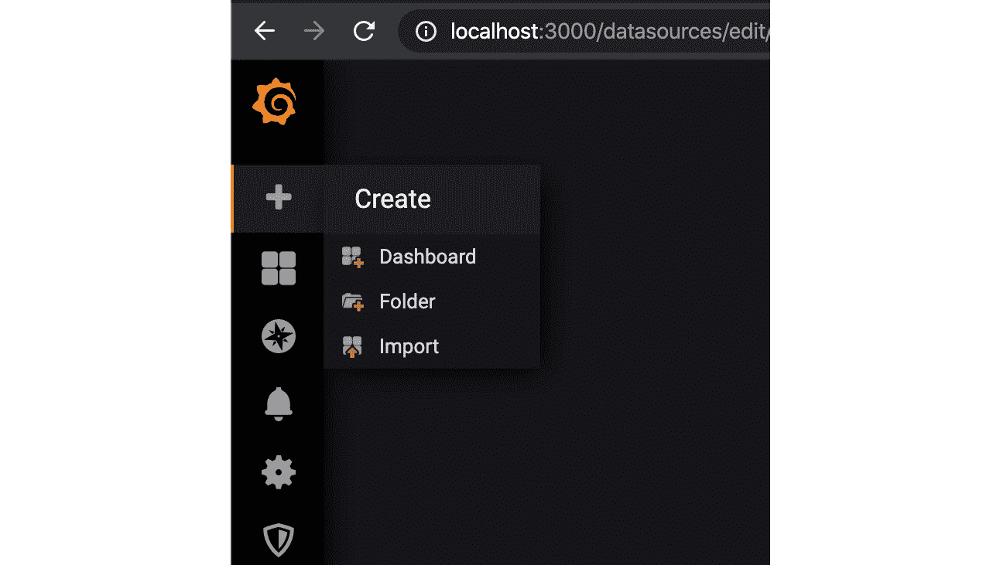

图 15.13：导航到导入仪表板选项

1.  在下一页，您应该看到`Grafana.com 仪表板`字段，如下所示：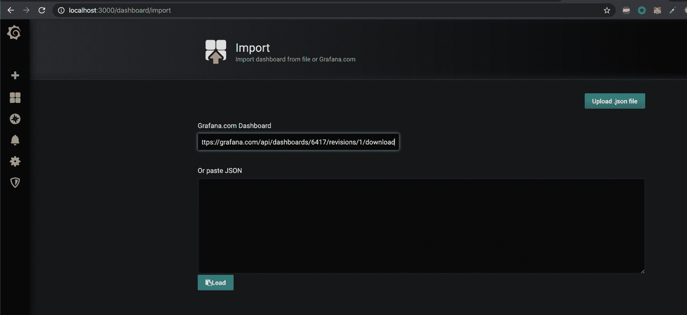

图 15.14：输入要从中导入仪表板的源

将以下链接粘贴到“Grafana.com 仪表板”字段中：

```
https://grafana.com/api/dashboards/6417/revisions/1/download
```

这是一个官方支持的 Kubernetes 仪表板。一旦你在文件外的任何地方点击，你应该自动进入下一个屏幕。

1.  上一步应该引导您到这个屏幕：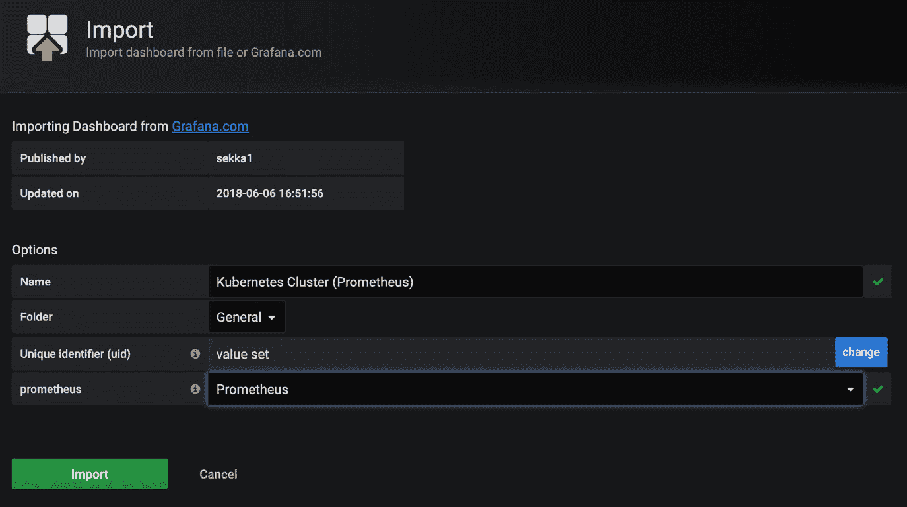

图 15.15：将 Prometheus 设置为导入仪表板的数据源

在你看到`prometheus`的地方，点击旁边的下拉列表，选择`Prometheus`，然后点击`Import`。

1.  结果应该如下所示：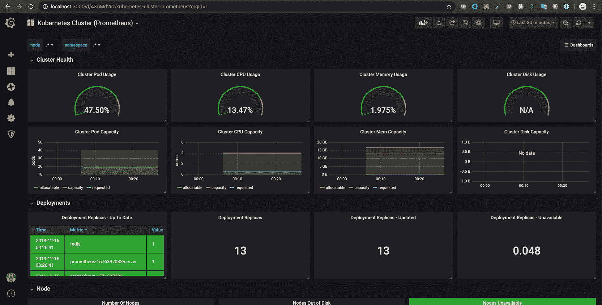

图 15.16：用于监视我们集群的 Grafana 仪表板

正如您所看到的，我们在 Kubernetes 中有一个简洁的仪表板来监视工作负载。在这个练习中，我们部署了我们的 Metric Server 来收集和公开 Kubernetes 对象指标，然后我们部署了 Prometheus 来存储这些指标，并使用 Grafana 来帮助我们可视化 Prometheus 中收集的指标，这将告诉我们在任何时候我们集群中发生了什么。现在，是时候利用这些信息来扩展事物了。

# Kubernetes 中的自动扩展

Kubernetes 允许您自动扩展工作负载以适应应用程序的不断变化的需求。从 Kubernetes 度量服务器收集的信息是用于驱动扩展决策的数据。在本书中，我们将涵盖两种类型的扩展操作——一种影响部署中运行的 pod 数量，另一种影响集群中运行的节点数量。这两种都是水平扩展的例子。让我们简要地直观了解一下 pod 的水平扩展和节点的水平扩展将涉及什么：

+   Pods：假设您在创建 Kubernetes 中的部署时填写了`podTemplate`的`resources:`部分，那么该 pod 中的每个容器都将具有由相应的`cpu`和`memory`字段指定的`requests`和`limits`字段。当处理工作负载所需的资源超出您分配的资源时，通过向部署添加 pod 的额外副本，您可以水平扩展以增加部署的容量。通过让软件进程根据负载为您决定部署中 Pod 的副本数量，您正在*自动扩展*部署，以使副本数量与您定义的用于表示应用程序负载的指标保持一致。应用程序负载的一个指标可能是当前正在使用的分配 CPU 的百分比。

+   节点：每个节点都有一定数量的 CPU（通常以核心数表示）和内存（通常以升表示），可供 Pod 消耗。当所有工作节点的总容量被所有运行的 pod 耗尽时（这意味着所有 Pod 的 CPU 和内存请求/限制都等于或大于整个集群的请求/限制），那么我们已经饱和了集群的资源。为了允许在集群上运行更多的 Pod，或者允许集群中发生更多的自动扩展，我们需要以额外的工作节点的形式增加容量。当我们允许软件进程为我们做出这个决定时，我们被认为是*自动扩展*我们集群的总容量。在 Kubernetes 中，这由 ClusterAutoscaler 处理。

注意

当你增加应用程序的 Pod 副本数量时，这被称为水平扩展，由**HorizontalPodAutoscaler**处理。相反，如果你增加副本的资源限制，那就被称为垂直扩展。Kubernetes 还提供**VerticalPodAutoscaler**，但由于尚未普遍可用且在生产中使用时不安全，我们在此略过。

同时使用 HPA 和 ClusterAutoscalers 可以是公司确保始终有正确数量的应用程序资源部署以满足其负载，并且同时不会支付过多费用的有效方式。让我们在以下小节中分别研究它们。

## HorizontalPodAutoscaler

HPA 负责确保部署中应用程序的副本数量与度量标准测得的当前需求相匹配。这很有用，因为我们可以使用实时度量数据，这些数据已经被 Kubernetes 收集，以始终确保我们的应用程序满足我们在阈值中设定的需求。这对一些不习惯使用数据运行应用程序的应用程序所有者可能是一个新概念，但一旦开始利用可以调整部署大小的工具，你就永远不想回头了。

Kubernetes 在`autoscaling/v1`和`autoscaling/v2beta2`组中有一个 API 资源，用于提供可以针对另一个 Kubernetes 资源运行的自动缩放触发器的定义，这往往是一个 Kubernetes 部署对象。在`autoscaling/v1`的情况下，唯一支持的度量标准是当前的 CPU 消耗，在`autoscaling/v2beta2`的情况下，支持任何自定义度量标准。

HPA 查询 Kubernetes Metric Server 来查看特定部署的度量标准。然后，自动缩放资源将确定当前观察到的度量标准是否超出了缩放目标的阈值。如果是，它将根据负载将部署所需的 Pod 数量增加或减少。

举个例子，考虑一个由电子商务公司托管的购物车微服务。在输入优惠券代码的过程中，购物车服务经历了重负载，因为它必须遍历购物车中的所有商品，并在验证优惠券代码之前搜索其中的活动优惠券。在一个随机的周二早晨，有许多在线购物者使用该服务，并且他们都想使用优惠券。通常情况下，服务会不堪重负，请求会开始失败。然而，如果您能够使用 HPA，Kubernetes 将利用集群的空闲计算能力，以确保有足够的该购物车服务的 Pod 来处理负载。

请注意，简单地对部署进行自动缩放并不是解决应用程序性能问题的“一刀切”解决方案。现代应用程序中有许多可能出现减速的地方，因此应该仔细考虑您的应用程序架构，以查看您可以识别其他瓶颈的地方，而这些瓶颈并不是简单的自动缩放可以解决的。一个这样的例子是数据库上的慢查询性能。然而，在本章中，我们将专注于可以通过 Kubernetes 中的自动缩放来解决的应用程序问题。

让我们来看一下 HPA 的结构，以便更好地理解一些内容：

with_autoscaler.yaml

```
115 apiVersion: autoscaling/v1
116 kind: HorizontalPodAutoscaler
117 metadata:
118   name: shopping-cart-hpa
119 spec:
120   scaleTargetRef:
121     apiVersion: apps/v1
122     kind: Deployment
123     name: shopping-cart-deployment
124   minReplicas: 20
125   maxReplicas: 50
126   targetCPUUtilizationPercentage: 50
```

您可以在此链接找到完整的代码：[`packt.live/3bE9v28`](https://packt.live/3bE9v28)。

在这个规范中，观察以下字段：

+   `scaleTargetRef`：这是被缩放的对象的引用。在这种情况下，它是指向购物车微服务的部署的指针。

+   `minReplicas`：部署中的最小副本数，不考虑缩放触发器。

+   `maxReplicas`：部署中的最大副本数，不考虑缩放触发器。

+   `targetCPUUtilizationPercentage`：部署中所有 Pod 的平均 CPU 利用率的目标百分比。Kubernetes 将不断重新评估此指标，并增加和减少 Pod 的数量，以使实际的平均 CPU 利用率与此目标相匹配。

为了模拟对我们的应用程序的压力，我们将使用**wrk**，因为它很容易配置，并且已经为我们制作了一个 Docker 容器。wrk 是一个 HTTP 负载测试工具。它使用简单，并且只有少量选项；但是，它将能够通过使用多个同时的 HTTP 连接反复发出请求来生成大量负载，针对指定的端点。

注意

您可以在此链接找到有关 wrk 的更多信息：[`github.com/wg/wrk`](https://github.com/wg/wrk)。

在接下来的练习中，我们将使用我们一直在运行的应用程序的修改版本来帮助驱动扩展行为。在我们的应用程序的这个修订版中，我们已经修改了它，使得应用程序以天真的方式执行斐波那契数列计算，直到第 10,000,000 个条目，以便它会稍微更加计算密集，并超过我们的 CPU 自动缩放触发器。如果您检查源代码，您会发现我们已经添加了这个函数：

main.go

```
74 func FibonacciLoop(n int) int { 
75   f := make([]int, n+1, n+2) 
76   if n < 2 { 
77         f = f[0:2] 
78   } 
79   f[0] = 0 
80   f[1] = 1 
81   for i := 2; i <= n; i++ { 
82         f[i] = f[i-1] + f[i-2] 
83   } 
84   return f[n] 
85 } 
```

您可以在此链接找到完整的代码：[`packt.live/3h5wCEd`](https://packt.live/3h5wCEd)。

除此之外，我们将使用 Ingress，我们在*第十二章*中学到的，并且在上一章中构建的相同的 SQL 数据库。

现在，说了这么多，让我们深入研究以下练习中这些自动缩放器的实现。

## 练习 15.02：在 Kubernetes 中扩展工作负载

在这个练习中，我们将整合之前的一些不同部分。由于我们的应用程序目前有几个移动部分，我们需要列出一些步骤，以便您了解我们的方向：

1.  我们需要像*练习 12.02*中一样设置我们的 EKS 集群，使用 Terraform 创建一个集群。

1.  我们需要为 Kubernetes Metrics 服务器设置所需的组件。

注意

考虑到这两点，您需要成功完成上一个练习才能执行这个练习。

1.  我们需要使用修改后的计数器应用程序进行安装，以便它成为一个计算密集型的练习，以获取序列中的下一个数字。

1.  我们需要安装 HPA 并设置 CPU 百分比的度量目标。

1.  我们需要安装 ClusterAutoscaler 并赋予它在 AWS 中更改**Autoscaling Group**（**ASG**）大小的权限。

1.  我们需要通过生成足够的负载来对我们的应用进行压力测试，以便能够扩展应用并导致 HPA 触发集群扩展操作。

我们将使用 Kubernetes Ingress 资源来使用集群外部的流量进行负载测试，以便我们可以创建一个更真实的模拟。

完成后，您将成为 Kubernetes 的船长，所以让我们开始吧：

1.  现在，让我们通过依次运行以下命令来部署`ingress-nginx`设置：

```
kubectl apply -f https://raw.githubusercontent.com/kubernetes/ingress-nginx/nginx-0.30.0/deploy/static/mandatory.yaml 
kubectl apply -f https://raw.githubusercontent.com/kubernetes/ingress-nginx/nginx-0.30.0/deploy/static/provider/aws/service-l4.yaml 
kubectl apply -f https://raw.githubusercontent.com/kubernetes/ingress-nginx/nginx-0.30.0/deploy/static/provider/aws/patch-configmap-l4.yaml 
```

您应该看到以下响应：

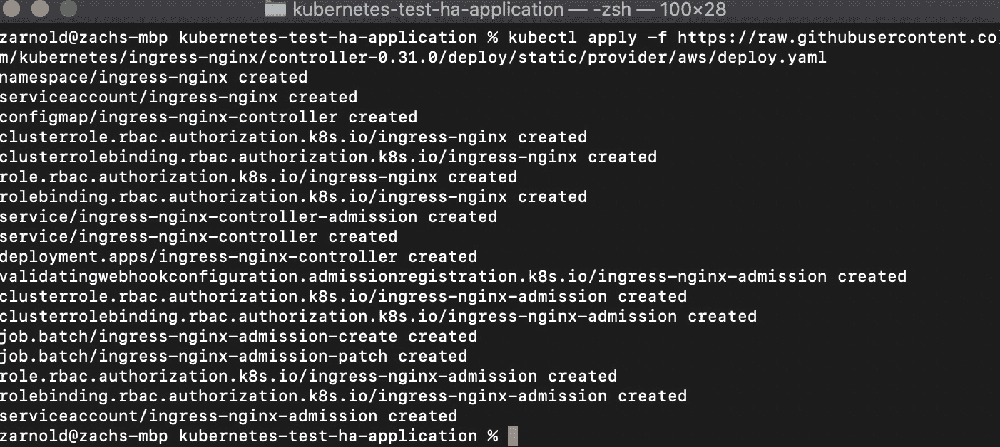

图 15.17：部署 nginx Ingress 控制器

1.  现在，让我们获取具有 HA MySQL、Ingress 和 HPA 的应用程序清单：

```
curl -O https://raw.githubusercontent.com/PacktWorkshops/Kubernetes-Workshop/master/Chapter15/Exercise15.02/with_autoscaler.yaml
```

在应用之前，让我们看一下我们的自动缩放触发器：

with_autoscaler.yaml

```
115 apiVersion: autoscaling/v1 
116 kind: HorizontalPodAutoscaler 
117 metadata: 
118   name: counter-hpa 
119 spec: 
120   scaleTargetRef: 
121     apiVersion: apps/v1 
122     kind: Deployment 
123     name: kubernetes-test-ha-application-with-autoscaler-          deployment 
124   minReplicas: 2 
125   maxReplicas: 1000 
126   targetCPUUtilizationPercentage: 10 
```

完整的代码可以在此链接找到：[`packt.live/3bE9v28`](https://packt.live/3bE9v28)。

在这里，我们从此部署的两个副本开始，并允许自己增长到 1000 个副本，同时尝试保持 CPU 利用率恒定在 10％。回想一下，根据我们的 Terraform 模板，我们使用 m4.large EC2 实例来运行这些 Pod。

1.  通过运行以下命令来部署此应用程序：

```
kubectl apply -f with_autoscaler.yaml
```

您应该看到以下响应：

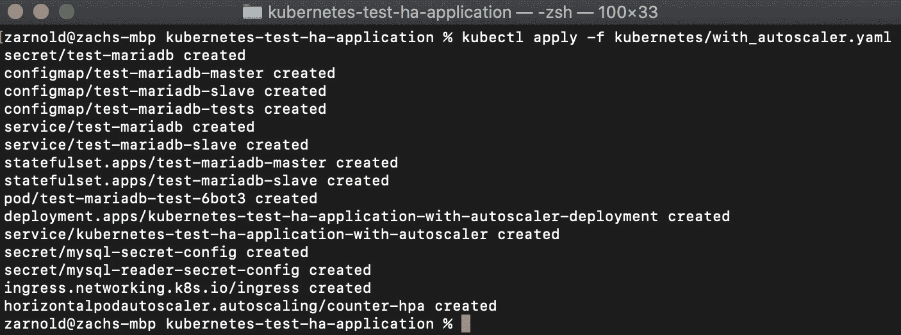

图 15.18：部署我们的应用程序

1.  有了这个，我们准备进行负载测试。在开始之前，让我们检查一下部署中的 Pod 数量：

```
kubectl describe hpa counter-hpa
```

这可能需要长达 5 分钟才能显示百分比，之后您应该看到类似于这样的东西：

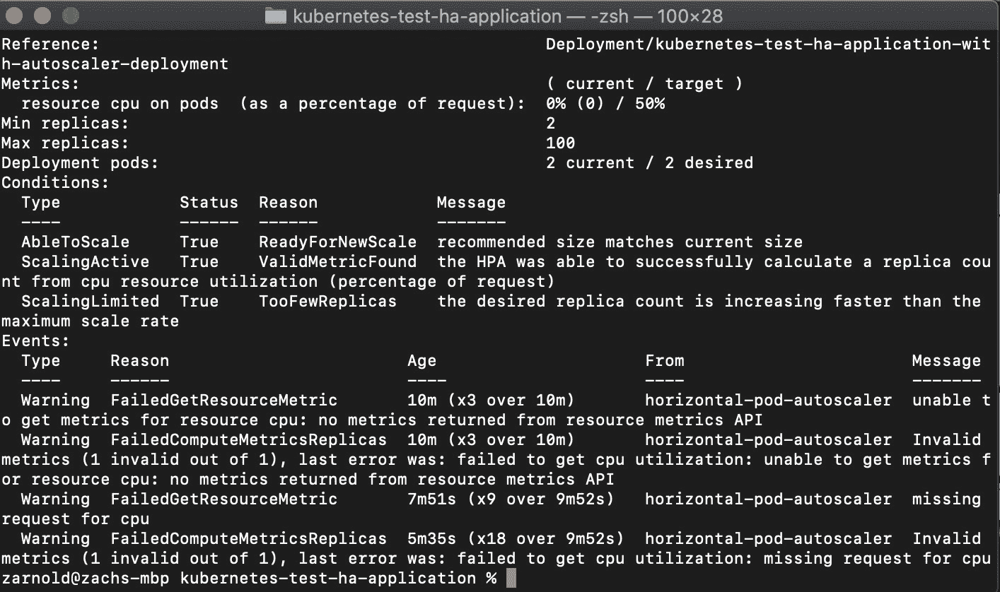

图 15.19：获取有关我们的 HPA 的详细信息

`Deployment pods:`字段显示`2 current / 2 desired`，这意味着我们的 HPA 已将期望的副本计数从 3 更改为 2，因为我们的 CPU 利用率为 0％，低于 10％的目标。

现在，我们需要进行一些负载。我们将从我们的计算机到集群运行一个负载测试，使用 wrk 作为 Docker 容器。但首先，我们需要获取 Ingress 端点以访问我们的集群。

1.  首先运行以下命令以获取您的 Ingress 端点：

```
kubectl get svc ingress-nginx -n ingress-nginx -o jsonpath='{.status.loadBalancer.ingress[0].hostname}'
```

您应该看到以下响应：

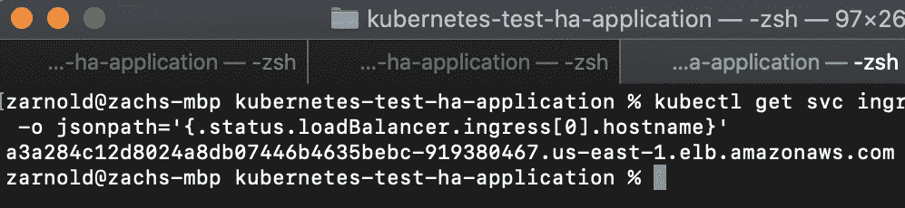

图 15.20：检查我们的 Ingress 端点

1.  在另一个终端会话中，使用以下命令运行`wrk`负载测试：

```
docker run --rm skandyla/wrk -t10 -c1000 -d600 -H ‚Host: counter.com'  http://YOUR_HOSTNAME/get-number
```

让我们快速了解这些参数：

`-t10`：此测试要使用的线程数，在本例中为 10。

`-c1000`：要保持打开的连接总数。在本例中，每个线程处理 1000 个连接。

`-d600`：运行此测试的秒数（在本例中为 600 秒或 10 分钟）。

您应该获得以下输出：

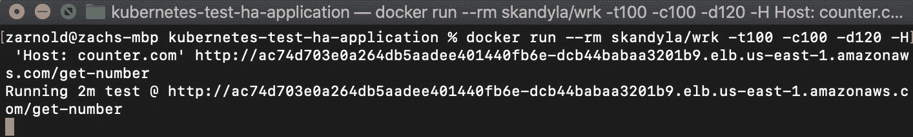

图 15.21：对我们的 Ingress 端点运行负载测试

1.  在另一个会话中，让我们留意我们应用程序的 Pod：

```
kubectl get pods --watch
```

您应该能够看到类似于这样的响应：

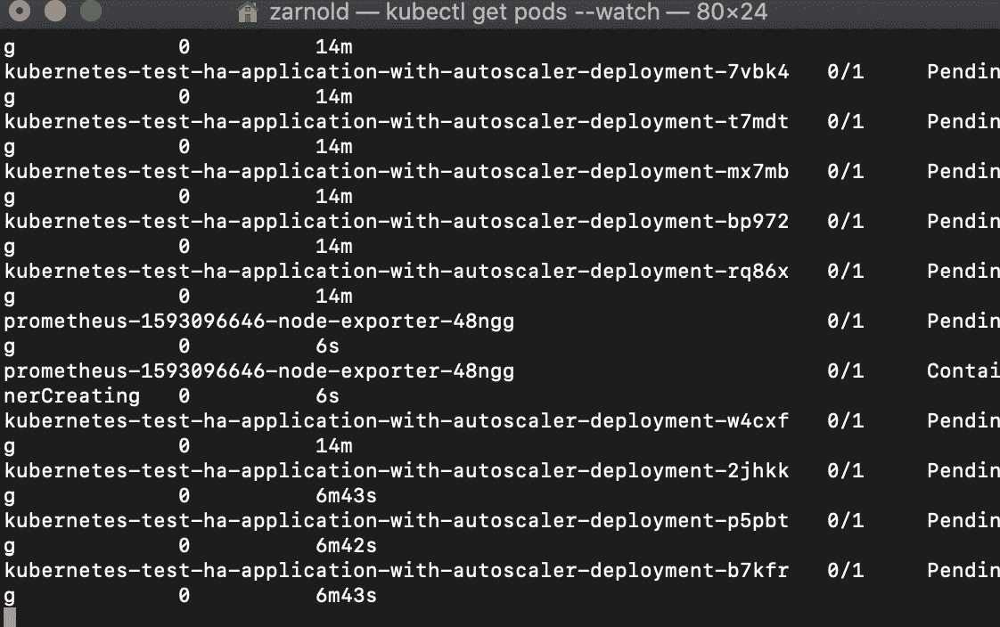

图 15.22：观察支持我们应用程序的 Pod

在这个终端窗口中，您应该看到 Pod 数量的增加。请注意，我们也可以在 Grafana 仪表板中检查相同的情况。

在这里，它增加了 1；但很快，这些 Pod 将超出所有可用空间。

1.  在另一个终端会话中，您可以再次设置端口转发到 Grafana 以观察仪表板：

```
kubectl --namespace default port-forward $POD_NAME 3000
```

您应该看到以下响应：

```
Forwarding from 127.0.0.1:3000 -> 3000
Forwarding from [::1]:3000 -> 3000
```

1.  现在，在浏览器上访问`localhost:3000`上的仪表板：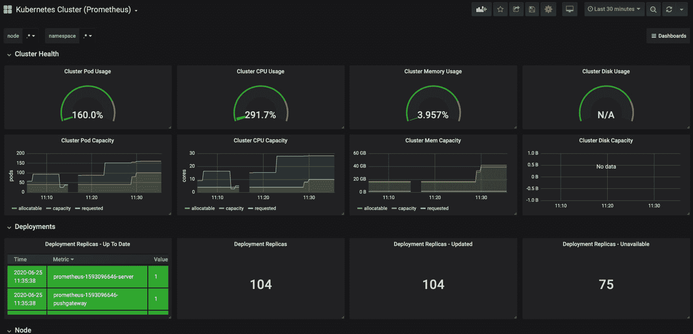

图 15.23：在 Grafana 仪表板中观察我们的集群

您还应该能够在这里看到 Pod 数量的增加。因此，我们已成功部署了一个自动扩展 Pod 数量的 HPA，随着应用程序负载的增加而增加 Pod 数量。

## ClusterAutoscaler

如果 HPA 确保部署中始终有正确数量的 Pod 在运行，那么当我们的集群对所有这些 Pod 的容量用完时会发生什么？我们需要更多的 Pod，但我们也不希望在不需要时为这些额外的集群容量付费。这就是 ClusterAutoscaler 的作用。

ClusterAutoscaler 将在您的集群内工作，以确保在 ASG（在 AWS 的情况下）中运行的节点数量始终具有足够的容量来运行集群当前部署的应用程序组件。因此，如果部署中的 10 个 Pod 可以放在 2 个节点上，那么当您需要第 11 个 Pod 时，ClusterAutoscaler 将要求 AWS 向您的 Kubernetes 集群添加第 3 个节点以安排该 Pod。当不再需要该 Pod 时，该节点也会消失。让我们看一个简短的架构图，以了解 ClusterAutoscaler 的工作原理：

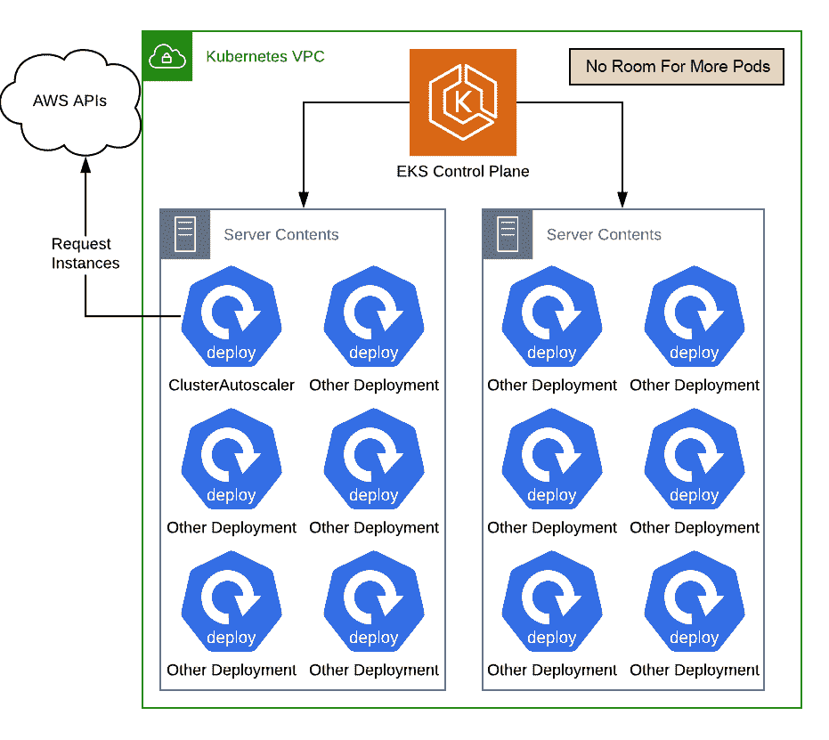

图 15.24：节点满负荷的集群

请注意，在此示例中，我们运行了两个工作节点的 EKS 集群，并且所有可用的集群资源都已被占用。因此，ClusterAutoscaler 的作用如下。

当控制平面收到一个无法容纳的 Pod 的请求时，它将保持在`Pending`状态。当 ClusterAutoscaler 观察到这一点时，它将与 AWS EC2 API 通信，并请求 ASG 进行扩展，其中我们的工作节点部署在其中。这需要 ClusterAutoscaler 能够与云提供商的 API 通信，以便更改工作节点计数。在 AWS 的情况下，这还意味着我们要么必须为 ClusterAutoscaler 生成 IAM 凭据，要么允许它使用机器的 IAM 角色来访问 AWS API。

成功的扩展操作应该如下所示：

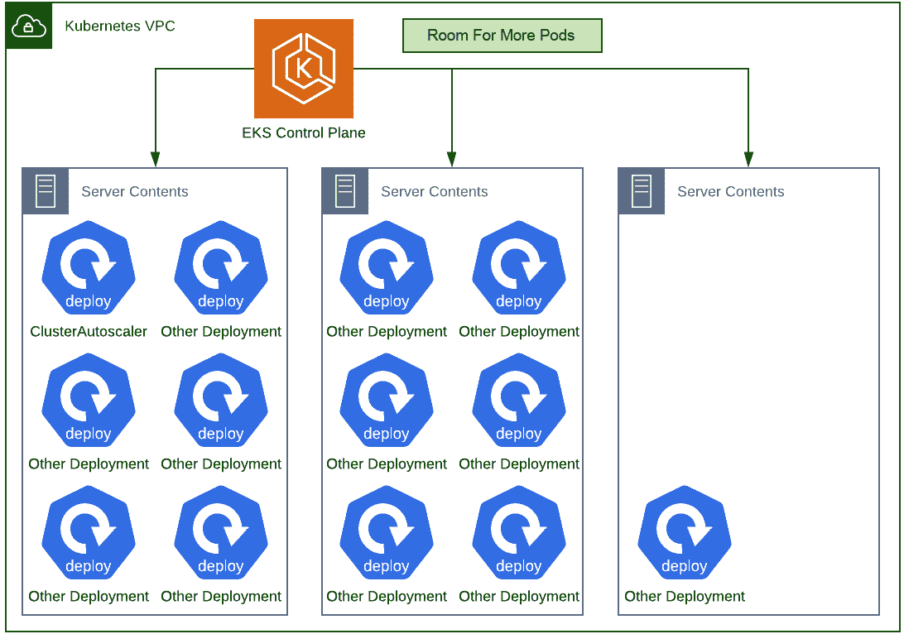

图 15.25：额外的节点用于运行额外的 Pod

我们将在下一个练习中实现 ClusterAutoscaler，然后在随后的活动中进行负载测试。

## 练习 15.03：配置 ClusterAutoscaler

所以，现在我们已经看到我们的 Kubernetes 部署扩展，现在是时候看它扩展到需要向集群添加更多节点容量的地步了。我们将继续上一课的内容，并运行完全相同的应用程序和负载测试，但让它运行更长一点：

1.  要创建 ClusterAutoscaler，首先，我们需要创建一个 AWS IAM 账户，并赋予它管理我们 ASG 的权限。创建一个名为`permissions.json`的文件，内容如下：

```
{
  "Version": "2012-10-17",
  "Statement": [
    {
      "Effect": "Allow",
      "Action": [
        "autoscaling:DescribeAutoScalingGroups",
        "autoscaling:DescribeAutoScalingInstances",
        "autoscaling:DescribeLaunchConfigurations",
        "autoscaling:SetDesiredCapacity",
        "autoscaling:TerminateInstanceInAutoScalingGroup",
        "autoscaling:DescribeLaunchConfigurations",
        "ec2:DescribeLaunchTemplateVersions",
        "autoscaling:DescribeTags"
      ],
      "Resource": "*"
    }
  ]
}
```

1.  现在，让我们运行以下命令来创建一个 AWS IAM 策略：

```
aws iam create-policy --policy-name k8s-autoscaling-policy --policy-document file://permissions.json
```

您应该看到以下响应：

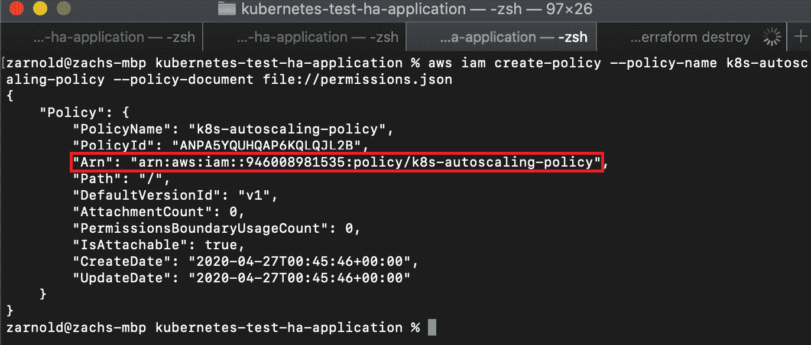

图 15.26：创建一个 AWS IAM 策略

记下您获得的输出中`Arn:`字段的值。

1.  现在，我们需要创建一个 IAM 用户，然后将策略附加到它。首先，让我们创建用户：

```
aws iam create-user --user-name k8s-autoscaler
```

您应该看到以下响应：

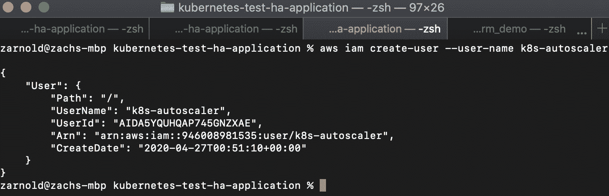

图 15.27：创建一个 IAM 用户来使用我们的策略

1.  现在，让我们将 IAM 策略附加到用户：

```
aws iam attach-user-policy --policy-arn <ARN_VALUE> --user-name k8s-autoscaler
```

使用您在*步骤 2*中获得的 ARN 值。

1.  现在，我们需要这个 IAM 用户的秘密访问密钥。运行以下命令：

```
aws iam create-access-key --user-name k8s-autoscaler
```

您应该得到以下响应：

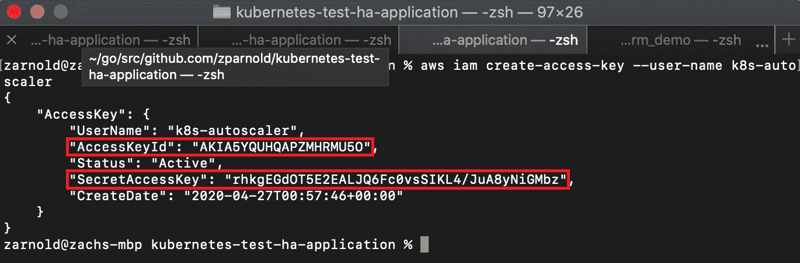

图 15.28：获取创建的 IAM 用户的秘密访问密钥

在此命令的输出中，请注意`AccessKeyId`和`SecretAccessKey`。

1.  现在，获取我们提供的 ClusterAutoscaler 的清单文件：

```
curl -O https://raw.githubusercontent.com/PacktWorkshops/Kubernetes-Workshop/master/Chapter15/Exercise15.03/cluster_autoscaler.yaml
```

1.  我们需要创建一个 Kubernetes Secret 来将这些凭据暴露给 ClusterAutoscaler。打开`cluster_autoscaler.yaml`文件。在第一个条目中，您应该看到以下内容：

cluster_autoscaler.yaml

```
1  apiVersion: v1
2  kind: Secret
3  metadata:
4    name: aws-secret
5    namespace: kube-system
6  type: Opaque
7  data:
8    aws_access_key_id: YOUR_AWS_ACCESS_KEY_ID
9    aws_secret_access_key: YOUR_AWS_SECRET_ACCESS_KEY
```

您可以在此链接找到完整的代码：[`packt.live/2DCDfzZ`](https://packt.live/2DCDfzZ)。

您需要使用 AWS 在*步骤 5*中返回的值的 Base64 编码版本替换`YOUR_AWS_ACCESS_KEY_ID`和`YOUR_AWS_SECRET_ACCESS_KEY`。

1.  要以 Base64 格式编码，运行以下命令：

```
echo -n <YOUR_VALUE> | base64
```

运行两次，使用`AccessKeyID`和`SecretAccessKey`替换`<YOUR_VALUE>`，以获取相应的 Base64 编码版本，然后将其输入到 secret 字段中。完成后应如下所示：

```
aws_access_key_id: QUtJQUlPU0ZPRE5ON0VYQU1QTEUK
aws_secret_access_key: d0phbHJYVXRuRkVNSS9LN01ERU5HL2JQeFJmaUNZRVhBTVBMRUtFWQo=
```

1.  现在，在相同的`cluster_autoscaler.yaml`文件中，转到第 188 行。您需要将`YOUR_AWS_REGION`的值替换为您部署 EKS 集群的区域的值，例如`us-east-1`：

集群自动缩放器.yaml

```
176   env: 
177   - name: AWS_ACCESS_KEY_ID 
178     valueFrom: 
179       secretKeyRef: 
180         name: aws-secret 
181         key: aws_access_key_id 
182   - name: AWS_SECRET_ACCESS_KEY 
183     valueFrom: 
184       secretKeyRef: 
185         name: aws-secret 
186         key: aws_secret_access_key 
187   - name: AWS_REGION 
188     value: <YOUR_AWS_REGION>
```

您可以在此链接找到整个代码：[`packt.live/2F8erkb`](https://packt.live/2F8erkb)。

1.  现在，通过运行以下命令应用此文件：

```
kubectl apply -f cluster_autoscaler.yaml
```

您应该看到类似以下的响应：

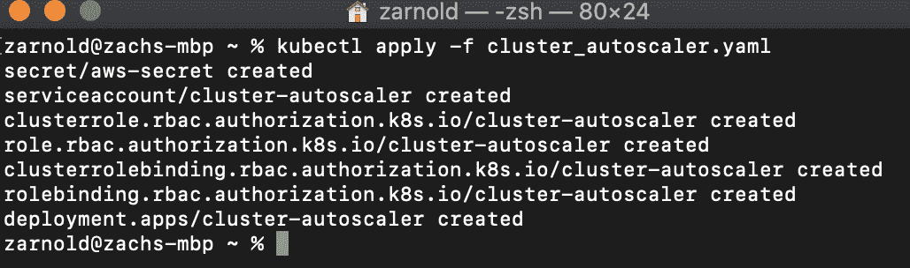

图 15.29：部署我们的 ClusterAutoscaler

1.  请注意，我们现在需要修改 AWS 中的 ASG 以允许扩展；否则，ClusterAutoscaler 将不会尝试添加任何节点。为此，我们提供了一个修改过的`main.tf`文件，只更改了一行：`max_size = 5`（*第 299 行*）。这将允许集群最多添加五个 EC2 节点到自身。

导航到您下载了先前 Terraform 文件的相同位置，然后运行以下命令：

```
curl -O https://raw.githubusercontent.com/PacktWorkshops/Kubernetes-Workshop/master/Chapter15/Exercise15.03/main.tf
```

您应该看到以下响应：

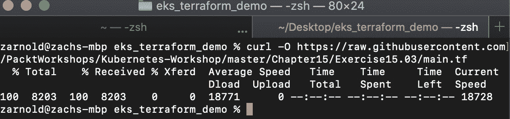

图 15.30：下载修改后的 Terraform 文件

1.  现在，将修改应用到 Terraform 文件：

```
terraform apply
```

验证更改仅应用于 ASG 的最大容量，然后在提示时输入`yes`：

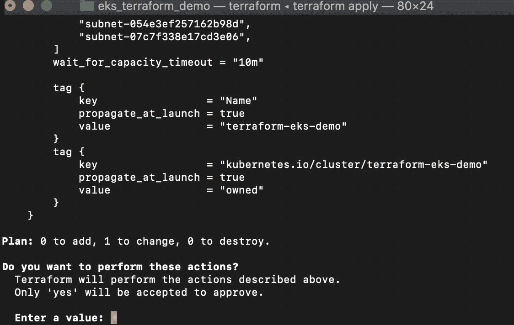

图 15.31：应用我们的 Terraform 修改

注意

我们将在以下活动中测试此 ClusterAutoscaler。因此，现在不要删除您的集群和 API 资源。

在这一点上，我们已经部署了我们的 ClusterAutoscaler，并配置它以访问 AWS API。因此，我们应该能够根据需要扩展节点的数量。

让我们继续进行下一个活动，在那里我们将对我们的集群进行负载测试。您应该尽快进行此活动，以便降低成本。

## 活动 15.01：使用 ClusterAutoscaler 对我们的集群进行自动扩展

在这个活动中，我们将运行另一个负载测试，这一次，我们将运行更长时间，并观察基础架构的变化，因为集群扩展以满足需求。这个活动应该重复之前的步骤（如*练习 15.02，在 Kubernetes 中扩展工作负载*中所示）来运行负载测试，但这一次，应该安装 ClusterAutoscaler，这样当您的集群对 Pod 的容量不足时，它将扩展节点的数量以适应新的 Pod。这样做的目的是看到负载测试增加节点数量。

按照以下指南完成您的活动：

1.  我们将使用 Grafana 仪表板来观察集群指标，特别关注运行中的 Pod 数量和节点数量。

1.  我们的 HPA 应该设置好，这样当我们的应用程序接收到更多负载时，我们可以扩展 Pod 的数量以满足需求。

1.  确保您的 ClusterAutoscaler 已成功设置。

注意

为了满足前面提到的三个要求，您需要成功完成本章中的所有练习。我们将使用在这些练习中创建的资源。

1.  运行负载测试，如*练习 15.02*的*步骤 2*所示。如果愿意，您可以选择更长或更强烈的测试。

在完成此活动时，您应该能够通过描述 AWS ASG 来观察节点数量的增加，如下所示：

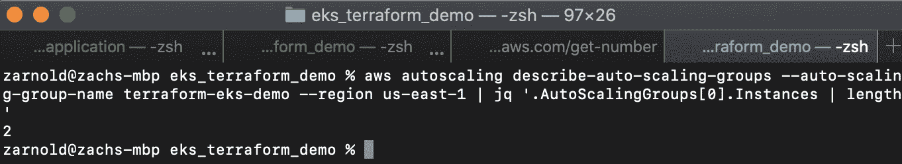

图 15.32：通过描述 AWS 扩展组观察节点数量的增加

您还应该能够在 Grafana 仪表板中观察到相同的情况：

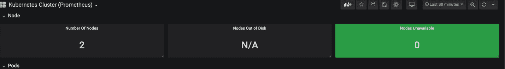

图 15.33：在 Grafana 仪表板中观察到节点数量的增加

注意

此活动的解决方案可在以下地址找到：[`packt.live/304PEoD`](https://packt.live/304PEoD)。确保通过运行命令`terraform destroy`删除 EKS 集群。

## 删除您的集群资源

这是我们将使用 EKS 集群的最后一章。因此，我们建议您使用以下命令删除您的集群资源：

```
terraform destroy
```

这应该停止使用 Terraform 创建的 EKS 集群的计费。

# 总结

让我们稍微回顾一下我们从*第十一章*《构建自己的 HA 集群》开始讨论如何以高可用的方式运行 Kubernetes 所走过的路程。我们讨论了如何设置一个安全的生产集群，并使用 Terraform 等基础设施即代码工具创建，以及保护其运行的工作负载。我们还研究了必要的修改，以便良好地扩展我们的应用程序——无论是有状态的还是无状态的版本。

然后，在本章中，我们看了如何使用数据来扩展我们的应用程序运行时，特别是在引入 Prometheus、Grafana 和 Kubernetes Metrics 服务器时。然后，我们利用这些信息来利用 HPA 和 ClusterAutoscaler，以便我们可以放心地确保我们的集群始终具有适当的大小，并且可以自动响应需求的激增，而无需支付过度配置的硬件。

在接下来的一系列章节中，我们将探索 Kubernetes 中的一些高级概念，从下一章开始介绍准入控制器。
