# 第十六章：16. Kubernetes 准入控制器

概述

在本章中，我们将学习 Kubernetes 准入控制器，并使用它们来修改或验证传入的 API 请求。本章描述了 Kubernetes 准入控制器的实用性，以及它们如何扩展您的 Kubernetes 集群的功能。您将了解几个内置的准入控制器，以及变异和验证控制器之间的区别。在本章结束时，您将能够创建自己的自定义准入控制器，并将这些知识应用于构建适合您所需场景的控制器。

# 介绍

在*第四章*中，*如何与 Kubernetes（API 服务器）通信*，我们学习了 Kubernetes 如何将其**应用程序编程接口**（**API**）暴露出来，以便与 Kubernetes 平台进行交互。您还学习了如何使用 kubectl 来创建和管理各种 Kubernetes 对象。 kubectl 工具只是 Kubernetes API 服务器的客户端。 Kubernetes 主节点托管 API 服务器，通过它任何人都可以与集群通信。 API 服务器不仅为外部参与者提供了与 Kubernetes 通信的方式，还为所有内部组件（例如运行在工作节点上的 kubelet）提供了通信的方式。

API 服务器是我们集群的中央访问点。如果我们想确保我们组织的默认最佳实践和策略得到执行，那么检查和应用它们的最佳地方就是在 API 服务器上。 Kubernetes 通过**准入控制器**提供了这种能力。

让我们花点时间来了解为什么准入控制器很有用。例如，假设我们有一个标准的标签集策略，用于在所有对象中协助报告每个业务单元的对象组。这对于获取特定数据可能很重要，例如集成团队正在执行多少个 Pod。如果我们根据它们的标签来管理和监控对象，那么没有所需标签的对象可能会妨碍我们的管理和监控实践。因此，我们希望实施一个策略，如果对象规范中未定义这些标签，则将阻止创建对象。这个要求可以很容易地通过准入控制器来实现。

注意

Open Policy Agent 是一个很好的例子，展示了如何使用 webhooks 来构建一个可扩展的平台，以在 Kubernetes 对象上应用标准。您可以在此链接找到更多详细信息：[`www.openpolicyagent.org/docs/latest/kubernetes-admission-control`](https://www.openpolicyagent.org/docs/latest/kubernetes-admission-control)。

准入控制器是一组组件，拦截所有对 Kubernetes API 服务器的调用，并提供一种确保任何请求都符合所需标准的方法。重要的是要注意，这些控制器在 API 调用经过身份验证和授权后被调用，而在对象被操作和存储在 etcd 之前被调用。这提供了一个完美的机会来实施控制和治理，应用标准，并接受或拒绝 API 请求，以保持集群的期望状态。让我们来看看准入控制器在 Kubernetes 集群中是如何工作的。

# 准入控制器的工作原理

Kubernetes 提供了一组超过 25 个准入控制器。一组准入控制器默认启用，集群管理员可以向 API 服务器传递标志来控制启用/禁用其他控制器（配置生产级集群中的 API 服务器超出了本书的范围）。这些可以大致分为两种类型：

+   **变异准入控制器**允许您在应用到 Kubernetes 平台之前修改请求。`LimitRanger`就是一个例子，如果 Pod 本身未定义，则将`defaultRequests`应用于 Pod。

+   **验证准入控制器**验证请求，不能更改请求对象。如果此控制器拒绝请求，Kubernetes 平台将不会执行该请求。一个例子是`NamespaceExists`控制器，如果请求中引用的命名空间不可用，则会拒绝该请求。

基本上，准入控制器分为两个阶段执行。在第一阶段，执行变异准入控制器，在第二阶段，执行验证准入控制器。

注意

根据情况，最好避免使用变异控制器，因为它们会改变请求的状态，调用者可能不知道这些变化。相反，您可以使用验证控制器来拒绝无效的请求，并让调用者修复请求。

准入控制器的高级概述如下图所示：

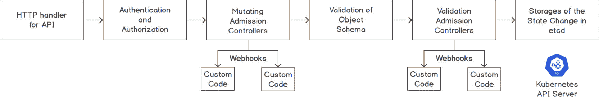

图 16.1：创建对象的 API 请求的阶段

当 Kubernetes API 服务器接收到 API 调用（可以通过 kubectl 或在其他节点上运行的 kubelet 进行调用），它会将调用通过以下阶段：

1.  执行调用的身份验证和授权，以确保调用者已经过身份验证并应用了 RBAC 策略。

1.  将有效负载通过所有现有的变异控制器。变异控制器是可以更改客户端发送的对象的控制器。

1.  检查对象是否符合定义的模式，以及所有字段是否有效。

1.  将有效负载通过所有现有的验证控制器。这些控制器验证最终对象。

1.  将对象存储在 etcd 数据存储中。

从*图 16.1*可以看出，一些准入控制器附有称为**webhooks**的东西。这可能并非所有准入控制器都是如此。我们将在本章的后面部分了解更多关于 webhooks 的内容。

请注意，一些控制器既提供变异功能，也提供验证功能。实际上，一些 Kubernetes 功能是作为准入控制器实现的。例如，当 Kubernetes 命名空间进入终止状态时，`NamespaceLifecycle`准入控制器会阻止在终止命名空间中创建新对象。

注意

出于简洁起见，本章只涵盖了一些准入控制器。请参考此链接，了解可用的控制器的完整列表：[`kubernetes.io/docs/reference/access-authn-authz/admission-controllers/#what-does-each-admission-controller-do`](https://kubernetes.io/docs/reference/access-authn-authz/admission-controllers/#what-does-each-admission-controller-do)。

让我们确认我们的 Minikube 设置已配置为运行准入控制器。运行以下命令以启动 Minikube，并启用所有必需的插件：

```
minikube stop
minikube start --extra-config=apiserver.enable-admission-plugins="LimitRanger,NamespaceExists,NamespaceLifecycle,ResourceQuota,ServiceAccount,DefaultStorageClass,MutatingAdmissionWebhook,ValidatingAdmissionWebhook"
```

您应该看到类似以下截图的响应：

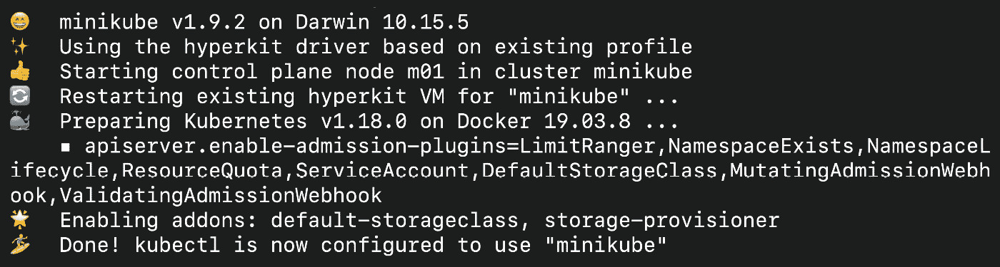

图 16.2：启动 Minikube 并启用所有必需的插件以运行准入控制器

现在我们已经概述了内置准入控制器，让我们看看如何使用我们自己的自定义逻辑创建一个准入控制器。

# 创建具有自定义逻辑的控制器

如前所述，Kubernetes 提供了一系列具有预定义功能的控制器。这些控制器已经内置到 Kubernetes 服务器二进制文件中。但是，如果您需要拥有自己的策略或标准来进行检查，并且没有一个准入控制器符合您的要求，会发生什么呢？

为了满足这样的需求，Kubernetes 提供了称为**准入 Webhook**的东西。准入 Webhook 有两种类型，我们将在以下部分进行学习。

## 变更准入 Webhook

**变更准入 Webhook**是一种变更准入控制器，它本身没有任何逻辑。相反，它允许您定义一个 URL，Kubernetes API 服务器将调用该 URL。这个 URL 就是我们 Webhook 的地址。从功能上讲，Webhook 是一个接受请求、处理请求，然后做出响应的 HTTPS 服务器。

如果定义了多个 URL，则它们将按链式处理，即第一个 Webhook 的输出将成为第二个 Webhook 的输入。

Kubernetes API 服务器将一个负载（AdmissionReview 对象）发送到 Webhook URL，请求正在处理中。您可以根据需要修改请求（例如，添加自定义注释）并发送回修改后的请求。Kubernetes API 服务器将在创建资源的下一个阶段使用修改后的对象。

执行流程将如下：

1.  Kubernetes API 接收到创建对象的请求。例如，假设您想创建一个如下所定义的 Pod：

```
apiVersion: v1
kind: Pod
metadata:
  name: configmap-env-pod
spec:
  containers:
    - name: configmap-container
      image: k8s.gcr.io/busybox
      command: [ "/bin/sh", "-c", "sleep 5" ]
```

1.  Kubernetes 调用一个名为`MutatingAdmissionWebHook`的 Webhook，并将对象定义传递给它。在这种情况下，它是 Pod 规范。

1.  Webhook（由您编写的自定义代码）接收对象并根据自定义规则进行修改。例如，它添加自定义注释`podModified="true"`。修改后，对象将如下所示：

```
apiVersion: v1
kind: Pod
metadata:
  name: configmap-env-pod
  annotations:
    podModified: "true"
spec:
  containers:
    - name: configmap-container
      image: k8s.gcr.io/busybox
      command: [ "/bin/sh", "-c", "sleep 5" ]
```

1.  Webhook 返回修改后的对象。

1.  Kubernetes 将修改后的对象视为原始请求并继续进行。

前面提到的流程可以可视化如下。请注意，该流程经过简化，以便您理解主要阶段：

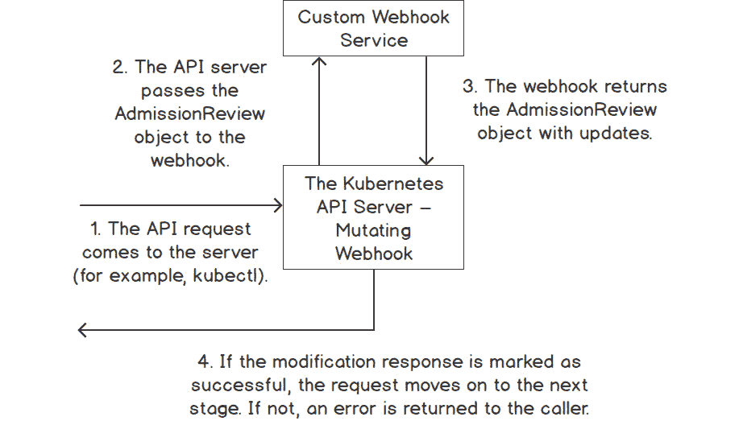

图 16.3：变异入场 Webhook 的流程

## 验证入场 Webhook

第二种类型的 Webhook 是验证入场 Webhook。这个钩子与变异入场 Webhook 类似，没有自己的逻辑。按照相同的模式，它允许我们定义一个 URL，最终提供决定接受或拒绝此调用的逻辑。

主要区别在于验证 Webhook 不能修改请求，只能允许或拒绝请求。如果此 Webhook 拒绝请求，Kubernetes 将向调用者发送错误；否则，它将继续执行请求。

# Webhook 的工作原理

Webhook 部署为 Kubernetes 集群中的 Pod，并且 Kubernetes API 服务器使用 AdmissionReview 对象通过 SSL 调用它们。该对象定义 AdmissionRequest 和 AdmissionResponse 对象。Webhook 从 AdmissionRequest 对象中读取请求有效负载，并在 AdmissionResponse 对象中提供成功标志和可选更改。

以下是 AdmissionReview 对象的顶级定义。请注意，AdmissionRequest 和 AdmissionResponse 都是 AdmissionReview 对象的一部分。以下是 Kubernetes 源代码中 AdmissionReview 对象定义的摘录：

```
// AdmissionReview describes an admission review request/response.
type AdmissionReview struct {
    metav1.TypeMeta `json:",inline"`
    // Request describes the attributes for the admission request.
    // +optional
    Request *AdmissionRequest `json:"request,omitempty"       protobuf:"bytes,1,opt,name=request"`
    // Response describes the attributes for the admission response.
    // +optional
    Response *AdmissionResponse `json:"response,omitempty" protobuf:"bytes,2,opt,name=response"`
}
```

注意

此片段是从 Kubernetes 源代码中提取的。您可以在此链接查看 AdmissionReview 对象的更多详细信息：[`github.com/kubernetes/api/blob/release-1.16/admission/v1beta1/types.go`](https://github.com/kubernetes/api/blob/release-1.16/admission/v1beta1/types.go)。

相同的 AdmissionReview 对象用于变异和验证入场 Webhook。变异 Webhook 计算满足 Webhook 中编码的自定义要求所需的更改。这些更改（定义为补丁）与 AdmissionResponse 对象中的`patchType`字段一起传递到`patch`字段中。然后 API 服务器将该补丁应用于原始对象，并将结果对象持久化在 API 服务器中。要验证 Webhook，这两个字段保持为空。

验证入场 Webhook 只需设置一个标志以接受或拒绝请求，而变异入场 Webhook 将设置一个标志，指示请求是否已根据请求成功修改。

首先，让我们更仔细地看一下如何手动修补一个对象，这将帮助您构建一个可以修补对象的 Webhook。

您可以使用`kubectl patch`命令手动打补丁一个对象。例如，假设您想在对象的`.metadata.annotation`部分添加一个字段。命令将如下所示：

```
kubectl patch configmap simple-configmap -n webhooks -p '{"metadata": {"annotations":  {"new":"annotation"}  } }'
```

请注意我们要添加的字段之前和之后的双空格（在前面的命令中显示为`{"new":"annotation"}`）。让我们在一个练习中实现这个，并学习如何使用 JSON 负载来使用这个命令。

## 练习 16.01：通过补丁修改 ConfigMap 对象

在这个练习中，我们将使用 kubectl 打补丁一个 ConfigMap。我们将向 ConfigMap 对象添加一个注释。这个注释以后可以用来对对象进行分组，类似于我们在*介绍*部分提到的用例。因此，如果多个团队在使用一个集群，我们希望跟踪哪些团队在使用哪些资源。让我们开始练习：

1.  创建一个名为`webhooks`的命名空间：

```
kubectl create ns webhooks
```

您应该看到以下响应：

```
namespace/webhooks created
```

1.  接下来，使用以下命令创建一个 ConfigMap：

```
kubectl create configmap simple-configmap --from-literal=url=google.com -n webhooks
```

您将看到以下响应：

```
configmap/simple-configmap created
```

1.  使用以下命令检查 ConfigMap 的内容：

```
kubectl get configmap simple-configmap -o yaml -n webhooks
```

您应该看到以下响应：

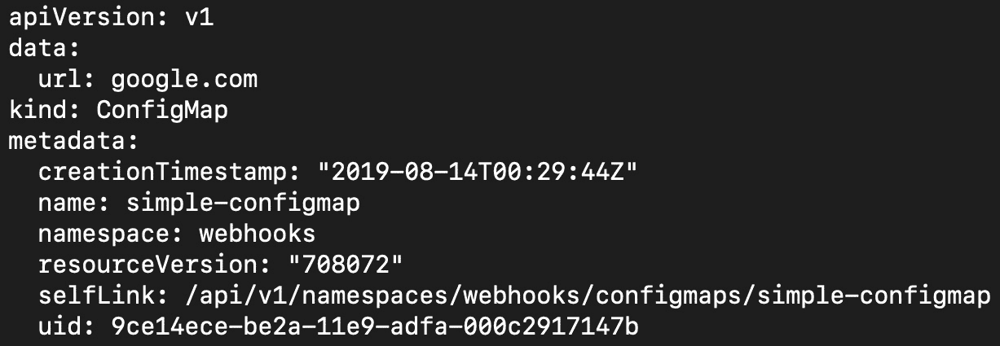

图 16.4：以 YAML 格式获取 ConfigMap 的内容

1.  现在，让我们用一个注释来打补丁 ConfigMap。我们要添加的注释是`teamname`，值为`kubeteam`：

```
kubectl patch configmap simple-configmap -n webhooks -p '{"metadata": {"annotations":  {"teamname":"kubeteam"}  } }'
```

您将得到以下响应：

```
configmap/simple-configmap patched
```

在*第六章*，*标签和注释*中，我们学到注释被存储为键值对。因此，一个键只能有一个值，如果一个键已经存在值（在这种情况下是`teamname`），那么新值将覆盖旧值。因此，请确保您的 webhook 逻辑排除已经具有所需配置的对象。

1.  现在，让我们使用详细的补丁说明来应用另一个补丁，使用 JSON 格式提供所需的字段：

```
kubectl patch configmap simple-configmap -n webhooks --type='json' -p='[{"op": "add", "path": "/metadata/annotations/custompatched", "value": "true"}]'
```

请注意补丁的三个组成部分：`op`（用于操作，如`add`），`path`（用于要打补丁的字段的位置），和`value`（这是新值）。您应该看到以下响应：

```
configmap/simple-configmap patched
```

这是另一种应用补丁的方式。您可以看到前面的命令，它指示 Kubernetes 添加一个新的注释，键为`custompatched`，值为`true`。

1.  现在，让我们看看补丁是否已经应用。使用以下命令：

```
kubectl get configmap simple-configmap -n webhooks -o yaml
```

您应该看到以下输出：

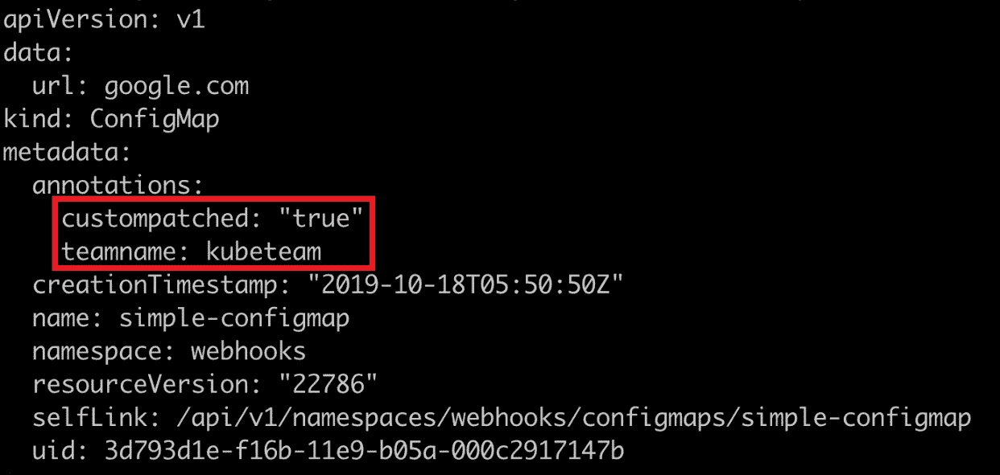

图 16.5：检查我们的 ConfigMap 上修改的注释

正如您从 `metadata` 下的 `annotations` 字段中所看到的，这两个注释都已应用到我们的 ConfigMap 上。平台团队现在知道谁拥有这个 ConfigMap 对象。

## 构建变更 Admission WebHook 的指南

我们现在知道了工作中变更 Admission WebHook 的所有部分。请记住，Webhook 只是一个简单的 HTTPS 服务器，您可以使用自己选择的语言编写它。Webhook 被部署为 Pod 在集群中。Kubernetes API 服务器将通过 SSL 在端口 443 上调用这些 Pod 来变更或验证对象。

构建 Webhook Pod 的伪代码将如下所示：

1.  在 Pod 中设置一个简单的 HTTPS 服务器（Webhook）来接受 POST 调用。请注意，调用必须通过 SSL 进行。

1.  Kubernetes 将通过 HTTPS POST 调用将 AdmissionReview 对象发送到 Webhook。

1.  Webhook 代码将处理 AdmissionRequest 对象，以获取请求中对象的详细信息。

1.  Webhook 代码将可选择地修补对象并将响应标志设置为指示成功或失败。

1.  Webhook 代码将使用更新后的请求填充 AdmissionReview 对象中的 AdmissionResponse 部分。

1.  Webhook 将使用 AdmissionReview 对象回应 POST 调用（在 *步骤 2* 中收到）。

1.  Kubernetes API 服务器将评估响应，并根据标志接受或拒绝客户端请求。

在 Webhook 的代码中，我们将使用 JSON 指定路径和所需的修改。请记住，从之前的练习中，我们的修补对象定义将包含以下内容：

+   `op` 指定操作，比如 `add` 和 `replace`。

+   `path` 指定我们要修改的字段的位置。参考 *图 16.5* 中命令的输出，并注意不同的字段位于不同的位置。例如，名称位于 metadata 字段内，因此其路径将是 `/metadata/name`。

+   `value` 指定字段的值。

用 Go 编写的简单变更 Webhook 应该如下所示：

mutatingcontroller.go

```
20 func MutateCustomAnnotation(admissionRequest      *v1beta1.AdmissionRequest ) (*v1beta1.AdmissionResponse,      error){ 
21 
22   // Parse the Pod object. 
23   raw := admissionRequest.Object.Raw 
24   pod := corev1.Pod{} 
25   if _, _, err := deserializer.Decode(raw, nil, &pod); err !=        nil{ 
26         return nil, errors.New("unable to parse pod") 
27   } 
28 
29   //create annotation to add 
30   annotations := map[string]string{"podModified" : "true"} 
31 
32   //prepare the patch to be applied to the object 
33   var patch []patchOperation 
34   patch = append(patch, patchOperation{ 
35         Op:   "add", 
36         Path: "/metadata/annotations", 
37         Value: annotations, 
38   }) 
39 
40   //convert patch into bytes 
41   patchBytes, err := json.Marshal(patch) 
42   if err != nil { 
43         return nil, errors.New("unable to parse the patch") 
44   } 
45 
46   //create the response with patch bytes 
47   var admissionResponse *v1beta1.AdmissionResponse 
48   admissionResponse = &v1beta1.AdmissionResponse { 
49         Allowed: true, 
50         Patch:   patchBytes, 
51         PatchType: func() *v1beta1.PatchType { 
52              pt := v1beta1.PatchTypeJSONPatch 
53              return &pt 
54         }(), 
55   } 
56 
57   //return the response 
58   return admissionResponse, nil 
59 
60 } 
```

此示例的完整代码可以在 [`packt.live/2GFRCot`](https://packt.live/2GFRCot) 找到。

正如您在前面的代码中所看到的，三个主要部分是 **AdmissionRequest** 对象，**patch**，以及带有修补信息的 **AdmissionResponse** 对象。

到目前为止，在本章中，我们已经学习了什么是准入 webhook，以及它如何与 Kubernetes API 服务器交互。我们还演示了通过使用补丁来更改请求的对象的一种方法。现在，让我们应用我们到目前为止学到的知识，在我们的 Kubernetes 集群中部署一个 webhook。

请记住，API 服务器和 webhook 之间的所有通信都是通过 SSL 进行的。SSL 是一种用于网络安全通信的协议。为了做到这一点，我们需要创建公钥和私钥，正如你将在接下来的练习中看到的。

请注意，我们还没有构建进入 webhook 的代码。首先，让我们演示如何部署用于 webhook 的 Pods（使用 Deployment）使用预构建的容器，然后我们将继续构建进入 Pod 的代码，使 webhook 运行起来。

## 练习 16.02：部署 Webhook

在这个练习中，我们将在 Kubernetes 中部署一个简单的预构建 webhook 服务器。请记住，webhook 只是一个 HTTPS 服务器，这正是我们要创建的。当 Kubernetes 需要通过 SSL 调用 webhook 端点时，我们需要为我们的调用创建一个证书。一旦我们为 SSL 通信创建了证书，我们将使用 Kubernetes Deployment 对象来部署我们的 webhook：

1.  创建一个自签名证书的**证书颁发机构**（**CA**）。这个 CA 将稍后用于在 Kubernetes 和我们的 webhook 服务器之间创建 HTTPS 调用的信任：

```
openssl req -nodes -new -x509 -keyout controller_ca.key -out controller_ca.crt -subj "/CN=Mutating Admission Controller Webhook CA"
```

这应该给你以下的回应：

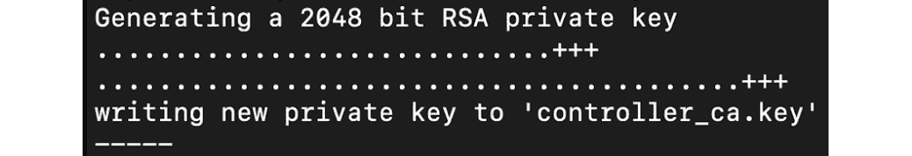

图 16.6：生成自签名证书

注意

您可以在此链接了解更多关于自签名证书的信息：[`aboutssl.org/what-is-self-sign-certificate/`](https://aboutssl.org/what-is-self-sign-certificate/)。

1.  为 SSL 调用创建私钥：

```
openssl genrsa -out tls.key 2048
```

你应该会看到以下的回应：

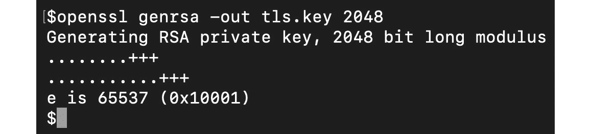

图 16.7：为 SSL 调用创建私钥

1.  现在用 CA 签署服务器证书：

```
openssl req -new -key tls.key -subj "/CN=webhook-server.webhooks.svc" \
    | openssl x509 -req -CA controller_ca.crt -CAkey controller_ca.key -CAcreateserial -out tls.crt
```

请注意，此命令中服务的名称是将在集群中公开我们的 webhook 的服务，以便 API 服务器可以访问它。我们将在*步骤 7*中重新访问这个名称。你应该会看到以下的回应：

```
Signature ok
subject=/CN=webhook-server.webhooks.svc
Getting CA Private Key
```

1.  现在我们已经创建了一个我们的服务器可以使用的证书。接下来，我们将创建一个 Kubernetes Secret，将私钥和证书加载到我们的 webhook 服务器中：

```
kubectl -n webhooks create secret tls webhook-server-tls \
    --cert "tls.crt" \
    --key "tls.key"
```

您应该看到以下响应：

```
secret/webhook-server-tls created
```

1.  我们的 webhook 将作为一个 Pod 运行，我们将使用部署来创建它。为此，首先创建一个名为`mutating-server.yaml`的文件，其中包含以下内容：

```
apiVersion: apps/v1
kind: Deployment
metadata:
  name: webhook-server
  labels:
    app: webhook-server
spec:
  replicas: 1
  selector:
    matchLabels:
      app: webhook-server
  template:
    metadata:
      labels:
        app: webhook-server
    spec:
      containers:
      - name: server
        image: packtworkshops/the-kubernetes-          workshop:mutating-webhook
        imagePullPolicy: Always
        ports:
        - containerPort: 8443
          name: webhook-api
        volumeMounts:
        - name: webhook-tls-certs
          mountPath: /etc/secrets/tls
          readOnly: true
      volumes:
      - name: webhook-tls-certs
        secret:
          secretName: webhook-server-tls
```

请注意，我们正在链接到我们提供的服务器的预制图像。

1.  使用我们在上一步中创建的 YAML 文件创建部署：

```
kubectl create -f mutating-server.yaml -n webhooks
```

您应该看到以下响应：

```
deployment.apps/webhook-server created
```

1.  创建服务器后，我们需要创建一个 Kubernetes 服务。请注意，服务可以通过`webhook-server.webhooks.svc`访问。这个字符串是我们在*步骤 3*中创建证书时使用的，它基于以下规范中定义的字段，格式为`<SERVICENAME>.<NAMESPACENAME>.svc`。

创建一个名为`mutating-serversvc.yaml`的文件，以定义具有以下规范的服务：

```
apiVersion: v1
kind: Service
metadata:
  labels:
    app: webhook-server
  name: webhook-server
  namespace: webhooks
spec:
  ports:
  - port: 443
    protocol: TCP
    targetPort: 8443
  selector:
    app: webhook-server
  sessionAffinity: None
  type: ClusterIP
```

1.  使用上一步的定义，使用以下命令创建服务：

```
kubectl create -f mutating-serversvc.yaml -n webhooks
```

您应该看到以下响应：

```
service/webhook-server created
```

在这个练习中，我们部署了一个预构建的 webhook，并配置了证书，使得我们的 webhook 准备好接受来自 Kubernetes API 服务器的调用。

## 配置 Webhook 以与 Kubernetes 一起工作

在这个阶段，我们已经使用部署创建并部署了 webhook。现在，我们需要向 Kubernetes 注册 webhook，以便 Kubernetes 知道它。这样做的方法是创建一个`MutatingWebHookConfiguration`对象。

注意

您可以在[`kubernetes.io/docs/reference/access-authn-authz/extensible-admission-controllers/`](https://kubernetes.io/docs/reference/access-authn-authz/extensible-admission-controllers/)找到有关 MutatingConfigurationWebhook 的更多详细信息。

以下片段显示了`MutatingWebhookConfiguration`的配置对象的示例：

```
apiVersion: admissionregistration.k8s.io/v1beta1
kind: MutatingWebhookConfiguration
metadata:
  name: pod-annotation-webhook
webhooks:
- name: webhook-server.webhooks.svc
   clientConfig:
     service:
       name: webhook-server
       namespace: webhooks
       path: "/mutate"
     caBundle: "LS0…"    #The caBundle is truncated for brevity
   rules:
     - operations: [ "CREATE" ]
       apiGroups: [""]
       apiVersions: ["v1"]
       resources: ["pods"]
```

以下是前述对象中的一些值得注意的定义：

1.  `clientConfig.service`部分定义了变异 webhook 的位置（我们在*练习 16.02*中部署的*部署 webhook*）。

1.  `caBundle`部分包含 SSL 信任将建立的证书。这是以 Base64 格式编码的证书。我们将在下一节中解释如何对其进行编码。

1.  `rules`部分定义了需要拦截的操作。在这里，我们指示 Kubernetes 拦截任何创建新 Pod 的调用。

## 如何以 Base64 格式编码证书

如前所述，当 Kubernetes API 服务器调用 webhook 时，调用是通过 SSL 加密的，我们需要在 webhook 定义中提供 SSL 信任证书。这可以在前一节中显示的`MutatingWebhookConfiguration`定义中的`caBundle`字段中看到。该字段中的数据是 Base64 编码的，正如您在*第十章*，*ConfigMaps 和 Secrets*中学到的。以下命令可用于将证书编码为 Base64 格式。

首先，使用以下命令将生成的文件转换为 Base64 格式：

```
openssl base64 -in controller_ca.crt -out controller_ca-base64.crt
```

由于我们需要将生成的 CA 捆绑包转换为 Base64 格式并放入 YAML 文件中（如前所述），我们需要删除换行符（`\n`）字符。可以使用以下命令来执行此操作：

```
cat controller_ca-base64.crt | tr -d '\n' > onelinecert.pem
```

这两个命令在成功执行后不会在终端上显示任何响应。在这个阶段，您将在`onelinecert.pem`文件中拥有 CA 捆绑包，您可以复制它来创建您的 YAML 定义。

## Activity 16.01：创建一个可变的 Webhook，向 Pod 添加注释

在这个活动中，我们将利用我们在本章和之前章节中所学到的知识来创建一个可变的 webhook，它会向 Pod 添加一个自定义注释。这样的 webhook 可能有许多用例。例如，您可能希望记录容器镜像是否来自先前批准的存储库，以供将来报告。进一步扩展，您还可以在不同的节点上从不同的存储库调度 Pods。

完成此活动的高级步骤如下：

1.  创建一个名为`webhooks`的新命名空间。如果已经存在，则删除现有的命名空间，然后再次创建它。

1.  生成自签名的 CA 证书。

1.  为 SSL 生成私钥/公钥对并使用 CA 证书进行签名。

1.  创建一个保存在先前步骤中生成的私钥/公钥对的密钥。

1.  编写 webhook 代码以在 Pod 中添加自定义注释。

1.  将 webhook 服务器代码打包为 Docker 容器。

1.  将 Docker 容器推送到您选择的公共存储库。

注意

如果您在构建自己的 webhook 时遇到任何困难，可以使用此链接中提供的代码作为参考：[`packt.live/2R1vJlk`](https://packt.live/2R1vJlk)。

如果你想避免构建和打包 webhook，我们提供了一个预构建的容器，这样你就可以直接在你的部署中使用它。你可以从 Docker Hub 使用这个图像：`packtworkshops/the-kubernetes-workshop:webhook`。

使用此图像可以跳过*步骤 5*至*7*。

1.  创建一个部署，部署 webhook 服务器。

1.  将 webhooks 部署公开为 Kubernetes 服务。

1.  创建 CA 证书的 Base64 编码版本。

1.  创建一个`MutatingWebHookConfiguration`对象，以便 Kubernetes 可以拦截 API 调用并调用我们的 webhook。

在这个阶段，我们的 webhook 已经创建。现在，为了测试我们的 webhook 是否工作，创建一个没有注释的简单 Pod。

一旦 Pod 被创建，确保通过描述它来添加注释到 Pod。这里是预期输出的截断版本。请注意，这里的注释应该是由我们的 webhook 添加的：

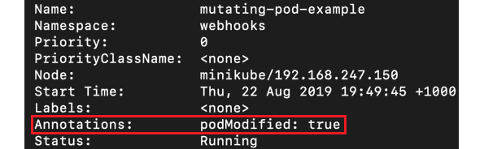

图 16.8：活动 16.01 的预期输出

注意

此活动的解决方案可在第 799 页找到。

# 验证 Webhook

我们已经了解到，变异 webhook 基本上允许修改 Kubernetes 对象。另一种 webhook 称为验证 webhook。顾名思义，这个 webhook 不允许对 Kubernetes 对象进行任何更改；相反，它作为我们集群的守门人。它允许我们编写代码，可以验证任何被请求的 Kubernetes 对象，并根据我们指定的条件允许或拒绝请求。

让我们通过一个例子来了解这如何有帮助。假设我们的 Kubernetes 集群被许多团队使用，我们想知道哪些 Pod 与哪些团队相关联。一个解决方案是要求所有团队在其 Pod 上添加一个标签（例如，键为`teamName`，值为团队名称）。正如你所猜测的那样，强制执行一组标签不是标准的 Kubernetes 功能。在这种情况下，我们需要创建自己的逻辑来禁止没有这些标签的 Pod。

实现这一点的一种方法是编写一个验证 webhook，查找任何 Pod 请求中的此标签，并拒绝创建请求的 Pod，如果此标签不存在。您将在本章后面的*活动 16.02*中做到这一点，*创建一个验证 webhook，检查 Pod 中是否存在标签*。现在，让我们看一下验证 webhook 的代码将是什么样子。

## 编写一个简单的验证 WebHook

让我们来看一段简单验证 webhook 代码的摘录：

```
func ValidateTeamAnnotation(admissionRequest   *v1beta1.AdmissionRequest ) (*v1beta1.AdmissionResponse, error){
      // Get the AdmissionReview Object
      raw := admissionRequest.Object.Raw
      pod := corev1.Pod{}

     // Parse the Pod object.
      if _, _, err := deserializer.Decode(raw, nil, &pod);         err != nil {
            return nil, errors.New("unable to parse pod")
      }
      //Get all the Labels of the Pod
      podLabels := pod.ObjectMeta.GetLabels()

      //Logic to check if label exists
      //check if the teamName label is available, if not         generate an error.
      if podLabels == nil || podLabels[teamNameLabel] == "" {
           return nil, errors.New("teamName label not found")
      }

      //Populate the Allowed flag
      //if the teamName label exists, return the response with 
      //Allowed flag set to true.
      var admissionResponse *v1beta1.AdmissionResponse
      admissionResponse = &v1beta1.AdmissionResponse {
           Allowed: true,
      }
      //Return the response with Allowed set to true
      return admissionResponse, nil
}
const (
      //This is the name of the label that is expected to be         part of the pods to allow them to be created.
      teamNameLabel = `teamName`
)
```

您可以在此片段中观察到的三个主要部分是 AdmissionRequest 对象，检查标签是否存在的逻辑，以及使用 Allowed 标志创建 AdmissionResponse 对象。

现在我们了解了验证 webhook 所需的所有不同组件，让我们在下一个活动中构建一个。

## 活动 16.02：创建一个验证 webhook，检查 Pod 中是否存在标签

在这个活动中，我们将利用我们在本章和之前章节中所学到的知识，编写一个验证 webhook，验证请求的 Pod 中是否存在标签。

所需的步骤如下：

1.  创建一个名为`webhooks`的新命名空间。如果已经存在，请删除现有的命名空间，然后再次创建它。

1.  生成自签名的 CA 证书。

1.  生成 SSL 的私钥/公钥对，并使用 CA 证书进行签名。

1.  创建一个保存在上一步生成的私钥/公钥对的秘密。

注意

即使您拥有上一个活动的证书和密钥，我们建议您丢弃它们，重新开始，以避免任何冲突。

1.  编写 webhook 代码以检查是否存在具有键`teamName`的标签。如果不存在，则拒绝请求。

1.  将 webhook 代码打包为 Docker 容器。

1.  将 Docker 容器推送到您选择的公共存储库（quay.io 允许您创建一个免费的公共存储库）。

注意

如果您在构建自己的 webhook 时遇到任何困难，您可以使用此链接提供的代码作为参考：[`packt.live/2FbL7Jv`](https://packt.live/2FbL7Jv)。

如果您想避免构建和打包 webhook，我们提供了一个预构建的容器，以便您可以直接在部署中使用它。您可以从 Docker Hub 使用此镜像：`packtworkshops/the-kubernetes-workshop:webhook`。

使用此镜像可以跳过*步骤 5*至*7*。

1.  创建部署以部署 webhook 服务器。

1.  将 webhooks Deployment 公开为 Kubernetes 服务。

1.  创建 CA 证书的 Base64 编码版本。

1.  创建`ValidtingWebhookConfiguration`，以便 Kubernetes 可以拦截 API 调用并调用我们的 webhook。

1.  创建一个没有标签的简单 Pod，并验证它是否被拒绝。

1.  创建一个带有所需标签的简单 Pod，并验证它是否已创建。

1.  一旦创建了 Pod，请确保标签是 Pod 规范的一部分。

您可以通过尝试创建一个没有`teamName`标签的 Pod 来测试您的验证 webhook。它应该被拒绝，并显示以下消息：

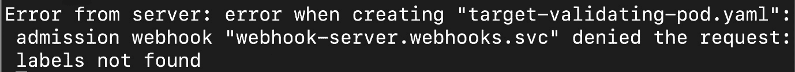

图 16.9：活动 16.02 的预期输出

注意

此活动的解决方案可以在以下地址找到：[`packt.live/304PEoD`](https://packt.live/304PEoD)。

## 控制 Webhook 对选定命名空间的影响

当您定义任何 webhook（变异或验证）时，您可以通过定义`namespaceSelector`参数来控制 webhook 将影响哪些命名空间。请注意，这仅适用于命名空间范围的对象。对于集群范围的对象，例如持久卷，此参数不会产生任何影响，并且将应用 webhook。

注意

并非所有准入控制器（变异或验证）都可以限制到一个命名空间。

就像许多 Kubernetes 对象一样，命名空间也可以有标签。我们将利用命名空间的这个属性，将 webhook 应用于特定的命名空间，正如您将在以下练习中看到的那样。

## 练习 16.03：使用命名空间选择器定义一个验证 Webhook

在这个练习中，我们将定义一个验证 webhook，强制执行一个自定义规则，应用于在`webhooks`命名空间中创建的 Pod。规则是 Pod 必须定义一个名为`teamName`的标签。由于该规则适用于在`webhooks-demo`命名空间中创建的 Pod，因此所有其他命名空间都可以创建没有定义标签的 Pod。

注意

在运行此练习之前，请确保您已完成*活动 16.02*，*创建一个检查 Pod 标签的验证 Webhook*，因为我们正在重用那里创建的对象。如果您在活动中遇到任何问题，可以在*附录*中查看解决方案。

1.  验证我们在*活动 16.02*中创建的验证 webhook 是否仍然存在：

```
kubectl get ValidatingWebHookConfiguration -n webhooks
```

您将看到以下响应：

```
NAME                        CREATED AT
pod-label-verify-webhook    201908-23T13:59:30Z
```

1.  现在，删除在*活动 16.02*中定义的现有验证 webhook，*创建一个检查 Pod 标签的验证 webhook*：

```
kubectl delete ValidatingWebHookConfiguration pod-label-verify-webhook -n webhooks
```

注意

`ValidatingWebHookConfiguration`是一个集群范围的对象，对于这个命令，指定`-n`标志是可选的。

您将会得到以下的响应：

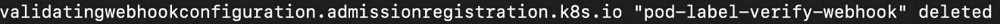

图 16.10：删除现有的验证 webhook

1.  删除`webhooks`命名空间：

```
kubectl delete ns webhooks
```

您将会得到以下的响应：

```
namespace "webhooks" deleted
```

1.  创建`webhooks`命名空间：

```
kubectl create ns webhooks
```

您将会得到以下的响应：

```
namespace/webhooks created
```

现在我们应该有一个干净的板块来继续进行这个练习。

1.  创建一个新的 CA 捆绑和一个私钥/公钥对，用于这个 webhook。使用以下命令生成一个自签名证书：

```
openssl req -nodes -new -x509 -keyout controller_ca.key -out controller_ca.crt -subj "/CN=Mutating Admission Controller Webhook CA"
```

您将会得到类似以下的输出：

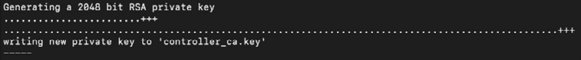

图 16.11：生成一个自签名证书

注意

即使您在之前的活动中已经创建了 CA 和密钥，您仍需要重新创建它们以使本练习正常工作。

1.  生成一个私钥/公钥对，并使用以下两个命令依次对其进行 CA 证书签名：

```
openssl genrsa -out tls.key 2048
openssl req -new -key tls.key -subj "/CN=webhook-server.webhooks.svc" \
    | openssl x509 -req -CA controller_ca.crt -Cakey controller_ca.key -Cacreateserial -out tls.crt
```

您将会得到类似以下响应的输出：

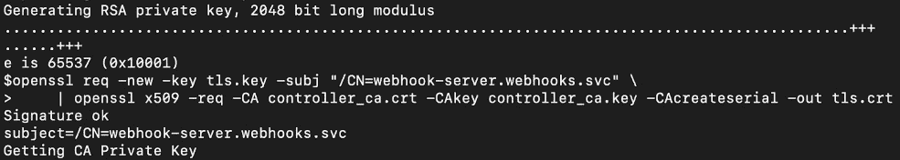

图 16.12：用我们的证书签署私钥/公钥对

1.  创建一个保存私钥/公钥对的 secret：

```
kubectl -n webhooks create secret tls webhook-server-tls \
--cert "tls.crt" \
--key "tls.key"
```

您应该会得到以下的响应：

```
secret/webhook-server-tls created
```

1.  接下来，我们需要在`webhooks`命名空间部署 webhook。创建一个名为`validating-server.yaml`的文件，内容如下：

```
apiVersion: apps/v1
kind: Deployment
metadata:
  name: webhook-server
  labels:
    app: webhook-server
spec:
  replicas: 1
  selector:
    matchLabels:
      app: webhook-server
  template:
    metadata:
      labels:
        app: webhook-server
    spec:
      containers:
      - name: server
        image: packtworkshops/the-kubernetes-workshop:webhook
        imagePullPolicy: Always
        ports:
        - containerPort: 8443
          name: webhook-api
        volumeMounts:
        - name: webhook-tls-certs
          mountPath: /etc/secrets/tls
          readOnly: true
      volumes:
      - name: webhook-tls-certs
        secret:
          secretName: webhook-server-tls
```

注意

您可以使用在*活动 16.02*中创建的相同的 webhook 镜像，*创建一个检查 Pod 标签的验证 webhook*。在这个参考 YAML 中，我们使用了我们在仓库中提供的镜像。

1.  通过使用上一步的定义部署 webhook 服务器：

```
kubectl create -f validating-server.yaml -n webhooks
```

您应该会看到以下的响应：

```
deployment.apps/webhook-server created
```

1.  您可能需要等一会儿，检查 webhook Pods 是否已经创建。不断检查 Pods 的状态：

```
kubectl get pods -n webhooks -w
```

您应该会看到以下的响应：

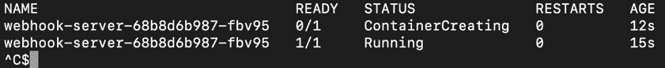

图 16.13：检查我们的 webhook 是否在线

注意，`-w`标志会持续监视 Pods。当所有的 Pods 都准备就绪时，您可以结束监视。

1.  现在，我们需要通过 Kubernetes 服务公开部署的 webhook 服务器。创建一个名为`validating-serversvc.yaml`的文件，内容如下：

```
apiVersion: v1
kind: Service
metadata:
  labels:
    app: webhook-server
  name: webhook-server
  namespace: webhooks
spec:
  ports:
  - port: 443
    protocol: TCP
    targetPort: 8443
  selector:
    app: webhook-server
  sessionAffinity: None
  type: ClusterIP
```

请注意，webhook 服务必须在端口`443`上运行，因为这是 TLS 通信的标准端口。

1.  使用上一步的定义来使用以下命令创建服务：

```
kubectl create -f validating-serversvc.yaml -n webhooks
```

您将看到以下输出：

```
service/webhook-server created
```

1.  创建 CA 证书的 Base64 编码版本。依次使用以下命令：

```
openssl x509 -inform PEM -in controller_ca.crt > controller_ca.crt.pem
openssl base64 -in controller_ca.crt.pem -out controller_ca-base64.crt.pem
```

第一个命令是将证书转换为 PEM 格式。第二个命令是将 PEM 证书转换为 Base64。这些命令不会有任何响应。您可以使用以下命令检查文件：

```
cat controller_ca-base64.crt.pem
```

文件内容应该是这样的：

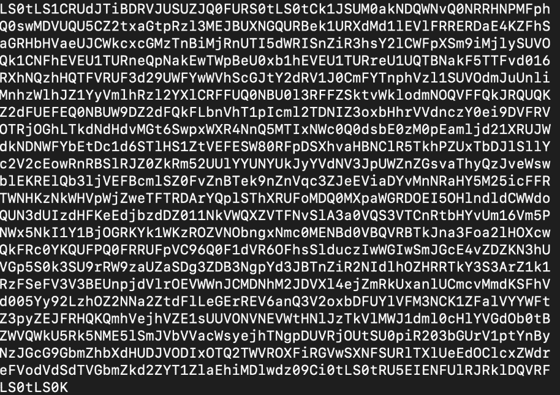

图 16.14：Base64 编码的 CA 证书内容

请注意，您生成的 TLS 证书不会完全与此处显示的内容相同。

1.  使用以下两个命令清除我们的 CA 证书中的空行，并将内容添加到一个新文件中：

```
cat controller_ca-base64.crt.pem | tr -d '\n' > onelinecert.pem
cat onelinecert.pem
```

第一个命令不会有任何响应，第二个命令会打印出`onlinecert.pem`的内容。您应该会看到以下响应：

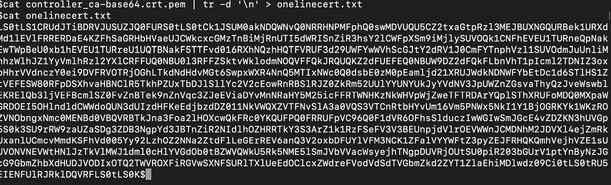

图 16.15：去除换行符的 Base64 编码 CA 证书

现在我们有了去除空行的 Base64 编码证书。在下一步中，我们将复制此输出中的值，注意不要复制结尾的`$`（在 Zsh 的情况下将是`%`）。将此值粘贴到`validation-config-namespace-scoped.yaml`中的`CA_BASE64_PEM`（`caBundle`的占位符）的位置，该文件将在下一步中创建。

1.  创建一个名为`validation-config-namespace-scoped.yaml`的文件，使用以下`ValidatingWebHookConfiguration`规范来配置 Kubernetes API 服务器调用我们的 webhook：

```
apiVersion: admissionregistration.k8s.io/v1beta1
kind: ValidatingWebhookConfiguration
metadata:
  name: pod-label-verify-webhook
webhooks:
  - name: webhook-server.webhooks.svc
    namespaceSelector:
      matchExpressions:
      - key: applyValidation
        operator: In
        values: ["true","yes", "1"]

    clientConfig:
      service:
        name: webhook-server
        namespace: webhooks
        path: "/validate"
      caBundle: "CA_BASE64_PEM"    #Retain the quotes when you         copy the caBundle here. Please read the note below on         how to add specific values here.
    rules:
      - operations: [ "CREATE" ]
        apiGroups: [""]
        apiVersions: ["v1"]
        resources: ["pods"]
        scope: "Namespaced"
```

注意

`CA_BASE64_PEM`占位符将被替换为上一步中`onelinecert.pem`的内容。请注意不要复制任何换行符。

1.  根据上一步中定义的 webhook 创建 webhook。确保用之前步骤中创建的证书替换`caBundle`字段：

```
kubectl create -f validation-config-namespace-scoped.yaml
```

您将看到以下响应：

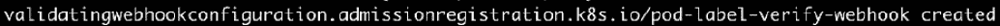

图 16.16：创建 ValidatingWebhookConfiguration

1.  按照以下方式创建一个名为`webhooks-demo`的新命名空间：

```
kubectl create namespace webhooks-demo
```

您应该看到以下响应：

```
namespace/webhooks-demo created
```

1.  将`applyValidation=true`标签应用到`webhooks`命名空间，如下所示：

```
kubectl label namespace webhooks applyValidation=true
```

您应该看到以下响应：

```
namespace/webhooks labeled
```

此标签将与*步骤 14*中定义的选择器匹配，并确保我们的验证标准（由 webhook 强制执行）适用于此命名空间。请注意，我们没有给`webhooks-demo`命名空间贴上标签，因此验证将*不*适用于此命名空间。

1.  现在定义一个没有`teamName`标签的 Pod。创建一个名为`target-validating-pod.yaml`的文件，内容如下：

```
apiVersion: v1
kind: Pod
metadata:
  name: validating-pod-example
spec:
  containers:
    - name: validating-pod-example-container
      image: k8s.gcr.io/busybox
      command: [ "/bin/sh", "-c", "while :; do echo '.'; sleep         5 ; done" ]
```

1.  根据上一步的定义，在`webhooks`命名空间中创建 Pod：

```
kubectl create -f target-validating-pod.yaml -n webhooks
```

Pod 的创建应该被拒绝，如下所示：

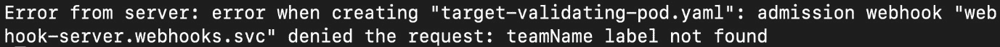

图 16.17：由于缺少必需标签而被拒绝的 Pod

请记住，我们的 webhook 只检查 Pod 中的`teamName`标签。根据*步骤 14*中定义的命名空间选择器，Pod 创建将被拒绝。

1.  现在，尝试在`webhooks-demo`命名空间中创建相同的 Pod，看看情况是否不同：

```
kubectl create -f target-validating-pod.yaml -n webhooks-demo
```

您应该得到这样的响应：

```
pod/validating-pod-example created
```

我们成功在`webhooks-demo`命名空间中创建了 Pod，但在`webhooks`命名空间中无法创建。

1.  让我们描述一下 Pod 以获取更多细节：

```
kubectl describe pod validating-pod-example -n webhooks-demo
```

您应该看到类似于这样的响应：

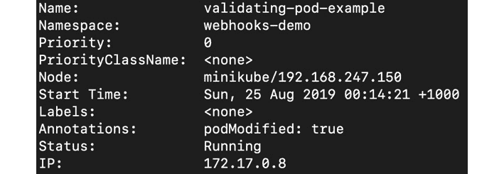

图 16.18：检查我们的 Pod 的规范

正如您所看到的，这个 Pod 没有任何标签，但我们仍然能够创建它。这是因为我们的验证 webhook 没有监视`webhooks-demo`命名空间。

在这个练习中，您已经学会了如何配置 webhook 以在命名空间级别进行更改。这对于测试功能并为可能拥有不同命名空间的不同团队提供不同功能可能很有用。

# 摘要

在本章中，我们了解到准入控制器提供了一种在创建、更新和删除操作期间强制执行对象的变异和验证的方式。这是扩展 Kubernetes 平台以符合您组织标准的简单方法。它们可以用于将最佳实践和策略应用到 Kubernetes 集群上。

接下来，我们学习了什么是变异和验证 webhook，如何配置它们，以及如何在 Kubernetes 平台上部署它们。Webhook 提供了一种简单的方式来扩展 Kubernetes，并帮助您适应特定企业的需求。

在之前的一系列章节中，从*第十一章*，*构建您自己的 HA 集群*，到*第十五章*，*Kubernetes 中的监控和自动扩展*，您学会了如何在 AWS 上设置高可用性集群，并运行无状态和有状态的应用程序。在接下来的几章中，您将学习许多高级技能，这些技能将帮助您不仅仅是运行应用程序，还能够利用 Kubernetes 提供的许多强大的管理功能，并保持集群的健康。

具体来说，在下一章中，您将了解 Kubernetes 调度器。这是一个决定 Pod 将被调度到哪些节点的组件。您还将学习如何配置调度器以符合您的需求，以及如何控制 Pod 在节点上的放置。
