# 第十七章：17. Kubernetes 中的高级调度

概述

本章重点介绍调度，即 Kubernetes 选择运行 Pod 的节点的过程。在本章中，我们将更仔细地研究这个过程和 Kubernetes 调度器，这是负责这个过程的默认 Kubernetes 组件。

通过本章的学习，您将能够使用不同的方式来控制 Kubernetes 调度器的行为，以满足应用程序的要求。本章将使您能够选择适当的 Pod 调度方法，根据业务需求控制您想要在哪些节点上运行 Pod。您将了解在 Kubernetes 集群上控制 Pod 调度的不同方式。

# 介绍

我们已经看到，我们将我们的应用程序打包为容器，并将它们部署为 Kubernetes 中的 Pod，这是部署的最小单位。借助 Kubernetes 提供的先进调度功能，我们可以优化这些 Pod 的部署，以满足我们的硬件基础设施的需求，并充分利用可用资源。

Kubernetes 集群通常有多个节点（或机器或主机），可以在其中执行 Pod。假设您正在管理一些机器，并且已被指定在这些机器上执行应用程序。为了决定哪台机器最适合给定的应用程序，您会怎么做？在本次研讨会中，每当您想在 Kubernetes 集群上运行 Pod 时，您是否提到过 Pod 应该在哪个节点上运行？

没错 - 我们不需要; Kubernetes 配备了一个智能组件，可以找到最适合运行您的 Pod 的节点。这个组件就是**Kubernetes 调度器**。在本章中，我们将更深入地了解 Kubernetes 调度器的工作原理，以及如何调整它以更好地控制我们的集群，以满足不同的需求。

# Kubernetes 调度器

如介绍中所述，典型的集群有多个节点。当您创建一个 Pod 时，Kubernetes 必须选择一个节点并将 Pod 分配给它。这个过程被称为**Pod 调度**。

负责决定将 Pod 分配给哪个节点以执行的 Kubernetes 组件称为调度器。Kubernetes 配备了一个默认调度器，适用于大多数用例。例如，默认的 Kubernetes 调度器在集群中均匀分配负载。

现在，考虑这样一个场景：两个不同的 Pod 预计经常需要相互通信。作为系统架构师，您可能希望它们位于同一节点上，以减少延迟并释放一些内部网络带宽。调度器不知道不同类型的 Pod 之间的关系，但 Kubernetes 提供了方法来告知调度器这种关系，并影响调度行为，以便这两个不同的 Pod 可以托管在同一节点上。但首先，让我们更仔细地看一下 Pod 的**调度过程**。

# Pod 调度过程

调度器的工作分为三个步骤：**过滤**、**评分**和**分配**。让我们来看看在执行每个步骤时会发生什么。下图描述了该过程的概述：

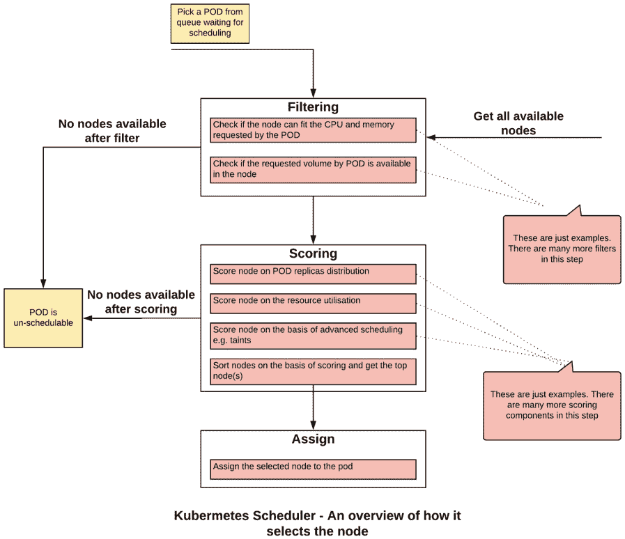

图 17.1：Kubernetes Scheduler 选择合适节点的概述

## 过滤

过滤是指**Kubernetes Scheduler**运行一系列检查或过滤器，以查看哪些节点不适合运行目标 Pod 的过程。过滤器的一个例子是查看节点是否有足够的 CPU 和内存来托管 Pod，或者 Pod 请求的存储卷是否可以挂载在主机上。如果集群中没有适合满足 Pod 要求的节点，那么 Pod 被视为不可调度，并且不会在集群上执行。

## 评分

一旦**Kubernetes Scheduler**有了可行节点的列表，第二步是对节点进行评分，并找到最适合托管目标 Pod 的节点。节点会经过几个优先函数，并分配一个优先级分数。每个函数都会分配一个介于 0 和 10 之间的分数，其中 0 是最低的，10 是最高的。

为了理解优先级函数，让我们以`SelectorSpreadPriority`为例。这个优先级函数使用标签选择器来找到相关的 Pod。比如说，一堆 Pod 是由同一个部署创建的。正如 SpreadPriority 这个名字所暗示的，这个函数试图将 Pod 分布在不同的节点上，这样在节点故障的情况下，我们仍然会在其他节点上运行副本。在这个优先级函数下，Kubernetes Scheduler 选择使用与请求的 Pod 相同的标签选择器运行最少的节点。这些节点将被分配最高的分数，反之亦然。

另一个优先级函数的示例是`LeastRequestedPriority`。这试图在具有最多资源可用的节点上分配工作负载。调度程序获取已分配给现有 Pod 的内存和 CPU 最少的节点。这些节点被分配最高的分数。换句话说，这个优先级函数将为更多的空闲资源分配更高的分数。

注意

在本章的有限范围内，有太多的优先级函数需要涵盖。完整的优先级函数列表可以在以下链接找到：[`kubernetes.io/docs/concepts/scheduling/kube-scheduler/#scoring`](https://kubernetes.io/docs/concepts/scheduling/kube-scheduler/#scoring)。

## 分配

最后，调度程序通知 API 服务器已基于最高分数选择的节点。如果有多个具有相同分数的节点，调度程序会选择一个随机节点，并有效地应用决胜局。

默认的 Kubernetes Scheduler 作为一个 Pod 在`kube-system`命名空间中运行。您可以通过列出`kube-system`命名空间中的所有 Pod 来查看它的运行情况：

```
kubectl get pods -n kube-system
```

您应该看到以下 Pod 列表：

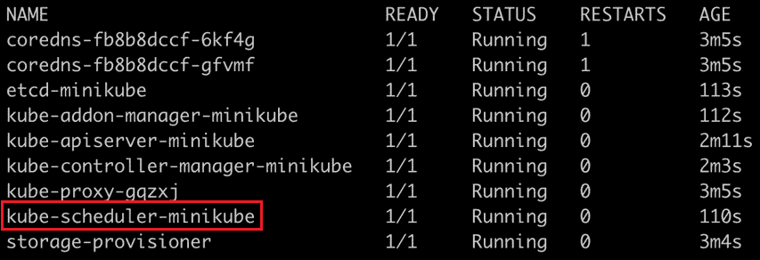

图 17.2：在 kube-system 命名空间中列出 Pod

在我们的 Minikube 环境中，Kubernetes Scheduler Pod 的名称为`kube-scheduler-minikube`，正如您在此截图中所看到的。

## Pod 调度时间表

让我们深入了解**Pod 调度**过程的时间线。当您请求创建一个 Pod 时，不同的 Kubernetes 组件会被调用来将 Pod 分配给正确的节点。从请求 Pod 到分配节点，涉及三个步骤。以下图表概述了这个过程，我们将在图表之后详细阐述和分解这个过程：

**步骤 2**：**Kubernetes 调度器**通过 API 服务器不断监视 Kubernetes 数据存储。一旦有 Pod 创建请求可用（或 Pod 处于挂起状态），调度器会尝试调度它。重要的是要注意，调度器不负责运行 Pod。它只是计算最适合托管 Pod 的节点，并通知 Kubernetes API 服务器，然后将这些信息存储在 etcd 中。在这一步中，Pod 被分配到最佳节点，并且关联关系被存储在 etcd 中。

管理 Kubernetes 调度器

图 17.3：Pod 调度过程的时间线

**步骤 1**：当提出创建和运行 Pod 的请求时，例如通过 kubectl 命令或 Kubernetes 部署，API 服务器会响应此请求。它会更新 Kubernetes 内部数据库（etcd），并将一个待执行的 Pod 条目添加到其中。请注意，在这个阶段，不能保证 Pod 将被调度。

污点和容忍

**步骤 3**：Kubernetes 代理（kubelet）通过 API 服务器不断监视 Kubernetes 数据存储。一旦一个新的 Pod 被分配到一个节点，它会尝试在节点上执行 Pod。当 Pod 成功启动并运行时，通过 API 服务器将其标记为在 etcd 中运行，此时过程完成。

现在我们对调度过程有了一定的了解，让我们看看如何调整它以满足我们的需求。

# ](image/B14870_17_03.jpg)

Kubernetes 提供了许多参数和对象，通过它们我们可以管理**Kubernetes 调度器**的行为。我们将研究以下管理调度过程的方式：

+   ![图 17.3：Pod 调度过程的时间线

+   Pod 亲和性和反亲和性

+   节点亲和性和反亲和性

+   Pod 优先级和抢占

## 节点亲和性和反亲和性

使用节点亲和规则，Kubernetes 集群管理员可以控制 Pod 在特定节点集上的放置。节点亲和性或反亲和性允许您根据节点的标签来限制 Pod 可以运行的节点。

想象一下，您是银行共享 Kubernetes 集群的管理员。多个团队在同一集群上运行其应用程序。您的组织安全组已经确定了可以运行数据敏感应用程序的节点，并希望您确保没有其他应用程序在这些节点上运行。节点亲和性或反亲和性规则为满足此要求提供了解决方案，只将特定的 Pod 关联到一组节点。

节点亲和规则由两个组件定义。首先，您为一组节点分配一个标签。第二部分是配置 Pod，使它们只与具有特定标签的节点相关联。另一种思考方式是，Pod 定义了它应该放置在哪里，调度程序将此定义中的标签与节点标签进行匹配。

有两种类型的节点亲和性/反亲和性规则：

+   必需规则是硬性规则。如果不满足这些规则，Pod 将无法在节点上调度。它在 Pod 规范的`requiredDuringSchedulingIgnoredDuringExecution`部分中定义。请参阅*练习 17.01*，*使用节点亲和性运行 Pod*，作为此规则的示例。

+   首选规则是软规则。调度程序尽量在可能的情况下执行首选规则，但如果规则无法执行，它会忽略这些规则，也就是说，如果严格遵循这些规则，Pod 将无法被调度。首选规则在 Pod 规范的`preferredDuringSchedulingIgnoredDuringExecution`部分中定义。

首选规则与每个标准相关联的权重。调度程序将根据这些权重创建一个分数，以在正确的节点上调度 Pod。权重字段的值范围从 1 到 100。调度程序计算所有合适节点的优先级分数，以找到最佳节点。请注意，分数可能会受到其他优先级函数的影响，例如`LeastRequestedPriority`。

如果您定义的权重太低（与其他权重相比），则整体分数将受到其他优先级函数的最大影响，我们的首选规则可能对调度过程产生很少影响。如果定义了多个规则，则可以更改对您最重要的规则的权重。

亲和规则是在 Pod 规范中定义的。基于我们期望/不期望的节点的标签，我们将在 Pod 规范中提供选择标准的第一部分。它包括一组标签，以及可选的标签值。

标准的另一部分是提供我们想要匹配标签的方式。我们将这些匹配标准定义为亲和性定义中的**运算符**。此运算符可以具有以下值：

+   `In`运算符指示调度程序在匹配标签和指定值之一的节点上调度 Pod。

+   `NotIn`运算符指示调度程序不要在不匹配标签和任何指定值的节点上调度 Pod。这是一个否定运算符，表示反亲和性配置。

+   `Exists`运算符指示调度程序在匹配标签的节点上调度 Pod。在这种情况下，标签的值并不重要。因此，即使指定的标签存在且标签的值不匹配，此运算符也是满足的。

+   `DoesNotExist`运算符指示调度程序不要在不匹配标签的节点上调度 Pod。在这种情况下，标签的值并不重要。这是一个否定运算符，表示反亲和性配置。

请注意，亲和性和反亲和性规则是基于节点上的标签定义的。如果节点上的标签发生更改，可能会导致节点亲和性规则不再适用。在这种情况下，正在运行的 Pod 将继续在节点上运行。如果重新启动 Pod，或者 Pod 死亡并创建了一个新的 Pod，Kubernetes 将视其为新的 Pod。在这种情况下，如果节点标签已被修改，调度程序可能不会将 Pod 放在同一节点上。当您修改节点标签时，这是您需要注意的事项。让我们在以下练习中为一个 Pod 实现这些规则。

## 练习 17.01：运行具有节点亲和性的 Pod

在这个练习中，我们将配置一个 Pod，以便在我们的 Minikube 环境中可用的节点上进行调度。我们还将看到，如果标签不匹配，Pod 将处于`Pending`状态。想象一下这种状态，在这种状态下，调度程序无法找到合适的节点分配给 Pod：

1.  使用以下命令创建一个名为`schedulerdemo`的新命名空间：

```
kubectl create ns schedulerdemo
```

您应该看到以下响应：

```
namespace/schedulerdemo created
```

1.  现在我们需要创建一个具有节点亲和性定义的 Pod。创建一个名为`pod-with-node-affinity.yaml`的文件，其中包含以下规范：

```
apiVersion: v1
kind: Pod
metadata:
  name: pod-with-node-affinity
spec:
  affinity:
nodeAffinity: 
requiredDuringSchedulingIgnoredDuringExecution: 
       nodeSelectorTerms:
       - matchExpressions:
- key: data-center 
operator: In 
           values:
- sydney 
  containers:
    - name: pod-with-node-affinity-container
      image: k8s.gcr.io/busybox
      command: [ "/bin/sh", "-c", "while :; do echo '.'; sleep         5 ; done" ]
```

请注意，在 Pod 规范中，我们已经添加了新的`affinity`部分。这个规则被配置为`requiredDuringSchedulingIgnoredDuringExecution`。这意味着如果没有具有匹配标签的节点，这个 Pod 将不会被调度。还要注意，根据`In`运算符，这里提到的表达式将与节点标签匹配。在这个例子中，匹配的节点将具有标签`data-center=sydney`。

1.  尝试创建这个 Pod，看看它是否被调度和执行：

```
kubectl create -f pod-with-node-affinity.yaml -n schedulerdemo
```

你应该看到以下响应：

```
pod/pod-with-node-affinity created
```

请注意，这里看到的响应并不一定意味着 Pod 已成功在节点上执行。让我们在下一步中检查一下。

1.  使用这个命令检查 Pod 的状态：

```
kubectl get pods -n schedulerdemo
```

你会看到以下响应：

```
NAME                     READY    STATUS    RESTARTS   AGE
pod-with-node-affinity   0/1      Pending   0          10s   
```

从这个输出中，你可以看到 Pod 处于`Pending`状态，没有被执行。

1.  检查`events`以查看为什么 Pod 没有被执行：

```
kubectl get events -n schedulerdemo
```

你会看到以下响应：

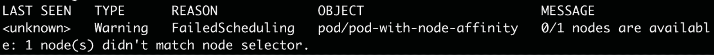

图 17.4：获取事件列表

你可以看到 Kubernetes 说没有节点与此 Pod 的选择器匹配。

1.  在继续之前，让我们删除 Pod：

```
kubectl delete pod pod-with-node-affinity -n schedulerdemo
```

你应该看到以下响应：

```
pod "pod-with-node-affinity" deleted
```

1.  现在，让我们看看我们集群中有哪些节点可用：

```
kubectl get nodes
```

你会看到以下响应：

```
NAME        STATUS    ROLES    AGE    VERSION
minikube    Ready     master   105d   v1.14.3
```

由于我们使用的是 Minikube，只有一个名为`minikube`的节点可用。

1.  检查`minikube`节点的标签。使用如下所示的`describe`命令：

```
kubectl describe node minikube
```

你应该看到以下响应：

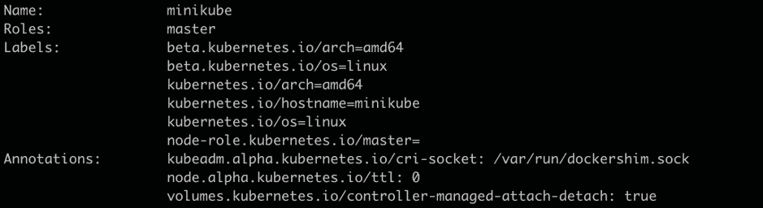

图 17.5：描述 minikube 节点

正如你所看到的，我们想要的标签`data-center=sydney`并不存在。

1.  现在，让我们使用这个命令将期望的标签应用到我们的节点上：

```
kubectl label node minikube data-center=sydney
```

你会看到以下响应，表明节点已被标记：

```
node/minikube labeled
```

1.  使用`describe`命令验证标签是否应用到节点上：

```
kubectl describe node minikube
```

你应该看到以下响应：

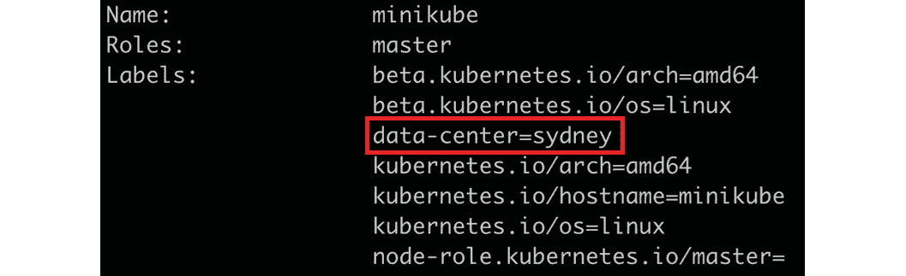

图 17.6：检查 minikube 节点上的标签

正如你在这张图片中看到的，我们的标签现在已经被应用。

1.  现在再次尝试运行 Pod，看看它是否可以被执行：

```
kubectl create -f pod-with-node-affinity.yaml -n schedulerdemo
```

你应该看到以下响应：

```
pod/pod-with-node-affinity created
```

1.  现在，让我们检查一下 Pod 是否成功运行：

```
kubectl get pods -n schedulerdemo
```

你应该看到以下响应：

```
NAME                     READY    STATUS     RESTARTS   AGE
pod-with-node-affinity   1/1      Running    0          5m22s
```

因此，我们的 Pod 成功运行。

1.  让我们来看看 `events` 中如何显示 Pod 调度：

```
kubectl get events -n schedulerdemo
```

你将得到以下响应：

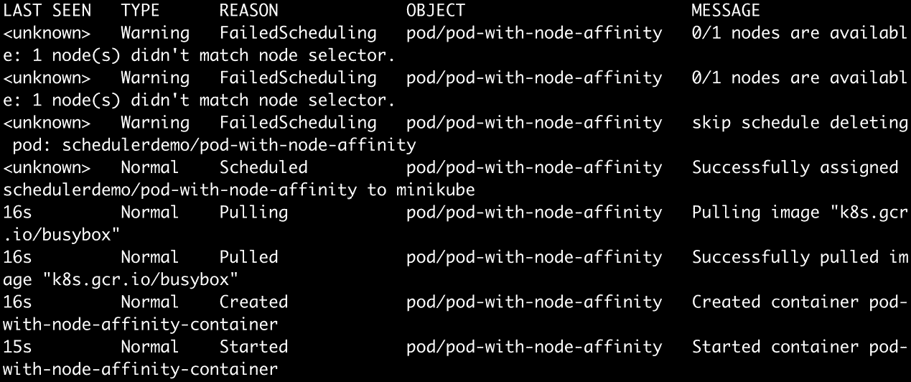

图 17.7：查看调度事件

正如你在前面的输出中看到的，Pod 已成功调度。

1.  现在，让我们进行一些清理工作，以避免与进一步的练习和活动发生冲突。使用以下命令删除 Pod：

```
kubectl delete pod pod-with-node-affinity -n schedulerdemo
```

你应该看到以下响应：

```
pod "pod-with-node-affinity" deleted
```

1.  使用以下命令从节点中删除标签：

```
kubectl label node minikube data-center-
```

请注意，从 Pod 中删除标签的语法在标签名称后有一个额外的连字符（`–`）。你应该看到以下响应：

```
node/minikube labeled
```

在这个练习中，我们已经看到了节点亲和力是如何工作的，通过给节点贴标签，然后在贴有标签的节点上调度 Pod。我们还看到了 Kubernetes 事件如何用于查看 Pod 调度的状态。

在这个练习中我们使用的 `data-center=sydney` 标签也暗示了一个有趣的用例。我们可以使用节点亲和性和反亲和性规则来定位不仅特定的 Pod，还有特定的服务器机架或数据中心。我们只需为特定服务器机架、数据中心、可用区等的所有节点分配特定的标签。然后，我们可以简单地挑选所需的目标来为我们的 Pod。

# Pod 亲和性和反亲和性

Pod 亲和力和 Pod 反亲和力允许你的 Pod 在被调度到节点之前检查在该节点上运行的其他 Pod。请注意，在这种情况下，其他 Pod 并不意味着相同 Pod 的新副本，而是与不同工作负载相关的 Pod。

Pod 亲和力允许你控制 Pod 有资格被调度到哪个节点，这取决于已经在该节点上运行的其他 Pod 的标签。其想法是满足在同一位置放置两种不同类型的容器的需求，或者将它们分开。

假设您的应用程序有两个组件：前端部分（例如 GUI）和后端（例如 API）。假设您希望将它们运行在同一主机上，因为如果前端和后端 Pod 在同一节点上托管，它们之间的通信将更快。在多节点集群（而不是 Minikube）上，默认情况下，调度程序将在不同的节点上调度这样的 Pod。Pod 亲和提供了一种控制 Pod 相对于彼此的调度的方式，以便我们可以确保应用程序的最佳性能。

定义 Pod 亲和需要两个组件。第一个组件定义了调度程序如何将目标 Pod（在我们之前的示例中，前端 Pod）与已经运行的 Pod（后端 Pod）相关联。这是通过 Pod 上的标签完成的。在 Pod 亲和规则中，我们提到了应该用于与新 Pod 相关联的其他 Pod 的哪些标签。标签选择器具有与节点亲和和反亲和部分中描述的类似操作符，用于匹配 Pod 的标签。

第二个组件描述了您希望在哪里运行目标 Pod。就像我们在前面的练习中看到的那样，我们可以使用 Pod 亲和规则将 Pod 调度到与其他 Pod 相同的节点（在我们的示例中，我们假设后端 Pod 是已经在运行的 otherPod），与其他 Pod 相同机架上的任何节点，与其他 Pod 相同数据中心的任何节点等等。该组件定义了 Pod 可以分配的节点集。为了实现这一点，我们对节点组进行标记，并在 Pod 规范中将此标签定义为`topologyKey`。例如，如果我们将主机名作为`topologyKey`的值，Pod 将被放置在同一节点上。

如果我们使用机架名称对节点进行标记，并将机架名称定义为`topologyKey`，那么候选 Pod 将被调度到具有相同机架名称标签的节点之一。

与前一节中定义的节点亲和规则类似，硬亲和规则和软亲和规则也存在。硬规则使用`requiredDuringSchedulingIgnoredDuringExecution`进行定义，而软规则使用`preferredDuringSchedulingIgnoredDuringExecution`进行定义。Pod 亲和配置中可能存在多种硬和软规则的组合。

## 练习 17.02：使用 Pod 亲和运行 Pod

在这个练习中，我们将看到 Pod 亲和性如何帮助调度器查看不同 Pod 之间的关系，并将它们分配到合适的节点上。我们将使用`preferred`选项放置 Pod。在这个练习的后面部分，我们将使用`required`选项配置 Pod 反亲和性，并看到直到满足所有标准为止，该 Pod 都不会被调度。我们将使用前面提到的前端和后端 Pod 的相同示例：

1.  我们需要首先创建并运行后端 Pod。创建一个名为`pod-with-pod-affinity-first.yaml`的文件，内容如下：

```
apiVersion: v1
kind: Pod
metadata:
  name: pod-with-pod-affinity
  labels:
     application-name: banking-app
spec:
  containers:
    - name: pod-with-node-pod-container
      image: k8s.gcr.io/busybox
      command: [ "/bin/sh", "-c", "while :; do echo 'this is         backend pod'; sleep 5 ; done" ]
```

这个 Pod 是一个简单的 Pod，只是循环打印一条消息。请注意，我们为 Pod 分配了一个标签，以便它与前端 Pod 相关联。

1.  让我们创建上一步中定义的 Pod：

```
kubectl create -f pod-with-pod-affinity-first.yaml -n schedulerdemo
```

您应该看到以下响应：

```
pod/pod-with-pod-affinity created
```

1.  现在，让我们看看 Pod 是否已成功创建：

```
kubectl get pods -n schedulerdemo
```

您应该看到这样的响应：

```
NAME                     READY    STATUS    RESTARTS   AGE
pod-with-pod-affinity    1/1      Running   0          22s
```

1.  现在，让我们检查`minikube`节点上的标签：

```
kubectl describe node minikube
```

您应该看到以下响应：

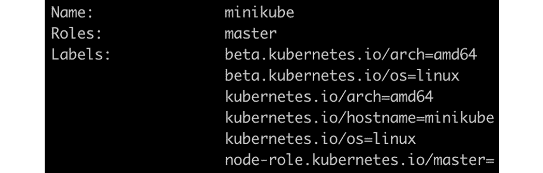

图 17.8：描述 minikube 节点

由于我们希望在同一台主机上运行这两个 Pod，我们可以使用节点的`kubernetes.io/hostname`标签。

1.  现在，让我们定义第二个 Pod。创建一个名为`pod-with-pod-affinity-second.yaml`的文件，内容如下：

```
apiVersion: v1
kind: Pod
metadata:
  name: pod-with-pod-affinity-fe
  labels:
     application-name: banking-app
spec:
  affinity:
   podAffinity: 
     preferredDuringSchedulingIgnoredDuringExecution: 
     - weight: 100
       podAffinityTerm:
         labelSelector:
           matchExpressions:
           - key: application-name
             operator: In 
             values:
             - banking-app
         topologyKey: kubernetes.io/hostname
  containers:
    - name: pod-with-node-pod-container-fe
      image: k8s.gcr.io/busybox
      command: [ "/bin/sh", "-c", "while :; do echo 'this is         frontend pod'; sleep 5 ; done" ]
```

将此 Pod 视为前端应用程序。请注意，我们在`podAffinity`部分定义了`preferredDuringSchedulingIgnoredDuringExecution`规则。我们还为 Pod 和节点定义了`labels`和`topologyKey`。

1.  让我们创建上一步中定义的 Pod：

```
kubectl create -f pod-with-pod-affinity-second.yaml -n schedulerdemo
```

您应该看到以下响应：

```
pod/pod-with-pod-affinity-fe created
```

1.  使用`get`命令验证 Pod 的状态：

```
kubectl get pods -n schedulerdemo
```

您应该看到以下响应：

```
NAME                      READY    STATUS    RESTARTS   AGE
pod-with-pod-affinity     1/1      Running   0          7m33s
pod-with-pod-affinity-fe  1/1      Running   0          21s
```

如您所见，`pod-with-pod-affinity-fe` Pod 正在运行。这与普通的 Pod 放置没有太大不同。这是因为在 Minikube 环境中只有一个节点，并且我们使用了`preferredDuringSchedulingIgnoredDuringExecution`来定义 Pod 亲和性，这是匹配标准的软变体。

这个练习的下一步将讨论使用`requiredDuringSchedulingIgnoredDuringExecution`或匹配标准的硬变体的反亲和性，并且您将看到该 Pod 不会达到`Running`状态。

1.  首先，让我们删除`pod-with-pod-affinity-fe` Pod：

```
kubectl delete pod pod-with-pod-affinity-fe -n schedulerdemo
```

您应该看到以下响应：

```
pod "pod-with-pod-affinity-fe" deleted
```

1.  通过列出所有的 Pod 来确认 Pod 已被删除：

```
kubectl get pods -n schedulerdemo
```

您应该看到以下响应：

```
NAME                     READY    STATUS    RESTARTS   AGE
pod-with-pod-affinity    1/1      Running   0          10m
```

1.  现在创建另一个 Pod 定义，内容如下，并将其保存为`pod-with-pod-anti-affinity-second.yaml`：

```
apiVersion: v1
kind: Pod
metadata:
  name: pod-with-pod-anti-affinity-fe
  labels:
     application-name: backing-app
spec:
  affinity:
   podAntiAffinity: 
     requiredDuringSchedulingIgnoredDuringExecution: 
     - labelSelector:
         matchExpressions:
         - key: application-name
           operator: In 
           values:
           - banking-app
       topologyKey: kubernetes.io/hostname   
  containers:
    - name: pod-with-node-pod-anti-container-fe
      image: k8s.gcr.io/busybox
      command: [ "/bin/sh", "-c", "while :; do echo 'this is         frontend pod'; sleep 5 ; done" ]
```

正如您所看到的，配置是针对`podAntiAffinity`，它使用`requiredDuringSchedulingIgnoredDuringExecution`选项，这是 Pod 亲和性规则的硬变体。在这里，调度程序将不会调度任何 Pod，如果条件不满足。我们使用`In`运算符，以便我们的 Pod 不会在与配置的`labelSelector`组件中定义的任何 Pod 相同的主机上运行。

1.  尝试使用上述规范创建 Pod：

```
kubectl create -f pod-with-pod-anti-affinity-second.yaml -n schedulerdemo
```

您应该看到以下响应：

```
pod/pod-with-pod-anti-affinity-fe created
```

1.  现在，检查此 Pod 的状态：

```
kubectl get pods -n schedulerdemo
```

您应该看到以下响应：

```
NAME                           READY  STATUS    RESTARTS   AGE
pod-with-pod-affinity          1/1    Running   0          14m
pod-with-pod-anti-affinity-fe  1/1    Pending   0          3s
```

从这个输出中，您可以看到 Pod 处于`Pending`状态。

1.  您可以通过检查事件来验证 Pod 反亲和性导致 Pod 无法调度：

```
kubectl get events -n schedulerdemo
```

您应该看到以下响应：

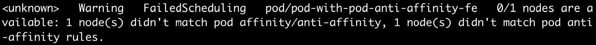

图 17.9：检查调度失败的事件

在这个练习中，我们已经看到 Pod 亲和性如何帮助将两个不同的 Pod 放置在同一个节点上。我们还看到了 Pod 反亲和性选项如何帮助我们在不同的主机集上调度 Pod。

# Pod 优先级

Kubernetes 允许您为 Pod 关联一个优先级。如果存在资源约束，如果请求调度一个具有较高优先级的新 Pod，则 Kubernetes 调度程序可能会驱逐优先级较低的 Pod，以便为新的高优先级 Pod 腾出空间。

考虑一个例子，您是一个集群管理员，您在集群中运行关键和非关键的工作负载。一个例子是银行的 Kubernetes 集群。在这种情况下，您可能会有一个支付服务以及银行的网站。您可能会决定处理付款比运行网站更重要。通过配置 Pod 优先级，您可以防止低优先级的工作负载影响集群中的关键工作负载，特别是在集群开始达到其资源容量的情况下。将低优先级的 Pod 驱逐以安排更关键的 Pod 的技术可能比添加额外的节点更快，并且可以帮助您更好地管理集群上的流量波动。

将 Pod 与优先级关联的方式是定义一个名为`PriorityClass`的对象。该对象包含优先级，定义为 1 到 10 亿之间的数字。数字越高，优先级越高。一旦我们定义了我们的优先级类，我们通过将`PriorityClass`与 Pod 关联来为 Pod 分配优先级。默认情况下，如果 Pod 没有与其关联的优先级类，则 Pod 将被分配默认的优先级类（如果可用），或者将被分配优先级值为 0。

您可以像获取其他对象一样获取优先级类的列表：

```
kubectl get priorityclasses
```

您应该看到以下响应：

```
NAME                     VALUE         GLOBAL-DEFAULT   AGE
system-cluster-critical  2000000000    false            9d
system-node-critical     2000001000    false            9d
```

请注意，在 Minikube 中，环境中预定义了两个优先级类。让我们更多地了解`system-cluster-critical`类。发出以下命令以获取有关它的详细信息：

```
kubectl get pc system-cluster-critical -o yaml
```

您应该看到以下响应：

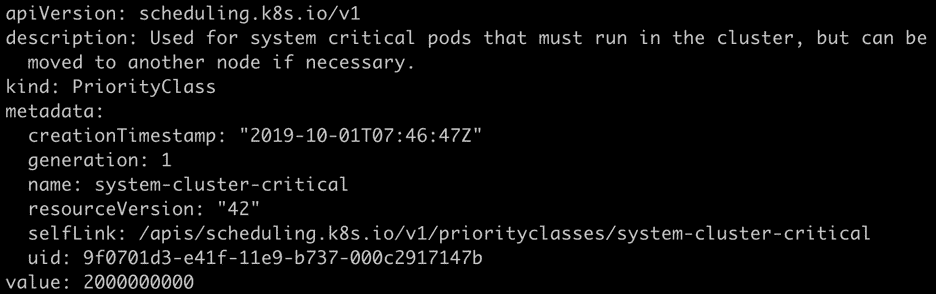

图 17.10：描述 system-cluster-critical PriorityClass

这里的输出提到这个类是为绝对关键的集群 Pod 保留的。etcd 就是这样的一个 Pod。让我们看看这个优先级类是否与它关联。

发出以下命令以获取有关在 Minikube 中运行的 etcd Pod 的详细信息：

```
kubectl get pod etcd-minikube -n kube-system -o yaml
```

您应该看到以下响应：

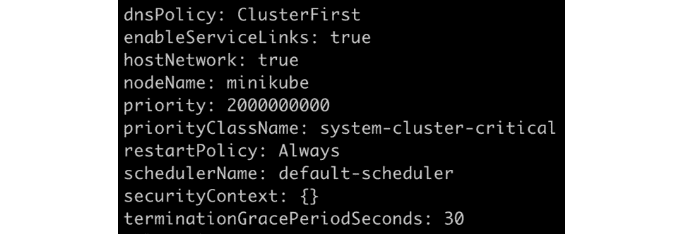

图 17.11：获取有关 etcd-minikube Pod 的信息

您可以从此输出中看到 Pod 已与`system-cluster-critical`优先级关联。

在接下来的练习中，我们将添加一个默认的优先级类和一个更高的优先级类，以更好地理解 Kubernetes 调度程序的行为。

重要的是要理解 Pod 优先级与其他规则（如 Pod 亲和性）协同工作。如果调度程序确定无法安排高优先级的 Pod，即使低优先级的 Pod 被驱逐，它也不会驱逐低优先级的 Pod。

同样，如果高优先级和低优先级的 Pod 正在等待调度，并且调度程序确定由于亲和性或反亲和性规则而无法安排高优先级的 Pod，则调度程序将安排适当的低优先级的 Pod。

## 练习 17.03：Pod 优先级和抢占

在这个练习中，我们将定义两个优先级类：默认（低优先级）和高优先级。然后，我们将创建 10 个具有默认优先级的 Pod，并为每个 Pod 分配一些 CPU 和内存。之后，我们将检查从我们的本地集群中使用了多少容量。然后，我们将创建 10 个具有高优先级的 Pod，并为它们分配资源。我们将看到具有默认优先级的 Pod 将被终止，并且更高优先级的 Pod 将被调度到集群上。然后，我们将把高优先级 Pod 的数量从 10 减少到 5，然后看到一些低优先级的 Pod 再次被调度。这是因为减少高优先级 Pod 的数量应该释放一些资源：

1.  首先，让我们为默认优先级类创建定义。使用以下内容创建一个名为`priority-class-default.yaml`的文件：

```
apiVersion: scheduling.k8s.io/v1
kind: PriorityClass
metadata:
  name: default-priority
value: 1
globalDefault: true
description: "Default Priority class."
```

请注意，我们通过将`globalDefault`的值设置为`true`来将此优先级类标记为默认。此外，优先级数字`1`非常低。

1.  使用以下命令创建此优先级类：

```
kubectl create -f priority-class-default.yaml
```

您应该看到以下响应：

```
priorityclass.scheduling.k8s.io/default-priority
```

请注意，由于此对象不是命名空间级对象，因此我们没有提及命名空间。优先级类是 Kubernetes 中的集群范围对象。

1.  让我们检查一下我们的优先级类是否已经创建：

```
kubectl get priorityclasses
```

您应该看到以下列表：

```
NAME                     VALUE         GLOBAL-DEFAULT   AGE
default-priority         1             true             5m46s
system-cluster-critical  2000000000    false            105d
system-node-critical     2000001000    false            105d
```

在此输出中，您可以看到我们刚刚创建的优先级类的名称为`default-priority`，并且正如您在`GLOBAL-DEFAULT`列中所看到的那样，它是全局默认的。现在创建另一个优先级更高的优先级类。

1.  使用以下内容创建一个名为`priority-class-highest.yaml`的文件：

```
apiVersion: scheduling.k8s.io/v1
kind: PriorityClass
metadata:
  name: highest-priority
value: 100000
globalDefault: false
description: "This priority class should be used for pods with   the highest of priority."
```

请注意此对象中`value`字段的非常高的值。

1.  使用上一步的定义使用以下命令创建一个 Pod 优先级类：

```
kubectl create -f priority-class-highest.yaml
```

您应该看到以下响应：

```
priorityclass.scheduling.k8s.io/highest-priority created
```

1.  现在让我们创建一个具有`10`个 Pod 和默认优先级的部署的定义。使用以下内容创建一个名为`pod-with-default-priority.yaml`的文件来定义我们的部署：

```
apiVersion: apps/v1
kind: Deployment
metadata:
  name: pod-default-priority-deployment
spec:
  replicas: 10
  selector:
    matchLabels:
      app: priority-test

  template:
    metadata:
      labels:
        app: priority-test
    spec:
      containers:
      - name: pod-default-priority-deployment-container
        image: k8s.gcr.io/busybox
        command: [ "/bin/sh", "-c", "while :; do echo 'this is           backend pod'; sleep 5 ; done" ]
      priorityClassName: default-priority
```

1.  让我们创建我们在上一步中定义的部署：

```
kubectl create -f pod-with-default-priority.yaml -n schedulerdemo
```

您应该看到这个响应：

```
deployment.apps/pod-default-priority-deployment created
```

1.  现在，通过使用以下命令将每个 Pod 分配的内存和 CPU 增加到 128 MiB 和 CPU 的 1/10：

```
kubectl set resources deployment/pod-default-priority-deployment --limits=cpu=100m,memory=128Mi -n schedulerdemo
```

您应该看到以下响应：

```
deployment.extensions/pod-default-priority-deployment resource requirements updated
```

注意

您可能需要根据计算机上可用的资源调整此资源分配。您可以从 1/10 的 CPU 开始，并按照*步骤 10*中提到的方式验证资源。

1.  使用以下命令验证 Pod 是否正在运行：

```
kubectl get pods -n schedulerdemo
```

您应该会看到以下 Pod 列表：

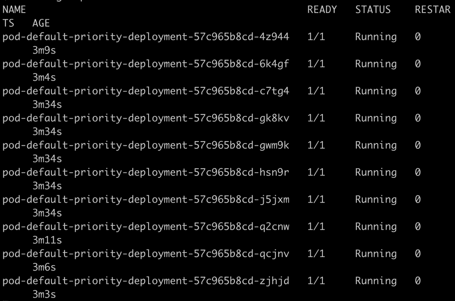

图 17.12：获取 Pod 列表

1.  检查我们集群中的资源使用情况。请注意，我们只有一个节点，因此我们可以通过发出`describe`命令轻松地看到这些值：

```
kubectl describe node minikube
```

以下截图已经被截断以便更好地呈现。在您的输出中找到`分配的资源`部分：

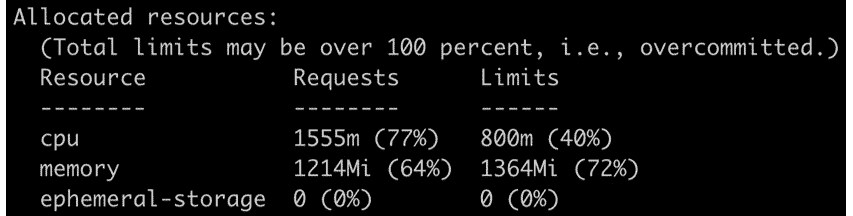

图 17.13：检查 minikube 节点上的资源利用率

请注意，`minikube`主机的 CPU 使用率为 77%，内存使用率为 64%。请注意，资源利用率取决于您计算机的硬件和分配给 Minikube 的资源。如果您的 CPU 太强大，或者您有大量的内存（甚至如果您的 CPU 较慢，内存较少），您可能会看到与我们在这里看到的资源利用率值大不相同。请根据*步骤 8*中提到的方式调整 CPU 和内存资源，以便我们获得与我们在这里看到的类似的资源利用率。这将使您能够看到与我们在本练习的后续步骤中演示的类似结果。

1.  现在让我们安排具有高优先级的 Pod。使用 Kubernetes 部署对象创建 10 个 Pod。为此，请创建一个名为`pod-with-high-priority.yaml`的文件，其中包含以下内容：

```
apiVersion: apps/v1
kind: Deployment
metadata:
  name: pod-highest-priority-deployment
spec:
  replicas: 10
  selector:
    matchLabels:
      app: priority-test

  template:
    metadata:
      labels:
        app: priority-test
    spec:
      containers:
      - name: pod-highest-priority-deployment-container
        image: k8s.gcr.io/busybox
        command: [ "/bin/sh", "-c", "while :; do echo 'this is           backend pod'; sleep 5 ; done" ]
      priorityClassName: highest-priority
```

请注意，在前面的规范中，`priorityClassName`已设置为`highest-priority`类。

1.  现在创建我们在上一步中创建的部署：

```
kubectl create -f pod-with-high-priority.yaml -n schedulerdemo
```

您应该会得到以下输出：

```
deployment.apps/pod-with-highest-priority-deployment created
```

1.  为这些 Pod 分配与具有默认优先级的 Pod 相似的 CPU 和内存量：

```
kubectl set resources deployment/pod-highest-priority-deployment --limits=cpu=100m,memory=128Mi -n schedulerdemo
```

您应该看到以下响应：

```
deployment.apps/pod-highest-priority-deployment resource requirements updated
```

1.  大约一分钟后，运行以下命令以查看正在运行的 Pod：

```
kubectl get pods -n schedulerdemo
```

您应该看到类似于这样的响应：

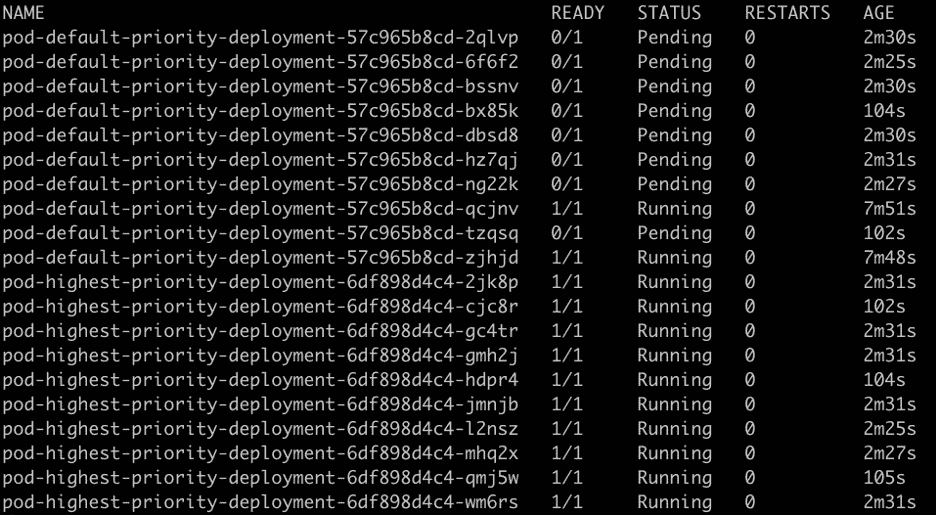

图 17.14：获取 Pod 列表

您可以看到我们大多数高优先级的 Pod 都处于`Running`状态，而低优先级的 Pod 已经移动到`Pending`状态。这告诉我们 Kubernetes 调度程序实际上已经终止了低优先级的 Pod，并且现在正在等待资源再次安排它们。

1.  尝试将高优先级的 Pod 数量从 10 个更改为 5 个，看看是否可以安排额外的低优先级 Pod。使用此命令更改副本的数量：

```
kubectl scale deployment/pod-highest-priority-deployment --replicas=5 -n schedulerdemo
```

您应该看到以下响应：

```
deployment.extensions/pod-highest-priority-deployment scaled
```

1.  使用以下命令验证高优先级的 Pod 是否从 10 个减少到 5 个：

```
kubectl get pods -n schedulerdemo
```

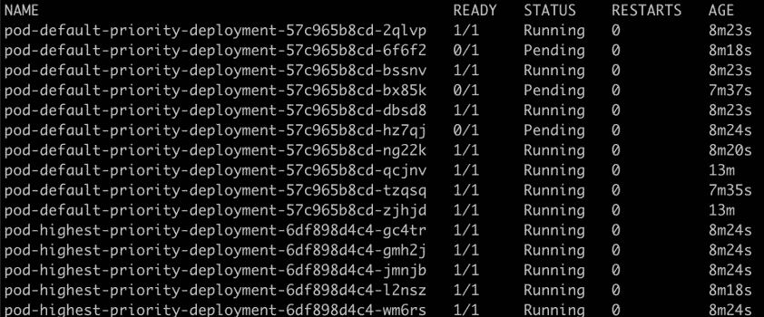

图 17.15：获取 Pod 列表

正如您在此截图中所看到的，一些更低优先级的 Pod 已经从`Pending`状态变为`Running`状态。因此，我们可以看到调度程序正在根据工作负载的优先级来充分利用可用资源。

在这个练习中，我们已经使用了 Pod 优先级规则，并看到了 Kubernetes 调度程序可能会选择终止具有较低优先级的 Pod，如果有对具有较高优先级的 Pod 的请求需要满足。

# 污点和忍受度

之前，我们已经看到 Pod 可以配置以控制它们在哪个节点上运行。现在我们将看到节点如何控制可以在其上运行的 Pod，使用污点和忍受度。

污点阻止了 Pod 的调度，除非该 Pod 具有与之匹配的忍受度。将污点视为节点的属性，而忍受度是 Pod 的属性。只有当 Pod 的忍受度与节点的污点匹配时，Pod 才会被安排在该节点上。节点上的污点告诉调度程序检查哪些 Pod 能容忍污点，并且只运行与节点的污点匹配的 Pod。

污点定义包含键、值和效果。键和值将与 Pod 规范中的 Pod 忍受度定义匹配，而效果指示调度程序一旦节点的污点与 Pod 的忍受度匹配应该执行什么操作。

以下图表提供了一个概述，说明了基于污点和忍受度控制调度的过程是如何工作的。请注意，具有忍受度的 Pod 也可以安排在没有污点的节点上。

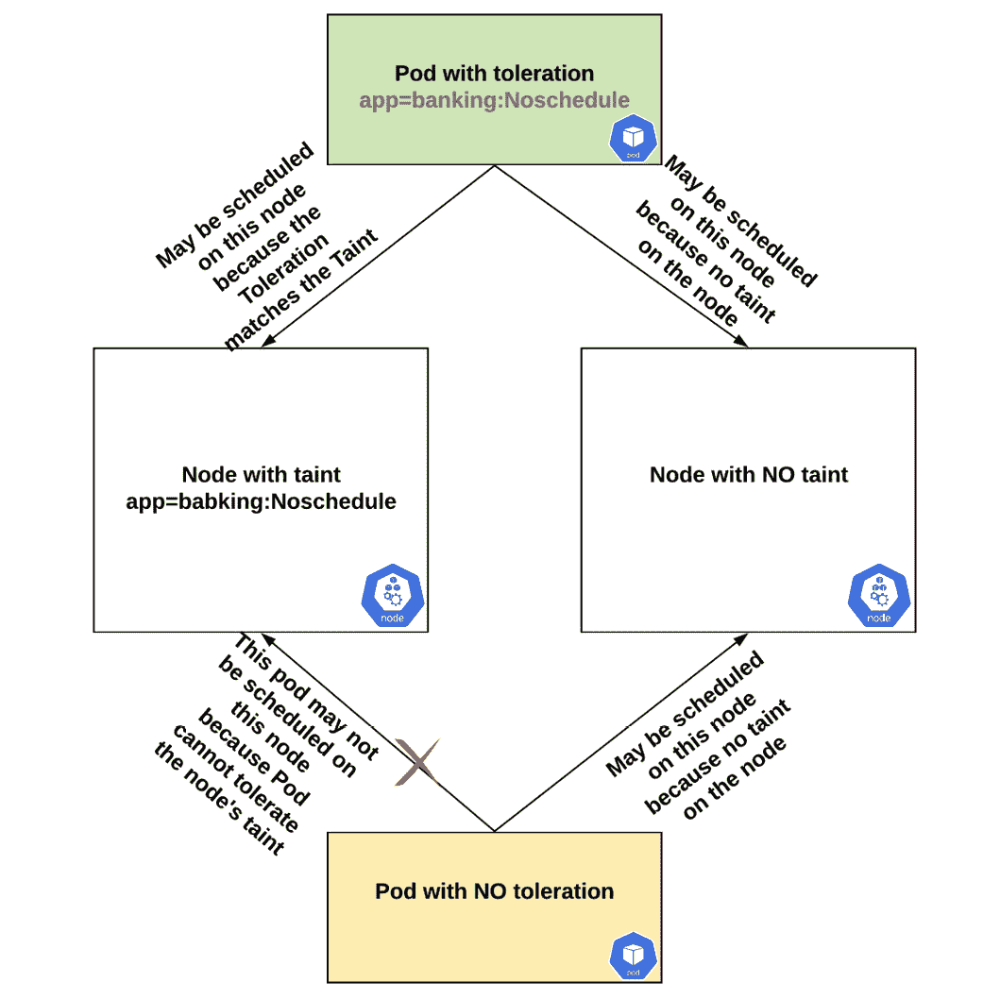

图 17.16：污点和忍受度如何影响调度的概述

当我们定义一个污点时，我们还需要指定污点的行为。这可以通过以下值来指定：

+   `NoSchedule`提供了拒绝在节点上调度新 Pod 的能力。在定义污点之前已经调度的现有 Pod 将继续在节点上运行。

+   `NoExecute`污点提供了抵抗没有与污点匹配的容忍的新 Pod 的能力。它进一步检查所有正在节点上运行的现有 Pod 是否匹配此污点，并删除不匹配的 Pod。

+   `PreferNoSchedule`指示调度器避免在不容忍节点上调度 Pod。这是一个软规则，调度器会尝试找到正确的节点，但如果找不到其他适合定义的污点和容忍规则的节点，它仍会在节点上调度 Pod。

为了对节点应用污点，我们可以使用`kubectl taint`命令，如下所示：

```
kubectl taint nodes <NODE_NAME> <TAINT>:<TAINT_TYPE>
```

可能有很多原因你希望某些 Pod（应用程序）不在特定节点上运行。一个例子可能是需要专门的硬件，比如用于机器学习应用的 GPU。另一个情况可能是 Pod 上的软件的许可限制要求它在特定节点上运行。例如，在你的集群中有 10 个工作节点，只有 2 个节点被允许运行特定软件。使用污点和容忍的组合，你可以帮助调度器在正确的节点上调度 Pod。

## 练习 17.04：污点和容忍

在这个练习中，我们将看到污点和容忍如何允许我们在所需的节点上调度 Pod。我们将定义一个污点，并尝试在节点上调度一个 Pod。然后展示`NoExecute`功能，如果节点上的污点发生变化，Pod 可以从节点中移除：

1.  使用以下命令获取节点列表：

```
kubectl get nodes
```

你应该看到以下节点列表：

```
NAME       STATUS    ROLES    AGE    VERSION
minikube   Ready     master   44h    v1.14.3
```

请记住，在我们的 Minikube 环境中，我们只有一个节点。

1.  使用以下命令为`minikube`节点创建一个污点：

```
kubectl taint nodes minikube app=banking:NoSchedule
```

你应该看到以下响应：

```
node/minikube tainted
```

1.  验证节点是否已正确被污点。你可以使用`describe`命令查看节点上应用了哪些污点：

```
kubectl describe node minikube
```

你应该看到以下响应：

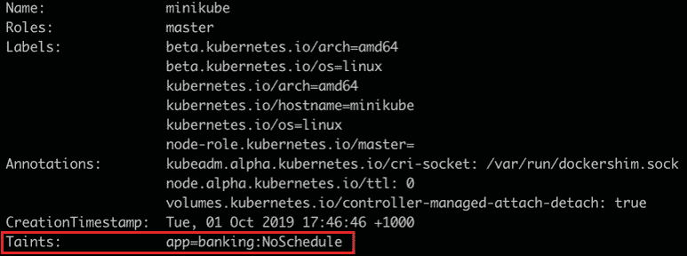

图 17.17：检查 minikube 节点上的污点

1.  现在，我们需要根据污点定义创建一个具有容忍度的 Pod。创建一个名为`pod-toleration-noschedule.yaml`的文件，内容如下：

```
apiVersion: v1
kind: Pod
metadata:
  name: pod-with-node-toleration-noschedule
spec:
  tolerations:
  - key: "app"
    operator: "Equal"
    value: "banking"
    effect: "NoSchedule"
  containers:
    - name: pod-with-node-toleration-noschedule-container
      image: k8s.gcr.io/busybox
      command: [ "/bin/sh", "-c", "while :; do echo '.'; sleep         5 ; done" ]
```

请注意，容忍度值与*步骤 1*中定义的污点相同，即`app=banking`。`effect`属性控制容忍度行为的类型。在这里，我们将`effect`定义为`NoSchedule`。

1.  让我们根据前面的规范创建 Pod：

```
kubectl create -f pod-toleration-noschedule.yaml -n schedulerdemo
```

这应该得到以下响应：

```
pod/pod-with-node-toleration-noschedule created
```

1.  使用以下命令验证 Pod 是否正在运行：

```
kubectl get pods -n schedulerdemo
```

您应该看到以下响应：

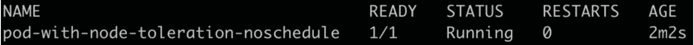

图 17.18：获取 Pod 列表

1.  现在让我们定义一个不匹配节点污点的容忍度的不同 Pod。创建一个名为`pod-toleration-noschedule2.yaml`的文件，内容如下：

```
apiVersion: v1
kind: Pod
metadata:
  name: pod-with-node-toleration-noschedule2
spec:
  tolerations:
  - key: "app"
    operator: "Equal"
    value: "hr"
    effect: "NoSchedule"
  containers:
    - name: pod-with-node-toleration-noschedule-container2
      image: k8s.gcr.io/busybox
      command: [ "/bin/sh", "-c", "while :; do echo '.'; sleep         5 ; done" ]
```

请注意，这里我们将容忍度设置为`app=hr`。我们需要一个具有相同污点以匹配此容忍度的 Pod。由于我们已经用`app=banking`污点了我们的节点，这个 Pod 不应该被调度程序调度。让我们在以下步骤中尝试一下。

1.  使用上一步的定义创建 Pod：

```
kubectl create -f pod-toleration-noschedule2.yaml -n schedulerdemo
```

这应该得到以下响应：

```
pod/pod-with-node-toleration-noschedule2 created
```

1.  使用以下命令检查 Pod 的状态：

```
kubectl get pods -n schedulerdemo
```

您应该看到以下响应：

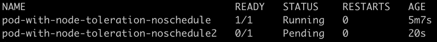

图 17.19：获取 Pod 列表

您可以看到 Pod 处于`Pending`状态，而不是`Running`状态。

1.  在本练习的剩余部分中，我们将看到`NoExecute`效果如何指示调度程序甚至在将 Pod 调度到节点后将其删除。在此之前，我们需要进行一些清理。使用以下命令删除两个 Pod：

```
kubectl delete pod pod-with-node-toleration-noschedule pod-with-node-toleration-noschedule2 -n schedulerdemo
```

您应该看到以下响应：

```
pod "pod-with-node-toleration-noschedule" deleted
pod "pod-with-node-toleration-noschedule2" deleted
```

1.  使用以下命令从节点中删除污点：

```
kubectl taint nodes minikube app:NoSchedule-
```

请注意命令末尾的连字符（`-`），它告诉 Kubernetes 删除此标签。您应该看到以下响应：

```
node/minikube untainted
```

我们的节点处于未定义污点的状态。现在，我们想先以`app=banking`的容忍度运行一个 Pod 并分配该 Pod。一旦 Pod 处于`Running`状态，我们将从节点中删除污点并查看 Pod 是否已被删除。

1.  现在，再次使用`NoExecute`类型对节点进行污染：

```
kubectl taint nodes minikube app=banking:NoExecute
```

您应该看到以下响应：

```
node/minikube tainted
```

1.  现在，我们需要定义一个具有匹配容忍度的 Pod。创建一个名为`pod-toleration-noexecute.yaml`的文件，内容如下：

```
apiVersion: v1
kind: Pod
metadata:
  name: pod-with-node-toleration-noexecute
spec:
  tolerations:
  - key: "app"
    operator: "Equal"
    value: "banking"
    effect: "NoExecute"
  containers:
    - name: pod-with-node-toleration-noexecute-container
      image: k8s.gcr.io/busybox
      command: [ "/bin/sh", "-c", "while :; do echo '.'; sleep         5 ; done" ]
```

请注意，`tolerations`部分将标签定义为`app=banking`，效果定义为`NoExecute`。

1.  使用以下命令创建我们在上一步中定义的 Pod：

```
kubectl create -f pod-toleration-noexecute.yaml -n schedulerdemo
```

您应该看到以下响应：

```
pod/pod-with-node-toleration-noexecute created
```

1.  使用以下命令验证 Pod 是否处于`Running`状态：

```
kubectl get pods -n schedulerdemo
```

您应该看到以下响应：

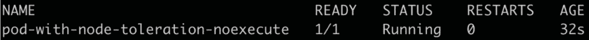

图 17.20：获取 Pod 列表

1.  现在使用以下命令从节点中删除污点：

```
kubectl taint nodes minikube app:NoExecute-
```

请注意此命令末尾的连字符（`-`），它告诉 Kubernetes 删除污点。您将看到以下响应：

```
node/minikube untainted
```

如前所述，具有容忍度的 Pod 可以附加到没有污点的节点。删除污点后，Pod 仍将被执行。请注意，我们尚未删除 Pod，它仍在运行。

1.  现在，如果我们向节点添加一个带有`NoExecute`的新污点，Pod 应该会从中删除。要查看此操作，请添加一个与 Pod 容忍度不同的新污点：

```
kubectl taint nodes minikube app=hr:NoExecute
```

如您所见，我们已将`app=hr`污点添加到 Pod 中。您应该看到以下响应：

```
node/minikube tainted
```

1.  现在，让我们检查一下 Pod 的状态：

```
kubectl get pods -n schedulerdemo
```

您将看到以下响应：

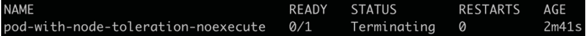

图 17.21：检查我们的 Pod 的状态

Pod 将被删除或进入`Terminating`（标记为删除）状态。几秒钟后，Kubernetes 将删除 Pod。

在这个练习中，您已经看到我们如何在节点上配置污点，以便它们只接受特定的 Pod。您还配置了污点以影响正在运行的 Pod。

# 使用自定义 Kubernetes 调度程序

构建自己的功能齐全的调度程序超出了本研讨会的范围。但是，重要的是要理解，Kubernetes 平台允许您编写自己的调度程序，如果您的用例需要，尽管不建议使用自定义调度程序，除非您有非常专业的用例。

自定义调度程序作为普通 Pod 运行。您可以在运行应用程序的 Pod 的定义中指定使用自定义调度程序。您可以在 Pod 规范中添加一个`schedulerName`字段，其中包含自定义调度程序的名称，如此示例定义所示：

```
apiVersion: v1
kind: Pod
metadata:
  name: pod-with-custom-scheduler
spec:
  containers:
    - name: mutating-pod-example-container
      image: k8s.gcr.io/busybox
      command: [ "/bin/sh", "-c", "while :; do echo '.'; sleep 5 ;         done" ]
  schedulerName: "custom-scheduler"
```

为使此配置工作，假定集群中有一个名为`custom-scheduler`的自定义调度程序。

## 活动 17.01：配置 Kubernetes 调度程序以安排 Pod

假设您是 Kubernetes 集群的管理员，并且您面临以下情景：

1.  有一个 API Pod 提供当前的货币转换率。

1.  有一个 GUI Pod 在网站上显示转换率。

1.  有一个 Pod 为股票交易所提供实时货币转换率的服务。

您被要求确保 API 和 GUI Pod 在同一节点上运行。您还被要求在流量激增时给予实时货币转换器 Pod 更高的优先级。在此活动中，您将控制 Kubernetes 调度程序的行为以完成此活动。

此活动中的每个 Pod 应分配 0.1 CPU 和 100 MiB 内存。请注意，我们已经将 Pod 命名为 API、GUI 和实时，以便操作更简单。此活动中的 Pod 预计只会在控制台上打印表达式。您可以为它们全部使用 `k8s.gcr.io/busybox` 镜像。

注意

在开始此活动之前，请确保节点没有从之前的练习中被污染。要了解如何去除污点，请参阅本章的“练习 17.01”中的“步骤 15”，“在节点亲和性下运行 Pod”。

以下是此活动的一些指南：

1.  创建一个名为`scheduleractivity`的命名空间。

1.  为 API Pod 创建 Pod 优先级。

1.  部署并确保 API 和 GUI Pod 使用 Pod 亲和性在同一节点上。GUI Pod 应定义与 API Pod 在同一节点上的亲和性。

1.  将 API 和 GUI Pod 的副本扩展到各自的两个。

1.  为实时货币转换器 Pod 创建一个 Pod 优先级。确保之前定义的 API Pod 优先级低于实时 Pod，但大于 0。

1.  部署并运行一个实时货币转换器 Pod，副本数为 1。

1.  确保所有 Pod 都处于“运行”状态。

1.  现在，将实时货币转换器 Pod 的副本数量从 1 增加到 10。

1.  查看实时货币转换器 Pod 是否正在启动，GUI Pod 是否正在被驱逐。如果没有，请继续以 5 的倍数增加实时 Pod。

1.  根据您的资源和 Pod 的数量，调度程序可能会开始驱逐 API Pod。

1.  将实时 Pod 的副本数量从 10 减少到 1，并确保 API 和 GUI Pod 被重新调度到集群上。

完成活动后，预计 API 和 GUI Pod 每个将处于“运行”状态，以及一个实时 Pod，如下截图所示：

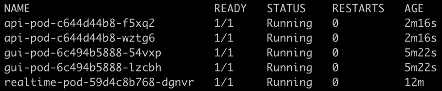

图 17.22：活动 17.01 的预期输出

请注意，您的输出将根据系统资源而变化，因此您可能看不到与此截图完全相同的内容。

注意

此活动的解决方案可以在以下地址找到：[`packt.live/304PEoD`](https://packt.live/304PEoD)。

# 总结

Kubernetes 调度器是一个强大的软件，它抽象了在集群上为 Pod 选择合适节点的工作。调度器会监视未调度的 Pod，并尝试为它们找到合适的节点。一旦找到一个适合的节点，它会通过 API 服务器更新 etcd，表示该 Pod 已绑定到该节点。

随着 Kubernetes 的每一个发布，调度器都得到了成熟。调度器的默认行为对各种工作负载已经足够，尽管您也看到了许多定制调度器与 Pod 关联资源的方式。您已经看到了节点亲和性如何帮助您在所需的节点上调度 Pod。Pod 亲和性可以帮助您相对于另一个 Pod 调度一个 Pod，这对于多个模块被放置在一起的应用程序是一个很好的工具。污点和容忍也可以帮助您将特定的工作负载分配给特定的节点。您还看到了 Pod 优先级如何帮助您根据集群中可用的总资源调度工作负载。

在下一章中，我们将升级一个 Kubernetes 集群，实现零停机。如果您在集群中使用本章展示的任何技术配置了自定义调度，您可能需要相应地计划升级。由于升级将逐个关闭一个工作节点，可能会导致一些 Pod 由于您的配置而变得不可调度，这可能不是一个可接受的解决方案。
