# 第十八章： 在没有停机的情况下升级你的集群

概述

在本章中，我们将讨论如何在没有停机的情况下升级你的集群。我们将首先了解保持你的 Kubernetes 集群最新的需求。然后，我们将了解基本的应用部署策略，可以帮助实现 Kubernetes 集群的零停机升级。然后，我们将通过在没有应用停机的情况下对 Kubernetes 集群进行升级来将这些策略付诸实践。

# 介绍

我们在第十一章《构建你自己的 HA 集群》中学习了如何在 AWS 上使用 kops 搭建多节点 Kubernetes 平台。在本章中，你将学习如何将 Kubernetes 平台升级到新版本。我们将通过实际示例为你演示升级 Kubernetes 平台所需的步骤。这些练习还将使你具备维护 Kubernetes 集群所需的技能。

不同的组织以不同的方式设置和维护他们的 Kubernetes 集群。在第十二章《你的应用和 HA》中，你看到了设置集群的多种方式。我们将介绍一个简单的技术来升级你的集群，根据你处理的集群的不同，你需要采取的确切技术和步骤可能会有所不同，尽管我们在这里提到的基本原则和预防措施将适用于你升级集群的方式。

# 升级你的 Kubernetes 集群的需求

建立起你的业务应用并将其推向世界只是游戏的一半。让你的应用能够以安全、可扩展和一致的方式被客户使用是另一半，也是你必须不断努力的一半。为了能够很好地执行这另一半，你需要一个坚固的平台。

在当今竞争激烈的环境中，及时向客户提供最新功能对于让你的业务获得优势至关重要。这个平台不仅必须可靠，还必须提供新的和更新的功能，以满足运行现代应用的需求。Kubernetes 是一个快速发展的平台，非常适合这样一个动态的环境。Kubernetes 的开发和进步速度可以从官方 Kubernetes GitHub 存储库的提交数量中得到证明。让我们来看一下下面的截图：

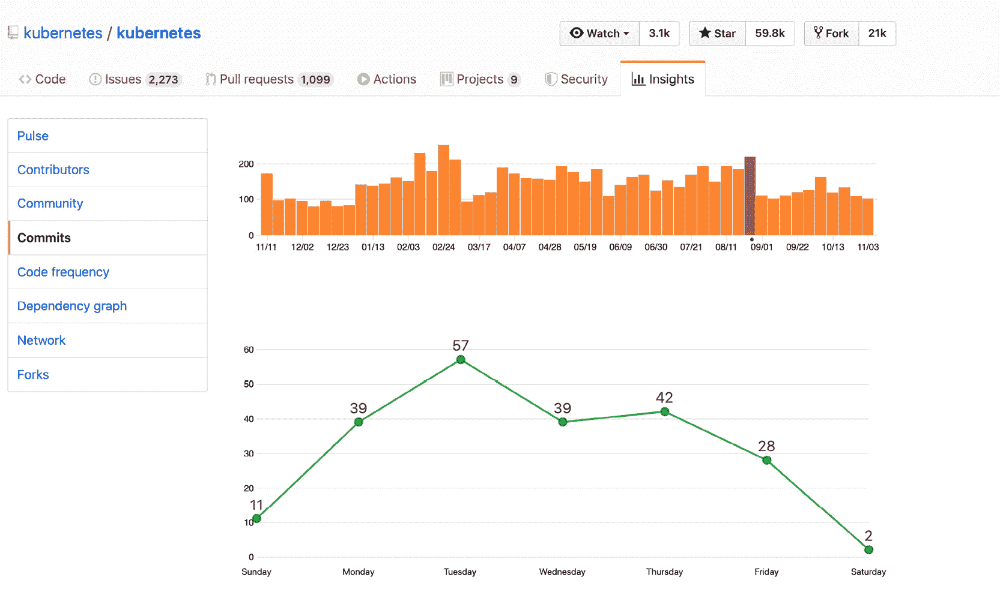

图 18.1：2019 年 8 月 25 日至 31 日期间对 Kubernetes 项目的每日提交

橙色条形图代表每周的提交次数，您可以看到平均每周超过 100 次。下面的绿线图显示了 8 月 25 日至 8 月 31 日的提交次数。仅在一个星期的星期二就有超过 50 次提交。

到目前为止，很明显 Kubernetes 正在快速发展，但您可能仍然不确定是否需要更新集群上的 Kubernetes 版本。以下是一些重要原因，说明为什么保持平台更新至关重要：

+   **新功能**：Kubernetes 社区不断添加新功能，以满足现代应用程序的需求。您的软件团队可能会开发一个依赖于较新 Kubernetes 功能的新软件组件。因此，坚持使用较旧版本的 Kubernetes 将阻碍*您*软件的开发。

+   **安全补丁**：Kubernetes 平台中有许多组件在不断变化。不仅需要修补 Kubernetes 二进制文件，还需要修补许多 Linux 功能，如 iptables 和 cgroups。如果 Kubernetes 使用的任何组件存在漏洞，您可能需要修补底层组件，如操作系统本身。以一种一致的方式进行升级对于尽可能保持 Kubernetes 生态系统的安全性非常重要。

例如，在 Kubernetes API 服务器的 1.0–1.12 版本中存在一个漏洞，导致 API 服务器可能因为无效的 YAML 或 JSON 负载而消耗大量资源。您可以在此链接找到有关此漏洞的更多详细信息：[`cve.mitre.org/cgi-bin/cvename.cgi?name=CVE-2019-11253`](https://cve.mitre.org/cgi-bin/cvename.cgi?name=CVE-2019-11253)

+   **更好地处理现有功能**：Kubernetes 团队不仅添加新功能，还不断改进现有功能以提高稳定性和性能。这些改进可能对您现有的应用程序或自动化脚本有用。因此，从这个角度来看，保持平台更新也是一个好主意。

# Kubernetes 组件 – 复习

到目前为止，您已经了解了 Kubernetes 平台的基本组件。作为一个复习，让我们重新审视一下主要组件：

+   API 服务器负责公开 RESTful Kubernetes API，并且是无状态的。您集群上的所有用户、Kubernetes 主控组件、kubectl 客户端、工作节点，甚至可能是您的应用程序都需要与 API 服务器进行交互。

+   键值存储（etcd 服务器）存储对象并为 API 服务器提供持久后端。

+   调度程序和控制器管理器用于实现集群的状态和存储在 etcd 中的对象。

+   kubelet 是在每个工作节点上运行的程序，类似于代理，按照 Kubernetes 主控组件的指示执行工作。

当我们更新平台时，正如您将在后面的部分中看到的，我们将利用这些组件并将它们作为单独的模块进行升级。

## 警告

Kubernetes 版本标记为 `A.B.C`，遵循语义化版本概念。`A` 是主要版本，`B` 是次要版本，`C` 是补丁发布。根据 Kubernetes 文档，"*在* [*高可用 (HA) 集群*](https://kubernetes.io/docs/setup/production-environment/tools/kubeadm/high-availability/) *中，最新和最旧的 kube-apiserver 实例必须在一个次要版本内。*'

在规划升级时，以下是最安全的方法：

+   始终首先升级到当前次要版本的最新修补版本。例如，如果您使用的是 `1.14.X`，首先升级到 `1.14.X` 发行系列的最新可用版本。这将确保平台已应用了该集群版本的所有可用修复程序。最新的修补程序可能有 bug 修复，这可能为您提供通往下一个次要版本的更顺畅的路径，在我们的示例中将是 `1.15.X`。

+   升级到下一个次要版本。尽量避免跨越多个次要版本，即使可能，因为通常 API 兼容性在一个次要发布版本内。在升级过程中，Kubernetes 平台将同时运行两个不同版本的 API，因为我们一次只升级一个节点。例如，最好从 `1.14` 升级到 `1.15`，而不是升级到 `1.16`。

另一个重要的事情要考虑的是，看看新版本是否需要来自底层 Linux 操作系统的一些更新的库。尽管一般来说，补丁版本不需要任何底层组件的升级，但保持底层操作系统的最新状态也应该是您的首要任务，以为 Kubernetes 平台提供一个安全和一致的环境。

# 升级过程

在这一部分，您将看到升级 Kubernetes 平台所需的步骤。请注意，这里不涵盖升级底层操作系统。为了满足零停机升级的要求，您必须拥有一个具有至少三个主节点和 etcd 服务器的 HA Kubernetes 集群，这样可以实现无摩擦的升级。该过程将使三个节点中的一个脱离集群并进行升级。然后升级后的组件将重新加入集群，然后我们将对第二个节点应用升级过程。由于在任何给定时间，至少有两个服务器保持可用，因此在升级过程中集群将保持可用。

## kops 的一些考虑因素

我们已经在*第十一章*中指导您创建了一个 HA Kubernetes 集群。因此，在本章中，我们将指导您升级相同的集群。

如该章节中所述，部署和管理 Kubernetes 集群有各种方式。我们选择了 kops，它具有用于升级 Kubernetes 组件的内置工具。我们将在本章中利用它们。

kops 的版本设置为与其实现的 Kubernetes 的次要版本类似。例如，kops 版本`1.14.x`实现了 Kubernetes 版本`1.14.x`。有关更多详细信息，请参阅此链接：[`kops.sigs.k8s.io/welcome/releases/`](https://kops.sigs.k8s.io/welcome/releases/)。

注意

在我们在*第十一章*中创建的 HA 集群中，我们部署了三个主节点，这些节点承载了所有 Kubernetes 主平面组件，包括 etcd。

## 升级过程概述

整个升级过程可以用图表总结如下：

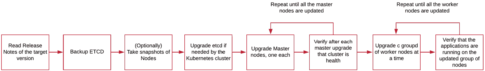

图 18.2：推荐的升级过程

在我们继续实施之前，让我们快速查看每个步骤：

1.  阅读发布说明

这些将指示在升级过程中可能需要的任何特殊注意事项。每个版本的发布说明都可以在 GitHub 的此链接上找到：[`github.com/kubernetes/kubernetes/tree/master/CHANGELOG`](https://github.com/kubernetes/kubernetes/tree/master/CHANGELOG)。

1.  **备份 etcd 数据存储**

正如您之前学到的那样，etcd 存储了集群的整个状态。etcd 的备份可以让您在需要时恢复数据存储的状态。

1.  **备份节点作为可选的故障保护**

如果升级过程不顺利，并且您想要恢复到先前的状态，这可能会派上用场。云供应商（如 AWS、GCP、Azure 等）使您能够对主机进行快照。如果您在私有数据中心运行并为您的机器使用虚拟化技术，您的虚拟化提供商（例如 VMware）可能会提供工具来对节点进行快照。在开始升级 Kubernetes 平台之前，进行快照超出了本书的范围，但尽管如此，这是一个有用的步骤。

1.  如有必要，升级 etcd

用于部署和管理 Kubernetes 集群的工具的更新版本（例如我们的 kops）通常会自动处理这一点。即便如此，这是一个重要的考虑因素，特别是如果您没有使用 kops 等工具。

检查并验证新版本的 Kubernetes 是否需要不同版本的 etcd 存储。这并不总是必要的，但根据您的版本可能需要。例如，Kubernetes 版本`1.13`需要 etcd v3，而较早版本可以使用 etcd v2。

通过阅读发布说明（*步骤 1*）可以确定是否需要升级 etcd。例如，当较早版本的 etcd 在 1.13 版本中被淘汰时，在发布说明中明确提到了这一点：[`github.com/kubernetes/kubernetes/blob/master/CHANGELOG/CHANGELOG-1.13.md#urgent-upgrade-notes`](https://github.com/kubernetes/kubernetes/blob/master/CHANGELOG/CHANGELOG-1.13.md#urgent-upgrade-notes)。

1.  升级主要组件

登录到堡垒主机，并根据期望的 Kubernetes 版本升级 kops 的版本。这个兼容矩阵应该是一个有用的指南：[`kops.sigs.k8s.io/welcome/releases/#compatibility-matrix`](https://kops.sigs.k8s.io/welcome/releases/#compatibility-matrix)。

在第一个主节点上运行升级，验证其是否正确更新，然后对所有其他主节点重复相同的步骤。

1.  升级工作节点组

正如您在*第十一章*，*构建您自己的 HA 集群*中看到的，kops 允许您使用实例组来管理节点，这与 AWS 的自动扩展组相关联。在工作节点的第一个实例组上运行升级。要验证节点是否成功升级，您需要检查节点是否升级到所需版本的 Kubernetes，以及是否在升级后的节点上调度了 pod。对所有其他工作节点的实例组重复相同的步骤。

1.  **验证升级过程是否成功**

检查所有节点是否已升级，并且所有应用程序是否按预期运行。

## 自动化的重要性

从概述中可以看出，升级集群需要几个步骤。考虑到发布和补丁的数量，您可能经常需要这样做。由于该过程有很好的文档记录，强烈建议您考虑使用自动化工具，如 Ansible 或 Puppet，来自动化整个过程。所有前面的步骤都可以完全自动化，您可以重复升级集群的方式。但是，本章不涵盖自动化，因为这超出了本书的范围。

## 备份 etcd 数据存储

etcd 存储整个集群的状态。因此，对 etcd 进行快照可以让我们将整个集群恢复到快照被拍摄时的状态。如果您想将集群恢复到先前的状态，这可能会很有用。

注意

在开始任何练习之前，请确保按照*第十一章*，*构建您自己的 HA 集群*中的说明设置并可用集群，并且您可以通过 SSH 从计算机访问节点。还建议您在开始升级过程之前对节点进行快照。这是特别有益的，因为在本章中，您将对集群进行两次升级-一次在练习期间，一次在活动期间。

现在，在我们进行第一个练习之前，我们需要更多地了解 etcd。它的工作方式是在您的集群中作为一个 pod 在`kube-system`命名空间中运行（正如您在*第二章*，*Kubernetes 概述*中看到的），并公开一个 API，用于向其写入数据。每当 Kubernetes API 服务器想要将任何数据持久化到 etcd 时，它将使用 etcd 的 API 来访问它。

为了备份 etcd，我们还需要访问其 API 并使用内置函数保存快照。为此，我们将使用一个名为`etcdctl`的命令行客户端，它已经存在于 etcd pod 中。对于我们的目的，不需要详细介绍此工具和 etcd API，因此我们不在本书中包含它。您可以在此链接了解更多信息：[`github.com/etcd-io/etcd/tree/master/etcdctl`](https://github.com/etcd-io/etcd/tree/master/etcdctl)。

现在，让我们看看如何在以下练习中使用 etcdctl 来备份 etcd。

## 练习 18.01：对 etcd 数据存储进行快照

在这个练习中，我们将看到如何对 etcd 存储进行快照。如前一节所述，根据您的升级路径，可能不需要手动升级 etcd，但备份 etcd 是必不可少的。对于此操作和所有后续的练习和活动，请使用相同的机器（您的笔记本电脑或台式机），您用来执行*练习 11.01*，*设置我们的 Kubernetes 集群*。

1.  我们已经使用 kops 安装了集群。Kops 使用两个不同的 etcd 集群 - 一个用于 Kubernetes 组件生成的事件，另一个用于其他所有内容。您可以通过发出以下命令来查看这些 pods：

```
kubectl get pods -n kube-system | grep etcd-manager
```

这应该获取 etcd pods 的详细信息。您应该看到类似以下的输出：

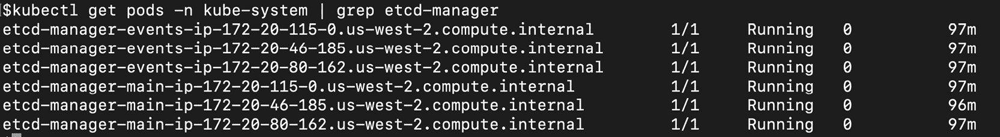

图 18.3：获取 etcd-manager pods 的列表

1.  默认情况下，kops 的`etcd-manager`功能每 15 分钟创建一次备份。备份的位置与 kops 工具使用的 S3 存储相同。在*练习 11.01*中，您配置了 S3 存储桶以存储 kops 的状态。让我们查询存储桶，看看那里是否有备份可用：

```
aws s3api list-objects --bucket $BUCKET_NAME | grep backups/etcd/main
```

您应该看到类似这样的响应：

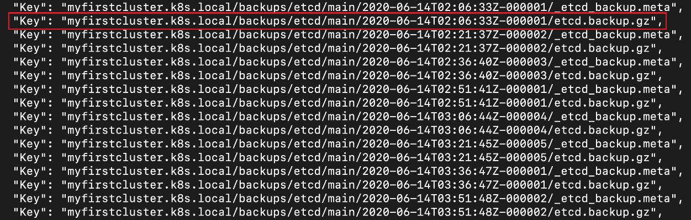

图 18.4：获取可用备份列表

您可以看到备份每 15 分钟自动进行，并且备份的时间戳已标记。我们将在下一步中使用在上一张截图中突出显示的最新备份的`Key`。

1.  下一步是从 S3 存储桶获取备份。我们可以使用 AWS CLI 命令来获取我们需要的备份：

```
aws s3api get-object --bucket $BUCKET_NAME --key "myfirstcluster.k8s.local/backups/etcd/main/2020-06-14T02:06:33Z-000001/etcd.backup.gz'  etcd-backup-$(date +%Y-%m-%d_%H:%M:%S_%Z).db
```

请注意，此命令包含存储桶的名称，上一步中文件的`Key`，以及我们在保存文件时要使用的文件名。使用在上一步的输出中获取的`Key`。您应该看到类似于此的响应：

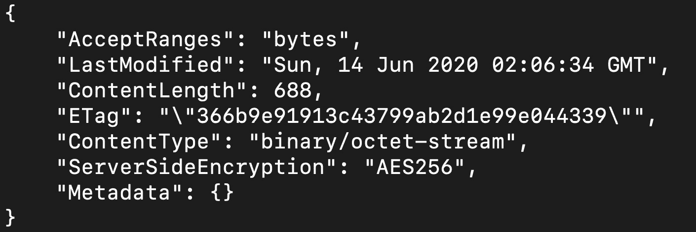

图 18.5：从我们的 S3 存储桶中保存 etcd 备份

请注意，我们使用`date`命令生成文件名。这是系统管理员常用的技术，用于确保不会覆盖任何文件。

请注意

如果您想使用此备份恢复您的 etcd 实例，您可以在此链接找到恢复说明：[`kops.sigs.k8s.io/operations/etcd_backup_restore_encryption/`](https://kops.sigs.k8s.io/operations/etcd_backup_restore_encryption/)。

1.  验证备份文件是否已创建：

```
ls -lrt 
```

您应该看到以下响应：

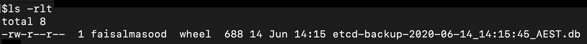

图 18.6：确认保存的 etcd 备份

您应该能够在响应中看到我们创建的快照。

在这个练习中，您已经学会了如何生成 etcd 数据存储的备份。这个备份是 Kubernetes 的状态，不仅在您的升级遇到任何问题时可能有用，而且在任何其他情况下恢复集群也可能有用，比如**灾难恢复**（**DR**）场景。

## 排空节点并使其不可调度

在我们开始升级任何节点（主节点或工作节点）之前，我们需要确保没有任何 pod（包括主要组件的 pod）在此节点上运行。这是准备升级任何节点的重要步骤。此外，该节点需要标记为不可调度。不可调度的节点是调度程序不在此节点调度任何 pod 的标志。

我们可以使用`drain`命令将节点标记为不可调度，并驱逐所有 pod。`drain`命令不会删除任何 DaemonSet pod，除非我们告诉标志这样做。这种行为的原因之一是，DaemonSet pod 不能被调度到任何其他节点上。

请注意，`drain`命令等待优雅终止 pod，并强烈建议在生产环境中等待所有 pod 优雅地终止。让我们在以下练习中看到这一点。

## 练习 18.02：从节点中排空所有的 Pod

在这个练习中，我们将删除在一个节点上运行的所有 pods。一旦所有的 pods 都被移除，我们将把节点改回可调度状态，以便它可以接受新的工作负载。这是当节点已经升级并准备接受新的 pods 时。

1.  获取所有节点的列表：

```
kubectl get nodes
```

您应该看到类似于这样的响应：

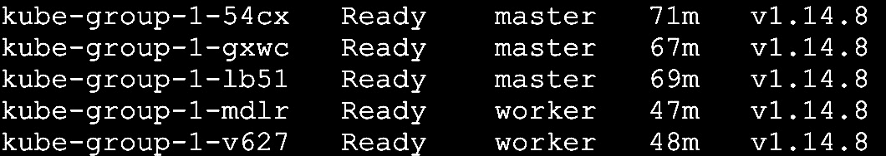

图 18.7：获取节点列表

在这个例子中，我们有两个 worker 节点和三个 master 节点。

1.  创建一个名为`upgrade-demo`的新命名空间：

```
kubectl create ns upgrade-demo
```

您应该看到以下响应：

```
namespace/upgrade-demo created
```

1.  运行一堆 pods 来模拟工作负载。创建一个名为`multiple-pods.yaml`的文件，其中包含以下内容：

```
apiVersion: apps/v1
kind: Deployment
metadata:
  name: sleep
spec:
replicas: 4
  selector:
    matchLabels:
      app.kubernetes.io/name: sleep
  template:
    metadata:
      labels:
        app.kubernetes.io/name: sleep
    spec:
      containers:
      - name: sleep
        image: k8s.gcr.io/busybox
        command: [ "/bin/sh', "-c', "while :; do echo 'this is           backend pod'; sleep 5 ; done' ]
        imagePullPolicy: IfNotPresent
```

部署将创建四个 pods 的副本。

1.  现在，使用配置来创建部署：

```
kubectl create -f multiple-pod.yaml -n upgrade-demo
```

您应该看到这个响应：

```
deployment.apps/sleep created
```

1.  验证它们是否在 worker pods 上运行：

```
kubectl get pods -n upgrade-demo -o wide
```

您的输出应该是这样的：

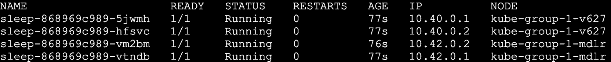

图 18.8：验证 pods 是否在 worker 节点上运行

请注意，默认调度程序行为会将 pods 分布在两个 worker 节点之间。

1.  使用`drain`命令从任何节点中驱逐所有的 pods。这个命令也会将节点标记为不可调度：

```
kubectl drain kube-group-1-mdlr --ignore-daemonsets
```

使用您从上一步的输出中获得的节点的名称。注意，我们传递了一个标志来忽略 daemon sets。您应该看到以下响应：

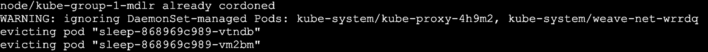

图 18.9：排水节点

如果我们不设置`--ignore-daemonsets`标志，并且节点上有一些 DaemonSet pods，`drain`将不会在没有这个标志的情况下继续进行。我们建议使用这个标志，因为您的集群可能正在运行一些关键的 pods 作为 DaemonSet - 例如，一个从节点上的所有其他 pods 收集日志并将它们发送到中央日志服务器的 Fluentd pod。您可能希望在最后一刻之前保留这个日志收集 pod 的可用性。

1.  验证所有的 pods 是否已经从该节点排空。为此，获取一个列表的 pods：

```
kubectl get pods -n upgrade-demo -o wide
```

您应该看到以下响应：

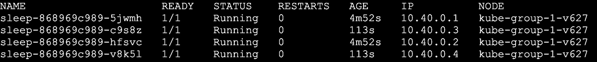

图 18.10：检查 pods 是否已经从排空的节点移开

在前面的截图中，您可以看到所有的 pod 都在另一个节点上运行。我们的集群中只有两个工作节点，所以所有的 pod 都被调度到了唯一可调度的节点上。如果我们有几个可用的工作节点，调度器会将 pod 分布在它们之间。

1.  让我们描述一下我们的排水节点并做一些重要的观察：

```
kubectl describe node kube-group-1-mdlr
```

使用您在*步骤 6*中排水的节点名称。这将产生一个相当长的输出，但有两个值得观察的部分：

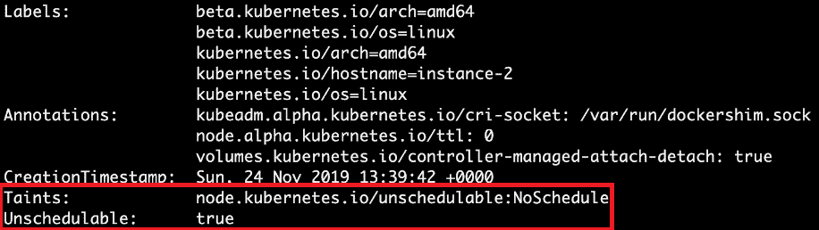

图 18.11：检查我们排水节点的污点和不可调度状态

前面的截图显示我们的节点被标记为不可调度。接下来，在您的输出中找到以下类似的部分：

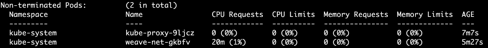

图 18.12：检查排水节点上的非终止 pod

这表明我们系统上唯一正在运行的非终止 pod 的名称以`kube-proxy`和`weave-net`开头。第一个 pod 实现了`kube-proxy`，它是管理节点上的 pod 和服务网络规则的组件。第二个 pod 是`weave-net`，它为我们的集群实现了虚拟网络（请注意，您的网络提供程序取决于您选择的网络类型）。由于我们在*步骤 6*中添加了一个排除 DaemonSets 的标志，这些由 DaemonSet 管理的 pod 仍在运行。

1.  一旦您在*步骤 6*中排水了 pod，您就可以升级节点。即使升级不是本练习的一部分，我们只是想让节点再次可调度。为此，请使用以下命令：

```
kubectl uncordon kube-group-1-mdlr
```

您应该看到类似于以下内容的响应：

```
node/kube-group-1-mdlr uncordoned
```

1.  验证节点是否再次可调度。检查以下输出中的“污点”部分：

```
kubectl describe node kube-group-1-mdlr
```

您应该看到类似于以下内容的响应：

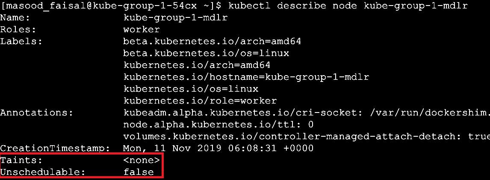

图 18.13：检查我们未封锁节点的污点和不可调度状态

前面的截图显示节点现在是可调度的，并且我们在*步骤 8*中观察到的污点已经被移除。

在这个练习中，您已经看到如何从节点中删除所有的 pod 并将节点标记为不可调度。这将确保在该节点中不会安排新的 pod，并且我们可以开始升级该节点。我们还学习了如何使节点再次可调度，以便在完成升级后继续使用它。

# 升级 Kubernetes 主要组件

当您以任何重要程度运行 Kubernetes 对您的组织很重要时，您将以 HA 配置运行平台。为了实现这一点，典型的配置至少是三个主要组件的副本，运行在三个不同的节点上。这允许您逐个将单个节点从一个次要版本升级到下一个次要版本，同时在升级后重新加入集群时仍然保持 API 兼容性，因为 Kubernetes 提供了一次次要版本的兼容性。这意味着在逐个升级每个节点时，主要组件可以处于不同的版本。以下表格提供了版本的逻辑流。假设您正在从版本 1.14 升级到 1.15：

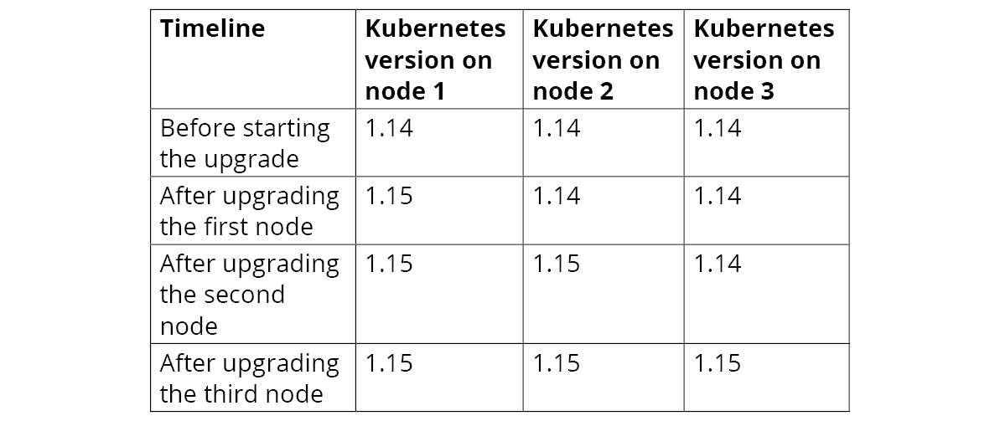

图 18.14：三个主节点的升级计划

在接下来的练习中，我们将继续升级 Kubernetes 主要组件。

## 练习 18.03：升级 Kubernetes 主要组件

在这个练习中，您将升级 Kubernetes 主节点上的所有主要组件。此练习假定您仍然登录到集群的堡垒主机。

在这个练习中，我们演示了一个较少数量的节点的过程，以简化操作，但是升级大量节点的过程是相同的。然而，为了实现无缝升级，三个主节点是最少的，并且您的应用程序应该是 HA，并且至少在两个工作节点上运行：

1.  运行 kops 验证器来验证现有的集群：

```
kops validate cluster 
```

您应该看到类似以下的响应：

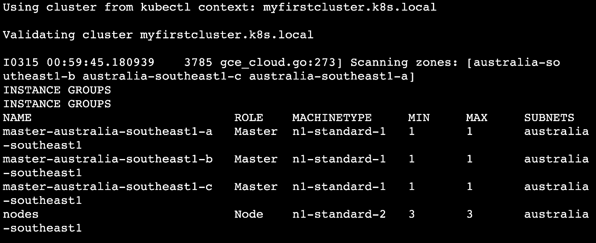

图 18.15：验证我们的 kops 集群

这是输出的截断版本。它显示了集群的主要基础设施组件。

1.  列出集群中的所有节点：

```
kubectl get nodes
```

您应该看到类似这样的响应：

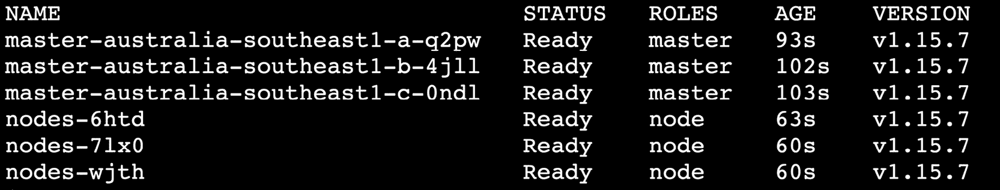

图 18.16：获取节点列表

请注意，我们有三个主节点，它们都在 1.15.7 版本上。

注意

在这个练习中，我们展示了从 Kubernetes 版本 1.15.7 升级到 1.15.10。您可以应用相同的步骤来升级到 kops 在您执行此练习时支持的 Kubernetes 版本。只需记住我们之前的建议，先升级到最新的补丁版本（这就是我们在这里所做的）。

1.  使用`kops upgrade cluster`命令查看可用的更新：

```
kops upgrade cluster ${NAME}
```

请注意，这个命令不会直接运行更新，但它会给出可能的最新更新版本。`NAME`环境变量保存了您的集群名称。您应该看到类似以下的输出：

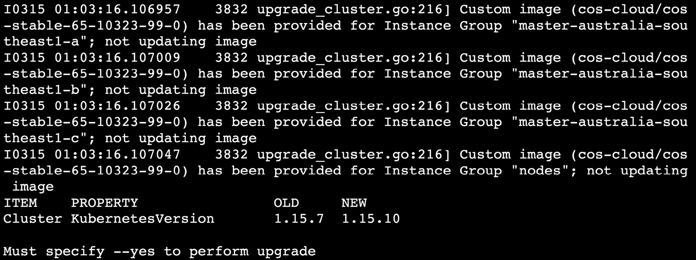

图 18.17：检查可用的集群版本

您可以从前面的截图中看到，`OLD`版本是`1.15.7`，这是我们当前的版本，`NEW`版本是`1.15.10`，这是我们的目标版本。

1.  一旦您验证了*步骤 4*中的命令的更改，使用`--yes`标志运行相同的命令。这将在 kops 状态存储中标记集群的期望状态：

```
kops upgrade cluster --yes
```

您应该看到类似以下的输出：

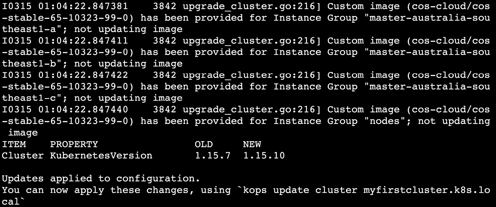

图 18.18：升级 kops 集群配置

这个输出表明了 Kubernetes 集群的期望版本已记录在更新的 kops 配置中。在下一步中，我们将要求 kops 更新云或集群资源以匹配新的规格-即 Kubernetes 版本`1.15.10`。

1.  现在，让我们运行以下命令，以便 kops 更新集群以匹配更新的 kops 配置：

```
kops update cluster ${NAME} --yes
```

这将产生一个长输出，最终会以类似以下的方式结束：

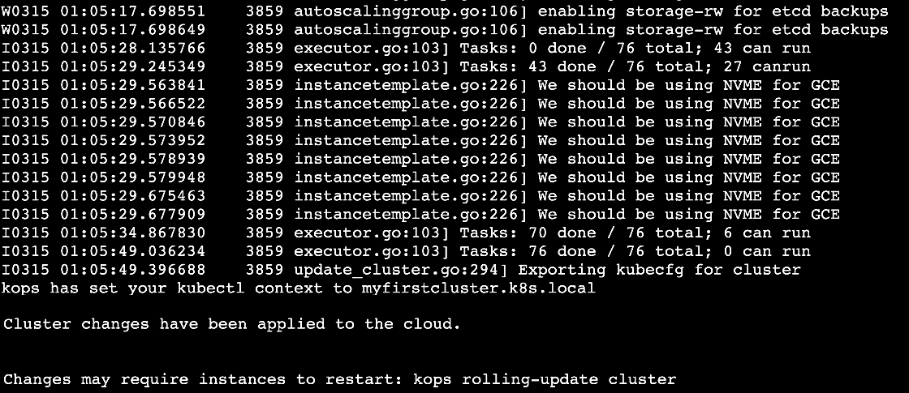

图 18.19：根据我们集群升级的要求更新我们的集群基础架构

这已经更新了集群基础架构，以匹配更新的 kops 配置。接下来，我们需要对运行在这个基础架构上的 Kubernetes 主组件进行升级。

1.  如果您在不同实例组上运行多个主/工作节点实例，那么您可以控制哪个实例组接收更新。为此，让我们首先获取我们实例组的名称。使用以下命令获取名称：

```
kops get instancegroups
```

您应该看到以下响应：

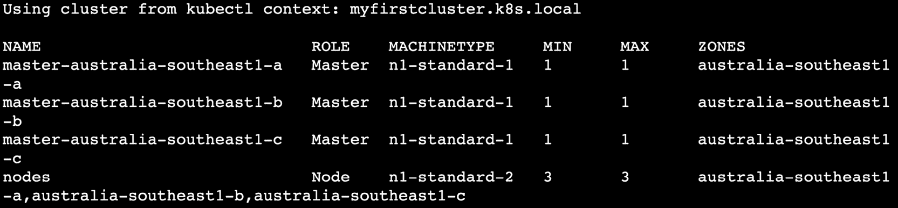

图 18.20：获取实例组列表

1.  在这一步中，kops 将更新 Kubernetes 集群以匹配 kops 规范。让我们使用滚动更新将第一个主节点升级到新版本：

```
kops rolling-update cluster ${NAME} --instance-group master-australia-southeast1-a --yes
```

请注意，此命令只会在您指定`--yes`标志时应用更改。根据您的节点配置，此命令可能需要一些时间。请耐心等待并观察日志，看是否有任何错误。过一段时间后，您应该看到类似以下截图中的成功消息：

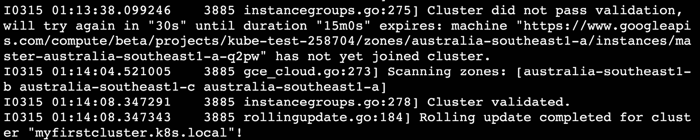

图 18.21：对我们的第一个实例组应用滚动更新

1.  验证节点是否已升级到目标版本，即`1.15.10`，在我们的情况下：

```
kubectl get nodes
```

这应该给出类似以下的响应：

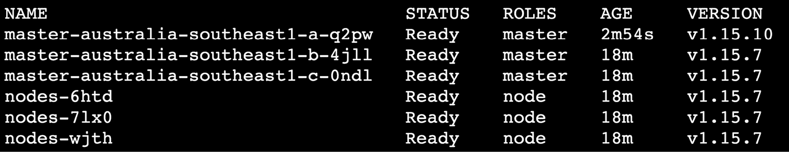

图 18.22：检查节点上的主要组件是否已升级

您可以看到第一个主节点的版本为`1.15.10`。

1.  验证新升级的节点上是否正在运行 pod：

```
kubectl describe node master-australia-southeast1-a-q2pw
```

使用您在之前步骤中升级的节点的名称。这将给出一个很长的输出。查找`Non-terminated Pod`部分，如下截图所示：

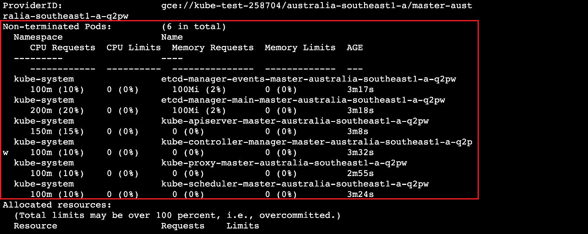

图 18.23：检查我们升级的节点是否正在运行 pod

注意

重复*步骤 7*至*9*，对所有额外的主节点进行更新和验证，使用相应实例组的适当名称。

1.  验证 kops 是否成功更新了主节点：

```
kops rolling-update cluster ${NAME}
```

您应该看到以下输出：

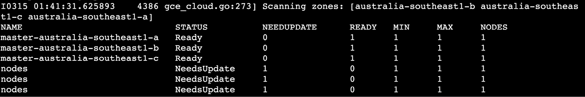

图 18.24：检查所有主节点是否已升级

如前所述，这是一个干跑，输出显示哪些节点需要更新。由于它们都显示`STATUS`为`Ready`，我们知道它们已经更新。相比之下，您可以看到`nodes`（工作节点）返回`NeedsUpdate`，因为我们还没有更新它们。

1.  验证所有主节点是否已升级到所需版本：

```
kubectl get nodes
```

您应该看到类似以下的响应：

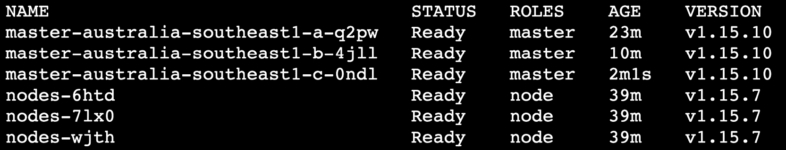

图 18.25：检查所有主节点上 Kubernetes 的版本

如您所见，所有主节点都在运行版本`1.15.10`，这是期望的版本。

在这个练习中，您已经看到了如何在不影响用户的情况下升级 Kubernetes 集群的主节点。逐个节点更新将确保有足够的主服务器可用（至少需要三个才能正常工作），并且在更新期间不会影响用户和集群。

注意

当您对实例组应用滚动更新时，kops 将通过逐个将节点脱机来滚动更新实例组中的节点。除此之外，在这个练习中，我们一次只对一个实例组应用滚动更新。最终，您应该实现的是集群中只有一个节点被逐个脱机。如果您选择自动化这个过程，请记住这一点。

# 升级 Kubernetes 工作节点

尽管 Kubernetes 支持主节点（API 服务器）和工作节点（kubelet）在一个次要版本内的兼容性，但强烈建议您一次性升级主节点和工作节点。使用 kops，升级工作节点类似于升级主节点。由于在一个次要版本内的向后兼容性，如果工作节点与主节点的版本不匹配，工作节点可能仍然可以工作，但强烈不建议在工作节点和主节点上运行不同版本的 Kubernetes，因为这可能会为集群创建问题。

然而，如果您希望在升级过程中保持应用程序在线，以下考虑非常重要：

+   确保您的应用程序配置为高可用。这意味着您应该为每个应用程序至少在不同节点上拥有两个 pod。如果不是这种情况，一旦您从节点中驱逐 pod，您的应用程序可能会出现停机时间。

+   如果您运行有状态的组件，请确保这些组件的状态已备份，或者您的应用程序设计能够承受有状态组件的部分不可用。

例如，假设您正在运行一个具有单个主节点和多个读取副本的数据库。一旦运行数据库主副本的节点驱逐数据库 pod，如果您的应用程序没有正确配置来处理这种情况，它们将遭受停机时间。这与 Kubernetes 集群的升级无关，但重要的是要了解您的应用程序在升级期间的行为，并确保它们被正确配置为容错。

现在我们已经了解了确保应用程序的正常运行时间的要求，让我们看看如何在以下练习中升级工作节点。

## 练习 18.04：升级工作节点

在这个练习中，我们将升级 Kubernetes 集群的所有工作节点。工作节点是您的应用程序的主机。

1.  获取工作节点的实例组列表：

```
kops get instancegroups
```

您应该看到类似以下的响应：

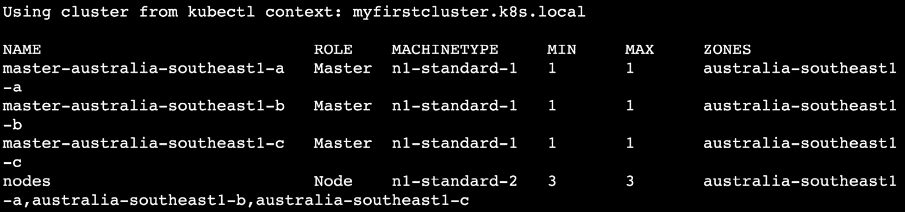

图 18.26：获取实例组列表

从这个图像中，我们可以看到我们的工作节点实例组的名称是`nodes`。

1.  验证节点是否准备就绪：

```
kubectl get nodes
```

您应该看到类似于这样的响应：

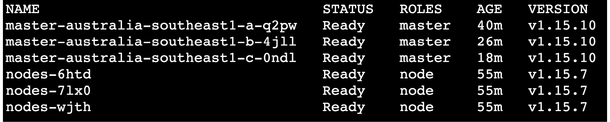

图 18.27：检查节点状态

如果我们有多个实例组，我们将逐个升级每个实例组。然而，我们的任务很简单，因为我们只有一个 - 那就是`nodes`。

1.  运行`kops rolling update`命令，针对`nodes`实例组**不**使用`--yes`标志。这将为您提供使用`kops rolling-update`命令将要更新的摘要：

```
kops rolling-update cluster ${NAME} --node-interval 3m --instance-group nodes --post-drain-delay 3m --logtostderr --v 9
```

请注意，我们已经在前面的命令中更改了详细日志的详细程度。

让我们分解这个命令：

- `node-interval`标志设置不同节点重新启动之间的最小延迟。

- `instance-group`标志指定滚动更新应该应用到哪个实例组。

- `post-drain-delay`标志设置在排空节点之后重新启动之前的延迟。请记住，在本章的前面部分，排空操作将等待 pod 的正常终止。这个延迟将在此之后应用。

`node-interval`和`post-drain-delay`标志提供了控制集群变化速率的选项。这些选项的值部分取决于您正在运行的应用程序类型。例如，如果您在节点上运行一个日志代理 DaemonSet，您可能希望给足够的时间让 pod 将内容刷新到中央日志服务器。

注意

在上一个案例中，我们在执行滚动更新时没有使用这些延迟，因为在那种情况下，实例组中每个只有一个节点。在这里，这个实例组中有三个节点。

- `logtosterr`标志将所有日志输出到**stderr**流，以便我们可以在终端输出中看到它们。

- `v`标志设置我们将看到的日志的详细程度。

此命令将显示以下输出：

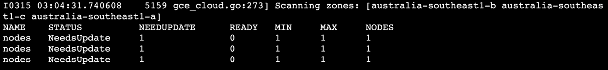

图 18.28：执行滚动更新的干跑

1.  现在，运行升级。使用与上一步相同的命令，并添加`--yes`标志。这告诉 kops 执行升级：

```
kops rolling-update cluster ${NAME} --node-interval 3m --instance-group nodes --post-drain-delay 3m --logtostderr --v 9 --yes
```

Kops 将排空一个节点，等待排空后的延迟时间，然后升级并重新启动节点。这将逐个节点重复进行。您将在终端中看到一个很长的日志，这个过程可能需要长达半个小时才能完成。在您的终端中，您应该开始看到日志，如下所示：

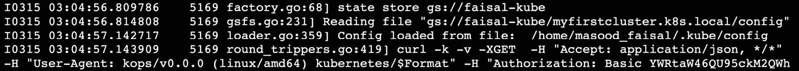

图 18.29：开始滚动更新过程

过一会儿，您将看到集群升级已经完成，并显示成功消息，如下所示：

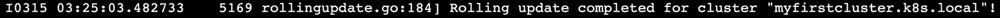

图 18.30：滚动更新完成消息

细心的读者会注意到，在*图 18.29*中，作者的日志显示，集群升级在大约 3:05 开始，如*图 18.29*所示，大约在 3:25 完成。三个节点的总时间约为 20 分钟。我们在停止每个节点后设置了 3 分钟的延迟，以及在排空所有 pod 后设置了 3 分钟的延迟。因此，每个节点的等待时间加起来为 6 分钟。在实例组中有三个节点，总等待时间为 6×3=18 分钟。

1.  验证工作节点是否已更新到目标版本-即`1.15.10`：

```
kubectl get nodes 
```

您应该看到以下响应：

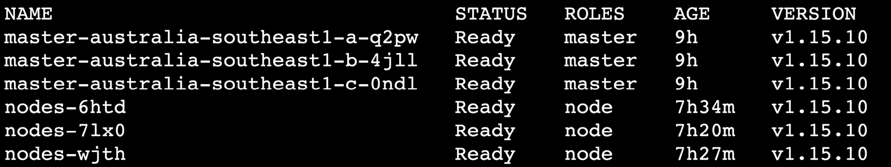

图 18.31：检查工作节点上 Kubernetes 的版本

1.  验证 pod 是否处于运行状态：

```
kubectl get pods -n upgrade-demo
```

您应该看到所有的 pod 的`STATUS`都设置为`Running`，就像这个截图中一样：


图 18.32：检查我们的 pod 的状态

在这个练习中，您已经看到了通过 kops 升级工作节点是多么容易。但是，我们不建议一次性升级所有生产集群的工作节点，并强烈建议为工作节点创建实例组。以下是一些可用于生产级集群的策略：

+   不要将所有的工作节点都放在一个实例组中。为不同的工作节点集创建多个实例组。默认情况下，kops 只创建一个实例组，但您可以更改此行为，为工作节点创建多个实例组。我们建议为基础设施组件（如监控和日志记录）、入口、关键应用程序、非关键应用程序和静态应用程序创建不同的工作实例组。这将帮助您首先将升级应用于集群中不太关键的部分。这种策略将有助于限制升级过程中的任何问题，并将受影响的节点与集群的其余部分隔离开来。

+   如果您在云中运行集群，可以根据需要提供新节点。因此，创建一个姐妹实例组进行升级可能是一个好主意。这个新的实例组应该运行升级后的 Kubernetes 版本。现在，从旧的实例组中关闭和排空所有的 pod。Kubernetes 调度器将看到新节点可用，并自动将所有 pod 移动到新节点。完成后，您只需删除旧的实例组，升级就完成了。

这种策略需要一些规划，特别是如果您在集群上运行有状态的应用程序。这种策略还假定您能够根据需要提供新节点，因为创建一个姐妹实例组可能需要临时的额外硬件，这对于自建数据中心可能是一个挑战。

请注意，这些都是高级策略，超出了本书的范围。但是，您可以在[`kops.sigs.k8s.io/tutorial/working-with-instancegroups/`](https://kops.sigs.k8s.io/tutorial/working-with-instancegroups/)找到更多信息。

现在您已经看到升级集群所需的所有步骤，您可以在以下活动中将它们整合起来。

## 活动 18.01：将 Kubernetes 平台从版本 1.15.7 升级到 1.15.10

在这个活动中，您将把 Kubernetes 平台从版本`1.15.7`升级到版本`1.15.10`。在这里，我们将整合本章学到的所有内容。以下准则应该帮助您完成这个活动：

注意

在这个活动中，我们展示了从 Kubernetes 版本`1.15.7`升级到`1.15.10`的过程。您可以应用相同的步骤来升级到 kops 在您执行此活动时支持的 Kubernetes 版本。

1.  使用*练习 11.01*，*设置我们的 Kubernetes 集群*，建立一个运行 Kubernetes 版本`1.15.7`的新集群。如果您正在使用云来启动机器，您可以在升级之前对机器进行快照（您的云供应商可能会向您收费），以便快速重新运行升级。

1.  将 kops 升级到您想要在主节点或堡垒节点上升级的版本。对于这个活动，我们需要版本`1.15`。

1.  将其中一个主节点升级到 Kubernetes 版本`1.15.10`。 

1.  验证主节点是否已恢复服务并处于`Ready`状态。

1.  同样，升级所有其他主节点。

1.  验证所有主节点是否已升级到所需版本，如下截图所示：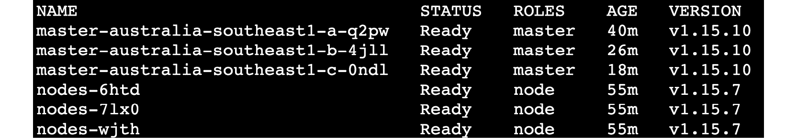

图 18.33：主节点上的 Kubernetes 升级版本

1.  现在，升级工作节点。

1.  验证 Pod 是否成功运行在新升级的节点上。最后，您应该能够验证您的 Pod 正在新节点上运行，如下所示：

图 18.34：运行在升级后的工作节点上的 Pod

注意

此活动的解决方案可以在以下地址找到：[`packt.live/304PEoD`](https://packt.live/304PEoD)。

# 总结

在本章中，您已经了解到，保持 Kubernetes 平台的最新状态对于提供安全可靠的应用程序运行基础非常重要。在这个快速发展的数字世界中，许多企业依赖于关键应用程序，并保持它们可用，即使升级底层平台也很重要。

您已经看到，如果您一开始就以高可用性配置设置了集群，那么平台的无停机升级是可能的。然而，除非您以容错的方式设计和部署应用程序，否则平台不能保证应用程序的可用性。一个因素是确保您的应用程序有多个实例运行，并且该应用程序被设计为优雅地处理这些实例的终止。

考虑到这一点，我们已经看到了升级集群的重要考虑因素，以确保平台本身不会导致应用程序的停机时间。我们分别研究了主节点和工作节点的升级过程。本章的关键要点是在不同情况下强调的原则，您可以将其应用于不同工具管理的不同类型的 Kubernetes 集群。

正如本章开头提到的，保持平台的最新状态对于跟上 DevOps 的最新发展并使您的应用开发团队能够继续向最终客户提供新功能是很重要的。通过本章获得的技能，您应该能够在升级平台时不会对客户造成中断。

在下一章中，我们将讨论如何使用自定义资源扩展您的 Kubernetes 平台。自定义资源允许您为自己的项目提供 Kubernetes 本机 API 体验。
