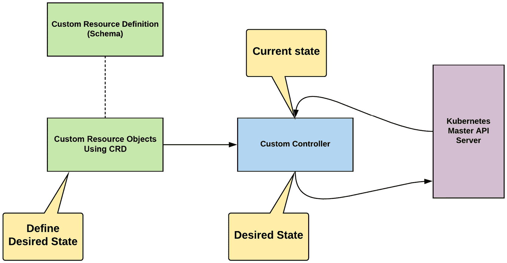
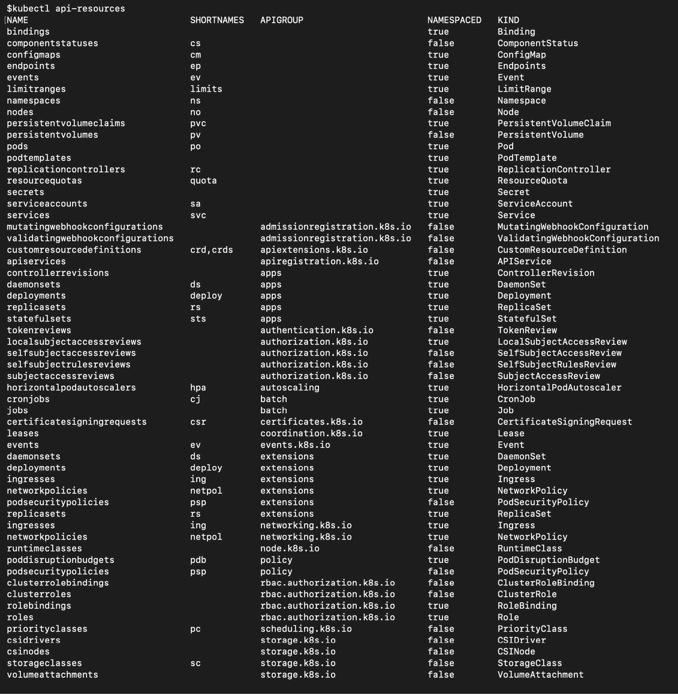
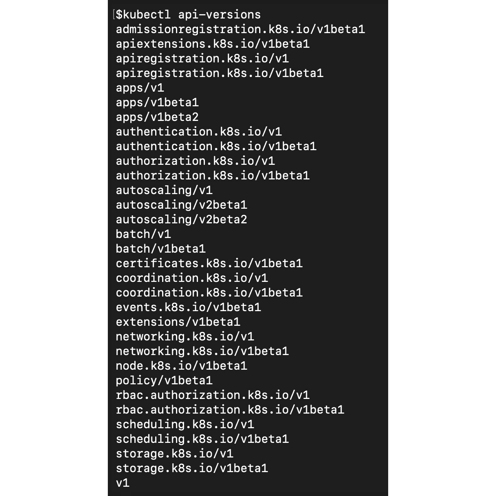
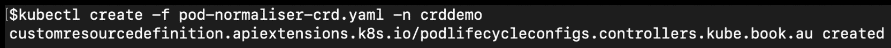
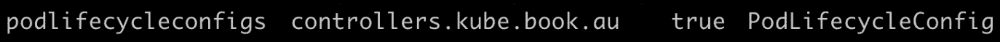
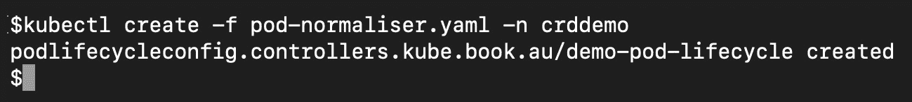
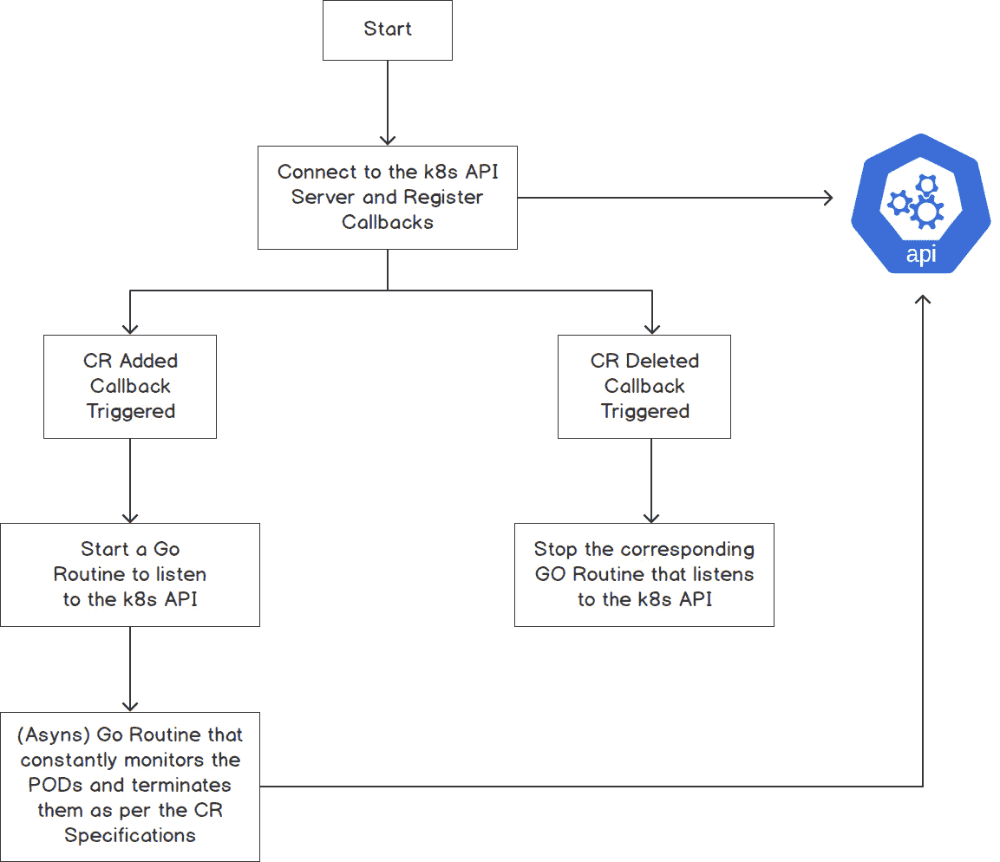
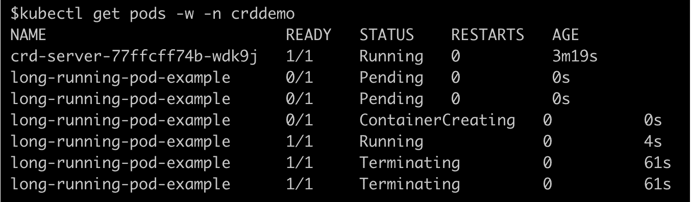
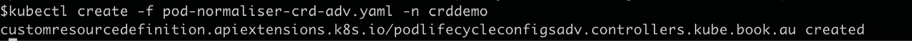
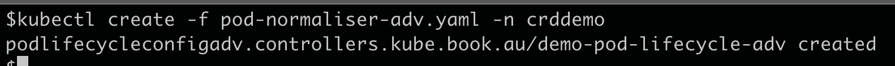

# 19. Kubernetes 中的自定义资源定义

概述

在本章中，我们将展示如何使用**自定义资源定义**（**CRDs**）来扩展 Kubernetes 并向您的 Kubernetes 集群添加新功能。您还将学习如何定义、配置和实现完整的 CRD。我们还将描述各种示例场景，其中 CRDs 可以非常有帮助。在本章结束时，您将能够定义和配置 CRD 和**自定义资源**（**CR**）。您还将学习如何部署一个基本的自定义控制器来实现集群中 CR 所需的功能。

# 介绍

在之前的章节中，我们学习了不同的 Kubernetes 对象，比如 Pods、Deployments 和 ConfigMaps。这些对象是由 Kubernetes API 定义和管理的（也就是说，对于这些对象，API 服务器管理它们的创建和销毁，以及其他操作）。然而，您可能希望扩展 Kubernetes 提供的功能，以提供一个标准 Kubernetes 中没有的功能，并且不能通过 Kubernetes 提供的内置对象来启用。

为了在 Kubernetes 之上构建这些功能，我们使用**自定义资源**（**CRs**）。**自定义资源定义**（**CRDs**）允许我们通过这种方式向 Kubernetes 服务器添加自定义对象，并像任何其他本机 Kubernetes 对象一样使用这些 CRs。CRD 帮助我们将我们的自定义对象引入 Kubernetes 系统。一旦我们的 CRD 被创建，它就可以像 Kubernetes 服务器中的任何其他对象一样使用。不仅如此，我们还可以使用 Kubernetes API、**基于角色的访问控制**（**RBAC**）策略和其他 Kubernetes 功能来管理我们引入的 CRs。

当您定义一个 CRD 时，它会存储在 Kubernetes 配置数据库（etcd）中。将 CRD 视为自定义对象结构的定义。一旦定义了 CRD，Kubernetes 就会创建符合 CRD 定义的对象。我们称这些对象为 CRs。如果我们将其比作编程语言的类比，CRD 就是类，CR 就是类的实例。简而言之，CRD 定义了自定义对象的模式，CR 定义了您希望实现的对象的期望状态。

CRs 是通过自定义控制器实现的。我们将在本章的第一个主题中更详细地了解自定义控制器。

# 什么是自定义控制器？

CRD 和 CR 可帮助您定义 CR 的期望状态。需要一个组件来确保 Kubernetes 系统的状态与 CR 定义的期望状态相匹配。正如您在前几章中所看到的，执行此操作的 Kubernetes 组件称为控制器。Kubernetes 提供了许多这些控制器，它们的工作是确保期望状态（例如，在部署中定义的 Pod 副本数）等于部署对象中定义的值。总之，控制器是一个通过 Kubernetes API 服务器监视资源状态并尝试将当前状态与期望状态匹配的组件。

标准 Kubernetes 设置中包含的内置控制器旨在与内置对象（如部署）一起使用。对于我们的 CRD 及其 CR，我们需要编写自己的自定义控制器。

## CRD、CR 和控制器之间的关系

CRD 提供了定义 CR 的方法，自定义控制器提供了对 CR 对象进行操作的逻辑。以下图表总结了 CRD、CR 和控制器：



图 19.1：CRD、CR 和控制器如何相互关联

如前图所示，我们有一个 CRD、一个自定义控制器和根据 CRD 定义期望状态的 CR 对象。这里有三件事需要注意：

+   CRD 是定义对象外观的模式。每个资源都有一个定义的模式，告诉 Kubernetes 引擎在定义中期望什么。诸如`PodSpec`之类的核心对象具有内置到 Kubernetes 项目中的模式。

注意

您可以在此链接找到 PodSpec 的源代码：[`github.com/kubernetes/kubernetes/blob/master/pkg/apis/core/types.go#L2627`](https://github.com/kubernetes/kubernetes/blob/master/pkg/apis/core/types.go#L2627)

+   基于模式（CRD）创建的 CR 对象定义了资源的期望状态。

+   自定义控制器是提供功能的应用程序，将当前状态带到期望的状态。

请记住，CRD 是 Kubernetes 允许我们声明性地定义 CR 的模式或定义的一种方式。一旦我们的 CRD（模式）在 Kubernetes 服务器上注册，CR（对象）将根据我们的 CRD 进行定义。

# 标准 Kubernetes API 资源

让我们列出 Kubernetes 集群中所有可用的资源和 API。请记住，我们使用的所有内容都被定义为 API 资源，而 API 是我们与 Kubernetes 服务器通信以处理该资源的网关。

使用以下命令获取当前 Kubernetes 资源的列表：

```
kubectl api-resources
```

您应该看到以下响应：



图 19.2：标准 Kubernetes API 资源

在上面的截图中，您可以看到 Kubernetes 中定义的资源具有`APIGroup`属性，该属性定义了负责管理此资源的内部 API。`Kind`列出了资源的名称。正如我们在本主题中之前所看到的，对于标准的 Kubernetes 对象，比如 Pods，Pod 对象的模式或定义内置在 Kubernetes 中。当您定义一个 Pod 规范来运行一个 Pod 时，这可以说类似于 CR。

对于每个资源，都有一些可以针对该资源采取行动的代码。这被定义为一组 API（`APIGroup`）。请注意，可以存在多个 API 组；例如，一个稳定版本和一个实验版本。发出以下命令以查看您的 Kubernetes 集群中有哪些 API 版本可用：

```
kubectl api-versions
```

您应该看到以下响应：



图 19.3：各种 API 组及其版本

在上面的截图中，请注意`apps` API 组有多个可用版本。每个版本可能具有其他组中不可用的不同功能集。

# 为什么我们需要自定义资源？

如前所述，CR 提供了一种方式，通过这种方式我们可以扩展 Kubernetes 平台，以提供特定于某些用例的功能。以下是一些您将遇到 CR 使用的用例。

## 示例用例 1

考虑这样一个用例，您希望自动将业务应用程序或数据库自动部署到 Kubernetes 集群上。抽象掉技术细节，比如配置和部署应用程序，允许团队在不需要深入了解 Kubernetes 的情况下管理它们。例如，您可以创建一个 CR 来抽象数据库的创建。因此，用户只需在 CRD 中定义数据库的名称和大小，控制器就会提供其余部分来创建数据库 Pod。

## 示例用例 2

考虑这样一个情景，您有自助团队。您的 Kubernetes 平台被多个团队使用，您希望团队自行定义工作负载所需的总 CPU 和内存，以及 Pod 的默认限制。您可以创建一个 CRD，团队可以使用命名空间名称和其他参数创建 CR。您的自定义控制器将创建他们需要的资源，并为每个团队关联正确的 RBAC 策略。您还可以添加其他功能，例如限制团队只能使用三个环境。控制器还可以生成审计事件并记录所有活动。

## 示例用例 3

假设您是开发 Kubernetes 集群的管理员，开发人员会在这里测试他们的应用程序。您面临的问题是开发人员留下了正在运行的 Pod，并已转移到新项目。这可能会对您的集群造成资源问题。

在本章中，我们将围绕这种情景构建一个 CRD 和一个自定义控制器。我们可以实现的解决方案是在创建后的一定时间后删除 Pod。让我们称这个时间为`podLiveForThisMinutes`。另一个要求是以可配置的方式为每个命名空间定义`podLiveForThisMinutes`，因为不同的团队可能有不同的优先级和要求。

我们可以为每个命名空间定义一个时间限制，这将为在不同命名空间应用控制提供灵活性。为了实现本示例用例中定义的要求，我们将定义一个 CRD，允许两个字段 - 命名空间名称和允许 Pod 运行的时间量（`podLiveForThisMinutes`）。在本章的其余部分，我们将构建一个 CRD 和一个控制器，使我们能够实现这里提到的功能。

注意

有其他（更好的）方法来实现前面的场景。在现实世界中，如果 Pod 是使用`Deployment`资源创建的，Kubernetes 的`Deployment`对象将重新创建 Pod。我们选择了这个场景，以使示例简单易实现。

# 我们的自定义资源是如何定义的

为了解决前一节中*示例用例 3*的问题，我们决定我们的 CRD 将定义两个字段，如前面的示例中所述。为了实现这一点，我们的 CR 对象将如下所示。

```
apiVersion: "controllers.kube.book.au/v1"
kind: PodLifecycleConfig
metadata:
  name: demo-pod-lifecycle
spec:
  namespaceName: crddemo
  podLiveForThisMinutes: 1
```

上述规范定义了我们的目标对象。正如你所看到的，它看起来就像普通的 Kubernetes 对象，但规范（`spec`部分）根据我们的需求进行了定义。让我们深入了解一下细节。

## apiVersion

这是 Kubernetes 用来对对象进行分组的字段。请注意，我们将版本（`v1`）作为组键的一部分。这种分组技术帮助我们保持对象的多个版本。考虑是否要添加新属性而不影响现有用户。你可以只创建一个带有`v2`的新组，同时存在`v1`和`v2`两个版本的对象定义。因为它们是分开的，所以不同组的不同版本可以以不同的速度发展。

这种方法还有助于我们测试新功能。假设我们想要向同一对象添加一个新字段。然后，我们可以只更改 API 版本并添加新字段。因此，我们可以将稳定版本与新的实验版本分开。

## kind

这个字段提到了由`apiVersion`定义的组中的特定类型对象。把`kind`想象成 CR 对象的名称，比如`Pod`。

注意

不要将其与使用此规范创建的对象的名称混淆，该对象在`metadata`部分中定义。

通过这个，我们可以在一个 API 组下拥有多个对象。想象一下，你要创建一个需要创建多种不同类型对象的功能。你可以在同一个 API 组下使用`Kind`字段创建多个对象。

## spec

这个字段定义了定义对象规范所需的信息。规范包含定义资源期望状态的信息。描述资源特性的所有字段都放在`spec`部分。对于我们的用例，`spec`部分包含我们 CR 所需的两个字段——`podLiveForThisMinutes`和`namespaceName`。

## namespaceName 和 podLiveForThisMinutes

这些是我们想要定义的自定义字段。`namespaceName`将包含目标命名空间的名称，而`podLiveForThisMinutes`将包含我们希望 Pod 活动的时间（以分钟为单位）。

## CRD 的定义

在前面的部分中，我们展示了 CR 的不同组件。然而，在我们定义 CR 之前，我们需要定义一个模式，它规定了 CR 的定义方式。在接下来的练习中，您将为*我们的自定义资源是如何定义的*部分中提到的资源定义模式或 CRD。

考虑这个示例 CRD，在接下来的练习中我们将使用它。让我们通过观察以下定义来理解 CRD 的重要部分：

pod-normaliser-crd.yaml

```
1  apiVersion: apiextensions.k8s.io/v1beta1
2  kind: CustomResourceDefinition
3  metadata:
4    name: podlifecycleconfigs.controllers.kube.book.au
5  spec:
6    group: controllers.kube.book.au
7    version: v1
8    scope: Namespaced
9    names:
10     kind: PodLifecycleConfig
11     plural: podlifecycleconfigs
12     singular: podlifecycleconfig
13  #1.15 preserveUnknownFields: false
14   validation:
15     openAPIV3Schema:
16       type: object
17       properties:
18         spec:
19           type: object
20           properties:
21             namespaceName:
22               type: string
23             podLiveForThisMinutes:
24               type: integer
```

现在，让我们看看这个 CRD 的各个组件：

+   `apiVersion`和`kind`：这些是 CRD 本身的 API 和资源，由 Kubernetes 提供给 CRD 定义。

+   `group`和`version`：将 API 组想象成一组逻辑相关的对象。这两个字段定义了我们 CR 的 API 组和版本，然后将被翻译成我们在前面部分中定义的 CR 的`apiVersion`字段。

+   `kind`：这个字段定义了我们 CR 的`kind`，在*我们的自定义资源是如何定义的*部分中已经定义过。

+   `metadata/name`：名称必须与`spec`字段匹配，格式是两个字段的组合，即`<plural>.<group>`。

+   `scope`：这个字段定义了 CR 是命名空间范围还是集群范围。默认情况下，CR 是集群范围的。我们在这里定义它为命名空间范围。

+   `plurals`：这些是用于 Kubernetes API 服务器 URL 中的复数名称。

+   `openAPIV3Schema`：这是基于 OpenAPI v3 标准定义的模式。它指的是我们 CR 的实际字段/模式。模式定义了我们 CR 中可用的字段、字段的名称和它们的数据类型。它基本上定义了我们 CR 中`spec`字段的结构。我们在 CR 中使用了`namespaceName`和`podLiveForMinutes`字段。你可以在以下练习的*步骤 2*中看到这一点。

有趣的是，API 服务器中服务 CR 的组件被称为`apiextensions-apiserver`。当 kubectl 请求到达 API 服务器时，它首先检查资源是否是标准的 Kubernetes 资源，比如 Pod 或 Deployment。如果资源不是标准资源，那么就会调用`apiextensions-apiserver`。

## 练习 19.01：定义 CRD

在这个练习中，我们将定义一个 CRD，在下一个练习中，我们将为定义的 CRD 创建一个 CR。CRD 的定义存储在 Kubernetes etcd 服务器中。请记住，CRD 和 CR 只是定义，直到您部署与您的 CR 相关联的控制器，CRD/CR 才会有功能附加。通过定义 CRD，您正在向 Kubernetes 集群注册一个新类型的对象。在定义 CRD 之后，它将通过正常的 Kubernetes API 可访问，并且您可以通过 Kubectl 访问它：

1.  创建一个名为`crddemo`的新命名空间：

```
kubectl create ns crddemo
```

这应该得到以下响应：

```
namespace/crddemo created
```

1.  现在，我们需要定义一个 CRD。使用以下内容创建一个名为`pod-normaliser-crd.yaml`的文件：

```
apiVersion: apiextensions.k8s.io/v1beta1
kind: CustomResourceDefinition
metadata:
  name: podlifecycleconfigs.controllers.kube.book.au
spec:
  group: controllers.kube.book.au
  version: v1
  scope: Namespaced
  names:
    kind: PodLifecycleConfig
    plural: podlifecycleconfigs
    singular: podlifecycleconfig
  #1.15 preserveUnknownFields: false
  validation:
    openAPIV3Schema:
      type: object
      properties:
        spec:
          type: object
          properties:
            namespaceName:
              type: string
            podLiveForThisMinutes:
              type: integer
```

1.  使用上一步的定义，使用以下命令创建 CRD：

```
kubectl create -f pod-normaliser-crd.yaml -n crddemo
```

您应该看到以下响应：



图 19.4：创建我们的 CRD

1.  使用以下命令验证 CR 是否已在 Kubernetes 中注册：

```
kubectl api-resources | grep podlifecycleconfig
```

您应该看到以下资源列表：



图 19.5：验证 CR 是否已在 Kubernetes 中注册

1.  使用以下命令验证 Kubernetes API 服务器中是否可用 API：

```
kubectl api-versions | grep controller
```

您应该看到以下响应：

```
controllers.kube.book.au/v1
```

在这个练习中，我们已经定义了一个 CRD，现在，Kubernetes 将能够知道我们的 CR 应该是什么样子的。

现在，在下一个练习中，让我们根据我们定义的 CRD 创建一个资源对象。这个练习将是上一个练习的延伸。但是，我们将它们分开，因为 CRD 对象可以独立存在；您不必将 CR 与 CRD 配对。可能的情况是，CRD 由某些第三方软件供应商提供，并且您只需要创建 CR。例如，供应商提供的数据库控制器可能已经有了 CRD 和控制器。要使用功能，您只需要定义 CR。

让我们继续在下一个练习中将我们的 CRD 制作成一个 CR。

## 练习 19.02：使用 CRD 定义 CR

在这个练习中，我们将根据上一个练习中定义的 CRD 创建一个 CR。CR 将作为一个普通的 Kubernetes 对象存储在 etcd 数据存储中，并由 Kubernetes API 服务器提供服务-也就是说，当您尝试通过 Kubectl 访问它时，它将由 Kubernetes API 服务器处理：

注意

只有在成功完成本章的上一个练习后，您才能执行此练习。

1.  首先，确保`podlifecycleconfigs`类型没有 CR。使用以下命令进行检查：

```
kubectl get podlifecycleconfigs -n crddemo
```

如果没有 CR，您应该会看到以下响应：

```
No resources found.
```

如果已定义资源，可以使用以下命令删除它：

```
kubectl delete podlifecycleconfig <RESOURCE_NAME> -n crddemo
```

1.  现在，我们必须创建一个 CR。使用以下内容创建名为`pod-normaliser.yaml`的文件：

```
apiVersion: "controllers.kube.book.au/v1"
kind: PodLifecycleConfig
metadata:
  name: demo-pod-lifecycle
  # namespace: "crddemo"
spec:
  namespaceName: crddemo
  podLiveForThisMinutes: 1
```

1.  使用以下命令创建来自上一步创建的文件的资源：

```
kubectl create -f pod-normaliser.yaml -n crddemo
```

您应该会看到以下响应：



图 19.6：创建我们的 CR

1.  使用以下命令验证 Kubernetes 是否已注册它：

```
kubectl get podlifecycleconfigs -n crddemo
```

您应该会看到以下响应：

```
NAME                  AGE
demo-pod-lifecycle    48s
```

请注意，我们现在正在使用普通的 kubectl 命令。这是扩展 Kubernetes 平台的一种非常棒的方式。

我们已经定义了自己的 CRD，并已创建了一个 CR。下一步是为我们的 CR 添加所需的功能。

## 编写自定义控制器

现在我们在集群中有一个 CR，我们将继续编写一些代码来*执行*它，以实现我们在*为什么需要自定义资源*部分中设定的场景的目的。

注意

我们不会教授编写控制器 Go 代码的实际编程，因为这超出了本书的范围。但是，我们会为*示例用例 3*提供所需的编程逻辑。

假设我们的自定义控制器代码正在作为一个 Pod 运行。为了响应 CR，它需要做些什么？

1.  首先，控制器必须知道在集群中定义/删除了新的 CR，以获取所需的状态。

1.  其次，代码需要一种与 Kubernetes API 服务器交互的方式，以请求当前状态，然后请求所需的状态。在我们的情况下，我们的控制器必须知道命名空间中所有 Pod 的时间以及 Pod 的创建时间。然后，代码可以要求 Kubernetes 根据 CRD 删除 Pods，如果它们的允许时间已到。请参考*示例用例 3*部分，以刷新您对我们的控制器将要执行的操作的记忆。

我们的代码逻辑可以通过以下图表进行可视化：



图 19.7：描述自定义控制器逻辑的流程图

如果我们要将逻辑描述为简单的伪代码，那么它将如下所示：

1.  从 Kubernetes API 服务器获取为我们的自定义 CRD 创建的所有新 CR。

1.  注册回调以便在添加或删除 CR 时触发。每当在我们的 Kubernetes 集群中添加或删除新的 CR 时，都会触发这些回调。

1.  如果将 CR 添加到集群中，回调将创建一个子例程，该子例程将持续获取由 CR 定义的命名空间中的 Pod 列表。如果 Pod 已运行时间超过指定时间，它将被终止。否则，它将休眠几秒钟。

1.  如果删除 CR，回调将停止子例程。

### 自定义控制器的组件

如前所述，详细解释自定义控制器的构建方式超出了本书的范围，我们已经提供了一个完全可用的自定义控制器，以满足*示例用例 3*的需求。我们的重点是确保您可以构建和执行控制器以了解其行为，并且您对所有涉及的组件都感到满意。

自定义控制器是针对 CR 提供功能的组件。为了提供这一点，自定义控制器需要了解 CR 的用途及其不同的参数，或者*结构模式*。为了使我们的控制器了解模式，我们通过代码文件向控制器提供有关我们模式的详细信息。

以下是我们提供的控制器代码的摘录：

types.go

```
12 type PodLifecycleConfig struct {
13
14     // TypeMeta is the metadata for the resource, like kind and           apiversion
15     meta_v1.TypeMeta `json:",inline"`
16
17     // ObjectMeta contains the metadata for the particular           object like labels
18     meta_v1.ObjectMeta `json:"metadata,omitempty"`
19
20     Spec PodLifecycleConfigSpec `json:"spec"`
21 }
22
23 type PodLifecycleConfigSpec struct{
24     NamespaceName   string `json:"namespaceName"`
25     PodLiveForMinutes int `json:"podLiveForThisMinutes"`
26 }
...
32 type PodLifecycleConfigList struct {
33     meta_v1.TypeMeta `json:",inline"`
34     meta_v1.ListMeta `json:"metadata"`
35
36     Items []PodLifecycleConfig `json:"items"`
37 }
```

您可以在此链接找到完整的代码：[`packt.live/3jXky9G`](https://packt.live/3jXky9G)。

正如您所看到的，我们已经根据“自定义资源的定义方式”部分提供的 CR 示例定义了`PodLifecycleConfig`结构。这里重复列出以便更容易参考：

```
apiVersion: "controllers.kube.book.au/v1"
kind: PodLifecycleConfig
metadata:
  name: demo-pod-lifecycle
  # namespace: "crddemo"
spec:
  namespaceName: crddemo
  podLiveForThisMinutes: 1
```

请注意，在`types.go`中，我们已经定义了可以保存此示例规范的完整定义的对象。还要注意在`types.go`中，`namespaceName`被定义为`string`，`podLiveForThisMinuets`被定义为`int`。这是因为我们在 CR 中使用字符串和整数来表示这些字段，正如您所看到的。

控制器的下一个重要功能是监听与 CR 相关的来自 Kubernetes 系统的事件。我们使用**Kubernetes Go**客户端库连接到 Kubernetes API 服务器。该库使连接到 Kubernetes API 服务器（例如，用于身份验证）更容易，并具有预定义的请求和响应类型，以与 Kubernetes API 服务器进行通信。

注意

您可以在此链接找到有关 Kubernetes Go 客户端库的更多详细信息：[`github.com/kubernetes/client-go`](https://github.com/kubernetes/client-go)。

但是，您可以自由地使用任何其他库或任何其他编程语言通过 HTTPS 与 API 服务器通信。

您可以通过查看此链接上的代码来了解我们是如何实现的：[`packt.live/3ieFtVm`](https://packt.live/3ieFtVm)。首先，我们需要连接到 Kubernetes 集群。这段代码正在集群中的一个 Pod 中运行，并且需要连接到 Kubernetes API 服务器。我们需要给予我们的 Pod 足够的权限来连接到主服务器，这将在本章后面的活动中介绍。我们将使用 RBAC 策略来实现这一点。请参考*第十三章*，*Kubernetes 中的运行时和网络安全*，以了解 Kubernetes 如何实现 RBAC 功能的复习。

一旦我们连接上了，我们就使用`SharedInformerFactory`对象来监听控制器的 Kubernetes 事件。将事件视为 Kubernetes 在创建或删除新 CR 时通知我们的一种方式。`SharedInformerFactory`是 Kubernetes Go 客户端库提供的一种方式，用于监听 Kubernetes API 服务器生成的事件。对`SharedInformerFactory`的详细解释超出了本书的范围。

以下代码片段是我们的 Go 代码中创建`SharedInformerFactory`的摘录：

main.go

```
40 // create the kubernetes client configuration
41     config, err := clientcmd.BuildConfigFromFlags("", "")
42     if err != nil {
43         log.Fatal(err)
44     }
45
46     // create the kubernetes client
47     podlifecyelconfgiclient, err := clientset.NewForConfig(config)
48
49
50     // create the shared informer factory and use the client           to connect to kubernetes
51     podlifecycleconfigfactory :=          informers.NewSharedInformerFactoryWithOptions            (podlifecyelconfgiclient, Second*30,
52     informers.WithNamespace(os.Getenv(NAMESPACE_TO_WATCH)))
```

您可以在此链接找到完整的代码：[`packt.live/3lXe3FM`](https://packt.live/3lXe3FM)。

一旦我们连接到 Kubernetes API 服务器，我们需要注册以便在我们的 CR 被创建或删除时得到通知。以下代码执行了这个动作：

main.go

```
62 // fetch the informer for the PodLifecycleConfig
63 podlifecycleconfiginformer :=      podlifecycleconfigfactory.Controllers().V1().     PodLifecycleConfigs().Informer()
64
65 // register with the informer for the events
66 podlifecycleconfiginformer.AddEventHandler(
...
69 //define what to do in case if a new custom resource is created
70         AddFunc: func(obj interface{}) {
...
83 // start the subroutine to check and kill the pods for this namespace
84             go checkAndRemovePodsPeriodically(signal, podclientset, x)
85         },
86
87 //define what to do in case if a  custom resource is removed
88         DeleteFunc: func(obj interface{}) {
```

您可以在此链接找到完整的代码：[`packt.live/2ZjtQoy`](https://packt.live/2ZjtQoy)。

请注意，上述代码是从完整代码中提取的，这里的片段经过了轻微修改，以便在本书中更好地呈现。此代码正在向 Kubernetes 服务器注册回调。请注意，我们已经注册了 `AddFunc` 和 `DeleteFunc`。一旦 CR 被创建或删除，这些函数将被调用，我们可以针对此编写自定义逻辑。您可以看到，对于 `AddFunc`，正在调用 Go 子例程。对于每个新的 CR，我们都有一个单独的子例程来继续监视在命名空间中创建的 Pods。另外，请注意，`AddFunc` 将在日志中打印出 `A Custom Resource has been Added`。您可能还注意到，在 `DeleteFunc` 中，我们已关闭了 `signal` 通道，这将标记 Go 子例程停止自身。

## 活动 19.01：CRD 和自定义控制器的实际应用

在这个活动中，我们将构建和部署自定义控制器、CR 和 CRD。请注意，构建自定义控制器所需的编码超出了本书的范围，并且代码库中提供了现成的代码，以便部署工作控制器。

我们将创建一个新的 CRD，可以接受两个字段 - `podLiveForThisMinutes` 字段，定义了 Pod 在被杀死之前允许运行的时间（以分钟为单位），以及 `namespaceName` 字段，定义了这些规则将应用于哪个命名空间。

我们将根据 CRD 创建一个新的 CR。此外，我们将创建一个新的 Kubernetes 角色，允许从 Kubernetes API 服务器查询此新的 CRD。然后，我们将向您展示如何将新创建的角色与名为 `default` 的 ServiceAccount 关联起来，这是在命名空间 `default` 中运行 Pod 时默认使用的 ServiceAccount。

通常，我们构建一个自定义控制器，提供针对我们创建的 CRD 的逻辑。我们将使用打包为容器的代码，并将其部署为 Pod。控制器将作为普通 Pod 部署。

在活动结束时，为了测试我们的控制器，您将创建一个简单的 Pod，并验证我们的自定义控制器是否能够删除该 Pod。

**活动指南：**

1.  删除现有的 `crddemo` 命名空间，并使用相同的名称创建一个新的命名空间。

1.  使用以下命令获取用于创建控制器的代码和 `Dockerfile`：

```
git clone  https://github.com/PacktWorkshops/Kubernetes-Workshop.git 
cd Chapter19/Activity19.01/controller
```

1.  创建一个具有以下字段的 CRD。

元数据应包含以下内容：

```
name: podlifecycleconfigs.controllers.kube.book.au
```

`OpenAPIV3Schema` 部分应包含以下 `properties` 设置：

```
openAPIV3Schema:
  type: object
  properties:
    spec:
      type: object
      properties:
        namespaceName:
          type: string
        podLiveForThisMinutes:
          type: integer
```

1.  创建一个 CR，允许`crddemo`命名空间中的 Pod 存活 1 分钟。

1.  创建一个角色，为指定的 API 资源允许以下权限：

```
rules:
- apiGroups: ["controllers.kube.book.au"]
  resources: ["podlifecycleconfigs"]
  verbs: ["get", "list", "watch"]
- apiGroups: [""] 
  resources: ["pods"]
  verbs: ["get", "watch", "list", "delete"]
```

1.  使用 RoleBinding 对象，将此新角色与`crddemo`命名空间中的`default` ServiceAccount 关联起来。

1.  使用*步骤 2*中提供的`Dockerfile`构建和部署控制器 Pod。

1.  在`crddemo`命名空间中使用`k8s.gcr.io/busybox`镜像创建一个长时间运行的 Pod。

观察上一步创建的 Pod，并观察我们的控制器是否正在终止它。预期结果是 Pod 应该被创建，然后大约一分钟后应该自动终止，如下面的屏幕截图所示：



图 19.8：活动 19.01 的预期输出

注意

此活动的解决方案可以在以下地址找到：[`packt.live/304PEoD`](https://packt.live/304PEoD)。

## 向我们的自定义资源添加数据

在上一个活动中，您创建了 CRD 和 CR。我们之前提到过，一旦定义了我们的 CR，就可以使用标准 kubectl 命令查询它们。例如，如果您想查看已定义的`PodLifecycleConfig`类型的 CR 数量，可以使用以下命令：

```
kubectl get PodLifecycleConfig -n crddemo
```

您将看到以下响应

```
NAME                AGE
demo-pod-lifecycle  8h
```

请注意，它只显示对象的名称和年龄。但是，如果您为本机 Kubernetes 对象发出命令，您将看到更多列。让我们尝试部署：

```
kubectl get deployment -n crddemo
```

您应该看到类似于这样的响应：

```
NAME          READY    UP-TO-DATE   AVAILABLE   AGE
crd-server    1/1      1            1           166m
```

请注意 Kubernetes 添加的附加列，这些列提供了有关对象的更多信息。

如果我们想要添加更多列，以便前面的命令输出显示我们的 CR 的更多细节怎么办？您很幸运，因为 Kubernetes 提供了一种方法来为 CR 添加附加信息列。这对于显示每种自定义对象的关键值非常有用。这可以通过在 CRD 中定义的附加数据来实现。让我们看看我们如何在以下练习中做到这一点。

## 练习 19.03：向 CR 列表命令添加自定义信息

在这个练习中，您将学习如何通过`kubectl get`命令添加自定义信息到 CR 列表中：

注意

只有在成功完成*活动 19.01*，*CRD 和自定义控制器实战*之后，您才能执行此练习。

1.  让我们定义另一个带有附加列的 CRD。创建一个名为`pod-normaliser-crd-adv.yaml`的文件，内容如下：

```
apiVersion: apiextensions.k8s.io/v1beta1
kind: CustomResourceDefinition
metadata:
  name: podlifecycleconfigsadv.controllers.kube.book.au
spec:
  group: controllers.kube.book.au
  version: v1
  scope: Namespaced
  names:
    kind: PodLifecycleConfigAdv
    plural: podlifecycleconfigsadv
    singular: podlifecycleconfigadv
  #1.15 preserveUnknownFields: false
  validation:
    openAPIV3Schema:
      type: object
      properties:
        spec:
          type: object
          properties:
            namespaceName:
              type: string
            podLiveForThisMinutes:
              type: integer    
  additionalPrinterColumns:
  - name: NamespaceName
    type: string
    description: The name of the namespace this CRD is applied       to.
    JSONPath: .spec.namespaceName
  - name: PodLiveForMinutes
    type: integer
    description: Allowed number of minutes for the Pod to       survive
    JSONPath: .spec.podLiveForThisMinutes
  - name: Age
    type: date
    JSONPath: .metadata.creationTimestamp
```

请注意我们有一个名为`additionalPrinterColumns`的新部分。顾名思义，这定义了资源的附加信息。`additionalPrinterColumns`部分的两个重要字段如下：

- `name`：这定义了要打印的列的名称。

- `JSONPath`：这定义了字段的位置。通过这个路径，从资源中获取信息，并在相应的列中显示。

1.  现在，让我们使用以下命令创建这个新的 CRD：

```
kubectl create -f pod-normaliser-crd-adv.yaml -n crddemo
```

您将看到以下输出：



图 19.9：创建我们修改后的 CRD

1.  创建了 CRD 后，让我们创建 CRD 的对象。创建一个名为`pod-normaliser-adv.yaml`的文件，内容如下：

```
apiVersion: "controllers.kube.book.au/v1"
kind: PodLifecycleConfigAdv
metadata:
  name: demo-pod-lifecycle-adv
  # namespace: "crddemo"
spec:
  namespaceName: crddemo
  podLiveForThisMinutes: 20
```

现在，`spec`部分中的字段应该在`kubectl get`命令获取的列表中可见，类似于原生 Kubernetes 对象。

1.  使用以下命令创建前一步中定义的 CR：

```
kubectl create -f pod-normaliser-adv.yaml -n crddemo
```

这应该得到以下响应：



图 19.10：创建我们的 CR

1.  现在，让我们发出`kubectl get`命令，看看是否显示了附加字段：

```
kubectl get PodLifecycleConfigAdv -n crddemo
```

您应该看到我们的对象显示了以下信息：

```
NAME                    NAMESPACENAME  PODLIVEFORMINUTES  AGE
demo-pod-lifecycle-adv  crddemo        20                 27m
```

您可以看到附加字段已显示，现在我们对 CR 有了更多信息。

在这个练习中，您已经看到我们可以在通过 Kubernetes API 服务器查询 CR 时关联附加数据。我们可以定义字段名称和字段数据的路径。当您拥有许多相同类型的资源时，这种资源特定信息变得重要，对于运维团队来说，更好地理解定义的资源也很有用。

# 摘要

在本章中，您了解了自定义控制器。根据 Kubernetes 词汇表，控制器实现控制循环，通过 API 服务器监视集群的状态，并进行更改，以尝试将当前状态移向期望的状态。

控制器不仅可以监视和管理用户定义的 CR，还可以对部署或服务等资源进行操作，这些资源通常是 Kubernetes 控制器管理器的一部分。控制器提供了一种编写自己的代码以满足业务需求的方式。

CRD 是 Kubernetes 系统中用于扩展其功能的中心机制。CRD 提供了一种原生方式来实现符合您业务需求的 Kubernetes API 服务器的自定义逻辑。

您已经了解了 CRD 和控制器如何帮助为 Kubernetes 平台提供扩展机制。您还看到了如何配置和部署自定义控制器到 Kubernetes 平台的过程。

当我们接近旅程的尽头时，让我们回顾一下我们取得了什么成就。我们从 Kubernetes 的基本概念开始，了解了其架构以及如何与其交互。我们介绍了 Kubectl，这是与 Kubernetes 交互的命令行工具，然后，我们看到了 Kubernetes API 服务器的工作原理以及如何使用`curl`命令与其通信。

前两章建立了容器化和 Kubernetes 的基础知识。此后，我们学习了 kubectl 的基础知识- Kubernetes 命令中心。在*第四章，如何与 Kubernetes（API 服务器）通信*中，我们看到了 kubectl 和其他 HTTP 客户端如何与 Kubernetes API 服务器通信。我们通过在章节末创建一个部署来巩固我们的学习。

从*第五章*的*Pods*到*第十章*的*ConfigMaps 和 Secrets*，我们深入探讨了理解平台并开始设计在 Kubernetes 上运行应用程序所必不可少的概念。诸如 Pods、Deployments、Services 和 PersistentVolumes 等概念使我们能够利用该平台编写容错应用程序。

在接下来的一系列章节中，从*第十一章*的*构建您自己的 HA 集群*到*第十五章*的*Kubernetes 中的监控和自动缩放*，我们了解了如何在云平台上安装和运行 Kubernetes。这涵盖了在高可用性（HA）配置中安装 Kubernetes 平台以及如何在平台中管理网络安全。在本书的这一部分，您还了解了有状态组件以及应用程序如何使用平台的这些特性。最后，本节讨论了监视您的集群并设置自动缩放。

最后，在这最后一部分，从*第十六章*开始，*Kubernetes 准入控制器*，我们开始学习一些高级概念，比如如何使用准入控制器应用自定义策略。你也已经了解了 Kubernetes 调度器，这是一个决定你的应用程序将在集群中的哪个位置运行的组件。你学会了如何改变调度器的默认行为。你也看到了 CRD 提供了一种扩展 Kubernetes 的方式，这不仅可以用来构建自定义增强功能，也可以作为第三方提供商为 Kubernetes 添加功能的一种方式。

这本书可以作为一个很好的起点，帮助你开始学习 Kubernetes。现在你已经具备了在 Kubernetes 之上设计和构建系统的能力，可以为你的组织带来云原生的体验。虽然这本书到此结束了，但这只是作为一个 Kubernetes 专业人员的旅程的开始。
