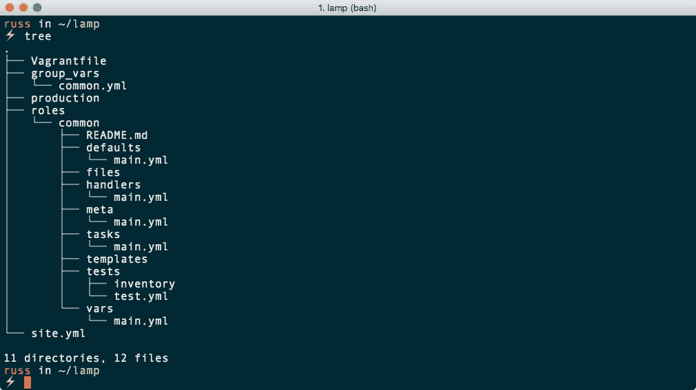
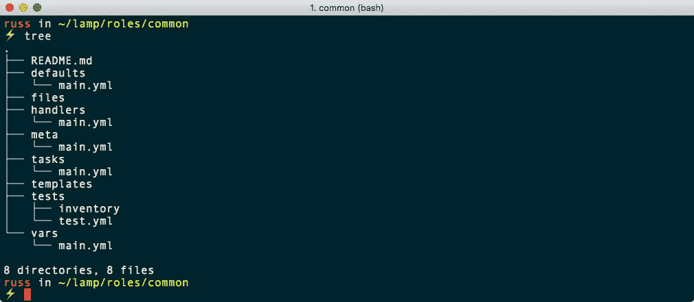
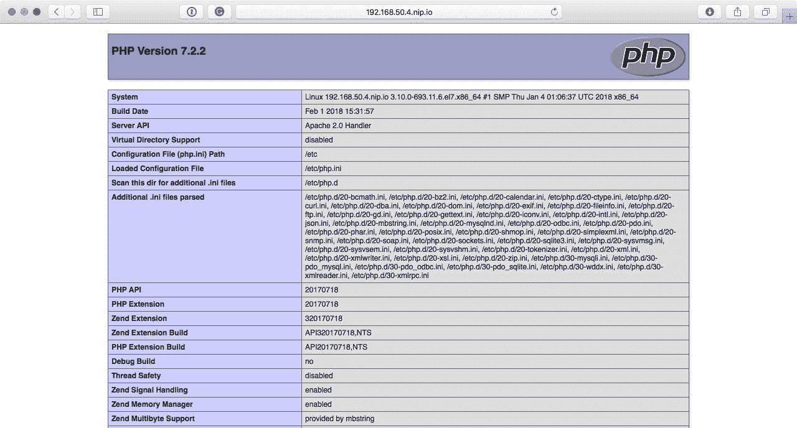
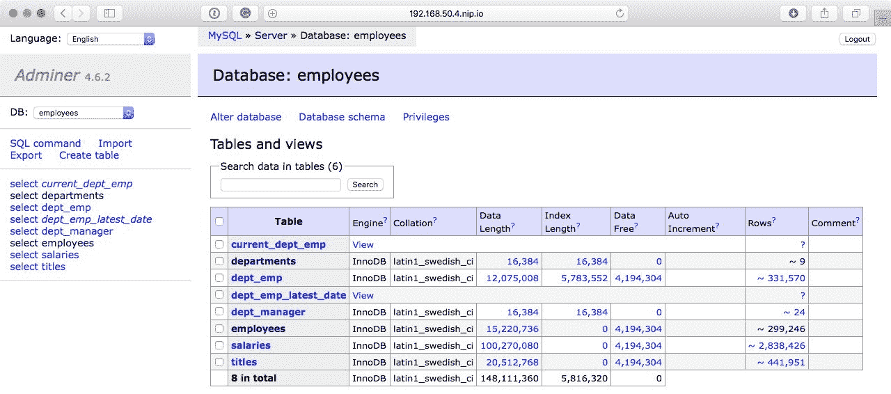

# 四、部署 LAMP 栈

在本章中，我们将使用 Ansible 附带的各种核心模块来部署完整的 LAMP 栈。我们将瞄准我们在[第 2 章](02.html#SJGS0-0fda9dda24fc45e094341803448da041)、*安装和运行 Ansible 的*中部署的 CentOS 7 游民箱。

我们将讨论以下内容:

*   行动手册布局—行动手册应该如何构建
*   Linux—准备 Linux 服务器
*   Apache—安装和配置 Apache
*   马里亚数据库—安装和配置马里亚数据库
*   PHP—安装和配置 PHP

在我们开始写剧本之前，我们应该在快速讨论本章需要什么之后，讨论我们将要使用的结构。

# 技术要求

我们将再次使用前几章中推出的 CentOS 7 游民箱。由于我们将在虚拟机上安装 LAMP 栈的所有元素，您的游民箱将需要能够从互联网下载软件包；总的来说，大约有 500 MB 的包和配置需要下载。

你可以在[https://github . com/packt publishing/Learn-ansi ble/tree/master/chapter 04/lamp](https://github.com/PacktPublishing/Learn-Ansible/tree/master/Chapter04/lamp)找到完整的剧本副本。

# 剧本结构

在前面的章节中，我们一直在运行的行动手册通常都是尽可能基本的。它们都在一个文件中，该文件还附带一个主机清单文件。在这一章中，由于我们将大大扩展我们的行动手册正在做的工作，因此我们将使用 Ansible 推荐的目录结构。

从下面的布局可以看出，有几个文件夹和文件:



让我们开始创建结构，并在创建时讨论每个项目。我们需要创建的第一个文件夹是顶层文件夹。这是包含我们的行动手册文件夹和文件的文件夹:

```
$ mkdir lamp
$ cd lamp
```

我们要创建的下一个文件夹叫做`group_vars`。这将包含我们剧本中使用的变量文件。现在，我们将创建一个单变量文件调用`common.yml`:

```
$ mkdir group_vars
$ touch group_vars/common.yml
```

接下来，我们将创建两个文件:我们将命名为`production`的主机清单文件，以及我们通常称为`site.yml`的主剧本:

```
$ touch production
$ touch site.yml

```

我们要手动创建的最后一个文件夹叫做`roles`。在这里，我们将使用`ansible-galaxy`命令创建一个名为`common`的角色。为此，我们使用以下命令:

```
$ mkdir roles
$ ansible-galaxy init roles/common
```

从本节开始的初始结构中，您可能已经注意到，通用角色本身有几个文件和文件夹；所有这些都是在我们运行`ansible-galaxy init`命令时为我们创建的。在下一节中，我们将讨论其中的每一个是做什么的，我们将使用公共角色来配置我们的基本 Linux 服务器。

唯一不属于默认 Ansible 结构的其他文件是我们的`Vagrantfile`。这包含以下内容:

```
# -*- mode: ruby -*-
# vi: set ft=ruby :

API_VERSION = "2"
BOX_NAME    = "centos/7"
BOX_IP      = "192.168.50.4"
DOMAIN      = "nip.io"
PRIVATE_KEY = "~/.ssh/id_rsa"
PUBLIC_KEY  = '~/.ssh/id_rsa.pub'

Vagrant.configure(API_VERSION) do |config|
  config.vm.box = BOX_NAME
  config.vm.network "private_network", ip: BOX_IP
  config.vm.host_name = BOX_IP + '.' + DOMAIN
  config.ssh.insert_key = false
  config.ssh.private_key_path = [PRIVATE_KEY,
  "~/.vagrant.d/insecure_private_key"]
  config.vm.provision "file", source: PUBLIC_KEY,
  destination: "~/.ssh/authorized_keys"

  config.vm.provider "virtualbox" do |v|
    v.memory = "2024"
    v.cpus = "2"
  end

  config.vm.provider "vmware_fusion" do |v|
    v.vmx["memsize"] = "2024"
    v.vmx["numvcpus"] = "2"
  end

end
```

While we will be working through each of the files individually in this and the following sections, a complete copy of the playbook is available in the accompanying GitHub repository.

# LAMP 栈

LAMP 栈是用来描述一个一体化的网络和数据库服务器的术语。通常，组件包括:

*   **Linux** :底层操作系统；在我们的案例中，我们将使用 CentOS 7。
*   **Apache** :栈的 web 服务器元素。
*   **MariaDB** :栈的数据库组件；通常，它是基于 MySQL 的。随着 CentOS 7 附带 MariaDB，我们将使用它而不是 PHP。
*   **PHP**:web 服务器生成内容所使用的动态语言。

还有一种常见的 LAMP 栈变体叫做**LEMP**；这将*阿帕奇*替换为 *NGINX* ，发音为 *engine-x* ，因此为 *E* 而非 *N* 。

我们将考虑创建角色来处理这些组件；这些是:

*   `common`:这个角色将准备我们的 CentOS 服务器，安装我们需要的任何支持包和服务
*   `apache`:该角色将安装 Apache web 服务器，并配置默认虚拟主机
*   `mariadb`:这个角色不仅会安装 MariaDB，还会保证安装的安全，并创建一个默认的数据库和用户
*   `php`:这个角色将安装 PHP，一组常见的 PHP 模块，还有 Composer，这是一个 PHP 的包管理器

让我们通过编写通用角色来开始准备基础知识。

# 普通的

在本章的上一节中，我们使用了`ansible-galaxy init`命令来创建`common`角色。这会创建几个文件夹和文件；在开始编辑它们之前，让我们快速讨论一下它们各自的用途:



真的只是我们担心的顶级水平；`main.yml`文件只是为角色的每个部分调用的默认 YAML 文件:

*   `README.md`:当角色签入 GitHub 之类的服务时，这是用来创建任何关于角色的文档的文件。每当有人浏览公共文件夹时，该文件将与文件夹列表一起显示。
*   `default`:这是存储角色默认变量的地方。这些可以被在`vars`文件夹中调用的同名变量覆盖。
*   `files`:该文件夹包含我们可能希望使用`copy`模块复制到目标主机的任何静态文件。
*   `handlers`:处理程序是一个剧本执行完就执行的任务；通常，`handlers`用于在配置文件发生变化时重启服务。
*   `meta`:包含角色的信息，如果角色要发布到 Ansible Galaxy，则使用该信息。
*   `tasks`:这是大部分工作发生的地方。
*   `templates`:该文件夹包含`template`模块使用的 Jinja2 模板。
*   `tests`:用于存储模块的任何测试。
*   `vars`:可以使用这里定义的变量覆盖`default`文件夹中定义的任何变量；这里定义的变量也可以被从`group_vars`文件夹和剧本顶层加载的任何变量覆盖。

让我们从添加一些任务开始。

# 更新包

首先，让我们通过在`roles/common/tasks/main.yml`文件的开头添加以下内容来更新我们的服务器:

```
- name: update all of the installed packages
  yum:
    name: "*"
    state: "latest"
    update_cache: "yes"
```

您会注意到，与我们上次运行`yum`来更新所有已安装的软件包时有所不同，这就是我们现在正在做的，即使用`name`键启动任务，这将打印出我们在行动手册运行时分配给名称键的值的内容，这将使我们更好地了解行动手册运行期间发生了什么。

# 安装通用软件包

现在我们已经更新了已安装的软件包，让我们在将要启动的所有 Linux 服务器上安装我们想要安装的软件包:

```
- name: install the common packages
  yum:
    name: "{{ item }}"
    state: "installed"
  with_items: "{{ common_packages }}"
```

如您所见，我们再次使用`yum`模块，并为任务添加了描述性名称。我们没有在任务中提供包列表，而是使用了一个名为`common_packages`的变量，该变量在`roles/common/defaults/main.yml`文件中定义如下:

```
common_packages:
  - "ntp"
  - "ntpdate"
  - "vim-enhanced"
  - "git"
  - "unzip"
  - "policycoreutils-python"
  - "epel-release"
  - "https://centos7.iuscommunity.org/ius-release.rpm"
```

如您所见，我们正在安装`ntp`和`ntpdate`；我们将很快配置`ntp`。接下来，我们将安装`vim-enhanced`和`git`，因为它们安装在服务器上总是有用的。然后，我们正在安装`policycoreutils-python`软件包，稍后会有更多内容，最后安装并启用另外两个`yum`存储库，EPEL 和 IUS。

**Extra Packages for Enterprise Linux** (**EPEL**) is a special interest group that maintains a collection of packages that are not part of the Red Hat Enterprise Linux core. EPEL packages are typically based on their Fedora counterparts and have been packaged so they will never conflict with, or replace, packages in the core Enterprise Linux distributions.

CentOS 7 附带了一个名为`epel-release`的包，该包支持 EPEL 存储库。但是，IUS 没有发布包，所以在这里，我们提供了启用 CentOS 7 IUS 存储库的 RPM 文件的完整 URL，而不是使用作为 CentOS 核心存储库一部分的包。

The IUS Community Project is a collection of RPMs for Red Hat Enterprise Linux and compatible operating systems, such as CentOS, which aims to provide packages that are **Inline with Upstream Stable**, hence **IUS**. They provide packages for Apache, PHP, and MariaDB, which are all the latest release. The packages supplied by IUS adhere to the rules laid out in the *SafeRepo Initiative*, meaning they can be trusted.

# 配置 NTP

接下来，我们将从`templates`文件夹中复制`ntp.conf`文件，添加 NTP 服务器列表，然后告诉 Ansible 在配置文件更改时重新启动 NTP:

```
- name: copy the ntp.conf to /etc/ntp.conf
  template:
    src: "ntp.conf.j2"
    dest: "/etc/ntp.conf"
  notify: "restart ntp"
```

模板文件可以在`roles/common/templates/ntp.conf.j2`找到:

```
# {{ ansible_managed }}
driftfile /var/lib/ntp/drift
restrict default nomodify notrap nopeer noquery
restrict 127.0.0.1 
restrict ::1

server {{ item }} iburst

includefile /etc/ntp/crypto/pw
keys /etc/ntp/keys
disable monitor
```

如您所见，我们正在使用`ntp_servers`变量；这存储在`roles/common/defaults/main.yml`文件中:

```
ntp_servers:
  - "0.centos.pool.ntp.org"
  - "1.centos.pool.ntp.org"
  - "2.centos.pool.ntp.org"
  - "3.centos.pool.ntp.org"
```

最后`roles/common/handlers/main.yml`增加了以下任务:

```
- name: "restart ntp"
  service:
    name: "ntpd"
    state: "restarted"
```

虽然我们已经在这里通知了处理程序，但是在剧本运行结束时，NTP 不会与我们通知的任何其他任务一起重新启动。

# 创建用户

常见角色的最后一部分是添加一个名为`lamp`的用户，并将我们的公钥添加到该用户。在我们看任务之前，让我们看一下我们将使用的变量，它在`roles/common/defaults/main.yml`中定义:

```
users:
  - { name: "lamp", group: "lamp", state: "present", key: "{{ lookup('file', '~/.ssh/id_rsa.pub') }}" }
```

如您所见，我们提供了三点信息:

*   `name`:这是我们要创建的用户的名字
*   `group`:这是我们要添加用户的群组
*   `state`:如果我们希望用户在场或缺席
*   `key`:这里，我们使用一个 Ansible 查找任务来读取`~/.ssh/id_rsa.pub`处的文件内容，并将其作为值

`roles/common/tasks/main.yml`文件中用于创建用户的任务分为三部分；第一部分使用`group`模块创建组:

```
- name: add group for our users
  group:
    name: "{{ item.group }}"
    state: "{{ item.state }}"
  with_items: "{{ users }}"
```

如您所见，我们正在使用`with_items`加载`users`变量，因为该变量包含三个不同的项目，这里只使用了其中的两个。我们可以命名它们，所以这里我们使用`item.group`和`item.state`。

任务的第二部分使用`user`模块创建用户，如您所见:

```
- name: add users to our group
  user: 
    name: "{{ item.name }}"
    group: "{{ item.group }}"
    comment: "{{ item.name }}"
    state: "{{ item.state }}"
  with_items: "{{ users }}"
```

任务的最后一部分使用`authorized_key`模块将用户的公钥添加到授权密钥文件中:

```
- name: add keys to our users
  authorized_key:
    user: "{{ item.name }}"
    key: "{{ item.key }}"
  with_items: "{{ users }}"
```

如你所见，这次我们使用的是`item.name`和`item.key`变量。该模块在用户的个人文件夹中创建一个名为`.ssh/authorized_keys`的文件，该文件由`item.name`定义，然后将`item.key`的内容放入其中，使密钥私有部分的持有者可以访问我们刚刚创建的用户。

# 运行角色

首先，让我们通过运行以下命令之一来启动 CentOS 7 游民箱:

```
$ vagrant up
$ vagrant up --provider=vmware_fusion
```

现在我们有了我们的服务器，我们需要更新主机清单；在`production`文件中，输入以下内容:

```
box ansible_host=192.168.50.4.nip.io

[boxes]
box

[boxes:vars]
ansible_connection=ssh
ansible_user=vagrant
ansible_private_key_file=~/.ssh/id_rsa
host_key_checking=False
```

最后，我们需要一些能发挥我们作用的东西。将以下内容添加到`site.yml`文件中:

```
---

- hosts: boxes
  gather_facts: true
  become: yes
  become_method: sudo

  vars_files:
    - group_vars/common.yml

  roles:
    - roles/common
```

现在我们已经准备好了剧本文件，我们可以通过运行以下命令来运行它:

```
$ ansible-playbook -i production site.yml
```

几分钟后，您应该会看到类似以下输出的内容:

```
PLAY [boxes] ***************************************************************************************

TASK [Gathering Facts] *****************************************************************************
ok: [box]

TASK [roles/common : update all of the installed packages] *****************************************
changed: [box]

TASK [roles/common : install the common packages] **************************************************
changed: [box] => (item=[u'ntp', u'ntpdate', u'vim-enhanced', u'git', u'unzip', u'policycoreutils-python', u'epel-release', u'https://centos7.iuscommunity.org/ius-release.rpm'])

TASK [roles/common : copy the ntp.conf to /etc/ntp.conf] *******************************************
changed: [box]

TASK [roles/common : add group for our users] ******************************************************
changed: [box] => (item={u'state': u'present', u'group': u'lamp', u'name': u'lamp', u'key': u'ssh-rsa AAAAB3NzaC1yc2EAAAADAQABAAABAQDmuoFR01i/Yf3HATl9c3sufJvghTFgYzK/Zt29JiTqWlSQhmXhNNTh6iI6nXuPVhQGQaciWbqya6buncQ3vecISx6+EwsAmY3Mwpz1a/eMiXOgO/zn6Uf79dXcMN2JwpLFoON1f9PR0/DTpEkjwqb+eNLw9ThjH0J994+Pev+m8OrqgReFW36a/kviUYKsHxkXmkgxtPJgwKU90STNab4qyfKEGhi2w/NzECgseeQYs1H3klORaHQybhpXkoCIMmgy9gnzSH7oa2mJqKilVed27xoirkXzWPaAQlfiEE1iup+2xMqWY6Jl9qb8tJHRS+l8UcxTMNaWsQkTysLTgBAZ russmckendrick@me.com'})

TASK [roles/common : add users to our group] *******************************************************
changed: [box] => (item={u'state': u'present', u'group': u'lamp', u'name': u'lamp', u'key': u'ssh-rsa AAAAB3NzaC1yc2EAAAADAQABAAABAQDmuoFR01i/Yf3HATl9c3sufJvghTFgYzK/Zt29JiTqWlSQhmXhNNTh6iI6nXuPVhQGQaciWbqya6buncQ3vecISx6+EwsAmY3Mwpz1a/eMiXOgO/zn6Uf79dXcMN2JwpLFoON1f9PR0/DTpEkjwqb+eNLw9ThjH0J994+Pev+m8OrqgReFW36a/kviUYKsHxkXmkgxtPJgwKU90STNab4qyfKEGhi2w/NzECgseeQYs1H3klORaHQybhpXkoCIMmgy9gnzSH7oa2mJqKilVed27xoirkXzWPaAQlfiEE1iup+2xMqWY6Jl9qb8tJHRS+l8UcxTMNaWsQkTysLTgBAZ russmckendrick@me.com'})

TASK [roles/common : add keys to our users] ********************************************************
changed: [box] => (item={u'state': u'present', u'group': u'lamp', u'name': u'lamp', u'key': u'ssh-rsa AAAAB3NzaC1yc2EAAAADAQABAAABAQDmuoFR01i/Yf3HATl9c3sufJvghTFgYzK/Zt29JiTqWlSQhmXhNNTh6iI6nXuPVhQGQaciWbqya6buncQ3vecISx6+EwsAmY3Mwpz1a/eMiXOgO/zn6Uf79dXcMN2JwpLFoON1f9PR0/DTpEkjwqb+eNLw9ThjH0J994+Pev+m8OrqgReFW36a/kviUYKsHxkXmkgxtPJgwKU90STNab4qyfKEGhi2w/NzECgseeQYs1H3klORaHQybhpXkoCIMmgy9gnzSH7oa2mJqKilVed27xoirkXzWPaAQlfiEE1iup+2xMqWY6Jl9qb8tJHRS+l8UcxTMNaWsQkTysLTgBAZ russmckendrick@me.com'})

RUNNING HANDLER [roles/common : restart ntp] *******************************************************
changed: [box]

PLAY RECAP *****************************************************************************************
box : ok=8 changed=7 unreachable=0 failed=0
```

如您所见，一切都已按预期安装和配置。重新运行行动手册会得到以下结果:

```
PLAY [boxes] ***************************************************************************************

TASK [Gathering Facts] *****************************************************************************
ok: [box]

TASK [roles/common : update all of the installed packages] *****************************************
ok: [box]

TASK [roles/common : install the common packages] **************************************************
ok: [box] => (item=[u'ntp', u'ntpdate', u'vim-enhanced', u'git', u'unzip', u'policycoreutils-python', u'epel-release', u'https://centos7.iuscommunity.org/ius-release.rpm'])

TASK [roles/common : copy the ntp.conf to /etc/ntp.conf] *******************************************
ok: [box]

TASK [roles/common : add group for our users] ******************************************************
ok: [box] => (item={u'state': u'present', u'group': u'lamp', u'name': u'lamp', u'key': u'ssh-rsa AAAAB3NzaC1yc2EAAAADAQABAAABAQDmuoFR01i/Yf3HATl9c3sufJvghTFgYzK/Zt29JiTqWlSQhmXhNNTh6iI6nXuPVhQGQaciWbqya6buncQ3vecISx6+EwsAmY3Mwpz1a/eMiXOgO/zn6Uf79dXcMN2JwpLFoON1f9PR0/DTpEkjwqb+eNLw9ThjH0J994+Pev+m8OrqgReFW36a/kviUYKsHxkXmkgxtPJgwKU90STNab4qyfKEGhi2w/NzECgseeQYs1H3klORaHQybhpXkoCIMmgy9gnzSH7oa2mJqKilVed27xoirkXzWPaAQlfiEE1iup+2xMqWY6Jl9qb8tJHRS+l8UcxTMNaWsQkTysLTgBAZ russmckendrick@me.com'})

TASK [roles/common : add users to our group] *******************************************************
ok: [box] => (item={u'state': u'present', u'group': u'lamp', u'name': u'lamp', u'key': u'ssh-rsa AAAAB3NzaC1yc2EAAAADAQABAAABAQDmuoFR01i/Yf3HATl9c3sufJvghTFgYzK/Zt29JiTqWlSQhmXhNNTh6iI6nXuPVhQGQaciWbqya6buncQ3vecISx6+EwsAmY3Mwpz1a/eMiXOgO/zn6Uf79dXcMN2JwpLFoON1f9PR0/DTpEkjwqb+eNLw9ThjH0J994+Pev+m8OrqgReFW36a/kviUYKsHxkXmkgxtPJgwKU90STNab4qyfKEGhi2w/NzECgseeQYs1H3klORaHQybhpXkoCIMmgy9gnzSH7oa2mJqKilVed27xoirkXzWPaAQlfiEE1iup+2xMqWY6Jl9qb8tJHRS+l8UcxTMNaWsQkTysLTgBAZ russmckendrick@me.com'})

TASK [roles/common : add keys to our users] ********************************************************
ok: [box] => (item={u'state': u'present', u'group': u'lamp', u'name': u'lamp', u'key': u'ssh-rsa AAAAB3NzaC1yc2EAAAADAQABAAABAQDmuoFR01i/Yf3HATl9c3sufJvghTFgYzK/Zt29JiTqWlSQhmXhNNTh6iI6nXuPVhQGQaciWbqya6buncQ3vecISx6+EwsAmY3Mwpz1a/eMiXOgO/zn6Uf79dXcMN2JwpLFoON1f9PR0/DTpEkjwqb+eNLw9ThjH0J994+Pev+m8OrqgReFW36a/kviUYKsHxkXmkgxtPJgwKU90STNab4qyfKEGhi2w/NzECgseeQYs1H3klORaHQybhpXkoCIMmgy9gnzSH7oa2mJqKilVed27xoirkXzWPaAQlfiEE1iup+2xMqWY6Jl9qb8tJHRS+l8UcxTMNaWsQkTysLTgBAZ russmckendrick@me.com'})

PLAY RECAP *****************************************************************************************
box : ok=7    changed=0    unreachable=0    failed=0
```

如您所见，我们已经跳过了重新启动 NTP 的任务，并且没有要安装的附加软件包或更新，也没有对我们创建的用户或组进行任何更改。现在我们已经更新并安装了基本软件包，并且配置了基本操作系统，我们准备安装 Apache。

# 街头流氓

目前，我们没有 Apache 的角色，所以让我们使用以下命令创建一个:

```
$ ansible-galaxy init roles/apache
```

和以前一样，这将为我们的 Apache 角色创建基本的支架。

# 安装 Apache

我们要添加的第一个任务是安装基本的 Apache 包。在`roles/apache/tasks/main.yml`中，增加以下内容:

```
- name: install the apache packages
  yum:
    name: "{{ item }}"
    state: "installed"
  with_items: "{{ apache_packages }}"
```

您可能已经猜到了，`apache_packages`的默认值可以在`roles/apache/defaults/main.yml`中找到:

```
apache_packages:
  - "httpd24u"
  - "httpd24u-filesystem"
  - "httpd24u-tools"
  - "httpd24u-mod_ssl"
  - "openssl"
  - "openssl-libs"
```

这将安装来自 IUS 的最新 Apache 2.4 包，以及我们需要的一些支持工具。安装后，我们现在需要配置 Apache。

# 配置 Apache

你可能想知道为什么我们在前一节创建了一个名为`lamp`的用户；我们将为这个用户托管我们的网站。让用户准备好托管我们的网站的第一个方面是将用户添加到`apache_group`。为此，我们需要运行以下任务:

```
- name: Add user to apache group
  user:
    name: "{{ item.name }}"
    groups: "{{ apache_group }}"
    append: yes
  with_items: "{{ users }}"
```

这里有两点需要指出。第一个是我们使用的是前一个角色的`users`变量，它仍然可以在剧本运行中使用，第二个是我们在`roles/apache/defaults/main.yml`中添加了一个名为`apache_group`的变量:

```
apache_group: "apache"
```

现在我们的用户在`apache_group`中，让我们为我们的网站创建文档根:

```
- name: create the document root for our website
  file:
    dest: "{{ document_root }}"
    state: "directory"
    mode: "0755"
    owner: "{{ users.0.name }}"
    group: "{{ apache_group }}"
```

如您所见，这是使用一些新的变量，以及访问旧变量的新方法。让我们首先解决`users.0.name`，因为我们已经将用户定义为一个列表。在剧本运行期间，可能会添加多个用户，因为我们只想创建一个文档根，并将其分配给单个虚拟主机，所以我们使用的是在**用户**变量下注册的列表中的第一个用户，这就是`0`的作用。

`document_root`变量也是利用这个原理构造的；这是`roles/apache/defaults/main.yml`文件中的两个变量，有助于组成完整的文档根:

```
web_root: "web"
document_root: "/home/{{ users.0.name }}/{{ web_root }}"
```

假设我们没有覆盖主剧本中的任何变量名，这将使我们的文档根在游民框中有一个路径`/home/lamp/web/`。

我们还需要更改 lamp 用户主文件夹上的权限，以允许我们执行脚本；为此，调用以下任务:

```
- name: set the permissions on the user folder
  file:
    dest: "/home/{{ users.0.name }}/"
    state: "directory"
    mode: "0755"
    owner: "{{ users.0.name }}"
```

接下来，我们需要将我们的 Apache 虚拟主机放置到位；每当我们在浏览器中输入主机名称时，这将为我们的网页提供服务。为此，我们将使用存储在`roles/apache/templates/vhost.conf.j2`中的模板文件，该文件使用我们已经定义的变量以及另外两个变量:

```
# {{ ansible_managed }}
<VirtualHost *:80>
  ServerName {{ ansible_nodename }}
  DocumentRoot {{ document_root }}
  DirectoryIndex {{ index_file }}
  <Directory {{ document_root }}>
    AllowOverride All
    Require all granted
  </Directory>
</VirtualHost>
```

`roles/apache/defaults/main.yml`中的`index_file`变量如下所示:

```
index_file: index.html
```

还有`ansible_nodename`变量；这是`setup`模块首次运行时从主机收集的变量之一。部署模板的任务如下:

```
- name: copy the vhost.conf to /etc/httpd/conf.d/
  template:
    src: "vhost.conf.j2"
    dest: "/etc/httpd/conf.d/vhost.conf"
  notify: "restart httpd"
```

重启 Apache 的任务可以在`roles/apache/handlers/main.yml`中找到，如下图所示:

```
- name: "restart httpd"
  service:
    name: "httpd"
    state: "restarted"
```

现在我们已经安装并配置了 Apache，我们需要允许 Apache 使用存储在`/home/`中的 web root。为此，我们需要调整 SELinux 权限。

# 配置 SELinux

上一节我们安装的软件包之一是`policycoreutils-python`。这允许我们使用 Python 配置 SELinux，因此是 Ansible。

**Security-Enhanced Linux** (**SELinux**) was developed by Red Hat and the NSA. It provides a mechanism for supporting access control security policies at the kernel level. These include mandatory access controls used by the United States Department of Defense.

默认情况下，我们使用的游民箱会启用 SELinux。除了简单地停止 SELinux，我们还可以允许 Apache 在默认的`/var/www/`之外运行。为此，我们需要在角色中添加以下内容:

```
- name: set the selinux allowing httpd_t to be permissive
  selinux_permissive:
    name: httpd_t
    permissive: true
```

现在，Apache 被允许从我们的用户目录中提供内容，我们可以添加一个`index.html`文件，这样我们就有了默认 Apache 页面以外的东西来提供服务。

# 复制一个 HTML 文件

最后一个任务是将一个`index.html`文件复制到我们的 web 根目录，这样我们就可以用新安装的 Apache 服务器提供一些服务。该任务使用`template`模块:

```
- name: copy the test HTML page to the document root
  template:
    src: "index.html.j2"
    dest: "{{ document_root }}/index.html"
    mode: "0644"
    owner: "{{ users.0.name }}"
    group: "{{ apache_group }}"
  when: html_deploy == true
```

如您所见，我们正在加载一个名为`index.html.j2`的模板，它包含以下内容:

```
<!--{{ ansible_managed }}-->
<!doctype html>
<title>{{ html_heading }}</title>
<style>
  body { text-align: center; padding: 150px; }
  h1 { font-size: 50px; }
  body { font: 20px Helvetica, sans-serif; color: #333; }
  article { display: block; text-align: left; width: 650px;
   margin: 0 auto; }
</style>
<article>
    <h1>{{ html_heading }}</h1>
    <div>
        <p>{{ html_body }}</p>
    </div>
</article>
```

我们在模板中使用了两个变量；这两者都可以在`roles/apache/defaults/main.yml`文件以及变量中找到:

```
html_deploy: true
html_heading: "Success !!!"
html_body: |
  This HTML page has been deployed using Ansible to
   <b>{{ ansible_nodename }}</b>.<br>
  The user is <b>{{ users.0.name }}</b> who is in the
   <b>{{ apache_group }}</b> group.<br>
  The weboot is <b>{{ document_root }}</b>, the default index file is
   <b>{{ index_file }}</b>.<br>
```

作为任务的一部分，我们有以下几行:

```
when: html_deploy == true
```

这意味着只有当`html_deploy`等于`true`时，任务才会被执行。如果是别的事情，那么任务将被跳过。我们将在本章的后面讨论这个问题，但是现在，我们希望部署页面，所以我们将保留在`apache/defaults/main.yml`文件中定义的默认值。

在我们运行角色之前，最后要指出的是`html_body`变量。如您所见，变量的内容分布在三行上。这是使用变量名后面的`|`字符完成的；这有助于使您的变量文件可读，并允许您开始将密钥或证书等项目作为变量分发，同时还允许您使用 vault 对它们进行编码。

# 运行角色

现在，安装和配置 Apache 的角色已经完成，我们可以将其添加到我们的行动手册中:

```
---

- hosts: boxes
  gather_facts: true
  become: yes
  become_method: sudo

  vars_files:
    - group_vars/common.yml

  roles:
    - roles/common
    - roles/apache
```

根据上一节中的剧本，我们可以简单地重新运行以下命令:

```
$ ansible-playbook -i production site.yml
```

在执行`apache`角色之前，这将通过公共角色起作用。我已经截断了此处运行的剧本中常见角色的输出:

```
PLAY [boxes] ***************************************************************************************

TASK [Gathering Facts] *****************************************************************************
ok: [box]

TASK [roles/common : update all of the installed packages] *****************************************
ok: [box]

TASK [roles/common : install the common packages] **************************************************
ok: [box]

TASK [roles/common : copy the ntp.conf to /etc/ntp.conf] *******************************************
ok: [box]

TASK [roles/common : add group for our users] ******************************************************
ok: [box]
TASK [roles/common : add users to our group] *******************************************************
ok: [box]

TASK [roles/common : add keys to our users] ********************************************************
ok: [box]

TASK [roles/apache : install the apache packages] **************************************************
changed: [box] => (item=[u'httpd24u', u'httpd24u-filesystem', u'httpd24u-tools', u'httpd24u-mod_ssl', u'openssl', u'openssl-libs'])

TASK [roles/apache : Add user to apache group] *****************************************************
changed: [box] => (item={u'state': u'present', u'group': u'lamp', u'name': u'lamp', u'key': u'ssh-rsa AAAAB3NzaC1yc2EAAAADAQABAAABAQDmuoFR01i/Yf3HATl9c3sufJvghTFgYzK/Zt29JiTqWlSQhmXhNNTh6iI6nXuPVhQGQaciWbqya6buncQ3vecISx6+EwsAmY3Mwpz1a/eMiXOgO/zn6Uf79dXcMN2JwpLFoON1f9PR0/DTpEkjwqb+eNLw9ThjH0J994+Pev+m8OrqgReFW36a/kviUYKsHxkXmkgxtPJgwKU90STNab4qyfKEGhi2w/NzECgseeQYs1H3klORaHQybhpXkoCIMmgy9gnzSH7oa2mJqKilVed27xoirkXzWPaAQlfiEE1iup+2xMqWY6Jl9qb8tJHRS+l8UcxTMNaWsQkTysLTgBAZ russmckendrick@me.com'})

TASK [roles/apache : create the document root for our website] *************************************
changed: [box]

TASK [roles/apache : set the permissions on the user folder] ***************************************
changed: [box]

TASK [roles/apache : copy the vhost.conf to /etc/httpd/conf.d/] ************************************
changed: [box]

TASK [roles/apache : set the selinux allowing httpd_t to be permissive] ****************************
changed: [box]

TASK [roles/apache : copy the test HTML page to the document root] *********************************
changed: [box]

RUNNING HANDLER [roles/apache : restart httpd] *****************************************************
changed: [box]

PLAY RECAP *****************************************************************************************
box : ok=15 changed=8 unreachable=0 failed=0
```

在我们的浏览器中打开`http://192.168.50.4.nip.io/`应该会给我们一个如下截图的页面:


如您所见，模板已经提取了我们定义的所有变量；页面的来源如下所示:

```
<!--Ansible managed-->
<!doctype html>
<title>Success !!!</title>
<style>
  body { text-align: center; padding: 150px; }
  h1 { font-size: 50px; }
  body { font: 20px Helvetica, sans-serif; color: #333; }
  article { display: block; text-align: left; width: 650px;
    margin: 0 auto; }
</style>
<article>
  <h1>Success !!!</h1>
  <div>
    <p>This HTML page has been deployed using Ansible to
    <b>192.168.50.4.nip.io</b>.<br>
    The user is <b>lamp</b> who is in the <b>apache</b> group.<br>
    The weboot is <b>/home/lamp/web</b>, the default index file is
    <b>index.html</b>.<br></p>
  </div>
</article>
```

如果我们重新运行剧本，我们应该会看到以下结果:

```
PLAY RECAP *****************************************************************************************
box : ok=14 changed=0 unreachable=0 failed=0
```

如你所见，有`14`任务是`ok`，没有什么有`changed`。

# 马里亚 DB

接下来，我们将安装和配置我们 LAMP 栈的数据库组件 MariaDB。

MariaDB is a fork of MySQL. Its development has been led by some of the original developers of MySQL; they created the fork after concerns surrounding the licensing of MySQL after it was acquired by Oracle.

第一步是创建角色所需的文件；同样，我们将使用`ansible-galaxy init`命令引导角色文件:

```
$ ansible-galaxy init roles/mariadb
```

# 安装 MariaDB

由于我们已经在剧本中为其他包使用了 IUS 存储库，因此从那里安装最新版本的 MariaDB 是有意义的。然而，有一个冲突我们需要首先解决。

作为基本安装的一部分，安装了邮件服务器 Postfix。Postfix 需要`mariadb-libs`包作为依赖项，但是安装这个包会导致与我们要安装的包的更高版本冲突。这个问题的解决方案是移除`mariadb-libs`包，然后安装我们需要的包，以及 Postfix，后者在我们卸载`mariadb-libs`时被移除。

角色中的第一个任务，我们需要添加到`roles/mariadb/tasks/mail.yml`中，如下所示:

```
- name: remove the packages so that they can be replaced
  yum:
    name: "{{ item }}"
    state: "absent"
  with_items: "{{ mariadb_packages_remove }}"
```

正如你可能已经怀疑的，在`roles/mariadb/defaults/main.yml`文件中定义了`mariadb_packages_remove`:

```
mariadb_packages_remove:
  - "mariadb-libs.x86_64"
```

如您所见，我们使用的是完整的包名。我们需要这样做，因为如果我们简单地使用`mariadb-libs`，那么新安装的包将在每次运行剧本时被移除。这很糟糕，因为这个任务还会卸载我们接下来要安装的所有 MariaDB 包，如果我们有一个正在运行的数据库，这将是一场灾难！

要安装更高版本的 MariaDB，我们需要添加以下任务:

```
- name: install the mariadb packages
  yum:
    name: "{{ item }}"
    state: "installed"
  with_items: "{{ mariadb_packages }}"
```

`mariadb_packages`变量也可以在默认文件夹中找到，如下所示:

```
mariadb_packages:
  - "mariadb101u"
  - "mariadb101u-server"
  - "mariadb101u-config"
  - "mariadb101u-common"
  - "mariadb101u-libs"
  - "MySQL-python"
  - "postfix"
```

我们正在为 MariaDB 安装软件包，以及在上次任务中删除的 Postfix。我们还在安装`MySQL-python`包，这将允许 Ansible 与我们的 MariaDB 安装进行交互。

默认情况下，MariaDB 不会作为安装过程的一部分启动。通常，我们会使用一个处理程序来启动服务，作为剧本运行的一部分，并且，正如我们从前面几节中了解到的，处理程序在剧本执行的最后运行。如果我们不需要与 MariaDB 服务交互来配置它，这不会是一个问题。为了避免这种情况，我们需要为我们的角色添加以下任务:

```
- name: start mariadb
  service:
    name: "mariadb"
    state: "started"
    enabled: "yes"
```

这确保了 MariaDB 正在运行，并配置服务在启动时启动。

# 配置 MariaDB

现在，MariaDB 已经安装并运行，我们开始对其进行配置。我们默认安装的 MariaDB 没有定义根密码，所以这应该是我们设置的第一件事。我们可以使用`mysql_user`模块来实现:

```
- name: change mysql root password
  mysql_user:
    name: "{{ mariadb_root_username }}" 
    host: "{{ item }}" 
    password: "{{ mariadb_root_password }}"
    check_implicit_admin: "yes"
    priv: "*.*:ALL,GRANT"
  with_items: "{{ mariadb_hosts }}"
```

如您所见，我们使用了一些不同的变量；这些在`roles/mariadb/defaults/main.yml`中定义为:

```
mariadb_root_username: "root"
mariadb_root_password: "Pa55W0rd123"
mariadb_hosts:
  - "127.0.0.1"
  - "::1"
  - "{{ ansible_nodename }}"
  - "%"
  - "localhost"
```

`mariadb_hosts`中主机的顺序很重要；如果`localhost`不是最后一个被更换的主机，那么 Ansible 会给出一条错误消息，提示无法连接到 MariaDB。这是因为我们使用的事实是，MariaDB 不附带默认根密码来实际设置根密码。

现在，一旦我们配置了根用户的密码，我们仍然希望能够连接到 MySQL。我更喜欢在 root 用户文件夹下设置一个`~/.my.cnf`文件。这可以通过如下方式在 Ansible 中完成:

```
- name: set up .my.cnf file
  template:
    src: "my.cnf.j2"
    dest: "~/.my.cnf"
```

模板文件可以在`lamp/roles/mariadb/templates/my.cnf.j2`找到；它包含以下内容:

```
# {{ ansible_managed }}
[client]
password='{{ mariadb_root_password }}'
```

一旦就位，这意味着系统根用户——不要与我们刚刚在 MariaDB 中设置的根用户混淆——将可以直接访问 MariaDB，而无需提供密码。接下来，我们可以删除默认创建的匿名用户。同样，我们将为此使用`mysql_user`模块:

```
- name: delete anonymous MySQL user
  mysql_user:
    user: ""
    host: "{{ item }}"
    state: "absent"
  with_items: "{{ mariadb_hosts }}"
```

最后，创建了一个`test`数据库。由于我们将创建我们自己的，让我们也删除它，这次使用`mysql_db`模块:

```
- name: remove the MySQL test database
  mysql_db:
    db: "test" 
    state: "absent"
```

这些配置任务相当于运行`mysql_secure_installation`命令。

# 导入示例数据库

既然我们的 MariaDB 安装已经完成，我们应该对它做些什么。GitHub 上有几个示例数据库。让我们看一下导入 datacharmer 提供的员工数据库。我们将使用稍微修改过的 SQL 转储版本，但在本节后面会详细介绍。

我们将在剧本的这一部分使用嵌套变量；这些可以在`mariadb/defaults/main.yml`中找到:

```
mariadb_sample_database:
  create_database: true
  source_url: "https://github.com/russmckendrick/test_db/archive/master.zip"
  path: "/tmp/test_db-master"
  db_name: "employees"
  db_user: "employees"
  db_password: "employees"
  dump_files:
    - "employees.sql"
    - "load_departments.dump"
    - "load_employees.dump"
    - "load_dept_emp.dump"
    - "load_dept_manager.dump"
    - "load_titles.dump"
    - "load_salaries1.dump"
    - "load_salaries2.dump"
    - "load_salaries3.dump"
    - "show_elapsed.sql"
```

当我们调用这些变量时，它们将需要以`mariadb_sample_database`为前缀。例如，每当我们需要使用`db_name`变量时，我们就需要使用`mariadb_sample_database.db_name`。当我们复制上一节中的 HTML 文件时，我们将使用`when`为每个任务添加一个条件，这意味着如果需要，它们可以被跳过。

我们需要做的第一件事是从 GitHub 下载转储文件的副本并解压缩它们。为此，我们将使用`unarchive`模块:

```
- name: download and unarchive the sample database data
  unarchive:
    src: "{{ mariadb_sample_database.source_url }}"
    dest: "/tmp"
    remote_src: "yes"
  when: mariadb_sample_database.create_database == true
```

我们从远程位置抓取文件，也就是网址`mariadb_sample_database.source_url`，并在`/tmp`中解压缩。由于我们已经将`remote_src`设置为`yes`，Ansible 知道它必须从远程源下载文件。如果我们不提供完整的网址，它会试图从我们的控制主机复制文件。

接下来的两个任务使用`mysql_db`和`mysql_user`模块创建数据库和有权访问该数据库的用户:

```
- name: create the sample database
  mysql_db:
    db: "{{ mariadb_sample_database.db_name }}" 
    state: "present"
  when: mariadb_sample_database.create_database == true

- name: create the user for the sample database
  mysql_user:
    name: "{{ mariadb_sample_database.db_user }}"
    password: "{{ mariadb_sample_database.db_password }}"
    priv: "{{ mariadb_sample_database.db_name }}.*:ALL"
    state: "present"
  with_items: "{{ mariadb_hosts }}"
  when: mariadb_sample_database.create_database == true
```

剧本的最后一部分将 MySQL 转储导入数据库；但是，在导入文件之前，我们应该首先检查转储是否已经导入。如果我们不在每次运行剧本时执行此检查，转储将被导入。要检查数据是否已经导入，我们将使用`stat`模块；这将检查文件的存在并收集相关信息。

如果我们已经导入了数据，在`/var/lib/mysql/employees`文件夹中会有一个名为`employees.frm`的文件，让我们检查一下:

```
- name: check to see if we need to import the sample database dumps
  stat:
    path: "/var/lib/mysql/{{ mariadb_sample_database.db_name }}/{{ mariadb_sample_database.db_name }}.frm"
  register: db_imported
  when: mariadb_sample_database.create_database == true
```

现在我们知道是否需要导入数据库转储了，我们可以继续最后的任务，如果满足以下条件，导入`mariadb_sample_database.dump_files`中列出的数据库转储:

*   是否定义了变量`db_imported`？如果没有，那么我们将跳过导入示例数据库，并应跳过此任务。
*   `db_imported.stat.exists`等于`false`吗？如果是，那么文件不存在，我们应该导入数据。

任务本身使用`mysql_db` 模块导入数据:

```
- name: import the sample database
  mysql_db:
    name: "{{ mariadb_sample_database.db_name }}"
    state: "import"
    target: "{{ mariadb_sample_database.path }}/{{ item }}"
  with_items: "{{ mariadb_sample_database.dump_files }}"
  when: db_imported is defined and db_imported.stat.exists == false
```

这就完成了示例数据库到我们的 MariaDB 安装的导入；现在让我们运行剧本并调用角色。

# 运行角色

既然我们已经写好了角色，我们可以将其添加到我们的行动手册中:

```
---

- hosts: boxes
  gather_facts: true
  become: yes
  become_method: sudo

  vars_files:
    - group_vars/common.yml

  roles:
    - roles/common
    - roles/apache
    - roles/mariadb
```

同样，我们可以使用以下方法重新运行剧本:

```
$ ansible-playbook -i production site.yml
```

这将通过普通和 Apache 角色工作，然后再转到 MariaDB 等效角色。此剧本输出在 MariaDB 角色开始之前开始:

```
TASK [roles/apache : set the selinux allowing httpd_t to be permissive] ***************************************************************************************************
ok: [box]

TASK [roles/apache : copy the test HTML page to the document root] ********************************************************************************************************
ok: [box]

TASK [roles/mariadb : remove the packages so that they can be replaced] ***************************************************************************************************
changed: [box] => (item=[u'mariadb-libs.x86_64'])

TASK [roles/mariadb : install the mariadb packages] ***********************************************************************************************************************
changed: [box] => (item=[u'mariadb101u', u'mariadb101u-server', u'mariadb101u-config', u'mariadb101u-common', u'mariadb101u-libs', u'MySQL-python', u'postfix'])

TASK [roles/mariadb : start mariadb] **************************************************************************************************************************************
changed: [box]

TASK [roles/mariadb : change mysql root password] *************************************************************************************************************************
changed: [box] => (item=127.0.0.1)
changed: [box] => (item=::1)
changed: [box] => (item=192.168.50.4.nip.io)
changed: [box] => (item=%)
changed: [box] => (item=localhost)

TASK [roles/mariadb : set up .my.cnf file] ********************************************************************************************************************************
changed: [box]

TASK [roles/mariadb : delete anonymous MySQL user] ************************************************************************************************************************
ok: [box] => (item=127.0.0.1)
ok: [box] => (item=::1)
changed: [box] => (item=192.168.50.4.nip.io)
ok: [box] => (item=%)
changed: [box] => (item=localhost)

TASK [roles/mariadb : remove the MySQL test database] *********************************************************************************************************************
changed: [box]

TASK [roles/mariadb : download and unarchive the sample database data] ****************************************************************************************************
changed: [box]

TASK [roles/mariadb : create the sample database] *************************************************************************************************************************
changed: [box]

TASK [roles/mariadb : create the user for the sample database] ************************************************************************************************************
changed: [box] => (item=127.0.0.1)
ok: [box] => (item=::1)
ok: [box] => (item=192.168.50.4.nip.io)
ok: [box] => (item=%)
ok: [box] => (item=localhost)

TASK [roles/mariadb : check to see if we need to import the sample database dumps] ****************************************************************************************
ok: [box]

TASK [roles/mariadb : import the sample database] *************************************************************************************************************************
changed: [box] => (item=employees.sql)
changed: [box] => (item=load_departments.dump)
changed: [box] => (item=load_employees.dump)
changed: [box] => (item=load_dept_emp.dump)
changed: [box] => (item=load_dept_manager.dump)
changed: [box] => (item=load_titles.dump)
changed: [box] => (item=load_salaries1.dump)
changed: [box] => (item=load_salaries2.dump)
changed: [box] => (item=load_salaries3.dump)
changed: [box] => (item=show_elapsed.sql)

PLAY RECAP ****************************************************************************************************************************************************************
box : ok=26 changed=11 unreachable=0 failed=0
```

如果我们要重新运行剧本，剧本运行的最后一部分会返回以下内容:

```
TASK [roles/mariadb : download and unarchive the sample database data] ****************************************************************************************************
ok: [box]

TASK [roles/mariadb : create the sample database] *************************************************************************************************************************
ok: [box]

TASK [roles/mariadb : create the user for the sample database] ************************************************************************************************************
ok: [box] => (item=127.0.0.1)
ok: [box] => (item=::1)
ok: [box] => (item=192.168.50.4.nip.io)
ok: [box] => (item=%)
ok: [box] => (item=localhost)

TASK [roles/mariadb : check to see if we need to import the sample database dumps] ****************************************************************************************
ok: [box]

TASK [roles/mariadb : import the sample database] *************************************************************************************************************************
skipping: [box] => (item=employees.sql)
skipping: [box] => (item=load_departments.dump)
skipping: [box] => (item=load_employees.dump)
skipping: [box] => (item=load_dept_emp.dump)
skipping: [box] => (item=load_dept_manager.dump)
skipping: [box] => (item=load_titles.dump)
skipping: [box] => (item=load_salaries1.dump)
skipping: [box] => (item=load_salaries2.dump)
skipping: [box] => (item=load_salaries3.dump)
skipping: [box] => (item=show_elapsed.sql)

PLAY RECAP ****************************************************************************************************************************************************************
box : ok=25 changed=0 unreachable=0 failed=0
```

如您所见，我们设置的不重新导入数据库转储的检查工作正常。我们可以使用 Sequel Pro 或 MySQL Workbench 等工具测试我们的 MariaDB 安装；只需使用以下主机和凭据进行连接:

*   主持人:`192.168.50.4.nip.io`
*   港口:`3306`
*   用户名:`root`
*   密码:`Pa55W0rd123`

以下截图来自 Sequel Pro，显示的是`employees`表，我们导入到`employees database` 中:


现在我们已经安装、配置了 MariaDB，并导入了一些示例数据，让我们看一下创建一个安装 PHP 的角色，PHP 是 LAMP 栈的最后一个组件。

# 服务器端编程语言（Professional Hypertext Preprocessor 的缩写）

我们正在组装的栈的最后一个元素是 PHP。与其他三个元素一样，我们需要使用`ansible-galaxy init`命令创建一个角色:

```
$ ansible-galaxy init roles/php
```

与栈的其他部分一样，我们将使用来自 IUS 存储库的包；这将允许我们安装最新版本的 PHP，版本 7.2。

# 安装 PHP

与栈的前三部分一样，我们将从安装软件包开始。和以前一样，我们在`roles/php/default/main.yml`中定义了一个变量，它列出了我们需要的所有包:

```
php_packages:
  - "php72u"
  - "php72u-bcmath"
  - "php72u-cli"
  - "php72u-common"
  - "php72u-dba"
  - "php72u-fpm"
  - "php72u-fpm-httpd"
  - "php72u-gd"
  - "php72u-intl"
  - "php72u-json"
  - "php72u-mbstring"
  - "php72u-mysqlnd"
  - "php72u-odbc"
  - "php72u-pdo"
  - "php72u-process"
  - "php72u-snmp"
  - "php72u-soap"
  - "php72u-xml"
  - "php72u-xmlrpc"
```

这是使用`php/roles/tasks/main.yml`中的 YUM 模块安装的:

```
- name: install the php packages
  yum:
    name: "{{ item }}"
    state: "installed"
  with_items: "{{ php_packages }}"
  notify:
    - "restart php-fpm"
    - "restart httpd"
```

从这个任务中可以看到，我们通知了两个不同的处理程序，一个用于 Apache，一个用于 PHP-FPM。你可能在想:为什么我们需要通知 Apache？

**FastCGI Process Manager** (**FPM**) is a PHP FastCGI implementation that helps busy PHP websites run more efficiently. It also adds the ability to start PHP workers with different user and group IDs, which can listen on different ports using different `php.ini` files, allowing you to create pools of PHP workers to handle your load.

当我们正在安装`php72u-fpm`包时，我们需要配置 Apache 来使用`php72u-fpm-httpd`包所放置的配置；如果我们不这样做，那么 Apache 将不会加载配置，这将指导它如何与 PHP-FPM 交互。

PHP-FPM 的处理程序可以在`roles/php/handlers/main.yml`中找到，它包含以下内容:

```
- name: "restart php-fpm"
  service:
    name: "php-fpm"
    state: "restarted"
    enabled: "yes"
```

这有点像 PHP 的安装和配置；我们现在应该有一个可以工作的 PHP 安装，我们可以使用一个 phpinfo 文件来测试它。

# phpinfo 文件

与 Apache 安装一样，我们可以添加上传测试文件的选项，在本例中，是一个调用`php_info`函数的简单 PHP 文件。这显示了关于我们的 PHP 安装的信息。上传此文件的任务如下所示:

```
- name: copy the test PHP page to the document root
  copy:
    src: "info.php"
    dest: "{{ document_root }}/info.php"
    mode: "0755"
    owner: "{{ users.0.name }}"
    group: "{{ apache_group }}"
  when: php_info == true
```

如您所见，只有在`roles/php/default/main.yml`中设置了以下内容时，才会调用它:

```
php_info: true
```

我们正在从我们的 Ansible 控制器复制到主机的文件可以在`roles/php/files/info.php`中找到，它包含以下三行:

```
<?php
  phpinfo();
?>
```

虽然这表明 PHP 已经安装并正常工作，但这并不是很有趣，所以在我们运行剧本之前，让我们再添加几个步骤，将 LAMP 栈的所有元素联系在一起。

# 爱慕者

剧本的最后一个任务是安装一个名为 Adminer 的 PHP 脚本；这为与您的数据库交互和管理提供了一个 PHP 支持的界面。安装 Adminer 有三个步骤，全部使用以下嵌套变量，可在`roles/php/defaults/main.yml`中找到:

```
adminer:
  install: true
  path: "/usr/share/adminer"
  download: "https://github.com/vrana/adminer/releases/download/v4.6.2/adminer-4.6.2-mysql.php"
```

如您所见，我们再次使用嵌套变量，这一次是告诉我们的行动手册安装工具，它应该安装在哪里，以及它可以从哪里下载。`roles/php/tasks/main.yml`中的第一个任务是创建我们将要安装 Adminer 的目录:

```
- name: create the document root for adminer
  file:
    dest: "{{ adminer.path }}"
    state: "directory"
    mode: "0755"
  when: adminer.install == true
```

既然我们已经在游民箱的某个地方安装了 Adminer，我们应该下载它。这一次，由于我们没有下载档案，我们使用的是`get_url`模块:

```
- name: download adminer
  get_url:
    url: "{{ adminer.download }}"
    dest: "{{ adminer.path }}/index.php"
    mode: 0755
  when: adminer.install == true
```

如您所见，我们正在从 GitHub 下载`adminer-4.6.2-mysql.php`文件并保存到 **`/usr/share/adminer/index.php`** ，那么如何访问呢？任务的最后一部分使用模板模块将附加的 Apache 配置文件上传到`/etc/httpd/conf.d/adminer.conf`:

```
- name: copy the vhost.conf to /etc/httpd/conf.d/
  template:
    src: "adminer.conf.j2"
    dest: "/etc/httpd/conf.d/adminer.conf"
  when: adminer.install == true
  notify: "restart httpd"
```

应放置在`roles/php/templates`中的`adminer.conf.j2`模板如下图所示:

```
# {{ ansible_managed }}
Alias /adminer "{{ adminer.path }}"
  <Directory "{{ adminer.path }}">
    DirectoryIndex index.php
    AllowOverride All
    Require all granted
  </Directory>
```

如您所见，它正在创建一个名为`/adminer`的别名，然后指向`/usr/share/adminer/`中的`index.php`。当我们添加到 Apache 配置文件时，我们也在通知`restart httpd`处理程序，以便 Apache 重新启动，获取我们更新的配置。

# 运行角色

现在，我们 LAMP 栈的最后一个元素的角色已经完成，我们可以将其添加到我们的行动手册中。现在应该如下所示:

```
---

- hosts: boxes
  gather_facts: true
  become: yes
  become_method: sudo

  vars_files:
    - group_vars/common.yml

  roles:
    - roles/common
    - roles/apache
    - roles/mariadb
    - roles/php
```

使用以下命令运行它:

```
$ ansible-playbook -i production site.yml
```

这将在我们的游民箱上部署 PHP 当 PHP 角色被调用时，这个输出会出现:

```
TASK [roles/php : install the php packages] ********************************************************
changed: [box] => (item=[u'php72u', u'php72u-bcmath', u'php72u-cli', u'php72u-common', u'php72u-dba', u'php72u-fpm', u'php72u-fpm-httpd', u'php72u-gd', u'php72u-intl', u'php72u-json', u'php72u-mbstring', u'php72u-mysqlnd', u'php72u-odbc', u'php72u-pdo', u'php72u-process', u'php72u-snmp', u'php72u-soap', u'php72u-xml', u'php72u-xmlrpc'])

```

```
TASK [roles/php : copy the test PHP page to the document root] *************************************
changed: [box]

TASK [roles/php : create the document root for adminer] ********************************************
changed: [box]

TASK [roles/php : download adminer] ****************************************************************
changed: [box]

TASK [roles/php : copy the vhost.conf to /etc/httpd/conf.d/] ***************************************
changed: [box]

RUNNING HANDLER [roles/common : restart ntp] *******************************************************
changed: [box]

RUNNING HANDLER [roles/apache : restart httpd] *****************************************************
changed: [box]

RUNNING HANDLER [roles/php : restart php-fpm] ******************************************************
changed: [box]

PLAY RECAP *****************************************************************************************
box : ok=34 changed=32 unreachable=0 failed=0
```

安装后，您应该能够访问以下网址:

*   `http://192.168.50.4.nip.io/info.php`
*   `http://192.168.50.4.nip.io/adminer/`

当您转到第一个链接时，您应该会看到类似以下页面的内容:



在第二个链接，一旦使用用户名`root`和密码`Pa55W0rd123`登录，您应该能够看到`employees`数据库:



使用 Adminer，我们有一个 PHP 脚本访问我们的 MariaDB 数据库；这些页面是由 Apache 从我们的 Linux 游民箱中提供的。

# 覆盖变量

在我们结束之前，我们应该快速讨论如何覆盖我们一直在设置的默认变量。为此，在`group_vars/common.yml file`中添加以下行:

```
html_body: |
  This HTML page has been deployed using Ansible to <b>{{ ansible_nodename }}</b>.<br>
  The user is <b>{{ users.0.name }}</b> who is in the <b>{{ apache_group }}</b> group.<br>
  The weboot is <b>{{ document_root }}</b>, the default index file is <b>{{ index_file }}</b>.<br>
  You can access a <a href="/info.php">PHP Info file</a> or <a href="/adminer/">Adminer</a>.
```

然后，重新运行剧本。剧本完成后，打开`http://192.168.50.4.nip.io/`会显示以下页面:


正如你所看到的，默认的`index.html`页面已经更新了一个链接到我们的 phpinfo 页面和 Adminer。我们配置为默认值的任何变量都可以用这种方式覆盖。

# 摘要

在这一章中，我们已经写了一个剧本，在我们的 CentOS 7 游民箱上安装了一个 LAMP 栈。我们创建了四个角色，每个角色对应于栈中的一个元素，在每个角色中，我们构建了一个小逻辑，可以覆盖该逻辑来部署额外的元素，例如测试 HTML 和 PHP 页面，我们还构建了一个选项来创建一个包含 40，000 多条记录的测试数据库。

到目前为止，我们已经安装了一些非常基本的软件包。在下一章中，我们将构建一个安装、配置和维护 WordPress 安装的剧本。

# 问题

1.  您会使用哪个 Ansible 模块来下载和取消归档 zip 文件？
2.  对或错:在 **`roles/rolename/default/`** 文件夹中找到的变量会覆盖同一变量的所有其他引用。
3.  解释您将如何向我们的行动手册中添加第二个用户
4.  对或错:您只能从一个任务中调用一个处理程序。
5.  更新最终剧本，添加第二个虚拟主机，它提供不同的默认 HTML 页面。

# 进一步阅读

您可以在以下网址找到本章涵盖的第三方工具的项目页面:

*   **CentOS**:[https://www.centos.org/](https://www.centos.org/)
*   Apache:[https://httpd . Apache . org/](https://httpd.apache.org/)
*   **mariadb**:[https://mariadb . org/](https://mariadb.org/)
*   **数据魅力测试数据库**:[https://github.com/datacharmer/test_db](https://github.com/datacharmer/test_db)
*   **PHP**:[https://PHP . net/](https://php.net/)
*   **PHP-fpm**:[https://PHP-fpm . org/](https://php-fpm.org)
*   **管理员**:[https://www.adminer.org](https://www.adminer.org)