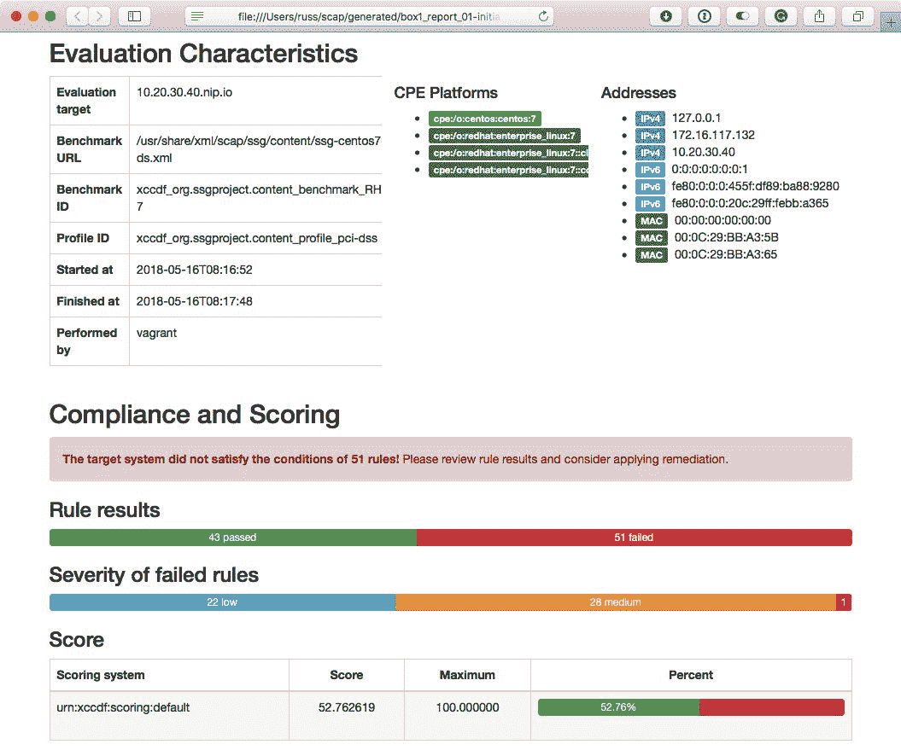
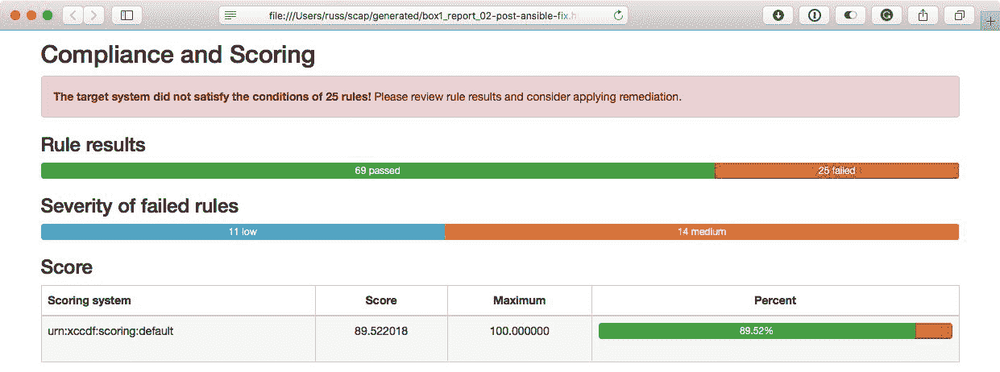
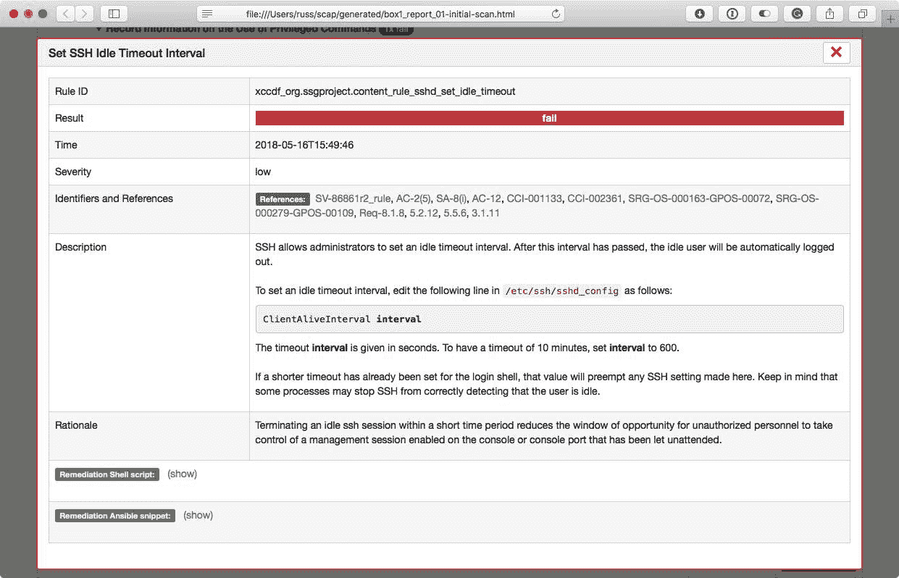
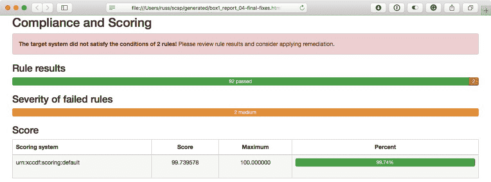

# 十三、使用 Ansible 和 OpenSCAP 强化您的服务器

使用像 Ansible 这样的编排和配置工具的一个优点是，它可以用于在跨许多主机的可重复任务中生成和部署一组复杂的配置。在这一章中，我们将看一看一个工具，它实际上为您生成配置，然后应用。

在本章中，我们将学习如何使用 Ansible 和 OpenSCAP 加固基于红帽的 CentOS 7.5.1804 主机。

# 技术要求

我们将瞄准一个运行 CentOS Linux 7 . 5 . 1804 发行版的游民盒子；我们之所以使用这个盒子，是因为它附带了 OpenSCAP 的最新版本。最终行动手册的副本可以在本书附带的存储库中找到；知识库可在[https://github . com/PacktPublishing/Learn-ansi ble/tree/master/chapter 13/scap](https://github.com/PacktPublishing/Learn-Ansible/tree/master/Chapter13/scap)找到。

# OpenSCAP

我们将看到由红帽维护的一组工具中的一个，叫做 OpenSCAP。在我们继续之前，我觉得我应该警告您，下一节将包含许多缩写，从 SCAP 开始。

那么，什么是 SCAP 呢？**安全内容自动化协议** ( **SCAP** )是一个开放标准，包含几个组件，所有组件本身都是开放标准，以构建一个框架，允许您根据**国家标准和技术研究所** ( **NIST** )特别出版物 800-53 自动评估和修复您的主机。

本出版物是适用于所有美国联邦信息技术系统的控制目录，除了那些由**国家安全局** ( **国家安全局**)维护的系统。这些控制措施已经到位，有助于在美国各联邦部门实施 2002 年《T4 联邦信息安全管理法》。

SCAP 由以下组件组成:

*   **资产识别** ( **AID** )是用于资产识别的数据模型。
*   **资产报告格式** ( **ARF** )是一种供应商中立且技术不可知的数据模型，用于在不同的报告应用和服务之间传输资产信息。
*   **常用配置枚举** ( **CCE** )是常用软件推荐配置的标准数据库。每个推荐都有一个唯一的标识符。在编写本报告时，该数据库自 2013 年以来一直没有更新。
*   **常用配置评分系统** ( **CCSS** )是 CCE 的延续。它用于为所有类型的部署中的各种软件和硬件配置生成分数。
*   **通用平台枚举** ( **CPE** )是一种识别组织基础架构中存在的硬件资产、操作系统和软件的方法。一旦确定，这些数据就可以用于搜索其他数据库，以对资产进行威胁评估。
*   **常见弱点枚举** ( **CWE** )是一种通用语言，用于处理和讨论系统架构、设计和代码中可能导致漏洞的弱点的原因。
*   **常见漏洞和暴露** ( **CVE** )是一个公开承认的漏洞数据库。大多数系统管理员和信息技术专业人员都会在某个时候遇到 CVE 数据库。每个漏洞都会收到一个唯一的标识；例如，大多数人都会知道 CVE-2014-0160，它也被称为**心痛**。
*   **通用漏洞评分系统** ( **CVSS** )是一种帮助捕获漏洞特征以产生标准化数值分数的方法，该分数可用于描述漏洞的影响，例如低、中、高和严重。
*   **可扩展配置清单描述格式** ( **XCCDF** )是描述安全清单的 XML 格式。它还可以用于配置和基准测试，并为 SCAP 的所有部分提供了一种通用语言。
*   **开放检查表交互语言** ( **OCIL** )是向最终用户表达问题的框架，也是以标准化方式处理回答的过程。
*   **开放漏洞和评估语言** ( **OVAL** )是用 XML 定义的，旨在通过 NIST、MITRE 公司、**美国计算机应急准备小组** ( **US-CERT** )和美国**国土安全部** ( **DHS** )提供的所有工具和服务来标准化安全内容的传输。
*   **安全自动化数据的信任模型** ( **TMSAD** )是一个 XML 文档，旨在定义一个通用的信任模型，该模型可以应用于构成 SCAP 的所有组件正在交换的数据。

正如你所能想象的，已经有成千上万的人工年投入到生产 SCAP 和构成其基础的组件中。自 90 年代中期以来，一些项目已经以这样或那样的形式出现，因此它们已经很好地建立起来，并被认为是安全最佳实践的事实标准；然而，我相信你在想，这一切听起来都很复杂——毕竟，这些都是学者、安全专业人士和政府部门已经定义并正在维护的标准。

这就是 OpenSCAP 的用武之地。由红帽维护的 OpenSCAP 项目也因支持 SCAP 1.2 标准而获得了 NIST 的认证，它允许您使用命令行客户端应用我们讨论过的所有最佳实践。

OpenSCAP 和许多红帽项目一样，正在获得对 Ansible 的支持，当前版本引入了对自动生成 Ansible 行动手册的支持，以修复在 OpenSCAP 扫描过程中发现的不符合项。

The automatic remediation scripts in the current version of OpenSCAP are a work in progress and there are known issues, which we will address toward the end of the chapter. Because of this, your output may differ from that covered in this chapter.

在接下来的部分中，我们将启动 CentOS 7.5.1804 游民箱，对其进行扫描，并生成补救行动手册。由于 playbook 支持才刚刚推出，还没有 100%覆盖修复，因此我们将再次扫描主机，然后使用 Ansible 生成修复 bash 脚本，并在我们的主机上执行，然后再执行另一次扫描，这样我们就可以比较所有三次扫描的结果。

# 准备主机

在开始扫描之前，我们需要一个主机作为目标，所以让我们快速创建文件夹结构和`Vagrantfile`。要创建结构，请运行以下命令:

```
$ mkdir scap scap/group_vars scap/roles
$ touch scap/Vagrantfile scap/production scap/site.yml scap/group_vars/common.yml
```

我们创建的`scap/Vagrantfile`应该包含以下代码:

```
# -*- mode: ruby -*-
# vi: set ft=ruby :

API_VERSION = "2"
BOX_NAME = "russmckendrick/centos75"
BOX_IP = "10.20.30.40"
DOMAIN = "nip.io"
PRIVATE_KEY = "~/.ssh/id_rsa"
PUBLIC_KEY = '~/.ssh/id_rsa.pub'

Vagrant.configure(API_VERSION) do |config|
  config.vm.box = BOX_NAME
  config.vm.network "private_network", ip: BOX_IP
  config.vm.host_name = BOX_IP + '.' + DOMAIN
  config.vm.synced_folder ".", "/vagrant", disabled: true
  config.ssh.insert_key = false
  config.ssh.private_key_path = [PRIVATE_KEY, "~/.vagrant.d/insecure_private_key"]
  config.vm.provision "file", source: PUBLIC_KEY, destination: "~/.ssh/authorized_keys"

  config.vm.provider "virtualbox" do |v|
    v.memory = "2024"
    v.cpus = "2"
  end

  config.vm.provider "vmware_fusion" do |v|
    v.vmx["memsize"] = "2024"
    v.vmx["numvcpus"] = "2"
  end

end
```

这意味着主机清单文件`scap/production`应包含以下内容:

```
box1 ansible_host=10.20.30.40.nip.io

[scap]
box1

[scap:vars]
ansible_connection=ssh
ansible_user=vagrant
ansible_private_key_file=~/.ssh/id_rsa
host_key_checking=False 
```

我们可以使用以下命令之一启动游民箱:

```
$ vagrant up
$ vagrant up --provider=vmware_fusion
```

现在我们已经准备好了目标主机，可以执行初始扫描了。

# 剧本

我们将把剧本分成几个不同的角色。与前几章不同，我们将使一些角色可重用，并在执行时向它们传递参数。我们的第一个角色很简单，它安装了我们运行 OpenSCAP 扫描所需的包。

# 安装角色

如前所述，第一个角色是一个简单的角色，它安装我们运行扫描所需的包:

```
$ ansible-galaxy init roles/install
```

我们需要在`roles/install/defaults/main.yml`中设置几个默认值；这些是:

```
install:
  packages:
    - "openscap-scanner"
    - "scap-security-guide"
```

`roles/install/tasks/main.yml`中有一个任务，它安装软件包并执行`yum`更新:

```
- name: update all of the installed packages
  yum:
    name: "*"
    state: "latest"
    update_cache: "yes"

- name: install the packages needed
  package:
    name: "{{ item }}"
    state: latest
  with_items: "{{ install.packages }}"
```

就是这个角色；我们将在每次运行扫描时调用它，以确保我们安装了正确的软件包来运行扫描本身。

# 扫描角色

现在我们已经安装了 OpenSCAP 包，我们可以创建一个执行扫描的角色:

```
$ ansible-galaxy init roles/scan
```

如前所述，我们将在整个行动手册中重用这个角色，这为我们提供了一个易于解决的问题。默认情况下，即使您多次定义角色，Ansible 在剧本运行期间也只会执行一次角色。为了允许角色执行多次，我们需要在`roles/scan/meta/main.yml`文件的顶部添加以下一行:

```
allow_duplicates: true
```

这指示 Ansible 在剧本运行期间多次执行这个角色。接下来，我们需要给`group_vars/common.yml`文件添加一些变量。这些关键价值将在我们行动手册中使用的所有角色中共享。第一组嵌套变量如下所示:

```
oscap:
  profile: "xccdf_org.ssgproject.content_profile_pci-dss"
  policy: "ssg-centos7-ds.xml"
  policy_path: "/usr/share/xml/scap/ssg/content/"
```

这些定义了我们要使用的配置文件以及要应用的策略。默认情况下，OpenSCAP 不附带任何策略；这些是与`scap-security-guide`包装一起安装的。这个套餐提供了几个政策，都可以在`/usr/share/xml/scap/ssg/content/`找到；以下终端截图显示了该文件夹的目录列表:


对于我们的剧本，我们将使用`ssg-centos7-ds.xml`策略，或者给它一个恰当的名称，`PCI-DSS v3 Control Baseline for CentOS Linux 7`。

The **Payment Card Industry Data Security Standard** (**PCI-DSS**) is a standard that's been agreed upon by all of the major credit card operators that anyone handling cardholder data must adhere to. The standard is a set of security controls that are audited either by an external auditor or via a self-assessment questionnaire, depending on the number of transactions you handle.

以下嵌套变量定义了我们将存储扫描生成的各种文件的位置:

```
report:
  report_remote_path: "/tmp/{{ inventory_hostname }}_report_{{ report_name }}.html"
  report_local_path: "generated/{{ inventory_hostname }}_report_{{ report_name }}.html"
  results: "/tmp/{{ inventory_hostname }}_results_{{ report_name }}.xml" 
```

如您所见，我们有 HTML 报告的远程和本地路径。这是因为作为行动手册运行的一部分，我们将把报告复制到我们的 Ansible 控制器上。

现在我们有了共享变量，我们需要向`roles/scan/defaults/main.yml`文件添加一个默认变量:

```
scan_command: >
  oscap xccdf eval --profile {{ oscap.profile }}
    --fetch-remote-resources
    --results-arf {{ report.results }}
    --report {{ report.report_remote_path }}
    {{ oscap.policy_path }}{{ oscap.policy }}
```

这是我们将运行以启动扫描的命令。在编写时，没有任何 OpenSCAP 模块，因此我们需要使用`command`模块执行`oscap`命令。有趣的是，我将该命令拆分到变量的多行中，以便于阅读。

因为我使用了`>`，所以在将变量应用于任务时，Ansible 实际上将在单行上呈现命令，这意味着我们不必像在命令行上运行多行命令那样在每行的末尾添加`\`。

角色的最后一部分是任务本身。我们将把所有的任务放到`roles/scan/tasks/main.yml`文件中，从执行我们定义的命令的任务开始:

```
- name: run the openscap scan
  command: "{{ scan_command }}"
  args:
    creates: "{{ report.report_remote_path }}"
  ignore_errors: yes
```

`ignore_errors`在这里极其重要。就 Ansible 而言，这个任务将一直运行，除非我们从扫描中获得 100%干净的健康清单。下一个任务将扫描生成的 HTML 报告从我们的目标主机复制到我们的 Ansible 控制器:

```
- name: download the html report
  fetch:
    src: "{{ report.report_remote_path }}"
    dest: "{{ report.report_local_path }}"
    flat: yes
```

现在我们有了两个角色，我们可以开始运行第一次扫描了。

# 运行初始扫描

现在我们已经完成了安装和扫描角色，我们可以运行我们的第一次扫描。我们唯一没有涉及的文件是`site.yml`文件；这个看起来与我们在其他章节中使用的略有不同:

```
---

- hosts: scap
  gather_facts: true
  become: yes
  become_method: sudo

  vars_files:
    - group_vars/common.yml

  roles:
    - { role: install, tags: [ "scan" ] }
    - { role: scan, tags: [ "scan" ], report_name: "01-initial-scan" }
```

如您所见，我们正在标记角色，并在运行扫描时传递参数。目前，我们只运行 playbook，不使用任何标签。要运行行动手册，请发出以下命令:

```
$ ansible-playbook -i production site.yml
```

这将给我们以下结果:

```
PLAY [scap] ****************************************************************************************

TASK [Gathering Facts] *****************************************************************************
ok: [box1]

TASK [install : install the packages needed] *******************************************************
changed: [box1] => (item=openscap-scanner)
changed: [box1] => (item=scap-security-guide)

```

```
TASK [scan : run the openscap scan] ****************************************************************
fatal: [box1]: FAILED! => {"changed": true, "cmd": ["oscap", "xccdf", "eval", "--profile", "xccdf_org.ssgproject.content_profile_pci-dss", "--fetch-remote-resources", "--results-arf", "/tmp/box1_results_01-initial-scan.xml", "--report", "/tmp/box1_report_01-initial-scan.html", "/usr/share/xml/scap/ssg/content/ssg-centos7-ds.xml"], "delta": "0:01:03.459407", "end": "2018-05-16 08:17:50.970321", "msg": "non-zero return code", "rc": 2, "start": "2018-05-16 08:16:47.510914", "stderr": "Downloading: https://www.redhat.com/security/data/oval/com.redhat.rhsa-RHEL7.xml.bz2 ... ok", "stderr_lines": ["Downloading: https://www.redhat.com/security/data/oval/com.redhat.rhsa-RHEL7.xml.bz2 ... ok"], "stdout": "Title\r\tEnsure Red Hat GPG Key Installed\nRule\r\txccdf_org.ssgproject.content_rule_ensure_redhat_gpgkey_installed\nResult\r\tpass\n\nTitle\r\tEnsure gpgcheck Enabled In Main Yum "\txccdf_org.ssgproject.content_rule_chronyd_or_ntpd_specify_multiple_servers", "Result", "\tpass"]}
...ignoring

TASK [scan : download the html report] *************************************************************
changed: [box1]

PLAY RECAP *****************************************************************************************
box1 : ok=4 changed=3 unreachable=0 failed=0
```

我已经在这个输出中截断了扫描结果，但是当您运行它时，您会看到一大部分失败的输出被染成红色。如前所述，这是意料之中的事，没什么好担心的。

我们初始扫描的 HTML 报告副本现在应该在您的 Ansible 控制器上；您可以使用以下命令在浏览器中打开它:

```
$ open generated/box1_report_01-initial-scan.html
```

或者，打开`generated`文件夹，双击`box1_report_01-initial-scan.html`:



从示例中可以看出，我们的主机在 OpenSCAP 运行的 94 次检查中有 51 次失败。让我们看看如何减少失败检查的数量。

# 生成补救行动手册

在我们继续之前，我必须首先提请你注意，该报告提出了以下警告:

如果没有在非运行环境中进行测试，请勿尝试实施本指南中的任何设置。本指南的创作者对其他方使用本指南不承担任何责任，也不对其质量、可靠性或任何其他特征做出任何明示或暗示的保证。

虽然我们在这里只针对一个测试主机，但是如果您喜欢您所看到的，并决定针对其他工作负载实施 OpenSCAP，请确保在针对任何正在使用的东西运行之前，您会慢慢地、彻底地进行测试，即使它只是由开发人员进行的——在我们即将进行的修复期间所做的更改可能会对您的目标主机的运行产生严重后果。

现在我们已经排除了这个警告，我们可以继续使用自动生成的 Ansible 行动手册来保护我们的主机:

```
$ ansible-galaxy init roles/fix-ansible
```

有了这个角色，我们需要一些默认值来定义我们生成的剧本将被排序的位置，我们还需要定义需要运行的命令。这些值可以在`roles/fix-ansible/defaults/main.yml`中找到。

第一个块处理我们将要生成的文件在目标主机和本地的存储位置:

```
playbook_file:
  remote: "/tmp/{{ inventory_hostname }}_ansible.yml"
  local: "generated/{{ inventory_hostname }}_ansible.yml"
  log: "generated/{{ inventory_hostname }}_ansible.log"
```

接下来，我们需要执行以下命令来生成行动手册文件:

```
ansible_fix_command: >
  oscap xccdf generate fix
    --profile {{ oscap.profile }}
    --template urn:xccdf:fix:script:ansible
    --output {{ playbook_file.remote }}
    {{ report.results }}
```

然后，我们有一些文件夹和文件的位置，需要在行动手册运行之前到位；否则，将导致错误和失败:

```
missing_folders:
  - "/etc/dconf/db/local.d/locks/"

missing_files:
  - "/etc/dconf/db/local.d/locks/00-security-settings-lock"
  - "/etc/sysconfig/prelink"
```

现在我们已经有了默认的变量，我们可以开始向`roles/fix-ansible/tasks/main.yml`添加任务，从一个使用`file`模块将丢失的文件夹和文件放置到位的任务开始:

```
- name: fix missing folders
  file:
    path: "{{ item }}"
    state: "directory"
  with_items: "{{ missing_folders }}"

- name: fix missing files
  file:
    path: "{{ item }}"
    state: "touch"
  with_items: "{{ missing_files }}"
```

接下来，我们将添加一项检查，以查看目标计算机上是否已经存在剧本文件:

```
- name: do we already have the playbook?
  stat:
    path: "{{ playbook_file.remote }}"
  register: playbook_check
```

我们这样做是为了能够跳过运行已经生成的剧本。接下来，我们运行命令来生成行动手册:

```
- name: generate the ansible playbook with the fixes
  command: "{{ ansible_fix_command }}"
  args:
    creates: "{{ playbook_file.remote }}" 
  ignore_errors: yes
```

如您所见，我们正在传递参数，告诉 Ansible 创建剧本文件的命令；如果文件在那里，则该命令不会再次执行。现在我们在机器上有了剧本，我们需要把它复制到我们的 Ansible 控制器上。这里，我们再次使用`fetch`模块:

```
- name: download the ansible playbook
  fetch:
    src: "{{ playbook_file.remote }}"
    dest: "{{ playbook_file.local }}"
    flat: yes
  when: playbook_check.stat.exists == False
```

如您所见，我们正在使用`when`，因此只有在角色运行开始时剧本文件不存在的情况下，任务才会运行。既然我们在本地有了一份剧本，我们就可以运行它了。为此，我们将使用`local_action`模块和`command`模块在 Ansible 中运行 Ansible:

```
- name: run the ansible playbook locally
  local_action:
    module: "command ansible-playbook -i production --become --become-method sudo {{ playbook_file.local }}"
  become: no
  register: playbook_run
  when: playbook_check.stat.exists == False
```

这里发生了一些不同的事情，所以让我们从我们正在运行的命令开始，对它进行进一步的分解，它可以解释为:

```
$ ansible-playbook -i production --become --become-method sudo generated/box1_ansible.yml
```

如您所见，我们必须将使用`become`的说明和`sudo`的方法作为命令的一部分。这是因为正在生成的 Ansible 行动手册没有考虑到您使用 root 以外的用户进行外部连接。

这个角色的最后一个任务将前一个任务的结果写入我们的 Ansible 控制器上的一个文件:

```
- name: write the results to a log file
  local_action:
    module: "copy content={{ playbook_run.stdout }} dest={{ playbook_file.log }}"
  become: no
  when: playbook_check.stat.exists == False
```

这就完成了这个角色。我们可以再次运行行动手册来应用修复和补救，然后运行另一次扫描，以便更新`site.yml`文件，使其内容如下:

```
---

- hosts: scap
  gather_facts: true
  become: yes
  become_method: sudo

  vars_files:
    - group_vars/common.yml

  roles:
    - { role: install, tags: [ "scan" ] }
    - { role: scan, tags: [ "scan" ], report_name: "01-initial-scan" }
    - { role: fix-ansible, report_name: "01-initial-scan" }
    - { role: scan, report_name: "02-post-ansible-fix" }
```

如您所见，我们已经移除了`fix-ansible`角色的标签，并且我们还更新了第二个`scan`的报告名称。我们可以通过运行以下命令来启动行动手册:

```
$ ansible-playbook -i production site.yml
```

这为我们提供了以下输出:

```
PLAY [scap] *************************************************************************************

TASK [Gathering Facts] **************************************************************************
ok: [box1]

TASK [install : update all of the installed packages] *******************************************
ok: [box1]

TASK [install : install the packages needed] ****************************************************
ok: [box1] => (item=openscap-scanner)
ok: [box1] => (item=scap-security-guide)

TASK [scan : run the openscap scan] *************************************************************
ok: [box1]

TASK [scan : download the html report] **********************************************************
ok: [box1]

TASK [fix-ansible : fix missing folders] ********************************************************
changed: [box1] => (item=/etc/dconf/db/local.d/locks/)

TASK [fix-ansible : fix missing files] **********************************************************
changed: [box1] => (item=/etc/dconf/db/local.d/locks/00-security-settings-lock)
changed: [box1] => (item=/etc/sysconfig/prelink)

TASK [fix-ansible : do we already have the playbook?] *******************************************
ok: [box1]

TASK [fix-ansible : generate the ansible playbook with the fixes] *******************************
changed: [box1]

TASK [fix-ansible : download the ansible playbook] **********************************************
changed: [box1]

TASK [fix-ansible : run the ansible playbook locally] *******************************************
changed: [box1 -> localhost]

TASK [fix-ansible : write the results to a log file] ********************************************
changed: [box1 -> localhost]

TASK [scan : run the openscap scan] *************************************************************
fatal: [box1]: FAILED! => 
...ignoring

TASK [scan : download the html report] **********************************************************
changed: [box1]

PLAY RECAP **************************************************************************************
box1 : ok=14 changed=8 unreachable=0 failed=0
```

让我们看一下报告，看看运行 Ansible 行动手册有什么不同:

```
$ open generated/box1_report_02-post-ansible-fix.html
```

输出如下所示:



这比以前好了一点；然而，我们仍然没有遵守 25 条规则——为什么？如前所述，将所有补救规则移植到 Ansible 的工作仍在进行中；例如，如果您打开原始扫描结果并滚动到底部，您应该会看到“设置 SSH 空闲超时间隔”检查失败。

点击它将向您显示关于 OpenSCAP 正在检查什么的信息，他们为什么检查它，以及为什么它应该被修复。最后，在底部，您会注意到有一些选项可以同时显示 shell 和 Ansible 补救解决方案:



现在，单击第二个报告中剩余的故障之一。您应该注意到，只有一个使用 shell 脚本进行补救的选项。我们将在下一个角色中生成此内容，但在继续之前，让我们快速查看生成的剧本。

我在撰写本文时生成的行动手册包含 3200 多行代码，因此我不打算在这里一一介绍，但是正如我们已经提到的设置 SSH 空闲超时间隔检查，让我们来看看行动手册中应用该修复的任务:

```
    - name: Set SSH Idle Timeout Interval
      lineinfile:
        create: yes
        dest: /etc/ssh/sshd_config
        regexp: ^ClientAliveInterval
        line: "ClientAliveInterval {{ sshd_idle_timeout_value }}"
        validate: sshd -t -f %s
      #notify: restart sshd
      tags:
        - sshd_set_idle_timeout
        - low_severity
        - restrict_strategy
        - low_complexity
        - low_disruption
        - CCE-27433-2
        - NIST-800-53-AC-2(5)
        - NIST-800-53-SA-8(i)
        - NIST-800-53-AC-12
        - NIST-800-171-3.1.11
        - PCI-DSS-Req-8.1.8
        - CJIS-5.5.6
        - DISA-STIG-RHEL-07-040320
```

正如您所看到的，它使用 lineinfile 模块来应用在剧本最顶部定义的变量。此外，每个任务都标记了大量关于修复属于标准的哪些领域以及严重性的信息。这意味着我们可以非常精确地了解剧本的哪些部分在运行；例如，您只能使用以下命令运行低中断更改:

```
$ ansible-playbook -i production --become --become-method sudo --tags "low_disruption" generated/box1_ansible.yml
```

最后，在`box1_ansible.log`文件的底部，我们可以看到剧本运行进行了以下更改:

```
PLAY RECAP **************************************************************************************
box1 : ok=151 changed=85 unreachable=0 failed=0 
```

# 生成修复 bash 脚本

为了解决剩余的问题，我们应该生成并执行 bash 脚本:

```
$ ansible-galaxy init roles/fix-bash
```

由于这是一个很好的机会，我不打算详细介绍我们在这里添加的内容的来龙去脉。`roles/fix-bash/defaults/main.yml`的内容类似于`fix-ansible`角色中的内容:

```
bash_file:
  remote: "/tmp/{{ inventory_hostname }}_bash.sh"
  log: "generated/{{ inventory_hostname }}_bash.log"

bash_fix_command: >
  oscap xccdf generate fix
    --profile {{ oscap.profile }}
    --output {{ bash_file.remote }}
    {{ report.results }}
```

`roles/fix-bash/tasks/main.yml`中的任务也类似，不需要任何解释:

```
- name: do we already have the bash script?
  stat:
    path: "{{ bash_file.remote }}"
  register: bash_script_check

- name: generate the bash script
  command: "{{ bash_fix_command }}"
  args:
    creates: "{{ bash_file.remote }}" 
  ignore_errors: yes

- name: run the bash script
  command: "bash {{ bash_file.remote }}"
  ignore_errors: yes
  register: bash_run
  when: bash_script_check.stat.exists == False

- name: write the results to a log file
  local_action:
    module: "copy content={{ bash_run.stdout }} dest={{ bash_file.log }}"
  become: no
  when: bash_script_check.stat.exists == False
```

更新`site.yml`文件，使其为:

```
- hosts: scap
  gather_facts: true
  become: yes
  become_method: sudo

  vars_files:
    - group_vars/common.yml

  roles:
    - { role: install, tags: [ "scan" ] }
    - { role: scan, tags: [ "scan" ], report_name: "01-initial-scan" }
    - { role: fix-ansible, report_name: "01-initial-scan" }
    - { role: scan, report_name: "02-post-ansible-fix" }
    - { role: fix-bash, report_name: "02-post-ansible-fix" }
    - { role: scan, report_name: "03-post-bash-fix" }
```

这意味着我们可以获取在 Ansible 修复后运行的扫描结果，以生成包含剩余修复的 bash 脚本；然后我们做最后一次扫描。要应用最后一批修复，请运行以下命令:

```
$ ansible-playbook -i production site.yml
```

这给出了以下输出:

```
PLAY [scap] *************************************************************************************

TASK [Gathering Facts] **************************************************************************
ok: [box1]

TASK [install : update all of the installed packages] *******************************************
ok: [box1]

TASK [install : install the packages needed] ****************************************************
ok: [box1] => (item=openscap-scanner)
ok: [box1] => (item=scap-security-guide)

TASK [scan : run the openscap scan] *************************************************************
ok: [box1]

TASK [scan : download the html report] **********************************************************
ok: [box1]

TASK [fix-ansible : fix missing folders] ********************************************************
ok: [box1] => (item=/etc/dconf/db/local.d/locks/)

TASK [fix-ansible : fix missing files] **********************************************************
changed: [box1] => (item=/etc/dconf/db/local.d/locks/00-security-settings-lock)
changed: [box1] => (item=/etc/sysconfig/prelink)

TASK [fix-ansible : do we already have the playbook?] *******************************************
ok: [box1]

TASK [fix-ansible : generate the ansible playbook with the fixes] *******************************
skipping: [box1]

TASK [fix-ansible : download the ansible playbook] **********************************************
skipping: [box1]

TASK [fix-ansible : run the ansible playbook locally] *******************************************
skipping: [box1]

TASK [fix-ansible : write the results to a log file] ********************************************
skipping: [box1]

TASK [scan : run the openscap scan] *************************************************************
ok: [box1]

TASK [scan : download the html report] **********************************************************
ok: [box1]

TASK [fix-bash : do we already have the bash script?] *******************************************
ok: [box1]

TASK [fix-bash : generate the bash script] ******************************************************
changed: [box1]

TASK [fix-bash : run the bash script] ***********************************************************
changed: [box1]

TASK [fix-bash : write the results to a log file] ***********************************************
changed: [box1 -> localhost]

TASK [scan : run the openscap scan] *************************************************************
fatal: [box1]: FAILED! =>
...ignoring

TASK [scan : download the html report] **********************************************************
changed: [box1]

PLAY RECAP **************************************************************************************
box1 : ok=16 changed=6 unreachable=0 failed=0
```

通过运行以下命令检查最终报告:

```
$ open generated/box1_report_03-post-bash-fix.html
```

这应该显示失败检查的总数已经减少到只有五个:


# 运行独立扫描

当我们创建扫描角色时，提到该角色应该是可重用的。当我们在`site.yml`文件中定义角色时，我们也给角色添加了标签。让我们快速了解一下如何在完整的剧本运行之外运行扫描。要启动扫描，请运行以下命令:

```
$ ansible-playbook -i production --tags "scan" --extra-vars "report_name=scan-only" site.yml
```

这将只运行剧本中标记为`scan`的部分，我们还覆盖了`report_name`变量，该变量是我们在调用`site.yml`文件中的角色来调用我们的`report box1_report_scan-only.html`时设置的:


# 修复剩余的失败检查

到目前为止，我们还没有采取任何硬编码的修复措施来解决扫描中发现的任何问题。我们不得不创建一些文件和文件夹来应用修复，但这更多的是为了让自动修复工作，而不是修复。

在撰写本文时，我的扫描结果显示，五个问题中有两个存在已知问题；这些是:

*   `xccdf_org.ssgproject.content_rule_audit_rules_privileged_commands`
*   `xccdf_org.ssgproject.content_rule_audit_rules_login_events`

正在进行修复。你可以在红帽的 Bugzilla 上找到它们:

*   [https://bugzilla . red hat . com/show _ bug . CGI？id=1570802](https://bugzilla.redhat.com/show_bug.cgi?id=1570802)
*   [https://bugzilla . red hat . com/show _ bug . CGI？id=1574586](https://bugzilla.redhat.com/show_bug.cgi?id=1574586)

所以，把这两个放在一边，现在我可以搞定三个。为此，我将创建一个单独的角色和剧本，因为当您阅读本文时，可能不需要以下修复:

```
$ ansible-galaxy init roles/final-fixes
```

直接跳到`roles/final-fixes/tasks/main.yml`，我们的第一个修复是每天轮换日志，而不是每周轮换，这是默认的。为此，我们将使用`lineinfile`模块将`weekly`替换为`daily`:

```
- name: sort out the logrotate
  lineinfile:
    path: "/etc/logrotate.conf"
    regexp: "^weekly"
    line: "daily"
```

下一个任务添加了一个修复，应该会在某个时候进入`scap-security-guide`包:

```
- name: add the missing line to the modules.rules
  lineinfile:
    path: "/etc/audit/rules.d/modules.rules"
    line: "-a always,exit -F arch=b32 -S init_module -S delete_module -k modules"
```

如您所见，在这里，我们再次使用`lineinfile`模块。这一次，如果`/etc/audit/rules.d/modules.rules`还没有出现，我们就给它加一条线。这添加了一个考虑 32 位内核和 64 位内核的规则，修复脚本已经配置了这些内核。

接下来，我们将为应该在 bash 脚本执行期间执行的脚本添加一个修复。首先，我们需要使用`file`模块创建一个文件:

```
- name: add file for content_rule_file_permissions_var_log_audit
  file:
    path: "/var/log/audit/audit.log.fix"
    state: "touch"
```

然后，我们需要复制并执行 bash 脚本中第一次运行时失败的部分:

```
- name: copy the content_rule_file_permissions_var_log_audit.sh script
  copy:
    src: "content_rule_file_permissions_var_log_audit.sh"
    dest: "/tmp/content_rule_file_permissions_var_log_audit.sh"

- name: run the content_rule_file_permissions_var_log_audit.sh script 
  command: "bash /tmp/content_rule_file_permissions_var_log_audit.sh"
```

bash 脚本本身可以在`roles/final-fixes/files/content_rule_file_permissions_var_log_audit.sh`找到，看起来是这样的:

```
if `grep -q ^log_group /etc/audit/auditd.conf` ; then
  GROUP=$(awk -F "=" '/log_group/ {print $2}' /etc/audit/auditd.conf | tr -d ' ')
  if ! [ "${GROUP}" == 'root' ] ; then
    chmod 0640 /var/log/audit/audit.log
    chmod 0440 /var/log/audit/audit.log.*
  else
    chmod 0600 /var/log/audit/audit.log
    chmod 0400 /var/log/audit/audit.log.*
  fi

  chmod 0640 /etc/audit/audit*
  chmod 0640 /etc/audit/rules.d/*
else
  chmod 0600 /var/log/audit/audit.log
  chmod 0400 /var/log/audit/audit.log.*
  chmod 0640 /etc/audit/audit*
  chmod 0640 /etc/audit/rules.d/*
fi
```

最后，我们需要创建一个名为`final-fixes.yml`的剧本文件。这将运行我们刚刚创建的角色，然后运行最终扫描:

```
---

- hosts: scap
  gather_facts: true
  become: yes
  become_method: sudo

  vars_files:
    - group_vars/common.yml

  roles:
    - { role: final-fixes }
    - { role: scan, report_name: "04-final-fixes" }
```

要运行行动手册，请使用以下命令:

```
$ ansible-playbook -i production final-fixes.yml
```

这将产生以下结果:

```
PLAY [scap] *************************************************************************************

TASK [Gathering Facts] **************************************************************************
ok: [box1]

TASK [final-fixes : sort out the logrotate] *****************************************************
changed: [box1]

TASK [final-fixes : add the missing line to the modules.rules] **********************************
changed: [box1]

TASK [final-fixes : add file for content_rule_file_permissions_var_log_audit] *******************
changed: [box1]

TASK [final-fixes : copy the content_rule_file_permissions_var_log_audit.sh script] *************
changed: [box1]

TASK [final-fixes : run the content_rule_file_permissions_var_log_audit.sh script] **************
changed: [box1]

TASK [scan : run the openscap scan] *************************************************************
fatal: [box1]: FAILED! => 
...ignoring

TASK [scan : download the html report] **********************************************************
changed: [box1]

PLAY RECAP **************************************************************************************
box1 : ok=8 changed=7 unreachable=0 failed=0
```

打开使用以下命令生成的报告:

```
$ open generated/box1_report_04-final-fixes.html
```

这向我们表明，只有两种已知问题的介质检查仍然失败:



希望在你阅读这篇文章的时候，你的主人会得到一份干净的健康证明，这最后一部分将不再需要，这就是为什么我把它从主要的`site.yml`剧本中分离出来。

# 摧毁流浪的盒子

一旦你完成了，不要忘记摧毁流浪的盒子；您不想让一个空闲的虚拟机在您的主机上运行。为此，请运行:

```
$ vagrant destroy
```

一旦盒子用完，我建议在干净的安装上运行几次扫描和修复，了解如何在新主机上实现这一点。

# 摘要

在本章中，我们创建了一个行动手册，该手册生成了一个行动手册来补救扫描过程中发现的任何 PCI-DSS 违规错误。除了非常酷之外，如果您想象您运行的几十台服务器都需要合规，并且都需要完整的审计历史记录，这也非常实用。

现在，您已经有了行动手册的基础，可以用来每天锁定这些主机，对它们进行审核并将结果存储在远离主机的地方，而且根据您的配置，您还可以自动解决扫描过程中发现的任何不符合项。

我们在本章中所做的扫描都是基于主机的；在下一章中，我们将了解如何远程扫描主机。

# 问题

1.  给多行变量添加`>`有什么作用？
2.  真假:OpenSCAP 是 NIST 认证的。
3.  如果`scan`命令被标记为失败，我们为什么要告诉 Ansible 继续？
4.  解释为什么我们对某些角色使用标签。
5.  对或错:我们正在使用`copy`命令将 HTML 报告从远程主机复制到 Ansible 控制器。

# 进一步阅读

您可以在以下链接中找到更多关于我们在本章中介绍的技术和组织的信息:

*   **open scap**:[https://www.open-scap.org/](https://www.open-scap.org/)
*   **安全内容自动化协议**(**SCAP**):[https://scap.nist.gov/](https://scap.nist.gov/)
*   **NIST**:[https://www.nist.gov/](https://www.nist.gov/)
*   **米特公司**:[https://www.mitre.org/](https://www.mitre.org/)
*   **资产识别(AID)**:[https://CSRC . NIST . gov/project/Security-Content-Automation-Protocol/Specifications/AID](https://csrc.nist.gov/Projects/Security-Content-Automation-Protocol/Specifications/aid)
*   **资产报告格式(ARF)**:[https://CSRC . NIST . gov/project/Security-Content-Automation-Protocol/Specifications/ARF](https://csrc.nist.gov/Projects/Security-Content-Automation-Protocol/Specifications/arf)
*   **常用配置枚举(CCE)**:[https://cce.mitre.org](https://cce.mitre.org)
*   **通用配置评分系统****(CCSS)**:[https://www . NIST . gov/publications/Common-Configuration-评分-System-ccss-metrics-software-security-Configuration](https://www.nist.gov/publications/common-configuration-scoring-system-ccss-metrics-software-security-configuration)
*   **通用平台枚举(CPE)**:[https://nvd.nist.gov/products/cpe](https://nvd.nist.gov/products/cpe)
*   **常见弱点列举(CWE)**:[https://cwe.mitre.org/](https://cwe.mitre.org/)
*   **常见漏洞和暴露(CVE)**:[https://cve.mitre.org](https://cve.mitre.org)
*   **常见漏洞评分系统(CVSS)**:[https://www.first.org/cvss/](https://www.first.org/cvss/)
*   **可扩展配置清单描述格式(XCCDF)**:[https://CSRC . NIST . gov/project/Security-Content-Automation-Protocol/Specifications/XCCDF](https://csrc.nist.gov/Projects/Security-Content-Automation-Protocol/Specifications/xccdf)
*   **开放检查表交互语言(OCIL)**:[https://CSRC . NIST . gov/project/Security-Content-Automation-Protocol/Specifications/ocil](https://csrc.nist.gov/Projects/Security-Content-Automation-Protocol/Specifications/ocil)
*   **开放漏洞和评估语言(OVAL)**:[https://oval.mitre.org](https://oval.mitre.org)
*   **安全自动化数据信任模型(TMSAD)**:[https://www . NIST . gov/publications/Trust-Model-Security-Automation-Data-10-TMSAD](https://www.nist.gov/publications/trust-model-security-automation-data-10-tmsad)