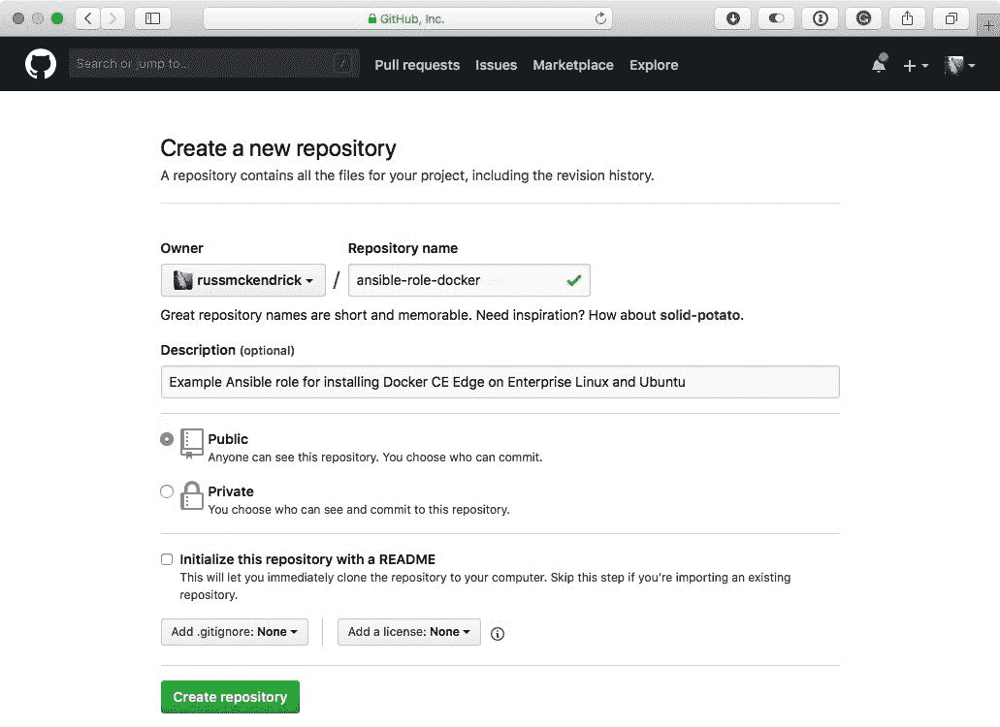
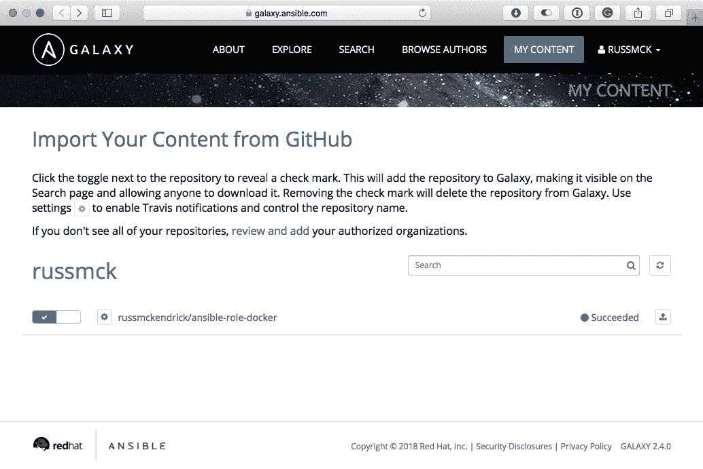
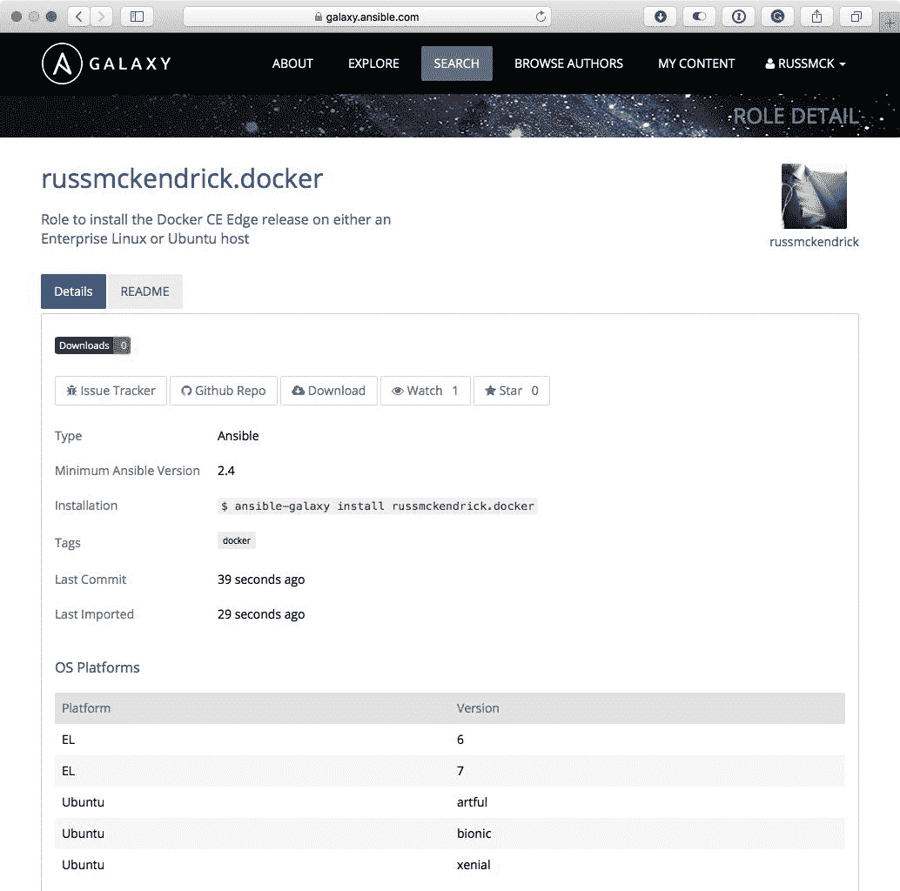
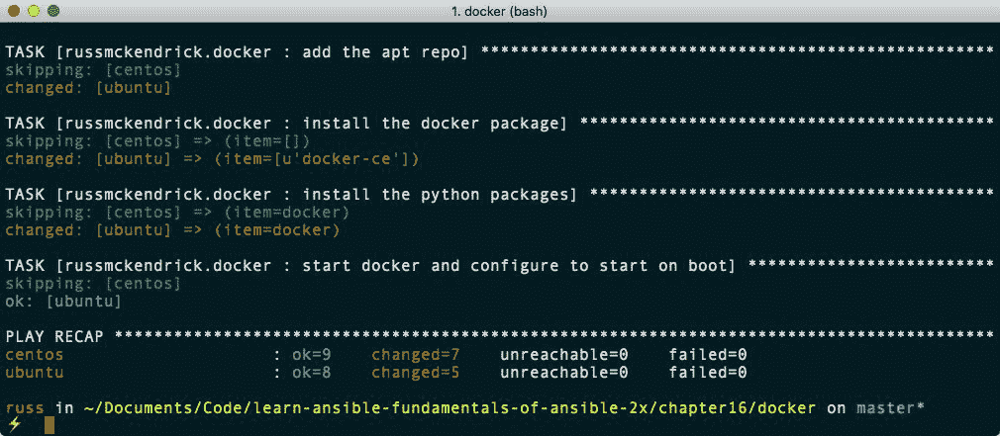

# 十六、`ansible-galaxy`

在前面的章节中，我们一直在使用`ansible-galaxy`命令。在本章中，我们将了解该命令提供的更多功能。Ansible Galaxy 是一个社区贡献角色的在线存储库；我们将发现一些可用的最佳角色，如何使用它们，以及如何创建自己的角色并将其托管在 Ansible Galaxy 上。

到本章结束时，我们将完成以下工作:

*   `ansible-galaxy`简介
*   如何在自己的行动手册中使用 Ansible Galaxy 中的角色
*   如何编写自己的角色并提交给 Ansible Galaxy

# 技术要求

同样，本章我们将使用一个本地的游民箱；使用的行动手册可以在随附的资源库中找到[https://github . com/packt publishing/Learn-ansi ble/tree/master/chapter 16](https://github.com/PacktPublishing/Learn-Ansible/tree/master/Chapter16)。你还需要访问一个 GitHub 账户——一个免费账户就可以了——你可以在[http://github.com/](http://github.com/)注册一个。

# `ansible-galaxy`介绍

Ansible Galaxy 有很多:首先也是最重要的，它是一个可以在[https://galaxy.ansible.com/](https://galaxy.ansible.com/)找到的网站。该网站是社区贡献的角色和模块的家园:


到目前为止，我们一直在编写自己的角色，这些角色与我们剧本中使用的 Ansible 核心模块进行交互。而不是自己写角色。我们可以使用 Ansible Galaxy 上发布的 15，000 多个角色中的一个——这些角色涵盖了大量任务，并支持 Ansible 支持的几乎所有操作系统。

`ansible-galaxy`命令是一种从您自己的命令行舒适地与 Ansible Galaxy 网站交互的方式，并且能够引导角色。正如我们在前面的章节中一直在使用它一样，我们也可以使用它在 Ansible Galaxy 上下载、搜索和发布我们自己的角色。

最后，红帽已经开放了 Ansible Galaxy 的源代码，这意味着如果您需要在防火墙后分配自己的角色，您也可以运行自己版本的网站。

# 詹金斯剧本

让我们直接进入，创建一个剧本，只使用从 Ansible Galaxy 下载的角色来安装 Jenkins。

Jenkins, formerly the Hudson project, is an open source continuous integration and continuous delivery server written in Java. It is expandable using plugins and has grown much bigger than its original purpose of compiling Java applications.

首先，我们需要几个文件；让我们现在通过运行以下命令来创建这些文件:

```
$ mkdir jenkins
$ cd jenkins
$ touch production requirements.yml site.yml Vagrantfile
```

如您所见，我们并没有像前几章那样创建`roles`或`group_vars`文件夹。相反，我们正在创建一个`requirements.yml`文件。这将包含一个我们想从 Ansible Galaxy 下载的角色列表。

在我们的案例中，我们将使用以下两个角色:

*   **Java**:[https://galaxy . anxible . com/geelingguy/Java/](https://galaxy.ansible.com/geerlingguy/java/)
*   **詹金斯**:[https://galaxy.ansible.com/geerlingguy/jenkins/](https://galaxy.ansible.com/geerlingguy/jenkins/)

第一个角色`geerlingguy.java`管理我们主机上 Java 的安装，第二个角色`geerlingguy.jenkins`管理 Jenkins 本身的安装和配置。要安装角色，我们需要在我们的`requirements.yml`文件中添加以下几行:

```
- src: "geerlingguy.java"
- src: "geerlingguy.jenkins"
```

添加后，我们可以通过运行以下命令来下载角色:

```
$ ansible-galaxy install -r requirements.yml
```

您应该会看到如下输出:


从终端输出中可以看到，这两个角色已经从 GitHub 项目的`roles`文件夹中下载并放置在`~/.ansible/roles/`文件夹中。

Using `~` in a path on macOS and Linux is shorthand for current users' home directory.

可以忽略警告；这只是让我们知道`geerlingguy.jenkins`角色想要安装一个旧版本的`geerlingguy.java`角色。就我们而言，这不会引起任何问题。

现在我们已经下载了我们的两个角色，我们可以为我们编写`site.yml`文件来启动 Jenkins。这应该如下所示:

```
---

- hosts: jenkins
  gather_facts: true
  become: yes
  become_method: sudo

  vars:
    java_packages: "java-1.8.0-openjdk"
    jenkins_hostname: "10.20.30.60.nip.io"
    jenkins_admin_username: "ansible"
    jenkins_admin_password: "Pa55w0rD"

  roles:
    - geerlingguy.java
    - geerlingguy.jenkins
```

请注意，我们只是提供了角色的名称。默认情况下，如果在行动手册本地的`roles`文件夹中找不到角色，Ansible 将在`~/.ansible/roles/`文件夹中搜索角色。

我们还传递了四个变量:

*   `java_packages`:这是我们想要角色安装的`geerlingguy.java` 角色的名字；由于 Jenkins 需要 Java 8，而我们运行的是 CentOS 7 主机，所以包名为`java-1.8.0-openjdk`。

其余三个变量影响`geerlingguy.jenkins`角色的配置:

*   `jenkins_hostname`:这是我们要访问詹金斯的网址；和前面的章节一样，我们使用`nip.io`服务为我们的游民箱提供一个可解析的主机名
*   `jenkins_admin_username`:这是我们要为访问 Jenkins 配置的管理员用户名
*   `jenkins_admin_password`:这是用户的密码

接下来，我们有`production`主机的库存文件:

```
box ansible_host=10.20.30.60.nip.io

[jenkins]
box

[jenkins:vars]
ansible_connection=ssh
ansible_user=vagrant
ansible_private_key_file=~/.ssh/id_rsa
host_key_checking=False
```

最后`Vagrantfile`的内容如下:

```
# -*- mode: ruby -*-
# vi: set ft=ruby :

API_VERSION = "2"
BOX_NAME = "centos/7"
BOX_IP = "10.20.30.60"
DOMAIN = "nip.io"
PRIVATE_KEY = "~/.ssh/id_rsa"
PUBLIC_KEY = '~/.ssh/id_rsa.pub'

Vagrant.configure(API_VERSION) do |config|
  config.vm.box = BOX_NAME
  config.vm.network "private_network", ip: BOX_IP
  config.vm.host_name = BOX_IP + '.' + DOMAIN
  config.ssh.insert_key = false
  config.ssh.private_key_path = [PRIVATE_KEY, "~/.vagrant.d/insecure_private_key"]
  config.vm.provision "file", source: PUBLIC_KEY, destination: "~/.ssh/authorized_keys"

  config.vm.provider "virtualbox" do |v|
    v.memory = "2024"
    v.cpus = "2"
  end

  config.vm.provider "vmware_fusion" do |v|
    v.vmx["memsize"] = "2024"
    v.vmx["numvcpus"] = "2"
  end

end
```

现在我们已经准备好了所有需要的文件，并填充了正确的代码，我们可以启动我们的 Jenkins 服务器了。首先，我们需要创建游民箱:

```
$ vagrant up
$ vagrant up --provider=vmware_fusion
```

一旦游民箱启动并运行，我们可以使用以下命令运行剧本:

```
$ ansible-playbook -i production site.yml
```

安装和配置 Java 和 Jenkins 都需要几分钟；您可以在这里看到剧本的输出:

```
PLAY [jenkins] **********************************************************************************

TASK [Gathering Facts] **************************************************************************
ok: [box]

TASK [geerlingguy.java : Include OS-specific variables.] ****************************************
ok: [box]

TASK [geerlingguy.java : Include OS-specific variables for Fedora.] *****************************
skipping: [box]

TASK [geerlingguy.java : Include version-specific variables for Debian.] ************************
skipping: [box]

TASK [geerlingguy.java : Define java_packages.] *************************************************
skipping: [box]

TASK [geerlingguy.java : include_tasks] *********************************************************
included: /Users/russ/.ansible/roles/geerlingguy.java/tasks/setup-RedHat.yml for box

TASK [geerlingguy.java : Ensure Java is installed.] *********************************************
changed: [box] => (item=java-1.8.0-openjdk)

TASK [geerlingguy.java : include_tasks] *********************************************************
skipping: [box]

TASK [geerlingguy.java : include_tasks] *********************************************************
skipping: [box]

TASK [geerlingguy.java : Set JAVA_HOME if configured.] ******************************************
skipping: [box]

TASK [geerlingguy.jenkins : Include OS-Specific variables] **************************************
ok: [box]

TASK [geerlingguy.jenkins : Define jenkins_repo_url] ********************************************
ok: [box]

TASK [geerlingguy.jenkins : Define jenkins_repo_key_url] ****************************************
ok: [box]

TASK [geerlingguy.jenkins : Define jenkins_pkg_url] *********************************************
ok: [box]

TASK [geerlingguy.jenkins : include_tasks] ******************************************************
included: /Users/russ/.ansible/roles/geerlingguy.jenkins/tasks/setup-RedHat.yml for box

TASK [geerlingguy.jenkins : Ensure dependencies are installed.] *********************************
ok: [box]

TASK [geerlingguy.jenkins : Ensure Jenkins repo is installed.] **********************************
changed: [box]

TASK [geerlingguy.jenkins : Add Jenkins repo GPG key.] ******************************************
changed: [box]

TASK [geerlingguy.jenkins : Download specific Jenkins version.] *********************************
skipping: [box]

TASK [geerlingguy.jenkins : Check if we downloaded a specific version of Jenkins.] **************
skipping: [box]

TASK [geerlingguy.jenkins : Install our specific version of Jenkins.] ***************************
skipping: [box]

TASK [geerlingguy.jenkins : Ensure Jenkins is installed.] ***************************************
changed: [box]

TASK [geerlingguy.jenkins : include_tasks] ******************************************************
skipping: [box]

TASK [geerlingguy.jenkins : include_tasks] ******************************************************
included: /Users/russ/.ansible/roles/geerlingguy.jenkins/tasks/settings.yml for box

TASK [geerlingguy.jenkins : Modify variables in init file] **************************************
changed: [box] => (item={u'option': u'JENKINS_ARGS', u'value': u'--prefix='})
changed: [box] => (item={u'option': u'JENKINS_JAVA_OPTIONS', u'value': u'-Djenkins.install.runSetupWizard=false'})

TASK [geerlingguy.jenkins : Set the Jenkins home directory] *************************************
changed: [box]

TASK [geerlingguy.jenkins : Immediately restart Jenkins on init config changes.] ****************
changed: [box]

TASK [geerlingguy.jenkins : Set HTTP port in Jenkins config.] ***********************************
changed: [box]

TASK [geerlingguy.jenkins : Ensure jenkins_home /var/lib/jenkins exists] ************************
ok: [box]

TASK [geerlingguy.jenkins : Create custom init scripts directory.] ******************************
changed: [box]

RUNNING HANDLER [geerlingguy.jenkins : configure default users] *********************************
changed: [box]

TASK [geerlingguy.jenkins : Immediately restart Jenkins on http or user changes.] ***************
changed: [box]

TASK [geerlingguy.jenkins : Ensure Jenkins is started and runs on startup.] *********************
ok: [box]

TASK [geerlingguy.jenkins : Wait for Jenkins to start up before proceeding.] ********************
FAILED - RETRYING: Wait for Jenkins to start up before proceeding. (60 retries left).
 [WARNING]: Consider using the get_url or uri module rather than running curl. If you need to use
command because get_url or uri is insufficient you can add warn=False to this command task or set
command_warnings=False in ansible.cfg to get rid of this message.

ok: [box]

TASK [geerlingguy.jenkins : Get the jenkins-cli jarfile from the Jenkins server.] ***************
changed: [box]

TASK [geerlingguy.jenkins : Remove Jenkins security init scripts after first startup.] **********
changed: [box]

TASK [geerlingguy.jenkins : include_tasks] ******************************************************
included: /Users/russ/.ansible/roles/geerlingguy.jenkins/tasks/plugins.yml for box

TASK [geerlingguy.jenkins : Get Jenkins admin password from file.] ******************************
skipping: [box]

TASK [geerlingguy.jenkins : Set Jenkins admin password fact.] ***********************************
ok: [box]

TASK [geerlingguy.jenkins : Get Jenkins admin token from file.] *********************************
skipping: [box]

TASK [geerlingguy.jenkins : Set Jenkins admin token fact.] **************************************
ok: [box]

TASK [geerlingguy.jenkins : Create update directory] ********************************************
ok: [box]

TASK [geerlingguy.jenkins : Download current plugin updates from Jenkins update site] ***********
changed: [box]

TASK [geerlingguy.jenkins : Remove first and last line from json file] **************************
ok: [box]

TASK [geerlingguy.jenkins : Install Jenkins plugins using password.] ****************************

TASK [geerlingguy.jenkins : Install Jenkins plugins using token.] *******************************

PLAY RECAP **************************************************************************************
box : ok=32 changed=14 unreachable=0 failed=0
```

剧本完成后，您应该可以在`http://10.20.30.60.nip.io:8080/`访问新安装的 Jenkins，并使用我们在`site.yml`文件中定义的管理员用户名和密码登录:


如您所见，使用预定义的社区角色来部署我们的 Jenkins 安装比编写我们自己的角色要简单得多。几分钟之内，我们就能够编写剧本并部署应用，只需要对如何安装应用有一个基本的了解。事实上，只需要快速浏览 Ansible Galaxy 上这两个角色的自述文件。

# 发布角色

现在我们知道下载角色有多容易了，让我们看看如何通过创建角色为社区做出贡献。在最后几章中，我们已经使用 Ansible 安装了 Docker。因此，让我们以此为基础，扩展角色以支持 Ubuntu，并让它安装 Docker CE Edge 版本，而不是稳定版本。

# 创建码头工人角色

首先，我们需要基本的文件；要获取这些，请在通常存储代码的地方运行以下命令:

```
$ ansible-galaxy init ansible-role-docker
```

这将为我们提供新角色所需的目录和文件结构；我们现在可以开始创建角色了。

# 变量

我们将从`vars`文件夹中的文件开始；我们将保留`vars/main.yml`文件为空，并添加两个以`vars/RedHat.yml`开头的新文件:

```
---
# vars file for ansible-role-docker

docker:
  gpg_key: "https://download.docker.com/linux/centos/gpg"
  repo_url: "https://download.docker.com/linux/centos/docker-ce.repo"
  repo_path: "/etc/yum.repos.d/docker-ce.repo"
  edge: "docker-ce-edge"
  packages:
    - "docker-ce"
    - "device-mapper-persistent-data"
    - "lvm2"
    - "python-setuptools"
    - "libselinux-python"
  pip:
    - "docker"
```

下一个要添加的文件是`vars/Debian.yml`:

```
---
# vars file for ansible-role-docker

docker:
  gpg_key: "https://download.docker.com/linux/ubuntu/gpg"
  repo: "deb [arch=amd64] https://download.docker.com/linux/{{ ansible_distribution | lower }} {{ ansible_distribution_release | lower }} edge"
  system_packages:
    - "apt-transport-https"
    - "ca-certificates"
    - "curl"
    - "software-properties-common"
    - "python3-pip"
  packages:
    - "docker-ce"
  pip:
    - "docker"
```

这两个文件包含了我们安装 Docker CE 所需的所有信息。

# 任务

由于我们针对两种不同的操作系统，我们的`tasks/main.yml`文件需要如下所示:

```
---
# tasks file for ansible-role-docker

- name: include the operating system specific variables
  include_vars: "{{ ansible_os_family }}.yml"

- name: install the stack on centos
  import_tasks: install-redhat.yml
  when: ansible_os_family == 'RedHat'

- name: install the stack on ubuntu
  import_tasks: install-ubuntu.yml
  when: ansible_os_family == 'Debian'
```

如您所见，这与我们在[第 6 章](06.html#3BOFI0-0fda9dda24fc45e094341803448da041)、*针对多个发行版*在两个操作系统上安装 LEMP 栈时相同。`tasks/install-redhat.yml`文件看起来很像我们在前面章节中用来安装 Docker 的任务:

```
---
# tasks file for ansible-role-docker

- name: add the gpg key for the docker repo
  rpm_key:
    key: "{{ docker.gpg_key }}"
    state: "present"

- name: add docker repo from the remote url
  get_url:
    url: "{{ docker.repo_url }}"
    dest: "{{ docker.repo_path }}"
    mode: "0644"

- name: install the docker packages
  yum:
    name: "{{ item }}"
    state: "installed"
    update_cache: "yes"
    enablerepo: "{{ docker.edge }}"
  with_items: "{{ docker.packages }}"

- name: install pip
  easy_install:
    name: pip
    state: latest

- name: install the python packages
  pip:
    name: "{{ item }}"
  with_items: "{{ docker.pip }}"

- name: put selinux into permissive mode
  selinux:
    policy: targeted
    state: permissive

- name: start docker and configure to start on boot
  service:
    name: "docker"
    state: "started"
    enabled: "yes"
```

唯一不同的是，我们在安装软件包时启用了 Docker CE Edge 存储库，并且在安装 Docker 时没有运行`yum update`。我们没有这样做，因为当其他人运行角色时，更新服务器不是我们角色的决定；我们的角色应该只安装 Docker。

最终任务文件为`tasks/install-ubuntu.yml`。正如您已经猜到的，这包含了在 Ubuntu 主机上安装 Docker 的任务:

```
---
# tasks file for ansible-role-docker

- name: install the system packages
  apt:
    name: "{{ item }}"
    state: "present"
    update_cache: "yes"
  with_items: "{{ docker.system_packages }}"

- name: add the apt keys from a key server
  apt_key:
    url: "{{ docker.gpg_key }}"
    state: present

- name: add the apt repo
  apt_repository:
    repo: "{{ docker.repo }}"
    state: present

- name: install the docker package
  apt:
    name: "{{ item }}"
    state: "present"
    update_cache: "yes"
    force: "yes"
  with_items: "{{ docker.packages }}"

- name: install the python packages
  pip:
    name: "{{ item }}"
  with_items: "{{ docker.pip }}"

- name: start docker and configure to start on boot
  service:
    name: "docker"
    state: "started"
    enabled: "yes"
```

这就结束了我们在两个不同的操作系统上安装 Docker 所需的所有任务和变量。在前面的章节中，这已经足够让我们将角色添加到行动手册中并运行任务。然而，由于我们将在 Ansible Galaxy 上发布这个角色，我们需要添加一些关于这个角色的更多信息。

# [计]元数据

正如您在浏览 Ansible Galaxy 时可能看到的，上传的每个角色都有关于谁写的、何时写的、许可证、支持哪个版本的 Ansible 等信息。这些信息都取自`meta/main.yml`文件。我们发布的一个如下所示:

```
---

galaxy_info:
  author: "Russ McKendrick"
  description: "Role to install the Docker CE Edge release on either an Enterprise Linux or Ubuntu host"
  license: "license (BSD)"
  min_ansible_version: 2.4
  platforms:
    - name: EL
      versions:
      - 6
      - 7
    - name: Ubuntu
      versions:
      - bionic
      - artful
      - xenial
  galaxy_tags:
    - docker

dependencies: []
```

如您所见，我们在 YAML 文件中提供了信息，当我们发布该角色时，Ansible Galaxy 将阅读该信息。文件中的大部分信息都是不言自明的，所以我在这里就不赘述了:

*   `author`:这是你的名字或者选择的名字。
*   `description`:添加对自己角色的描述；这将出现在命令行和 web 界面的搜索中，因此请保持简短，不要添加任何标记。
*   `license`:你正在释放角色的许可证；默认为 BSD。
*   `min_ansible_version`:你的角色将使用的 Ansible 版本。请记住，如果您正在使用新功能，那么您必须使用该功能发布的版本。说你在使用 Ansible 1.9，但却在使用 Ansible 2.4 的模块，只会让用户感到沮丧。
*   `platforms`:这个支持的操作系统和版本列表是在显示角色信息时使用的，它将在用户选择使用您的角色时发挥作用。确保这是准确的，因为我们不想让用户失望。
*   `galaxy_tags`:这些标签被 Ansible Galaxy 用来帮助识别你的角色是做什么的。

在我们发布这个角色之前，还有最后一部分要看:文件`README.md`。

# 自述文件

我们需要完成的角色最后一部分是`README.md`文件；这包含了 Ansible Galaxy 网站上显示的信息。当我们使用`ansible-galaxy`启动我们的角色时，它创建了一个具有基本结构的`README.md`文件。我们角色的文件如下所示:

```
Ansible Docker Role
=========
This role installs the current Edge build Docker CE using the official repo, for more information on Docker CE see the official site at [https://www.docker.com/community-edition](https://www.docker.com/community-edition).

Requirements
------------
Apart from requiring root access via `become: yes` this role has no special requirements.

Role Variables
--------------
All of the variables can be found in the `vars` folder.

Dependencies
------------
None.

Example Playbook
----------------
An example playbook can be found below;

```
- hosts: docker
  gather_facts: true
  become: yes
  become_method: sudo

  roles:
    - russmckendrick.docker
```

License
-------
BSD

Author Information
------------------
This role is published by [Russ McKendrick](http://russ.mckendrick.io/).
```

现在我们已经准备好了所有需要的文件，我们可以考虑将我们的角色提交给 GitHub，然后在 Ansible Galaxy 上发布。

# 提交代码并发布

现在我们已经完成了我们的角色，我们需要把它推到一个公共的 GitHub 存储库中。有几个原因需要将其发布到公共存储库中，其中最重要的是任何潜在用户都需要下载您的角色。此外，Ansible Galaxy 链接到存储库，允许用户在选择将其作为行动手册的一部分执行之前查看您的角色。

在所有 GitHub 页面上，当你登录时，右上角有一个+图标；单击此处将弹出一个菜单，其中包含用于创建新存储库和导入存储库的选项，以及注册表和组织。从菜单中选择新建存储库，您将看到如下所示的屏幕:



命名存储库并输入描述；给你的仓库命名`ansible-role-your-role-name`是很重要的。Ansible Galaxy 中角色的名称将取决于您在`ansible-role`之后给出的名称，因此，在前面的示例中，我们的角色将被称为`your-role-name`，对于我们将要发布的角色，它将被称为`docker`。

现在我们有了我们的存储库，我们需要为我们的角色添加文件。返回到命令行中包含您的角色的文件夹，然后运行以下命令在本地初始化 Git 存储库。将其推送到 GitHub，确保您用自己的存储库网址替换存储库网址:

```
$ git init
$ git add -A .
$ git commit -m "first commit"
$ git remote add origin git@github.com:russmckendrick/ansible-role-docker.git
$ git push -u origin master
```

现在您应该已经上传了您的文件，并且您的存储库看起来应该与以下内容没有太大的不同:


If you have any problems pushing your code, I would recommend reading through the excellent documentation provided by GitHub on setting up Git ([https://help.github.com/articles/set-up-git/](https://help.github.com/articles/set-up-git/)) and pushing your first files ([https://help.github.com/articles/create-a-repo/](https://help.github.com/articles/create-a-repo/)).

现在我们已经上传了我们的文件，并且可以使用我们的 GitHub 凭据登录到 Ansible Galaxy，然后导入我们的角色。前往[https://galaxy.ansible.com/](https://galaxy.ansible.com/)的 Ansible Galaxy 主页，然后点击使用 GitHub 登录链接；这将带您到 GitHub，并要求您确认您可以授予 Ansible Galaxy 访问您帐户信息的权限。按照提示继续，您将返回到 Ansible Galaxy。

单击顶部菜单中的“我的内容”链接将带您进入一个页面，您可以在其中从 GitHub 导入内容；如果没有看到存储库列表，请单击搜索框旁边的刷新图标:



当您看到您的存储库被列出时，单击该角色旁边的开/关开关，应该就可以了。您的角色现在已导入。在顶部菜单中单击您的用户名将弹出一个下拉列表；从该列表中，选择我的导入。这将为您提供导入日志:


现在你的角色已经发布；你可以点击顶部的链接查看你的角色，链接上写着`russmckendrick/ansible-role-docker`。这将带您进入新添加角色的 Ansible Galaxy 页面，例如，[https://galaxy.ansible.com/russmckendrick/docker/](https://galaxy.ansible.com/russmckendrick/docker/):



如您所见，我们添加的所有元数据都显示在列表中，同时还有查看 README 文件的链接，该文件是从 GitHub 导入的，并且还有指向 GitHub 本身的链接。

# 测试角色

现在我们有了自己的角色，我们可以测试它。为此，我们需要一份行动手册、清单和需求文件，以及一个 CentOS 和 Ubuntu 服务器。运行以下命令来创建您需要的文件:

```
$ mkdir docker
$ cd docker
$ touch production requirements.yml site.yml Vagrantfile
```

生产库存文件应如下所示:

```
centos ansible_host=10.20.30.10.nip.io 
ubuntu ansible_host=10.20.30.20.nip.io ansible_python_interpreter=/usr/bin/python3

[docker]
centos
ubuntu

[docker:vars]
ansible_connection=ssh
ansible_user=vagrant
ansible_private_key_file=~/.ssh/id_rsa
host_key_checking=False
```

我们的`requirements.yml`文件只包含我们的 Docker 角色:

```
- src: "russmckendrick.docker"
```

我们的剧本，即`site.yml`文件，应该只是称呼我们的角色:

```
---

- hosts: docker
  gather_facts: true
  become: yes
  become_method: sudo

  roles:
    - russmckendrick.docker
```

最后，`Vagrantfile`应改为:

```
# -*- mode: ruby -*-
# vi: set ft=ruby :

API_VERSION = "2"
DOMAIN = "nip.io"
PRIVATE_KEY = "~/.ssh/id_rsa"
PUBLIC_KEY = '~/.ssh/id_rsa.pub'
CENTOS_IP = '10.20.30.10'
CENTOS_BOX = 'centos/7'
UBUNTU_IP = '10.20.30.20'
UBUNTU_BOX = 'generic/ubuntu1804'

Vagrant.configure(API_VERSION) do |config|

  config.vm.define "centos" do |centos|
      centos.vm.box = CENTOS_BOX
      centos.vm.network "private_network", ip: CENTOS_IP
      centos.vm.host_name = CENTOS_IP + '.' + DOMAIN
      centos.ssh.insert_key = false
      centos.ssh.private_key_path = [PRIVATE_KEY, "~/.vagrant.d/insecure_private_key"]
      centos.vm.provision "file", source: PUBLIC_KEY, destination: "~/.ssh/authorized_keys"

      centos.vm.provider "virtualbox" do |v|
        v.memory = "2024"
        v.cpus = "2"
      end

      centos.vm.provider "vmware_fusion" do |v|
        v.vmx["memsize"] = "2024"
        v.vmx["numvcpus"] = "2"
      end
  end

  config.vm.define "ubuntu" do |ubuntu|
      ubuntu.vm.box = UBUNTU_BOX
      ubuntu.vm.network "private_network", ip: UBUNTU_IP
      ubuntu.vm.host_name = UBUNTU_IP + '.' + DOMAIN
      ubuntu.ssh.insert_key = false
      ubuntu.ssh.private_key_path = [PRIVATE_KEY, "~/.vagrant.d/insecure_private_key"]
      ubuntu.vm.provision "file", source: PUBLIC_KEY, destination: "~/.ssh/authorized_keys"

      ubuntu.vm.provider "virtualbox" do |v|
        v.memory = "2024"
        v.cpus = "2"
      end

      ubuntu.vm.provider "vmware_fusion" do |v|
        v.vmx["memsize"] = "2024"
        v.vmx["numvcpus"] = "2"
      end
  end

end
```

现在我们已经准备好了所有文件，我们可以通过运行以下命令来下载我们的角色:

```
$ ansible-galaxy install -r requirements.yml
```

从下面的输出可以看出，这将把我们的角色下载到`~/.ansible/roles/`文件夹中:


接下来，通过运行以下任一命令来启动两个游民箱:

```
$ vagrant up
$ vagrant up --provider=vmware_fusion
```

盒子启动并运行后，我们可以通过以下方式运行行动手册:

```
$ ansible-playbook -i production site.yml 
```

从下面的输出可以看出，一切都按计划进行，角色在两个框上都安装了 Docker:



# Ansible 银河命令

在完成本章之前，让我们先快速了解一下`ansible-galaxy`命令的其他一些功能，首先是登录。

# 登录

可以从命令行登录 Ansible Galaxy 您可以通过使用以下方法来实现这一点:

```
$ ansible-galaxy login
```

这将要求您的 GitHub 用户名和密码；如果您在 GitHub 帐户上启用了双因素身份验证(您确实应该这样做)，那么这种方法将不起作用。相反，您需要提供个人访问令牌。您可以在以下网址生成个人访问令牌:[https://github.com/settings/tokens/](https://github.com/settings/tokens/)。获得令牌后，可以使用以下命令，用自己的令牌替换令牌:

```
$ ansible-galaxy login --github-token 0aa7c253044609b98425865wbf6z679a94613bae89 
```

下面的屏幕截图显示了前面命令的输出:


Personal access tokens will give anyone who has one full access to your GitHub account; please store them securely and, if possible, rotate them regularly.

# 进口

登录后，如果您对自己的角色进行了更改，并希望将这些更改导入到 Ansible Galaxy 中，您可以运行以下命令:

```
$ ansible-galaxy import russmckendrick ansible-role-docker
```

下面的屏幕截图显示了前面命令的输出:


我们传递给命令的两位信息是 GitHub 用户名，在我的例子中是`russmckendrick`，以及我们想要导入的存储库的名称——所以对于我们在上一节中发布的 Docker，我使用的是`ansible-role-docker`。

# 搜索

可以使用`ansible-galaxy`命令搜索角色。例如，运行以下命令当前会返回 725 个角色:

```
$ ansible-galaxy search docker
```

如果要按作者搜索角色，可以使用以下方法:

```
$ ansible-galaxy search --author=russmckendrick docker
```

从截图中的输出可以看到，这将返回我们发布的角色:


这很有用，因为您不必开始在终端和浏览器之间切换。

# 信息

我们要看的最后一个命令是`info`命令；该命令将打印出您提供给它的任何角色的信息。例如，运行以下内容将为您提供大量关于我们发布的角色的信息:

```
$ ansible-galaxy info russmckendrick.docker
```

下面的屏幕截图显示了前面命令的输出:


如您所见，您可以在网站上获得的所有信息也可以在命令行上获得，这意味着您可以选择如何与 Ansible Galaxy 交互。

# 摘要

在这一章中，我们深入研究了 Ansible Galaxy，它既是网站也是命令行工具。我相信您会同意，Ansible Galaxy 提供了有价值的社区服务，因为它允许 Ansible 用户为共同的任务共享角色，也是用户通过发布自己的角色为 Ansible 社区做出贡献的一种方式。

不过，要小心。在生产环境中使用来自 Ansible Galaxy 的角色之前，记得检查代码并通读错误跟踪器；毕竟，这些角色中的许多都需要具有升级权限，以便能够成功执行其任务。

在下一章，也是最后一章，我们将探讨 Ansible 如何集成到您的日常工作流程中。

# 问题

这一章只有一个任务。取一个我们之前创建的其他角色，将其改编为在多个操作系统上使用，并在 Ansible Galaxy 上发布。

# 进一步阅读

我们在这一章开头使用的两个角色都是由杰夫·格尔林发表的；你可以在[https://www.jeffgeerling.com/](https://www.jeffgeerling.com/)找到更多关于杰夫和他的项目的信息。