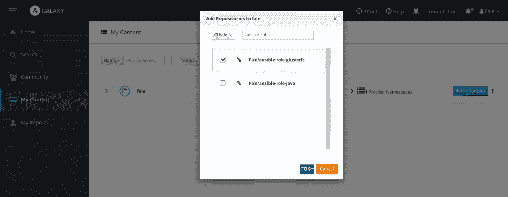
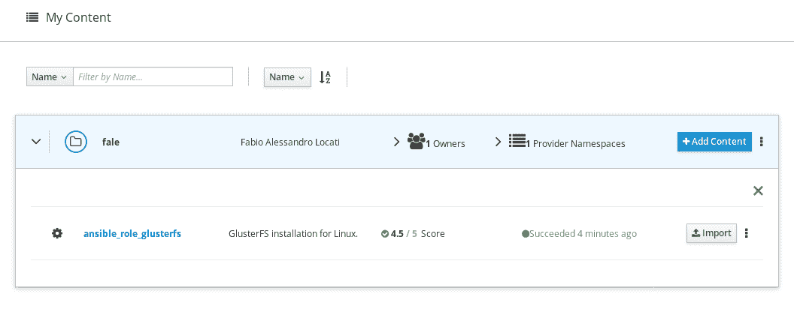

# 为企业介绍 Ansible

在前一章中，我们看到了 Ansible 的工作原理以及如何利用它。到目前为止，我们一直在假定我们的目标是 Unix 机器，我们将自己编写所有 playbook，并且 Ansible CLI 是我们要寻找的。现在我们将摆脱这些假设，看看如何超越典型的 Ansible 用法。

在本章中，我们将探讨以下主题：

+   Windows 上的 Ansible

+   Ansible Galaxy

+   Ansible Tower

# 技术要求

除了 Ansible 本身之外，为了能够在您的机器上按本章示例操作，您需要一个 Windows 机器。

# Windows 上的 Ansible

Ansible 版本 1.7 开始能够通过一些基本模块管理 Windows 机器。在 Ansible 被 Red Hat 收购后，Microsoft 和许多其他公司以及个人都为此付出了大量努力。到 2.1 版本发布之时，Ansible 管理 Windows 机器的能力已接近完整。一些模块已扩展以在 Unix 和 Windows 上无缝工作，而在其他情况下，Windows 逻辑与 Unix 有很大差异，因此需要创建新的模块。

在撰写本文时，尚不支持将 Windows 作为控制机器，尽管某些用户已调整了代码和环境使其能够运行。

从控制机器到 Windows 机器的连接不是通过 SSH 进行的；而是通过**Windows 远程管理**（**WinRM**）进行的。您可以访问微软的网站以获取详细解释和实施方法：[`msdn.microsoft.com/en-us/library/aa384426(v=vs.85).aspx`](https://docs.microsoft.com/en-in/windows/desktop/WinRM/portal)。

在控制机器上，一旦安装了 Ansible，重要的是安装 WinRM。您可以通过以下命令使用 `pip` 安装：

```
pip install "pywinrm>=0.3.0"  
```

您可能需要使用 `sudo` 或 `root` 帐户来执行此命令。

在每台远程 Windows 机器上，您需要安装 PowerShell 版本 3.0 或更高。Ansible 提供了一些有用的脚本来设置它：

+   WinRM ([`github.com/ansible/ansible/blob/devel/examples/scripts/ConfigureRemotingForAnsible.ps1`](https://github.com/ansible/ansible/blob/devel/examples/scripts/ConfigureRemotingForAnsible.ps1))

+   PowerShell 3.0 升级 ([`github.com/cchurch/ansible/blob/devel/examples/scripts/upgrade_to_ps3.ps1`](https://github.com/cchurch/ansible/blob/devel/examples/scripts/upgrade_to_ps3.ps1))

您还需要通过防火墙允许端口`5986`，因为这是默认的 WinRM 连接端口，并确保它可以从命令中心访问。

为确保可以远程访问服务，请运行 `curl` 命令：

```
curl -vk -d `` -u "$USER:$PASSWORD" "https://<IP>:5986/wsman".  
```

如果基本身份验证可用，则可以开始运行命令。设置完成后，您就可以开始运行 Ansible！让我们通过运行 `win_ping` 来运行 Ansible 中 Windows 版本的 `Hello, world!` 程序的等效程序。为此，让我们设置我们的凭据文件。

可以使用 `ansible-vault` 完成此操作，如下所示：

```
$ ansible-vault create group_vars/windows.yml  
```

正如我们已经看到的，`ansible-vault` 会要求您设置 `password`：

```
Vault password:
Confirm Vault password:  
```

此时，我们可以添加我们需要的变量：

```
ansible_ssh_user: Administrator 
ansible_ssh_pass: <password> 
ansible_ssh_port: 5986 
ansible_connection: winrm 
```

让我们设置我们的 `inventory` 文件，如下所示：

```
[windows] 
174.129.181.242 
```

在此之后，让我们运行 `win_ping`：

```
ansible windows -i inventory -m win_ping --ask-vault-pass  
```

Ansible 将要求我们输入 `Vault 密码`，然后打印运行结果，如下所示：

```
Vault password: 
174.129.181.242 | success >> { 
    "changed": false, 
    "ping": "pong" 
} 
```

我们已经看到了如何连接到远程计算机。现在，您可以以与管理 Unix 计算机相同的方式管理 Windows 计算机。需要注意的是，由于 Windows 操作系统和 Unix 系统之间存在巨大差异，不是每个 Ansible 模块都能正常工作。因此，许多 Unix 模块已经被从头开始重写，以具有与 Unix 模块相似的行为，但具有完全不同的实现方式。这些模块的列表可以在 [`docs.ansible.com/ansible/latest/modules/list_of_windows_modules.html`](https://docs.ansible.com/ansible/latest/modules/list_of_windows_modules.html) 找到。

# Ansible Galaxy

Ansible Galaxy 是一个免费网站，您可以在该网站上下载由社区开发的 Ansible 角色，并在几分钟内启动自动化。您可以分享或审查社区角色，以便其他人可以轻松找到 Ansible Galaxy 上最值得信赖的角色。您可以通过简单地注册 Twitter、Google 和 GitHub 等社交媒体应用程序，或者在 Ansible Galaxy 网站 [`galaxy.ansible.com/`](https://galaxy.ansible.com/) 上创建新帐户，并使用 `ansible-galaxy` 命令下载所需的角色，该命令随 Ansible 版本 1.4.2 及更高版本一起提供。

如果您想要托管自己的本地 Ansible Galaxy 实例，可以通过从 [`github.com/ansible/galaxy`](https://github.com/ansible/galaxy) 获取代码来实现。

要从 Ansible Galaxy 下载 Ansible 角色，请使用以下命令：

```
ansible-galaxy install username.rolename  
```

您也可以按照以下步骤指定版本：

```
ansible-galaxy install username.rolename[,version]  
```

如果您不指定版本，则 `ansible-galaxy` 命令将下载最新可用的版本。您可以通过以下两种方式安装多个角色；首先，通过将多个角色名称用空格分隔，如下所示：

```
ansible-galaxy install username.rolename[,version] username.rolename[,version]  
```

其次，您可以通过在文件中指定角色名称，并将该文件名传递给 `-r/--role-file` 选项来完成此操作。例如，您可以创建以下内容的 `requirements.txt` 文件：

```
user1.rolename,v1.0.0 
user2.rolename,v1.1.0 
user3.rolename,v1.2.1 
```

您可以通过将文件名传递给 `ansible-galaxy` 命令来安装角色，如下所示：

```
ansible-galaxy install -r requirements.txt  
```

让我们看看如何使用 `ansible-galaxy` 下载 Apache HTTPd 的角色：

```
ansible-galaxy install geerlingguy.apache  
```

您将看到类似以下内容的输出：

```
- downloading role 'apache', owned by geerlingguy
- downloading role from https://github.com/geerlingguy/ansible-role-apache/archive/3.0.3.tar.gz
- extracting geerlingguy.apache to /home/fale/.ansible/roles/geerlingguy.apache
- geerlingguy.apache (3.0.3) was installed successfully
```

前述的 `ansible-galaxy` 命令将把 Apache HTTPd 角色下载到 `~/.ansible/roles` 目录中。您现在可以直接在您的 playbook 中使用前述的角色，并创建 `playbooks/galaxy.yaml` 文件，并填写以下内容：

```
- hosts: web 
  user: vagrant 
  become: True 
  roles: 
    - geerlingguy.apache 
```

如您所见，我们创建了一个带有 `geerlingguy.apache` 角色的简单 playbook。现在我们可以测试它：

```
ansible-playbook -i inventory playbooks/galaxy.yaml 
```

这应该给我们以下输出：

```
PLAY [web] ***********************************************************

TASK [Gathering Facts] ***********************************************
ok: [ws01.fale.io]

TASK [geerlingguy.apache : Include OS-specific variables.] ***********
ok: [ws01.fale.io]

TASK [geerlingguy.apache : Include variables for Amazon Linux.] ******
skipping: [ws01.fale.io]

TASK [geerlingguy.apache : Define apache_packages.] ******************
ok: [ws01.fale.io]

TASK [geerlingguy.apache : include_tasks] ****************************
included: /home/fale/.ansible/roles/geerlingguy.apache/tasks/setup-RedHat.yml for ws01.fale.io

TASK [geerlingguy.apache : Ensure Apache is installed on RHEL.] ******
changed: [ws01.fale.io]

TASK [geerlingguy.apache : Get installed version of Apache.] *********
ok: [ws01.fale.io]

...
```

正如您可能已经注意到的，由于该角色设计用于在许多不同的 Linux 发行版上工作，因此跳过了许多步骤。

现在您知道如何利用 Ansible Galaxy 角色，您可以花更少的时间重写其他人已经写过的代码，并花更多的时间编写对您的架构特定且给您带来更多价值的部分。

# 将角色推送到 Ansible Galaxy

由于 Ansible Galaxy 是社区驱动的工作，您还可以将自己的角色添加到其中。在我们可以开始发布它的流程之前，我们需要对其进行准备。

Ansible 为我们提供了一个工具，可以从模板中引导一个新的 Galaxy 角色。为了利用它，我们可以运行以下命令：

```
ansible-galaxy init ansible-role-test
```

这将创建 `ansible-role-test` 文件夹，以及通常具有的所有文件夹的 Ansible 角色。

唯一对您新的文件将是 `meta/main.yaml`，即使没有 Ansible Galaxy 也可以使用，但包含了很多关于角色的信息，这些信息可被 Ansible Galaxy 读取。

可用于设置的主要信息在该文件中都可以找到，以满足您的需求，如下所示：

+   `author`：您的名字。

+   `description`：在此处放置角色的描述。

+   `company`：在此处放置您所工作公司的名称（或删除该行）。

+   `license`：设置您的模块将具有的许可证。一些建议的许可证包括 BSD（也是默认的），MIT，GPLv2，GPLv3，Apache 和 CC-BY。

+   `min_ansible_version`：设置您已测试过角色的最低 Ansible 版本。

+   `galaxy_tags`：在此部分中，放置您的模块适用的平台和版本。

+   `dependencies`：列出执行您的角色所需的角色。

要进行发布，您需要使用 GitHub 账户登录 Galaxy，然后您可以转到“我的内容”开始添加内容。

按下“添加内容”后，将会出现一个窗口，其中显示您可以选择的存储库，如下截图所示：



在选择正确的存储库后，然后点击“确定”按钮，Ansible Galaxy 将开始导入给定的角色。

如果您在执行此操作几分钟后返回到“我的内容”页面，您将看到您的角色及其状态，如下所示：



您现在可以像其他人一样使用该角色。记得在需要更改时更新它！

# Ansible Tower 和 AWX

Ansible Tower 是由 Red Hat 开发的基于 Web 的 GUI。Ansible Tower 提供了一个易于使用的仪表板，您可以在其中管理节点和基于角色的身份验证以控制对 Ansible Tower 仪表板的访问。Ansible Tower 的主要特点如下：

+   **LDAP/AD 集成**：您可以基于 Ansible Tower 对 LDAP/AD 服务器执行的查询结果导入（并授予权限给）用户。

+   **基于角色的访问控制**：它限制用户只能运行他们被授权运行的 Playbook，并/或者仅针对有限数量的主机。

+   **REST API**：所有 Ansible Tower 的功能都通过 REST API 暴露出来。

+   **作业调度**：Ansible Tower 允许我们调度作业（Playbook 执行）。

+   **图形化清单管理**：Ansible Tower 对清单的管理方式比 Ansible 更加动态。

+   **仪表盘**：Ansible Tower 允许我们查看所有当前和之前作业执行的情况。

+   **日志记录**：Ansible Tower 记录每次作业执行的所有结果，以便在需要时进行查看。

在 Red Hat 收购 Ansible Inc. 期间，承诺过将使 Ansible Tower 成为开源项目。2017 年，这一承诺得以实现，并且以 AWX 的名字回归。

AWX 和 Ansible Tower 在企业版中经常被使用，因为它为 Ansible 生态系统提供了非常方便的功能。我们将在接下来的章节中更详细地讨论这些功能。

# 概要

在本章中，我们已经了解了如何通过查看如何控制 Windows 主机将 Ansible 移出 Unix 世界。然后我们转向 Ansible Galaxy，在那里您可以找到许多其他人编写的角色，您可以简单地重用。最后，我们提到了 Ansible Tower，它是 AWX 的开源化身。在接下来的章节中，我们将更多地讨论关于 AWX 的内容，从安装过程到运行您的第一个作业。
