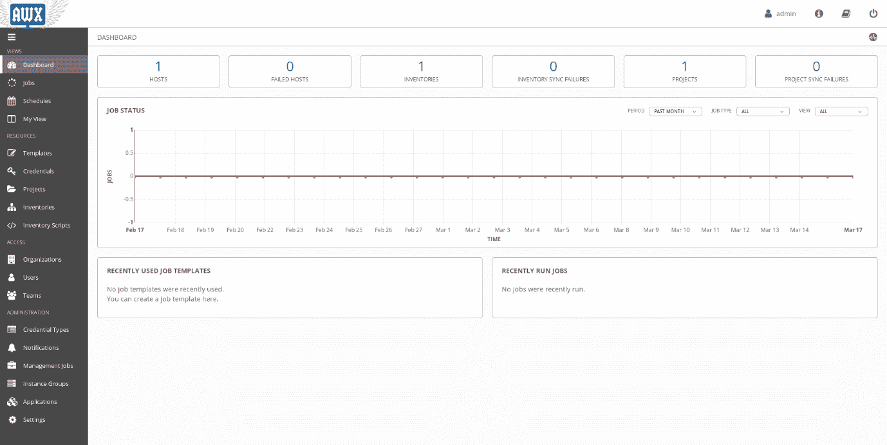
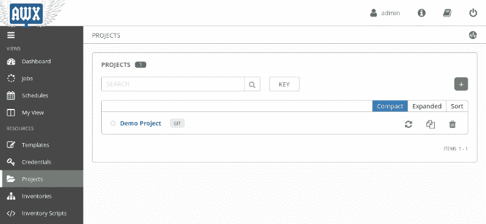
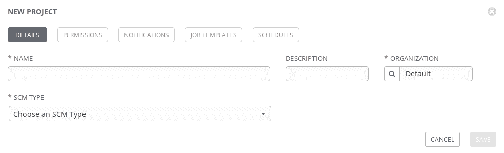
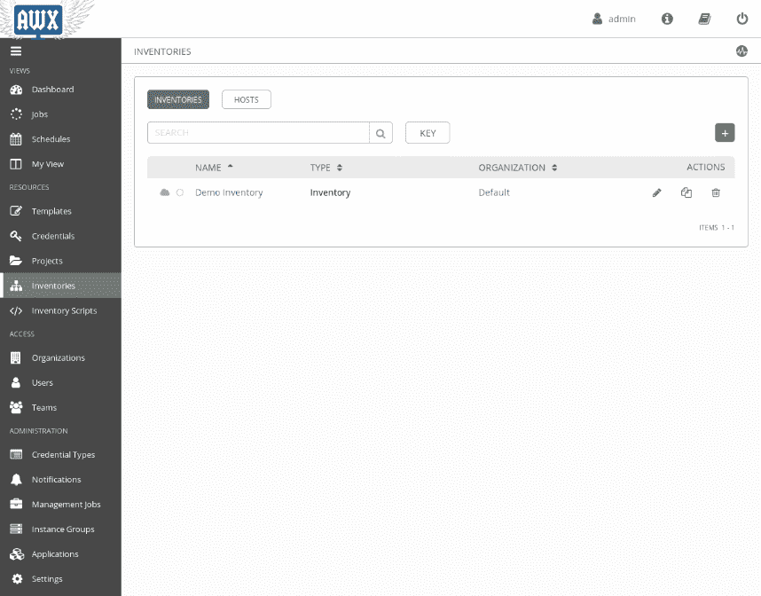
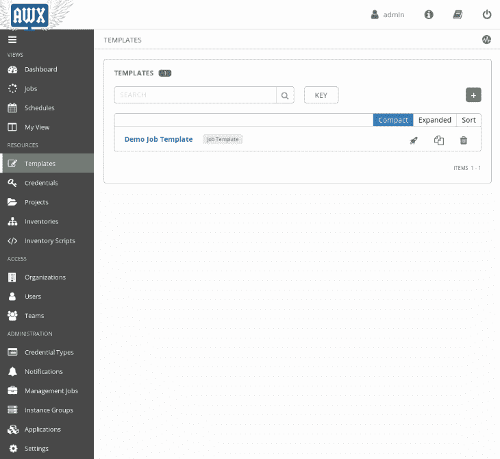
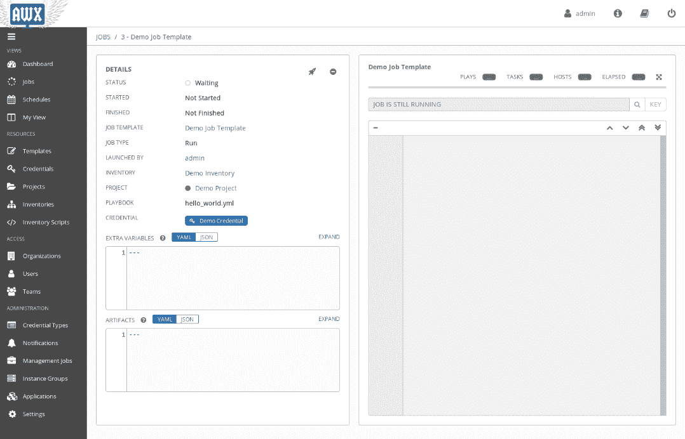
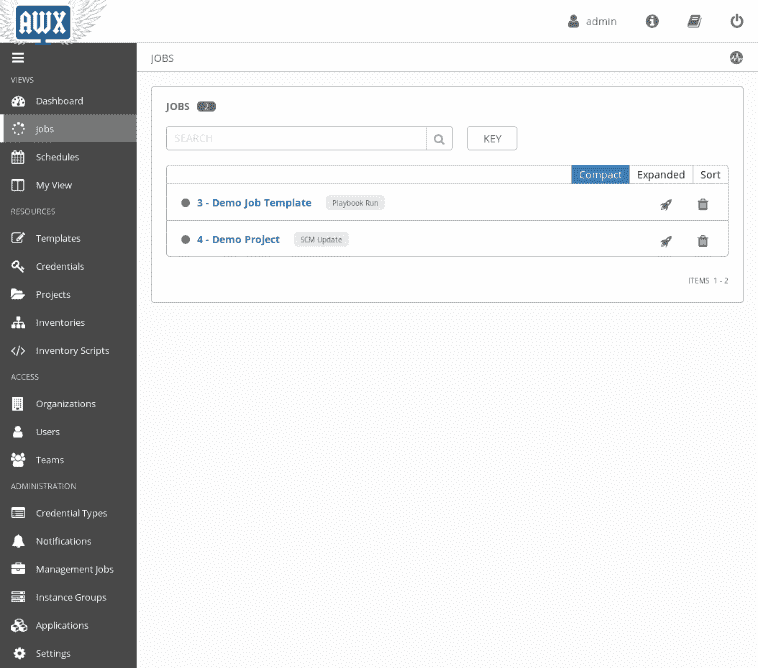

# 第十三章：开始使用 AWX

正如我们在前面的章节中所看到的，Ansible 是一个非常强大的工具。但这还不足以使其无处不在。事实上，要使一个工具无处不在，它需要在任何用户级别上都易于使用，并且易于以各种方式与现有环境集成。

Ansible 公司认识到了这一点，并创建了一个名为 Ansible Tower 的工具，它基本上是围绕 Ansible 构建的 Web UI 和 API 集。 Ansible Tower 是一个闭源工具，也是该公司的主要收入来源。 当红帽公司宣布收购 Ansible 时，其管理层也承诺将 Ansible Tower 开源化。 几年后，红帽公司开源了 Ansible Tower，创建了 AWX 项目，它现在是 Ansible Tower 的上游项目，就像 Fedora 是 Red Hat Enterprise Linux 的上游项目一样。

在 AWX 之前，开源社区中还开发了其他 Web UI 和 API 集，例如 Semaphore。 AWX 和 Ansible Tower 并不是今天 Ansible 的唯一 Web UI 和 API 集，但它们是更活跃的解决方案。

在本章中，我们将看到如何设置 AWX 并学习如何使用它。 更具体地说，我们将讨论以下内容：

+   设置 AWX

+   理解 AWX 项目是什么以及如何利用它

+   理解 AWX 清单是什么以及与 Ansible 清单的区别

+   理解 AWX 作业模板是什么以及如何创建一个

+   理解 AWX 作业是什么以及如何执行您的第一个作业

# 技术要求

对于本章，您需要一台可以运行 `ansible` 和 `docker` 并且已安装 `docker-py` 的机器。

# 设置 AWX

与 Ansible 不同，安装 AWX 不仅涉及一个单一命令，但仍然相当快速和简单。

首先，您需要安装 `ansible`、`docker` 和 `docker-py`。之后，您需要给所需用户运行 Docker 的权限。最后，您需要下载 AWX Git 仓库并执行一个 `ansible` playbook。

# 在 Fedora 中安装 Ansible、Docker 和 Docker-py

让我们从在 Fedora 中安装 `docker`、`ansible` 和 `docker-py` 包开始：

```
sudo dnf install ansible docker python-docker-py
```

要启动并启用 Docker 服务，请使用以下命令：

```
sudo systemctl start docker
sudo systemctl enable docker
```

现在我们已经安装了 `ansible`、`docker` 和 `docker-py`，让我们继续授予用户访问 Docker 的权限。

# 在 Fedora 中给当前用户授权使用 Docker

为确保当前用户可以使用 Docker（默认情况下，Fedora 仅允许 root 使用它），您需要创建一个新的 Docker 组，将当前用户分配到其中，并重新启动 Docker：

```
sudo groupadd docker && sudo gpasswd -a ${USER} docker && sudo systemctl restart docker
```

由于组只在会话开始时分配，所以您需要重新启动您的会话，但我们可以通过执行以下命令来强制 Linux 将新组添加到当前会话中：

```
newgrp docker
```

现在我们已经准备好了所有的先决条件，我们可以开始真正的 AWX 安装了。

# 安装 AWX

我们首先需要做的是通过执行以下命令来检出 `git` 代码库：

```
git clone https://github.com/ansible/awx.git
```

一旦 Git 完成了它的任务，我们就可以将目录更改为包含安装程序的目录并运行它：

```
cd awx/installer/
ansible-playbook -i inventory install.yml
```

这将在 Docker 容器和默认配置中安装 AWX。您可以通过更改相同文件夹中的`inventory`文件来调整配置（在运行最后一个命令之前）。

安装过程完成后，您可以打开浏览器，并指向`https://localhost`，然后使用`admin`用户名和`password`密码登录。

登录后，您应该会看到类似以下的页面：



设置了 AWX 后，您现在将能够执行 Ansible playbooks 而不再使用 Ansible CLI。要开始这个过程，我们首先需要一个项目，所以让我们看看如何设置它。

# 创建新的 AWX 项目

AWX 假设您已经将您的 playbooks 保存在某个地方，为了能够在 AWX 中使用它们，我们需要创建一个项目。

项目基本上是包含 Ansible 资源（角色和 playbooks）的存储库的 AWX 占位符。

当您进入项目部分时，在左侧菜单栏中，您将看到类似以下的内容：



如您所见，演示项目已经就位（安装程序为我们创建了它！）并且由一个 Git 存储库支持。

项目名称的左侧有一个白色圆圈，表示该特定项目尚未被拉取。如果有一个绿色圆圈，意味着项目已成功拉取。脉动的绿色圆圈表示拉取正在进行中，而红色停止标志表示出现了问题。

在项目的同一行，有三个按钮：

+   **获取 SCM 最新修订版本**：获取代码的当前最新版本

+   **复制**：创建项目的副本

+   **删除**：删除项目

在卡片的右上角，您可以看到一个绿色的加号按钮。这是一个允许我们添加更多项目的按钮。

通过选择它，一个新的**新项目**卡片将出现在**项目**卡片的顶部，您可以在其中添加新项目。

**新项目**卡片将如下所示：



它正在请求有关您要创建的项目的信息：

+   名称：这是您项目的显示名称。这是为了人类使用，所以要做到人性化！

+   描述：一个额外的显示（仍然是给人看的），以理解项目目标。

+   组织：将拥有该项目的组织。这将在下一章中介绍。现在，让我们保持默认设置。

+   SCM 类型：您的代码所包含的 SCM 类型。在撰写本文时，受支持的选项有：手动、Git、Mercurial、Subversion 和 Red Hat Insights。

+   根据您选择的 SCM 类型，将出现更多字段，例如 SCM URL 和 SCM 分支。

当您填写完所有必填字段后，您可以保存并看到已添加一个新项目。

# 使用 AWX 清单

AWX 清单是 AWX 世界中 Ansible 清单的等价物。由于 AWX 是一个图形工具，清单不像 Ansible 中那样存储为文件（如在 Ansible 中所做），而是可通过 AWX 用户界面进行管理。不绑定到文件还使 AWX 清单相对于 Ansible 清单具有更多的灵活性。

AWX 有不同的方式来管理清单。

您可以通过点击左侧菜单上的 Inventories 项目来查看，您将找到类似于此的内容：



至于项目，AWX 自带演示清单。

从左到右看，我们可以找到以下列：

+   云符号 - 用于清单同步状态

+   显示状态（正常或失败）的常规圆圈

+   清单名称

+   清单类型

+   拥有清单的组织

+   编辑符号

+   复制符号

+   删除符号

与之前一样，绿色 + 按钮将允许您创建新项目。点击它，它会询问您想要创建清单还是智能清单。

我们现在可以选择 Inventories 选项，它将允许您添加名称和组织（仅两个强制选项）以及其他非强制选项。一旦保存，您将能够添加主机、组和权限。

如果您不愿手工指定主机、组、变量等，还有一个 Sources 标签可供您使用。

点击 Sources 标签上的 +，您将能够从可用类型列表或使用自定义脚本添加来源。

撰写时可用的来源类型如下：

+   **从项目中获取**：基本上，它将从存储库导入一个 Ansible 核心清单文件。

+   **亚马逊 EC2**：它将使用 AWS API 来发现在您的环境中运行的所有 EC2 机器及其特性。

+   **谷歌计算引擎（GCE）**：它将使用 Google API 来发现您环境中运行的所有 GCE 机器及其特性。

+   **Microsoft Azure 资源管理器**：它将使用 Azure API 来发现在您的环境中运行的所有机器及其特性。

+   **VMWare vCenter**：它将使用 VMWare API 来发现由您的 vCenter 管理的所有机器及其特性。

+   **红帽 Satellite 6**：它将使用卫星 API 来发现由您的卫星管理的所有机器及其特性。

+   **红帽 CloudForms**：它将使用 CloudForms API 来发现由其管理的所有机器及其特性。

+   **OpenStack**：它将使用 OpenStack API 来发现在您的 OpenStack 环境中运行的所有机器及其特性。

+   **红帽虚拟化**：它将使用 RHEV API 来发现所有正在运行的机器及其特性。

+   **Ansible Tower**：它将使用另一个 Ansible Tower/AWX 安装 API 来发现其管理的所有机器及其特性。

+   **自定义脚本**：它将使用您在*清单脚本*部分上传的脚本。

我们现在已经看到如何设置 AWX 清单，这将在下一部分中需要：设置 AWX 作业模板。

# 理解 AWX 作业模板

在 AWX 中，我们有一个作业模板的概念，它基本上是对 playbook 的封装。

要管理作业模板，您必须转到左侧菜单中的“模板”部分，然后会发现类似以下内容：



查看包含作业模板的表格，我们会找到以下内容：

+   作业模板名称

+   模板类型（AWX 还支持工作流模板，这是一组作业模板的模板）

+   火箭按钮

+   复制按钮

+   删除按钮

通过点击火箭按钮，我们可以执行它。这样做会自动将您带入到不同的视图中，在下一节中我们会发现。

# 使用 AWX 作业

AWX 作业是 AWX 作业模板的执行，就像 Ansible 运行是 Ansible playbooks 的执行一样。

当您启动一个作业时，您会看到一个窗口，就像下面这个：



这是在命令行上运行 Ansible 时的 AWX 版本的输出。

几秒钟后，在右侧的灰色框中，一个非常熟悉的输出将开始弹出，因为它完全相同于 Ansible 的`stdout`，只是重定向到那里。

如果稍后您在左侧菜单栏上点击“作业”，您会发现自己处于一个不同的屏幕上，列出了所有先前运行的作业：



正如您所注意到的，我们有两个已经执行的作业，而我们只执行了演示作业模板。这是因为在演示作业模板执行之前已经拉取了演示项目。这使得操作员始终可以放心地运行作业，知道它将始终是 SCM 中可用的最新版本要执行的作业。

# 摘要

在本章中，您已经学会了如何在 Fedora 上设置 AWX，并学会了使用 AWX 项目、清单、作业模板和作业。正如您可以想象的那样，由于 AWX 中存在的选项、标志和项目数量，这只是冰山一角，并不打算对其进行完整的解释，因为需要一个专门的书籍来解释。

在接下来的章节中，我们将稍微讨论一下 AWX 用户、用户权限和组织。
