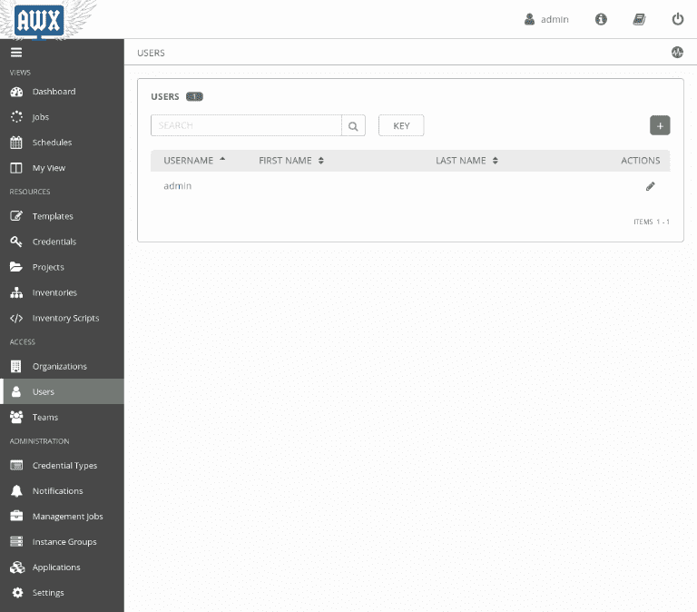
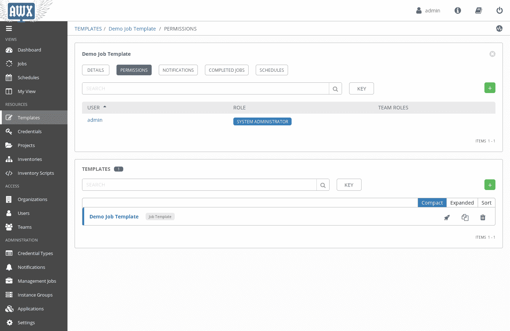
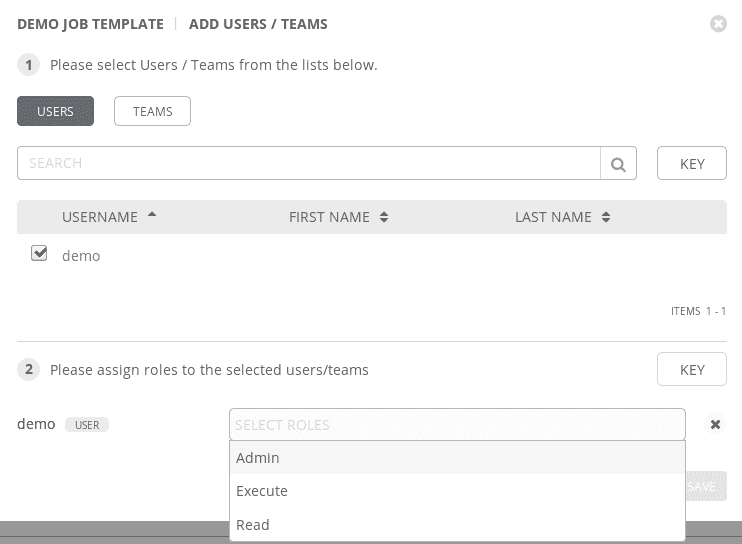

# 与 AWX 用户、权限和组织一起工作

在阅读上一章节时，您可能会对 AWX 的安全性产生疑问。

AWX 非常强大，并且要如此强大，它需要对目标机器有很多访问权限，这意味着它可能成为安全链中的一个潜在弱点。

在本章中，我们将讨论一些 AWX 用户、权限和组织的问题；具体来说，我们将涵盖以下主题：

+   AWX 用户和权限

+   AWX 组织

# 技术要求

为了完成本章，我们只需要 AWX，这是我们在上一章中设置的。

# AWX 用户和权限

首先，如果您还记得第一次打开 AWX 时，您将记得您必须输入用户名和密码。

当然你可以想象，那些是默认凭据，但您可以创建组织所需的所有用户。

为此，您可以转到左侧菜单中的用户部分，如下屏幕截图所示：

正如您可能期望的那样，管理员用户已存在，并且是唯一存在的用户。

我们可以通过点击带有+ 符号绿色按钮来创建其他用户。

当我们创建新用户时，需要填写以下字段：

+   **名字**：这是用户的名字。

+   **姓氏**：用户的姓氏。

+   **组织**：用户所属的组织（我们稍后将在本章更多地讨论这个问题）。

+   **电子邮件**：这是用户的电子邮件。

+   **用户名**：这是用户的用户名。将用于登录，并将在用户界面中弹出。

+   **密码**：这是用户的密码。

+   **确认密码**：重新输入密码以确保没有拼写错误。

+   **用户类型**：用户可以是普通用户、系统审计员或系统管理员。默认情况下，普通用户无法访问任何内容，除非明确授予权限。系统审计员可以以只读模式查看整个系统中的所有内容。系统管理员可以完全读写访问整个系统。

创建了一个普通用户后，您可以转至模板。如果您进入`演示作业模板`的编辑模式，您会注意到一个权限部分，您可以在其中查看和设置能够查看和操作此作业模板的用户。您应该看到以下屏幕截图中显示的内容：

通过点击带有+ 符号绿色按钮，将会出现一个模态框，您可以在其中选择（或搜索）要启用的用户，并选择访问级别，如下所示的屏幕截图：

AWX 允许您在三种不同的访问级别之间进行选择：

+   **管理员**：这种类型的用户能够查看作业模板和以前使用它创建的作业，执行将来的作业模板，以及编辑作业模板。

+   **执行**：这种用户可以看到作业模板和以前使用它创建的作业，并在未来执行作业模板，但不能编辑作业模板。

+   **读取**：这种用户可以看到作业模板和以前使用它创建的作业，但不能执行它也不能更改它。

类似于作业模板可以被用户看到、使用和管理，AWX 中的所有其他对象都可以有权限。

如您所想象的那样，如果您开始有数十个作业和数十个用户，您将花费大量时间来管理权限。为了帮助您，AWX 提供了团队的概念。

团队可以在左侧菜单中的团队项中进行管理，基本上只是用户的分组，因此您可以从**自主访问控制**（**DAC**）方法转变为**基于角色的访问控制**（**RBAC**）方法，这样在组织变化和需求方面更快地跟上。

通过使用用户、团队和权限，您将能够以非常精细的级别决定谁能够做什么。

# AWX 组织

在更复杂的组织中，经常出现很多来自非常不同团队和业务单元的人共享同一个 AWX 安装的情况。

在这些情况下，建立不同的 AWX 组织是有意义的。这可以更轻松地管理权限，并将一些权限管理委托给核心系统管理员团队之外的组织管理员。此外，组织允许垂直权限于组织资源，比如清单管理员（即，拥有该组织所有清单的自动管理员）或项目管理员（即，拥有该组织所有项目的自动管理员），除了组织范围的角色（比如组织管理员和组织审核员）。

如果您在一个有多个网站的公司，您可以决定将所有网站集群到同一个 AWX 组织中（如果它们是由同一批人管理的，比如，“web group”），或者您可以决定将它们分成多个 AWX 组织，每个网站一个。

这些组织带来的优势如下：

+   更简单的权限管理

+   团队经理（即，“web group” 管理员或单个网站管理员）能够随着时间推移招聘和解雇成员

+   更容易和更快的审核，因为只需要审核与特定组织相关的权限，而不是 Tower 中的所有权限

凭借这些优势，我总是建议您考虑如何在 AWX 中使用 AWX 组织。

此外，根据我的经验，我始终注意到 AWX 组织结构与公司结构越相似，用户体验越好，因为对所有用户来说都会感觉自然。另一方面，如果你试图强行将 AWX 组织结构与公司结构完全不同，这将感觉陌生，会减慢 AWX 的采用速度，并且在某些情况下甚至可能导致平台失败。

# 总结

在这本书中，我们从一些非常基本的自动化概念开始，通过将 Ansible 与其他常见选项如手动流程、bash 脚本、Puppet 和 Chef 进行比较。然后，我们看了如何编写 YAML 文件，因为这是 Ansible 使用的格式，以及如何安装 Ansible。然后，我们进行了第一个由 Ansible 驱动的安装（基本的一对 HTTP 服务器，支持数据库服务器）。然后，我们添加了利用 Ansible 特性的功能，例如变量、模板和任务委派。接着，我们看到了 Ansible 如何在 AWS、Digital Ocean 和 Azure 等云环境中帮助您。然后，我们继续分析 Ansible 如何用于触发通知，以及在各种部署场景中的应用。最后，我们总结了官方 Ansible 图形界面的概述：AWX/Ansible Tower。

通过这个内容，现在你应该能够自动化你在使用 Ansible 过程中遇到的所有可能情景。
