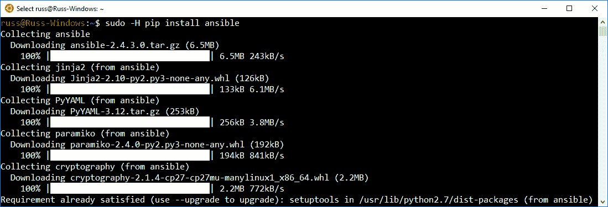

# 第二章：安装和运行 Ansible

现在我们对 Ansible 的背景有了一些了解，我们将开始安装它，并且一旦安装完成，我们将对运行 CentOS 7 的测试虚拟机运行我们的第一组 playbooks。

本章将涵盖以下主题：

+   如何在 macOS 和 Linux 上安装 Ansible

+   在 Windows 10 专业版上使用 Linux 子系统运行 Ansible

+   启动一个测试虚拟机

+   playbooks 简介

# 技术要求

在本章中，我们将安装 Ansible，因此您需要一台能够运行它的机器。我将在本章的下一部分详细介绍这些要求。我们还将使用 Vagrant 在本地启动一个虚拟机。有一节介绍了安装 Vagrant 以及下载一个大小约为 400 MB 的 CentOS 7 Vagrant box。

您可以在本书附带的 GitHub 存储库中找到所有 playbooks 的完整版本[`github.com/PacktPublishing/Learn-Ansible/tree/master/Chapter02`](https://github.com/PacktPublishing/Learn-Ansible/tree/master/Chapter02)。

您还可以在作者的存储库中找到代码包：[`github.com/russmckendrick/learn-ansible-fundamentals-of-ansible-2x`](https://github.com/russmckendrick/learn-ansible-fundamentals-of-ansible-2x)。

# 安装 Ansible

让我们直接开始安装 Ansible。在本书中，我将假设您正在运行 macOS High Sierra 的 macOS 主机机器，或者安装了 Ubuntu 18.04 LTS 的 Linux 机器。虽然我们将涵盖在 Windows 10 专业版上使用 Linux 子系统运行 Ansible，但本书不支持使用 Windows 作为主机机器。

# 在 macOS 上安装

您可以在 macOS High Sierra 主机上以几种不同的方式安装 Ansible。我将涵盖它们两种。

由于我们正在讨论两种不同的安装方式，我建议在选择自己机器上的安装方法之前，先阅读本节以及最后的*优缺点*部分。

# Homebrew

第一种安装方法是使用一个叫做 Homebrew 的软件包。

Homebrew 是 macOS 的软件包管理器。它可以用来安装命令行工具和桌面软件包。它自称为*macOS 的缺失软件包管理器*，通常是我在干净安装或获得新电脑后安装的第一个工具之一。您可以在[`brew.sh/`](https://brew.sh/)找到更多关于该项目的信息。

要使用 Homebrew 安装 Ansible，您首先需要安装 Homebrew。要做到这一点，请运行以下命令：

```
$ /usr/bin/ruby -e "$(curl -fsSL https://raw.githubusercontent.com/Homebrew/install/master/install)"
```

在安装过程的每个步骤，安装程序都会告诉您它将要做什么，并提示您提供任何它需要的额外信息，以便完成安装。

安装完成后，或者如果您已经安装了 Homebrew，请运行以下命令来更新软件包列表，并检查您的 Homebrew 安装是否最佳：

```
$ brew update
$ brew doctor
```

根据您的安装时间或上次使用的时间，您可能会看到与以下截图不同的输出：


接下来，我们可以通过运行以下命令来检查 Homebrew 为 Ansible 提供了哪些软件包：

```
$ brew search ansible
```

如您在以下截图中看到的结果，搜索返回了几个软件包：


我们只需要 Ansible 软件包。您可以通过运行以下命令了解更多关于该软件包的信息：

```
$ brew info ansible
```

您可以在以下截图中看到命令的结果：


如您所见，该命令返回将要安装的软件包的版本信息，以及有关在哪里可以查看安装软件包的公式代码的详细信息。在我们的情况下，您可以在[`github.com/Homebrew/homebrew-core/blob/master/Formula/ansible.rb`](https://github.com/Homebrew/homebrew-core/blob/master/Formula/ansible.rb)上查看公式的详细信息。

要使用 Homebrew 安装 Ansible，我们只需运行以下命令：

```
$ brew install ansible
```

这将下载并安装所有依赖项，然后安装 Ansible 软件包本身。根据您的计算机上已安装的依赖项数量，这可能需要几分钟。安装完成后，您应该看到类似以下屏幕截图的内容：


如您从前面的屏幕截图中所见，Homebrew 在输出中非常详细，为您提供了它正在做什么以及如何使用它安装的软件包的详细信息。

# pip 方法

第二种方法`pip`是一种更传统的安装和配置 Python 软件包的方法。

`pip`是 Python 软件的软件包管理器。这是**pip install packages**的递归缩写。这是从**Python Package Index** (**PyPI**)安装软件包的良好前端。您可以在[`pypi.python.org/pypi/`](https://pypi.python.org/pypi/)上找到索引。

根据您在计算机上安装了什么，您可能需要安装`pip`。要做到这一点，请运行以下命令：

```
$ easy_install pip
```

这将使用 macOS 默认附带的`easy_install`安装程序安装`pip`。安装完成后，您可以通过运行以下命令安装 Ansible：

```
$ sudo -H pip install ansible
```

由于我们使用了`sudo`命令，因此系统会提示您输入密码，就像 Homebrew 一样。此命令将下载并安装运行 Ansible 所需的所有先决条件。虽然它与 Homebrew 一样详细，但其输出包含有关其所做的工作的信息，而不是下一步该做什么的提示：


正如您所看到的，许多要求已经得到满足。

# 优缺点

因此，现在我们已经介绍了在 macOS 上安装 Ansible 的一些不同方法，哪种方法最好？嗯，这没有真正的答案，因为这取决于个人偏好。这两种方法都将安装最新版本的 Ansible。但是，Homebrew 往往会比当前版本晚一两周。

如果您已经使用 Homebrew 安装了许多软件包，那么您已经习惯于运行以下命令：

```
$ brew update
$ brew upgrade
```

偶尔更新已安装的软件包到最新版本。如果您已经这样做了，那么使用 Homebrew 来管理您的 Ansible 安装就是有意义的。

如果您不是 Homebrew 用户，并且想要确保立即安装最新版本，则使用`pip`命令安装 Ansible。升级到最新版本的 Ansible 就像运行以下命令一样简单：

```
$ sudo -H pip install ansible --upgrade --ignore-installed setuptools
```

我发现我需要使用`--ignore-installed setuptools`标志，因为 macOS 管理的版本与 Ansible 更新的版本存在问题和冲突。我没有发现这会引起任何问题。

如果需要的话，您可以使用 Homebrew 和`pip`安装旧版本的 Ansible。要使用 Homebrew 进行此操作，只需运行以下命令来删除当前版本：

```
$ brew uninstall ansible
```

然后，您可以通过运行以下命令安装软件包的早期版本：

```
$ brew install ansible@2.0
```

或者，要安装更早的版本，您可以使用以下命令：

```
$ brew install ansible@1.9
```

要了解要安装的软件包的确切版本的详细信息，您可以运行以下两个命令中的一个：

```
$ brew info ansible@2.0
$ brew info ansible@1.9
```

虽然这将安装一个早期版本，但您在安装哪个版本方面没有太多选择。如果您确实需要一个确切的版本，可以使用`pip`命令进行安装。例如，要安装 Ansible 2.3.1.0，您需要运行：

```
$ sudo -H pip install ansible==2.3.1.0 --ignore-installed setuptools
```

你永远不应该需要这样做。但是，我发现在某些情况下，我不得不降级来帮助调试由升级到较新版本引入的*怪癖*。

正如前面提到的，我大部分时间都是在 macOS 机器前度过的，所以我使用哪种方法呢？主要是使用 Homebrew，因为我安装了几个其他工具。但是，如果我需要回滚到以前的版本，我会使用`pip`，然后问题解决后再返回到 Homebrew。

# 在 Linux 上安装

在 Ubuntu 18.04 上安装 Ansible 有几种不同的方法。然而，我这里只会介绍其中一种。虽然 Ubuntu 有可用的软件包可以使用`apt`安装，但它们往往很快就会过时，并且通常落后于当前版本。

**高级打包工具**（**APT**）是 Debian 系统的软件包管理器，包括 Ubuntu。它用于管理`.deb`文件。

因此，我们将使用`pip`。首先要做的是安装`pip`，可以通过运行以下命令来完成：

```
$ sudo -H apt-get install python-pip
```

一旦安装了`pip`，安装 Ansible 的说明与在 macOS 上安装相同。只需运行以下命令：

```
$ sudo -H pip install ansible
```

这将下载并安装 Ansible 及其要求，如下截图所示：


安装完成后，您可以使用以下命令升级它：

```
$ sudo -H pip install ansible --upgrade
```

请注意，这一次我们不需要忽略任何内容，因为默认安装不应该有任何问题。此外，降级 Ansible 是相同的命令：

```
$ sudo -H pip install ansible==2.3.1.0 --ignore-installed setuptools
```

上述命令应该适用于大多数 Linux 发行版，如 CentOS、Red Hat Enterprise Linux、Debian 和 Linux Mint。

# 在 Windows 10 专业版上安装

我们要介绍的最后一个平台是 Windows 10 专业版；嗯，有点像。没有支持的方法可以在 Windows 机器上本地运行 Ansible 控制器。因此，我们将使用 Windows 的 Linux 子系统。

这是一个功能，在撰写本文时，它处于测试版，只适用于 Windows 10 专业版用户。要启用它，首先需要启用开发人员模式。要做到这一点，打开 Windows 10 设置应用，然后切换到开发人员模式，可以在更新和安全下找到，然后点击开发人员。

启用开发人员模式后，您将能够启用 shell。要做到这一点，打开控制面板，然后点击程序和功能，然后点击打开或关闭 Windows 功能。在功能列表中，您应该看到列出了 Windows 子系统的 Linux（Beta）。选中它旁边的框，然后点击确定。您将被提示重新启动计算机。重新启动后，点击开始菜单，然后键入`bash`。这将触发安装过程。您应该看到类似以下截图的内容：


下载后，它将提取并安装子系统。您将被问到一些问题。根据需要，整个过程将需要 5 到 10 分钟。安装完成后，您现在应该在 Windows 机器上运行一个完整的 Ubuntu 16.04 系统。您可以通过运行以下命令来检查：

```
$ cat /etc/*release
```

以下截图显示了上述命令的输出：


从这里，您可以运行以下命令来安装 Ansible：

```
$ sudo -H apt-get install python-pip
$ sudo -H pip install ansible
```

以下截图显示了上述命令的输出：



如您所见，一切都像在运行 Ubuntu 机器一样工作，使您能够以完全相同的方式运行和维护您的 Ansible 安装。

**Windows 子系统 Linux**（**WSL**）并不是在虚拟机上运行。它是完全嵌入到 Windows 10 专业版中的本机 Linux 体验。它针对需要作为工具链一部分运行 Linux 工具的开发人员。虽然对 Linux 命令的整体支持非常出色，但我建议阅读由微软撰写和维护的 FAQ，以了解子系统的限制和任何怪癖。FAQ 可以在[`docs.microsoft.com/en-us/windows/wsl/faq/`](https://docs.microsoft.com/en-us/windows/wsl/faq/)找到。

正如前面提到的，虽然这是在 Windows 机器上运行 Ansible 控制节点的一种可行方式，但我们将在未来的章节中涵盖的一些其他工具可能无法在 Windows 上运行。因此，虽然您可以按照 Ubuntu 的说明进行操作，但某些部分可能无法正常工作。在可能的情况下，我会添加一条说明，说明它可能无法在基于 Windows 的系统上运行。

# 启动虚拟机

为了启动一个虚拟机来运行我们的第一组 Ansible 命令，我们将使用 Vagrant。

请注意，如果您正在运行 WSL，这些说明可能不起作用。

Vagrant 是由 HashiCorp 开发的虚拟机管理器。它可以管理本地和远程虚拟机，并支持诸如 VirtualBox、VMware 和 Hyper-V 之类的 hypervisors。

要在 macOS 上安装 Vagrant，我们可以使用 Homebrew 和 cask。要安装 cask，运行以下命令：

```
$ brew install cask
```

VirtualBox 是面向基于 x86 的计算机的开源 hypervisor。它目前由 Oracle 开发，并支持软件和硬件虚拟化。

默认情况下，Vagrant 使用 VirtualBox。安装了 cask 后，您可以通过运行以下命令来使用 VirtualBox 和 Vagrant：

```
$ brew cask install virtualbox vagrant
```

要在 Ubuntu 上安装，可以运行以下命令：

```
$ sudo apt-get install virtualbox vagrant
```

接下来，如果您还没有，我们需要为您的用户生成一个私钥和公钥。要做到这一点，运行以下命令，但如果您已经有一个密钥，可以跳过这部分：

```
$ ssh-keygen -t rsa -C "youremail@example.com"
```

这将创建一个密钥并将其存储在您的用户目录中的`.ssh`文件夹中。我们将使用此密钥注入到我们的 Vagrant 管理的 CentOS 7 虚拟机中。要启动虚拟机或 box（正如 Vagrant 所称），我们需要一个`Vagrantfile`。这是 Vagrant 用来创建和启动 box 的配置。

我们将使用的`Vagrantfile`如下所示。您还可以在本书附带的代码示例的`Chapter02`文件夹中找到副本，也可以在 GitHub 存储库中找到，地址为[`github.com/PacktPublishing/Learn-Ansible/tree/master/Chapter02`](https://github.com/PacktPublishing/Learn-Ansible/tree/master/Chapter02)：

```
# -*- mode: ruby -*-
# vi: set ft=ruby :

API_VERSION = "2"
BOX_NAME    = "centos/7"
BOX_IP      = "192.168.50.4"
DOMAIN      = "nip.io"
PRIVATE_KEY = "~/.ssh/id_rsa"
PUBLIC_KEY  = '~/.ssh/id_rsa.pub'

Vagrant.configure(API_VERSION) do |config|
  config.vm.box = BOX_NAME
  config.vm.network "private_network", ip: BOX_IP
  config.vm.host_name = BOX_IP + '.' + DOMAIN
  config.ssh.insert_key = false
  config.ssh.private_key_path = [PRIVATE_KEY,
  "~/.vagrant.d/insecure_private_key"]
  config.vm.provision "file", source: PUBLIC_KEY, destination:
  "~/.ssh/authorized_keys"

  config.vm.provider "virtualbox" do |v|
    v.memory = "2024"
    v.cpus = "2"
  end

  config.vm.provider "vmware_fusion" do |v|
    v.vmx["memsize"] = "2024"
    v.vmx["numvcpus"] = "2"
  end

end
```

从上面的文件中可以看出，有一些事情正在进行。首先，在顶部部分，我们正在为以下内容定义一些变量：

+   `API_VERSION`：这是要使用的 Vagrant API 版本。这应该保持为`2`。

+   `BOX_NAME`：这是我们想要使用的基本镜像。在我们的情况下，这是官方的 CentOS 7 Vagrant box 镜像，可以在[`app.vagrantup.com/centos/boxes/7`](https://app.vagrantup.com/centos/boxes/7)找到。

+   `BOX_IP`：这是我们要启动的机器的私有 IP 地址。通常情况下，您不应该需要硬编码 IP 地址，但在我们的情况下，我们将需要一个可解析的主机名和一个固定的 IP 地址，以便在本章的下一节中的示例中使用。

+   `DOMAIN`：这是用于配置机器主机名的域名。我们使用[`nip.io/`](http://nip.io/)服务。这提供了免费的通配符 DNS 条目。这意味着我们的域名`192.168.50.4.nip.io`将解析为`192.168.50.4`。

+   `PRIVATE_KEY`：这是您的私钥的路径。一旦启动虚拟机，将用它来 SSH 进入虚拟机。

+   `PUBLIC_KEY`：这是你的公钥的路径。当机器正在启动时，这将被注入到主机中，这意味着我们可以使用我们的私钥访问它。

下一节将采用前面的值并配置 Vagrant 框。然后我们定义了仅适用于`Vagrantfile`支持的两个提供者的设置。正如你所看到的，该文件将使用 VirtualBox 或者，如果你已经安装了它，VMware Fusion 来启动一个框。

有关 Vagrant 的 VMware 提供者插件的更多信息，请访问[`www.vagrantup.com/vmware/`](https://www.vagrantup.com/vmware/)。请注意，Vagrant 的这一部分需要许可证，需要收费，并且需要在主机机器上安装 VMware Fusion 或 Workstation。

现在我们有了`Vagrantfile`，我们只需要运行以下命令来启动 Vagrant 框：

```
$ vagrant up
```

如果你没有传递提供者，它将默认使用 VirtualBox。如果你像我一样有 VMware 插件，你可以运行以下命令：

```
$ vagrant up --provider=vmware_fusion
```

下载适当的框文件并配置虚拟机需要几分钟的时间：


正如你从终端输出中所看到的，启动过程非常详细，并且在每个阶段都会收到有用的反馈。

一旦 Vagrant 框被启动，你可以通过运行以下命令来检查与它的连接。这将以 Vagrant 用户的身份登录到 Vagrant 框，并检查主机名和内核的详细信息：

```
$ vagrant ssh
$ hostname
$ uname -a
$ exit
```

你的终端应该看起来像这样：


正如你所看到的，因为我们已经告诉 Vagrant 在访问该框时使用哪个私钥，我们已经直接进入了该框，并且可以运行命令而没有问题。然而，在下一节中，我们将不会使用`vagrant ssh`命令，这就是为什么我们需要将我们的公钥注入到主机中。相反，我们将直接从我们的主机机器通过 SSH 连接到该机器。为了测试这一点，你应该能够运行以下命令：

```
$ ssh vagrant@192.168.50.4.nip.io
```

你应该被要求通过输入`yes`来建立主机的真实性。一旦你登录，你就可以运行以下命令：

```
$ hostname
$ uname -a
$ exit
```

你的终端应该看起来像这样：


正如你所看到的，我们已经使用 Vagrant 用户解析并连接到`192.168.50.4.nip.io`，并且已经使用我们的私钥进行了身份验证。在我们进入下一节并尝试第一次运行 Ansible 之前，我们应该讨论一下 Vagrant provisioners。

毫无疑问，你可能已经查看了 Vagrant 网站，网址是[`vagrantup.com/`](http://vagrantup.com/)，并且可能已经注意到 Vagrant 实际上支持 Ansible。如果我们使用 Ansible provisioner，那么 Vagrant 将动态创建一个主机清单，并在启动过程中针对该框运行我们的 playbook。在我们看这个之前，我认为我们理解主机清单的工作方式是很重要的，所以我们将在下一章中看一下 Ansible provisioner。

然而，在那之前，让我们来看一些基本的 playbook 以及我们如何使用 Ansible 与我们的 Vagrant 框进行交互。

# playbook 简介

在 IT 中，playbook 通常是发生某事时由某人运行的一组指令；有点模糊，我知道，但请跟着我。这些范围从构建和配置新的服务器实例，到如何部署代码更新以及如何在出现问题时处理问题。

在传统意义上，playbook 通常是用户遵循的一组脚本或指令，虽然它们旨在引入系统的一致性和一致性，但即使怀着最好的意图，这几乎从来没有发生过。

这就是 Ansible 的用武之地。使用 Ansible playbook，您基本上是在说应用这些更改和命令对这些主机集合，而不是让某人登录并手动开始运行操作手册。

在运行 playbook 之前，让我们讨论如何向 Ansible 提供要定位的主机列表。为此，我们将使用`setup`命令。这只是简单地连接到一个主机，然后尽可能多地获取有关主机的信息。

# 主机清单

要提供主机列表，我们需要提供一个清单列表。这是以 hosts 文件的形式。

在其最简单的形式中，我们的 hosts 文件可以包含一行：

```
192.168.50.4.nip.io ansible_user=vagrant
```

这告诉 Ansible 的是，我们要联系的主机是`192.168.50.4.nip.io`，并且要使用用户名`vagrant`。如果我们没有提供用户名，它将退回到您作为 Ansible 控制主机登录的用户，就像在我的情况下一样——用户`russ`，这个用户在 Vagrant 框中不存在。在存储库的`Chapter02`文件夹中有一个名为`hosts-simple`的 hosts 文件的副本，与我们用来启动 Vagrant 框的`Vagrantfile`一起。

运行`setup`命令，我们需要从存储`hosts-simple`的相同文件夹中运行以下命令：

```
$ ansible -i hosts-simple 192.168.50.4.nip.io -m setup
```

您应该看到一些类似以下的输出：


正如您从前面的屏幕截图中所看到的，Ansible 很快就找到了我们的 Vagrant 框的大量信息。从屏幕截图中，您可以看到机器上配置的两个 IP 地址，以及 IPv6 地址。它记录了时间和日期，如果您滚动查看自己的输出，您将看到返回了大量详细的主机信息。

回到我们运行的命令：

```
$ ansible -i hosts-simple 192.168.50.4.nip.io -m setup
```

正如您所看到的，我们正在使用`-i`标志加载`hosts-simple`文件。我们也可以使用`--inventory=hosts-simple`，这样就加载了我们的清单文件。命令的下一部分是要目标主机。在我们的情况下，这是`192.168.50.4.nip.io`。命令的最后一部分`-m`告诉 Ansible 使用`setup`模块。我们也可以使用`--module-name=setup`。

这意味着，如果我们没有使用简写，完整的命令将是：

```
$ ansible --inventory=hosts-simple 192.168.50.4.nip.io --module-name=setup
```

如前所述，`hosts-simple`文件是我们可以得到的最基本的。以下是一个更常见的主机清单文件：

```
box ansible_host=192.168.50.4.nip.io

[boxes]
box

[boxes:vars]
ansible_connection=ssh
ansible_user=vagrant
ansible_private_key_file=~/.ssh/id_rsa
host_key_checking=False
```

在与`hosts-simple`文件相同的文件夹中有一个名为`hosts`的文件的副本。正如您所看到的，有很多事情要做，所以让我们快速地从上到下地进行一下工作。

第一行定义了我们的单个主机。与简单示例不同，我们将称呼我们的`hosts box`并使用`ansible_host`，因此我们正在向 Ansible 提供它可以 SSH 到的详细信息。这意味着我们现在可以在引用`192.168.50.4.nip.io`时使用名称 box。这意味着我们的命令现在看起来像这样：

```
$ ansible -i hosts box -m setup
```

文件中的下一步是创建一个名为`boxes`的主机组，在该组中，我们添加了我们的单个主机`box`。这意味着我们也可以运行：

```
$ ansible -i hosts boxes -m setup
```

如果我们的组中有不止一个主机，那么前面的命令将循环遍历所有这些主机。`hosts`文件的最后一部分为`boxes`组中的所有主机设置了一些常见的配置选项。在这种情况下，我们告诉 Ansible 该组中的所有主机都在使用 SSH，用户是`vagrant`，应该使用`~/.ssh/id_rsa`的私钥，还告诉不要在连接时检查主机密钥。

我们将在后面的章节中重新访问清单主机文件。从现在开始，我们将使用`hosts`文件来定位`boxes`组。

# Playbooks

在上一节中，运行`ansible`命令允许我们调用单个模块。在本节中，我们将看看如何调用多个模块。以下 playbook 称为`playbook.yml`。它调用了我们在上一节中调用的`setup`模块，然后使用`debug`模块将消息打印到屏幕上：

```
---

- hosts: boxes
  gather_facts: true
  become: yes
  become_method: sudo

  tasks:
    - debug:
        msg: "I am connecting to {{ ansible_nodename }} which is running {{ ansible_distribution }} {{ ansible_distribution_version }}"
```

在我们开始分解配置之前，让我们看一下运行 playbook 的结果。为此，请使用以下命令：

```
$ ansible-playbook -i hosts playbook01.yml
```

这将连接到我们的 Vagrant box，在系统上收集信息，然后以消息的形式返回我们想要的信息：


您将注意到 playbook 的第一件事是它是用**YAML**编写的，这是一个递归缩写，代表**YAML 不是标记语言**。YAML 旨在成为一个可供所有编程语言使用的人类可读的数据序列化标准。它通常用于帮助定义配置。

在 YAML 中缩进非常重要，因为它用于嵌套和定义文件的区域。让我们更详细地看一下我们的 playbook：

```
---
```

尽管这些行看起来可能不多，但它们被用作文档分隔符，因为 Ansible 将所有 YAML 文件编译成单个文件；稍后会详细介绍。对于 Ansible 来说，知道一个文档何时结束，另一个文档何时开始是很重要的。

接下来，我们有 playbook 的配置。正如您所看到的，这是缩进开始发挥作用的地方：

```
- hosts: boxes
  gather_facts: true
  become: yes
  become_method: sudo
  tasks:
```

`-`告诉 Ansible 这是一个部分的开始。然后使用键值对。这些是：

+   `hosts`: 这告诉 Ansible 在 playbook 中目标主机或主机组。这必须在主机清单中定义，就像我们在上一节中介绍的那样。

+   `gather_facts`: 这告诉 Ansible 在首次连接到主机时运行`setup`模块。然后在运行的其余时间内，此信息对 playbook 可用。

+   `become`: 这是因为我们连接到主机时作为基本用户存在的。在这种情况下，Vagrant 用户。Ansible 可能没有足够的访问权限来执行我们告诉它的一些命令，因此这指示 Ansible 以 root 用户的身份执行其所有命令。

+   `become_method`: 这告诉 Ansible 如何成为 root 用户；在我们的情况下，Vagrant 配置了无密码的`sudo`，所以我们使用`sudo`。

+   `tasks`: 这些是我们可以告诉 Ansible 在连接到目标主机时运行的任务。

从这里开始，您会注意到我们再次移动了缩进。这定义了配置的另一部分。这次是为了任务：

```
    - debug:
        msg: "I am connecting to {{ ansible_nodename }} which is running {{ ansible_distribution }} {{ ansible_distribution_version }}"
```

正如我们已经看到的，我们正在运行的唯一任务是`debug`模块。此模块允许我们在运行 playbook 时显示输出。

您可能已经注意到花括号之间的信息是来自`setup`模块的键。在这里，我们告诉 Ansible 在使用键的任何地方替换每个键的值——我们将在我们的 playbook 中经常使用这个。我们还将定义自己的键值，以便在 playbook 运行中使用。

让我们通过添加另一个任务来扩展我们的 playbook。以下内容可以在`playbook02.yml`中找到：

```
---

- hosts: boxes
  gather_facts: true
  become: yes
  become_method: sudo

  tasks:
    - debug:
        msg: "I am connecting to {{ ansible_nodename }} which is running {{ ansible_distribution }} {{ ansible_distribution_version }}"
    - yum:
        name: "*"
        state: "latest"
```

正如您所看到的，我们添加了第二个调用`yum`模块的任务。该模块旨在帮助我们与 CentOS 和其他基于 Red Hat 的操作系统使用的软件包管理器`yum`进行交互。我们在这里设置了两个关键值：

+   `name`: 这是一个通配符。它告诉 Ansible 使用所有安装的软件包，而不仅仅是单个命名的软件包。例如，我们可以在这里只使用 HTTPD 来仅针对 Apache。

+   `state`: 在这里，我们告诉 Ansible 确保我们在名称键中定义的软件包是`latest`版本。由于我们已经命名了所有安装的软件包，这将更新我们安装的所有内容。

使用以下命令运行 playbook：

```
$ ansible-playbook -i hosts playbook02.yml
```

这将给我们以下结果：


`yum`任务在主机`box`上被标记为`changed`。这意味着软件包已经更新。再次运行相同的命令会显示以下内容：


正如你所看到的，`yum`任务现在在我们的主机上显示为`ok`。这是因为当前没有需要更新的软件包。

在我们完成对 playbooks 的快速查看之前，让我们做一些更有趣的事情。下面的 playbook，名为`playbook03.yml`，将安装、配置和启动 NTP 服务到我们的 Vagrant box。它还向我们的 playbook 添加了一些新的部分，并使用了一个模板：

```
---

- hosts: boxes
  gather_facts: true
  become: yes
  become_method: sudo

  vars:
    ntp_servers:
      - "0.centos.pool.ntp.org"
      - "1.centos.pool.ntp.org"
      - "2.centos.pool.ntp.org"
      - "3.centos.pool.ntp.org"

  handlers:
    - name: "restart ntp"
      service:
        name: "ntpd"
        state: "restarted"

  tasks:
    - debug:
        msg: "I am connecting to {{ ansible_nodename }} which is
        running {{ ansible_distribution }}
        {{ ansible_distribution_version }}"
    - yum:
        name: "*"
        state: "latest"
    - yum:
        name: "{{ item }}"
        state: "installed"
      with_items:
        - "ntp"
        - "ntpdate"
    - template:
        src: "./ntp.conf.j2"
        dest: "/etc/ntp.conf"
      notify: "restart ntp"
```

在我们通过 playbook 的添加之前，让我们运行它，以了解你从 Ansible 那里得到的反馈：

```
$ ansible-playbook -i hosts playbook03.yml
```

以下截图显示了前面命令的输出：


这一次，我们有三个`changed`任务。再次运行 playbook 会显示以下内容：


正如预期的那样，因为我们没有改变 playbook 或 Vagrant box 上的任何东西，所以没有任何变化，Ansible 报告一切都是`ok`。

让我们回到我们的 playbook 并讨论这些添加。你会注意到我们添加了两个新的部分，`vars`和`handlers`，以及两个新的任务，第二个任务使用了`yum`模块，最后一个任务使用了`template`模块。

`vars`部分允许我们配置自己的键值对。在这种情况下，我们提供了一个 NTP 服务器列表，稍后将在 playbook 中使用：

```
  vars:
    ntp_servers:
      - "0.centos.pool.ntp.org"
      - "1.centos.pool.ntp.org"
      - "2.centos.pool.ntp.org"
      - "3.centos.pool.ntp.org"
```

正如你所看到的，我们实际上为相同的键提供了四个不同的值。这些将用于`template`任务。我们也可以这样写：

```
  vars:
    ntp_servers: [ "0.centos.pool.ntp.org", "1.centos.pool.ntp.org",
    "2.centos.pool.ntp.org", "3.centos.pool.ntp.org" ]
```

然而，这有点难以阅读。新的下一部分是`handlers`。处理程序是分配了一个名称的任务，并且根据任务的变化在 playbook 运行结束时调用：

```
  handlers:
    - name: "restart ntp"
      service:
        name: "ntpd"
        state: "restarted"
```

在我们的情况下，`restart ntp`处理程序使用`service`模块来重新启动`ntpd`。接下来，我们有两个新任务，首先是一个安装 NTP 服务和`ntpdate`软件包的任务，使用`yum`：

```
   - yum:
      name: "{{ item }}"
      state: "installed"
     with_items:
      - "ntp"
      - "ntpdate"
```

因为我们正在安装两个软件包，我们需要一种方法来为`yum`模块提供两个不同的软件包名称，这样我们就不必为每个软件包安装编写两个不同的任务。为了实现这一点，我们使用了`with_items`命令，作为任务部分的一部分。请注意，这是`yum`模块的附加部分，并不是模块的一部分——你可以通过缩进来判断。

`with_items`命令允许你为任务提供一个变量或项目列表。无论`{{ item }}`在哪里使用，它都将被`with_items`值的内容替换。

playbook 的最后一个添加是以下任务：

```
   - template:
      src: "./ntp.conf.j2"
      dest: "/etc/ntp.conf"
     notify: "restart ntp"
```

这个任务使用了`template`模块。从我们的 Ansible 控制器读取一个模板文件，处理它并上传处理后的模板到主机。一旦上传，我们告诉 Ansible，如果配置文件有任何更改，就通知`restart ntp`处理程序。

在这种情况下，模板文件是与 playbooks 相同文件夹中的`ntp.conf.j2`文件，如`src`选项中定义的。这个文件看起来是这样的：

```
# {{ ansible_managed }}
driftfile /var/lib/ntp/drift
restrict default nomodify notrap nopeer noquery
restrict 127.0.0.1 
restrict ::1

server {{ item }} iburst

includefile /etc/ntp/crypto/pw
keys /etc/ntp/keys
disable monitor
```

文件的大部分是标准的 NTP 配置文件，还添加了一些 Ansible 部分。第一个添加是第一行：

```
# {{ ansible_managed }}
```

如果没有这一行，每次我们运行 Ansible 时，文件都会被上传，这将被视为一次变更，并且`restart ntp`处理程序将被调用，这意味着即使没有任何变化，NTP 也会被重新启动。

接下来的部分循环遍历了我们在 playbook 的`vars`部分中定义的`ntp_servers`值：

```

server {{ item }} iburst

```

对于每个值，添加一行包含服务器、然后是值，然后是`iburst`。您可以通过 SSH 连接到 Vagrant 机器并打开`/etc/ntp.conf`来查看此输出：

```
$ vagrant ssh
$ cat /etc/ntp.conf
```

以下截图显示了前述命令的输出：


从完全呈现的文件的前述截图中可以看出，我们在第一行上有注释，指出该文件由 Ansible 管理，还有四行包含要使用的 NTP 服务器的内容。

最后，您可以通过运行以下命令检查 NTP 是否按预期运行： 

```
$ vagrant ssh
$ sudo systemctl status ntpd
```

以下截图显示了前述命令的输出：


从前述输出中可以看出，NTP 已加载并按预期运行。让我们通过运行以下命令删除 Vagrant 框架并启动一个新的框架：

```
$ vagrant destroy
```

然后通过运行以下两个命令之一再次启动该框：

```
$ vagrant up $ vagrant up --provider=vmware_fusion
```

一旦框架启动运行，我们可以使用以下命令运行最终的 playbook：

```
$ ansible-playbook -i hosts playbook03.yml
```

一两分钟后，您应该会收到 playbook 运行的结果。您应该会看到五个`changed`和六个`ok`：


第二次运行只会显示五个`ok`：


我们第一次运行时得到六个`ok`，第二次运行时得到五个`ok`的原因是自第一次运行以来没有发生任何变化。因此，重启 NTP 的处理程序从未被通知，因此重新启动服务的任务从未执行。

完成示例 playbook 后，您可以使用以下命令终止正在运行的框架：

```
$ vagrant destroy
```

我们将在下一章中再次使用该框。

# 总结

在本章中，我们通过本地安装 Ansible，然后使用 Vagrant 启动虚拟机进行了第一步。我们了解了基本的主机清单文件，并使用 Ansible 命令针对我们的虚拟机执行了单个任务。

然后，我们查看了 playbooks，首先是一个基本的 playbook，返回了有关我们目标的一些信息，然后进展到一个更新所有已安装的操作系统包并安装和配置 NTP 服务的 playbook。

在下一章中，我们将看看其他可以使用的 Ansible 命令。

# 问题

1.  使用`pip`安装 Ansible 的命令是什么？

1.  真或假：在使用 Homebrew 时，您可以选择要安装或回滚到哪个版本的 Ansible。

1.  真或假：Windows 子系统运行在虚拟机中。

1.  列出三个 Vagrant 支持的 hypervisors。

1.  说明主机清单是什么。

1.  真或假：YAML 文件中的缩进对于它们的执行非常重要，而不仅仅是装饰性的。

1.  更新最终的 playbook 以安装您选择的服务，并通知处理程序以其默认配置启动服务。

# 进一步阅读

在这一章中，我们使用了以下 Ansible 模块，你可以在以下链接中找到每个模块的更多信息：

+   `setup`: [`docs.ansible.com/ansible/latest/setup_module.html`](http://docs.ansible.com/ansible/latest/setup_module.html)

+   `debug`[:](http://docs.ansible.com/ansible/latest/setup_module.html) [`docs.ansible.com/ansible/latest/debug_module.html`](http://docs.ansible.com/ansible/latest/debug_module.html)

+   `yum`: [`docs.ansible.com/ansible/latest/yum_module.html`](http://docs.ansible.com/ansible/latest/yum_module.html)

+   `service`: [`docs.ansible.com/ansible/latest/service_module.html`](http://docs.ansible.com/ansible/latest/service_module.html)
