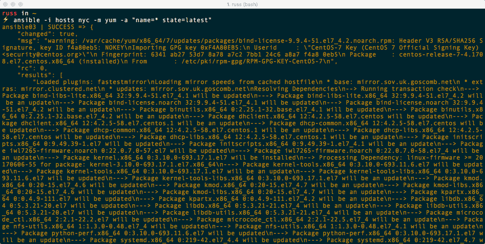

# Ansible 命令

在继续编写和执行更高级的 playbook 之前，我们将看一下内置的 Ansible 命令。在这里，我们将介绍组成 Ansible 的一组命令的用法。在本章末尾，我们还将安装一些第三方工具，其中一个是清单图形化工具，它可以让我们可视化我们的主机，另一个允许你记录你的 playbook 运行。

本章将涵盖以下主题：

+   内置命令：

+   `ansible`

+   `ansible-config`

+   `ansible-console`

+   `ansible-doc`

+   `ansible-inventory`

+   `ansible-vault`

+   第三方命令：

+   `ansible-inventory-grapher`

+   `ara`

# 技术要求

我们将重复使用上一章中启动的 Vagrant box；如果你没有跟着做，请参考上一章关于如何安装 Ansible 和 Vagrant 的说明。本章中有一些 playbook 示例；你可以在[`github.com/PacktPublishing/Learn-Ansible/tree/master/Chapter03`](https://github.com/PacktPublishing/Learn-Ansible/tree/master/Chapter03)找到完整的示例。

# 内置命令

当我们安装 Ansible 时，安装了几个不同的命令。这些是：

+   `ansible`

+   `ansible-config`

+   `ansible-console`

+   `ansible-doc`

+   `ansible-inventory`

+   `ansible-vault`

在后续章节中，我们将涵盖一些命令，比如`ansible-galaxy`、`ansible-playbook`和`ansible-pull`，所以在本章中我不会详细介绍这些命令。让我们从列表顶部开始，使用一个我们已经使用过的命令。

# Ansible

现在，你可能会认为`ansible`是我们在整本书中将经常使用的最常见的命令，但事实并非如此。

`ansible`命令实际上只用于针对单个或一组主机运行临时命令。在上一章中，我们创建了一个目标为单个本地虚拟机的主机清单文件。在本章中，让我们来看看如何针对在 DigitalOcean 上运行的四个不同主机进行操作；我的主机文件如下所示：

```
ansible01 ansible_host=46.101.92.240
ansible02 ansible_host=159.65.63.218
ansible03 ansible_host=159.65.63.217
ansible04 ansible_host=138.68.145.116

[london]
ansible01
ansible02

```

```
[nyc]
ansible03
ansible04

[digitalocean:children]
london
nyc

[digitalocean:vars]
ansible_connection=ssh
ansible_user=root
ansible_private_key_file=~/.ssh/id_rsa
host_key_checking=False
```

正如你所看到的，我有四个主机，`ansible01` > `ansible04`。我的前两个主机在一个名为`london`的组中，我的后两个主机在一个名为`nyc`的组中。然后我将这两个组合并创建了一个名为`digitalocean`的组，并且我使用这个组来应用一些基本配置，基于我启动的主机。

使用`ping`模块，我可以通过运行以下命令检查与主机的连接：

```
$ ansible -i hosts london -m ping
$ ansible -i hosts nyc -m ping
```

从这些结果中可以看出，所有四个主机都返回了`pong`：


我也可以通过以下方式一次性针对所有四个主机进行操作：

```
$ ansible -i hosts all -m ping
```


现在我们可以通过 Ansible 访问我们的主机，可以使用一些临时命令来操作它们；让我们从一些基本的开始：

```
$ ansible -i hosts london -a "ping -c 3 google.com"
```

这个命令将连接到`london`主机并运行`ping -c 3 google.com`命令；这将从主机 ping `google.com`并返回结果：


我们也可以使用`ansible`命令运行单个模块；我们在上一章中使用`setup`模块做过这个。不过，一个更好的例子是更新所有已安装的软件包：

```
$ ansible -i hosts nyc -m yum -a "name=* state=latest"
```

在上一个示例中，我们使用`yum`模块来更新`nyc`组中所有已安装的软件包：



从屏幕截图中可以看出，运行 Ansible 时的输出非常详细，并且有反馈告诉我们在临时执行期间它做了什么。让我们再次针对我们的所有主机运行命令，但这次只针对一个单独的软件包，比如`kpartx`：

```
$ ansible -i hosts all -m yum -a "name=kpartx state=latest"
```

终端输出可以让你更好地了解每个主机在执行命令时返回的信息：


如您所见，`nyc`组中的两个主机虽然返回了`SUCCESS`状态，但没有显示任何更改；`london`组中的两个主机再次显示了`SUCCESS`状态，但显示了更改。

那么为什么要这样做，以及我们运行的两个命令之间有什么区别呢？

首先，让我们看看两个命令：

```
$ ansible -i hosts london -a "ping -c 3 google.com"
$ ansible -i hosts london -m yum -a "name=* state=latest"
```

虽然第一个命令似乎没有运行模块，但实际上是有的。`ansible`命令的默认模块称为`raw`，它只是在每个目标主机上运行原始命令。命令的`-a`部分是将参数传递给模块。`raw`模块碰巧接受原始命令，这正是我们在第二个命令中所做的。

您可能已经注意到，语法与我们向`ansible`命令传递命令以及在 YAML playbook 中使用时略有不同。我们在这里所做的就是直接向模块传递键值对。

那么为什么要这样使用 Ansible 呢？嗯，它非常适合以极其受控的方式直接针对非 Ansible 管理的主机运行命令。Ansible 只是通过 SSH 连接，运行命令，并告诉您结果。只是要小心，因为很容易变得过于自信，运行以下命令：

```
$ ansible -i hosts all -a "reboot now"
```

如果 Ansible 有权限执行该命令，那么它会执行。运行上一个命令将重新启动主机清单文件中的所有服务器：


请注意，所有主机的状态都是`UNREACHABLE`，因为`reboot`命令在`SUCCESS`状态返回之前终止了我们的 SSH 会话。但是，您可以看到每个主机都已通过运行`uptime`命令进行了重启：

```
$ ansible -i hosts all -a "uptime" 
```

以下截图显示了上述命令的输出：

正如前面提到的，使用 Ansible 管理主机时要非常小心使用临时命令。

# ansible-config 命令

`ansible-config`命令用于管理 Ansible 配置文件。老实说，Ansible 默认提供了一些相当合理的默认值，因此在这些默认值之外没有太多需要配置的地方。您可以通过运行以下命令查看当前配置：

```
$ ansible-config dump
```

如您从以下输出中所见，所有绿色文本都是默认配置，橙色文本中的任何配置都是更改后的值：


运行以下命令将列出 Ansible 中的每个配置选项的详细信息，包括选项的功能、当前状态、引入时间、类型等等：

```
$ ansible-config list
```

以下截图显示了上述命令的输出：


如果您有一个配置文件，比如在`~/.ansible.cfg`，那么您可以使用`-c`或`--config`标志加载它：

```
$ ansible-config --config="~/.ansible.cfg" view
```

上一个命令将显示配置文件。

# ansible-console 命令

Ansible 有自己的内置控制台。就个人而言，我几乎没有使用过。要启动控制台，我们只需要运行以下命令之一：

```
$ ansible-console -i hosts
$ ansible-console -i hosts london
$ ansible-console -i hosts nyc
```

前三个命令中的第一个命令针对所有主机，而接下来的两个命令只针对指定的组：


从终端输出中可以看出，您被要求输入 Ansible Vault 密码。在这里只需输入任何内容，因为我们没有任何受 Ansible Vault 保护的内容；稍后在本章中会详细介绍。连接后，您可以看到我连接到了`london`组，其中有两个主机。从这里，您只需输入模块名称，比如`ping`：


或者使用`raw`模块，输入`raw uptime`：


您还可以使用与运行`ansible`命令时相同的语法来传递键值对，例如`yum name=kpartx state=latest`：


要离开控制台，只需输入`exit`即可返回到常规 shell。

# ansible-doc 命令

`ansible-doc`命令有一个功能——为 Ansible 提供文档。它主要涵盖了核心 Ansible 模块，您可以通过运行以下命令找到完整的列表：

```
$ ansible-doc --list
```

要获取有关模块的信息，只需运行命令，然后是模块名称，例如：

```
$ ansible-doc raw
```

如您从以下输出所见，文档非常详细：


如果您只想查看如何在 playbook 中使用示例，那么可以使用以下命令：

```
$ ansible-doc --snippet raw
```

这将让您了解 playbook 应该包含的内容，如您从`raw`模块的以下输出所见：


`ansible-doc`命令的内容与可以在 Ansible 网站上找到的文档相同，但如果您想快速检查模块所需的语法，它就很有用。

# `ansible-inventory`命令

使用`ansible-inventory`命令可以提供主机清单文件的详细信息。如果您想了解主机是如何分组的，这可能会很有用。例如，运行以下命令：

```
$ ansible-inventory -i hosts --graph
```

这为您提供了对主机组的逻辑概述。以下是我们在本章开头使用`ansible`命令的主机清单文件：


如您所见，它显示了分组，从 all 开始，然后是主机主分组，然后是子分组，最后是主机本身。

如果要查看单个主机的配置，可以使用：

```
$ ansible-inventory -i hosts --host=ansible01 
```

以下屏幕截图显示了前面命令的输出：


您可能已经注意到，它显示了主机从我们为所有 DigitalOcean 主机设置的配置中继承的配置信息。您可以通过运行以下命令查看每个主机和组的所有信息：

```
$ ansible-inventory -i hosts --list
```

如果您有一个庞大或复杂的主机清单文件，并且只想获取有关单个主机的信息，或者如果您已经接管了主机清单并想更好地了解清单的结构，那么这个命令就很有用。我们将在本章后面看一下一个第三方工具，它提供更多的显示选项。

# Ansible Vault

在 Ansible 中，可以从文件中加载变量。我们将在下一章中更详细地讨论这个问题。这些文件可以包含诸如密码和 API 密钥之类的敏感信息。例如：

```
secret: "mypassword"
secret-api-key: "myprivateapikey" 
```

如您所见，我们有两个敏感的信息片段以明文形式可见。这在文件在我们本地机器上时是可以的，但是如果我们想要将文件检入源代码控制以与同事共享呢？即使存储库是私有的，我们也不应该以明文形式存储这种类型的信息。

Ansible 引入了 Vault 来帮助解决这个问题。使用 Vault，我们可以加密文件，然后在执行 Ansible 时，可以在内存中解密文件并读取内容。

要加密文件，我们需要运行以下命令，提供一个密码，以便在提示时用于解密文件：

```
$ ansible-vault encrypt secrets.yml
```

以下屏幕截图显示了前面命令的输出：


如您从输出中所见，将要求您确认密码。一旦加密，您的文件将如下所示：

```
$ANSIBLE_VAULT;1.1;AES256
32643164646266353962363635363831366431316264366261616238333237383063313035343062
6431336434356661646336393061626130373233373161660a363532316138633061643430353235
32343466613038663333383835633831363436343363613933626332383565663562366163393866
6532393661633762310a393935373533666230383063376639373831383965303461636433356365
64326162613637336630363733303732343065373233333263613538656361396163376165353237
30393265616630366134383830626335646338343739353638313264336638363338356136636637
623236653139386534613236623434626131
```

如您所见，详细信息使用文本进行编码。这确保我们的`secrets.yml`文件在源代码控制中仍然可以正常工作。您可以通过运行以下命令查看文件的内容：

```
$ ansible-vault view secrets.yml
```

这将要求您输入密码并将文件内容打印到屏幕上：


您可以通过运行以下命令在磁盘上解密文件：

```
$ ansible-vault decrypt secrets.yml
```

在使用此命令时，请记住不要将解密后的文件检入您的源代码控制系统！

自 Ansible 2.4 以来，现在可以加密文件中的单个变量。让我们向我们的文件添加更多变量：

```
username: russmckendrick
password: "mypassword"
secretapikey: "myprivateapikey" 
packages:
   - httpd
   - php
   - mariadb
```

如果我们不必一直查看或解密文件来检查变量名和文件的整体内容，那将是很好的。

通过运行以下命令来加密密码内容：

```
$ ansible-vault encrypt_string 'mypassword' --name 'password'
```

这将加密`mypassword`字符串并给它一个名为`password`的变量名：


然后我们可以复制并粘贴输出到我们的文件中，再次为`secret-api-key`重复这个过程，最终得到以下结果：

```
username: "russmckendrick"
password: !vault |
          $ANSIBLE_VAULT;1.1;AES256
          30646136653066633833363837613162623765386561356334386463366338313164633737386534
          6536663537383830323636653235633662353933616331660a313962626530303961383234323736
          36393433313530343266383239663738626235393164356135336564626661303564343039303436
          6662653961303764630a346639663964373137366666383630323535663536623763303339323062
          3662
secretapikey: !vault |
          $ANSIBLE_VAULT;1.1;AES256
          63613932313933336532303237373732386337663662656337623962313638313338333763396232
          3463303765303530323133323064346539653234343933330a656537646262633765353766323737
          32303633323166643664323133303336393161663838386632346336626535303466303863346239
          3764633164613862350a363830336633356233626631636266303632663335346234373034376235
          3836
packages:
  - "httpd"
  - "php"
  - "mariadb"
```

如您所见，这样阅读起来更容易，而且与整个文件加密一样安全。还有一个关于 Ansible Vault 的最后一件事，那就是您也可以从文件中读取密码；例如，我一直在使用`password`作为密码对我的 Vault 进行编码。让我们把它放在一个文件中，然后用它来解锁我们的 Vault：

```
$ echo "password" > /tmp/vault-file
```

如您在以下的`playbook.yml`文件中所见，我们正在读取`secrets.yml`文件，然后使用`debug`模块输出内容：

```
---

- hosts: localhost

  vars_files:
    - secrets.yml

  tasks:
    - debug:
        msg: "The username is {{ username }} and password is {{ password }}, also the API key is {{ secretapikey }}"
    - debug:
        msg: "I am going to install {{ packages }}"
```

使用以下命令运行`playbook.yml`文件：

```
$ ansible-playbook playbook.yml
```

这导致终端输出中显示的错误消息：


如您所见，它抱怨在我们的文件中发现了 Vault 加密数据，但我们没有提供解锁它的密码。运行以下命令将读取`/tmp/vault-file`的内容并解密数据：

```
$ ansible-playbook --vault-id /tmp/vault-file playbook.yml
```

从以下的 playbook 运行中可以看到，输出现在是我们所期望的：


如果您更喜欢被提示输入密码，您也可以使用：

```
$ ansible-playbook --vault-id @prompt playbook.yml
```

您可以在附带存储库的`Chapter03`文件夹中找到`playbook.yml`和`secrets.yml`的副本。

# 第三方命令

在结束查看 Ansible 命令之前，有几个不同的第三方命令我想要介绍，其中第一个是`ansible-inventory-grapher`。

# ansible-inventory-grapher 命令

`ansible-inventory-grapher`命令由 Will Thames 使用 Graphviz 库来可视化您的主机清单。我们需要做的第一件事就是安装 Graphviz。要在 macOS 上使用 Homebrew 安装它，运行以下命令：

```
$ brew install graphviz
```

或者，在 Ubuntu 上安装 Graphviz，使用：

```
$ sudo apt-get install graphviz
```

安装完成后，您可以使用`pip`安装`ansible-inventory-grapher`：

```
$ sudo install ansible-inventory-grapher
```

现在我们已经安装了所有内容，可以使用本章早些时候使用的`hosts`文件生成图形：

```
ansible01 ansible_host=46.101.92.240
ansible02 ansible_host=159.65.63.218
ansible03 ansible_host=159.65.63.217
ansible04 ansible_host=138.68.145.116

[london]
ansible01
ansible02

[nyc]
ansible03
ansible04

[digitalocean:children]
london
nyc

[digitalocean:vars]
ansible_connection=ssh
ansible_user=root
ansible_private_key_file=~/.ssh/id_rsa
host_key_checking=False
```

我们可以运行以下命令来生成原始图形文件：

```
$ ansible-inventory-grapher -i hosts digitalocean
```

这将生成以下输出：

```
digraph "digitalocean" {
 rankdir=TB;

 "all" [shape=record label=<
 <table border="0" cellborder="0">
 <tr><td><b><font face="Times New Roman, Bold" point-size="16">
       all</font></b></td></tr>
 </table>
 >]
 "ansible01" [shape=record style=rounded label=<
 <table border="0" cellborder="0">
 <tr><td><b><font face="Times New Roman, Bold" point-size="16">
       ansible01</font></b></td></tr>
 <hr/><tr><td><font face="Times New Roman, Bold"
      point-size="14">ansible_connection<br/>ansible_host<br/>
      ansible_private_key_file<br/>ansible_user<br/>
      host_key_checking<br/></font></td></tr></table>
 >]
 "ansible02" [shape=record style=rounded label=<
 <table border="0" cellborder="0">
 <tr><td><b><font face="Times New Roman, Bold" point-size="16">
       ansible02</font></b></td></tr>
 <hr/><tr><td><font face="Times New Roman, Bold"
      point-size="14">ansible_connection<br/>ansible_host<br/>
      ansible_private_key_file<br/>ansible_user<br/>
      host_key_checking<br/></font></td></tr></table>
 >]
 "ansible03" [shape=record style=rounded label=<
 <table border="0" cellborder="0">
 <tr><td><b><font face="Times New Roman, Bold" point-size="16">
       ansible03</font></b></td></tr>
 <hr/><tr><td><font face="Times New Roman, Bold"
      point-size="14">ansible_connection<br/>ansible_host<br/>
      ansible_private_key_file<br/>ansible_user<br/>
      host_key_checking<br/></font></td></tr></table>
 >]
 "ansible04" [shape=record style=rounded label=<
 <table border="0" cellborder="0">
 <tr><td><b><font face="Times New Roman, Bold" point-size="16">
        ansible04</font></b></td></tr>
 <hr/><tr><td><font face="Times New Roman, Bold"
      point-size="14">ansible_connection<br/>ansible_host<br/>
      ansible_private_key_file<br/>ansible_user<br/>
      host_key_checking<br/></font></td></tr></table>
 >]
 "digitalocean" [shape=record label=<
 <table border="0" cellborder="0">
 <tr><td><b><font face="Times New Roman, Bold" point-size="16">
       digitalocean</font></b></td></tr>
 </table>
 >]
 "london" [shape=record label=<
 <table border="0" cellborder="0">
 <tr><td><b><font face="Times New Roman, Bold" point-size="16">
        london</font></b></td></tr>
 </table>
 >]
 "nyc" [shape=record label=<
 <table border="0" cellborder="0">
 <tr><td><b><font face="Times New Roman, Bold" point-size="16">
       nyc</font></b></td></tr>
 </table>
 >]

 "all" -> "digitalocean";
 "digitalocean" -> "london";
 "digitalocean" -> "nyc";
 "london" -> "ansible01";
 "london" -> "ansible02";
 "nyc" -> "ansible03";
 "nyc" -> "ansible04";
}
```

这是图形的原始输出。如您所见，它类似于 HTML。我们可以使用作为 Graphviz 的一部分的`dot`命令来渲染它。`dot`命令从图形中创建分层图。要做到这一点，运行：

```
$ ansible-inventory-grapher -i hosts digitalocean | dot -Tpng > hosts.png
```

这将生成一个名为`hosts.png`的 PNG 文件，其中包含您可以在这里看到的主机清单文件的可视化：


我们将在后面的章节中使用这个工具，以了解我们的清单文件在生成时是什么样子的。

# Ansible Run Analysis

**ARA**是一个递归缩写，代表**Ansible Run Analysis**，记录 Ansible。这是一个用 Python 编写的工具，记录您的 playbook 运行并在直观的 web 界面中显示结果。在 macOS 上安装它，我不得不使用以下命令：

```
$ sudo pip install ara --ignore-installed pyparsing
```

要在 Ubuntu 上安装，我可以只使用这个：

```
$ sudo pip install ara
```

安装完成后，您应该能够运行以下命令来配置您的环境以记录您的 Ansible playbook 运行：

```
$ export ara_location=$(python -c "import os,ara; print(os.path.dirname(ara.__file__))")
$ export ANSIBLE_CALLBACK_PLUGINS=$ara_location/plugins/callbacks
$ export ANSIBLE_ACTION_PLUGINS=$ara_location/plugins/actions
$ export ANSIBLE_LIBRARY=$ara_location/plugins/modules
```

当您配置好环境后，可以运行 playbook。例如，让我们使用本章中 Ansible Vault 部分的 playbook 重新运行：

```
$ ansible-playbook --vault-id @prompt playbook.yml
```

一旦 playbook 被执行，运行以下命令将启动 ARA web 服务器：

```
$ ara-manage runserver
```

打开浏览器并转到前一个命令输出中提到的 URL，`http://127.0.0.1:9191/`，将给您显示 playbook 运行的结果：


正如您所看到的，我已经运行了四次 playbook，其中一次执行失败。单击元素将显示更多详细信息：


同样，我们将在以后的章节中更详细地使用 ARA；我们在这里只是简单介绍了基础知识。

# 摘要

在本章中，我们简要介绍了一些作为标准 Ansible 安装的一部分提供的支持工具，以及一些有用的第三方工具，这些工具旨在与 Ansible 一起使用。我们将在以后的章节中使用这些命令，以及我们故意忽略的一些命令。

在我们的下一章中，我们将开始编写一个更复杂的 playbook，在我们的本地 Vagrant 框中安装一个基本的 LAMP 堆栈。

# 问题

1.  在本章中，我们介绍的提供有关主机清单信息的命令中，哪些是默认与 Ansible 一起提供的？

1.  真或假：使用 Ansible Vault 加密字符串的变量文件将在低于 2.4 版本的 Ansible 中起作用。

1.  您将运行哪个命令来获取如何调用`yum`模块作为任务的示例？

1.  解释为什么您希望针对清单中的主机运行单个模块。

1.  使用您自己的主机清单文件，生成显示内容的图表。

# 进一步阅读

您可以在本章末尾涵盖的两个第三方工具的项目页面中找到以下 URL：

+   `ansible-inventory-grapher`: [`github.com/willthames/ansible-inventory-grapher`](https://github.com/willthames/ansible-inventory-grapher)

+   `ara`: [`github.com/openstack/ara`](https://github.com/openstack/ara)
