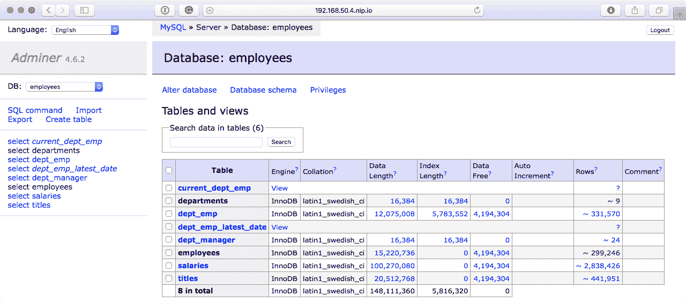

# 第四章：部署 LAMP Stack

在本章中，我们将使用 Ansible 随附的各种核心模块来部署完整的 LAMP stack。我们将针对我们在 第二章 部署的 CentOS 7 Vagrant box 进行操作，*安装和运行 Ansible*。

我们将讨论以下内容：

+   Playbook 布局—Playbook 应该如何结构化

+   Linux—准备 Linux 服务器

+   Apache—安装和配置 Apache

+   MariaDB—安装和配置 MariaDB

+   PHP—安装和配置 PHP

在我们开始编写 Playbook 之前，我们应该讨论一下我们将在本章中使用的结构，然后快速讨论一下我们需要的内容。

# 技术要求

我们将再次使用在之前章节中启动的 CentOS 7 Vagrant box。由于我们将在虚拟机上安装 LAMP stack 的所有元素，您的 Vagrant box 需要能够从互联网下载软件包；总共需要下载大约 500 MB 的软件包和配置。

您可以在 [`github.com/PacktPublishing/Learn-Ansible/tree/master/Chapter04/lamp`](https://github.com/PacktPublishing/Learn-Ansible/tree/master/Chapter04/lamp) 找到完整的 Playbook 副本。

# Playbook 结构

在之前的章节中，我们运行的 Playbook 通常尽可能基本。它们都在一个单独的文件中，伴随着一个主机清单文件。在本章中，由于我们将大大扩展 Playbook 的工作量，因此我们将使用 Ansible 建议的目录结构。

如您从以下布局中所见，有几个文件夹和文件：


让我们开始创建结构并在创建时讨论每个项目。我们需要创建的第一个文件夹是我们的顶层文件夹。这个文件夹将包含我们的 Playbook 文件夹和文件：

```
$ mkdir lamp
$ cd lamp
```

我们要创建的下一个文件夹叫做 `group_vars`。这将包含我们的 Playbook 中使用的变量文件。现在，我们将创建一个名为 `common.yml` 的单个变量文件：

```
$ mkdir group_vars
$ touch group_vars/common.yml
```

接下来，我们将创建两个文件：我们的主机清单文件，我们将命名为 `production`，以及我们的主 Playbook，通常称为 `site.yml`：

```
$ touch production
**$ touch site.yml** 
```

我们要手动创建的最后一个文件夹叫做 `roles`。在这里，我们将使用 `ansible-galaxy` 命令创建一个名为 `common` 的角色。为此，我们使用以下命令：

```
$ mkdir roles $ ansible-galaxy init roles/common
```

正如您可能已经从本节开头的初始结构中注意到的那样，common 角色本身有几个文件和文件夹；当我们运行 `ansible-galaxy init` 命令时，所有这些都会为我们创建。我们将在下一节讨论这些文件的作用，届时我们将使用 common 角色来配置我们的基本 Linux 服务器。

除了默认的 Ansible 结构之外，唯一的其他文件是我们的 `Vagrantfile`。它包含以下内容：

```
# -*- mode: ruby -*-
# vi: set ft=ruby :

API_VERSION = "2"
BOX_NAME    = "centos/7"
BOX_IP      = "192.168.50.4"
DOMAIN      = "nip.io"
PRIVATE_KEY = "~/.ssh/id_rsa"
PUBLIC_KEY  = '~/.ssh/id_rsa.pub'

Vagrant.configure(API_VERSION) do |config|
  config.vm.box = BOX_NAME
  config.vm.network "private_network", ip: BOX_IP
  config.vm.host_name = BOX_IP + '.' + DOMAIN
  config.ssh.insert_key = false
  config.ssh.private_key_path = [PRIVATE_KEY,
  "~/.vagrant.d/insecure_private_key"]
  config.vm.provision "file", source: PUBLIC_KEY,
  destination: "~/.ssh/authorized_keys"

  config.vm.provider "virtualbox" do |v|
    v.memory = "2024"
    v.cpus = "2"
  end

  config.vm.provider "vmware_fusion" do |v|
    v.vmx["memsize"] = "2024"
    v.vmx["numvcpus"] = "2"
  end

end
```

虽然我们将在本节和接下来的几节中逐个处理每个文件，但完整的 Playbook 副本可在附带的 GitHub 存储库中找到。

# LAMP stack

LAMP stack 是用来描述一体化的网站和数据库服务器的术语。通常，组件包括：

+   **Linux**：底层操作系统；在我们的情况下，我们将使用 CentOS 7。

+   **Apache**：该堆栈的网站服务器元素。

+   **MariaDB**：该堆栈的数据库组件；通常是基于 MySQL 的。由于 CentOS 7 预装了 MariaDB，我们将使用它而不是 PHP。

+   **PHP**：网站服务器用于生成内容的动态语言。

还有一个常见的 LAMP stack 变体叫做 **LEMP**；它用 *NGINX* 替换 *Apache*，*NGINX* 的发音是 *engine-x*，因此用 *E* 而不是 *N*。

我们将着手创建角色来处理这些组件；它们是：

+   `common`：这个角色将准备我们的 CentOS 服务器，安装我们需要的任何支持软件包和服务

+   `apache`：这个角色将安装 Apache web 服务器，并配置一个默认的虚拟主机

+   `mariadb`：这个角色不仅会安装 MariaDB，还会保护安装并创建一个默认的数据库和用户

+   `php`：这个角色将安装 PHP，一组常见的 PHP 模块，还有 Composer，这是一个用于 PHP 的包管理器

让我们开始编写 common 角色，准备好基础知识。

# 常见

在本章的前一部分中，我们使用`ansible-galaxy init`命令创建了`common`角色。这将创建几个文件夹和文件；在我们开始编辑它们之前，让我们快速讨论一下它们各自的用途：


我们只关心顶层；`main.yml`文件只是每个角色部分调用的默认 YAML 文件：

+   `README.md`：这是用于在像 GitHub 这样的服务中检入角色时创建有关角色的任何文档的文件。每当有人浏览 common 文件夹时，该文件将与文件夹列表一起显示。

+   `default`：这是角色的默认变量存储位置。这些变量可以被`vars`文件夹中具有相同名称的任何变量覆盖。

+   `files`：这个文件夹包含我们可能希望使用`copy`模块复制到目标主机的任何静态文件。

+   `handlers`：处理程序是在执行 playbook 后执行的任务；通常，`handlers`用于在配置文件更改时重新启动服务。

+   `meta`：这包含有关角色的信息，如果角色要发布到 Ansible Galaxy，则会使用。

+   `tasks`：这是大部分工作发生的地方。

+   `templates`：这个文件夹包含`template`模块使用的 Jinja2 模板。

+   `tests`：用于存储模块的任何测试。

+   `vars`：您可以使用此处定义的变量覆盖`default`文件夹中定义的任何变量；此处定义的变量也可以被从`group_vars`文件夹和 playbook 的顶层加载的任何变量覆盖。

让我们开始添加一些任务。

# 更新软件包

首先，让我们通过在`roles/common/tasks/main.yml`文件的开头添加以下内容来更新我们的服务器：

```
- name: update all of the installed packages
  yum:
    name: "*"
    state: "latest"
    update_cache: "yes"
```

您会注意到，与我们上次运行`yum`更新所有已安装软件包时有所不同，我们现在正在使用`name`键开始任务，这将在 playbook 运行时打印出我们分配给名称键的值的内容，这将让我们更好地了解 playbook 运行过程中发生了什么。

# 安装常用软件包

现在我们已经更新了安装的软件包，让我们安装我们想要在所有我们将启动的 Linux 服务器上安装的软件包：

```
- name: install the common packages
  yum:
    name: "{{ item }}"
    state: "installed"
  with_items: "{{ common_packages }}"
```

正如你所看到的，我们再次使用`yum`模块，并为任务添加了一个描述性名称。我们不是在任务中提供软件包的列表，而是使用一个名为`common_packages`的变量，在`roles/common/defaults/main.yml`文件中定义如下：

```
common_packages:
  - "ntp"
  - "ntpdate"
  - "vim-enhanced"
  - "git"
  - "unzip"
  - "policycoreutils-python"
  - "epel-release"
  - "https://centos7.iuscommunity.org/ius-release.rpm"
```

正如你所看到的，我们正在安装`ntp`和`ntpdate`；我们很快将配置`ntp`。接下来，我们安装`vim-enhanced`和`git`，因为它们在服务器上安装后总是有用。然后，我们安装`policycoreutils-python`包，稍后会详细介绍，最后安装并启用两个额外的`yum`仓库，EPEL 和 IUS。

**企业 Linux 的额外软件包**（**EPEL**）是一个特别感兴趣的小组，他们维护了一系列不属于 Red Hat Enterprise Linux 核心的软件包。EPEL 软件包通常基于它们的 Fedora 对应软件包，并且已经打包，因此它们永远不会与核心 Enterprise Linux 发行版中的软件包发生冲突或替换。

CentOS 7 附带一个名为`epel-release`的软件包，它启用了 EPEL 存储库。但是，IUS 没有发布包，因此在这里，我们不是使用核心 CentOS 存储库的软件包，而是提供了启用了 IUS 存储库的 RPM 文件的完整 URL，该文件适用于 CentOS 7。

IUS 社区项目是为红帽企业 Linux 和兼容操作系统（如 CentOS）提供 RPM 的集合，旨在提供与上游稳定**一致**的软件包，因此**IUS**。他们提供 Apache、PHP 和 MariaDB 的软件包，这些都是最新版本。IUS 提供的软件包遵循*SafeRepo 计划*中制定的规则，这意味着它们是可信的。

# 配置 NTP

接下来，我们从`templates`文件夹中复制`ntp.conf`文件，添加 NTP 服务器列表，然后告诉 Ansible 每当配置文件更改时重新启动 NTP：

```
- name: copy the ntp.conf to /etc/ntp.conf
  template:
    src: "ntp.conf.j2"
    dest: "/etc/ntp.conf"
  notify: "restart ntp"
```

模板文件可以在`roles/common/templates/ntp.conf.j2`中找到：

```
# {{ ansible_managed }}
driftfile /var/lib/ntp/drift
restrict default nomodify notrap nopeer noquery
restrict 127.0.0.1 
restrict ::1

server {{ item }} iburst

includefile /etc/ntp/crypto/pw
keys /etc/ntp/keys
disable monitor
```

如您所见，我们正在使用`ntp_servers`变量；这个变量存储在`roles/common/defaults/main.yml`文件中：

```
ntp_servers:
  - "0.centos.pool.ntp.org"
  - "1.centos.pool.ntp.org"
  - "2.centos.pool.ntp.org"
  - "3.centos.pool.ntp.org"
```

最后，以下任务已添加到`roles/common/handlers/main.yml`中：

```
- name: "restart ntp"
  service:
    name: "ntpd"
    state: "restarted"
```

虽然我们在这里通知了处理程序，但 NTP 将不会在 playbook 运行的最后重新启动，以及我们通知的任何其他任务。

# 创建用户

常见角色的最后一部分是添加一个名为`lamp`的用户，并将我们的公钥添加到该用户。在我们查看任务之前，让我们先看一下我们将要使用的变量，这些变量在`roles/common/defaults/main.yml`中定义：

```
users:
  - { name: "lamp", group: "lamp", state: "present", key: "{{ lookup('file', '~/.ssh/id_rsa.pub') }}" }
```

如您所见，我们提供了三条信息：

+   `name`：这是我们要创建的用户的名称

+   `group`：这是我们要将用户添加到的组

+   `state`：如果我们希望用户存在或不存在

+   `key`：在这里，我们使用 Ansible 查找任务来读取`~/.ssh/id_rsa.pub`文件的内容，并将其用作值

用于创建用户的`roles/common/tasks/main.yml`文件中的任务分为三部分；第一部分使用`group`模块创建组：

```
- name: add group for our users
  group:
    name: "{{ item.group }}"
    state: "{{ item.state }}"
  with_items: "{{ users }}"
```

如您所见，我们使用`with_items`加载`users`变量，因为该变量包含三个不同的项目，这里只使用了两个。我们可以只命名它们，所以这里我们使用`item.group`和`item.state`。

任务的第二部分使用`user`模块创建用户，如您所见：

```
- name: add users to our group
  user: 
    name: "{{ item.name }}"
    group: "{{ item.group }}"
    comment: "{{ item.name }}"
    state: "{{ item.state }}"
  with_items: "{{ users }}"
```

任务的最后一部分使用`authorized_key`模块将用户的公钥添加到授权密钥文件中：

```
- name: add keys to our users
  authorized_key:
    user: "{{ item.name }}"
    key: "{{ item.key }}"
  with_items: "{{ users }}"
```

如您所见，这次我们使用了`item.name`和`item.key`变量。该模块在用户的主目录中创建一个名为`.ssh/authorized_keys`的文件，该目录由`item.name`定义，然后将`item.key`的内容放在其中，使私钥的持有者可以访问我们刚刚创建的用户。

# 运行角色

首先，让我们通过运行以下命令之一来启动 CentOS 7 Vagrant box：

```
$ vagrant up
$ vagrant up --provider=vmware_fusion
```

现在我们有了服务器，我们需要更新主机清单；在`production`文件中输入以下内容：

```
box ansible_host=192.168.50.4.nip.io

[boxes]
box

[boxes:vars]
ansible_connection=ssh
ansible_user=vagrant
ansible_private_key_file=~/.ssh/id_rsa
host_key_checking=False
```

最后，我们需要一个执行我们角色的东西。将以下内容添加到`site.yml`文件中：

```
---

- hosts: boxes
  gather_facts: true
  become: yes
  become_method: sudo

  vars_files:
    - group_vars/common.yml

  roles:
    - roles/common
```

现在我们的 playbook 文件准备好了，我们可以通过运行以下命令来针对我们的 Vagrant box 运行它：

```
$ ansible-playbook -i production site.yml
```

几分钟后，您应该看到类似以下输出：

```
PLAY [boxes] ***************************************************************************************

TASK [Gathering Facts] *****************************************************************************
ok: [box]

TASK [roles/common : update all of the installed packages] *****************************************
changed: [box]

TASK [roles/common : install the common packages] **************************************************
changed: [box] => (item=[u'ntp', u'ntpdate', u'vim-enhanced', u'git', u'unzip', u'policycoreutils-python', u'epel-release', u'https://centos7.iuscommunity.org/ius-release.rpm'])

TASK [roles/common : copy the ntp.conf to /etc/ntp.conf] *******************************************
changed: [box]

TASK [roles/common : add group for our users] ******************************************************
changed: [box] => (item={u'state': u'present', u'group': u'lamp', u'name': u'lamp', u'key': u'ssh-rsa AAAAB3NzaC1yc2EAAAADAQABAAABAQDmuoFR01i/Yf3HATl9c3sufJvghTFgYzK/Zt29JiTqWlSQhmXhNNTh6iI6nXuPVhQGQaciWbqya6buncQ3vecISx6+EwsAmY3Mwpz1a/eMiXOgO/zn6Uf79dXcMN2JwpLFoON1f9PR0/DTpEkjwqb+eNLw9ThjH0J994+Pev+m8OrqgReFW36a/kviUYKsHxkXmkgxtPJgwKU90STNab4qyfKEGhi2w/NzECgseeQYs1H3klORaHQybhpXkoCIMmgy9gnzSH7oa2mJqKilVed27xoirkXzWPaAQlfiEE1iup+2xMqWY6Jl9qb8tJHRS+l8UcxTMNaWsQkTysLTgBAZ russmckendrick@me.com'})

TASK [roles/common : add users to our group] *******************************************************
changed: [box] => (item={u'state': u'present', u'group': u'lamp', u'name': u'lamp', u'key': u'ssh-rsa AAAAB3NzaC1yc2EAAAADAQABAAABAQDmuoFR01i/Yf3HATl9c3sufJvghTFgYzK/Zt29JiTqWlSQhmXhNNTh6iI6nXuPVhQGQaciWbqya6buncQ3vecISx6+EwsAmY3Mwpz1a/eMiXOgO/zn6Uf79dXcMN2JwpLFoON1f9PR0/DTpEkjwqb+eNLw9ThjH0J994+Pev+m8OrqgReFW36a/kviUYKsHxkXmkgxtPJgwKU90STNab4qyfKEGhi2w/NzECgseeQYs1H3klORaHQybhpXkoCIMmgy9gnzSH7oa2mJqKilVed27xoirkXzWPaAQlfiEE1iup+2xMqWY6Jl9qb8tJHRS+l8UcxTMNaWsQkTysLTgBAZ russmckendrick@me.com'})

TASK [roles/common : add keys to our users] ********************************************************
changed: [box] => (item={u'state': u'present', u'group': u'lamp', u'name': u'lamp', u'key': u'ssh-rsa AAAAB3NzaC1yc2EAAAADAQABAAABAQDmuoFR01i/Yf3HATl9c3sufJvghTFgYzK/Zt29JiTqWlSQhmXhNNTh6iI6nXuPVhQGQaciWbqya6buncQ3vecISx6+EwsAmY3Mwpz1a/eMiXOgO/zn6Uf79dXcMN2JwpLFoON1f9PR0/DTpEkjwqb+eNLw9ThjH0J994+Pev+m8OrqgReFW36a/kviUYKsHxkXmkgxtPJgwKU90STNab4qyfKEGhi2w/NzECgseeQYs1H3klORaHQybhpXkoCIMmgy9gnzSH7oa2mJqKilVed27xoirkXzWPaAQlfiEE1iup+2xMqWY6Jl9qb8tJHRS+l8UcxTMNaWsQkTysLTgBAZ russmckendrick@me.com'})

RUNNING HANDLER [roles/common : restart ntp] *******************************************************
changed: [box]

PLAY RECAP *****************************************************************************************
box : ok=8 changed=7 unreachable=0 failed=0
```

如您所见，一切都已按预期安装和配置。重新运行 playbook 会得到以下结果：

```
PLAY [boxes] ***************************************************************************************

TASK [Gathering Facts] *****************************************************************************
ok: [box]

TASK [roles/common : update all of the installed packages] *****************************************
ok: [box]

TASK [roles/common : install the common packages] **************************************************
ok: [box] => (item=[u'ntp', u'ntpdate', u'vim-enhanced', u'git', u'unzip', u'policycoreutils-python', u'epel-release', u'https://centos7.iuscommunity.org/ius-release.rpm'])

TASK [roles/common : copy the ntp.conf to /etc/ntp.conf] *******************************************
ok: [box]

TASK [roles/common : add group for our users] ******************************************************
ok: [box] => (item={u'state': u'present', u'group': u'lamp', u'name': u'lamp', u'key': u'ssh-rsa AAAAB3NzaC1yc2EAAAADAQABAAABAQDmuoFR01i/Yf3HATl9c3sufJvghTFgYzK/Zt29JiTqWlSQhmXhNNTh6iI6nXuPVhQGQaciWbqya6buncQ3vecISx6+EwsAmY3Mwpz1a/eMiXOgO/zn6Uf79dXcMN2JwpLFoON1f9PR0/DTpEkjwqb+eNLw9ThjH0J994+Pev+m8OrqgReFW36a/kviUYKsHxkXmkgxtPJgwKU90STNab4qyfKEGhi2w/NzECgseeQYs1H3klORaHQybhpXkoCIMmgy9gnzSH7oa2mJqKilVed27xoirkXzWPaAQlfiEE1iup+2xMqWY6Jl9qb8tJHRS+l8UcxTMNaWsQkTysLTgBAZ russmckendrick@me.com'})

TASK [roles/common : add users to our group] *******************************************************
ok: [box] => (item={u'state': u'present', u'group': u'lamp', u'name': u'lamp', u'key': u'ssh-rsa AAAAB3NzaC1yc2EAAAADAQABAAABAQDmuoFR01i/Yf3HATl9c3sufJvghTFgYzK/Zt29JiTqWlSQhmXhNNTh6iI6nXuPVhQGQaciWbqya6buncQ3vecISx6+EwsAmY3Mwpz1a/eMiXOgO/zn6Uf79dXcMN2JwpLFoON1f9PR0/DTpEkjwqb+eNLw9ThjH0J994+Pev+m8OrqgReFW36a/kviUYKsHxkXmkgxtPJgwKU90STNab4qyfKEGhi2w/NzECgseeQYs1H3klORaHQybhpXkoCIMmgy9gnzSH7oa2mJqKilVed27xoirkXzWPaAQlfiEE1iup+2xMqWY6Jl9qb8tJHRS+l8UcxTMNaWsQkTysLTgBAZ russmckendrick@me.com'})

TASK [roles/common : add keys to our users] ********************************************************
ok: [box] => (item={u'state': u'present', u'group': u'lamp', u'name': u'lamp', u'key': u'ssh-rsa AAAAB3NzaC1yc2EAAAADAQABAAABAQDmuoFR01i/Yf3HATl9c3sufJvghTFgYzK/Zt29JiTqWlSQhmXhNNTh6iI6nXuPVhQGQaciWbqya6buncQ3vecISx6+EwsAmY3Mwpz1a/eMiXOgO/zn6Uf79dXcMN2JwpLFoON1f9PR0/DTpEkjwqb+eNLw9ThjH0J994+Pev+m8OrqgReFW36a/kviUYKsHxkXmkgxtPJgwKU90STNab4qyfKEGhi2w/NzECgseeQYs1H3klORaHQybhpXkoCIMmgy9gnzSH7oa2mJqKilVed27xoirkXzWPaAQlfiEE1iup+2xMqWY6Jl9qb8tJHRS+l8UcxTMNaWsQkTysLTgBAZ russmckendrick@me.com'})

PLAY RECAP *****************************************************************************************
box : ok=7    changed=0    unreachable=0    failed=0
```

如您所见，我们跳过了重新启动 NTP 的任务，也没有其他要安装的附加软件包或更新，也没有对我们创建的用户或组的任何更改。现在我们已经更新和安装了基本软件包，并配置了基本操作系统，我们准备安装 Apache。

# Apache

目前，我们没有 Apache 的角色，所以让我们使用以下命令创建一个：

```
$ ansible-galaxy init roles/apache
```

与以前一样，这将为我们的 Apache 角色创建基本的框架。

# 安装 Apache

我们要添加的第一个任务是安装基本的 Apache 软件包。在`roles/apache/tasks/main.yml`中，添加以下内容：

```
- name: install the apache packages
  yum:
    name: "{{ item }}"
    state: "installed"
  with_items: "{{ apache_packages }}"
```

正如你可能已经猜到的那样，`apache_packages`的默认值可以在`roles/apache/defaults/main.yml`中找到：

```
apache_packages:
  - "httpd24u"
  - "httpd24u-filesystem"
  - "httpd24u-tools"
  - "httpd24u-mod_ssl"
  - "openssl"
  - "openssl-libs"
```

这将从 IUS 安装最新的 Apache 2.4 软件包，以及我们需要的一些支持工具。安装完成后，我们现在需要配置 Apache。

# 配置 Apache

也许你已经想知道为什么我们在上一节创建了一个名为`lamp`的用户；我们将为这个用户托管我们的网站。准备好用户托管我们网站的第一步是将用户添加到`apache_group`中。为此，我们需要运行以下任务：

```
- name: Add user to apache group
  user:
    name: "{{ item.name }}"
    groups: "{{ apache_group }}"
    append: yes
  with_items: "{{ users }}"
```

这里有两件事需要指出。第一是我们正在使用上一个角色中的`users`变量，在 playbook 运行中仍然可以使用，第二是我们在`roles/apache/defaults/main.yml`中添加了一个名为`apache_group`的变量：

```
apache_group: "apache"
```

既然我们的用户在`apache_group`中，让我们创建将成为我们网站文档根目录的内容：

```
- name: create the document root for our website
  file:
    dest: "{{ document_root }}"
    state: "directory"
    mode: "0755"
    owner: "{{ users.0.name }}"
    group: "{{ apache_group }}"
```

正如你所看到的，这使用了一些新变量，以及访问旧变量的新方法。让我们先解决`users.0.name`，因为我们已经将用户定义为列表。在 playbook 运行期间可能会添加多个用户，因为我们只想创建一个文档根目录并将其分配给一个虚拟主机，我们使用列表中的第一个用户，该用户在**user**变量下注册，这就是`0`的用处。

`document_root`变量也是使用这个原则构建的；这是`roles/apache/defaults/main.yml`文件中的两个变量，将帮助构成完整的文档根目录：

```
web_root: "web"
document_root: "/home/{{ users.0.name }}/{{ web_root }}"
```

这将使我们的文档根目录在 Vagrant box 上的路径为`/home/lamp/web/`，假设我们没有覆盖主要 playbook 中的任何变量名。

我们还需要更改 lamp 用户的主目录权限，以允许我们执行脚本；为此，调用以下任务：

```
- name: set the permissions on the user folder
  file:
    dest: "/home/{{ users.0.name }}/"
    state: "directory"
    mode: "0755"
    owner: "{{ users.0.name }}"
```

接下来，我们需要放置我们的 Apache 虚拟主机；这将在我们在浏览器中输入主机名时提供我们的网页。为此，我们将使用存储在`roles/apache/templates/vhost.conf.j2`中的模板文件，该文件使用我们已经定义的变量以及另外两个变量：

```
# {{ ansible_managed }}
<VirtualHost *:80>
  ServerName {{ ansible_nodename }}
  DocumentRoot {{ document_root }}
  DirectoryIndex {{ index_file }}
  <Directory {{ document_root }}>
    AllowOverride All
    Require all granted
  </Directory>
</VirtualHost>
```

`roles/apache/defaults/main.yml`中的`index_file`变量如下所示：

```
index_file: index.html
```

还有`ansible_nodename`变量；这是从主机机器收集的变量之一，当`setup`模块首次运行时。部署模板的任务如下：

```
- name: copy the vhost.conf to /etc/httpd/conf.d/
  template:
    src: "vhost.conf.j2"
    dest: "/etc/httpd/conf.d/vhost.conf"
  notify: "restart httpd"
```

重启 Apache 的任务可以在`roles/apache/handlers/main.yml`中找到，如下所示：

```
- name: "restart httpd"
  service:
    name: "httpd"
    state: "restarted"
```

既然我们已经安装和配置了 Apache，我们需要允许 Apache 使用存储在`/home/`中的网站根目录。为此，我们需要调整 SELinux 权限。

# 配置 SELinux

在上一节安装的软件包之一是`policycoreutils-python`。这允许我们使用 Python 配置 SELinux，因此也可以使用 Ansible。

**安全增强型 Linux**（**SELinux**）是由红帽和美国国家安全局开发的。它提供了在内核级别支持访问控制安全策略的机制。这些包括美国国防部使用的强制访问控制。

默认情况下，我们使用的 Vagrant box 启用了 SELinux。我们可以不简单地停止 SELinux，而是允许 Apache 在其默认的`/var/www/`之外运行。为此，我们需要将以下内容添加到我们的角色中：

```
- name: set the selinux allowing httpd_t to be permissive
  selinux_permissive:
    name: httpd_t
    permissive: true
```

现在 Apache 被允许从我们的用户目录中提供内容，我们可以添加一个`index.html`文件，这样我们就有了除了默认的 Apache 页面之外的东西来提供。

# 复制 HTML 文件

最后一个任务是将`index.html`文件复制到我们的网站根目录，这样我们就有了新安装的 Apache 服务器可以提供的内容。执行此任务使用`template`模块：

```
- name: copy the test HTML page to the document root
  template:
    src: "index.html.j2"
    dest: "{{ document_root }}/index.html"
    mode: "0644"
    owner: "{{ users.0.name }}"
    group: "{{ apache_group }}"
  when: html_deploy == true
```

如你所见，我们正在加载一个名为 `index.html.j2` 的模板，其中包含以下内容：

```
<!--{{ ansible_managed }}-->
<!doctype html>
<title>{{ html_heading }}</title>
<style>
  body { text-align: center; padding: 150px; }
  h1 { font-size: 50px; }
  body { font: 20px Helvetica, sans-serif; color: #333; }
  article { display: block; text-align: left; width: 650px;
   margin: 0 auto; }
</style>
<article>
    <h1>{{ html_heading }}</h1>
    <div>
        <p>{{ html_body }}</p>
    </div>
</article>
```

我们在模板中使用了两个变量；这两个变量可以在 `roles/apache/defaults/main.yml` 文件中找到，还有一个变量：

```
html_deploy: true
html_heading: "Success !!!"
html_body: |
  This HTML page has been deployed using Ansible to
   <b>{{ ansible_nodename }}</b>.<br>
  The user is <b>{{ users.0.name }}</b> who is in the
   <b>{{ apache_group }}</b> group.<br>
  The weboot is <b>{{ document_root }}</b>, the default index file is
   <b>{{ index_file }}</b>.<br>
```

作为任务的一部分，我们有以下一行：

```
when: html_deploy == true
```

这意味着只有当 `html_deploy` 等于 `true` 时，任务才会被执行。如果是其他任何值，那么任务将被跳过。我们将在本章后面讨论这一点，但现在，我们希望页面被部署，所以我们将保持在 `apache/defaults/main.yml` 文件中定义的默认值。

在运行角色之前要指出的最后一件事是 `html_body` 变量。如你所见，变量的内容分布在三行上。在变量名后使用 `|` 字符来实现这一点；这有助于使你的变量文件可读，同时也允许你开始将诸如密钥或证书之类的项目作为变量进行分发，同时还允许你使用 vault 进行编码。

# 运行角色

现在安装和配置 Apache 的角色已经完成，我们可以将其添加到我们的 playbook 中：

```
---

- hosts: boxes
  gather_facts: true
  become: yes
  become_method: sudo

  vars_files:
    - group_vars/common.yml

  roles:
    - roles/common
    - roles/apache
```

在上一节的 playbook 之后，我们可以简单地重新运行以下命令：

```
$ ansible-playbook -i production site.yml
```

这将在执行 `apache` 角色之前通过通用角色工作。我在这里截断了 playbook 运行中通用角色的输出：

```
PLAY [boxes] ***************************************************************************************

TASK [Gathering Facts] *****************************************************************************
ok: [box]

TASK [roles/common : update all of the installed packages] *****************************************
ok: [box]

TASK [roles/common : install the common packages] **************************************************
ok: [box]

TASK [roles/common : copy the ntp.conf to /etc/ntp.conf] *******************************************
ok: [box]

TASK [roles/common : add group for our users] ******************************************************
ok: [box]
TASK [roles/common : add users to our group] *******************************************************
ok: [box]

TASK [roles/common : add keys to our users] ********************************************************
ok: [box]

TASK [roles/apache : install the apache packages] **************************************************
changed: [box] => (item=[u'httpd24u', u'httpd24u-filesystem', u'httpd24u-tools', u'httpd24u-mod_ssl', u'openssl', u'openssl-libs'])

TASK [roles/apache : Add user to apache group] *****************************************************
changed: [box] => (item={u'state': u'present', u'group': u'lamp', u'name': u'lamp', u'key': u'ssh-rsa AAAAB3NzaC1yc2EAAAADAQABAAABAQDmuoFR01i/Yf3HATl9c3sufJvghTFgYzK/Zt29JiTqWlSQhmXhNNTh6iI6nXuPVhQGQaciWbqya6buncQ3vecISx6+EwsAmY3Mwpz1a/eMiXOgO/zn6Uf79dXcMN2JwpLFoON1f9PR0/DTpEkjwqb+eNLw9ThjH0J994+Pev+m8OrqgReFW36a/kviUYKsHxkXmkgxtPJgwKU90STNab4qyfKEGhi2w/NzECgseeQYs1H3klORaHQybhpXkoCIMmgy9gnzSH7oa2mJqKilVed27xoirkXzWPaAQlfiEE1iup+2xMqWY6Jl9qb8tJHRS+l8UcxTMNaWsQkTysLTgBAZ russmckendrick@me.com'})

TASK [roles/apache : create the document root for our website] *************************************
changed: [box]

TASK [roles/apache : set the permissions on the user folder] ***************************************
changed: [box]

TASK [roles/apache : copy the vhost.conf to /etc/httpd/conf.d/] ************************************
changed: [box]

TASK [roles/apache : set the selinux allowing httpd_t to be permissive] ****************************
changed: [box]

TASK [roles/apache : copy the test HTML page to the document root] *********************************
changed: [box]

RUNNING HANDLER [roles/apache : restart httpd] *****************************************************
changed: [box]

PLAY RECAP *****************************************************************************************
box : ok=15 changed=8 unreachable=0 failed=0
```

在浏览器中打开 `http://192.168.50.4.nip.io/` 应该会给我们一个看起来像以下截图的页面：


如你所见，模板已经捕捉到我们定义的所有变量；页面的源代码如下：

```
<!--Ansible managed-->
<!doctype html>
<title>Success !!!</title>
<style>
  body { text-align: center; padding: 150px; }
  h1 { font-size: 50px; }
  body { font: 20px Helvetica, sans-serif; color: #333; }
  article { display: block; text-align: left; width: 650px;
    margin: 0 auto; }
</style>
<article>
  <h1>Success !!!</h1>
  <div>
    <p>This HTML page has been deployed using Ansible to
    <b>192.168.50.4.nip.io</b>.<br>
    The user is <b>lamp</b> who is in the <b>apache</b> group.<br>
    The weboot is <b>/home/lamp/web</b>, the default index file is
    <b>index.html</b>.<br></p>
  </div>
</article>
```

如果我们重新运行 playbook，我们应该会看到以下结果：

```
PLAY RECAP *****************************************************************************************
box : ok=14 changed=0 unreachable=0 failed=0
```

如你所见，有 `14` 个任务是 `ok`，没有发生任何 `changed`。

# MariaDB

接下来，我们将安装和配置 MariaDB，我们 LAMP 堆栈的数据库组件。

MariaDB 是 MySQL 的一个分支。它的开发由一些 MySQL 的原始开发人员领导；他们在 Oracle 收购 MySQL 后对 MySQL 的许可证引发了一些担忧后创建了这个分支。

第一步是创建我们将需要的角色文件；同样，我们将使用 `ansible-galaxy init` 命令来引导角色文件：

```
$ ansible-galaxy init roles/mariadb
```

# 安装 MariaDB

由于我们在 playbook 中使用了 IUS 仓库来安装其他软件包，所以从那里安装最新版本的 MariaDB 是有道理的。然而，我们首先需要解决一个冲突。

作为基本的 Vagrant 盒子安装，邮件服务器 Postfix 被安装了。Postfix 需要 `mariadb-libs` 软件包作为依赖，但安装这个软件包会导致与我们想要安装的后续版本软件包发生冲突。解决这个问题的方法是移除 `mariadb-libs` 软件包，然后安装我们需要的软件包，以及在卸载 `mariadb-libs` 时被移除的 Postfix。

角色中的第一个任务，我们需要添加到 `roles/mariadb/tasks/mail.yml`，看起来像这样：

```
- name: remove the packages so that they can be replaced
  yum:
    name: "{{ item }}"
    state: "absent"
  with_items: "{{ mariadb_packages_remove }}"
```

正如你可能已经怀疑的那样，`mariadb_packages_remove` 在 `roles/mariadb/defaults/main.yml` 文件中被定义：

```
mariadb_packages_remove:
  - "mariadb-libs.x86_64"
```

如你所见，我们正在使用完整的软件包名称。我们需要这样做，因为如果我们简单地使用 `mariadb-libs`，那么新安装的软件包将在每次 playbook 运行时被移除。这是不好的，因为这个任务也会卸载我们接下来要安装的所有 MariaDB 软件包，如果我们有一个正在运行的数据库，那将是一场灾难！

为了安装 MariaDB 的后续版本，我们需要添加以下任务：

```
- name: install the mariadb packages
  yum:
    name: "{{ item }}"
    state: "installed"
  with_items: "{{ mariadb_packages }}"
```

`mariadb_packages` 变量，同样可以在 defaults 文件夹中找到，看起来像这样：

```
mariadb_packages:
  - "mariadb101u"
  - "mariadb101u-server"
  - "mariadb101u-config"
  - "mariadb101u-common"
  - "mariadb101u-libs"
  - "MySQL-python"
  - "postfix"
```

我们正在安装 MariaDB 的软件包，以及上一个任务中被移除的 Postfix。我们还安装了 `MySQL-python` 软件包，这将允许 Ansible 与我们的 MariaDB 安装进行交互。

默认情况下，MariaDB 在安装过程中不会启动。通常，我们会使用处理程序在 playbook 运行的最后启动服务，正如我们从前面的部分学到的，处理程序在 playbook 执行的最后运行。如果我们不需要与 MariaDB 服务交互来配置它，这不会是一个问题。为了解决这个问题，我们需要将以下任务添加到我们的角色中：

```
- name: start mariadb
  service:
    name: "mariadb"
    state: "started"
    enabled: "yes"
```

这确保了 MariaDB 正在运行，并配置了服务以在启动时启动。

# 配置 MariaDB

现在 MariaDB 已安装并运行，我们开始配置它。我们默认安装的 MariaDB 没有定义根密码，所以这应该是我们设置的第一件事。我们可以使用`mysql_user`模块来做到这一点：

```
- name: change mysql root password
  mysql_user:
    name: "{{ mariadb_root_username }}" 
    host: "{{ item }}" 
    password: "{{ mariadb_root_password }}"
    check_implicit_admin: "yes"
    priv: "*.*:ALL,GRANT"
  with_items: "{{ mariadb_hosts }}"
```

正如你所看到的，我们使用了一些不同的变量；这些在`roles/mariadb/defaults/main.yml`中定义为：

```
mariadb_root_username: "root"
mariadb_root_password: "Pa55W0rd123"
mariadb_hosts:
  - "127.0.0.1"
  - "::1"
  - "{{ ansible_nodename }}"
  - "%"
  - "localhost"
```

`mariadb_hosts`中主机的顺序很重要；如果`localhost`不是最后一个更改的主机，那么 Ansible 将会给出一个关于无法连接到 MariaDB 的错误消息。这是因为我们利用了 MariaDB 没有默认 root 密码的事实来实际设置 root 密码。

现在，一旦我们配置了 root 用户的密码，我们仍然希望能够连接到 MySQL。我喜欢在根用户文件夹下设置一个`~/.my.cnf`文件。这可以在 Ansible 中完成如下：

```
- name: set up .my.cnf file
  template:
    src: "my.cnf.j2"
    dest: "~/.my.cnf"
```

模板文件可以在`lamp/roles/mariadb/templates/my.cnf.j2`中找到；它包含以下内容：

```
# {{ ansible_managed }}
[client]
password='{{ mariadb_root_password }}'
```

一旦放置好，这意味着系统根用户——不要与我们刚刚在 MariaDB 中设置的 root 用户混淆——将直接访问 MariaDB 而无需提供密码。接下来，我们可以删除默认创建的匿名用户。同样，我们将使用`mysql_user`模块来完成这个操作：

```
- name: delete anonymous MySQL user
  mysql_user:
    user: ""
    host: "{{ item }}"
    state: "absent"
  with_items: "{{ mariadb_hosts }}"
```

最后，还创建了一个`test`数据库。由于我们将创建自己的数据库，让我们也将其删除，这次使用`mysql_db`模块：

```
- name: remove the MySQL test database
  mysql_db:
    db: "test" 
    state: "absent"
```

这些配置任务相当于运行`mysql_secure_installation`命令。

# 导入示例数据库

现在我们的 MariaDB 安装已经完成，我们应该对其进行一些操作。GitHub 上有一些示例数据库可用。让我们来看看导入 datacharmer 提供的 employee 数据库。我们将使用一个稍微修改过的 SQL 转储文件版本，但稍后在本节中会详细介绍。

我们将在 playbook 的这一部分使用嵌套变量；这些可以在`mariadb/defaults/main.yml`中找到：

```
mariadb_sample_database:
  create_database: true
  source_url: "https://github.com/russmckendrick/test_db/archive/master.zip"
  path: "/tmp/test_db-master"
  db_name: "employees"
  db_user: "employees"
  db_password: "employees"
  dump_files:
    - "employees.sql"
    - "load_departments.dump"
    - "load_employees.dump"
    - "load_dept_emp.dump"
    - "load_dept_manager.dump"
    - "load_titles.dump"
    - "load_salaries1.dump"
    - "load_salaries2.dump"
    - "load_salaries3.dump"
    - "show_elapsed.sql"
```

当我们调用这些变量时，它们需要以`mariadb_sample_database`为前缀。例如，每当我们需要使用`db_name`变量时，我们将需要使用`mariadb_sample_database.db_name`。就像我们在上一节中复制 HTML 文件时一样，我们将为每个任务添加一个使用`when`的条件，这意味着如果需要，它们可以被跳过。

我们需要做的第一件事是从 GitHub 下载转储文件的副本并解压缩它们。为此，我们将使用`unarchive`模块：

```
- name: download and unarchive the sample database data
  unarchive:
    src: "{{ mariadb_sample_database.source_url }}"
    dest: "/tmp"
    remote_src: "yes"
  when: mariadb_sample_database.create_database == true
```

我们正在从远程位置获取文件，即 URL`mariadb_sample_database.source_url`，并在`/tmp`中解压缩它。由于我们将`remote_src`设置为`yes`，Ansible 知道它必须从远程源下载文件。如果我们没有提供完整的 URL，它将尝试从控制主机复制文件。

接下来的两个任务使用`mysql_db`和`mysql_user`模块来创建数据库和一个可以访问它的用户：

```
- name: create the sample database
  mysql_db:
    db: "{{ mariadb_sample_database.db_name }}" 
    state: "present"
  when: mariadb_sample_database.create_database == true

- name: create the user for the sample database
  mysql_user:
    name: "{{ mariadb_sample_database.db_user }}"
    password: "{{ mariadb_sample_database.db_password }}"
    priv: "{{ mariadb_sample_database.db_name }}.*:ALL"
    state: "present"
  with_items: "{{ mariadb_hosts }}"
  when: mariadb_sample_database.create_database == true
```

playbook 的最后部分将 MySQL 转储文件导入数据库；然而，在导入文件之前，我们应该首先检查转储文件是否已经被导入。如果我们每次运行 playbook 时不执行此检查，转储文件将被导入。为了检查数据是否已经被导入，我们将使用`stat`模块；这将检查文件的存在并收集有关它的信息。

如果我们已经导入了数据，`/var/lib/mysql/employees`文件夹中将会有一个名为`employees.frm`的文件，因此让我们检查一下：

```
- name: check to see if we need to import the sample database dumps
  stat:
    path: "/var/lib/mysql/{{ mariadb_sample_database.db_name }}/{{ mariadb_sample_database.db_name }}.frm"
  register: db_imported
  when: mariadb_sample_database.create_database == true
```

现在我们知道是否需要导入数据库转储，我们可以继续进行最后的任务，如果满足以下条件，将导入`mariadb_sample_database.dump_files`中列出的数据库转储：

+   变量`db_imported`是否已定义？如果没有，则我们将跳过导入示例数据库，并且应该跳过此任务。

+   `db_imported.stat.exists`是否等于`false`？如果是，则文件不存在，我们应该导入数据。

该任务本身使用`mysql_db`模块来导入数据：

```
- name: import the sample database
  mysql_db:
    name: "{{ mariadb_sample_database.db_name }}"
    state: "import"
    target: "{{ mariadb_sample_database.path }}/{{ item }}"
  with_items: "{{ mariadb_sample_database.dump_files }}"
  when: db_imported is defined and db_imported.stat.exists == false
```

这完成了将示例数据库导入到我们的 MariaDB 安装中；现在让我们运行 playbook 并调用角色。

# 运行角色

现在我们已经编写了我们的角色，我们可以将其添加到我们的 playbook 中：

```
---

- hosts: boxes
  gather_facts: true
  become: yes
  become_method: sudo

  vars_files:
    - group_vars/common.yml

  roles:
    - roles/common
    - roles/apache
    - roles/mariadb
```

同样，我们可以使用以下命令重新运行 playbook：

```
$ ansible-playbook -i production site.yml
```

在继续进行 MariaDB 等效之前，这将通过常见和 Apache 角色进行操作。这个 playbook 输出开始于 MariaDB 角色开始之前：

```
TASK [roles/apache : set the selinux allowing httpd_t to be permissive] ***************************************************************************************************
ok: [box]

TASK [roles/apache : copy the test HTML page to the document root] ********************************************************************************************************
ok: [box]

TASK [roles/mariadb : remove the packages so that they can be replaced] ***************************************************************************************************
changed: [box] => (item=[u'mariadb-libs.x86_64'])

TASK [roles/mariadb : install the mariadb packages] ***********************************************************************************************************************
changed: [box] => (item=[u'mariadb101u', u'mariadb101u-server', u'mariadb101u-config', u'mariadb101u-common', u'mariadb101u-libs', u'MySQL-python', u'postfix'])

TASK [roles/mariadb : start mariadb] **************************************************************************************************************************************
changed: [box]

TASK [roles/mariadb : change mysql root password] *************************************************************************************************************************
changed: [box] => (item=127.0.0.1)
changed: [box] => (item=::1)
changed: [box] => (item=192.168.50.4.nip.io)
changed: [box] => (item=%)
changed: [box] => (item=localhost)

TASK [roles/mariadb : set up .my.cnf file] ********************************************************************************************************************************
changed: [box]

TASK [roles/mariadb : delete anonymous MySQL user] ************************************************************************************************************************
ok: [box] => (item=127.0.0.1)
ok: [box] => (item=::1)
changed: [box] => (item=192.168.50.4.nip.io)
ok: [box] => (item=%)
changed: [box] => (item=localhost)

TASK [roles/mariadb : remove the MySQL test database] *********************************************************************************************************************
changed: [box]

TASK [roles/mariadb : download and unarchive the sample database data] ****************************************************************************************************
changed: [box]

TASK [roles/mariadb : create the sample database] *************************************************************************************************************************
changed: [box]

TASK [roles/mariadb : create the user for the sample database] ************************************************************************************************************
changed: [box] => (item=127.0.0.1)
ok: [box] => (item=::1)
ok: [box] => (item=192.168.50.4.nip.io)
ok: [box] => (item=%)
ok: [box] => (item=localhost)

TASK [roles/mariadb : check to see if we need to import the sample database dumps] ****************************************************************************************
ok: [box]

TASK [roles/mariadb : import the sample database] *************************************************************************************************************************
changed: [box] => (item=employees.sql)
changed: [box] => (item=load_departments.dump)
changed: [box] => (item=load_employees.dump)
changed: [box] => (item=load_dept_emp.dump)
changed: [box] => (item=load_dept_manager.dump)
changed: [box] => (item=load_titles.dump)
changed: [box] => (item=load_salaries1.dump)
changed: [box] => (item=load_salaries2.dump)
changed: [box] => (item=load_salaries3.dump)
changed: [box] => (item=show_elapsed.sql)

PLAY RECAP ****************************************************************************************************************************************************************
box : ok=26 changed=11 unreachable=0 failed=0
```

如果我们重新运行 playbook，playbook 运行的最后部分将返回以下内容：

```
TASK [roles/mariadb : download and unarchive the sample database data] ****************************************************************************************************
ok: [box]

TASK [roles/mariadb : create the sample database] *************************************************************************************************************************
ok: [box]

TASK [roles/mariadb : create the user for the sample database] ************************************************************************************************************
ok: [box] => (item=127.0.0.1)
ok: [box] => (item=::1)
ok: [box] => (item=192.168.50.4.nip.io)
ok: [box] => (item=%)
ok: [box] => (item=localhost)

TASK [roles/mariadb : check to see if we need to import the sample database dumps] ****************************************************************************************
ok: [box]

TASK [roles/mariadb : import the sample database] *************************************************************************************************************************
skipping: [box] => (item=employees.sql)
skipping: [box] => (item=load_departments.dump)
skipping: [box] => (item=load_employees.dump)
skipping: [box] => (item=load_dept_emp.dump)
skipping: [box] => (item=load_dept_manager.dump)
skipping: [box] => (item=load_titles.dump)
skipping: [box] => (item=load_salaries1.dump)
skipping: [box] => (item=load_salaries2.dump)
skipping: [box] => (item=load_salaries3.dump)
skipping: [box] => (item=show_elapsed.sql)

PLAY RECAP ****************************************************************************************************************************************************************
box : ok=25 changed=0 unreachable=0 failed=0
```

如你所见，我们设置的检查以防止重新导入数据库转储的工作效果如预期。我们可以使用 Sequel Pro 或 MySQL Workbench 等工具测试我们的 MariaDB 安装；只需使用以下主机和凭据连接：

+   主机：`192.168.50.4.nip.io`

+   端口：`3306`

+   用户名：`root`

+   密码：`Pa55W0rd123`

以下截图来自 Sequel Pro，显示了我们导入到`employees 数据库`中的`employees`表：


现在我们已经安装、配置了 MariaDB，并导入了一些示例数据，让我们来看看创建一个安装 PHP 的角色，这是我们 LAMP 堆栈的最后一个组件。

# PHP

我们正在组合的堆栈的最后一个元素是 PHP。与其他三个元素一样，我们需要使用`ansible-galaxy init`命令创建一个角色：

```
$ ansible-galaxy init roles/php
```

与堆栈的其他部分一样，我们将使用 IUS 存储库中的软件包；这将允许我们安装 PHP 的最新版本，即 7.2 版本。

# 安装 PHP

与堆栈的前三部分一样，我们将从安装软件包开始。与以前一样，我们在`roles/php/default/main.yml`中定义了一个变量，列出了我们需要的所有软件包：

```
php_packages:
  - "php72u"
  - "php72u-bcmath"
  - "php72u-cli"
  - "php72u-common"
  - "php72u-dba"
  - "php72u-fpm"
  - "php72u-fpm-httpd"
  - "php72u-gd"
  - "php72u-intl"
  - "php72u-json"
  - "php72u-mbstring"
  - "php72u-mysqlnd"
  - "php72u-odbc"
  - "php72u-pdo"
  - "php72u-process"
  - "php72u-snmp"
  - "php72u-soap"
  - "php72u-xml"
  - "php72u-xmlrpc"
```

这是在`php/roles/tasks/main.yml`中使用 YUM 模块安装的：

```
- name: install the php packages
  yum:
    name: "{{ item }}"
    state: "installed"
  with_items: "{{ php_packages }}"
  notify:
    - "restart php-fpm"
    - "restart httpd"
```

从这个任务中可以看出，我们正在通知两个不同的处理程序，一个是 Apache，另一个是 PHP-FPM。你可能会想：为什么我们需要通知 Apache？

**FastCGI 进程管理器**（**FPM**）是一个 PHP FastCGI 实现，它有助于使繁忙的 PHP 网站运行更高效。它还增加了使用不同用户和组 ID 启动 PHP 工作者的能力，可以使用不同的`php.ini`文件在不同的端口上监听，从而允许您创建处理负载的 PHP 工作者池。

由于我们正在安装`php72u-fpm`软件包，我们需要配置 Apache 以使用`php72u-fpm-httpd`软件包中设置的配置；如果不这样做，Apache 将不会加载配置，这会指示它如何与 PHP-FPM 交互。

PHP-FPM 的处理程序可以在`roles/php/handlers/main.yml`中找到，其中包含以下内容：

```
- name: "restart php-fpm"
  service:
    name: "php-fpm"
    state: "restarted"
    enabled: "yes"
```

这就是 PHP 安装和配置的全部内容；现在我们应该有一个可用的 PHP 安装，并且我们可以使用 phpinfo 文件进行测试。

# phpinfo 文件

与 Apache 安装一样，我们可以添加选项来上传一个测试文件，这里是一个简单的 PHP 文件，调用`php_info`函数。这会显示关于我们的 PHP 安装的信息。上传此文件的任务如下所示：

```
- name: copy the test PHP page to the document root
  copy:
    src: "info.php"
    dest: "{{ document_root }}/info.php"
    mode: "0755"
    owner: "{{ users.0.name }}"
    group: "{{ apache_group }}"
  when: php_info == true
```

如你所见，只有在`roles/php/default/main.yml`中设置以下内容时才会被调用：

```
php_info: true
```

我们从我们的 Ansible 控制器复制到主机的文件可以在`roles/php/files/info.php`中找到，它包含以下三行：

```
<?php
  phpinfo();
?>
```

虽然这表明 PHP 已安装并运行，但并不是很有趣，因此在运行 playbook 之前，让我们添加一些将我们的 LAMP 堆栈所有元素联系在一起的步骤。

# Adminer

playbook 的最后一个任务将是安装一个名为 Adminer 的 PHP 脚本；这提供了一个用于与数据库交互和管理的基于 PHP 的界面。安装 Adminer 有三个步骤，所有这些步骤都使用`roles/php/defaults/main.yml`中的嵌套变量：

```
adminer:
  install: true
  path: "/usr/share/adminer"
  download: "https://github.com/vrana/adminer/releases/download/v4.6.2/adminer-4.6.2-mysql.php"
```

如您所见，我们再次使用嵌套变量，这次是告诉我们的 playbook 安装工具的位置，应该安装在哪里，以及可以从哪里下载。`roles/php/tasks/main.yml`中的第一个任务是创建我们将安装 Adminer 的目录：

```
- name: create the document root for adminer
  file:
    dest: "{{ adminer.path }}"
    state: "directory"
    mode: "0755"
  when: adminer.install == true
```

现在我们在 Vagrant 盒子上有了一个安装 Adminer 的地方，我们应该下载它。这一次，由于我们不是在下载存档，我们使用`get_url`模块：

```
- name: download adminer
  get_url:
    url: "{{ adminer.download }}"
    dest: "{{ adminer.path }}/index.php"
    mode: 0755
  when: adminer.install == true
```

如您所见，我们正在从 GitHub 下载`adminer-4.6.2-mysql.php`文件，并将其保存到**`/usr/share/adminer/index.php`**，那么我们如何访问它呢？任务的最后一部分使用模板模块将额外的 Apache 配置文件上传到`/etc/httpd/conf.d/adminer.conf`：

```
- name: copy the vhost.conf to /etc/httpd/conf.d/
  template:
    src: "adminer.conf.j2"
    dest: "/etc/httpd/conf.d/adminer.conf"
  when: adminer.install == true
  notify: "restart httpd"
```

`adminer.conf.j2` 模板应放置在 `roles/php/templates`，如下所示：

```
# {{ ansible_managed }}
Alias /adminer "{{ adminer.path }}"
  <Directory "{{ adminer.path }}">
    DirectoryIndex index.php
    AllowOverride All
    Require all granted
  </Directory>
```

如您所见，它正在创建一个名为`/adminer`的别名，然后指向`/usr/share/adminer/`中的`index.php`。由于我们正在添加到 Apache 配置文件，因此我们还通知`restart httpd`处理程序，以便 Apache 重新启动，从而获取我们更新的配置。

# 运行角色

现在我们的 LAMP 堆栈的最后一个元素的角色已经完成，我们可以将其添加到我们的 playbook 中。现在它应该看起来像下面这样：

```
---

- hosts: boxes
  gather_facts: true
  become: yes
  become_method: sudo

  vars_files:
    - group_vars/common.yml

  roles:
    - roles/common
    - roles/apache
    - roles/mariadb
    - roles/php
```

使用以下命令运行它：

```
$ ansible-playbook -i production site.yml
```

这将在我们的 Vagrant 盒子上部署 PHP；此输出作为调用 PHP 角色：

```
TASK [roles/php : install the php packages] ********************************************************
changed: [box] => (item=[u'php72u', u'php72u-bcmath', u'php72u-cli', u'php72u-common', u'php72u-dba', u'php72u-fpm', u'php72u-fpm-httpd', u'php72u-gd', u'php72u-intl', u'php72u-json', u'php72u-mbstring', u'php72u-mysqlnd', u'php72u-odbc', u'php72u-pdo', u'php72u-process', u'php72u-snmp', u'php72u-soap', u'php72u-xml', u'php72u-xmlrpc'])

```

```
TASK [roles/php : copy the test PHP page to the document root] *************************************
changed: [box]

TASK [roles/php : create the document root for adminer] ********************************************
changed: [box]

TASK [roles/php : download adminer] ****************************************************************
changed: [box]

TASK [roles/php : copy the vhost.conf to /etc/httpd/conf.d/] ***************************************
changed: [box]

RUNNING HANDLER [roles/common : restart ntp] *******************************************************
changed: [box]

RUNNING HANDLER [roles/apache : restart httpd] *****************************************************
changed: [box]

RUNNING HANDLER [roles/php : restart php-fpm] ******************************************************
changed: [box]

PLAY RECAP *****************************************************************************************
box : ok=34 changed=32 unreachable=0 failed=0
```

安装完成后，您应该能够访问以下 URL：

+   `http://192.168.50.4.nip.io/info.php`

+   `http://192.168.50.4.nip.io/adminer/`

当您访问第一个链接时，您应该看到类似以下页面的内容：


在第二个链接中，一旦使用用户名`root`和密码`Pa55W0rd123`登录，您应该能够看到`employees`数据库：



使用 Adminer，我们有一个 PHP 脚本访问我们的 MariaDB 数据库；页面是由我们的 Linux Vagrant 盒子上的 Apache 提供的。

# 覆盖变量

在我们完成之前，我们应该快速讨论一下如何覆盖我们一直在设置的默认变量。为此，将以下行添加到`group_vars/common.yml`文件中：

```
html_body: |
  This HTML page has been deployed using Ansible to <b>{{ ansible_nodename }}</b>.<br>
  The user is <b>{{ users.0.name }}</b> who is in the <b>{{ apache_group }}</b> group.<br>
  The weboot is <b>{{ document_root }}</b>, the default index file is <b>{{ index_file }}</b>.<br>
  You can access a <a href="/info.php">PHP Info file</a> or <a href="/adminer/">Adminer</a>.
```

然后重新运行 playbook。一旦 playbook 完成，打开`http://192.168.50.4.nip.io/`将显示以下页面：


如您所见，默认的`index.html`页面已更新为包含指向我们的 phpinfo 页面和 Adminer 的链接。我们配置为默认的任何变量都可以以这种方式被覆盖。

# 摘要

在本章中，我们已经通过编写一个 playbook，在我们的 CentOS 7 Vagrant 盒子上安装了一个 LAMP 堆栈。我们创建了四个角色，每个角色对应堆栈的一个元素，并在每个角色中构建了一些逻辑，可以覆盖以部署其他元素，如测试 HTML 和 PHP 页面，并且还内置了创建一个包含超过 40,000 条记录的测试数据库的选项。

到目前为止，我们已经安装了一些非常基本的软件包。在下一章中，我们将编写一个安装、配置和维护 WordPress 安装的 playbook。

# 问题

1.  您会使用哪个 Ansible 模块来下载和解压缩 zip 文件？

1.  真或假：在**`roles/rolename/default/`**文件夹中找到的变量会覆盖所有其他相同变量的引用。

1.  解释一下你会如何向我们的 playbook 中添加第二个用户

1.  真或假：你只能从一个任务中调用一个处理程序。

1.  更新最终的 playbook 以添加第二个虚拟主机，它提供不同的默认 HTML 页面。

# 进一步阅读

你可以在以下 URL 找到本章中涵盖的第三方工具的项目页面：

+   **CentOS**: [`www.centos.org/`](https://www.centos.org/)

+   **Apache**: [`httpd.apache.org/`](https://httpd.apache.org/)

+   **MariaDB**: [`mariadb.org/`](https://mariadb.org/)

+   **Datacharmer test database**: [`github.com/datacharmer/test_db`](https://github.com/datacharmer/test_db)

+   **PHP**: [`php.net/`](https://php.net/)

+   **PHP-FPM**: [`php-fpm.org/`](https://php-fpm.org)

+   **Adminer**: [`www.adminer.org`](https://www.adminer.org)
