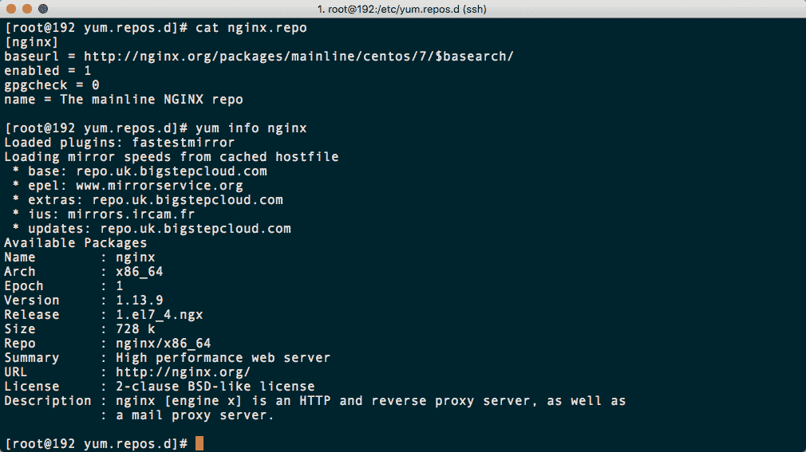
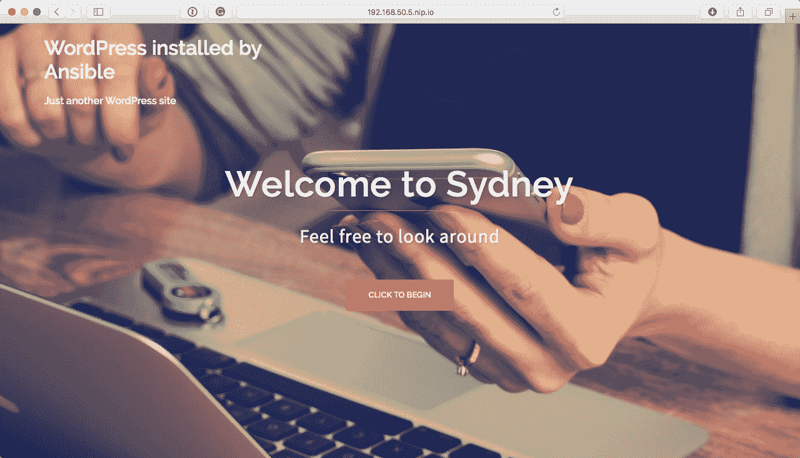
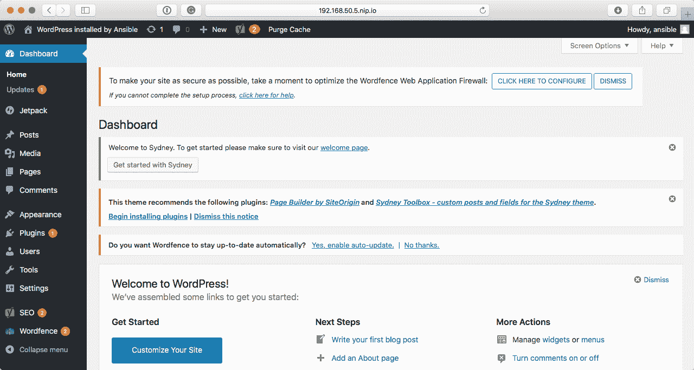

# 部署 WordPress

在上一章中，我们致力于构建一个安装和配置基本 LAMP 堆栈的 playbook。在本章中，我们将在那里使用的技术基础上构建一个安装 LEMP 堆栈和 WordPress 的 playbook。

我们将涵盖以下主题：

+   准备我们的初始 playbook

+   下载并安装 WordPress CLI

+   安装和配置 WordPress

+   登录到您的 WordPress 安装

在开始之前，我们应该快速了解一下 WordPress 是什么。很可能在过去的 48 小时内，您已经访问过由 WordPress 提供支持的网站。它是一个由 PHP 和 MySQL 提供支持的开源**内容管理系统**（**CMS**），根据 BuiltWith 提供的 CMS 使用统计数据，它被约 19,545,516 个网站使用。

# 技术要求

在前几章中启动的 CentOS 7 Vagrant box 的新副本将被使用。这意味着软件包需要重新下载，以及 WordPress。您可以在[`github.com/PacktPublishing/Learn-Ansible/tree/master/Chapter05/lemp`](https://github.com/PacktPublishing/Learn-Ansible/tree/master/Chapter05/lemp)找到 playbook 的完整副本。

# 预安装任务

如前一章所述，LEMP 堆栈由以下元素组成：

+   **Linux**：在我们的情况下，这将再次是 CentOS 7

+   **NGINX**：如果您记得，它的发音是*engine-x*，并且在我们的堆栈中替代了 Apache

+   **MariaDB**：正如我们所看到的，这将是数据库组件

+   **PHP**：我们将再次使用 PHP 7.2

在安装 WordPress 之前，我们需要安装和配置这些组件。此外，由于这个 playbook 最终将被执行在公开可用的云服务器上，我们需要考虑一些关于 NGINX 配置的最佳实践。

让我们从设置 playbook 的初始结构开始：

```
$ mkdir lemp lemp/group_vars
$ touch lemp/group_vars/common.yml lemp/production lemp/site.yml lemp/Vagrantfile lemp/.gitignore
$ cd lemp
```

既然我们有了基本布局，我们需要在`Vagrantfile`和`.gitignore`文件中放一些内容。`Vagrantfile`包含以下内容，与前几章类似：

```
# -*- mode: ruby -*-
# vi: set ft=ruby :

API_VERSION = "2"
BOX_NAME    = "centos/7"
BOX_IP      = "192.168.50.5"
DOMAIN      = "nip.io"
PRIVATE_KEY = "~/.ssh/id_rsa"
PUBLIC_KEY  = '~/.ssh/id_rsa.pub'

Vagrant.configure(API_VERSION) do |config|
  config.vm.box = BOX_NAME
  config.vm.network "private_network", ip: BOX_IP
  config.vm.host_name = BOX_IP + '.' + DOMAIN
  config.ssh.insert_key = false
  config.ssh.private_key_path = [PRIVATE_KEY,
  "~/.vagrant.d/insecure_private_key"]
  config.vm.provision "file", source: PUBLIC_KEY, destination:
  "~/.ssh/authorized_keys"

  config.vm.provider "virtualbox" do |v|
    v.memory = "2024"
    v.cpus = "2"
  end

  config.vm.provider "vmware_fusion" do |v|
    v.vmx["memsize"] = "2024"
    v.vmx["numvcpus"] = "2"
  end

end
```

正如您可能已经注意到的那样，我们为这个 Vagrant box 使用了不同的 IP 地址；`.gitignore`文件应该包含一行：

```
.vagrant
```

现在我们已经配置好了基本内容，我们可以开始编写 playbook 来部署和配置我们的初始软件堆栈。

# stack-install 命令

我们将从使用`ansible-galaxy init`创建一个名为`stack-install`的角色开始：

```
$ ansible-galaxy init roles/stack-install
```

这将安装我们的初始软件堆栈。安装完成后，我们将交给第二个角色，然后配置软件堆栈，然后第三个角色开始安装 WordPress。

那么我们需要哪些软件包呢？WordPress 有以下要求：

+   PHP 7.2 或更高版本

+   MariaDB 10.0 或更高版本，或者 MySQL 5.6 或更高版本

+   带有`mod_rewrite`模块的 NGINX 或 Apache

+   HTTPS 支持

我们知道从上一章，IUS 仓库可以提供 PHP 7.2 和 MariaDB 10.1，所以我们将使用它作为这些软件包的来源，但 NGINX 呢？EPEL 仓库中有 NGINX 软件包。但是，我们将使用主要的 NGINX 仓库，以便获取最新和最好的版本。

# 启用仓库

让我们通过启用我们安装软件堆栈所需的三个仓库来开始我们的 playbook，然后，一旦这些仓库被启用，我们应该执行`yum update`来确保基本操作系统是最新的。

`roles/stack-install/defaults/main.yml`文件需要以下内容才能实现这一点。首先，我们有启用 EPEL 和 IUS 的 RPM 软件包的位置：

```
repo_packages:
  - "epel-release"
  - "https://centos7.iuscommunity.org/ius-release.rpm"
```

之后，我们有以下嵌套变量，其中包含我们使用`yum_repository`模块创建 NGINX 仓库的`.repo`文件所需的所有信息：

```
nginx_repo:
  name: "nginx"
  description: "The mainline NGINX repo"
  baseurl: "http://nginx.org/packages/mainline/centos/7/$basearch/"
  gpgcheck: "no"
  enabled: "yes"
```

现在我们已经有了默认设置，我们可以将任务添加到`roles/stack-install/tasks/main.yml`文件中；具体如下，第一个任务已经很熟悉，因为它只是安装我们的两个软件包：

```
- name: install the repo packages
  yum:
    name: "{{ item }}"
    state: "installed"
  with_items: "{{ repo_packages }}"
```

接下来的任务是在`/etc/yum.repos.d/`中创建一个名为`nginx.repo`的存储库文件：

```
- name: add the NGINX mainline repo
  yum_repository:
    name: "{{ nginx_repo.name }}"
    description: "{{ nginx_repo.description }}"
    baseurl: "{{ nginx_repo.baseurl }}"
    gpgcheck: "{{ nginx_repo.gpgcheck }}"
    enabled: "{{ nginx_repo.enabled }}"
```

从以下终端输出可以看出，文件的内容指向了 NGINX 存储库，我们可以通过运行以下命令获取有关 NGINX 软件包的更多信息：

```
$ yum info nginx
```

以下截图显示了前面命令的输出：



下面的任务也应该看起来很熟悉，因为我们在上一章中使用它来更新已安装的软件包：

```
- name: update all of the installed packages
  yum:
    name: "*"
    state: "latest"
    update_cache: "yes"
```

现在我们已经设置好了源存储库并更新了已安装的软件包，我们可以继续进行其余的软件包安装。

# 安装软件包

我们将创建四个软件包列表；这些在`roles/stack-install/defaults/main.yml`文件中。与上一章一样，我们首先需要卸载预安装的 MariaDB 软件包，因此我们的第一个列表包括要删除的软件包：

```
packages_remove:
  - "mariadb-libs.x86_64"
```

接下来，我们需要安装一些软件包，以允许 Ansible 与诸如 SELinux 和 MariaDB 之类的服务进行交互，以及安装 Postfix 软件包，我们知道上次已经删除了：

```
system_packages:
  - "postfix"
  - "MySQL-python"
  - "policycoreutils-python"
```

然后，我们有组成核心软件堆栈的所有软件包：

```
stack_packages:
  - "nginx"
  - "mariadb101u"
  - "mariadb101u-server"
  - "mariadb101u-config"
  - "mariadb101u-common"
  - "mariadb101u-libs"
  - "php72u"
  - "php72u-bcmath"
  - "php72u-cli"
  - "php72u-common"
  - "php72u-dba"
  - "php72u-fpm"
  - "php72u-fpm-nginx"
  - "php72u-gd"
  - "php72u-intl"
  - "php72u-json"
  - "php72u-mbstring"
  - "php72u-mysqlnd"
  - "php72u-process"
  - "php72u-snmp"
  - "php72u-soap"
  - "php72u-xml"
  - "php72u-xmlrpc"
```

最后，我们还有一些不错的功能：

```
extra_packages:
  - "vim-enhanced"
  - "git"
  - "unzip"
```

删除软件包然后安装它们的任务应该放在`roles/stack-install/tasks/main.yml`文件中，从删除软件包的任务开始：

```
- name: remove the packages so that they can be replaced
  yum:
    name: "{{ item }}"
    state: "absent"
  with_items: "{{ packages_remove }}"
```

然后，我们可以使用以下任务一次性安装所有软件包：

```
- name: install the stack packages
  yum:
    name: "{{ item }}"
    state: "installed"
  with_items: "{{ system_packages + stack_packages + extra_packages }}"
```

请注意，我们正在将剩下的三个软件包列表合并为一个变量。我们这样做是为了尽量减少重复使用`yum`任务。这也允许我们在剧本的其他地方覆盖，比如只覆盖`extra_packages`，而不必重复整个堆栈其他部分所需的软件包列表。

# stack-config 角色

接下来的角色将配置我们刚刚安装的软件堆栈，所以让我们创建这个角色：

```
$ ansible-galaxy init roles/stack-config
```

现在我们已经有了角色所需的文件，我们可以开始计划需要配置的内容。我们需要做以下事情：

+   为我们的 WordPress 创建一个用户

+   按照 WordPress Codex 上的最佳实践配置 NGINX

+   将 PHP-FPM 配置为以 WordPress 用户身份运行

+   为 SELinux 进行初始配置

让我们从创建 WordPress 用户开始。

# WordPress 系统用户

WordPress 系统用户的默认设置，应该放在`roles/stack-config/defaults/main.yml`中，如下所示：

```
wordpress_system:
  user: "wordpress"
  group: "php-fpm"
  comment: "wordpress system user"
  home: "/var/www/wordpress"
  state: "present"
```

我们将这称为系统用户，因为我们将在本章后面创建一个 WordPress 用户。这个用户的详细信息也将在 Ansible 中定义，所以我们不想混淆两个不同的用户。

使用这些变量的任务应该在`roles/stack-config/tasks/main.yml`中，看起来像这样：

```
- name: add the wordpress user
  user: 
    name: "{{ wordpress_system.user }}"
    group: "{{ wordpress_system.group }}"
    comment: "{{ wordpress_system.comment }}"
    home: "{{ wordpress_system.home }}"
    state: "{{ wordpress_system.state }}"
```

如你所见，这次我们没有向用户添加密钥，因为我们不想登录到用户帐户来开始操作文件和其他操作。这应该全部在 WordPress 内部完成，或者通过使用 Ansible 完成。

# NGINX 配置

我们将使用几个模板文件来配置我们的 NGINX。第一个模板名为`roles/stack-config/templates/nginx-nginx.conf.j2`，它将替换软件包安装部署的主要 NGINX 配置：

```
# {{ ansible_managed }}
user nginx;
worker_processes {{ ansible_processor_count }};
error_log /var/log/nginx/error.log warn;
pid /var/run/nginx.pid;

events {
    worker_connections 1024;
}

http {
    include /etc/nginx/mime.types;
    default_type application/octet-stream;
    log_format main '$remote_addr - $remote_user [$time_local] "$request" '
                      '$status $body_bytes_sent "$http_referer" '
                      '"$http_user_agent" "$http_x_forwarded_for"';
    access_log /var/log/nginx/access.log main;
    sendfile on;
    keepalive_timeout 65;
    client_max_body_size 20m;
    include /etc/nginx/conf.d/*.conf;
}
```

文件本身的内容基本上与初始文件相同，只是我们正在更新`worker_processes`，以便它使用 Ansible 运行`setup`模块时检测到的处理器数量，而不是硬编码的值。

部署配置文件的任务就像你期望的那样，应该放在`roles/stack-config/tasks/main.yml`中：

```
- name: copy the nginx.conf to /etc/nginx/
  template:
    src: "nginx-nginx.conf.j2"
    dest: "/etc/nginx/nginx.conf"
  notify: "restart nginx"
```

如您所见，我们正在通知`restart nginx`处理程序，它存储在以下`roles/stack-config/handlers/main.yml`文件中：

```
- name: "restart nginx"
  service:
    name: "nginx"
    state: "restarted"
    enabled: "yes"
```

接下来，我们有默认站点模板，`roles/stack-config/templates/nginx-confd-default.conf.j2`：

```
# {{ ansible_managed }}

upstream {{ php.upstream }} {
        server {{ php.ip }}:{{ php.port }};
}

server {
    listen 80;
  server_name {{ ansible_nodename }};
  root {{ wordpress_system.home }};
  index index.php index.html index.htm;

    include global/restrictions.conf;
    include global/wordpress_shared.conf;

}
```

为了帮助识别模板文件将放置在目标主机上的位置，我将它们命名，以便文件名中包含完整路径。在这种情况下，文件名是`nginx-confd-default.conf.j2`，它将部署到`/etc/nginx/conf.d/..`。

我们要部署的下两个模板将进入一个不存在的文件夹。因此，我们首先需要创建目标文件夹。为此，我们需要将以下内容添加到`roles/stack-config/tasks/main.yml`中：

```
- name: create the global directory in /etc/nginx/
  file:
    dest: "/etc/nginx/global/"
    state: "directory"
    mode: "0644"
```

然后，以下命令将文件复制到`global`文件夹中：

```
- name: copy the restrictions.conf to /etc/nginx/global/
  copy:
    src: "nginx-global-restrictions.conf"
    dest: "/etc/nginx/global/restrictions.conf"
  notify: "restart nginx"

- name: copy the wordpress_shared.conf to /etc/nginx/global/
  template:
    src: "nginx-global-wordpress_shared.conf.j2"
    dest: "/etc/nginx/global/wordpress_shared.conf"
  notify: "restart nginx"
```

由于我们在`nginx-global-restrictions.conf`文件中没有进行任何替换，所以我们在这里使用`copy`模块而不是`template`；文件存储在`roles/stack-config/files/`中，内容如下：

```
   # Do not log robots.txt
        location = /robots.txt {
            log_not_found off;
            access_log off;
        }

    # If no favicon exists return a 204 (no content error)
        location ~* /favicon\.ico$ {
            try_files $uri =204;
            expires max;
            log_not_found off;
            access_log off;
        }

  # Deny access to htaccess files
        location ~ /\. {
            deny all;
        }

  # Deny access to some bits wordpress leaves hanging around 
        location ~* /(wp-config.php|readme.html|license.txt|nginx.conf) {
            deny all;
        }

    # Deny access to .php files in the /wp-content/ directory (including sub-folders)
        location ~* ^/wp-content/.*.(php|phps)$ {
            deny all;
        }

    # Allow only internal access to .php files inside wp-includes directory
        location ~* ^/wp-includes/.*\.(php|phps)$ {
            internal;
        }

    # Deny access to specific files in the /wp-content/ directory (including sub-folders)
        location ~* ^/wp-content/.*.(txt|md|exe)$ {
            deny all;
        }

    # hide content of sensitive files
        location ~* \\.(conf|engine|inc|info|install|make|module|profile|test|po|sh|.*sql|theme|tpl(\\.php)?|xtmpl)\$|^(\\..*|Entries.*|Repository|Root|Tag|Template)\$|\\.php_ {
            deny all;
        }

    # don't allow other executable file types
        location ~* \\.(pl|cgi|py|sh|lua)\$ {
            deny all;
        }

    # hide the wordfence firewall
        location ~ ^/\.user\.ini {
            deny all;
        }
```

由于我们将`php.upstream`设置为变量，我们使用`template`模块来确保我们的配置包含正确的值，文件`roles/stack-config/templates/nginx-global-wordpress_shared.conf.j2`包含以下内容：

```
    # http://wiki.nginx.org/WordPress
    # This is cool because no php is touched for static content. 
    # Include the "?$args" part so non-default permalinks doesn't break when using query string
        location / {
            try_files $uri $uri/ /index.php?$args;
        }

        # Set the X-Frame-Options
        add_header X-Frame-Options "SAMEORIGIN" always;
        add_header X-Xss-Protection "1; mode=block" always;
        add_header X-Content-Type-Options "nosniff" always;

    # Do not log + cache images, css, js, etc
        location ~* \.(ico|css|js|gif|jpeg|jpg|png|woff|ttf|otf|svg|woff2|eot)$ {
            expires max;
            log_not_found off;
            access_log off;
         # Send the all shebang in one fell swoop
            tcp_nodelay off;
        # Set the OS file cache
            open_file_cache max=1000 inactive=120s;
            open_file_cache_valid 45s;
            open_file_cache_min_uses 2;
            open_file_cache_errors off;
        }

    # Handle .php files
        location ~ \.php$ {
            try_files $uri =404;
            fastcgi_split_path_info ^(.+\.php)(/.+)$;
            include /etc/nginx/fastcgi_params;
            fastcgi_connect_timeout 180s;
            fastcgi_send_timeout 180s;
            fastcgi_read_timeout 180s;
            fastcgi_intercept_errors on;
            fastcgi_max_temp_file_size 0;
            fastcgi_pass {{ php.upstream }};
            fastcgi_param SCRIPT_FILENAME $document_root$fastcgi_script_name;
            fastcgi_index index.php;
        }

    # Rewrite rules for WordPress SEO by Yoast
        rewrite ^/sitemap_index\.xml$ /index.php?sitemap=1 last;
        rewrite ^/([^/]+?)-sitemap([0-9]+)?\.xml$ /index.php?sitemap=$1&sitemap_n=$2 last;

    # Add trailing slash to */wp-admin requests
        rewrite /wp-admin$ $scheme://$host$uri/ permanent;
```

NGINX 配置的最后一部分是复制 WordPress 站点的主配置。`roles/stack-config/tasks/main.yml`中的任务如下所示：

```
- name: copy the default.conf to /etc/nginx/conf.d/
  template:
    src: "nginx-confd-default.conf.j2"
    dest: "/etc/nginx/conf.d/default.conf"
  notify: "restart nginx"
```

由于我们设置了一些变量，比如路径和域名，我们有以下模板文件：

```
# {{ ansible_managed }}

upstream php {
        server {{ php.ip }}:{{ php.port }};
}

server {
    listen 80;
  server_name {{ ansible_nodename }};
  root {{ wordpress_system.home }};
  index index.php;
  include global/restrictions.conf;
  include global/wordpress_shared.conf;
}
```

如您所见，我们正在使用一些尚未定义的变量，`php.ip`和`php.port`。我们将在接下来看如何配置 PHP-FPM。

# PHP 和 PHP-FPM 配置

正如我们在上一节中看到的，`roles/stack-config/defaults/main.yml`中为 PHP 定义了一些变量，它们是：

```
php:
  ip: "127.0.0.1"
  port: "9000"
  upstream: "php"
  ini:
    - { regexp: '^;date.timezone =', replace: 'date.timezone = Europe/London' }
    - { regexp: '^expose_php = On', replace: 'expose_php = Off' }
    - { regexp: '^upload_max_filesize = 2M', replace: 'upload_max_filesize = 20M' }
```

第一个配置任务是部署 PHP-FPM 配置；模板如下所示：

```
; {{ ansible_managed }}

[{{ wordpress_system.user }}]
user = {{ wordpress_system.user }}
group = {{ wordpress_system.group }}
listen = {{ php.ip }}:{{ php.port }}
listen.allowed_clients = {{ php.ip }}
pm = dynamic
pm.max_children = 50
pm.start_servers = 5
pm.min_spare_servers = 5
pm.max_spare_servers = 35
php_admin_value[error_log] = /var/log/php-fpm/{{ wordpress_system.user }}-error.log
php_admin_flag[log_errors] = on
php_value[session.save_handler] = files
php_value[session.save_path] = /var/lib/php/fpm/session
php_value[soap.wsdl_cache_dir] = /var/lib/php/fpm/wsdlcache
```

如您所见，我们在这个文件中进行了一些替换。从方括号之间开始，我们定义了 PHP-FPM 池名称；我们使用`wordpress_system.user`的内容。接下来，我们有我们希望池运行的用户和组；在这里，我们使用`wordpress_system.user`和`wordpress_system.group`。最后，我们通过使用`php.ip`和`php.port`变量来设置我们希望 PHP-FPM 池监听的 IP 地址和端口。

部署模板的`roles/stack-config/tasks/main.yml`任务如下所示：

```
- name: copy the www.conf to /etc/php-fpm.d/
  template:
    src: "php-fpmd-www.conf.j2"
    dest: "/etc/php-fpm.d/www.conf"
  notify: "restart php-fpm"
```

在**`roles/stack-config/handlers/main.yml`**中重新启动 PHP-FPM 的处理程序只是：

```
- name: "restart php-fpm"
  service:
    name: "php-fpm"
    state: "restarted"
    enabled: "yes"
```

`roles/stack-config/tasks/main.yml`中的下一个任务使用`lineinfile`模块：

```
- name: configure php.ini
  lineinfile: 
    dest: "/etc/php.ini"
    regexp: "{{ item.regexp }}"
    line: "{{ item.replace }}"
    backup: "yes"
    backrefs: "yes"
  with_items: "{{ php.ini }}"
  notify: "restart php-fpm"
```

我们在这里做的是获取`php.ini`的内容，并通过查找`regexp`键来循环遍历它。一旦找到值，我们就用`replace`键的内容替换它。如果文件有更改，我们首先进行`backup`，以防万一。此外，我们使用`backrefs`来确保如果文件中没有匹配的正则表达式，它将保持不变；如果我们不使用它们，那么每次运行 playbook 时都会调用`restart php-fpm`处理程序，而我们不希望在没有理由的情况下重新启动 PHP-FPM。

# 启动 NGINX 和 PHP-FPM

现在我们已经安装和配置了我们的堆栈，我们需要启动两个服务，而不是等到 playbook 运行结束。如果现在不这样做，我们即将安装 WordPress 的角色将失败。`roles/stack-config/tasks/main.yml`中的两个任务是：

```
- name: start php-fpm
  service:
    name: "php-fpm"
    state: "started"

- name: start nginx
  service:
    name: "nginx"
    state: "started"
```

# MariaDB 配置

MariaDB 配置将与上一章的配置非常相似，减去一些步骤，所以我不打算详细介绍。

该角色在`roles/stack-config/defaults/main.yml`中的默认变量为：

```
mariadb:
  bind: "127.0.0.1"
  server_config: "/etc/my.cnf.d/mariadb-server.cnf"
  username: "root"
  password: "Pa55W0rd123"
  hosts:
    - "127.0.0.1"
    - "::1"
    - "{{ ansible_nodename }}"
    - "localhost"
```

正如你所看到的，我们现在正在使用嵌套变量，并且已经在`roles/stack-config/tasks/main.yml`的任务的第一部分中删除了主机通配符`%`的根访问权限，将 MariaDB 绑定到本地主机：

```
- name: configure the mariadb bind address
  lineinfile: 
    dest: "{{ mariadb.server_config }}"
    regexp: "#bind-address=0.0.0.0"
    line: "bind-address={{ mariadb.bind }}"
    backup: "yes"
    backrefs: "yes"
```

从那里，我们开始 MariaDB，设置根密码，配置`~/.my.cnf`文件，然后删除匿名用户和测试数据库：

```
- name: start mariadb
  service:
    name: "mariadb"
    state: "started"
    enabled: "yes"

- name: change mysql root password
  mysql_user:
    name: "{{ mariadb.username }}" 
    host: "{{ item }}" 
    password: "{{ mariadb.password }}"
    check_implicit_admin: "yes"
    priv: "*.*:ALL,GRANT"
  with_items: "{{ mariadb.hosts }}"

- name: set up .my.cnf file
  template:
    src: "my.cnf.j2"
    dest: "~/.my.cnf"

- name: delete anonymous MySQL user
  mysql_user:
    user: ""
    host: "{{ item }}"
    state: "absent"
  with_items: "{{ mariadb.hosts }}"

- name: remove the MySQL test database
  mysql_db:
    db: "test" 
    state: "absent"
```

`.my.cnf`文件的模板，可以在`roles/stack-config/templates/my.cnf.j2`中找到，现在如下所示：

```
# {{ ansible_managed }}
[client]
password='{{ mariadb.password }}'
```

这意味着我们将不需要在每个与数据库相关的任务中传递根用户名和密码，从我们复制`.my.cnf`文件的地方开始。

# SELinux 配置

角色的最后一个任务是将 SELinux 中的 HTTP 设置为宽松模式；为了做到这一点，我们在`roles/stack-config/defaults/main.yml`中有以下变量：

```
selinux:
  http_permissive: true
```

`roles/stack-config/tasks/main.yml`中的任务有一个条件，如果`selinux.http_permissive`等于`true`，则运行：

```
- name: set the selinux allowing httpd_t to be permissive is required
  selinux_permissive:
    name: httpd_t
    permissive: true
  when: selinux.http_permissive == true
```

我们将在后面的章节更多地关注 SELinux；目前，我们只允许所有的 HTTP 请求。

# WordPress 安装任务

现在我们已经完成了准备目标 Vagrant 盒子的角色，我们可以继续进行实际的 WordPress 安装；这将分为几个不同的部分，首先是下载`wp_cli`和设置数据库。

在我们继续之前，我们应该创建角色：

```
$ ansible-galaxy init roles/wordpress
```

# WordPress CLI 安装

**WordPress CLI**（**WP-CLI**）是一个用于管理 WordPress 安装的命令行工具；我们将在整个角色中使用它，所以我们角色应该首先下载它。为了做到这一点，我们需要在`roles/wordpress/defaults/main.yml`中下载以下变量：

```
wp_cli:
  download: "https://raw.githubusercontent.com/wp-cli/builds/gh-pages/phar/wp-cli.phar"
  path: "/usr/local/bin/wp"
```

正如你可能从这两个变量中了解到的，我们将从`wp_cli.download`下载文件，并将其复制到`wp_cli.path`。在`roles/wordpress/tasks/main.yml`中执行此操作的任务如下：

```
- name: download wp-cli
  get_url:
    url: "{{ wp_cli.download }}"
    dest: "{{ wp_cli.path }}"

- name: update permissions of wp-cli to allow anyone to execute it
  file:
    path: "{{ wp_cli.path }}"
    mode: "0755"
```

正如你所看到的，我们正在下载`.phar`文件，移动它，然后设置权限，以便任何登录到服务器的人都可以执行它——这很重要，因为我们将以`wordpress`用户的身份运行许多安装命令。

# 创建 WordPress 数据库

角色的下一部分是创建我们的 WordPress 安装将使用的数据库；与本章其他任务一样，它使用了一个可以在`roles/wordpress/defaults/main.yml`中找到的嵌套变量：

```
wp_database:
  name: "wordpress"
  username: "wordpress"
  password: "W04DPr3S5"
```

在`roles/wordpress/tasks/main.yml`中创建数据库和用户的任务如下：

```
- name: create the wordpress database
  mysql_db:
    db: "{{ wp_database.name }}" 
    state: "present"

- name: create the user for the wordpress database
  mysql_user:
    name: "{{ wp_database.username }}"
    password: "{{ wp_database.password }}"
    priv: "{{ wp_database.name }}.*:ALL"
    state: "present"
  with_items: "{{ mariadb.hosts }}"
```

请注意我们正在使用前一个角色中的`mariadb.hosts`变量。现在我们已经创建了数据库，我们可以开始下载和安装 WordPress 了。

# 下载、配置和安装 WordPress

现在我们已经准备好安装 WordPress，我们可以开始了，首先在`roles/wordpress/defaults/main.yml`中设置一些默认变量：

```
wordpress:
  domain: "http://{{ ansible_nodename }}/"
  title: "WordPress installed by Ansible"
  username: "ansible"
  password: "password"
  email: "test@example.com"
  theme: "sydney"
  plugins:
    - "jetpack"
    - "wp-super-cache"
    - "wordpress-seo"
    - "wordfence"
    - "nginx-helper"
```

现在我们有了变量，如果需要，我们可以开始下载：

```
- name: are the wordpress files already there?
  stat:
    path: "{{ wordpress_system.home }}/index.php"
  register: wp_installed

- name: download wordpresss
  shell: "{{ wp_cli.path }} core download"
  args:
    chdir: "{{ wordpress_system.home }}"
  become_user: "{{ wordpress_system.user }}"
  become: true
  when: wp_installed.stat.exists == False
```

正如你所看到的，第一个任务使用`stat`模块来检查系统用户的主目录（也是 webroot）中是否存在`index.php`。第二个任务使用`shell`模块来执行`wp core download`命令。

在继续下一个任务之前，我们应该处理一些参数。这些是：

+   `args`和`chdir`：您可以使用`args`向`shell`模块传递额外的参数。在这里，我们传递`chdir`，它指示 Ansible 在运行我们提供的`shell`命令之前切换到我们指定的目录。

+   `become_user`：我们希望以哪个用户的身份运行命令。如果我们不使用这个，命令将以 root 用户的身份运行。

+   `become`：这指示 Ansible 以定义的用户身份执行任务。

剧本中的下一个任务设置了用户主目录的正确权限：

```
- name: set the correct permissions on the homedir
  file:
    path: "{{ wordpress_system.home }}"
    mode: "0755"
  when: wp_installed.stat.exists == False
```

现在 WordPress 已经下载，我们可以开始安装。首先，我们需要检查是否已经完成了这一步：

```
- name: is wordpress already configured?
  stat:
    path: "{{ wordpress_system.home }}/wp-config.php"
  register: wp_configured
```

如果没有`wp-config.php`文件，那么将执行以下任务：

```
- name: configure wordpress
  shell: "{{ wp_cli.path }} core config --dbhost={{ mariadb.bind }} --dbname={{ wp_database.name }} --dbuser={{ wp_database.username }} --dbpass={{ wp_database.password }}"
  args:
    chdir: "{{ wordpress_system.home }}"
  become_user: "{{ wordpress_system.user }}"
  become: true
  when: wp_configured.stat.exists == False
```

现在我们已经创建了`wp-config.php`文件，并且数据库凭据已经就位，我们可以安装 WordPress 了。首先，我们需要检查 WordPress 是否已经安装：

```
- name: do we need to install wordpress?
  shell: "{{ wp_cli.path }} core is-installed"
  args:
    chdir: "{{ wordpress_system.home }}"
  become_user: "{{ wordpress_system.user }}"
  become: true
  ignore_errors: yes
  register: wp_installed
```

正如你从`ignore_errors`选项的存在可以看出，如果 WordPress 未安装，这个命令将给我们一个错误。然后我们利用这一点来注册结果，正如你从下面的任务中可以看到的：

```
- name: install wordpress if needed
  shell: "{{ wp_cli.path }} core install --url='{{ wordpress.domain }}' --title='{{ wordpress.title }}' --admin_user={{ wordpress.username }} --admin_password={{ wordpress.password }} --admin_email={{ wordpress.email }}"
  args:
    chdir: "{{ wordpress_system.home }}"
  become_user: "{{ wordpress_system.user }}"
  become: true
  when: wp_installed.rc == 1
```

现在我们已经安装了一个基本的 WordPress 网站，我们可以继续安装插件和主题文件。

# WordPress 插件和主题安装

我们 WordPress 安装的最后一部分是下载和安装我们在`wordpress.plugins`和`wordpress.theme`变量中定义的插件和主题文件。

让我们从安装插件的任务开始，这样我们就不会重新运行安装插件的任务。当需要时，我们将在任务中构建一些逻辑。首先，我们运行一个任务来查看所有插件是否已经安装：

```
- name: do we need to install the plugins?
  shell: "{{ wp_cli.path }} plugin is-installed {{ item }}"
  args:
    chdir: "{{ wordpress_system.home }}"
  become_user: "{{ wordpress_system.user }}"
  become: true
  with_items: "{{ wordpress.plugins }}"
  ignore_errors: yes
  register: wp_plugin_installed
```

如果插件未安装，则此任务应该失败，这就是为什么我们在其中使用`ignore_errors`的原因。正如你所看到的，我们正在注册整个任务的结果，因为如果你记得，我们正在安装几个插件，作为`wp_plugin_installed`。接下来的两个任务获取`wp_plugin_installed`的结果，并使用`setfact`模块设置一个事实：

```
- name: set a fact if we don't need to install the plugins
  set_fact:
    wp_plugin_installed_skip: true
  when: wp_plugin_installed.failed is undefined

- name: set a fact if we need to install the plugins
  set_fact:
    wp_plugin_installed_skip: false
  when: wp_plugin_installed.failed is defined
```

正如你所看到的，我们将`wp_theme_installed_skip`设置为`true`或`false`：如果事实设置为`false`，那么接下来的任务将循环安装插件：

```
- name: install the plugins if we need to or ignore if not
  shell: "{{ wp_cli.path }} plugin install {{ item }} --activate"
  args:
    chdir: "{{ wordpress_system.home }}"
  become_user: "{{ wordpress_system.user }}"
  become: true
  with_items: "{{ wordpress.plugins }}"
  when: wp_plugin_installed_skip == false
```

如果我们将另一个插件添加到列表中，但保留其他插件不变，它将显示一个错误，导致插件被安装。我们将使用相同的逻辑来判断我们是否需要安装我们定义为`wordpress.theme`的主题文件：

```
- name: do we need to install the theme?
  shell: "{{ wp_cli.path }} theme is-installed {{ wordpress.theme }}"
  args:
    chdir: "{{ wordpress_system.home }}"
  become_user: "{{ wordpress_system.user }}"
  become: true
  ignore_errors: yes
  register: wp_theme_installed

- name: set a fact if we don't need to install the theme
  set_fact:
    wp_theme_installed_skip: true
  when: wp_theme_installed.failed == false

- name: set a fact if we need to install the theme
  set_fact:
    wp_theme_installed_skip: false
  when: wp_theme_installed.failed == true

- name: install the theme if we need to or ignore if not
  shell: "{{ wp_cli.path }} theme install {{ wordpress.theme }} --activate"
  args:
    chdir: "{{ wordpress_system.home }}"
  become_user: "{{ wordpress_system.user }}"
  become: true
  when: wp_theme_installed_skip == false
```

现在我们已经安装了插件和主题，可以尝试运行我们的 playbook 了。

# 运行 WordPress playbook

要运行 playbook 并安装 WordPress，我们需要一些东西，首先是名为`production`的清单文件：

```
box1 ansible_host=192.168.50.5.nip.io

[wordpress]
box1

[wordpress:vars]
ansible_connection=ssh
ansible_user=vagrant
ansible_private_key_file=~/.ssh/id_rsa
host_key_checking=False
```

正如你所看到的，它考虑了我们在本章开头定义的 Vagrant box 的更新后 IP 地址。另外，我们需要 playbook 本身；`site.yml`应该如下所示：

```
---

- hosts: wordpress
  gather_facts: true
  become: yes
  become_method: sudo

  vars_files:
    - group_vars/common.yml

  roles:
    - roles/stack-install
    - roles/stack-config
    - roles/wordpress
```

现在，通过运行以下两个命令之一来启动 Vagrant box：

```
$ vagrant up
$ vagrant up --provider=vmware_fusion
```

一旦你的 Vagrant box 启动并运行，我们可以使用以下命令开始 playbook 运行：

```
$ ansible-playbook -i production site.yml
```

当首次执行 playbook 时，你应该看到类似以下结果的内容：

```
PLAY [wordpress] ***********************************************************************************

TASK [Gathering Facts] *****************************************************************************
ok: [box1]

TASK [roles/stack-install : install the repo packages] *********************************************
changed: [box1] => (item=[u'epel-release', u'https://centos7.iuscommunity.org/ius-release.rpm'])

TASK [roles/stack-install : add the NGINX mainline repo] *******************************************
changed: [box1]

TASK [roles/stack-install : update all of the installed packages] **********************************
changed: [box1]

TASK [roles/stack-install : remove the packages so that they can be replaced] **********************
changed: [box1] => (item=[u'mariadb-libs.x86_64'])

TASK [roles/stack-install : install the stack packages] ********************************************
changed: [box1] => (item=[u'postfix', u'MySQL-python', u'policycoreutils-python', u'nginx', u'mariadb101u', u'mariadb101u-server', u'mariadb101u-config', u'mariadb101u-common', u'mariadb101u-libs', u'php72u', u'php72u-bcmath', u'php72u-cli', u'php72u-common', u'php72u-dba', u'php72u-fpm', u'php72u-fpm-nginx', u'php72u-gd', u'php72u-intl', u'php72u-json', u'php72u-mbstring', u'php72u-mysqlnd', u'php72u-process', u'php72u-snmp', u'php72u-soap', u'php72u-xml', u'php72u-xmlrpc', u'vim-enhanced', u'git', u'unzip'])

TASK [roles/stack-config : add the wordpress user] *************************************************
changed: [box1]

TASK [roles/stack-config : copy the nginx.conf to /etc/nginx/] *************************************
changed: [box1]

TASK [roles/stack-config : create the global directory in /etc/nginx/] *****************************
changed: [box1]

TASK [roles/stack-config : copy the restrictions.conf to /etc/nginx/global/] ***********************
changed: [box1]

TASK [roles/stack-config : copy the wordpress_shared.conf to /etc/nginx/global/] *******************
changed: [box1]

TASK [roles/stack-config : copy the default.conf to /etc/nginx/conf.d/] ****************************
changed: [box1]

TASK [roles/stack-config : copy the www.conf to /etc/php-fpm.d/] ***********************************
changed: [box1]

TASK [roles/stack-config : configure php.ini] ******************************************************
changed: [box1] => (item={u'regexp': u'^;date.timezone =', u'replace': u'date.timezone = Europe/London'})
changed: [box1] => (item={u'regexp': u'^expose_php = On', u'replace': u'expose_php = Off'})
changed: [box1] => (item={u'regexp': u'^upload_max_filesize = 2M', u'replace': u'upload_max_filesize = 20M'})

TASK [roles/stack-config : start php-fpm] **********************************************************
changed: [box1]

TASK [roles/stack-config : start nginx] ************************************************************
changed: [box1]

TASK [roles/stack-config : configure the mariadb bind address] *************************************
changed: [box1]

TASK [roles/stack-config : start mariadb] **********************************************************
changed: [box1]

TASK [roles/stack-config : change mysql root password] *********************************************
changed: [box1] => (item=127.0.0.1)
changed: [box1] => (item=::1)
changed: [box1] => (item=192.168.50.5.nip.io)
changed: [box1] => (item=localhost)

TASK [roles/stack-config : set up .my.cnf file] ****************************************************
changed: [box1]

TASK [roles/stack-config : delete anonymous MySQL user] ********************************************
ok: [box1] => (item=127.0.0.1)
ok: [box1] => (item=::1)
changed: [box1] => (item=192.168.50.5.nip.io)
changed: [box1] => (item=localhost)

TASK [roles/stack-config : remove the MySQL test database] *****************************************
changed: [box1]

TASK [roles/stack-config : set the selinux allowing httpd_t to be permissive is required] **********
changed: [box1]

TASK [roles/wordpress : download wp-cli] ***********************************************************
changed: [box1]

TASK [roles/wordpress : update permissions of wp-cli to allow anyone to execute it] ****************
changed: [box1]

TASK [roles/wordpress : create the wordpress database] *********************************************
changed: [box1]

TASK [roles/wordpress : create the user for the wordpress database] ********************************
changed: [box1] => (item=127.0.0.1)
ok: [box1] => (item=::1)
ok: [box1] => (item=192.168.50.5.nip.io)
ok: [box1] => (item=localhost)

TASK [roles/wordpress : are the wordpress files already there?] ************************************
ok: [box1]

TASK [roles/wordpress : download wordpresss] *******************************************************
changed: [box1]

TASK [roles/wordpress : set the correct permissions on the homedir] ********************************
changed: [box1]

TASK [roles/wordpress : is wordpress already configured?] ******************************************
ok: [box1]

TASK [roles/wordpress : configure wordpress] *******************************************************
changed: [box1]

TASK [roles/wordpress : do we need to install wordpress?] ******************************************
fatal: [box1]: FAILED! => {"changed": true, "cmd": "/usr/local/bin/wp core is-installed", "delta": "0:00:00.364987", "end": "2018-03-04 20:22:16.659411", "msg": "non-zero return code", "rc": 1, "start": "2018-03-04 20:22:16.294424", "stderr": "", "stderr_lines": [], "stdout": "", "stdout_lines": []}
...ignoring

TASK [roles/wordpress : install wordpress if needed] ***********************************************
changed: [box1]

TASK [roles/wordpress : do we need to install the plugins?] ****************************************
failed: [box1] (item=jetpack) => {"changed": true, "cmd": "/usr/local/bin/wp plugin is-installed jetpack", "delta": "0:00:01.366121", "end": "2018-03-04 20:22:20.175418", "item": "jetpack", "msg": "non-zero return code", "rc": 1, "start": "2018-03-04 20:22:18.809297", "stderr": "", "stderr_lines": [], "stdout": "", "stdout_lines": []}
failed: [box1] (item=wp-super-cache) => {"changed": true, "cmd": "/usr/local/bin/wp plugin is-installed wp-super-cache", "delta": "0:00:00.380384", "end": "2018-03-04 20:22:21.035274", "item": "wp-super-cache", "msg": "non-zero return code", "rc": 1, "start": "2018-03-04 20:22:20.654890", "stderr": "", "stderr_lines": [], "stdout": "", "stdout_lines": []}
failed: [box1] (item=wordpress-seo) => {"changed": true, "cmd": "/usr/local/bin/wp plugin is-installed wordpress-seo", "delta": "0:00:00.354021", "end": "2018-03-04 20:22:21.852955", "item": "wordpress-seo", "msg": "non-zero return code", "rc": 1, "start": "2018-03-04 20:22:21.498934", "stderr": "", "stderr_lines": [], "stdout": "", "stdout_lines": []}
failed: [box1] (item=wordfence) => {"changed": true, "cmd": "/usr/local/bin/wp plugin is-installed wordfence", "delta": "0:00:00.357012", "end": "2018-03-04 20:22:22.673549", "item": "wordfence", "msg": "non-zero return code", "rc": 1, "start": "2018-03-04 20:22:22.316537", "stderr": "", "stderr_lines": [], "stdout": "", "stdout_lines": []}
failed: [box1] (item=nginx-helper) => {"changed": true, "cmd": "/usr/local/bin/wp plugin is-installed nginx-helper", "delta": "0:00:00.346194", "end": "2018-03-04 20:22:23.389176", "item": "nginx-helper", "msg": "non-zero return code", "rc": 1, "start": "2018-03-04 20:22:23.042982", "stderr": "", "stderr_lines": [], "stdout": "", "stdout_lines": []}
...ignoring

TASK [roles/wordpress : set a fact if we don't need to install the plugins] ************************
skipping: [box1]

TASK [roles/wordpress : set a fact if we need to install the plugins] ******************************
ok: [box1]

TASK [roles/wordpress : install the plugins if we need to or ignore if not] ************************
changed: [box1] => (item=jetpack)
changed: [box1] => (item=wp-super-cache)
changed: [box1] => (item=wordpress-seo)
changed: [box1] => (item=wordfence)
changed: [box1] => (item=nginx-helper)

TASK [roles/wordpress : do we need to install the theme?] ******************************************
fatal: [box1]: FAILED! => {"changed": true, "cmd": "/usr/local/bin/wp theme is-installed sydney", "delta": "0:00:01.451018", "end": "2018-03-04 20:23:02.227557", "msg": "non-zero return code", "rc": 1, "start": "2018-03-04 20:23:00.776539", "stderr": "", "stderr_lines": [], "stdout": "", "stdout_lines": []}
...ignoring

TASK [roles/wordpress : set a fact if we don't need to install the theme] **************************
skipping: [box1]

TASK [roles/wordpress : set a fact if we need to install the theme] ********************************
ok: [box1]

TASK [roles/wordpress : install the theme if we need to or ignore if not] **************************
changed: [box1]

RUNNING HANDLER [roles/stack-config : restart nginx] ***********************************************
changed: [box1]

RUNNING HANDLER [roles/stack-config : restart php-fpm] *********************************************
changed: [box1]

PLAY RECAP *****************************************************************************************
box1 : ok=42 changed=37 unreachable=0 failed=0
```

正如你在 playbook 中所看到的，我们对检查是否需要安装 WordPress 以及插件和主题检查都有致命错误，因为我们在任务中已经考虑到了这些情况，playbook 正常运行并安装了软件堆栈、WordPress、插件和主题。

重新运行 playbook 会给我们之前出错的部分带来以下结果：

```
TASK [roles/wordpress : do we need to install wordpress?] ******************************************
changed: [box1]

TASK [roles/wordpress : install wordpress if needed] ***********************************************
skipping: [box1]

TASK [roles/wordpress : do we need to install the plugins?] ****************************************
changed: [box1] => (item=jetpack)
changed: [box1] => (item=wp-super-cache)
changed: [box1] => (item=wordpress-seo)
changed: [box1] => (item=wordfence)
changed: [box1] => (item=nginx-helper)

TASK [roles/wordpress : set a fact if we don't need to install the plugins] ************************
ok: [box1]

TASK [roles/wordpress : set a fact if we need to install the plugins] ******************************
skipping: [box1]

TASK [roles/wordpress : install the plugins if we need to or ignore if not] ************************
skipping: [box1] => (item=jetpack)
skipping: [box1] => (item=wp-super-cache)
skipping: [box1] => (item=wordpress-seo)
skipping: [box1] => (item=wordfence)
skipping: [box1] => (item=nginx-helper)

TASK [roles/wordpress : do we need to install the theme?] ******************************************
changed: [box1]

TASK [roles/wordpress : set a fact if we don't need to install the theme] **************************
ok: [box1]

TASK [roles/wordpress : set a fact if we need to install the theme] ********************************
skipping: [box1]

TASK [roles/wordpress : install the theme if we need to or ignore if not] **************************
skipping: [box1]

PLAY RECAP *****************************************************************************************
box1 : ok=34 changed=3 unreachable=0 failed=0
```

现在 WordPress 已经安装，我们应该能够通过浏览器访问`http://192.168.50.5.nip.io/`。正如你在这里所看到的，我们定义的主题正在运行，而不是 WordPress 默认主题：



另外，如果你去`http://192.168.50.5.nip.io/wp-admin/`，你应该能够使用我们定义的用户名和密码登录 WordPress：

+   用户名：`ansible`

+   密码：`密码`

登录后，你应该会看到一些关于我们在 playbook 运行期间安装的插件需要配置的消息：



随意尝试使用 WordPress 安装；另外，你可以通过运行以下命令来删除 Vagrant box：

```
$ vagrant destroy
```

然后启动一个新的副本，并使用本节开头的命令重新部署它。

# 总结

在本章中，我们已经重复使用了我们在上一章中介绍的许多原则，并开始部署一个完整的应用程序。好处在于这个过程既可重复又只需一个命令。

到目前为止，我们一直在针对 CentOS 7 Vagrant box。如果我们对 Ubuntu Vagrant box 运行我们的 playbook，playbook 将会出错。在下一章中，我们将看看如何使用相同的 playbook 来针对多个操作系统。

# 问题

1.  在`setup`模块执行期间收集的哪个事实可以告诉我们的 playbook 目标主机有多少处理器？

1.  使用`lineinfile`模块中的`backref`是否确保如果正则表达式不匹配则不会应用任何更改。

1.  解释为什么我们希望在 playbook 中构建逻辑来检查 WordPress 是否已经安装。

1.  我们使用哪个模块来定义作为 playbook 运行一部分的变量？

1.  我们传递给`shell`模块的哪个参数可以让我们想要运行的命令在我们选择的目录中执行？

1.  真或假：将 MariaDB 设置为绑定到`127.0.0.1`将允许我们从外部访问它。

1.  将您的 WordPress 网站主题更改为您选择的主题；请参阅[`wordpress.org/themes/`](https://wordpress.org/themes/)以获取一些选项。

# 进一步阅读

您可以在以下链接找到有关本章涵盖的技术的更多信息：

+   **NGINX**: [`nginx.org/`](http://nginx.org/)

+   **WordPress**: [`wordpress.org/`](https://wordpress.org/)

+   **WP-CLI**: [`wp-cli.org`](http://wp-cli.org)

+   **BuiltWith 的 CMS 统计数据**：[`trends.builtwith.com/cms`](https://trends.builtwith.com/cms)

+   **WordPress NGINX Codex**: [`codex.wordpress.org/Nginx`](https://codex.wordpress.org/Nginx)

+   **悉尼 WordPress 主题**：[`en-gb.wordpress.org/themes/sydney/`](https://en-gb.wordpress.org/themes/sydney/)

我们安装的插件的项目页面可以在以下位置找到：

+   **Jetpack**: [`en-gb.wordpress.org/plugins/jetpack/`](https://en-gb.wordpress.org/plugins/jetpack/)

+   **WP Super Cache**: [`en-gb.wordpress.org/plugins/wp-super-cache/`](https://en-gb.wordpress.org/plugins/wp-super-cache/)

+   **Yoast SEO**: [`en-gb.wordpress.org/plugins/wordpress-seo/`](https://en-gb.wordpress.org/plugins/wordpress-seo/)

+   **Wordfence**: [`en-gb.wordpress.org/plugins/wordfence/`](https://en-gb.wordpress.org/plugins/wordfence/)

+   **NGINX Helper**: [`wordpress.org/plugins/nginx-helper/`](https://wordpress.org/plugins/nginx-helper/)
