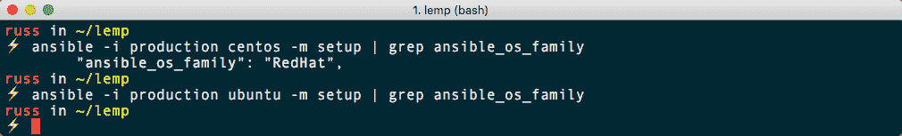
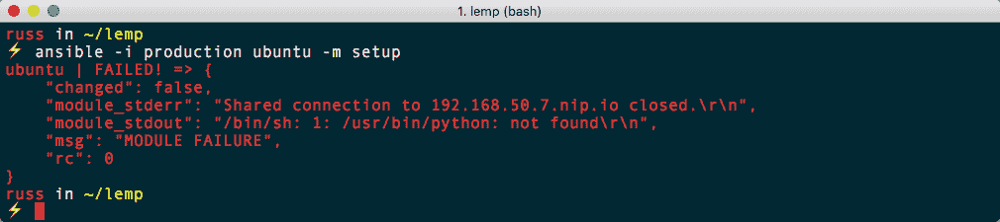
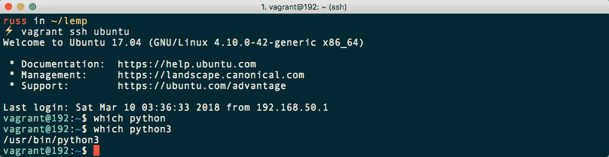
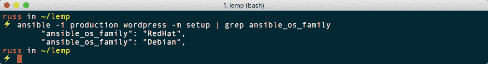

# 第六章：针对多个发行版

正如上一章末尾提到的，到目前为止，我们一直在针对单个操作系统使用我们的 playbook。如果我们只打算针对 CentOS 7 主机运行我们的 playbook，那是很好的，但情况可能并非总是如此。

在本章中，我们将看看如何调整我们的 WordPress 安装 playbook 以针对 Ubuntu 17.04 服务器实例。

在本章中，我们将：

+   查看并实施操作系统相关的核心模块

+   讨论并应用针对多个发行版的最佳实践

+   看看如何使用 Ansible 清单来针对多个主机

# 技术要求

在本章中，我们将启动两个 Vagrant 盒子，所以你需要安装 Vagrant 并且能够访问互联网；这些盒子本身大约每个下载 300 到 500MB。

如果你要跟着做，适应我们的角色，你需要从上一章复制`lemp`文件夹并将其命名为`lemp-multi`。如果你不跟着做，你可以在[`github.com/PacktPublishing/Learn-Ansible/tree/master/Chapter06/lemp-multi`](https://github.com/PacktPublishing/Learn-Ansible/tree/master/Chapter06/lemp-multi)找到`lemp-multi`的完整版本。

# 启动多个 Vagrant 盒子

在我们开始查看我们需要对 Ansible playbook 进行的更改之前，我们应该看看我们将如何同时启动两个运行不同操作系统的 Vagrant 盒子。可以从单个`Vagrantfile`启动两个 Vagrant 盒子；我们将使用以下一个：

```
# -*- mode: ruby -*-
# vi: set ft=ruby :

API_VERSION = "2"
DOMAIN      = "nip.io"
PRIVATE_KEY = "~/.ssh/id_rsa"
PUBLIC_KEY  = '~/.ssh/id_rsa.pub'
CENTOS_IP   = '192.168.50.6'
CENTOS_BOX  = 'centos/7'
UBUNTU_IP   = '192.168.50.7'
UBUNTU_BOX  = 'generic/ubuntu1704'

Vagrant.configure(API_VERSION) do |config|

  config.vm.define "centos" do |centos|
      centos.vm.box = CENTOS_BOX
      centos.vm.network "private_network", ip: CENTOS_IP
      centos.vm.host_name = CENTOS_IP + '.' + DOMAIN
      centos.ssh.insert_key = false
      centos.ssh.private_key_path = [PRIVATE_KEY,
      "~/.vagrant.d/insecure_private_key"]
      centos.vm.provision "file", source: PUBLIC_KEY, destination:
      "~/.ssh/authorized_keys"

      centos.vm.provider "virtualbox" do |v|
        v.memory = "2024"
        v.cpus = "2"
      end

      centos.vm.provider "vmware_fusion" do |v|
        v.vmx["memsize"] = "2024"
        v.vmx["numvcpus"] = "2"
      end
  end

  config.vm.define "ubuntu" do |ubuntu|
      ubuntu.vm.box = UBUNTU_BOX
      ubuntu.vm.network "private_network", ip: UBUNTU_IP
      ubuntu.vm.host_name = UBUNTU_IP + '.' + DOMAIN
      ubuntu.ssh.insert_key = false
      ubuntu.ssh.private_key_path = [PRIVATE_KEY,
      "~/.vagrant.d/insecure_private_key"]
      ubuntu.vm.provision "file", source: PUBLIC_KEY, destination:
      "~/.ssh/authorized_keys"

      ubuntu.vm.provider "virtualbox" do |v|
        v.memory = "2024"
        v.cpus = "2"
      end

      ubuntu.vm.provider "vmware_fusion" do |v|
        v.vmx["memsize"] = "2024"
        v.vmx["numvcpus"] = "2"
      end
  end

end
```

正如你所看到的，我们定义了两个不同的盒子，一个叫做`centos`，另一个叫做`ubuntu`，你应该用之前复制的`lemp`文件夹中的`Vagrantfile`替换它。

我们可以使用一个命令启动两台机器；要使用 VirtualBox，我们应该运行：

```
$ vagrant up 
```

或者要使用 VMware，我们可以运行：

```
$ vagrant up --provider=vmware_fusion
```

正如你从这里的终端输出中看到的，这启动了两个盒子：

```
Bringing machine 'centos' up with 'vmware_fusion' provider...
Bringing machine 'ubuntu' up with 'vmware_fusion' provider...
==> centos: Cloning VMware VM: 'centos/7'. This can take some time...
==> centos: Checking if box 'centos/7' is up to date...
==> centos: Verifying vmnet devices are healthy...
==> centos: Preparing network adapters...
==> centos: Starting the VMware VM...
==> centos: Waiting for the VM to receive an address...
==> centos: Forwarding ports...
 centos: -- 22 => 2222
==> centos: Waiting for machine to boot. This may take a few minutes...
 centos: SSH address: 127.0.0.1:2222
 centos: SSH username: vagrant
 centos: SSH auth method: private key
==> centos: Machine booted and ready!
==> centos: Setting hostname...
==> centos: Configuring network adapters within the VM...
 centos: SSH address: 127.0.0.1:2222
 centos: SSH username: vagrant
 centos: SSH auth method: private key
==> centos: Rsyncing folder: /Users/russ/lemp/ => /vagrant
==> centos: Running provisioner: file...
==> ubuntu: Cloning VMware VM: 'generic/ubuntu1704'. This can take some time...
==> ubuntu: Checking if box 'generic/ubuntu1704' is up to date...
==> ubuntu: Verifying vmnet devices are healthy...
==> ubuntu: Preparing network adapters...
==> ubuntu: Starting the VMware VM...
==> ubuntu: Waiting for the VM to receive an address...
==> ubuntu: Forwarding ports...
 ubuntu: -- 22 => 2222
==> ubuntu: Waiting for machine to boot. This may take a few minutes...
 ubuntu: SSH address: 127.0.0.1:2222
 ubuntu: SSH username: vagrant
 ubuntu: SSH auth method: private key
==> ubuntu: Machine booted and ready!
==> ubuntu: Setting hostname...
==> ubuntu: Configuring network adapters within the VM...
==> ubuntu: Running provisioner: file...
```

一旦盒子启动并运行，你可以使用机器名称 SSH 连接到它们：

```
$ vagrant ssh centos
$ vagrant ssh ubuntu
```

现在我们有两个运行在两个不同操作系统上的盒子，我们可以讨论我们需要对 playbook 进行的更改。首先，让我们看看对`Vagrantfile`的更改将如何影响我们的主机清单文件，正如你可以从这个文件中看到的那样：

```
centos ansible_host=192.168.50.6.nip.io 
ubuntu ansible_host=192.168.50.7.nip.io

[wordpress]
centos
ubuntu

[wordpress:vars]
ansible_connection=ssh
ansible_user=vagrant
ansible_private_key_file=~/.ssh/id_rsa
host_key_checking=False
```

现在我们有两个主机，一个叫做`centos`，另一个叫做`ubuntu`，我们将它们放在一个名为`wordpress`的组中，我们在那里设置一些公共变量。你应该更新你的`production`文件，因为我们将在下一节中使用它。

# 多操作系统考虑

查看在三个角色`stack-install`、`stack-config`和`wordpress`中使用的每个核心 Ansible 模块，我们使用了一些在我们新引入的 Ubuntu 盒子上不起作用的模块。让我们快速地逐个进行，并看看在针对两个非常不同的操作系统时需要考虑什么：

+   `yum`：`yum`模块是 Red Hat 系机器（如 CentOS）使用的包管理器，而 Ubuntu 基于 Debian，使用`apt`。我们需要拆分出使用`yum`模块的 playbook 的部分，以使用`apt`模块代替。

+   `yum_repository`：如前所述，我们将需要使用一个`apt`等效模块，即`apt_repository`。

+   `user`：`user`模块在两个操作系统上基本上是一样的，因为我们没有给我们的用户提升的特权。除了确保正确的组可用之外，我们没有任何特殊的考虑。

+   `template`、`file`、`copy`和`lineinfile`：这四个模块都将按预期工作；我们需要考虑的唯一问题是检查我们是否将文件复制到了盒子上的正确位置。

+   `service`：服务模块在两个操作系统上应该是一样的，所以我们应该没问题。

+   `mysql_user`和`mysql_db`：正如你所期望的，一旦 MySQL 安装并启动，这两个都将在两个操作系统上工作。

+   `selinux_permissive`：SELinux 主要用于基于 Red Hat 的操作系统，因此我们需要找到替代方案。

+   `get_url`、`stat`、`shell`和`set_fact`：这些应该在我们的目标操作系统上都能一致工作。

现在我们知道了在 Ubuntu 上运行与在 CentOS 上运行时需要审查现有 playbook 的哪些部分，我们可以开始让我们的角色在这两个操作系统上都能工作。

# 调整角色

那么我们如何在我们的角色中构建逻辑，只在不同的操作系统上执行角色的某些部分，而且我们也知道软件包名称会不同？我们如何为每个操作系统定义不同的变量集？

# 操作系统家族

我们在之前的章节中已经看过`setup`模块；这是一个收集有关我们目标主机的事实的模块。其中一个事实就是`ansible_os_family`；这告诉我们我们正在运行的操作系统类型。让我们在我们的两个主机上检查一下：

```
$ ansible -i production centos -m setup | grep ansible_os_family
$ ansible -i production ubuntu -m setup | grep ansible_os_family
```

正如你从以下终端输出中所看到的，CentOS 主机返回了 Red Hat，这是预期的。然而，Ubuntu 主机没有返回任何信息：



让我们看看为什么会这样。首先，我们可以重新运行命令，但这次去掉`grep`，这样我们就可以看到完整的输出：

```
$ ansible -i production ubuntu -m setup
```

这应该给你类似以下的结果：



哦，我们出现了一个错误。为什么它报告没有安装 Python？运行以下命令将 SSH 到该服务器：

```
$ vagrant ssh ubuntu
```

使用 SSH 登录后，运行`which python`将显示 Python 二进制文件的路径。正如你所看到的，由于没有返回路径，所以没有安装。那 Python 3 呢？运行`which python3`确实返回了一个二进制文件：



通过运行`exit`来关闭我们的 SSH 会话。

我们应该怎么办？由于我们运行的 Ansible 版本晚于 2.2，我们可以告诉 Ansible 使用`/usr/bin/python3`而不是默认的`/usr/bin/python`。为此，我们需要更新我们的主机清单文件，以便只有 Ubuntu 主机添加`ansible_python_interpreter`变量以及更新后的路径。

有几种方法可以实现这一点；然而，现在，让我们只更新`production`主机清单文件中的以下行：

```
ubuntu ansible_host=192.168.50.7.nip.io
```

因此，它的读法如下：

```
ubuntu ansible_host=192.168.50.7.nip.io ansible_python_interpreter=/usr/bin/python3
```

更新后，我们应该能够运行以下命令：

```
$ ansible -i production wordpress -m setup | grep ansible_os_family 
```

以下截图显示了上述命令的输出：



正如你所看到的，我们正在针对`wordpress`主机组，其中包含我们的两个主机，并且预期地，CentOS 主机返回`RedHat`，而 Ubuntu 主机现在返回`Debian`。现在我们已经有了一种识别每个主机上使用的操作系统的方法，我们可以开始调整角色。

# stack-install 角色

正如你可能已经猜到的，这个角色的大部分内容只是调用`yum`相关模块的任务，我们已经提到这将会改变。

我们要查看的角色的第一部分是`roles/stack-install/tasks/main.yml`文件的内容。目前，该文件包含使用`yum`和`yum_repository`模块安装我们期望的仓库和软件包的任务。

我们需要更新文件，但首先，将现有内容另存为名为`roles/stack-install/tasks/install-centos.yml`的文件。一旦你复制了内容，更新`roles/stack-install/tasks/main.yml`，使其包含这些内容：

```
---

- name: include the operating system specific variables
  include_vars: "{{ ansible_os_family }}.yml"

- name: install the stack on centos
  import_tasks: install-centos.yml
  when: ansible_os_family == 'RedHat'

- name: install the stack on ubuntu
  import_tasks: install-ubuntu.yml
  when: ansible_os_family == 'Debian'
```

正如你所看到的，我们正在使用`ansible_os_family`变量来包含变量和不同的任务。

该任务将包括以下文件之一，具体取决于任务在哪个操作系统上执行：

+   `roles/stack-install/vars/RedHat.yml`

+   `roles/stack-install/vars/Debian.yml`

然后它将包含以下两个文件中的一个，这些文件包含了操作系统的任务：

+   `install-centos.yml`

+   `install-ubuntu.yml`

我们已经知道`install-centos.yml`包含了我们的`main.yml`文件的旧内容；由于软件包名称和仓库 URL 也将发生变化，我们应该将`roles/stack-install/default/main.yml`的内容移动到`roles/stack-install/vars/RedHat.yml`，并将`roles/stack-install/default/main.yml`留空。

现在我们已经定义了角色的 CentOS 部分，我们可以看一下 Ubuntu 部分，从`roles/stack-install/vars/Debian.yml`的内容开始：

```
---

repo_packages:
  - "deb [arch=amd64,i386] http://mirror.sax.uk.as61049.net/mariadb/repo/10.1/ubuntu {{ ansible_distribution_release }} main"
  - "deb http://nginx.org/packages/mainline/ubuntu/ {{ ansible_distribution_release }} nginx"
  - "deb-src http://nginx.org/packages/mainline/ubuntu/ {{ ansible_distribution_release }} nginx"

repo_keys:
  - { key_server: "keyserver.ubuntu.com", key: "0xF1656F24C74CD1D8" }

repo_keys_url:
  - "http://nginx.org/keys/nginx_signing.key"

system_packages:
  - "software-properties-common"
  - "python3-mysqldb"
  - "acl"

stack_packages:
  - "nginx"
  - "mariadb-server"
  - "php7.0"
  - "php7.0-cli"
  - "php7.0-fpm"
  - "php7.0-gd"
  - "php7.0-json"
  - "php7.0-mbstring"
  - "php7.0-mysqlnd"
  - "php7.0-soap"
  - "php7.0-xml"
  - "php7.0-xmlrpc"

extra_packages:
  - "vim"
  - "git"
  - "unzip"
```

正如你所看到的，虽然我们保留了`system_packages`，`stack_packages`和`extra_packages`变量，但其中包含了不同的软件包名称。在`repo_packages`中也有类似的情况，我们更新了 URL，因为 CentOS 仓库将无法在 Ubuntu 上使用。最后，我们引入了两个新变量，`repo_keys`和`repo_keys_urls`；我们很快将看到这些变量的用途。

我们需要处理的最后一个文件是`roles/stack-install/tasks/install-ubuntu.yml`。和`install-centos.yml`一样，这个文件包含了我们需要添加的额外仓库和安装软件包的任务。

首先，我们需要安装一些我们继续进行其余任务所需的工具；这些工具已经在`system_packages`变量中定义，所以我们只需要添加以下任务：

```
- name: update cache and install the system packages
  apt:
    name: "{{ item }}"
    update_cache: "yes"
  with_items: "{{ system_packages }}"
```

现在我们已经安装了基本的先决条件，我们可以为我们将要添加的仓库添加密钥：

```
- name: add the apt keys from a key server
  apt_key:
    keyserver: "{{ item.key_server }}"
    id: "{{ item.key }}"
  with_items: "{{ repo_keys }}"

- name: add the apt keys from a URL
  apt_key:
    url: "{{ item }}"
    state: present
  with_items: "{{ repo_keys_url }}"
```

第一个任务从官方 Ubuntu 密钥存储中添加密钥，第二个任务从 URL 下载密钥。在我们的情况下，我们为官方 MariaDB 仓库添加了一个密钥，为 NGINX 主线仓库添加了一个密钥；如果没有这些密钥，我们将无法添加仓库，会出现关于不受信任的错误。

添加仓库的任务如下；它循环遍历`repo_packages`变量中的仓库 URL：

```
- name: install the repo packages
  apt_repository:
    repo: "{{ item }}"
    state: "present"
    update_cache: "yes"
  with_items: "{{ repo_packages }}"
```

playbook 的最后一部分安装了剩余的软件包：

```
- name: install the stack packages
  apt:
    name: "{{ item }}"
    state: "installed"
  with_items: "{{ stack_packages + extra_packages }}"
```

现在我们已经更新了`stack-install`角色，我们需要对`stack-config`角色做同样的操作。

# stack-config 角色

我们在这个角色中使用的大部分模块在我们的目标操作系统上都能正常工作，所以在这个角色中，我们只需要调整配置文件的路径等内容。我不会列出整个`roles/stack-config/tasks/main.yml`文件的内容，我只会强调需要进行的更改，从文件顶部开始：

```
- name: include the operating system specific variables
  include_vars: "{{ ansible_os_family }}.yml"
```

这将加载包含我们稍后在角色中需要使用的路径的变量；`roles/stack-config/vars/RedHat.yml`的内容是：

```
---

php_fpm_path: "/etc/php-fpm.d/www.conf"
php_ini_path: /etc/php.ini
php_service_name: "php-fpm"
```

`roles/stack-config/vars/Debian.yml`的内容是：

```
php_fpm_path: "/etc/php/7.0/fpm/pool.d/www.conf"
php_ini_path: "/etc/php/7.0/fpm/php.ini"
php_service_name: "php7.0-fpm"
```

正如你所看到的，我们需要进行的大部分更改是关于 PHP 配置文件的位置。在获取这些文件之前，我们需要在我们的`roles/stack-config/tasks/main.yml`文件中重新创建 WordPress 用户。因为在 Ubuntu 上，PHP-FPM 默认运行在不同的组下，所以没有创建 PHP-FPM 组，让我们创建一个，确保在`add the wordpress user`任务之前添加这些任务：

```
- name: add the wordpress group
  group: 
    name: "{{ wordpress_system.group }}"
    state: "{{ wordpress_system.state }}"
```

接下来，在 Ubuntu 上没有创建`/var/www/`文件夹，所以我们需要创建这个文件夹：

```
- name: create the global directory in /etc/nginx/
  file:
    dest: "/var/www/"
    state: "directory"
    mode: "0755"
```

在 CentOS 服务器上，组和文件夹已经存在，所以这些任务应该只显示`ok`。一旦它们被创建，用户将在两个服务器上都没有错误地创建，而且`add the wordpress user`任务也没有变化。

所有部署 NGINX 配置的任务都可以在不进行任何更改的情况下工作，所以我们可以继续进行 PHP 配置：

```
- name: copy the www.conf to /etc/php-fpm.d/
  template:
    src: "php-fpmd-www.conf.j2"
    dest: "{{ php_fpm_path }}"
  notify: "restart php-fpm"

- name: configure php.ini
  lineinfile: 
    dest: "{{ php_ini_path }}"
    regexp: "{{ item.regexp }}"
    line: "{{ item.replace }}"
    backup: "yes"
    backrefs: "yes"
  with_items: "{{ php.ini }}"
  notify: "restart php-fpm"
```

正如你所看到的，这两个任务都已经更新，包含了当前 playbook 目标操作系统相关的路径。

`restart php-fpm` 处理程序也已更新，因为两个操作系统上的 PHP-FPM 服务具有不同的名称；此任务应替换`roles/stack-config/handlers/main.yml`中的现有任务：

```
- name: "restart php-fpm"
  service:
    name: "{{ php_service_name }}"
    state: "restarted"
    enabled: "yes"
```

同样，在`roles/stack-config/tasks/main.yml`中，启动 PHP-FPM 的任务应根据此任务进行更新：

```
- name: start php-fpm
  service:
    name: "{{ php_service_name }}"
    state: "started"
```

接下来的两个更改是使以下任务仅在 CentOS 框上运行：

```
- name: configure the mariadb bind address
  lineinfile: 
    dest: "{{ mariadb.server_config }}"
    regexp: "#bind-address=0.0.0.0"
    line: "bind-address={{ mariadb.bind }}"
    backup: "yes"
    backrefs: "yes"
  when: ansible_os_family == 'RedHat'
```

这是因为 Ubuntu 上 MariaDB 的默认配置不包含`bind-address`，所以我们跳过它；下一个和最后一个任务如下：

```
- name: set the selinux allowing httpd_t to be permissive is required
  selinux_permissive:
    name: httpd_t
    permissive: true
  when: selinux.http_permissive == true and ansible_os_family == 'RedHat'
```

我们在 Ubuntu 框上跳过这一步，因为 SELinux 未安装并且与 Ubuntu 不兼容。

# wordpress 角色

`wordpress` 角色有一些小的更改；第一个更改是更新`roles/wordpress/defaults/main.yml`：

```
wordpress:
  domain: "http://{{ wordpress_domain }}/"
  title: "WordPress installed by Ansible on {{ os_family }}"
```

正如您所看到的，我们已将`wordpress.domain`更新为包含`wordpress_domain`变量，而`wordpress.title`现在包含`os_family`变量；我们通过在`roles/wordpress/tasks/main.yml`文件中添加以下任务来设置这两个变量：

```
- name: set a fact for the wordpress domain
  set_fact:
    wordpress_domain: "{{ ansible_ssh_host }}"
    os_family: "{{ ansible_os_family }}"
```

我们在这里这样做的原因是 Vagrant 没有正确设置我们的 Ubuntu 框的主机名为完全合格的域名，例如`192.168.50.7.nip.io`，因此我们使用在`production`清单主机文件中定义的我们正在 SSH 连接的主机。这个角色的其余部分保持不变。

# 运行 playbook

我们的`site.yml`文件没有任何更改，这意味着我们只需要运行以下命令来启动 playbook 运行：

```
$ ansible-playbook -i production site.yml
```

这将通过 playbook 运行，给出以下输出；请注意，我已经删除了 playbook 输出的一些部分：

```
PLAY [wordpress]

TASK [Gathering Facts]
ok: [centos]
ok: [ubuntu]

TASK [roles/stack-install : include the operating system specific variables] 
ok: [centos]
ok: [ubuntu]

TASK [roles/stack-install : install the repo packages] 
skipping: [ubuntu] => (item=[])
changed: [centos] => (item=[u'epel-release', u'https://centos7.iuscommunity.org/ius-release.rpm'])

TASK [roles/stack-install : add the NGINX mainline repo] 
skipping: [ubuntu]
changed: [centos]

TASK [roles/stack-install : update all of the installed packages] 
skipping: [ubuntu]
changed: [centos]

TASK [roles/stack-install : remove the packages so that they can be replaced] 
skipping: [ubuntu]
changed: [centos] => (item=[u'mariadb-libs.x86_64'])

TASK [roles/stack-install : install the stack packages] 
skipping: [ubuntu] => (item=[])
changed: [centos] => (item=[u'postfix', u'MySQL-python', u'policycoreutils-python', u'nginx', u'mariadb101u', u'mariadb101u-server', u'mariadb101u-config', u'mariadb101u-common', u'mariadb101u-libs', u'php72u', u'php72u-bcmath', u'php72u-cli', u'php72u-common', u'php72u-dba', u'php72u-fpm', u'php72u-fpm-nginx', u'php72u-gd', u'php72u-intl', u'php72u-json', u'php72u-mbstring', u'php72u-mysqlnd', u'php72u-process', u'php72u-snmp', u'php72u-soap', u'php72u-xml', u'php72u-xmlrpc', u'vim-enhanced', u'git', u'unzip'])

TASK [roles/stack-install : update cache and install the system packages] 
skipping: [centos] => (item=[])
changed: [ubuntu] => (item=[u'software-properties-common', u'python3-mysqldb', u'acl'])

TASK [roles/stack-install : add the apt keys from a key server] 
skipping: [centos]
changed: [ubuntu] => (item={u'key_server': u'keyserver.ubuntu.com', u'key': u'0xF1656F24C74CD1D8'})

TASK [roles/stack-install : add the apt keys from a URL] 
skipping: [centos]
changed: [ubuntu] => (item=http://nginx.org/keys/nginx_signing.key)

TASK [roles/stack-install : install the repo packages] 
skipping: [centos] => (item=epel-release)
skipping: [centos] => (item=https://centos7.iuscommunity.org/ius-release.rpm)
changed: [ubuntu] => (item=deb [arch=amd64,i386] http://mirror.sax.uk.as61049.net/mariadb/repo/10.1/ubuntu zesty main)
changed: [ubuntu] => (item=deb http://nginx.org/packages/mainline/ubuntu/ zesty nginx)
changed: [ubuntu] => (item=deb-src http://nginx.org/packages/mainline/ubuntu/ zesty nginx)

TASK [roles/stack-install : install the stack packages] 
skipping: [centos] => (item=[])
changed: [ubuntu] => (item=[u'nginx', u'mariadb-server', u'php7.0', u'php7.0-cli', u'php7.0-fpm', u'php7.0-gd', u'php7.0-json', u'php7.0-mbstring', u'php7.0-mysqlnd', u'php7.0-soap', u'php7.0-xml', u'php7.0-xmlrpc', u'vim', u'git', u'unzip'])

TASK [roles/stack-config : include the operating system specific variables] 
ok: [centos]
ok: [ubuntu]

TASK [roles/stack-config : add the wordpress group] 
ok: [centos]

TASK [roles/stack-config : create the global directory in /etc/nginx/] 
changed: [ubuntu]
ok: [centos]

TASK [roles/stack-config : add the wordpress user] 
changed: [centos]
changed: [ubuntu]

TASK [roles/stack-config : copy the nginx.conf to /etc/nginx/] 
changed: [ubuntu]
changed: [centos]

TASK [roles/stack-config : create the global directory in /etc/nginx/] 
changed: [ubuntu]
changed: [centos]

TASK [roles/stack-config : copy the restrictions.conf to /etc/nginx/global/] 
changed: [ubuntu]
changed: [centos]

TASK [roles/stack-config : copy the wordpress_shared.conf to /etc/nginx/global/] 
changed: [ubuntu]
changed: [centos]

TASK [roles/stack-config : copy the default.conf to /etc/nginx/conf.d/] 
changed: [ubuntu]
changed: [centos]

TASK [roles/stack-config : copy the www.conf to /etc/php-fpm.d/] 
changed: [ubuntu]
changed: [centos]

TASK [roles/stack-config : configure php.ini] 
changed: [ubuntu] => (item={u'regexp': u'^;date.timezone =', u'replace': u'date.timezone = Europe/London'})
changed: [centos] => (item={u'regexp': u'^;date.timezone =', u'replace': u'date.timezone = Europe/London'})
ok: [ubuntu] => (item={u'regexp': u'^expose_php = On', u'replace': u'expose_php = Off'})
changed: [centos] => (item={u'regexp': u'^expose_php = On', u'replace': u'expose_php = Off'})
changed: [ubuntu] => (item={u'regexp': u'^upload_max_filesize = 2M', u'replace': u'upload_max_filesize = 20M'})
changed: [centos] => (item={u'regexp': u'^upload_max_filesize = 2M', u'replace': u'upload_max_filesize = 20M'})

TASK [roles/stack-config : start php-fpm] 
changed: [ubuntu]
changed: [centos]

TASK [roles/stack-config : start nginx] 
changed: [ubuntu]
changed: [centos]

TASK [roles/stack-config : configure the mariadb bind address] 
skipping: [ubuntu]
changed: [centos]

TASK [roles/stack-config : start mariadb] 
ok: [ubuntu]
changed: [centos]

TASK [roles/stack-config : change mysql root password] 
changed: [centos] => (item=127.0.0.1)
changed: [ubuntu] => (item=127.0.0.1)
changed: [centos] => (item=::1)
changed: [ubuntu] => (item=::1)
changed: [ubuntu] => (item=192)
changed: [centos] => (item=192.168.50.6.nip.io)
changed: [ubuntu] => (item=localhost)
changed: [centos] => (item=localhost)

TASK [roles/stack-config : set up .my.cnf file] 
changed: [ubuntu]
changed: [centos]

TASK [roles/stack-config : delete anonymous MySQL user] 
ok: [ubuntu] => (item=127.0.0.1)
ok: [centos] => (item=127.0.0.1)
ok: [ubuntu] => (item=::1)
ok: [centos] => (item=::1)
ok: [ubuntu] => (item=192)
changed: [centos] => (item=192.168.50.6.nip.io)
ok: [ubuntu] => (item=localhost)
changed: [centos] => (item=localhost)

TASK [roles/stack-config : remove the MySQL test database] 
ok: [ubuntu]
changed: [centos]

TASK [roles/stack-config : set the selinux allowing httpd_t to be permissive is required] 
skipping: [ubuntu]
changed: [centos]

TASK [roles/wordpress : set a fact for the wordpress domain] 
ok: [centos]
ok: [ubuntu]

TASK [roles/wordpress : download wp-cli] 
changed: [ubuntu]
changed: [centos]

TASK [roles/wordpress : update permissions of wp-cli to allow anyone to execute it] 
changed: [ubuntu]
changed: [centos]

TASK [roles/wordpress : create the wordpress database] 
changed: [ubuntu]
changed: [centos]

TASK [roles/wordpress : create the user for the wordpress database] 
changed: [ubuntu] => (item=127.0.0.1)
changed: [centos] => (item=127.0.0.1)
ok: [ubuntu] => (item=::1)
ok: [centos] => (item=::1)
ok: [ubuntu] => (item=192)
ok: [centos] => (item=192.168.50.6.nip.io)
ok: [ubuntu] => (item=localhost)
ok: [centos] => (item=localhost)

TASK [roles/wordpress : are the wordpress files already there?] 
ok: [ubuntu]
ok: [centos]

TASK [roles/wordpress : download wordpresss] 
changed: [ubuntu]
changed: [centos]

TASK [roles/wordpress : set the correct permissions on the homedir] 
ok: [ubuntu]
changed: [centos]

TASK [roles/wordpress : is wordpress already configured?] 
ok: [centos]
ok: [ubuntu]

TASK [roles/wordpress : configure wordpress] 
changed: [ubuntu]
changed: [centos]

TASK [roles/wordpress : do we need to install wordpress?] 
fatal: [ubuntu]: FAILED! => 
...ignoring
fatal: [centos]: FAILED! => 
...ignoring

TASK [roles/wordpress : install wordpress if needed] 
changed: [ubuntu]
changed: [centos]

TASK [roles/wordpress : do we need to install the plugins?] 
failed: [ubuntu] (item=jetpack) => 
failed: [ubuntu] (item=wp-super-cache) => 
failed: [ubuntu] (item=wordpress-seo) => 
failed: [centos] (item=jetpack) => 
failed: [ubuntu] (item=wordfence) => 
failed: [centos] (item=wp-super-cache) => 
failed: [ubuntu] (item=nginx-helper) => 
failed: [centos] (item=wordpress-seo) => 
failed: [centos] (item=wordfence) => 
failed: [centos] (item=nginx-helper) =>

TASK [roles/wordpress : set a fact if we don't need to install the plugins] 
skipping: [centos]
skipping: [ubuntu]

TASK [roles/wordpress : set a fact if we need to install the plugins] 
ok: [centos]
ok: [ubuntu]

TASK [roles/wordpress : install the plugins if we need to or ignore if not] 
changed: [centos] => (item=jetpack)
changed: [ubuntu] => (item=jetpack)
changed: [ubuntu] => (item=wp-super-cache)
changed: [centos] => (item=wp-super-cache)
changed: [ubuntu] => (item=wordpress-seo)
changed: [centos] => (item=wordpress-seo)
changed: [ubuntu] => (item=wordfence)
changed: [centos] => (item=wordfence)
changed: [ubuntu] => (item=nginx-helper)
changed: [centos] => (item=nginx-helper)

TASK [roles/wordpress : do we need to install the theme?] 
fatal: [centos]: FAILED! => 
fatal: [ubuntu]: FAILED! =>

TASK [roles/wordpress : set a fact if we don't need to install the theme] 
skipping: [centos]
skipping: [ubuntu]

TASK [roles/wordpress : set a fact if we need to install the theme] 
ok: [centos]
ok: [ubuntu]

TASK [roles/wordpress : install the theme if we need to or ignore if not] 
changed: [centos]
changed: [ubuntu]

RUNNING HANDLER [roles/stack-config : restart nginx] 
changed: [ubuntu]
changed: [centos]

RUNNING HANDLER [roles/stack-config : restart php-fpm] 
changed: [ubuntu]
changed: [centos]

PLAY RECAP 
centos : ok=47 changed=37 unreachable=0 failed=0
ubuntu : ok=45 changed=33 unreachable=0 failed=0
```

一旦 playbook 完成，您应该能够在浏览器中访问`http://192.168.50.6.nip.io/`，并且您应该看到 WordPress 显示已安装在基于 Red Hat 的操作系统上：


访问`http://192.168.50.7.nip.io/`将显示相同的主题，但它应该说明它正在运行 Debian-based 操作系统，就像这个截图中一样：


您可以尝试重新运行 playbook，以查看返回的结果，并且您还可以通过运行以下命令删除 Vagrant 框：

```
$ vagrant destroy
```

您将被问及是否要逐个删除每台机器；只需对两个提示都回答“是”。

# 摘要

在本章中，我们已经调整了我们的 WordPress 安装 playbook，以针对多个操作系统。我们通过使用 Ansible 的内置审计模块来确定 playbook 正在针对哪个操作系统，并仅运行适用于目标操作系统的任务来实现这一点。

在下一章中，我们将开始查看一些处理网络的核心 Ansible 模块。

# 问题

1.  真或假：我们需要仔细检查 playbook 中的每个任务，以确保它在两个操作系统上都能正常工作。

1.  哪个配置选项允许我们定义 Python 的路径，Ansible 将使用？

1.  解释为什么我们需要对配置和与 PHP-FPM 服务交互的任务进行更改。

1.  真或假：每个操作系统的软件包名称完全对应。

1.  更新 playbook，以便在每个不同的主机上安装不同的主题。

# 进一步阅读

您可以在[`www.ubuntu.com`](https://www.ubuntu.com)找到有关 Ubuntu 操作系统的更多信息。
