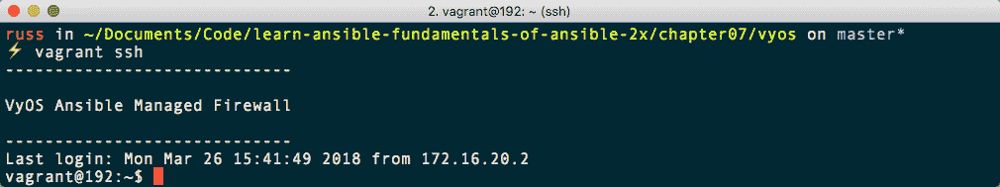
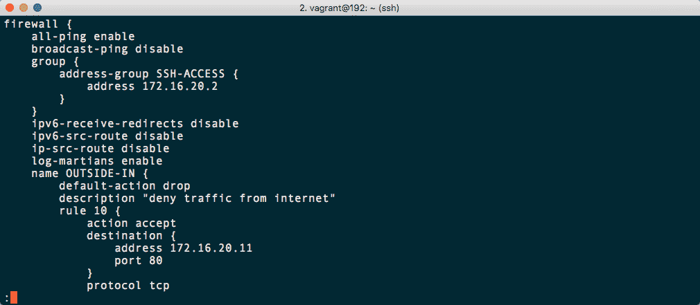

# 第七章：核心网络模块

在本章中，我们将介绍随 Ansible 一起提供的核心网络模块。由于这些模块的要求，我们只会简要介绍这些模块提供的功能，并提供一些用例和示例。

本章将涵盖以下主题：

+   核心网络模块

+   与服务器本地防火墙交互

+   与网络设备交互

# 技术要求

在本章中，我们将启动一个运行软件防火墙的 Vagrant 虚拟机。您需要安装 Vagrant 并访问互联网；Vagrant 虚拟机大小约为 400MB。我们将在本章中使用的完整版本 playbook 可以在[`github.com/PacktPublishing/Learn-Ansible/tree/master/Chapter07/vyos`](https://github.com/PacktPublishing/Learn-Ansible/tree/master/Chapter07/vyos)上找到。

# 制造商和设备支持

到目前为止，我们一直在查看与服务器交互的模块。在我们的情况下，它们都在本地运行。在后面的章节中，我们将与远程托管的服务器进行通信。在开始与远程服务器交互之前，我们应该先了解核心网络模块。

这些模块都被设计用来与各种网络设备交互和管理配置，从传统的顶部交换机和完全虚拟化的网络基础设施到防火墙和负载均衡器。Ansible 支持许多非常不同的设备，从开源虚拟设备到根据配置可能成本超过 50 万美元的解决方案。

# 模块

我在这里列出了每个设备和操作系统。对于每个设备，都有一个加粗显示的简称。每个简称都是模块的前缀。例如，在第一个设备中，有一个名为**a10_server**的模块，用于使用 aXAPIv2 API 管理**服务器负载均衡器**（**SLB**）对象。

# A10 Networks

**A10**模块支持 A10 Networks AX、SoftAX、Thunder 和 vThunder 设备。这些都是应用交付平台，提供负载均衡。除其他功能外，这几个模块允许您在物理和虚拟设备上管理负载平衡和虚拟主机。

# 思科应用中心基础设施（ACI）

50 多个**ACI**模块用于管理思科的 ACI 的所有方面，这是可以预期的，因为这是思科的下一代 API 驱动的网络堆栈。

# 思科 AireOS

两个**AireOS**模块允许您与运行 AireOS 的思科无线局域网控制器进行交互。其中一个模块允许您直接在设备上运行命令，另一个用于管理配置。

# Apstra 操作系统（AOS）

大约十几个**AOS**模块都标记为已弃用，因为它们不支持 AOS 2.1 或更高版本。这些模块将在即将发布的 Ansible 版本 2.9 之前被替换，确切地说。

# Aruba 移动控制器

只有两个**Aruba**模块。这些允许您管理惠普的 Aruba 移动控制器的配置并执行命令。

# 思科自适应安全设备（ASA）

有三个**ASA**模块，您可以管理访问列表，并运行命令和管理物理和虚拟的思科 ASA 设备的配置。

# Avi Networks

在撰写本文时，有 65 个**Avi**模块，允许您与 Avi 应用服务平台的所有方面进行交互，包括负载均衡和**Web 应用防火墙**（**WAF**）功能。

# Big Switch Networks

有三个 Big Switch Network 模块。其中一个**Big Cloud Fabric**（**BCF**）允许您创建和删除 BCF 交换机。另外两个模块允许您创建**Big Monitoring Fabric**（**Big Mon**）服务链和策略。

# Citrix Netscaler

目前有一个已弃用的**Netscaler**模块。它将在 Ansible 2.8 中被移除。这给了您足够的时间转移到新模块。单一模块已被 14 个其他模块取代，这些模块允许您管理负载均衡器和 Citrix 安全设备中更多的功能。

# 华为 CloudEngine（CE）

有 65 多个**CE**模块，可以让您管理华为的这些强大交换机的所有方面，包括 BGP、访问控制列表、MTU、静态路由、VXLAN，甚至 SNMP 配置。

# Arista CloudVision（CV）

有一个单一模块，可以让您使用配置文件配置 Arista **CV**服务器端口。

# Lenovo CNOS

有 15 多个模块，可以让您管理运行联想**CNOS**操作系统的设备；它们允许您管理从 BGP 和端口聚合到 VLAG、VLAN，甚至工厂重置设备的所有内容。

# Cumulus Linux（CL）

在八个**CL**中，有七个已被弃用，取而代之的是一个模块，使用**网络命令行实用程序**（**NCLU**）与您的 Cumulus Linux 设备进行通信。

# Dell 操作系统 10（DellOS10）

**DellOS10**有三个模块，可以让您在运行戴尔网络操作系统的设备上执行命令，管理配置并收集信息。还有**Dell 操作系统 6**（**DellOS6**）和**Dell 操作系统 9**（**DellOS9**）的模块。

# Ubiquiti EdgeOS

有适用于**EdgeOS**的模块，可以让您管理配置，执行临时命令，并收集运行 EdgeOS 的设备（如 Ubiquiti EdgeRouter）的信息。

# 联想企业网络操作系统（ENOS）

有三个模块适用于联想**ENOS**。与其他设备一样，这些模块允许您收集信息，执行命令并管理配置。

# Arista EOS

有 16 个模块，可以让您管理运行**EOS**的设备。这些模块允许您配置接口、VLAN、VRF、用户、链路聚合、静态路由，甚至日志记录。还有一个模块，可以让您从每个设备中收集信息。

# F5 BIG-IP

有 65 个模块，所有这些模块都以**BIG-IP**为前缀，可以让您管理 F5 BIG-IP 应用交付控制器的所有方面。

# FortiGate FortiManager

有一个单一模块，可以让您使用**FortiManager**（**fmgr**）添加、编辑、删除和执行脚本，针对您的 FortiGate 设备。

# FortiGate FortiOS

作为核心网络模块的一部分，有三个模块可以让您管理 FortiGate **FortiOS**设备上的地址、配置和 IPv4 策略对象。

# illumos

**illumos**是 OpenSolaris 操作系统的一个分支。它具有几个强大的网络功能，使其成为部署自建路由器或防火墙的理想选择。使用了三个前缀：`dladm`、`flowadm`和`ipadm`。这些模块允许您管理接口、NetFlow 和隧道。此外，由于 illumos 是 OpenSolaris 的一个分支，您的 playbook 应该适用于基于 OpenSolaris 的操作系统。

# Cisco IOS 和 IOS XR

有大约 25 个模块，可以让您管理您的 Cisco **IOS**和**IOS XR**设备。使用它们，您可以收集设备信息，以及配置用户、接口、日志记录、横幅等。

# Brocade IronWare

有三个通常的模块，可以帮助您管理您的 Brocade **IronWare**设备；您可以配置、运行临时命令和收集信息。

# Juniper Junos

有 20 个模块，可以让您在 playbooks 中与运行**Junos**的 Juniper 设备进行交互。这些模块包括标准命令、配置和信息收集模块，以及允许您安装软件包并将文件复制到设备的模块。

# Nokia NetAct

有一个单一模块，可以让您上传并应用您的 Nokia **NetAct**驱动的核心和无线电网络。

# Pluribus Networks Netvisor OS

有超过十个模块允许您管理您的**Pluribus Networks**（**PN**）Netvisor OS 设备，从创建集群和路由器到在白盒交换机上运行命令。

# Cisco Network Services Orchestrator (NSO)

有少数模块允许您与您的 Cisco **NSO**管理的设备进行交互。您可以执行 NSO 操作，从您的安装中查询数据，并在服务同步和配置方面验证您的配置。

# Nokia Nuage Networks Virtualized Services Platform (VSP)

有一个单一模块允许您管理您的 Nokia **Nuage** Networks VSP 上的企业。

# Cisco NX-OS (NXOS)

可以想象，有很多模块用于管理运行 Cisco **NXOS**的设备——超过 70 个。其中一些正在被弃用。有这么多模块，您可以获得这个强大网络操作系统所有功能的广泛覆盖。

# Mellanox ONYX

有超过十几个模块允许您与 Mellanox 的交换机操作系统**ONYX**进行交互。您可以管理 BGP、L2 和 L3 接口，以及 LDAP。

# Ordnance

有两个模块用于**Ordnance** Router as a Service；它们允许您应用配置更改并收集信息。

# Open vSwitch (OVS)

有三个模块允许您管理**OVS**虚拟交换机上的桥接、端口和数据库。

# Palo Alto Networks PAN-OS

有超过 20 个模块可以让您配置、管理和审计运行 PAN-OS（**panos**）的 Palo Alto Networks 设备。目前有一些模块正在被弃用；它们将在 Ansible 2.5 中停止作为核心模块分发。

# Radware

最近推出的少量模块允许您通过**vDirect**服务器管理您的 Radware 设备。

# Nokia Networks Service Router Operating System (SROS)

有三个模块允许您对 Nokia Networks 的**SROS**设备运行命令、配置和回滚更改。

# VyOS

有十几个模块允许您管理**VyOS**开源 Linux 路由器和防火墙的大多数方面。我们将在下一节中看一下 VyOS。

# 系统

还有一些通用的**net**模块，允许您管理基于 Linux 的网络设备上的接口、Layer2 和 Layer3 配置、NETCONF、路由，以及 LLDP 服务。

# 与网络设备交互

正如在本章开头已经提到的，我们将使用 Vagrant 启动一个网络设备，然后运行一个 playbook 来应用基本配置。我们将要启动的设备是 VyOS。虽然设备将是完整的 VyOS 安装，但我们将只应用一个测试配置，以便让您了解我们在上一节提到的模块如何使用。

在附带本标题的 GitHub 存储库中有这个 playbook 的完整副本。

# 启动网络设备

为了做到这一点，我们将使用一个 VyOS Vagrant box。如果您在跟随，我们首先需要创建一个名为`vyos`的文件夹。这将保存我们的 playbook 和`Vagrantfile`。要创建所需的文件夹结构和空白文件，运行以下命令：

```
$ mkdir vyos vyos/group_vars vyos/roles
$ ansible-galaxy init vyos/roles/vyos-firewall
$ touch vyos/Vagrantfile
$ touch vyos/production
$ touch vyos/site.yml
$ touch vyos/group_vars/common.yml
$ touch vyos/roles/vyos-firewall/templates/firewall.j2 
```

将以下代码复制到我们创建的空白`Vagrantfile`中：

```
# -*- mode: ruby -*-
# vi: set ft=ruby :

API_VERSION = "2"
BOX_NAME    = "russmckendrick/vyos"
BOX_IP      = "192.168.50.10"
DOMAIN      = "nip.io"
PRIVATE_KEY = "~/.ssh/id_rsa"
PUBLIC_KEY  = '~/.ssh/id_rsa.pub'

Vagrant.configure(API_VERSION) do |config|
  config.vm.box = BOX_NAME
  config.vm.network "private_network", ip: BOX_IP
  config.vm.host_name = BOX_IP + '.' + DOMAIN
  config.ssh.insert_key = false
  config.ssh.private_key_path = [PRIVATE_KEY, "~/.vagrant.d/insecure_private_key"]
  config.vm.provision "file", source: PUBLIC_KEY, destination: "~/.ssh/authorized_keys"

  config.vm.provider "virtualbox" do |v|
    v.memory = "2024"
    v.cpus = "2"
  end

  config.vm.provider "vmware_fusion" do |v|
    v.vmx["memsize"] = "2024"
```

```
    v.vmx["numvcpus"] = "2"
  end

end
```

正如您所看到的，`Vagrantfile`看起来与我们在以前章节中使用的并没有太大不同。现在让我们来看一下`vyos_firewall`角色。在执行和编写角色时有一些不同之处，我们在启动之前应该讨论一下。

# VyOS 角色

在我们进入任务之前，让我们先看一下我们将要使用的变量。首先是`roles/vyos-firewall/defaults/main.yml`的内容：

```
---

motd_asciiart: |
  -----------------------------

  VyOS Ansible Managed Firewall 

  -----------------------------

vyos_nameservers:
  - 8.8.8.8
  - 8.8.4.4
```

在这里，我们只设置了两个关键值。第一个`motd_asciiart`是一个多行横幅，每当我们登录到 VyOS 设备时都会显示。我们使用`|`来声明关键字后，将变量设置为多行。下一个关键字`vyos_nameservers`是要使用的 DNS 解析器列表。在这里，我们使用 Google 的公共 DNS 解析器。

playbook 中还使用了一些其他变量；这些可以在`group_vars/common.yml`中找到，如下所示：

```
---

vyos:
  host: "192.168.50.10.nip.io"
  username: "vagrant"
  backup: "yes"
  inside:
    interface: "172.16.20.1/24"
    subnet: "172.16.20.0/24"

whitelist_ips:
  - 172.16.20.2

rules:
    - { action: 'set', source_address: '0.0.0.0/0', source_port: '80', destination_port: '80', destination_address: '172.16.20.11', protocol: 'tcp', description: 'NAT port 80 to 172.16.10.11', rule_number: '10' }
    - { action: 'set', source_address: '0.0.0.0/0', source_port: '443', destination_port: '443', destination_address: '172.16.20.11', protocol: 'tcp', description: 'NAT port 443 to 172.16.10.11', rule_number: '20' }
    - { action: 'set', source_address: '123.123.123.123/32', source_port: '222', destination_port: '22', destination_address: '172.16.20.11', protocol: 'tcp', description: 'NAT port 443 to 172.16.10.11', rule_number: '30' }
```

正如你所看到的，这些是可能根据我们的 playbook 运行位置而改变的大部分变量。首先，我们在一个名为`vyos`的嵌套变量中设置了我们设备的详细信息和基本配置。你可能已经注意到，我们在这里传递了我们 VyOS 设备的 IP 地址和用户名的详细信息，而不是我们的主机清单文件。

实际上，我们的主机清单文件名为`production`，应该只包含以下代码行：

```
localhost
```

这意味着当我们的 playbook 被执行时，它不会针对我们的 VyOS 设备执行。相反，playbook 将针对我们的 Ansible 控制器，并且模块将会针对 VyOS 设备。这种方法在所有核心网络模块中都很常见。正如我们已经讨论过的，Ansible 是一个无代理平台；默认情况下只需要 SSH 或 WinRM 连接。

然而，并非每个网络设备都具有 SSH 或 WinRM 访问权限；有些可能只有基于 Web 的 API，而其他一些可能使用专有的访问方法。另外，像 VyOS 这样的设备可能看起来具有 SSH 访问权限；但是，你实际上是在一个专门设计仅运行少量防火墙命令的自定义 shell 中进行 SSH。因此，大多数核心网络模块都会将它们的连接和通信管理远离主机清单文件。

`group_vars/common.yml`文件中的其余变量设置了一些基本防火墙规则，我们很快会看到。

可以在`roles/vyos-firewall/tasks/main.yml`中找到该角色的任务，它包含四个部分。首先，我们使用`vyos_config`模块来设置主机名。看一下这段代码：

```
- name: set the hostname correctly
  vyos_config:
    provider:
      host: "{{ vyos.host }}"
      username: "{{ vyos.username }}"
    lines:
      - "set system host-name {{ vyos.host }}"
```

正如你所看到的，我们使用`provider`选项传递了 VyOS 设备的详细信息；然后我们传递了一个`vyos`命令来设置主机名。`vyos_config`模块还接受模板文件，我们将在下一步中使用它来完全配置我们的设备。

下一个任务使用`vyos_system`模块配置 DNS 解析器。看一下这段代码：

```
- name: configure name servers
  vyos_system:
    provider:
      host: "{{ vyos.host }}"
      username: "{{ vyos.username }}"
    name_server: "{{ item }}"
  with_items: "{{ vyos_nameservers }}"
```

接下来，我们将使用`vyos_banner`模块设置**每日消息**（**MOTD**）。看一下这段代码：

```
- name: configure the motd
  vyos_banner:
    provider:
      host: "{{ vyos.host }}"
      username: "{{ vyos.username }}"
    banner: "post-login"
    state: "present"
    text: "{{ motd_asciiart }}"
```

最后，我们将使用以下任务应用我们的主防火墙配置：

```
- name: backup and load from file
  vyos_config:
    provider:
      host: "{{ vyos.host }}"
      username: "{{ vyos.username }}"
    src: "firewall.j2"
    backup: "{{ vyos.backup }}"
    save: "yes"
```

与其使用`lines`提供命令，这次我们使用`src`来提供模板文件的名称。我们还指示模块备份当前配置；这将存储在`roles/vyos-firewall/backup`文件夹中，在 playbook 运行时创建。

模板可以在`roles/vyos-firewall/templates/firewall.j2`中找到。该模板包含以下代码：

```
set firewall all-ping 'enable'
set firewall broadcast-ping 'disable'
set firewall ipv6-receive-redirects 'disable'
set firewall ipv6-src-route 'disable'
set firewall ip-src-route 'disable'
set firewall log-martians 'enable'
set firewall receive-redirects 'disable'
set firewall send-redirects 'enable'
set firewall source-validation 'disable'
set firewall state-policy established action 'accept'
set firewall state-policy related action 'accept'
set firewall syn-cookies 'enable'
set firewall name OUTSIDE-IN default-action 'drop'
set firewall name OUTSIDE-IN description 'deny traffic from internet'

set firewall group address-group SSH-ACCESS address {{ item }}

set firewall name OUTSIDE-LOCAL rule 310 source group address-group SSH-ACCESS
set firewall name OUTSIDE-LOCAL default-action 'drop'
set firewall name OUTSIDE-LOCAL rule 310 action 'accept'
set firewall name OUTSIDE-LOCAL rule 310 destination port '22'
set firewall name OUTSIDE-LOCAL rule 310 protocol 'tcp'
set firewall name OUTSIDE-LOCAL rule 900 action 'accept'
set firewall name OUTSIDE-LOCAL rule 900 description 'allow icmp'
set firewall name OUTSIDE-LOCAL rule 900 protocol 'icmp'
set firewall receive-redirects 'disable'
set firewall send-redirects 'enable'
set firewall source-validation 'disable'
set firewall state-policy established action 'accept'
set firewall state-policy related action 'accept'
set firewall syn-cookies 'enable'
set interfaces ethernet eth0 firewall in name 'OUTSIDE-IN'
set interfaces ethernet eth0 firewall local name 'OUTSIDE-LOCAL'
set interfaces ethernet eth1 address '{{ vyos.inside.interface }}'
set interfaces ethernet eth1 description 'INSIDE'
set interfaces ethernet eth1 duplex 'auto'
set interfaces ethernet eth1 speed 'auto'
set nat source rule 100 outbound-interface 'eth0'
set nat source rule 100 source address '{{ vyos.inside.subnet }}'
set nat source rule 100 translation address 'masquerade'

{{ item.action }} nat destination rule {{ item.rule_number }} description '{{ item.description }}'
{{ item.action }} nat destination rule {{ item.rule_number }} destination port '{{ item.source_port }}'
{{ item.action }} nat destination rule {{ item.rule_number }} translation port '{{ item.destination_port }}'
{{ item.action }} nat destination rule {{ item.rule_number }} inbound-interface 'eth0'
{{ item.action }} nat destination rule {{ item.rule_number }} protocol '{{ item.protocol }}'
{{ item.action }} nat destination rule {{ item.rule_number }} translation address '{{ item.destination_address }}'
{{ item.action }} firewall name OUTSIDE-IN rule {{ item.rule_number }} action 'accept'
{{ item.action }} firewall name OUTSIDE-IN rule {{ item.rule_number }} source address '{{ item.source_address }}'
{{ item.action }} firewall name OUTSIDE-IN rule {{ item.rule_number }} destination address '{{ item.destination_address }}'
{{ item.action }} firewall name OUTSIDE-IN rule {{ item.rule_number }} destination port '{{ item.destination_port }}'
{{ item.action }} firewall name OUTSIDE-IN rule {{ item.rule_number }} protocol '{{ item.protocol }}'
{{ item.action }} firewall name OUTSIDE-IN rule {{ item.rule_number }} state new 'enable'


{{ item.action }} nat destination rule {{ item.rule_number }}
{{ item.action }} firewall name OUTSIDE-IN rule {{ item.rule_number }}

```

模板中有很多命令，其中大部分只是在设备上应用一些基本设置。我们感兴趣的是三个`for`循环。第一个循环如下：

```

set firewall group address-group SSH-ACCESS address {{ item }}

```

这将简单地循环遍历我们在`whitelist_ips`变量中提供的每个 IP 地址，类似于我们在之前的 playbook 中使用`with_items`的方式。下一个循环更好地演示了这一点，它从`firewall`变量中获取变量，并创建 NAT 和防火墙规则。看一下这段代码：

```

{{ item.action }} nat destination rule {{ item.rule_number }} description '{{ item.description }}'
{{ item.action }} nat destination rule {{ item.rule_number }} destination port '{{ item.source_port }}'
{{ item.action }} nat destination rule {{ item.rule_number }} translation port '{{ item.destination_port }}'
{{ item.action }} nat destination rule {{ item.rule_number }} inbound-interface 'eth0'
{{ item.action }} nat destination rule {{ item.rule_number }} protocol '{{ item.protocol }}'
{{ item.action }} nat destination rule {{ item.rule_number }} translation address '{{ item.destination_address }}'
{{ item.action }} firewall name OUTSIDE-IN rule {{ item.rule_number }} action 'accept'
{{ item.action }} firewall name OUTSIDE-IN rule {{ item.rule_number }} source address '{{ item.source_address }}'
{{ item.action }} firewall name OUTSIDE-IN rule {{ item.rule_number }} destination address '{{ item.destination_address }}'
{{ item.action }} firewall name OUTSIDE-IN rule {{ item.rule_number }} destination port '{{ item.destination_port }}'
{{ item.action }} firewall name OUTSIDE-IN rule {{ item.rule_number }} protocol '{{ item.protocol }}'
{{ item.action }} firewall name OUTSIDE-IN rule {{ item.rule_number }} state new 'enable'

```

正如你所看到的，只有在我们将变量中的`action`设置为`set`时，才会包含该规则；最后一个循环处理任何将`action`设置为`delete`的规则，如下所示：

```

{{ item.action }} nat destination rule {{ item.rule_number }}
{{ item.action }} firewall name OUTSIDE-IN rule {{ item.rule_number }}

```

如果您一直在跟进，那么除了`site.yml`文件之外，我们最初创建的所有文件中应该都包含内容。这个文件应该包含以下代码：

```
---

- hosts: localhost
  connection: local
  gather_facts: false

  vars_files:
    - group_vars/common.yml

  roles:
    - roles/vyos-firewall
```

现在我们已经将 playbook 的所有部分准备好，我们可以启动 VyOS Vagrant box 并运行 playbook。

# 运行 playbook

要启动 Vagrant box，请确保您在我们在本章节开始时创建的`vyos`文件夹中，并运行以下两个命令中的一个来使用您选择的 hypervisor 启动 box：

```
$ vagrant up
$ vagrant up --provider=vmware_fusion
```

一旦您的 Vagrant box 启动，您可以使用以下命令运行 playbook：

```
$ ansible-playbook -i production site.yml
```

此 playbook 运行的输出应该类似于以下内容：

```
PLAY [localhost] ***********************************************************************************

TASK [roles/vyos-firewall : set the hostname correctly] ********************************************
changed: [localhost]

TASK [roles/vyos-firewall : configure name servers] ************************************************
changed: [localhost] => (item=8.8.8.8)
changed: [localhost] => (item=8.8.4.4)

TASK [roles/vyos-firewall : configure the motd] ****************************************************
changed: [localhost]

TASK [roles/vyos-firewall : backup and load from file] *********************************************
changed: [localhost]

PLAY RECAP *****************************************************************************************
localhost : ok=4 changed=4 unreachable=0 failed=0
```

完成后，您应该能够通过运行以下代码 SSH 到您的 VyOS 设备：

```
$ vagrant ssh
```

您应该能够看到登录横幅已更新为我们定义的横幅，如下截图所示：



在登录状态下，您可以通过运行以下命令查看 VyOS 配置：

```
$ show config
```

您应该能够在 playbook 运行中看到我们所做的所有更改，如下截图所示：



要停止查看配置，请按*Q*。您可以输入`exit`来离开 SSH 会话。您可以通过运行以下命令删除 VyOS Vagrant box：

```
$ vagrant destroy
```

正如本章节开头提到的，这个练习并不是关于使用 Ansible 配置一个完全功能的 VyOS 安装；相反，它提供了一个实际的例子，说明您可以如何使用 Ansible 模块配置网络设备，这些模块既能产生变化，又能使用模板应用配置。

# 总结

在本章中，我们简要介绍了作为 Ansible 核心模块一部分提供的各种网络模块。我们还将配置应用到虚拟的 VyOS 设备上，以了解网络模块与我们在之前章节中介绍的模块有何不同。

在下一章中，我们将学习如何使用 Ansible 启动基于云的服务器实例，然后将一些 playbooks 应用到它们上。

# 问题

1.  真或假：您必须在模板中的`for`循环中使用`with_items`。

1.  哪个字符用于将您的变量分成多行？

1.  真或假：在使用 VyOS 模块时，我们不需要在主机清单文件中传递设备的详细信息。

1.  您能否将 VyOS 配置回滚到您存储的最早备份？

# 进一步阅读

每个设备和技术的详细信息，目前都由核心网络模块支持，都可以在以下链接中找到：

+   **A10 Networks**: [`www.a10networks.com/`](https://www.a10networks.com/)

+   **Cisco ACI**: [`www.cisco.com/c/en_uk/solutions/data-center-virtualization/application-centric-infrastructure/index.html`](https://www.cisco.com/c/en_uk/solutions/data-center-virtualization/application-centric-infrastructure/index.html)

+   **Cisco AireOS**: [`www.cisco.com/c/en/us/products/wireless/wireless-lan-controller/index.html`](https://www.cisco.com/c/en/us/products/wireless/wireless-lan-controller/index.html)

+   **AOS**: [`www.apstra.com/products/aos/`](http://www.apstra.com/products/aos/)

+   **Aruba Mobility Controller**: [`www.arubanetworks.com/en-gb/products/networking/controllers/`](http://www.arubanetworks.com/en-gb/products/networking/controllers/)

+   **Cisco ASA**: [`www.cisco.com/c/en/us/products/security/adaptive-security-appliance-asa-software/index.html`](https://www.cisco.com/c/en/us/products/security/adaptive-security-appliance-asa-software/index.html)

+   **Avi Networks**: [`avinetworks.com/`](https://avinetworks.com/)

+   **Big Switch Networks**: [`www.bigswitch.com`](https://www.bigswitch.com)

+   **Citrix Netscaler**: [`www.citrix.com/products/netscaler-adc/`](https://www.citrix.com/products/netscaler-adc/)

+   华为 CloudEngine：[`e.huawei.com/uk/products/enterprise-networking/switches/data-center-switches`](http://e.huawei.com/uk/products/enterprise-networking/switches/data-center-switches)

+   阿里斯塔 CloudVision：[`www.arista.com/en/products/eos/eos-cloudvision`](https://www.arista.com/en/products/eos/eos-cloudvision)

+   联想 CNOS 和 ENOS：[`www3.lenovo.com/gb/en/data-center/networking/-software/c/networking-software/`](https://www3.lenovo.com/gb/en/data-center/networking/-software/c/networking-software/)

+   Cumulus Linux：[`cumulusnetworks.com/products/cumulus-linux/`](https://cumulusnetworks.com/products/cumulus-linux/)

+   戴尔操作系统 10：[`www.dell.com/en-us/work/shop/povw/open-platform-software/`](http://www.dell.com/en-us/work/shop/povw/open-platform-software/)

+   Ubiquiti EdgeOS：[`www.ubnt.com/edgemax/edgerouter/`](https://www.ubnt.com/edgemax/edgerouter/)

+   阿里斯塔 EOS：[`www.arista.com/en/products/eos`](https://www.arista.com/en/products/eos)

+   F5 BIG-IP：[`f5.com/products/big-ip`](https://f5.com/products/big-ip)

+   FortiGate FortiManager：[`www.fortinet.com/products/management/fortimanager.html`](https://www.fortinet.com/products/management/fortimanager.html)

+   FortiGate FortiOS：[`www.fortinet.com/products/fortigate/fortios.html`](https://www.fortinet.com/products/fortigate/fortios.html)

+   illumos：[`www.illumos.org/`](http://www.illumos.org/)

+   思科 IOS：[`www.cisco.com/c/en/us/products/ios-nx-os-software/ios-software-releases-listing.html`](https://www.cisco.com/c/en/us/products/ios-nx-os-software/ios-software-releases-listing.html)

+   思科 IOS XR：[`www.cisco.com/c/en/us/products/ios-nx-os-software/ios-xr-software/index.html`](https://www.cisco.com/c/en/us/products/ios-nx-os-software/ios-xr-software/index.html)

+   博科铁路：[`www.broadcom.com/`](https://www.broadcom.com/)

+   瞻博 Junos：[`www.juniper.net/uk/en/products-services/nos/junos/`](https://www.juniper.net/uk/en/products-services/nos/junos/)

+   诺基亚 NetAct：[`networks.nokia.com/solutions/netact`](https://networks.nokia.com/solutions/netact)

+   Pluribus Networks Netvisor OS：[`www.pluribusnetworks.com/products/white-box-os/`](https://www.pluribusnetworks.com/products/white-box-os/)

+   思科 NSO：[`www.cisco.com/c/en/us/solutions/service-provider/solutions-cloud-providers/network-services-orchestrator-solutions.html`](https://www.cisco.com/c/en/us/solutions/service-provider/solutions-cloud-providers/network-services-orchestrator-solutions.html)

+   诺基亚 Nuage Networks VSP：[`www.nuagenetworks.net/products/virtualized-services-platform/`](http://www.nuagenetworks.net/products/virtualized-services-platform/)

+   思科 NX-OS：[`www.cisco.com/c/en/us/products/ios-nx-os-software/nx-os/index.htm`](https://www.cisco.com/c/en/us/products/ios-nx-os-software/nx-os/index.htm)l

+   Mellanox ONYX：[`www.mellanox.com/page/mlnx_onyx?mtag=onyx_software`](http://www.mellanox.com/page/mlnx_onyx?mtag=onyx_software)

+   军火库：[`ordnance.co/`](https://ordnance.co/)

+   Open vSwitch：[`www.openvswitch.org/`](https://www.openvswitch.org/)

+   Palo Alto Networks PAN-OS：[`www.paloaltonetworks.com/documentation/80/pan-os`](https://www.paloaltonetworks.com/documentation/80/pan-os)

+   Radware：[`www.radware.com`](https://www.radware.com)

+   诺基亚网络服务路由器操作系统：[`networks.nokia.com/products/sros`](https://networks.nokia.com/products/sros)

+   VyOS：[`vyos.io/`](https://vyos.io/)
