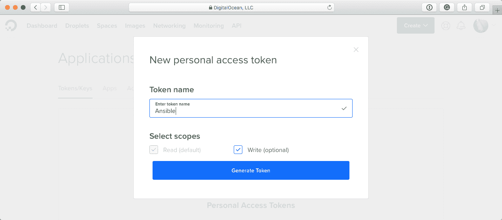
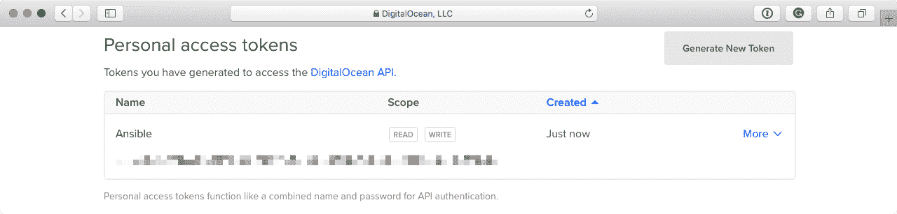
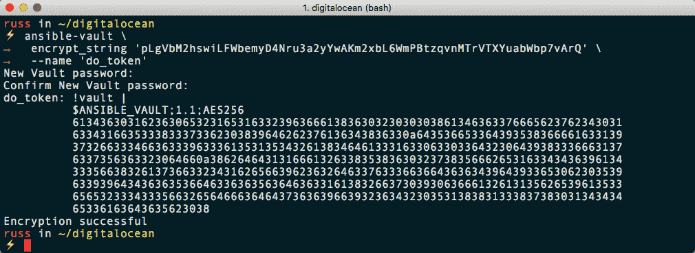
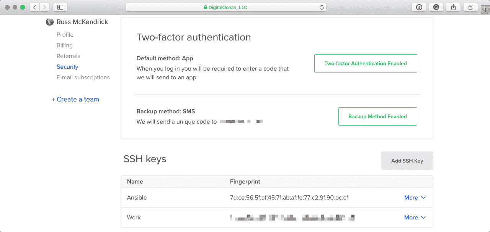
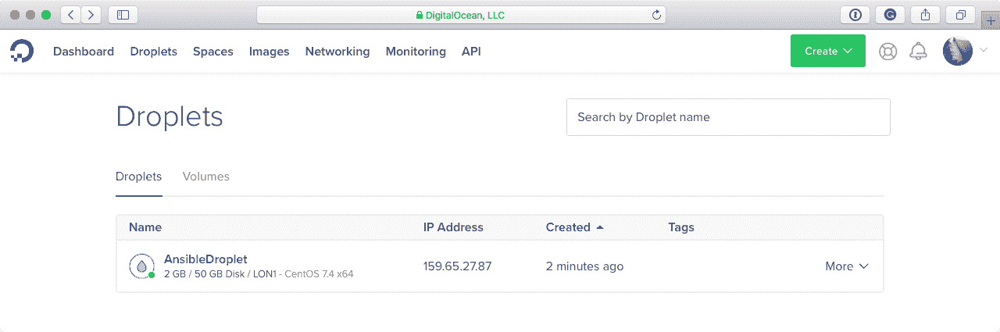
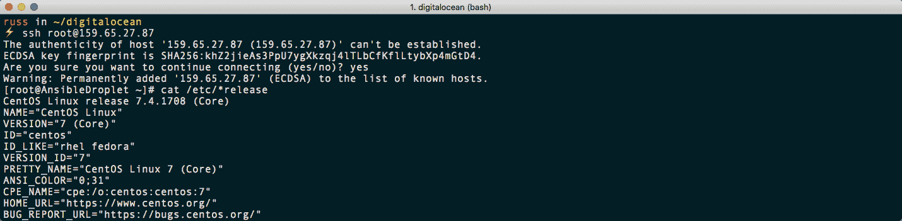
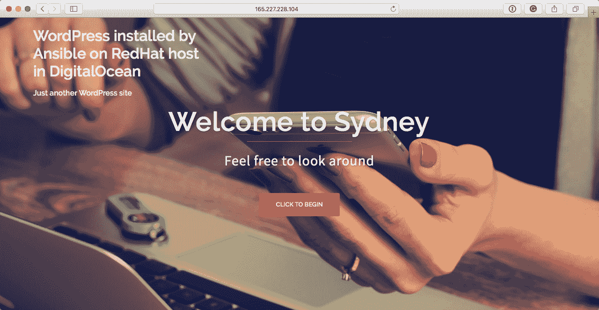

# 转移到云端

在本章中，我们将从使用本地虚拟机转移到使用 Ansible 在公共云提供商中启动实例。在本章中，我们将使用 DigitalOcean，我们选择这个提供商是因为它允许我们简单地启动虚拟机并与其交互，而不需要太多的配置开销。

然后，我们将研究如何调整我们的 WordPress playbook，以便与新启动的实例进行交互。

在本章中，我们将涵盖以下主题：

+   DigitalOcean 的简要介绍

+   在 DigitalOcean 中启动实例

+   如何在本地和远程之间切换运行 Ansible，以便我们可以部署 WordPress

# 技术要求

在本章中，我们将在公共云中启动实例，因此如果您正在跟随操作，您将需要一个 DigitalOcean 账户。与其他章节一样，playbook 的完整版本可以在[`github.com/PacktPublishing/Learn-Ansible/tree/master/Chapter08`](https://github.com/PacktPublishing/Learn-Ansible/tree/master/Chapter08)的`Chapter08`文件夹中找到。

# 与 DigitalOcean 交互

DigitalOcean 成立于 2011 年，从一个典型的虚拟专用服务器主机发展成为一个拥有全球数据中心的开发者友好的云服务提供商。Netcraft 指出，2012 年 12 月，DigitalOcean 托管了大约 100 个面向 Web 的服务器；到 2018 年 3 月，这个数字超过了 400,000 个，使 DigitalOcean 成为第三大面向 Web 的实例主机。

除了价格之外，DigitalOcean 之所以受到开发者的欢迎，还在于其性能；DigitalOcean 是最早提供全固态硬盘（SSD）实例存储的托管公司之一。它有易于使用的基于 Web 的控制面板，可以从命令行界面启动实例，还有强大的 API，允许您从应用程序内启动实例（DigitalOcean 称之为 Droplets），以及诸如 Ansible 之类的工具。

您可以在[`www.digitalocean.com/`](https://www.digitalocean.com/)注册账户。注册后，在进行其他操作之前，我建议您首先在您的账户上配置双因素认证。

双因素认证（2FA）或多因素认证（MFA）为您的账户增加了额外的认证级别。通常，这是通过向与您的账户关联的设备发送短信验证码来实现的，或者将账户链接到第三方认证应用程序（如 Google 或 Microsoft Authenticator）来实现，该应用程序运行在您的智能手机上。与这些服务相关的账户通常需要您输入一个每 30 秒轮换一次的六位数字。

您可以通过转到 DigitalOcean 控制面板中的设置，然后点击左侧菜单中的安全来配置 2FA；一旦进入，按照屏幕上的说明启用您账户上的 2FA。

# 生成个人访问令牌

为了使我们的 playbook 能够在我们的 DigitalOcean 账户中启动 Droplet，我们需要生成一个个人访问令牌以与 DigitalOcean API 进行交互。要做到这一点，请点击 DigitalOcean 基于 Web 的控制面板顶部菜单中的 API 链接。

点击“生成新令牌”按钮将打开以下对话框：



如您所见，我已将我的令牌命名为`Ansible`，以便轻松识别。点击“生成令牌”按钮将创建一个令牌；它只会显示一次，所以请确保您记下来。

任何拥有您个人访问令牌副本的人都可以在您的 DigitalOcean 账户中启动资源；请确保将其保存在安全的地方，不要在任何地方发布您的令牌。

我已经在以下截图中模糊处理了我的令牌，但这应该让您了解在生成个人访问令牌后会看到什么：



现在我们有了令牌，但在开始 playbook 之前，我们还需要配置另一件事。

# 安装 dopy

我们将使用的一个模块需要一个名为`dopy`的 Python 模块；它是 DigitalOcean API 的包装器，可以使用以下`pip`命令进行安装：

```
$ sudo pip install dopy
```

安装了`dopy`之后，我们可以开始编写 playbook。

# 启动 Droplet

根据我们之前编写的 playbooks，您可以通过运行以下命令来创建骨架结构：

```
$ mkdir digitalocean digitalocean/group_vars digitalocean/roles
$ ansible-galaxy init digitalocean/roles/droplet
$ touch digitalocean/production digitalocean/site.yml digitalocean/group_vars/common.yml
```

我们需要完成两个任务来启动我们的 Droplet；首先，我们需要确保我们的公共 SSH 密钥的副本已上传到 DigitalOcean，以便我们可以在第二个任务期间将其注入到我们启动的 Droplet 中。

在我们继续查看启动 Droplet 的角色之前，我们应该弄清楚 playbook 需要访问 DigitalOcean API 的个人访问令牌要做什么。为此，我们将使用 Ansible Vault 对令牌进行编码；运行以下命令，确保用您自己的令牌替换`encrypt_string`的内容：

```
ansible-vault \
 encrypt_string 'pLgVbM2hswiLFWbemyD4Nru3a2yYwAKm2xbL6WmPBtzqvnMTrVTXYuabWbp7vArQ' \
 --name 'do_token'
```

本章中使用的令牌是随机生成的；请确保您用自己的替换它们。

以下截图显示了上述命令的输出：



如您所见，这返回了加密令牌，因此将加密令牌放入`group_vars/common.yml`文件中。在我们填充变量的同时，让我们看看`roles/droplet/defaults/main.yml`的内容应该是什么样的：

```
---
# defaults file for digitalocean/roles/droplet

key:
  name: "Ansible"
  path: "~/.ssh/id_rsa.pub"

droplet:
  name: "AnsibleDroplet"
  region: "lon1"
  size: "s-1vcpu-2gb"
  image: "centos-7-x64"
  timeout: "500"
```

有两个密钥值集合；第一个处理 SSH 密钥，playbook 将上传它，第二个包含启动 Droplet 的信息。我们初始 playbook 运行的默认设置将在 DigitalOcean 伦敦数据中心启动一个 1-CPU 核心、2 GB RAM、50 GB HDD 的 CentOS 7 Droplet。

启动 Droplet 的任务应该在`roles/droplet/tasks/main.yml`中包含两个独立的部分；第一部分处理上传 SSH 密钥，这是必须的，以便我们可以使用它来启动 Droplet：

```
- name: "upload SSH key to DigitalOcean"
  digital_ocean_sshkey:
    oauth_token: "{{ do_token }}"
    name: "{{ key.name }}"
    ssh_pub_key: "{{ item }}"
    state: present
  with_file: "{{ key.path }}"
```

如您所见，此任务使用了我们用 Ansible Vault 加密的令牌；我们还使用了`with_file`指令来复制密钥文件的内容，即`~/.ssh/id_rsa.pub`。根据您在 DigitalOcean 帐户中已有的内容，此任务将执行三种操作中的一种：

+   如果密钥不存在，它将上传它

+   如果一个密钥与`~/.ssh/id_rsa.pub`的指纹匹配但名称不同，那么它将重命名该密钥

+   如果密钥和名称匹配，将不会上传或更改任何内容

现在我们知道我们已经上传了我们的密钥，我们需要知道它的唯一 ID。为了找出这一点，我们应该通过运行以下任务来收集我们在 DigitalOcean 帐户中配置的所有密钥的事实：

```
- name: "gather facts on all of the SSH keys in DigitalOcean"
  digital_ocean_sshkey_facts:
    oauth_token: "{{ do_token }}"
```

这将返回一个名为`ssh_keys`的 JSON 数组，其中包含密钥的名称，密钥的指纹，密钥本身的内容，以及密钥的唯一 ID；这些信息对于我们在 DigitalOcean 帐户中配置的每个密钥都会返回。由于我们只需要知道这些密钥中的一个 ID，我们需要操作结果以将列表过滤为我们上传的单个密钥，然后将 ID 设置为变量。

我们知道，我们有一个存储在`ssh_keys`值中的潜在密钥的 JSON 数组；对我来说，看起来像这样：

```
{
    "fingerprint": "9e:ad:42:e9:86:01:3c:5f:de:11:60:11:e0:11:9e:11",
    "id": 2663259,
    "name": "Work",
    "public_key": "ssh-rsa AAAAB3NzaC1yc2EAAAABIwAAAQEAv2cUTYCHnGcwHYjVh3vu09T6UwLEyXEKDnv3039KStLpQV3H7PvhOIpAbY7Gvxi1t2KyqkOvuBdIat5fdQKzGQMEFZiwlcgWDVQGJBKuMH02w+ceMqNYaD8sZqUO+bQQwkUDt3PuDKoyNRzhcDLsc//Dp6wAwJsw75Voe9bQecI3cWqjT54n+oareqADilQ/nO2cdFdmCEfVJP4CqOmL1QLJQNe46yQoGJWLNa9VPC8/ffmUPnwJRWa9AZRPAQ2vGbDF6meSsFwVUfhtxkn+0bof7PFxrcaycGa3zqt6m1y6o3BDh29eFN94TZf9lUK/nQrXuby2/FhrMBrRcgWE4gQ== russ@work"
},
{
    "fingerprint": "7d:ce:56:5f:af:45:71:ab:af:fe:77:c2:9f:90:bc:cf",
    "id": 19646265,
    "name": "Ansible",
    "public_key": "ssh-rsa AAAAB3NzaC1yc2EAAAADAQABAAABAQDmuoFR01i/Yf3HATl9c3sufJvghTFgYzK/Zt29JiTqWlSQhmXhNNTh6iI6nXuPVhQGQaciWbqya6buncQ3vecISx6+EwsAmY3Mwpz1a/eMiXOgO/zn6Uf79dXcMN2JwpLFoON1f9PR0/DTpEkjwqb+eNLw9ThjH0J994+Pev+m8OrqgReFW36a/kviUYKsHxkXmkgxtPJgwKU90STNab4qyfKEGhi2w/NzECgseeQYs1H3klORaHQybhpXkoCIMmgy9gnzSH7oa2mJqKilVed27xoirkXzWPaAQlfiEE1iup+2xMqWY6Jl9qb8tJHRS+l8UcxTMNaWsQkTysLTgBAZ russ@mckendrick.io"
}
```

您可能已经注意到，我已经执行了 playbook 并上传了我的密钥，以便我可以与您一起完成这个任务。现在我们需要找到名为`key.name`的密钥，对我们来说是`Ansible`，然后返回 ID。为此，我们将添加以下任务：

```
- name: "set the SSH key ID as a fact"
  set_fact:
    pubkey: "{{ item.id }}"
  with_items: "{{ ssh_keys | json_query(key_query) }}"
  vars:
    key_query: "[?name=='{{ key.name }}']"
```

正如你所看到的，我们正在使用`set_fact`模块创建一个名为`pubkey`的键值对；我们正在使用一个项目的 ID，并确保我们返回的只是一个项目，我们正在对我们的数组应用 JSON 查询。这个查询确保只返回包含`key.name`的 JSON 在`with_items`列表中；从这里我们可以取得单个项目的`id`，这使我们可以继续进行第二部分，即启动 Droplet。

现在我们知道要使用的 SSH 密钥的 ID，我们可以继续进行角色的第二部分。以下任务启动 Droplet：

```
- name: "launch the droplet"
  digital_ocean:
    state: "present"
    command: "droplet"
    name: "{{ droplet.name }}"
    unique_name: "yes"
    api_token: "{{ do_token }}"
    size_id: "{{ droplet.size }}"
    region_id: "{{ droplet.region }}"
    image_id: "{{ droplet.image }}"
    ssh_key_ids: [ "{{ pubkey }}" ]
    wait_timeout: "{{ droplet.timeout }}"
  register: droplet
```

使用`digital_ocean`模块启动 Droplet。大多数项目都是不言自明的；然而，有一个重要的选项我们必须设置一个值，那就是`unique_name`。默认情况下，`unique_name`设置为`no`，这意味着如果我们第二次运行我们的 playbook，将创建一个具有与我们启动的第一个 Droplet 完全相同细节的新 Droplet；第三次运行将创建第三个 Droplet。将`unique_name`设置为`yes`将意味着只有一个具有`droplet.name`值的 Droplet 在任一时间处于活动状态。

正如你所看到的，我们正在将任务的输出注册为一个值。关于 Droplet 的一些细节将作为任务执行的一部分返回；Droplet 的 IP 地址就是其中之一，因此我们可以使用它来设置一个事实，然后打印一个带有 IP 地址的消息：

```
- name: "set the droplet IP address as a fact"
  set_fact:
    droplet_ip: "{{ droplet.droplet.ip_address }}"

- name: "print the IP address of the droplet" 
  debug:
    msg: "The IP of the droplet is {{ droplet_ip }}"
```

这完成了基本的 playbook，一旦我们更新了`site.yml`文件，我们就可以运行它。这应该包含以下内容：

```
---

- hosts: localhost
  connection: local
  gather_facts: false

  vars_files:
    - group_vars/common.yml

  roles:
    - roles/droplet
```

正如你所看到的，我们只是使用本地主机，因此不需要调用主机清单文件。

# 运行 playbook

由于我们有一个使用 Vault 加密的值，我们需要运行以下命令来运行 playbook：

```
$ ansible-playbook --vault-id @prompt site.yml
```

这将提示输入你设置的加密 Vault 的密码。一旦输入了密码，play 将运行：

```
PLAY [localhost] *****************************************************************************************************************************

TASK [roles/droplet : upload SSH key to DigitalOcean] ****************************************************************************************
changed: [localhost] => (item=ssh-rsa AAAAB3NzaC1yc2EAAAADAQABAAABAQDmuoFR01i/Yf3HATl9c3sufJvghTFgYzK/Zt29JiTqWlSQhmXhNNTh6iI6nXuPVhQGQaciWbqya6buncQ3vecISx6+EwsAmY3Mwpz1a/eMiXOgO/zn6Uf79dXcMN2JwpLFoON1f9PR0/DTpEkjwqb+eNLw9ThjH0J994+Pev+m8OrqgReFW36a/kviUYKsHxkXmkgxtPJgwKU90STNab4qyfKEGhi2w/NzECgseeQYs1H3klORaHQybhpXkoCIMmgy9gnzSH7oa2mJqKilVed27xoirkXzWPaAQlfiEE1iup+2xMqWY6Jl9qb8tJHRS+l8UcxTMNaWsQkTysLTgBAZ russ@mckendrick.io)

TASK [roles/droplet : gather facts on all of the SSH keys in DigitalOcean] *******************************************************************
ok: [localhost]

TASK [roles/droplet : set the SSH key ID as a fact] ******************************************************************************************
ok: [localhost] => (item={u'public_key': u'ssh-rsa AAAAB3NzaC1yc2EAAAADAQABAAABAQDmuoFR01i/Yf3HATl9c3sufJvghTFgYzK/Zt29JiTqWlSQhmXhNNTh6iI6nXuPVhQGQaciWbqya6buncQ3vecISx6+EwsAmY3Mwpz1a/eMiXOgO/zn6Uf79dXcMN2JwpLFoON1f9PR0/DTpEkjwqb+eNLw9ThjH0J994+Pev+m8OrqgReFW36a/kviUYKsHxkXmkgxtPJgwKU90STNab4qyfKEGhi2w/NzECgseeQYs1H3klORaHQybhpXkoCIMmgy9gnzSH7oa2mJqKilVed27xoirkXzWPaAQlfiEE1iup+2xMqWY6Jl9qb8tJHRS+l8UcxTMNaWsQkTysLTgBAZ russ@mckendrick.io', u'fingerprint': u'7d:ce:56:5f:af:45:71:ab:af:fe:77:c2:9f:90:bc:cf', u'id': 19646265, u'name': u'Ansible'})

TASK [roles/droplet : launch the droplet] ****************************************************************************************************
changed: [localhost]

TASK [roles/droplet : set the droplet IP address as a fact] **********************************************************************************
ok: [localhost]

TASK [roles/droplet : print the IP address of the droplet] ***********************************************************************************
ok: [localhost] => {
 "msg": "The IP of the droplet is 159.65.27.87"
}

PLAY RECAP ***********************************************************************************************************************************
localhost : ok=6 changed=2 unreachable=0 failed=0
```

正如你所看到的，这上传了我的密钥并启动了一个具有 IP 地址`159.65.27.87`的 Droplet（此 IP 现在不再被此 Droplet 使用）。这反映在 DigitalOcean 控制面板中，我们可以看到已添加的密钥：



你还可以在 Droplets 页面上看到 Droplet：



此外，你可以使用`root`用户名 SSH 登录 Droplet：



正如你所看到的，启动和与 DigitalOcean 交互是相对简单的。在继续下一部分之前，在 DigitalOcean 控制面板内销毁你的实例。

# DigitalOcean 上的 WordPress

现在我们有一个启动 Droplet 的 playbook，我们将稍作调整，并在我们启动的 Droplet 上安装 WordPress。为此，复制刚才运行的 playbook 所在的文件夹，并将其命名为`digitalocean-wordpress`。从`Chapter06/lemp-multi/roles`文件夹中复制三个角色，`stack-install`、`stack-config`和`wordpress`。

# 主机清单

我们要更改的第一个文件是名为 production 的主机清单文件；这需要更新为以下内容：

```
[droplets]

[digitalocean:children]
droplets

[digitalocean:vars]
ansible_ssh_user=root
ansible_ssh_private_key_file=~/.ssh/id_rsa
host_key_checking=False
ansible_python_interpreter=/usr/bin/python
```

这里有一个名为`droplets`的空主机组，然后我们为要启动的 Droplet 设置了一些全局变量。暂时不用担心添加实际的主机；我们将在运行 playbook 期间添加它。

# 变量

我们将要覆盖一些默认变量。为此，更新`group_vars/common.yml`文件，确保它读起来像这样，确保你更新`do_token`值以反映你自己的值：

```
do_token: !vault |
          $ANSIBLE_VAULT;1.1;AES256
          63376236316336633631353131313363666463363834524609643522613230653265373236353664
          36653763373961313433373138633933663939452257345733336238353862383432373831393839
          32316262653963333836613332366639333039393066343739303066663262323337613937623533
          3461626330663363330a303538393836613835313166383030636134623530323932303266373134
          35616339376138636530346632345734563457326532376233323930383535303563323634336162
          31386635646636363334393664383633346636616664386539393162333062343964326561343861
          33613265616632656465643664376536653334653532336335306230363834523454245337626631
          33323730636562616631

droplet:
  name: "WordPress"
  region: "lon1"
  size: "s-1vcpu-2gb"
  image: "centos-7-x64"
  timeout: "500"

wordpress:
  domain: "http://{{ hostvars['localhost'].droplet_ip }}/"
  title: "WordPress installed by Ansible on {{ os_family }} host in DigitalOcean"
  username: "ansible"
  password: "AnsiblePasswordForDigitalOcean"
  email: "test@example.com"
  theme: "sydney"
  plugins:
    - "jetpack"
    - "wp-super-cache"
    - "wordpress-seo"
    - "wordfence"
    - "nginx-helper"
```

正如你所看到的，大多数值都是它们的默认值；我们正在更改的四个值是：

+   `droplet.name`：这是对名称的简单更新，这样我们就可以在 DigitalOcean 控制面板中轻松找到我们的实例。

+   `wordpress.domain`：这里的重要变化。正如您所看到的，我们使用了我们在 Ansible 控制器上设置的`droplet_ip`变量。为了使变量对我们的 WordPress 主机可用，我们告诉 Ansible 从 localhost 使用变量。如果我们没有这样做，那么变量就不会被设置；我们将在下一节中看到原因。

+   `wordpress.title`：对我们的 WordPress 站点配置的标题进行了轻微调整，以反映它所托管的位置。

+   `wordpress.password`：更改密码使其更复杂，因为我们在公开可用的 IP 地址上启动。

# playbook

我们接下来要更改的文件是`site.yml`。这个文件需要更新以在本地和我们启动的 Droplet 上运行角色：

```
---

- name: Launch the droplet in DigitalOcean
  hosts: localhost
  connection: local
  gather_facts: True

  vars_files:
    - group_vars/common.yml

  roles:
    - roles/droplet

- name: Install WordPress on the droplet
  hosts: digitalocean
  gather_facts: true

  vars_files:
    - group_vars/common.yml

  roles:
    - roles/stack-install
    - roles/stack-config
    - roles/wordpress
```

我们更新的`site.yml`文件包含两个不同的 play：第一个在我们的 Ansible 控制器上运行，并与 DigitalOcean API 交互以启动 Droplet，第二个 play 然后连接到`digitalocean`组中的主机以安装 WordPress。那么 Ansible 如何知道要连接的主机的 IP 地址呢？

# droplet 角色

我们需要做一个改变，`droplet`角色，可以在`roles/droplet/tasks/main.yml`中找到；这个改变将获取动态分配的 IP 地址，并将其添加到我们的`droplets`主机组中。为此，请替换以下任务：

```
- name: "print the IP address of the droplet" 
  debug:
    msg: "The IP of the droplet is {{ droplet_ip }}"
```

用以下任务替换它：

```
- name: add our droplet to a host group for use in the next step
  add_host:
    name: "{{ droplet_ip }}"
    ansible_ssh_host: "{{ droplet_ip }}"
    groups: "droplets"
```

正如你所看到的，这个任务使用`droplet_ip`变量，并使用`add_host`模块将主机添加到组中。

# 运行 playbook

现在我们已经将 playbook 的所有部分放在一起，我们可以通过运行以下命令启动 Droplet 并安装 WordPress：

```
$ ansible-playbook -i production --vault-id @prompt site.yml
```

启动 Droplet 并执行安装需要一些时间；在最后，您应该在 play 概述中列出 IP 地址，因为 IP 地址用作我们 Droplet 主机的名称。这是我的 playbook 运行的结尾：

```
RUNNING HANDLER [roles/stack-config : restart nginx] *****************************************************************************************
changed: [165.227.228.104]

RUNNING HANDLER [roles/stack-config : restart php-fpm] ***************************************************************************************
changed: [165.227.228.104]

PLAY RECAP ***********************************************************************************************************************************
165.227.228.104 : ok=47 changed=37 unreachable=0 failed=0
localhost : ok=7 changed=1 unreachable=0 failed=0
```

在浏览器中输入 IP 地址应该会呈现出类似以下页面的内容：



您应该能够使用我们在`common.yml`文件中设置的新密码登录。尝试安装 WordPress；当您准备好时，从 DigitalOcean 控制面板内销毁 Droplet。但请记住：保持 Droplet 运行将产生费用。

# 总结

在本章中，我们使用了 Ansible 云模块之一在公共云中启动了我们的第一个实例；正如您所看到的，这个过程相对简单，我们成功在云中启动了计算资源，然后安装了 WordPress，而没有对我们在第五章中涵盖的角色进行任何更改，*部署 WordPress*。

在下一章中，我们将扩展本章涵盖的一些技术，并返回到网络，但与上一章不同，我们在上一章中涵盖了网络设备，我们将研究公共云中的网络。

# 问题

1.  我们需要安装哪个 Python 模块来支持`digital_ocean`模块？

1.  正确还是错误：您应该始终加密诸如 DigitalOcean 个人访问令牌之类的敏感值。

1.  我们使用哪个过滤器来查找我们需要使用的 SSH 密钥的 ID？

1.  解释为什么我们在`digital_ocean`任务中使用了`unique_name`选项。

1.  从另一个 Ansible 主机访问变量的正确语法是什么？

1.  正确还是错误：`add_server`模块用于将我们的 Droplet 添加到主机组。

1.  尝试在 Ubuntu Droplet 上安装 WordPress；要使用的镜像 ID 是`ubuntu-16-04-x64`，不要忘记更改`ansible_python_interpreter`的值。

# 进一步阅读

您可以在[`trends.netcraft.com/www.digitalocean.com/`](http://trends.netcraft.com/www.digitalocean.com/)上阅读有关 DigitalOcean 的 Netcraft 统计的更多详细信息。
