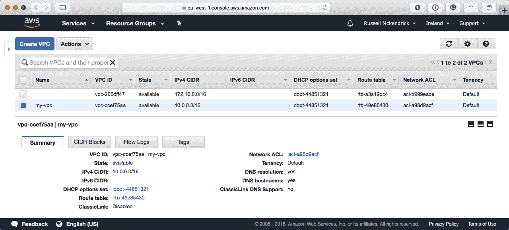
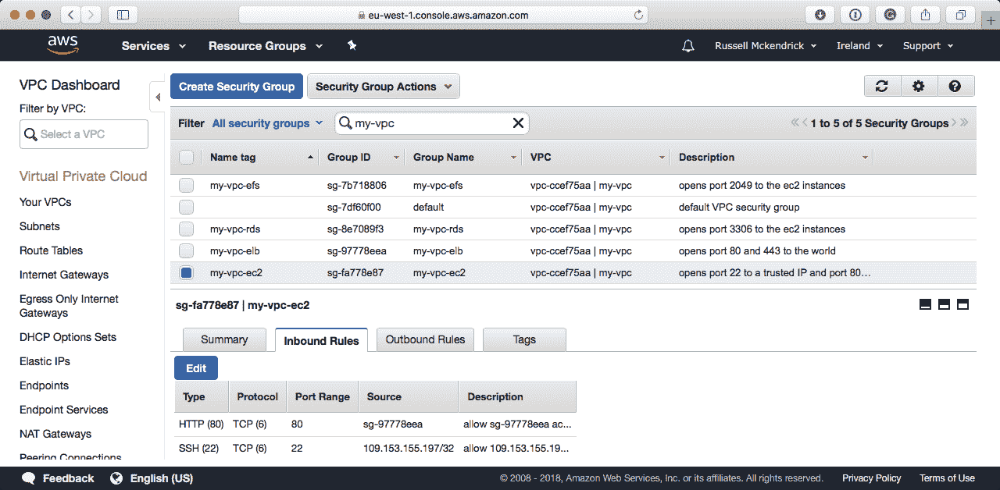

# 构建云网络

现在我们已经在 DigitalOcean 上启动了服务器，我们将继续开始研究在 Amazon Web Services（AWS）内启动服务。

在启动实例之前，我们需要为它们创建一个网络。这称为 VPC，我们需要在 playbook 中汇集一些不同的元素来创建一个 VPC，然后我们就可以用于我们的实例。

在本章中，我们将：

+   介绍 AWS

+   介绍我们试图实现的目标和原因

+   创建 VPC、子网和路由-网络和路由

+   创建安全组-防火墙

+   创建弹性负载均衡（ELB）-负载均衡器

# 技术要求

在本章中，我们将使用 AWS；您需要管理员访问权限才能创建所需的角色，以允许 Ansible 与您的帐户进行交互。与其他章节一样，您可以在附带的 GitHub 存储库的`Chapter09`文件夹中找到完整的 playbooks，网址为[`github.com/PacktPublishing/Learn-Ansible/tree/master/Chapter09/vpc`](https://github.com/PacktPublishing/Learn-Ansible/tree/master/Chapter09/vpc)。

# AWS 简介

AWS 自 2002 年以来一直存在；它开始提供了一些毫不相关的服务，直到 2006 年初才重新推出。重新推出的 AWS 汇集了三项服务：

+   亚马逊弹性计算云（Amazon EC2）：这是 AWS 的计算服务

+   亚马逊简单存储服务（Amazon S3）：亚马逊的可扩展对象存储可访问服务

+   亚马逊简单队列服务（Amazon SQS）：该服务主要为 Web 应用程序提供消息队列

自 2006 年以来，它已经从三项独特的服务发展到了 160 多项，涵盖了 15 个主要领域，例如：

+   计算

+   存储

+   数据库

+   网络和内容传递

+   机器学习

+   分析

+   安全、身份和合规性

+   物联网

在 2018 年 2 月的财报电话会议上，透露出 AWS 在 2017 年的收入为 174.6 亿美元，占亚马逊总收入的 10%；对于一个最初只提供空闲计算时间共享的服务来说，这并不差。

在撰写本文时，AWS 覆盖了 18 个地理区域，总共拥有 54 个可用区域：[`aws.amazon.com/about-aws/global-infrastructure/`](https://aws.amazon.com/about-aws/global-infrastructure/)。

那么 AWS 的成功之处在哪里？不仅在于其覆盖范围，还在于其推出服务的方式。AWS 首席执行官 Andy Jassy 曾经说过：

“我们的使命是使任何开发人员或任何公司都能够在我们的基础设施技术平台上构建他们所有的技术应用。”

作为个人，您可以访问与大型跨国公司和亚马逊自身消费其服务相同的 API、服务、区域、工具和定价模型。这确实使您有自由从小规模开始并大规模扩展。例如，亚马逊 EC2 实例的价格从每月约 4.50 美元的 t2.nano（1 vCPU，0.5G）开始，一直到每月超过 19,000 美元的 x1e.32xlarge（128 vCPU，3,904 GB RAM，两个 1920 GB SSD 存储）-可以看出，有适用于各种工作负载的实例类型。

这两个实例和大多数服务都按照按使用计费，例如 EC2 实例按秒计费，存储按每月每 GB 计费。

# 亚马逊虚拟私有云概述

在本章中，我们将集中讨论启动 Amazon Virtual Private Cloud（Amazon VPC）；这是将容纳我们将在下一章中启动的计算和其他 Amazon 服务的网络层。

我们即将启动的 VPC 概述如下：


正如您所看到的，我们将在**EU-West #1**（爱尔兰）地区启动我们的 VPC；我们将跨越我们的 EC2 实例和**应用弹性负载均衡器**的所有三个可用区。我们将仅使用两个可用区来启动我们的 Amazon **关系数据库服务**（**RDS**）实例，以及两个区域用于**亚马逊弹性文件系统**（**Amazon EFS**）卷。

这意味着我们的 Ansible playbook 需要创建/配置以下内容：

+   一个亚马逊 VPC

+   EC2 实例的三个子网

+   两个用于 Amazon RDS 实例的子网

+   用于 Amazon EFS 卷的两个子网

+   应用负载均衡器的三个子网

+   一个互联网网关

我们还需要配置以下内容：

+   一条允许通过互联网网关访问的路由

+   一个安全组，允许每个人访问应用负载均衡器上的端口`80`（HTTP）和`443`（HTTPS）

+   一个安全组，允许 EC2 实例上的端口`22`（SSH）的受信任来源访问

+   一个安全组，允许应用负载均衡器从 EC2 实例访问端口`80`（HTTP）

+   一个安全组，允许 EC2 实例从 Amazon RDS 实例访问端口`3306`（MySQL）

+   一个安全组，允许 EC2 实例从 Amazon EFS 卷访问端口`2049`（NGF）

这将为我们提供基本网络，允许对除了我们希望公开的应用负载均衡器之外的所有内容进行限制性访问。在我们开始创建部署网络的 Ansible playbook 之前，我们需要获取 AWS API 访问密钥和密钥。

# 创建访问密钥和秘密

为您自己的 AWS 用户创建访问密钥和秘密密钥，以便为 Ansible 提供对您的 AWS 帐户的完全访问权限是完全可能的。

因此，我们将尝试为 Ansible 创建一个用户，该用户只有权限访问我们知道 Ansible 将需要与本章涵盖的任务进行交互的 AWS 部分。我们将为 Ansible 提供以下服务的完全访问权限：

+   亚马逊 VPC

+   亚马逊 EC2

+   亚马逊 RDS

+   亚马逊 EFS

要做到这一点，请登录到 AWS 控制台，该控制台可以在[`console.aws.amazon.com/`](https://console.aws.amazon.com/)找到。登录后，单击顶部菜单中的“服务”。在打开的菜单中，输入`IAM`到搜索框中，然后单击应该是唯一结果的 IAM 管理用户访问和加密密钥。这将带您到一个类似以下内容的页面：


在 IAM 页面上，单击左侧菜单中的“组”；我们将创建一个具有分配权限的组，然后我们将创建一个用户并将其分配给我们的组。

一旦您进入组页面，单击“创建新组”按钮。此过程有三个主要步骤，第一个是设置组名。在提供的空间中，输入组名`Ansible`，然后单击“下一步”按钮。

下一步是我们附加策略的步骤；我们将使用亚马逊提供的策略。选择 AmazonEC2FullAccess，AmazonVPCFullAccess，AmazonRDSFullAccess 和 AmazonElasticFileSystemFullAccess；一旦选择了所有四个，单击“下一步”按钮。

您现在应该在一个页面上，该页面向您概述了您选择的选项；它应该看起来类似以下内容：


当您对您的选择感到满意时，请单击“创建组”按钮，然后单击左侧菜单中的“用户”。

一旦进入用户页面，单击“添加用户”，这将带您到一个页面，您可以在其中配置所需的用户名以及您想要的用户类型。输入以下信息：

+   用户名：在此处输入`Ansible`

+   AWS 访问类型：勾选“程序化访问”旁边的复选框；我们的`Ansible`用户不需要 AWS 管理控制台访问权限，所以不要勾选该选项

现在您应该能够点击“下一步：权限”按钮；这将带您到设置用户权限的页面。由于我们已经创建了组，请从列表中选择`Ansible`组，然后点击“下一步：审阅”，这将带您到您输入的选项的概述页面。如果您对它们满意，然后点击“创建用户”按钮。

这将带您到一个看起来像以下内容的页面（我已经故意模糊了访问密钥 ID）：


如您所见，成功消息告诉您这是您最后一次能够下载凭据，这意味着您将无法再次看到秘密访问密钥。要么点击“显示”按钮并记下密钥，要么点击“下载 .csv”按钮；您将无法恢复秘密访问密钥，只能让其过期并生成一个新的。

现在我们有了一个具有我们需要启动 VPC 的权限的用户的访问密钥 ID 和秘密访问密钥，我们可以开始编写 playbook。

# VPC playbook

首先，我们需要讨论的是如何以安全的方式将访问密钥 ID 和秘密访问密钥传递给 Ansible。由于我将在 GitHub 上的公共存储库中分享最终的 playbook，我不想与世界分享我的 AWS 密钥，因为那可能会很昂贵！通常情况下，如果是私有存储库，我会使用 Ansible Vault 加密密钥，并将其与其他可能敏感的数据（如部署密钥等）一起包含在其中。

在这种情况下，我不想在存储库中包含任何加密信息，因为这意味着人们需要解密它，编辑值，然后重新加密它。幸运的是，Ansible 提供的 AWS 模块允许您在 Ansible 控制器上设置两个环境变量；这些变量将作为 playbook 执行的一部分读取。

要设置变量，请运行以下命令，确保您用自己的访问密钥和秘密替换内容（以下列出的信息仅为占位符值）：

```
$ export AWS_ACCESS_KEY=AKIAI5KECPOTNTTVM3EDA $ export AWS_SECRET_KEY=Y4B7FFiSWl0Am3VIFc07lgnc/TAtK5+RpxzIGTr
```

设置好后，您可以通过运行以下命令查看内容：

```
$ echo $AWS_ACCESS_KEY
```

如您所见，这将显示`AWS_ACCESS_KEY`变量的内容：


现在我们有了一种将凭据传递给 Ansible 的方法，我们可以通过运行以下命令创建 playbook 结构：

```
$ mkdir vpc vpc/group_vars vpc/roles $ touch vpc/production vpc/site.yml vpc/group_vars/common.yml
$ cd vpc
```

现在我们已经有了基本的设置，我们可以开始创建角色；与以前的章节不同，我们将在添加每个角色后运行 playbook，以便我们可以更详细地讨论发生了什么。

# VPC 角色

我们要创建的第一个角色是创建 VPC 本身的角色。我们将在接下来的角色中配置/创建的所有内容都需要托管在一个 VPC 中，因此需要先创建它，然后我们需要收集一些关于它的信息，以便我们可以继续进行 playbook 的其余部分。

要引导角色，请从您的工作文件夹中运行以下命令：

```
$ ansible-galaxy init roles/vpc
```

现在我们有了角色的文件，打开`roles/vpc/tasks/main.yml`并输入以下内容：

```
- name: ensure that the VPC is present
  ec2_vpc_net:
    region: "{{ ec2_region }}"
    name: "{{ environment_name }}"
    state: present
    cidr_block: "{{ vpc_cidr_block }}"
    resource_tags: { "Name" : "{{ environment_name }}", "Environment" : "{{ environment_name }}" }
  register: vpc_info

# - name: print the information we have registered
#   debug:
#     msg: "{{ vpc_info }}"
```

如您所见，我们使用了一个名为`ec2_vpc_net`的 Ansible 模块；这个模块替换了一个名为`ec2_vpc`的模块，后者在 Ansible 2.5 中已被弃用和移除。

我们在任务中使用了三个变量；前两个变量`ec2_region`和`environment_name`应该放在`group_vars/common.yml`中，因为我们将在大多数我们将创建的角色中使用它们：

```
environment_name: "my-vpc"
ec2_region: "eu-west-1"
```

这两个变量都是不言自明的：第一个是我们将用来引用我们将在 AWS 中启动的各种元素的名称，第二个让 Ansible 知道我们想要在哪里创建 VPC。

第三个变量`vpc_cidr_block`应该放在`roles/vpc/defaults/main.yml`文件中：

```
vpc_cidr_block: "10.0.0.0/16"
```

这定义了我们想要使用的 CIDR；`10.0.0.0/16`表示我们想要保留 10.0.0.1 到 10.0.255.254，这给了我们大约 65,534 个可用的 IP 地址范围，这应该足够我们的测试了。

在第一个任务结束时，我们使用注册标志来获取在创建 VPC 过程中捕获的所有内容，并将其注册为一个变量。然后我们使用 debug 模块将这些内容打印到屏幕上。

现在我们有了第一个角色，我们可以在`site.yml`文件中添加一些内容：

```
- name: Create and configure an Amazon VPC
  hosts: localhost
  connection: local
  gather_facts: True

  vars_files:
    - group_vars/common.yml
    - group_vars/firewall.yml
    - group_vars/secrets.yml
    - group_vars/words.yml
    - group_vars/keys.yml

  roles:
    - roles/vpc
```

然后使用以下命令运行 playbook：

```
$ ansible-playbook site.yml
```

这应该给你一个类似下面的输出：

```
[WARNING]: provided hosts list is empty, only localhost is available. Note that the implicit
localhost does not match 'all'

PLAY [Create and configure an Amazon VPC] *******************************************************

TASK [Gathering Facts] **************************************************************************
ok: [localhost]

TASK [roles/vpc : ensure that the VPC is present] ***********************************************
changed: [localhost]

TASK [roles/vpc : print the information we have registered] *************************************
ok: [localhost] => {
 "msg": {
 "changed": true,
 "failed": false,
 "vpc": {
 "cidr_block": "10.0.0.0/16",
 "cidr_block_association_set": [
 {
 "association_id": "vpc-cidr-assoc-1eee5575",
 "cidr_block": "10.0.0.0/16",
 "cidr_block_state": {
 "state": "associated"
 }
 }
 ],
 "classic_link_enabled": false,
 "dhcp_options_id": "dopt-44851321",
 "id": "vpc-ccef75aa",
 "instance_tenancy": "default",
 "is_default": false,
 "state": "available",
 "tags": {
 "Environment": "my-vpc",
 "Name": "my-vpc"
 }
 }
 }
}

PLAY RECAP **************************************************************************************
localhost : ok=3 changed=1 unreachable=0 failed=0
```

检查 AWS 控制台的 VPC 部分应该会显示 VPC 已经创建，并且信息应该与 Ansible 捕获的信息匹配：



如果重新运行 playbook，你会注意到，Ansible 不会再次创建 VPC，而是会认识到已经有一个名为`my-vpc`的 VPC，并且会发现已经存在的 VPC 的信息，并填充`vpc_info`变量。这是有用的，因为我们将在下一个角色中使用收集到的信息。

# 子网角色

现在我们有了 VPC，我们可以开始填充它。我们要配置的第一件事是 10 个子网。如果你还记得，我们需要以下内容：

+   三个 EC2 实例

+   三个 ELB 实例

+   两个 RDS 实例

+   两个 EFS 实例

通过从你的工作目录运行以下命令来创建角色：

```
$ ansible-galaxy init roles/subnets
```

现在，在`roles/subnets/defaults/main.yml`中输入以下内容：

```
the_subnets:
  - { use: 'ec2', az: 'a', subnet: '10.0.10.0/24' }
  - { use: 'ec2', az: 'b', subnet: '10.0.11.0/24' }
  - { use: 'ec2', az: 'c', subnet: '10.0.12.0/24' }
  - { use: 'elb', az: 'a', subnet: '10.0.20.0/24' }
  - { use: 'elb', az: 'b', subnet: '10.0.21.0/24' }
  - { use: 'elb', az: 'c', subnet: '10.0.22.0/24' }
  - { use: 'rds', az: 'a', subnet: '10.0.30.0/24' }
  - { use: 'rds', az: 'b', subnet: '10.0.31.0/24' }
  - { use: 'efs', az: 'b', subnet: '10.0.40.0/24' }
  - { use: 'efs', az: 'c', subnet: '10.0.41.0/24' }
```

正如你所看到的，我们有一个包含子网用途（`ec2`、`elb`、`rds`或`efs`）、子网应该创建在哪个可用区（`a`、`b`或`c`）以及子网本身的变量列表。在这里，我们为每个可用区使用了/24。

像这样分组子网应该消除一些在创建子网时的重复。然而，它并没有完全消除，因为我们可以从`roles/subnets/tasks/main.yml`的内容中看到：

```
- name: ensure that the subnets are present
  ec2_vpc_subnet:
    region: "{{ ec2_region }}"
    state: present
    vpc_id: "{{ vpc_info.vpc.id }}"
    cidr: "{{ item.subnet }}"
    az: "{{ ec2_region }}{{ item.az }}"
    resource_tags: 
      "Name" : "{{ environment_name }}_{{ item.use }}_{{ ec2_region }}{{ item.az }}"
      "Environment" : "{{ environment_name }}"
      "Use" : "{{ item.use }}"
  with_items: "{{ the_subnets }}"
```

任务开始时非常简单：在这里，我们使用`ec2_vpc_subnet`模块通过循环`the_subnets`变量来创建子网。正如你所看到的，我们使用了在上一个角色中注册的变量来正确地将子网部署到我们的 VPC 中；这就是`vpc_info.vpc.id`。

你可能已经注意到，我们没有注册这个任务的结果；这是因为，如果我们这样做了，我们将会得到所有十个子网的信息。相反，我们希望根据子网的用途来分解这些信息。要找出这些信息，我们可以使用`ec2_vpc_subnet_facts`模块来根据我们在创建子网时设置的`Environment`和`Use`标签进行过滤来收集信息：

```
- name: gather information about the ec2 subnets
  ec2_vpc_subnet_facts:
    region: "{{ ec2_region }}"
    filters:
      "tag:Use": "ec2"
      "tag:Environment": "{{ environment_name }}"
  register: subnets_ec2

- name: gather information about the elb subnets
  ec2_vpc_subnet_facts:
    region: "{{ ec2_region }}"
    filters:
      "tag:Use": "elb"
      "tag:Environment": "{{ environment_name }}"
  register: subnets_elb

- name: gather information about the rds subnets
  ec2_vpc_subnet_facts:
    region: "{{ ec2_region }}"
    filters:
      "tag:Use": "rds"
      "tag:Environment": "{{ environment_name }}"
  register: subnets_rds

- name: gather information about the efs subnets
  ec2_vpc_subnet_facts:
    region: "{{ ec2_region }}"
    filters:
      "tag:Use": "efs"
      "tag:Environment": "{{ environment_name }}"
  register: subnets_efs
```

正如你所看到的，这里我们正在过滤使用和注册四组不同的信息：`subnets_ec2`、`subnets_elb`、`subnets_rds`和`subnets_efs`。然而，我们还没有完成，因为我们只想知道子网 ID 而不是关于每个子网的所有信息。

为了做到这一点，我们需要使用`set_fact`模块和一些 Jinja2 过滤：

```
- name: register just the IDs for each of the subnets
  set_fact:
    subnet_ec2_ids: "{{ subnets_ec2.subnets | map(attribute='id') | list  }}"
    subnet_elb_ids: "{{ subnets_elb.subnets | map(attribute='id') | list  }}"
    subnet_rds_ids: "{{ subnets_rds.subnets | map(attribute='id') | list  }}"
    subnet_efs_ids: "{{ subnets_efs.subnets | map(attribute='id') | list  }}"
```

最后，我们可以通过将变量连接在一起来将所有的 ID 打印到屏幕上：

```
# - name: print all the ids we have registered
#   debug:
#     msg: "{{ subnet_ec2_ids + subnet_elb_ids + subnet_rds_ids
      + subnet_efs_ids }}"
```

现在我们已经把角色的所有部分准备好了，让我们运行它。更新`site.yml`文件，使其看起来像下面这样：

```
- name: Create and configure an Amazon VPC
  hosts: localhost
  connection: local
  gather_facts: True

  vars_files:
    - group_vars/common.yml

  roles:
    - roles/vpc
    - roles/subnets
```

然后使用以下命令运行 playbook：

```
$ ansible-playbook site.yml
```

在运行 playbook 之前，我在 VPC 角色中注释掉了`debug`任务。你的输出应该看起来像接下来的输出；你可能已经注意到，VPC 角色返回了一个`ok`，因为我们的 VPC 已经存在：

```
[WARNING]: provided hosts list is empty, only localhost is available. Note that the implicit localhost does not match 'all'

PLAY [Create and configure an Amazon VPC] *******************************************************

TASK [Gathering Facts] **************************************************************************
ok: [localhost]

TASK [roles/vpc : ensure that the VPC is present] ***********************************************
ok: [localhost]

TASK [roles/subnets : ensure that the subnets are present] **************************************
changed: [localhost] => (item={u'subnet': u'10.0.10.0/24', u'use': u'ec2', u'az': u'a'})
changed: [localhost] => (item={u'subnet': u'10.0.11.0/24', u'use': u'ec2', u'az': u'b'})
changed: [localhost] => (item={u'subnet': u'10.0.12.0/24', u'use': u'ec2', u'az': u'c'})
changed: [localhost] => (item={u'subnet': u'10.0.20.0/24', u'use': u'elb', u'az': u'a'})
changed: [localhost] => (item={u'subnet': u'10.0.21.0/24', u'use': u'elb', u'az': u'b'})
changed: [localhost] => (item={u'subnet': u'10.0.22.0/24', u'use': u'elb', u'az': u'c'})
changed: [localhost] => (item={u'subnet': u'10.0.30.0/24', u'use': u'rds', u'az': u'a'})
changed: [localhost] => (item={u'subnet': u'10.0.31.0/24', u'use': u'rds', u'az': u'b'})
changed: [localhost] => (item={u'subnet': u'10.0.40.0/24', u'use': u'efs', u'az': u'b'})
changed: [localhost] => (item={u'subnet': u'10.0.41.0/24', u'use': u'efs', u'az': u'c'})

```

```
TASK [roles/subnets : gather information about the ec2 subnets] *********************************
ok: [localhost]

TASK [roles/subnets : gather information about the elb subnets] *********************************
ok: [localhost]

TASK [roles/subnets : gather information about the rds subnets] *********************************
ok: [localhost]

TASK [roles/subnets : gather information about the efs subnets] *********************************
ok: [localhost]

TASK [roles/subnets : register just the IDs for each of the subnets] ****************************
ok: [localhost]

TASK [roles/subnets : print all the ids we have registered] *************************************
ok: [localhost] => {
 "msg": [
 "subnet-2951e761",
 "subnet-24ea4a42",
 "subnet-fce80ba6",
 "subnet-6744f22f",
 "subnet-64eb083e",
 "subnet-51f15137",
 "subnet-154ef85d",
 "subnet-19e9497f",
 "subnet-4340f60b",
 "subnet-5aea0900"
 ]
}

PLAY RECAP **************************************************************************************
localhost : ok=9 changed=1 unreachable=0 failed=0
```

唯一记录的更改是子网的添加；如果我们再次运行它，那么这也会返回一个`ok`，因为子网已经存在。正如你也可以看到的，我们返回了十个子网 ID，这也反映在 AWS 控制台中：


现在我们有了子网，我们需要确保 EC2 实例可以连接到互联网。

# 互联网网关角色

虽然互联网网关角色只会使用我们在`common.yml`中定义的变量，并通过收集之前任务中的信息，我们应该继续像之前一样继续引导`roles`文件夹：

```
$ ansible-galaxy init roles/gateway
```

在这个角色中，我们将使用两个模块；第一个模块`ec2_vpc_igw`创建互联网网关并对其进行标记：

```
- name: ensure that there is an internet gateway
  ec2_vpc_igw:
    region: "{{ ec2_region }}"
    vpc_id: "{{ vpc_info.vpc.id }}"
    state: present
    tags:
      "Name": "{{ environment_name }}_internet_gateway"
      "Environment": "{{ environment_name }}"
      "Use": "gateway"
  register: igw_info
```

然后我们将已注册的关于互联网网关的信息打印到屏幕上：

```
# - name: print the information we have registered
#   debug:
#     msg: "{{ igw_info }}"
```

在最终使用第二个模块`ec2_vpc_route_table`之前，我们创建一个路由，将所有目的地为`0.0.0.0/0`的流量发送到新创建的互联网网关，只针对 EC2 子网使用我们在之前角色中创建的 ID 列表：

```
- name: check that we can route through internet gateway
  ec2_vpc_route_table:
    region: "{{ ec2_region }}"
    vpc_id: "{{ vpc_info.vpc.id }}"
    subnets: "{{ subnet_ec2_ids + subnet_elb_ids }}"
    routes:
      - dest: 0.0.0.0/0
        gateway_id: "{{ igw_info.gateway_id }}"
    resource_tags:
      "Name": "{{ environment_name }}_outbound"
      "Environment": "{{ environment_name }}"
```

将角色添加到`site.yml`文件中：

```
- name: Create and configure an Amazon VPC
  hosts: localhost
  connection: local
  gather_facts: True

  vars_files:
    - group_vars/common.yml

  roles:
    - roles/vpc
    - roles/subnets
    - roles/gateway
```

然后运行 playbook：

```
$ ansible-playbook site.yml
```

此时，由于我们已经运行了 playbook 三次，我应该快速提到`警告`。这是因为我们没有使用清单文件，而是在我们的`site.yml`文件的顶部定义了`localhost`。你应该收到类似以下输出的内容；我已经注释掉了之前角色中的调试任务：

```
[WARNING]: provided hosts list is empty, only localhost is available. Note that the implicit localhost does not match 'all'

PLAY [Create and configure an Amazon VPC] *******************************************************

TASK [Gathering Facts] **************************************************************************
ok: [localhost]

TASK [roles/vpc : ensure that the VPC is present] ***********************************************
ok: [localhost]

TASK [roles/subnets : ensure that the subnets are present] **************************************
ok: [localhost] => (item={u'subnet': u'10.0.10.0/24', u'use': u'ec2', u'az': u'a'})
ok: [localhost] => (item={u'subnet': u'10.0.11.0/24', u'use': u'ec2', u'az': u'b'})
ok: [localhost] => (item={u'subnet': u'10.0.12.0/24', u'use': u'ec2', u'az': u'c'})
ok: [localhost] => (item={u'subnet': u'10.0.20.0/24', u'use': u'elb', u'az': u'a'})
ok: [localhost] => (item={u'subnet': u'10.0.21.0/24', u'use': u'elb', u'az': u'b'})
ok: [localhost] => (item={u'subnet': u'10.0.22.0/24', u'use': u'elb', u'az': u'c'})
ok: [localhost] => (item={u'subnet': u'10.0.30.0/24', u'use': u'rds', u'az': u'a'})
ok: [localhost] => (item={u'subnet': u'10.0.31.0/24', u'use': u'rds', u'az': u'b'})
ok: [localhost] => (item={u'subnet': u'10.0.40.0/24', u'use': u'efs', u'az': u'b'})
ok: [localhost] => (item={u'subnet': u'10.0.41.0/24', u'use': u'efs', u'az': u'c'})

TASK [roles/subnets : gather information about the ec2 subnets] *********************************
ok: [localhost]

```

```
TASK [roles/subnets : gather information about the elb subnets] *********************************
ok: [localhost]

TASK [roles/subnets : gather information about the rds subnets] *********************************
ok: [localhost]

TASK [roles/subnets : gather information about the efs subnets] *********************************
ok: [localhost]

TASK [roles/subnets : register just the IDs for each of the subnets] ****************************
ok: [localhost]

TASK [roles/gateway : ensure that there is an internet gateway] *********************************
changed: [localhost]

TASK [roles/gateway : print the information we have registered] *********************************
ok: [localhost] => {
 "msg": {
 "changed": true,
 "failed": false,
 "gateway_id": "igw-a74235c0",
 "tags": {
 "Environment": "my-vpc",
 "Name": "my-vpc_internet_gateway",
 "Use": "gateway"
 },
 "vpc_id": "vpc-ccef75aa"
 }
}

TASK [roles/gateway : check that we can route through internet gateway] *************************
changed: [localhost]

PLAY RECAP **************************************************************************************
localhost : ok=11 changed=2 unreachable=0 failed=0
```

回到 AWS 控制台。你应该能够查看到互联网网关：


在上面的截图中，你可以看到默认的 VPC 互联网网关，以及我们使用 Ansible 创建的互联网网关。你还可以看到我们创建的路由表：


在这里，你可以看到 Ansible 配置的路由，以及我们创建 VPC 时创建的默认路由。这个默认路由被设置为主要路由，并允许在我们之前添加的所有子网之间进行路由。

接下来，我们需要向我们的 VPC 添加一些安全组。

# 安全组角色

我们在这个角色中有一些不同的目标。第一个目标很简单：创建一个安全组，将端口`80`和`443`对外开放，或者在 IP 术语中是`0.0.0.0/0`。第二个目标是创建一个允许 SSH 访问的规则，但只允许我们访问，第三个目标是确保只有我们的 EC2 实例可以连接到 RDS 和 EFS。

第一个目标很容易，因为`0.0.0.0/0`是一个已知的数量，其他的就不那么容易了。我们的 IP 地址经常会变化，所以我们不想硬编码它。而且，我们还没有启动任何 EC2 实例，所以我们不知道它们的 IP 地址。

让我们引导这个角色并创建第一组规则：

```
$ ansible-galaxy init roles/securitygroups
```

我们将使用`ec2_group`模块在`roles/securitygroups/tasks/main.yml`中创建我们的第一个组：

```
- name: provision elb security group
  ec2_group:
    region: "{{ ec2_region }}"
    vpc_id: "{{ vpc_info.vpc.id }}"
    name: "{{ environment_name }}-elb"
    description: "opens port 80 and 443 to the world"
    tags:
      "Name": "{{ environment_name }}-elb"
      "Environment": "{{ environment_name }}"
    rules:
      - proto: "tcp"
        from_port: "80"
        to_port: "80"
        cidr_ip: "0.0.0.0/0"
        rule_desc: "allow all on port 80"
      - proto: "tcp"
        from_port: "443"
        to_port: "443"
        cidr_ip: "0.0.0.0/0"
        rule_desc: "allow all on port 443"
  register: sg_elb
```

在这里，我们创建了一个名为`my-vpc-elb`的规则，对其进行标记，然后将端口`80`和`443`对`0.0.0.0/0`开放。正如你所看到的，当你知道源 IP 地址很直接的时候，添加规则就很容易。现在让我们来看看为 EC2 实例添加规则；这个有点不同。

首先，我们不想让每个人都能访问我们实例上的 SSH，所以我们需要知道我们 Ansible 控制器的 IP 地址。为了做到这一点，我们将使用`ipify_facts`模块。

ipify 是一个免费的 web API，简单地返回你用来查询 API 的设备的当前公共 IP 地址。

正如接下来的任务所示，我们正在调用 ipify 的 API，然后设置一个包含 IP 地址的事实，然后将 IP 地址打印到屏幕上：

```
- name: find out your current public IP address using https://ipify.org/
  ipify_facts:
  register: public_ip

- name: set your public ip as a fact
  set_fact:
    your_public_ip: "{{ public_ip.ansible_facts.ipify_public_ip }}/32"

# - name: print your public ip address
#   debug:
#     msg: "Your public IP address is {{ your_public_ip }}"
```

现在我们知道要允许访问端口`22`的 IP 地址，我们可以创建一个名为`my-vpc-ec2`的规则：

```
- name: provision ec2 security group
  ec2_group:
    region: "{{ ec2_region }}"
    vpc_id: "{{ vpc_info.vpc.id }}"
    name: "{{ environment_name }}-ec2"
    description: "opens port 22 to a trusted IP and port 80 to the elb group"
    tags:
      "Name": "{{ environment_name }}-ec2"
      "Environment": "{{ environment_name }}"
    rules:
      - proto: "tcp"
        from_port: "22"
        to_port: "22"
        cidr_ip: "{{ your_public_ip }}"
        rule_desc: "allow {{ your_public_ip }} access to port 22"
      - proto: "tcp"
        from_port: "80"
        to_port: "80"
        group_id: "{{ sg_elb.group_id }}"
        rule_desc: "allow {{ sg_elb.group_id }} access to port 80"
  register: sg_ec2
```

在`my-vpc-ec2`安全组中还有第二个规则；这个规则允许来自具有`my-vpc-elb`安全组附加的任何源的端口`80`的访问，而在我们的情况下，这将只是 ELB。这意味着任何人访问我们的 EC2 实例上的端口`80`的唯一方式是通过 ELB。

我们将使用相同的原则来创建 RDS 和 EFS 组，这次只允许访问端口`3306`和`2049`的实例在`my-vpc-ec2`安全组中：

```
- name: provision rds security group
  ec2_group:
    region: "{{ ec2_region }}"
    vpc_id: "{{ vpc_info.vpc.id }}"
    name: "{{ environment_name }}-rds"
    description: "opens port 3306 to the ec2 instances"
    tags:
      "Name": "{{ environment_name }}-rds"
      "Environment": "{{ environment_name }}"
    rules:
      - proto: "tcp"
        from_port: "3306"
        to_port: "3306"
        group_id: "{{ sg_ec2.group_id }}"
        rule_desc: "allow {{ sg_ec2.group_id }} access to port 3306"
  register: sg_rds

- name: provision efs security group
  ec2_group:
    region: "{{ ec2_region }}"
    vpc_id: "{{ vpc_info.vpc.id }}"
    name: "{{ environment_name }}-efs"
    description: "opens port 2049 to the ec2 instances"
    tags:
      "Name": "{{ environment_name }}-efs"
      "Environment": "{{ environment_name }}"
    rules:
      - proto: "tcp"
        from_port: "2049"
        to_port: "2049"
        group_id: "{{ sg_ec2.group_id }}"
        rule_desc: "allow {{ sg_ec2.group_id }} access to port 2049"
  register: sg_efs
```

现在我们已经创建了我们的主要组，让我们添加一个`debug`任务，将安全组 ID 打印到屏幕上：

```
# - name: print all the ids we have registered
#   debug:
#     msg: "ELB = {{ sg_elb.group_id }}, EC2 = {{ sg_ec2.group_id }}, RDS = {{ sg_rds.group_id }} and EFS = {{ sg_efs.group_id }}"
```

现在我们有了完整的角色，我们可以运行 playbook。记得在`site.yml`文件中添加`- roles/securitygroups`：

```
$ ansible-playbook site.yml
```

同样，我已经注释掉了`securitygroups`角色之外的`debug`模块的任何输出：

```
[WARNING]: provided hosts list is empty, only localhost is available. Note that the implicit localhost does not match 'all'

PLAY [Create and configure an Amazon VPC] *******************************************************

TASK [Gathering Facts] **************************************************************************
ok: [localhost]

TASK [roles/vpc : ensure that the VPC is present] ***********************************************
ok: [localhost]

TASK [roles/subnets : ensure that the subnets are present] **************************************
ok: [localhost] => (item={u'subnet': u'10.0.10.0/24', u'use': u'ec2', u'az': u'a'})
ok: [localhost] => (item={u'subnet': u'10.0.11.0/24', u'use': u'ec2', u'az': u'b'})
ok: [localhost] => (item={u'subnet': u'10.0.12.0/24', u'use': u'ec2', u'az': u'c'})
ok: [localhost] => (item={u'subnet': u'10.0.20.0/24', u'use': u'elb', u'az': u'a'})
ok: [localhost] => (item={u'subnet': u'10.0.21.0/24', u'use': u'elb', u'az': u'b'})
ok: [localhost] => (item={u'subnet': u'10.0.22.0/24', u'use': u'elb', u'az': u'c'})
ok: [localhost] => (item={u'subnet': u'10.0.30.0/24', u'use': u'rds', u'az': u'a'})
ok: [localhost] => (item={u'subnet': u'10.0.31.0/24', u'use': u'rds', u'az': u'b'})
ok: [localhost] => (item={u'subnet': u'10.0.40.0/24', u'use': u'efs', u'az': u'b'})
ok: [localhost] => (item={u'subnet': u'10.0.41.0/24', u'use': u'efs', u'az': u'c'})

TASK [roles/subnets : gather information about the ec2 subnets] *********************************
ok: [localhost]

TASK [roles/subnets : gather information about the elb subnets] *********************************
ok: [localhost]

TASK [roles/subnets : gather information about the rds subnets] *********************************
ok: [localhost]

TASK [roles/subnets : gather information about the efs subnets] *********************************
ok: [localhost]

TASK [roles/subnets : register just the IDs for each of the subnets] ****************************
ok: [localhost]

TASK [roles/gateway : ensure that there is an internet gateway] *********************************
ok: [localhost]

TASK [roles/gateway : check that we can route through internet gateway] *************************
ok: [localhost]

TASK [roles/securitygroups : provision elb security group] **************************************
changed: [localhost]

TASK [roles/securitygroups : find out your current public IP address using https://ipify.org/] **
ok: [localhost]

```

```
TASK [roles/securitygroups : set your public ip as a fact] **************************************
ok: [localhost]

TASK [roles/securitygroups : print your public ip address] **************************************
ok: [localhost] => {
 "msg": "Your public IP address is 109.153.155.197/32"
}

TASK [roles/securitygroups : provision ec2 security group] **************************************
changed: [localhost]

TASK [roles/securitygroups : provision rds security group] **************************************
changed: [localhost]

TASK [roles/securitygroups : provision efs security group] **************************************
changed: [localhost]

TASK [roles/securitygroups : print all the ids we have registered] ******************************
ok: [localhost] => {
 "msg": "ELB = sg-97778eea, EC2 = sg-fa778e87, RDS = sg-8e7089f3 and EFS = sg-7b718806"
}

PLAY RECAP **************************************************************************************
localhost : ok=18 changed=4 unreachable=0 failed=0
```

您可以在 AWS 控制台中查看 Ansible 创建的组。在下面的截图中，您可以看到`my-vpc-ec2`安全组：



现在我们已经配置了基本的 VPC，我们可以开始在其中启动服务，首先是 Application Load Balancer。

# ELB 角色

在本章中，我们将要查看的最后一个角色是启动 Application Load Balancer 的角色。嗯，它创建了一个目标组，然后将其附加到 Application Load Balancer 上。我们将使用这个角色创建的负载均衡器很基本；在后面的章节中，我们将会更详细地介绍。

与其他角色一样，我们首先需要引导文件：

```
$ ansible-galaxy init roles/elb
```

现在打开`roles/elb/tasks/main.yml`并使用`elb_target_group`模块创建目标组：

```
- name: provision the target group
  elb_target_group:
    name: "{{ environment_name }}-target-group"
    region: "{{ ec2_region }}"
    protocol: "http"
    port: "80"
    deregistration_delay_timeout: "15"
    vpc_id: "{{ vpc_info.vpc.id }}"
    state: "present"
    modify_targets: "false"
```

正如你所看到的，我们正在在我们的 VPC 中创建目标组，并将其命名为`my-vpc-target-group`。现在我们有了目标组，我们可以使用`elb_application_lb`模块启动 Application Elastic Balancer：

```
- name: provision an application elastic load balancer
  elb_application_lb:
    region: "{{ ec2_region }}"
    name: "{{ environment_name }}-elb"
    security_groups: "{{ sg_elb.group_id }}"
    subnets: "{{ subnet_elb_ids }}"
    listeners:
      - Protocol: "HTTP" 
        Port: "80"
        DefaultActions:
          - Type: "forward" 
            TargetGroupName: "{{ environment_name }}-target-group"
    state: present
  register: loadbalancer
```

在这里，我们正在为我们的 VPC 中的 Application Load Balancer 创建一个名为`my-vpc-elb`的负载均衡器；我们正在传递我们使用`subnet_elb_ids`创建的 ELB 子网的 ID。我们还使用`sg_elb.group_id`将 ELB 安全组添加到负载均衡器，并在端口`80`上配置一个侦听器，将流量转发到`my-vpc-target-group`。

任务的最后部分打印了我们关于 ELB 的信息：

```
# - name: print the information on the load balancer we have registered
#   debug:
#     msg: "{{ loadbalancer }}"
```

这完成了我们的最终角色；更新`site.yml`文件，使其如下所示：

```
- name: Create and configure an Amazon VPC
  hosts: localhost
  connection: local
  gather_facts: True

  vars_files:
    - group_vars/common.yml

  roles:
    - roles/vpc
    - roles/subnets
    - roles/gateway
    - roles/securitygroups
    - roles/elb
```

我们现在可以通过运行以下命令最后一次运行我们的 playbook：

```
$ ansible-playbook site.yml
```

你可能猜到了 playbook 运行的输出将如下所示：

```
[WARNING]: provided hosts list is empty, only localhost is available. Note that the implicit localhost does not match 'all'

PLAY [Create and configure an Amazon VPC] *******************************************************

TASK [Gathering Facts] **************************************************************************
ok: [localhost]

TASK [roles/vpc : ensure that the VPC is present] ***********************************************
ok: [localhost]

TASK [roles/subnets : ensure that the subnets are present] **************************************
ok: [localhost] => (item={u'subnet': u'10.0.10.0/24', u'use': u'ec2', u'az': u'a'})
ok: [localhost] => (item={u'subnet': u'10.0.11.0/24', u'use': u'ec2', u'az': u'b'})
ok: [localhost] => (item={u'subnet': u'10.0.12.0/24', u'use': u'ec2', u'az': u'c'})
ok: [localhost] => (item={u'subnet': u'10.0.20.0/24', u'use': u'elb', u'az': u'a'})
ok: [localhost] => (item={u'subnet': u'10.0.21.0/24', u'use': u'elb', u'az': u'b'})
ok: [localhost] => (item={u'subnet': u'10.0.22.0/24', u'use': u'elb', u'az': u'c'})
ok: [localhost] => (item={u'subnet': u'10.0.30.0/24', u'use': u'rds', u'az': u'a'})
ok: [localhost] => (item={u'subnet': u'10.0.31.0/24', u'use': u'rds', u'az': u'b'})
ok: [localhost] => (item={u'subnet': u'10.0.40.0/24', u'use': u'efs', u'az': u'b'})
ok: [localhost] => (item={u'subnet': u'10.0.41.0/24', u'use': u'efs', u'az': u'c'})

TASK [roles/subnets : gather information about the ec2 subnets] *********************************
ok: [localhost]

TASK [roles/subnets : gather information about the elb subnets] *********************************
ok: [localhost]

TASK [roles/subnets : gather information about the rds subnets] *********************************
ok: [localhost]

TASK [roles/subnets : gather information about the efs subnets] *********************************
ok: [localhost]

TASK [roles/subnets : register just the IDs for each of the subnets] ****************************
ok: [localhost]

TASK [roles/gateway : ensure that there is an internet gateway] *********************************
ok: [localhost]

TASK [roles/gateway : check that we can route through internet gateway] *************************
ok: [localhost]

TASK [roles/securitygroups : provision elb security group] **************************************
ok: [localhost]

TASK [roles/securitygroups : find out your current public IP address using https://ipify.org/] **
ok: [localhost]

TASK [roles/securitygroups : set your public ip as a fact] **************************************
ok: [localhost]

TASK [roles/securitygroups : provision ec2 security group] **************************************
ok: [localhost]

TASK [roles/securitygroups : provision rds security group] **************************************
ok: [localhost]

TASK [roles/securitygroups : provision efs security group] **************************************
ok: [localhost]

TASK [roles/elb : provision the target group] ***************************************************
changed: [localhost]

TASK [roles/elb : provision an application elastic load balancer] *******************************
changed: [localhost]

TASK [roles/elb : print the information on the load balancer we have registered] ****************
ok: [localhost] => {
 "msg": {
 "access_logs_s3_bucket": "",
 "access_logs_s3_enabled": "false",
 "access_logs_s3_prefix": "",
 "attempts": 1,
 "availability_zones": [
 {
 "subnet_id": "subnet-51f15137",
 "zone_name": "eu-west-1a"
 },
 {
 "subnet_id": "subnet-64eb083e",
 "zone_name": "eu-west-1c"
 },
 {
 "subnet_id": "subnet-6744f22f",
 "zone_name": "eu-west-1b"
 }
 ],
 "canonical_hosted_zone_id": "Z32O12XQLNTSW2",
 "changed": true,
 "created_time": "2018-04-22T16:12:31.780000+00:00",
 "deletion_protection_enabled": "false",
 "dns_name": "my-vpc-elb-374523105.eu-west-1.elb.amazonaws.com",
 "failed": false,
 "idle_timeout_timeout_seconds": "60",
 "ip_address_type": "ipv4",
 "listeners": [
 {
 "default_actions": [
 {
 "target_group_arn": "arn:aws:elasticloadbalancing:eu-west-1:687011238589:targetgroup/my-vpc-target-group/d5bab5efb2d314a8",
 "type": "forward"
 }
 ],
 "listener_arn": "arn:aws:elasticloadbalancing:eu-west-1:687011238589:listener/app/my-vpc-elb/98dd881c7a931ab3/3f4be2b480657bf9",
 "load_balancer_arn": "arn:aws:elasticloadbalancing:eu-west-1:687011238589:loadbalancer/app/my-vpc-elb/98dd881c7a931ab3",
 "port": 80,
 "protocol": "HTTP",
 "rules": [
 {
 "actions": [
 {
 "target_group_arn": "arn:aws:elasticloadbalancing:eu-west-1:687011238589:targetgroup/my-vpc-target-group/d5bab5efb2d314a8",
 "type": "forward"
 }
 ],
 "conditions": [],
 "is_default": true,
 "priority": "default",
 "rule_arn": "arn:aws:elasticloadbalancing:eu-west-1:687011238589:listener-rule/app/my-vpc-elb/98dd881c7a931ab3/3f4be2b480657bf9/c70feab5b31460c2"
 }
 ]
 }
 ],
 "load_balancer_arn": "arn:aws:elasticloadbalancing:eu-west-1:687011238589:loadbalancer/app/my-vpc-elb/98dd881c7a931ab3",
 "load_balancer_name": "my-vpc-elb",
 "routing_http2_enabled": "true",
 "scheme": "internet-facing",
 "security_groups": [
 "sg-97778eea"
 ],
 "state": {
 "code": "provisioning"
 },
 "tags": {},
 "type": "application",
 "vpc_id": "vpc-ccef75aa"
 }
}

```

```
PLAY RECAP ******************************************************************************************************************************
localhost : ok=19 changed=2 unreachable=0 failed=0
```

现在您应该能够在 AWS 控制台的 EC2 部分看到 ELB：

虽然 VPC 不会产生任何费用，但 ELB 会；请确保在完成测试后立即删除任何未使用的资源。

这结束了关于 VPC playbook 的本章；我们将在下一章中使用其中的元素，在那里我们将使用 VPC 作为我们安装的基础，将我们的 WordPress 安装部署到 AWS。

# 总结

在本章中，我们已经迈出了使用 Ansible 在公共云中启动资源的下一步。我们通过创建 VPC，设置我们应用程序所需的子网，配置互联网网关，并设置我们的实例通过它路由其出站流量，为自动化一个相当复杂的环境奠定了基础。

我们还配置了四个安全组，其中三个包含动态内容，以在最终在我们的 VPC 中为我们的服务提供安全保障之前，最终配置了一个 ELB。

在下一章中，我们将在本章奠定的基础上构建，并启动一组更复杂的服务。

# 问题

1.  AWS 模块用来读取您的访问 ID 和密钥的两个环境变量是什么？

1.  真或假：每次运行 playbook，您都会得到一个新的 VPC。

1.  说明为什么我们不费心注册创建子网的结果。

1.  在定义安全组规则时，使用`cidr_ip`和`group_id`有什么区别？

1.  真或假：在使用定义了`group_id`的规则时，添加安全组的顺序并不重要。

1.  在现有 VPC 旁边创建第二个 VPC，给它一个不同的名称，并且也让它使用 10.1.0.0/24。

# 进一步阅读

您可以在本章中使用的 AWS 技术的以下链接找到更多详细信息：

+   **AWS**: [`aws.amazon.com/`](https://aws.amazon.com/)

+   **AWS Management Console**: [`aws.amazon.com/console/`](https://aws.amazon.com/console/)

+   **AWS IAM**: [`aws.amazon.com/iam/`](https://aws.amazon.com/iam/)

+   **Amazon VPC**: [`aws.amazon.com/vpc/`](https://aws.amazon.com/vpc/)

+   **ELB**: [`aws.amazon.com/elasticloadbalancing/`](https://aws.amazon.com/elasticloadbalancing/)
