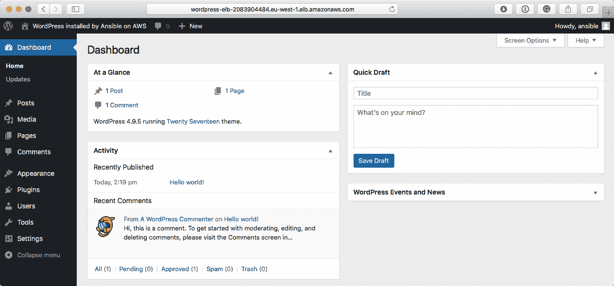

# 第十章：高可用云部署

继续我们的 AWS 部署，我们将开始将服务部署到上一章创建的网络中，并在本章结束时，我们将得到一个高可用的 WordPress 安装，我们将通过删除实例并向站点发送流量来进行测试。

在上一章创建的角色基础上，我们将进行以下操作：

+   启动和配置 Amazon RDS（数据库）

+   启动和配置 Amazon EFS（共享存储）

+   启动和创建**Amazon Machine Image**（**AMI**）（部署 WordPress 代码）

+   启动和配置启动配置和自动扩展组（高可用性）

# 技术要求

与上一章一样，我们将使用 AWS；您将需要在上一章中创建的访问密钥和秘密密钥来启动我们高可用的 WordPress 安装所需的资源。请注意，我们将启动会产生费用的资源。同样，您可以在附带的 GitHub 存储库的`Chapter10`文件夹中找到完整的操作手册[`github.com/PacktPublishing/Learn-Ansible/tree/master/Chapter10/aws-wordpress`](https://github.com/PacktPublishing/Learn-Ansible/tree/master/Chapter10/aws-wordpress)。

# 部署规划

在我们深入操作手册之前，我们应该了解我们试图实现的目标。正如前面提到的，我们将通过添加实例和存储来扩展我们的 AWS VPC 角色。我们更新的图表如下：


在图中，我们有以下内容：

+   3 个 EC2 实例（t2.micro），每个可用区一个

+   2 个 RDS 实例（t2.micro），处于主/备份多 AZ 配置中

+   在三个可用区中共享 5GB 的 EFS 存储

在讨论部署本身之前，基于这里的图表和规格，这个部署将给我们带来多少成本？

# 部署成本

在 EU-West-1 地区运行此部署的成本如下：

| **实例类型** | **# 实例** | **每小时总成本** | **每天总成本** | **每月总成本** |
| --- | --- | --- | --- | --- |
| EC2 实例（t2.micro） | 3 | $0.038 | $0.091 | $27.22 |
| RDS 实例（t2.micro）-主和备份 | 2 | $0.036 | $0.086 | $25.92 |
| 应用负载均衡器 | 1 | $0.033 | $0.80 | $23.90 |
| 5 GB EFS | 1 | $0.002 | £0.06 | $1.65 |
| 总计： | $0.109 | $2.62 | $78.69 |

还会有一些其他小费用，如带宽和存储包含我们软件堆栈的 AMI 的成本。我们可以通过去除一些冗余，禁用多 AZ RDS 实例以及减少 EC2 实例的数量到只有一个来显著减少这些成本；然而，这开始引入了我们部署中的单点故障，这是我们不想要的。

# WordPress 考虑因素和高可用性

到目前为止，我们一直在单个服务器上部署 WordPress，这很好，但是由于我们试图尽可能多地消除部署中的单点故障，这意味着我们必须对如何初始配置和启动我们的部署进行一些思考。

首先，让我们讨论一下我们需要按顺序启动部署的顺序。我们需要按照以下基本顺序启动元素：

+   **VPC、子网、互联网网关、路由和安全组**：这些都是启动我们部署所需的

+   **应用弹性负载均衡器**：我们将使用弹性负载均衡器的公共主机名进行安装，因此需要在开始安装之前启动它

+   **RDS 数据库实例**：重要的是我们的数据库实例在启动安装之前是可用的，因为我们需要创建 WordPress 数据库并引导安装

+   **EFS 存储**：我们需要一些存储空间来在接下来启动的 EC2 实例之间共享

到目前为止，一切都很顺利；然而，这就是我们必须开始考虑 WordPress 的地方。

正如一些人可能从经验中知道的那样，当前版本的 WordPress 实际上并不是为在多个服务器上部署而设计的。有很多技巧和变通方法可以让 WordPress 在这种部署中表现良好；然而，本章并不是关于部署 WordPress 的细节。相反，它是关于如何使用 Ansible 部署多层 Web 应用程序的。

因此，我们将选择最基本的多实例 WordPress 选项，通过在 EFS 卷上部署我们的代码和内容。这意味着我们只需安装我们的 LEMP 堆栈。需要注意的是，这个选项并不是最高性能的，但它将满足我们的需求。

现在回到任务列表。在启动我们的实例时，我们需要做以下事情：

+   启动运行 CentOS 7 的临时 EC2 实例，以便我们可以重用现有 playbook 的部分

+   更新操作系统并安装我们安装和运行 WordPress 所需的软件堆栈、支持工具和配置

+   挂载 EFS 卷并设置正确的权限，并配置它在启动时挂载

+   将临时实例附加到我们的负载均衡器，并安装和配置 WordPress

+   从我们的临时实例创建一个 AMI

+   创建使用我们刚创建的 AMI 的启动配置

+   创建一个自动扩展组并附加启动配置；它还应该将我们的 WordPress 实例注册到弹性负载均衡器

在初始 playbook 执行期间，由于我们创建 AMI，可能会有短暂的停机时间；进一步的 playbook 运行应该重复这个过程，现有的实例继续运行，一旦 AMI 构建完成，它应该与当前实例一起部署，然后一旦新实例注册到弹性负载均衡器并接收流量，当前实例将被终止。这将允许我们更新操作系统软件包和配置而无需任何停机时间——这也将模拟我们部署具有我们代码基础的 AMI；稍后在本章中会详细介绍。

现在我们知道我们要达到什么目标，让我们开始我们的 playbook。

# playbook

playbook 将分为几个部分。在我们开始第一部分之前，让我们创建文件夹结构。与之前的章节一样，我们只需要运行以下命令：

```
$ mkdir aws-wordpress aws-wordpress/group_vars aws-wordpress/roles $ touch aws-wordpress/production aws-wordpress/site.yml aws-wordpress/group_vars/common.yml
```

现在我们的基本结构已经就位，我们可以开始创建角色，首先是网络。

# Amazon VPC

在上一章中，创建底层网络的所有工作都已经完成，这意味着我们只需要将`elb`、`gateway`、`securitygroups`、`subnets`和`vpc`文件夹从之前的 playbook 复制到当前的`roles`文件夹中。

复制后，更新`site.yml`文件，使其读取：

```
- name: Create and configure an Amazon VPC
  hosts: localhost
  connection: local
  gather_facts: True

  vars_files:
    - group_vars/common.yml

  roles:
    - roles/vpc
    - roles/subnets
    - roles/gateway
    - roles/securitygroups
    - roles/elb
```

还要将以下内容添加到`group_vars/common.yml`文件中：

```
---
# the common variables

environment_name: "wordpress"
ec2_region: "eu-west-1"
```

最后，我们需要更新正在创建的子网；为此，请更新`roles/subnets/defaults/main.yml`中的`the_subnets`变量为：

```
the_subnets:
  - { use: 'ec2', az: 'a', subnet: '10.0.10.0/24' }
  - { use: 'ec2', az: 'b', subnet: '10.0.11.0/24' }
  - { use: 'ec2', az: 'c', subnet: '10.0.12.0/24' }
  - { use: 'elb', az: 'a', subnet: '10.0.20.0/24' }
  - { use: 'elb', az: 'b', subnet: '10.0.21.0/24' }
  - { use: 'elb', az: 'c', subnet: '10.0.22.0/24' }
  - { use: 'rds', az: 'a', subnet: '10.0.30.0/24' }
  - { use: 'rds', az: 'b', subnet: '10.0.31.0/24' }
  - { use: 'efs', az: 'a', subnet: '10.0.40.0/24' }
  - { use: 'efs', az: 'b', subnet: '10.0.41.0/24' }
  - { use: 'efs', az: 'c', subnet: '10.0.42.0/24' }
```

正如你所看到的，我们为我们的 EFS 卷添加了一个额外的子网，使其在所有三个可用区可用。稍后会详细介绍原因。然而，这确实展示了我们 playbook 的灵活性，当我们只需要向我们的变量添加一行来创建额外的子网时。

这完成了 playbook 的第一部分；现在我们可以继续前进到一些新的领域并启动我们的 Amazon RDS 实例。

# Amazon RDS

让我们通过运行以下命令来创建角色的文件结构：

```
$ ansible-galaxy init roles/rds
```

现在位置已经确定，让我们讨论一下启动 RDS 实例需要做些什么。首先，我们需要定义一些默认值；将以下内容添加到`roles/rds/defaults/main.yml`文件中：

```
rds:
  db_username: "{{ environment_name }}"
  db_password: "{{ lookup('password', 'group_vars/rds_passwordfile chars=ascii_letters,digits length=30') }}"
  db_name: "{{ environment_name }}"
  app_instance_type: "db.t2.micro"
  engine: "mariadb"
  hdd_size: "5"
  no_of_backups: "7"
  multi_az: "yes"
  wait: "yes"
  wait_time: "1200"
```

一些变量是不言自明的，比如`db_username`、`db_password`和`db_name`，尽管如此，正如你所看到的，我们正在对`db_password`的内容进行一些有趣的处理。我们并没有硬编码密码，而是使用了一个查找插件；这些插件允许 Ansible 读取外部数据，例如文件的内容、Redis、MongoDB 或各种 API。

在我们的情况下，我们正在使用 Ansible 密码查找插件来填充 Ansible 控制器上的一个文件，其中包含一个随机生成的密码；这个文件在后续查找时保持不变，这意味着密码可以被重复使用。Ansible 将生成一个包含字母和数字的 30 个字符长的密码，并将其放在`group_vars/rds_passwordfile`文件中。然后将此文件添加到`.gitignore`文件中，以便我们不会将密码发送到版本控制中。

需要注意的其他事项是，我们正在启动一个 db.t2.micro（`app_instance_type`）MariaDB（`engine`）实例，带有 5GB（`hdd_size`）的存储空间，采用多 AZ 配置（`multi_az`）。我们将保留 7 天的备份（`no_of_backups`），并且在实例首次启动时，我们将等待（`wait`）20 分钟（`wait_time`），直到实例在继续 playbook 的下一部分之前变为可用。

在启动 RDS 实例之前，我们需要做一件事，那就是创建一个 RDS 子网组；这是我们将 RDS 实例与我们在启动 VPC 时创建的子网关联起来的方法。在`roles/rds/tasks/main.yml`中，输入以下内容：

```
- name: create RDS subnet group
  rds_subnet_group:
    region: "{{ ec2_region }}"
    state: present
    name: "{{ environment_name }}_rds_group"
    description: "RDS Group for {{ environment_name }}"
    subnets: "{{ subnet_rds_ids }}"
```

此任务使用我们在`subnets`角色中注册的两个子网的列表，来创建一个名为`wordpress_rds_group`的组。在关联子网组与我们的 RDS 实例时，我们将使用其名称而不是其唯一 ID，因此无需为以后使用注册任务的输出。角色中的下一个，也是最后一个任务是启动 RDS 实例。输入以下`rds_subnet_group`任务：

```
- name: launch the rds instance
  rds:
    region: "{{ ec2_region }}"
    command: "create"
    instance_name: "{{ environment_name }}-rds"
    db_engine: "{{ rds.engine }}"
    size: "{{ rds.hdd_size }}"
    backup_retention: "{{ rds.no_of_backups }}"
    instance_type: "{{ rds.app_instance_type }}"
    multi_zone: "{{ rds.multi_az }}"
    subnet: "{{ environment_name }}_rds_group"
    vpc_security_groups: "{{ sg_rds.group_id }}"
    username: "{{ rds.db_username }}"
    password: "{{ rds.db_password }}"
    db_name: "{{ rds.db_name }}"
    wait: "{{ rds.wait }}"
    wait_timeout: "{{ rds.wait_time }}"
    tags:
      Name: "{{ environment_name }}-rds"
      Environment: "{{ environment_name }}"
```

除了`command`选项外，其他所有内容都是使用变量填充的——这意味着如果我们想要在重用角色时更改实例的任何部分，我们只需将默认变量复制到我们的`group_vars/common.yml`文件中进行覆盖。与 RDS 模块交互时，可以选择几个`command`选项，包括：

+   `create`：这将创建一个 RDS 实例。如果已经存在一个实例，模块将收集有关它的信息

+   `replicate`：这将创建一个你传递给它的 RDS 实例的只读副本

+   `delete`：这将删除 RDS 实例；在实例被删除之前，您可以选择进行快照

+   `facts`：收集有关 RDS 实例的信息

+   `modify`：如果您已更改配置的任何部分，那么这将更新您的实例，要么立即更新，要么在下一个预定的维护窗口期间更新

+   `promote`：这将将您的读取副本之一提升为新的主服务器

+   `snapshot`：这将创建您的 RDS 实例的手动快照

+   `reboot`：这将重新启动命名的 RDS 实例

+   `restore`：这将从命名快照创建一个新的 RDS 实例

当前 RDS 模块存在一些小问题，你可能需要考虑。其中最大的问题是，它目前只允许你启动由磁盘存储支持的 RDS 实例。可以添加一个任务，使用 AWS 命令行工具在实例启动后将存储迁移到通用 SSD；但是在这里我们不会涉及到这一点。

此外，尽管 Amazon Aurora 被列为一个选项，但 Ansible 目前还不支持它。同样，可以创建任务，使用 AWS 命令行工具来创建和配置 Aurora 集群，但如果你想要原生的 Ansible 支持，目前还没有这个运气。

Amazon Aurora 是亚马逊自己的数据库引擎，允许您在亚马逊定制的基于 SSD 的容错和自愈数据库存储集群上运行 MySQL 或 PostgreSQL 数据库。这种定制的存储架构使您可以将数据库扩展到 60TB 以上，而无需中断或重新组织数据集。

Ansible 社区正在进行工作，重构 RDS 模块以支持自定义存储选项，并引入对 Aurora 的本地支持。然而，这仍然是一个正在进行中的工作，尚未包含在当前的 Ansible 发布中（写作时为 2.5）。

这就是我们的 RDS 实例所需要的一切；我们可以继续进行下一个角色了。

# 亚马逊 EFS

创建 EFS 卷只需要三个任务；和之前的角色一样，我们可以使用`ansible-galaxy`命令来创建文件夹和文件结构：

```
$ ansible-galaxy init roles/efs
```

在添加任务之前，我们需要添加一些默认变量和一个模板，所以将以下内容添加到`roles/efs/defaults/main.yml`中：

```
efs:
  wait: "yes"
  wait_time: "1200"
```

现在，在`roles/efs/templates`中创建一个名为`targets.j2`的文件，文件内容应该包含：

```
---

efs_targets:

      - subnet_id: "{{ item }}"
        security_groups: [ "{{ sg_efs.group_id }}" ]

```

正如你所看到的，这个模板正在循环遍历`subnet_efs_ids`变量，以创建一个子网 ID 和安全组的列表，存储在变量名`efs_targets`下；我们很快就会发现为什么需要这个。

`roles/efs/tasks/main.yml`中的第一个任务使用`template`模块读取之前的文件创建一个文件并将其存储在`group_vars`文件夹中，第二个任务使用`include_vars`模块加载文件的内容：

```
- name: generate the efs targets file
  template:
    src: "targets.j2"
```

```
    dest: "group_vars/generated_efs_targets.yml"

- name: load the efs targets
  include_vars: "group_vars/generated_efs_targets.yml"
```

现在我们已经填充并加载了`efs_targets`变量，我们可以添加第三个和最后一个任务；这个任务使用`efs`模块来创建卷：

```
- name: create the efs volume
  efs:
    region: "{{ ec2_region }}"
    state: present
    name: "{{ environment_name }}-efs"
    tags:
        Name: "{{ environment_name }}-efs"
        Environment: "{{ environment_name }}"
    targets: "{{ efs_targets }}"
    wait: "{{ efs.wait }}"
    wait_timeout: "{{ efs.wait_time }}"
```

“那么，为什么要费力创建模板，生成文件，然后加载内容，而不直接使用`with_items`呢？”你可能会问自己。

如果我们使用`with_items`，那么我们的任务将如下所示：

```
- name: create the efs volume
  efs:
    region: "{{ ec2_region }}"
    state: present
    name: "{{ environment_name }}-efs"
    tags:
        Name: "{{ environment_name }}-efs"
        Environment: "{{ environment_name }}"
    targets:
      - subnet_id: "{{ item }}"
        security_groups: [ "{{ sg_efs.group_id }}" ]
    wait: "{{ efs.wait }}"
    wait_timeout: "{{ efs.wait_time }}"
  with_items: "{{ subnet_efs_ids }}"
```

乍一看，这似乎应该可以工作；然而，如果我们看一下`group_vars/generated_efs_targets.yml`生成后的示例，您可能会注意到一个重要的区别：

```
efs_targets:
      - subnet_id: "subnet-0ce64b6a"
        security_groups: [ "sg-695f8b14" ]
      - subnet_id: "subnet-2598747f"
        security_groups: [ "sg-695f8b14" ]
      - subnet_id: "subnet-ee3487a6"
        security_groups: [ "sg-695f8b14" ]
```

从示例中可以看出，我们有三个部分，每个部分都有一个唯一的`subnet_id`对应一个可用区。如果我们使用`with_items`，我们只会有一个部分，并且任务会执行三次，每次都会覆盖之前的目标。当然，我们可以硬编码三个目标，但是如果我们决定在只有两个可用区的地区或者有四个可用区的地区重用角色会怎么样呢？硬编码意味着我们将失去让 Ansible 根据目标的动态结果范围动态适应情况的灵活性。

现在我们的 EFS 角色已经完成，基础知识也已经完成。在我们开始启动 EC2 实例之前，我们可以测试一下我们的 playbook。

# 测试 playbook

正如前面提到的，现在是测试我们已经完成的角色是否按预期工作的好时机。为了做到这一点，打开`site.yml`文件并添加以下内容：

```
---

- name: Create, launch and configure our basic AWS environment
  hosts: localhost
  connection: local
  gather_facts: True

  vars_files:
    - group_vars/common.yml

  roles:
    - roles/vpc
    - roles/subnets
    - roles/gateway
    - roles/securitygroups
    - roles/elb
    - roles/rds
    - roles/efs
```

在运行 playbook 之前，我们需要设置`AWS_ACCESS_KEY`和`AWS_SECRET_KEY`环境变量；为了做到这一点，运行以下命令，用之前章节生成的详细信息替换每个变量的值：

```
$ export AWS_ACCESS_KEY=AKIAI5KECPOTNTTVM3EDA $ export AWS_SECRET_KEY=Y4B7FFiSWl0Am3VIFc07lgnc/TAtK5+RpxzIGTr
```

我们将想要计时我们的 playbook 运行。为了做到这一点，我们可以在`ansible-playbook`命令前加上`time`前缀，这意味着我们需要运行的命令如下：

```
$ time ansible-playbook -i production site.yml
```

不要忘记，我们已经告诉 Ansible 在启动 RDS 实例和创建 EFS 卷之前等待最多 20 分钟，因此初始 playbook 运行可能需要一些时间。

原因是当 RDS 实例启动时，首先创建，然后克隆到备用服务器，最后进行初始备份。只有完成这些步骤后，RDS 实例才被标记为就绪，我们的 playbook 运行才能继续。此外，对于 EFS 卷，我们正在跨三个可用区创建三个卷的集群，因此需要一些时间来配置它们：

```
[WARNING]: provided hosts list is empty, only localhost is available. Note that the implicit
localhost does not match 'all'

PLAY [Create, launch and configure our basic AWS environment] ************************************

TASK [Gathering Facts] **************************************************************************
ok: [localhost]

TASK [roles/vpc : ensure that the VPC is present] ***********************************************
changed: [localhost]

TASK [roles/subnets : ensure that the subnets are present] **************************************
changed: [localhost] => (item={u'subnet': u'10.0.10.0/24', u'use': u'ec2', u'az': u'a'})
changed: [localhost] => (item={u'subnet': u'10.0.11.0/24', u'use': u'ec2', u'az': u'b'})
changed: [localhost] => (item={u'subnet': u'10.0.12.0/24', u'use': u'ec2', u'az': u'c'})
changed: [localhost] => (item={u'subnet': u'10.0.20.0/24', u'use': u'elb', u'az': u'a'})
changed: [localhost] => (item={u'subnet': u'10.0.21.0/24', u'use': u'elb', u'az': u'b'})
changed: [localhost] => (item={u'subnet': u'10.0.22.0/24', u'use': u'elb', u'az': u'c'})
changed: [localhost] => (item={u'subnet': u'10.0.30.0/24', u'use': u'rds', u'az': u'a'})
changed: [localhost] => (item={u'subnet': u'10.0.31.0/24', u'use': u'rds', u'az': u'b'})
changed: [localhost] => (item={u'subnet': u'10.0.40.0/24', u'use': u'efs', u'az': u'a'})
changed: [localhost] => (item={u'subnet': u'10.0.41.0/24', u'use': u'efs', u'az': u'b'})
changed: [localhost] => (item={u'subnet': u'10.0.42.0/24', u'use': u'efs', u'az': u'c'})

TASK [roles/subnets : gather information about the ec2 subnets] *********************************
ok: [localhost]

TASK [roles/subnets : gather information about the elb subnets] *********************************
ok: [localhost]

TASK [roles/subnets : gather information about the rds subnets] *********************************
ok: [localhost]

TASK [roles/subnets : gather information about the efs subnets] *********************************
ok: [localhost]

TASK [roles/subnets : register just the IDs for each of the subnets] ****************************
ok: [localhost]

TASK [roles/gateway : ensure that there is an internet gateway] *********************************
changed: [localhost]

TASK [roles/gateway : check that we can route through internet gateway] *************************
changed: [localhost]

TASK [roles/securitygroups : provision elb security group] **************************************
changed: [localhost]

TASK [roles/securitygroups : find out your current public IP address using https://ipify.org/] *****
ok: [localhost]

TASK [roles/securitygroups : set your public ip as a fact] **************************************
ok: [localhost]

TASK [roles/securitygroups : provision ec2 security group] **************************************
changed: [localhost]

TASK [roles/securitygroups : provision rds security group] **************************************
changed: [localhost]

TASK [roles/securitygroups : provision efs security group] **************************************
changed: [localhost]

TASK [roles/elb : provision the target group] ***************************************************
changed: [localhost]

TASK [roles/elb : provision an application elastic load balancer] *******************************
changed: [localhost]

TASK [roles/rds : create RDS subnet group] ******************************************************
changed: [localhost]

TASK [roles/rds : launch the rds instance] ******************************************************
changed: [localhost]

TASK [roles/efs : generate the efs targets file] ************************************************
changed: [localhost]

TASK [roles/efs : load the efs targets] *********************************************************
ok: [localhost]

TASK [roles/efs : create the efs volume] ********************************************************
changed: [localhost]

PLAY RECAP **************************************************************************************
localhost : ok=23 changed=14 unreachable=0 failed=0
```

从输出中可以看出，playbook 运行如预期般执行。我们可以检查 AWS 控制台，确保一切都已创建，从 VPC 开始：


然后，检查弹性负载均衡器，它可以在 EC2 部分找到：


我们还可以检查我们的 RDS 实例是否正在运行：


然后，我们 playbook 的最后部分是 EFS 卷：


当我运行 playbook 时，它花了 18 分钟多一点，如下面的输出所示：


正如预期的那样，大部分时间是 Ansible 等待 RDS 实例和 EFS 卷准备就绪。

现在我们知道 playbook 可以在没有错误的情况下启动我们的基础架构，我们可以继续进行 playbook 的其余部分。或者我们可以吗？

# 终止资源

正如本章开头已经提到的，我们正在启动资源，当它们运行时会产生费用。由于我们仍在编写 playbook，我们不希望资源在我们工作时空闲下来并累积成本，因此让我们创建一个支持的 playbook，撤消我们刚刚运行的一切。

为此，让我们创建一个名为`remove`的单个角色：

```
$ ansible-galaxy init roles/remove
```

这个角色将使用 Ansible 来删除我们刚刚启动的一切，从而在我们开发 playbook 时保持成本低廉。首先，我们需要向`roles/remove/defaults/main.yml`添加一些默认变量；它们是：

```
wait:
  wait: "yes"
  wait_time: "1200"

vpc_cidr_block: "10.0.0.0/16"
```

`vpc_cidr_block`变量应该与您的 VPC CIDR 匹配。现在，我们可以开始向`roles/remove/tasks/main.yml`添加任务，这将删除我们启动的所有内容。我们将按照资源启动的特定顺序逆向工作，这意味着我们需要按相反的顺序删除它们。所以让我们从 EFS 卷开始：

```
- name: remove the efs shares
  efs:
    region: "{{ ec2_region }}"
    state: absent
    name: "{{ environment_name }}-efs"
    wait: "{{ wait.wait }}"
    wait_timeout: "{{ wait.wait_time }}"
```

这次我们只需要提供一些细节，因为卷已经存在；我们需要给它卷的名称，以及`state`为`absent`。您会注意到我们在继续之前等待卷完全被移除。在这个 playbook 中，我们将有相当多的暂停，以便在继续下一个任务之前，资源完全从 AWS API 中注销。

接下来的几个任务涉及删除 RDS 实例和 RDS 子网组：

```
- name: terminate the rds instance
  rds:
    region: "{{ ec2_region }}"
    command: "delete"
    instance_name: "{{ environment_name }}-rds"
    wait: "{{ wait.wait }}"
    wait_timeout: "{{ wait.wait_time }}"

- name: wait for 2 minutes before continuing
  pause:
    minutes: 2

- name: remove RDS subnet group
  rds_subnet_group:
    region: "{{ ec2_region }}"
    state: absent
    name: "{{ environment_name }}_rds_group"
```

如您所见，我们在 RDS 实例终止和移除 RDS 子网组之间使用`pause`模块暂停了 2 分钟。如果我们去掉这个暂停，那么我们就有可能 RDS 实例没有完全注销，这意味着我们将无法移除子网组，这将导致 playbook 出现错误。

如果在任何阶段 playbook 抛出错误，我们应该能够再次运行它，并且它应该能够从离开的地方继续。尽管在某个时候，我们将无法完全运行 playbook；我会告诉你这是什么时候。

现在 RDS 实例和子网组已被移除，我们可以移除弹性负载均衡器：

```
- name: terminate the application elastic load balancer
  elb_application_lb:
    region: "{{ ec2_region }}"
    name: "{{ environment_name }}-elb"
    state: "absent"

- name: prompt
  pause:
    prompt: "Make sure the elastic load balancer has been terminated before proceeding"
```

您会注意到，这一次虽然再次使用了`pause`模块，但我们没有提供时间段。相反，我们正在指示用户检查 AWS 控制台，然后在弹性负载均衡器被移除后按下一个键。这是因为`elb_application_lb`模块不支持等待资源被移除。

如果您在资源正在被移除的过程中只是按下*Enter*，那么接下来的任务将立即失败，因此需要手动检查。该任务将移除 ELB 目标组：

```
- name: remove the target group
  elb_target_group:
    region: "{{ ec2_region }}"
    name: "{{ environment_name }}-target-group"
    state: "absent"
```

接下来的任务将移除安全组；由于我们有引用其他组的组，因此在移除下一个组之前会有 30 秒的`暂停`：

```
- name: remove the efs security group
  ec2_group:
    region: "{{ ec2_region }}"
    name: "{{ environment_name }}-efs"
    state: "absent"

- name: wait for 30 seconds before continuing
  pause:
    seconds: 30

- name: remove the rds security group
  ec2_group:
    region: "{{ ec2_region }}"
    name: "{{ environment_name }}-rds"
    state: "absent"

- name: wait for 30 seconds before continuing
  pause:
    seconds: 30

- name: remove the ec2 security group
  ec2_group:
    region: "{{ ec2_region }}"
    name: "{{ environment_name }}-ec2"
    state: "absent"

- name: wait for 30 seconds before continuing
  pause:
    seconds: 30

- name: remove the elb security group
  ec2_group:
    region: "{{ ec2_region }}"
    name: "{{ environment_name }}-elb"
    state: "absent"

- name: wait for 30 seconds before continuing
  pause:
    seconds: 30
```

同样，正如你所看到的，我们只需要提供组名和`absent`状态。下一个任务，移除路由表，需要的不仅仅是名字：

```
- name: get some facts on the route table
  ec2_vpc_route_table_facts:
    region: "{{ ec2_region }}"
    filters:
      "tag:Name": "{{ environment_name }}_outbound"
      "tag:Environment": "{{ environment_name }}"
  register: route_table_facts

- name: remove the route table
  ec2_vpc_route_table:
    region: "{{ ec2_region }}"
```

```
    vpc_id: "{{ route_table_facts.route_tables[0].vpc_id }}"
    route_table_id: "{{ route_table_facts.route_tables[0].id }}"
    lookup: "id"
    state: "absent"
  ignore_errors: yes
```

要移除路由表，我们需要知道 VPC ID 和路由表的 ID。为了获取这些信息，我们使用`ec2_vpc_route_table_facts`模块根据`Name`和`Environment`标签来收集数据，这样我们只会移除我们打算移除的内容。这些信息随后传递给`ec2_vpc_route_table`模块，我们指示它使用路由表的 ID 来进行`lookup`。

我们还告诉 Ansible 忽略这里生成的任何错误。原因是如果后续任务出现错误并且我们需要重新运行 playbook，我们需要它能够在 playbook 运行中继续进行，如果此任务已成功运行，它将无法继续进行，因为没有要移除的内容，这本身会生成错误。

接下来的两个任务收集有关 VPC 的信息并移除互联网网关：

```
- name: get some facts on the vpc
  ec2_vpc_net_facts:
    region: "{{ ec2_region }}"
    filters:
      "tag:Name": "{{ environment_name }}"
      "tag:Environment": "{{ environment_name }}"
  register: vpc_facts

- name: ensure that there isn't an internet gateway
  ec2_vpc_igw:
    region: "{{ ec2_region }}"
    state: "absent"
    vpc_id: "{{ vpc_facts.vpcs[0].vpc_id }}"
    tags:
      "Name": "{{ environment_name }}_internet_gateway"
      "Environment": "{{ environment_name }}"
  ignore_errors: yes
```

同样，我们忽略任何生成的错误，以便在需要多次执行时能够继续进行 playbook 运行。该任务使用`ec2_vpc_subnet_facts`模块收集环境中活动的子网信息；然后我们将这些信息注册为`the_subnets`：

```
- name: gather information about the subnets
  ec2_vpc_subnet_facts:
    region: "{{ ec2_region }}"
```

```
    filters:
      "tag:Environment": "{{ environment_name }}"
  register: the_subnets
```

一旦我们获取了子网的信息，我们可以使用它们的 CIDR 块并将`state`设置为`absent`来移除它们：

```
- name: ensure that the subnets are absent
  ec2_vpc_subnet:
    region: "{{ ec2_region }}"
    state: "absent"
    vpc_id: "{{ vpc_facts.vpcs[0].vpc_id }}"
    cidr: "{{ item.cidr_block }}"
  with_items: "{{ the_subnets.subnets }}"
```

此时，如果您运行多次并且成功进行到这一步，playbook 将会生成错误。如果出现错误，您可以手动移除 VPC。

最后，现在我们已经从 VPC 中移除了所有内容，它是空的，这意味着我们可以无错误地移除 VPC 本身：

```
- name: ensure that the VPC is absent
  ec2_vpc_net:
    region: "{{ ec2_region }}"
    name: "{{ environment_name }}"
    state: "absent"
    cidr_block: "{{ vpc_cidr_block }}"
```

现在我们已经完成了我们的角色，我们可以创建一个名为`remove.yml`的 playbook，其中包含以下内容：

```
---

- name: Terminate everything in our basic AWS environment
  hosts: localhost
  connection: local
  gather_facts: True

  vars_files:
    - group_vars/common.yml

  roles:
    - roles/remove
```

现在我们已经准备好移除 AWS 环境的所有部分；要做到这一点，请运行以下命令：

```
$ time ansible-playbook -i production remove.yml
```

不要忘记检查弹性负载均衡器是否已被移除，并在 playbook 运行期间按任意键继续。否则，您将需要等待一段时间。

当我运行 playbook 时，它花了将近 12 分钟：


如果您没有跟随 playbook 的输出，您可以在这里看到`ec2_vpc_subnet_facts`模块收集的所有暂停和子网信息：

```
[WARNING]: provided hosts list is empty, only localhost is available. Note that the implicit
localhost does not match 'all'

PLAY [Terminate everything in our basic AWS environment] *****************************************

TASK [Gathering Facts] **************************************************************************
ok: [localhost]

TASK [roles/remove : remove the efs shares] *****************************************************
changed: [localhost]

TASK [roles/remove : terminate the rds instance] ************************************************
changed: [localhost]

TASK [roles/remove : wait for 2 minutes before continuing] **************************************
Pausing for 120 seconds
(ctrl+C then 'C' = continue early, ctrl+C then 'A' = abort)
ok: [localhost]

TASK [roles/remove : remove RDS subnet group] ***************************************************
changed: [localhost]

TASK [roles/remove : terminate the application elastic load balancer] ***************************
changed: [localhost]

TASK [roles/remove : prompt] ********************************************************************
[roles/remove : prompt]
Make sure the elastic load balancer has been terminated before proceeding:

ok: [localhost]

TASK [roles/remove : remove the target group] ***************************************************
changed: [localhost]

TASK [roles/remove : remove the efs security group] *********************************************
changed: [localhost]

TASK [roles/remove : wait for 30 seconds before continuing] *************************************
Pausing for 30 seconds
(ctrl+C then 'C' = continue early, ctrl+C then 'A' = abort)
ok: [localhost]

TASK [roles/remove : remove the rds security group] *********************************************
changed: [localhost]

TASK [roles/remove : wait for 30 seconds before continuing] *************************************
Pausing for 30 seconds
(ctrl+C then 'C' = continue early, ctrl+C then 'A' = abort)
ok: [localhost]

TASK [roles/remove : remove the ec2 security group] *********************************************
changed: [localhost]

TASK [roles/remove : wait for 30 seconds before continuing] *************************************
Pausing for 30 seconds
(ctrl+C then 'C' = continue early, ctrl+C then 'A' = abort)
ok: [localhost]

TASK [roles/remove : remove the elb security group] *********************************************
changed: [localhost]

TASK [roles/remove : wait for 30 seconds before continuing] *************************************
Pausing for 30 seconds
(ctrl+C then 'C' = continue early, ctrl+C then 'A' = abort)
ok: [localhost]

TASK [roles/remove : get some facts on the route table] *****************************************
ok: [localhost]

TASK [roles/remove : remove the route table] ****************************************************
changed: [localhost]

TASK [roles/remove : get some facts on the vpc] *************************************************
ok: [localhost]

TASK [roles/remove : ensure that there isn't an internet gateway] *******************************
changed: [localhost]

TASK [roles/remove : gather information about the subnets] **************************************
ok: [localhost]

TASK [roles/remove : ensure that the subnets are absent] ****************************************
changed: [localhost] => (item={u'availability_zone': u'eu-west-1b', u'subnet_id': u'subnet-50259618', u'assign_ipv6_address_on_creation': False, u'tags': {u'Environment': u'wordpress', u'Use': u'rds', u'Name': u'wordpress_rds_eu-west-1b'}, u'default_for_az': False, u'state': u'available', u'ipv6_cidr_block_association_set': [], u'vpc_id': u'vpc-7596f013', u'cidr_block': u'10.0.31.0/24', u'available_ip_address_count': 251, u'id': u'subnet-50259618', u'map_public_ip_on_launch': False})
changed: [localhost] => (item={u'availability_zone': u'eu-west-1a', u'subnet_id': u'subnet-80f954e6', u'assign_ipv6_address_on_creation': False, u'tags': {u'Environment': u'wordpress', u'Use': u'elb', u'Name': u'wordpress_elb_eu-west-1a'}, u'default_for_az': False, u'state': u'available', u'ipv6_cidr_block_association_set': [], u'vpc_id': u'vpc-7596f013', u'cidr_block': u'10.0.20.0/24', u'available_ip_address_count': 251, u'id': u'subnet-80f954e6', u'map_public_ip_on_launch': False})
changed: [localhost] => (item={u'availability_zone': u'eu-west-1c', u'subnet_id': u'subnet-499f7313', u'assign_ipv6_address_on_creation': False, u'tags': {u'Environment': u'wordpress', u'Use': u'ec2', u'Name': u'wordpress_ec2_eu-west-1c'}, u'default_for_az': False, u'state': u'available', u'ipv6_cidr_block_association_set': [], u'vpc_id': u'vpc-7596f013', u'cidr_block': u'10.0.12.0/24', u'available_ip_address_count': 251, u'id': u'subnet-499f7313', u'map_public_ip_on_launch': False})
changed: [localhost] => (item={u'availability_zone': u'eu-west-1a', u'subnet_id': u'subnet-74fc5112', u'assign_ipv6_address_on_creation': False, u'tags': {u'Environment': u'wordpress', u'Use': u'ec2', u'Name': u'wordpress_ec2_eu-west-1a'}, u'default_for_az': False, u'state': u'available', u'ipv6_cidr_block_association_set': [], u'vpc_id': u'vpc-7596f013', u'cidr_block': u'10.0.10.0/24', u'available_ip_address_count': 251, u'id': u'subnet-74fc5112', u'map_public_ip_on_launch': False})
changed: [localhost] => (item={u'availability_zone': u'eu-west-1b', u'subnet_id': u'subnet-9f3a89d7', u'assign_ipv6_address_on_creation': False, u'tags': {u'Environment': u'wordpress', u'Use': u'ec2', u'Name': u'wordpress_ec2_eu-west-1b'}, u'default_for_az': False, u'state': u'available', u'ipv6_cidr_block_association_set': [], u'vpc_id': u'vpc-7596f013', u'cidr_block': u'10.0.11.0/24', u'available_ip_address_count': 251, u'id': u'subnet-9f3a89d7', u'map_public_ip_on_launch': False})
changed: [localhost] => (item={u'availability_zone': u'eu-west-1c', u'subnet_id': u'subnet-8e967ad4', u'assign_ipv6_address_on_creation': False, u'tags': {u'Environment': u'wordpress', u'Use': u'efs', u'Name': u'wordpress_efs_eu-west-1c'}, u'default_for_az': False, u'state': u'available', u'ipv6_cidr_block_association_set': [], u'vpc_id': u'vpc-7596f013', u'cidr_block': u'10.0.42.0/24', u'available_ip_address_count': 251, u'id': u'subnet-8e967ad4', u'map_public_ip_on_launch': False})
changed: [localhost] => (item={u'availability_zone': u'eu-west-1a', u'subnet_id': u'subnet-d7fe53b1', u'assign_ipv6_address_on_creation': False, u'tags': {u'Environment': u'wordpress', u'Use': u'efs', u'Name': u'wordpress_efs_eu-west-1a'}, u'default_for_az': False, u'state': u'available', u'ipv6_cidr_block_association_set': [], u'vpc_id': u'vpc-7596f013', u'cidr_block': u'10.0.40.0/24', u'available_ip_address_count': 251, u'id': u'subnet-d7fe53b1', u'map_public_ip_on_launch': False})
changed: [localhost] => (item={u'availability_zone': u'eu-west-1c', u'subnet_id': u'subnet-029b7758', u'assign_ipv6_address_on_creation': False, u'tags': {u'Environment': u'wordpress', u'Use': u'elb', u'Name': u'wordpress_elb_eu-west-1c'}, u'default_for_az': False, u'state': u'available', u'ipv6_cidr_block_association_set': [], u'vpc_id': u'vpc-7596f013', u'cidr_block': u'10.0.22.0/24', u'available_ip_address_count': 251, u'id': u'subnet-029b7758', u'map_public_ip_on_launch': False})
changed: [localhost] => (item={u'availability_zone': u'eu-west-1a', u'subnet_id': u'subnet-ede5488b', u'assign_ipv6_address_on_creation': False, u'tags': {u'Environment': u'wordpress', u'Use': u'rds', u'Name': u'wordpress_rds_eu-west-1a'}, u'default_for_az': False, u'state': u'available', u'ipv6_cidr_block_association_set': [], u'vpc_id': u'vpc-7596f013', u'cidr_block': u'10.0.30.0/24', u'available_ip_address_count': 251, u'id': u'subnet-ede5488b', u'map_public_ip_on_launch': False})
changed: [localhost] => (item={u'availability_zone': u'eu-west-1b', u'subnet_id': u'subnet-ec3e8da4', u'assign_ipv6_address_on_creation': False, u'tags': {u'Environment': u'wordpress', u'Use': u'efs', u'Name': u'wordpress_efs_eu-west-1b'}, u'default_for_az': False, u'state': u'available', u'ipv6_cidr_block_association_set': [], u'vpc_id': u'vpc-7596f013', u'cidr_block': u'10.0.41.0/24', u'available_ip_address_count': 251, u'id': u'subnet-ec3e8da4', u'map_public_ip_on_launch': False})
changed: [localhost] => (item={u'availability_zone': u'eu-west-1b', u'subnet_id': u'subnet-c227948a', u'assign_ipv6_address_on_creation': False, u'tags': {u'Environment': u'wordpress', u'Use': u'elb', u'Name': u'wordpress_elb_eu-west-1b'}, u'default_for_az': False, u'state': u'available', u'ipv6_cidr_block_association_set': [], u'vpc_id': u'vpc-7596f013', u'cidr_block': u'10.0.21.0/24', u'available_ip_address_count': 251, u'id': u'subnet-c227948a', u'map_public_ip_on_launch': False})

TASK [roles/remove : ensure that the VPC is absent] *********************************************
changed: [localhost]

PLAY RECAP **************************************************************************************
localhost : ok=23 changed=13 unreachable=0 failed=0
```

我建议您仔细检查 AWS 控制台上的资源是否已经移除，因为没有人喜欢意外的账单。现在我们已经完成并执行了我们的`remove` playbook，以便我们不会产生不必要的费用，我们可以继续构建我们的高可用 WordPress 安装。

# EC2 实例

现在我们已经拥有了 WordPress 安装所需的所有基本服务，我们可以开始部署计算资源来安装 WordPress。这是一个有趣的地方，因为我们需要在 playbook 中构建逻辑，以便如果我们的站点正在运行，我们可以在没有任何停机时间的情况下部署操作系统更新并推出新的镜像。

但如果这是一个新的部署，我们需要启动一个实例，将其附加到弹性负载均衡器，安装软件堆栈，配置 WordPress，并创建一个我们随后可以在启动配置中使用的镜像，我们需要将其附加到自动扩展组。

虽然这可能看起来很复杂，但将这种逻辑构建到 playbook 中将使其更容易维护和移交给其他人来管理/运行，因为他们不需要担心现有的部署，他们只需要运行 playbook。

# 实例发现

我们将简单地称这个角色为 EC2，所以我们需要运行以下命令来创建角色结构：

```
$ ansible-galaxy init roles/ec2
```

这个角色的主要目标是确保在执行结束时，我们有一个实例，无论是新的还是现有的，然后我们可以在随后的角色中使用它来基于 AMI。

`roles/ec2/defaults/main.yml`中的默认值定义了如果我们的角色发现这是一个新的部署，我们想要使用哪个镜像。对于我们的安装，我们将使用 AWS Marketplace 中由 CentOS 提供的 AMI；这意味着我们可以重用我们的 WordPress 安装 playbook 的大部分内容：

```
image:
  base: "CentOS Linux 7 x86_64*"
  owner: "679593333241"
  root_device: "ebs"
  architecture: "x86_64"
wait_port: "22"
ec2_instance_type: "t2.micro"
```

当我们使用镜像时，我们将更详细地解释为什么我们需要这些信息。现在我们已经有了默认值，我们可以继续进行`roles/ec2/tasks/main.yml`中的任务。

当我们使用自动扩展组启动我们的实例时，它们都将被命名为`wordpress_ec2`，所以我们的 EC2 角色首先要做的事情就是弄清楚我们是否有任何正在运行的实例。为此，我们将使用`ec2_instance_facts`模块来收集任何正在运行并带有名称`wordpress_ec2`的标记的实例的信息：

```
- name: gather facts on any already running instances
  ec2_instance_facts:
    region: "{{ ec2_region }}"
    filters:
      instance-state-name: "running"
      "tag:environment": "{{ environment_name }}"
      "tag:Name": "{{ environment_name }}-ec2"
  register: running_instances
```

虽然我们现在已经获得了任何已经运行的实例的信息，但它实际上并不是我们可以使用的格式，所以让我们将结果添加到一个名为`already_running`的主机组中：

```
- name: add any already running instances to a group
  add_host:
    name: "{{ item.public_dns_name }}"
    ansible_ssh_host: "{{ item.public_dns_name }}"
    groups: "already_running"
  with_items: "{{ running_instances.instances }}"
```

现在，我们留下了一个名为`already_running`的主机组，它可能包含从零到三个主机；我们现在需要计算组中主机的数量，并设置一个包含主机数量的事实：

```
- name: set the number of already running instances as a fact
  set_fact:
    number_of_running_hosts: "{{ groups['already_running'] | length | default(0) }}"
```

在这里，我们使用内置的 Ansible 变量`groups`以及我们的组名；现在我们有了一个主机列表，我们可以通过使用`length`过滤器来计算列表中的项目数。最后，我们说如果列表为空，则默认值应为`0`。

现在我们有一个包含`number_of_running_hosts`的变量，我们现在可以根据需要做出一些决定。

首先，如果`number_of_running_hosts`是`0`，那么我们正在进行新的部署，我们应该运行启动新的 EC2 实例的任务：

```
- name: run the tasks for a new deployment 
  include_tasks: "new_deployment.yml"
  when: number_of_running_hosts|int == 0
```

或者，如果`number_of_running_hosts`大于`1`，那么我们需要选择一个已经运行的实例来使用：

```
- name: run the tasks for an existing deployment 
  include_tasks: "existing_deployment.yml"
  when: number_of_running_hosts|int >= 1
```

让我们来看看这些任务，从新部署时发生的情况开始。

# 新的部署

如果我们正在进行新的部署，那么我们需要执行以下任务：

1.  找到我们正在使用的区域中最新的 CentOS 7 AMI

1.  上传我们的公钥的副本，以便我们可以用它来 SSH 进入实例

1.  使用先前的信息启动一个实例

1.  将新实例添加到主机组

1.  等待 SSH 可用

1.  将我们的实例添加到弹性负载均衡器

所有这些任务都在`roles/ec2/tasks/new_deployment.yml`中定义，所以让我们开始通过查找如何找到正确的 AMI 来进行这些任务。

我们不能简单地在这里提供 AMI ID，因为每个区域都有不同的 ID，而且每个 AMI 都定期更新以确保它被修补。为了解决这个问题，我们可以运行以下任务：

```
- name: search for all of the AMIs in the defined region which match our selection
  ec2_ami_facts:
    region: "{{ ec2_region }}"
    owners: "{{ image.owner }}"
    filters:
      name: "{{ image.base }}"
      architecture: "{{ image.architecture }}"
      root-device-type: "{{ image.root_device }}" 
  register: amiFind

- name: filter the list of AMIs to find the latest one with an EBS backed volume
  set_fact:
    amiSortFilter: "{{ amiFind.images | sort(attribute='creation_date') | last }}"

- name: finally grab AMI ID of the most recent result which matches our base image which is backed by an EBS volume
  set_fact:
    our_ami_id: "{{ amiSortFilter.image_id }}"
```

正如你所看到的，我们首先寻找所有由 CentOS 创建的`x86_64` AMI，名称中带有`CentOS Linux 7 x86_64*`，并且使用**弹性块存储**（**EBS**）支持的存储。这将给我们提供有关几个 AMI 的详细信息，我们已经注册为`amiFind`。

接下来，我们需要将 AMI 列表过滤为最新的一个，因此我们设置了一个名为`amiSortFilter`的事实。在这里，它正在获取镜像列表`amiFind`，并按创建日期对其进行排序。然后，我们只获取列表中最后一个 AMI 的信息，注册为`amiSortFilter`。最后，我们通过设置一个名为`our_ami_id`的事实，将信息进一步减少，它是`amiSortFilter`变量中的`image_id`，这样我们只保留了需要的信息。

现在我们知道了 AMI ID，我们需要确保有一个 SSH 密钥可以使用，以便在启动后访问实例。首先，让我们检查一下你在 Ansible 控制器上的用户是否有 SSH 密钥；如果我们找不到一个，那么将会创建一个：

```
- name: check the user {{ ansible_user_id }} has a key, if not create one
  user:
    name: "{{ ansible_user_id }}"
    generate_ssh_key: yes
    ssh_key_file: "~/.ssh/id_rsa"
```

现在我们已经确认了密钥的存在，我们需要将公共部分上传到 AWS：

```
- name: upload the users public key
  ec2_key:
    region: "{{ ec2_region }}"
    name: "{{ environment_name }}-{{ ansible_user_id }}"
    key_material: "{{ item }}"
  with_file: "~/.ssh/id_rsa.pub"
```

现在我们已经准备好启动 EC2 实例了；为了做到这一点，我们将使用在 Ansible 2.5 中引入的`ec2_instance`模块：

```
- name: launch an instance
  ec2_instance:
    region: "{{ ec2_region }}"
    state: "present"
    instance_type: "{{ ec2_instance_type }}"
    image_id: "{{ our_ami_id }}"
    wait: yes
    key_name: "{{ environment_name }}-{{ ansible_user_id }}"
    security_groups: [ "{{ sg_ec2.group_id }}" ]
    network: 
      assign_public_ip: true
    filters:
      instance-state-name: "running"
      "tag:Name": "{{ environment_name }}-tmp"
      "tag:environment": "{{ environment_name }}"
    vpc_subnet_id: "{{ subnet_ec2_ids[0] }}"
    tags:
      Name: "{{ environment_name }}-tmp"
      environment: "{{ environment_name }}"
```

有了这些，我们就可以将我们的 EC2 实例启动到一个 EC2 子网中，附加一个公共 IP 地址和我们的 EC2 安全组。该实例将是一个名为`wordpress-tmp`的 t2.micro CentOS 7 实例。我们为其分配标签，并且我们还使用过滤器，以便如果在 playbook 运行期间发生任何问题，我们需要重新运行它，它将使用我们已经运行的实例，而不是启动另一个实例。

实例启动后，我们需要找出它的信息，并将其添加到名为`ec2_instance`的主机组中：

```
- name: gather facts on the instance we just launched using the AWS API
  ec2_instance_facts:
    region: "{{ ec2_region }}"
    filters:
      instance-state-name: "running"
      "tag:Name": "{{ environment_name }}-tmp"
      "tag:environment": "{{ environment_name }}"
  register: singleinstance

- name: add our temporary instance to a host group for use in the next step
  add_host:
```

```
    name: "{{ item.public_dns_name }}"
    ansible_ssh_host: "{{ item.public_dns_name }}"
    groups: "ec2_instance"
  with_items: "{{ singleinstance.instances }}"
```

我们需要等待 SSH 可访问后再继续；在这里，我们将使用`wait_for`模块：

```
- name: wait until SSH is available before moving onto the next step
  wait_for:
    host: "{{ item.public_dns_name }}"
    port: 22
    delay: 2
    timeout: 320
    state: "started"
  with_items: "{{ singleinstance.instances }}"
```

最后，一旦 SSH 可用，我们需要将实例注册到我们的弹性负载均衡器目标组中：

```
- name: add the instance to the target group
  elb_target_group:
    name: "{{ environment_name }}-target-group"
    region: "{{ ec2_region }}"
    protocol: "http"
    port: "80"
    vpc_id: "{{ vpc_info.vpc.id }}"
    state: "present"
    targets:
      - Id: "{{ item.instance_id }}"
        Port: "80"
    modify_targets: "true"
  with_items: "{{ singleinstance.instances }}"
```

这将使我们得到一个名为`wordpress-tmp`的单个实例，它可以通过 SSH 访问，并且在我们的弹性负载均衡器后面处于活动状态，位于名为`ec2_instance`的主机组中。

# 现有部署

如果我们已经有运行中的实例，先前的任务将被跳过，只运行`roles/ec2/existing_deployment.yml`中的单个任务。这个任务只是将一个运行中的主机添加到名为`ec2_instance`的主机组中：

```
- name: add one of our running instances to a host group for use in the next step
  add_host:
    name: "{{ groups['already_running'][0] }}"
    ansible_ssh_host: "{{ groups['already_running'][0] }}"
    groups: "ec2_instance"
```

这使我们处于与新部署任务结束时相同的位置，有一个名为`ec2_instance`的主机，有一个可以通过 SSH 访问的实例。

# 堆栈

我们接下来要创建的角色是只在主机上执行的——名为`stack`的`ec2_instance`组。与之前的角色一样，我们可以从`aws-wordpress`文件夹中运行以下命令来创建所需的文件：

```
$ ansible-galaxy init roles/stack
```

这个角色实际上包含了三个角色。与 EC2 角色一样，我们正在构建逻辑，根据 playbook 首次连接时发现的实例状态来执行任务。让我们先看一下`roles/stack/tasks/main.yml`的内容。

其中的第一个任务在新部署和现有部署上都执行；它运行`yum update`：

```
- name: update all of the installed packages
  yum:
    name: "*"
    state: "latest"
    update_cache: "yes"
```

接下来，我们需要知道 WordPress 是否已安装：

```
- name: are the wordpress files already there?
  stat:
    path: "{{ wordpress_system.home }}/index.php"
  register: wp_installed
```

接下来的两个任务包括两个额外的角色；一个安装和配置软件堆栈，另一个执行初始的 WordPress 安装，但只有在没有找到现有安装时才会执行：

```
- name: if no wordpress installed install and configure the software stack
  include_role:
    name: "stack"
    tasks_from: "deploy.yml"
  when: wp_installed.stat.exists == False

- name: if no wordpress installed, install it !!!
  include_role:
    name: "stack"
    tasks_from: "wordpress.yml"
  when: wp_installed.stat.exists == False
```

这两个角色是我们在本地安装 WordPress 时创建的角色的简化版本。

# 默认变量

在我们查看角色之前，让我们先看一下`roles/stack/defaults/main.yml`的代码，因为有一些不同之处：

```
wp_cli:
  download: "https://raw.githubusercontent.com/wp-cli/builds/gh-pages/phar/wp-cli.phar"
  path: "/usr/local/bin/wp"

wordpress:
  domain: "http://{{ elb_results.load_balancers[0].dns_name }}/"
  title: "WordPress installed by Ansible on AWS"
  username: "ansible"
  password: "password"
  email: "test@example.com"

efs_mount_dir: "/efs"

wordpress_system:
  user: "wordpress"
  group: "php-fpm"
  comment: "wordpress system user"
  home: "{{ efs_mount_dir }}/wordpress"
  state: "present"

php:
  ip: "127.0.0.1"
  port: "9000"
  upstream: "php"
  ini:
    - { regexp: '^;date.timezone =', replace: 'date.timezone = Europe/London' }
    - { regexp: '^expose_php = On', replace: 'expose_php = Off' }
    - { regexp: '^upload_max_filesize = 2M', replace: 'upload_max_filesize = 20M' }

selinux:
  http_permissive: true

repo_packages:
  - "epel-release"
  - "https://centos7.iuscommunity.org/ius-release.rpm"

nginx_repo:
  name: "nginx"
  description: "The mainline NGINX repo"
  baseurl: "http://nginx.org/packages/mainline/centos/7/$basearch/"
  gpgcheck: "no"
  enabled: "yes"

system_packages:
  - "MySQL-python"
  - "policycoreutils-python"
  - "nfs-utils"

stack_packages:
  - "nginx"
  - "mariadb"
  - "php72u"
  - "php72u-bcmath"
  - "php72u-cli"
  - "php72u-common"
  - "php72u-dba"
  - "php72u-fpm"
  - "php72u-fpm-nginx"
  - "php72u-gd"
  - "php72u-intl"
  - "php72u-json"
  - "php72u-mbstring"
  - "php72u-mysqlnd"
  - "php72u-process"
  - "php72u-snmp"
  - "php72u-soap"
  - "php72u-xml"
  - "php72u-xmlrpc"

extra_packages:
  - "vim-enhanced"
  - "git"
  - "unzip"
```

主要的区别是：

+   `wordpress.domain` URL：这次，我们不是硬编码域名，而是使用`elb_application_lb_facts`模块获取的弹性负载均衡器 URL。稍后再详细介绍。

+   `efs_mount_dir`变量：这是一个新变量，我们将用它来定义我们想要将 EFS 共享挂载到实例的位置。

+   `wordpress_system.home`选项：现在使用`efs_mount_dir`，这样我们的 WordPress 安装可以在所有实例之间共享。

+   缺少 MariaDB 服务器：你会注意到安装和配置 MariaDB 服务器的引用已经被移除；因为我们有了 RDS 实例，我们不再需要这些了。

我们使用`include_role`模块将任务作为一个角色执行，以确保变量被正确加载。

# 部署

第一个额外的角色，名为`roles/stack/tasks/deploy.yml`，如你所期望的那样，部署软件堆栈和配置。

它首先挂载 EFS 共享；首先，我们需要使用`efs_facts`模块收集一些关于 EFS 共享的信息：

```
- name: find some information on the elastic load balancer
  local_action:
    module: efs_facts
    region: "{{ ec2_region }}"
    name: "{{ environment_name }}-efs"
  become: no
```

你可能已经注意到我们以不同的方式调用了`efs_facts`模块；我们实际上使用了`local_action`模块，在我们的 Ansible 控制器上运行`efs_facts`模块，而不是在 EC2 实例上运行。这是因为我们实际上没有给我们的 EC2 实例访问 API 的权限，因为我们没有安装 Boto 或将我们的访问密钥和秘密访问密钥作为变量传递。

使用`local_action`模块允许我们切换回我们的 Ansible 控制器来收集关于我们的 EFS 的信息，然后将结果应用到我们的 EC2 实例上；我们将在安装中稍后再次使用这个模块。

作为这个任务的一部分，我们使用`become: no`；否则，它将尝试使用`sudo`来执行。这是因为我们告诉所有任务在`site.yml`文件的这部分使用`become: yes`和`become_method: sudo`，我们将在本章后面更新。

下一个任务挂载 EFS 共享，并将其添加到`fstab`文件中，这意味着当我们从正在创建的 AMI 中启动的实例启动时，它将自动挂载：

```
- name: ensure EFS volume is mounted.
  mount:
    name: "{{ efs_mount_dir }}"
    src: "{{ efs[0].file_system_id }}.efs.{{ ec2_region }}.amazonaws.com:/"
    fstype: nfs4
    opts: nfsvers=4.1
    state: mounted
```

`efs_mount_dir`会自动创建，所以我们不需要担心提前创建它。角色的下一部分安装和配置堆栈：

```
- name: install the repo packages
  yum:
    name: "{{ item }}"
    state: "installed"
  with_items: "{{ repo_packages }}"

- name: add the NGINX mainline repo
  yum_repository:
    name: "{{ nginx_repo.name }}"
    description: "{{ nginx_repo.description }}"
    baseurl: "{{ nginx_repo.baseurl }}"
    gpgcheck: "{{ nginx_repo.gpgcheck }}"
    enabled: "{{ nginx_repo.enabled }}"

- name: install the stack packages
  yum:
    name: "{{ item }}"
    state: "installed"
  with_items: "{{ system_packages + stack_packages + extra_packages }}"

- name: add the wordpress user
  user: 
    name: "{{ wordpress_system.user }}"
    group: "{{ wordpress_system.group }}"
    comment: "{{ wordpress_system.comment }}"
    home: "{{ wordpress_system.home }}"
    state: "{{ wordpress_system.state }}"

- name: copy the nginx.conf to /etc/nginx/
  template:
    src: "nginx-nginx.conf.j2"
    dest: "/etc/nginx/nginx.conf"
  notify: "restart nginx"

- name: create the global directory in /etc/nginx/
  file:
    dest: "/etc/nginx/global/"
    state: "directory"
    mode: "0644"

- name: copy the restrictions.conf to /etc/nginx/global/
  copy:
    src: "nginx-global-restrictions.conf"
    dest: "/etc/nginx/global/restrictions.conf"
  notify: "restart nginx"

- name: copy the wordpress_shared.conf to /etc/nginx/global/
  template:
    src: "nginx-global-wordpress_shared.conf.j2"
    dest: "/etc/nginx/global/wordpress_shared.conf"
  notify: "restart nginx"

- name: copy the default.conf to /etc/nginx/conf.d/
  template:
    src: "nginx-confd-default.conf.j2"
    dest: "/etc/nginx/conf.d/default.conf"
  notify: "restart nginx"

- name: copy the www.conf to /etc/php-fpm.d/
  template:
    src: "php-fpmd-www.conf.j2"
    dest: "/etc/php-fpm.d/www.conf"
  notify: "restart php-fpm"

- name: configure php.ini
  lineinfile: 
    dest: "/etc/php.ini"
    regexp: "{{ item.regexp }}"
    line: "{{ item.replace }}"
    backup: "yes"
    backrefs: "yes"
  with_items: "{{ php.ini }}"
  notify: "restart php-fpm"

- name: start php-fpm
  service:
    name: "php-fpm"
    state: "started"

- name: start nginx
  service:
    name: "nginx"
    state: "started"

- name: set the selinux allowing httpd_t to be permissive is required
  selinux_permissive:
    name: httpd_t
    permissive: true
  when: selinux.http_permissive == true
```

为了使这个工作，你需要从我们在第五章中创建的 LEMP playbook 的`stack-config`角色中复制`files`、`handlers`和`templates`中的文件。

# WordPress

正如你可能已经猜到的那样，这个角色可以在`roles/stack/tasks/wordpress.yml`文件中找到，与`roles/stack/tasks/main.yml`和`roles/stack/tasks/deploy.yml`一起，安装和配置 WordPress。

在继续执行任务之前，我们需要找出关于我们的 RDS 实例的信息：

```
- name: find some information on the rds instance
  local_action:
    module: rds
    region: "{{ ec2_region }}"
    command: facts
    instance_name: "{{ environment_name }}-rds"
  become: no
  register: rds_results
```

这样我们就可以在定义数据库连接时使用这些任务；同样，我们还需要了解弹性负载均衡器的情况：

```
- name: find some information on the elastic load balancer
  local_action:
    module: elb_application_lb_facts
    region: "{{ ec2_region }}"
    names: "{{ environment_name }}-elb"
  become: no
  register: elb_results
```

剩下的任务做以下事情：

1.  安装 WP-CLI。

1.  下载 WordPress。

1.  设置 WordPress 文件夹的正确权限。

1.  配置 WordPress 以连接到我们通过收集信息找到的 RDS 的端点；我们正在重用我们生成的密码文件。

1.  使用弹性负载均衡器的 URL 和默认变量的详细信息安装 WordPress：

```
- name: download wp-cli
  get_url:
    url: "{{ wp_cli.download }}"
    dest: "{{ wp_cli.path }}"

- name: update permissions of wp-cli to allow anyone to execute it
  file:
    path: "{{ wp_cli.path }}"
    mode: "0755"

- name: are the wordpress files already there?
  stat:
    path: "{{ wordpress_system.home }}/index.php"
  register: wp_installed

- name: download wordpresss
  shell: "{{ wp_cli.path }} core download"
  args:
    chdir: "{{ wordpress_system.home }}"
  become_user: "{{ wordpress_system.user }}"
  become: true
  when: wp_installed.stat.exists == False

- name: set the correct permissions on the homedir
  file:
    path: "{{ wordpress_system.home }}"
    mode: "0775"
  when: wp_installed.stat.exists == False

- name: is wordpress already configured?
  stat:
    path: "{{ wordpress_system.home }}/wp-config.php"
  register: wp_configured

- name: configure wordpress
  shell: "{{ wp_cli.path }} core config --dbhost={{ rds_results.instance.endpoint }} --dbname={{ environment_name }} --dbuser={{ environment_name }} --dbpass={{ lookup('password', 'group_vars/rds_passwordfile chars=ascii_letters,digits length=30') }}"
  args:
    chdir: "{{ wordpress_system.home }}"
  become_user: "{{ wordpress_system.user }}"
  become: true
  when: wp_configured.stat.exists == False

- name: do we need to install wordpress?
  shell: "{{ wp_cli.path }} core is-installed"
  args:
    chdir: "{{ wordpress_system.home }}"
  become_user: "{{ wordpress_system.user }}"
  become: true
  ignore_errors: yes
  register: wp_installed

- name: install wordpress if needed
  shell: "{{ wp_cli.path }} core install --url='{{ wordpress.domain }}' --title='{{ wordpress.title }}' --admin_user={{ wordpress.username }} --admin_password={{ wordpress.password }} --admin_email={{ wordpress.email }}"
  args:
    chdir: "{{ wordpress_system.home }}"
  become_user: "{{ wordpress_system.user }}"
  become: true
  when: wp_installed.rc == 1
```

为了保持简单，我们不使用 Ansible 来管理主题或插件。

这是我们停止在上一个角色中发现/启动的实例上运行任务的地方；现在是时候切换回我们的 Ansible 控制器并使用我们的实例创建一个 AMI 了。

# AMI

这个角色不需要做出任何选择，它只是从`ec2_instances`组中获取我们的主机并创建其镜像。首先，让我们创建这个角色：

```
$ ansible-galaxy init roles/ami
```

这个角色由三个任务组成，其中一个是暂停。首先，在`roles/ami/tasks/main.yml`中，我们需要找出一些关于实例的信息。我们使用`ec2_instance_facts`模块：

```
- name: find out some facts about the instance we have been using
  ec2_instance_facts:
    region: "{{ ec2_region }}"
    filters:
      dns-name: "{{ groups['ec2_instance'][0] }}"
  register: "our_instance"
```

现在我们知道了实例，我们可以创建 AMI 了：

```
- name: create the AMI
  ec2_ami:
    region: "{{ ec2_region }}"
    instance_id: "{{ our_instance.instances.0.instance_id }}"
    wait: "yes"
    name: "{{ environment_name }}-{{ ansible_date_time.date }}_{{ ansible_date_time.hour }}{{ ansible_date_time.minute }}"
    tags:
        Name: "{{ environment_name }}-{{ ansible_date_time.date }}_{{ ansible_date_time.hour }}{{ ansible_date_time.minute }}"
        Environment: "{{ environment_name }}"
        Date: "{{ ansible_date_time.date }} {{ ansible_date_time.time }}"
```

正如你所看到的，我们在运行`ec2_instance_facts`模块时使用了我们发现的`instance_id`；我们还使用了`ansible_date_time`变量，这个变量在调用`gather_facts`模块时被定义，用来给我们的 AMI 取一个唯一的名字。

如前所述，最后一个任务是一个暂停：

```
- name: wait for 2 minutes before continuing
  pause:
    minutes: 2
```

这是必需的，因为我们新创建的 AMI 可能需要一段时间才能完全注册并在 AWS API 中可用。

# 自动扩展

我们 playbook 中的最后一个角色创建了一个启动配置，然后创建/更新了一个自动扩展组，最终启动我们的实例。然后进行了一点点的清理工作。要创建这个角色，请运行：

```
$ ansible-galaxy init roles/autoscaling
```

首先，我们需要在`roles/autoscaling/default/main.yml`中设置一些默认变量；这些细节显示了我们希望同时运行多少个实例，以及在部署新 AMI 时替换多少个实例：

```
min_size: 2
max_size: 9
desired_capacity: 3
replace_size: 2
health_check_type: ELB
assign_public_ip: yes
ec2_instance_type: "t2.micro"
```

这些变量的含义是，我们希望始终运行三个实例，所以如果有两个，就启动更多，但一次不要启动超过九个。在部署新镜像时，每次替换两个实例。

我们还在定义健康检查，使用弹性负载均衡器检查，告诉实例使用公共 IP 地址启动，这意味着我们可以通过 SSH 访问它们，最后，我们定义要使用的实例类型。

我们在`roles/autoscaling/tasks/main.yml`中需要定义的第一个任务是找到要使用的正确 AMI：

```
- name: search through all of our AMIs
  ec2_ami_facts:
    region: "{{ ec2_region }}"
    filters:
      name: "{{ environment_name }}-*"
  register: amiFind
```

同样，我们需要知道我们构建的最后一个 AMI 的细节：

```
- name: find the last one we built
  set_fact:
    amiSortFilter: "{{ amiFind.images | sort(attribute='creation_date') | last }}"
```

最后，我们需要获取 AMI ID 和 AMI 名称；我们将使用这个名称来命名启动配置：

```
- name: grab AMI ID and name of the most recent result
  set_fact:
    our_ami_id: "{{ amiSortFilter.image_id }}"
    our_ami_name: "{{ amiSortFilter.name }}"
```

接下来，我们有一个任务，使用先前的信息来创建启动配置：

```
- name: create the launch configuration
  ec2_lc:
    region: "{{ ec2_region }}"
    name: "{{ our_ami_name }}"
    state: present
    image_id: "{{ our_ami_id }}"
    security_groups: [ "{{ sg_ec2.group_id }}" ]
    assign_public_ip: "{{ assign_public_ip }}"
    instance_type: "{{ ec2_instance_type }}"
    volumes:
    - device_name: /dev/xvda
      volume_size: 10
      volume_type: gp2
      delete_on_termination: true
```

创建了启动配置后，我们可以创建/更新自动扩展组来引用它。在这之前，我们需要找到目标组的 Amazon 资源名称（ARN）：

```
- name: find out the target group ARN
  elb_target_group_facts:
    region: "{{ ec2_region }}"
    names:
      - "{{ environment_name }}-target-group"
  register: elb_target_group
```

有了这些信息，我们可以继续下一个任务：

```
- name: create / update the auto-scaling group using the launch configuration we just created
  ec2_asg:
    region: "{{ ec2_region }}"
    name: "{{ environment_name }}-asg"
    target_group_arns: [ "{{ elb_target_group.target_groups[0].target_group_arn }}" ]
    launch_config_name: "{{ our_ami_name }}"
    min_size: "{{ min_size }}"
    max_size: "{{ max_size }}"
    desired_capacity: "{{ desired_capacity }}"
    health_check_period: 300
    health_check_type: "{{ health_check_type }}"
    replace_all_instances: yes
    replace_batch_size: "{{ replace_size }}"
    vpc_zone_identifier: "{{ subnet_ec2_ids }}"
    wait_for_instances: "yes"
    wait_timeout: "900"
    tags:
      - Name: "{{ environment_name }}-ec2"
      - environment: "{{ environment_name }}"
```

自动扩展组确保我们始终运行所需数量的 EC2 实例。如果没有运行实例，它会启动它们并将它们注册到弹性负载均衡器的目标组中。

如果已经有实例在运行，并且我们已经更新了启动配置，那么它将对我们的新配置进行滚动部署，确保在旧实例被移除之前，新实例被启动和注册，从而确保我们没有任何停机时间。

最后一个任务是删除我们可能正在运行的任何`tmp`实例：

```
- name: remove any tmp instances which are running
  ec2_instance:
    region: "{{ ec2_region }}"
    state: absent
    filters:
      instance-state-name: "running"
      "tag:environment": "{{ environment_name }}"
      "tag:Name": "{{ environment_name }}-tmp"
```

这样我们应该得到我们期望的状态并且没有其他东西在运行。

# 运行 playbook

我们需要做的第一件事是更新我们的`production`清单文件；应该看起来像下面这样：

```
# Register all of the host groups we will be creating in the playbooks
[ec2_instance]
[already_running]

# Put all the groups into into a single group so we can easily apply one config to it for overriding things like the ssh user and key location
[aws:children]
ec2_instance
already_running

# Finally, configure some bits to allow us access to the instances before we deploy our credentials using Ansible
[aws:vars]
ansible_ssh_user=centos
ansible_ssh_private_key_file=~/.ssh/id_rsa
host_key_checking=False
```

如您所见，我们正在定义主机组，并配置 Ansible 使用`centos`用户，这是我们正在使用的原始 AMI 的默认用户。

`site.yml`文件需要更新：

```
---

- name: Create, launch and configure our basic AWS environment
  hosts: localhost
  connection: local
  gather_facts: True

  vars_files:
    - group_vars/common.yml

  roles:
    - roles/vpc
    - roles/subnets
    - roles/gateway
    - roles/securitygroups
    - roles/elb
    - roles/rds
    - roles/efs
    - roles/ec2

- name: Configure / update the EC2 instance
  hosts: ec2_instance
  become: yes
  become_method: sudo
  gather_facts: True

  vars_files: 
    - group_vars/common.yml

  roles:
    - roles/stack

- name: Create, launch and configure our AMI
  hosts: localhost
  connection: local
  gather_facts: True

  vars_files:
    - group_vars/common.yml

  roles:
    - roles/ami
    - roles/autoscaling
```

如您所见，我们现在有三个部分；第一部分准备环境，正如我们已经看到的—还有`ec2`角色的添加。这一部分都在 Ansible 控制器上执行。

在接下来的部分，我们转到对`ec2_instance`组中的主机运行角色；如前所述，我们在这个主机上使用`become: yes`和`become_method: sudo`，因为我们连接的用户`centos`没有我们需要安装软件栈的正确权限。这就是为什么在使用`local_action`模块时需要禁用`become`。第三部分将我们带回到我们的 Ansible 控制器，在那里我们使用 AWS API 来创建我们的 AMI 并启动它。

不要忘记设置您的访问密钥和秘密访问密钥环境变量：

```
$ export AWS_ACCESS_KEY=AKIAI5KECPOTNTTVM3EDA
$ export AWS_SECRET_KEY=Y4B7FFiSWl0Am3VIFc07lgnc/TAtK5+RpxzIGTr
```

在运行 playbook 之前，您需要确保您已经订阅了 AWS Marketplace 中的 CentOS 7 Amazon Machine Image，要做到这一点，请转到以下链接并点击订阅按钮，如果您没有订阅 AMI，当您运行 playbook 时，您将收到一个错误提示，告诉您您无法访问该镜像：[`aws.amazon.com/marketplace/pp/B00O7WM7QW`](https://aws.amazon.com/marketplace/pp/B00O7WM7QW)。

我们将再次计时我们的 playbook 运行，因此，要执行 playbook，请使用以下命令：

```
$ time ansible-playbook -i production site.yml
```

由于我们已经看到了一半的 playbook 运行的输出，我将跳过`vpc`、`subnets`、`gateway`、`securitygroups`、`elb`、`rds`和`efs`角色的输出，这意味着我们将从`ec2`角色开始：

```
[WARNING]: provided hosts list is empty, only localhost is available. Note that the implicit localhost does not match 'all'

PLAY [Create, launch and configure our basic AWS environment] ************************************

TASK [Gathering Facts] **************************************************************************
ok: [localhost]

TASK [roles/ec2 : gather facts on any already running instances] ********************************
ok: [localhost]

TASK [roles/ec2 : add any already running instances to a group] *********************************

TASK [roles/ec2 : set the number of already running instances as a fact] ***********************
ok: [localhost]

TASK [roles/ec2 : run the tasks for a new deployment] *******************************************
included: /Users/russ/Documents/Code/learn-ansible-fundamentals-of-ansible-2x/chapter10/aws-wordpress/roles/ec2/tasks/new_deployment.yml for localhost

TASK [roles/ec2 : search for all of the AMIs in the defined region which match our selection] ***
ok: [localhost]

TASK [roles/ec2 : filter the list of AMIs to find the latest one with an EBS backed volume] *****
ok: [localhost]

TASK [roles/ec2 : finally grab AMI ID of the most recent result which matches our base image which is backed by an EBS volume] ***************************************************************
ok: [localhost]

TASK [roles/ec2 : check the user russ has a key, if not create one] *****************************
ok: [localhost]

TASK [roles/ec2 : upload the users public key] **************************************************
ok: [localhost] => (item=ssh-rsa AAAAB3NzaC1yc2EAAAADAQABAAABAQDmuoFR01i/Yf3HATl9c3sufJvghTFgYzK/Zt29JiTqWlSQhmXhNNTh6iI6nXuPVhQGQaciWbqya6buncQ3vecISx6+EwsAmY3Mwpz1a/eMiXOgO/zn6Uf79dXcMN2JwpLFoON1f9PR0/DTpEkjwqb+eNLw9ThjH0J994+Pev+m8OrqgReFW36a/kviUYKsHxkXmkgxtPJgwKU90STNab4qyfKEGhi2w/NzECgseeQYs1H3klORaHQybhpXkoCIMmgy9gnzSH7oa2mJqKilVed27xoirkXzWPaAQlfiEE1iup+2xMqWY6Jl9qb8tJHRS+l8UcxTMNaWsQkTysLTgBAZ russ@mckendrick.io)

TASK [roles/ec2 : launch an instance] ***********************************************************
changed: [localhost]

TASK [roles/ec2 : gather facts on the instance we just launched using the AWS API] **************
ok: [localhost]

TASK [roles/ec2 : add our temporary instance to a host group for use in the next step] **********
changed: [localhost] =>

TASK [roles/ec2 : wait until SSH is available before moving onto the next step] *****************
ok: [localhost] => 

TASK [roles/ec2 : add the instance to the target group] ******************************************
changed: [localhost] =>

TASK [roles/ec2 : run the tasks for an existing deployment] *************************************
skipping: [localhost]

PLAY [Configure / update the EC2 instance] ******************************************************

TASK [Gathering Facts] **************************************************************************
ok: [ec2-34-244-58-38.eu-west-1.compute.amazonaws.com]

TASK [roles/stack : update all of the installed packages] ***************************************
ok: [ec2-34-244-58-38.eu-west-1.compute.amazonaws.com]

TASK [roles/stack : are the wordpress files already there?] *************************************
ok: [ec2-34-244-58-38.eu-west-1.compute.amazonaws.com]

TASK [roles/stack : if no wordpress installed install and configure the software stack] *********

TASK [stack : find some information on the elastic load balancer] *******************************
ok: [ec2-34-244-58-38.eu-west-1.compute.amazonaws.com -> localhost]

TASK [stack : ensure EFS volume is mounted.] ****************************************************
changed: [ec2-34-244-58-38.eu-west-1.compute.amazonaws.com]

TASK [stack : install the repo packages] *************************************************************************************************
changed: [ec2-34-244-58-38.eu-west-1.compute.amazonaws.com] => (item=[u'epel-release', u'https://centos7.iuscommunity.org/ius-release.rpm'])

TASK [stack : add the NGINX mainline repo] ******************************************************
changed: [ec2-34-244-58-38.eu-west-1.compute.amazonaws.com]

TASK [stack : install the stack packages] *******************************************************
changed: [ec2-34-244-58-38.eu-west-1.compute.amazonaws.com] => (item=[u'MySQL-python', u'policycoreutils-python', u'nfs-utils', u'nginx', u'mariadb', u'php72u', u'php72u-bcmath', u'php72u-cli', u'php72u-common', u'php72u-dba', u'php72u-fpm', u'php72u-fpm-nginx', u'php72u-gd', u'php72u-intl', u'php72u-json', u'php72u-mbstring', u'php72u-mysqlnd', u'php72u-process', u'php72u-snmp', u'php72u-soap', u'php72u-xml', u'php72u-xmlrpc', u'vim-enhanced', u'git', u'unzip'])

TASK [stack : add the wordpress user] ***********************************************************
changed: [ec2-34-244-58-38.eu-west-1.compute.amazonaws.com]

TASK [stack : copy the nginx.conf to /etc/nginx/] ***********************************************
changed: [ec2-34-244-58-38.eu-west-1.compute.amazonaws.com]

TASK [stack : create the global directory in /etc/nginx/] ***************************************
changed: [ec2-34-244-58-38.eu-west-1.compute.amazonaws.com]

TASK [stack : copy the restrictions.conf to /etc/nginx/global/] *********************************
changed: [ec2-34-244-58-38.eu-west-1.compute.amazonaws.com]

TASK [stack : copy the wordpress_shared.conf to /etc/nginx/global/] *****************************
changed: [ec2-34-244-58-38.eu-west-1.compute.amazonaws.com]

TASK [stack : copy the default.conf to /etc/nginx/conf.d/] **************************************
changed: [ec2-34-244-58-38.eu-west-1.compute.amazonaws.com]

TASK [stack : copy the www.conf to /etc/php-fpm.d/] *********************************************
changed: [ec2-34-244-58-38.eu-west-1.compute.amazonaws.com]

TASK [stack : configure php.ini] ****************************************************************
changed: [ec2-34-244-58-38.eu-west-1.compute.amazonaws.com] => (item={u'regexp': u'^;date.timezone =', u'replace': u'date.timezone = Europe/London'})
changed: [ec2-34-244-58-38.eu-west-1.compute.amazonaws.com] => (item={u'regexp': u'^expose_php = On', u'replace': u'expose_php = Off'})
changed: [ec2-34-244-58-38.eu-west-1.compute.amazonaws.com] => (item={u'regexp': u'^upload_max_filesize = 2M', u'replace': u'upload_max_filesize = 20M'})

TASK [stack : start php-fpm] ********************************************************************
changed: [ec2-34-244-58-38.eu-west-1.compute.amazonaws.com]

TASK [stack : start nginx] **********************************************************************
changed: [ec2-34-244-58-38.eu-west-1.compute.amazonaws.com]

TASK [stack : set the selinux allowing httpd_t to be permissive is required] ********************
changed: [ec2-34-244-58-38.eu-west-1.compute.amazonaws.com]

TASK [roles/stack : if no wordpress installed, install it !!!] **********************************

TASK [stack : download wp-cli] ******************************************************************
changed: [ec2-34-244-58-38.eu-west-1.compute.amazonaws.com]

TASK [stack : update permissions of wp-cli to allow anyone to execute it] ***********************
changed: [ec2-34-244-58-38.eu-west-1.compute.amazonaws.com]

TASK [stack : find some information on the rds instance] ****************************************
ok: [ec2-34-244-58-38.eu-west-1.compute.amazonaws.com -> localhost]

TASK [stack : find some information on the elastic load balancer] *******************************
ok: [ec2-34-244-58-38.eu-west-1.compute.amazonaws.com -> localhost]

TASK [stack : are the wordpress files already there?] *******************************************
ok: [ec2-34-244-58-38.eu-west-1.compute.amazonaws.com]

TASK [stack : download wordpresss] **************************************************************
changed: [ec2-34-244-58-38.eu-west-1.compute.amazonaws.com]

TASK [stack : set the correct permissions on the homedir] *****************************************************************************************************************************
changed: [ec2-34-244-58-38.eu-west-1.compute.amazonaws.com]

TASK [stack : is wordpress already configured?] ***************************************************************************************************************************************
ok: [ec2-34-244-58-38.eu-west-1.compute.amazonaws.com]

TASK [stack : configure wordpress] ****************************************************************************************************************************************************
changed: [ec2-34-244-58-38.eu-west-1.compute.amazonaws.com]

TASK [stack : do we need to install wordpress?] ***************************************************************************************************************************************
fatal: [ec2-34-244-58-38.eu-west-1.compute.amazonaws.com]: FAILED! => {"changed": true, "cmd": "/usr/local/bin/wp core is-installed", "delta": "0:00:01.547784", "end": "2018-05-06 14:19:01.301168", "msg": "non-zero return code", "rc": 1, "start": "2018-05-06 14:18:59.753384", "stderr": "", "stderr_lines": [], "stdout": "", "stdout_lines": []}
...ignoring

TASK [stack : install wordpress if needed] ******************************************************
changed: [ec2-34-244-58-38.eu-west-1.compute.amazonaws.com]

RUNNING HANDLER [roles/stack : restart nginx] ***************************************************
changed: [ec2-34-244-58-38.eu-west-1.compute.amazonaws.com]

RUNNING HANDLER [roles/stack : restart php-fpm] *************************************************
changed: [ec2-34-244-58-38.eu-west-1.compute.amazonaws.com]

PLAY [Create, launch and configure our AMI] *****************************************************

TASK [Gathering Facts] **************************************************************************
ok: [localhost]

TASK [roles/ami : find out some facts about the instance we have been using] ********************
ok: [localhost]

TASK [roles/ami : create the AMI] *************************************************************************************************
changed: [localhost]

TASK [roles/ami : wait for 2 minutes before continuing] *****************************************
Pausing for 120 seconds
(ctrl+C then 'C' = continue early, ctrl+C then 'A' = abort)
ok: [localhost]

TASK [roles/autoscaling : search through all of our AMIs] ***************************************
ok: [localhost]

TASK [roles/autoscaling : find the last one we built] *******************************************
ok: [localhost]

TASK [roles/autoscaling : grab AMI ID and name of the most recent result] ***********************
ok: [localhost]

TASK [roles/autoscaling : create the launch configuration] **************************************
changed: [localhost]

TASK [roles/autoscaling : find out the target group ARN] ****************************************
ok: [localhost]

TASK [roles/autoscaling : create / update the auto-scaling group using the launch configuration we just created] ********************************************************************************
changed: [localhost]

TASK [roles/autoscaling : remove any tmp instances] *********************************************
changed: [localhost]

PLAY RECAP **************************************************************************************
ec2-34-244-58-38.eu-west-1.compute.amazonaws.com : ok=32 changed=24 unreachable=0 failed=0
localhost : ok=47 changed=21 unreachable=0 failed=0
```

对我来说，playbook 运行的时间如下：

```
real 31m34.752s
user 2m4.008s
sys  0m39.274s
```

因此，通过一个命令，在 32 分钟内，我们拥有了一个高可用的普通 WordPress 安装。如果您从 AWS 控制台找到弹性负载均衡器的公共 URL，您应该能够看到您的站点：


在 AWS 控制台中检查 EC2 实例，我们可以看到有三个名为`wordpress-ec2`的实例在运行，而`wordpress-tmp`实例已被终止：


现在，让我们看看当我们再次运行 playbook 时会发生什么。我们不仅应该看到它执行得更快，而且它应该跳过一些角色：

```
$ time ansible-playbook -i production site.yml
```

同样，我已经截断了输出：

```
WARNING]: provided hosts list is empty, only localhost is available. Note that the implicit localhost does not match 'all'

PLAY [Create, launch and configure our basic AWS environment] ************************************

TASK [Gathering Facts] **************************************************************************
ok: [localhost]

TASK [roles/ec2 : gather facts on any already running instances] ********************************
ok: [localhost]

TASK [roles/ec2 : add any already running instances to a group] *********************************
changed: [localhost] => 

TASK [roles/ec2 : set the number of already running instances as a fact] ************************
ok: [localhost]

TASK [roles/ec2 : run the tasks for a new deployment] *******************************************
skipping: [localhost]

TASK [roles/ec2 : run the tasks for an existing deployment] *************************************
included: /Users/russ/Documents/Code/learn-ansible-fundamentals-of-ansible-2x/chapter10/aws-wordpress/roles/ec2/tasks/existing_deployment.yml for localhost

TASK [roles/ec2 : add one of our running instances to a host group for use in the next step] ****
changed: [localhost]

PLAY [Configure / update the EC2 instance] ******************************************************

TASK [Gathering Facts] **************************************************************************
ok: [ec2-52-211-180-156.eu-west-1.compute.amazonaws.com]

TASK [roles/stack : update all of the installed packages] ***************************************
changed: [ec2-52-211-180-156.eu-west-1.compute.amazonaws.com]

TASK [roles/stack : are the wordpress files already there?] *************************************
ok: [ec2-52-211-180-156.eu-west-1.compute.amazonaws.com]

TASK [roles/stack : if no wordpress installed install and configure the software stack] *********
skipping: [ec2-52-211-180-156.eu-west-1.compute.amazonaws.com]

TASK [roles/stack : if no wordpress installed, install it !!!] **********************************
skipping: [ec2-52-211-180-156.eu-west-1.compute.amazonaws.com]

PLAY [Create, launch and configure our AMI] *****************************************************

TASK [Gathering Facts] **************************************************************************
ok: [localhost]

TASK [roles/ami : find out some facts about the instance we have been using] ********************
ok: [localhost]

TASK [roles/ami : create the AMI] ***************************************************************
changed: [localhost]

TASK [roles/ami : wait for 2 minutes before continuing] *****************************************
Pausing for 120 seconds
(ctrl+C then 'C' = continue early, ctrl+C then 'A' = abort)
ok: [localhost]

TASK [roles/autoscaling : search through all of our AMIs] ***************************************
ok: [localhost]

TASK [roles/autoscaling : find the last one we built] *******************************************
ok: [localhost]

TASK [roles/autoscaling : grab AMI ID and name of the most recent result] ***********************
ok: [localhost]

TASK [roles/autoscaling : create the launch configuration] **************************************
changed: [localhost]

TASK [roles/autoscaling : find out the target group ARN] ****************************************
ok: [localhost]

TASK [roles/autoscaling : create / update the auto-scaling group using the launch configuration we just created] ********************************************************************************
changed: [localhost]

TASK [roles/autoscaling : remove any tmp instances] *********************************************
ok: [localhost]

PLAY RECAP **************************************************************************************
ec2-52-211-180-156.eu-west-1.compute.amazonaws.com : ok=3 changed=1 unreachable=0 failed=0
localhost : ok=39 changed=5 unreachable=0 failed=0
```

这次，我得到了以下时间：

```
real 9m18.502s
user 0m48.718s
sys  0m14.115s
```

完成后，我检查了一下，我仍然可以使用 playbook 中设置的用户名（`ansible`）和密码（`password`）登录 WordPress，方法是访问我的弹性负载均衡器 URL 并在末尾添加`/wp-admin`：



你可以在 AWS 控制台的自动扩展活动日志中看到发生了什么：


正如您所看到的，启动了三个新实例，终止了三个实例。

# 终止所有资源

在完成本章之前，我们需要查看终止资源；我们需要做的唯一补充是移除自动扩展组和 AMI。为此，我们将在`roles/remove/tasks/main.yml`中添加四个任务；从文件顶部开始，添加以下两个任务：

```
- name: remove the auto-scaling group
  ec2_asg:
    region: "{{ ec2_region }}"
    name: "{{ environment_name }}-asg"
    state: absent
    wait_for_instances: "yes"
    wait_timeout: "900"

```

```
- name: wait for 2 minutes before continuing
  pause:
    minutes: 2
```

第一个任务是移除自动扩展组。这将终止由它启动的任何实例。我们还内置了一个暂停，以确保一切都已从 AWS API 中正确地移除。

在角色的末尾，添加以下两个任务以移除所有 AMI：

```
- name: search through all of our AMIs
  ec2_ami_facts:
    region: "{{ ec2_region }}"
    filters:
      name: "{{ environment_name }}-*"
  register: amiFind

- name: unregister all of our AMIs
  ec2_ami:
    image_id: "{{ item.image_id }}"
    delete_snapshot: True
    state: absent
  with_items: "{{ amiFind.images }}"
```

然后，您可以使用以下命令运行 playbook：

```
$ ansible-playbook -i production remove.yml
```

与以往一样，不要忘记在继续之前检查弹性负载均衡器是否已被移除。一旦 playbook 运行完毕，我建议您登录 AWS 控制台，双重检查一切是否已正确移除。playbook 不会移除启动配置，这不应该是一个问题，因为它们没有相关的成本。但是，我建议检查未附加的 EBS 卷和快照，因为这些将产生成本。

# 总结

在本章中，我们通过创建和启动一个高可用的 WordPress 安装将我们的 AWS 提升到了一个新的水平。通过利用 AWS 提供的各种服务，我们消除了与实例和可用区的可用性有关的任何单点故障。

我们还在 playbook 中构建了逻辑，以便我们可以使用相同的命令启动新的部署或更新现有部署的操作系统，通过包含我们更新的软件包的新实例 AMI 进行滚动部署，从而在部署期间实现零停机。

虽然 WordPress 部署可能是我们能够做的最简单的，但是在使用更复杂的应用程序时，部署生产就绪的镜像的过程仍然是类似的。

在我们的下一章中，我们将研究从公共云迁移到私有云，并且 Ansible 如何与 VMware 交互。

# 问题

1.  使用`gather_facts`选项注册的变量的名称是什么，其中包含了我们执行 playbook 的日期和时间？

1.  正确或错误：Ansible 自动找出需要执行的任务，这意味着我们不必自己定义任何逻辑。

1.  解释为什么我们必须使用`local_action`模块。

1.  我们在`ansible-playbook`命令之前添加哪个命令来记录命令执行所花费的时间？

1.  真或假：在使用自动扩展时，您必须手动启动 EC2 实例。

1.  更新 playbook，以便在 playbook 运行结束时提供 Elastic Load Balancer 的公共 URL。

# 进一步阅读

您可以在 AWS Marketplace 的[`aws.amazon.com/mp/centos/`](https://aws.amazon.com/mp/centos/)找到有关 CentOS AMI 的更多详细信息。
