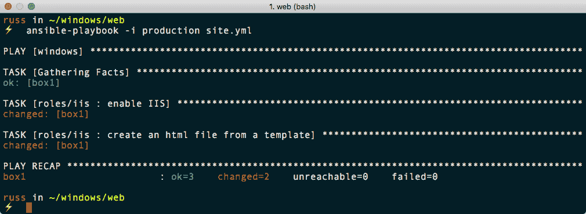

# 第十二章：Ansible Windows 模块

到目前为止，我们一直在针对 Linux 服务器进行操作。在本章中，我们将看一下支持和与基于 Windows 的服务器进行交互的核心 Ansible 模块的不断增长的集合。就个人而言，来自几乎完全是 macOS 和 Linux 背景，使用一个在 Windows 上没有本地支持的工具来管理 Windows 感觉有点奇怪。

然而，我相信在本章结束时，您会同意，它的开发人员已经尽可能地使将 Windows 工作负载引入到您的 playbook 中的过程变得无缝和熟悉。

在本章中，我们将学习如何使用 Vagrant 在本地构建我们的 Windows 服务器，然后将我们的 playbooks 移到公共云。我们将涵盖：

+   在 Windows 中启用功能

+   在 AWS 中启动 Windows 实例

+   创建用户

+   使用 Chocolatey 安装第三方软件包

# 技术要求

与上一章一样，我们将使用 Vagrant 和 AWS。我们将使用的 Vagrant box 包含 Windows 2016 的评估副本。我们将在 AWS 中启动的 Windows EC2 实例将是完全许可的，因此将在 EC2 资源成本之上产生额外的费用。与往常一样，您可以在附带的存储库中找到完整的 playbooks，网址为[`github.com/PacktPublishing/Learn-Ansible/tree/master/Chapter12`](https://github.com/PacktPublishing/Learn-Ansible/tree/master/Chapter12)。

# 启动和运行

对于本节，我们将使用 Vagrant 来启动一个 Windows 2016 服务器，就像我们在第二章中所做的那样，*安装和运行 Ansible*。让我们首先看一下我们将使用来启动我们主机的 Vagrantfile。

# Vagrantfile

这个`Vagrantfile`看起来与我们用来启动 Linux 主机的文件并没有太大的不同：

```
# -*- mode: ruby -*-
# vi: set ft=ruby :

API_VERSION  = "2"
BOX_NAME     = "StefanScherer/windows_2016"
COMMUNICATOR = "winrm"
USERNAME     = "vagrant"
PASSWORD     = "vagrant"

Vagrant.configure(API_VERSION) do |config|
  config.vm.define "vagrant-windows-2016"
  config.vm.box = BOX_NAME
  config.vm.synced_folder ".", "/vagrant", disabled: true
  config.vm.network "forwarded_port", guest: 80, host: 8080
  config.vm.communicator = COMMUNICATOR
  config.winrm.username = USERNAME
  config.winrm.password = PASSWORD

  config.vm.provider "virtualbox" do |v|
    v.memory = "4048"
    v.cpus = "4"
    v.gui = true
  end

  config.vm.provider "vmware_fusion" do |v|
    v.vmx["memsize"] = "4048"
    v.vmx["numvcpus"] = "4"
  end

end
```

正如您所看到的，我们正在替换对 SSH Vagrant 的引用。我们将使用**Windows 远程管理**（**WinRM**）协议以及 Ansible 与虚拟机进行交互。默认情况下，`config.vm.communicator`是 SSH，因此用`winrm`覆盖这个意味着我们必须提供`config.winrm.username`和`config.winrm.password`。

此外，我们指示 Vagrant 不要尝试在虚拟机上挂载我们的本地文件系统，也不要添加任何额外的 IP 地址或网络接口；相反，它应该只是将本地主机的端口转发到主机。

最后，我们将本地机器上的端口`8080`映射到 Windows 主机上的端口`80`；本章后面会详细介绍。

我们可以使用以下命令之一启动主机：

```
$ vagrant up
```

这将使用 VirtualBox，或者我们可以通过运行以下命令使用 VMWare：

```
$ vagrant up --provider=vmware_fusion
```

我们使用的 Vagrant box 大小为几个 GB，因此下载需要一些时间，但一旦下载完成，您应该会看到以下输出：


一旦机器启动，您会发现您的虚拟机已经打开了一个窗口，Windows 桌面是可访问的，如下所示：


现在暂时最小化这个窗口，因为我们将不直接与 Windows 交互。关闭窗口可能会暂停并关闭虚拟机。

现在我们的 Windows 主机已经启动运行，我们需要安装一些支持 Python 模块，以便让 Ansible 与其进行交互。

# Ansible 准备

如前所述，Ansible 将使用 WinRM 与我们的 Windows 主机进行交互。

WinRM 提供对称为 WS-Management 的类似 SOAP 的协议的访问。与提供用户交互式 shell 以管理主机的 SSH 不同，WinRM 接受执行的脚本，然后将结果传递回给您。

为了能够使用 WinRM，Ansible 要求我们安装一些不同的 Python 模块，Linux 用户可以使用以下命令来安装它们：

```
$ sudo pip install pywinrm[credssp]
```

如果 macOS 用户在更新时出现关于无法更新`pyOpenSSL`的错误，那么可能需要执行以下命令，因为它是核心操作系统的一部分：

```
$ sudo pip install pywinrm[credssp] --ignore-installed pyOpenSSL
```

安装完成后，我们现在应该能够与我们的 Windows 主机进行交互，一旦我们配置了主机清单文件。该文件名为`production`，看起来像下面这样：

```
box1 ansible_host=localhost

[windows]
box1

[windows:vars]
ansible_connection=winrm
ansible_user=vagrant
ansible_password=vagrant
ansible_port=55985
ansible_winrm_scheme=http
ansible_winrm_server_cert_validation=ignore
```

正如你所看到的，我们已经删除了所有关于 SSH 的引用，并用 WinRM (`ansible_connection`)替换了它们。同样，我们必须提供用户名(`ansible_user`)和密码(`ansible_password`)。由于我们使用的 Vagrant box 是如何构建的，我们没有使用默认的 HTTPS 方案，而是使用了 HTTP 方案(`ansible_winrm_scheme`)。这意味着我们必须使用端口`55985`(`ansible_port`)，而不是端口`99586`。这两个端口都是从我们的 Ansible 控制器映射到 Windows 主机上的端口`9585`和`5986`。

现在我们已经让 Windows 运行起来并配置了 Ansible，我们可以开始与它进行交互了。

# ping 模块

并非所有的 Ansible 模块都适用于 Windows 主机，其中 ping 就是其中之一。为 Windows 提供了一个名为`win_ping`的模块，我们将在这里使用它。

我们需要运行的命令如下；正如你所看到的，除了模块名称之外，它与我们针对 Linux 主机执行的方式完全相同：

```
$ ansible windows -i production -m win_ping
```

如果你是 macOS 用户，并且收到了这样的错误，那么不用担心；有一个解决方法：


这个错误是 Ansible 团队正在解决的一个已知问题。与此同时，运行以下命令，或将其添加到你的`~/.bash_profile`文件中：

```
$ export OBJC_DISABLE_INITIALIZE_FORK_SAFETY=YES
```

一旦你运行了该命令，你应该会看到以下结果：


我们接下来要运行的下一个模块是专为 Windows 或 Linux 主机设计的。

# setup 模块

正如我们在第二章中发现的，*安装和运行 Ansible*，setup 模块在我们的目标主机上收集事实；如果我们使用`ansible`命令直接调用该模块，事实将直接打印在屏幕上。要调用该模块，我们需要运行以下命令：

```
$ ansible windows -i production -m setup
```

正如你从下面的屏幕中看到的，显示的信息几乎与我们针对 Linux 主机运行模块时的情况完全相同：


我们可以使用第二章中的一个 playbook，*安装和运行 Ansible*，来查看这一点。在`playbook01.yml`中，我们使用了 Ansible 首次连接到主机时收集的事实来显示一条消息。让我们更新该 playbook 以与我们的 Windows 主机交互：

```
---

- hosts: windows
  gather_facts: true

  tasks:
    - debug:
        msg: "I am connecting to {{ ansible_nodename }} which is running {{ ansible_distribution }} {{ ansible_distribution_version }}"
```

正如你所看到的，我们已经更新了主机组，使用`windows`而不是`boxes`，并且我们还删除了`become`和`become_method`选项，因为我们将连接的用户有足够的权限来运行我们需要的任务。

我们可以使用以下命令运行 playbook：

```
$ ansible-playbook -i production playbook01.yml
```

下面的屏幕显示了预期的输出：


现在我们已经快速地介绍了基础知识，我们可以考虑做一些有用的事情，安装一些不同的软件包。

# 安装 web 服务器

当我们让我们的 Linux 主机运行起来时，我们做的第一件事之一就是安装 web 服务器，所以让我们通过在我们的 Windows 主机上安装和启用**Internet Information Services** (**IIS**)来重复这个过程。

IIS 是随 Windows Server 一起提供的默认 web 服务器，它支持以下协议：HTTP、HTTPS 和 HTTP/2，以及 FTP、FTPS、SMTP 和 NNTP。它是 22 年前作为 Windows NT 的一部分首次发布的。

就像我们迄今为止所涵盖的所有 playbook 一样，让我们通过运行以下命令创建基本的框架：

```
$ mkdir web web/group_vars web/roles
$ touch web/production web/site.yml web/group_vars/common.yml
```

现在我们可以开始编写我们的 playbook 了。

# IIS 角色

我们要看的第一个角色安装和配置 IIS，然后，与我们之前的剧本一样，使用模板由 Ansible 生成并上传 HTML 文件。首先，切换到`web`文件夹，并通过运行以下命令创建角色：

```
$ cd web
$ ansible-galaxy init roles/iis
```

从`roles/iis/defaults/main.yml`中的默认变量开始，我们可以看到我们的角色将与我们设置 LAMP 堆栈时创建的 Apache 角色非常相似：

```
---
# defaults file for web/roles/iis

document_root: 'C:\inetpub\wwwroot\'
html_file: ansible.html

html_heading: "Success !!!"
html_body: |
  This HTML page has been deployed using Ansible to a <b>{{ ansible_distribution }}</b> host.<br><br>
  The weboot is <b>{{ document_root }}</b> this file is called <b>{{ html_file }}</b>.<br>
```

如您所见，我们提供了文档根目录的路径，我们的 HTML 文件的名称，以及我们 HTML 文件的一些内容，模板可以在`roles/iis/templates/index.html.j2`中找到：

```
<!--{{ ansible_managed }}-->
<!doctype html>
<title>{{ html_heading }}</title>
<style>
  body { text-align: center; padding: 150px; }
  h1 { font-size: 50px; }
  body { font: 20px Helvetica, sans-serif; color: #333; }
  article { display: block; text-align: left; width: 650px; margin: 0 auto; }
</style>
<article>
    <h1>{{ html_heading }}</h1>
    <div>
        <p>{{ html_body }}</p>
    </div>
</article>
```

这是我们之前在 Apache 角色中使用的确切模板。部署 IIS 非常简单，我们只需要在`roles/iis/tasks/main.yml`中完成两个任务。我们的第一个任务可以在这里找到：

```
- name: enable IIS
  win_feature:
    name: 
      - "Web-Server"
      - "Web-Common-Http"
    state: "present"
```

这使用`win_feature`模块来启用和启动`Web-Server`和`Web-Common-Http`功能。下一个和最后一个任务使用`win_template`模块部署我们的 HTML 页面：

```
- name: create an html file from a template
  win_template:
    src: "index.html.j2"
    dest: "{{ document_root }}{{ html_file }}"
```

如您所见，语法与标准的`template`模块几乎相同。现在我们的角色已经完成，我们可以运行剧本，将主机清单文件的内容复制到我们在上一节中使用的`production`文件中，并更新`site.yml`，使其包含以下内容：

```
---

- hosts: windows
  gather_facts: true

  vars_files:
    - group_vars/common.yml

  roles:
    - roles/iis
```

然后，您可以使用以下命令运行剧本：

```
$ ansible-playbook -i production site.yml
```

剧本运行的输出应该类似于以下终端输出：



完成后，您应该能够在本地计算机上打开 Web 浏览器并转到`http://localhost:8080/`，这应该会显示默认的 IIS 页面：


打开`http://localhost:8080/ansible.html`将显示我们上传的页面：


# ASP.NET 角色

现在我们已经启动了 IIS，让我们看看如何启用 ASP.NET 支持。同样，让我们首先创建角色：

```
$ ansible-galaxy init roles/asp
```

从`roles/asp/defaults/main.yml`中的变量开始，您可以看到它们看起来与 HTML 变量类似，只是我们已经用`.aspx`作为前缀，这样它们就不会与`iis`角色的变量冲突：

```
aspx_document_root: 'C:\inetpub\wwwroot\ansible\'
aspx_file: default.aspx

aspx_heading: "Success !!!"
aspx_body: |
  This HTML page has been deployed using Ansible to a <b>{{ ansible_distribution }}</b> host.<br><br>
  The weboot is <b>{{ aspx_document_root }}</b> this file is called <b>{{ aspx_file }}</b>.<br><br>
  The output below is from ASP.NET<br><br>
  Hello from <%= Environment.MachineName %> at <%= DateTime.UtcNow %><br><br>
```

从页面底部可以看出，我们包含了一个打印机器名称的函数，这在我们的情况下应该是 Vagrant，还有日期和时间。

接下来，我们在`roles/asp/templates/default.aspx.j2`中有模板。除了更新的变量和文件名外，内容基本上与在`iis`角色中使用的内容相同：

```
<!--{{ ansible_managed }}-->
<!doctype html>
<title>{{ html_heading }}</title>
<style>
  body { text-align: center; padding: 150px; }
  h1 { font-size: 50px; }
  body { font: 20px Helvetica, sans-serif; color: #333; }
  article { display: block; text-align: left; width: 650px; margin: 0 auto; }
</style>
<article>
    <h1>{{ aspx_heading }}</h1>
    <div>
        <p>{{ aspx_body }}</p>
    </div>
</article>
```

接下来，我们有应放置在`roles/asp/tasks/main.yml`中的任务。首先，我们使用`win_feature`模块来启用所需的组件，以便让我们的基本页面运行起来：

```
- name: enable .net
  win_feature:
    name: 
      - "Net-Framework-Features"
      - "Web-Asp-Net45"
      - "Web-Net-Ext45"
    state: "present"
  notify: restart iis
```

接下来，我们需要创建一个文件夹来提供我们的页面，并复制渲染的模板：

```
- name: create the folder for our asp.net app
  win_file:
    path: "{{ aspx_document_root }}"
    state: "directory"

- name: create an aspx file from a template
  win_template:
    src: "default.aspx.j2"
    dest: "{{ aspx_document_root }}{{ aspx_file }}"
```

如您所见，我们再次使用了`win_template`模块。除了使用`win_file`模块外，文件模块的语法与我们在其他章节中使用的`file`模块非常接近。最后一个任务检查了 IIS 中站点的配置是否正确：

```
- name: ensure the default web application exists
  win_iis_webapplication:
    name: "Default"
    state: "present"
    physical_path: "{{ aspx_document_root }}"
    application_pool: "DefaultAppPool"
    site: "Default Web Site"
```

`win_iis_webapplication`模块用于配置 IIS 中的 Web 应用程序，正如其名称所示。这在我们的示例中并不是严格要求的，但它可以让你了解可能的操作。

您可能已经注意到，当我们启用了附加功能时，我们发送了一个重新启动 IIS 的通知。这意味着我们必须在`roles/asp/handlers/main.yml`文件中添加一个任务。此任务使用`win_service`模块重新启动 Web 服务器：

```
- name: restart iis
  win_service:
    name: w3svc
    state: restarted
```

现在我们已经完成了角色，我们可以再次运行剧本。首先，我们需要将新角色添加到`site.yml`文件中：

```
---

- hosts: windows
  gather_facts: true

  vars_files:
    - group_vars/common.yml

  roles:
    - roles/iis
    - roles/asp
```

然后，您可以使用以下命令运行剧本：

```
$ ansible-playbook -i production site.yml
```

这应该会给你以下输出的某种形式：


打开浏览器并转到`http://localhost:8080/ansible/`应该会显示类似以下网页的内容：


让我们删除 Vagrant 框并查看更多模块。要删除框，请运行：

```
$ vagrant destroy
```

现在我们可以使用 Ansible 创建用户，并在 AWS 中的服务器主机上安装一些桌面应用程序。

# 与 AWS Windows 实例交互

当我们与本地 Windows Vagrant 框进行交互时，它并未使用安全连接；让我们看看如何在 AWS 实例中启动 Windows EC2 实例，然后像我们在第十章中与 CentOS 7 实例进行交互一样与其交互。

首先，我们需要为新的 playbook 创建文件夹结构：

```
$ mkdir cloud cloud/group_vars cloud/roles
$ touch cloud/production cloud/site.yml cloud/group_vars/common.yml
```

一旦我们有了结构，我们需要创建四个角色，首先是 AWS 角色。

# AWS 角色

我们的第一个角色将创建 VPC 并启动 EC2 实例。要启动角色更改，请转到 cloud 文件夹并运行：

```
$ cd cloud
$ ansible-galaxy init roles/aws
```

让我们首先从`roles/aws/defaults/main.yml`的内容开始：

```
vpc_cidr_block: "10.0.0.0/16"
the_subnets:
  - { use: 'ec2', az: 'a', subnet: '10.0.10.0/24' }

ec2:
  instance_type: "t2.large"
  wait_port: "5986"

image:
  base: Windows_Server-2016-English-Full-Base-*
  owner: amazon
  architecture: x86_64
  root_device: ebs

win_initial_password: "{{ lookup('password', 'group_vars/generated_administrator chars=ascii_letters,digits length=30') }}"
```

如您所见，我们只会使用一个子网，并且在 playbook 运行期间将寻找 Windows Server 2016 AMI。最后，我们正在设置一个名为`win_initial_password`的变量，该变量将用于在 playbook 运行期间稍后设置我们的管理员密码。

`roles/aws/tasks/main.yml`中的大多数任务都如您所期望的那样。首先，我们设置 VPC，创建子网，并找出用于安全组的当前 IP 地址：

```
- name: ensure that the VPC is present
  ec2_vpc_net:
    region: "{{ ec2_region }}"
    name: "{{ environment_name }}"
    state: present
    cidr_block: "{{ vpc_cidr_block }}"
    resource_tags: { "Name" : "{{ environment_name }}", "Environment" : "{{ environment_name }}" }
  register: vpc_info

- name: ensure that the subnets are present
  ec2_vpc_subnet:
    region: "{{ ec2_region }}"
    state: present
    vpc_id: "{{ vpc_info.vpc.id }}"
    cidr: "{{ item.subnet }}"
    az: "{{ ec2_region }}{{ item.az }}"
    resource_tags: 
      "Name" : "{{ environment_name }}_{{ item.use }}_{{ ec2_region }}{{ item.az }}"
      "Environment" : "{{ environment_name }}"
      "Use" : "{{ item.use }}"
  with_items: "{{ the_subnets }}"

- name: gather information about the ec2 subnets
  ec2_vpc_subnet_facts:
    region: "{{ ec2_region }}"
    filters:
      "tag:Use": "ec2"
      "tag:Environment": "{{ environment_name }}"
  register: subnets_ec2

- name: register just the IDs for each of the subnets
  set_fact:
    subnet_ec2_ids: "{{ subnets_ec2.subnets | map(attribute='id') | list }}"

- name: find out your current public IP address using https://ipify.org/
  ipify_facts:
  register: public_ip

- name: set your public ip as a fact
  set_fact:
    your_public_ip: "{{ public_ip.ansible_facts.ipify_public_ip }}/32"
```

安全组已更新，因此我们不再打开端口 22，而是打开远程桌面（端口`3389`）和 WinRM（端口`5985`和`5986`）的端口：

```
- name: provision ec2 security group
  ec2_group:
    region: "{{ ec2_region }}"
    vpc_id: "{{ vpc_info.vpc.id }}"
    name: "{{ environment_name }}-ec2"
    description: "Opens the RDP and WinRM ports to a trusted IP"
    tags:
      "Name": "{{ environment_name }}-ec2"
      "Environment": "{{ environment_name }}"
    rules:
      - proto: "tcp"
        from_port: "3389"
        to_port: "3389"
        cidr_ip: "{{ your_public_ip }}"
        rule_desc: "allow {{ your_public_ip }} access to port RDP"
      - proto: "tcp"
        from_port: "5985"
        to_port: "5985"
        cidr_ip: "{{ your_public_ip }}"
        rule_desc: "allow {{ your_public_ip }} access to WinRM"
      - proto: "tcp"
        from_port: "5986"
        to_port: "5986"
        cidr_ip: "{{ your_public_ip }}"
        rule_desc: "allow {{ your_public_ip }} access to WinRM"
  register: sg_ec2
```

然后，我们继续通过添加互联网网关和路由来构建我们的网络，然后找到要使用的正确 AMI ID：

```
- name: ensure that there is an internet gateway
  ec2_vpc_igw:
    region: "{{ ec2_region }}"
    vpc_id: "{{ vpc_info.vpc.id }}"
    state: present
    tags:
      "Name": "{{ environment_name }}_internet_gateway"
      "Environment": "{{ environment_name }}"
      "Use": "gateway"
  register: igw_info

- name: check that we can route through internet gateway
  ec2_vpc_route_table:
    region: "{{ ec2_region }}"
    vpc_id: "{{ vpc_info.vpc.id }}"
    subnets: "{{ subnet_ec2_ids }}"
    routes:
      - dest: 0.0.0.0/0
        gateway_id: "{{ igw_info.gateway_id }}"
    resource_tags:
      "Name": "{{ environment_name }}_outbound"
      "Environment": "{{ environment_name }}"

- name: search for all of the AMIs in the defined region which match our selection
  ec2_ami_facts:
    region: "{{ ec2_region }}"
    owners: "{{ image.owner }}"
    filters:
      name: "{{ image.base }}"
      architecture: "{{ image.architecture }}"
      root-device-type: "{{ image.root_device }}" 
  register: amiFind

- name: filter the list of AMIs to find the latest one with an EBS backed volume
  set_fact:
    amiSortFilter: "{{ amiFind.images | sort(attribute='creation_date') | last }}"

- name: finally grab AMI ID of the most recent result which matches our base image which is backed by an EBS volume
  set_fact:
    our_ami_id: "{{ amiSortFilter.image_id }}"
```

现在是时候启动 EC2 实例了；您可能已经注意到，我们不需要上传密钥或任何凭据。这是因为我们实际上将注入一个 PowerShell 脚本，该脚本在实例首次启动时执行。此脚本将设置管理员密码并配置实例，以便 Ansible 可以针对其运行：

```
- name: launch an instance
  ec2_instance:
    region: "{{ ec2_region }}"
    state: "present"
    instance_type: "{{ ec2.instance_type }}"
    image_id: "{{ our_ami_id }}"
    wait: yes
    security_groups: [ "{{ sg_ec2.group_id }}" ]
    network: 
      assign_public_ip: true
    filters:
      instance-state-name: "running"
      "tag:Name": "{{ environment_name }}"
      "tag:environment": "{{ environment_name }}"
    vpc_subnet_id: "{{ subnet_ec2_ids[0] }}"
    user_data: "{{ lookup('template', 'userdata.j2') }}"
    tags:
      Name: "{{ environment_name }}"
      environment: "{{ environment_name }}"
```

脚本是一个名为`userdata.j2`的模板，它使用`user_data`键在实例启动时注入。我们将在一会儿看一下模板；在此角色中剩下的就是将实例添加到主机组，然后等待 WinRM 可访问：

```
- name: gather facts on the instance we just launched using the AWS API
  ec2_instance_facts:
    region: "{{ ec2_region }}"
    filters:
      instance-state-name: "running"
      "tag:Name": "{{ environment_name }}"
      "tag:environment": "{{ environment_name }}"
  register: singleinstance

- name: add our temporary instance to a host group for use in the next step
  add_host:
    name: "{{ item.public_dns_name }}"
    ansible_ssh_host: "{{ item.public_dns_name }}"
    groups: "ec2_instance"
  with_items: "{{ singleinstance.instances }}"

- name: wait until WinRM is available before moving onto the next step
  wait_for:
    host: "{{ item.public_dns_name }}"
    port: "{{ ec2.wait_port }}"
    delay: 2
    timeout: 320
    state: "started"
  with_items: "{{ singleinstance.instances }}"
```

`roles/aws/templates/`中的`userdata.j2`模板如下所示：

```
<powershell>
$admin = adsi
$admin.PSBase.Invoke("SetPassword", "{{ win_initial_password }}")
Invoke-Expression ((New-Object System.Net.Webclient).DownloadString('https://raw.githubusercontent.com/ansible/ansible/devel/examples/scripts/ConfigureRemotingForAnsible.ps1'))
</powershell>
```

脚本的第一部分设置了管理员用户的密码（`win_initial_password`）；然后，脚本直接从 Ansible 的 GitHub 存储库下载并执行 PowerShell 脚本。此脚本对目标实例上的当前 WinRM 配置进行检查，然后进行所需的更改，以便 Ansible 能够安全连接。脚本还配置了对实例事件日志的所有操作进行记录。

# 用户角色

接下来，我们有用户角色，可以运行以下命令来创建：

```
$ ansible-galaxy init roles/user
```

此角色为我们创建了一个用户，以便我们连接到我们的实例。`roles/user/defaults/main.yml`中可以找到的默认值如下：

```
ansible:
  username: "ansible"
  password: "{{ lookup('password', 'group_vars/generated_ansible chars=ascii_letters,digits length=30') }}"
  groups:
    - "Users"
    - "Administrators"
```

如您所见，这里我们定义了一个名为`ansible`的用户，该用户具有 30 个字符的随机密码。`ansible`用户将成为`Users`和`Administrators`组的成员。`roles/user/tasks/main.yml`中有一个使用`win_user`模块的单个任务，看起来像：

```
- name: ensure that the ansible created users are present
  win_user:
    name: "{{ ansible.username }}"
    fullname: "{{ ansible.username | capitalize }}"
    password: "{{ ansible.password }}"
    state: "present"
    groups: "{{ ansible.groups }}"
```

与所有 Windows 模块一样，语法与 Linux 等效模块相似，因此您应该对每个键的含义有一个很好的了解。从前一个任务中可以看出，我们使用了 Jinja2 转换来大写`ansible.username`变量的第一个字母。

# Chocolatey 角色

下一个角色使用 Chocolatey 在计算机上安装一些软件。

Chocolatey 是 Windows 的软件包管理器，原理和功能类似于我们在早期章节中使用的 Homebrew，在 macOS 上使用单个命令安装所需软件。Chocolatey 通过将大多数常见 Windows 安装程序的安装过程包装成一组常见的 PowerShell 命令，简化了命令行上的软件包安装过程，非常适合像 Ansible 这样的编排工具。

要添加角色所需的文件，请运行以下命令：

```
$ ansible-galaxy init roles/choc
```

在`roles/choc/defaults/main.yml`中，我们有一个要安装的软件包列表：

```
apps:
  - "notepadplusplus.install"
  - "putty.install"
  - "googlechrome"
```

如您所见，我们想要安装 Notepad++、PuTTY 和 Google Chrome。需要添加到`roles/choc/tasks/main.yml`的任务本身如下所示：

```
- name: install software using chocolatey
  win_chocolatey:
    name: "{{ item }}"
    state: "present"
  with_items: "{{ apps }}"
```

再次强调，`win_chocolatey`模块在针对基于 Linux 的主机时，与我们在之前章节中使用的软件包管理器模块接受类似的输入。

# 信息角色

我们正在创建的最终角色称为`info`，它的唯一目的是输出有关我们新启动和配置的 Windows Server 2016 EC2 实例的信息。正如您可能已经猜到的那样，我们需要运行以下命令：

```
$ ansible-galaxy init roles/info
```

一旦我们有了这些文件，将以下任务添加到`roles/info/tasks/main.yml`中：

```
- name: print out information on the host
  debug:
    msg: "You can connect to '{{ inventory_hostname }}' using the username of '{{ ansible.username }}' with a password of '{{ ansible.password }}'."
```

如您所见，这将为我们提供要连接的主机，以及用户名和密码。

# 运行 playbook

在运行 playbook 之前，我们需要将以下内容添加到`group_vars/common.yml`中：

```
environment_name: "windows_example"
ec2_region: "eu-west-1"
```

名为`production`的主机清单文件应包含以下内容：

```
[ec2_instance]

[ec2_instance:vars]
ansible_connection=winrm
ansible_user="Administrator"
ansible_password="{{ lookup('password', 'group_vars/generated_administrator chars=ascii_letters,digits length=30') }}"
ansible_winrm_server_cert_validation=ignore
```

如您所见，我们使用 WinRM 连接器使用管理员用户名和在启动实例时运行用户数据脚本时设置的密码连接到我们的 Windows 实例。`site.yml`文件应该有以下内容：

```
---

- name: Create the AWS environment and launch an EC2 instance
  hosts: localhost
  connection: local
  gather_facts: True

  vars_files:
    - group_vars/common.yml

  roles:
    - roles/aws

- name: Bootstrap the EC2 instance
  hosts: ec2_instance
  gather_facts: true

  vars_files:
    - group_vars/common.yml

  roles:
    - roles/user
    - roles/choc
    - roles/info 
```

在首先导出 AWS 凭据后，我们可以使用以下命令运行 playbook：

```
$ export AWS_ACCESS_KEY=AKIAI5KECPOTNTTVM3EDA
$ export AWS_SECRET_KEY=Y4B7FFiSWl0Am3VIFc07lgnc/TAtK5+RpxzIGTr
$ ansible-playbook -i production site.yml
```

playbook 运行的略有编辑的输出如下：

```
[WARNING]: provided hosts list is empty, only localhost is available. Note that the implicit
localhost does not match 'all'

PLAY [Create the AWS environment and launch an EC2 instance] ************************************

TASK [Gathering Facts] **************************************************************************
ok: [localhost]

TASK [roles/aws : ensure that the VPC is present] ***********************************************
changed: [localhost]

TASK [roles/aws : ensure that the subnets are present] ******************************************
changed: [localhost] => (item={u'subnet': u'10.0.10.0/24', u'use': u'ec2', u'az': u'a'})

TASK [roles/aws : gather information about the ec2 subnets] *************************************
ok: [localhost]

TASK [roles/aws : register just the IDs for each of the subnets] ********************************
ok: [localhost]

TASK [roles/aws : find out your current public IP address using https://ipify.org/] *************
ok: [localhost]

TASK [roles/aws : set your public ip as a fact] *************************************************
ok: [localhost]

TASK [roles/aws : provision ec2 security group] *************************************************
changed: [localhost]

TASK [roles/aws : ensure that there is an internet gateway] *************************************
changed: [localhost]

TASK [roles/aws : check that we can route through internet gateway] *****************************
changed: [localhost]

TASK [roles/aws : search for all of the AMIs in the defined region which match our selection] ***
ok: [localhost]

TASK [roles/aws : filter the list of AMIs to find the latest one with an EBS backed volume] *****
ok: [localhost]

TASK [roles/aws : finally grab AMI ID of the most recent result which matches our base image which is backed by an EBS volume] ***************************************************************
ok: [localhost]

TASK [roles/aws : launch an instance] ***********************************************************
changed: [localhost]

TASK [roles/aws : gather facts on the instance we just launched using the AWS API] **************
ok: [localhost]

TASK [roles/aws : add our temporary instance to a host group for use in the next step] **********
changed: [localhost] => 

TASK [roles/aws : wait until WinRM is available before moving onto the next step] ***************
ok: [localhost] => 

PLAY [Bootstrap the EC2 instance] ***************************************************************

TASK [Gathering Facts] **************************************************************************
ok: [ec2-34-245-2-119.eu-west-1.compute.amazonaws.com]

TASK [roles/user : ensure that the ansible created users are present] **************************
changed: [ec2-34-245-2-119.eu-west-1.compute.amazonaws.com]

TASK [roles/choc : install software using chocolatey] *******************************************
changed: [ec2-34-245-2-119.eu-west-1.compute.amazonaws.com] => (item=notepadplusplus.install)
changed: [ec2-34-245-2-119.eu-west-1.compute.amazonaws.com] => (item=putty.install)
changed: [ec2-34-245-2-119.eu-west-1.compute.amazonaws.com] => (item=googlechrome)
 [WARNING]: Chocolatey was missing from this system, so it was installed during this task run.

TASK [roles/info : print out informaton on the host] ********************************************
ok: [ec2-34-245-2-119.eu-west-1.compute.amazonaws.com] => {
 "msg": "You can connect to 'ec2-34-245-2-119.eu-west-1.compute.amazonaws.com' using the username of 'ansible' with a password of 'Qb9LVPkUeZFRx5HLFgVllFrkqK7HHN'."
}

PLAY RECAP **************************************************************************************
ec2-34-245-2-119.eu-west-1.compute.amazonaws.com : ok=4 changed=2 unreachable=0 failed=0
localhost : ok=17 changed=7 unreachable=0 failed=0
```

从输出中可以看出，我的 EC2 实例的主机名是`ec2-34-245-2-119.eu-west-1.compute.amazonaws.com`，`ansible`用户的密码是`Qb9LVPkUeZFRx5HLFgVllFrkqK7HHN`。我可以使用这些详细信息连接到实例，使用 Microsoft RDP（记住它被锁定到您的 IP 地址）。如下截图所示，我以 Ansible 用户身份连接，并打开了 PuTTY 和 Notepad ++；您还可以看到桌面上的 Google Chrome 的快捷方式：


您可能注意到的另一件事是，我们从未安装过 Chocolatey。正如在 playbook 运行期间所述，如果`win_chocolatey`在目标机器上找不到 Chocolatey 安装，它将自动安装和配置它。

在 GitHub 存储库的`Chapter12/cloud`文件夹中有一个 playbook，用于删除我们在此处创建的资源。要运行此 playbook，请使用以下命令：

```
$ ansible-playbook -i production remove.yml
```

确保您仔细检查了一切是否按预期被移除，以确保您不会收到任何意外的账单。

# 总结

正如在本章开头提到的，使用诸如 Ansible 这样的传统 Linux 工具在 Windows 上总是感觉有点奇怪。然而，我相信您会同意，体验尽可能接近 Linux。当我第一次尝试使用 Windows 模块时，我惊讶地发现我成功启动了一个 EC2 Windows Server 实例，并成功部署了一个简单的 Web 应用程序，而无需远程桌面连接到目标实例。

随着每个新版本的发布，Ansible 对基于 Windows 的主机的支持越来越多，从您的 playbook 轻松管理混合工作负载。

在下一章中，我们将回到更熟悉的领域，至少对我来说是这样，并看看我们如何加固我们的 Linux 安装。

# 问题

1.  以下两个模块中哪一个可以在 Windows 和 Linux 主机上使用，setup 还是 file？

1.  真或假：您可以使用 SSH 访问您的 Windows 目标。

1.  解释 WinRM 使用的接口类型。

1.  你需要安装哪个 Python 模块才能在 macOS 和 Linux 上与 WinRM 进行交互？

1.  真或假：您可以在使用`win_chocolatey`模块之前有一个单独的任务来安装 Chocolatey。

1.  更新 playbook 以安装额外的软件包。

# 进一步阅读

您可以在[`chocolatey.org/`](http://chocolatey.org/)找到有关优秀的 Chocolatey 的更多信息。
