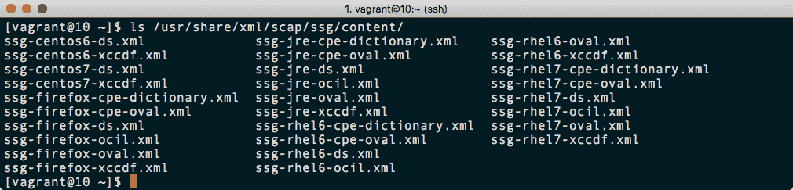
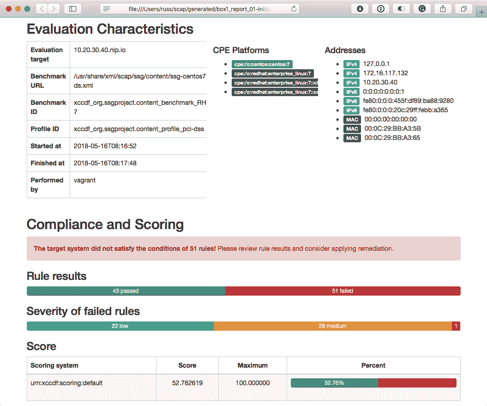
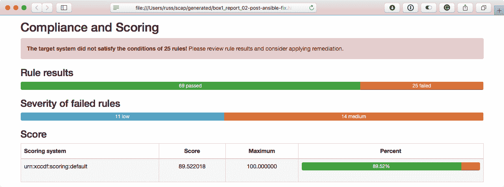
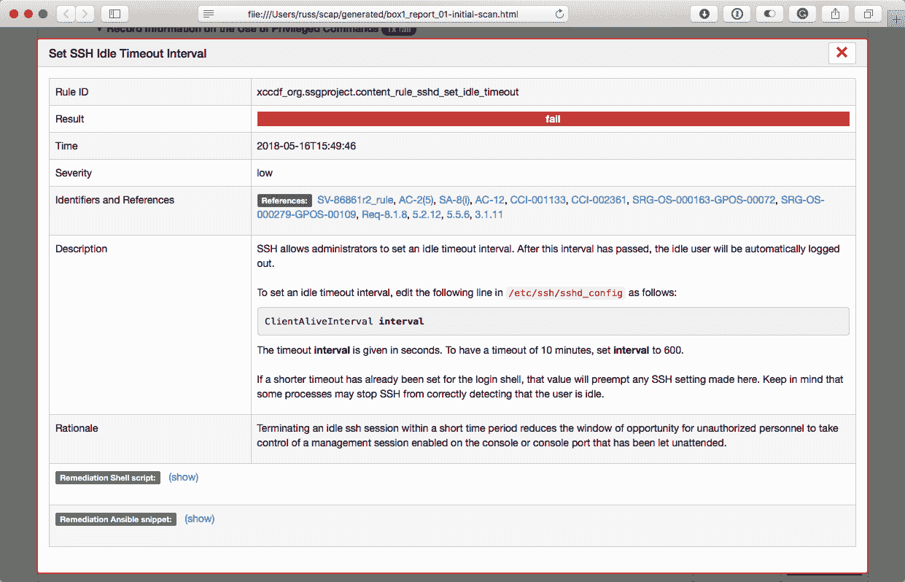
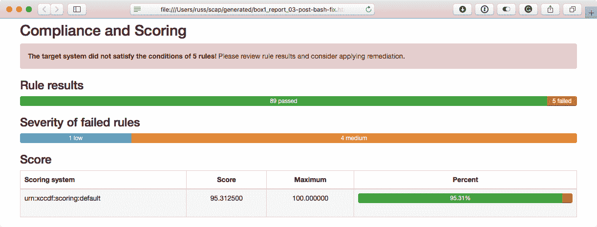
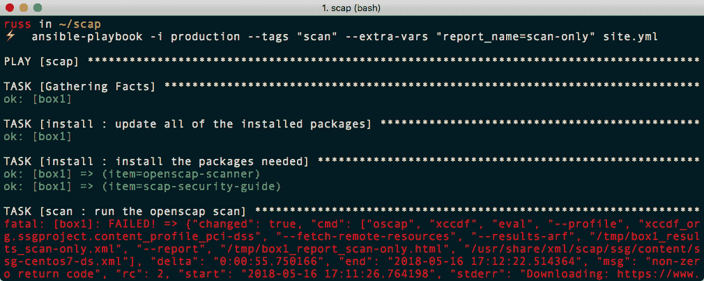
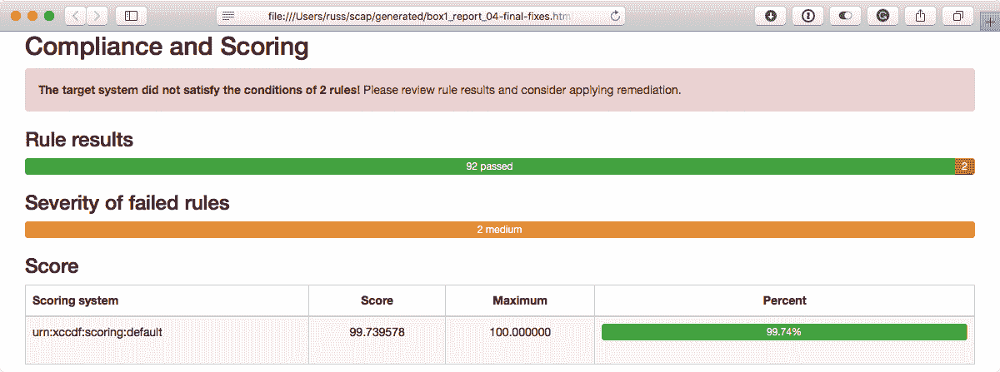

# 使用 Ansible 和 OpenSCAP 加固您的服务器

使用像 Ansible 这样的编排和配置工具的优势之一是，它可以用于在许多主机上生成和部署一组复杂的配置，以便重复执行。在本章中，我们将看一下一个实际上为您生成配置然后应用的工具。

在本章中，我们将学习如何使用 Ansible 和 OpenSCAP 加固基于 Red Hat 的 CentOS 7.5.1804 主机。

# 技术要求

我们将针对运行 CentOS Linux 发行版 7.5.1804 的 Vagrant 虚拟机进行操作；我们使用这个虚拟机是因为它配备了最新版本的 OpenSCAP。最终 playbooks 的副本可以在本书附带的存储库中找到；存储库位于[`github.com/PacktPublishing/Learn-Ansible/tree/master/Chapter13/scap`](https://github.com/PacktPublishing/Learn-Ansible/tree/master/Chapter13/scap)。

# OpenSCAP

我们将研究由 Red Hat 维护的一组工具之一，名为 OpenSCAP。在继续之前，我觉得我应该警告您，下一节将包含大量缩写，从 SCAP 开始。

那么，什么是 SCAP？**安全内容自动化协议**（**SCAP**）是一个开放标准，包括几个组件，所有这些组件本身都是开放标准，用于构建一个框架，允许您自动评估和纠正您的主机针对**国家标准与技术研究所**（**NIST**）特刊 800-53。

这本出版物是一个控制目录，适用于所有美国联邦 IT 系统，除了由**国家安全局**（**NSA**）维护的系统。这些控制措施已经被制定，以帮助在美国联邦部门实施 2002 年**联邦信息安全管理法**（**FISMA**）。

SCAP 由以下组件组成：

+   **资产识别**（**AID**）是用于资产识别的数据模型。

+   **资产报告格式**（**ARF**）是一个供应商中立和技术不可知的数据模型，用于在不同的报告应用程序和服务之间传输资产信息。

+   **常见配置枚举**（**CCE**）是一个标准数据库，用于常见软件的推荐配置。每个建议都有一个唯一的标识符。在撰写本文时，该数据库自 2013 年以来尚未更新。

+   **常见配置评分系统**（**CCSS**）是 CCE 的延续。它用于为各种软件和硬件配置生成得分，涵盖所有类型的部署。

+   **常见平台枚举**（**CPE**）是一种识别组织基础设施中的硬件资产、操作系统和软件的方法。一旦识别，这些数据可以用于搜索其他数据库以评估资产的威胁。

+   **常见弱点枚举**（**CWE**）是一种处理和讨论系统架构、设计和代码中可能导致漏洞的弱点原因的通用语言。

+   **常见漏洞和暴露**（**CVE**）是一个公开承认的漏洞数据库。大多数系统管理员和 IT 专业人员在某个时候都会遇到 CVE 数据库。每个漏洞都有一个唯一的 ID；例如，大多数人都会知道 CVE-2014-0160，也被称为**心脏出血**。

+   **常见漏洞评分系统**（**CVSS**）是一种帮助捕捉漏洞特征以产生标准化数值评分的方法，然后可以用于描述漏洞的影响，例如低、中、高和关键。

+   **可扩展配置清单描述格式**（**XCCDF**）是一种描述安全清单的 XML 格式。它也可以用于配置和基准，并为 SCAP 的所有部分提供一个通用语言。

+   **开放式清单交互语言**（**OCIL**）是一个用于向最终用户提出问题以及以标准化方式处理响应程序的框架。

+   **开放式漏洞评估语言**（**OVAL**）以 XML 形式定义，旨在标准化 NIST、MITRE 公司、**美国计算机紧急应对小组**（**US-CERT**）和美国**国土安全部**（**DHS**）提供的所有工具和服务之间的安全内容传输。

+   **安全自动化数据信任模型**（**TMSAD**）是一个旨在定义一个通用信任模型的 XML 文档，可应用于构成 SCAP 的所有组件交换的数据。

您可以想象，SCAP 及其基础组件的开发已经耗费了数千人年。其中一些项目自 90 年代中期以来一直存在，因此它们已经得到了很好的建立，并被认为是安全最佳实践的事实标准；但是，我相信您会认为这一切听起来非常复杂——毕竟，这些是由学者、安全专业人员和政府部门定义和维护的标准。

这就是 OpenSCAP 的用武之地。由 Red Hat 维护的 OpenSCAP 项目还获得了 NIST 对其支持 SCAP 1.2 标准的认证，它允许您使用命令行客户端应用我们讨论的所有最佳实践。

与许多 Red Hat 项目一样，OpenSCAP 正在获得对 Ansible 的支持，当前版本引入了自动生成 Ansible playbook 以修复 OpenSCAP 扫描中发现的不符合规范的支持。

当前版本的 OpenSCAP 中的自动修复脚本还在不断改进中，存在已知问题，我们将在本章末解决这些问题。因此，您的输出可能与本章中介绍的内容有所不同。

在接下来的章节中，我们将启动一个 CentOS 7.5.1804 Vagrant box，对其进行扫描，并生成修复 playbook。由于 playbook 支持刚刚被引入，因此修复的覆盖率还不到 100%，因此我们将再次扫描主机，然后使用 Ansible 生成修复的 bash 脚本，并在主机上执行它，然后再次执行扫描，以便比较所有三次扫描的结果。

# 准备主机

在开始扫描之前，我们需要一个目标主机，因此让我们快速创建文件夹结构和`Vagrantfile`。要创建结构，请运行以下命令：

```
$ mkdir scap scap/group_vars scap/roles
$ touch scap/Vagrantfile scap/production scap/site.yml scap/group_vars/common.yml
```

我们创建的`scap/Vagrantfile`应该包含以下代码：

```
# -*- mode: ruby -*-
# vi: set ft=ruby :

API_VERSION = "2"
BOX_NAME = "russmckendrick/centos75"
BOX_IP = "10.20.30.40"
DOMAIN = "nip.io"
PRIVATE_KEY = "~/.ssh/id_rsa"
PUBLIC_KEY = '~/.ssh/id_rsa.pub'

Vagrant.configure(API_VERSION) do |config|
  config.vm.box = BOX_NAME
  config.vm.network "private_network", ip: BOX_IP
  config.vm.host_name = BOX_IP + '.' + DOMAIN
  config.vm.synced_folder ".", "/vagrant", disabled: true
  config.ssh.insert_key = false
  config.ssh.private_key_path = [PRIVATE_KEY, "~/.vagrant.d/insecure_private_key"]
  config.vm.provision "file", source: PUBLIC_KEY, destination: "~/.ssh/authorized_keys"

  config.vm.provider "virtualbox" do |v|
    v.memory = "2024"
    v.cpus = "2"
  end

  config.vm.provider "vmware_fusion" do |v|
    v.vmx["memsize"] = "2024"
    v.vmx["numvcpus"] = "2"
  end

end
```

这意味着主机清单文件`scap/production`应包含以下内容：

```
box1 ansible_host=10.20.30.40.nip.io

[scap]
box1

[scap:vars]
ansible_connection=ssh
ansible_user=vagrant
ansible_private_key_file=~/.ssh/id_rsa
host_key_checking=False 
```

我们可以使用以下命令之一启动 Vagrant box：

```
$ vagrant up
$ vagrant up --provider=vmware_fusion
```

现在我们的目标主机已准备就绪，我们可以执行初始扫描了。

# playbook

我们将把 playbook 拆分成几个不同的角色。与以往的章节不同，我们将使其中一些角色可重用，并在执行它们时传递参数。我们的第一个角色是一个简单的角色，安装我们运行 OpenSCAP 扫描所需的软件包。

# 安装角色

如前所述，这个第一个角色是一个简单的角色，安装我们运行扫描所需的软件包：

```
$ ansible-galaxy init roles/install
```

我们需要在`roles/install/defaults/main.yml`中设置一些默认值；这些是：

```
install:
  packages:
    - "openscap-scanner"
    - "scap-security-guide"
```

`roles/install/tasks/main.yml`中有一个任务，安装软件包并执行`yum`更新：

```
- name: update all of the installed packages
  yum:
    name: "*"
    state: "latest"
    update_cache: "yes"

- name: install the packages needed
  package:
    name: "{{ item }}"
    state: latest
  with_items: "{{ install.packages }}"
```

这就是这个角色的全部内容；我们将在每次运行扫描时调用它，以确保我们安装了正确的软件包来运行扫描本身。

# 扫描角色

现在我们已经安装了 OpenSCAP 软件包，我们可以创建一个执行扫描的角色：

```
$ ansible-galaxy init roles/scan
```

如前所述，我们将在整个手册中重复使用这个角色，这给我们带来了一个很容易解决的问题。默认情况下，即使你多次定义了角色，Ansible 在手册运行期间也只会执行一次角色。为了允许角色执行多次，我们需要在`roles/scan/meta/main.yml`文件的顶部添加以下行：

```
allow_duplicates: true
```

这指示 Ansible 在手册运行期间多次执行这个角色。接下来，我们需要向`group_vars/common.yml`文件添加一些变量。这些关键值将在我们手册中使用的所有角色之间共享。

```
oscap:
  profile: "xccdf_org.ssgproject.content_profile_pci-dss"
  policy: "ssg-centos7-ds.xml"
  policy_path: "/usr/share/xml/scap/ssg/content/"
```

这些定义了我们想要使用的配置文件和我们想要应用的策略。默认情况下，OpenSCAP 不附带任何策略；这些是通过`scap-security-guide`软件包安装的。该软件包提供了几个策略，所有这些策略都可以在`/usr/share/xml/scap/ssg/content/`中找到；以下终端截图显示了该文件夹的目录列表：



对于我们的手册，我们将使用`ssg-centos7-ds.xml`策略，或者给它一个适当的标题，`PCI-DSS v3 Control Baseline for CentOS Linux 7`。

**支付卡行业数据安全标准**（**PCI-DSS**）是所有主要信用卡运营商都同意的一个标准，任何处理持卡人数据的人都必须遵守该标准。该标准是一组安全控制，由外部审计员或通过自我评估问卷进行审核，具体取决于您处理的交易数量。

以下一组嵌套变量定义了我们将存储扫描生成的各种文件的位置：

```
report:
  report_remote_path: "/tmp/{{ inventory_hostname }}_report_{{ report_name }}.html"
  report_local_path: "generated/{{ inventory_hostname }}_report_{{ report_name }}.html"
  results: "/tmp/{{ inventory_hostname }}_results_{{ report_name }}.xml" 
```

如你所见，我们有 HTML 报告的远程和本地路径。这是因为我们将在手册运行过程中将报告复制到我们的 Ansible 控制器。

现在我们有了共享变量，我们需要在`roles/scan/defaults/main.yml`文件中添加一个单个默认变量：

```
scan_command: >
  oscap xccdf eval --profile {{ oscap.profile }}
    --fetch-remote-resources
    --results-arf {{ report.results }}
    --report {{ report.report_remote_path }}
    {{ oscap.policy_path }}{{ oscap.policy }}
```

这是我们将运行以启动扫描的命令。在撰写本文时，没有任何 OpenSCAP 模块，因此我们需要使用`command`模块执行`oscap`命令。值得注意的是，我已经将命令分成多行放在变量中，以便阅读。

因为我使用了`>`，当应用变量到任务时，Ansible 实际上会将命令呈现为单行，这意味着我们不必像在命令行上运行多行命令时那样在每行末尾添加`\`。

角色的最后部分是任务本身。我们将把所有任务放在`roles/scan/tasks/main.yml`文件中，从执行我们定义的命令的任务开始。

```
- name: run the openscap scan
  command: "{{ scan_command }}"
  args:
    creates: "{{ report.report_remote_path }}"
  ignore_errors: yes
```

`ignore_errors`在这里非常重要。就 Ansible 而言，除非我们从扫描中获得 100%的干净健康报告，否则这个任务将始终运行。下一个任务是将扫描生成的 HTML 报告从目标主机复制到我们的 Ansible 控制器：

```
- name: download the html report
  fetch:
    src: "{{ report.report_remote_path }}"
    dest: "{{ report.report_local_path }}"
    flat: yes
```

现在我们有了两个角色，我们可以开始运行我们的第一个扫描。

# 运行初始扫描

现在我们已经完成了安装和扫描角色，我们可以运行我们的第一个扫描。我们还没有涵盖的唯一文件是`site.yml`；这个文件看起来与我们在其他章节中使用的文件略有不同：

```
---

- hosts: scap
  gather_facts: true
  become: yes
  become_method: sudo

  vars_files:
    - group_vars/common.yml

  roles:
    - { role: install, tags: [ "scan" ] }
    - { role: scan, tags: [ "scan" ], report_name: "01-initial-scan" }
```

如你所见，我们正在为角色打标签，并在运行扫描时传递一个参数。现在，我们只是运行手册而不使用任何标签。要运行手册，请发出以下命令：

```
$ ansible-playbook -i production site.yml
```

这将给我们以下结果：

```
PLAY [scap] ****************************************************************************************

TASK [Gathering Facts] *****************************************************************************
ok: [box1]

TASK [install : install the packages needed] *******************************************************
changed: [box1] => (item=openscap-scanner)
changed: [box1] => (item=scap-security-guide)

```

```
TASK [scan : run the openscap scan] ****************************************************************
fatal: [box1]: FAILED! => {"changed": true, "cmd": ["oscap", "xccdf", "eval", "--profile", "xccdf_org.ssgproject.content_profile_pci-dss", "--fetch-remote-resources", "--results-arf", "/tmp/box1_results_01-initial-scan.xml", "--report", "/tmp/box1_report_01-initial-scan.html", "/usr/share/xml/scap/ssg/content/ssg-centos7-ds.xml"], "delta": "0:01:03.459407", "end": "2018-05-16 08:17:50.970321", "msg": "non-zero return code", "rc": 2, "start": "2018-05-16 08:16:47.510914", "stderr": "Downloading: https://www.redhat.com/security/data/oval/com.redhat.rhsa-RHEL7.xml.bz2 ... ok", "stderr_lines": ["Downloading: https://www.redhat.com/security/data/oval/com.redhat.rhsa-RHEL7.xml.bz2 ... ok"], "stdout": "Title\r\tEnsure Red Hat GPG Key Installed\nRule\r\txccdf_org.ssgproject.content_rule_ensure_redhat_gpgkey_installed\nResult\r\tpass\n\nTitle\r\tEnsure gpgcheck Enabled In Main Yum "\txccdf_org.ssgproject.content_rule_chronyd_or_ntpd_specify_multiple_servers", "Result", "\tpass"]}
...ignoring

TASK [scan : download the html report] *************************************************************
changed: [box1]

PLAY RECAP *****************************************************************************************
box1 : ok=4 changed=3 unreachable=0 failed=0
```

我已经在此输出中截断了扫描结果，但当你运行它时，你会看到一个大部分失败的输出被标记为红色。如前所述，这是可以预料到的，不用担心。

我们初始扫描的 HTML 报告的副本现在应该在您的 Ansible 控制器上；您可以使用以下命令在浏览器中打开它：

```
$ open generated/box1_report_01-initial-scan.html
```

或者，打开`generated`文件夹，双击`box1_report_01-initial-scan.html`：



如您从示例中所见，我们的主机在 OpenSCAP 运行的 94 个检查中有 51 个失败。让我们看看如何解决这些失败的检查。

# 生成补救的 Ansible playbook

在我们继续之前，我必须首先提醒您报告给出了以下警告：

在没有在非运行环境中进行测试的情况下，请不要尝试实施本指南中的任何设置。本指南的创建者对其他方使用本指南不承担任何责任，并且对其质量、可靠性或任何其他特性不作任何明示或暗示的保证。

虽然我们这里只针对一个测试主机，如果您喜欢并决定查看针对其他工作负载实施 OpenSCAP，请确保您慢慢进行测试，然后再运行，即使只是由开发人员使用，我们即将进行的补救可能会对目标主机的运行产生严重后果。

既然我们已经解决了这个警告，我们可以继续看如何使用自动生成的 Ansible playbook 来保护我们的主机：

```
$ ansible-galaxy init roles/fix-ansible
```

对于这个角色，我们需要一些默认值，定义我们生成的 playbook 将被排序的位置，再次需要定义需要运行的命令。这些值可以在`roles/fix-ansible/defaults/main.yml`中找到。

第一个块处理我们将要生成的文件在目标主机和本地存储的位置：

```
playbook_file:
  remote: "/tmp/{{ inventory_hostname }}_ansible.yml"
  local: "generated/{{ inventory_hostname }}_ansible.yml"
  log: "generated/{{ inventory_hostname }}_ansible.log"
```

接下来，我们有需要执行的命令来生成 playbook 文件：

```
ansible_fix_command: >
  oscap xccdf generate fix
    --profile {{ oscap.profile }}
    --template urn:xccdf:fix:script:ansible
    --output {{ playbook_file.remote }}
    {{ report.results }}
```

然后，我们有一些文件夹和文件的位置需要在运行 playbook 之前放在那里；否则，将导致错误和失败：

```
missing_folders:
  - "/etc/dconf/db/local.d/locks/"

missing_files:
  - "/etc/dconf/db/local.d/locks/00-security-settings-lock"
  - "/etc/sysconfig/prelink"
```

既然我们已经有了默认的变量，我们可以开始向`roles/fix-ansible/tasks/main.yml`添加任务，首先使用`file`模块放置缺失的文件夹和文件：

```
- name: fix missing folders
  file:
    path: "{{ item }}"
    state: "directory"
  with_items: "{{ missing_folders }}"

- name: fix missing files
  file:
    path: "{{ item }}"
    state: "touch"
  with_items: "{{ missing_files }}"
```

接下来，我们将添加一个检查，看看目标机器上的 playbook 文件是否已经存在：

```
- name: do we already have the playbook?
  stat:
    path: "{{ playbook_file.remote }}"
  register: playbook_check
```

我们这样做是为了有一种跳过运行已生成的 playbook 的方法。接下来，我们运行命令来生成 playbook：

```
- name: generate the ansible playbook with the fixes
  command: "{{ ansible_fix_command }}"
  args:
    creates: "{{ playbook_file.remote }}" 
  ignore_errors: yes
```

如您从示例中所见，我们正在传递参数告诉 Ansible 创建 playbook 文件的命令；如果文件存在，则命令将不会再次执行。现在我们在机器上有了 playbook，我们需要将其复制到我们的 Ansible 控制器上。在这里，我们再次使用`fetch`模块：

```
- name: download the ansible playbook
  fetch:
    src: "{{ playbook_file.remote }}"
    dest: "{{ playbook_file.local }}"
    flat: yes
  when: playbook_check.stat.exists == False
```

如您所见，我们正在使用`when`，以便任务仅在角色运行开始时 playbook 文件不存在时才运行。现在我们在本地有了 playbook 的副本，我们可以运行它。为此，我们将使用`local_action`模块与`command`模块结合在 Ansible 中运行 Ansible：

```
- name: run the ansible playbook locally
  local_action:
    module: "command ansible-playbook -i production --become --become-method sudo {{ playbook_file.local }}"
  become: no
  register: playbook_run
  when: playbook_check.stat.exists == False
```

这里发生了一些不同的事情，所以让我们更详细地分解一下，从我们正在运行的命令开始，这个命令的翻译是：

```
$ ansible-playbook -i production --become --become-method sudo generated/box1_ansible.yml
```

如您所见，我们必须传递使用`become`与`sudo`方法作为命令的一部分的指令。这是因为生成的 Ansible playbook 没有考虑到您使用 root 以外的用户进行外部连接。

这个角色的最后一个任务将上一个任务的结果写入我们的 Ansible 控制器上的一个文件：

```
- name: write the results to a log file
  local_action:
    module: "copy content={{ playbook_run.stdout }} dest={{ playbook_file.log }}"
  become: no
  when: playbook_check.stat.exists == False
```

这样就完成了角色。我们可以再次运行 playbook 来应用修复和补救措施，然后运行另一个扫描，以便我们可以更新`site.yml`文件，使其读取：

```
---

- hosts: scap
  gather_facts: true
  become: yes
  become_method: sudo

  vars_files:
    - group_vars/common.yml

  roles:
    - { role: install, tags: [ "scan" ] }
    - { role: scan, tags: [ "scan" ], report_name: "01-initial-scan" }
    - { role: fix-ansible, report_name: "01-initial-scan" }
    - { role: scan, report_name: "02-post-ansible-fix" }
```

如您所见，我们已经删除了`fix-ansible`角色的标记，并且还更新了第二次扫描的报告名称。我们可以通过运行以下命令来启动 playbook：

```
$ ansible-playbook -i production site.yml
```

这将给我们以下输出：

```
PLAY [scap] *************************************************************************************

TASK [Gathering Facts] **************************************************************************
ok: [box1]

TASK [install : update all of the installed packages] *******************************************
ok: [box1]

TASK [install : install the packages needed] ****************************************************
ok: [box1] => (item=openscap-scanner)
ok: [box1] => (item=scap-security-guide)

TASK [scan : run the openscap scan] *************************************************************
ok: [box1]

TASK [scan : download the html report] **********************************************************
ok: [box1]

TASK [fix-ansible : fix missing folders] ********************************************************
changed: [box1] => (item=/etc/dconf/db/local.d/locks/)

TASK [fix-ansible : fix missing files] **********************************************************
changed: [box1] => (item=/etc/dconf/db/local.d/locks/00-security-settings-lock)
changed: [box1] => (item=/etc/sysconfig/prelink)

TASK [fix-ansible : do we already have the playbook?] *******************************************
ok: [box1]

TASK [fix-ansible : generate the ansible playbook with the fixes] *******************************
changed: [box1]

TASK [fix-ansible : download the ansible playbook] **********************************************
changed: [box1]

TASK [fix-ansible : run the ansible playbook locally] *******************************************
changed: [box1 -> localhost]

TASK [fix-ansible : write the results to a log file] ********************************************
changed: [box1 -> localhost]

TASK [scan : run the openscap scan] *************************************************************
fatal: [box1]: FAILED! => 
...ignoring

TASK [scan : download the html report] **********************************************************
changed: [box1]

PLAY RECAP **************************************************************************************
box1 : ok=14 changed=8 unreachable=0 failed=0
```

让我们看一下报告，看看运行 Ansible playbook 有什么不同：

```
$ open generated/box1_report_02-post-ansible-fix.html
```

输出如下所示：



现在比以前好一点了；然而，我们仍然有 25 条规则失败了—为什么呢？嗯，正如已经提到的，仍在进行将所有修复规则迁移到 Ansible 的工作；例如，如果你打开原始扫描结果并滚动到底部，你应该会看到设置 SSH 空闲超时间隔检查失败。

点击它将向您显示 OpenSCAP 正在检查的信息，为什么他们正在检查，以及为什么应该修复。最后，在底部，您将注意到有显示 shell 和 Ansible 修复解决方案的选项：



现在，点击第二份报告中剩下的失败之一。你应该注意到只有使用 shell 脚本进行修复的选项。我们将在下一个角色中生成这个，但在我们继续之前，让我们快速看一下生成的 playbook。

我在撰写时生成的 playbook 包含超过 3200 行的代码，所以我不打算在这里覆盖它们所有，但正如我们已经提到的设置 SSH 空闲超时间隔检查，让我们看一下 playbook 中应用修复的任务：

```
    - name: Set SSH Idle Timeout Interval
      lineinfile:
        create: yes
        dest: /etc/ssh/sshd_config
        regexp: ^ClientAliveInterval
        line: "ClientAliveInterval {{ sshd_idle_timeout_value }}"
        validate: sshd -t -f %s
      #notify: restart sshd
      tags:
        - sshd_set_idle_timeout
        - low_severity
        - restrict_strategy
        - low_complexity
        - low_disruption
        - CCE-27433-2
        - NIST-800-53-AC-2(5)
        - NIST-800-53-SA-8(i)
        - NIST-800-53-AC-12
        - NIST-800-171-3.1.11
        - PCI-DSS-Req-8.1.8
        - CJIS-5.5.6
        - DISA-STIG-RHEL-07-040320
```

如您所见，它使用 lineinfile 模块来应用在 playbook 顶部定义的变量。此外，每个任务都带有关于修复所属的标准的许多信息，以及严重程度。这意味着我们可以对 playbook 运行的部分进行非常细致的控制；例如，您可以通过使用以下命令仅运行低干扰更改：

```
$ ansible-playbook -i production --become --become-method sudo --tags "low_disruption" generated/box1_ansible.yml
```

最后，在`box1_ansible.log`文件的底部，我们可以看到 playbook 运行做出了以下更改：

```
PLAY RECAP **************************************************************************************
box1 : ok=151 changed=85 unreachable=0 failed=0 
```

# 生成修复的 bash 脚本

为了纠正剩下的问题，我们应该生成并执行 bash 脚本：

```
$ ansible-galaxy init roles/fix-bash
```

由于这是一个很好的功能，我不打算详细介绍我们在这里添加的内容的各个方面。`roles/fix-bash/defaults/main.yml`的内容与`fix-ansible`角色中的内容类似：

```
bash_file:
  remote: "/tmp/{{ inventory_hostname }}_bash.sh"
  log: "generated/{{ inventory_hostname }}_bash.log"

bash_fix_command: >
  oscap xccdf generate fix
    --profile {{ oscap.profile }}
    --output {{ bash_file.remote }}
    {{ report.results }}
```

`roles/fix-bash/tasks/main.yml`中的任务也是类似的，不需要任何解释：

```
- name: do we already have the bash script?
  stat:
    path: "{{ bash_file.remote }}"
  register: bash_script_check

- name: generate the bash script
  command: "{{ bash_fix_command }}"
  args:
    creates: "{{ bash_file.remote }}" 
  ignore_errors: yes

- name: run the bash script
  command: "bash {{ bash_file.remote }}"
  ignore_errors: yes
  register: bash_run
  when: bash_script_check.stat.exists == False

- name: write the results to a log file
  local_action:
    module: "copy content={{ bash_run.stdout }} dest={{ bash_file.log }}"
  become: no
  when: bash_script_check.stat.exists == False
```

更新`site.yml`文件，使其读取：

```
- hosts: scap
  gather_facts: true
  become: yes
  become_method: sudo

  vars_files:
    - group_vars/common.yml

  roles:
    - { role: install, tags: [ "scan" ] }
    - { role: scan, tags: [ "scan" ], report_name: "01-initial-scan" }
    - { role: fix-ansible, report_name: "01-initial-scan" }
    - { role: scan, report_name: "02-post-ansible-fix" }
    - { role: fix-bash, report_name: "02-post-ansible-fix" }
    - { role: scan, report_name: "03-post-bash-fix" }
```

这意味着我们可以拿到在应用 Ansible 修复后运行的扫描结果，生成包含剩余修复的 bash 脚本；然后我们进行最后一次扫描。要应用最终的一批修复，运行以下命令：

```
$ ansible-playbook -i production site.yml
```

这会产生以下输出：

```
PLAY [scap] *************************************************************************************

TASK [Gathering Facts] **************************************************************************
ok: [box1]

TASK [install : update all of the installed packages] *******************************************
ok: [box1]

TASK [install : install the packages needed] ****************************************************
ok: [box1] => (item=openscap-scanner)
ok: [box1] => (item=scap-security-guide)

TASK [scan : run the openscap scan] *************************************************************
ok: [box1]

TASK [scan : download the html report] **********************************************************
ok: [box1]

TASK [fix-ansible : fix missing folders] ********************************************************
ok: [box1] => (item=/etc/dconf/db/local.d/locks/)

TASK [fix-ansible : fix missing files] **********************************************************
changed: [box1] => (item=/etc/dconf/db/local.d/locks/00-security-settings-lock)
changed: [box1] => (item=/etc/sysconfig/prelink)

TASK [fix-ansible : do we already have the playbook?] *******************************************
ok: [box1]

TASK [fix-ansible : generate the ansible playbook with the fixes] *******************************
skipping: [box1]

TASK [fix-ansible : download the ansible playbook] **********************************************
skipping: [box1]

TASK [fix-ansible : run the ansible playbook locally] *******************************************
skipping: [box1]

TASK [fix-ansible : write the results to a log file] ********************************************
skipping: [box1]

TASK [scan : run the openscap scan] *************************************************************
ok: [box1]

TASK [scan : download the html report] **********************************************************
ok: [box1]

TASK [fix-bash : do we already have the bash script?] *******************************************
ok: [box1]

TASK [fix-bash : generate the bash script] ******************************************************
changed: [box1]

TASK [fix-bash : run the bash script] ***********************************************************
changed: [box1]

TASK [fix-bash : write the results to a log file] ***********************************************
changed: [box1 -> localhost]

TASK [scan : run the openscap scan] *************************************************************
fatal: [box1]: FAILED! =>
...ignoring

TASK [scan : download the html report] **********************************************************
changed: [box1]

PLAY RECAP **************************************************************************************
box1 : ok=16 changed=6 unreachable=0 failed=0
```

通过运行检查最终报告：

```
$ open generated/box1_report_03-post-bash-fix.html
```

这应该显示总共失败检查的数量已经减少到只有五个：



# 运行独立扫描

当我们创建扫描角色时，提到角色应该是可重用的。当我们在`site.yml`文件中定义角色时，我们还为角色添加了标记。让我们快速看一下我们如何可以仅运行扫描而不是完整的 playbook 运行。要启动扫描，请运行以下命令：

```
$ ansible-playbook -i production --tags "scan" --extra-vars "report_name=scan-only" site.yml
```

这将只运行标记为`scan`的 playbook 部分，并且我们还覆盖了`report_name`变量，这是我们在`site.yml`文件中调用角色时设置的，以调用我们的`report box1_report_scan-only.html`：



# 修复剩下的失败检查

到目前为止，我们还没有不得不采取任何硬编码的修复措施来解决扫描中发现的任何问题。我们不得不创建一些文件和文件夹来允许应用修复，但这更多是为了让自动修复工作，而不是修复。

在撰写本文时，我们已知有两个当前显示在我的扫描中的五个问题存在问题；它们是：

+   `xccdf_org.ssgproject.content_rule_audit_rules_privileged_commands`

+   `xccdf_org.ssgproject.content_rule_audit_rules_login_events`

正在进行修复。你可以在 Red Hat 的 Bugzilla 上找到它们：

+   [`bugzilla.redhat.com/show_bug.cgi?id=1570802`](https://bugzilla.redhat.com/show_bug.cgi?id=1570802)

+   [`bugzilla.redhat.com/show_bug.cgi?id=1574586`](https://bugzilla.redhat.com/show_bug.cgi?id=1574586)

因此，将这两个放在一边，现在有三个我可以修复。为了做到这一点，我将创建一个单独的角色和 playbook，因为在你阅读这篇文章的时候，以下的修复可能已经不再需要：

```
$ ansible-galaxy init roles/final-fixes
```

直接跳转到`roles/final-fixes/tasks/main.yml`，我们的第一个修复是将日志每天而不是每周进行轮转，这是默认设置。为了做到这一点，我们将使用`lineinfile`模块将`weekly`替换为`daily`：

```
- name: sort out the logrotate
  lineinfile:
    path: "/etc/logrotate.conf"
    regexp: "^weekly"
    line: "daily"
```

下一个任务添加了一个修复，应该在某个时候通过`scap-security-guide`软件包实现：

```
- name: add the missing line to the modules.rules
  lineinfile:
    path: "/etc/audit/rules.d/modules.rules"
    line: "-a always,exit -F arch=b32 -S init_module -S delete_module -k modules"
```

正如你在这里所看到的，我们再次使用`lineinfile`模块。这一次，如果`/etc/audit/rules.d/modules.rules`中不存在，我们将添加一行。这将添加一个规则，考虑到 32 位内核以及已经配置好的 64 位内核的修复脚本。

接下来，我们为应该在 bash 脚本执行期间执行的脚本添加了一个修复。首先，我们需要使用`file`模块创建一个文件：

```
- name: add file for content_rule_file_permissions_var_log_audit
  file:
    path: "/var/log/audit/audit.log.fix"
    state: "touch"
```

然后我们需要复制并执行在我们第一次运行时失败的 bash 脚本的部分：

```
- name: copy the content_rule_file_permissions_var_log_audit.sh script
  copy:
    src: "content_rule_file_permissions_var_log_audit.sh"
    dest: "/tmp/content_rule_file_permissions_var_log_audit.sh"

- name: run the content_rule_file_permissions_var_log_audit.sh script 
  command: "bash /tmp/content_rule_file_permissions_var_log_audit.sh"
```

bash 脚本本身可以在`roles/final-fixes/files/content_rule_file_permissions_var_log_audit.sh`中找到，它看起来是这样的：

```
if `grep -q ^log_group /etc/audit/auditd.conf` ; then
  GROUP=$(awk -F "=" '/log_group/ {print $2}' /etc/audit/auditd.conf | tr -d ' ')
  if ! [ "${GROUP}" == 'root' ] ; then
    chmod 0640 /var/log/audit/audit.log
    chmod 0440 /var/log/audit/audit.log.*
  else
    chmod 0600 /var/log/audit/audit.log
    chmod 0400 /var/log/audit/audit.log.*
  fi

  chmod 0640 /etc/audit/audit*
  chmod 0640 /etc/audit/rules.d/*
else
  chmod 0600 /var/log/audit/audit.log
  chmod 0400 /var/log/audit/audit.log.*
  chmod 0640 /etc/audit/audit*
  chmod 0640 /etc/audit/rules.d/*
fi
```

最后，我们需要创建一个名为`final-fixes.yml`的 playbook 文件。这应该运行我们刚刚创建的角色，然后运行最终扫描：

```
---

- hosts: scap
  gather_facts: true
  become: yes
  become_method: sudo

  vars_files:
    - group_vars/common.yml

  roles:
    - { role: final-fixes }
    - { role: scan, report_name: "04-final-fixes" }
```

要运行 playbook，请使用以下命令：

```
$ ansible-playbook -i production final-fixes.yml
```

这将产生以下结果：

```
PLAY [scap] *************************************************************************************

TASK [Gathering Facts] **************************************************************************
ok: [box1]

TASK [final-fixes : sort out the logrotate] *****************************************************
changed: [box1]

TASK [final-fixes : add the missing line to the modules.rules] **********************************
changed: [box1]

TASK [final-fixes : add file for content_rule_file_permissions_var_log_audit] *******************
changed: [box1]

TASK [final-fixes : copy the content_rule_file_permissions_var_log_audit.sh script] *************
changed: [box1]

TASK [final-fixes : run the content_rule_file_permissions_var_log_audit.sh script] **************
changed: [box1]

TASK [scan : run the openscap scan] *************************************************************
fatal: [box1]: FAILED! => 
...ignoring

TASK [scan : download the html report] **********************************************************
changed: [box1]

PLAY RECAP **************************************************************************************
box1 : ok=8 changed=7 unreachable=0 failed=0
```

打开使用以下命令生成的报告：

```
$ open generated/box1_report_04-final-fixes.html
```

这告诉我们，仍然有两个中等检查存在已知问题，仍然失败：



希望在你阅读本文时，你的主机将得到一个干净的健康证明，这最后一部分将不再需要，这就是为什么我将它从主`site.yml` playbook 中分离出来的原因。

# 销毁 Vagrant box

完成后不要忘记销毁 Vagrant box；你不希望在主机上运行一个空闲的虚拟机。要做到这一点，请运行：

```
$ vagrant destroy
```

一旦 box 消失，我建议在干净的安装上多次运行扫描和修复，以了解如何在新主机上实现这一点。

# 总结

在本章中，我们创建了一个 playbook，生成了一个 playbook，用于在扫描期间发现 PCI-DSS 不符合错误的修复。除了非常酷外，如果你想象一下你正在运行几十台需要符合标准的服务器，并且它们都需要完整的审计历史记录，这也是非常实用的。

现在你已经有了一个 playbook 的基础，可以每天用来定位这些主机，对它们进行审计，并将结果存储在主机之外，但是根据你的配置，你也有一种自动解决扫描期间发现的任何不符合标准的方法。

我们在本章中进行的扫描都是基于主机的；在下一章中，我们将看看如何远程扫描主机。

# 问题

1.  将`>`添加到多行变量会产生什么影响？

1.  正确或错误：OpenSCAP 已经获得 NIST 认证。

1.  为什么我们告诉 Ansible 在`scan`命令标记为失败时继续运行？

1.  解释为什么我们对某些角色使用标签。

1.  正确或错误：我们使用`copy`命令将 HTML 报告从远程主机复制到 Ansible 控制器。

# 进一步阅读

您可以在以下链接找到本章涵盖的技术和组织的更多信息：

+   OpenSCAP：[`www.open-scap.org/`](https://www.open-scap.org/)

+   安全内容自动化协议（SCAP）：[`scap.nist.gov/`](https://scap.nist.gov/)

+   NIST：[`www.nist.gov/`](https://www.nist.gov/)

+   麻省理工学院：[`www.mitre.org/`](https://www.mitre.org/)

+   资产识别（AID）：[`csrc.nist.gov/Projects/Security-Content-Automation-Protocol/Specifications/aid`](https://csrc.nist.gov/Projects/Security-Content-Automation-Protocol/Specifications/aid)

+   资产报告格式（ARF）：[`csrc.nist.gov/Projects/Security-Content-Automation-Protocol/Specifications/arf`](https://csrc.nist.gov/Projects/Security-Content-Automation-Protocol/Specifications/arf)

+   通用配置标识（CCE）：[`cce.mitre.org`](https://cce.mitre.org)

+   通用配置评分系统（CCSS）：[`www.nist.gov/publications/common-configuration-scoring-system-ccss-metrics-software-security-configuration`](https://www.nist.gov/publications/common-configuration-scoring-system-ccss-metrics-software-security-configuration)

+   通用平台标识（CPE）：[`nvd.nist.gov/products/cpe`](https://nvd.nist.gov/products/cpe)

+   通用弱点枚举（CWE）：[`cwe.mitre.org/`](https://cwe.mitre.org/)

+   通用漏洞和暴露（CVE）：[`cve.mitre.org`](https://cve.mitre.org)

+   通用漏洞评分系统（CVSS）：[`www.first.org/cvss/`](https://www.first.org/cvss/)

+   可扩展配置清单描述格式（XCCDF）：[`csrc.nist.gov/Projects/Security-Content-Automation-Protocol/Specifications/xccdf`](https://csrc.nist.gov/Projects/Security-Content-Automation-Protocol/Specifications/xccdf)

+   开放清单交互语言（OCIL）：[`csrc.nist.gov/Projects/Security-Content-Automation-Protocol/Specifications/ocil`](https://csrc.nist.gov/Projects/Security-Content-Automation-Protocol/Specifications/ocil)

+   开放漏洞和评估语言（OVAL）：[`oval.mitre.org`](https://oval.mitre.org)

+   安全自动化数据信任模型（TMSAD）：[`www.nist.gov/publications/trust-model-security-automation-data-10-tmsad`](https://www.nist.gov/publications/trust-model-security-automation-data-10-tmsad)
