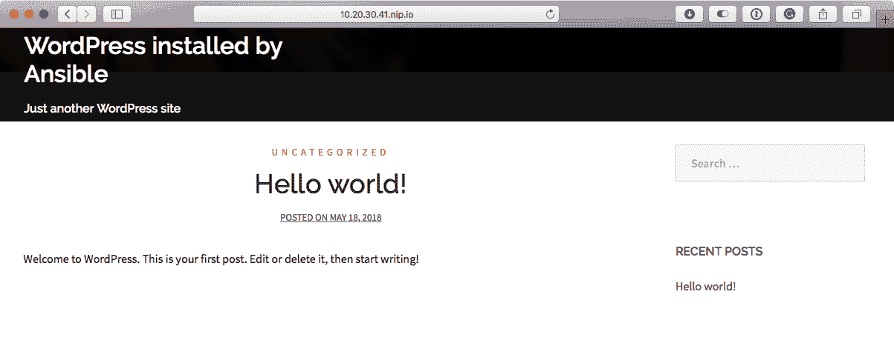
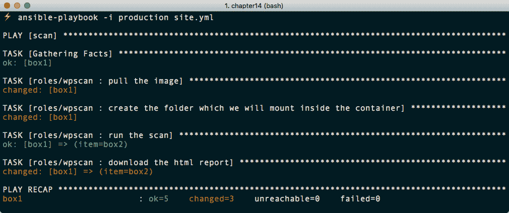
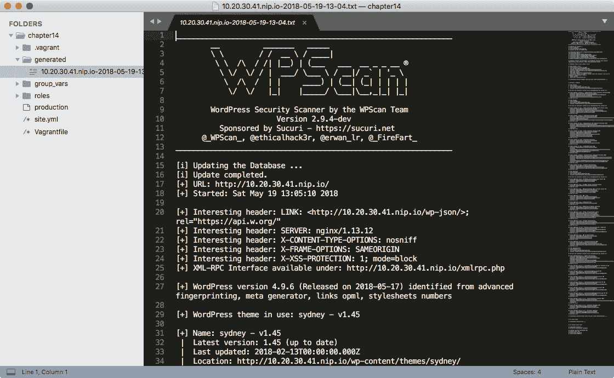
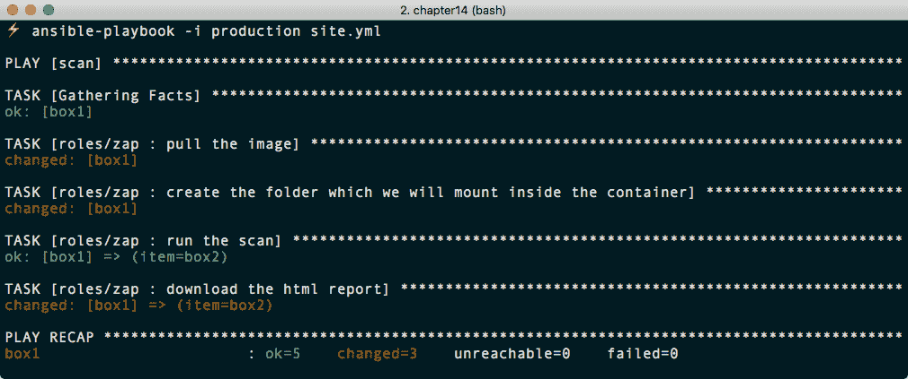
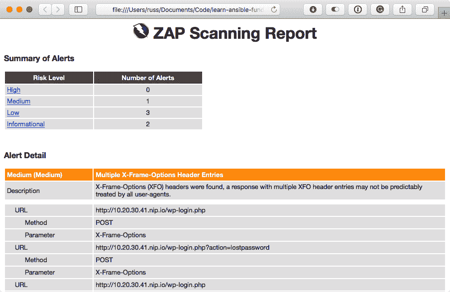

# 第十四章：部署 WPScan 和 OWASP ZAP

在本章中，我们将介绍创建一个 playbook，部署和运行两个安全工具 WPScan 和 OWASP ZAP。然后，使用之前章节的 playbooks，我们将启动一个 WordPress 安装供我们扫描。

与其他章节一样，我们将使用 Vagrant 和我们已经下载的框之一。您可以在[`github.com/PacktPublishing/Learn-Ansible/tree/master/Chapter14`](https://github.com/PacktPublishing/Learn-Ansible/tree/master/Chapter14)找到完整的 playbook 副本。

# 准备框

在本章中，我们将启动两个 Vagrant 框，第一个将用于安装扫描工具。此主机将安装了 Docker，并且我们将使用 Docker Ansible 模块与该软件进行交互。第二个框将包含或托管 WordPress 安装，扫描工具将针对其进行扫描。

创建一个包含以下内容的`Vagrantfile`：

```
# -*- mode: ruby -*-
# vi: set ft=ruby :

API_VERSION = "2"
BOX_NAME = "centos/7"
BOX_IP_SCAN = "10.20.30.40"
BOX_IP_WP = "10.20.30.41"
DOMAIN = "nip.io"
PRIVATE_KEY = "~/.ssh/id_rsa"
PUBLIC_KEY = '~/.ssh/id_rsa.pub'

```

```
Vagrant.configure(API_VERSION) do |config|

  config.vm.define :scan do |scan| 
    scan.vm.box = BOX_NAME
    scan.vm.network "private_network", ip: BOX_IP_SCAN
    scan.vm.host_name = BOX_IP_SCAN + '.' + DOMAIN
    scan.ssh.insert_key = false
    scan.ssh.private_key_path = [PRIVATE_KEY, "~/.vagrant.d/insecure_private_key"]
    scan.vm.provision "file", source: PUBLIC_KEY, destination: "~/.ssh/authorized_keys"
  end

  config.vm.define :wp do |wp| 
    wp.vm.box = BOX_NAME
    wp.vm.network "private_network", ip: BOX_IP_WP
    wp.vm.host_name = BOX_IP_WP + '.' + DOMAIN
    wp.ssh.insert_key = false
    wp.ssh.private_key_path = [PRIVATE_KEY, "~/.vagrant.d/insecure_private_key"]
    wp.vm.provision "file", source: PUBLIC_KEY, destination: "~/.ssh/authorized_keys"
  end

  config.vm.provider "virtualbox" do |v|
    v.memory = "2024"
    v.cpus = "2"
  end

  config.vm.provider "vmware_fusion" do |v|
    v.vmx["memsize"] = "2024"
    v.vmx["numvcpus"] = "2"
  end

end
```

如您所见，我们将启动两个 CentOS 7 框，一个标记为`scan`，其主机名为`10.20.30.40.nip.io`，另一个为`wp`，其主机名为`10.20.30.41.nip.io`。

主机清单文件，通常称为 production，包含以下内容：

```
box1 ansible_host=10.20.30.40.nip.io
box2 ansible_host=10.20.30.41.nip.io

[scan]
box1

[wordpress]
box2

[boxes]
box1
box2

[boxes:vars]
ansible_connection=ssh
ansible_user=vagrant
ansible_private_key_file=~/.ssh/id_rsa
host_key_checking=False
```

如您所见，我们定义了三个主机组；第一组名为`scan`，包括我们将用于运行扫描工具的单个主机。第二组`wordpress`，虽然只包含一个主机，但可以列出多个主机，并且扫描应该针对它们所有。第三组名为`boxes`，已被定义为将连接配置应用于我们在 playbook 中添加的所有主机的一种方式。

您可以使用以下两个命令之一启动这两个框：

```
$ vagrant up
$ vagrant up --provider=vmware_fusion
```

现在我们的 Vagrant 框已经启动并运行，我们可以看一下我们的 playbook 是什么样子的。

# WordPress playbook

正如您已经猜到的那样，这将非常简单，因为我们已经编写了一个在 CentOS 7 主机上部署 WordPress 的 playbook。实际上，我们唯一需要做的就是从存储库的`Chapter05/lemp`文件夹中复制`group_vars`、`roles`文件夹及其内容，以及`site.yml`文件，然后我们就完成了。

这是使用 Ansible 这样的工具的一个巨大优势：写一次，多次使用；我们唯一要做的更改是在添加部署软件的 plays 时更改`site.yml`文件。

# 扫描 playbook

如前所述，我们将使用 Docker 来运行 WPScan 和 OWASP ZAP。这样做的原因是，如果我们直接在主机上安装这两个软件包，我们将最终部署相当多的支持软件。虽然这不是问题，但使用诸如 Docker 这样的工具可以简化安装过程，并给我们一个借口来介绍 Docker Ansible 模块。

# Docker 角色

与我们迄今为止创建的所有角色一样，我们将使用`ansible-galaxy`命令来生成我们角色的结构：

```
$ ansible-galaxy init roles/docker
```

对于我们的 Docker 安装，我们将使用 Docker 自己提供的`yum`存储库；这意味着在安装 Docker 之前，需要启用存储库。一旦启用，我们将能够安装最新的稳定版本。让我们首先在`roles/docker/defaults/main.yml`中填充一些默认值：

```
docker:
  gpg_key: "https://download.docker.com/linux/centos/gpg"
  repo_url: "https://download.docker.com/linux/centos/docker-ce.repo"
  repo_path: "/etc/yum.repos.d/docker-ce.repo"
  packages:
    - "docker-ce"
    - "device-mapper-persistent-data"
    - "lvm2"
    - "python-setuptools"
    - "libselinux-python"
  pip:
    - "docker"
```

正如你所看到的，我们正在定义存储库的 GPG 密钥的 URL，存储库文件的 URL，以及存储库文件应该被复制到主机的位置。我们还列出了需要安装的软件包列表，以使 Docker 正常运行。最后，我们有用于 Docker 的 Python 软件包，这将允许 Ansible 与我们的 Vagrant box 上的 Docker API 进行交互。

在使用任何已定义的变量之前，我们需要确保我们运行的主机的软件包是最新的，因此`roles/docker/tasks/main.yml`中的第一个任务应该执行`yum update`：

```
- name: update all of the installed packages
  yum:
    name: "*"
    state: "latest"
    update_cache: "yes"
```

现在我们的主机已经更新，我们可以添加 GPG 密钥；对此，我们将使用`rpm_key`模块，我们只需提供要安装的密钥的 URL 或文件路径：

```
- name: add the gpg key for the docker repo
  rpm_key:
    key: "{{ docker.gpg_key }}"
    state: "present"
```

现在我们已经安装了 GPG 密钥，我们可以从 Docker 下载`docker-ce.repo`文件，并将其存储在`yum`在下次执行时会使用的位置：

```
- name: add docker repo from the remote url
  get_url:
    url: "{{ docker.repo_url }}"
    dest: "{{ docker.repo_path }}"
    mode: "0644"
```

如您所见，我们使用`get_url`模块下载文件并将其放置在主机机器上的`/etc/yum.repos.d/`中；我们还设置了文件的读、写和执行权限为`0644`。

现在我们已经配置了 Docker 存储库，我们可以通过添加以下任务来安装我们定义的软件包：

```
- name: install the docker packages
  yum:
    name: "{{ item }}"
    state: "installed"
    update_cache: "yes"
  with_items: "{{ docker.packages }}"
```

我们添加了`update_cache`选项，因为我们刚刚添加了一个新的存储库，并希望确保它被识别。接下来，我们必须使用`pip`安装 Docker Python 包；默认情况下，`pip`未安装，因此我们需要确保它首先可用，方法是使用`easy_install`，而`easy_install`又是由先前的任务安装的`python-setuptools`软件包安装的。有一个`easy_install`模块，因此这个任务很简单：

```
- name: install pip
  easy_install:
    name: pip
    state: latest
```

现在 pip 可用，我们可以使用`pip`模块来安装 Docker Python 库：

```
- name: install the python packages
  pip:
    name: "{{ item }}"
  with_items: "{{ docker.pip }}"
```

倒数第二个任务是在 Vagrant 虚拟机上禁用 SELinux：

```
- name: put selinux into permissive mode
  selinux:
    policy: targeted
    state: permissive
```

默认情况下，由 Docker 提供的 Docker 版本不会自动在 CentOS/Red Hat 服务器上启动，因此这个角色的最后一个任务是启动 Docker 服务，并确保它配置为在启动时启动：

```
- name: start docker and configure to start on boot
  service:
    name: "docker"
    state: "started"
    enabled: "yes"
```

我们在 playbook 运行的这一部分完成之前完成了这个步骤，而不是使用处理程序，因为 playbook 需要在完成之前与 Docker 交互。由于处理程序只在 playbook 运行结束时调用，这意味着我们的 playbook 的下一部分将失败。在开始下载和运行容器之前，让我们快速运行 playbook。

# 测试 playbook

由于我们已经有了所有基本角色，我们可以尝试运行 playbook；在这样做之前，我们需要更新`site.yml`以包括我们扫描主机的操作：

```
---

- hosts: scan
  gather_facts: true
  become: yes
  become_method: sudo

  vars_files:
    - group_vars/common.yml

  roles:
    - roles/docker

- hosts: wordpress
  gather_facts: true
  become: yes
  become_method: sudo

  vars_files:
    - group_vars/common.yml

  roles:
    - roles/stack-install
    - roles/stack-config
    - roles/wordpress
```

更新后，我们可以使用以下代码运行我们的 playbook：

```
$ ansible-playbook -i production site.yml
```

这应该给我们类似以下的输出：

```
PLAY [scan] *************************************************************************************

TASK [Gathering Facts] **************************************************************************
ok: [box1]

TASK [roles/docker : update all of the installed packages] **************************************
changed: [box1]

TASK [roles/docker : add the gpg key for the docker repo] ***************************************
changed: [box1]

TASK [roles/docker : add docker repo from the remote url] ***************************************
changed: [box1]

TASK [roles/docker : install the docker packages] ***********************************************
changed: [box1] => (item=[u'docker-ce', u'device-mapper-persistent-data', u'lvm2', u'python-setuptools', u'libselinux-python'])

TASK [roles/docker : install pip] ***************************************************************
changed: [box1]

TASK [roles/docker : install the python packages] ***********************************************
changed: [box1] => (item=docker)

TASK [roles/docker : put selinux into permissive mode] ******************************************
changed: [box1]

TASK [roles/docker : start docker and configure to start on boot] *******************************
changed: [box1]

PLAY [wordpress] ********************************************************************************

TASK [Gathering Facts] **************************************************************************
ok: [box2]

TASK [roles/stack-install : install the repo packages] ******************************************
changed: [box2] => (item=[u'epel-release', u'https://centos7.iuscommunity.org/ius-release.rpm'])

TASK [roles/stack-install : add the NGINX mainline repo] ****************************************
changed: [box2]

TASK [roles/stack-install : update all of the installed packages] *******************************
changed: [box2]

TASK [roles/stack-install : remove the packages so that they can be replaced] *******************
changed: [box2] => (item=[u'mariadb-libs.x86_64'])

TASK [roles/stack-install : install the stack packages] *****************************************
changed: [box2] => (item=[u'postfix', u'MySQL-python', u'policycoreutils-python', u'nginx', u'mariadb101u', u'mariadb101u-server', u'mariadb101u-config', u'mariadb101u-common', u'mariadb101u-libs', u'php72u', u'php72u-bcmath', u'php72u-cli', u'php72u-common', u'php72u-dba', u'php72u-fpm', u'php72u-fpm-nginx', u'php72u-gd', u'php72u-intl', u'php72u-json', u'php72u-mbstring', u'php72u-mysqlnd', u'php72u-process', u'php72u-snmp', u'php72u-soap', u'php72u-xml', u'php72u-xmlrpc', u'vim-enhanced', u'git', u'unzip'])

TASK [roles/stack-config : add the wordpress user] **********************************************
changed: [box2]

TASK [roles/stack-config : copy the nginx.conf to /etc/nginx/] **********************************
changed: [box2]

TASK [roles/stack-config : create the global directory in /etc/nginx/] **************************
changed: [box2]

TASK [roles/stack-config : copy the restrictions.conf to /etc/nginx/global/] ********************
changed: [box2]

TASK [roles/stack-config : copy the wordpress_shared.conf to /etc/nginx/global/] ****************
changed: [box2]

TASK [roles/stack-config : copy the default.conf to /etc/nginx/conf.d/] *************************
changed: [box2]

TASK [roles/stack-config : copy the www.conf to /etc/php-fpm.d/] ********************************
changed: [box2]

TASK [roles/stack-config : configure php.ini] ***************************************************
changed: [box2] => (item={u'regexp': u'^;date.timezone =', u'replace': u'date.timezone = Europe/London'})
changed: [box2] => (item={u'regexp': u'^expose_php = On', u'replace': u'expose_php = Off'})
changed: [box2] => (item={u'regexp': u'^upload_max_filesize = 2M', u'replace': u'upload_max_filesize = 20M'})

TASK [roles/stack-config : start php-fpm] *******************************************************
changed: [box2]

TASK [roles/stack-config : start nginx] *********************************************************
changed: [box2]

TASK [roles/stack-config : configure the mariadb bind address] **********************************
changed: [box2]

TASK [roles/stack-config : start mariadb] *******************************************************
changed: [box2]

TASK [roles/stack-config : change mysql root password] ******************************************
changed: [box2] => (item=127.0.0.1)
changed: [box2] => (item=::1)
changed: [box2] => (item=10.20.30.41.nip.io)
changed: [box2] => (item=localhost)

TASK [roles/stack-config : set up .my.cnf file] *************************************************
changed: [box2]

TASK [roles/stack-config : delete anonymous MySQL user] *****************************************
ok: [box2] => (item=127.0.0.1)
ok: [box2] => (item=::1)
changed: [box2] => (item=10.20.30.41.nip.io)
changed: [box2] => (item=localhost)

TASK [roles/stack-config : remove the MySQL test database] **************************************
changed: [box2]

TASK [roles/stack-config : set the selinux allowing httpd_t to be permissive is required] *******
changed: [box2]

TASK [roles/wordpress : download wp-cli] ********************************************************
changed: [box2]

TASK [roles/wordpress : update permissions of wp-cli to allow anyone to execute it] *************
changed: [box2]

TASK [roles/wordpress : create the wordpress database] ******************************************
changed: [box2]

TASK [roles/wordpress : create the user for the wordpress database] *****************************
changed: [box2] => (item=127.0.0.1)
ok: [box2] => (item=::1)
ok: [box2] => (item=10.20.30.41.nip.io)
ok: [box2] => (item=localhost)

TASK [roles/wordpress : are the wordpress files already there?] *********************************
ok: [box2]

TASK [roles/wordpress : download wordpresss] ****************************************************
changed: [box2]

TASK [roles/wordpress : set the correct permissions on the homedir] *****************************
changed: [box2]

TASK [roles/wordpress : is wordpress already configured?] ***************************************
ok: [box2]

TASK [roles/wordpress : configure wordpress] ****************************************************
changed: [box2]

TASK [roles/wordpress : do we need to install wordpress?] ***************************************
fatal: [box2]: FAILED! =>
...ignoring

TASK [roles/wordpress : install wordpress if needed] ********************************************
changed: [box2]

TASK [roles/wordpress : do we need to install the plugins?] *************************************
failed: [box2] (item=jetpack) =>
failed: [box2] (item=wp-super-cache) =>
failed: [box2] (item=wordpress-seo) =>
failed: [box2] (item=wordfence) =>
failed: [box2] (item=nginx-helper) =>
...ignoring

TASK [roles/wordpress : set a fact if we don't need to install the plugins] *********************
skipping: [box2]

TASK [roles/wordpress : set a fact if we need to install the plugins] ***************************
ok: [box2]

TASK [roles/wordpress : install the plugins if we need to or ignore if not] *********************
changed: [box2] => (item=jetpack)
changed: [box2] => (item=wp-super-cache)
changed: [box2] => (item=wordpress-seo)
changed: [box2] => (item=wordfence)
changed: [box2] => (item=nginx-helper)

TASK [roles/wordpress : do we need to install the theme?] ***************************************
fatal: [box2]: FAILED! =>
...ignoring

TASK [roles/wordpress : set a fact if we don't need to install the theme] ***********************
skipping: [box2]

TASK [roles/wordpress : set a fact if we need to install the theme] *****************************
ok: [box2]

TASK [roles/wordpress : install the theme if we need to or ignore if not] ***********************
changed: [box2]

RUNNING HANDLER [roles/stack-config : restart nginx] ********************************************
changed: [box2]

RUNNING HANDLER [roles/stack-config : restart php-fpm] ******************************************
changed: [box2]

PLAY RECAP **************************************************************************************
box1 : ok=9 changed=8 unreachable=0 failed=0
box2 : ok=42 changed=37 unreachable=0 failed=0
```

如您所见，这已经执行了完整的 Docker 和 WordPress 安装；打开`http://10.20.30.41.nip.io/`将带您进入 WordPress 站点：



现在我们的 WordPress 站点已经运行起来了，我们可以开始执行扫描站点的角色。

# WPScan 角色

我们要创建的第一个角色是运行 WPScan 的角色。WPScan 是一个执行 WordPress 站点扫描的工具；它尝试确定正在运行的 WordPress 版本，并检查是否有已知漏洞的插件。它还可以尝试暴力破解管理员用户帐户；但是，我们将跳过这一步。

与往常一样，我们可以使用以下命令引导角色：

```
$ ansible-galaxy init roles/wpscan
```

文件放置好后，我们需要将以下内容添加到`roles/wpscan/defaults/main.yml`中：

```
image: "wpscanteam/wpscan"
log:
  remote_folder: /tmp/wpscan/
  local_folder: "generated/"
  file: "{{ ansible_date_time.date }}-{{ ansible_date_time.hour }}-{{ ansible_date_time.minute }}.txt"
```

这设置了我们想要从 Docker Hub 下载的镜像；在这种情况下，它是来自 WPScan 团队的官方 WPScan 镜像。然后，我们设置了我们希望用于日志的变量；您可能注意到我们正在为日志定义一个文件夹和文件名。

接下来，我们需要将任务添加到`roles/wpscan/tasks/main.yml`中，其中第一个任务使用`docker_image`模块来拉取`wpscanteam/wpscan`镜像的副本：

```
- name: pull the image
  docker_image:
    name: "{{ image }}"
```

接下来，我们需要创建一个文件夹，用于将日志写入我们的 Vagrant 虚拟机：

```
- name: create the folder which we will mount inside the container
  file:
    path: "{{ log.remote_folder }}"
    state: "directory"
    mode: "0777"
```

我们这样做的原因是，我们将在下一个任务中启动的容器内挂载此文件夹。由于日志是我们希望保留的每次扫描中的唯一数据，因此我们将它们写入挂载的文件夹，这意味着一旦容器退出并删除，我们就可以将日志复制到我们的 Ansible 控制器上。

在我们看下一个任务之前，让我们快速看一下如果我们直接在命令行上使用 Docker 来启动扫描，我们需要运行的命令：

```
$ docker container run -it --rm --name wpscan -v /tmp/wpscan/:/tmp/wpscan/ wpscanteam/wpscan \
 -u http://10.20.30.41.nip.io/ --update --enumerate --log /tmp/wpscan/10.20.30.41.nip.io-2018-05-19-12-16.txt
```

命令的第一行是 Docker 逻辑发生的地方；我们要求 Docker 做的是在前台(`-it`)启动(`run`)一个名为 wpscan 的容器(`--name`)，将主机上的`/tmp/wpscan/`挂载到容器内的`/tmp/wpscan/`(`-v`)，使用指定的镜像(`wpscanteam/wpscan`)。一旦进程退出，我们就移除容器(`--rm`)。

第二行的所有内容都传递给容器的默认入口点，在`wpscanteam/wpscan`镜像的情况下，入口点是`/wpscan/wpscan.rb`，这意味着我们在容器内运行扫描的命令实际上是这样的：

```
$ /wpscan/wpscan.rb -u http://10.20.30.41.nip.io/ --update --enumerate --log /tmp/wpscan/10.20.30.41.nip.io-2018-05-19-12-16.txt
```

现在我们知道了使用 Docker 运行命令的想法，我们可以看看在我们的任务中它会是什么样子：

```
- name: run the scan
  docker_container:
    detach: false
    auto_remove: true
    name: "wpscan"
    volumes: "{{ log.remote_folder }}:{{ log.remote_folder }}"
    image: "{{ image }}"
    command: "--url http://{{ hostvars[item]['ansible_host'] }} --update --enumerate --log {{ log.remote_folder }}{{ hostvars[item]['ansible_host'] }}-{{ log.file }}"
  register: docker_scan
  failed_when: docker_scan.rc == 0 or docker_scan.rc >= 2
  with_items: "{{ groups['wordpress'] }}"
```

任务中的选项的顺序与 Docker 命令中编写的顺序相同：

+   `detach: false`类似于传递`-it`，它将在前台运行容器；默认情况下，`docker_container`模块在后台运行容器。这引入了一些挑战，我们很快会讨论。

+   `auto_remove: true`与`--rm`相同。

+   `name: "wpscan"`与运行`--name wpscan`完全相同。

+   `volumes:"{{ log.remote_folder }}:{{ log.remote_folder }}"`与在 Docker 中使用`-v`标志传递的内容相同。

+   `image: "{{ image }}"`相当于只传递镜像名称，例如`wpscanteam/wpscan`。

+   最后，`command`包含了我们想要传递给入口点的所有内容；正如你所看到的，我们在这里传递了一些动态变量。

如前所述，默认情况下，`docker_container`模块在后台运行容器；在大多数情况下，这通常是很好的；然而，由于我们只是将容器作为一次性任务来执行我们的扫描，所以我们需要在前台运行它。

这样做实际上会导致错误，因为我们指示 Ansible 保持连接到一个容器，然后一旦扫描过程完成，容器就会终止并被移除。为了解决这个问题，我们正在注册任务的结果，而不是使用`ignore_errors`，我们告诉任务在返回代码(`rc`)等于`0`或等于或大于`2`时失败(`failed_when`)，因为我们的任务应该始终有一个返回代码为`1`。

那么为什么不让容器在后台运行呢？因为下一个任务会将日志文件从 Vagrant 框复制到 Ansible 控制器，如果我们让容器在后台运行，Ansible 将立即转移到下一个任务并复制一个部分写入的文件。

连接到容器并等待其退出意味着我们正在等待扫描完成，然后再进行下一个任务，看起来像这样：

```
- name: download the html report
  fetch:
    src: "{{ log.remote_folder }}{{ hostvars[item]['ansible_host'] }}-{{ log.file }}"
    dest: "{{ log.local_folder }}{{ hostvars[item]['ansible_host'] }}-{{ log.file }}"
    flat: yes
  with_items: "{{ groups['wordpress'] }}"
```

现在我们已经编写了我们的任务，我们可以尝试运行我们的角色。

# 运行 WPScan

要运行扫描，更新`site.yml`文件，使其看起来像下面的代码：

```
- hosts: wordpress
  gather_facts: true
  become: yes
  become_method: sudo

  vars_files:
    - group_vars/common.yml

```

```
  roles:
    - roles/stack-install
    - roles/stack-config
    - roles/wordpress

- hosts: scan
  gather_facts: true
  become: yes
  become_method: sudo

  vars_files:
    - group_vars/common.yml

  roles:
    - roles/docker
    - roles/wpscan
```

然后运行以下命令：

```
$ ansible-playbook -i production site.yml
```

这应该给你以下结果（截图只显示了扫描而不是完整的 playbook 运行，你应该看到）：



此外，你应该在生成的文件夹中找到一个日志文件；其中包含了 WPScan 运行的结果：



正如你所看到的，这里有相当多的信息；然而，由于我们是从头开始部署 WordPress 安装，我们应该有一个干净的健康状况。

# OWASP ZAP 角色

既然我们已经介绍了如何在 WPScan 角色中使用 Ansible 运行容器的基础知识，那么创建运行 OWASP ZAP 的角色应该很简单；我们只需使用这个命令：

```
$ ansible-galaxy init roles/zap
```

**Open Web Application Security Project Zed Attack Proxy**或**OWASP ZAP**，是一个开源的 Web 应用安全扫描器。

`roles/zap/defaults/main.yml`中角色的默认值应包含此代码：

```
image: "owasp/zap2docker-stable"
log:
  remote_folder: /tmp/zap/
  local_folder: "generated/"
  file: "{{ ansible_date_time.date }}-{{ ansible_date_time.hour }}-{{ ansible_date_time.minute }}.html"
```

正如您所看到的，我们使用`owasp/zap2docker-stable`镜像，同时我们还在 Vagrant 框中使用`/tmp/zap/`文件夹来存储报告文件。

继续进行`roles/zap/tasks/main.yml`中的任务，我们正在拉取镜像并创建文件夹，就像我们在 WPScan 角色中所做的那样：

```
- name: pull the image
  docker_image:
    name: "{{ image }}"

- name: create the folder which we will mount inside the container
  file:
    path: "{{ log.remote_folder }}"
    state: "directory"
    mode: "0777"
```

让我们看看我们将要运行的`docker`命令，以找出我们需要在下一个任务中放入什么：

```
$ docker container run -it --rm --name zap -v /tmp/zap/:/zap/wrk/ owasp/zap2docker-stable \
 zap-baseline.py -t http://10.20.30.41.nip.io/ -g gen.conf -r 10.20.30.41.nip.io-2018-05-19-14-26.html
```

正如您所看到的，该命令使用了我们之前使用的所有选项；在我们将文件夹挂载到容器中的位置上有所不同，因为 OWASP ZAP 希望我们将要保存的任何文件写入`/zap/wrk/`。这意味着当给出报告名称时，我们不必提供完整的文件系统路径，因为应用程序将默认写入`/zap/wrk/`。

这意味着启动容器的任务应该如下代码所示：

```
- name: run the scan
  docker_container:
    detach: false
    auto_remove: true
    name: "zap"
    volumes: "{{ log.remote_folder }}:/zap/wrk/"
    image: "{{ image }}"
    command: "zap-baseline.py -t http://{{ hostvars[item]['ansible_host'] }} -g gen.conf -r {{ hostvars[item]['ansible_host'] }}-{{ log.file }}"
  register: docker_scan
  failed_when: docker_scan.rc == 0 or docker_scan.rc >= 2
  with_items: "{{ groups['wordpress'] }}"
```

然后我们使用以下任务下载报告：

```
- name: download the html report
  fetch:
    src: "{{ log.remote_folder }}{{ hostvars[item]['ansible_host'] }}-{{ log.file }}"
    dest: "{{ log.local_folder }}{{ hostvars[item]['ansible_host'] }}-{{ log.file }}"
    flat: yes
  with_items: "{{ groups['wordpress'] }}"
```

现在我们已经安排好了任务，我们可以运行该角色。

# 运行 OWASP ZAP

要运行扫描，我们只需将该角色附加到我们的`site.yml`文件的末尾。添加后，运行以下命令：

```
$ ansible-playbook -i production site.yml
```

这将运行 playbook；输出的摘要副本可以在此处找到：



然后将 HTML 文件复制到生成的文件夹中；文件应该类似于以下内容：



现在，您可以使用以下命令删除 Vagrant 框：

```
$ vagrant destroy
```

然后重新启动框并完整运行 playbook。

# 摘要

在本章中，我们已经看到如何将 Ansible 与 Docker 结合使用，以启动两种不同的工具，对我们使用 Ansible playbook 启动的 WordPress 安装进行外部漏洞扫描。这显示了我们如何可以启动一些相当复杂的工具，而无需担心直接在我们的主机上编写 playbook 来安装、配置和管理它们。

在下一章中，我们将离开命令行，看一下由红帽提供的 Ansible 的两个基于 Web 的界面。

# 问题

1.  为什么我们使用 Docker 而不是直接在我们的 Vagrant 框上安装 WPScan 和 OWASP ZAP？

1.  真或假：`pip`默认安装在我们的 Vagrant 框中。

1.  我们需要安装哪个 Python 模块才能使 Ansible Docker 模块正常运行的模块名称是什么？

1.  更新`Vagrantfile`和`production`文件，以启动第二个 WordPress Vagrant 框并扫描它们。

# 进一步阅读

有关本章中使用的工具的更多信息，请参阅以下链接：

+   **Docker**：[`docker.com`](https://docker.com)

+   **WPScan**：[`wpscan.org`](https://wpscan.org)

+   **OWASP ZAP**：[`www.owasp.org/index.php/OWASP_Zed_Attack_Proxy_Project`](https://www.owasp.org/index.php/OWASP_Zed_Attack_Proxy_Project)
