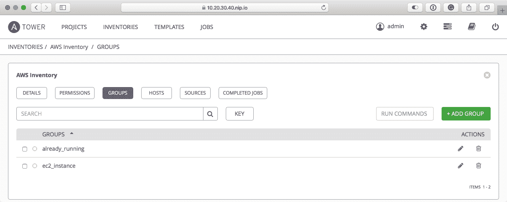

# 第十五章：介绍 Ansible Tower 和 Ansible AWX

在本章中，我们将研究 Ansible 的两个图形界面，商业版的 Ansible Tower 和开源版的 Ansible AWX。我们将讨论如何安装它们，它们的区别，以及为什么您需要使用它们。毕竟，我们现在已经进行了 15 章的 Ansible 之旅，但还没有需要使用图形界面。

在本章结束时，我们将有：

+   安装了 Ansible Tower 和 Ansible AWX

+   配置了两个工具

+   使用 Ansible Tower 部署了我们的高可用云应用

# 技术要求

我们将使用 Vagrant box 在本地查看使用 Ansible Tower 和 Ansible AWX；我们还将使用我们在第十章中涵盖的 playbook，*高可用云部署*。最终的 playbook 可以在 GitHub 存储库[`github.com/PacktPublishing/Learn-Ansible/tree/master/Chapter15`](https://github.com/PacktPublishing/Learn-Ansible/tree/master/Chapter15)中找到。

# 基于 Web 的 Ansible

在我们查看安装工具之前，我们应该先花时间讨论为什么我们需要它们以及它们之间的区别。

我相信您已经开始注意到我们迄今为止所涵盖的所有 playbook 之间的共同点——在可能的情况下，我们允许我们运行的角色使用尽可能多的参数。这使得我们可以轻松地更改 playbook 运行的输出，而无需直接重写或编辑角色。因此，我们也应该很容易开始使用 Red Hat 提供的两个基于 Web 的工具之一来管理您的 Ansible 部署。

Ansible Tower 是一个商业许可的基于 Web 的图形界面，用于 Ansible。正如前面提到的，您可能很难看到其中的价值。想象一下，将 Ansible 连接到公司的活动目录，并让开发人员等用户使用 Ansible Tower 根据您的 playbook 部署自己的环境，为您提供一种受控的方式来在整个系统中保持一致性，同时允许自助服务。

当 Red Hat 在 2015 年 10 月宣布收购 Ansible 时，发布的 FAQ 中提出的一个问题是：*Red Hat 是否会开源 Ansible 的所有技术？*之所以提出这个问题，是因为 Red Hat 在多年来收购的其他技术中，几乎已经开源了它们的所有方面，不仅邀请社区贡献，还测试和构建新功能，最终使其进入了 Red Hat 的商业支持版本。

其中一个例子是 Fedora 项目。该项目是 Red Hat 企业 Linux 功能的开源上游，包括 Fedora 用户现在正在利用的 DNF，这是 YUM 的替代品。自 2015 年以来，这一直是 Fedora 的默认软件包管理器，如果一切顺利，它应该会进入 Red Hat 企业 Linux 8。

Red Hat 开源其技术的其他示例包括 WildFly，这是 JBoss 的上游，以及由 Red Hat 赞助的 ManageIQ，它是 Red Hat CloudForms 的基础。

2017 年 9 月，Red Hat 宣布将发布 Ansible AWX，这是 Ansible Tower 的开源上游。该项目将与 AWX 团队一起进行每两周的发布，使某些发布版本*稳定*，尽管在这种情况下，稳定并不意味着项目已经准备投入生产，因为该项目仍处于初始开发周期中。

# Ansible Tower

我们将从查看 Ansible Tower 开始。正如您可能还记得的那样，这是商业软件，所以我们需要许可证；幸运的是，Red Hat 提供了试用许可证。您可以通过点击[`www.ansible.com/`](https://www.ansible.com/)上的“尝试 Tower 免费”按钮来请求。

请注意，您必须使用一个商业地址，Ansible 不会接受来自`me.com`、`icloud.com`、`gmail.com`、`hotmain.com`等邮箱地址的请求。

过一会儿，您将收到一封类似以下内容的电子邮件：


点击“立即下载塔（.TAR）”按钮；这将打开您的浏览器并下载一个包含我们将用来部署 Ansible Tower 的 playbooks 的 TAR 文件。接下来，我们需要一个服务器来托管我们的 Ansible Tower 安装。让我们使用我们在其他章节中使用过的`Vagrantfile`：

```
# -*- mode: ruby -*-
# vi: set ft=ruby :

API_VERSION = "2"
BOX_NAME = "centos/7"
BOX_IP = "10.20.30.40"
DOMAIN = "nip.io"
PRIVATE_KEY = "~/.ssh/id_rsa"
PUBLIC_KEY = '~/.ssh/id_rsa.pub'

Vagrant.configure(API_VERSION) do |config|
  config.vm.box = BOX_NAME
  config.vm.network "private_network", ip: BOX_IP
  config.vm.host_name = BOX_IP + '.' + DOMAIN
  config.ssh.insert_key = false
  config.ssh.private_key_path = [PRIVATE_KEY, "~/.vagrant.d/insecure_private_key"]
  config.vm.provision "file", source: PUBLIC_KEY, destination: "~/.ssh/authorized_keys"

  config.vm.provider "virtualbox" do |v|
    v.memory = "2024"
    v.cpus = "2"
  end

  config.vm.provider "vmware_fusion" do |v|
    v.vmx["memsize"] = "2024"
    v.vmx["numvcpus"] = "2"
  end

end
```

一旦`Vagrantfile`就位，您可以使用以下命令之一启动 Vagrant 框：

```
$ vagrant up
$ vagrant up --provider=vmware_fusion
```

一旦您的 Vagrant 框已经启动运行，您可以查看需要对清单进行的更改，这些更改包含在我们下载的 TAR 文件中。

# 更新清单文件

在未解压的文件夹的顶层提供了几个文件，要解压文件夹，请双击 TAR 文件：


我们只需要担心`inventory`文件；在文本编辑器中打开文件并更新它，使其看起来像以下内容：

```
[tower]
10.20.30.40.nip.io ansible_connection=ssh ansible_user=vagrant ansible_private_key_file=~/.ssh/id_rsa host_key_checking=False

[database]

[all:vars]
admin_password='password'

pg_host=''
pg_port=''

pg_database='awx'
pg_username='awx'
pg_password='iHpkiPEAHpGeR8paCoVhwLPH'

rabbitmq_port=5672
rabbitmq_vhost=tower
rabbitmq_username=tower
rabbitmq_password='WUwTLJK2AtdxCfopcXFQoVYs'
rabbitmq_cookie=cookiemonster

# Needs to be true for fqdns and ip addresses
rabbitmq_use_long_name=true

# Isolated Tower nodes automatically generate an RSA key for authentication;
# To disable this behavior, set this value to false
# isolated_key_generation=true
```

正如您所看到的，我们已经更新了`[tower]`组下列出的主机，以包括我们的 Vagrant 框的详细信息和配置；我们还为`admin_password`、`pg_password`和`rabbitmq_password`参数添加了密码。显然，您可以设置自己的密码，而不是使用这里列出的密码。

文件的最终更改是将`rabbitmq_use_long_name`从`false`更新为`true`。如果不这样做，将导致 RabbitMQ 服务无法启动。

# 运行 playbook

现在我们已经更新了`inventory`文件，我们可以运行`install.yml` playbook 来启动 Ansible Tower 的安装。要做到这一点，请运行以下命令：

```
$ ansible-playbook -i inventory --become install.yml
```

playbook 中内置了检查，以查看 playbook 是否作为 root 用户运行。在典型的安装中，playbook 期望您在要安装 Ansible Tower 的机器上以 root 用户身份运行 playbook。然而，我们正在稍微不同的方式进行，因此我们需要使用`--become`标志。

安装过程大约需要 20 分钟，正如您从以下输出中所看到的，安装程序会执行许多任务：


# 请求许可

现在我们已经安装了 Ansible Tower，还有一些步骤需要完成安装。第一步是登录；要做到这一点，请在浏览器中输入以下 URL：`https://10.20.30.40.nip.io/`。当您首次打开 Tower 时，将会收到有关 SSL 证书的警告；这是因为在部署期间安装的证书是自签名的。可以安全地继续。

现在您应该看到一个登录页面；将用户名输入为`admin`，密码输入为`password`，这是我们之前在`inventory`文件中设置的：


然后点击“登录”按钮；这将带您到一个页面，指示您输入许可文件：


点击“请求许可”按钮将带您到[`www.ansible.com/license/`](https://www.ansible.com/license/)；在这里，您可以选择为您的安装请求两种类型的许可。我们将请求免费的 Ansible Tower 试用版 - 有限功能最多支持 10 个节点的许可。选择许可类型，填写表格，并按提示提交。

过一会儿，您应该会收到几封电子邮件，其中一封欢迎您使用 Ansible Tower。另一封电子邮件包含许可文件。复制附加的许可文件，并在 Tower 许可页面上使用 BROWSE 按钮上传它。还要审查并同意最终用户协议。上传许可文件并同意最终用户许可协议后，点击提交。

几秒钟后，您将首次看到 Ansible Tower 的外观：


现在我们已经安装了 Ansible Tower，我们可以开始运行我们的第一个 playbook。

# hello world 演示项目

如您所见，我们已经配置了一个项目；这是一个非常基本的项目，它从[`github.com/ansible/ansible-tower-samples/`](https://github.com/ansible/ansible-tower-samples/)下载示例 playbook，并显示消息 Hello World。在运行 playbook 之前，我们首先需要从 GitHub 下载一个副本；要做到这一点，请点击顶部菜单中的 PROJECTS。

您将能够看到列出的 Demo Project。将鼠标悬停在操作下的图标上将为您提供单击时每个图标将执行的描述；我们要点击的是第一个图标，即启动 SCM 更新。不久后，您应该看到 REVISION 和**LAST UPDATED**都已填充：


这意味着 Ansible Tower 现在已从 GitHub 下载了演示 playbook；我们现在可以运行 playbook。要做到这一点，请点击顶部菜单中的 TEMPLATES。

同样，您应该看到有一个名为 Demo Job Template 的模板，并且在该行的右侧有几个图标。我们要点击的是看起来像火箭的图标。点击使用此模板启动作业将运行演示作业；您将被带到一个屏幕，您可以在其中监视作业的进度。

完成后，您应该看到类似以下的内容：


如您所见，在左侧，您可以看到工作本身的概述；这告诉您状态，开始和结束的时间，以及哪个用户请求执行该工作。页面右侧的部分显示了 playbook 的输出，这与我们从命令行执行 playbook 时看到的完全相同。

让我们来运行一些更复杂的东西。

# 启动 AWS playbook

在第十章中，*高可用云部署*，我们通过一个 playbook 来运行 WordPress 的 AWS 核心 Ansible 模块来启动一个集群；在 GitHub 上托管了`aws-wordpress` playbook 的独立版本，网址为[`github.com/russmckendrick/aws-wordpress/`](https://github.com/russmckendrick/aws-wordpress/)。让我们使用这个来使用 Ansible Tower 部署我们的 AWS 集群。

在配置 Ansible Tower 中的 playbook 之前，我们需要对作为 Ansible Tower 安装的一部分部署的一些 Python 模块的版本进行一些清理。这是因为我们的 playbook 的某些部分需要更高版本的 Boto 模块。

为了做到这一点，我们需要通过运行以下命令 SSH 到我们的 Ansible Tower 主机：

```
$ vagrant ssh
```

现在我们以 Vagrant 用户登录，我们可以使用以下命令更改 root：

```
$ sudo -i
```

接下来，我们切换到与 Ansible Tower 使用相同的 Python 环境；为此，我们运行以下命令：

```
$ source /var/lib/awx/venv/ansible/bin/activate
```

现在我们正在使用正确的环境，我们需要使用以下命令升级`boto`库：

```
$ pip install boto boto3 botocore --upgrade
```

更新后，我们可以通过运行退出 Ansible Tower Python 环境：

```
$ deactivate
```

然后，我们使用`exit`命令退出：


现在我们的环境已更新，我们可以继续添加一个新项目。

# 添加一个新项目

我们需要做的第一件事是添加一个新项目；这是我们让 Ansible Tower 知道我们的 playbook 存储库的地方。如前所述，我们将使用一个 GitHub 存储库来存放代码。要添加新项目，点击顶部菜单中的项目，然后点击右侧的+添加按钮，该按钮可以在顶部菜单的图标行下方找到。

在这里，您将被要求输入一些信息；输入以下内容：

+   名称：`AWS 项目`

+   描述：`AWS WordPress 集群`

+   组织：`默认`

+   SCM 类型：GIT

选择 SCM 类型时，将出现第二部分，要求输入源代码存放的详细信息：

+   SCM URL：`https://github.com/russmckendrick/aws-wordpress.git`

+   SCM 分支/标签/提交：主

+   SCM 凭据：留空，因为这是一个公开可访问的存储库

+   清除：打勾

+   更新时删除：打勾

+   启动时更新：打勾

+   缓存超时（秒）：保持为零

输入详细信息后，点击保存。如果现在返回到项目页面，您应该会看到 Ansible 已经下载了 playbook 的源代码：


# 添加凭据

接下来，我们需要让 Ansible Tower 知道在访问我们的 AWS 账户时要使用的凭据；要添加这些凭据，点击顶部菜单中的设置图标（顶部菜单中的齿轮图标），您将被带到一个看起来像以下内容的屏幕：


正如您所看到的，这里有很多不同的选项。您可能已经猜到，我们感兴趣的选项是凭据。点击它将带您到一个页面，该页面会给您一个现有凭据的概述；我们想要添加一些新的凭据，所以点击+添加按钮。

这将带您到一个页面，布局类似于我们添加项目的页面。填写以下信息：

+   名称：`AWS API 凭据`

+   描述：`AWS API 凭据`

+   组织：`默认`

+   凭据类型：点击放大镜图标，选择 Amazon Web Services

选择凭据类型后，将添加第二部分；在这里，您可以输入以下内容：

+   访问密钥：添加您在之前的 AWS 章节中的访问密钥，例如，`AKIAI5KECPOTNTTVM3EDA`

+   秘钥：添加您在之前的 AWS 章节中的秘钥，例如，`Y4B7FFiSWl0Am3VIFc07lgnc/TAtK5+RpxzIGTr`

+   STS 令牌：留空

表单填写完成后，点击保存。保存后，您会注意到密钥被标记为加密：


当您在 Ansible Tower 中保存敏感信息时，它会被加密，您只能选择替换或恢复它。在任何时候，您都不能再查看这些信息。

# 添加库存

现在我们已经有了凭据，我们需要在 Ansible Tower 中重新创建名为`production`的库存文件的内容。作为提醒，文件看起来像下面这样：

```
# Register all of the host groups we will be creating in the playbooks
[ec2_instance]
[already_running]

# Put all the groups into into a single group so we can easily apply one config to it for overriding things like the ssh user and key location
[aws:children]
ec2_instance
already_running

# Finally, configure some bits to allow us access to the instances before we deploy our credentials using Ansible
[aws:vars]
ansible_ssh_user=centos
ansible_ssh_private_key_file=~/.ssh/id_rsa
host_key_checking=False
```

要添加库存，点击顶部菜单中的库存，然后点击+添加按钮。您会注意到+添加按钮现在会弹出一个下拉列表；从该列表中，我们要添加一个库存。

在打开的表单中，输入以下内容：

+   名称：`AWS 库存`

+   描述：`AWS 库存`

+   组织：`默认`

+   洞察凭据：留空

+   洞察组：留空

+   变量：输入以下列出的值：

```
ansible_ssh_user: "centos"
ansible_ssh_private_key_file: "~/.ssh/id_rsa"
host_key_checking: "False"
```

输入后，点击保存；这将创建库存，现在我们可以添加我们需要的两个组。要做到这一点，点击组，可以在表单上方的按钮行中找到：


点击**+添加组**，然后输入以下详细信息：

+   名称：`ec2_instance`

+   描述：`ec2_instance`

+   变量：留空

然后点击保存，重复该过程，并使用以下详细信息添加第二个组：

+   名称：`already_running`

+   描述：`already_running`

+   变量：留空

再次点击保存；现在应该列出两个组：



现在我们已经有了我们的项目、库存和一些用于访问我们的 AWS 的凭据，我们只需要添加模板，一个用于启动和配置集群，另一个用于终止它。

# 添加模板

点击顶部菜单中的 TEMPLATES，然后在+ADD 按钮的下拉菜单中选择作业模板。这是我们迄今为止遇到的最大表单；但是，当我们开始填写详细信息时，其中的部分将自动填充。让我们开始吧：

+   名称：`AWS - 启动`

+   描述：启动和部署 WordPress 实例

+   工作类型：保持为运行

+   库存：点击图标并选择 AWS 库存

+   项目：点击图标并选择`AWS 项目`

+   游戏规则：从下拉列表中选择`site.yml`

+   凭据：选择 Amazon Web Services 的凭据类型，然后选择 AWS API 凭据；还为 MACHINE 选择演示凭据

+   分叉：保持默认

+   限制：留空

+   详细程度：保持为`0`（正常）

+   实例组、作业标签、跳过标签、标签：留空

+   显示更改：关闭

+   选项和额外变量：保持默认值

点击保存，您可以添加第二个模板来删除集群。要做到这一点，点击+ADD 按钮并再次选择作业模板；这次使用以下信息：

+   名称：`AWS - 删除`

+   描述：移除 WordPress 集群

+   工作类型：保持为运行

+   库存：点击图标并选择 AWS 库存

+   项目：点击图标并选择`AWS 项目`

+   游戏规则：从下拉列表中选择`remove.yml`

+   凭据：选择 Amazon Web Services 的凭据类型，然后选择 AWS API 凭据；还为 MACHINE 选择演示凭据

+   分叉：保持默认

+   限制：留空

+   详细程度：保持为`0`（正常）

+   实例组、作业标签、跳过标签、标签：留空

+   显示更改：关闭

+   选项和额外变量：保持默认值

# 运行剧本

现在我们的剧本已经准备好运行，我们可以通过点击顶部菜单中的 TEMPLATES，然后点击`AWS -Launch`旁边的运行图标，来运行它。这将花费与我们从命令行执行时一样多的时间来运行：


正如您从前面的截图中所看到的，一切都按预期构建和运行，这意味着当我们转到弹性负载均衡器 URL 时，我们将能够看到我们的 WordPress 网站：


# 删除集群

现在我们已经启动了集群，我们可以运行第二个剧本，将其删除。要做到这一点，点击顶部菜单中的 TEMPLATES，然后点击运行图标，即`AWS -Remove`旁边的火箭图标。这将启动剧本，删除我们刚刚启动的一切。同样，运行所有任务需要一点时间。

需要指出的是，为了使`remove.yml`剧本能够通过 Ansible Tower 成功执行，您必须更新`roles/remove/tasks/main.yml`中的一个任务。如果您还记得，我们在那里有以下几行：

```
- name: prompt
  pause:
    prompt: "Make sure the elastic load balancer has been terminated before proceeding"
```

如果此任务存在，那么我们的剧本执行将在此任务处停顿，而不会继续进行，因为 Ansible Tower 剧本运行不是交互式的。该任务已被以下内容替换：

```
- name: wait for 2 minutes before continuing
  pause:
    minutes: 2
```

这是我们的剧本能够在 Ansible Tower 上运行所需的唯一更改；其他一切保持不变。

# Tower 摘要

虽然我们只有时间运行了一个基本的剧本，但我相信您已经开始看到使用 Ansible Tower 为所有用户运行剧本的优势了。您可以使用许多功能。但是，目前有三个不同版本的 Ansible Tower 可用。以下表格提供了每个版本中可用功能的快速概述：

| **功能** | **自助支持** | **标准** | **高级** |
| --- | --- | --- | --- |
| 仪表板：获取 Ansible Tower 状态的概述 | 是 | 是 | 是 |
| 实时作业输出：实时查看作业的输出 | 是 | 是 | 是 |
| 作业调度：按计划执行作业；还可以设置重复运行，例如，每个工作日上午 9 点运行部署开发实例的作业 | 是 | 是 | 是 |
| 从源代码控制中拉取：将您的 playbooks 托管在源代码控制中，比如 Git 或 SVN | 是 | 是 | 是 |
| 工作流程：在一个作业中链接多个 playbooks | 否 | 是 | 是 |
| 基于角色的访问：对用户及其访问权限进行精细控制 | 是 | 是 | 是 |
| 与第三方身份验证集成：将您的 Tower 安装连接到 Active Directory 或 LDAP 身份验证服务器 | 否 | 是 | 是 |
| 调查：为用户构建表单，作为作业运行的一部分填写；这允许用户提供信息，而无需编写任何 YAML | 否 | 是 | 是 |
| 来自红帽的 8x5 支持 | 否 | 是 | 是 |
| 来自红帽的 24x7 支持 | 否 | 否 | 是 |

Ansible Tower 的当前许可成本如下：

+   **自助支持最多 10 个节点**：免费；这是我们应用于我们的安装的许可证

+   **自助支持最多 100 个节点**：每年 5,000 美元

+   **自助支持最多 250 个节点**：每年 10,000 美元

+   **标准最多 100 个节点**：每年 10,000 美元

+   **标准超过 100 个节点**：自定义定价，请联系 Ansible

+   **高级最多 100 个节点**：每年 14,000 美元

+   **高级超过 100 个节点**：自定义定价，请联系 Ansible

这些价格不包括由红帽支持的 Ansible Engine；如果您想要受支持的 Ansible 引擎，除了这里列出的费用之外，还有额外的费用。

因此，虽然 Ansible Tower 非常好，但可能不在每个人的预算范围内，这就是 Ansible AWX 的用武之地。

# Ansible AWX

让我们直接开始安装 Ansible AWX；我们将需要一个 Vagrant box，在 Vagrant box 上安装 Docker，最后是 AWX 源的副本。

# 准备 playbook

对于我们的安装，我们将使用 Ansible 来准备我们的 Vagrant box 并安装 Ansible AWX。要为 playbook 创建结构，请运行以下命令：

```
$ mkdir awx awx/group_vars awx/roles
$ touch awx/production awx/site.yml awx/group_vars/common.yml awx/Vagrantfile
```

我们将使用的`Vagrantfile`可以在这里找到：

```
# -*- mode: ruby -*-
# vi: set ft=ruby :

API_VERSION = "2"
BOX_NAME = "centos/7"
BOX_IP = "10.20.30.50"
DOMAIN = "nip.io"
PRIVATE_KEY = "~/.ssh/id_rsa"
PUBLIC_KEY = '~/.ssh/id_rsa.pub'

Vagrant.configure(API_VERSION) do |config|
  config.vm.box = BOX_NAME
  config.vm.network "private_network", ip: BOX_IP
  config.vm.host_name = BOX_IP + '.' + DOMAIN
  config.ssh.insert_key = false
  config.ssh.private_key_path = [PRIVATE_KEY, "~/.vagrant.d/insecure_private_key"]
  config.vm.provision "file", source: PUBLIC_KEY, destination: "~/.ssh/authorized_keys"

  config.vm.provider "virtualbox" do |v|
    v.memory = "2024"
    v.cpus = "2"
  end

  config.vm.provider "vmware_fusion" do |v|
    v.vmx["memsize"] = "2024"
    v.vmx["numvcpus"] = "2"
  end

end
```

我们要创建的第一个角色是我们已经涵盖过的角色；它是来自第十四章的 Docker 角色，*部署 WPScan 和 OWASP ZAP*。

# docker 角色

我不打算详细介绍任务，因为这些已经涵盖过了。我们可以通过运行以下命令来引导角色：

```
$ ansible-galaxy init roles/docker
```

现在我们已经放置了文件，我们可以使用以下内容更新`roles/docker/defaults/main.yml`文件：

```
docker:
  gpg_key: "https://download.docker.com/linux/centos/gpg"
  repo_url: "https://download.docker.com/linux/centos/docker-ce.repo"
  repo_path: "/etc/yum.repos.d/docker-ce.repo"
  packages:
    - "docker-ce"
    - "device-mapper-persistent-data"
    - "lvm2"
    - "python-setuptools"
    - "libselinux-python"
  pip:
    - "docker"
```

`roles/docker/tasks/main.yml`的内容应该是：

```
- name: update all of the installed packages
  yum:
    name: "*"
    state: "latest"
    update_cache: "yes"

- name: add the gpg key for the docker repo
  rpm_key:
    key: "{{ docker.gpg_key }}"
    state: "present"

- name: add docker repo from the remote url
  get_url:
    url: "{{ docker.repo_url }}"
    dest: "{{ docker.repo_path }}"
    mode: "0644"

- name: install the docker packages
  yum:
    name: "{{ item }}"
    state: "installed"
    update_cache: "yes"
  with_items: "{{ docker.packages }}"

- name: install pip
  easy_install:
    name: pip
    state: latest

- name: install the python packages
  pip:
    name: "{{ item }}"
  with_items: "{{ docker.pip }}"

- name: put selinux into permissive mode
  selinux:
    policy: targeted
    state: permissive

- name: start docker and configure to start on boot
  service:
    name: "docker"
    state: "started"
    enabled: "yes"
```

这应该安装 AWX 安装的 Docker 部分，并允许我们转移到下一个角色。

# awx 角色

我们的 AWX 安装的下一个（有点）最终角色可以通过运行以下命令创建：

```
$ ansible-galaxy init roles/awx
```

`roles/awx/defaults/main.yml`中的默认变量格式与`docker`角色中的变量类似：

```
awx:
  repo_url: "https://github.com/ansible/awx.git"
  logo_url: "https://github.com/ansible/awx-logos.git"
  repo_path: "~/awx/"
  packages:
    - "git"
  pip:
    - "ansible"
    - "boto"
    - "boto3"
    - "botocore"
  install_command: 'ansible-playbook -i inventory --extra-vars "awx_official=true" install.yml'
```

从头开始，我们有两个不同的 GitHub 存储库 URL。第一个`awx.repo_url`是主 AWX 存储库，第二个`awx.logo_url`是官方标志包。接下来，我们有路径`awx.repo_path`，我们也想检出代码。在这种情况下，它是`~/awx`，因为我们使用`become`，它将是`/root/awx/`。

要从 GitHub 检出代码，我们需要确保已安装 Git。`awx.packages`是我们需要使用`yum`安装的唯一附加软件包。接下来，我们需要安装 Ansible 本身以及我们将使用 PIP（`awx.pip`）安装的其他一些 Python 软件包。

最后，我们有一个命令（`awx.install_command`），我们需要运行以安装 Ansible AWX。如您所见，我们正在使用作为我们正在检查的代码的一部分提供的 Ansible playbook；命令本身正在通过传递`awx_official=true`作为额外变量来覆盖使用官方 AWX 标志的选项。

现在我们已经讨论了我们需要定义的变量，我们可以将任务添加到`roles/awx/tasks/main.yml`中，从安装 Yum 和 Pip 软件包的任务开始：

```
- name: install the awx packages
  yum:
    name: "{{ item }}"
    state: "installed"
    update_cache: "yes"
  with_items: "{{ awx.packages }}"

- name: install the python packages
  pip:
    name: "{{ item }}"
  with_items: "{{ awx.pip }}"
```

接下来，我们有检出两个 AWX 存储库的任务来自 GitHub：

```
- name: check out the awx repo
  git:
    repo: "{{ awx.repo_url }}"
    dest: "{{ awx.repo_path }}"
    clone: "yes"
    update: "yes"

- name: check out the awx logos repo
  git:
    repo: "{{ awx.logo_url }}"
    dest: "{{ awx.repo_path }}"
    clone: "yes"
    update: "yes"
```

如您所见，两个存储库都将移动到 Vagrant 盒子上的相同位置。最后一个任务运行了下载、配置和启动 Ansible AWX Docker 容器的 playbook：

```
- name: install awx
  command: "{{ awx.install_command }}"
  args:
    chdir: "{{ awx.repo_path }}installer"
```

# 运行 playbook

现在我们已经准备好了我们的 playbook，我们可以将我们的主机清单信息添加到`production`文件中：

```
box ansible_host=10.20.30.50.nip.io

[awx]
box

[awx:vars]
ansible_connection=ssh
ansible_user=vagrant
ansible_private_key_file=~/.ssh/id_rsa
host_key_checking=False
```

最后，我们可以将以下内容添加到`site.yml`文件中，然后我们就可以运行我们的安装了：

```
---

- hosts: awx
  gather_facts: true
  become: yes
  become_method: sudo

  vars_files:
    - group_vars/common.yml

  roles:
    - roles/docker
    - roles/awx
```

为了让 Ansible AWX 运行起来，我们需要执行以下命令中的一个来启动 Vagrant 盒子：

```
$ vagrant up
$ vagrant up --provider=vmware_fusion
```

然后，以下命令将运行 playbook：

```
$ ansible-playbook -i production site.yml
```

运行 playbook 需要几分钟时间；完成后，您应该会看到类似以下的内容：


打开浏览器并转到`http://10.20.30.50.nip.io/`应该会显示以下消息：


保持页面打开，几分钟后，您应该会看到一个登录提示。

# 使用 Ansible AWX

您应该会看到登录提示。用户名和密码是`admin`/`password`：


当您首次登录时，您可能会注意到外观和感觉与 Ansible Tower 相似，尽管有一些差异：


如您所见，菜单已从顶部移至左侧，并且还有更多选项。在左侧菜单中点击 PROJECTS 将带您到页面，您可以获取我们在 Ansible Tower 中首次运行的 hello-world 示例的最新 SVM 修订版。点击云图标进行下载。

一旦项目同步完成，点击左侧菜单中的 TEMPLATES；您应该会看到一个空列表。点击+按钮并从下拉列表中选择作业模板。

这将带你到一个页面，与我们在 Ansible Tower 中添加模板时看到的相同。填写以下细节：

+   名称：`Demo Template`

+   描述：`运行 hello-world 示例`

+   作业类型：保持为运行

+   清单：点击图标并选择`Demo Inventory`

+   **PROJECT**：点击图标并选择`Demo Project`

+   **PLAYBOOK**：从下拉列表中选择`hello-world.yml`

+   **CREDENTIAL**：点击图标并从列表中选择**Demo Credential**

+   **FORKS**：保持默认

+   **LIMIT**：留空

+   **VERBOSITY**：保持为`0`（正常）

+   **INSTANCE GROUPS**，**JOB TAGS**，**SKIP TAGS**，**LABELS**：留空

+   **显示更改**：保持关闭

+   **OPTIONS**和**EXTRA VARIABLES**：保持默认值

填写完毕后，点击表单底部的**保存**按钮。现在点击左侧菜单中的 TEMPLATES 将显示`Demo Template`：


点击火箭图标，或者**使用此模板启动作业**，将运行 hello world playbook：


所以我们已经对 Ansible AWX 进行了一个非常快速的概述，正如我已经提到的，它与 Ansible Tower 并没有太大的不同。

# AWX 摘要

让我们现在解决这个问题。在撰写本文时，红帽不建议在生产环境中使用 Ansible AWX。就我个人而言，我发现它相当稳定，尤其是对于不断发展的软件。当然，在升级时可能会出现一些问题，但大多数情况下这些问题都很小。

由于 Ansible AWX 是 Ansible Tower 的上游，因此具有一些功能，例如能够使用第三方身份验证服务和工作流程，这些功能在自支持版本的 Ansible Tower 中不存在。您可以管理的主机数量也没有限制。这使得 Ansible AWX 成为 Ansible Tower 的一个非常有吸引力的替代品；但是，您需要考虑其开发周期以及升级可能如何影响您的 AWX 安装的日常运行。

# 总结

在本章中，我们已经通过安装和使用两种不同的 Web 前端来运行您的 Ansible playbooks。我们还讨论了前端各个版本之间的成本、功能和稳定性差异。

我相信您会同意，使用诸如 Ansible Tower 或 Ansible AWX 这样的工具将允许您的用户、同事和最终用户以受支持和一致的方式使用您编写的 playbooks。

在下一章中，我们将更详细地了解`ansible-galaxy`命令和服务。

# 问题

1.  阐明 Ansible Tower 和 Ansible AWX 之间的区别并解释。

1.  使用 Ansible AWX，配置并运行 AWS WordPress playbook，就像我们在 Ansible Tower 中所做的那样。

# 进一步阅读

有关这两个软件的更多详细信息，请参阅以下网址：

+   **Ansible Tower 概述**: [`www.ansible.com/products/tower/`](https://www.ansible.com/products/tower/)

+   **Ansible Tower 完整功能列表**: [`www.ansible.com/products/tower/editions/`](https://www.ansible.com/products/tower/editions/)

+   **Ansible AWX 公告**: [`www.redhat.com/en/about/press-releases/red-hat-advances-enterprise-and-network-automation-new-ansible-offerings/`](https://www.redhat.com/en/about/press-releases/red-hat-advances-enterprise-and-network-automation-new-ansible-offerings/)

+   **Ansible AWX 常见问题**: [`www.ansible.com/products/awx-project/faq/`](https://www.ansible.com/products/awx-project/faq/)

+   **Ansible AWX GitHub 存储库**: [`github.com/ansible/awx/`](https://github.com/ansible/awx/)
