# 第十六章：Ansible Galaxy

在之前的章节中，我们一直在使用`ansible-galaxy`命令。在本章中，我们将看看该命令提供的更多功能。Ansible Galaxy 是一个社区贡献角色的在线存储库；我们将发现一些最好的可用角色，如何使用它们，以及如何创建自己的角色并将其托管在 Ansible Galaxy 上。

到本章结束时，我们将完成以下工作：

+   对 Ansible Galaxy 的介绍

+   如何在自己的 playbooks 中使用 Ansible Galaxy 的角色

+   如何编写和提交您自己的角色到 Ansible Galaxy

# 技术要求

在本章中，我们将再次使用本地 Vagrant 框；所使用的 playbooks 可以在附带的存储库中找到[`github.com/PacktPublishing/Learn-Ansible/tree/master/Chapter16`](https://github.com/PacktPublishing/Learn-Ansible/tree/master/Chapter16)。您还需要访问 GitHub 账户——一个免费账户就可以——您可以在[`github.com/`](http://github.com/)注册一个。

# 对 Ansible Galaxy 的介绍

Ansible Galaxy 是许多东西：首先，它是一个网站，可以在[`galaxy.ansible.com/`](https://galaxy.ansible.com/)找到。该网站是社区贡献的角色和模块的家园：

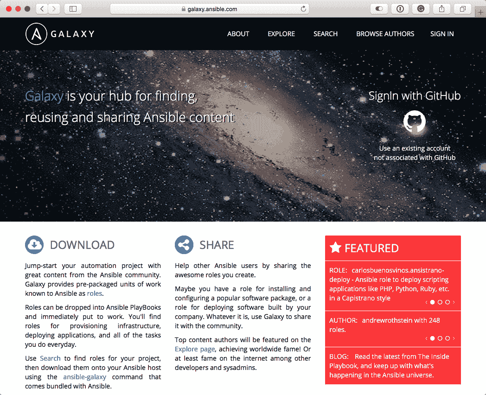

到目前为止，我们一直在编写我们自己的角色，这些角色与 Ansible Core 模块进行交互，用于我们的 playbook。我们可以使用 Ansible Galaxy 上发布的 15,000 多个角色中的一个，而不是编写我们自己的角色。这些角色涵盖了多种任务，并且几乎支持 Ansible 支持的所有操作系统。

`ansible-galaxy`命令是一种从自己的命令行舒适地与 Ansible Galaxy 网站交互的方式，同时还能够引导角色。就像我们在之前的章节中使用它一样，我们也可以使用它来下载、搜索和发布我们自己的角色到 Ansible Galaxy。

最后，Red Hat 已经开源了 Ansible Galaxy 的代码，这意味着您也可以在需要在防火墙后分发自己的角色时运行自己的网站。

# Jenkins playbook

让我们直接开始创建一个 playbook，只使用从 Ansible Galaxy 下载的角色来安装 Jenkins。

Jenkins，以前是 Hudson 项目，是一个用 Java 编写的开源持续集成和持续交付服务器。它可以使用插件进行扩展，并且已经远远超出了最初编译 Java 应用程序的目的。

首先，我们需要一些文件；现在通过运行以下命令来创建这些文件：

```
$ mkdir jenkins
$ cd jenkins
$ touch production requirements.yml site.yml Vagrantfile
```

正如您所看到的，我们并没有像在之前的章节中那样创建`roles`或`group_vars`文件夹。相反，我们正在创建一个`requirements.yml`文件。这将包含我们想要从 Ansible Galaxy 下载的角色列表。

在我们的情况下，我们将使用以下两个角色：

+   **Java**：[`galaxy.ansible.com/geerlingguy/java/`](https://galaxy.ansible.com/geerlingguy/java/)

+   **Jenkins**：[`galaxy.ansible.com/geerlingguy/jenkins/`](https://galaxy.ansible.com/geerlingguy/jenkins/)

第一个角色`geerlingguy.java`管理主机上 Java 的安装，然后第二个角色`geerlingguy.jenkins`管理 Jenkins 本身的安装和配置。要安装这些角色，我们需要将以下行添加到我们的`requirements.yml`文件中：

```
- src: "geerlingguy.java"
- src: "geerlingguy.jenkins"
```

添加后，我们可以通过运行以下命令下载角色：

```
$ ansible-galaxy install -r requirements.yml
```

您应该看到类似以下的输出：

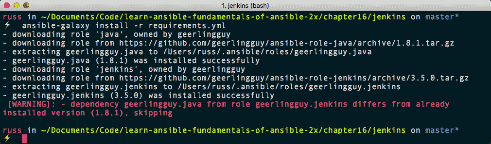

从终端输出中可以看到，这两个角色已从 GitHub 项目的`roles`文件夹中下载，并放置在`~/.ansible/roles/`文件夹中。

在 macOS 和 Linux 上使用`~`表示当前用户的主目录。

您可以忽略警告；它只是让我们知道`geerlingguy.jenkins`角色想要安装`geerlingguy.java`角色的旧版本。在我们的情况下，这不会造成任何问题。

现在我们已经下载了两个角色，我们可以编写`site.yml`文件来启动 Jenkins。应该如下所示：

```
---

- hosts: jenkins
  gather_facts: true
  become: yes
  become_method: sudo

  vars:
    java_packages: "java-1.8.0-openjdk"
    jenkins_hostname: "10.20.30.60.nip.io"
    jenkins_admin_username: "ansible"
    jenkins_admin_password: "Pa55w0rD"

  roles:
    - geerlingguy.java
    - geerlingguy.jenkins
```

请注意，我们只是提供了角色的名称。默认情况下，如果在 playbook 的本地`roles`文件夹中找不到角色，Ansible 将在`~/.ansible/roles/`文件夹中搜索角色。

我们还传递了四个变量：

+   `java_packages`：这是我们希望角色安装的`geerlingguy.java`角色的名称；由于 Jenkins 需要 Java 8，而我们正在运行 CentOS 7 主机，包名称是`java-1.8.0-openjdk`。

剩下的三个变量影响`geerlingguy.jenkins`角色的配置：

+   `jenkins_hostname`：这是我们希望在其上访问 Jenkins 的 URL；与之前的章节一样，我们使用`nip.io`服务为我们的 Vagrant box 提供可解析的主机名

+   `jenkins_admin_username`：这是我们要配置以访问 Jenkins 的管理员用户名

+   `jenkins_admin_password`：这是用户的密码

接下来，我们有`production`主机的清单文件：

```
box ansible_host=10.20.30.60.nip.io

[jenkins]
box

[jenkins:vars]
ansible_connection=ssh
ansible_user=vagrant
ansible_private_key_file=~/.ssh/id_rsa
host_key_checking=False
```

最后，`Vagrantfile`的内容如下：

```
# -*- mode: ruby -*-
# vi: set ft=ruby :

API_VERSION = "2"
BOX_NAME = "centos/7"
BOX_IP = "10.20.30.60"
DOMAIN = "nip.io"
PRIVATE_KEY = "~/.ssh/id_rsa"
PUBLIC_KEY = '~/.ssh/id_rsa.pub'

Vagrant.configure(API_VERSION) do |config|
  config.vm.box = BOX_NAME
  config.vm.network "private_network", ip: BOX_IP
  config.vm.host_name = BOX_IP + '.' + DOMAIN
  config.ssh.insert_key = false
  config.ssh.private_key_path = [PRIVATE_KEY, "~/.vagrant.d/insecure_private_key"]
  config.vm.provision "file", source: PUBLIC_KEY, destination: "~/.ssh/authorized_keys"

  config.vm.provider "virtualbox" do |v|
    v.memory = "2024"
    v.cpus = "2"
  end

  config.vm.provider "vmware_fusion" do |v|
    v.vmx["memsize"] = "2024"
    v.vmx["numvcpus"] = "2"
  end

end
```

现在我们已经将所有需要的文件放置并填充了正确的代码，我们可以启动我们的 Jenkins 服务器了。首先，我们需要创建 Vagrant box：

```
$ vagrant up
$ vagrant up --provider=vmware_fusion
```

一旦 Vagrant box 启动运行，我们可以使用以下命令运行 playbook：

```
$ ansible-playbook -i production site.yml
```

安装和配置 Java 和 Jenkins 需要几分钟；您可以在这里查看 playbook 运行的输出：

```
PLAY [jenkins] **********************************************************************************

TASK [Gathering Facts] **************************************************************************
ok: [box]

TASK [geerlingguy.java : Include OS-specific variables.] ****************************************
ok: [box]

TASK [geerlingguy.java : Include OS-specific variables for Fedora.] *****************************
skipping: [box]

TASK [geerlingguy.java : Include version-specific variables for Debian.] ************************
skipping: [box]

TASK [geerlingguy.java : Define java_packages.] *************************************************
skipping: [box]

TASK [geerlingguy.java : include_tasks] *********************************************************
included: /Users/russ/.ansible/roles/geerlingguy.java/tasks/setup-RedHat.yml for box

TASK [geerlingguy.java : Ensure Java is installed.] *********************************************
changed: [box] => (item=java-1.8.0-openjdk)

TASK [geerlingguy.java : include_tasks] *********************************************************
skipping: [box]

TASK [geerlingguy.java : include_tasks] *********************************************************
skipping: [box]

TASK [geerlingguy.java : Set JAVA_HOME if configured.] ******************************************
skipping: [box]

TASK [geerlingguy.jenkins : Include OS-Specific variables] **************************************
ok: [box]

TASK [geerlingguy.jenkins : Define jenkins_repo_url] ********************************************
ok: [box]

TASK [geerlingguy.jenkins : Define jenkins_repo_key_url] ****************************************
ok: [box]

TASK [geerlingguy.jenkins : Define jenkins_pkg_url] *********************************************
ok: [box]

TASK [geerlingguy.jenkins : include_tasks] ******************************************************
included: /Users/russ/.ansible/roles/geerlingguy.jenkins/tasks/setup-RedHat.yml for box

TASK [geerlingguy.jenkins : Ensure dependencies are installed.] *********************************
ok: [box]

TASK [geerlingguy.jenkins : Ensure Jenkins repo is installed.] **********************************
changed: [box]

TASK [geerlingguy.jenkins : Add Jenkins repo GPG key.] ******************************************
changed: [box]

TASK [geerlingguy.jenkins : Download specific Jenkins version.] *********************************
skipping: [box]

TASK [geerlingguy.jenkins : Check if we downloaded a specific version of Jenkins.] **************
skipping: [box]

TASK [geerlingguy.jenkins : Install our specific version of Jenkins.] ***************************
skipping: [box]

TASK [geerlingguy.jenkins : Ensure Jenkins is installed.] ***************************************
changed: [box]

TASK [geerlingguy.jenkins : include_tasks] ******************************************************
skipping: [box]

TASK [geerlingguy.jenkins : include_tasks] ******************************************************
included: /Users/russ/.ansible/roles/geerlingguy.jenkins/tasks/settings.yml for box

TASK [geerlingguy.jenkins : Modify variables in init file] **************************************
changed: [box] => (item={u'option': u'JENKINS_ARGS', u'value': u'--prefix='})
changed: [box] => (item={u'option': u'JENKINS_JAVA_OPTIONS', u'value': u'-Djenkins.install.runSetupWizard=false'})

TASK [geerlingguy.jenkins : Set the Jenkins home directory] *************************************
changed: [box]

TASK [geerlingguy.jenkins : Immediately restart Jenkins on init config changes.] ****************
changed: [box]

TASK [geerlingguy.jenkins : Set HTTP port in Jenkins config.] ***********************************
changed: [box]

TASK [geerlingguy.jenkins : Ensure jenkins_home /var/lib/jenkins exists] ************************
ok: [box]

TASK [geerlingguy.jenkins : Create custom init scripts directory.] ******************************
changed: [box]

RUNNING HANDLER [geerlingguy.jenkins : configure default users] *********************************
changed: [box]

TASK [geerlingguy.jenkins : Immediately restart Jenkins on http or user changes.] ***************
changed: [box]

TASK [geerlingguy.jenkins : Ensure Jenkins is started and runs on startup.] *********************
ok: [box]

TASK [geerlingguy.jenkins : Wait for Jenkins to start up before proceeding.] ********************
FAILED - RETRYING: Wait for Jenkins to start up before proceeding. (60 retries left).
 [WARNING]: Consider using the get_url or uri module rather than running curl. If you need to use
command because get_url or uri is insufficient you can add warn=False to this command task or set
command_warnings=False in ansible.cfg to get rid of this message.

ok: [box]

TASK [geerlingguy.jenkins : Get the jenkins-cli jarfile from the Jenkins server.] ***************
changed: [box]

TASK [geerlingguy.jenkins : Remove Jenkins security init scripts after first startup.] **********
changed: [box]

TASK [geerlingguy.jenkins : include_tasks] ******************************************************
included: /Users/russ/.ansible/roles/geerlingguy.jenkins/tasks/plugins.yml for box

TASK [geerlingguy.jenkins : Get Jenkins admin password from file.] ******************************
skipping: [box]

TASK [geerlingguy.jenkins : Set Jenkins admin password fact.] ***********************************
ok: [box]

TASK [geerlingguy.jenkins : Get Jenkins admin token from file.] *********************************
skipping: [box]

TASK [geerlingguy.jenkins : Set Jenkins admin token fact.] **************************************
ok: [box]

TASK [geerlingguy.jenkins : Create update directory] ********************************************
ok: [box]

TASK [geerlingguy.jenkins : Download current plugin updates from Jenkins update site] ***********
changed: [box]

TASK [geerlingguy.jenkins : Remove first and last line from json file] **************************
ok: [box]

TASK [geerlingguy.jenkins : Install Jenkins plugins using password.] ****************************

TASK [geerlingguy.jenkins : Install Jenkins plugins using token.] *******************************

PLAY RECAP **************************************************************************************
box : ok=32 changed=14 unreachable=0 failed=0
```

一旦 playbook 完成，您应该能够在`http://10.20.30.60.nip.io:8080/`访问您新安装的 Jenkins，并使用我们在`site.yml`文件中定义的管理员用户名和密码登录：

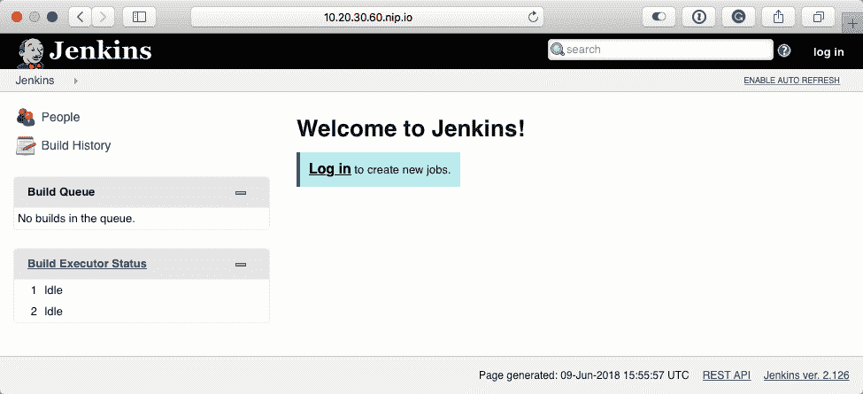

如您所见，使用预定义的社区角色部署我们的 Jenkins 安装比编写我们自己的角色要简单得多。在几分钟内，我们就能够编写一个 playbook 并部署应用程序，而且只需要基本的安装应用程序的理解。事实上，只需要快速浏览一下 Ansible Galaxy 上两个角色的 readme 文件就足够了。

# 发布角色

现在我们知道了下载角色有多么容易，让我们看看如何通过创建角色向社区做出贡献。在过去的几章中，我们一直在使用 Ansible 来安装 Docker。因此，让我们以此为基础，扩展角色以支持 Ubuntu，并安装 Docker CE Edge 版本，而不是稳定版本。

# 创建 docker 角色

首先，我们需要基本文件；要获取这些文件，请在通常存储代码的位置运行以下命令：

```
$ ansible-galaxy init ansible-role-docker
```

这将为我们提供我们新角色所需的目录和文件结构；现在我们可以开始创建角色了。

# 变量

我们将从`vars`文件夹中的文件开始；我们将保持`vars/main.yml`文件为空，并添加两个以`vars/RedHat.yml`开头的新文件：

```
---
# vars file for ansible-role-docker

docker:
  gpg_key: "https://download.docker.com/linux/centos/gpg"
  repo_url: "https://download.docker.com/linux/centos/docker-ce.repo"
  repo_path: "/etc/yum.repos.d/docker-ce.repo"
  edge: "docker-ce-edge"
  packages:
    - "docker-ce"
    - "device-mapper-persistent-data"
    - "lvm2"
    - "python-setuptools"
    - "libselinux-python"
  pip:
    - "docker"
```

要添加的下一个文件是`vars/Debian.yml`：

```
---
# vars file for ansible-role-docker

docker:
  gpg_key: "https://download.docker.com/linux/ubuntu/gpg"
  repo: "deb [arch=amd64] https://download.docker.com/linux/{{ ansible_distribution | lower }} {{ ansible_distribution_release | lower }} edge"
  system_packages:
    - "apt-transport-https"
    - "ca-certificates"
    - "curl"
    - "software-properties-common"
    - "python3-pip"
  packages:
    - "docker-ce"
  pip:
    - "docker"
```

这两个文件包含了我们安装 Docker CE 所需的所有信息。

# 任务

由于我们针对两个不同的操作系统，我们的`tasks/main.yml`文件需要如下所示：

```
---
# tasks file for ansible-role-docker

- name: include the operating system specific variables
  include_vars: "{{ ansible_os_family }}.yml"

- name: install the stack on centos
  import_tasks: install-redhat.yml
  when: ansible_os_family == 'RedHat'

- name: install the stack on ubuntu
  import_tasks: install-ubuntu.yml
  when: ansible_os_family == 'Debian'
```

正如您所看到的，在第六章中在两个操作系统上安装 LEMP Stack 时一样，`tasks/install-redhat.yml`文件看起来与我们在之前章节中用于安装 Docker 的任务非常相似：

```
---
# tasks file for ansible-role-docker

- name: add the gpg key for the docker repo
  rpm_key:
    key: "{{ docker.gpg_key }}"
    state: "present"

- name: add docker repo from the remote url
  get_url:
    url: "{{ docker.repo_url }}"
    dest: "{{ docker.repo_path }}"
    mode: "0644"

- name: install the docker packages
  yum:
    name: "{{ item }}"
    state: "installed"
    update_cache: "yes"
    enablerepo: "{{ docker.edge }}"
  with_items: "{{ docker.packages }}"

- name: install pip
  easy_install:
    name: pip
    state: latest

- name: install the python packages
  pip:
    name: "{{ item }}"
  with_items: "{{ docker.pip }}"

- name: put selinux into permissive mode
  selinux:
    policy: targeted
    state: permissive

- name: start docker and configure to start on boot
  service:
    name: "docker"
    state: "started"
    enabled: "yes"
```

唯一的区别是在安装软件包时启用了 Docker CE Edge 存储库，并且在安装 Docker 时我们没有运行`yum update`。我们之所以不这样做，是因为更新服务器不是我们角色的决定，当其他人运行角色时，我们的角色只应该安装 Docker。

最终的任务文件是`tasks/install-ubuntu.yml`。正如你已经猜到的那样，其中包含了在 Ubuntu 主机上安装 Docker 的任务：

```
---
# tasks file for ansible-role-docker

- name: install the system packages
  apt:
    name: "{{ item }}"
    state: "present"
    update_cache: "yes"
  with_items: "{{ docker.system_packages }}"

- name: add the apt keys from a key server
  apt_key:
    url: "{{ docker.gpg_key }}"
    state: present

- name: add the apt repo
  apt_repository:
    repo: "{{ docker.repo }}"
    state: present

- name: install the docker package
  apt:
    name: "{{ item }}"
    state: "present"
    update_cache: "yes"
    force: "yes"
  with_items: "{{ docker.packages }}"

- name: install the python packages
  pip:
    name: "{{ item }}"
  with_items: "{{ docker.pip }}"

- name: start docker and configure to start on boot
  service:
    name: "docker"
    state: "started"
    enabled: "yes"
```

这就结束了我们在两种不同操作系统上安装 Docker 所需的所有任务和变量。在以前的章节中，这已经足够让我们将角色添加到我们的 playbook 并运行任务了。然而，由于我们将在 Ansible Galaxy 上发布这个角色，我们需要添加一些关于角色的更多信息。

# Metadata

当你浏览 Ansible Galaxy 时，你可能已经看到，每个上传的角色都有关于作者、适用对象、许可证、支持的 Ansible 版本等信息。这些信息都来自于`meta/main.yml`文件。我们发布的文件看起来像下面这样：

```
---

galaxy_info:
  author: "Russ McKendrick"
  description: "Role to install the Docker CE Edge release on either an Enterprise Linux or Ubuntu host"
  license: "license (BSD)"
  min_ansible_version: 2.4
  platforms:
    - name: EL
      versions:
      - 6
      - 7
    - name: Ubuntu
      versions:
      - bionic
      - artful
      - xenial
  galaxy_tags:
    - docker

dependencies: []
```

正如你所看到的，我们在一个 YAML 文件中提供了信息，当我们发布角色时，Ansible Galaxy 将读取这些信息。文件中的大部分信息都是不言自明的，所以我在这里不会详细介绍：

+   `author`: 这是你的名字或选择的别名。

+   `description`: 添加你的角色描述；这将出现在命令行和 web 界面的搜索结果中，所以保持简短，不要添加任何标记。

+   `license`: 你发布角色的许可证；默认是 BSD。

+   `min_ansible_version`: 你的角色将使用的 Ansible 版本。记住，如果你使用了新功能，那么你必须使用该功能发布的版本。说你使用 Ansible 1.9，但使用了来自 Ansible 2.4 的模块，这只会让用户感到沮丧。

+   `platforms`: 这个支持的操作系统和版本列表在显示角色信息时使用，它将在用户选择使用你的角色时发挥作用。确保这是准确的，因为我们不想让用户感到沮丧。

+   `galaxy_tags`: 这些标签被 Ansible Galaxy 用来帮助识别你的角色做了什么。

在我们发布它之前，还有一个角色的最后部分需要看一看：`README.md`文件。

# README

我们需要完成的角色的最后部分是`README.md`文件；这个文件包含了在 Ansible Galaxy 网站上显示的信息。当我们使用`ansible-galaxy`初始化我们的角色时，它创建了一个带有基本结构的`README.md`文件。我们的角色的文件看起来像下面这样：

```
Ansible Docker Role
=========
This role installs the current Edge build Docker CE using the official repo, for more information on Docker CE see the official site at [`www.docker.com/community-edition`](https://www.docker.com/community-edition).

Requirements
------------
Apart from requiring root access via `become: yes` this role has no special requirements.

Role Variables
--------------
All of the variables can be found in the `vars` folder.

Dependencies
------------
None.

Example Playbook
----------------
An example playbook can be found below;

```

- hosts: docker

gather_facts: true

become: yes

become_method: sudo

roles:

- russmckendrick.docker

```

License
-------
BSD

Author Information
------------------
This role is published by [Russ McKendrick](http://russ.mckendrick.io/).
```

现在我们已经准备好了所有需要的文件，我们可以开始将我们的角色提交到 GitHub，并从那里发布到 Ansible Galaxy。

# 提交代码并发布

现在我们已经完成了我们的角色，我们需要将其推送到一个公共的 GitHub 存储库。有几个原因需要将其发布到公共存储库，其中最重要的是任何潜在用户都需要下载你的角色。此外，Ansible Galaxy 链接到存储库，允许用户在选择将其作为 playbook 的一部分执行之前审查你的角色。

在所有 GitHub 页面上，当你登录时，右上角有一个+图标；点击它会弹出一个菜单，其中包含创建新存储库和导入存储库的选项，以及 gists 和组织。从菜单中选择 New repository，你将看到一个如下所示的屏幕：

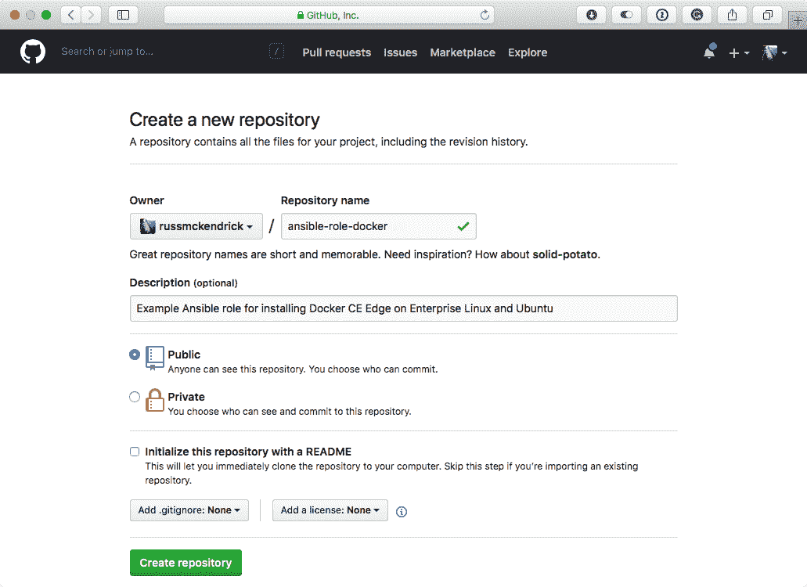

命名存储库并输入描述；重要的是您将您的存储库命名为 `ansible-role-your-role-name`。在 Ansible Galaxy 中，角色的名称将取决于您在 `ansible-role` 之后给出的名称，因此，在上一个示例中，我们的角色将被称为 `your-role-name`，对于我们将要发布的角色，它将被称为 `docker`。

现在我们有了我们的存储库，我们需要为我们的角色添加文件。回到包含您的角色的文件夹，并在命令行上运行以下命令来在本地初始化 Git 存储库。将其推送到 GitHub，确保用您自己存储库的 URL 替换存储库 URL：

```
$ git init
$ git add -A .
$ git commit -m "first commit"
$ git remote add origin git@github.com:russmckendrick/ansible-role-docker.git
$ git push -u origin master
```

现在您应该已经上传了文件，您的存储库看起来与以下内容并没有太大不同：

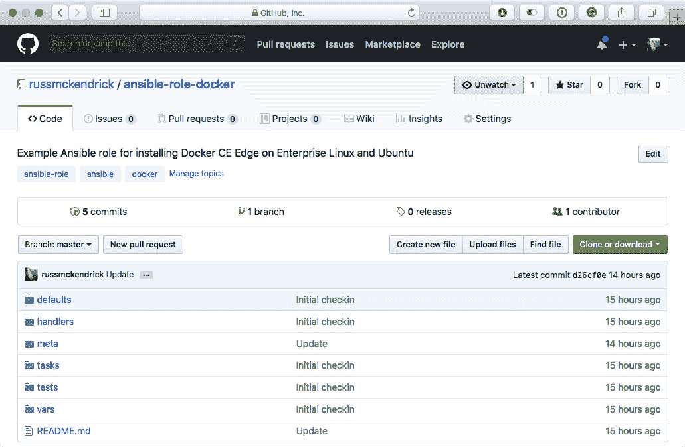如果您在推送代码时遇到任何问题，我建议您阅读 GitHub 提供的关于设置 Git ([`help.github.com/articles/set-up-git/`](https://help.github.com/articles/set-up-git/)) 和推送您的第一个文件 ([`help.github.com/articles/create-a-repo/`](https://help.github.com/articles/create-a-repo/)) 的出色文档。

现在我们已经上传并可用了文件，我们可以使用我们的 GitHub 凭据登录到 Ansible Galaxy，然后导入我们的角色。转到 Ansible Galaxy 主页 [`galaxy.ansible.com/`](https://galaxy.ansible.com/)，然后单击“使用 GitHub 登录”链接；这将带您到 GitHub 并要求您确认您同意让 Ansible Galaxy 访问您的帐户上的信息。按照提示进行，您将返回到 Ansible Galaxy。

单击顶部菜单中的“我的内容”链接将带您到一个页面，您可以从 GitHub 导入内容；如果您没有看到您的存储库列出，请单击搜索框旁边的刷新图标：

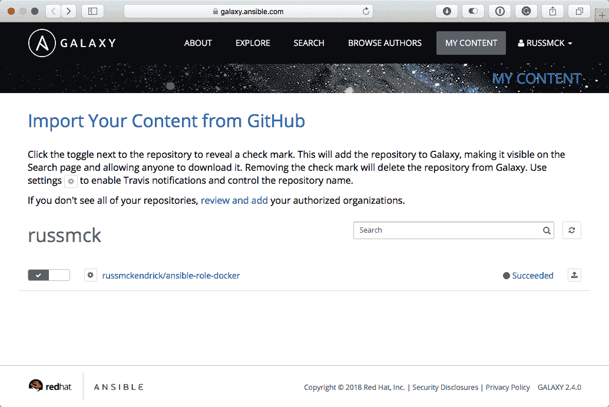

当您看到您的存储库列出时，单击角色旁边的开关，就可以了。您的角色现在已导入。单击顶部菜单中的用户名将显示一个下拉列表；从该列表中，选择“我的导入”。这将为您提供导入的日志：

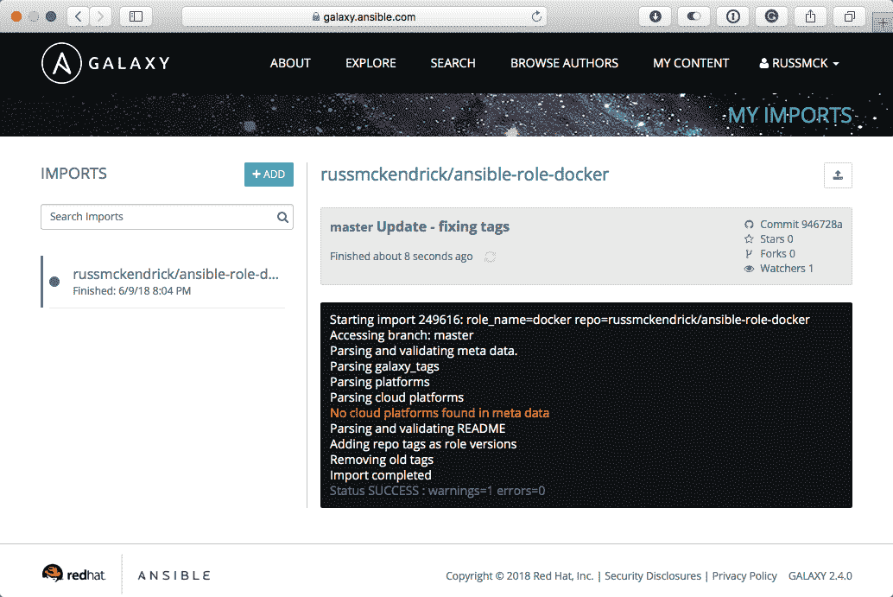

现在您的角色已发布；您可以通过单击顶部的链接查看您的角色，链接上写着 `russmckendrick/ansible-role-docker`。这将带您到您新添加的角色的 Ansible Galaxy 页面，例如 [`galaxy.ansible.com/russmckendrick/docker/`](https://galaxy.ansible.com/russmckendrick/docker/)：

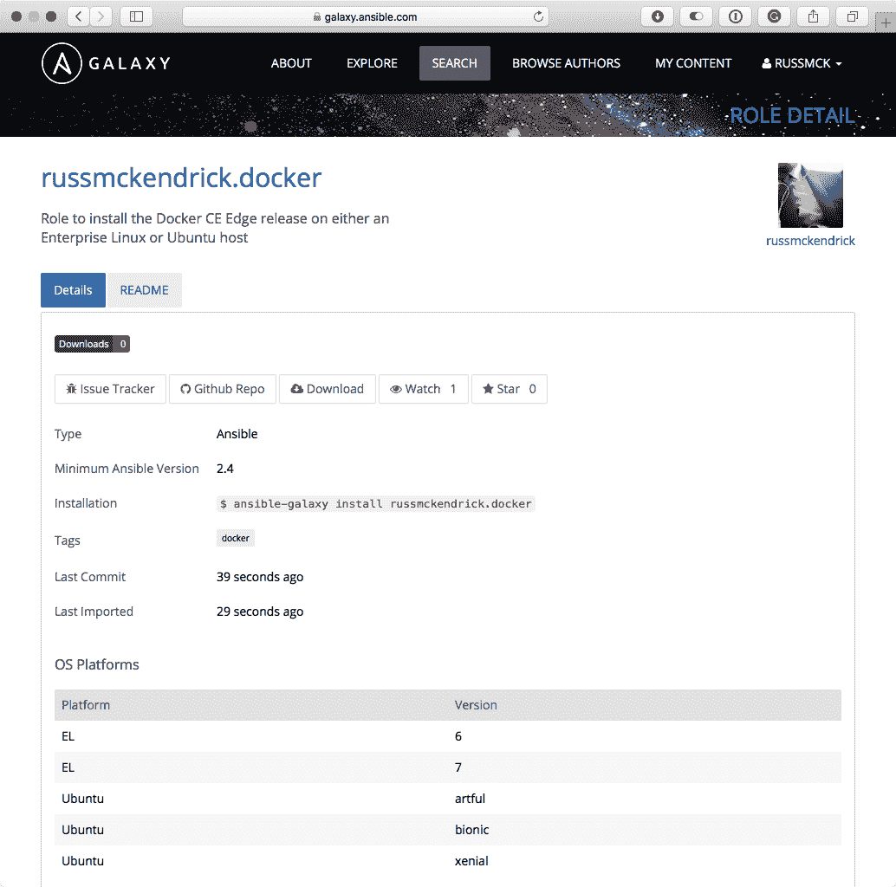

如您所见，我们添加的所有元数据都显示在列表中，包括查看从 GitHub 导入的 README 文件的链接，以及指向 GitHub 本身的链接。

# 测试角色

现在我们有了我们的角色，我们可以测试它。为此，我们将需要一个 playbook、清单和一个要求文件，以及一个 CentOS 和 Ubuntu 服务器。运行以下命令来创建您需要的文件：

```
$ mkdir docker
$ cd docker
$ touch production requirements.yml site.yml Vagrantfile
```

清单文件 production 应该如下所示：

```
centos ansible_host=10.20.30.10.nip.io 
ubuntu ansible_host=10.20.30.20.nip.io ansible_python_interpreter=/usr/bin/python3

[docker]
centos
ubuntu

[docker:vars]
ansible_connection=ssh
ansible_user=vagrant
ansible_private_key_file=~/.ssh/id_rsa
host_key_checking=False
```

我们的 `requirements.yml` 文件只包含我们的 Docker 角色：

```
- src: "russmckendrick.docker"
```

我们的 playbook，`site.yml` 文件，应该只调用我们的角色：

```
---

- hosts: docker
  gather_facts: true
  become: yes
  become_method: sudo

  roles:
    - russmckendrick.docker
```

最后，`Vagrantfile` 应该如下所示：

```
# -*- mode: ruby -*-
# vi: set ft=ruby :

API_VERSION = "2"
DOMAIN = "nip.io"
PRIVATE_KEY = "~/.ssh/id_rsa"
PUBLIC_KEY = '~/.ssh/id_rsa.pub'
CENTOS_IP = '10.20.30.10'
CENTOS_BOX = 'centos/7'
UBUNTU_IP = '10.20.30.20'
UBUNTU_BOX = 'generic/ubuntu1804'

Vagrant.configure(API_VERSION) do |config|

  config.vm.define "centos" do |centos|
      centos.vm.box = CENTOS_BOX
      centos.vm.network "private_network", ip: CENTOS_IP
      centos.vm.host_name = CENTOS_IP + '.' + DOMAIN
      centos.ssh.insert_key = false
      centos.ssh.private_key_path = [PRIVATE_KEY, "~/.vagrant.d/insecure_private_key"]
      centos.vm.provision "file", source: PUBLIC_KEY, destination: "~/.ssh/authorized_keys"

      centos.vm.provider "virtualbox" do |v|
        v.memory = "2024"
        v.cpus = "2"
      end

      centos.vm.provider "vmware_fusion" do |v|
        v.vmx["memsize"] = "2024"
        v.vmx["numvcpus"] = "2"
      end
  end

  config.vm.define "ubuntu" do |ubuntu|
      ubuntu.vm.box = UBUNTU_BOX
      ubuntu.vm.network "private_network", ip: UBUNTU_IP
      ubuntu.vm.host_name = UBUNTU_IP + '.' + DOMAIN
      ubuntu.ssh.insert_key = false
      ubuntu.ssh.private_key_path = [PRIVATE_KEY, "~/.vagrant.d/insecure_private_key"]
      ubuntu.vm.provision "file", source: PUBLIC_KEY, destination: "~/.ssh/authorized_keys"

      ubuntu.vm.provider "virtualbox" do |v|
        v.memory = "2024"
        v.cpus = "2"
      end

      ubuntu.vm.provider "vmware_fusion" do |v|
        v.vmx["memsize"] = "2024"
        v.vmx["numvcpus"] = "2"
      end
  end

end
```

现在我们已经把所有文件放在了正确的位置，我们可以通过运行以下命令来下载我们的角色：

```
$ ansible-galaxy install -r requirements.yml
```

如您从以下输出中所见，这将把我们的角色下载到 `~/.ansible/roles/` 文件夹中：

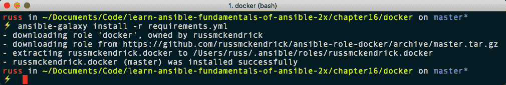

接下来，通过运行以下任一命令来启动两个 Vagrant boxes：

```
$ vagrant up
$ vagrant up --provider=vmware_fusion
```

一旦 boxes 运行起来，我们可以通过以下方式运行 playbook：

```
$ ansible-playbook -i production site.yml 
```

如您从以下输出中所见，一切都按计划进行，角色在两个 boxes 上都安装了 Docker：

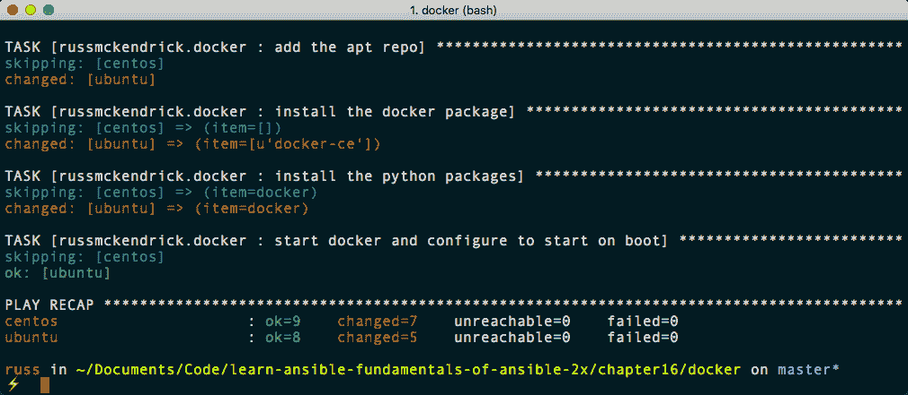

# Ansible Galaxy 命令

在我们结束本章之前，让我们快速看一下`ansible-galaxy`命令的一些其他功能，首先是登录。

# 登录

可以通过命令行登录到 Ansible Galaxy；你可以通过以下方式实现：

```
$ ansible-galaxy login
```

这将要求你的 GitHub 用户名和密码；如果你的 GitHub 账户启用了双因素身份验证，那么这种方法将无法工作。相反，你需要提供个人访问令牌。你可以在以下网址生成个人访问令牌：[`github.com/settings/tokens/`](https://github.com/settings/tokens/)。一旦你有了令牌，你可以使用以下命令，将令牌替换为你自己的：

```
$ ansible-galaxy login --github-token 0aa7c253044609b98425865wbf6z679a94613bae89 
```

以下截图显示了上述命令的输出：

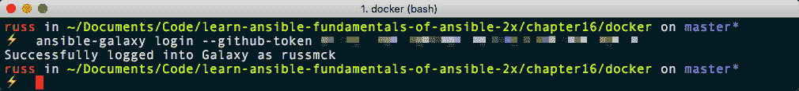个人访问令牌将给任何拥有它的人完全访问你的 GitHub 账户；请将它们安全地存储，并且如果可能的话定期更换。

# 导入

一旦登录，如果你对角色进行了更改并希望将这些更改导入到 Ansible Galaxy 中，你可以运行以下命令：

```
$ ansible-galaxy import russmckendrick ansible-role-docker
```

以下截图显示了上述命令的输出：

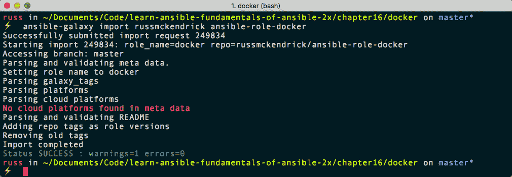

我们传递给命令的两个信息是 GitHub 用户名，在我的情况下是`russmckendrick`，以及我们想要导入的仓库的名称——所以对于我们在上一节中发布的 Docker 角色，我使用的是`ansible-role-docker`。

# 搜索

你可以使用`ansible-galaxy`命令搜索角色。例如，运行以下命令目前返回 725 个角色：

```
$ ansible-galaxy search docker
```

如果你想按作者搜索角色，可以使用以下命令：

```
$ ansible-galaxy search --author=russmckendrick docker
```

从截图中的输出可以看出，这只返回了我们发布的角色：

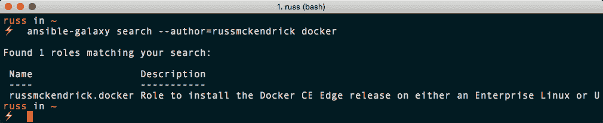

这很有用，因为你不必在终端和浏览器之间来回切换。

# 信息

我们要看的最后一个命令是`info`；这个命令将打印出你提供的任何角色的信息。例如，运行以下命令将为你提供关于我们发布的角色的大量信息：

```
$ ansible-galaxy info russmckendrick.docker
```

以下截图显示了上述命令的输出：

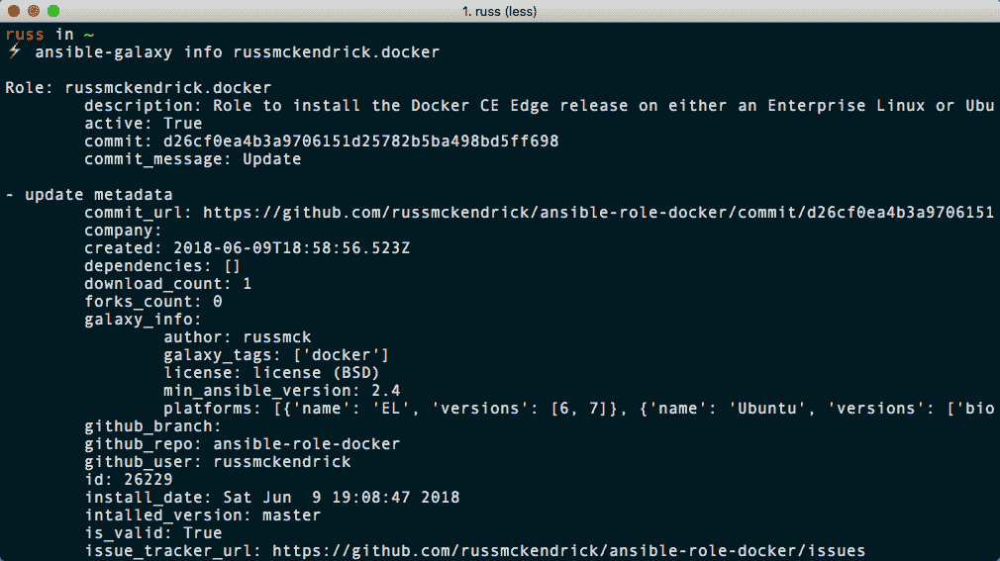

正如你所看到的，网站上可以获取的所有信息在命令行上也是可以获取的，这意味着在与 Ansible Galaxy 交互时你可以有选择。

# 总结

在本章中，我们深入了解了 Ansible Galaxy，包括网站和命令行工具。我相信你会同意，Ansible Galaxy 提供了有价值的社区服务，它允许 Ansible 用户共享常见任务的角色，同时也为用户提供了一种通过发布自己的角色来为 Ansible 社区做出贡献的方式。

但是要小心。在将 Ansible Galaxy 的角色用于生产环境之前，请记得仔细检查代码并阅读错误跟踪器；毕竟，这些角色中的许多需要提升的权限才能成功执行它们的任务。

在下一章，我们将看一些将 Ansible 集成到你的日常工作流程中的方法。

# 问题

本章只有一个任务。拿出我们之前创建的其他角色之一，使其适用于多个操作系统，并在 Ansible Galaxy 上发布。

# 进一步阅读

本章开始时使用的两个角色都是由 Jeff Geerling 发布的；你可以在[`www.jeffgeerling.com/`](https://www.jeffgeerling.com/)找到更多关于 Jeff 和他的项目的信息。
