# 持续集成的概念

我们将从介绍当今两种主要软件开发方法论开始：瀑布模型和敏捷开发。理解它们的概念和影响将帮助我们回答**持续集成**（**CI**）是如何产生的。

接下来，我们将尝试理解 CI 背后的概念及构成要素。通过阅读这些内容，您将了解到 CI 如何帮助项目实现敏捷。完成本章后，您应该能够：

+   描述 CI 是如何产生的。

+   定义什么是 CI。

+   描述 CI 的要素。

# 软件开发生命周期

对于那些对术语“软件开发生命周期”不太熟悉的人，让我们尝试理解一下。

**软件开发生命周期**，有时简称为**SDLC**，是规划、开发、测试和部署软件的过程。

团队按照一系列阶段进行工作，每个阶段都利用了其前一个阶段的结果，如下图所示：

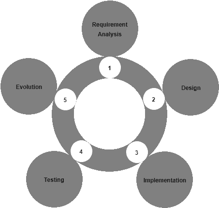

软件开发生命周期

让我们详细了解 SDLC 的各个阶段。

# 需求分析

这是循环的第一个阶段。在这里，业务团队（主要由业务分析师组成）对其项目的业务需求进行需求分析。需求可能是组织内部的，也可能是来自客户的外部需求。这项研究涉及发现需求的性质和范围。根据收集到的信息，提出了改进系统或创建新系统的建议。项目成本得到确定，并列出了利益。然后确定项目目标。

# 设计

第二阶段是设计阶段。在这里，系统架构师和系统设计师制定软件解决方案的期望功能，并创建项目计划。该计划可能包括流程图、整体接口和布局设计，以及大量的文档。

# 实现

第三阶段是实现阶段。在这里，项目经理创建并分配工作给开发人员。开发人员根据设计阶段定义的任务和目标开发代码。这个阶段可能会持续几个月到一年，这取决于项目的规模。

# 测试

第四阶段是测试阶段。当所有确定的功能都开发完成后，测试团队接管。在接下来的几个月里，所有功能都会经过彻底的测试。软件的每个模块都会被收集和测试。如果在测试过程中出现任何错误或 bug，就会提出缺陷。在出现故障时，开发团队会迅速采取措施解决故障。经过彻底测试的代码随后会被部署到生产环境中。

# 演进

最后阶段是演进阶段或维护阶段。用户/客户的反馈被分析，整个开发、测试和发布新功能和修复的循环以补丁或升级的形式重复。

# 软件开发的瀑布模型

最著名且广泛使用的软件开发过程之一是瀑布模型。瀑布模型是一个顺序软件开发过程，源自制造业。人们可以看到高度结构化的流程在一个方向上运行。在其创立时期，没有其他软件开发方法论，开发人员唯一能够想象的就是简单适用于软件开发的生产线流程。

下图展示了软件开发的瀑布模型：

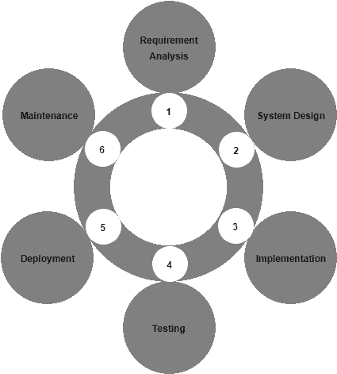

瀑布模型

瀑布方法简单易懂，因为所涉及的步骤类似于 SDLC。

首先是需求分析阶段，然后是设计阶段。在分析和设计部分花费了相当多的时间。一旦完成，就不再进行添加或删除。简而言之，在开发开始后，设计中不允许修改。

然后是实施阶段，实际的开发将在此阶段进行。开发周期可以长达三个月至六个月。这段时间，测试团队通常是空闲的。开发周期结束后，计划整合源代码需要一整周时间。在此期间，会出现许多集成问题，并立即进行修复。这个阶段后是测试阶段。

当测试开始时，会持续三个月甚至更长时间，取决于软件解决方案。测试成功后，源代码将部署在生产环境中。为此，会再次计划一天左右来进行生产部署。可能会出现一些部署问题。软件解决方案上线后，团队会收到反馈，也可能预料到问题。

最后阶段是维护阶段。用户/客户的反馈被分析，整个开发、测试和发布新功能和修复的循环以补丁或升级的形式重复。

毫无疑问，瀑布模型在数十年间运行良好。然而，存在缺陷，但长时间以来被忽视。因为在那个时代，软件项目有足够的时间和资源来完成工作。

然而，看着过去几年软件技术的变化，我们可以说瀑布模型无法满足当前世界的需求。

# 瀑布模型的缺点

以下是瀑布模型的一些缺点：

+   可工作的软件仅在大多数情况下持续一年左右的 SDLC 结束时产生。

+   存在大量不确定性。

+   不适用于对新功能需求过于频繁的项目。例如，电子商务项目。

+   仅在整个开发阶段完成后执行集成。因此，集成问题会在更晚的阶段和大量发现。

+   不存在向后追溯。

+   在各个阶段内很难衡量进度。

# 瀑布模型的优点

通过查看瀑布模型的缺点，我们可以说它主要适用于以下项目：

+   需求已经很好地记录并且是固定的。

+   有足够的资金可供维护管理团队、测试团队、开发团队、构建和发布团队、部署团队等。

+   技术是固定的，而不是动态的。

+   没有模棱两可的要求。最重要的是，它们不会在除了需求分析阶段之外的任何其他阶段中出现。

# 敏捷来拯救

名称**敏捷**恰如其分地暗示了*快速且简单*。敏捷是一种通过自组织团队之间的协作开发软件的方法集。敏捷背后的原则是增量、快速、灵活的软件开发，并促进自适应规划。

敏捷软件开发过程是传统软件开发过程的替代方案。

# 敏捷十二原则

以下是敏捷模型的十二原则：

+   通过尽早和持续地交付有用的软件来实现客户满意度。

+   欢迎在开发的后期接受变更的需求。

+   经常交付可工作的软件（以周为单位，而不是月）。

+   业务、人员和开发者之间的密切日常合作。

+   项目围绕着应该受到信任的积极主动的个人构建。

+   面对面的交流是最好的沟通方式（共同位置）。

+   可工作的软件是进度的主要衡量标准。

+   可持续发展——能够保持稳定的速度。

+   持续关注技术卓越和良好的设计。

+   简单——最大化未完成工作量的艺术是必不可少的。

+   自组织团队。

+   定期适应变化的环境。

要了解更多关于敏捷原则的内容，请访问链接：[`www.agilemanifesto.org`](http://www.agilemanifesto.org)。

敏捷软件开发的十二原则表明了当前软件行业的期望以及其在瀑布模型上的优势。

# 敏捷软件开发过程是如何工作的？

在敏捷软件开发过程中，整个软件应用被分割成多个特性或模块。这些特性以迭代方式交付。每个迭代持续三周，涉及到跨职能团队同时在各个领域工作，如规划、需求分析、设计、编码、单元测试和验收测试。

因此，在任何给定时间点，没有人处于空闲状态。这与瀑布模型大不相同，在瀑布模型中，尽管开发团队正在忙于开发软件，但测试团队、生产团队和其他所有人都是空闲或利用率不高的。以下图示了软件开发的敏捷模型：

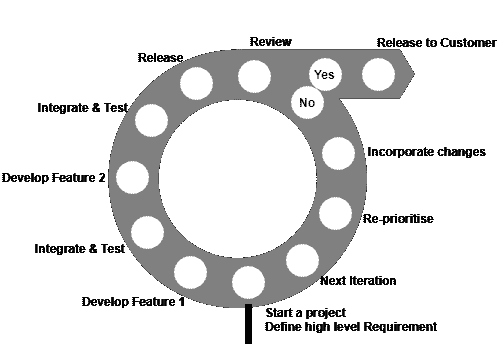

敏捷方法论

从上图中我们可以看到，没有时间花费在需求分析或设计上。相反，准备了一个非常高层次的计划，仅足以勾勒项目的范围。

然后团队经历一系列迭代。迭代可以分类为时间框架，每个时间框架持续一个月，甚至在一些成熟项目中持续一周。在此期间，项目团队开发和测试特性。目标是在单个迭代中开发、测试和发布一个特性。在迭代结束时，该特性进行演示。如果客户喜欢它，那么该特性就上线了。但是，如果被拒绝，该特性将作为待办事项，重新排优先级，并在后续迭代中再次进行处理。

也存在并行开发和测试的可能性。在单个迭代中，可以并行开发和测试多个特性。

# 敏捷软件开发过程的优势

让我们看一下敏捷软件开发过程的一些优势：

+   **功能可以迅速开发和演示**：在敏捷过程中，软件项目被划分为特性，并且每个特性被称为一个待办事项。其想法是从概念化到部署，一周或一个月内开发单个或一组特性。这至少让客户有一个或两个特性可以使用。

+   **资源需求较少**：在敏捷中，没有单独的开发和测试团队。也没有构建或发布团队，或者部署团队。在敏捷中，一个项目团队包含约八名成员。团队的每个成员都能做所有事情。

+   **促进团队合作和交叉培训**：由于团队规模小约为八名成员，团队成员轮流担任角色，并从彼此的经验中学习。

+   **适用于需求经常变化的项目**：在软件开发的敏捷模型中，整个软件被分割成特性，每个特性在短时间内开发和交付。因此，更改特性，甚至完全放弃它，都不会影响整个项目。

+   **极简主义文档**：这种方法主要专注于快速交付可工作的软件，而不是创建庞大的文档。文档存在，但仅限于整体功能。

+   **几乎不需要计划**：由于功能在短时间内依次开发，因此无需进行广泛的规划。

+   **并行开发**：迭代由一个或多个功能依次开发，甚至是并行开发。

# Scrum 框架

Scrum 是一个基于敏捷软件开发流程的开发和维护复杂产品的框架。它不仅仅是一个过程；它是一个具有特定角色、任务和团队的框架。Scrum 由**肯·施瓦伯**和**杰夫·萨瑟兰**编写；他们一起创作了*Scrum 指南*。

在 Scrum 框架中，开发团队决定如何开发一个功能。这是因为团队最了解他们所面临的问题。我假设大多数读者在阅读完这篇文章后都会感到满意。

Scrum 依赖于一个自组织和跨职能的团队。Scrum 团队是自组织的；因此，没有总体团队领导者决定哪个人将做哪个任务，或者如何解决问题。

# Scrum 框架中使用的重要术语

以下是 Scrum 框架中使用的重要术语：

+   **冲刺**：冲刺是在其中创建一个可用且可能可发布的产品的时间段。一个新的冲刺在上一个冲刺结束后立即开始。冲刺的持续时间可能介于两周到一个月之间，具体取决于对 Scrum 的命令。

+   **产品待办列表**：产品待办列表是软件解决方案中所有必需功能的列表。该列表是动态的。也就是说，客户或团队成员时不时地向产品待办列表中添加或删除项目。

+   **冲刺待办列表**：冲刺待办列表是为冲刺选择的产品待办列表项目集合。

+   **增量**：增量是在冲刺期间完成的所有产品待办列表项目以及所有先前冲刺的增量价值的总和。

+   **开发团队**：开发团队负责在每个冲刺结束时交付一个可发布的功能集合，称为增量。只有开发团队的成员创建增量。开发团队由组织授权组织和管理他们的工作。由此产生的协同作用优化了开发团队的整体效率和效果。

+   **产品负责人**：产品负责人是 Scrum 团队与所有其他人之间的中介。他是 Scrum 团队的前台，并与客户、基础架构团队、管理团队以及所有参与 Scrum 的人等进行交互。

+   **Scrum 主管**：Scrum 主管负责确保人们了解并执行 Scrum。Scrum 主管通过确保 Scrum 团队遵循 Scrum 理论、实践和规则来做到这一点。

# Scrum 如何工作？

产品负责人，Scrum Master 和 Scrum 团队共同遵循一套严格的程序来交付软件功能。以下图表解释了 Scrum 开发过程：

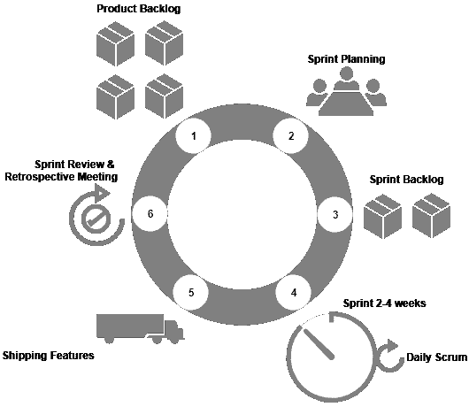

Scrum 方法论

让我们看看团队经历的 Scrum 软件开发过程的一些重要方面。

# 冲刺计划

冲刺计划是 Scrum 团队规划当前冲刺周期功能的机会。计划主要由开发人员创建。一旦计划创建完成，它会向 Scrum Master 和 Product Owner 解释。冲刺计划是一个时间框定的活动，通常在一个月的冲刺周期中总共约八小时。确保每个人都参与冲刺计划活动是 Scrum Master 的责任。

在会议中，开发团队考虑以下项目：

+   要处理的产品待办事项数量（包括上一个冲刺的新事项和旧事项）。

+   上一个冲刺中的团队表现。

+   开发团队的预期容量。

# 冲刺周期

在冲刺周期内，开发人员只需完成冲刺计划中决定的待办事项。冲刺的持续时间可能会从两周到一个月不等，这取决于待办事项的数量。

# 每日 Scrum 会议

这是每天发生的事情。在 Scrum 会议期间，开发团队讨论昨天完成的工作，以及今天将要完成的工作。他们还讨论阻止他们实现目标的事情。开发团队除了 Scrum 会议外，不参加任何其他会议或讨论。

# 监控冲刺进展

每日 Scrum 是团队测量进展的好机会。Scrum 团队可以跟踪剩余的总工作量，通过这样做，他们可以估计实现冲刺目标的可能性。

# 冲刺计划

在冲刺回顾中，开发团队展示已完成的功能。Product Owner 更新到目前为止的产品待办事项状态。产品待办事项列表根据产品在市场上的表现或使用情况进行更新。冲刺回顾对于一个月的冲刺来说是一个总共四小时的活动。

# 冲刺回顾

在这次会议上，团队讨论了做得好的事情和需要改进的事情。然后，团队决定了要在即将到来的冲刺中改进的要点。这次会议通常在冲刺回顾之后，冲刺计划之前进行。

# 持续集成

持续集成（CI）是一种软件开发实践，开发人员经常将他们的工作与项目的集成分支相结合，并创建一个构建。

集成是将您的个人工作（修改后的代码）提交到公共工作区（潜在的软件解决方案）的行为。这在技术上通过将您的个人工作（个人分支）与公共工作区（集成分支）合并来完成。或者我们可以说，将您的个人分支推送到远程分支。

持续集成是为了尽早发现集成过程中遇到的问题。可以从下图中理解这一点，该图描述了单个持续集成周期中遇到的各种问题。

构建失败可能是由于不正确的代码或在构建过程中出现人为错误（假设任务是手动完成的）而导致的。如果开发人员不经常将他们的本地代码副本与集成分支上的代码重新基准，则可能会出现集成问题。如果代码未通过任何单元测试或集成测试用例，则可能会出现测试问题。

在出现问题时，开发人员必须修改代码以修复它：

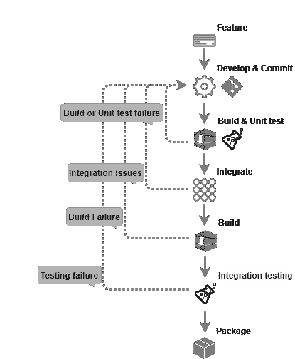

持续集成过程

# 敏捷运行在持续集成上

敏捷软件开发过程主要关注快速交付，持续集成帮助敏捷实现了这一速度。但是持续集成是如何做到的呢？让我们通过一个简单的案例来理解。

开发一个功能涉及到许多代码更改，在每次代码更改之间，有一系列任务要执行，比如检入代码，轮询版本控制系统以查看更改，构建代码，单元测试，集成，基于集成代码构建，集成测试和打包。在持续集成环境中，使用诸如*Jenkins*之类的持续集成工具可以使所有这些步骤变得快速且无错误。

添加通知可以使事情变得更快。团队成员越早意识到构建、集成或部署失败，他们就能越快采取行动。下图描述了持续集成过程中涉及的所有步骤：

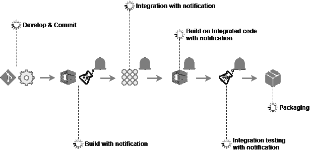

带通知的持续集成过程

团队通过这种方式快速从一个功能转移到另一个功能。简单地说，敏捷软件开发的*敏捷性*很大程度上是由持续集成所致。

# 从持续集成中受益的项目类型

汽车内嵌系统中编写的代码量比战斗机内嵌系统中的代码量更多。在今天的世界中，嵌入式软件存在于每一种产品中，无论是现代产品还是传统产品。无论是汽车、电视、冰箱、手表还是自行车，所有产品都有多少与软件相关的功能。消费品每天都在变得更加智能。如今，我们可以看到一个产品更多地通过其智能和智能功能来进行市场推广，而不是其硬件功能。例如，空调通过其无线控制功能进行市场推广，电视则通过其智能功能（如嵌入式网页浏览器等）进行市场推广，等等。

推广新产品的需求增加了产品的复杂性。软件复杂性的增加使得敏捷软件开发和 CI 方法学备受关注，尽管过去有时敏捷软件开发仅被 30-40 人的小团队用于简单项目。几乎所有类型的项目都受益于 CI：主要是基于 Web 的项目，例如电子商务网站和手机应用程序。

CI 和敏捷方法论在基于 Java、.NET、Ruby on Rails 和今天存在的每一种编程语言的项目中都被使用。唯一不使用它的地方是在传统系统中。然而，它们甚至也在转向敏捷。基于 SAS、主机的项目；都在尝试从 CI 中受益。

# CI 的元素

让我们看看 CI 过程的重要元素。

# 版本控制系统

这是实现 CI 的最基本和最重要的要求。**版本控制系统**，有时也称为**修订控制系统**，是管理代码历史记录的工具。它可以是集中式的或分布式的。一些著名的集中式版本控制系统包括 SVN 和 IBM Rational ClearCase。在分布式部分，我们有像 Git 和 Mercurial 这样的工具。

理想情况下，构建软件所需的一切都必须进行版本控制。版本控制工具提供许多功能，如标记、分支等。

# 分支策略

使用版本控制系统时，应将分支保持在最低限度。一些公司只有一个主分支，所有的开发活动都在这个分支上进行。然而，大多数公司都遵循一些分支策略。这是因为总会有一部分团队可能在一个发布版上工作，而另一部分团队可能在另一个发布版上工作。有时，需要支持旧版本的发布。这些情况总是导致公司使用多个分支。

GitFlow 是另一种使用多个分支管理代码的方式。在以下方法中，Master/Production 分支保持清洁，仅包含可发布、准备好发货的代码。所有的开发都在 Feature 分支上进行，Integration 分支作为一个公共集成所有功能的地方。以下图示是 GitFlow 的一个中等版本：

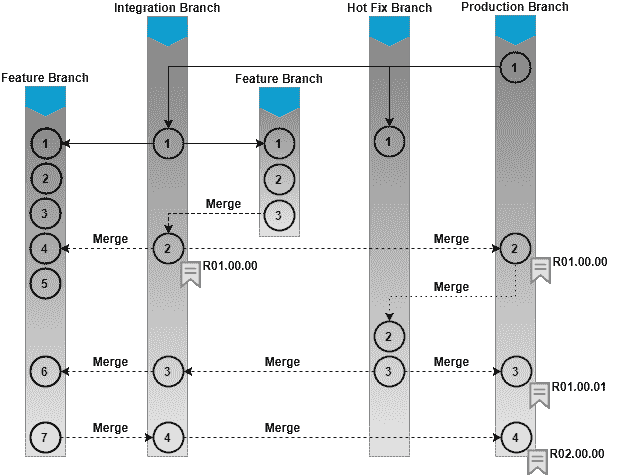

分支策略

# GitFlow 分支模型

以下图示说明了完整版本的 GitFlow。我们有一个包含仅生产就绪代码的 Master/Production 分支。功能分支是所有开发都发生的地方。集成分支是代码集成和测试质量的地方。除此之外，我们还有从集成分支拉出的发布分支，只要有稳定版本发布，就会有与发布相关的所有错误修复。还有一个热修复分支，只要有必要进行热修复，就会从 Master/Production 分支拉出来：

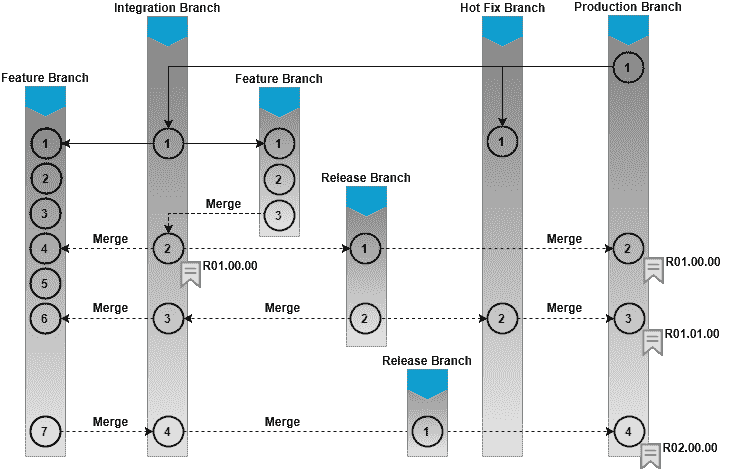

GitFlow 分支策略

# CI 工具

什么是 CI 工具？嗯，它不过是一个协调者。CI 工具位于 CI 系统的中心，连接到版本控制系统、构建工具、二进制存储库管理工具、测试和生产环境、质量分析工具、测试自动化工具等等。有许多 CI 工具：Build Forge、Bamboo 和 TeamCity 等等。但我们书中的重点是 Jenkins：

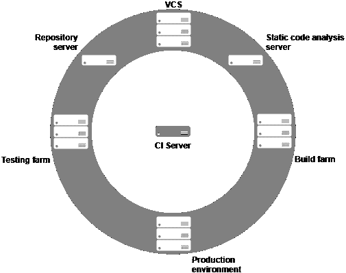

集中式 CI 服务器

CI 工具提供了创建流水线的选项。每个流水线都有其自身的目的。有一些流水线负责 CI。有些负责测试；有些负责部署等等。技术上，流水线是作业的流动。每个作业是一组按顺序运行的任务。脚本编写是 CI 工具的一个组成部分，它执行各种类型的任务。这些任务可能是简单的，比如从一个位置复制文件/文件夹到另一个位置，或者它们可能是复杂的 Perl 脚本，用于监视文件修改的机器。尽管如此，随着 Jenkins 中可用插件数量的增加，脚本正在被替换。现在，你不需要脚本来构建 Java 代码；有相应的插件可用。你所需要做的就是安装和配置一个插件来完成工作。技术上，插件只是用 Java 编写的小模块。它们减轻了开发人员的脚本编写负担。我们将在后续章节中更多地了解流水线。

# 自触发构建

接下来要理解的重要事情是自触发自动化构建。构建自动化只是一系列自动化步骤，用于编译代码和生成可执行文件。构建自动化可以借助构建工具如 Ant 和 Maven。自触发自动化构建是 CI 系统中最重要的部分。有两个主要因素需要自动化构建机制：

+   速度。

+   尽早捕获集成或代码问题。

有些项目每天会有 100 到 200 次构建。在这种情况下，速度是一个重要因素。如果构建是自动化的，那么可以节省很多时间。如果构建的触发是自动驱动的，而不需要任何手动干预，事情就变得更有趣了。在每次代码更改时自动触发构建进一步节省时间。

当构建频繁且快速时，SDLC 框架中发现错误（构建错误、编译错误或集成错误）的概率更高且更快：

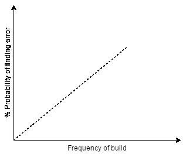

错误概率与构建图

# 代码覆盖

代码覆盖是您的测试用例覆盖的代码量（以百分比表示）。您在覆盖报告中看到的度量标准可能更多或更少，如下表所定义：

| **覆盖类型** | **描述** |
| --- | --- |
| Function | 被调用的函数数量占定义的函数总数的比例 |
| Statement | 程序中实际调用的语句数占总数的比例 |
| Branches | 执行的控制结构的分支数 |
| Condition | 正在测试的布尔子表达式的数量，测试真值和假值 |
| Line | 正在测试的源代码行数占代码总行数的比例 |

代码覆盖类型

该覆盖率百分比通过将被测试项的数量除以找到的项的数量来计算。以下截图显示了来自 SonarQube 的代码覆盖报告：

**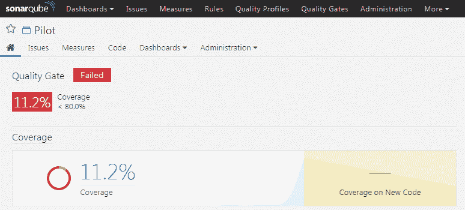**

SonarQube 上的代码覆盖报告

# 代码覆盖工具

根据您使用的语言，可能会发现几种创建覆盖报告的选项。以下是一些流行工具：

| **语言** | **工具** |
| --- | --- |
| Java | Atlassian Clover, Cobertura, JaCoCo |
| C#/.NET | OpenCover, dotCover |
| C++ | OpenCppCoverage, gcov |
| Python | Coverage.py |
| Ruby | SimpleCov |

# 静态代码分析

静态代码分析，通常也称为**白盒**测试，是一种查找代码结构质量的软件测试形式。例如，它回答了代码的健壮性或可维护性如何。静态代码分析是在实际执行程序之前执行的。它与功能测试不同，功能测试着眼于软件的功能方面，并且是动态的。

静态代码分析是对软件内部结构的评估。例如，是否有一段重复使用的代码？代码中是否包含大量的注释行？代码有多复杂？使用用户定义的度量标准，生成了一个分析报告，显示了代码在可维护性方面的质量。它不质疑代码的功能。

一些静态代码分析工具，如 SonarQube，配备了仪表板，显示每次运行的各种指标和统计数据。通常作为 CI 的一部分，每次运行构建时都会触发静态代码分析。如前几节讨论的，静态代码分析也可以在开发人员尝试提交代码之前包含。因此，低质量的代码可以在最初阶段就被阻止。

他们支持许多语言，如 Java、C/C++、Objective-C、C#、PHP、Flex、Groovy、JavaScript、Python、PL/SQL、COBOL 等等。以下截图展示了使用 SonarQube 进行静态代码分析报告：

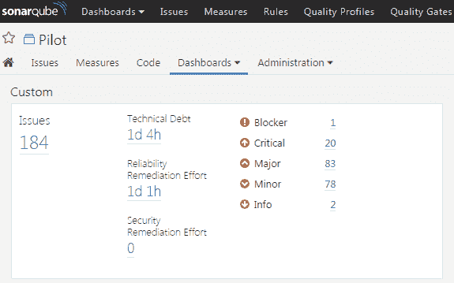

静态代码分析报告

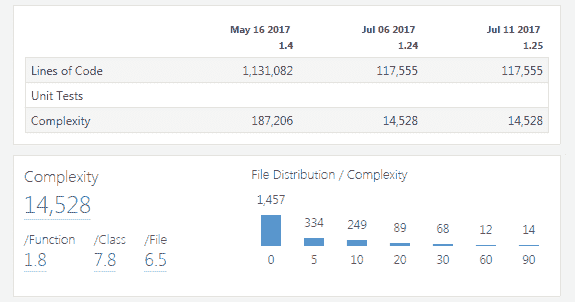

静态代码分析报告

# 自动化测试

测试是 SDLC 的重要组成部分。为了保持软件质量，必须让软件解决方案通过各种测试场景。对测试的重视不足可能导致客户不满意和产品延迟。

由于测试是一项手动、耗时且重复的任务，自动化测试流程可以显着提高软件交付速度。然而，自动化测试流程要比自动化构建、发布和部署流程困难得多。通常需要大量工作来自动化项目中几乎所有使用的测试用例。这是一个随着时间逐渐成熟的活动。

因此，在开始自动化测试时，我们需要考虑一些因素。首先考虑那些价值高且易于自动化的测试用例。例如，在步骤相同的情况下自动化测试，尽管每次都使用不同的数据。此外，自动化测试涉及在各种平台上测试软件功能的测试。还要自动化测试涉及使用不同配置运行软件应用程序的测试。

以前，世界主要由桌面应用程序主导。自动化 GUI 系统的测试相当困难。这就需要脚本语言，其中手动鼠标和键盘输入被脚本化并执行以测试 GUI 应用程序。然而，如今，软件世界完全被基于 Web 和移动的应用程序主导，可以通过使用测试自动化工具的自动化方法轻松测试。

一旦代码构建、打包和部署完成，就应该自动运行测试来验证软件。传统上，遵循的流程是为 SIT、UAT、PT 和预生产环境准备环境。首先，发布通过 SIT，即系统集成测试。在这里，对集成代码进行测试，以检查其功能是否完全。如果集成测试通过，则代码将部署到下一个环境，即 UAT，在那里经过用户验收测试，最后可以部署到 PT，在那里经过性能测试。通过这种方式，测试得到了优先考虑。

并不总是可能自动化所有的测试。但是，思想是尽可能自动化所有可能的测试。前述的方法需要许多环境，以及在各种环境中进行更高数量的自动化部署。为了避免这种情况，我们可以采用另一种方法，在这种方法中，只有一个环境部署了构建，然后运行基本测试，然后手动触发长时间

# 二进制存储库工具

作为 SDLC 的一部分，源代码被持续地使用 CI 构建成二进制产物。因此，应该有一个地方来存储这些构建包以供以后使用。答案是，使用一个二进制存储库工具。但是什么是二进制存储库工具？

二进制存储库工具是用于二进制文件的版本控制系统。不要将其与前面讨论的版本控制系统混淆。前者负责对源代码进行版本控制，而后者负责二进制文件，例如`.rar`、`.war`、`.exe`、`.msi`等文件。除了管理构建产物外，二进制存储库工具还可以管理构建所需的第三方二进制文件。例如，Maven 插件始终会下载构建代码所需的插件到一个文件夹中。与其一遍又一遍地下载插件，不如使用存储库工具管理：

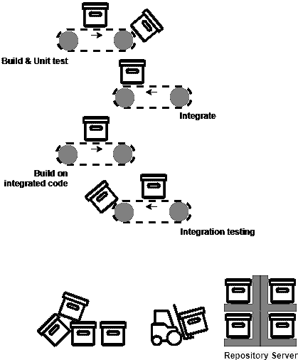

存储库工具

从上面的说明中，您可以看到，一旦创建了一个构建并通过了所有的检查，构建产物就会被上传到二进制存储库工具中。从这里，开发人员和测试人员可以手动选择、部署和测试它们。或者，如果自动部署已经就位，那么构建产物将自动部署到相应的测试环境。那么，使用二进制存储库的优势是什么呢？

二进制存储库工具执行以下操作：

+   每次生成构建产物时，都会存储在一个二进制存储库工具中。存储构建产物有许多优点。其中一个最重要的优点是，构建产物位于一个集中的位置，可以在需要时访问。

+   它可以存储构建工具所需的第三方二进制插件、模块。因此，构建工具不需要每次运行构建时都下载插件。存储库工具连接到在线源并不断更新插件存储库。

+   记录了什么、何时以及谁创建了一个构建包。

+   它提供了类似于**环境**的分段，以更好地管理发布。这也有助于加速 CI 流程。

+   在 CI 环境中，构建的频率太高，每个构建都会生成一个包。由于所有构建的包都在一个地方，开发人员可以自由选择在高级环境中推广什么，而不推广什么。

# 自动打包

有可能一个构建可能有许多组件。例如，让我们考虑一个具有`.rar`文件作为输出的构建。除此之外，它还有一些 Unix 配置文件、发布说明、一些可执行文件，以及一些数据库更改。所有这些不同的组件需要在一起。将许多组件创建为单个存档或单个媒体的任务称为**打包**。同样，这可以使用 CI 工具自动化，并节省大量时间。

# 使用 CI 的好处

以下是使用 CI 的一些好处。该列表简要概述，不全面。

# 摆脱长时间的集成

很少进行代码集成，正如在瀑布模型中所见，可能导致*合并地狱*。这是一个团队花费数周解决合并问题的情况。

与此相反，将特性分支上的每个提交与集成分支进行集成，并对其进行问题测试（CI），允许您尽早发现集成问题。

# 指标

Jenkins、SonarQube、Artifactory 和 GitHub 等工具可以让您在一段时间内生成趋势。所有这些趋势都可以帮助项目经理和团队确保项目朝着正确的方向和正确的步伐发展。

# 更快地发现问题

这是仔细实施 CI 系统的最重要优势。任何集成问题或合并问题都会被及早发现。CI 系统有能力在构建失败时立即发送通知。

# 快速开发

从技术角度来看，CI 有助于团队更高效地工作。使用 CI 的项目在构建、测试和集成其代码时采用自动和持续的方法。这导致开发速度更快。

开发人员花费更多时间开发他们的代码，零时间构建、打包、集成和部署它，因为一切都是自动化的。这也有助于地理上分布的团队共同工作。有了良好的*软件配置管理流程*，人们可以在广泛分布的团队上工作。

# 花更多时间添加功能

在过去，构建和发布活动由开发人员负责，与常规开发工作一起进行。随后出现了一个趋势，即有专门的团队负责构建、发布和部署活动。而且事情并没有止步于此；这种新模式遭遇了开发人员、发布工程师和测试人员之间的沟通问题和协调不足。然而，使用 CI，所有构建、发布和部署工作都得到了自动化。因此，开发团队无需担心其他任何事情，只需开发功能即可。在大多数情况下，甚至连完整测试都是自动化的。因此，通过使用 CI 流程，开发团队可以花更多时间开发代码。

# 摘要

“每个成功的敏捷项目背后都有一个持续集成的过程。”

在本章中，我们粗略地了解了软件工程流程的历史。我们学习了持续集成（CI）及其组成要素。

本章讨论的各种概念和术语构成了后续章节的基础。没有这些，接下来的章节只是技术知识。

在下一章中，我们将学习如何在各种平台上安装 Jenkins。
