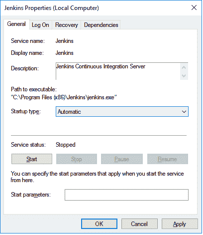
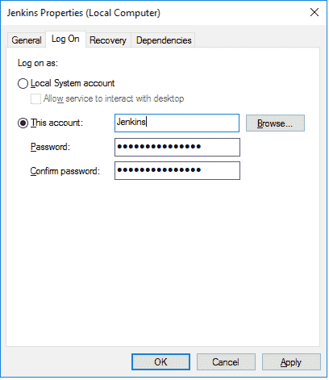
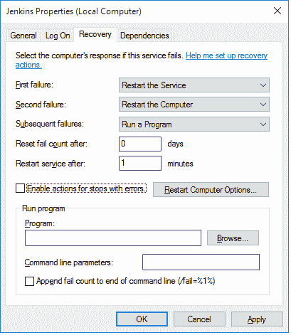
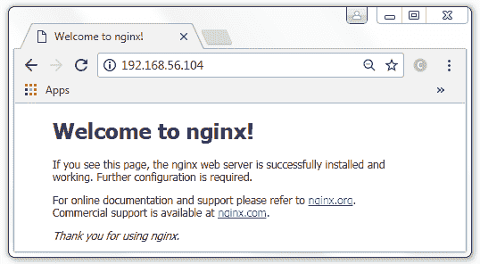
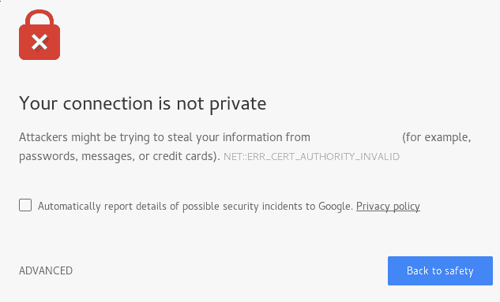
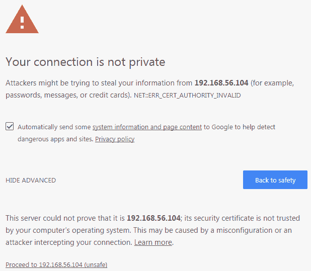
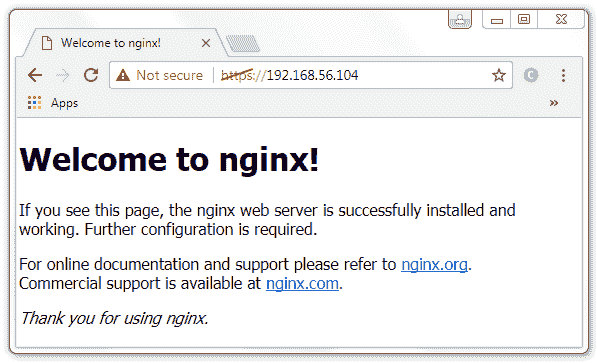
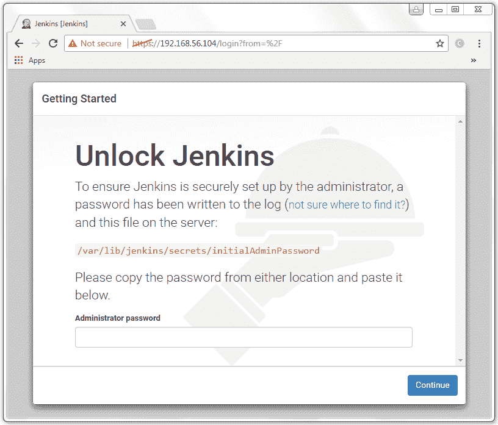
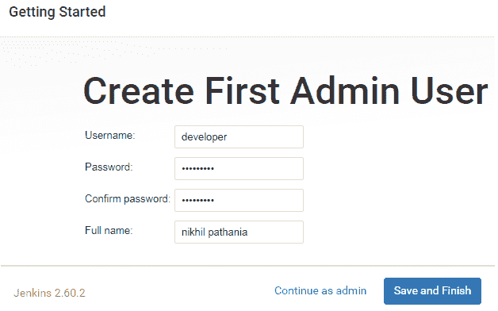

# 第二章：安装 Jenkins

本章讲述了如何在各种平台上安装 Jenkins 等内容。完成本章后，您应该能够做到以下几点：

+   在 Servlet 容器（Apache Tomcat）上运行 Jenkins

+   在 Windows/Ubuntu/Red Hat Linux/Fedora 上以独立应用程序的形式运行 Jenkins

+   在反向代理服务器（Nginx）后运行 Jenkins

+   使用 Docker 运行 Jenkins

+   利用 Docker 数据卷的优势

+   使用 Docker 运行 Jenkins 的开发、分段和生产实例

# 在 Servlet 容器内运行 Jenkins

Jenkins 可用于以下 Servlet 容器：

+   Apache Geronimo 3.0

+   GlassFish

+   IBM WebSphere

+   JBoss

+   Jetty

+   Jonas

+   Liberty profile

+   Tomcat

+   WebLogic

在本节中，您将学习如何在 Apache Tomcat 服务器上安装 Jenkins。在 Apache Tomcat 上将 Jenkins 安装为服务相当简单。您可以选择将 Jenkins 与 Apache Tomcat 服务器上已有的其他服务一起运行，或者您可以仅使用 Apache Tomcat 服务器来运行 Jenkins。

# 先决条件

在开始之前，请确保您准备好以下事项：

+   您需要一台至少拥有 4GB 内存和多核处理器的系统。

+   根据团队中的基础设施管理方式，机器可以是云平台的实例（例如 AWS、DigitalOcean 或任何其他云平台）、裸金属机器，或者它可以是一个虚拟机（在 VMware vSphere 或任何其他服务器虚拟化软件上）。

+   机器应该安装有 Ubuntu 16.04。选择一个 LTS 版本。

+   检查管理员权限；安装可能会要求管理员用户名和密码。

# 安装 Java

按照以下步骤在 Ubuntu 上安装 Java：

1.  更新软件包索引：

```
 sudo apt-get update
```

1.  接下来，安装 Java。执行以下命令将安装**Java Runtime Environment**（**JRE**）：

```
 sudo apt-get install default-jre 
```

1.  要设置`JAVA_HOME`环境变量，请获取 Java 安装位置。通过执行以下命令来执行此操作：

```
 update-java-alternatives -l
```

1.  上一个命令将打印在您的机器上安装的 Java 应用程序列表以及它们的安装路径。复制在终端上出现的 Java 路径：

```
 java-1.8.0-openjdk-amd64  1081
        /usr/lib/jvm/java-1.8.0-openjdk-amd64
```

1.  使用以下命令编辑`/etc/environment`文件：

```
 sudo nano /etc/environment 
```

1.  在`/etc/environment`文件中以以下格式添加 Java 路径（您之前复制的路径）：

```
        JAVA_HOME="/usr/lib/jvm/java-1.8.0-openjdk-amd64" 
```

1.  输入*Ctrl* + *X*并选择*Y*以保存并关闭文件。

1.  接下来，使用以下命令重新加载文件：

```
 sudo source /etc/environment
```

# 安装 Apache Tomcat

按照以下步骤下载并安装 Apache Tomcat 服务器到您的 Ubuntu 机器上：

1.  移动到`/tmp`目录并使用`wget`命令下载 Tomcat 应用程序，如下所示：

```
 cd /tmp
       wget https://archive.apache.org/dist/tomcat/tomcat-8/ \
        v8.5.16/bin/apache-tomcat-8.5.16.tar.gz
```

要获取完整的 Apache Tomcat 版本列表，请访问：[`archive.apache.org/dist/tomcat/`](https://archive.apache.org/dist/tomcat/)。

1.  使用以下命令创建一个名为`/opt/tomcat`的目录：

```
 sudo mkdir /opt/tomcat 
```

1.  在`/opt/tomcat`内解压存档的内容：

```
 sudo tar xzvf apache-tomcat-8*tar.gz \
        -C /opt/tomcat --strip-components=1 
```

1.  接下来，使用以下命令创建一个 `systemd` 服务文件：

```
 sudo nano /etc/systemd/system/tomcat.service
```

1.  将以下内容粘贴到文件中：

```
        [Unit] 
        Description=Apache Tomcat Web Application Container 
        After=network.target 

        [Service] 
        Type=forking 

        Environment=JAVA_HOME=/usr/lib/jvm/java-1.8.0-openjdk-amd64                     
        Environment=CATALINA_PID=/opt/tomcat/temp/tomcat.pid 
        Environment=CATALINA_HOME=/opt/tomcat 
        Environment=CATALINA_BASE=/opt/tomcat 
        Environment='CATALINA_OPTS=-Xms512M -Xmx1024M
        -server -XX:+UseParallelGC' 
        Environment='JAVA_OPTS=-Djava.awt.headless=true
        -Djava.security.egd=file:/dev/./urandom' 

        ExecStart=/opt/tomcat/bin/startup.sh 
        ExecStop=/opt/tomcat/bin/shutdown.sh 

        RestartSec=10 
        Restart=always 

        [Install] 
        WantedBy=multi-user.target 
```

1.  输入 *Ctrl* + *X* 并选择 *Y* 保存并关闭文件。

1.  接下来，使用以下命令重新加载 systemd 守护程序：

```
 sudo systemctl daemon-reload 
```

1.  使用以下命令启动 Tomcat 服务：

```
 sudo systemctl start tomcat 
```

1.  要检查 Tomcat 服务的状态，请运行以下命令：

```
 sudo systemctl status tomcat 
```

1.  您应该看到以下输出：

```
 ● tomcat.service - Apache Tomcat Web Application Container 
          Loaded: loaded (/etc/systemd/system/tomcat.service; disabled;
          vendor preset: enabled) 
          Active: active (running) since Mon 2017-07-31 21:27:39 UTC;
          5s ago 
          Process: 6438 ExecStart=/opt/tomcat/bin/startup.sh (code=exited,
          status=0/SUCCESS) 
         Main PID: 6448 (java) 
            Tasks: 44 
           Memory: 132.2M 
              CPU: 2.013s 
           CGroup: /system.slice/tomcat.service 
                   └─6448 /usr/lib/jvm/java-1.8.0-openjdk-amd64/bin/java
       -Djava.util.logging.config.file=/opt/tomcat/conf/logging.properties
       -Djava.util.logging.manager=org.apache.juli.ClassLoaderLogMan 
```

# 启用防火墙和端口 `8080`

Apache Tomcat 运行在端口 `8080` 上。如果防火墙已禁用，请按照以下步骤启用防火墙：

1.  使用以下命令启用防火墙：

```
 sudo ufw enable 
```

1.  允许端口 `8080` 上的流量：

```
 sudo ufw allow 8080 
```

1.  使用以下命令启用 OpenSSH 以允许 SSH 连接：

```
 sudo ufw enable "OpenSSH" 
```

1.  使用以下命令检查防火墙状态：

```
 sudo ufw status 
```

1.  您应该看到以下输出：

```
 Status: active  
        To                         Action      From 
        --                         ------      ---- 
        8080                       ALLOW       Anywhere 
        OpenSSH                    ALLOW       Anywhere 
        8080 (v6)                  ALLOW       Anywhere (v6) 
        OpenSSH (v6)               ALLOW       Anywhere (v6) 
```

1.  现在，您应该能够访问 Apache Tomcat 服务器页面：`http://<Apache Tomcat 的 IP 地址>:8080`。

# 配置 Apache Tomcat 服务器

在本节中，我们将启用对 Tomcat 管理器应用程序和主机管理器的访问：

1.  打开位于 `/opt/tomcat/conf` 目录内的 `tomcat-users.xml` 文件进行编辑：

```
 sudo nano /opt/tomcat/conf/tomcat-users.xml 
```

1.  文件将看起来像下面这样，为简单起见，我忽略了文件内的注释：

```
        <?xml version="1.0" encoding="UTF-8"?> 
        . . . 
        <tomcat-users  

        xsi:schemaLocation="http://tomcat.apache.org/xml tomcat-users.xsd" 
        version="1.0"> 
        . . . 
          <!-- 
            <role rolename="tomcat"/> 
            <role rolename="role1"/> 
            <user username="tomcat" password="<must-be-changed>"
             roles="tomcat"/> 
            <user username="both" password="<must-be-changed>"
             roles="tomcat,role1"/> 
            <user username="role1" password="<must-be-changed>"
             roles="role1"/> 
          --> 
        </tomcat-users> 
```

1.  从前一个文件中，您可以看到 `role` 和 `user` 字段被注释了。我们需要启用一个角色和一个用户来允许访问 Tomcat 管理器应用程序页面：

```
        <role rolename="manager-gui"/> 
        <role rolename="admin-gui"/> 
        <user username="admin" password="password"
         roles="manager-gui,admin-gui"/>
```

1.  最后，文件应如下所示（已移除注释）：

```
        <?xml version="1.0" encoding="UTF-8"?>  
        <tomcat-users  

        xsi:schemaLocation="http://tomcat.apache.org/xml tomcat-users.xsd" 
        version="1.0"> 
          <role rolename="manager-gui"/> 
          <role rolename="admin-gui"/> 
          <user username="admin" password="password"
           roles="manager-gui,admin-gui"/> 
        </tomcat-users> 
```

1.  输入 *Ctrl* + *X* 并选择 *Y* 保存并关闭文件。

1.  默认情况下，您只能从 Apache Tomcat 服务器内访问 Manager 和 Host Manager 应用程序。由于我们将从远程机器管理在 Apache 上运行的服务，因此需要删除这些限制。

1.  打开以下两个文件，`/opt/tomcat/webapps/manager/META-INF/context.xml` 和 `/opt/tomcat/webapps/host-manager/META-INF/context.xml`。

1.  在这些文件中，取消注释以下部分：

```
        <Context antiResourceLocking="false" privileged="true" > 
          <!--<Valve className="org.apache.catalina.valves.RemoteAddrValve" 
          allow="127\.\d+\.\d+\.\d+|::1|0:0:0:0:0:0:0:1" />--> 
          <Manager sessionAttributeValueClassNameFilter="java\.lang\
          .(?:Boolean|Integer|Long|Number|String)|org\.apache\.catalina\
          .filters\.CsrfPreventionFilter\$LruCache(?:\$1)?|java\.util\
          .(?:Linked)$ 
        </Context> 
```

1.  输入 *Ctrl* + *X* 并选择 *Y* 保存并关闭文件。

1.  使用以下命令重新启动 Tomcat 服务器：

```
 sudo systemctl restart tomcat 
```

1.  尝试从 Apache Tomcat 服务器主页访问管理器应用程序和主机管理器。

# 在 Apache Tomcat 服务器上安装 Jenkins

如果您不希望为 Jenkins 主服务器拥有独立的服务器，并希望将其与存在于 Apache Tomcat 服务器上的其他服务一起托管，可以执行以下步骤：

1.  切换到 `/tmp` 目录，并使用 `wget` 命令下载 Jenkins 应用程序，如下所示：

```
 cd /tmp
        wget http://mirrors.jenkins.io/war-stable/latest/jenkins.war 
```

1.  前一个命令将下载最新稳定版本的 `jenkins.war` 文件。

1.  将文件从 `/tmp` 移动到 `/opt/tomcat/`：

```
 sudo mv jenkins.war /opt/tomcat/webapps/ 
```

1.  列出 `/opt/tomcat/webapps/` 目录的内容：

```
 sudo ls -l /opt/tomcat/webapps 
```

您应该看到以下输出：

```
 total 68984 
        -rw-rw-r--  1 ubuntu ubuntu 70613578 Jul 19 22:37 jenkins.war 
        drwxr-x---  3 root   root       4096 Jul 31 21:09 ROOT 
        drwxr-x--- 14 root   root       4096 Jul 31 21:09 docs 
        drwxr-x---  6 root   root       4096 Jul 31 21:09 examples 
        drwxr-x---  5 root   root       4096 Jul 31 21:09 manager 
        drwxr-x---  5 root   root       4096 Jul 31 21:09 host-manager 
        drwxr-x--- 10 root   root       4096 Jul 31 22:52 jenkins 
```

注意，将 `jenkins.war` 包移动到 `webapps` 文件夹时，会自动创建一个 `jenkins` 文件夹。这是因为 `.war` 文件是一个 Web 应用程序存档文件，一旦部署到 `webapps` 目录中就会自动解压缩。我们所做的是一个小型的部署活动。

1.  就是这样了。你可以使用`http://<Tomcat 服务器的 IP 地址>:8080/jenkins`访问 Jenkins。

# 仅在 Apache Tomcat 服务器上安装 Jenkins

如果你选择为 Jenkins 使用单独的 Apache Tomcat 服务器，请按照以下步骤操作：

1.  切换到`/tmp`目录并使用`wget`命令下载 Jenkins 应用程序，如下所示：

```
 cd /tmp 
 wget http://mirrors.jenkins.io/war-stable/latest/jenkins.war 
```

1.  将下载的`jenkins.war`包重命名为`ROOT.war`：

```
 sudo mv jenkins.war ROOT.war 
```

1.  接下来，通过切换到`root`用户删除`/opt/tomcat/webapps`目录中的所有内容：

```
 sudo su - 
 cd /opt/tomcat/webapps 
 sudo rm -r * 
```

1.  现在将`ROOT.war`（重命名）从`/tmp`目录移动到`/opt/tomcat/webapps`文件夹：

```
 sudo mv /tmp/ROOT.war /opt/tomcat/webapps/ 
```

1.  列出`/opt/tomcat/webapps`目录的内容，你会注意到自动创建了一个`ROOT`文件夹：

```
 total 68964 
        drwxr-x--- 10 root   root       4096 Jul 31 23:10 ROOT 
        -rw-rw-r--  1 ubuntu ubuntu 70613578 Jul 19 22:37 ROOT.war 
```

始终建议专门为 Jenkins 配置一个专用的 Web 服务器。

1.  你可以通过`http://<Tomcat 服务器的 IP 地址>:8080/`访问 Jenkins，不需要任何额外路径。显然，Apache 服务器现在是一个 Jenkins 服务器。

删除`/opt/tomcat/webapps`目录下的所有内容（保留`ROOT`目录和`ROOT.war`），然后将`jenkins.war`文件移动到`webapps`文件夹，这样就足以将 Apache Tomcat 服务器单独用于 Jenkins。

将`jenkins.war`重命名为`ROOT.war`的步骤仅在你想要使`http://<Tomcat 服务器的 IP 地址>:8080/`成为 Jenkins 的标准 URL 时才有必要。

# 设置 Jenkins 主目录路径

在开始使用 Jenkins 之前，有一件重要的事情要配置，即`jenkins_home`路径。当你在 Tomcat 上安装 Jenkins 作为服务时，`jenkins_home`路径将自动设置为`/root/.jenkins/`。这是所有 Jenkins 配置、日志和构建存储的位置。你在 Jenkins 仪表板上创建和配置的所有内容都存储在这里。

我们需要使其更易访问，比如`/var/jenkins_home`。可以按照以下方式实现：

1.  使用以下命令停止 Apache Tomcat 服务器：

```
 sudo systemctl stop tomcat 
```

1.  打开`/opt/tomcat/conf`中的`context.xml`文件进行编辑：

```
 sudo nano /opt/tomcat/conf/context.xml 
```

1.  文件看起来是这样的（注释已删除）：

```
        <?xml version="1.0" encoding="UTF-8"?> 
        <Context> 
          <WatchedResource>WEB-INF/web.xml</WatchedResource> 
          <WatchedResource>${catalina.base}/conf/web.xml</WatchedResource> 
        </Context>
```

1.  在`<Context> </Context>`之间添加以下行：

```
        <Environment name="JENKINS_HOME" value="/var/jenkins_home" 
        type="java.lang.String"/> 
```

1.  使用以下命令启动 Tomcat 服务：

```
 sudo systemctl start tomcat 
```

# 在 Windows 上安装独立的 Jenkins 服务器

在 Windows 上安装 Jenkins 非常简单。在执行在 Windows 上安装 Jenkins 的步骤之前，让我们先看看先决条件。

# 先决条件

在开始之前，请确保您已准备好以下事项：

+   我们需要一台至少具有 4 GB RAM 和多核处理器的机器。

+   根据团队中对基础设施的管理方式，该机器可以是云平台上的一个实例（如 AWS、DigitalOcean 或任何其他云平台）、裸金属机器，或者是一个 VM（在 VMware vSphere 或其他服务器虚拟化软件上）。

+   机器上需要安装最新的任一 Windows 操作系统（Windows 7/8/10，Windows Server 2012/2012 R2/2016）。

+   检查管理员权限；安装可能会要求管理员用户名和密码。

+   确保端口`8080`处于开放状态。

# 安装 Java

按照以下步骤安装 Java：

1.  从[`java.com/en/download/manual.jsp`](https://java.com/en/download/manual.jsp)下载最新版本的 Java JRE（根据您的操作系统选择 x86 或 x64）。

1.  按照安装步骤操作。

1.  要检查 Java 是否成功安装，请使用命令提示符运行以下命令：

```
 java -version 
```

1.  您应该获得以下输出：

```
 java version "1.8.0_121" 
        Java(TM) SE Runtime Environment (build 1.8.0_121-b13) 
        Java HotSpot(TM) 64-Bit Server VM (build 25.121-b13, mixed mode) 
```

1.  要设置`JAVA_HOME`，首先使用以下命令获取 Windows 上的 Java 安装路径： 

```
 where java 
```

1.  上一个命令应输出 Java 安装路径，如下所示。复制路径但不包括`\bin\java`：

```
 C:\Program Files\Java\jdk1.8.0_121\bin\java 
```

1.  以管理员身份打开命令提示符，并运行以下命令以设置`JAVA_HOME`路径。确保使用屏幕上显示的 Java 安装路径：

```
 setx -m JAVA_HOME "C:\Program Files\Java\jdk1.8.121" 
```

# 安装最新稳定版本的 Jenkins

要安装最新稳定版本的 Jenkins，请按照以下步骤顺序执行：

1.  在 Jenkins 官方网站[`jenkins.io/download/`](https://jenkins.io/download/)上下载最新稳定的 Jenkins 软件包。要安装最新稳定版本的 Jenkins，请下载**长期支持**（**LTS**）版本。如果只想要最新版本的 Jenkins，则选择周更版。

1.  解压下载的软件包，您将找到一个`jenkins.msi`文件。

1.  运行`jenkins.msi`并按照安装步骤操作。

1.  在安装过程中，您将有选择 Jenkins 安装目录的选项。默认情况下，它将是`C:\Program Files\Jenkins`或`C:\Program Files (x86)\Jenkins`。保持默认设置，然后单击**下一步**按钮。

1.  单击**完成**按钮完成安装。

# 在 Windows 上启动、停止和重启 Jenkins

Jenkins 默认在安装时开始运行。在本节中，显示了启动、停止、重启和检查 Jenkins 服务状态的命令：

1.  通过以下命令从命令提示符中打开**服务**窗口：

```
 services.msc 
```

1.  寻找名为 Jenkins 的服务。

1.  再次右键单击 Jenkins 服务，然后单击**属性**。

1.  在**常规**选项卡下，您可以看到 Jenkins 服务名称、可执行文件路径、服务状态和启动参数。

1.  使用**启动类型**选项，您可以选择 Jenkins 在 Windows 机器上启动的方式。您可以选择自动、手动和自动（延迟启动）中的一种。确保它始终设置为自动。

1.  在以下服务状态中，有手动**启动**、**停止**、**暂停**和**恢复**Jenkins 服务的选项：



配置 Jenkins 服务的启动选项

1.  转到下一个标签，即**登录**。在这里，我们通过 Jenkins 启动的用户名。

1.  您可以选择使用本地系统帐户（不推荐），或者您可以创建一个具有特殊权限的特殊 Jenkins 用户（推荐）：

对于 Jenkins，始终首选专用帐户。原因是 Local System 帐户 无法受控制；根据组织的政策，它可能会被删除或密码可能会过期，而 Jenkins 用户帐户可以设置为首选策略和特权。



配置 Jenkins 服务的登录选项

1.  下一个选项卡是 Recovery。在这里，我们可以指定 Jenkins 服务启动失败时的操作项目。

1.  这里有一个例子。在第一次失败时，尝试重新启动 Jenkins，在第二次失败时，尝试重新启动计算机。最后，在随后的失败中，运行一个程序来调试问题，或者我们可以运行一个脚本，将 Jenkins 失败日志通过电子邮件发送给相应的 Jenkins 管理员进行调查：



配置 Jenkins 服务的恢复选项

# 在 Ubuntu 上安装独立的 Jenkins 服务器

在 Ubuntu 上安装 Jenkins 服务器相当容易。在执行在 Ubuntu 上安装 Jenkins 的步骤之前，让我们先看看先决条件。

# 先决条件

在开始之前，请确保您准备好了以下事项：

+   我们需要一台至少有 4GB RAM 和多核处理器的机器。

+   根据您团队中如何管理基础设施，该机器可以是云平台上的实例（如 AWS、DigitalOcean 或任何其他云平台）、裸金属机器，或者它可以是一个 VM（在 VMware vSphere 或任何其他服务器虚拟化软件上）。

+   机器应该安装了 Ubuntu 16.04。选择一个 LTS 发行版本。

+   检查管理员特权；安装可能会要求输入管理员用户名和密码。

+   确保端口`8080`是开放的。

# 安装 Java

按照以下步骤安装 Java：

1.  使用以下命令更新软件包索引：

```
 sudo apt-get update 
```

1.  接下来，安装 Java。以下命令将安装 JRE：

```
 sudo apt-get install default-jre 
```

1.  要设置`JAVA_HOME`环境变量，请首先获取 Java 安装位置。通过执行以下命令来执行此操作：

```
 update-java-alternatives -l  
```

1.  上一个命令将打印出安装在您机器上的 Java 应用程序列表，以及它们的安装路径。复制出现在您的终端上的 Java 路径：

```
 java-1.8.0-openjdk-amd64 1081
        /usr/lib/jvm/java-1.8.0-openjdk-amd64
```

1.  使用以下命令打开`/etc/environment`文件进行编辑：

```
 sudo nano /etc/environment 
```

1.  将 Java 路径（您之前复制的路径）以以下格式添加到`/etc/environment`文件中：

```
        JAVA_HOME="/usr/lib/jvm/java-1.8.0-openjdk-amd64" 
```

1.  键入 *Ctrl* + *X* 并选择 *Y* 保存并关闭文件。

1.  接下来，使用以下命令重新加载文件：

```
        sudo source /etc/environment
```

# 安装 Jenkins 的最新版本

要安装 Jenkins 的最新版本，请按照以下顺序执行以下步骤：

1.  使用以下命令将存储库密钥添加到系统中：

```
 wget --no-check-certificate -q -O \
        - https://pkg.jenkins.io/debian/jenkins-ci.org.key | \
 sudo apt-key add - 
```

1.  你应该获得一个`OK`的输出。接下来，使用以下命令添加 Debian 软件包存储库地址：

```
 echo deb http://pkg.jenkins.io/debian binary/ | \
        sudo tee /etc/apt/sources.list.d/jenkins.list 
```

1.  更新软件包索引：

```
 sudo apt-get update 
```

1.  现在，使用以下命令安装 Jenkins：

```
 sudo apt-get install jenkins 
```

1.  如果需要启动 Jenkins，请参阅 *在 Ubuntu 上启动、停止和重新启动 Jenkins* 部分。

1.  Jenkins 现在已经准备好使用了。默认情况下，Jenkins 服务在端口 `8080` 上运行。要访问 Jenkins，请在浏览器中使用 `http://localhost:8080/` 或 `http://<Jenkins 服务器 IP 地址>:8080/`。

# 安装最新稳定版本的 Jenkins

如果您希望安装 Jenkins 的稳定版本，请按顺序执行以下步骤：

1.  使用以下命令将存储库密钥添加到系统中：

```
 wget --no-check-certificate -q -O - \
        https://pkg.jenkins.io/debian-stable/jenkins-ci.org.key | \
        sudo apt-key add - 
```

1.  您应该得到一个 `OK` 的输出。接下来，使用以下命令附加 Debian 软件包存储库地址：

```
 echo deb http://pkg.jenkins.io/debian-stable binary/ | \
        sudo tee /etc/apt/sources.list.d/jenkins.list 
```

1.  更新软件包索引：

```
 sudo apt-get update
```

1.  现在，使用以下命令安装 Jenkins：

```
 sudo apt-get install jenkins 
```

1.  如果需要启动 Jenkins，请参阅 *在 Ubuntu 上启动、停止和重新启动 Jenkins* 部分。

1.  Jenkins 现在已经准备好使用了。默认情况下，Jenkins 服务在端口 `8080` 上运行。要访问 Jenkins，请在浏览器中使用 `http://localhost:8080/` 或 `http://<Jenkins 服务器 IP 地址>:8080/`。

为了排除 Jenkins 故障，访问日志文件 `/var/log/jenkins/jenkins.log`。

Jenkins 服务以用户 `Jenkins` 运行，该用户在安装时自动创建。

# 在 Ubuntu 上启动、停止和重新启动 Jenkins

Jenkins 默认在安装时开始运行。以下是启动、停止、重新启动和检查 Jenkins 服务状态的命令：

1.  要启动 Jenkins，请使用以下命令：

```
 sudo systemctl start jenkins 
```

1.  类似地，要停止 Jenkins，请使用以下命令：

```
 sudo systemctl stop jenkins 
```

1.  要重新启动 Jenkins，请使用以下命令：

```
 sudo systemctl restart jenkins 
```

1.  要检查 Jenkins 服务的状态，请使用以下 `systemctl` 命令：

```
 sudo systemctl status jenkins 
```

1.  您应该看到以下输出：

```
 ● jenkins.service - LSB: Start Jenkins at boot time 
        Loaded: loaded (/etc/init.d/jenkins; bad; vendor preset: enabled) 
        Active: active (exited) since Wed 2017-07-19 22:34:39 UTC; 6min ago 
        Docs: man:systemd-sysv-generator(8) 
```

# 在 Red Hat Linux 上安装独立的 Jenkins 服务器

在本节中，我们将学习在 Red Hat Linux 上安装 Jenkins。这里讨论的安装过程也适用于 Fedora。

# 先决条件

在开始之前，请确保您准备好以下事项：

+   我们需要一台至少拥有 4 GB RAM 和多核处理器的机器。

+   根据您团队中如何管理基础架构，该机器可能是云平台的实例（例如 AWS、DigitalOcean 或任何其他云平台）、裸机、也可能是 VM（在 VMware vSphere 或任何其他服务器虚拟化软件上）。

+   机器应该安装了 RHEL 7.3。

+   检查管理员权限；安装可能会要求输入管理员用户名和密码。

+   确保端口 `8080` 是开放的。

# 安装 Java

按照以下步骤安装 Java：

1.  移动到 `/tmp` 目录并下载 Java：

```
 cd /tmp 
 wget -O java_8.131.rpm \
        http://javadl.oracle.com/webapps/download/AutoDL? \
        BundleId=220304_d54c1d3a095b4ff2b6607d096fa80163 
```

1.  接下来，安装 Java。以下命令将安装 JRE：

```
 sudo rpm -ivh java_8.131.rpm 
```

1.  要设置 `JAVA_HOME` 环境变量，请首先获取 Java 安装位置。通过执行以下命令来执行此操作：

```
 sudo alternatives --config java 
```

1.  上一个命令将打印出在您的机器上安装的 Java 应用程序列表，以及它们的安装路径。复制在您的终端上出现的 Java 路径：

```
 There is 1 program that provides 'java'. 
        Selection    Command 
        ----------------------------------------------- 
        *+ 1           /usr/java/jre1.8.0_131/bin/java
```

1.  使用以下命令将 Java 路径（先前复制的路径）添加到 `/etc/environment` 文件内：

```
 sudo sh \
        -c "echo JAVA_HOME=/usr/java/jre1.8.0_131 >>
        /etc/environment" 
```

# 安装最新版本的 Jenkins

要安装最新版本的 Jenkins，请按照以下步骤进行：

1.  使用以下命令将 Jenkins 仓库添加到 `yum` 仓库内：

```
 sudo wget -O /etc/yum.repos.d/jenkins.repo \
         http://pkg.jenkins-ci.org/redhat/jenkins.repo 
        sudo rpm --import https://jenkins-ci.org/redhat/jenkins-ci.org.key
```

1.  使用以下命令安装 Jenkins：

```
 sudo yum install jenkins 
```

1.  如果需要启动 Jenkins，请查看 *在 Red Hat Linux 上启动、停止和重启 Jenkins* 部分。

Jenkins 现在已准备就绪。默认情况下，Jenkins 服务运行在端口 `8080` 上。要访问 Jenkins，请在浏览器中使用  `http://localhost:8080/` 或 `http://<Jenkins 服务器 IP 地址>:8080/` 。

# 安装最新稳定版本的 Jenkins

如果您更喜欢安装 Jenkins 的稳定版本，请按照以下步骤操作：

1.  使用以下命令将 Jenkins 仓库添加到 `yum` 仓库内：

```
 sudo wget -O /etc/yum.repos.d/jenkins.repo \
         http://pkg.jenkins-ci.org/redhat-stable/jenkins.repo 
 sudo rpm --import https://jenkins-ci.org/redhat/jenkins-ci.org.key 
```

1.  使用以下命令安装 Jenkins：

```
 sudo yum install jenkins
```

1.  如果需要启动 Jenkins，请查看 *在 Red Hat Linux 上启动、停止和重启 Jenkins* 部分。

# 在 Red Hat Linux 上启动、停止和重启 Jenkins

这些是启动、停止、重启和检查 Jenkins 服务状态的命令：

1.  要启动 Jenkins，请使用以下命令：

```
 sudo systemctl start jenkins 
```

1.  同样，要停止 Jenkins，请使用以下命令：

```
 sudo systemctl stop jenkins 
```

1.  要重启 Jenkins，请使用以下命令：

```
 sudo systemctl restart jenkins 
```

1.  要检查 Jenkins 服务的状态，请使用以下 `systemctl` 命令：

```
 sudo systemctl status jenkins  
```

1.  您应该看到以下输出：

```
        ● jenkins.service - LSB: Jenkins Automation Server 
          Loaded: loaded (/etc/rc.d/init.d/jenkins; bad;
          vendor preset: disabled) 
          Active: active (running) since Wed 2017-07-19 18:45:47 EDT;
           2min 31s ago 
             Docs: man:systemd-sysv-generator(8) 
          Process: 1081 ExecStart=/etc/rc.d/init.d/jenkins start
          (code=exited, status=0/SUCCESS) 
           CGroup: /system.slice/jenkins.service 
                   └─1706 /etc/alternatives/java
           -Dcom.sun.akuma.Daemon=daemonized -Djava.awt.headless=true
           -DJENKINS_HOME=/var/lib/j...
```

为了排除 Jenkins 问题，请访问 `var/log/jenkins/jenkins.log` 中的日志。

Jenkins 服务以 Jenkins 用户运行，该用户会在安装时自动创建。

# 在反向代理后运行 Jenkins

在这个例子中，我们将学习如何将一个 Nginx 服务器（在一个独立的机器上运行）放置在 Jenkins 服务器（在另一个独立的机器上运行）的前面。

# 先决条件

在开始之前，请确保您已准备好以下事项：

+   我们需要两台至少配备 4GB 内存和多核处理器的机器。一台将运行 Nginx，另一台将运行 Jenkins。

+   根据团队如何管理基础设施，该机器可以是云平台上的实例（例如 AWS、DigitalOcean 或任何其他云平台）、裸机服务器，或者它可以是一个 VM（在 VMware vSphere 或任何其他服务器虚拟化软件上）。

+   机器应该安装了 Ubuntu 16.04 或更高版本。

+   检查管理员权限；安装可能会要求管理员用户名和密码。

+   两台机器应该在同一个网络上。以下设置假设您的组织有一个用于所有服务的内部网络。

# 安装和配置 Nginx

在 Ubuntu 上安装 Nginx 很简单。请按照以下步骤在 Ubuntu 上安装 Nginx 服务器：

1.  更新本地软件包索引：

```
 sudo apt-get update
```

1.  使用以下命令安装 `nginx`：

```
 sudo apt-get install nginx 
```

# 配置 Nginx 服务器的防火墙

我们需要在我们的 Nginx 服务器上配置防火墙以允许访问 Nginx 服务。请按照以下步骤操作：

1.  使用 `ufw` 命令检查防火墙状态：

```
 sudo ufw status 
```

应该看到以下输出：

```
 Status: inactive 
```

1.  如果已启用，请转到 *第三步*。但是，如果发现它被禁用了，则使用以下命令启用防火墙：

```
 sudo ufw enable  
```

应该看到以下输出

```
        Command may disrupt existing ssh connections.
        Proceed with operation (y|n)? y 
        Firewall is active and enabled on system startup 
```

1.  使用以下命令列出可用的配置。你应该看到三个 Nginx 配置文件和一个 OpenSSH 配置文件：

```
 sudo ufw app list  
```

应该看到以下输出

```
        Available applications: 
          Nginx Full 
          Nginx HTTP 
          Nginx HTTPS 
          OpenSSH
```

`Nginx Full` 配置文件打开 `80` 端口（未加密）和 `443` 端口（TLS/SSL）。

`Nginx HTTP` 配置文件仅打开 `80` 端口（未加密）。

`Nginx HTTPS` 配置文件仅打开 `443` 端口（TLS/SSL）。

`OpenSSH` 配置文件仅打开 `22` 端口（SSH）。

始终建议启用最严格的配置文件。

1.  为了保持简单，我们将启用 `Nginx Full` 配置文件，如以下命令所示：

```
 sudo ufw allow 'Nginx Full'  
        Rules updated 
        Rules updated (v6) 
```

1.  如果未激活，则启用 `OpenSSH` 配置文件，如所示。这将允许我们继续通过 SSH 访问我们的 Nginx 机器：

```
 sudo ufw allow 'OpenSSH' 
```

如果 OpenSSH 被禁用，你将无法登录到你的 Nginx 机器。

1.  使用以下命令验证更改。你应该看到 `Nginx Full` 和 `OpenSSH` 被允许：

```
 sudo ufw status  
```

应该看到以下输出：

```
        Status: active  
        To                         Action      From 
        --                         ------      ---- 
        OpenSSH                    ALLOW       Anywhere 
        Nginx Full                 ALLOW       Anywhere 
        OpenSSH (v6)               ALLOW       Anywhere (v6) 
        Nginx Full (v6)            ALLOW       Anywhere (v6)
```

1.  使用 `systemctl` 命令检查 Nginx 服务是否正在运行：

```
 systemctl status nginx  
```

应该看到以下输出：

```
        ● nginx.service - A high performance web server and a reverse proxy
        server 
           Loaded: loaded (/lib/systemd/system/nginx.service; enabled;
           vendor preset: enabled) 
           Active: active (running) since Thu 2017-07-20 18:44:33 UTC;
        45min ago 
         Main PID: 2619 (nginx) 
            Tasks: 2 
           Memory: 5.1M 
              CPU: 13ms 
           CGroup: /system.slice/nginx.service 
                   ├─2619 nginx: master process /usr/sbin/nginx
           -g daemon on;                master_process on 
                   └─2622 nginx: worker process
```

1.  从前面的输出中，你可以看到我们的 Nginx 服务正常运行。现在尝试使用浏览器访问它。首先，使用 `ip route` 命令获取你的机器的 IP 地址：

```
 ip route  
```

应该看到以下输出：

```
        default via 10.0.2.2 dev enp0s3
        10.0.2.0/24 dev enp0s3  proto kernel
        scope link src 10.0.2.15
        192.168.56.0/24 dev enp0s8  proto kernel  scope link
        src 192.168.56.104 
```

1.  现在使用 `http://<IP Address>:80` 访问 Nginx 主页。你应该看到类似以下截图的内容：



Nginx 索引页面

# 启动、停止和重新启动 Nginx 服务器

现在我们的 Nginx 服务器已经启动了，让我们看看一些可以用来管理 Nginx 的命令。就像 Jenkins 一样，我们将使用 `systemctl` 命令来管理 Nginx：

1.  要停止 Nginx，请使用以下命令：

```
 sudo systemctl stop nginx
```

1.  要在停止时启动 Nginx，请使用以下命令：

```
 sudo systemctl start nginx 
```

1.  要重新启动 Nginx，请使用以下命令：

```
 sudo systemctl restart nginx 
```

1.  若要在进行配置更改后重新加载 Nginx，请使用以下命令：

```
 sudo systemctl reload nginx 
```

# 使用 OpenSSL 保护 Nginx

在本节中，我们将学习为我们的 Nginx 服务器设置自签名 SSL 证书。

# 创建 SSL 证书

运行以下命令使用 OpenSSL 创建自签名密钥和证书对：

```
sudo openssl req -x509 -nodes -days 365 -newkey rsa:2048 \
-keyout /etc/ssl/private/nginx-selfsigned.key -out \
/etc/ssl/certs/nginx-selfsigned.crt 
```

以下表格解释了前面命令中使用的参数：

| **参数** | **描述** |
| --- | --- |
| `req` | 此参数指示我们要使用 X.509 **证书签名请求** (**CSR**) 管理。 |
| `-x509` | 此参数允许我们创建自签名证书而不是生成证书签名请求。 |
| `-nodes` | 此参数允许 OpenSSL 跳过使用密码短语验证我们的证书的选项。 |
| `-days` | 此参数设置证书有效期。 |
| `-newkey rsa: 2048` | 此参数告诉 OpenSSL 同时生成新证书和新密钥。 `rsa:2048` 选项使 RSA 密钥长度为 `2048` 位。 |
| `-keyout` | 此参数允许您将生成的私钥文件存储在您选择的位置。 |
| `-out` | 此参数允许你将生成的证书存储在你选择的位置。 |

当你执行以下命令生成一个新的私钥和证书时，将提示你提供信息。 提示将如下所示：

```
Country Name (2 letter code) [AU]:DK 
State or Province Name (full name) [Some-State]:Midtjylland 
Locality Name (eg, city) []:Brande 
Organization Name (eg, company) [Internet Widgits Pty Ltd]: Deviced.Inc 
Organizational Unit Name (eg, section) []:DevOps 
Common Name (e.g. server FQDN or YOUR name) []:<IP address of Nginx> 
Email Address []:admin@organisation.com 
```

**通用名称**（**CN**）字段，也称为**完全限定域名**（**FQDN**）非常重要。 你需要提供你的 Nginx 服务器的 IP 地址或域名。

`/etc/ssl/private/` 现在将包含你的 `nginx-selfsigned.key` 文件，而 `/etc/ssl/certs/` 将包含你的 `nginx-selfsigned.crt` 文件。

接下来，我们将创建一个强大的 Diffie-Hellman 组，用于与客户端协商**完全前向安全**（**PFS**）。我们将通过使用`openssl`来执行以下命令：

```
sudo openssl dhparam -out /etc/ssl/certs/dhparam.pem 2048 
```

这将需要相当长的时间，但完成后，它将在 `/etc/ssl/certs/` 内生成一个 `dhparam.pem` 文件。

# 创建强加密设置

在下一节中，我们将设置一个强大的 SSL 密码套件来保护我们的 Nginx 服务器：

1.  创建一个名为 `*s*sl-params.conf` 的配置文件在`/etc/nginx/snippets/`中，如下所示：

```
 sudo nano /etc/nginx/snippets/ssl-params.conf
```

1.  将以下代码复制到文件中：

```
        # from https://cipherli.st/ 
        # and https://raymii.org/s/tutorials/
          Strong_SSL_Security_On_nginx.html 

        ssl_protocols TLSv1 TLSv1.1 TLSv1.2; 
        ssl_prefer_server_ciphers on; 
        ssl_ciphers "EECDH+AESGCM:EDH+AESGCM:AES256+EECDH:AES256+EDH"; 
        ssl_ecdh_curve secp384r1; 
        ssl_session_cache shared:SSL:10m; 
        ssl_session_tickets off; 
        ssl_stapling on; 
        ssl_stapling_verify on; 
        resolver 8.8.8.8 8.8.4.4 valid=300s; 
        resolver_timeout 5s; 
        # disable HSTS header for now 
        #add_header Strict-Transport-Security "max-age=63072000;
         includeSubDomains; preload"; 
        add_header X-Frame-Options DENY; 
        add_header X-Content-Type-Options nosniff; 

        ssl_dhparam /etc/ssl/certs/dhparam.pem; 
```

1.  输入 *Ctrl* + *X*，选择 *Y* 保存并关闭文件。

我们使用了 Remy van Elst 在 [`cipherli.st/`](https://cipherli.st/) 中提供的建议。

# 修改 Nginx 配置

接下来，我们将修改我们的 Nginx 配置以启用 SSL。 按照以下步骤进行：

1.  首先，备份你现有的位于`/etc/nginx/sites-available/`中名为`default`的 Nginx 配置文件：

```
 sudo cp /etc/nginx/sites-available/default \
        /etc/nginx/sites-available/default.backup
```

1.  现在，使用以下命令打开文件进行编辑：

```
 sudo nano /etc/nginx/sites-available/default 
```

1.  你会在文件中找到很多被注释掉的内容。 如果你暂时忽略它们，你可能会看到以下内容：

```
        server { 
            listen 80 default_server; 
            listen [::]:80 default_server; 

            # SSL configuration 

            # listen 443 ssl default_server; 
            # listen [::]:443 ssl default_server; 

            . . . 

            root /var/www/html; 

            . . . 

            index index.html index.htm index.nginx-debian.html; 
            server_name _; 

            . . . 
```

1.  我们将修改配置以便未加密的 HTTP 请求自动重定向到加密的 HTTPS。 我们将通过添加以下三行来执行此操作，如下方代码中所示：

```
        server { 
            listen 80 default_server; 
            listen [::]:80 default_server; 
            server_name <nginx_server_ip or nginx domain name>; 
            return 301 https://$server_name$request_uri; 
        } 

            # SSL configuration 

            # listen 443 ssl default_server; 
            # listen [::]:443 ssl default_server; 

            . . .
```

1.  从前面的代码中，你可以看到我们已关闭了服务器块。

1.  接下来，我们将启动一个新的服务器块，取消注释使用端口`443`的两个`listen`指令，并在这些行中添加`http2`以启用 HTTP/2，如下代码块所示：

```
        server { 
            listen 80 default_server; 
            listen [::]:80 default_server; 
            server_name <nginx_server_ip or nginx domain name>; 
            return 301 https://$server_name$request_uri; 
        } 

        server { 

            # SSL configuration 

            listen 443 ssl http2 default_server; 
            listen [::]:443 ssl http2 default_server; 

            . . . 
```

1.  接下来，我们将添加我们自签名证书和密钥的位置。 我们只需要包含我们设置的两个片段文件：

```
        server { 
            listen 80 default_server; 
            listen [::]:80 default_server; 
            server_name <nginx_server_ip or nginx domain name>; 
            return 301 https://$server_name$request_uri; 
        } 
        server { 

            # SSL configuration 

            listen 443 ssl http2 default_server; 
            listen [::]:443 ssl http2 default_server; 
            ssl_certificate /etc/ssl/certs/nginx-selfsigned.crt; 
            ssl_certificate_key /etc/ssl/private/nginx-selfsigned.key; 
            include snippets/ssl-params.conf; 

            . . .
```

1.  接下来，我们将在 SSL 服务器块内设置`server_name`值为我们的 Nginx IP 或域名。默认情况下，`server_name` 可能被设置为一个下划线(`_`)*,* 如下代码块所示：

```
        server { 
            # SSL configuration 

            . . . 

            server_name <nginx_server_ip or nginx domain name>; 

            . . . 
        } 
```

1.  输入 *Ctrl* + *X*，选择 *Y* 保存并关闭文件。

# 启用更改并测试我们的 Nginx 设置

现在我们将重新启动 Nginx 来实施我们的新更改：

1.  首先，检查我们的文件中是否有任何语法错误。通过输入以下命令来执行此操作：

```
 sudo nginx -t 
```

1.  如果一切顺利，你应该能够看到类似以下命令输出的内容：

```
 nginx: [warn] "ssl_stapling" ignored, issuer certificate not found 
        nginx: the configuration file /etc/nginx/nginx.conf syntax is ok 
        nginx: configuration file /etc/nginx/nginx.conf test is successful 
```

1.  使用以下命令重新启动 Nginx：

```
 sudo systemctl restart nginx 
```

1.  接下来，使用`http://<Nginx_IP_Address>:80`访问您的 Nginx 服务器。您应该注意到您已被自动重定向到`https://<Nginx_IP_Address>:80`。

1.  您将看到类似以下截图的警告：



SSL 警告

1.  这是预期的，因为我们创建的证书未由您浏览器信任的证书颁发机构签名。

1.  单击高级按钮，然后单击**继续访问 192.168.56.104（不安全）**：



以不安全的方式继续

1.  您现在应该能够看到 Nginx 默认页面，如以下截图所示：



带有 SSL 加密的 Nginx 索引页面

# 配置 Jenkins 服务器

在本节中，我们将对我们的 Jenkins 服务器执行一些配置。要首先设置 Jenkins 服务器，请参阅*在 Ubuntu 上安装独立的 Jenkins 服务器*部分。

一旦您运行起一个 Jenkins 服务器，就按照以下步骤进行操作：

1.  要使 Jenkins 与 Nginx 配合工作，我们需要更新 Jenkins 配置，以便 Jenkins 服务器仅侦听 Jenkins IP 地址或 Jenkins 域名接口，而不是所有接口（`0.0.0.0`）。如果 Jenkins 监听所有接口，则可能可以在其原始未加密端口（`8080`）上访问。

1.  为此，请修改`/etc/default/jenkins`配置文件，如下所示：

```
 sudo nano /etc/default/jenkins
```

1.  在文件中，滚动到最后一行或者只查找`JENKINS_ARGS`行。

1.  将以下参数追加到现有的`JENKINS_ARGS`值：

```
        -httpListenAddress=<IP Address of your Jenkins>  
```

1.  最终的`JENKINS_ARGS`行应该类似于这样（单行）：

```
        JENKINS_ARGS="--webroot=/var/cache/$NAME/war
        --httpPort=$HTTP_PORT
        --httpListenAddress=192.168.56.105" 
```

1.  输入*Ctrl* + *X*并选择*Y*以保存并关闭文件。

1.  为了使新的配置生效，重新启动 Jenkins 服务器：

```
 sudo systemctl restart jenkins 
```

1.  要检查 Jenkins 是否正常运行，请执行以下命令：

```
 sudo systemctl status jenkins  
```

你应该能够看到以下截图：

```
        ● jenkins.service - LSB: Start Jenkins at boot time 
           Loaded: loaded (/etc/init.d/jenkins; bad;
           vendor preset: enabled) 
           Active: active (exited) since Sat 2017-07-22 23:30:36 UTC;
           18h ago 
             Docs: man:systemd-sysv-generator(8) 
```

# 将反向代理设置添加到 Nginx 配置中

以下步骤将帮助您向 Nginx 配置中添加反向代理设置：

1.  打开 Nginx 配置文件进行编辑：

```
 sudo nano /etc/nginx/sites-available/default
```

1.  因为我们将所有请求发送到我们的 Jenkins 服务器，所以请注释掉默认的`try_files`行，如下面的代码块所示：

```
        location / { 
          # First attempt to serve request as file, then 
          # as directory, then fall back to displaying a 404\. 
          # try_files $uri $uri/ =404; 
        } 
```

1.  接下来，添加如下所示的代理设置：

```
        location / { 
          # First attempt to serve request as file, then 
          # as directory, then fall back to displaying a 404\. 
          #try_files $uri $uri/ =404; 
          include /etc/nginx/proxy_params; 
          proxy_pass http://<ip address of jenkins>:8080; 
          proxy_read_timeout  90s; 
          # Fix potential "It appears that your reverse proxy set up
 is broken" error. 
          proxy_redirect http://<ip address of jenkins>:8080
 https://your.ssl.domain.name; 
        } 
```

1.  输入*Ctrl* + *X*并选择*Y*以保存并关闭文件。

1.  运行以下命令检查 Nginx 配置文件中是否存在任何语法错误：

```
 sudo nginx -t  
```

你应该能够看到以下输出：

```
        nginx: [warn] "ssl_stapling" ignored, issuer certificate not found 
        nginx: the configuration file /etc/nginx/nginx.conf syntax is ok 
        nginx: configuration file /etc/nginx/nginx.conf test is successful 
```

1.  如果输出没有错误，请重新启动 Nginx 以使新配置生效。使用以下命令：

```
 sudo systemctl restart nginx
```

1.  接下来，使用`https://<nginx_ip_address>:80`访问您的 Nginx 服务器：



Jenkins 入门页面

# 在同一台机器上运行 Nginx 和 Jenkins

如果要在反向代理服务器（Nginx）后运行 Jenkins，且 Jenkins 服务器和 Nginx 服务器在同一台机器上运行，则按顺序执行以下各部分：

1.  使用至少 4 GB RAM 和多核处理器设置一台机器。

1.  根据团队如何管理基础设施，该机器可能是云平台上的实例（如 AWS、DigitalOcean 或任何其他云平台）、裸机，或者可能是 VM（在 VMware vSphere 或任何其他服务器虚拟化软件上）。

1.  机器应安装 Ubuntu 16.04 或更高版本。

1.  检查管理员权限；安装可能会要求输入管理员用户名和密码。

1.  安装 Nginx；参考*安装和配置 Nginx*部分。

1.  配置防火墙；参考*在 Nginx 服务器上配置防火墙*部分。

1.  使用 OpenSSL 安全地配置 Nginx 服务器；参考*使用 OpenSSL 安全地配置 Nginx*部分。

1.  使用以下命令配置防火墙以允许端口`8080`上的流量：

```
 sudo ufw allow 8080 
```

1.  接下来，使用以下命令检查防火墙状态：

```
 sudo ufw status  
```

您应该看到以下输出：

```
        Status: active  
        To                         Action      From 
        --                         ------      ---- 
        OpenSSH                    ALLOW       Anywhere 
        Nginx Full                 ALLOW       Anywhere 
        8080                       ALLOW       Anywhere 
        OpenSSH (v6)               ALLOW       Anywhere (v6) 
        Nginx Full (v6)            ALLOW       Anywhere (v6) 
        8080 (v6)                  ALLOW       Anywhere (v6) 
```

1.  安装 Jenkins，参考*在 Ubuntu 上安装独立 Jenkins 服务器*部分。

1.  配置 Jenkins 服务器；参考*配置 Jenkins 服务器*部分。在执行本节中提到的步骤时，请确保将`<IP Address of your Jenkins>`替换为`127.0.0.1`。

1.  在 Nginx 中添加反向代理设置；参考*将反向代理设置添加到 Nginx 配置*部分。在执行本节中提到的步骤时，您将被要求在 Nginx 配置文件的各处输入 Jenkins 服务器 IP。由于我们的 Jenkins 服务器现在在与 Nginx 相同的机器上运行，因此`<IP Address of your Jenkins>`的值应为`localhost`。

# 在 Docker 上运行 Jenkins

在 Docker 上运行 Jenkins 的真正优势在于当您需要快速创建多个开发和分段实例时。它还非常有用，可以在主 Jenkins 服务器上执行维护活动时将流量重定向到次要 Jenkins 服务器。虽然我们稍后将看到这些用例，但让我们首先尝试在 Docker 上运行 Jenkins。

# 先决条件

在开始之前，请确保准备了以下内容：

+   我们需要一台至少拥有 4 GB RAM（越多越好）和多核处理器的机器。

+   根据团队中的基础设施管理方式，机器可能是云平台上的实例（如 AWS、DigitalOcean 或任何其他云平台）、裸机，或者可能是 VM（在 VMware vSphere 或任何其他服务器虚拟化软件上）。

+   机器应该安装 Ubuntu 16.04 或更高版本。

+   检查管理员权限；安装可能会要求管理员用户名和密码。

# 设置 Docker 主机

在本节中，我们将学习如何使用存储库方法和使用 Debian 软件包安装 Docker。按照以下各节中的步骤设置 Docker 主机。

# 设置存储库

按照以下步骤设置存储库：

1.  使用以下命令让 `apt` 使用存储库：

```
 sudo apt-get install apt-transport-https ca-certificates 
```

1.  使用以下命令添加 Docker 的官方 GPG 密钥：

```
 curl -fsSL https://yum.dockerproject.org/gpg | sudo apt-key add -
```

1.  使用以下命令验证密钥 ID 是否确实为 `58118E89F3A912897C070ADBF76221572C52609D`：

```
 apt-key fingerprint 58118E89F3A912897C070ADBF76221572C52609D
```

你应该看到以下输出：

```
        pub  4096R/2C52609D 2015-07-14 
        Key fingerprint = 5811 8E89 F3A9 1289 7C07  0ADB F762 2157 2C52
         609D 
        uid  Docker Release Tool (releasedocker) docker@docker.com 
```

1.  使用以下命令设置稳定存储库以下载 Docker：

```
 sudo add-apt-repository \
       "deb https://apt.dockerproject.org/repo/ubuntu-$(lsb_release \
       -cs) main" 
```

建议始终使用稳定版本的存储库。

# 安装 Docker

设置存储库后，请执行以下步骤安装 Docker：

1.  使用以下命令更新 `apt` 包索引：

```
 sudo apt-get update 
```

1.  要安装最新版本的 Docker，请运行以下命令：

```
 sudo apt-get -y install docker-engine 
```

1.  要安装特定版本的 Docker，请使用以下命令列出可用版本：

```
 apt-cache madison docker-engine  
```

你应该看到以下输出：

```
        docker-engine | 1.16.0-0~trusty |
        https://apt.dockerproject.org/repo ubuntu-trusty/main amd64
        Packages docker-engine | 1.13.3-0~trusty |
        https://apt.dockerproject.org/repo ubuntu-trusty/main amd64
        Packages  
        ...
```

上一个命令的输出取决于前一节中配置的存储库类型（*设置存储库*）。

1.  接下来，执行以下命令来安装特定版本的 Docker：

```
 sudo apt-get -y install docker-engine=<VERSION_STRING>  
        sudo apt-get -y install docker-engine=1.16.0-0~trusty 
```

1.  Docker 服务会自动启动。要验证 Docker 是否已安装并运行，请执行以下命令：

```
 sudo docker run hello-world  
```

1.  前一个命令应该没有错误，并且你应该看到一个 `Hello from Docker!` 的消息：

```
        Unable to find image 'hello-world:latest' locally 
        latest: Pulling from library/hello-world 
        b04784fba78d: Pull complete 
        Digest: sha256:
          f3b3b28a45160805bb16542c9531888519430e9e6d6ffc09d72261b0d26ff74f 
        Status: Downloaded newer image for hello-world:latest 

        Hello from Docker! 
        This message shows that your installation appears to be working
        correctly. 
        ... 
```

# 从软件包安装

按照以下步骤使用 `.deb` 软件包安装 Docker：

1.  从 [`apt.dockerproject.org/repo/pool/main/d/docker-engine/`](https://apt.dockerproject.org/repo/pool/main/d/docker-engine/) 下载你选择的 `.deb` 软件包。

1.  要安装已下载的软件包，请执行以下命令：

```
 sudo dpkg -i /<path to package>/<docker package>.deb
```

1.  运行以下命令验证 Docker 安装：

```
 sudo docker run hello-world  
```

你应该看到以下输出：

```
        Hello from Docker! 
        This message shows that your installation appears to be working
        correctly. 
```

# 运行 Jenkins 容器

现在我们的 Docker 主机已准备好，让我们运行 Jenkins：

1.  运行以下命令以启动 Jenkins 容器。这可能需要一些时间，因为 Docker 将尝试从 Docker Hub 下载 Jenkins Docker 镜像 (`jenkins/jenkins:lts`)：

```
 docker run -d --name jenkins_dev -p 8080:8080 \
        -p 50000:50000 jenkins/jenkins:lts  
```

你应该看到以下输出：

```
        ...
 ...
 ... 
        d52829d9da9e0a1789a3117badc862039a0084677be6a771a959d8467b9cc267 
```

1.  以下表格解释了我们在上一个命令中使用的 Docker 命令：

| **参数** | **描述** |
| --- | --- |
| `docker` | 用于调用 Docker 实用程序。 |
| `run` | 用于运行容器的 Docker 命令。 |
| `-d` | 此选项在后台运行容器。 |
| `--name` | 此选项允许您为容器命名。 |
| `-p` | 该选项用于将容器的端口与主机映射。  |
| `jenkins/jenkins:lts` | 用于创建容器的 Docker 镜像及其版本的名称。 `jenkins/jenkins` 是 Jenkins Docker 镜像，`lts` 是该镜像的特定版本。 |

1.  要查看正在运行的容器列表，请执行以下命令：

```
 sudo docker ps --format "{{.ID}}: {{.Image}} {{.Names}}"
```

您应该看到以下输出：

```
        d52829d9da9e: jenkins/jenkins:lts jenkins_dev 
```

要使用 Jenkins 的最新 LTS 版本，请使用 `jenkins/jenkins:lts` Jenkins Docker 镜像。

要使用 Jenkins 的最新每周发布版本，请使用 `jenkins/jenkins` Jenkins Docker 镜像。

1.  使用以下命令记下您的 Docker 主机 IP：

```
 sudo ip route  
```

您应该看到以下输出：

```
        default via 10.0.2.2 dev enp0s3 
        10.0.2.0/24 dev enp0s3  proto kernel  scope link  src 10.0.2.15 
        172.17.0.0/16 dev docker0  proto kernel  scope link  src 172.17.0.1 
        192.168.56.0/24 dev enp0s8  proto kernel  scope link
        src 192.168.56.107 
```

1.  您的 Jenkins 服务器现在可通过`http：<Docker 主机的 IP 地址>：8080`访问。现在您应该能够看到 Jenkins 入门页面。

1.  要继续进行 Jenkins 设置，您可能需要`initialAdminPassword`密钥。此文件位于`/var/jenkins_home/secrets/`内。您可以通过以下方式之一获取`initialAdminPassword`文件内的数据。您可以使用以下命令`docker exec`，如下所示：

```
 sudo docker exec -it jenkins_dev \
        cat /var/jenkins_home/secrets/initialAdminPassword
```

或者，通过登录到正在运行的 Jenkins 容器内，使用相同的`docker exec`命令，如下所示：

```
 sudo docker exec -it jenkins_dev bash
```

1.  一旦您进入容器，请执行以下 Linux 命令以获取文件的内容：

```
 cat /var/jenkins_home/secrets/initialAdminPassword \ 
```

这两个命令都会打印`initialAdminPassword`文件的内容，类似于以下所示的内容：

```
 1538ededb4e94230aca12d10dd461e52 
```

这里，`-i` 选项允许您与 Docker 容器进行交互，而 `-t` 选项分配一个伪 `-tty`。

1.  当您仍在 Jenkins 容器内时，请注意`jenkins_home`目录位于`/var/`内，并且`jenkins.war`文件位于`/usr/share/jenkins`内。

`jenkins_home` 是一个非常重要的目录，其中包含您的 Jenkins 作业、构建、元数据、配置、用户等所有内容。

# 使用数据卷运行 Jenkins 容器

在前面的部分中，我们创建了一个 Jenkins 容器，但没有任何机制使`jenkins_home`目录内的数据持久化。简单来说，如果由于某种原因删除 Jenkins 容器，则会删除您的`jenkins_home`目录。

幸运的是，还有一种更好的方法来使用 Docker 运行 Jenkins，那就是使用数据卷。数据卷是特殊的目录，使数据持久化并独立于容器的生命周期。如果容器将数据写入数据卷，则删除容器仍会使数据可用，因为容器及其关联的数据卷是两个不同的实体。

让我们使用数据卷创建一个 Jenkins 容器：

1.  使用以下命令运行 Jenkins 容器：

```
 sudo docker run -d --name jenkins_prod -p 8080:8080\
        -p 50000:50000 -v jenkins-home-prod:/var/jenkins_home \
        jenkins/jenkins:lts 
```

1.  `-v jenkins-home-prod:/var/jenkins_home` 选项将创建一个名为`jenkins-home-prod`的数据卷，并将其映射到容器内的`/var/jenkins_home`目录。

1.  执行以下命令以查看 `jenkins_prod` Jenkins 容器内 `/var/jenkins_home` 目录的内容：

```
 sudo docker exec -it jenkins_prod ls -lrt /var/jenkins_home 
```

您应该看到以下输出：

```
        total 72 
        drwxr-xr-x  2 jenkins jenkins 4096 Jul 26 20:41 init.groovy.d 
        -rw-r--r--  1 jenkins jenkins  102 Jul 26 20:41
         copy_reference_file.log 
        drwxr-xr-x 10 jenkins jenkins 4096 Jul 26 20:41 war 
        -rw-r--r--  1 jenkins jenkins    0 Jul 26 20:41
         secret.key.not-so-secret 
        -rw-r--r--  1 jenkins jenkins   64 Jul 26 20:41 secret.key 
        drwxr-xr-x  2 jenkins jenkins 4096 Jul 26 20:41 plugins 
        drwxr-xr-x  2 jenkins jenkins 4096 Jul 26 20:41 jobs 
        drwxr-xr-x  2 jenkins jenkins 4096 Jul 26 20:41 nodes 
        -rw-r--r--  1 jenkins jenkins  159 Jul 26 20:41
          hudson.model.UpdateCenter.xml 
        -rw-------  1 jenkins jenkins 1712 Jul 26 20:41 identity.key.enc 
        drwxr-xr-x  2 jenkins jenkins 4096 Jul 26 20:41 userContent 
        -rw-r--r--  1 jenkins jenkins  907 Jul 26 20:41 nodeMonitors.xml 
        drwxr-xr-x  3 jenkins jenkins 4096 Jul 26 20:41 logs 
        -rw-r--r--  1 jenkins jenkins    6 Jul 26 20:41
          jenkins.install.UpgradeWizard.state 
        drwxr-xr-x  3 jenkins jenkins 4096 Jul 26 20:41 users 
        drwx------  4 jenkins jenkins 4096 Jul 26 20:41 secrets 
        -rw-r--r--  1 jenkins jenkins   94 Jul 26 20:41 jenkins.CLI.xml 
        -rw-r--r--  1 jenkins jenkins 1592 Jul 26 20:41 config.xml 
        drwxr-xr-x  2 jenkins jenkins 4096 Jul 26 20:41 updates 
```

1.  要列出您的 Docker 卷，请执行以下命令：

```
 sudo docker volume ls 
```

您应该看到以下输出：

```
        DRIVER              VOLUME NAME 

        local               jenkins-home-prod 
```

1.  现在您有一个带有持久 `jenkins_home` 目录的 Jenkins 容器。

# 测试数据卷

我们将通过执行以下步骤来测试我们的数据卷。

1.  我们将对 Jenkins 服务器进行一些更改；这将修改 `/var/jenkins_home` 目录中的内容。

1.  我们将删除 Jenkins 容器。

1.  我们将创建一个新的 Jenkins 容器，该容器将使用相同的数据卷。

1.  使用以下命令检查活动的 Jenkins 容器：

```
 sudo docker ps --format "{{.ID}}: {{.Image}} {{.Names}}"
```

您应该看到以下输出：

```
        5d612225f533: jenkins/jenkins:lts jenkins_prod 
```

1.  使用 `http://<Docker 主机的 IP 地址>:8080` 访问 Jenkins 服务器。

1.  使用以下命令获取 `initialAdminPassword` 文件的内容：

```
 sudo docker exec -it jenkins_prod \
        cat /var/jenkins_home/secrets/initialAdminPassword
```

您应该看到以下输出：

```
        7834556856f04925857723cc0d0523d7
```

1.  在 Jenkins 页面的管理员密码字段下粘贴 `initialAdminPassword` 并继续进行 Jenkins 设置。

1.  在创建第一个管理员用户步骤中创建一个新用户，如下所示的截图：



在 Jenkins 上创建第一个管理员用户

1.  继续进行剩余的步骤。

1.  执行以下命令以列出 `/var/jenkins_home/users` 目录的内容。这是您拥有所有用户帐户的位置：

```
 sudo docker exec -it jenkins_prod ls -lrt /var/jenkins_home/users 
```

输出应该如下所示：

```
        total 4 
        drwxr-xr-x 2 jenkins jenkins 4096 Jul 26 21:38 developer 
```

1.  注意我们新创建的用户 developer 在 `users` 目录下列出。

1.  现在让我们使用以下命令删除 `jenkins_prod` Jenkins 容器：

```
 sudo docker kill jenkins_prod
        sudo docker rm jenkins_prod 
```

1.  使用以下命令列出现有的 Docker 容器（运行/停止）：

```
 sudo docker ps -a --format "{{.ID}}: {{.Image}} {{.Names}}"
```

您应该看到以下输出。但是，您不应该在列表中看到 `jenkins_prod`：

```
        3511cd609b1b: hello-world eloquent_lalande 
```

1.  使用以下命令列出卷的内容：

```
 sudo docker volume ls 
```

您应该看到类似的内容。您可以看到删除容器并没有删除其关联的数据卷：

```
        DRIVER              VOLUME NAME 

        local               jenkins-home-prod 
```

1.  现在让我们创建一个名为 `jenkins_prod` 的新 Jenkins 容器，该容器使用现有的 `jenkins-home-prod` 卷：

```
 sudo docker run -d --name jenkins_prod -p 8080:8080 \
        -p 50000:50000 -v jenkins-home-prod:/var/jenkins_home \
        jenkins/jenkins:lts 
```

1.  尝试访问 Jenkins 仪表板，使用 `http://<Docker 主机的 IP 地址>:8080`。您将看不到 Jenkins 设置页面；相反，您应该看到登录页面。

1.  使用我们之前创建的用户登录 Jenkins。您应该能够登录。这证明我们的整个 Jenkins 配置是完好的。

# 创建 Jenkins 的开发和分段实例

许多时候，您需要一个 Jenkins 生产服务器的开发或分段实例来测试新功能。Docker 可以轻松且安全地创建多个 Jenkins 服务器实例。

下面是如何做的。在此部分中，我们将使用我们的 Jenkins 生产实例创建一个开发和一个分段实例。

# 先决条件

在我们开始之前，请确保您准备好以下内容：

+   我们需要一个运行 Jenkins 实例（生产）并利用数据卷的 Docker 主机

+   参考*使用数据卷运行 Jenkins 容器*部分

# 创建一个空数据卷

我们将为我们的 Jenkins 的暂存和开发实例分别创建名为`jenkins-home-staging`和`jenkins-home-development`的数据卷：

1.  要创建一个空的`jenkins-home-staging`数据卷，请运行以下命令：

```
 sudo docker volume create --name jenkins-home-staging 
```

1.  要创建一个空的`jenkins-home-development`数据卷，请运行以下命令：

```
 sudo docker volume create --name jenkins-home-development
```

1.  使用`docker volume`命令列出新创建的数据卷：

```
 sudo docker volume ls 
```

您应该看到以下输出：

```
        DRIVER              VOLUME NAME 

        local               jenkins-home-prod 
        local               jenkins-home-development 
        local               jenkins-home-staging
```

1.  从前面的列表中，您可以看到新创建的名为`jenkins-home-staging`和`jenkins-home-development`的数据卷。

如果您已经按照前一节的步骤进行了操作，您还应该看到正在由我们的 Jenkins 生产实例`jenkins_prod`使用的数据卷`jenkins-home-prod`。

# 在数据卷之间复制数据

现在我们有了新创建的空数据卷。让我们将`jenkins-home-prod`的内容复制到每一个数据卷：

1.  使用以下命令将`jenkins-home-prod`的内容复制到`jenkins-home-staging`：

```
 sudo docker run --rm -it --user root \
        -v jenkins-home-prod:/var/jenkins_home \
        -v jenkins-home-staging:/var/jenkins_home_staging \
        jenkins/jenkins:lts bash -c "cd /var/jenkins_home_staging \
        && cp -a /var/jenkins_home/* ." 
```

1.  前一个命令将执行以下操作：

    +   它首先将使用 Jenkins 的 Docker 镜像`jenkins/jenkins:lts`创建一个交互式容器（容器是临时的）。

    +   在这个临时容器上执行的所有操作都将使用`root`用户。注意前一个命令中的`--user root`选项。

    +   它将`jenkins-home-prod`数据卷的内容挂载到容器内的`/var/jenkins_home`目录中。注意`-v jenkins-home-prod:/var/jenkins_home`选项。

    +   类似地，它将`jenkins-home-staging`数据卷的不存在内容挂载到容器内不存在的`/var/jenkins_home_staging`目录中。注意`-v jenkins-home-staging:/var/jenkins_home_staging`选项。

    +   然后，它将`/var/jenkins_home`的内容复制到`/var/jenkins_home_staging`。注意`bash -c "cd /var/jenkins_home_staging && cp -a /var/jenkins_home/*"`选项。

1.  现在，使用以下命令将`jenkins-home-prod`的内容复制到`jenkins-home-development`：

```
 sudo docker run --rm -it --user root \
        -v jenkins-home-prod:/var/jenkins_home \
        -v jenkins-home-development:/var/jenkins_home_development \
        jenkins/jenkins:lts bash -c "cd /var/jenkins_home_development \
        && cp -a /var/jenkins_home/* ." 
```

1.  现在我们在所有三个数据卷上都有相同的数据：`jenkins-home-prod`、`jenkins-home-staging`和`jenkins-home-development`。

# 创建开发和暂存实例

现在我们已经为开发和暂存准备好了数据卷，让我们使用它们生成容器：

1.  要创建名为`jenkins_staging`的 Jenkins 暂存实例，并使用`jenkins-home-staging`数据卷，请运行以下命令：

```
 sudo docker run -d --name jenkins_staging \
        -v jenkins-home-staging:/var/jenkins_home -p 8081:8080 \
        -p 50001:50000 jenkins/jenkins:lts
```

前一个命令将创建一个运行在端口`8080`上的 Jenkins 实例，并将其映射到 Docker 主机的端口`8081`。我们选择 Docker 主机上的不同端口，因为我们已经有我们的 Jenkins 生产实例`jenkins_prod`运行在端口`8080`上，该端口映射到 Docker 主机的端口`8080`。

相同的原因也适用于将 Jenkins 实例上的端口`50000`映射到 Docker 主机上的端口`50001`。

1.  尝试使用`http：<Docker 主机的 IP 地址>：8081`访问您的 Jenkins 暂存实例。

1.  同样地，要使用 `jenkins-home-development` 数据卷创建一个名为 `jenkins_development` 的 Jenkins 开发实例，请运行以下命令：

```
 sudo docker run -d --name jenkins_development \
        -v jenkins-home-development:/var/jenkins_home -p 8082:8080 \
        -p 50002:50000 jenkins/jenkins:lts 
```

上一个命令将创建一个运行在端口 `8080` 上并映射到 Docker 主机端口 `8082` 的 Jenkins 实例。我们选择 Docker 主机上的不同端口，因为端口 `8080` 和 `8081` 已经在 Docker 主机上被使用了。

同样的理由也适用于将 Jenkins 实例上的端口 `50000` 映射到 Docker 主机上的端口 `50002`。

1.  尝试使用 `http:<Docker 主机的 IP 地址>:8082` 访问您的 Jenkins 开发实例。

# 摘要

在本章中，我们学习了如何在 Apache Tomcat 服务器上安装 Jenkins，以及如何在各种操作系统上作为独立应用程序安装 Jenkins。我们还学习了如何在 Jenkins 服务器前面设置一个反向代理服务器（Nginx），并使用 SSL 安全连接。

最重要的是，我们学会了如何在 Docker 上运行 Jenkins。我们还看到了在 Docker 上使用数据卷的优势，并学习了如何利用它们来创建我们 Jenkins 服务器的按需实例（开发或者预备环境）。

当前章节的主要目标是向读者展示 Jenkins 在安装过程和支持的操作系统种类方面的多样性。Jenkins 管理将在第四章中讨论，*配置 Jenkins*。

在下一章中，我们将快速概述 Jenkins 2.x 中的新特性。
