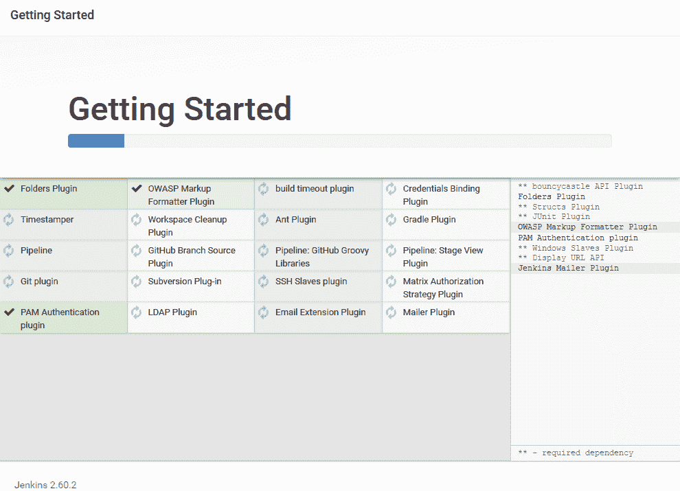
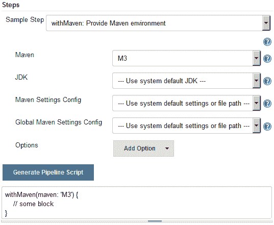

# 第三章：新 Jenkins

在本章中，我们将看一些现在是 Jenkins 2.x 发行版的一部分的新功能。完成本章后，你将了解以下内容：

+   新的 Jenkins 设置向导

+   Jenkins 作为代码的流水线（Jenkins 流水线作业）

+   Jenkins 阶段视图

+   Jenkins 声明式流水线语法

+   Jenkins 多分支流水线

+   Jenkins 流水线语法工具（片段生成器）

+   Jenkins 凭据

+   Jenkinsfile

+   Jenkins Blue Ocean

+   在 Jenkins Blue Ocean 中创建流水线

# Jenkins 设置向导

当你首次访问 Jenkins 时，会显示“入门向导”。我们已经在前一章节中完成了这个练习；尽管如此，在接下来的部分，我们将更深入地了解其中一些重要部分。

# 先决条件

在我们开始之前，请确保你已准备好以下内容：

+   在前一章节讨论的任何平台上运行的 Jenkins 服务器（Docker、独立、云、虚拟机、Servlet 容器等）。

+   确保你的 Jenkins 服务器可以访问互联网。这是下载和安装插件所必需的。

# 解锁 Jenkins

当你首次访问 Jenkins 时，会要求你使用一个秘密的初始管理员密码解锁它。这个密码存储在 `initialAdminPassword` 文件中，该文件位于你的 `jenkins_home` 目录内。该文件及其完整路径显示在 Jenkins 页面上，如下截图所示：

+   **在 Windows 上**：你可以在 `C:\Program Files (x86)\Jenkins\secrets` 下找到该文件。如果你选择在其他位置安装 Jenkins，则在 `<Jenkins 安装目录>\secrets` 下寻找该文件。

+   **在 Linux 上**：你可以在 `/var/jenkins_home/secrets` 下找到该文件：


解锁 Jenkins

从 `initialAdminPassword` 文件中获取密码，粘贴到管理员密码字段下，然后点击继续。

你始终可以使用 `intialAdminPassword` 文件中的密码和用户名 `admin` 登录 Jenkins。

# 自定义 Jenkins

接下来，会显示两个选项来安装 Jenkins 插件，如下截图所示：


自定义 Jenkins

选择安装建议的插件将安装 Jenkins 的所有通用插件，如 Git、Pipeline as Code 等（由 Jenkins 社区建议）。

选择“选择要安装的插件”将允许你安装你选择的插件。

在接下来的部分，我们将继续选择安装插件的选项。当你这样做时，你应该看到以下截图中显示的屏幕。以下页面将列出一些最受欢迎的插件，尽管这不是 Jenkins 插件的完整列表。你会注意到建议的插件已默认选中（打勾）：


选择要安装的插件

您可以选择全部、无、或建议的插件。

选择完插件后，点击页面底部的安装按钮。以下截图显示了 Jenkins 插件安装：



安装 Jenkins 插件

# 创建第一个管理员用户

安装插件后，您将被要求创建管理员用户帐户，如下截图所示。以下管理员帐户与设置向导开始时使用的临时管理员用户帐户不同（初始管理员帐户）：


创建您的第一个 Jenkins 用户

适当填写字段并点击“保存并完成”按钮。或者，您也可以选择忽略创建新的管理员用户，继续使用初始管理员用户，点击“继续作为管理员”。

接下来，在下一页上，您将看到一条消息，上面写着“Jenkins 准备就绪！您的 Jenkins 设置已完成。”点击“开始使用 Jenkins”以进入 Jenkins 仪表板。

# 新的 Jenkins 流水线任务

那些已经熟悉 Jenkins 的人都很清楚 freestyle Jenkins 任务。在 Jenkins 中创建流水线的经典方法是使用 *freestyle job*，其中每个 CI 阶段都使用 Jenkins 任务（freestyle）表示。

Jenkins freestyle 任务是基于 Web 的、GUI 驱动的配置。对 CI 流水线的任何修改都需要您登录 Jenkins 并重新配置每个 Jenkins freestyle 任务。

**Pipeline as Code** 的概念重新思考了我们创建 CI 流水线的方式。其思想是将整个 CI/CD 流水线编写为一段代码，提供一定程度的编程，并且可以进行版本控制。

以下是采用 Pipeline as Code 路线的一些优点：

+   它是可编程的

+   所有的 CI/CD 流水线配置都可以使用一个文件（Jenkinsfile）描述。

+   它可以进行版本控制，就像任何其他代码一样

+   它提供了使用声明性流水线语法定义流水线的选项，这是一种简单而优雅的编码流水线的方式

让我们来看看 Jenkins 流水线任务。我们将通过创建一个简单的 CI 流水线来看一下它并感受一下。

# 先决条件

在开始之前，请确保您准备好以下事项：

+   在前一章讨论的任何平台上运行 Jenkins 服务器（Docker、独立、云、虚拟机、Servlet 容器等）。

+   确保您的 Jenkins 服务器可以访问互联网。这是下载和安装插件所必需的。

+   确保您的 Jenkins 服务器已安装所有建议的插件。请参阅 *Customizing Jenkins* 部分。

# 创建 Jenkins 流水线任务

按照以下步骤创建 Jenkins 流水线任务：

1.  从 Jenkins 仪表板上，点击“新建项目”链接。

1.  在结果页面上，您将看到各种类型的 Jenkins 任务供您选择。

1.  选择管道，并使用`输入项目名称`字段为管道命名。

1.  完成后，点击页面底部的确定按钮。

1.  所有种类的 Jenkins 作业（自由形式、管道、多分支等）现在都带有一个特色标签，如下图所示：


Jenkins 作业中的新标签功能

1.  通过点击管道选项卡，快速导航到管道部分。

1.  以下截图描述了管道部分。让我们详细看看这个部分：

    +   `Definition`字段提供两个选择——管道脚本和来自 SCM 的管道脚本。如果选择管道脚本选项，那么在脚本字段内定义你的管道代码。但是，如果选择来自 SCM 的管道脚本选项（截图中未显示），那么你的管道脚本（Jenkinsfile）将自动从版本控制系统中提取（我们将在接下来的部分中探讨这个选项）。

    +   要获取关于任何选项的简短描述，可以点击问号图标。

    +   管道语法是一个实用工具，帮助你将 GUI 配置转换为代码。（我们将在接下来的部分中探讨这个选项）。


管道部分

1.  现在让我们在脚本字段内编写一些代码，看看管道是如何工作的。我们将尝试一些 Jenkins 提供的示例代码。

1.  为此，点击`尝试示例管道…`字段，并选择 GitHub + Maven 选项，如下截图所示：


选择一个示例管道脚本。

1.  这将在脚本字段中填充样本代码。

1.  代码如下所示。它以声明性管道语法形式呈现：

```
      node { 
        def mvnHome 
        stage('Preparation') { // for display purposes 
          // Get some code from a GitHub repository 
          git 'https://github.com/jglick/
          simple-maven-project-with-tests.git' 
          // Get the Maven tool. 
          // ** NOTE: This 'M3' Maven tool must be configured 
          // **       in the global configuration.            
          mvnHome = tool 'M3' 
        } 
        stage('Build') { 
          // Run the maven build 
          if (isUnix()) { 
            sh "'${mvnHome}/bin/mvn'
            -Dmaven.test.failure.ignore clean package" 
          } else { 
            bat(/"${mvnHome}\bin\mvn"
            -Dmaven.test.failure.ignore clean package/) 
          }  
        } 
        stage('Results') { 
          junit '**/target/surefire-reports/TEST-*.xml' 
          archive 'target/*.jar' 
        } 
      } 
```

1.  让我们快速浏览一下管道脚本（我们将在接下来的部分中详细探讨声明性管道语法）：

    +   `node{}` 是告诉 Jenkins 在 Jenkins 主服务器上运行整个管道脚本的主要容器。

    +   在`node{}`容器内部，还有三个更多的容器，如下所示：

```
                  stage('Preparation') {...} 
                  stage('Build') {...} 
                  stage('Results') {...}
```

1.  +   `准备`阶段将从 GitHub 存储库下载 Maven 源代码，并告诉 Jenkins 使用在全局配置中定义的 M3 Maven 工具（在运行管道之前我们需要这样做）。

    +   `构建`阶段将构建 Maven 项目。

    +   `结果`阶段将存档构建产物以及 JUnit 测试结果。

1.  点击页面底部的保存按钮保存对管道作业的更改。

# 全局工具配置页面

在运行管道之前，重要的是我们查看 Jenkins 中的全局工具配置页面。这是你配置工具的地方，你认为这些工具将在所有管道中全局使用：例如 Java、Maven、Git 等等。

假设您有多个构建代理（Jenkins 从代理），用于构建您的 Java 代码，并且您的构建流水线需要 Java JDK、Maven 和 Git。您只需在全局工具配置中配置这些工具，Jenkins 将在构建代理（Jenkins 从代理）上构建您的代码时自动调用它们。您无需在任何构建代理上安装这些工具。

让我们在全局工具配置中配置 Maven 工具，以使我们的流水线工作起来。按照以下步骤进行操作：

1.  要访问全局工具配置页面，请执行以下操作之一：

    1.  从 Jenkins 仪表板中，单击“管理 Jenkins” | “全局工具配置”。

    1.  或者，在浏览器中粘贴 URL `http://<您的 Jenkins 服务器的 IP 地址>:8080/configureTools/`。

1.  滚动到底部，找到 Maven 部分，然后单击“添加 Maven”按钮。然后，您将看到一系列选项，如下图所示。按照以下信息填写：

    1.  通过填写“名称”字段为您的 Maven 安装提供一个唯一的名称。（例如，我们的示例流水线中将其命名为 `M3`。）

    1.  默认情况下将显示“从 Apache 安装”。这将使 Jenkins 从 Apache 下载 Maven 应用程序：


在“全局工具配置”中配置 Maven

1.  1.  使用“版本”字段选择最新的 Maven 版本；我选择使用 Maven 3.5.0，如前面的截图所示。

首先，选择不同的安装程序，通过单击“删除安装程序”按钮删除现有的安装程序。接下来，单击“添加安装程序”下拉菜单，并选择不同的安装程序。除了从 Apache 安装之外，其他选项还有“运行批处理命令”、“运行 Shell 命令”和“提取 *.zip/*.tar.gz”（在截图中未显示）。

1.  构建 Maven 项目还需要 Java 工具，但由于我们正在 Jenkins 主服务器上构建我们的代码（该服务器已安装了 Java JDK），因此我们现在可以跳过安装 Java 工具。

1.  配置 Maven 完成后，滚动到页面底部，然后单击“保存”按钮。

# Jenkins 流水线阶段视图

Jenkins *阶段视图* 是 2.x 版本的新功能。它仅适用于 Jenkins 流水线和 Jenkins 多分支流水线作业。

Jenkins 阶段视图可以实时可视化流水线各个阶段的进度。让我们通过运行示例流水线来看看它的运作情况：

1.  在 Jenkins 仪表板上，在“所有视图”选项卡下，您将看到您的流水线。

1.  单击构建触发图标来运行流水线，如下图所示：


在 Jenkins 仪表板上查看流水线

1.  要进入“阶段视图”，请单击您的流水线名称（同时也是指向流水线项目页面的链接）。

1.  或者，您可以将鼠标悬停在流水线名称上，以获取包含一系列操作项和链接的下拉菜单，如下图所示：


流水线菜单的视图

1.  舞台视图页面将看起来像以下截图：


舞台视图

1.  要查看特定阶段的构建日志，请将鼠标悬停在色彩编码的状态框上，您应该看到查看日志的选项。单击它将打开一个小弹出窗口显示日志，如下所示：


Jenkins 单个阶段日志

1.  要查看完整的构建日志，请在左侧查找“构建历史”。构建历史选项卡将列出所有已运行的构建。右键单击所需的构建编号，然后单击“控制台输出”：


访问控制台输出

# 声明性流水线语法

在先前的部分中，我们创建了一个 Jenkins 流水线，以查看和感受其各种组件。我们利用了遵循声明性语法的流水线脚本来定义我们的流水线。

声明性流水线语法是 Groovy 语法的更简化和结构化版本，后者由于其可编程性而更强大。在本节中，我们将更详细地了解声明性流水线语法。这很重要，因为在接下来的章节中，我们将使用相同的语法来定义我们的 CI 和 CD 流水线。

# 声明性流水线的基本结构

简而言之，声明性流水线是多个 `node` 块（节点）、`stage` 块（阶段）、指令和步骤的集合。一个 `node` 块可以有多个 `stage` 块，反之亦然。我们还可以并行运行多个阶段。让我们逐个详细了解各个部分。

# `node` 块

`node` 块定义了 Jenkins 代理，其中包括其组成部分（阶段块、指令和步骤）应运行在其中。`node` 块结构如下所示：

```
node ('<parameter>') {<constituents>} 
```

以下提供了有关`node` 块的更多信息：

+   **定义**：`stage`、指令或步骤应运行的节点

+   **组成部分**：多个 `stage` 块、指令或步骤

+   **必需**：是

+   **参数**：任意、标签

# 阶段块

`stage` 块是一组紧密相关的步骤和指令的集合，具有共同的目标。`stage` 块结构如下所示：

```
stage ('<parameter>') {<constituents>} 
```

以下提供了有关 `stage` 块的更多信息：

+   **定义**：一组步骤和指令

+   **组成部分**：多个 `node` 块、指令或步骤

+   **必需**：是

+   **参数**：阶段名称的字符串（必填）

# 指令

指令的主要目的是通过提供以下任何元素来协助 `node` 块、`stage` 块和步骤：环境、选项、参数、触发器、工具。

以下提供了有关 `stage` 块的更多信息：

+   **定义**：`stage` 应在其中运行的节点

+   **组成部分**：环境、选项、参数、触发器、工具

+   **必需**：不，但每个 CI/CD 流水线都有它

+   **参数**：无

# 步骤

步骤是构成声明式流水线的基本元素。步骤可以是批处理脚本、shell 脚本或任何其他可执行命令。步骤有各种用途，例如克隆存储库、构建代码、运行测试、将构件上传到存储库服务器、执行静态代码分析等。在接下来的部分中，我们将看到如何使用 Jenkins 管道语法工具生成步骤。

以下提供了关于`stage`块的更多信息：

+   **定义**: 它告诉 Jenkins 要做什么

+   **构成**: 命令、脚本等。这是流水线的基本块

+   **必需**：不，但每个 CI/CD 流水线都有它

+   **参数**：无

以下是我们之前使用的管道代码。`node`块、`stage`块、指令和步骤都使用注释（`//`）进行了突出显示。正如你所见，`node`块内有三个`stage`块。一个`node`块可以有多个`stage`块。除此之外，每个`stage`块都包含多个步骤，其中一个还包含一个指令：

```
// Node block
node ('master') {
  // Directive 1
  def mvnHome

  // Stage block 1
  stage('Preparation') {    // Step 1
    git 'https://github.com/jglick/simple-maven-project-with-tests.git'
    // Directive 2
    mvnHome = tool 'M3' 
   }

   // Stage block 2 
   stage('Build') {
     // Step 2 
     sh "'${mvnHome}/bin/mvn' clean install" 
   } 

   // Stage block 3
   stage('Results') {
     // Step 3 
     junit '**/target/surefire-reports/TEST-*.xml'
     // Step 4
     archive 'target/*.jar' 
   } 

} 
```

在上述代码中，请注意以下行：`node ('master') {`。这里，字符串`master`是一个参数（`label`），告诉 Jenkins 使用 Jenkins 主节点来运行`node`块的内容。

如果您将参数值选择为任意，则所有阶段节点及其各自的步骤和指令将在任一可用 Jenkins 从属代理上执行。

在接下来的章节中，我们将更多地了解声明式流水线，在那里我们将尝试使用它编写一个 CI/CD 流水线。

有关声明式流水线语法的更多信息，请参阅[`jenkins.io/doc/book/pipeline/syntax/#declarative-sections`](https://jenkins.io/doc/book/pipeline/syntax/#declarative-sections)。

要获取与声明式流水线兼容的所有可用步骤的列表，请参考[`jenkins.io/doc/pipeline/steps/`](https://jenkins.io/doc/pipeline/steps/)。

# Jenkins 管道语法工具

Jenkins 管道语法工具是创建管道代码的一种快速简便的方法。管道语法工具可在 Jenkins 管道任务内部使用；参见*在创建 Jenkins 管道任务部分的*屏幕截图：*管道部分*。

在本节中，我们将重新创建我们在上一节中创建的管道，但这次使用管道语法工具。

# 先决条件

在我们开始之前，请确保你准备好了以下事项：

+   在全局工具配置页面配置的 Maven 工具（参见*全局工具配置页面*部分）

+   安装 Pipeline Maven Integration Plugin

+   为构建 Maven 项目还需要 Java 工具，但由于我们在 Jenkins 主节点上构建我们的代码（该节点已经安装了 Java JDK），我们可以跳过安装 Java 工具

# 安装 Pipeline Maven Integration 插件

按照给定的步骤安装 Pipeline Maven Integration 插件。以下插件将允许我们在管道代码中使用 Maven 工具：

1.  从 Jenkins 仪表板中，单击“管理 Jenkins”|“管理插件”|“可用”选项卡。

1.  在“过滤器”字段中键入`Pipeline Maven Integration`以搜索相应的插件，如下截图所示：


插件管理器页面

1.  单击复选框以选择相应的插件，然后单击“无需重启安装”按钮进行安装。

1.  单击“无需重启安装”按钮后，您将看到插件正在安装，如下截图所示。Jenkins 将首先检查网络连接，然后安装依赖项，最后安装插件。

1.  某些插件可能需要重启才能使用。要这样做，请检查选项“在安装完成且没有作业运行时重新启动 Jenkins”：


插件安装中

# 使用管道语法实用程序创建 Jenkins 管道

按照以下步骤创建新的 Jenkins 管道作业：

1.  从 Jenkins 仪表板中，单击“新项目”链接。

1.  在生成的页面上，您将看到各种类型的 Jenkins 作业供选择。

1.  选择管道，并使用“输入项目名称”字段为管道命名。

1.  完成后，单击页面底部的“确定”按钮。

1.  我们将通过单击“管道”选项卡快速导航到管道部分。

1.  在“管道”选项卡下，单击名为“管道语法”的链接。这将打开一个新选项卡，如下截图所示：


管道语法页面

1.  我们将使用以下片段生成器为各种块和步骤创建管道代码。

1.  首先让我们生成一个`node`块的代码：

    1.  在管道语法页面上，在“步骤”部分下，选择`node`：使用“示例步骤”字段分配节点，如下所示。

    1.  在“标签”字段中添加字符串`master`。这样做告诉 Jenkins 使用 Jenkins 主节点作为执行我们管道的首选节点。

    1.  单击“生成管道脚本”按钮生成代码。

    1.  复制生成的代码并将其保存在文本编辑器中：


生成`node`块的代码

1.  现在，让我们创建两个名为`Preparation`和`Build`的`stage`块：

    1.  在管道语法页面上，在“步骤”部分下，选择`stage`：使用“示例步骤”字段，如下所示。

    1.  在“阶段名称”字段中添加字符串`Preparation`。

    1.  单击“生成管道脚本”按钮生成代码。

    1.  复制生成的代码并将其粘贴到我们之前生成的`node`块中：


为阶段块生成代码

1.  类似地，重复*步骤 9*以创建一个名为 `构建` 的 `stage` 块。 将生成的代码粘贴到 `准备`（`stage` 块）之后的 `node` 块中。

1.  到目前为止，我们的管道代码应该看起来像以下内容（不包括 `// some block` 行）：

```
      node('master') {

        stage('Preparation') {
        }

        stage('Build') {
        }

      }
```

1.  现在让我们创建一个步骤来从 GitHub 下载源代码：

    1.  在管道语法页面的步骤部分，在示例步骤字段下选择 git: 使用 Git 的步骤，如以下截图所示。

    1.  在 Repository URL 字段中，添加示例 GitHub 仓库的链接：`https://github.com/jglick/simple-maven-project-with-tests.git`。

    1.  其余选项保持不变。

    1.  点击生成管道脚本按钮生成代码。

    1.  复制生成的代码，并将其粘贴到我们之前生成的 `准备`（`stage` 块）中：


为 Git 步骤生成代码

1.  接下来，让我们生成一个指令，告诉 Jenkins 使用我们在全局工具配置中配置的 M3 Maven 工具：

    1.  在管道语法页面的步骤部分，在示例步骤字段下选择 withMaven: 使用 Maven 环境 的步骤，如以下截图所示。

    1.  在 Maven 字段中，选择 `M3`，这是我们在全局工具配置中配置的 Maven 工具。

    1.  其余选项保持不变。

    1.  点击生成管道脚本按钮生成代码。

    1.  复制生成的代码，并将其粘贴到我们之前生成的 `构建`（`stage` 块）中：



为 withMaven 指令生成代码

1.  最后，为我们的 Maven 构建命令生成一个管道代码：

    1.  在管道语法页面的步骤部分，在示例步骤字段下选择 sh: 使用 Shell 脚本 的步骤，如以下截图所示。 这是创建 Shell 脚本的步骤。

    1.  在 Shell 脚本字段中，键入 `mvn -Dmaven.test.failure.ignore clean package`，这是构建、测试和打包代码的 Maven 命令。 这将是我们的 Shell 脚本的内容。

    1.  点击生成管道脚本按钮生成代码。

    1.  复制生成的代码，并将其粘贴到我们之前生成的 `withMaven`（指令）中：


为 Maven 构建生成代码

1.  我们最终的管道脚本应该看起来像以下内容（不包括 `// some block` 行）：

```
      node('master') {

        stage('Preparation') {
          git 'https://github.com/jglick/
          simple-maven-project-with-tests.git'
        }

        stage('Build') {
          withMaven(maven: 'M3') {
            sh 'mvn -Dmaven.test.failure.ignore clean
            package'
          }
        }

      }
```

1.  现在切换到管道作业配置页面。

1.  滚动到管道部分，并将上述管道代码粘贴到脚本字段中。

1.  点击页面底部的保存按钮。

在接下来的章节中，当我们尝试使用声明性管道语法创建 CI/CD 管道时，我们将看到更多示例，利用管道语法工具。

# 多分支管道

在本节中，我们将了解 Jenkins 中的多分支管道作业。 这是 Jenkins 发布 2.x 版本中添加的新功能之一。

多分支管道允许你自动为源代码仓库上的每个分支创建一个管道。如下截图所示。多分支管道使用存储在版本控制仓库中与你的源代码一起的 **Jenkinsfile** 进行工作。**Jenkinsfile** 只是定义了你的 CI 管道的管道脚本：


为新分支自动生成管道

除此之外，多分支管道设计用于在 Git/GitHub 仓库的任何分支上有新的代码更改时触发构建。如下截图所示：


使用多分支管道进行持续集成

# 先决条件

在我们开始之前，请确保你已准备好以下内容：

+   配置在全局工具配置页面中的 Maven 工具（参考：*全局工具配置页面*）。

+   安装 Pipeline Maven Integration 插件。

+   为了构建 Maven 项目还需要 Java 工具，但由于我们正在 Jenkins 主节点上构建我们的代码（它已经安装了 Java JDK），我们可以跳过安装 Java 工具。

+   安装 GitHub 插件（如果你在 Jenkins 设置向导中选择安装了推荐的插件，则已安装）。

+   确保你的 Jenkins URL 可以从互联网访问。如果你正在使用一个临时或者开发环境来进行这个练习，并且你的 Jenkins 服务器没有域名，那么你的 Jenkins 服务器可能无法从互联网访问。要使你的 Jenkins URL 在互联网上可访问，参考附录中的 *将你的本地服务器暴露在互联网上* 部分，*支持工具和安装指南*。

# 在 Jenkins 中添加 GitHub 凭据

为了使 Jenkins 与 GitHub 通信，我们需要在 Jenkins 中添加 GitHub 账户凭据。我们将使用 Jenkins 凭据插件来完成这个任务。如果你已经按照本章开始时讨论的 Jenkins 设置向导的步骤进行操作，你会在 Jenkins 仪表板上找到凭据功能（请参阅左侧菜单）。

按照给定的步骤将 GitHub 凭据添加到 Jenkins 中：

1.  从 Jenkins 仪表板，点击凭据 | 系统 | 全局凭据（无限制）。

1.  在全局凭据（无限制）页面上，从左侧菜单中点击添加凭据链接。

1.  你将看到一堆字段需要配置（参见下面的截图）：

    1.  在 Kind 字段中选择用户名与密码。

    1.  在 Scope 字段中选择 Global（Jenkins、节点、项目、所有子项目等）。

    1.  将你的 GitHub 用户名添加到用户名字段。

    1.  将你的 GitHub 密码添加到密码字段。

    1.  通过在 ID 字段中输入一个字符串给你的凭据添加一个唯一的 ID。

    1.  在描述字段中添加一些有意义的描述。

    1.  完成后点击保存按钮：


在 Jenkins 中添加 GitHub 凭据

1.  这就是您如何在 Jenkins 中保存凭据。我们马上就会用到这些 GitHub 凭据。

# 在 Jenkins 中配置 GitHub 的 Webhooks

现在我们已经在 Jenkins 中保存了 GitHub 帐户凭据，让我们配置 Jenkins 以与 GitHub 进行通信。我们将通过在 Jenkins 配置中配置 GitHub 设置来实现这一点。

仔细遵循给定的步骤，在 Jenkins 中配置 GitHub 设置：

1.  从 Jenkins 仪表板上，点击“管理 Jenkins” | “配置系统”。

1.  在结果 Jenkins 配置页面上，向下滚动到 GitHub 部分。

1.  在 GitHub 部分下，点击“添加 GitHub 服务器”按钮，然后从可用的下拉列表中选择 GitHub 服务器。这样做会显示一系列选项供您配置。

1.  让我们逐一配置它们，如下所示：

    1.  通过向 Name 字段添加字符串来为您的 GitHub 服务器命名。

    1.  在 API URL 字段下，如果您使用的是公共 GitHub 帐户，请添加`https://api.github.com`（默认值）。否则，如果您使用的是 GitHub Enterprise，则指定其相应的 API 终端点。

    1.  确保已选中“管理钩子”选项：


配置 GitHub 服务器

1.  1.  点击高级按钮（你会看到两个按钮；点击第二个）。这样做会显示一些更多的字段来配置。

    1.  在“附加操作”字段下，点击“管理其他 GitHub 操作”，然后从可用列表中选择“将登录名和密码转换为令牌”（您只会看到一个选择）。

    1.  这将进一步揭示新的字段以进行配置。

    1.  选择“来自凭据”选项（默认情况下处于活动状态）。使用凭据字段，选择我们在上一节中创建的 GitHub 凭据（`ID: github_credentials`）。

    1.  接下来，点击“创建令牌凭据”按钮。这将在您的 GitHub 帐户上生成一个新的个人访问令牌：


将 GitHub 凭据转换为令牌

1.  1.  要查看您在 GitHub 上的个人访问令牌，请登录到您的 GitHub 帐户，然后导航到设置 | 开发人员设置 | 个人访问令牌：


GitHub 上的个人访问令牌

1.  1.  完成后，点击 Jenkins 配置页面底部的保存按钮。

    1.  同时在 Jenkins 凭据中还将添加相应个人访问令牌的条目。要查看它，请导航到 Jenkins 仪表板 | 凭据 | 系统 | `api.github.com`，然后您应该会看到一条 Kind 为 secret text 的凭据条目。

1.  我们在 Jenkins 中的 GitHub 配置还没有完成。按照以下剩余步骤进行：

    1.  从 Jenkins 仪表板上，点击“管理 Jenkins” | “配置系统”。

    1.  向下滚动到 GitHub 部分。

    1.  使用凭据字段，选择新生成的凭据的密钥类型（Jenkins 中的个人访问令牌条目）。

    1.  现在，点击测试连接按钮来测试 Jenkins 和 GitHub 之间的连接。

    1.  完成后，在你的 Jenkins 配置页面底部点击保存按钮：


测试 Jenkins 和 GitHub 之间的连接

1.  我们现在已经完成了在 Jenkins 中配置 GitHub 设置的步骤。

# 在 GitHub 上创建一个新仓库

在这个部分，我们将在 GitHub 上创建一个新的仓库。确保你已经在执行以下步骤的机器上安装了 Git（参考 附录 中的 *在 Windows/Linux 上安装 Git* 部分，*支持工具和安装指南*）。

按照以下步骤在 GitHub 上创建一个仓库：

1.  登录你的 GitHub 账户。

1.  为了保持简单，我们将重用仓库中的源代码 [`github.com/jglick/simple-maven-project-with-tests.git`](https://github.com/jglick/simple-maven-project-with-tests.git)。这是我们一直在使用的用于创建 Jenkins 管道的仓库。

1.  重新使用 GitHub 仓库的最简单方法是分叉它。要这样做，只需从你的互联网浏览器访问上述仓库，然后点击分叉按钮，如下截图所示：


分叉一个 GitHub 项目

1.  完成后，你的 GitHub 账户上将会看到上述仓库的复制品。

# 使用 Jenkinsfile

Jenkins 多分支管道利用 Jenkinsfile。在接下来的部分中，我们将学习如何创建 Jenkinsfile。我们将重用我们在上一部分创建的示例管道脚本来创建我们的 Jenkinsfile。按照给定的步骤：

1.  登录你的 GitHub 账户。

1.  导航到分叉后的仓库 `simple-maven-project-with-tests`。

1.  进入仓库页面后，点击创建新文件按钮来创建一个新的空文件，这将成为我们的 Jenkinsfile，如下截图所示：


在 GitHub 上创建一个新文件

1.  通过填写空文本框，命名你的新文件为 `Jenkinsfile`，如下截图所示：


在 GitHub 上命名你的新文件

1.  将以下代码添加到你的 `Jenkinsfile` 中：

```
      node ('master') { 
        checkout scm 
        stage('Build') { 
          withMaven(maven: 'M3') { 
            if (isUnix()) { 
              sh 'mvn -Dmaven.test.failure.ignore clean package' 
            }  
            else { 
              bat 'mvn -Dmaven.test.failure.ignore clean package' 
            } 
          } 
        }   
        stage('Results') { 
          junit '**/target/surefire-reports/TEST-*.xml' 
          archive 'target/*.jar' 
        } 
      } 
```

1.  完成后，通过添加有意义的评论来提交新文件，如下截图所示：


在 GitHub 上提交你的新文件

# 在 Jenkins 中创建一个多分支管道

按照以下步骤创建一个新的 Jenkins 管道作业：

1.  从 Jenkins 仪表板中，点击新项目链接。

1.  在生成的页面上，你将看到各种类型的 Jenkins 作业供选择。

1.  选择多分支管道，并使用输入项目名称字段为你的管道命名。

1.  完成后，点击页面底部的 OK 按钮。

1.  滚动到分支源部分。这是我们配置要使用的 GitHub 仓库的地方。

1.  点击添加源按钮并选择 GitHub。你将被呈现一个配置字段列表。让我们一个接一个地看看它们（见下面的截图）：

    1.  对于凭证字段，选择我们在前一节创建的 GitHub 账户凭据（类型为用户名和密码）。

    1.  在所有者字段下，指定你的 GitHub 组织或 GitHub 用户账户的名称。

    1.  一旦你这样做了，仓库字段将列出你 GitHub 账户上的所有仓库。

    1.  在仓库字段下选择 `simple-maven-project-with-tests`。

    1.  将其余选项保留为默认值：


配置多分支流水线

1.  滚动到底部并点击保存按钮。

# 重新注册 Webhooks

在我们继续之前，让我们重新注册所有 Jenkins 流水线的 Webhooks：

1.  要这样做，请从 Jenkins 仪表盘上点击 管理 Jenkins | 配置系统。

1.  在 Jenkins 配置页面上，向下滚动到 GitHub 部分。

1.  在 GitHub 部分，点击高级…按钮（你会看到两个，点击第二个）。

1.  这将显示一些额外的字段和选项。点击重新注册所有作业的钩子按钮。

1.  前述操作将在你的 GitHub 账户内的相应仓库上为我们的多分支流水线创建新的 Webhooks。按以下步骤查看 GitHub 上的 Webhooks：

    1.  登录到你的 GitHub 账户。

    1.  转到你的 GitHub 仓库，我们这里是 `simple-maven-project-with-tests`。

    1.  点击仓库设置，如下截图所示：


仓库设置

1.  1.  在仓库设置页面，从左侧菜单中点击 Webhooks。你应该看到你的 Jenkins 服务器的 Webhooks，如下截图所示：


GitHub 仓库上的 Webhooks

# Jenkins 多分支流水线运行中

按照给定的步骤：

1.  从 Jenkins 仪表盘上，点击你的多分支流水线。

1.  在你的 Jenkins 多分支流水线页面上，从左侧菜单中点击 扫描仓库现在 链接。这将扫描具有 Jenkinsfile 的分支的仓库，并将立即为每个具有 Jenkinsfile 的分支运行一个流水线，如下截图所示：


用于主分支的流水线

1.  在您的多分支流水线页面上，从左侧菜单中，点击"Scan Repository Log"。您将看到类似于以下所示的内容。注意高亮显示的代码。您可以看到`master`分支符合标准，因为它有一个 Jenkinsfile，为其安排了一个流水线。由于测试分支上没有 Jenkinsfile，因此没有为其安排流水线：

```
Started by user nikhil pathania 
[Mon Aug 14 22:00:57 UTC 2017] Starting branch indexing... 
22:00:58 Connecting to https://api.github.com using ******/****** (credentials to access GitHub account) 
22:00:58 Connecting to https://api.github.com using ******/****** (credentials to access GitHub account) 
Examining nikhilpathania/simple-maven-project-with-tests 

 Checking branches... 

 Getting remote branches... 

 Checking branch master 

 Getting remote pull requests... 
 'Jenkinsfile' found 
 Met criteria 
Scheduled build for branch: master 

 Checking branch testing 
 'Jenkinsfile' not found 
 Does not meet criteria 

 2 branches were processed 

  Checking pull-requests... 

  0 pull requests were processed 

Finished examining nikhilpathania/simple-maven-project-with-tests 

[Mon Aug 14 22:01:00 UTC 2017] Finished branch indexing. Indexing took 2.3 sec 
Finished: SUCCESS 
```

1.  您不需要始终扫描存储库。GitHub Webhooks 已配置为在 GitHub 存储库上进行推送或创建新分支时自动触发流水线。请记住，各个分支上也应该存在 Jenkinsfile，以告诉 Jenkins 在发现存储库变化时需要执行什么操作。

# 创建一个新的特性分支来测试多分支流水线

现在让我们从主分支创建一个特性分支，并查看 Jenkins 是否能够为其运行一个流水线：

1.  为此，请登录到您的 GitHub 帐户。

1.  转到您的 GitHub 仓库; 在我们的情况下是`simple-maven-project-with-tests`。

1.  点击"Branch: master"按钮，在空文本框中输入一个新分支的名称。接下来，点击"Create branch: feature"选项来创建一个名为 feature 的新分支，如下面的截图所示：


创建一个特性分支

1.  这应该会立即在 Jenkins 中触发一个用于我们的新特性分支的流水线：


新特性分支的流水线

# Jenkins 蓝色海洋

Jenkins Blue Ocean 是与 Jenkins 交互的全新方式。它更像是主要 Jenkins 应用程序的 UI 助手。以下是 Jenkins Blue Ocean 的一些特性：

+   改进的可视化效果

+   流水线编辑器

+   个性化

+   用于 Git 和 GitHub 的快速简易流水线设置向导

您使用经典 Jenkins 界面创建的流水线可以在新的 Jenkins 蓝色海洋中进行可视化，反之亦然。正如我之前所说，Jenkins 蓝色海洋是主要 Jenkins 应用程序的 UI 助手。

在接下来的部分中，我们将在 Blue Ocean 中可视化我们在上一部分中创建的 Jenkins 流水线。我们还将创建一个新的流水线，只是为了看看并感受一下新的 Jenkins Blue Ocean 界面。

# 安装 Jenkins 蓝色海洋插件

为了使用 Jenkins 蓝色海洋插件，我们需要为 Jenkins 安装 Blue Ocean 插件。按照以下步骤操作：

1.  从 Jenkins 仪表板，点击"Manage Jenkins | Manage Plugins"。

1.  在插件管理器页面上，点击"Available"选项卡。

1.  使用过滤选项，搜索`Blue Ocean`，如下面的截图所示：


安装 Jenkins 蓝色海洋插件

1.  从项目列表中选择 Blue Ocean 并点击"Install without restart"。你只需要 Blue Ocean 而不需要其他东西。

1.  Blue Ocean 的依赖列表很长，因此您将在安装插件/升级页面上看到许多与 Blue Ocean 插件一起安装的东西。

# 在 Blue Ocean 中查看您的常规 Jenkins 流水线。

在本节中，我们将尝试可视化我们在前几节中创建的现有 Jenkins 流水线：

1.  在 Jenkins 仪表板上，您现在应该看到左侧菜单上有一个名为“打开蓝色海洋”的新链接。

1.  单击“打开蓝色海洋”链接以转到 Jenkins Blue Ocean 仪表板。 您应该看到以下内容（请参阅以下屏幕截图）：

    1.  管理链接将带您进入“管理 Jenkins”页面。

    1.  Pipelines 链接将带您进入您当前看到的 Jenkins Blue Ocean 仪表板。

    1.  图标（方形内的箭头）将带您进入经典 Jenkins 仪表板。

    1.  新建流水线按钮将打开基于 Git 和 GitHub 的项目的流水线创建向导。

    1.  流水线列表（**e**高亮显示）：


Jenkins 蓝色海洋仪表板

1.  让我们来看看我们的多分支流水线。 从 Jenkins Blue Ocean 仪表板中点击您的多分支流水线。 这样做将打开相应的多分支流水线页面，如下所示：

    1.  按钮（**a**高亮显示）将带您进入流水线配置页面。

    1.  活动标签将列出所有当前和过去的流水线。

    1.  分支标签将为您显示每个分支的流水线的汇总视图。

    1.  Pull Requests 标签将列出分支上所有开放的拉取请求。

    1.  按钮（**e**高亮显示）用于重新运行流水线：


在 Blue Ocean 中的多分支流水线。

1.  现在让我们看看个别的构建页面。 要这样做，请从 Jenkins 流水线页面（请参阅前面的屏幕截图）中单击任何构建，然后您将进入相应流水线的构建页面，如下所示：

    1.  Changes 标签将列出触发构建的代码更改。

    1.  Artifacts 标签将列出构建生成的所有工件。

    1.  按钮（**c**高亮显示）将重新运行您的构建。

    1.  此部分（**d**高亮显示）显示有关您的构建的一些指标。

    1.  此阶段视图（**e**高亮显示）将列出所有顺序和并行阶段。

    1.  步骤结果部分将向您显示您选择的特定阶段的所有步骤（在下面的屏幕截图中，我选择了阶段“结果”）。

    1.  每个列出的步骤（**g**高亮显示）都可以展开并查看其日志：


在 Blue Ocean 中的构建页面

这是您的 Jenkins 流水线在 Blue Ocean 中的简短概述（使用经典 Jenkins UI 创建的流水线）。 它几乎展示了所有内容。 但是，我鼓励读者继续探索。

# 在 Blue Ocean 中创建流水线。

在这一部分中，我们将看到如何从 Jenkins 蓝色海洋仪表板创建一个新的流水线。我们将查看 Blue Ocean 中的新流水线创建向导。在开始之前，请准备好以下事项：

+   Fork 以下存储库：[`github.com/nikhilpathania/hello-world-example.git`](https://github.com/nikhilpathania/hello-world-example.git) 到您的 GitHub 帐户中。我们将在接下来描述的示例中使用它

+   为 Jenkins 安装 JUnit 插件（[`plugins.jenkins.io/junit`](https://plugins.jenkins.io/junit)）

按照给定的步骤：

1.  从 Jenkins 蓝色海洋仪表板中，点击新的流水线按钮。Jenkins 将要求您在 Git 和 GitHub 之间进行选择。对于我们当前的练习，我们将选择 GitHub：


在 Git 和 GitHub 仓库之间进行选择

1.  接下来，Jenkins 将要求您为您的 GitHub 帐户提供 GitHub 访问令牌。点击这里创建一个访问密钥的链接以创建一个新的访问密钥：


GitHub 访问令牌字段

1.  在一个新的选项卡中，系统会要求您登录到您的 GitHub 帐户。

1.  登录后，您将直接进入 GitHub 设置页面以创建一个新的个人访问令牌。

1.  在令牌描述字段中键入一个简短的描述，以标识您的令牌。保留选择范围部分下的选项默认值：


创建一个 GitHub 个人访问令牌

1.  点击页面底部的生成新令牌按钮以生成一个新的个人访问令牌：


GitHub 个人访问令牌

1.  复制新创建的个人访问令牌并将其粘贴到您的 GitHub 访问令牌字段中，然后点击连接按钮（参见以下截图）。

1.  接下来，点击列出的组织：


选择 GitHub 帐户

1.  您可以在新流水线和自动发现 Jenkinsfile 之间进行选择。在以下示例中，我们将选择新流水线选项：


在创建和发现流水线之间进行选择

1.  接下来，系统将要求您从 GitHub 帐户的可用存储库列表中选择一个存储库。如果列表中没有列出所需的存储库，您可以使用搜索选项来查找所需的存储库。在我们当前的示例中，我们将选择`hello-world-example`存储库：


选择一个存储库

1.  Jenkins 接下来会要求你创建一个流水线。由于在相应的仓库中找不到 Jenkinsfile，请点击创建流水线按钮以创建一个 Jenkinsfile：


创建一个新的流水线

1.  创建流水线的页面如下所示。在左侧，你会看到流水线的可视化，右侧找到选择块、阶段和步骤的工具（类似于我们在上一部分看到的流水线语法工具）：


Blue Ocean 流水线编辑器

1.  让我们首先选择一个代理来运行我们的流水线。从“流水线设置”中，使用代理字段，选择标签选项。然后在标签字段下键入 `master`，如下截图所示。通过这种方式，我们告诉 Jenkins 在 Jenkins 主服务器上运行我们的流水线：


创建一个节点块

1.  接下来，让我们创建一个名为 `Build` 的阶段，用来构建我们的源代码。点击流水线可视化上的 + 按钮即可。

1.  你将被要求命名新的阶段。在“命名你的阶段”字段下输入 `Build`，如下截图所示：


创建一个构建阶段

1.  接下来，我们将添加一个构建我们的 Maven 代码的步骤。点击+ 添加步骤按钮。 

1.  你将被要求从可用步骤列表中选择，如下截图所示：


步骤菜单

1.  我们的是一个 Maven 项目。因此，我们可能需要先设置 Maven 环境，告诉 Jenkins 可以使用哪个 Java 和 Maven 工具。

1.  为此，请使用搜索框搜索“提供 Maven 环境”（按名称查找步骤）：


选择提供 Maven 环境步骤

并非所有的 Jenkins 插件都与 Jenkins Blue Ocean 兼容。目前这个列表还很小。但预计随着时间的推移会不断增长。

1.  点击“提供 Maven 环境”步骤时，会显示一个字段配置列表，如下截图所示。在 Maven 字段下键入 `M3`，其余选项保持不变：


配置提供 Maven 环境步骤

1.  在配置页面底部，点击+ 添加步骤按钮以创建一个构建我们的 Maven 代码的新子步骤。

1.  如果你的 Jenkins 主服务器是 Linux 机器，从可用步骤列表中选择 Shell 脚本。如果是 Windows 机器，选择 Windows 批处理脚本。

1.  在 Shell 脚本/Windows 批处理脚本的文本框中键入以下代码：

```
        mvn clean install 
```


配置 shell 脚本子步骤

1.  点击返回箭头返回到上一个菜单。现在你应该在子步骤部分看到你的新步骤，即 Shell 脚本，如下截图所示：


Shell 脚本作为一个子步骤

1.  点击返回箭头返回到上一个菜单。

1.  接下来，让我们创建一个名为 Results 的阶段，在此阶段我们将存档我们构建的构件和 XML 结果报告。 要这样做，请点击可视化流水线上的+按钮。

1.  您将被要求为新阶段命名。 请在“命名您的阶段”字段下键入`Results`，如下截图所示：


创建一个结果阶段

1.  接下来，我们将在新阶段上添加一些步骤。 第一个将是发布我们的测试结果报告的步骤。 要这样做，请点击“+ 添加步骤”按钮。

1.  从可用步骤列表中选择发布 JUnit 测试结果报告。 您将看到一系列配置选项：

    1.  在“测试结果”字段下添加`**/target/surefire-reports/TEST-*.xml`。

    1.  将其余选项保持不变：


配置发布 JUnit 测试结果报告步骤

1.  点击返回箭头以返回到上一个菜单。

1.  再次点击“+ 添加步骤”按钮以添加新步骤。

1.  从可用步骤列表中选择存档构件。 您将看到一系列配置选项：

    1.  在“构件”字段下添加`target/*.jar`。

    1.  将其余选项保持不变：


配置存档构件步骤

1.  点击返回箭头以返回到上一个菜单。

1.  最后，点击页面右上角的保存按钮以保存您的流水线配置。

1.  弹出窗口将要求您添加一些描述并选择提交流水线配置的分支。

1.  完成后，点击保存并运行按钮：


保存流水线

1.  这将立即在相应分支上运行流水线，如下截图所示：


主分支上的成功构建

1.  您会注意到在主分支下的存储库中创建了一个新文件：


源代码中列出的 Jenkinsfile

1.  文件内容应为：

```
pipeline { 
  agent { 
    node { 
      label 'master' 
    } 

  } 
  stages { 
    stage('Build') { 
      steps { 
        withMaven(maven: 'M3') { 
          sh 'mvn clean install' 
        } 

      } 
    } 
    stage('Results') { 
      steps { 
        junit '**/target/surefire-reports/TEST-*.xml' 
        archiveArtifacts 'target/*.jar' 
      } 
    } 
  } 
}
```

# 摘要

在前一章中，我们几乎体验了 Jenkins 的所有新功能。 我们选择了适度的示例以保持我们的流水线简单。 然而，在接下来的章节中，我们将学习如何使用 Jenkins 的所有新功能创建一个完整的 CI/CD 流水线。

在下一章中，我们将探讨 Jenkins 中的一些管理任务。
