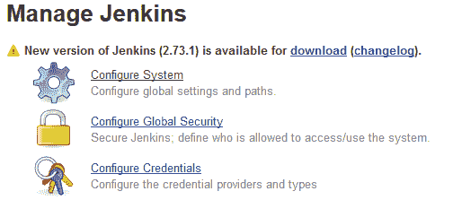

# 配置 Jenkins

在本章中，我们将学习如何执行一些基本的 Jenkins 管理任务，如下所示：

+   更新/安装/卸载/降级 Jenkins 插件

+   手动安装 Jenkins 插件

+   执行 Jenkins 备份和恢复

+   在各个平台（Windows/Linux/servlet）上升级 Jenkins

+   升级运行在 Docker 容器中的 Jenkins

+   在 Jenkins 中创建和管理用户

+   在 Jenkins 中学习各种身份验证方法

+   在 Jenkins 中配置各种授权方法

Jenkins 配置项繁多。 安装的插件越多，需要配置的就越多。 在本章中，我们将仅涵盖 Jenkins 中的基本管理任务。 我们将在接下来的章节中更多地了解 Jenkins 配置，在那里我们将尝试添加更多插件到 Jenkins 以实现**持续集成**（**CI**）和**持续交付**（**CD**）。

# Jenkins 插件管理器

Jenkins 的大部分功能来自插件。 Jenkins 插件是安装后增强 Jenkins 功能的软件片段。 在 Jenkins 中安装的插件表现为 Jenkins 作业内的参数或可配置项，或者作为*声明性流水线语法*的步骤下的一部分。

以下截图显示了 Jenkins 系统配置。 这是配置 SonarQube 工具（一个静态代码分析工具）的设置。 只有安装了 SonarQube 的 Jenkins 插件后才能使用相应的配置：


Jenkins 系统配置中的 SonarQube 设置

在 Jenkins 中有一个特殊的部分来管理插件。 在本节中，我们将学习如何使用 Jenkins 插件管理器管理插件：

1.  从 Jenkins 仪表板中单击**管理 Jenkins**。

1.  进入管理 Jenkins 页面后，单击**管理插件**。 您还可以使用`<Jenkins URL>/pluginManager`链接访问相同的 Jenkins 插件管理器页面。

1.  您将看到以下四个选项卡：更新、可用、已安装和高级。

# 更新 Jenkins 插件

**更新**选项卡列出了所有需要更新的插件，如下图所示：


更新 Jenkins 插件

要更新插件，请通过单击相应复选框选择它，然后单击**立即下载并在重启后安装**按钮。

要更新**更新**选项卡下列出的所有插件，请单击页面底部的**全部**。 这将选择所有插件。 然后，单击**立即下载并在重启后安装**按钮以安装更新。

在**更新**选项卡上，在页面底部，您会看到一个名为**立即检查**的按钮。 单击它以刷新在**更新**选项卡下显示的插件列表。 这将检查插件更新。

# 安装新的 Jenkins 插件

**可用**标签列出了所有可用于 Jenkins 的插件。已安装在你的 Jenkins 实例上的插件不会在这里列出。

下面的屏幕截图显示了 Jenkins 的可用插件列表：


插件根据其功能分组

要安装插件，请通过点击其相应复选框来选择它。然后，在页面底部点击**立即安装**按钮（立即安装插件）或者**立即下载并在重启后安装**按钮（名字已经很清楚了）。

就像**更新**标签一样，在这里你也会看到一个名为**立即检查**的按钮。点击它将刷新**可用**标签下的插件列表。

# 卸载或降级 Jenkins 插件

**已安装**标签列出了当前安装在你的 Jenkins 实例上的所有插件。如下面的屏幕截图所示，你可以看到卸载插件以及降级插件的选项。

如果你的 Jenkins 实例变得不稳定或 CI/CD 流水线在插件更新后没有良好表现，你可以选择降级插件：


已安装的 Jenkins 插件列表

# 配置 Jenkins 的代理设置

在**高级**标签下，你将看到一个名为 HTTP 代理配置的部分。这是你配置代理设置以便 Jenkins 从互联网获取更新的地方：


HTTP 代理配置设置

如果你的 Jenkins 服务器没有在任何防火墙后面，并且可以直接访问互联网，那么请将这些字段留空。

当你尝试安装或升级 Jenkins 插件时，Jenkins 使用 HTTP 代理配置详细信息。它还使用这些信息来更新“更新”标签和“可用”标签中的 Jenkins 插件列表。

要测试你的代理设置，请按照以下步骤进行：

1.  在**HTTP 代理配置**部分，点击**高级...**按钮。

1.  在**测试 URL**字段中添加一个网址，并点击**验证代理**按钮。

1.  你应该看到一个消息：成功，如下面的屏幕截图所示。

1.  点击**提交**按钮保存设置：


检查代理设置

# 手动安装 Jenkins 插件

在**高级**标签下，在**HTTP 代理配置**部分之后，你将看到另一个名为**上传插件**的部分。它提供了一个安装或升级 Jenkins 插件的功能。

当您的 Jenkins 实例无法访问互联网并且您需要一个新的插件或需要升级现有插件时，此功能非常有用。想象一下，您有一个运行在本地局域网内但无法访问互联网的 Jenkins 实例，或者我们可以说是 Jenkins 的在线插件仓库。在这种情况下，您将首先从在线 Jenkins 仓库下载所需的 Jenkins 插件，然后使用可移动介质将其传输到 Jenkins 主服务器，并最终使用**上传插件**部分来安装所需的 Jenkins 插件。

让我们尝试按照给定步骤手动安装插件：

1.  从可以访问互联网的计算机上，打开网站：[`updates.jenkins-ci.org/download/plugins/`](https://updates.jenkins-ci.org/download/plugins/)。

1.  上述网站包含了所有可用于 Jenkins 的插件列表，如下面的屏幕截图所示：


Jenkins 插件索引

1.  在以下示例中，我们将安装一个名为`logstash`的插件。

1.  在索引页面上，搜索`logstash`并点击它。

1.  您将看到相应插件的所有可用版本。点击您需要的版本（我选择安装最新版本）：


插件可用版本列表

1.  这将在您的系统上下载一个`.hpi`文件。

1.  下载插件时，同样重要的是下载它的依赖项（其他 Jenkins 插件）。

1.  必须在安装所需插件之前安装所有依赖项（Jenkins 插件）。

1.  将此`.hpi`文件（`logstash.hpi`）复制到您的 Jenkins 服务器或任何可以访问您的 Jenkins 仪表板的计算机上。

1.  现在，请登录到您的 Jenkins 服务器。从 Jenkins 仪表板，导航到**管理 Jenkins** | **管理插件** | **高级**。

1.  在**高级**选项卡下的**上传插件**部分，执行以下操作（如下面的屏幕截图所示）：

1.  单击**文件**字段下的**浏览...**按钮。

1.  从结果窗口中，上传已下载的`.hpi`文件。

1.  完成后，点击**上传**按钮：


手动上传 Jenkins 插件

1.  Jenkins 现在将继续进行插件安装。

# Jenkins 备份和恢复

如果有人意外删除了重要的 Jenkins 配置会发生什么？尽管可以通过我们将在*用户管理*部分中看到的严格的用户权限来避免这种情况，但想象一下这样一种情况：某人正在处理 Jenkins 配置，希望将其恢复到之前稳定的 Jenkins 配置。

从我们目前了解的内容来看，我们知道整个 Jenkins 配置存储在 Jenkins 主目录下。它是`C:\jenkins`（Windows），`/var/jenkins_home`（Apache Tomcat），`/var/lib/jenkins`（Linux）。在接下来的部分中，我们将学习如何使用插件来备份和恢复 Jenkins 配置，即周期性备份插件。

# 安装周期性备份插件

按照以下步骤安装周期性备份插件：

1.  从 Jenkins 仪表板上，点击**管理 Jenkins** | **管理插件**。

1.  在**插件管理器**页面上，点击**可用**选项卡。

1.  使用**过滤器**选项，搜索`周期性备份`，如下面的截图所示：


安装周期性备份插件

1.  从项目列表中选择周期性备份并点击**无需重启安装**。你只需要蓝色海洋和其他什么都不需要。

# 配置周期性备份插件

在我们开始使用之前，我们需要告诉周期性备份插件要备份什么，备份到哪里以及备份频率是多少。按照以下步骤操作：

1.  从 Jenkins 仪表板转到**管理 Jenkins** | **周期性备份管理器**。

1.  当你第一次访问周期性备份管理器时，你会看到以下通知：

周期性备份插件尚未配置。点击这里进行配置。

1.  点击**单击此处进行配置**链接。

1.  你将被带到周期性备份管理器页面，并且你会发现很多配置选项。让我们逐一查看它们（如下面的截图所示）。

1.  根目录，`<你的 Jenkins 主目录>`，是你的 Jenkins 主目录。

1.  **临时目录**字段应该是位于 Jenkins 服务器机器上的一个目录。正如其名称所示，该目录用作备份/恢复过程中执行归档/解档操作的临时位置。它可以是任何目录，并且应该位于 Jenkins 主目录之外。

1.  **备份计划（cron）**字段是你定义何时或多频繁进行备份的地方。不要将此字段留空。请注意，该字段接受 cron 语法。例如，要每天午夜备份一次，请使用以下不带引号的 cron 语法：`0 0 * * *`。

1.  **验证 cron 语法**按钮用于验证你在**备份计划（cron）**字段中输入的 cron 语法是否正确。

1.  **位置中的最大备份数**字段告诉 Jenkins 不要存储大于此处描述的数量的备份。

1.  **存储时间不超过（天）**字段告诉 Jenkins 删除任何早于此值的备份。

1.  在**文件管理策略**下，你有两个选择：仅配置（ConfigOnly）和完全备份（FullBackup）。如果你选择了仅配置选项，Jenkins 将备份 Jenkins 主目录中的所有`.xml`文件以及所有作业的`config.xml`文件。但是，如果选择完全备份，则 Jenkins 将备份整个 Jenkins 主目录。

1.  在 存储策略 下，您有三个选择： NullStorage，TarGzStorage 和 ZipStorage（支持多卷）。您可以选择适合您需求的选项。

1.  在 备份位置 下，您可以添加多个备份位置来存储您的备份。要这样做，请点击**添加位置**按钮并选择本地目录。接下来，在 备份目录路径 字段下，添加您希望 Jenkins 存储备份的位置。同时，不要忘记勾选**启用此位置**复选框。您可以选择多个位置并将它们全部启用。


周期性备份配置

# 创建 Jenkins 备份

现在我们已经配置了周期性备份插件，让我们运行一个备份以测试我们的设置。为此，请在周期性备份管理器页面上，点击左侧菜单中的立即备份！链接。

在备份进行中，您将在周期性备份管理器页面上看到通知，显示为 Creating backup…。

一旦备份完成，您将在同一页面上看到它列在备份列表中，如下图所示：


备份列表

# 恢复 Jenkins 备份

现在，让我们测试恢复 Jenkins 备份。但在我们这样做之前，让我们进行一些配置更改，以查看恢复操作是否有效。我们将通过在配置系统页面上进行一些配置更改来实现这一点：

1.  从 Jenkins 仪表板，点击**管理 Jenkins | 配置系统**。

1.  在**配置系统**页面上，更改以下字段的值。

1.  将 # of executors 字段的值从`2`更改为`5`。

1.  将安静期字段的值从`5`更改为`10`。

1.  点击页面底部的**保存**按钮。

1.  现在，让我们将 Jenkins 恢复到上述更改之前的状态。

1.  从 Jenkins 仪表板，点击**管理 Jenkins | 周期性备份管理器**。

1.  在结果页面上，选择我们在前一节中创建的备份，并点击**恢复选定的备份**按钮。

1.  您将看到以下消息：

恢复备份…

1.  刷新页面，在 Jenkins 仪表板上点击**管理 Jenkins | 配置系统**。

1.  您将会发现 # of executors 字段的值为两个，安静期字段的值为五。

# 查看备份和恢复日志

您可以查看关于 Jenkins 备份和恢复的完整日志。要查看详细日志，请执行以下步骤：

1.  从 Jenkins 仪表板，点击**管理 Jenkins | 系统日志**。

1.  在日志页面，转至日志记录器部分，点击`org.jenkinsci.plugins.periodicbackup`。

1.  您将在此找到备份和恢复操作的完整日志，如下图所示：


Jenkins 周期性备份日志

# 升级 Jenkins

Jenkins 有两种发布版本：*LTS 发布* 和 *每周发布*。 *Jenkins 每周发布* 包含新功能和错误修复，而 *LTS（长期支持）* *发布* 是特殊的发布版本，在 12 周的时间内被视为稳定。建议您始终为您的 Jenkins 服务器选择一个 *LTS 发布*：


Jenkins 下载页面

Jenkins 本身会在有新版本可用时通知您（前提是您的 Jenkins 服务器可以访问互联网），如下面的截图所示：



Jenkins 通知有新版本可用

# 升级运行在 Tomcat 服务器上的 Jenkins

在接下来的部分中，我们将学习如何更新运行在 servlet 内的 Jenkins（Apache Tomcat）。按照给定的步骤操作：

1.  以 root 用户身份登录到您的 Apache Tomcat 服务器机器。

1.  使用以下命令在 `/tmp` 目录下下载最新的（LTS）版本的 `jenkins.war`：

```
 cd /tmp 
 wget http://mirrors.jenkins.io/war-stable/latest/jenkins.war
```

要下载特定版本的 Jenkins（LTS），请转到以下链接：[`mirrors.jenkins.io/war-stable/`](http://mirrors.jenkins.io/war-stable/) 并选择所需的 Jenkins 版本（例如，[`mirrors.jenkins.io/war-stable/2.73.1/jenkins.war`](http://mirrors.jenkins.io/war-stable/2.73.1/jenkins.war)）。

要下载特定版本的 Jenkins（每周发布），请转到以下链接：[`mirrors.jenkins.io/war/`](http://mirrors.jenkins.io/war/) 并选择所需的 Jenkins 版本（例如，[`mirrors.jenkins.io/war/2.78/jenkins.war`](http://mirrors.jenkins.io/war/2.78/jenkins.war)）。

1.  在我们升级 Jenkins 之前，重要的是我们备份我们的 `jenkins_home` 目录。请参考*创建 Jenkins 备份*部分。

在升级 Jenkins 之前始终运行 Jenkins 的备份。

1.  现在，使用以下命令停止 `tomcat` 服务：

```
 systemctl stop tomcat
```

1.  接下来，前往当前 `jenkins.war` 文件所在的位置。在我们的情况下，它是 `/opt/tomcat/webapps`：

```
 cd /opt/tomcat/webapps/
```

如果您选择仅使用 Tomcat 服务器运行 Jenkins，则可能在 `webapps` 目录下找到 `ROOT.war` 而不是 `jenkins.war`。请参考*在 Apache Tomcat 服务器上独立安装 Jenkins*部分，来自第二章，*安装 Jenkins*。

1.  备份您现有的 `jenkins.war` 或 `ROOT.war` 并将其放置在 `webapps` 目录之外的某个位置（例如，`/tmp` 目录）：

```
 cp jenkins.war /tmp/jenkins.war.last.stable.version
```

或者：

```
 cp ROOT.war /tmp/ROOT.war.last.stable.version
```

1.  现在，在 webapps 目录内删除当前的 `jenkins.war` 或 `ROOT.war` 文件：

```
 rm –r jenkins.war
```

或者：

```
 rm –r ROOT.war
```

1.  接下来，将您从 `/tmp` 目录下载的新的 `jenkins.war` 移动到 `webapps` 目录。如果您仅使用 Apache Tomcat 服务器运行 Jenkins，则将 `destination.war` 文件重命名为 `ROOT.war`：

```
 mv /tmp/jenkins.war /opt/tomcat/webapps/jenkins.war
```

或者：

```
 mv /tmp/jenkins.war /opt/tomcat/webapps/ROOT.war
```

1.  现在，使用以下命令启动 Tomcat 服务：

```
 systemctl start tomcat
```

1.  登录到您的 Jenkins 实例。要确认 Jenkins 版本，请查看 Jenkins 仪表板的右下角，您将找到一个新的 Jenkins 版本号。

# 升级运行在 Windows 上的独立 Jenkins

在 Windows 上升级独立 Jenkins 服务器是一个简单的任务。按照给定的步骤进行：

1.  从[`jenkins.io/download/`](https://jenkins.io/download/)下载最新的`jenkins.war`。或者，如果您正在寻找要升级到的特定 Jenkins 版本，则从以下链接下载：[`mirrors.jenkins.io/war-stable/`](http://mirrors.jenkins.io/war-stable/)。

1.  在我们升级 Jenkins 之前，重要的是我们备份我们的`jenkins_home`目录。参考*创建 Jenkins 备份*部分下的*Jenkins 备份和恢复*部分。

在升级 Jenkins 之前始终运行 Jenkins 备份。

在 Jenkins 独立实例（运行在 Windows 机器上）上，`jenkins.war`文件位于`jenkins_home`目录内。因此，备份`jenkins_home`目录就足够了。

1.  接下来，停止 Jenkins 服务。要执行此操作，请从 Windows 运行执行`services.msc`。这将打开 Windows 服务页面。

1.  搜索 Jenkins 服务（通常命名为 Jenkins）。停止 Jenkins 服务，如下面的屏幕截图所示：


停止 Jenkins 服务

1.  或者，您也可以使用以下命令从 Windows 命令提示符（以管理员身份运行）停止 Jenkins 服务：

```
 net stop Jenkins
```

输出如下：

```
 The Jenkins service is stopping.
 The Jenkins service was stopped successfully.
```

1.  接下来，将位于`C:\Program Files (x86)\Jenkins\`下的`jenkins.war`文件替换为新下载的`jenkins.war`文件。

1.  替换`jenkins.war`文件后，从服务窗口启动 Jenkins 服务，如下面的屏幕截图所示：


启动 Jenkins 服务

1.  或者，您也可以使用以下命令从 Windows 命令提示符（以管理员身份运行）启动 Jenkins 服务：

```
 net start Jenkins
```

输出如下：

```
 The Jenkins service is starting.
 The Jenkins service was started successfully.
```

1.  登录到您的 Jenkins 实例。要确认 Jenkins 版本，请查看 Jenkins 仪表板的右下角，您应该看到一个新的 Jenkins 版本号。

# 升级运行在 Ubuntu 上的独立 Jenkins

在接下来的章节中，我们将学习如何更新运行在 Ubuntu 上的 Jenkins。按照给定的步骤进行：

1.  以 root 用户身份登录到您的 Jenkins 服务器机器。

1.  使用以下命令在`/tmp`目录下下载最新的（LTS）版本`jenkins.war`文件：

```
 cd /tmp 
 wget http://mirrors.jenkins.io/war-stable/latest/jenkins.war
```

要下载特定版本的 Jenkins（LTS），请转到以下链接：[`mirrors.jenkins.io/war-stable/`](http://mirrors.jenkins.io/war-stable/)，并选择所需的 Jenkins 版本（例如，[`mirrors.jenkins.io/war-stable/2.73.1/jenkins.war`](http://mirrors.jenkins.io/war-stable/2.73.1/jenkins.war)）。

要下载特定版本的 Jenkins（Weekly），请转到以下链接：[`mirrors.jenkins.io/war/`](http://mirrors.jenkins.io/war/)，然后选择所需版本的 Jenkins（例如，[`mirrors.jenkins.io/war/2.78/jenkins.war`](http://mirrors.jenkins.io/war/2.78/jenkins.war)）。

1.  在我们升级 Jenkins 之前，重要的是我们备份我们的`jenkins_home`目录。参考*Jenkins 备份和还原*部分下的*创建 Jenkins 备份*部分。

在升级 Jenkins 之前，始终运行 Jenkins 备份。

1.  现在，使用以下命令停止`jenkins`服务：

```
 systemctl stop jenkins
```

1.  接下来，转到当前`jenkins.war`文件存在的位置。在我们的情况下，它是`/usr/share/jenkins/`：

```
 cd /usr/share/jenkins/
```

1.  对您现有的`jenkins.war`进行备份，并将其放置在`jenkins`目录之外的某个地方（例如，`/tmp`目录）：

```
 cp jenkins.war /tmp/jenkins.war.last.stable.version
```

1.  现在，删除`jenkins`目录中的当前`jenkins.war`文件：

```
 rm –r jenkins.war
```

1.  接下来，将您从`/tmp`目录下载的新`jenkins.war`文件移动到`jenkins`目录：

```
 mv /tmp/jenkins.war /usr/share/jenkins/jenkins.war
```

1.  现在，使用以下命令启动`jenkins`服务：

```
 systemctl start jenkins
```

1.  登录到您的 Jenkins 实例。要确认 Jenkins 版本，请查看 Jenkins 仪表板的右下角，您将找到一个新的 Jenkins 版本号。

# 升级运行在 Docker 容器上的 Jenkins

在下一节中，我们将学习如何更新运行在 Docker 容器内的 Jenkins 实例：

如果您正在使用数据卷为您的`jenkins_home`目录运行 Jenkins 实例，则以下部分适用。参见第二章中的*在 Docker 上运行 Jenkins，使用数据卷运行 Jenkins 容器*部分，*安装 Jenkins*。

1.  登录到您的 Docker 主机机器。

1.  使用以下命令查找正在运行的 Jenkins 容器：

```
 sudo docker ps --format "{{.ID}}: {{.Image}} {{.Names}}"
```

输出如下所示：

```
 d52829d9da9e: jenkins/jenkins:lts jenkins_prod
```

1.  您应该会收到类似于先前片段的输出。注意 Jenkins 容器名称，在我的示例中是`jenkins_prod`。

1.  我们将使用以下 Docker 命令停止然后删除正在运行的 Jenkins 容器。但是，在您停止和删除 Jenkins 实例之前，请确保 Jenkins 服务器上没有作业在运行：

```
 sudo docker stop <your jenkins container name>
 sudo docker rm <your jenkins container name>
```

1.  使用以下命令列出您的 Docker 主机上可用的 Docker 镜像。您可以看到我们有一个 Jenkins Docker 镜像：`jenkins/jenkins:lts`。但是，那已经不是最新的了：

```
 sudo docker images
```

输出如下所示：

```
 REPOSITORY        TAG      IMAGE ID        CREATED             SIZE
 jenkins/jenkins   lts      6376a2961aa6    7 weeks ago         810MB
 hello-world       latest   1815c82652c0    3 months ago        1.84kB
```

1.  使用以下命令下载最新的 Jenkins Docker 镜像：

```
 sudo docker image pull jenkins/jenkins:2.73.1
```

上述命令可能需要一段时间来下载 Jenkins Docker 镜像。

在编写本章时，2.73.1 是最新的 Jenkins 发布版本（LTS）。通过修改命令选择所需版本的 Jenkins。

1.  下载完成后，再次执行`sudo docker images`命令，如以下片段所示。注意新的 Jenkins Docker 镜像。在我的示例中，它是`jenkins/jenkins:2.73.1`：

```
 sudo docker images
```

输出如下所示：

```
 REPOSITORY          TAG     IMAGE ID       CREATED             SIZE jenkins/jenkins     2.73.1  c8a24e6775ea   24 hours ago        814MB jenkins/jenkins     lts     6376a2961aa6   7 weeks ago         810MB hello-world         latest  1815c82652c0   3 months ago        1.84kB
```

1.  现在让我们使用新下载的 Jenkins Docker 镜像启动一个新的 Jenkins 容器（我们将重用旧的 Jenkins 容器名称）：

```
 sudo docker run -d --name jenkins_prod \
      -p 8080:8080 -p 50000:50000 \ 
      -v jenkins-home-prod:/var/jenkins_home \
      jenkins/jenkins:2.73.1
```

1.  以下表格解释了我们之前使用的 Docker 命令：

| `docker` | 用于调用 Docker 实用程序。 |
| --- | --- |
| `run` | 这是一个运行容器的 Docker 命令。 |
| `-d` | 此选项在后台运行容器。 |
| `--name` | 此选项为容器命名。 |
| `-p` | 此选项用于将容器的端口映射到主机。 |
| `jenkins/jenkins:2.73.1` | 用于创建容器的 Docker 镜像及其版本的名称。`jenkins/jenkins` 是 Jenkins Docker 镜像，`2.73.1` 是该镜像的特定版本。 |

1.  登录到您的 Jenkins 实例。您应该看到所有的作业/设置都完好无损。要确认 Jenkins 版本，请查看 Jenkins 仪表板的右下角，您将找到一个新的 Jenkins 版本号。

# 用户管理

让我们看看 Jenkins 在用户管理领域提供了什么。从 Jenkins 仪表板中，点击“管理 Jenkins | 配置全局安全”以访问“配置全局安全”页面。

您还可以通过使用 `<Jenkins URL>/configureSecurity/` 链接访问“配置全局安全”页面。

在接下来的部分，我们将坚持与用户身份验证和权限相关的选项。我们将在即将到来的章节中查看其他安全选项。

# 启用/禁用 Jenkins 的全局安全

一旦进入“配置全局安全”页面，您会看到“启用安全性”选项已经启用。应始终将“启用安全性”选项设置为启用状态；禁用它将使 Jenkins 对于任何拥有 Jenkins URL 的人都可访问，而不受任何限制。

# 启用/禁用计算机记住用户凭据

当用户尝试访问 Jenkins 时，他们将被提供在他们各自的计算机上被记住的选项，如下截图所示：


在此计算机上记住我选项

这个行为默认启用。要禁用此功能，请勾选“**禁用记住我**”选项，该选项位于“配置全局安全”页面下。

# 身份验证方法

Jenkins 提供了多种可供选择的身份验证方法。以下是可用选项的列表：

+   委派给 Servlet 容器

+   Jenkins 自己的用户数据库

+   LDAP

+   Unix 用户/组数据库


Jenkins 的身份验证方法

默认情况下启用了 Jenkins 自己的用户数据库选项。我们在 Jenkins 设置向导期间创建的初始用户都存储在 Jenkins 自己的用户数据库中。没有任何实际的数据库，所有用户信息都保存为 XML 文件。让我们快速查看每种身份验证方法。

# 委派给 Servlet 容器

该选项仅在您从 servlet 容器（如 Apache Tomcat 等）运行 Jenkins 服务器时才能使用。启用此选项将允许 Jenkins 使用 servlet 容器的领域对用户进行身份验证。

例如，在 第二章的 *安装 Jenkins* 中 *在 servlet 容器中运行 Jenkins* 小节下的 *配置 Apache Tomcat 服务器* 子节中，我们修改了 `tomcat-user.xml` 文件以创建用户和访问。这是一个`UserDatabaseRealm`的示例。

这意味着，如果您的 Jenkins 服务器正在 Apache Tomcat 服务器上运行，并且您已配置了`UserDatabaseRealm`，那么在`tomcat-user.xml`文件中定义的所有用户都将能够访问 Jenkins。

请参考以下网站，查看 Apache Tomcat 支持的所有领域类型：[`tomcat.apache.org/tomcat-8.0-doc/realm-howto.html#Standard_Realm_Implementations.`](http://tomcat.apache.org/tomcat-8.0-doc/realm-howto.html#Standard_Realm_Implementations)

# Jenkins 的自有用户数据库

此选项默认启用。在此方案下，Jenkins 将所有用户信息存储在 XML 文件中。这个选项适用于小型组织或者如果您正在探索 Jenkins 并且尚未将其纳入组织。

还有一个选项可以允许用户在登录页面注册。要启用它，请在 Jenkins 的自有用户数据库中选中**允许用户注册**选项。

这将在 Jenkins 登录页面上启用一个名为**创建帐户**的链接，如下面的截图所示：


允许用户注册选项

作为新用户，当您点击**创建帐户**链接时，将要求您填写一些关于自己的基本信息，例如用户名、密码、电子邮件、全名等。一旦您填写完必要信息，就可以访问 Jenkins。

作为新用户，您在 Jenkins 上被允许看到/执行的操作取决于 Jenkins 内的**授权**设置。我们将在本章后面学习有关**授权**设置的更多信息。

# LDAP

这是大多数组织中最广泛使用的身份验证方法之一。如果在**访问控制** | **安全领域**部分下未看到**LDAP**选项，请检查**LDAP 插件**。

如下面的截图所示，以下选项允许 Jenkins 使用 LDAP 服务器对用户进行身份验证。请联系您组织中的 IT 管理团队提供 LDAP 服务器详细信息（如果您的组织使用 LDAP）。


有关 LDAP 配置的更多信息，请参阅 LDAP 插件页面：[`wiki.jenkins.io/display/JENKINS/LDAP+Plugin`](https://wiki.jenkins.io/display/JENKINS/LDAP+Plugin)。

# Unix 用户/组数据库

如果 Jenkins 安装在 Unix/Linux 机器上，则以下选项有效。当启用时，Jenkins 将权限委托给底层操作系统。换句话说，配置在底层操作系统上的所有用户/组都可以访问 Jenkins。

您无需在 Jenkins 中配置任何内容即可使此选项生效。但是，底层操作系统上的所有用户都应该能够访问`/etc/shadow`文件*。*

使用以下命令使`/etc/shadow`文件对所有用户可访问：

```
sudo chmod g+r /etc/shadow
```

# 在 Jenkins 中创建新用户

如果您使用 Jenkins 自己的用户数据库作为认证方法，则以下部分仅适用。执行以下步骤手动将用户添加到您的 Jenkins 服务器中。

1.  从 Jenkins 仪表板中，单击**管理 Jenkins | 管理用户**。

1.  在**管理用户**页面上，从左侧菜单中，单击**创建用户**。

1.  在结果页面上，您将被要求提供有关用户的一些基本信息，如下图所示：


在 Jenkins 中创建用户

1.  填写相应值的字段，然后单击**创建用户**按钮。

只有在使用 Jenkins 自己的用户数据库作为认证方法时，才会提供“管理用户”链接。

# 人员页面

人员页面显示所有可以访问 Jenkins 服务器的用户，如下图所示：


Jenkins 人员页面

# Jenkins 中的用户信息和设置

单击任何特定用户 ID 或名称（参见下图）以获取有关相应用户的信息。您将被带到用户状态页面，如下图所示：


用户状态页面

在用户的状态页面的左侧菜单中，您将看到以下选项：**状态**、**构建**、**配置**、**我的视图**和**凭据**。让我们详细探讨其中一些：

+   **构建**页面将显示由当前用户运行的所有 Jenkins 构建的信息。

+   **我的视图**页面将带您进入当前用户可以访问的视图。如果没有为当前用户配置视图，则**我的视图**页面将显示默认的全部视图（Jenkins 仪表板）。

+   凭据链接将带您进入**凭据**页面。但是，凭据页面将显示与当前用户相关的其他信息，如下图所示：


Jenkins 凭据作用域限制为一个用户

# 授权方法

Jenkins 提供了各种授权方法供选择。以下是可用选项的列表：

+   任何人都可以做任何事情

+   传统模式

+   已登录用户可以做任何事情

+   基于矩阵的

+   基于项目的矩阵授权策略

默认情况下启用了已登录用户可以做任何事情选项。让我们快速浏览一下每种授权方法。

要访问 Jenkins 授权设置，请从 Jenkins 仪表板导航到**管理 Jenkins | 配置全局安全 | 访问控制**。

# 任何人都可以做任何事

当您选择此选项时，Jenkins 不执行任何授权。任何具有对 Jenkins 的访问权限的人都可以获得完全控制权，包括匿名用户。不推荐此选项。

# 兼容模式

当您选择此选项时，Jenkins 的行为方式与发布 1.164 版之前的方式相同。简单来说，Jenkins 将寻找一个名为`Admin`的用户（无论您使用的是什么身份验证方法）。这个`Admin`用户将被赋予管理员特权，而其余用户将被视为匿名用户。再次强调，不推荐此选项。

# 已登录用户可以做任何事

这是您安装和设置新 Jenkins 服务器时 Jenkins 默认附带的身份验证设置。名称不言自明，即已登录用户默认为管理员。同样，不推荐此选项。

在**已登录用户可以做任何事**字段下，有一个名为允许匿名读取访问的选项（默认情况下已禁用）。当选中（启用）此选项时，任何具有对 Jenkins URL 的访问权限的人都将直接进入 Jenkins 仪表板，具有对所有 Jenkins 作业的只读访问权限。但是，您需要登录才能编辑 Jenkins 作业或查看 Jenkins 的配置。

# 基于矩阵的安全性

这是 Jenkins 中最广泛使用的授权方法之一。让我们通过以下步骤详细探讨它：

1.  通过选择它启用基于矩阵的安全授权方法。您将看到以下矩阵：


基于矩阵的安全配置

1.  从前面的屏幕截图中，您可以看到列代表 Jenkins 中的各种项目，而行代表各种用户。在矩阵底部有一个选项可添加用户。

1.  让我们添加一些用户并为他们提供一些权限。

1.  要添加用户，请在**要添加的用户/组**字段中输入用户的确切用户名，然后单击**添加**按钮。

1.  您可以从以下屏幕截图中看到，我已添加了四个用户（请参阅*People page*部分以查看您可以在此处添加的用户列表）。如果您正在使用 Jenkins 的自己的用户数据库，则创建一些用户（请参阅*在 Jenkins 内部创建新用户*部分）：


将用户添加到矩阵中

1.  现在，让我们通过选择适当的复选框为它们授予权限。您可以从以下屏幕截图中看到，我已经给用户`jenkins_admin`完全访问权限。用户`jenkins_developer`和`jenkins_tester`已被授予读取和执行 Jenkins 作业的访问权限，而用户`jenkins_user`仅被授予读取权限：


使用矩阵提供权限

1.  将其余设置保持不变，然后单击页面底部的保存按钮。

1.  为了检查配置，请以每个用户的身份登录，并确认在 Jenkins 仪表板上看到的内容。

# 基于项目的矩阵授权策略

在前一节中，我们看到了基于矩阵的安全授权功能，它使我们对用户和权限有了相当大的控制能力。

但是，想象一种情况，你的 Jenkins 服务器已经发展到包含数百个 Jenkins 作业和许多用户的阶段，并且你希望在作业级别（项目级别）上控制用户权限。

在这种情况下，我们需要基于项目的矩阵授权策略：


作业级别的用户权限

让我们学习如何配置基于项目的矩阵授权策略。执行以下步骤：

1.  要访问 Jenkins 授权设置，请从 Jenkins 仪表板导航到**管理 Jenkins | 配置全局安全 | 访问控制**。

1.  选择基于项目的矩阵授权策略选项。你将看到以下矩阵：


基于项目矩阵授权策略配置

1.  现在，添加一个用户并给予其完全权限。要添加用户，请在“要添加的用户/组”字段中输入用户的完整用户名，然后单击“**添加**”按钮。

1.  从以下屏幕截图中可以看到，我为用户`jenkins_admin`添加了完全权限：


将用户添加到矩阵中

1.  将其余设置保持不变，然后单击页面底部的**保存**按钮。

1.  接下来，在 Jenkins 仪表板上右键单击任何一个 Jenkins 作业，然后选择**配置**。

1.  在作业配置页面，向下滚动到启用基于项目的安全选项并启用它。

1.  当你启用基于项目的安全性时，将出现一个矩阵表格，如以下屏幕截图所示：


Jenkins 作业中的基于项目的安全配置

1.  让我们添加一些用户并为他们分配权限。

1.  要添加用户，请在“要添加的用户/组”字段中输入用户的完整用户名，然后单击“**添加**”按钮。

1.  从以下屏幕截图中可以看到，我给用户`jenkins_developer`添加了一些权限：


使用矩阵提供权限

1.  完成后，单击页面底部的**保存**按钮。

1.  现在以刚刚为相应的 Jenkins 作业赋予权限的用户登录（在我们的示例中为`jenkins_developer`）。

1.  你会发现用户只能看到它具有访问权限的 Jenkins 作业。

1.  同样，你可以在 Jenkins 中为你创建的每个作业配置用户权限。

# 概要

在本章中，我们看到了如何通过一些实际示例来配置 Jenkins 中的一些基本但重要的元素。Jenkins 升级、Jenkins 备份和 Jenkins 用户管理是本章中我们学到的一些重要内容。

下一章将介绍 Jenkins 主从架构以及 Jenkins *分布式构建系统*。
