# 分布式构建

Jenkins 的主从架构使得在多个从机器上分发工作变得更容易。本章节主要讨论在不同平台配置 Jenkins 从节点的相关内容。以下是我们将要涵盖的主题：

+   Jenkins 节点管理器概览

+   在独立的 Linux 机器上安装 Jenkins 从节点

+   在独立的 Windows 机器上安装 Jenkins 从节点

+   安装和配置 Docker 插件用于创建按需的 Jenkins 从节点

# 分布式构建和测试

在接下来的章节中，让我们简单了解一下分布式构建和测试。想象一下，你有一个非常庞大的单元测试或集成测试套件。如果你可以将它们分为小部分，然后并行运行，那就可以了。要并行运行它们，你需要多个克隆的构建/测试机器。如果你已经设置好了，无论是使用 Docker 还是其他机制，那么剩下的就是将它们变成 Jenkins 从节点代理了。

以下示例展示了 Jenkins 流水线如何利用 Jenkins 中的分布式构建/测试农场进行构建、单元测试和集成测试。你会看到，我们有两类 Jenkins 从节点代理：用于构建和单元测试的独立 Jenkins 从节点，以及用于集成测试的独立 Jenkins 从节点。

单元测试分布在三个用于构建和单元测试的 Jenkins 从节点代理中（第一类），而集成测试分布在两个用于集成测试的 Jenkins 从节点代理中（第二类）。

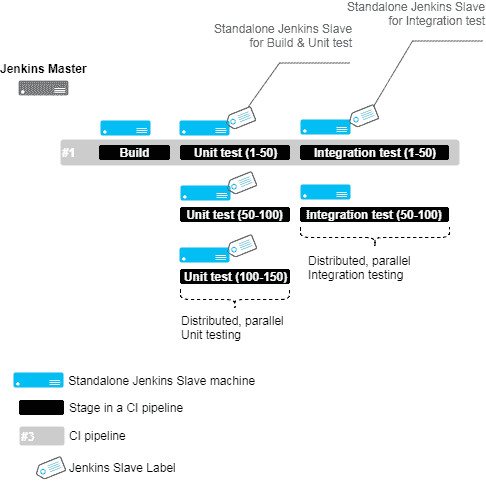

使用 Jenkins 独立从节点进行分布式构建和测试

Jenkins 从节点代理使用**标签**进行分类。我们将在接下来的章节中详细了解标签的内容。

使用 Docker 按需生成 Jenkins 从节点也更好、更容易。如下图所示，这是我们之前讨论的相同概念的 Docker 版本。这里使用 Docker 镜像按需创建 Jenkins 从节点。

你可以看到在以下示例中，我们有两种类型的 Docker 镜像：用于构建和单元测试的 Docker 镜像，以及用于集成测试的 Docker 镜像。这些 Docker 从节点代理是使用这些 Docker 镜像创建的。单元测试分布在三个用于构建和单元测试的 Docker 从节点代理中（第一类），而集成测试则分布在两个用于集成测试的 Docker 从节点代理中（第二类）。

同样在这里，Docker 从节点代理使用标签进行分类。我们将在接下来的章节中详细了解标签的内容：

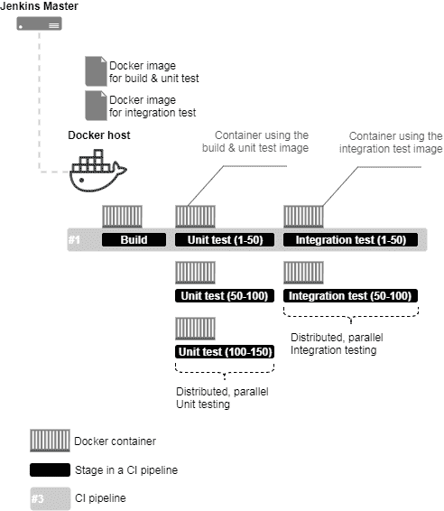

使用 Jenkins 和 Docker 从节点代理进行分布式构建和测试

# Jenkins 管理节点页面

在接下来的章节中，我们将看一下 Jenkins **管理节点**页面：

1.  从 Jenkins 仪表盘上，点击**管理 Jenkins** | **管理节点**。

1.  在左侧，你会看到一个菜单；选项如以下截图所示：

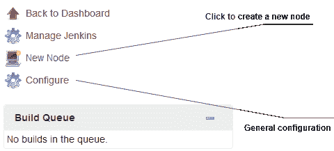

Jenkins 管理节点页面

1.  在右侧，您还将看到一个显示可用 Jenkins 从机列表的表格，如下截图所示：

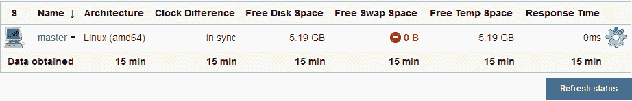

可用节点列表

1.  由于我们尚未配置任何 Jenkins 从机，列表（如前面的截图所示）只包含一个条目：即主机。

1.  表格除了节点的名称外，还显示有关节点的其他有用信息，例如架构、可用磁盘空间量和响应时间。

1.  要启用/禁用有关每个节点显示的信息量，点击配置链接（请参阅*Jenkins 管理节点页面*截图）。这将带您前往下一页，如下截图所示：

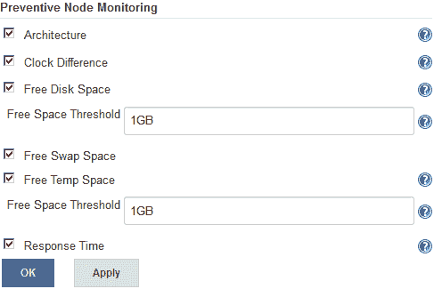

预防性节点监控选项

1.  选中/取消选中相关选项以启用/禁用它们。“空闲空间阈值”选项很重要。如果可用磁盘空间和临时空间的空闲量低于指定值（默认为`1GB`），则节点将离线。这可以防止 Jenkins 流水线在磁盘空间不足的从机上运行导致最终失败。

# 添加 Jenkins 从机 – 独立的 Linux 机器/虚拟机

在接下来的部分，我们将尝试将一个独立的 Linux 机器添加为 Jenkins 从机。确保您即将添加的 Jenkins 从机上已安装了 Java。按照以下步骤操作：

1.  从 Jenkins 仪表板中，点击**管理 Jenkins** | **管理节点**。

1.  从左侧菜单中，点击**新建节点**。在生成的页面上，您将被要求为您的节点提供一个名称并选择类型，如下截图所示：

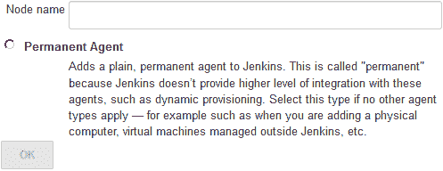

添加名称和选择代理类型（从机类型）

1.  在**节点名称**字段下添加一个有意义的名称，并选择代理类型。目前，只有一种类型的代理可供选择：即永久代理。这些代理主要是物理机器和虚拟机。

1.  点击**确定**按钮继续。

1.  在生成的页面上，您将看到以下配置选项，如下截图所示：

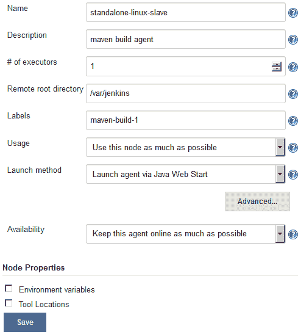

Jenkins 从机配置

让我们逐一查看它们：

1.  我们已经使用了“名称”字段为我们的 Jenkins 从机命名。

1.  使用“描述”字段添加有关 Jenkins 从机的一些注释：例如，用途、类型、可构建或测试的内容以及已安装的工具。

1.  “执行器数量”字段用于描述 Jenkins 从机（代理）被允许同时运行的平行构建数量。选择大于`1`的值，比如`3`，将允许 Jenkins 从机并行运行三个构建。这可能导致每个构建所需时间比平常长。请明智选择。

1.  远程根目录字段 用于定义 Jenkins 从机上的目录路径，该路径将作为 Jenkins 执行构建活动的专用工作空间。

1.  标签字段 是最重要的。您可以向 Jenkins 从机添加多个标签（用空格分隔）。为了在特定的从机上运行流水线，您将使用其标签，如前面的屏幕截图所示。我们添加了一个 `maven-build-1` 标签，表示它是一个 Jenkins 从机用于构建 Maven 项目。

1.  使用字段 用于定义 Jenkins 如何在此节点上安排构建。它包含两个选项，如下所示：

    +   尽可能使用此节点：这是默认选项。此模式使当前 Jenkins 从机对所有未配置为在特定 Jenkins 从机上运行的流水线开放。

    +   仅构建与该节点匹配标签表达式的作业：在此模式下，Jenkins 将仅在此节点上构建项目，当该项目被限制在特定节点上使用标签表达式，并且该表达式与此节点的名称和/或标签匹配时。

1.  启动方法字段 描述了 Jenkins 如何启动此 Jenkins 从机。它包含四个选项，如下所示。在下面的示例中，我们将使用 SSH 方法启动我们的 Jenkins 从机。请参阅 *通过 SSH 启动 Jenkins 从机* 部分：

    +   通过 Java Web Start 启动代理：这允许使用 Java Web Start 启动代理。在这种情况下，必须在代理机器上打开一个 Java 网络启动协议（JNLP）文件，该文件将建立到 Jenkins 主机的 TCP 连接。如果您通过配置全局安全页面启用了安全性，您可以自定义 Jenkins 主机将监听传入 JNLP 代理连接的端口。

    +   通过在主机上执行命令来启动代理：这通过让 Jenkins 从主机执行一个命令来启动一个代理。当主机能够在另一台机器上远程执行进程时，例如，通过 SSH 或远程 shell（RSH）时，使用此选项。

    +   通过 SSH 启动从机代理：这通过安全的 SSH 连接发送命令来启动从机代理。从机需要从主机可达，并且您将需要提供一个可以登录目标机器的帐户。不需要 root 权限。

    +   让 Jenkins 作为 Windows 服务控制此 Windows 从机：这通过内置到 Windows 中的远程管理设施启动 Windows 从机。适用于管理 Windows 从机。从机需要从主机可达。

1.  可用性字段定义了 Jenkins 如何启动、停止和使用 Jenkins 从机。它有三个选项，如下所示：

    +   尽可能保持此代理在线：在此模式下，Jenkins 将尽可能保持此代理在线。如果代理下线，例如，由于临时网络故障，Jenkins 将定期尝试重新启动它。

    +   在特定时间在线和离线此代理：在此模式下，Jenkins 将在预定时间将此代理上线，保持在线一段指定时间。如果代理在预定上线时间内离线，Jenkins 将定期尝试重新启动它。在此代理在线时间达到“预定上线时间”字段指定的分钟数后，它将被下线。如果选中了“在构建运行时保持在线”复选框，并且预定将代理下线，Jenkins 将等待正在进行的任何构建完成。

    +   当需求时上线此代理，并在空闲时下线：在此模式下，如果有需求，即如果有排队构建符合以下条件：它们至少已在队列中等待指定的需求延迟时间段

    +   它们可以由此代理执行（例如，具有匹配的标签表达式）

如果：

1.  1.  +   此代理上没有正在运行的活动构建

        +   此代理至少已处于指定的空闲延迟时间段中空闲

# 将环境变量传递给 Jenkins 的节点

按照给定的步骤传递环境变量：

1.  你将看到一个名为节点属性的部分。使用这些选项，你可以将预定义的环境变量传递给 Jenkins 的节点和工具位置。

1.  如下图所示，你可以将环境变量传递给 Jenkins 的节点。可以传递多个环境变量（通过点击**添加**按钮）。这些环境变量在 Jenkins 管道执行期间可用：

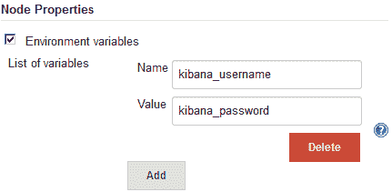

将环境变量传递给 Jenkins 的节点

随着 Jenkins 中 *Pipeline as Code* 功能的推出，可以在 Jenkins 管道代码（管道脚本/Jenkinsfile）中定义和使用环境变量。因此，定义环境变量选项（如前面的截图所示）变得不太重要。

# 将工具位置传递给 Jenkins 的节点

如下图所示，你可以指定 Jenkins 节点上某些工具的位置，覆盖全局配置：

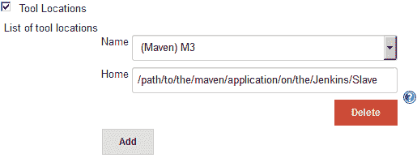

将工具位置传递给 Jenkins 的节点

# 通过 SSH 启动 Jenkins 节点代理

要通过 SSH 启动节点代理，请按照以下步骤：

1.  当你选择通过 SSH 启动节点代理选项时，会出现以下选项，如下图所示。

1.  主机字段是你可以定义 Jenkins 节点代理机器的 IP 地址或主机名的地方。

1.  凭据字段允许你选择保存在 Jenkins 内的相关凭据，以验证 Jenkins 节点代理。要创建新凭据，请点击凭据字段旁边的“添加”按钮（创建一个用户名和密码类型的凭据）：

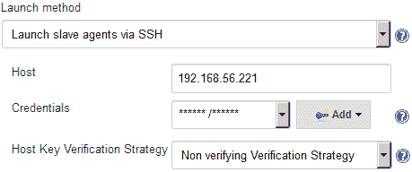

配置通过 SSH 属性启动从属代理

您用于验证 Jenkins 从属代理的用户应该对远程根目录字段下定义的目录路径具有读/写权限。

1.  最后一个选项，主机密钥验证策略，定义了 Jenkins 在连接时验证远程主机呈现的 SSH 密钥的方式。此选项仅在使用以下凭据时有效：种类：SSH 用户名与私钥。有四个可用选项，如下所示：

    +   已知主机文件验证策略：这将检查用户 Jenkins 在其下执行的 `known_hosts` 文件（`~/.ssh/known_hosts`），以查看是否存在与当前连接匹配的条目。此方法不会对 `known_hosts` 文件进行任何更新，而是将文件用作只读源，并期望拥有适当访问权限的人员根据需要更新文件，可能使用 `ssh 主机名` 命令启动连接并适当地更新文件。

    +   手动提供密钥验证策略：这检查远程主机提供的密钥是否与配置此连接的用户设置的密钥匹配。

    +   已知受信任密钥验证策略：这将检查远程密钥是否与当前为此主机标记为受信任的密钥匹配。根据配置，密钥将自动受信任于第一次连接，或者将要求授权用户批准该密钥。将要求授权用户批准远程主机呈现的任何新密钥。

    +   无验证验证策略：这不对远程主机呈现的 SSH 密钥执行任何验证，允许所有连接，而不管它们呈现的密钥是什么。

1.  一旦您完成了所有选项的配置，请单击保存按钮。

# 关于活动 Jenkins 从属代理的更多信息

在接下来的部分，我们将看看我们刚刚添加的 Jenkins 从属代理可用的各种其他可配置选项。Jenkins 还提供了关于其从属代理的许多常规信息，我们将在这里看到。按照以下步骤：

1.  从 Jenkins 仪表板中，单击管理 Jenkins | 管理节点。

1.  在右侧，您还将看到一个表格，其中显示了可用的 Jenkins 从属代理列表。新添加到列表中的是我们新添加的 Jenkins 从属代理。

1.  单击 Jenkins 从属代理名称以访问其配置和元数据。

1.  在结果页面（Jenkins 从属代理状态页面）上，您将在左侧菜单中看到一些选项，如下图所示：

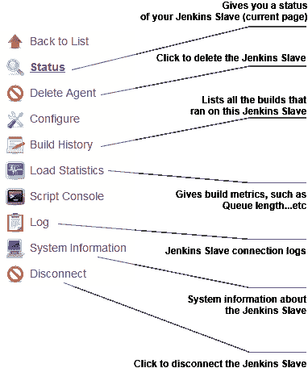

Jenkins 从属代理页面

1.  大多数前述链接（来自前述屏幕截图）是不言自明的。但是，让我们详细查看其中一些。

1.  日志链接是您将找到与 Jenkins 从属节点相关的所有日志的地方。在添加 Jenkins 从属节点后，如果它没有上线，您需要查看日志。连接到 Jenkins 从属节点时遇到的认证问题、权限问题以及其他所有问题都会在此列出。请参阅以下屏幕截图：

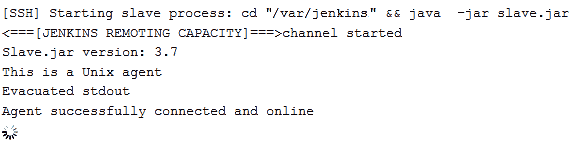

Jenkins 从属节点日志

1.  系统信息链接将向您显示有关相应 Jenkins 从属节点的大多数系统信息，例如系统属性和环境变量。请参阅上述屏幕截图。您不会经常访问此处。尽管如此，在调试由于系统工具、环境变量等引起的构建错误时，这很有用：

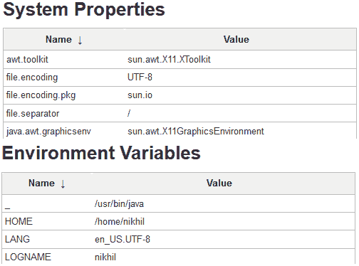

Jenkins 从属节点系统信息

1.  构建历史链接将向您显示在相应的 Jenkins 从属节点上执行的所有构建的时间线。

1.  在 Jenkins 从属节点状态页面上，您将看到附加到相应 Jenkins 从属节点的标签，以及与以下 Jenkins 从属节点关联的项目的信息。请参阅以下屏幕截图：

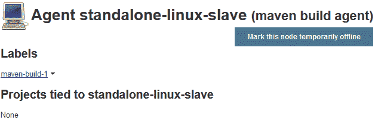

Jenkins 从属节点状态页面

1.  有一个选项可以通过点击“将此节点暂时脱机”按钮将 Jenkins 从属节点临时脱机。当您点击该按钮时，将会要求您在将 Jenkins 从属节点脱机之前添加一个注释（可选）：

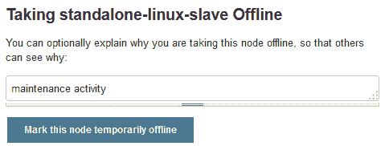

使 Jenkins 从属节点脱机

1.  要将脱机节点重新上线，请从 Jenkins 状态页面上点击“使此节点重新上线”按钮：

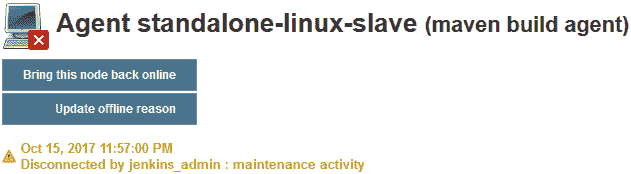

启动 Jenkins 从属节点

# 添加 Jenkins 从属节点 – 独立的 Windows 机器/虚拟机

在以下部分，我们将尝试将独立的 Windows 机器添加为 Jenkins 从属节点。确保您的即将成为 Jenkins 从属节点的机器上已安装了 Java。按照以下步骤操作：

1.  从左侧菜单中，点击“新建节点”。在生成的页面上，您将被要求为您的节点提供名称并选择类型，如下面的屏幕截图所示：

1.  从 Jenkins 仪表板中，点击**管理 Jenkins** | **管理节点**。

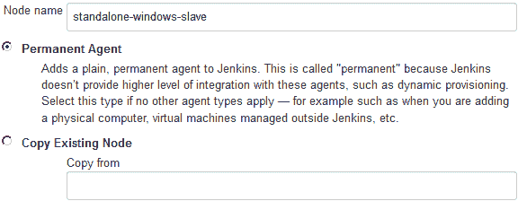

添加名称并选择代理类型（从属类型）

1.  在“节点名称”字段下添加有意义的名称，并将代理类型选择为永久代理。这些代理类型主要是物理机器和虚拟机。还有一种选项可以克隆现有的 Jenkins 从属节点。要这样做，请选择“复制现有节点”选项，并在“从字段”下输入 Jenkins 从属节点源的名称。

1.  然而，在以下示例中，我们将选择永久代理选项。

1.  单击“确定”按钮继续。

1.  在生成的页面上，您将看到以下配置选项，如下面的屏幕截图所示。我们已经在之前看过它们：

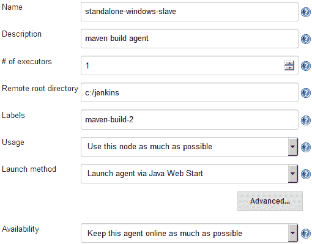

Jenkins 从节点配置

1.  由于这是一个 Windows 构建代理，我们有两种方式可以启动 Jenkins 从节点，如下所示：

    +   通过 Java Web Start 启动代理：这允许使用 Java Web Start 启动代理。在这种情况下，必须在代理机器上打开一个 JNLP 文件，该文件将建立到 Jenkins 主服务器的 TCP 连接。如果您通过配置全局安全性页面启用了安全性，您可以自定义 Jenkins 主服务器将监听传入 JNLP 代理连接的端口。

    +   让 Jenkins 作为 Windows 服务控制此 Windows 从节点：这将通过 Windows 内置的远程管理功能启动 Windows 从节点。适用于管理 Windows 从节点。从节点需要从主服务器可达的 IP。

# 通过 Java Web Start 启动 Jenkins 从节点

在下一节中，我们将学习如何使用 Java Web Start 方法在 Windows 上启动 Jenkins 从节点。

1.  对于 启动方法 字段，请选择通过 Java Web Start 启动代理。

1.  点击保存按钮。

1.  从 Jenkins 管理节点页面，点击 Jenkins 从节点名称。在我们的示例中，它是`standalone-windows-slave`。

1.  在结果页面（Jenkins 从节点状态页面）上，您将看到以下选项，如下所示：

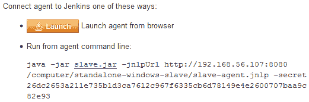

Jenkins 从节点连接方法（Java Web Start）

1.  在 Jenkins 服务器上不执行任何操作。

1.  现在，登录到您准备用作 Jenkins 从节点的机器（Windows）并打开 Jenkins 仪表板。

1.  从 Jenkins 仪表板，点击管理 Jenkins | 管理节点。

1.  从 Jenkins 管理节点页面，点击 Jenkins 从节点名称。在我们的示例中，它是`standalone-windows-slave`。

1.  现在，要么按照以下截图中所示运行命令，要么点击启动按钮。

1.  如果选择点击启动按钮，则会看到以下弹出窗口，如下截图所示：


打开 slave-agent.jnlp 文件

1.  选择 打开方式 选项为 Java(TM) Web Start Launcher（默认）选项，然后点击 确定按钮。

1.  您将收到另一个弹出窗口，询问您是否希望运行此应用程序。如下截图所示，点击运行：

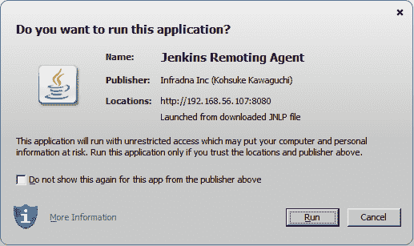

运行 Jenkins 远程代理

1.  最后，您将看到一个小窗口显示 Jenkins 从节点连接状态为已连接，如下截图所示：

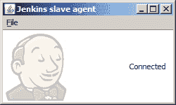

Jenkins 从节点代理窗口。

1.  您的 Jenkins 从节点（Windows）现在已连接。要将其作为 Windows 服务，点击文件（上一张截图），然后选择安装为服务。

1.  打开运行实用程序并输入命令`services.msc`以打开 Windows 服务实用程序。在服务列表中，您会发现 Jenkins 从节点代理服务，如下截图所示：

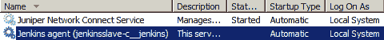

Jenkins 从节点列为 Windows 服务。

1.  右键单击 Jenkins 从机 Windows 服务，选择属性。

1.  在属性窗口中，转到*登录*选项卡。在*登录为*部分下，选择*此账户*选项，并提供管理员账户的详细信息（在 Jenkins 从机上具有管理员特权的用户），如下截图所示：

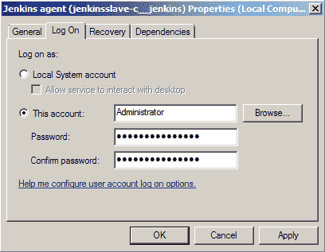

Jenkins 从机服务属性

1.  您的 Jenkins 从机（Windows 上）现已安装。

# 添加 Jenkins 从机 - Docker 容器

在接下来的部分中，我们将学习如何安装和配置 Docker 插件，该插件将允许我们从 CI 流水线生成按需的 Jenkins 从机（Docker 容器）。 Docker 容器由 CI 流水线启动，一旦构建完成，它们将被销毁。在接下来的部分中，我们只会看到配置部分。在下一章中，我们将看到这个过程的实际运行。

# 先决条件

在我们开始之前，请确保您准备好以下内容：

+   在以下任一平台上运行 Jenkins 服务器：Docker、独立、云、虚拟机、servlet 容器等（参考第二章，*安装 Jenkins*）。

+   您的 Jenkins 服务器应该有访问互联网的权限。这是下载和安装插件所必需的。

+   您的 Jenkins 服务器可以使用 GitHub 插件与 GitHub 进行交互（请参考第三章中的*在 Jenkins 中添加 GitHub 凭证*和*从 Jenkins 配置 GitHub 上的 Webhooks*部分， *全新的 Jenkins*）。

+   您的 Jenkins 服务器还可能需要配置 Java、Git 和 Maven。（请参考第三章中*全局工具配置页面*部分下的*全新 Jenkins 流水线任务*子部分， *全新的 Jenkins*）。

+   一个 Docker 服务器。

# 设置 Docker 服务器

要安装 Docker，您需要拥有以下 Ubuntu 操作系统之一（64 位）的计算机：Yakkety Yak 16.10、Xenial Xerus 16.04 或 Trusty Tahr 14.04。确保还安装了`curl`。按照给定的步骤设置 Docker 服务器。

# 设置仓库

按照以下给出的步骤设置仓库：

1.  执行以下命令让`apt`使用一个仓库：

```
 sudo apt-get install apt-transport-https ca-certificates
```

1.  使用以下命令添加 Docker 的官方 GPG 密钥：

```
 curl -fsSL https://yum.dockerproject.org/gpg | sudo apt-key add -
```

1.  验证密钥 ID 是否完全是`58118E89F3A912897C070ADBF76221572C52609D`，使用以下命令：

```
 apt-key fingerprint 58118E89F3A912897C070ADBF76221572C52609D
```

1.  您应该看到类似的输出：

```
 pub 4096R/2C52609D 2015-07-14
 Key fingerprint = 5811 8E89 F3A9 1289 7C07 0ADB F762 2157 2C52 609D
 Uid Docker Release Tool (releasedocker) docker@docker.com
```

1.  使用以下命令设置一个稳定的仓库来下载 Docker：

```
 sudo add-apt-repository \
        "deb https://apt.dockerproject.org/repo/ubuntu-$(lsb_release -cs) \
        main"
```

建议始终使用仓库的稳定版本。

# 使用 apt-get 安装 Docker

现在您已经设置好了仓库，请执行以下步骤安装 Docker：

1.  使用以下命令更新`apt`软件包索引：

```
 sudo apt-get update
```

1.  要安装最新版本的 Docker，请执行以下命令：

```
 sudo apt-get -y install docker-engine
```

1.  然而，如果您希望安装特定版本的 Docker，请执行以下命令：

```
 apt-cache madison docker-engine
```

1.  这将给出可用版本的列表：

```
 docker-engine | 1.16.0-0~trusty |
        https://apt.dockerproject.org/repo
        ubuntu-trusty/main amd64 Packages
 docker-engine | 1.13.3-0~trusty |
        https://apt.dockerproject.org/repo
        ubuntu-trusty/main amd64 Packages 
```

前面命令的输出取决于在前一部分配置的仓库类型，即*设置仓库*。

1.  接下来，执行以下命令来安装特定版本的 Docker：

```
 sudo apt-get -y install docker-engine=<VERSION_STRING>
```

例子：`sudo apt-get -y install docker-engine=1.16.0-0~trusty`

1.  `docker`服务会自动启动。要验证 Docker 是否已安装并运行，请运行以下命令：

```
 sudo docker run hello-world 
```

1.  如果前面的命令运行没有任何错误，并且你看到了`hello world`消息，那意味着 Docker 已经安装并运行。

```
 Hello from Docker!
 This message shows that your installation appears to be
        working correctly.
```

# 使用 .deb 软件包安装 Docker

如果由于某些原因，你无法使用上述的仓库方法安装 Docker，你可以下载`.deb`包。

1.  从[`apt.dockerproject.org/repo/pool/main/d/docker-engine/`](https://apt.dockerproject.org/repo/pool/main/d/docker-engine/)下载你选择的`.deb`软件包。

1.  要安装下载的软件包，请输入以下内容：

```
 sudo dpkg -i /<path to package>/<docker package>.deb
```

1.  运行以下命令验证你的 Docker 安装：

```
 sudo docker run hello-world
```

1.  如果前面的命令运行没有任何错误，并且你看到了`hello world`消息，那意味着 Docker 已经安装并运行。

```
 Hello from Docker!
 This message shows that your installation appears to be
        working correctly.
```

# 启用 Docker 远程 API

Jenkins（通过 Docker 插件）使用*Docker 远程 API*与 Docker 服务器进行通信。Docker 远程 API 允许外部应用程序使用 REST API 与 Docker 服务器通信。Docker 远程 API 也可以用于获取 Docker 服务器内所有运行的容器的信息。

要启用 Docker 远程 API，我们需要修改 Docker 的配置文件。根据你的操作系统版本和在你的计算机上安装 Docker 的方式，你可能需要选择正确的配置文件进行修改。以下是适用于 Ubuntu 的两种方法。

# 修改 docker.conf 文件

遵循以下步骤修改 `docker.conf` 文件。这些配置是允许 Jenkins 与 Docker 主机通信的重要配置：

1.  登录到你的 Docker 服务器，确保你有`sudo`权限。

1.  执行以下命令来编辑`docker.conf`文件：

```
 sudo nano /etc/init/docker.conf
```

1.  在 `docker.conf` 文件中，找到包含 `DOCKER_OPTS=`的行。

你会在 `docker.conf` 文件中找到两处包含`DOCKER_OPTS=`变量的地方。首先，在预启动脚本部分，然后在后启动脚本部分。在预启动脚本部分使用`DOCKER_OPTS=`变量。

1.  将`DOCKER_OPTS`的值设置为以下内容：

```
        DOCKER_OPTS='-H tcp://0.0.0.0:4243 -H unix:///var/run/docker.sock'
```

1.  前面的设置将将 Docker 服务器绑定到 Unix 套接字，以及 TCP 端口`4243`。`0.0.0.0`，这使得 Docker 引擎接受来自任何地方的连接。

如果你希望你的 Docker 服务器仅接受来自你的 Jenkins 服务器的连接，则将`0.0.0.0`替换为你的 Jenkins 服务器 IP。

1.  使用以下命令重新启动 Docker 服务器：

```
 sudo service docker restart
```

1.  要检查配置是否生效，请输入以下内容：

```
 curl -X GET http://<Docker server IP>:4243/images/json
```

前面的命令将列出 Docker 服务器上存在的所有镜像，如果有的话。

# 修改 docker.service 文件

按照以下步骤修改`docker.service`文件：

1.  执行以下命令编辑`docker.service`文件：

```
 sudo nano /lib/systemd/system/docker.service
```

1.  在`docker.service`文件中，转到包含`ExecStart=`的行。

1.  将`ExecStart=`的值设置如下：

```
        ExecStart=/usr/bin/docker daemon -H fd:// -H tcp://0.0.0.0:4243
```

1.  上述设置将 Docker 服务器绑定到 Unix 套接字。此外，在 TCP 端口`4243`上。`0.0.0.0`，它使 Docker 引擎接受来自任何地方的连接。

如果您希望您的 Docker 服务器仅接受来自您的 Jenkins 服务器的连接，请将`0.0.0.0`替换为您的 Jenkins 服务器 IP。

1.  执行以下命令使 Docker 守护进程注意到修改后的配置：

```
 systemctl daemon-reload
```

1.  使用以下命令重新启动 Docker 服务器：

```
 sudo service docker restart
```

1.  要检查配置是否生效，请输入以下内容：

```
 curl -X GET http://<Docker server IP>:4243/images/json
```

如果有的话，上述命令将列出您的 Docker 服务器上存在的所有镜像。

# 安装 Docker 插件

要动态创建 Docker 容器（构建代理），我们需要为 Jenkins 安装 Docker 插件。为此，请按照以下步骤操作：

1.  从 Jenkins 仪表板中，单击“管理 Jenkins | 管理插件 | 可用”选项卡。您将进入 Jenkins 管理插件页面。

1.  在过滤字段中输入`Docker Plugin`，如下截图所示：

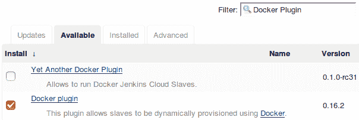

安装 Docker 插件

1.  从列表中选择**Docker 插件**，然后单击**无需重启安装**按钮。

1.  如果需要，请重新启动 Jenkins。

# 配置 Docker 插件

现在我们已经安装了 Docker 插件，让我们对其进行配置：

1.  从 Jenkins 仪表板中，单击“管理 Jenkins | 配置系统”。

1.  一旦进入配置系统页面，请滚动到底部的 Cloud 部分（参见下图）。

1.  单击“添加新云”按钮，然后从可用选项中选择 Docker。

1.  在结果页面上，您将找到许多要配置的设置。

1.  使用“名称”字段为您的 Docker 服务器命名。

1.  在 Docker URL 字段下添加您的 Docker 服务器 URL。

1.  单击“测试连接”按钮以检查 Jenkins 是否可以与 Docker 服务器通信：

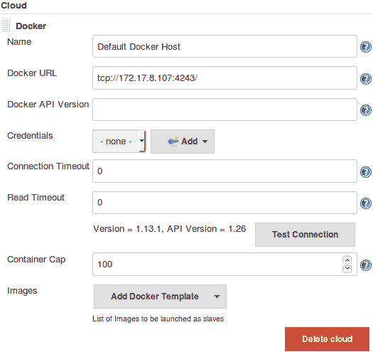

配置 Docker 插件以与 Docker 服务器通信

1.  在页面底部，单击**应用**和**保存**按钮。稍后我们会再次回到这里进行进一步的配置。

# 创建 Docker 镜像 - Jenkins 从属

启用 Docker 远程 API 使 Jenkins 与 Docker 服务器之间的通信成为可能。现在我们需要在 Docker 服务器上有一个 Docker 镜像。Jenkins 将使用此 Docker 镜像动态创建 Docker 容器（Jenkins 从属）。为此，请按照如下步骤操作：

1.  登录到您的 Docker 服务器。输入以下命令以检查可用的 Docker 镜像：

```
 sudo docker images
```

1.  从下图中，您可以看到我们的 Docker 服务器上已经有两个`docker images`（`ubuntu`和`hello-world`）：

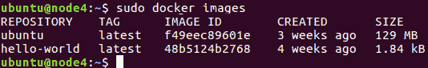

列出 Docker 镜像

1.  如果您的 Docker 服务器是一台刚刚备份的机器，则此时您将看不到任何镜像。

1.  我们将从`ubuntu` Docker 镜像构建一个用于我们的用途的 Docker 镜像。为此，请使用以下命令下载`ubuntu`的 Docker 镜像：

```
 docker pull ubuntu
```

您可以在[`hub.docker.com/`](https://hub.docker.com/)找到更多不同操作系统的 Docker 镜像。

1.  拉取完成后，再次执行`sudo docker images`命令。现在，您应该可以看到一个用于 Ubuntu 的 Docker 镜像，如前面的截图所示。

1.  现在，我们将使用我们需要运行构建所需的所有必要应用程序来升级我们的 Ubuntu Docker 镜像。它们如下所示：

    +   Java JDK（最新版本）

    +   Git

    +   Maven

    +   用于登录到 Docker 容器的用户账户

    +   `sshd`（用于接受 SSH 连接）

1.  使用以下命令运行 Docker 容器，使用 Ubuntu Docker 镜像。这将创建一个容器，并打开其 bash shell：

```
 sudo docker run -i -t ubuntu /bin/bash
```

1.  现在，安装所有所需的应用程序，就像您在任何普通的 Ubuntu 机器上执行的操作一样。让我们从创建`jenkins`用户开始：

    1.  执行以下命令，并按照下图中显示的用户创建步骤进行操作：

```
 adduser jenkins
```

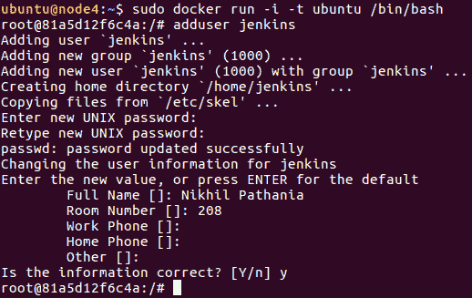

创建用户

1.  1.  使用切换用户命令检查新用户：

```
 su jenkins
```

1.  通过键入`exit`切换回根用户。

1.  接下来，我们将安装 SSH 服务器。按顺序执行以下命令：

```
 apt-get update
 apt-get install openssh-server
 mkdir /var/run/sshd
```

1.  接下来，使用以下命令安装 Git：

```
 apt-get install git
```

1.  使用以下命令安装 Java JDK：

```
 apt-get install openjdk-8-jdk
```

1.  使用以下命令安装 Maven：

```
 apt-get install maven
```

1.  接下来，键入`exit`退出容器。

1.  我们需要保存（`commit`）我们对 Docker 容器所做的所有更改。

1.  通过列出所有未活动容器，获取我们最近工作的容器的`CONTAINER ID`，如下图所示：

```
 sudo docker ps -a
```

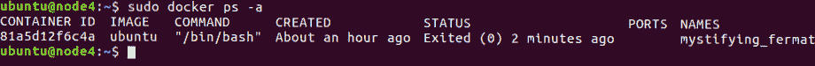

未活动容器列表

1.  注意`CONTAINER ID`，并执行`commit`命令，以提交我们对容器所做的更改，如下所示：

```
 sudo docker commit <CONTAINER ID> <new name for the container>
```

1.  如下图所示，我们将容器命名为`maven-build-slave-0.1`：

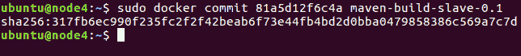

Docker commit 命令

1.  一旦您提交了更改，将创建一个新的 Docker 镜像。

1.  执行以下 Docker 命令列出镜像：

```
 sudo docker images
```

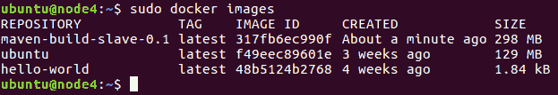

列出 Docker 镜像

1.  您可以看到我们的新 Docker 镜像，名称为`maven-build-slave-0.1`。现在，我们将配置我们的 Jenkins 服务器以使用 Docker 镜像来创建 Jenkins 从节点（构建代理）。

# 在 Jenkins 中添加 Docker 容器凭据

按照给定的步骤在 Jenkins 中添加凭据，以允许其与 Docker 通信：

1.  从 Jenkins 仪表板导航到凭据 | 系统 | 全局凭据（无限制）。

1.  点击左侧菜单上的**添加凭据**链接以创建新凭据（请参阅下图）。

1.  选择`用户名与密码`作为**类型**。

1.  将范围字段保留为其默认值。

1.  在 Username 字段下为你的 Docker 镜像添加一个用户名（按照我们的示例，是 `jenkins`）。

1.  在 Password 字段下，添加密码。

1.  在 ID 字段下添加一个 ID，并在描述字段下添加一些描述。

1.  完成后，点击确定按钮：

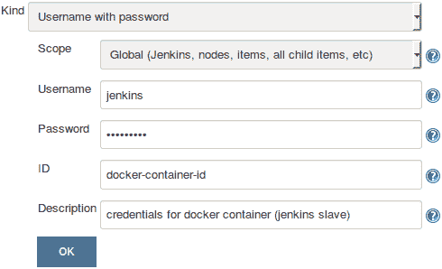

在 Jenkins 中创建凭据

# 更新 Jenkins 中的 Docker 设置

按照给定步骤更新 Jenkins 中的 Docker 设置：

1.  从 Jenkins 仪表板上，点击 Manage Jenkins | Configure System。

1.  滚动到底部找到 Cloud 部分（见下图）。

1.  在 Cloud 部分，点击添加 Docker 模板按钮，然后选择 Docker 模板。

1.  你将会看到许多设置需要配置。然而，为了保持这个演示简单，让我们专注于重要的设置：

    1.  在 Docker Image 字段下，输入我们之前创建的 Docker 镜像的名称。在我们的案例中，它是 `maven-build-slave-0.1`。

    1.  在 Labels 字段下，添加一个标签。Jenkins 流水线将使用此标签识别 Docker 容器。添加一个 `docker` 标签。

    1.  启动方法应该是 Docker SSH 计算机启动器。

    1.  在 **Credentials** 字段下，选择我们创建的用于访问 Docker 容器的凭据。

    1.  确保 Pull 策略选项设置为 Never pull。

    1.  将其余选项保留为默认值。

    1.  完成后，点击应用然后保存：

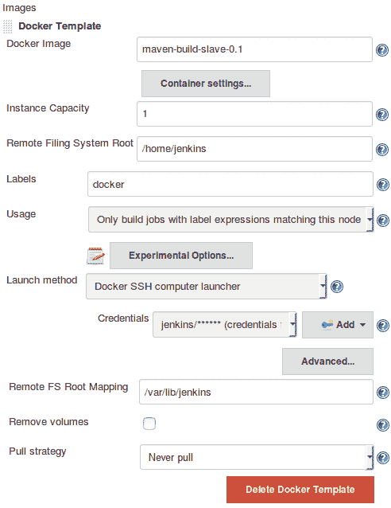

配置 Docker 插件设置

1.  现在你的 Jenkins 服务器已经设置好了，可以使用 Docker 随需创建 Jenkins 从节点。

# 摘要

在本章中，我们学习了如何在独立的 Windows 和 Linux 机器（物理/虚拟机）上添加和配置 Jenkins 从节点，使用了两种广泛使用的方法：通过 SSH 启动 Jenkins 从节点和通过 Java Web Start 启动 Jenkins 从节点。我们还学习了如何安装和配置 Jenkins 的 Docker 插件，该插件允许我们为 CI 创建按需的 Docker 容器（Jenkins 从节点）。

在下一章中，我们将学习如何使用 Jenkins 实现持续集成，并且我们将利用 Jenkins Docker 容器（Jenkins 从节点）来执行我们的 CI。
