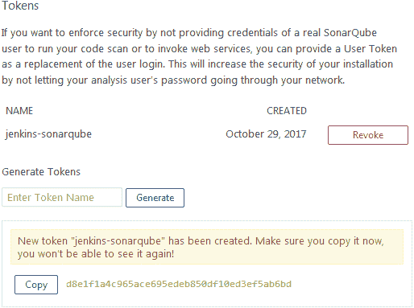
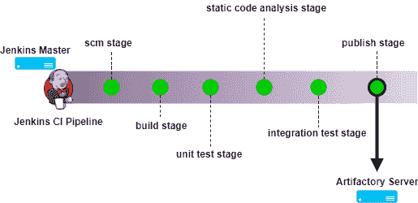

# 第六章：安装 SonarQube 和 Artifactory

在本章中，我们将学习 SonarQube，这是一个流行的开源工具，用于静态代码分析。我们还将学习 Artifactory，这是另一个流行的开源工具，用于版本控制二进制文件。在本章中，您将学习以下主题：

+   安装独立的 SonarQube 服务器

+   在 SonarQube 内创建项目

+   为 SonarQube 安装构建破坏插件

+   创建质量门和质量配置文件

+   在 Jenkins 中安装和配置 SonarQube 插件

+   安装独立的 Artifactory 服务器

+   在 Artifactory 中创建存储库

+   在 Jenkins 中安装和配置 Artifactory 插件

# 安装和配置 SonarQube

除了连续集成代码外，CI 流水线现在还包括执行连续检查的任务 —— 以连续的方式检查代码的质量。

连续检查涉及检查和避免质量低劣的代码。诸如 SonarQube 的工具帮助我们实现这一点。每次代码提交时，都会对代码进行代码分析。

此分析基于代码分析工具定义的一些规则。如果代码通过了错误阈值，它被允许进入其生命周期的下一步。但是，如果它超过了错误阈值，它就会被丢弃。

有些组织更喜欢在开发人员尝试提交代码时立即检查代码质量。如果分析结果良好，则允许提交代码，否则取消提交并要求开发人员重新处理代码。

SonarQube 是一个代码质量管理工具，允许团队管理、跟踪和改善其源代码的质量。它是一个基于 Web 的应用程序，包含可配置的规则、警报和阈值。它涵盖了七种代码质量参数，包括架构和设计、重复、单元测试、复杂度、潜在错误、编码规则和注释。

SonarQube 是一个开源工具，通过插件支持几乎所有流行的编程语言。SonarQube 还可以与 CI 工具（如 Jenkins）集成，以执行持续检查，我们很快就会看到。

那么，首先让我们学习如何安装 SonarQube。在接下来的部分中，我们将学习如何在 Ubuntu 16.04 上安装 SonarQube。

# 安装 Java

按照以下步骤安装 Java：

1.  更新软件包索引：

```
sudo apt-get update
```

1.  接下来，安装 Java。以下命令将安装 JRE：

```
sudo apt-get install default-jre
```

1.  要设置 `JAVA_HOME` 环境变量，首先获取 Java 安装位置。通过执行以下命令执行此操作：

```
update-java-alternatives –l
```

1.  您应该会得到类似的输出：

```
java-1.8.0-openjdk-amd64 1081 /usr/lib/jvm/java-1.8.0-openjdk-amd64
```

1.  上述输出中的路径是 `JAVA_HOME` 的位置。复制它。

1.  打开 `/etc/environment` 文件进行编辑：

```
sudo nano /etc/environment
```

1.  将以下行添加到 `/etc/environment` 文件中，如下所示：

```
JAVA_HOME="/usr/lib/jvm/java-1.8.0-openjdk-amd64"
```

1.  输入 *Ctrl* + *X* 并选择 *Y* 以保存并关闭文件。

1.  接下来，使用以下命令重新加载文件：

```
 sudo source /etc/environment
```

# 下载 SonarQube 包

以下步骤将帮助您下载 SonarQube 包：

1.  通过访问[`www.sonarqube.org/downloads/`](https://www.sonarqube.org/downloads/)下载最新版本的 SonarQube 安装包。

建议您始终安装最新的 LTS* 版本 SonarQube。

1.  移动至 `/tmp` 文件夹：

```
cd /tmp
```

1.  使用 `wget` 下载 SonarQube ZIP 包，如下所示的命令。在这里，我下载 SonarQube 版本 5.6.7（LTS*）：

```
wget https://sonarsource.bintray.com/Distribution/sonarqube/
sonarqube-5.6.7.zip
```

1.  接下来，在 `/opt` 目录下解压 SonarQube ZIP 包，使用以下命令：

```
unzip sonarqube-5.6.7.zip -d /opt/
```

要使用 `unzip` 命令，请确保您的 Ubuntu 机器上安装了压缩工具。要安装 ZIP 工具，请执行以下命令：

`**sudo apt-get install zip**`

您也可以在另一台机器上下载 SonarQube ZIP 包，然后使用 WinSCP 将其移动到您的 SonarQube 服务器上。

1.  移动到已解压的文件夹并列出其内容：

```
cd /opt/sonarqube-5.6.7/ 
ls -lrt
```

`bin/`文件夹包含了所有安装和启动 SonarQube 的脚本，而 `logs/`文件夹包含了 SonarQube 的日志。

# 运行 SonarQube 应用程序

按照以下步骤启动 SonarQube 服务器：

1.  移动至 `/opt/sonarqube-5.6.6/bin/linux-x86-64/`。在我们当前的示例中，我们在 64 位 Linux 操作系统上启动 SonarQube：

```
cd /opt/sonarqube-5.6.6/bin/linux-x86-64/
```

1.  运行 `sonar.sh` 脚本以启动 SonarQube，如下所示的命令：

```
./sonar.sh start
```

1.  您应该会看到类似的输出：

```
Starting SonarQube... Started SonarQube.
```

1.  要访问 SonarQube，请在您喜爱的网络浏览器中使用以下链接：`http://localhost:9000/` 或 `http://<IP-Address>:9000`。

目前在 SonarQube 中没有配置用户帐户。但是，默认情况下有一个用户名为`admin`、密码为`admin`的管理员帐户。

确保您至少有 4GB 的内存来运行 64 位版本的 SonarQube。

# 重置默认凭据并生成令牌

按照以下步骤重置凭据并生成一个令牌：

1.  在您喜欢的浏览器中打开 SonarQube 链接并切换到管理员用户。

1.  从 SonarQube 仪表板上，点击 Administrator | My Account | Security（选项卡）。

1.  在结果页面下，执行以下操作来更改密码部分：

    1.  在 旧密码 字段下添加您的旧密码（`admin`）。

    1.  在 新密码 字段下添加一个新密码。

    1.  在 确认密码 字段中重新输入新密码。

    1.  完成后，点击更改密码按钮。

1.  在同一页的令牌部分下，有一个选项来生成一个令牌。Jenkins 可以使用此令牌访问 SonarQube。执行以下步骤生成一个新令牌：

    1.  在令牌部分下，通过点击生成按钮在 生成令牌 字段下为您的新令牌添加一个名称。

    1.  新的令牌将会生成，如下截图所示。

1.  1.  复制并保存此令牌，因为我们稍后会用到它：



在 SonarQube 中创建一个令牌

# 在 SonarQube 中创建项目

在接下来的部分中，我们将在 SonarQube 中创建一个项目。该项目将用于显示静态代码分析：

1.  从 SonarQube 仪表板，点击管理| 项目（选项卡）| 管理。

1.  在结果页面上，点击“创建项目”按钮。

1.  在结果窗口中，填写相应的详细信息，如下面的步骤所示：

    1.  在“名称”字段下添加一个名称。

    1.  在“键”字段下添加一个键。

    1.  点击“创建”按钮创建项目：


在 SonarQube 中创建一个项目

1.  你可以在项目管理页面上看到你新创建的项目，如下图所示：


SonarQube 中新创建的项目

# 为 SonarQube 安装构建破坏插件

构建破坏插件适用于 SonarQube。它是专门为 SonarQube 设计的插件，而不是 Jenkins 插件。此插件允许 CI 系统（Jenkins）在质量门限条件不满足时强制失败 Jenkins 构建。要安装构建破坏插件，请执行以下步骤：

1.  在下载插件之前，先参考兼容性表。这将帮助我们下载正确的插件版本。兼容性表可在[`github.com/SonarQubeCommunity/sonar-build-breaker`](https://github.com/SonarQubeCommunity/sonar-build-breaker)上找到。

1.  从[`github.com/SonarQubeCommunity/sonar-build-breaker/releases`](https://github.com/SonarQubeCommunity/sonar-build-breaker/releases)下载构建破坏插件。

1.  移动到`/tmp`目录并下载构建破坏插件，使用以下命令：

```
cd /tmp

wget https://github.com/SonarQubeCommunity/
sonar-build-breaker/releases/download/2.2/
sonar-build-breaker-plugin-2.2.jar
```

1.  将下载的`.jar`文件移动到位置`opt/sonarqube-5.6.7/extensions/plugins/`：

```
cp sonar-build-breaker-plugin-2.2.jar \
/opt/sonarqube-5.6.7/extensions/plugins/
```

1.  使用以下命令重新启动 SonarQube：

```
cd /opt/sonarqube-5.6.7/bin/linux-x86-64

sudo ./sonar.sh restart
```

1.  你应该看到类似的输出：

```
Stopping SonarQube... Waiting for SonarQube to exit... Stopped SonarQube. Starting SonarQube... Started SonarQube.
```

1.  成功重新启动后，转到 SonarQube 仪表板，并以管理员身份登录。

1.  点击菜单栏上的管理链接。

1.  在管理页面上，您将在“类别”侧边栏下看到“构建破坏器”选项，如下图所示；不需要操作：


在 SonarQube 中的构建破坏插件设置

1.  构建破坏插件已成功安装。

# 创建质量门限

为了使构建破坏插件正常工作，我们需要创建一个*质量门限*；它只是一条带有一些条件的规则。当 Jenkins 流水线运行时，它将执行*质量配置文件*和质量门限。如果质量门限检查成功通过，则 Jenkins 流水线继续运行，但如果失败，则 Jenkins 流水线中止。尽管如此，分析仍然会发生。

按照以下步骤在 SonarQube 中创建一个质量门限：

1.  从 SonarQube 仪表板，点击菜单栏上的“质量门限”链接。

1.  在结果页面上，点击左上角的“创建”按钮。

1.  您将看到一个弹出窗口，如下面的屏幕截图所示。在名称字段下添加您的质量门名称，并点击创建按钮：


创建一个新的质量门

1.  您将在质量门页面上看到您的新质量门，如下面的屏幕截图所示：


新质量门

1.  现在让我们通过从添加条件菜单中选择一个来为我们的质量门添加一个条件：


条件菜单

1.  下面的屏幕截图显示了一个名为主要问题的条件。如果大于`1`但小于`50`，则是警告，如果大于`50`，则是错误，如下面的屏幕截图所示。这只是一个示例；您可以配置任意数量的条件：


配置质量门

1.  接下来，让我们确保我们之前在 SonarQube 中创建的示例项目使用我们新创建的质量门。为此，请从 SonarQube 仪表板点击管理 | 项目（选项卡）| 管理。

1.  在结果页面上，您将看到我们之前在 SonarQube 中创建的示例项目。点击它。

1.  在结果页面上，点击管理（选项卡）| 质量门。

1.  在质量门部分下，您将看到一个选项，可以从 SonarQube 中的可用质量门列表中选择质量门。选择我们最近创建的一个并点击更新按钮：


将质量门关联到项目

# 更新默认质量配置

在下一节中，我们将修改 Java（Sonar way）的默认质量配置，我们打算用于我们的静态代码分析。请按照以下步骤操作：

1.  从 SonarQube 仪表板，点击菜单栏中的质量配置链接。在结果页面上，您将看到所有存在于 SonarQube 上的质量配置，如下面的屏幕截图所示：


SonarQube 中的质量配置列表

1.  从上一个屏幕截图中，您可以看到 Java 的默认质量配置：Sonar way 包含 254 个活动规则。让我们尝试添加更多规则。

1.  点击激活更多按钮。

1.  在结果页面上，您将看到一些内容，如下面的屏幕截图所示：


未激活规则列表

1.  这是您可以向质量配置添加和删除规则的地方。让我们激活所有 Java 的未激活规则。

1.  要做到这一点，从页面右上角，点击批量更改 | 在 Sonar way 中激活，如下面的屏幕截图所示：


批量激活规则

1.  您将看到一个弹出窗口询问您确认更改。点击应用按钮并继续。

1.  接下来，从菜单栏中点击“质量配置文件”链接。 在结果页面上，点击 Java 的 **Sonar way** 质量配置文件，现在您应该看到比以前更多的规则。

在 SonarQube 上可见的规则列表和默认质量配置文件取决于安装的插件。 要获取所需语言的规则，请安装相应的 SonarQube 插件。

# 在 Jenkins 中安装 SonarQube 插件

按照以下步骤为 Jenkins 安装 SonarQube 插件：

1.  从 Jenkins 仪表板中，点击“管理 Jenkins | 管理插件 | 可用（选项卡）”。 您将进入 Jenkins 管理插件页面。

1.  在“过滤器”字段中输入`SonarQube`，如下面的截图所示：


安装 SonarQube 插件

1.  从列表中选择“Jenkins 的 SonarQube 扫描仪”，然后点击“无需重新启动安装”按钮。

1.  如有需要，请重新启动 Jenkins。

# 在 Jenkins 中配置 SonarQube 插件

现在我们已经安装了 SonarQube 插件，让我们来配置它：

1.  从 Jenkins 仪表板中，点击“管理 Jenkins | 配置系统”。

1.  一旦进入“配置系统”页面，请向下滚动到 SonarQube 服务器部分。

1.  在 SonarQube 服务器部分，点击“添加 SonarQube”按钮。 您将看到要配置的设置，如下面的截图所示。 让我们逐一了解它们。

1.  在“名称”字段中为您的 SonarQube 服务器命名。

1.  在“服务器 URL”字段下输入 SonarQube 服务器的 URL。

1.  在“默认部署者凭据”下添加 Artifactory 凭据。

1.  在“服务器身份验证令牌”字段下输入我们在 SonarQube 中创建的令牌。

1.  点击“测试连接”按钮以测试 Jenkins 与 Artifactory 的连接：


配置 SonarQube 插件

1.  完成后，点击页面底部的“保存”按钮保存设置。

# 安装和配置 Artifactory

持续集成导致频繁的构建和打包。 因此，需要一种机制来存储所有这些二进制代码（构建、包、第三方插件等），这种机制类似于版本控制系统。

由于像 Git、TFS 和 SVN 这样的版本控制系统存储的是代码而不是二进制文件，我们需要一个二进制存储库工具。 一个与 Jenkins 紧密集成的二进制存储库工具（如 Artifactory 或 Nexus）提供了以下优势：

+   跟踪构建（谁触发？ 构建了什么代码？）

+   依赖项

+   部署历史

下图描述了二进制存储库工具（如 Artifactory）与 Jenkins 如何一起工作以存储构建产物。 在接下来的话题中，我们将学习如何通过创建一个 Jenkins 作业将代码上传到 Artifactory 来实现这一点：



Jenkins 流水线将构建产物推送到 Artifactory

在当前书籍中，我们将处理 Artifactory 来存储我们的构建。 Artifactory 是一个用于版本控制二进制文件的工具。 这些二进制文件可以是任何内容，从构建代码、软件包、可执行文件、Maven 插件等等。

在接下来的部分中，我们将在 Ubuntu 16.04 上设置 Artifactory。

# 安装 Java

按照以下步骤安装 Java：

1.  更新软件包索引：

```
sudo apt-get update
```

1.  接下来，安装 Java。以下命令将安装 JRE：

```
sudo apt-get install default-jre
```

1.  要设置 `JAVA_HOME` 环境变量，首先获取 Java 安装位置。 通过执行以下命令执行此操作：

```
update-java-alternatives –l
```

1.  您应该得到类似的输出：

```
java-1.8.0-openjdk-amd64 1081 /usr/lib/jvm/java-1.8.0-openjdk-amd64
```

1.  在前面的输出中的路径是 `JAVA_HOME` 的位置。复制它。

1.  打开 `/etc/environment` 文件进行编辑：

```
sudo nano /etc/environment
```

1.  在 `/etc/environment` 文件中添加以下行，如下所示：

```
JAVA_HOME="/usr/lib/jvm/java-1.8.0-openjdk-amd64"
```

1.  输入 *Ctrl* + *X* 并选择 *Y* 保存并关闭文件。

1.  接下来，使用以下命令重新加载文件：

```
 sudo source /etc/environment
```

# 下载 Artifactory 包

按照以下步骤下载 Artifactory 包：

1.  从 [`www.jfrog.com/open-source/`](https://www.jfrog.com/open-source/) 或 [`bintray.com/jfrog/artifactory/jfrog-artifactory-oss-zip`](https://bintray.com/jfrog/artifactory/jfrog-artifactory-oss-zip) 下载 Artifactory 的最新版本（开源）。

1.  要下载 Artifactory Pro，请访问 [`bintray.com/jfrog/artifactory-pro/`](https://bintray.com/jfrog/artifactory-pro/) 或 [`bintray.com/jfrog/artifactory-pro/jfrog-artifactory-pro-zip`](https://bintray.com/jfrog/artifactory-pro/jfrog-artifactory-pro-zip)。

建议您始终安装 Artifactory 的最新 LTS 版本。

在下一章中，我们将使用 Artifactory Pro 演示代码推广，使用即将到来的章节中的属性。

参考 [`www.jfrog.com/confluence/display/RTF/Artifactory+Pro#ArtifactoryPro-ActivatingArtifactoryPro`](https://www.jfrog.com/confluence/display/RTF/Artifactory+Pro#ArtifactoryPro-ActivatingArtifactoryPro) 了解激活 Artifactory Pro 的过程。

1.  移动到 `/tmp` 文件夹：

```
cd /tmp
```

1.  使用 `wget` 下载 Artifactory Pro ZIP 包，如下代码所示。这里，我正在下载 Artifactory 版本 5.5.2（LTS*）：

```
wget https://jfrog.bintray.com/artifactory-pro/org/artifactory/pro/jfrog-artifactory-pro/5.5.2/jfrog-artifactory-pro-5.5.2.zip
```

您可以从不同的机器（从浏览器）下载 Artifactory ZIP 包，然后使用 WinSCP 将其移动到即将成为 Artifactory 服务器的位置。

1.  接下来，在 `/opt` 目录中解压 SonarQube ZIP 包，如下所示：

```
sudo unzip jfrog-artifactory-pro-5.5.2.zip -d /opt/
```

或者，如果下载的 ZIP 包有奇怪的名字：

```
sudo unzip \
download_file\?file_path\=jfrog-artifactory-pro-5.5.2.zip \
–d /opt/
```

要使用 `unzip` 命令，请确保已在您的 Ubuntu 机器上安装了压缩工具。 要安装 ZIP 工具，请执行以下命令：

`**sudo apt-get install zip**`

1.  移动到提取的文件夹并列出其内容：

```
cd /opt/artifactory-pro-5.5.2/ 
ls -lrt
```

`bin/` 文件夹包含所有安装和启动 Artifactory 的脚本，`logs/` 文件夹包含 Artifactory 日志。

# 运行 Artifactory 应用程序

按照给定的步骤启动 Artifactory 服务器：

1.  进入 `/opt/artifactory-pro-5.5.2/bin/` 目录并运行 `installService.sh` 脚本：

```
sudo ./installService.sh
```

1.  您应该看到类似的输出：

```
Installing artifactory as a Unix service that will run as user artifactory Installing artifactory with home /opt/artifactory-pro-5.5.2
Creating user artifactory...creating... DONE

Checking configuration link and files in /etc/opt/jfrog/artifactory...
Moving configuration dir /opt/artifactory-pro-5.5.2/etc /opt/artifactory-pro-5.5.2/etc.original...creating the link and updating dir... DONE
Creating environment file /etc/opt/jfrog/artifactory/default...creating... DONE
** INFO: Please edit the files in /etc/opt/jfrog/artifactory to set the correct environment
Especially /etc/opt/jfrog/artifactory/default that defines ARTIFACTORY_HOME, JAVA_HOME and JAVA_OPTIONS
Initializing artifactory.service service with systemctl... DONE

Setting file permissions... DONE

************ SUCCESS ****************
Installation of Artifactory completed

Please check /etc/opt/jfrog/artifactory, /opt/artifactory-pro-5.5.2/tomcat and /opt/artifactory-pro-5.5.2 folders

You can activate artifactory with:
> systemctl start artifactory.service
```

1.  启动 Artifactory 服务，使用以下任何命令之一：

```
sudo service artifactory start
```

或者：

```
sudo /etc/init.d/artifactory start
```

或者：

```
sudo systemctl start artifactory
```

1.  您可以通过执行以下任何命令来检查 Artifactory 的安装：

```
service artifactory check
```

或者：

```
/etc/init.d/artifactory check 
```

或者：

```
sudo ./artifactoryctl check
```

1.  通过导航至 `http://<服务器 IP 地址>:8081/` 访问 Artifactory 仪表板。

目前在 Artifactory 中未配置任何用户帐户。但是，默认情况下存在一个 admin 帐户，用户名为 `admin`，密码为 `password`。

确保您至少有 4 GB 的内存来运行 Artifactory 的 64 位版本。

# 重置默认凭据并生成 API 密钥

按照给定步骤重置 Artifactory 凭据：

1.  使用以下链接访问 Artifactory 仪表板：`http://<服务器 IP 地址>:8081/`。

1.  使用 admin 的初始默认凭据登录。

1.  从 Artifactory 仪表板，单击 Welcome, admin | Edit Profile。

1.  在当前密码字段中输入您当前的密码，然后点击解锁按钮。

1.  在生成的页面上，在个人设置下，添加您的电子邮件 ID。

1.  在 Change Password 部分下，添加一个新密码以重置 admin 用户的默认凭据。

1.  接下来，在 Authentication Settings 部分下，单击生成密钥（齿轮图标）以生成新的 API 密钥。

1.  通过单击复制按钮复制生成的 API 密钥（参见下图）。

1.  以后可能需要此 API 密钥进行身份验证：


Artifactory API 密钥

1.  完成后，单击保存按钮。

# 在 Artifactory 中创建仓库

在接下来的部分中，我们将在 Artifactory 中创建一个通用仓库。该仓库将用于存储构建产物：

1.  从 Artifactory 仪表板，在左侧菜单中，单击 Admin | Repositories | Local，如下图所示：


在 Artifactory 中创建一个本地仓库

1.  生成的页面将显示当前可用的所有本地仓库，如下图所示：


所有本地仓库的列表

1.  在右上角单击 New 按钮创建一个新的本地仓库（参见下图）。

1.  将出现一个弹出窗口，列出各种类型的仓库供选择，如下图所示。选择 Generic 类型（参见下图）：


选择各种类型仓库的选项

1.  在 Repository Key 字段下添加一个值，为您的仓库命名，如下图所示。将其余设置保留为默认值：


命名我们的新本地仓库

1.  完成后，单击保存 & 完成按钮。

1.  现在我们有了新的本地仓库，如下图所示：


我们新创建的本地仓库

# 在 Jenkins 中添加 Artifactory 凭据

按照给定步骤在 Jenkins 中创建与 Artifactory 通信的凭据：

1.  从 Jenkins 仪表板中，点击“凭据 | 系统 | 全局凭据（无限制）”。

1.  在左侧菜单中点击“添加凭据”链接以创建一个新凭据（见下图）。

1.  选择类型为用户名和密码。

1.  将范围字段保留为其默认值。

1.  在用户名字段下添加 Artifactory 用户名。

1.  在密码字段下，添加密码。

1.  在 ID 字段下添加一个 ID，在描述字段下添加一个描述。

1.  完成后，点击“确定”按钮：


在 Jenkins 中添加 Artifactory 凭据

# 在 Jenkins 中安装 Artifactory 插件

按照给定步骤安装 Jenkins 的 Artifactory 插件：

1.  从 Jenkins 仪表板中，点击“管理 Jenkins | 管理插件 | 可用（选项卡）”。你将被带到 Jenkins 管理插件页面。

1.  在过滤字段中输入`Artifactory`，如下图所示：


安装 Artifactory 插件

1.  从列表中选择 Artifactory 插件，然后点击“无需重新启动”按钮进行安装。

1.  如有必要，重新启动 Jenkins。

# 配置 Artifactory 插件

现在我们已经安装了 Artifactory 插件，让我们来配置它：

1.  从 Jenkins 仪表板中，点击“管理 Jenkins | 配置系统”。

1.  进入“配置系统”页面后，一直向下滚动到“Artifactory”部分。

1.  在 Artifactory 部分，点击“添加”按钮。你将看到以下设置以配置，如下图所示。让我们一一来看看它们。

1.  使用服务器 ID 字段给你的 Artifactory 服务器命名。

1.  在 URL 字段下输入 Artifactory 服务器 URL。

1.  在“默认部署者凭据”下添加 Artifactory 凭据，如下图所示。

1.  点击“测试连接”按钮测试 Jenkins 与 Artifactory 的连接：


配置 Artifactory 插件

1.  完成后，点击页面底部的“保存”按钮以保存设置。

# 摘要

在本章中，我们学习了如何安装和配置 SonarQube 和 Artifactory。在今天的世界中，静态代码分析形成了 CI 流水线的重要组成部分（尽管不是必需的）。同样，Artifactory 是一个流行的工具，用于存储 CI 流水线生成的所有构建工件。一旦 CI 流水线完成，Artifactory 就成为了焦点。所有构建的工件都从 Artifactory 部署到各种测试环境中，并且我们通过 Artifactory 执行代码推进。

我们将在下一章中更多地了解这些工具，该章是关于使用 Jenkins 实现持续集成。
