# 使用 Jenkins 进行持续集成

我们将从涵盖以下方面的**持续集成**（**CI**）设计开始：

+   一个分支策略

+   一份 CI 工具清单

+   一个 Jenkins 流水线结构

CI 设计将作为一个蓝图，指导读者回答 CI 的实施如何、为什么以及在哪里的问题。设计将涵盖实施端到端 CI 流水线所涉及的所有必要步骤。

本章讨论的 CI 设计应被视为实施 CI 的模板，而不是最终的模型。分支策略和所使用的工具都可以修改和替换以适应目的。

# Jenkins CI 设计

几乎每个组织在甚至开始探索 CI 和 DevOps 工具之前都会创建一个。在本节中，我们将介绍一个非常通用的 CI 设计。

持续集成不仅包括 Jenkins 或任何其他类似的 CI 工具，它还涉及到代码版本控制方式、分支策略等方面。

不同的组织可能采用不同类型的策略来实现 CI，因为这完全取决于项目的需求和类型。

# 分支策略

拥有分支策略总是很好的。分支有助于组织您的代码。这是将您的工作代码与正在开发的代码隔离开来的一种方式。在我们的 CI 设计中，我们将从三种类型的分支开始：

+   主分支

+   集成分支

+   功能分支

这个分支策略是 GitFlow 工作流分支模型的简化版本。

# 主分支

也可以称之为**生产分支**。它保存了已交付的代码的工作副本。该分支上的代码已通过了所有测试。在这个分支上不进行开发。

# 集成分支

集成分支也被称为**主干分支**。这是所有功能集成、构建和测试集成问题的地方。同样，在这里不进行开发。然而，开发人员可以从集成分支创建功能分支并在其上工作。

# 功能分支

最后，我们有功能分支。这是实际开发发生的地方。我们可以从集成分支创建多个功能分支。

以下插图显示了我们将作为 CI 设计一部分使用的典型分支策略。我们将创建两个功能分支，它们从**集成/主干分支**延伸出来，而这个分支本身则从主分支延伸出来：

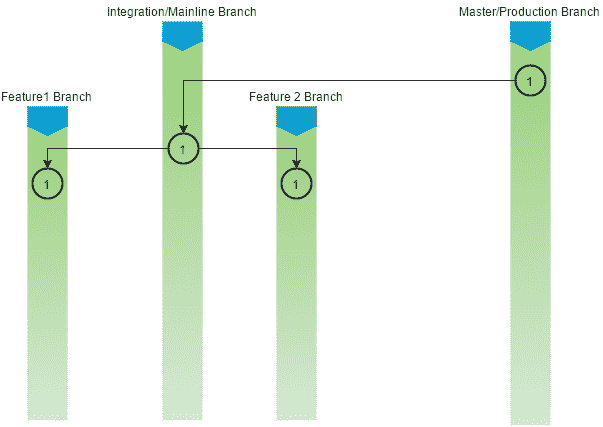

分支策略

在功能分支或集成分支上的提交（合并会创建一个提交）将经过构建、静态代码分析和集成测试阶段。如果代码成功通过这些阶段，结果包将被上传到 Artifactory（二进制存储库）。

# CI 流水线

我们现在来到了 CI 设计的核心。我们将在 Jenkins 中创建一个多分支流水线，其中将包含以下阶段：

1.  在推送事件（CI 流水线的初始化）上从**版本控制系统**（**VCS**）获取代码。

1.  构建和单元测试代码，并在 Jenkins 上发布单元测试报告。

1.  对代码进行静态代码分析，并将结果上传到 SonarQube。如果错误数量超过质量门限的定义，则流水线失败。

1.  在 Jenkins 上执行集成测试并发布单元测试报告。

1.  将构建的工件与一些有意义的属性一起上传到 Artifactory。

前一 CI 流水线的目的是自动化持续构建、测试（单元测试和集成测试）、进行静态代码分析以及上传构建的工件到二进制存储库的过程。每个步骤的失败/成功都有报告。让我们详细讨论这些流水线及其组成部分。

# CI 的工具集

我们正在实现 CI 的示例项目是一个简单的 Maven 项目。在这一章中，我们将看到 Jenkins 与许多其他工具密切合作。以下表格包含了我们将要看到的一切所涉及的工具和技术的列表：

| **技术** | **特点** |
| --- | --- |
| Java | 用于编码的主要编程语言 |
| Maven | 构建工具 |
| JUnit | 单元测试和集成测试工具 |
| Jenkins | 持续集成工具 |
| GitHub | 版本控制系统 |
| SonarQube | 静态代码分析工具 |
| Artifactory | 二进制存储库管理器 |

# 创建 CI 流水线

在本节中，我们将学习如何创建上一节中讨论的 CI 流水线。我们将执行以下步骤：

+   我们将在 GitHub 上创建一个源代码存储库

+   我们将创建一个 Jenkinsfile 来描述我们构建、单元测试、执行静态代码分析、集成测试和发布构建工件到 Artifactory 的方式

+   我们将利用 Docker 生成构建代理来运行我们的 CI 流水线

+   我们将在 Jenkins 中创建一个多分支流水线

非常重要的是，您已经配置了来自第三章的 *Jenkins 从 GitHub 配置 Webhook* 部分。

# 在 GitHub 上创建一个新的存储库

让我们在 GitHub 上创建一个新的存储库。确保您的机器上安装了 Git，以执行以下步骤：

1.  登录到您的 GitHub 帐户。

1.  在本章中，我们将使用来自 [`github.com/nikhilpathania/hello-world-greeting.git`](https://github.com/nikhilpathania/hello-world-greeting.git) 的源代码作为示例。

1.  尝试从上一个链接中提到的存储库中分叉。要做到这一点，只需从您的互联网浏览器访问存储库，然后点击 **Fork** 按钮，如下截图所示：

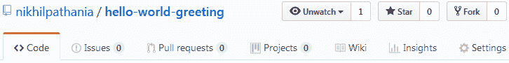

分叉一个 GitHub 项目

1.  完成后，仓库的副本将会出现在您的 GitHub 账户下。

# 使用 SonarQube 用于 Maven 的扫描器。

理想情况下，我们需要 SonarQube 扫描器对项目进行静态代码分析。但是，我们将改为使用 Maven 的 SonarQube 扫描器实用程序，因为我们在当前章节中使用的示例源代码是一个 Maven 项目。

为此，在您的 `.pom` 文件中添加以下代码：

```
<properties>
    <project.build.sourceEncoding>UTF-8</project.build.sourceEncoding>
    <sonar.language>java</sonar.language>
</properties>
```

如果您已经 fork 了以下仓库，那么您不需要执行上一步：

[`github.com/nikhilpathania/hello-world-greeting.git`](https://github.com/nikhilpathania/hello-world-greeting.git)。

# 为 CI 编写 Jenkinsfile。

在接下来的章节中，我们将学习如何为我们的持续集成编写流水线代码。

# 生成一个 Docker 容器 - 构建代理。

首先，让我们创建流水线代码来创建一个 Docker 容器（Jenkins 从机），这将作为我们的构建代理。

如果你还记得，在*添加 Jenkins 从机 - Docker 容器*章节中来自第五章的 *分布式构建*，我们学习了如何创建一个用于创建 Docker 容器（Jenkins 从机）的 Docker 镜像(`maven-build-slave-0.1`)。我们将在此处使用相同的 Docker 镜像来生成 Jenkins 从机代理用于我们的 CI 流水线。

在我们的 Jenkinsfile 中，为了生成一个 Docker 容器（Jenkins 从机），我们需要编写一个代码块，标签为 `docker`：

```
node('docker') {
}
```

`docker` 是 `maven-build-slave-0.1` Docker 模板的标签。

我们希望在`docker`节点上执行以下任务：

+   执行构建。

+   执行单元测试并发布单元测试报告。

+   执行静态代码分析并将结果上传到 SonarQube。

+   执行集成测试并发布集成测试报告。

+   将产物发布到 Artifactory。

所有前面的任务都是我们 CI 流水线的各个阶段。让我们为每一个编写流水线代码。

# 从 VCS 中下载最新的源代码。

我们希望我们的 Jenkins 流水线下载推送到 GitHub 仓库主分支的最新更改：

```
scm checkout
```

将上一步包装在一个名为 `轮询` 的阶段中：

```
stage('Poll') {
    scm checkout
}
```

# 执行构建和单元测试的流水线代码。

我们在当前章节中使用的示例项目是一个 Maven 项目。因此，用于构建的流水线代码是一个简单的 shell 脚本，运行 `mvn clean` 命令：

```
sh 'mvn clean verify -DskipITs=true';
junit '**/target/surefire-reports/TEST-*.xml'
archive 'target/*.jar'
```

其中 `-DskipITs=true` 是跳过集成测试并仅执行构建和单元测试的选项。

命令 `junit '**/target/surefire-reports/TEST-*.xml'` 让 Jenkins 能够在 Jenkins 流水线页面上发布 JUnit 单元测试报告。`**/target/surefire-reports/TEST-*.xml` 是生成单元测试报告的目录位置。

您的 Maven `.pom` 文件应该包含`maven-surefire-plugin`和`maven-failsafe-plugin`以使上一个命令工作。

您还需要 Jenkins JUnit 插件（默认安装）。

将上一步包装在一个名为 `构建 & 单元测试` 的阶段中：

```
stage('Build & Unit test'){
    sh 'mvn clean verify -DskipITs=true';
    junit '**/target/surefire-reports/TEST-*.xml'
    archive 'target/*.jar'
}
```

# 执行静态代码分析的流水线代码

执行静态代码分析的流水线代码是一个简单的 shell 脚本，将运行 Maven 命令，如下所示的命令块。这是通过 Maven 的 SonarQube 扫描器实用程序实现的。记住我们在 *使用 SonarQube scanner for Maven* 部分看到的配置：

```
sh 'mvn clean verify sonar:sonar -Dsonar.projectName=example-project
-Dsonar.projectKey=example-project -Dsonar.projectVersion=$BUILD_NUMBER';
```

`-Dsonar.projectName=example-project` 选项是传递 SonarQube 项目名称的选项。通过这种方式，我们所有的结果都将显示在我们在上一章中创建的 `projectName=example-project` 下。

类似地，`-Dsonar.projectKey=example-project` 选项允许 Maven 的 SonarQube 扫描器确认与 SonarQube 的 `projectKey=example-project`。

`-Dsonar.projectVersion=$BUILD_NUMBER` 选项允许我们将 Jenkins 构建号与我们执行和上传到 SonarQube 的每个分析关联起来。`$BUILD_NUMBER` 是 Jenkins 的构建号环境变量。

将前一步骤包装在名为 `Static Code Analysis` 的阶段中：

```
stage('Static Code Analysis'){
    sh 'mvn clean verify sonar:sonar -Dsonar.projectName=example-project
    -Dsonar.projectKey=example-project -Dsonar.projectVersion=$BUILD_NUMBER';}
```

# 执行集成测试的流水线代码

执行集成测试的流水线代码是一个 shell 脚本，将运行 Maven 命令，如下所示的命令块：

```
sh 'mvn clean verify -Dsurefire.skip=true';
junit '**/target/failsafe-reports/TEST-*.xml'
archive 'target/*.jar'
```

其中 `-Dsurefire.skip=true` 是跳过单元测试仅执行集成测试的选项。

`junit '**/target/failsafe-reports/TEST-*.xml'` 命令使 Jenkins 能够在 Jenkins 流水线页面上发布 JUnit 单元测试报告。`**/target/failsafe-reports/TEST-*.xml` 是生成集成测试报告的目录位置。

将前一步骤包装在名为 `Integration Test` 的阶段中：

```
stage ('Integration Test'){
    sh 'mvn clean verify -Dsurefire.skip=true';
    junit '**/target/failsafe-reports/TEST-*.xml'
    archive 'target/*.jar'
}
```

要使上述命令生效，你的 Maven `.pom` 文件应包含 `maven-surefire-plugin` 和 `maven-failsafe-plugin`。

您还需要 Jenkins JUnit 插件（默认安装）。

# 执行将构建工件发布到 Artifactory 的流水线代码

要将构建工件上传到 Artifactory，我们将使用 *File Specs*。下面是 File Specs 代码的示例：

```
"files": [
    {
      "pattern": "[Mandatory]",
      "target": "[Mandatory]",
      "props": "[Optional]",
      "recursive": "[Optional, Default: 'true']",
      "flat" : "[Optional, Default: 'true']",
      "regexp": "[Optional, Default: 'false']"
    }
  ]
```

以下表格说明了前述代码的参数：

| **参数** | **条件** | **描述** |
| --- | --- | --- |
| `pattern` | `[必填]` | 指定应上传到 Artifactory 的本地文件系统路径。您可以通过使用通配符或正则表达式来指定多个工件，正则表达式由 `regexp` 属性指定。如果使用 `regexp`，则需要使用反斜杠 `\` 对表达式中使用的任何保留字符（例如 `.`, `?` 等）进行转义。自 Jenkins Artifactory 插件版本 2.9.0 和 TeamCity Artifactory 插件版本 2.3.1 起，模式格式已简化，并对包括 Windows 在内的所有操作系统使用相同的文件分隔符 `/`。 |
| `target` | `[必填]` | 以以下格式指定 Artifactory 中的目标路径：`[repository_name]/[repository_path]`。如果模式以斜杠结尾，例如，`repo-name/a/b/`，那么`b`被视为 Artifactory 中的一个文件夹，并且文件将上传到其中。在`repo-name/a/b`的情况下，上传的文件将在 Artifactory 中重命名为`b`。为了灵活地指定上传路径，您可以包含形式为`{1}, {2}, {3}...`的占位符，它们被对应的括号中的源路径中的令牌所替换。有关更多详细信息，请参考 *使用占位符* 文章（[`www.jfrog.com/confluence/display/RTF/Using+File+Specs#UsingFileSpecs-UsingPlaceholders`](https://www.jfrog.com/confluence/display/RTF/Using+File+Specs#UsingFileSpecs-UsingPlaceholders))**。** |
| `props` | `[可选]` | 以分号(`;`)分隔的`key=value`对的列表，作为附加到上传属性的属性。如果任何键可以接受多个值，则每个值用逗号(`,`)分隔。例如，`key1=value1;key2=value21,value22;key3=value3`。 |
| `flat` | `[默认: true]` | 如果为`true`，构件将上传到指定的精确目标路径，并且源文件系统中的层次结构将被忽略。如果为`false`，构件将上传到目标路径，同时保留其文件系统层次结构。 |
| `recursive` | `[默认: true]` | 如果为`true`，则还会从源目录的子目录中收集构建产物进行上传。如果为`false`，则仅上传源目录中明确定义的构建产物。 |
| `regexp` | `[默认: false]` | 如果为`true`，命令将按照正则表达式解释描述要上传的构件的本地文件系统路径的模式属性。如果为`false`，命令将将模式属性解释为通配符表达式。 |

下面是我们在流水线中将使用的文件规范代码：

```
def server = Artifactory.server 'Default Artifactory Server'
def uploadSpec = """{
  "files": [
    {
       "pattern": "target/hello-0.0.1.war",
       "target": "example-project/${BUILD_NUMBER}/",
       "props": "Integration-Tested=Yes;Performance-Tested=No"
    }
  ]
}"""
server.upload(uploadSpec)
```

下表列出了上述代码中的参数：

| **参数** | **描述** |
| --- | --- |
| `def server = Artifactory.server 'Default Artifactory Server'` | 这行代码告诉 Jenkins 要使用 Jenkins 中配置的现有 Artifactory 服务器。在我们的例子中，它是默认的 Artifactory 服务器。 |
| `Default Artifactory Server` | 这是 Jenkins 内配置的 Artifactory 服务器的名称。 |
| `"pattern": "target/hello-0.0.1.war",` | 这行代码会查找目录`target`中名为`hello-0.0.1.war`的文件，而`target`目录又位于 Jenkins 工作目录内部。 |
| `"target": "example-project/${BUILD_NUMBER}/",` | 这行代码尝试将构建产物上传到名为`helloworld-greeting-project`的 Artifactory 仓库。它将构建产物放置在 Artifactory 仓库内的一个以构建编号命名的文件夹内。 |
| `${BUILD_NUMBER}` | 构建编号的 Jenkins 环境变量。 |
| `"props": "Integration-Tested=Yes;Performance-Tested=No"` | 此代码创建两个键值对并将它们分配给上载的工件。这些键值对可用作 Artifactory 中代码推广的标签。 |

将上一步放入名为`Publish`的阶段中：

```
stage ('Publish'){
    def server = Artifactory.server 'Default Artifactory Server'
    def uploadSpec = """{
      "files": [
        {
          "pattern": "target/hello-0.0.1.war",
          "target": "helloworld-greeting-project/${BUILD_NUMBER}/",
          "props": "Integration-Tested=Yes;Performance-Tested=No"
        }
      ]
    }"""
  server.upload(uploadSpec)
}
```

# 组合的 CI 管道代码

以下是将在 `docker` 节点内运行的完整组合代码：

```
node('docker') {
  stage('Poll') {
    checkout scm
  }
  stage('Build & Unit test'){
    sh 'mvn clean verify -DskipITs=true';
    junit '**/target/surefire-reports/TEST-*.xml'
    archive 'target/*.jar'
  }
  stage('Static Code Analysis'){
    sh 'mvn clean verify sonar:sonar -Dsonar.projectName=example-project
    -Dsonar.projectKey=example-project -Dsonar.projectVersion=$BUILD_NUMBER';
  }
  stage ('Integration Test'){
    sh 'mvn clean verify -Dsurefire.skip=true';
    junit '**/target/failsafe-reports/TEST-*.xml'
    archive 'target/*.jar'
  }
  stage ('Publish'){
    def server = Artifactory.server 'Default Artifactory Server'
    def uploadSpec = """{
      "files": [
        {
          "pattern": "target/hello-0.0.1.war",
          "target": "example-project/${BUILD_NUMBER}/",
          "props": "Integration-Tested=Yes;Performance-Tested=No"
        }
      ]
    }"""
    server.upload(uploadSpec)
  }
}
```

# 使用 Jenkinsfile

Jenkins 多分支管道使用 Jenkinsfile。在本节中，我们将学习如何创建 Jenkinsfile。我们将使用上一节中创建的示例管道脚本来创建我们的 Jenkinsfile。请按照以下步骤操作：

1.  登录到您的 GitHub 帐户。

1.  转到分叉的存储库*.*

1.  进入存储库页面后，点击**创建新文件**按钮以创建一个新的空文件，这将是我们的 Jenkinsfile，如下截图所示：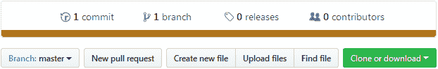

在 GitHub 上创建一个新文件

1.  在空文本框中填写`Jenkinsfile`作为您的新文件名称，如下截图所示：

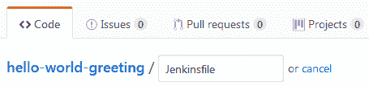

在 GitHub 上为您的新文件命名

1.  在您的 Jenkinsfile 中添加以下代码：

```
node('docker') {
  stage('Poll') {
    checkout scm
  }
  stage('Build & Unit test'){
    sh 'mvn clean verify -DskipITs=true';
    junit '**/target/surefire-reports/TEST-*.xml'
    archive 'target/*.jar'
  }
  stage('Static Code Analysis'){
    sh 'mvn clean verify sonar:sonar
    -Dsonar.projectName=example-project
    -Dsonar.projectKey=example-project
    -Dsonar.projectVersion=$BUILD_NUMBER';
  }
  stage ('Integration Test'){
    sh 'mvn clean verify -Dsurefire.skip=true';
    junit '**/target/failsafe-reports/TEST-*.xml'
    archive 'target/*.jar'
  }
  stage ('Publish'){
    def server = Artifactory.server 'Default Artifactory Server'
    def uploadSpec = """{
      "files": [
        {
          "pattern": "target/hello-0.0.1.war",
          "target": "example-project/${BUILD_NUMBER}/",
          "props": "Integration-Tested=Yes;Performance-Tested=No"
        }
      ]
    }"""
    server.upload(uploadSpec)
  }
}
```

1.  完成后，通过添加有意义的评论提交新文件，如下截图所示：

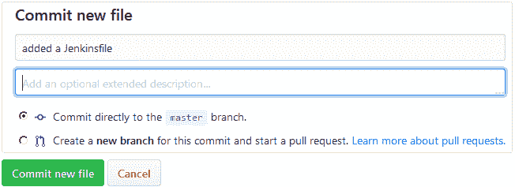

在 GitHub 上提交您的新文件

# 在 Jenkins 中创建一个多分支管道

按以下步骤创建一个新的 Jenkins 管道作业：

1.  从 Jenkins 仪表板中，点击**新建项目**链接。

1.  在结果页面上，您将看到各种类型的 Jenkins 作业供您选择。

1.  选择**多分支** **管道**，并使用**输入项目名称**字段为您的管道命名。

1.  完成后，点击页面底部的确定按钮。

1.  滚动到 **分支来源** 部分。这是我们配置要使用的 GitHub 存储库的地方。

1.  点击**添加源**按钮，选择 GitHub。您将看到一个配置字段的列表。我们逐一看一下它们（见下面的截图）。

1.  对于凭据字段，选择我们在上一节中创建的 GitHub 帐户凭据（种类：带有用户名和密码的用户名）。

1.  在所有者字段下，指定您的 GitHub 组织或 GitHub 用户帐户的名称。

1.  一旦这样做，存储库字段将列出您 GitHub 帐户上的所有存储库。

1.  在存储库字段下选择 hello-world-greeting

1.  将其余选项保留为默认值：

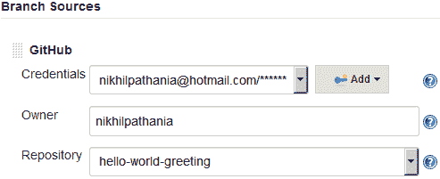

配置多分支管道

1.  滚动到底部的构建配置部分。确保 Mode 字段设置为按 Jenkinsfile，Script Path 字段设置为`Jenkinsfile`：

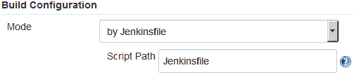

构建配置

1.  滚动到底部，点击**保存**按钮。

# 重新注册 Webhooks

现在，让我们重新注册所有 Jenkins 流水线的 Webhooks。为此，请执行以下步骤：

1.  在 Jenkins 仪表板上，点击**管理 Jenkins** | **配置系统**。

1.  在 Jenkins 配置页面上，向下滚动到 GitHub 部分。

1.  在 GitHub 部分下，点击**高级…**按钮（您将看到两个按钮；点击第二个）。

1.  这将显示更多字段和选项。点击**重新注册所有作业的 hooks**按钮。

1.  上一步将为您在 GitHub 帐户内相应存储库上的我们的多分支流水线创建新的 Webhooks。请按照以下步骤在 GitHub 上查看 Webhooks：

    1.  登录您的 GitHub 帐户。

    1.  转到您的 GitHub 存储库，在我们的案例中是 `hello-world-greeting`。

    1.  点击存储库设置按钮，如下图所示：

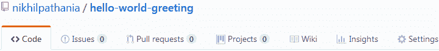

存储库设置

1.  1.  在存储库设置页面上，点击左侧菜单中的 Webhooks。您应该看到您的 Jenkins 服务器的 Webhooks，如下图所示：

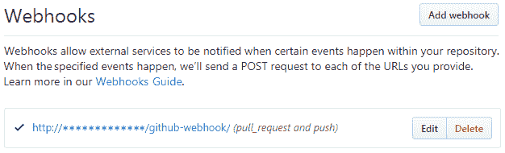

GitHub 存储库上的 Webhooks

# 正在进行的持续集成

按照给定的步骤操作：

1.  从 Jenkins 仪表板上，点击您的多分支流水线。

1.  在 Jenkins 多分支流水线页面上，从左侧菜单中，点击**立即扫描存储库**链接。这将扫描分支和 Jenkinsfiles，并立即为每个具有 Jenkinsfile 的分支运行一个流水线，如下图所示：

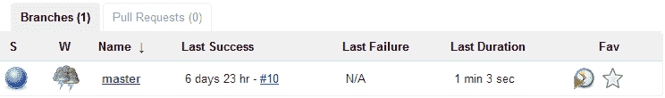

主分支的流水线

1.  在多分支流水线页面上，从左侧菜单中，点击**扫描存储库日志**。您将看到类似以下输出。注意高亮代码。您可以看到主分支符合条件，因为它有一个 Jenkinsfile，并为其安排了一个流水线。由于测试分支上没有 Jenkinsfile，因此没有为其安排流水线：

```
Started by user nikhil pathania
[Sun Nov 05 22:37:19 UTC 2017] Starting branch indexing...
22:37:19 Connecting to https://api.github.com using nikhilpathania@hotmail.com/****** (credentials to access GitHub account)
22:37:20 Connecting to https://api.github.com using nikhilpathania@hotmail.com/****** (credentials to access GitHub account)
Examining nikhilpathania/hello-world-greeting Checking branches...  
  Getting remote branches...    
    Checking branch master  
  Getting remote pull requests... ‘Jenkinsfile’ found    
    Met criteria
Changes detected: master (c6837c19c3906b0f056a87b376ca9afdff1b4411 1e5834a140d572f4d6f9665caac94828b779e2cd)Scheduled build for branch: master  
1 branches were processed  
Checking pull-requests...  
0 pull requests were processed
Finished examining nikhilpathania/hello-world-greeting
[Sun Nov 05 22:37:21 UTC 2017] Finished branch indexing. Indexing took 2.1 sec
Finished: SUCCESS
```

您不需要总是扫描存储库。GitHub Webhooks 已配置为在您的 GitHub 存储库上推送或新建分支时自动触发流水线。请记住，相应分支上还应该存在 Jenkinsfile，以告诉 Jenkins 在发现存储库中的更改时应该执行什么操作。

1.  从您的 Jenkins 多分支流水线页面 (`<Jenkins URL>/job/<Jenkins Multi-branch pipeline name>/`)，点击相应的分支流水线（见下图）。

1.  在结果页面上，您将看到主分支流水线的阶段视图：

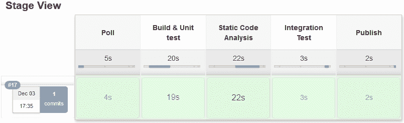

流水线阶段视图

1.  要查看单元测试和集成测试结果，请点击页面下方**最新测试结果**链接，该链接在与阶段视图相同的页面上，如下截图所示：

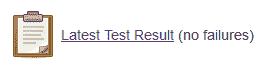

1.  在结果页面上，你将看到关于单元测试和集成测试执行的详细报告，如下截图所示：

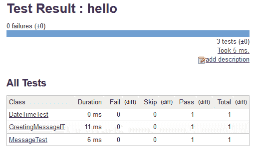

使用 JUnit 插件的测试报告

1.  你可以点击各个测试以获取更多细节。

1.  在同一页面上，在左侧菜单中有一个名为“History”的链接，它提供了一段时间内与测试执行相关的指标数量的历史图表：

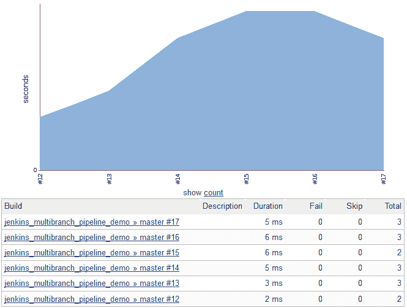

测试执行历史

# 在 SonarQube 中查看静态代码分析

让我们来看看作为我们 CI 流水线一部分执行的静态代码分析报告。按照以下步骤操作：

1.  使用你喜欢的浏览器打开 SonarQube 链接。你应该看到类似以下截图的内容：

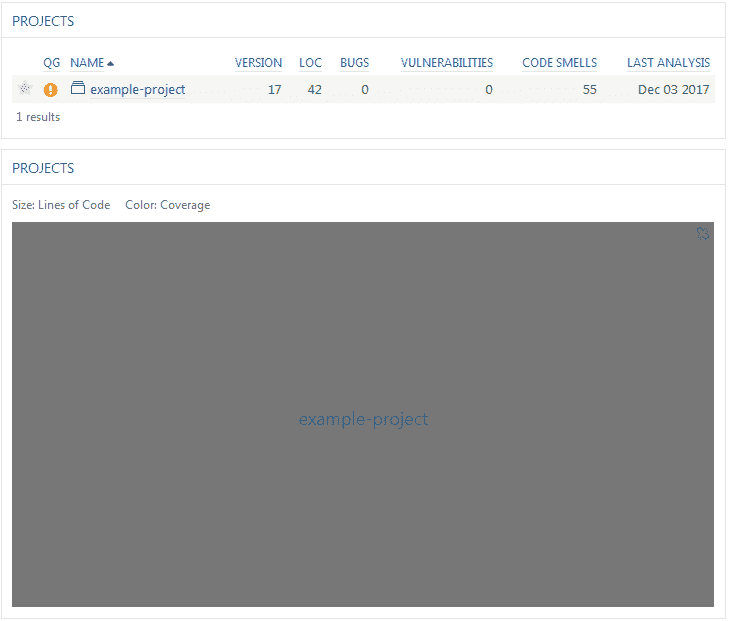

SonarQube 主页

1.  从 SonarQube 仪表板，使用菜单选项，点击登录链接。

1.  输入你的 SonarQube 凭据。

1.  在结果页面上，在“PROJECTS”小部件下，点击`example-project`项目。

1.  你将看到项目的静态代码分析概览（参见以下截图）：

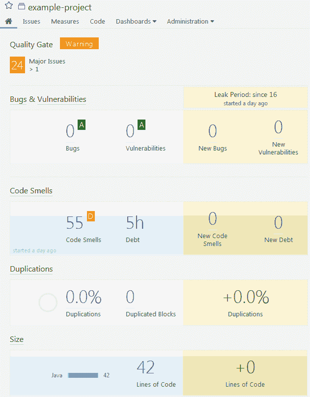

静态代码分析概述

1.  点击“Measures | Coverage”。在结果页面上，你将得到你的代码覆盖率和单元测试结果报告的良好概览，如下截图所示：

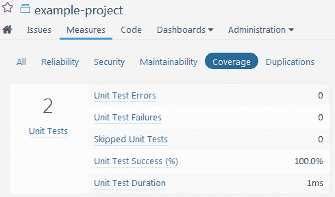

代码覆盖率报告和单元测试报告

# 直接从 Jenkins 访问 SonarQube 分析

你可以直接从 CI 流水线中访问你的静态代码分析报告。按照以下步骤操作：

1.  从你的 Jenkins 仪表板，点击你的多分支流水线。接下来，点击相应的分支流水线（我们示例中的 master）。

1.  一旦你进入你的分支流水线，将鼠标悬停在“Static Code Analysis”阶段上，然后点击“Logs”。参见以下截图：

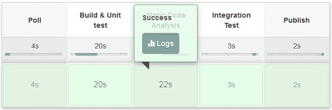

获取单个阶段日志

1.  在名为“Stage Logs（静态代码分析）”的弹出窗口中向下滚动到底部。你应该看到一个链接，指向 SonarQube 分析页面。参见以下截图：

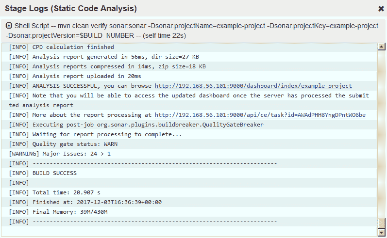

从 Jenkins 日志中的 SonarQube 分析链接

1.  点击前述截图中显示的链接将直接带您到相应项目的 SonarQube 仪表板。

# 在 Artifactory 中查看构件

让我们看看上传到 Artifactory 后我们的构件是什么样子。按照以下步骤操作：

1.  从你喜爱的浏览器访问 Artifactory 链接。从 Artifactory 仪表板，使用登录链接登录。

1.  在左侧菜单中点击“Artifacts”选项卡。你应该在“Artifact Repository Browser”下看到你的仓库，如下截图所示：

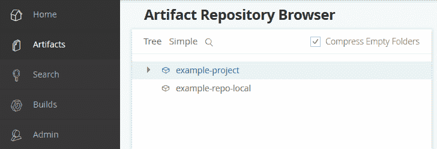

构件库浏览器

1.  展开仓库，您应该看到构建的构件和属性，如下截图所示：

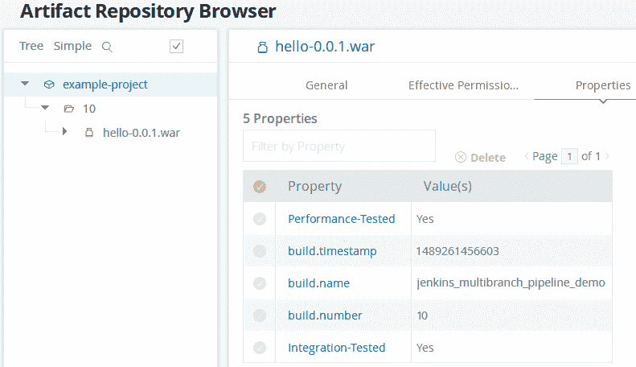

CI 管道生成的构件

# 当质量门标准不符合时构建失败

在以下部分，我们将微调在上一章中创建的 SonarQube 质量门，使其应该使 Jenkins CI 管道失败。按照以下步骤模拟此场景：

1.  登录到您的 SonarQube 服务器，然后从菜单栏中点击质量门。

1.  从左侧菜单中，点击上一章中创建的质量门：`example-quality-gate`。

1.  现在，将 ERROR 字段的值从 `50` 改为 `3`。

1.  点击更新。最后，一切都应该如下截图所示：

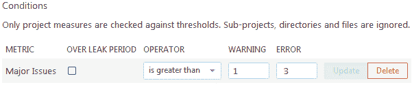

更新 SonarQube 质量门

1.  接下来，在 GitHub 仓库上进行一些更改，以触发 Jenkins 中的 CI 管道。

1.  登录到 Jenkins，并导航到您的 Jenkins 多分支 CI 管道。您应该看到类似以下截图的内容：

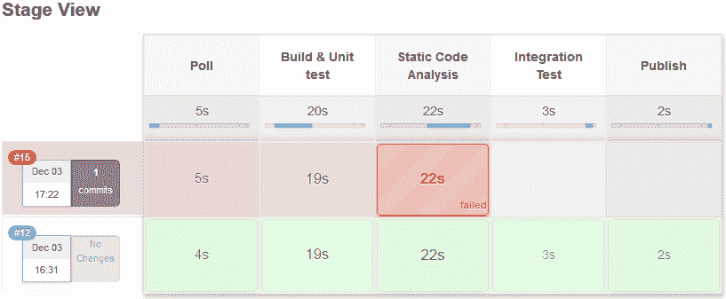

失败的 CI 管道

1.  点击相应管道的失败阶段以获取其日志。在弹出窗口中，滚动到底部。您应该看到管道失败的原因，如下截图所示（箭头）：

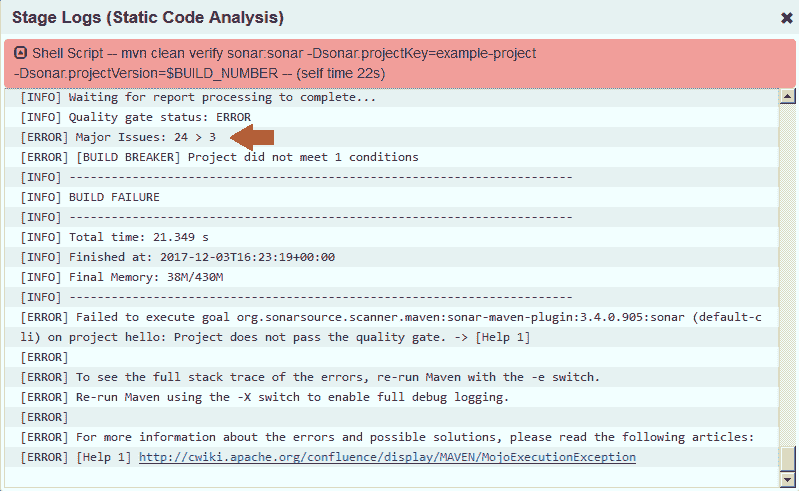

带有质量门状态的 SonarQube 日志

# 摘要

在这一章中，我们学习了如何创建一个多分支 CI 管道，通过推送事件触发，执行构建、静态代码分析、集成测试，并将成功测试的二进制构件上传到 Artifactory。最后，我们从开发者的角度看到了整个 CI 管道的运行。

书中讨论的 CI 设计可以修改以适应任何类型项目的需求；用户只需确定可以与 Jenkins 一起使用的正确工具和配置。

在下一章中，我们将扩展我们的 CI 管道，在 QA 领域做更多事情。
