# 第八章：使用 Jenkins 进行持续交付

我们将从一个覆盖以下领域的持续交付设计开始本章：

+   分支策略

+   持续交付工具列表

+   一个 Jenkins 流水线结构

**持续交付**（**CD**）设计将作为一个蓝图，指导读者回答 CD 的如何、为什么和在哪里实施的问题。设计将涵盖实施端到端 CD 流水线所涉及的所有必要步骤。

在本章讨论的 CD 设计应被视为实施 CD 的模板，而不是一个完整和最终的模型。所有使用的工具都可以修改和替换以适应目的。

# Jenkins CD 设计

在这一节中，我们将介绍一个非常通用的 CD 设计。

# 分支策略

在第七章 *Jenkins 使用持续集成* 中，我们遵循了以下的分支策略：

+   主分支

+   集成分支

+   功能分支

这个分支策略是 *GitFlow 工作流* 分支模型的一个精简版。

虽然 CI 可以在集成/开发分支或功能分支上执行，但 CD 只在集成和发布分支上执行。

# 发布分支

一些团队采用有发布分支的策略。发布分支是在成功测试的代码从主分支中发布到生产环境（分发给客户）后创建的。创建发布分支的目的是支持对相应发布的错误修复：

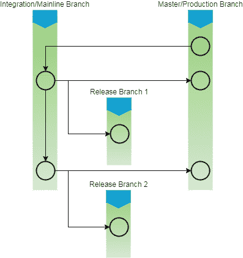

分支策略

# CD 流水线

我们现在来到了 CD 设计的核心。我们不会创建一个新的流水线；相反，我们将在 Jenkins 中基于现有的 CI 多分支流水线上构建。新的 CD 流水线将包括以下阶段：

1.  在推送事件（CI 流水线的初始化）上从**版本控制系统**（**VCS**）获取代码。

1.  构建和单元测试代码；在 Jenkins 上发布单元测试报告。

1.  对代码进行静态代码分析并将结果上传到 SonarQube。如果错误数量超过质量门限定义的阈值，则流水线失败。

1.  执行集成测试；在 Jenkins 上发布单元测试报告。

1.  将构建好的产物与一些有意义的属性一起上传到 Artifactory。

1.  将二进制文件部署到测试环境。

1.  执行测试（质量分析）。

1.  推广解决方案到 Artifactory 并将其标记为发布候选版本。

上述 CD 流水线的目的是自动化持续部署、测试（QA）并推动构建产物到二进制存储库的过程。每个步骤都会报告失败/成功。让我们详细讨论这些流水线及其组成部分。

在现实世界中，QA 可能包含多个测试阶段，例如性能测试、用户验收测试、组件测试等。为了简化问题，我们将在示例 CD 流水线中仅执行性能测试。

# CD 工具集

我们正在实施 CI 的示例项目是一个简单的 Maven 项目。因此，我们将看到 Jenkins 与许多其他工具密切配合。

以下表格包含我们将要看到的所有工具和技术的列表：

| **工具/技术** | **描述** |
| --- | --- |
| Java | 主要用于编码的编程语言 |
| Maven | 构建工具 |
| JUnit | 单元测试和集成测试工具 |
| Jenkins | CI 工具 |
| GitHub | 版本控制系统 |
| SonarQube | 静态代码分析工具 |
| Artifactory | 二进制仓库管理器 |
| Apache Tomcat | 用于托管解决方案的应用服务器 |
| Apache JMeter | 性能测试工具 |

# 创建 Docker 镜像 - 性能测试

在本节中，我们将为我们的**性能测试**（**PT**）创建一个 Docker 镜像。这个 Docker 镜像将被 Jenkins 用来创建 Docker 容器，在其中我们将部署我们构建的解决方案并执行我们的性能测试。按照以下步骤进行：

1.  登录到您的 Docker 服务器。执行以下命令以检查可用的 Docker 镜像：

```
 sudo docker images
```

1.  从以下截图中，您可以看到我已经在我的 Docker 服务器上有三个 Docker 镜像（`ubuntu`、`hello-world` 和 `maven-build-slave-0.1`）：

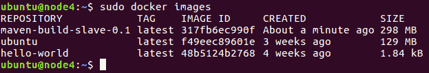

列出 Docker 镜像

1.  我们将使用 Ubuntu Docker 镜像构建一个新的 Docker 镜像来运行我们的 PT。

1.  让我们升级我们的 Ubuntu Docker 镜像，添加我们运行测试所需的所有必要应用程序，如下所示：

    +   Java JDK（最新版）

    +   Apache Tomcat（8.5）

    +   Apache JMeter

    +   用于登录 Docker 容器的用户账号

    +   OpenSSH 守护程序（接受 SSH 连接）

    +   Curl

1.  执行以下命令以使用 Ubuntu Docker 镜像运行 Docker 容器。这将创建一个容器并打开其 bash shell：

```
sudo docker run -i -t ubuntu /bin/bash
```

1.  现在，安装所有所需的应用程序，就像您在任何普通的 Ubuntu 机器上做的一样。让我们从创建一个`jenkins`用户开始：

    1.  执行以下命令，并按照以下所示的用户创建步骤进行：

```
adduser jenkins
```

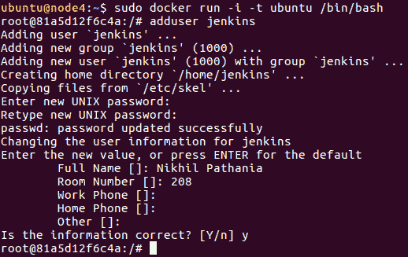

创建用户

1.  1.  使用切换用户命令检查新用户：

```
su jenkins
```

1.  输入`exit`切换回`root`用户。

1.  接下来，我们将安装 SSH 服务器。按照以下命令的顺序执行：

```
apt-get update 
apt-get install openssh-server 
mkdir /var/run/sshd 
```

1.  按照以下步骤安装 Java：

    1.  更新软件包索引：

```
apt-get update
```

1.  1.  接下来，安装 Java。执行以下命令将安装**Java 运行时环境**（**JRE**）：

```
apt-get install default-jre
```

1.  安装 Tomcat 8.5 的最佳方法是下载最新的二进制版本，然后手动配置它：

    1.  移动到 `/tmp` 目录，并下载 Apache Tomcat 8.5，使用以下命令：

```
cd /tmp 
wget https://archive.apache.org/dist/tomcat/tomcat-8/v8.5.11/bin/apache-tomcat-8.5.11.tar.gz
```

1.  1.  我们将在 `home/jenkins/` 目录中安装 Tomcat。为此，请首先切换到 `jenkins` 用户。在 `/home/jenkins/` 中创建一个 `tomcat` 目录：

```
su jenkins 
mkdir /home/jenkins/tomcat
```

1.  1.  然后将存档解压到其中：

```
tar xzvf apache-tomcat-8*tar.gz \
-C /home/jenkins/tomcat --strip-components=1
```

1.  输入 `exit` 切换回 `root` 用户。

1.  Apache JMeter 是执行性能测试的好工具。它是免费和开源的。它可以在 GUI 和命令行模式下运行，这使其成为自动化性能测试的合适选择：

    1.  切换到 `/tmp` 目录：

```
cd /tmp
```

1.  1.  从 [`jmeter.apache.org/download_jmeter.cgi`](http://jmeter.apache.org/download_jmeter.cgi) 下载 `apache-jmeter-3.1.tgz`，或者是最新的稳定版本：

```
wget https://archive.apache.org/dist/jmeter/binaries/apache-jmeter-3.1.tgz
```

1.  1.  我们将 JMeter 安装在 `opt/jmeter/` 目录中。为此，请在 `/opt` 中创建一个 `jmeter` 目录：

```
mkdir /opt/jmeter
```

1.  1.  然后将存档解压到 `/opt/jmeter/` 目录，并为其分配适当的权限：

```
tar xzvf apache-jmeter-3*.tgz \
-C /opt/jmeter --strip-components=1
 chown -R jenkins:jenkins /opt/jmeter/
 chmod -R 777 /opt/jmeter/
```

1.  按照给定步骤安装 `curl`：

```
apt-get install curl
```

1.  按照给定的步骤保存我们对 Docker 镜像所做的所有更改：

    1.  输入 `exit` 退出容器。

    1.  我们需要保存（`commit`）我们对 Docker 容器所做的所有更改。

    1.  通过列出所有非活动容器，获取我们最近使用的容器的 `CONTAINER ID`，如下屏幕截图中在命令之后所示：

```
sudo docker ps -a
```

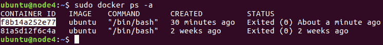

列出非活动容器

1.  1.  注意 `CONTAINER ID`，并执行以下命令保存（`commit`）我们对容器所做的更改：

```
sudo docker commit <CONTAINER ID> <new name for the container>
```

1.  1.  我已将我的容器命名为 `performance-test-agent-0.1`，如下屏幕截图所示：

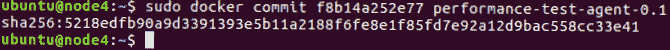

Docker commit 命令

1.  1.  提交更改后，将创建一个新的 Docker 镜像。

1.  1.  执行以下 `docker` 命令以列出镜像，如下屏幕截图中在命令之后所示：

```
sudo docker images
```

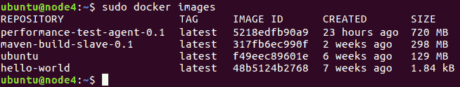

列出 Docker 镜像

1.  1.  您可以看到我们的新 Docker 镜像，名称为 `performance-test-agent-0.1`。我们现在将配置我们的 Jenkins 服务器使用 `performance-test-agent-0.1` Docker 镜像来创建 Jenkins 从节点（构建代理）。

# 在 Jenkins 中添加 Docker 容器凭据

按照给定的步骤在 Jenkins 中添加凭据，以允许其与 Docker 通信：

1.  从 Jenkins 仪表板导航到**凭据** | **系统** | **全局凭据（不受限制）**。

1.  单击左侧菜单上的**添加凭据**链接以创建新的凭据（参见以下屏幕截图）。

1.  选择**类型**为**用户名与密码**。

1.  将**范围**字段保留为其默认值。

1.  在**用户名**字段下为您的 Docker 镜像（按照我们的示例，为 `jenkins`）添加一个用户名。

1.  在**密码**字段下面添加密码。

1.  在**ID**字段下添加一个 ID，并在**描述**字段下添加描述。

1.  完成后，单击**OK**按钮：

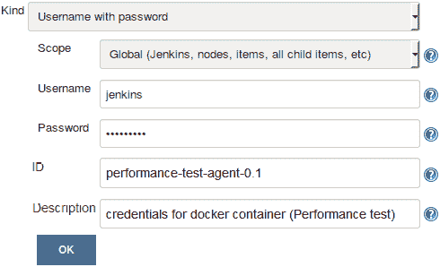

在 Jenkins 内创建凭据

# 更新 Jenkins 内的 Docker 设置

按照给定的步骤更新 Jenkins 内的 Docker 设置：

1.  从 Jenkins 仪表板中，点击**管理 Jenkins** | **配置系统**。

1.  滚动到**云**部分的底部。

1.  在 Cloud 部分下，点击**添加 Docker 模板**按钮，然后选择**Docker 模板**。

1.  你将看到很多要配置的设置（参见下面的截图）。然而，为了保持这个演示简单，让我们坚持重要的设置。

1.  在**Docker 镜像**字段下，输入我们之前创建的 Docker 镜像的名称。在我的情况下，它是`performance-test-agent-0.1`。

1.  在**标签**字段下，添加一个标签。使用此标签，您的 Jenkins 管道将识别 Docker 容器。我添加了`docker_pt`标签。

1.  **启动方法**应为 Docker SSH 计算机启动器。

1.  在**凭据**字段下，选择我们创建的用于访问 Docker 容器的凭据。

1.  确保拉取策略选项设置为永不拉取。

1.  将其余选项保持为默认值。

1.  完成后，点击**应用**，然后点击**保存**：

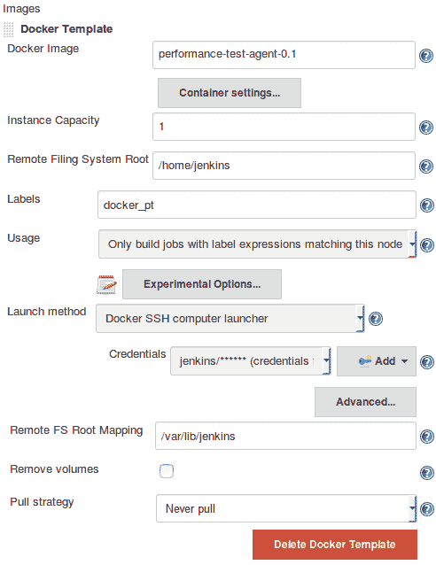

为集成测试创建 Docker 模板

# 使用 JMeter 创建性能测试

在本节中，我们将学习如何使用 JMeter 工具创建一个简单的性能测试。所述步骤应在您的本地机器上执行。以下步骤在具有 Ubuntu 16.04 的机器上执行。

# 安装 Java

按照给定步骤安装 Java：

1.  更新软件包索引：

```
sudo apt-get update
```

1.  接下来，安装 Java。以下命令将安装 JRE：

```
sudo apt-get install default-jre
```

1.  要设置`JAVA_HOME`环境变量，首先获取 Java 安装位置。通过执行以下命令来执行此操作：

```
sudo update-alternatives --config java
```

1.  复制结果路径并更新`/etc/environment`文件中的`JAVA_HOME`变量。

# 安装 Apache JMeter

按照给定步骤安装 Apache JMeter：

1.  进入`/tmp`目录：

```
cd /tmp
```

1.  从[`jmeter.apache.org/download_jmeter.cgi`](http://jmeter.apache.org/download_jmeter.cgi)下载`apache-jmeter-3.1.tgz`，或者是最新的稳定版本：

```
wget https://archive.apache.org/dist/jmeter/binaries/apache-jmeter-3.1.tgz
```

1.  我们将在`/opt`目录下安装 JMeter。为此，在`/opt`内创建一个`jmeter`目录：

```
mkdir /opt/jmeter
```

1.  然后将归档文件解压到其中：

```
tar xzvf apache-jmeter-3*.tgz \
-C /opt/jmeter --strip-components=1
```

# 启动 JMeter

按照给定步骤启动 JMeter：

1.  要启动 JMeter，请移动到 JMeter 安装目录并运行`jmeter.sh`脚本，使用以下命令：

```
cd /opt/jmeter/bin 
./jmeter.sh
```

1.  JMeter GUI 实用程序将在一个新窗口中打开。

# 创建性能测试用例

默认情况下，您将看到一个示例测试计划。我们将通过修改现有模板来创建一个新的测试计划：

1.  将测试计划重命名为`Hello_World_Test_Plan`，如下截图所示：

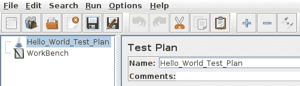

创建测试计划

1.  点击菜单项中的保存按钮或点击*Ctrl* + *S*，将其保存在`examples`文件夹内，如下截图所示：

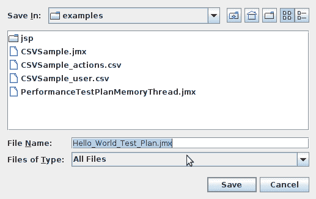

保存测试计划

# 创建一个线程组

按照给定步骤创建一个线程组：

1.  添加一个线程组。要这样做，请右键单击`Hello_World_Test_Plan`，然后选择**添加** | **线程（用户）** | **线程组**：

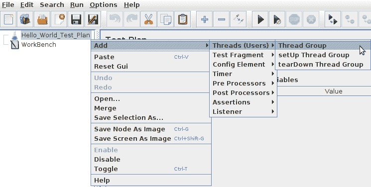

创建一个线程组

1.  在生成的页面中，为你的线程组命名并填写以下选项：

    1.  选择**继续**以进行 **采样器错误后要执行的操作**。

    1.  将**线程数（用户）**添加为`1`。

    1.  将**上升时间（秒）**添加为`1`。

    1.  将**循环次数**添加为`1`：

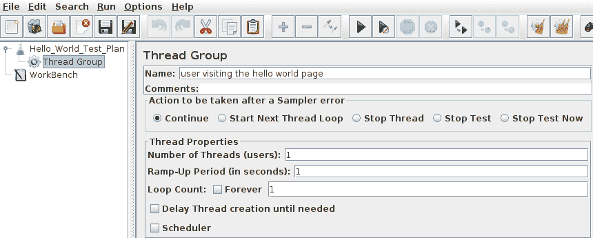

配置一个线程组

# 创建一个采样器

按照给定步骤创建一个采样器：

1.  右键单击`Hello_World_Test_Plan`，然后选择**添加** | **采样器** | **HTTP 请求**：

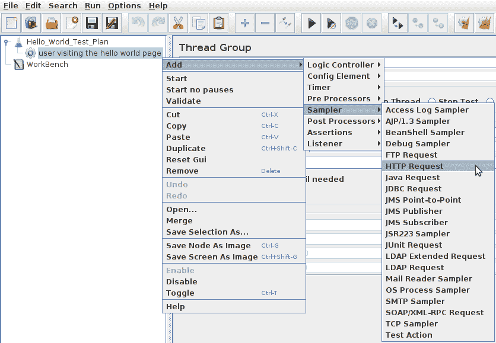

添加一个采样器

1.  适当命名 HTTP 请求并填写以下选项：

    1.  将**服务器名称或 IP**添加为`<您的测试服务器机器的 IP 地址>`。

    1.  添加端口号为`8080`。

    1.  将**路径**添加为`/hello.0.0.1/`：

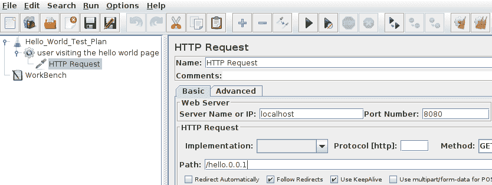

配置采样器

# 添加一个监听器

按照给定步骤添加一个监听器：

1.  右键单击`Hello_World_Test_Plan`，然后选择**添加** | **监听器** | **查看结果树**：

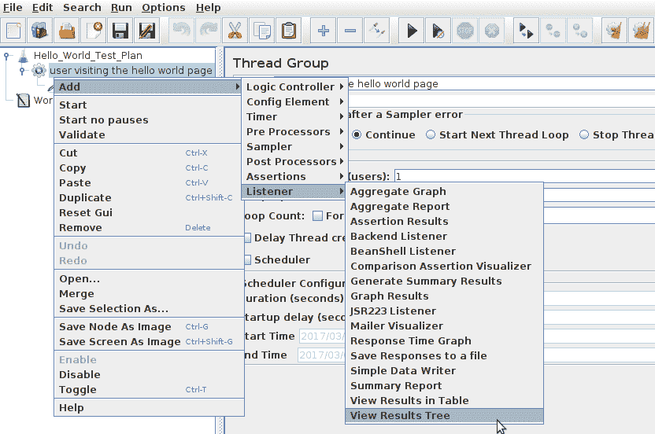

添加一个监听器

1.  什么都不做；将所有字段保持原样。

1.  点击菜单项中的保存按钮或点击*Ctrl* + *S*保存整个配置。

1.  从`/opt/jmeter/bin/examples`*.*复制`.jmx`文件。

1.  在你的 Maven 项目下，创建一个名为`pt`的文件夹，在`src`目录中，并将`.jmx`文件放入其中。

1.  将代码上传到 GitHub。

# **CD 管道**

我们拥有所有必需的工具，Docker 镜像已准备就绪。在本节中，我们将在 Jenkins 中创建一个管道，描述我们的 CD 过程。

# 为 CD 编写 Jenkinsfile

我们将在之前创建的 CI 管道基础上进行。让我们首先重新审视我们的 CI 管道，然后我们将作为 CD 过程的一部分添加一些新的阶段。

# 重新审视 CI 管道的代码

以下是作为 CI 的一部分的完整组合代码：

```
node('docker') {
  stage('Poll') {
    checkout scm
  }
  stage('Build & Unit test'){
    sh 'mvn clean verify -DskipITs=true';
    junit '**/target/surefire-reports/TEST-*.xml'
    archive 'target/*.jar'
  }
  stage('Static Code Analysis'){
    sh 'mvn clean verify sonar:sonar -Dsonar.projectName=example-project
    -Dsonar.projectKey=example-project
    -Dsonar.projectVersion=$BUILD_NUMBER';
  }
  stage ('Integration Test'){
    sh 'mvn clean verify -Dsurefire.skip=true';
    junit '**/target/failsafe-reports/TEST-*.xml'
    archive 'target/*.jar'
  }
  stage ('Publish'){
    def server = Artifactory.server 'Default Artifactory Server'
    def uploadSpec = """{
      "files": [
        {
          "pattern": "target/hello-0.0.1.war",
          "target": "example-project/${BUILD_NUMBER}/",
          "props": "Integration-Tested=Yes;Performance-Tested=No"
        }
      ]
    }"""
    server.upload(uploadSpec)
  }
}
```

# 用于存储构建产物的管道代码

Jenkins 管道使用称为 `stash` 的功能在节点之间传递构建产物。在接下来的步骤中，我们将 `stash` 一些希望传递到`docker_pt`节点的构建产物：

```
stash includes: 'target/hello-0.0.1.war,src/pt/Hello_World_Test_Plan.jmx', name: 'binary'
```

在上述代码中：

+   `name`：存储的名称

+   `includes`：要包含的逗号分隔文件

# 生成一个 Docker 容器 - 性能测试

首先，让我们创建一个管道代码，该代码将使用`performance-test-agent-0.1` Docker 镜像为性能测试创建一个 Docker 容器（Jenkins 从节点）：

```
node('docker_pt') {
}
```

其中`docker_pt`是`performance-test-agent-0.1` Docker 模板的标签。

我们想要在`docker_pt`节点上执行以下任务：

1.  启动 Tomcat。

1.  将构建产物部署到测试环境上的 Tomcat。

1.  执行性能测试。

1.  在 Artifactory 中提升构建工件。

所有前述任务都是我们 CD 管道的各个阶段。让我们为每一个阶段编写管道代码。

# 启动 Apache Tomcat 的管道代码

在性能测试代理上启动 Apache Tomcat 的管道代码是一个简单的 shell 脚本，将运行 Tomcat 安装目录中存在的 `./startup.sh` 脚本：

```
sh '''cd /home/jenkins/tomcat/bin
./startup.sh''';
```

将上述步骤包装在名为 `启动 Tomcat` 的 `stage` 中：

```
stage ('Start Tomcat'){
    sh '''cd /home/jenkins/tomcat/bin
    ./startup.sh''';
}
```

# 部署构建工件的管道代码

部署构建工件的管道代码分为两个步骤。首先，我们将从上一个节点 Docker 块中存储的二进制包取出。然后，我们将未存储的文件部署到我们的测试环境中 Tomcat 安装目录下的 `webapps` 文件夹中。代码如下：

```
unstash 'binary'
sh 'cp target/hello-0.0.1.war /home/jenkins/tomcat/webapps/';
```

将上述步骤包装在名为 `部署` 的 `stage` 中：

```
stage ('Deploy){
    unstash 'binary'
    sh 'cp target/hello-0.0.1.war /home/jenkins/tomcat/webapps/';
}
```

# 运行性能测试的管道代码

执行性能测试的管道代码是一个简单的 shell 脚本，调用 `jmeter.sh` 脚本并将 `.jmx` 文件传递给它。测试结果存储在一个 `.jtl` 文件中，然后进行归档。代码如下：

```
sh '''cd /opt/jmeter/bin/
./jmeter.sh -n -t $WORKSPACE/src/pt/Hello_World_Test_Plan.jmx -l $WORKSPACE/test_report.jtl''';

step([$class: 'ArtifactArchiver', artifacts: '**/*.jtl'])
```

以下表格给出了上述代码片段的描述：

| **代码** | **描述** |
| --- | --- |
| `./jmeter.sh -n -t <.jmx 文件的路径> -l <保存 .jtl 文件的路径>` | 这是执行性能测试计划（`.jmx` 文件）并生成测试结果（`.jtl` 文件）的 `jmeter` 命令。 |
| `step([$class: 'ArtifactArchiver', artifacts: '**/*.jtl'])` | 此行代码将归档所有扩展名为 `.jtl` 的文件。 |

将上一步包装在名为 `性能测试` 的 `stage` 中：

```
stage ('Performance Testing'){
    sh '''cd /opt/jmeter/bin/
    ./jmeter.sh -n -t $WORKSPACE/src/pt/Hello_World_Test_Plan.jmx -l $WORKSPACE/test_report.jtl''';
    step([$class: 'ArtifactArchiver', artifacts: '**/*.jtl'])
}
```

# 在 Artifactory 中提升构建工件的管道代码

我们将在 Artifactory 中提升构建工件的方式是使用属性（键值对）功能。所有通过性能测试的构建都将应用一个 `Performance-Tested=Yes` 标签。代码如下：

```
withCredentials([usernameColonPassword(credentialsId: 'artifactory-account', variable: 'credentials')]) {
    sh 'curl -u${credentials} -X PUT "http://172.17.8.108:8081/artifactory/api/storage/example-project/${BUILD_NUMBER}/hello-0.0.1.war?properties=Performance-Tested=Yes"';
}
```

以下表格给出了上述代码片段的描述：

| **代码** | **描述** |
| --- | --- |
| `withCredentials([usernameColonPassword(credentialsId: 'artifactory-account', variable: 'credentials')]) {``}` | 我们在 Jenkins 中使用 `withCredentials` 插件将 Artifactory 凭据传递给 `curl` 命令。 |
| `curl -u<用户名>:密码 -X PUT "<artifactory 服务器 URL>/api/storage/<artifactory 存储库名称>?properties=key-value"` | 这是更新 Artifactory 中构建工件属性（键值对）的 `curl` 命令。`curl` 命令利用了 Artifactory 的 REST API 功能。 |

将上一步包装在名为 `在 Artifactory 中提升构建` 的 `stage` 中：

```
stage ('Promote build in Artifactory'){
    withCredentials([usernameColonPassword(credentialsId: 'artifactory-account', variable: 'credentials')]) {
        sh 'curl -u${credentials} -X PUT "http://172.17.8.108:8081/artifactory/api/storage/example-project/${BUILD_NUMBER}/hello-0.0.1.war?properties=Performance-Tested=Yes"';
    }
}
```

# 组合 CD 管道代码

以下是完整的组合代码，将在 `docker_pt` 节点中运行：

```
node('docker_pt') {
  stage ('Start Tomcat'){
    sh '''cd /home/jenkins/tomcat/bin
    ./startup.sh''';
  }
  stage ('Deploy '){
    unstash 'binary'
    sh 'cp target/hello-0.0.1.war /home/jenkins/tomcat/webapps/';
  }
  stage ('Performance Testing'){
    sh '''cd /opt/jmeter/bin/
    ./jmeter.sh -n -t $WORKSPACE/src/pt/Hello_World_Test_Plan.jmx -l
    $WORKSPACE/test_report.jtl''';
    step([$class: 'ArtifactArchiver', artifacts: '**/*.jtl'])
  }
  stage ('Promote build in Artifactory'){
    withCredentials([usernameColonPassword(credentialsId:
      'artifactory-account', variable: 'credentials')]) {
        sh 'curl -u${credentials} -X PUT
        "http://172.17.8.108:8081/artifactory/api/storage/example-project/
        ${BUILD_NUMBER}/hello-0.0.1.war?properties=Performance-Tested=Yes"';
      }
  }
}
```

让我们将上述代码与 CI 的管道代码结合起来，得到完整的 CD 管道代码，如下所示：

```
node('docker') {
  stage('Poll') {
    checkout scm
  }
  stage('Build & Unit test'){
    sh 'mvn clean verify -DskipITs=true';
    junit '**/target/surefire-reports/TEST-*.xml'
    archive 'target/*.jar'
  }
  stage('Static Code Analysis'){
    sh 'mvn clean verify sonar:sonar -Dsonar.projectName=example-project
    -Dsonar.projectKey=example-project -Dsonar.projectVersion=$BUILD_NUMBER';
  }
  stage ('Integration Test'){
    sh 'mvn clean verify -Dsurefire.skip=true';
    junit '**/target/failsafe-reports/TEST-*.xml'
    archive 'target/*.jar'
  }
  stage ('Publish'){
    def server = Artifactory.server 'Default Artifactory Server'
    def uploadSpec = """{
      "files": [
        {
          "pattern": "target/hello-0.0.1.war",
          "target": "example-project/${BUILD_NUMBER}/",
          "props": "Integration-Tested=Yes;Performance-Tested=No"
        }
      ]
    }"""
    server.upload(uploadSpec)
  }
  stash includes: 'target/hello-0.0.1.war,src/pt/Hello_World_Test_Plan.jmx',
  name: 'binary'
}
node('docker_pt') {
  stage ('Start Tomcat'){
    sh '''cd /home/jenkins/tomcat/bin
    ./startup.sh''';
  }
  stage ('Deploy '){
    unstash 'binary'
    sh 'cp target/hello-0.0.1.war /home/jenkins/tomcat/webapps/';
  }
  stage ('Performance Testing'){
    sh '''cd /opt/jmeter/bin/
    ./jmeter.sh -n -t $WORKSPACE/src/pt/Hello_World_Test_Plan.jmx -l
    $WORKSPACE/test_report.jtl''';
    step([$class: 'ArtifactArchiver', artifacts: '**/*.jtl'])
  }
  stage ('Promote build in Artifactory'){
    withCredentials([usernameColonPassword(credentialsId:
      'artifactory-account', variable: 'credentials')]) {
        sh 'curl -u${credentials} -X PUT
        "http://172.17.8.108:8081/artifactory/api/storage/example-project/
        ${BUILD_NUMBER}/hello-0.0.1.war?properties=Performance-Tested=Yes"';
      }
  }
}
```

# CD 运行情况

在您的 GitHub 代码上进行一些更改，或者仅从 Jenkins 仪表板触发 Jenkins 流水线：

1.  登录到 Jenkins，并从 Jenkins 仪表板单击您的 Multibranch Pipeline。您应该会看到类似以下内容：

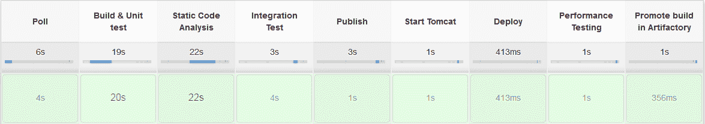

Jenkins CD 流水线实践

1.  登录到 Artifactory 服务器，查看代码是否已使用下列属性上传和推广：

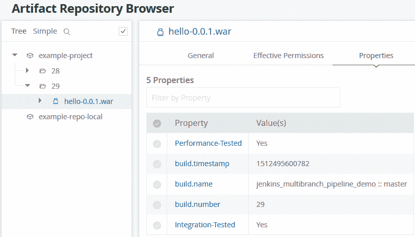

构建产物正在 Artifactory 中推广

1.  让我们在 Jenkins Blue Ocean 中看看我们的 CD 流水线。要做到这一点，请导航到您的 Jenkins Multibranch CD 流水线（<`Jenkins URL>/job/<Jenkins multibranch pipeline name>/`）。

1.  在流水线页面上，单击左侧菜单中的 Open Blue Ocean 链接。

1.  您将被带到 Blue Ocean 中的 Multibranch Pipeline 页面，如以下截图所示：

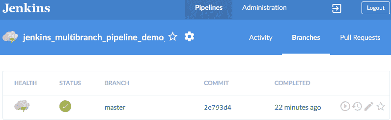

1.  单击主分支以查看其流水线。您应该会看到类似以下内容：

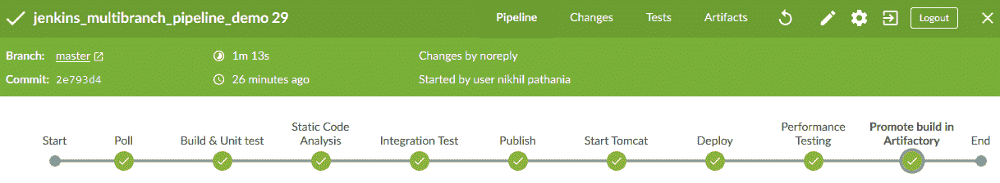

# 总结

在本章中，我们学习了如何创建一个端到端的 CD 流水线，在推送事件上触发，执行构建、静态代码分析和集成测试，将成功测试的二进制产物上传到 Artifactory，部署代码到测试环境，执行一些自动化测试，并在 Artifactory 中推广二进制产物。

书中讨论的 CD 设计可以修改以满足任何类型项目的需求。用户只需识别可以与 Jenkins 配合使用的正确工具和配置。

在下一章中，我们将学习有关持续部署的内容，它与持续交付有何不同，以及更多。
