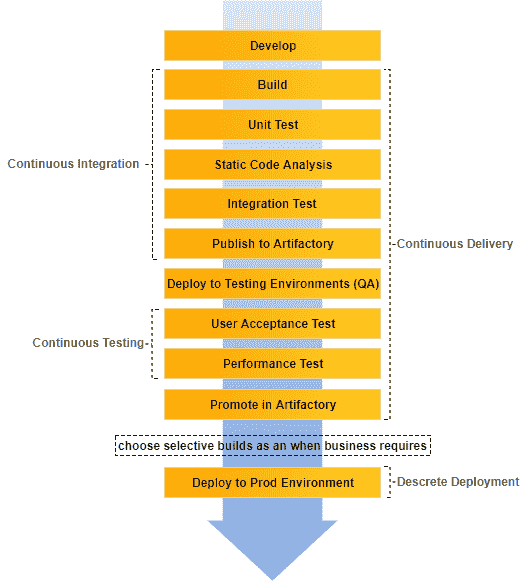
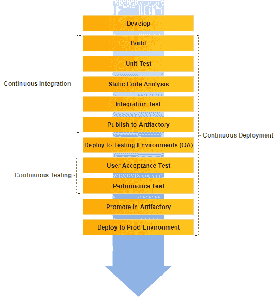
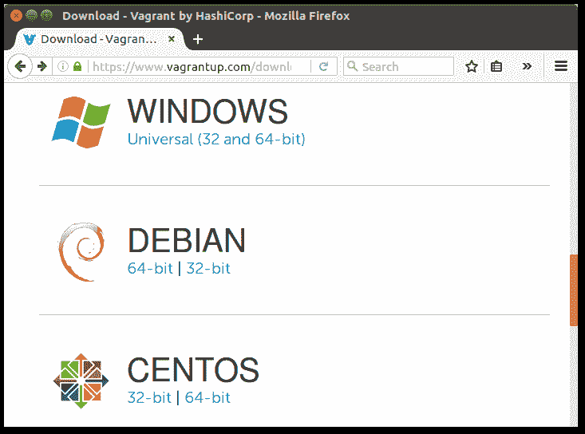
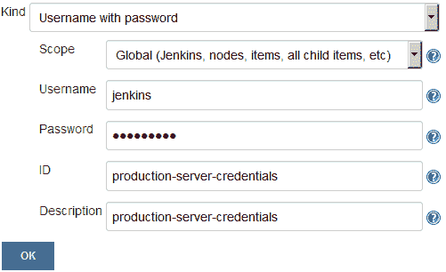
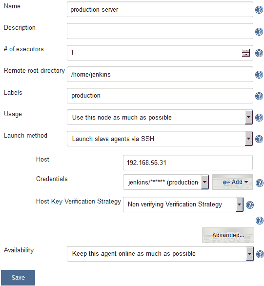

# 第九章：使用 Jenkins 进行持续部署

本章首先定义和解释了持续部署。我们还将尝试区分持续部署和持续交付。持续部署是持续交付流水线的一个简单、微调版本。因此，我们不会看到任何主要的 Jenkins 配置更改或任何新工具。

本章将涵盖以下主题：

+   创建一个生产服务器

+   在生产服务器上安装 Jenkins 从属节点

+   创建一个 Jenkins 持续部署流水线

+   持续交付的实施

# 什么是持续部署？

将生产就绪特性持续部署到生产环境或最终用户的过程称为**持续部署**。

从整体上看，持续部署意味着，*使生产就绪的特性立即上线，无需任何干预*。这包括以敏捷方式构建特性、持续集成和测试，并将其部署到生产环境中，而无需任何中断。

持续部署从字面上讲意味着，*在任何给定环境中持续部署任何给定包的任务*。因此，将包部署到测试服务器和生产服务器的任务传达了持续部署的字面意义。

# 持续部署与持续交付的区别

首先，特性被开发，然后它们经历一个循环，或持续集成，或各种测试。任何通过各种测试的东西都被视为生产就绪的特性。然后，这些生产就绪的特性被标记为 Artifactory（本书未显示）中的标签，或者被保持分开，以将它们与非生产就绪的特性区分开。

这类似于制造生产线。原始产品经历修改和测试阶段。最终，成品被包装并存放在仓库中。根据订单，从仓库发货到各个地方。产品在包装后不会立即发货。

我们可以安全地称这种实践为持续交付。以下插图描述了**持续交付**的生命周期：



持续交付流水线

另一方面，**持续部署**的生命周期看起来有些如下所示。部署阶段是立即进行的，没有任何中断。生产就绪的特性立即部署到生产环境：



持续部署流水线

# 谁需要持续部署？

人们可能会心里想着以下几个问题：*我如何在我的组织中实现持续部署*，*可能会面临什么挑战*，*需要多少测试来进行并自动化*？问题不胜枚举。

然而，技术挑战只是一方面。更重要的是要决定我们是否真的需要它。我们真的需要持续部署吗？

答案是，*并不总是以及不完全是每种情况*。因为从我们对持续部署的定义以及前一个主题的理解来看，生产可用的功能会立即部署到生产环境中。

在许多组织中，业务部门决定是否将一个功能上线，或何时上线一个功能。因此，将持续部署视为一个选项，而不是强制性的。

另一方面，持续交付；这意味着以连续方式创建可供生产使用的功能，应该是任何组织的座右铭。

# 创建一个生产服务器

在接下来的部分中，让我们创建一个承载我们*hello world*应用程序的生产服务器。稍后我们将扩展我们的持续交付流程，自动在我们的生产服务器上部署完全测试的二进制文件。

在以下示例中，我们的生产服务器是一个简单的 Tomcat 服务器。让我们使用 Vagrant 创建一个。

# 安装 Vagrant

在本节中，我们将在 Ubuntu 上安装 Vagrant。请确保以`root`用户或具有 root 权限（`sudo`访问）的帐户执行这些步骤：

1.  打开终端并输入以下命令以下载 Vagrant：

```
wget https://releases.hashicorp.com/vagrant/1.8.5/vagrant_1.8.5_x86_64.deb
```

或者，你也可以从 Vagrant 网站上下载最新的 Vagrant 软件包：[`www.vagrantup.com/downloads.html`](https://www.vagrantup.com/downloads.html)。



Vagrant 下载网页

使用可用的最新版本的 Vagrant 和 VirtualBox。使用旧版本的 Vagrant 与新版本的 VirtualBox 或反之可能在创建 VM 时导致问题。

1.  下载完成后，你应该会看到一个`.deb`文件。

1.  执行以下命令使用下载的软件包文件安装 Vagrant。可能需要输入密码：

```
sudo dpkg -i vagrant_1.8.5_x86_64.deb 
sudo apt-get install -f
```

1.  安装完成后，通过执行以下命令检查已安装的 Vagrant 版本：

```
vagrant --version
```

1.  你应该会看到类似的输出：

```
Vagrant 1.8.5
```

# 安装 VirtualBox

Vagrant 需要 Oracle VirtualBox 来创建虚拟机。然而，并不仅限于 Oracle VirtualBox，你也可以使用 VMware。按照以下步骤在你的机器上安装 VirtualBox：

要使用 VMware 或 AWS 运行 Vagrant，请访问[`www.vagrantup.com/docs/getting-started/providers.html`](https://www.vagrantup.com/docs/getting-started/providers.html)。

1.  将以下行添加到`sources.list`文件中，该文件位于`/etc/apt`目录中：

```
deb http://download.virtualbox.org/virtualbox/debian \
xenial contrib
```

根据你的 Ubuntu 发行版，用`xenial`替换为`vivid`、`utopic`、`trusty`、`raring`、`quantal`、`precise`、`lucid`、`jessie`、`wheezy`或`squeeze`。

1.  使用以下命令下载并注册密钥。你应该期望两个命令都输出：`OK`。

```
wget -q \
https://www.virtualbox.org/download/oracle_vbox_2016.asc -O- | 
sudo apt-key add - 
wget -q \
https://www.virtualbox.org/download/oracle_vbox.asc -O- | 
sudo apt-key add –

```

1.  要安装 VirtualBox，请执行以下命令：

```
sudo apt-get update 
sudo apt-get install virtualbox-5.1
```

1.  执行以下命令以查看已安装的 VirtualBox 版本：

```
VBoxManage –-version
```

1.  您应该看到类似的输出：

```
5.1.6r110634
```

Ubuntu/Debian 用户可能希望安装`dkms`软件包，以确保在下次`apt-get upgrade`期间 Linux 内核版本更改时，VirtualBox 主机内核模块（`vboxdrv`、`vboxnetflt`和`vboxnetadp`）得到正确更新。对于 Debian 来说，它在 Lenny backports 中可用，在 Squeeze 及更高版本的正常仓库中可用。可以通过 Synaptic 软件包管理器或通过以下命令安装`dkms`软件包：

`**sudo apt-get install dkms**`

# 使用 Vagrant 创建一个虚拟机

在接下来的部分中，我们将使用 Vagrant 和 VirtualBox 生成一个将充当我们生产服务器的虚拟机。

# 创建一个 Vagrantfile

我们将创建一个 Vagrantfile 来描述我们的虚拟机。请按照以下步骤操作：

1.  使用以下命令创建一个名为`Vagrantfile`的新文件：

```
sudo nano Vagrantfile
```

1.  将以下代码粘贴到文件中：

```
# -*- mode: ruby -*-
# vi: set ft=ruby :
Vagrant.configure(2) do |config|
config.vm.box = "ubuntu/xenial64"

config.vm.define :node1 do |node1_config|
node1_config.vm.network "private_network", ip:"192.168.56.31"
node1_config.vm.provider :virtualbox do |vb|
vb.customize ["modifyvm", :id, "--memory", "2048"]
vb.customize ["modifyvm", :id, "--cpus", "2"]
end
end
end
```

根据需要选择 IP 地址、内存和 CPU 数量。

1.  键入*Ctrl* + *X*，然后 *Y* 保存文件。

# 使用 Vagrant 生成一个虚拟机

在本节中，我们将使用刚刚创建的`Vagrantfile`创建一个虚拟机：

1.  键入以下命令使用上述的`Vagrantfile`生成一个虚拟机：

```
 vagrant up node1
```

1.  Vagrant 将花费一些时间来启动机器。一旦完成，执行以下命令登录到新的虚拟机：

```
 vagrant ssh node1
```

输出如下：

```
Welcome to Ubuntu 16.04.2 LTS (GNU/Linux 4.4.0-83-generic x86_64)

 * Documentation:  https://help.ubuntu.com
 * Management:     https://landscape.canonical.com
 * Support:        https://ubuntu.com/advantage

 Get cloud support with Ubuntu Advantage Cloud Guest:
 http://www.ubuntu.com/business/services/cloud
0 packages can be updated.
0 updates are security updates.

ubuntu@ubuntu-xenial:~$
```

1.  我们现在在虚拟机内。我们将升级我们的虚拟机，并安装我们运行应用程序所需的所有必要应用程序：

    +   Java JDK（最新版）

    +   Apache Tomcat（8.5）

    +   一个用于登录 Docker 容器的用户账户

    +   开启 SSH 守护进程—`sshd`（以接受 SSH 连接）

    +   Curl

1.  现在，按照您在任何正常 Ubuntu 机器上的操作方式安装所有必需的应用程序。让我们首先创建一个`jenkins`用户：

    1.  执行以下命令并按照用户创建步骤进行操作：

```
adduser jenkins
```

输出如下：

```
Adding user `jenkins' ...
Adding new group `jenkins' (1001) ...
Adding new user `jenkins' (1001) with group `jenkins' ...
Creating home directory `/home/jenkins' ...
Copying files from `/etc/skel' ...
Enter new UNIX password:
Retype new UNIX password:
passwd: password updated successfully
Changing the user information for jenkins
Enter the new value, or press ENTER for the default
 Full Name []: Nikhil Pathania
 Room Number []:
 Work Phone []:
 Home Phone []:
 Other []:
Is the information correct? [Y/n] Y
```

1.  1.  使用切换用户命令检查新用户：

```
su jenkins
```

1.  通过键入`exit`切换回 root 用户。

1.  接下来，我们将安装 SSH 服务器。按顺序执行以下命令（如果`openssh-server`应用程序和`/var/run/sshd`目录路径已存在，则忽略）：

```
sudo apt-get update

sudo apt-get install openssh-server

sudo mkdir /var/run/sshd
```

1.  跟随以下步骤安装 Java：

    1.  更新软件包索引：

```
sudo apt-get update
```

1.  1.  接下来，安装 Java。以下命令将安装 JRE：

```
sudo apt-get install default-jre
```

1.  安装 Tomcat 8.5 的最佳方法是下载最新的二进制发行版，然后手动配置它：

    1.  切换到`/tmp`目录并使用以下命令下载 Apache Tomcat 8.5：

```
cd /tmp

wget https://archive.apache.org/dist/tomcat/tomcat-8/v8.5.11/bin/apache-tomcat-8.5.11-deployer.tar.gz
```

1.  1.  我们将在`$HOME`目录下安装 Tomcat。为此，请在`$HOME`内创建一个`tomcat`目录：

```
mkdir $HOME/tomcat
```

1.  1.  然后，将存档文件解压缩到其中：

```
sudo tar xzvf apache-tomcat-8*tar.gz \
-C $HOME/tomcat --strip-components=1
```

1.  在终端中键入`exit`退出虚拟机。

# 在 Jenkins 内添加生产服务器凭据

为了使 Jenkins 与生产服务器通信，我们需要在 Jenkins 内添加账户凭据。

我们将使用 Jenkins 凭据插件来实现这一点。 如果您已经按照本章开头讨论的 Jenkins 设置向导进行操作，您将在 Jenkins 仪表板上找到凭据功能（请参阅左侧菜单）：

按照给定的步骤进行操作：

1.  从 Jenkins 仪表板，单击凭据 | 系统 | 全局凭据（无限制）。

1.  在全局凭据（无限制）页面上，从左侧菜单中，单击添加凭据链接。

1.  您将看到一堆字段供您配置。

1.  对于类型字段，选择用户名与密码。

1.  为范围字段选择全局（Jenkins、节点、项目、所有子项目等）。

1.  在用户名字段下添加一个用户名。

1.  在密码字段下添加一个密码。

1.  通过在 ID 字段下键入字符串为您的凭据分配一个唯一的 ID。

1.  在描述字段下添加一个有意义的描述。

1.  完成后单击保存按钮：



在 Jenkins 内添加凭据

# 在生产服务器上安装 Jenkins 从节点

在本节中，我们将在生产服务器上安装一个 Jenkins 从节点。 这将允许我们在生产服务器上执行部署。 执行以下步骤：

1.  从 Jenkins 仪表板，单击管理 Jenkins | 管理节点。

1.  一旦在节点管理器页面上，从左侧菜单中单击新建节点。

1.  为您的新 Jenkins 从节点命名，如下所示：



配置 Jenkins 从节点

# 创建 Jenkins 持续部署流水线

在下一节中，我们将扩展我们的持续交付流水线以执行部署。

# 重温 CD 流水线代码

以下是作为 CD 一部分的完整组合代码：

```
node('docker') {
  stage('Poll') {
    checkout scm
  }
  stage('Build & Unit test'){
    sh 'mvn clean verify -DskipITs=true';
    junit '**/target/surefire-reports/TEST-*.xml'
    archive 'target/*.jar'
  }
  stage('Static Code Analysis'){
    sh 'mvn clean verify sonar:sonar -Dsonar.projectName=example-project
    -Dsonar.projectKey=example-project
    -Dsonar.projectVersion=$BUILD_NUMBER';
  }
  stage ('Integration Test'){
    sh 'mvn clean verify -Dsurefire.skip=true';
    junit '**/target/failsafe-reports/TEST-*.xml'
    archive 'target/*.jar'
  }
  stage ('Publish'){
    def server = Artifactory.server 'Default Artifactory Server'
    def uploadSpec = """{
      "files": [
        {
           "pattern": "target/hello-0.0.1.war",
           "target": "example-project/${BUILD_NUMBER}/",
           "props": "Integration-Tested=Yes;Performance-Tested=No"
        }
      ]
    }"""
    server.upload(uploadSpec)
  }
  stash includes:
   'target/hello-0.0.1.war,src/pt/Hello_World_Test_Plan.jmx',
  name: 'binary'
}
node('docker_pt') {
  stage ('Start Tomcat'){
    sh '''cd /home/jenkins/tomcat/bin
    ./startup.sh''';
  }
  stage ('Deploy '){
    unstash 'binary'
    sh 'cp target/hello-0.0.1.war /home/jenkins/tomcat/webapps/';
  }
  stage ('Performance Testing'){
    sh '''cd /opt/jmeter/bin/
    ./jmeter.sh -n -t $WORKSPACE/src/pt/Hello_World_Test_Plan.jmx -l
    $WORKSPACE/test_report.jtl''';
    step([$class: 'ArtifactArchiver', artifacts: '**/*.jtl'])
  }
  stage ('Promote build in Artifactory'){
    withCredentials([usernameColonPassword(credentialsId:
     'artifactory-account', variable: 'credentials')]) {
      sh 'curl -u${credentials} -X PUT
      "http://192.168.56.102:8081/artifactory/api/storage/example-project/
      ${BUILD_NUMBER}/hello-0.0.1.war?properties=Performance-Tested=Yes"';
    }
  }
}
```

# 用于生产 Jenkins 从节点的流水线代码

首先，让我们为我们的 Jenkins 从节点 production-server 创建一个节点块：

```
node('production') {
}
```

其中`production`是 Jenkins 从节点 production-server 的标签。

我们希望将构建产物部署到生产服务器上的 Tomcat 上的`production`节点。

让我们为其编写流水线代码。

# 从 Artifactory 下载二进制文件的流水线代码

要从 Artifactory 下载构建产物，我们将使用文件规范。文件规范代码如下所示：

```
"files": [
    {
      "pattern": "[Mandatory]",
      "target": "[Mandatory]",
      "props": "[Optional]",
      "recursive": "[Optional, Default: 'true']",
      "flat" : "[Optional, Default: 'true']",
      "regexp": "[Optional, Default: 'false']"
    }
  ]
```

以下表描述了使用的各种参数：

| **参数** | **描述** |
| --- | --- |
| `pattern` | `[必填]`指定应上传到 Artifactory 的本地文件系统路径的工件。您可以使用通配符或由`regexp`属性指定的正则表达式指定多个工件。如果使用`regexp`，则需要使用反斜杠`\`转义表达式中使用的任何保留字符（例如`.`，`?`等）。从 Jenkins Artifactory 插件的版本 2.9.0 和 TeamCity Artifactory 插件的版本 2.3.1 开始，模式格式已经简化，并且对于所有操作系统（包括 Windows），都使用相同的文件分隔符`/`。 |
| `target` | `[必填]`指定 Artifactory 中目标路径的格式如下：`[repository_name]/[repository_path]`如果模式以斜杠结尾，例如，`repo-name/a/b/`，那么假定`b`是 Artifactory 中的一个文件夹，并且文件被上传到其中。在`repo-name/a/b`的情况下，上传的文件在 Artifactory 中被重命名为`b`。为了灵活指定上传路径，您可以在源路径中的对应令牌周围包含占位符形式的`{1}，{2}，{3}...`，这些占位符会被替换为相应的标记。有关更多详细信息，请参阅[使用占位符](https://www.jfrog.com/confluence/display/RTF/Using+File+Specs#UsingFileSpecs-UsingPlaceholders)文档。 |
| `props` | `[可选]`以分号(`;`)分隔的`key=value`对列表，将其附加为上传的属性。如果任何键可以具有多个值，则每个值由逗号(`,`)分隔。例如，`key1=value1;key2=value21,value22;key3=value3`。 |
| `flat` | `[默认值：true]`如果为`true`，则工件将上传到指定的确切目标路径，并且源文件系统中的层次结构将被忽略。如果为`false`，则工件将上传到目标路径，同时保持其文件系统层次结构。 |
| `recursive` | `[默认值：true]`如果为`true`，则还从源目录的子目录中收集工件进行上传。如果为`false`，则仅上传源目录中明确指定的工件。 |
| `regexp` | `[默认值：false]`如果为`true`，则命令将解释模式属性（描述要上传的工件的本地文件系统路径）为正则表达式。如果为`false`，则命令将解释模式属性为通配符表达式。 |

以下是我们将在管道中使用的 File Specs 代码：

```
def server = Artifactory.server 'Default Artifactory Server'
def downloadSpec = """{
  "files": [
    {
        "pattern": "example-project/$BUILD_NUMBER/*.zip",
        "target": "/home/jenkins/tomcat/webapps/"
        "props": "Performance-Tested=Yes;Integration-Tested=Yes",
    }
  ]
}""
server.download(downloadSpec)
```

将前面的步骤包装在名为`Deploy to Prod`的`stage`内：

```
stage ('Deploy to Prod'){
  def server = Artifactory.server 'Default Artifactory Server'
  def downloadSpec = """{
    "files": [
      {
        "pattern": "example-project/$BUILD_NUMBER/*.zip",
        "target": "/home/jenkins/tomcat/webapps/"
        "props": "Performance-Tested=Yes;Integration-Tested=Yes",
      }
    ]
  }""
server.download(downloadSpec)
}
```

将`Deploy to Prod`阶段包装在`production`节点块内：

```
node ('production') {
  stage ('Deploy to Prod'){    def server = Artifactory.server 'Default Artifactory Server'
    def downloadSpec = """{
      "files": [
        {
          "pattern": "example-project/$BUILD_NUMBER/*.zip",
          "target": "/home/jenkins/tomcat/webapps/"
          "props": "Performance-Tested=Yes;Integration-Tested=Yes",
        }
      ]
    }""
    server.download(downloadSpec)
  }
}
```

# 组合连续部署管道代码

以下是组合的连续部署管道代码：

```
node('docker') {
  stage('Poll') {
    checkout scm
  }
  stage('Build & Unit test'){
    sh 'mvn clean verify -DskipITs=true';
    junit '**/target/surefire-reports/TEST-*.xml'
    archive 'target/*.jar'
  }
  stage('Static Code Analysis'){
    sh 'mvn clean verify sonar:sonar -Dsonar.projectName=example-project
    -Dsonar.projectKey=example-project
    -Dsonar.projectVersion=$BUILD_NUMBER';
  }
  stage ('Integration Test'){
    sh 'mvn clean verify -Dsurefire.skip=true';
    junit '**/target/failsafe-reports/TEST-*.xml'
    archive 'target/*.jar'
  }
  stage ('Publish'){
    def server = Artifactory.server 'Default Artifactory Server'
    def uploadSpec = """{
      "files": [
        {
          "pattern": "target/hello-0.0.1.war",
          "target": "example-project/${BUILD_NUMBER}/",
          "props": "Integration-Tested=Yes;Performance-Tested=No"
        }
      ]
    }"""
    server.upload(uploadSpec)
  }
  stash includes:
   'target/hello-0.0.1.war,src/pt/Hello_World_Test_Plan.jmx',
  name: 'binary'
}
node('docker_pt') {
  stage ('Start Tomcat'){
    sh '''cd /home/jenkins/tomcat/bin
    ./startup.sh''';
  }
  stage ('Deploy '){
    unstash 'binary'
    sh 'cp target/hello-0.0.1.war /home/jenkins/tomcat/webapps/';
  }
  stage ('Performance Testing'){
    sh '''cd /opt/jmeter/bin/
    ./jmeter.sh -n -t $WORKSPACE/src/pt/Hello_World_Test_Plan.jmx -l
    $WORKSPACE/test_report.jtl''';
    step([$class: 'ArtifactArchiver', artifacts: '**/*.jtl'])
  }
  stage ('Promote build in Artifactory'){
    withCredentials([usernameColonPassword(credentialsId:
     'artifactory-account', variable: 'credentials')]) {
      sh 'curl -u${credentials} -X PUT
      "http://192.168.56.102:8081/artifactory/api/storage/example-project/
      ${BUILD_NUMBER}/hello-0.0.1.war?properties=Performance-Tested=Yes"';
    }
  }
}
node ('production') {  stage ('Deploy to Prod'){    def server = Artifactory.server 'Default Artifactory Server'
    def downloadSpec = """{
      "files": [
        {
          "pattern": "example-project/$BUILD_NUMBER/*.zip",
          "target": "/home/jenkins/tomcat/webapps/"
          "props": "Performance-Tested=Yes;Integration-Tested=Yes",
        }
      ]
    }""
    server.download(downloadSpec)
  }
}
```

# 更新 Jenkinsfile

Jenkins 多分支 CD Pipeline 利用 Jenkinsfile。在本节中，我们将更新现有的 Jenkinsfile。按照给定的步骤进行操作：

1.  登录到您的 GitHub 账户。

1.  转到分叉出来的仓库。

1.  在仓库页面上，点击`Jenkinsfile`。接下来，在结果页面上点击编辑按钮以编辑您的`Jenkinsfile`。

1.  用以下代码替换现有内容：

```
node('docker') {
  stage('Poll') {
    checkout scm
  }
  stage('Build & Unit test'){
    sh 'mvn clean verify -DskipITs=true';
    junit '**/target/surefire-reports/TEST-*.xml'
    archive 'target/*.jar'
  }
  stage('Static Code Analysis'){
    sh 'mvn clean verify sonar:sonar
    -Dsonar.projectName=example-project
    -Dsonar.projectKey=example-project
    -Dsonar.projectVersion=$BUILD_NUMBER';
  }
  stage ('Integration Test'){
    sh 'mvn clean verify -Dsurefire.skip=true';
    junit '**/target/failsafe-reports/TEST-*.xml'
    archive 'target/*.jar'
  }
  stage ('Publish'){
    def server = Artifactory.server
      'Default Artifactory Server'
    def uploadSpec = """{
      "files": [
        {
           "pattern": "target/hello-0.0.1.war",
           "target": "example-project/${BUILD_NUMBER}/",
           "props": "Integration-Tested=Yes;
             Performance-Tested=No"
        }
      ]
    }"""
    server.upload(uploadSpec)
  }
  stash includes:
   'target/hello-0.0.1.war,src/pt/Hello_World_Test_Plan.jmx',
  name: 'binary'
}
node('docker_pt') {
  stage ('Start Tomcat'){
    sh '''cd /home/jenkins/tomcat/bin
    ./startup.sh''';
  }
  stage ('Deploy '){
    unstash 'binary'
    sh 'cp target/hello-0.0.1.war /home/jenkins/tomcat/webapps/';
  }
  stage ('Performance Testing'){
    sh '''cd /opt/jmeter/bin/
    ./jmeter.sh -n -t $WORKSPACE/src/pt/Hello_World_Test_Plan.jmx
    -l $WORKSPACE/test_report.jtl''';
    step([$class: 'ArtifactArchiver', artifacts: '**/*.jtl'])
  }
  stage ('Promote build in Artifactory'){
    withCredentials([usernameColonPassword(credentialsId:
     'artifactory-account', variable: 'credentials')]) {
      sh 'curl -u${credentials} -X PUT
      "http://192.168.56.102:8081/artifactory/api/storage/
       example-project/${BUILD_NUMBER}/hello-0.0.1.war?
       properties=Performance-Tested=Yes"';
    }
  }
}
node ('production') {  stage ('Deploy to Prod'){    def server = Artifactory.server 
     'Default Artifactory Server'
    def downloadSpec = """{
      "files": [
        {
          "pattern": "example-project/$BUILD_NUMBER/*.zip",
          "target": "/home/jenkins/tomcat/webapps/"
          "props": "Performance-Tested=Yes;
             Integration-Tested=Yes",
        }
      ]
    }""
    server.download(downloadSpec)
  }
}
```

1.  完成后，通过添加一个有意义的注释来提交新文件。

# 持续交付正在进行中

对您的 GitHub 代码进行一些更改，或者只需从 Jenkins 仪表盘触发 Jenkins 流水线。

登录到 Jenkins，从 Jenkins 仪表盘点击您的多分支流水线。您应该会看到类似以下截图的内容：

图片

Jenkins 中的持续部署流水线正在运行

# 摘要

这标志着持续部署的结束。在这一章中，我们学习了如何使用 Jenkins 实现持续部署。同时，我希望您已经清楚了持续交付与持续部署之间的区别。本章没有涉及到主要的设置或配置，因为在之前的章节中实现持续集成和持续交付时已经完成了所有必要的工作。

我真诚地希望这本书可以让您走出去，更多地尝试 Jenkins。

下次再见，加油！
