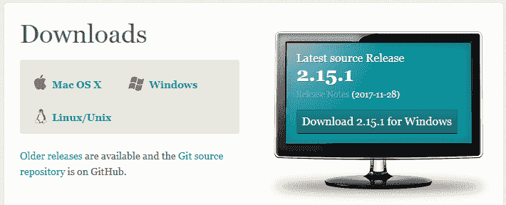
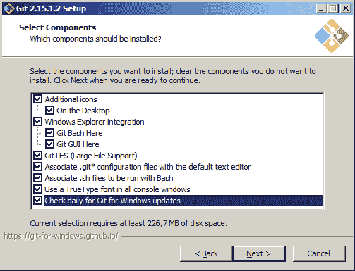
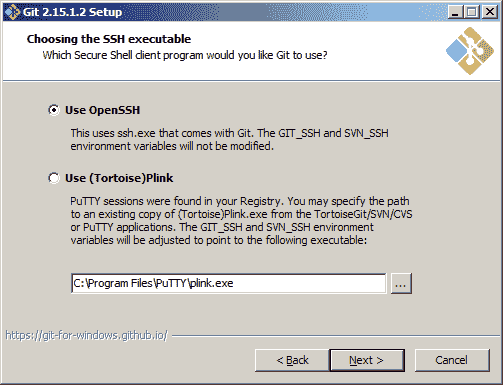
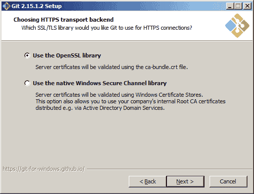
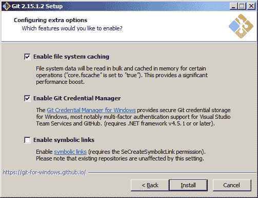

# 支持工具和安装指南

本章将带您了解使您的 Jenkins 服务器可以通过互联网访问所需的步骤。我们还将介绍在 Windows 和 Linux 上安装 Git 所需的步骤。

# 将您的本地主机服务器暴露给互联网

您需要在 GitHub 上创建 Webhooks 以触发 Jenkins 中的管道。另外，对于 GitHub Webhooks 的工作，Jenkins 服务器可通过互联网访问非常重要。

在练习本书中描述的示例时，您可能会需要使您的 Jenkins 服务器可以通过互联网访问，该服务器安装在您的沙盒环境中。

在接下来的章节中，我们将使用一个名为 ngrok 的工具来实现这一目标。执行以下步骤使您的 Jenkins 服务器可以通过互联网访问：

1.  登录到 Jenkins 服务器机器（独立的 Windows/Linux 机器）。如果您正在使用 Docker 运行 Jenkins，请登录到您的 Docker 主机机器（很可能是 Linux）。

1.  从 [`ngrok.com/download`](https://ngrok.com/download) 下载 ngrok 应用程序。

1.  您下载的是一个 ZIP 包。使用`unzip`命令解压它（要在 Ubuntu 上安装 ZIP 实用程序，执行`sudo apt-get install zip`）。

1.  运行以下命令解压 ngrok ZIP 包：

```
unzip /path/to/ngrok.zip 
```

1.  要在 Linux 上运行 ngrok，请执行以下命令：

```
./ngrok http 8080
```

或者，运行以下命令：

```
nohup ./ngrok http 8080 & 
```

1.  要在 Windows 上运行 ngrok，请执行以下命令：

```
ngrok.exe http 8080 
```

1.  您应该会看到类似的输出，如下所示；突出显示的文本是`localhost:8080`的公共 URL：

```
ngrok by @inconshreveable (Ctrl+C to quit)
Session Status online
Version 2.2.8
Region United States (us)
Web Interface http://127.0.0.1:4040
Forwarding http://8bd4ecd3.ngrok.io -> localhost:8080
Forwarding https://8bd4ecd3.ngrok.io -> localhost:8080
Connections ttl opn rt1 rt5 p50 p90
0 0 0.00 0.00 0.00 0.00
```

1.  复制上述公共 URL。

1.  登录到您的 Jenkins 服务器。从 Jenkins 仪表板，导航到 Manage Jenkins | Configure System。

1.  在 Jenkins 配置页面上，向下滚动到 Jenkins 位置部分，并将使用 ngrok 生成的公共 URL 添加到 Jenkins URL 字段内。

1.  单击保存按钮以保存设置。

1.  现在，您将能够通过互联网访问您的 Jenkins 服务器使用公共 URL。

1.  在 GitHub 上创建 Webhooks 时，请使用使用 ngrok 生成的公共 URL。

# 在 Windows/Linux 上安装 Git

以下各节中提到的步骤是在 Windows 和 Linux 上安装 Git 所需的：

# 在 Windows 上安装 Git

要在 Windows 上安装 Git，请按照以下步骤操作：

1.  您可以从 [`git-scm.com/downloads`](https://git-scm.com/downloads) 下载 Git：



1.  单击下载的可执行文件并按照安装步骤进行操作。

1.  接受许可协议并单击下一步。

1.  选择所有组件并单击下一步，如下图所示：



1.  选择 Git 使用的默认编辑器，然后单击下一步。

1.  通过选择适当的环境来调整您的路径环境，并单击下一步，如下图所示：


1.  选择使用 OpenSSH 作为 SSH 可执行文件，然后单击下一步：



1.  选择将 OpenSSL 库用作 HTTPS 传输后端，然后点击下一步：



1.  选择适合你的行结束转换方式，然后点击下一步。

1.  选择终端模拟器，然后点击下一步。

1.  选择启用文件系统缓存和启用 Git 凭据管理器选项，如下截图所示，然后点击安装：



1.  Git 安装应该现在开始。安装完成后，点击完成。

# 在 Linux 上安装 Git

在 Linux 上安装 Git，请执行以下步骤：

1.  在 Linux 上安装 Git 很简单。在本节中，我们将在 Ubuntu（16.04.x）上安装 Git。

1.  登录到你的 Ubuntu 机器。确保你拥有管理员权限。

1.  如果你使用的是 GUI，请打开终端。

1.  按顺序执行以下命令：

```
sudo apt-get update 
sudo apt-get install git
```

1.  执行以下命令检查 Git 是否安装成功：

```
git --version
```

1.  你应该得到以下结果：

```
git version 2.15.1.windows.2
```
