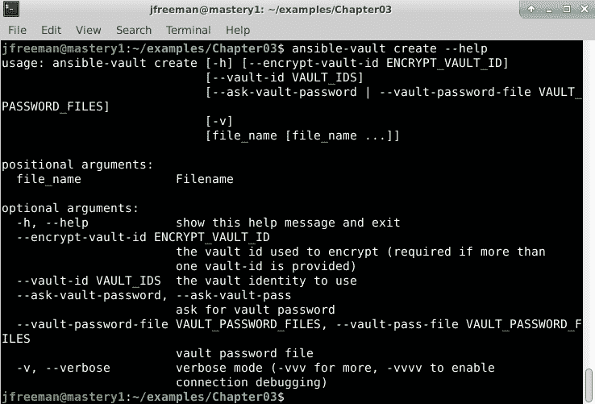
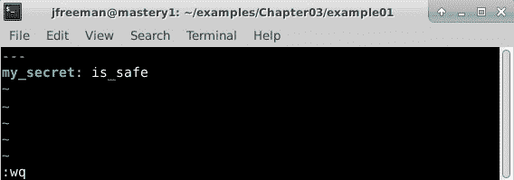
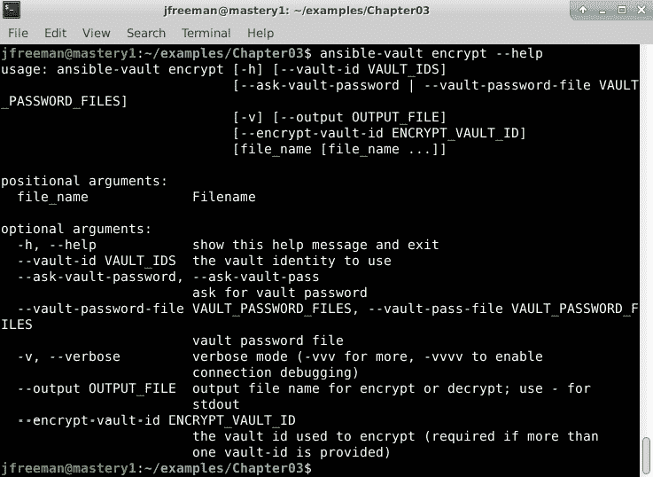
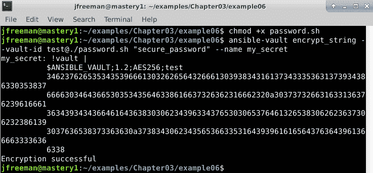
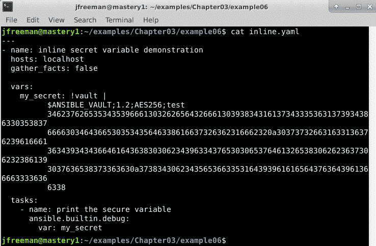
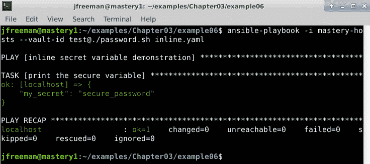
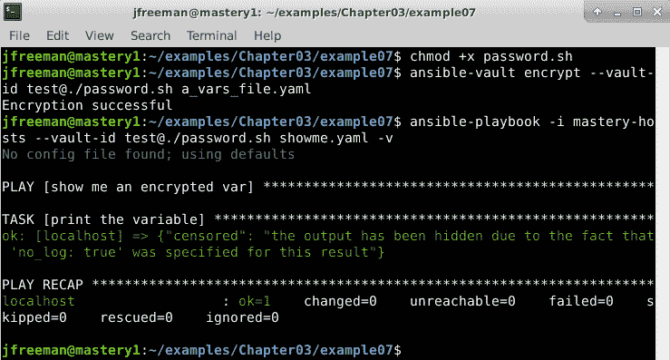

# 三、使用 Ansible 保护你的机密

机密是用来保密的。无论它们是云服务的登录凭证还是数据库资源的密码，它们都是机密的，这是有原因的。如果落入坏人之手，它们可能会被用来发现商业机密、客户的私人数据、为邪恶目的创建基础设施，甚至更糟。所有这些都可能会让您和您的组织花费大量时间、金钱和头痛！当这本书的第二版出版时，只能加密外部保管库文件中的敏感数据，所有数据必须以加密或未加密的形式完全存在。每次运行行动手册时也只能使用一个保管库密码，这意味着不可能隔离您的机密数据并对不同敏感度的项目使用不同的密码。现在一切都变了，在 playbook 运行时允许使用多个 Vault 密码，并且有可能将加密字符串嵌入到原本简单的 **YAML 非标记语言** ( **YAML** )文件中。

在本章中，我们将通过涵盖以下主题来描述如何利用这些新功能，从而保护您的机密安全:

*   加密静态数据
*   创建和编辑加密文件
*   用加密文件执行`ansible-playbook`
*   将加密数据与普通 YAML 混合
*   操作时保护机密

# 技术要求

按照本章中给出的示例，您将需要一台运行 **Ansible 4.3** 或更新版本的 Linux 机器。几乎任何风格的 Linux 都可以——对于那些对细节感兴趣的人来说，本章中给出的所有代码都在 Ubuntu Server 20.04 **长期支持** ( **LTS** )和 Ansible 4.3 上进行了测试，除非另有说明。本章附带的示例代码可在此**统一资源定位符** ( **网址**):[https://GitHub . com/packt publishing/Mastering-ansi ble-第四版/tree/main/Chapter03](https://github.com/PacktPublishing/Mastering-Ansible-Fourth-Edition/tree/main/Chapter03) 下载。

查看以下视频，了解《行动守则》:[https://bit.ly/2Z4xB42](https://bit.ly/2Z4xB42)T2

# 静态加密数据

作为一个配置管理系统或者一个编排引擎，Ansible 有很大的威力。要行使这一权力，有必要将机密数据委托给 Ansible。一个在每次连接时提示操作员输入密码的自动化系统不是很有效——事实上，如果你不得不坐在那里一遍又一遍地输入密码，这几乎不是完全自动化的！为了最大限度地发挥 Ansible 的功能，机密数据必须写入 Ansible 可以读取的文件中，并且可以从中利用数据。

不过，这也带来了风险！你的机密以明文形式存在于你的文件系统中。这既是物理风险，也是数字风险。从物理上来说，电脑可能会从你身上拿走，并仔细研究机密数据。从数字上来说，任何能够打破界限的恶意软件都能够读取您的用户帐户可以访问的任何数据。如果您使用一个源代码控制系统，存储库的基础设施也同样面临风险。

谢天谢地，Ansible 提供了一种保护静态数据的工具。那个设施是**金库**。该工具允许对文本文件进行加密，以便它们以加密格式静态存储。没有密钥或大量的计算能力，数据是不可破译的，但仍然可以像未加密的数据一样容易地在 Ansible 播放器中使用。

处理静态加密数据时，需要吸取的主要经验教训包括以下几点:

*   有效的加密目标
*   使用多个密码和保险库**标识符** ( **身份证**)保护不同的数据
*   创建新的加密文件
*   加密现有的未加密文件
*   编辑加密文件
*   更改文件的加密密码
*   解密加密文件
*   在未加密的 YAML 文件(例如，行动手册)中内联加密数据
*   引用加密文件时运行`ansible-playbook`

## 保险库 id 和密码

在 **Ansible 2.4** 的版本之前，一次只能使用一个金库密码。虽然您可以在多个位置存储用于多种目的的多个机密，但只能使用一个密码。对于较小的环境来说，这显然是不错的，但是随着 Ansible 的采用越来越多，对更好、更灵活的安全选项的需求也越来越大。例如，我们已经讨论了 Ansible 通过使用库存中的组来管理开发和生产环境的潜力。预期这些环境会有不同的安全凭证是现实的。同样，您会期望核心网络设备具有与服务器不同的凭据。事实上，这样做是一种很好的安全做法。

有鉴于此，使用 Vault 在单个主密码下保护任何机密似乎是不合理的。Ansible 2.4 引入了 Vault id 的概念作为解决方案，虽然目前旧的单一密码命令仍然全部有效，但建议在命令行上使用 Ansible 时使用 Vault id。每个保管库标识必须有一个与之关联的密码，但是多个机密可以共享同一个标识。

可加密的保管库密码可以来自以下三种来源之一:

*   用户输入的字符串，Ansible 会在需要时提示
*   包含未加密明文形式的保管库密码的平面文本文件(显然，保持该文件的安全至关重要！)
*   一个可执行文件，获取密码(例如，从凭证管理系统)并将其输出到一行中，以便 Ansible 读取

这三个选项的语法大致相似。如果您只有一个保管库凭据，因此没有使用标识(尽管如果您愿意，也可以使用，强烈建议您以后添加第二个保管库标识)，那么您应该输入以下代码行来运行行动手册并提示输入保管库密码:

```
ansible-playbook --vault-id @prompt playbook.yaml
```

如果要从文本文件中获取保管库密码，可以运行以下命令:

```
ansible-playbook --vault-id /path-to/vault-password-text-file playbook.yaml
```

最后，如果正在使用可执行脚本，您将运行以下命令:

```
ansible-playbook --vault-id /path-to/vault-password-script.py playbook.yaml
```

如果您使用的是 ID，只需在密码源前添加 ID，后跟`@`字符—例如，如果您的保管库的 ID 是`prod`，则前面的三个示例如下:

```
ansible-playbook --vault-id prod@prompt playbook.yaml
ansible-playbook --vault-id prod@/path-to/vault-password-text-file playbook.yaml
ansible-playbook --vault-id prod@/path-to/vault-password-script.py playbook.yaml
```

这些命令的多种组合可以组合成一个命令，如下所示:

```
ansible-playbook --vault-id prod@prompt testing@/path-to/vault-password-text-file playbook.yaml
```

我们将在本章剩余部分使用`vault-id`命令行选项。

## 金库可以加密的东西

Vault 功能可用于加密 Ansible 使用的任何**结构化数据**。这可以是 Ansible 在其操作过程中使用的几乎任何 YAML(或 **JavaScript 对象符号** ( **JSON** )文件，甚至可以是未加密的 YAML 文件(如剧本或角色)中的单个变量。Ansible 可以处理的加密文件包括以下示例:

*   `group_vars/`文件
*   `host_vars/`文件
*   `include_vars`目标
*   `vars_files`目标
*   `--extra-vars`目标
*   角色变量
*   角色默认值
*   任务文件
*   处理程序文件
*   `copy`模块的源文件(这是这个列表中的一个例外——它们不必是 YAML 格式的)

如果一个文件可以用 YAML 表示并由 Ansible 读取，或者如果一个文件要用`copy`模块传输，那么它就是一个在 Vault 中加密的有效文件。因为整个文件在静止状态下是不可读的，所以应该注意不要过于热衷于选择要加密的文件。对文件的任何源代码管理操作都将使用加密的内容，这使得同行评审非常困难。

作为最佳实践，应该对尽可能少的数据进行加密，这甚至意味着将一些变量单独移动到一个文件中。正是因为这个原因，Ansible 2.3 在`ansible-vault`中增加了`encrypt_string`功能，允许将个人机密与未加密的 YAML 放在一起，从而避免用户加密整个文件。我们将在本章后面讨论这个问题。

# 创建和编辑加密文件

为了创建新的文件，Ansible 提供了一个名为`ansible-vault`的程序。该程序用于创建和交互保管库加密的文件。创建加密文件的子命令是`create`，您可以通过运行以下命令查看该子命令下的可用选项:

```
ansible-vault create --help
```

该命令的输出如下图所示:



图 3.1–创建 Ansible 保管库实例时可用的选项

要创建新文件，您需要提前知道两件事。第一个是用来加密文件的密码`ansible-vault`，第二个是文件名本身。一旦获得这些信息，`ansible-vault`将启动一个文本编辑器(如`EDITOR`环境变量中所定义的——在许多情况下默认为`vi`或`vim`)。保存文件并退出编辑器后，`ansible-vault`将使用提供的密码作为密钥，用`AES256`密码加密文件。

让我们看几个创建加密文件的例子。首先，我们将创建一个并被提示输入密码，然后我们将提供一个`password`文件，最后，我们将创建一个可执行文件来传递密码。

### 密码提示

让`ansible-vault`在运行时向用户请求密码是开始创建保管库最简单的方法，所以让我们通过一个简单的例子，创建一个包含要加密的变量的保管库。运行以下命令创建新保管库，并提示输入密码:

```
ansible-vault create --vault-id @prompt secrets.yaml
```

输出应该如下所示:


图 3.2–在提示输入密码时，创建新的 Ansible Vault 实例

输入密码后，我们的编辑器会打开，我们可以将内容放入文件，如下图所示:



图 3.3–使用 vim 编辑器向新的 Ansible Vault 实例添加内容

在我的系统上，配置的编辑器是 **Vim** 。您的系统可能不同，如果您对默认选择不满意，您可能希望将首选编辑器设置为`EDITOR`环境变量的值。

现在，我们保存文件。如果我们尝试使用以下命令读取内容，我们将看到它们实际上是加密的:

```
cat secrets.yaml
```

只有一个小标题提示供 Ansible 以后使用，如下图所示:


图 3.4–显示了我们新的 Ansible Vault 实例的内容，这些内容在静态时进行了加密

从标题中可以看到，`AES256`用于保管库加密，这意味着只要在创建保管库时使用好的密码，您的数据就非常安全。

### 密码文件

要将`ansible-vault`与一起使用一个密码文件，首先需要创建这样一个文件。简单地将密码回显到文件中就可以做到这一点。一旦完成，您现在可以在调用`ansible-vault`创建另一个加密文件时引用该文件。通过运行以下命令来尝试一下:

```
echo "my long password" > password_file
ansible-vault create --vault-id ./password_file more_secrets.yaml
```

这应该类似于下面截图中显示的输出:


图 3.5–使用密码文件创建可加密的保管库实例

当您运行前面的命令时，您会注意到没有提示您输入密码——这一次，存储库的密码是`my long password`字符串，它是从`password_file`的内容中读取的。默认编辑器将会打开，数据可以像之前一样在这之后写入。

### 密码脚本

最后一个例子使用了密码脚本。这对于设计一个系统非常有用，在该系统中，密码可以存储在中央系统中，用于存储凭证并与行动手册树的参与者共享。每个参与者都可以拥有自己的共享凭据存储密码，可以从共享凭据存储中检索保管库密码。我们的例子会简单得多:只需用密码简单输出到`STDOUT`。该文件将被保存为`password.sh`。立即创建包含以下内容的文件:

```
#!/bin/sh
echo "a long password"
```

要让 Ansible 使用此脚本，必须将其标记为可执行—对其运行以下命令，使其:

```
chmod +x password.sh
```

最后，您可以通过运行以下命令来创建一个新的保险库，该保险库使用我们的简单脚本输出的`a long password`进行保护:

```
ansible-vault create --vault-id ./password.sh even_more_secrets.yaml
```

这个过程的输出应该是这样的:


图 3.6–使用简单的密码脚本创建可加密的保管库实例

自己试试看，看看它是如何工作的——你会发现`ansible-vault`用`a long password`密码创建了一个金库，就像剧本写给`STDOUT`的那样。您甚至可以尝试使用以下命令进行编辑:

```
ansible-vault edit --vault-id @prompt even_more_secrets.yaml
```

现在，当出现提示时，您应该会看到输入`a long password`，并且您现在可以成功编辑保管库了！

## 加密现有文件

前面的例子都涉及到使用`create`子命令创建新的加密文件。但是，如果我们想要获取一个已建立的文件并对其进行加密呢？对此也存在一个子命令。它被命名为`encrypt`，您可以通过运行以下命令来查看该子命令的选项:

```
ansible-vault encrypt --help
```

输出将看起来类似于以下截图所示:



图 3.7–可加密保管库加密子命令的可用选项

与`create`一样，`encrypt`需要一个`password`(或密码文件或可执行文件)和一个要加密的文件的路径。一旦收到适当的密码，编辑器就会打开，这次我们已经可以看到明文的原始内容。

请注意，要加密的文件必须已经存在。

让我们通过加密我们从 [*第 1 章*](01.html#_idTextAnchor015)*获得的现有文件来演示这一点，该文件名为*`Chapter01/example09/a_vars_file.yaml`的系统架构和设计。将此文件复制到方便的位置，然后使用以下命令对其进行加密:

```
ansible-vault encrypt --vault-id ./password.sh a_vars_file.yaml
```

这个过程的输出应该类似于下面截图所示:


图 3.8–使用 Ansible Vault 加密现有变量文件

在这个例子中，我们可以看到调用`encrypt`前后的文件内容，之后内容确实被加密了。与`create`子命令不同，`encrypt`可以对多个文件进行操作，从而可以轻松地在一次操作中保护所有重要数据。只需列出所有要加密的文件，用空格隔开。

试图加密已经加密的文件将导致错误。

## 编辑加密文件

文件一旦被`ansible-vault`加密，就不能直接编辑。在编辑器中打开文件会显示加密数据。对文件进行任何更改都会损坏文件，并且 Ansible 将无法正确读取内容。我们需要一个子命令，它将首先解密文件的内容，允许我们编辑这些内容，然后在将新内容保存回文件之前对其进行加密。这样的子命令存在于`edit`中，您可以通过运行以下命令来查看该子命令的可用选项:

```
ansible-vault edit --help
```

输出应该类似于下面截图所示:


图 3.9–可用于 Ansible Vault 编辑子命令的选项

正如我们已经看到的，我们的编辑器将以我们可见的明文形式打开我们的内容。和以前一样，我们熟悉的`vault-id`选项以及要编辑的文件都回来了。因此，我们现在可以使用以下命令编辑刚刚加密的文件:

```
ansible-vault edit --vault-id ./password.sh a_vars_file.yaml
```

注意`ansible-vault`用一个临时文件作为文件路径打开我们的编辑器。当你保存并退出编辑器时，临时文件被写入，然后`ansible-vault`会加密并移动它来替换原始文件。下面的截图显示了我们之前加密的金库中可供编辑的未加密内容:


图 3.10–编辑我们之前加密的 Ansible Vault

一旦文件被`ansible-vault`成功加密，您在编辑器窗口中看到的临时文件(`…/tmp6ancaxcu.yaml`)将被删除。

## 加密文件的密码轮换

随着时间的推移，随着贡献者的来去，轮换用于加密你的机密的密码是一个好主意。加密只是和密码保护一样好。`ansible-vault`提供了一个`rekey`子命令，允许我们更改密码，您可以通过运行以下命令来探索该子命令的可用选项:

```
ansible-vault rekey --help
```

输出应该类似于下面截图中显示的内容:


图 3.11–可加密保险库密钥子命令的可用选项

`rekey`子命令操作很像`edit`子命令。它接受可选的密码、文件或可执行文件，以及一个或多个要重新加密的文件。然后，您需要使用`--new-vault-id`参数来定义一个新的密码(如果需要的话，还可以通过提示、文件或可执行文件来定义。让我们在下面的示例中重新创建我们的`a_vars_file.yaml`文件，并通过运行以下命令将 ID 更改为`dev`—现在，我们将提示输入新密码，尽管我们知道可以使用密码脚本获得原始密码:

```
ansible-vault rekey --vault-id ./password.sh --new-vault-id dev@prompt a_vars_file.yaml
```

输出应该如下图所示:


图 3.12–重新设置现有可加密存储库的密钥，同时更改标识

记住所有相同 ID 的加密文件**都需要有匹配的密码(或密钥)。请务必同时更换所有具有相同标识的文件的密钥。**

## 解密加密文件

如果在某个时候不再需要加密数据文件，`ansible-vault`提供了一个子命令，可用于删除一个或多个加密文件的加密。该子命令(令人惊讶地)名为`decrypt`，您可以通过运行以下命令查看该子命令的选项:

```
ansible-vault decrypt --help
```

输出应该类似于下面截图中显示的内容:


图 3.13–使用 Ansible Vault 的解密子命令的可用选项

再次，我们有我们熟悉的`--vault-id`选项，然后一个或多个文件路径解密。让我们通过运行以下命令来解密刚才更新的文件:

```
ansible-vault decrypt --vault-id dev@prompt a_vars_file.yaml
```

如果成功，解密过程应该如下图所示:


图 3.14–解密现有保险库

在下一节中，我们将看到引用加密文件时如何执行`ansible-playbook`。

# 用加密文件执行加密剧本

要使用我们的加密内容，我们首先需要能够通知`ansible-playbook`如何访问它可能遇到的任何加密数据。`ansible-playbook`不像`ansible-vault`只为处理文件加密或解密而存在，它更通用，默认情况下不会假设它在处理加密数据。幸运的是，前面例子中我们熟悉的所有`--vault-id`参数在`ansible-playbook`中的工作原理和在`ansible-vault`中的一样。Ansible 将在剧本执行期间将提供的密码和身份证保存在内存中。

现在让我们创建一个名为`show_me.yaml`的简单剧本，它将打印出`a_vars_file.yaml`内部变量的值，我们在前面的示例中对其进行了加密，如下所示:

```
--- 
- name: show me an encrypted var 
  hosts: localhost 
  gather_facts: false 

  vars_files: 
    - a_vars_file.yaml 

  tasks: 
    - name: print the variable 
      ansible.builtin.debug: 
        var: something 
```

现在，让我们运行剧本，看看会发生什么。注意我们如何使用`--vault-id`参数，就像我们使用`ansible-vault`一样；这两个工具之间保持了连续性，因此您可以应用之前在使用`--vault-id`一章中所学的一切。如果之前没有完成此步骤，请使用以下命令加密变量文件:

```
chmod +x password.sh
ansible-vault encrypt --vault-id dev@./password.sh a_vars_file.yaml
```

完成此操作后，现在使用以下命令运行行动手册—注意`--vault-id`参数的存在，与之前类似:

```
ansible-playbook -i mastery-hosts --vault-id dev@./password.sh showme.yaml
```

完成此操作后，您的输出应该如下图所示:


图 3.15–运行一个简单的剧本，其中包括一个加密的 Ansible Vault 实例

正如您所看到的，剧本成功运行并打印出变量的未加密值，即使我们包含的源变量文件是一个加密的 Ansible Vault 实例。自然，您不会在真实的剧本运行中向终端打印机密值，但这证明了从保管库访问数据是多么容易。

到目前为止，在我们的所有示例中，我们已经创建了作为外部实体的存储库，即位于行动手册本身之外的文件。但是，可以将加密的保管库数据添加到未加密的剧本中，这减少了我们需要跟踪和编辑的文件数量。让我们在下一节看看这是如何实现的。

# 将加密数据与普通 YAML 混合

在 Ansible 2.3 的发布之前，安全数据必须在单独的文件中进行加密。出于我们前面讨论的原因，加密尽可能少的数据是可取的。通过使用`ansible-vault`的`encrypt_string`子命令，现在这是可能的(并且也省去了作为剧本一部分的太多单个文件的需要)，该子命令产生一个加密的字符串，该字符串可以放入一个 Ansible 的 YAML 文件中。让我们以下面的基本行动手册为例:

```
---
- name: inline secret variable demonstration
  hosts: localhost
  gather_facts: false
  vars:
    my_secret: secure_password
  tasks:
    - name: print the secure variable
      ansible.builtin.debug:
        var: my_secret
```

我们可以运行这段代码(虽然它不安全！)使用以下命令:

```
ansible-playbook -i mastery-hosts inline.yaml
```

运行此行动手册时，输出应该类似于以下屏幕截图所示:


图 3.16–运行包含敏感数据的未加密剧本

现在，像这样以明文形式留下安全密码显然是不明智的。因此，我们将使用`ansible-vault`的`encrypt_string`子命令对其进行加密，而不是像这样保留。如果要查看运行此子命令时可用的选项，可以执行以下命令:

```
ansible-vault encrypt_string --help
```

该命令的输出应该类似于下面的屏幕截图所示:


图 3.17–ansi ble Vault 的 encrypt_string 子命令的可用选项

因此，如果我们希望使用我们之前为密码创建的`test`保险库标识和`password.sh`脚本为我们的`my_secret`变量创建一个带有`secure_password`加密字符串的加密文本块，我们将运行以下命令:

```
chmod +x password.sh
ansible-vault encrypt_string --vault-id test@./password.sh "secure_password" --name my_secret
```

这些命令的输出会给你一个加密的字符串，以包含在你现有的剧本中，下面的截图显示了一个例子:



图 3.18–使用 Ansible Vault 将变量加密为安全字符串

我们现在可以将输出复制并粘贴到我们的行动手册中，确保我们的变量不再是人类可读的，如下图所示:



图 3.19–用我们现有剧本中的加密字符串数据替换未加密变量

即使虽然我们现在已经直接在我们的剧本中嵌入了一个 Ansible Vault 加密变量，但是我们可以像以前一样使用适当的`--vault-id`运行这个剧本——这里将使用以下命令:

```
ansible-playbook -i mastery-hosts --vault-id test@./password.sh inline.yaml
```

您将看到行动手册正在运行，并看到可以像访问任何其他 vault 数据一样访问信息，您的输出应该如下图所示:



图 3.20–运行包含加密字符串的 Ansible 剧本

你可以看到，当所有的数据都是 o 笔给全世界看的时候，剧本运行的和我们第一次测试的时候一模一样！但是，现在我们已经成功地将加密数据与未加密的 YAML 剧本混合在一起，完全不需要创建单独的保管库文件。

在下一节中，我们将深入研究结合 Ansible Vault 运行行动手册的一些操作方面。

# 操作时保护机密

在本章的上一节中，我们介绍了如何保护文件系统中的机密。然而，在机密操作 Ansible 时，这并不是唯一需要考虑的问题。这些机密数据将在任务中用作模块参数、循环输入或其他任何东西。这可能会导致数据传输到远程主机，记录到本地或远程日志文件，甚至显示在屏幕上。本章的这一节将讨论在手术中保护你的机密的策略。

## 传输到远程主机的机密

正如我们在 [*第 1 章*](01.html#_idTextAnchor015)*Ansible*的系统架构和设计中所了解的那样，ansi ble 将模块代码和参数结合起来，并将其写入远程主机上的临时目录。这意味着您的机密数据通过线路*传输，并*写入远程文件系统。除非您使用的连接插件不是**安全外壳** ( **SSH** )或**安全套接字层**(**SSL**)-加密的 **Windows 远程管理** ( **WinRM** )，数据通过网络已经加密，防止您的机密被简单的窥探发现。如果您使用的是 SSH 之外的连接插件，请注意数据在传输过程中是否加密。强烈建议不要使用任何未加密的连接方法。

一旦数据被传输，Ansible 可以将这些数据以清晰的形式写入文件系统。如果流水线操作(我们在 [*第 1 章*](01.html#_idTextAnchor015)*Ansible 的系统架构和设计*中了解到)没有使用，或者 ansi ble 已经被指示通过`ANSIBLE_KEEP_REMOTE_FILES`环境变量将远程文件留在原位，这种情况就会发生。如果没有流水线操作，Ansible 会将模块代码和参数写入一个临时目录，在执行后立即删除。如果在写出文件和执行文件之间失去连接，文件将留在远程文件系统上，直到被手动删除。如果明确指示 Ansible 将远程文件保留在适当的位置，那么即使启用了流水线操作，Ansible 也会写入并保留一个远程文件。在处理高度敏感的机密时，应小心使用这些选项，即使通常只有在远程主机上进行身份验证(或通过权限升级)的用户才有权访问剩余文件。对于远程用户来说，简单地删除`~/.ansible/tmp/`路径中的任何内容就足以清除机密。

## 记录到远程或本地文件的机密

当 Ansible 在主机上操作时，它会尝试将动作记录到`syslog`(如果使用了 3 级以上的详细级别)。如果此操作是由具有适当权限的用户执行的，它将导致在主机的`syslog`文件中出现一条消息。该消息包括模块名称和传递给该命令的参数，其中可能包含您的机密。为了防止这种情况发生，有一种叫做`no_log`的游戏任务键。将`no_log`设置为`true`将防止 Ansible 将动作记录到`syslog`。

Ansible 还可以被指示在本地记录其操作。这可以通过 Ansible 配置文件中的`log_path`或通过名为`ANSIBLE_LOG_PATH`的环境变量来控制。默认情况下，注销是关闭的，Ansible 将只登录`STDOUT`。打开`config`文件中的登录会使 Ansible 将其活动记录到`logpath` `config`设置中定义的文件中。

或者，将`ANSIBLE_LOG_PATH`变量设置为运行`ansible-playbook`的用户可以写入的路径，也会导致 Ansible 将操作记录到该路径。此日志记录的详细程度与屏幕上显示的详细程度相匹配。默认情况下，屏幕上不显示任何变量或返回详细信息。详细级别为 1 ( `-v`)时，返回数据会显示在屏幕上(可能会显示在本地日志文件中)。当详细度达到 3 级(`-vvv`)时，也可以显示输入参数。由于这个可以包含机密，`no_log`设置也适用于屏幕显示。让我们以前面显示加密机密的例子为例，向任务添加一个`no_log`密钥以防止显示其值，如下所示:

```
--- 
- name: show me an encrypted var 
  hosts: localhost 
  gather_facts: false 

  vars_files: 
    - a_vars_file.yaml 

  tasks: 
    - name: print the variable 
      ansible.builtin.debug: 
        var: something 
      no_log: true 
```

我们将通过运行以下命令，以与之前相同的方式执行本行动手册(但增加了详细程度，如`-v`标志所指定的那样)——如果需要，请记住首先加密变量文件:

```
ansible-playbook -i mastery-hosts --vault-id test@./password.sh showme.yaml -v
```

我们应该看到，我们的机密数据是受到保护的，即使我们故意试图使用`ansible.builtin.debug`打印，如下图截图所示:



图 3.21–加密变量文件并运行保护敏感数据的行动手册

如你所见，Ansible 对自己进行了审查，以防止显示敏感数据。`no_log`键可以作为一部剧、一个角色、一个区块或一项任务的指令。

以上就是我们对 Ansible Vault 操作用法的介绍，也是 Ansible Vault 的主题，希望本章能够帮助您了解如何在使用 Ansible 执行自动化时保护您的敏感数据。

# 总结

在本章中，我们介绍了 Ansible 如何有效、安全地处理敏感数据，利用 Ansible 的最新功能，包括使用不同的密码保护不同的数据，以及将加密数据与普通 YAML 混合使用。我们还展示了这些数据在静止时是如何存储的，以及这些数据在使用时是如何处理的，只要稍加小心和注意，Ansible 就能为您保守机密。

您学习了如何使用`ansible-vault`工具通过创建、编辑和修改加密文件来保护敏感数据，以及提供保管库密码的各种方法，包括提示用户、从文件中获取密码以及运行脚本来检索密码。您还学习了如何将加密字符串与普通 YAML 文件混合，以及这如何简化剧本布局。最后，您学习了使用 Ansible Vault 的操作方面，从而防止 Ansible 将数据泄漏到远程日志文件或屏幕显示中。

在我们的下一章中，我们将探索 Ansible 的强大功能现在如何应用于 Windows 主机，以及如何利用这一点。

# 问题

1.  Ansible Vault encrypts your data at rest using which encryption technology?

    (a)三重 DES/3DES

    b) MD5

    (c) AES

    d)两条鱼

2.  Ansible Vault instances must always exist as separate files to the playbook itself:

    真的

    假的

3.  You can ingest data from more than one Ansible Vault instance when running a playbook:

    真的

    假的

4.  When executing a playbook that makes use of Vault-encrypted data, you can provide the password:

    a)在行动手册发布时互动

    b)使用仅包含密码的明文文件

    c)使用脚本从另一个来源检索密码

    所有上述内容

5.  Ansible will never print vault data to the terminal during a playbook run:

    真的

    假的

6.  You can prevent Ansible from inadvertently printing vault data to the terminal during a playbook run using the following task parameter:

    a) `no_print`

    b) `no_vault`

    c) `no_log`

7.  An interrupted playbook run could leave sensitive unencrypted data on a remote host:

    真的

    假的

8.  What is used to differentiate different vaults (which may have different passwords) at runtime?

    金库名称

    金库身份证

    3)保险库说明符

    以上都不是

9.  You can edit an existing encrypted vault using which Ansible command?

    a) `ansible-vault vi`

    b) `ansible-vault change`

    c) `ansible-vault update`

    d) `ansible-vault edit`

10.  Why might you not want to mix sensitive and non-sensitive data in a vault?

    a)这样做使得运行`diff`命令和查看**版本控制系统** ( **VCS** )中的变化变得困难。

    b)在 Ansible Vault 中只允许敏感数据。

    c) Ansible Vault 的容量有限。

    d) Ansible Vault 使访问安全数据变得困难。