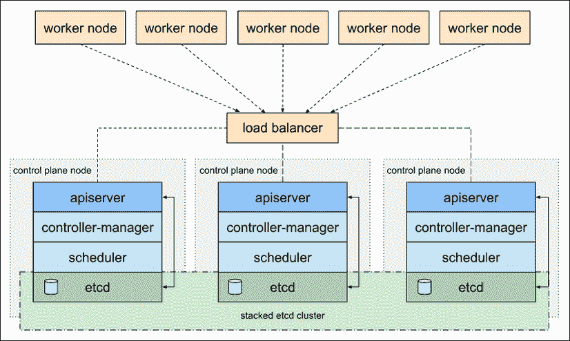
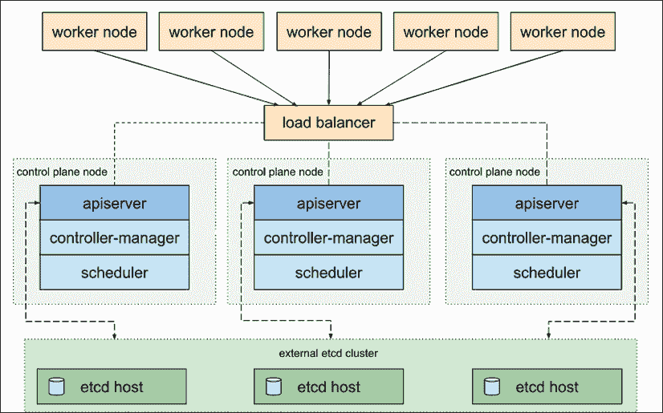
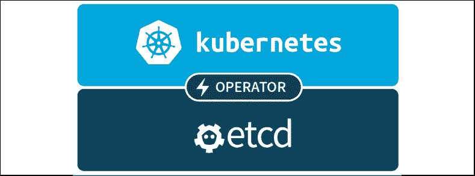
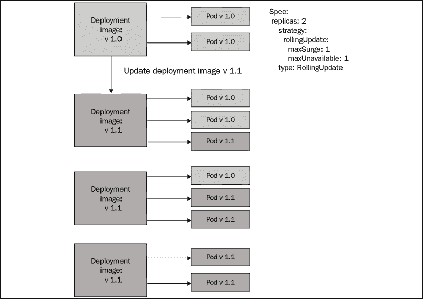
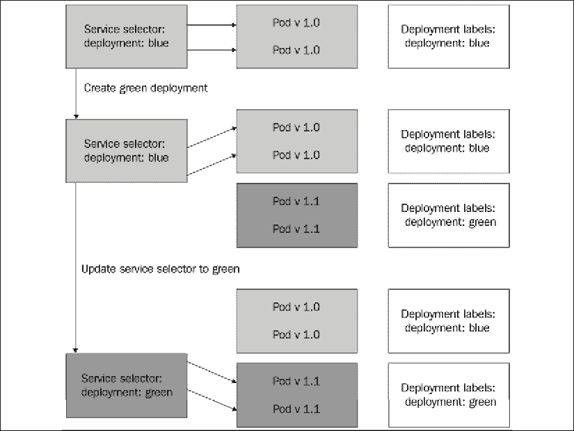
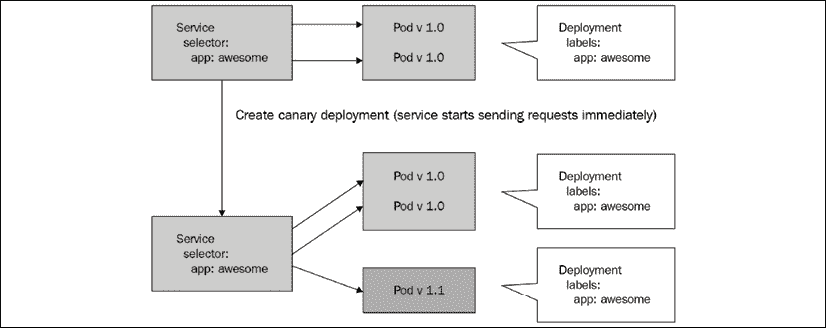

# 三、高可用性和可靠性

在*第 2 章*、*创建 Kubernetes 集群*中，我们学习了如何在不同的环境中创建 Kubernetes 集群，实验了不同的工具，并创建了几个集群。创建 Kubernetes 集群只是故事的开始。一旦集群启动并运行，您需要确保它保持运行。

在本章中，我们将深入探讨高可用性集群的主题。这是一个复杂的话题。Kubernetes 项目和社区还没有确定一个真正的方法来实现高可用性涅槃。高可用性 Kubernetes 集群有许多方面，例如确保控制平面在出现故障时能够保持正常运行，保护 etcd 中的集群状态，保护系统数据，以及快速恢复容量和/或性能。不同的系统会有不同的可靠性和可用性要求。如何设计和实现高可用性的 Kubernetes 集群将取决于这些需求。

在本章的最后，您将了解与高可用性相关的各种概念，并熟悉 Kubernetes 高可用性最佳实践以及何时使用它们。您将能够使用不同的策略和技术升级实时集群，并且能够基于性能、成本和可用性之间的权衡在多种可能的解决方案之间进行选择。

# 高可用性概念

在本节中，我们将通过探索概念和构建可靠和高可用性系统的块来开始我们的高可用性之旅。百万(万亿？)美元问题是，我们如何从不可靠的组件构建可靠且高度可用的系统？组件将失败；你可以把它拿到银行。硬件会出现故障；网络将会失败；配置会出错；软件会有 bugs 人都会犯错。接受这一点，我们需要设计一个即使在组件出现故障时也能可靠且高度可用的系统。这个想法是从冗余开始，检测组件故障，快速更换坏组件。

## 裁员

冗余是硬件和数据层面上可靠和高可用性系统的基础。如果某个关键组件出现故障，并且您希望系统保持运行，那么您必须准备好另一个相同的组件。Kubernetes 本身通过复制控制器和副本集来处理您的无状态 pods。但是，当某些组件出现故障时，etcd 中的集群状态和主组件本身需要冗余才能运行。此外，如果系统的有状态组件没有由冗余存储备份(例如，在云平台上)，则需要添加冗余以防止数据丢失。

## 热插拔

热插拔是在不关闭系统的情况下动态更换故障组件的概念，对用户的中断最小(理想情况下为零)。如果组件是无状态的(或者它的状态存储在单独的冗余存储中)，那么热交换一个新组件来替换它是很容易的，并且只涉及将所有客户端重定向到新组件。但是，如果它存储本地状态，包括在内存中，那么热交换就不是微不足道的。有两个主要选项:

*   放弃飞行中的交易
*   保持热副本同步

第一种解决方案要简单得多。大多数系统都有足够的弹性来应对故障。客户端可以重试失败的请求，热交换组件将为它们提供服务。

第二种解决方案更加复杂和脆弱，并且会导致性能开销，因为每个交互都必须复制到两个副本(并得到确认)。对于系统的某些部分，这可能是必要的。

## 领导人选举

领导者或主人选举是分布式系统中常见的模式。您通常有多个相同的组件协作并分担负载，但是一个组件被选为领导者，某些操作通过领导者序列化。您可以将具有领导者选举的分布式系统视为冗余和热插拔的组合。组件都是冗余的，当当前的领导者失败或变得不可用时，会选出一个新的领导者并进行热插拔。

## 智能负载平衡

负载平衡是指将工作负载分布在多个为传入请求提供服务的副本上。这对于通过调整副本数量在高负载下进行纵向和横向扩展非常有用。当某些副本失败时，负载平衡器将停止向失败或无法访问的组件发送请求。Kubernetes 将调配新副本、恢复容量并更新负载平衡器。Kubernetes 通过服务、端点、副本集、标签和入口控制器提供了很好的工具来支持这一点。

## 幂等性

许多类型的失败可能是暂时的。这在网络问题或过于严格的超时中最为常见。不响应运行状况检查的组件将被视为不可达，另一个组件将取代它。为可能出现故障的组件安排的工作可能会发送到另一个组件。但是原始组件可能仍在工作，并完成相同的工作。最终结果是同一项工作可能会执行两次。很难避免这种情况。为了支持一次性语义，您需要在开销、性能、延迟和复杂性方面付出沉重的代价。因此，大多数系统选择支持至少一次语义，这意味着在不违反系统数据完整性的情况下，相同的工作可以执行多次。这个属性叫做幂等性。幂等系统保持它们的状态，即使一个操作被执行多次。

## 自愈

当动态系统中出现组件故障时，您通常希望系统能够自我修复。Kubernetes 复制控制器和副本集是自我修复系统的绝佳范例。但是失败可能会远远超出豆荚。自我修复始于自动检测问题，然后是自动解决问题。配额和限制有助于建立制衡机制，以确保自动自我修复不会因 DDOS 攻击等不可预测的情况而失控。自我修复系统通过重试失败的操作和只有在没有其他选择的情况下才升级失败来很好地处理短暂的失败。一些自愈系统具有后备路径，包括在最新内容不可用时提供缓存内容。自愈系统试图优雅地降级并继续工作，直到核心问题得到解决。

在本节中，我们考虑了创建可靠和高可用性系统所涉及的各种概念。在下一节中，我们将应用它们，并演示在 Kubernetes 集群上部署的系统的最佳实践。

# 高可用性最佳实践

构建可靠且高度可用的分布式系统是一项不平凡的工作。在本节中，我们将检查一些最佳实践，这些实践使基于 Kubernetes 的系统能够可靠地运行，并在面对各种故障类别时可用。我们还将深入探讨如何构建您自己的高可用性集群。

请注意，您应该仅在非常特殊的情况下滚动自己的高可用性 Kubernetes 集群。像**库贝斯雷**这样的工具提供了经过战斗考验的创建高可用性集群的方法。你应该充分利用这些工具的所有工作和努力。

## 创建高可用性集群

要创建高可用性 Kubernetes 集群，主组件必须是冗余的。这意味着 etcd 必须部署为集群(通常跨越三个或五个节点)，并且 Kubernetes API 服务器必须是冗余的。如有必要，辅助集群管理服务，如**堆存储**也可以冗余部署。下图描述了堆叠 etcd 拓扑中典型的可靠且高可用性的 Kubernetes 集群。有几个负载平衡的主节点，每个节点包含整个主组件和一个 etcd 组件:



图 3.1:高可用性集群配置

这不是配置高可用集群的唯一方法。例如，您可能更喜欢部署一个独立的 etcd 集群来优化机器以适应它们的工作负载，或者您需要 etcd 集群比其他主节点有更多的冗余。

下图显示了一个 Kubernetes 集群，其中 etcd 被部署为外部集群:



图 3.2:用作外部集群的 etcd

自我托管的 Kubernetes 集群，其中控制平面组件被部署为 pods 和集群中的状态集，是通过将 Kubernetes 应用于 Kubernetes 来简化控制平面组件的健壮性、灾难恢复和自我修复的好方法。

## 使您的节点可靠

节点会出现故障，或者某些组件会出现故障，但许多故障都是暂时的。基本保证是确保 Docker 守护程序(或者无论 CRI 实现是什么)和 kubelet 在出现故障时自动重启。

如果您运行 CoreOS，一个现代的基于 Debian 的 OS(包括 Ubuntu >= 16.04)，或者任何其他使用`systemd`作为其`init`机制的 OS，那么很容易部署 Docker 和 kubelet 作为自启动守护程序:

```
systemctl enable docker
systemctl enable kublet 
```

对于其他操作系统，Kubernetes 项目选择`monit`作为其高可用性示例，但是您可以使用任何您喜欢的过程监视器。主要要求是确保这两个关键组件在发生故障时能够重启，无需外部干预。

## 保护您的集群状态

Kubernetes 集群状态存储在 etcd 中。etcd 集群被设计成超级可靠的，并且分布在多个节点上。利用这些功能来构建可靠且高可用性的 Kubernetes 集群非常重要。

### 聚类 etcd

您的 etcd 集群中应该至少有三个节点。如果您需要更高的可靠性和冗余性，您可以选择五个、七个或任何其他奇数个节点。在网络分裂的情况下，节点的数量必须是奇数才能获得明显的多数。

为了创建集群，etcd 节点应该能够发现彼此。有几种方法可以实现这一点。我建议使用 CoreOS 优秀的 etcd 操作器:



图 3.3:Kubernetes etcd 操作员标志

操作员负责 etcd 操作的许多复杂方面，例如:

*   创造和毁灭
*   调整大小
*   故障转移
*   滚动升级
*   备份和恢复

#### 安装 etcd 操作员

安装 etcd 操作器最简单的方法是使用 Helm–Kubernetes 包管理器。如果您还没有安装 Helm，请按照这里的说明操作:[https://github.com/kubernetes/helm#install](https://github.com/kubernetes/helm#install)。

接下来，将以下 YAML 保存到`helm-rbac.yaml`:

```
---
apiVersion: v1
kind: ServiceAccount
metadata:
  name: tiller
  namespace: kube-system
---
apiVersion: rbac.authorization.k8s.io/v1beta1
kind: ClusterRoleBinding
metadata:
  name: tiller
roleRef:
  apiGroup: rbac.authorization.k8s.io
  kind: ClusterRole
  name: cluster-admin
subjects:
  - kind: ServiceAccount
    name: tiller
    namespace: kube-system 
```

这将为 Tiller 创建一个服务帐户，并赋予它一个集群管理员角色:

```
$ k apply -f helm-rbac.yaml
serviceaccount/tiller created
clusterrolebinding.rbac.authorization.k8s.io/tiller created 
```

然后用 Tiller 服务帐户初始化 Helm:

```
$ helm2 init --service-account tiller
$HELM_HOME has been configured at /Users/gigi.sayfan/.helm.
Tiller (the Helm server-side component) has been installed into your Kubernetes Cluster.
Please note: by default, Tiller is deployed with an insecure 'allow unauthenticated users' policy.To prevent this, run 'helm init' with the --tiller-tls-verify flag.
For more information on securing your installation see: https://docs.helm.sh/using_helm/#securing-your-helm-installation 
```

此时不要担心警告。我们将在*第 9 章*、*包装应用*中深入探讨 Helm。

现在，我们终于可以安装 etcd 操作器了。我使用`x`作为一个简短的发布名称，以使输出不那么冗长。您可能希望使用更有意义的名称:

```
$ helm2 install stable/etcd-operator --name x
NAME:   x
LAST DEPLOYED: Thu May 28 17:33:16 2020
NAMESPACE: default
STATUS: DEPLOYED
RESOURCES:
==> v1/Pod(related)
NAME                                                   READY  STATUS   RESTARTS  AGE
x-etcd-operator-etcd-backup-operator-dffcbd97-hfsnc    0/1    Pending  0         0s
x-etcd-operator-etcd-operator-669975754b-vhhq5         0/1    Pending  0         0s
x-etcd-operator-etcd-restore-operator-6b787cc5c-6dk77  0/1    Pending  0         0s
==> v1/Service
NAME                   TYPE       CLUSTER-IP     EXTERNAL-IP  PORT(S)    AGE
etcd-restore-operator  ClusterIP  10.43.182.231  <none>       19999/TCP  0s
==> v1/ServiceAccount
NAME                                   SECRETS  AGE
x-etcd-operator-etcd-backup-operator   1        0s
x-etcd-operator-etcd-operator          1        0s
x-etcd-operator-etcd-restore-operator  1        0s
==> v1beta1/ClusterRole
NAME                           AGE
x-etcd-operator-etcd-operator  0s
==> v1beta1/ClusterRoleBinding
NAME                                   AGE
x-etcd-operator-etcd-backup-operator   0s
x-etcd-operator-etcd-operator          0s
x-etcd-operator-etcd-restore-operator  0s
==> v1beta2/Deployment
NAME                                   READY  UP-TO-DATE  AVAILABLE  AGE
x-etcd-operator-etcd-backup-operator   0/1    1           0          0s
x-etcd-operator-etcd-operator          0/1    1           0          0s
x-etcd-operator-etcd-restore-operator  0/1    1           0          0s
NOTES:
1\. etcd-operator deployed.
  If you would like to deploy an etcd-cluster set cluster.enabled to true in values.yaml
  Check the etcd-operator logs
    export POD=$(kubectl get pods -l app=x-etcd-operator-etcd-operator --namespace default --output name)
    kubectl logs $POD --namespace=default 
```

现在操作符已经安装好了，我们可以用它来创建 etcd 集群。

#### 创建 etcd 集群

将以下内容保存到`etcd-cluster.yaml`:

```
apiVersion: "etcd.database.coreos.com/v1beta2"
kind: "EtcdCluster"
metadata:
  name: "example-etcd-cluster"
spec:
  size: 3
  version: "3.2.13" 
```

要创建集群类型，请使用以下命令:

```
$ k create -f etcd-cluster.yaml
etcdcluster.etcd.database.coreos.com/etcd-cluster created 
```

让我们验证集群单元是否创建正确:

```
$ k get pods -o wide | grep etcd-cluster
etcd-cluster-2fs2lpz7p7      1/1     Running   0     2m53s   10.42.2.4   k3d-k3s-default-worker-1
etcd-cluster-58547r5f6x      1/1     Running   0     3m49s   10.42.1.5   k3d-k3s-default-worker-0
etcd-cluster-z7s4bfksdl      1/1     Running   0     117s    10.42.3.5   k3d-k3s-default-worker-2 
```

正如你看到的，每个 etcd pod 被安排在不同的节点上运行。这正是我们对 etcd 这样的冗余数据存储区的期望。

kubectl 的`get`命令的`-o`宽格式为`get pods`命令提供了附加信息，POD 的节点被安排在该命令上。

### 正在验证 etcd 集群

一旦 etcd 集群启动并运行，您可以使用`etcdctl`工具访问它，以检查集群状态和运行状况。Kubernetes 允许您通过`exec`命令(类似于`docker exec`)直接在豆荚或容器中执行命令。

以下是如何检查集群是否健康:

```
$ k exec etcd-cluster-2fs2lpz7p7 -- etcdctl cluster-health
member 1691519f36d795b7 is healthy: got healthy result from http://etcd-cluster-2fs2lpz7p7.etcd-cluster.default.svc:2379
member 1b67c8cb37fca67e is healthy: got healthy result from http://etcd-cluster-58547r5f6x.etcd-cluster.default.svc:2379
member 3d4cbb73aeb3a077 is healthy: got healthy result from http://etcd-cluster-z7s4bfksdl.etcd-cluster.default.svc:2379
cluster is healthy 
```

以下是如何设置和获取键值对:

```
$ k exec etcd-cluster-2fs2lpz7p7 -- etcdctl set test "Yeah, it works"
Yeah, it works
$ k exec etcd-cluster-2fs2lpz7p7 -- etcdctl get test
Yeah, it works 
```

## 保护您的数据

保护集群状态和配置非常好，但更重要的是保护您自己的数据。如果集群状态被破坏，您可以从头开始重建集群(尽管在重建期间该集群将不可用)。但是如果你自己的数据被破坏或丢失，你就有大麻烦了。同样的规则也适用:冗余为王。但是，虽然 Kubernetes 集群状态非常动态，但您的许多数据可能不太动态。

例如，许多历史数据通常很重要，可以备份和恢复。实时数据可能会丢失，但整个系统可能会恢复到较早的快照，并且只受到暂时的损坏。

您应该考虑 **Velero** 作为备份整个集群的解决方案，包括您自己的数据。Heptio(现在是 VMware 的一部分)开发了 Velero，这是一个开放的源代码，可能是关键系统的救命稻草。

在 [https://velero.io](https://velero.io) 查看。

## 运行冗余应用编程接口服务器

API 服务器是无状态的，从 etcd 集群中动态获取所有必要的数据。这意味着您可以轻松运行多个应用编程接口服务器，而无需在它们之间进行协调。一旦运行了多个应用编程接口服务器，就可以在它们前面放置一个负载平衡器，使其对客户端透明。

## 与 Kubernetes 一起竞选领导人

一些主组件，如调度器和控制器管理器，不能同时有多个实例处于活动状态。这将是混乱的，因为多个调度器会试图将同一个 pod 调度到多个节点中，或者多次调度到同一个节点中。拥有高度可扩展的 Kubernetes 集群的正确方法是让这些组件在领导者选举模式下运行。这意味着多个实例正在运行，但一次只有一个实例处于活动状态，如果失败，另一个实例将被选为领导者并取而代之。

Kubernetes 通过`--leader-elect`标志支持该模式。调度器和控制器管理器可以通过将它们各自的清单复制到`/etc/kubernetes/manifests`来部署为 pods。

下面是显示标志使用的`scheduler`清单的一个片段:

```
 command:
    - /bin/sh
    - -c
    - /usr/local/bin/kube-scheduler --master=127.0.0.1:8080 --v=2 --leader-elect=true 1>>/var/log/kube-scheduler.log
      2>&1 
```

下面是控制器管理器清单的一个片段，显示了标志的使用:

```
 - command:
    - /bin/sh
    - -c
    - /usr/local/bin/kube-controller-manager --master=127.0.0.1:8080 --cluster-name=e2e-test-bburns
      --cluster-cidr=10.245.0.0/16 --allocate-node-cidrs=true --cloud-provider=gce  --service-account-private-key-file=/srv/kubernetes/server.key
      --v=2 --leader-elect=true 1>>/var/log/kube-controller-manager.log 2>&1
    image: gcr.io/google\_containers/kube-controller-manager:fda24638d51a48baa13c35337fcd4793 
```

还有其他几面控制领导人选举的旗帜。所有这些都有合理的违约:

```
--leader-elect-lease-duration duration     Default: 15s
--leader-elect-renew-deadline duration     Default: 10s
--leader-elect-resource-lock endpoints     Default: "endpoints" ("configmaps" is the other option)
--leader-elect-retry-period duration       Default: 2s 
```

请注意，这些组件不可能像其他 POD 一样由 Kubernetes 自动重启，因为这些正是负责重启故障 POD 的 Kubernetes 组件，因此如果它们出现故障，将无法自行重启。必须有现成的替代产品已经在运行。

## 使您的登台环境高度可用

高可用性的设置并不简单。如果您不厌其烦地设置高可用性，这意味着有一个高可用性系统的业务案例。因此，您希望在将集群部署到生产环境之前测试其可靠性和高可用性(除非您是在生产环境中进行测试的网飞)。此外，理论上，对集群的任何更改都可能会破坏您的高可用性，而不会中断其他集群功能。关键是，就像其他事情一样，如果你不测试它，就假设它不起作用。

我们已经确定您需要测试可靠性和高可用性。最好的方法是创建一个尽可能紧密地复制您的生产环境的暂存环境。这会变得很贵。管理成本有几种方法:

*   **临时高可用性试运行环境**:仅在高可用性测试期间创建大型高可用性集群。
*   **压缩时间**:提前创建有趣的事件流和场景，馈入输入，快速连续模拟情境。
*   **将高可用性测试与性能和压力测试相结合**:在性能和压力测试结束时，让系统过载，看看可靠性和高可用性配置如何处理负载。

## 测试高可用性

测试高可用性需要规划和对系统的深入了解。每个测试的目标都是揭示系统设计和/或实现中的缺陷，并提供足够好的覆盖率，如果测试通过，您将确信系统的行为符合预期。

在可靠性、自我修复和高可用性领域，这意味着您需要找出打破系统的方法，并看着它自我修复。

这需要几个要素，如下所示:

*   可能故障的全面列表(包括合理的组合)
*   对于每个可能的故障，应该清楚系统应该如何响应
*   导致失败的一种方法
*   一种观察系统反应的方法

没有一个元素是微不足道的。以我的经验来看，最好的方法是渐进地去做，并尝试提出相对较少数量的通用故障类别和通用响应，而不是详尽的、不断变化的低级故障列表。

例如，一般故障类别是节点无响应；通用响应可以是重启节点；引发故障的方法可能是停止节点的虚拟机(如果是虚拟机)。观察结果应该是，当节点关闭时，系统仍然基于标准验收测试正常运行；节点最终启动，系统恢复正常。您可能还想测试许多其他东西，例如是否记录了问题，相关警报是否发给了正确的人，以及各种统计数据和报告是否得到了更新。

但是要小心过度概括。在通用无响应节点故障的情况下，一个关键组件是检测节点是否无响应。如果您的检测方法有问题，那么您的系统将无法正常反应。使用最佳实践，如健康检查和准备情况检查。

请注意，有时，一个故障无法在一次响应中解决。例如，在我们的无响应节点的情况下，如果是硬件故障，那么重新启动将没有帮助。在这种情况下，第二行响应开始发挥作用，并且可能会提供一个新节点来替换故障节点。在这种情况下，您不能过于一般化，您可能需要为节点上的特定类型的 pod/角色(如 etcd、master、worker、database 和 monitoring)创建测试。

如果您有高质量的需求，准备花更多的时间来设置适当的测试环境和测试，甚至比生产环境还要多。

最后一点很重要，那就是尽量不要太深奥。这意味着，理想情况下，您的生产系统将不具备允许关闭部分系统或使其配置为以降低的测试容量运行的测试功能。原因是它增加了您系统的攻击面，并且它可能是由配置错误意外触发的。理想情况下，您可以控制您的测试环境，而无需修改将在生产中部署的代码或配置。使用 Kubernetes，通常很容易注入带有自定义测试功能的容器和容器，这些功能可以与登台环境中的系统组件交互，但永远不会在生产中部署。

在本节中，我们研究了如何真正拥有一个可靠且高可用性的集群，包括 etcd、API 服务器、调度器和控制器管理器。我们考虑了保护集群本身以及您的数据的最佳实践，并特别关注了启动环境和测试的问题。

# 高可用性、可扩展性和容量规划

高可用性系统也必须是可扩展的。最复杂的分布式系统上的负载会根据一天中的时间、工作日与周末、季节影响、营销活动和许多其他因素而发生巨大变化。随着时间的推移，成功的系统会有更多的用户，积累越来越多的数据。这意味着集群的物理资源(主要是节点和存储)也必须随着时间的推移而增长。如果您的集群资源调配不足，它将无法满足所有需求，并且将不可用，因为请求将超时或排队，并且处理速度不够快。

这是产能规划的境界。一个简单的方法是过度配置集群。预测需求，确保你有足够的缓冲来应对活动高峰。但是要知道这种方法有几个缺陷:

*   对于高度动态和复杂的分布式系统，甚至很难近似预测需求。
*   过度供应成本高昂。你花了很多钱在很少或从未使用过的资源上。
*   您必须定期重做整个过程，因为系统的平均和峰值负载会随着时间的推移而变化。

一个更好的方法是使用基于意图的容量规划，其中使用高级抽象，并且系统相应地调整自己。在 Kubernetes 的环境中，有**水平 POD 自动缩放器** ( **HPA** )可以增加和减少处理特定服务请求所需的 POD 的数量。但是，这只能改变分配给不同服务的资源比例。当整个集群接近饱和时，您只需要更多的资源。这就是集群自动缩放器发挥作用的地方。这是一个随着 Kubernetes 1.8 推出的 Kubernetes 项目。它在云环境中工作得特别好，在云环境中，可以通过编程 API 提供额外的资源。

当**集群自动缩放器** ( **CA** )确定不能调度 POD(即处于挂起状态)时，它为集群提供一个新节点。如果它确定集群中的节点多于处理负载所需的数量，它也可以从集群中删除节点。CA 将每 30 秒检查一次待处理的 POD。它将仅在 10 分钟未使用后移除节点，以避免系统崩溃。

以下是一些需要考虑的问题:

*   一个集群可能需要更多的节点，即使总的 CPU 或内存利用率很低，这是由于控制机制，如亲和性、反亲和性、污染、耐受性、pod 优先级和 pod 中断预算。
*   除了触发节点扩展或缩减的内置延迟之外，从云提供商调配新节点时还会额外延迟几分钟。
*   HPA 和 CA 之间的相互作用可能是微妙的。

## 安装集群自动缩放器

请注意，您不能在本地测试证书颁发机构。您必须在以下支持的云提供商之一上运行 Kubernetes 集群:

*   普通教育证书
*   GKE
*   前情提要
*   蔚蓝的
*   阿里巴巴云
*   百度云

我已经成功地在 GKE 和 EKS 安装了认证中心。

`eks-cluster-autoscaler.yaml`文件包含了在 EKS 安装 CA 所需的所有 Kubernetes 资源。它包括创建一个服务帐户并授予它各种 RBAC 权限，因为它需要监控整个集群中的节点使用情况并能够对其采取行动。最后，有一个部署实际上使用命令行界面部署 CA 映像本身，该界面包括它应该维护的节点范围(即最小和最大数量)，在 EKS 的情况下，还需要一个节点组。最大数量对于防止攻击或错误导致证书颁发机构无法控制地添加越来越多的节点，从而增加巨额账单的情况非常重要。以下是 pod 模板的一个片段:

```
 spec:       serviceAccountName: cluster-autoscaler
      containers:       - image: k8s.gcr.io/cluster-autoscaler:v1.2.2
        name: cluster-autoscaler
        resources:
          limits:
            cpu: 100m
            memory: 300Mi
          requests:
            cpu: 100m
            memory: 300Mi
        command:
        - ./cluster-autoscaler
        - --v=4         - --stderrthreshold=info
        - --cloud-provider=aws
        - --skip-nodes-with-local-storage=false         - --nodes=2:5:eksctl-project-nodegroup-ng-name-NodeGroup-suffix
        env:         - name: AWS_REGION
          value: us-east-1         volumeMounts:         - name: ssl-certs
          mountPath: /etc/ssl/certs/ca-certificates.crt
          readOnly: true         imagePullPolicy: "Always"       volumes:       - name: ssl-certs
        hostPath:           path: "/etc/ssl/certs/ca-bundle.crt" 
```

HPA 和 CA 的组合提供了一个真正弹性的集群，其中 HPA 确保服务使用适当数量的 pods 来处理每个服务的负载，CA 确保节点数量与集群上的整体负载相匹配。

## 考虑到垂直 POD 自动缩放器

**垂直 POD 自动标尺** ( **VPA** )是在 POD 上运行的另一个自动标尺。它的工作是为限制太低的 POD 提供额外的资源(中央处理器和内存)。它主要是为有状态服务设计的，但是也可以用于无状态服务。它基于 CRD(自定义资源定义)，有三个组成部分:

*   **推荐器**:监视 CPU 和内存使用情况，并为 CPU 和内存请求的新值提供推荐
*   **更新器**:杀死托管荚，其 CPU 和内存请求与推荐器的推荐不匹配
*   **准入插件**:根据建议为新的或重新创建的 POD 设置 CPU 和内存请求

VPA 还在测试阶段。以下是一些主要的限制:

*   无法更新正在运行的 pods(因此，更新程序会杀死 pods，以便用正确的请求重新启动它们)
*   不能驱逐不受控制器管理的豆荚
*   VPA 与住房津贴不相容

本节讲述了自动可伸缩性和高可用性之间的相互作用，并研究了扩展 Kubernetes 集群和在这些集群上运行的应用的不同方法。

# 实时集群更新

运行 Kubernetes 集群涉及的最复杂和最危险的任务之一是实时升级。不同版本的系统不同部分之间的交互往往很难预测，但在很多情况下是需要的。拥有许多用户的大型集群无法承受离线维护的代价。攻击复杂性的最好方法是分而治之。微服务架构在这方面帮助很大。你永远不会升级你的整个系统。您只是不断地升级几组相关的微服务，如果 API 发生了变化，那么您也升级了它们的客户端。一个设计合理的升级至少会保持向后兼容性，直到所有的客户端都被升级，然后在几个版本中摒弃旧的 API。

在本节中，我们将讨论如何使用各种策略更新集群，例如滚动更新、蓝绿色部署和 canary 部署。我们还将讨论何时引入中断升级相对于向后兼容升级是合适的。然后，我们将进入模式和数据迁移的关键主题。

## 滚动更新

滚动更新是从当前版本到下一个版本逐渐更新组件的更新。这意味着您的集群将同时运行当前组件和新组件。这里有两种不同的情况需要考虑:

*   新组件是向后兼容的
*   新组件不是向后兼容的

如果新组件是向后兼容的，那么升级应该非常容易。在 Kubernetes 的早期版本中，您必须使用标签非常小心地管理滚动更新，并逐渐改变新旧版本的副本数量(尽管 Kubernetes 滚动更新对于复制控制器来说是一种方便的快捷方式)。但是，Kubernetes 1.2 中引入的部署资源使它变得更加容易，并且支持副本集。它内置了以下功能:

*   运行服务器端(如果您的机器断开连接，它会继续运行)
*   版本控制
*   多个并发展开
*   更新部署
*   汇总所有 POD 的状态
*   卷回
*   金丝雀部署
*   多种升级策略(默认为滚动升级)

以下是部署三个 nginx POD 的部署示例清单:

```
apiVersion: apps/v1
kind: Deployment
metadata:
  name: nginx-deployment
  labels:
    app: nginx
spec:
  replicas: 3   selector:
    matchLabels:
      app: nginx
  template:
    metadata:
      labels:
        app: nginx
    spec:
      containers:
      - name: nginx
        image: nginx:1.7.9         ports:
        - containerPort: 80 
```

资源的种类是`Deployment`，它有一个名字`nginx-deployment`，你可以在以后使用它来引用这个部署(例如，更新或回滚)。当然，最重要的部分是规范，它包含一个 pod 模板。副本决定了集群中有多少个容器，模板规范具有每个容器的配置。在这种情况下，这只是一个容器。

要开始滚动更新，请创建部署资源并检查它是否已成功推出:

```
$ k create -f nginx-deployment.yaml
deployment.apps/nginx-deployment created
$ k rollout status deployment/nginx-deployment
deployment "nginx-deployment" successfully rolled out 
```

部署有一个更新策略，默认为`rollingUpdate`:

```
$ k get deployment nginx-deployment -o yaml | grep strategy -A 4
strategy:
    rollingUpdate:
      maxSurge: 25%
      maxUnavailable: 25%
    type: RollingUpdate 
```

下图说明了滚动更新的工作原理:



图 3.4:滚动更新是如何进行的

### 复杂部署

当您只想升级一个 pod 时，部署资源是很棒的，但是您可能经常需要升级多个 pod，并且那些 pod 有时会有版本间依赖性。在这些情况下，您有时必须放弃滚动更新或引入临时兼容层。例如，假设服务 A 依赖于服务 B。服务 B 现在有一个突破性的变化。服务 A 的 v1 pods 不能与服务 B v2 的 pods 互操作。从可靠性和变更管理的角度来看，让服务 B 的 v2 pods 支持新旧 API 也是不可取的。在这种情况下，解决方案可能是引入一个适配器服务，实现 B 服务的 v1 API。这项服务将位于 A 和 B 之间，并将跨版本翻译请求和响应。这增加了部署过程的复杂性，需要几个步骤，但好处是 A 和 B 服务本身很简单。你可以跨不兼容的版本进行滚动更新，一旦所有人都升级到 v2(所有的 A 和 B)。

但是滚动更新并不总是解决问题的办法。

## 蓝绿色部署

滚动更新对于可用性来说非常好，但是有时候管理一个适当的滚动更新所涉及的复杂性被认为太高了，或者它增加了大量的工作，从而推迟了更重要的项目。在这些情况下，蓝绿色升级提供了一个很好的选择。通过蓝绿色版本，您可以用新版本准备生产环境的完整拷贝。现在你有两份，旧的(蓝色)和新的(绿色)。哪个是蓝色的哪个是绿色的并不重要。重要的是，您有两个完全独立的生产环境。目前，蓝色处于活动状态，为所有请求提供服务。你可以在绿色上运行所有测试。一旦你高兴了，你就扳动开关，绿色就开始活跃起来。如果出了问题，回滚也一样容易；只需从绿色切换回蓝色。

下图说明了蓝绿色部署如何使用两个部署、两个标签和一个使用标签选择器从蓝色部署切换到绿色部署的服务来工作:



图 3.5:实践中的蓝绿色部署

我完全忽略了前面讨论的存储和内存状态。这个即时切换假设蓝色和绿色仅由无状态组件组成，并且共享一个公共持久层。

如果外部客户端可访问的应用编程接口发生存储更改或中断更改，则需要采取附加步骤。例如，如果蓝色和绿色都有自己的存储，那么所有传入的请求可能都需要发送到蓝色和绿色，绿色可能需要从蓝色摄取历史数据才能在切换前同步。

## 金丝雀部署

蓝绿色部署很酷。然而，有时需要更细致的方法。假设您负责一个有许多用户的大型分布式系统。开发人员计划部署他们服务的新版本。他们在测试和试运行环境中测试了新版本的服务。但是，生产环境太复杂了，不能为了测试目的而逐个复制。这意味着存在服务在生产中出现问题的风险。这就是金丝雀部署的亮点。

基本思路是在生产中测试服务，但能力有限。这样，如果新版本出现问题，只有一小部分用户或一小部分请求会受到影响。这可以很容易地在 pod 级别的 Kubernetes 中实现。如果一个服务由 10 个 pod 备份，那么您部署新版本，然后只有 10%的请求将由服务负载平衡器路由到 canary pod，而 90%的请求仍将由当前版本提供服务。

下图说明了这种方法:



图 3.6:实践中的 Canary 部署

有更复杂的方法使用服务网格将流量路由到金丝雀部署。我们将在后面的章节中研究这一点(*第 14 章*、*利用服务网格*)。

让我们解决管理数据契约变更的难题。

## 管理数据合同变更

数据契约描述了数据是如何组织的。这是结构元数据的总称。最常见的例子是关系数据库模式。其他示例包括网络有效负载、文件格式，甚至字符串参数或响应的内容。如果您有一个配置文件，那么这个配置文件既有文件格式(JSON、YAML、TOML、XML、INI 或自定义格式)，也有一些描述什么样的层次结构、键、值和数据类型是有效的内部结构。数据契约有时是显式的，有时是隐式的。无论哪种方式，您都需要小心管理它，否则当正在读取、解析或验证的代码遇到具有不熟悉结构的数据时，您将会得到运行时错误。

## 迁移数据

数据迁移是一件大事。如今，许多系统管理着以万亿字节、千兆字节或更多为单位的惊人数据量。在可预见的未来，收集和管理的数据量将继续增加。数据采集的步伐超过了硬件创新的步伐。关键的一点是，如果您有很多数据，并且需要迁移，这可能需要一段时间。在以前的一家公司，我监督了一个项目，将接近 100 兆字节的数据从一个遗留系统的卡珊德拉集群迁移到另一个卡珊德拉集群。

第二个卡珊德拉集群有一个不同的模式，被 Kubernetes 集群全天候访问。这个项目非常复杂，因此当紧急问题出现时，它总是被推迟。在最初的评估之后很久，遗留系统仍然与下一代系统并存。

有很多机制可以分割数据并将其发送到两个集群，但是我们在新系统中遇到了可扩展性问题，我们必须先解决这些问题，然后才能继续。历史数据很重要，但不必像最近的热门数据那样以相同的服务级别进行访问。因此，我们启动了另一个项目，将历史数据发送到更便宜的存储设备。当然，这意味着客户端库或前端服务必须知道如何查询两个存储并合并结果。当你处理大量数据时，你不能认为任何事情都是理所当然的。您的工具、基础架构、第三方依赖关系和流程会遇到可扩展性问题。走向大规模不仅仅是数量的变化；这通常也意味着质变。不要指望进展顺利。这比把一些文件从 A 复制到 b 要复杂得多。

## 贬低性 API

原料药的降价有两种方式:内部和外部。内部 API 是由您和您的团队或组织完全控制的组件使用的 API。可以肯定的是，所有的 API 用户都会在短时间内升级到新的 API 。外部 API 由您直接影响范围之外的用户或服务使用。当你为一个大型组织工作时，有一些灰色地带的情况(想想谷歌)，甚至内部应用接口也可能需要被视为外部应用接口。如果你幸运的话，你所有的外部 API 都被自动更新的应用或者通过你控制的网络接口使用。在这些情况下，应用编程接口实际上是隐藏的，您甚至不需要发布它。

如果你有很多用户(或者一些非常重要的用户)使用你的应用编程接口，你应该非常小心地考虑拒绝。放弃一个应用编程接口意味着你强迫你的用户改变他们的应用来和你一起工作或者保持锁定在一个更早的版本。

有几种方法可以减轻痛苦:

*   不要贬低。扩展现有的应用编程接口或保持以前的应用编程接口活动。它有时非常简单，尽管它增加了测试负担。
*   向目标受众提供所有相关编程语言的客户端库。这总是一个很好的做法。它允许您在不中断用户的情况下对底层 API 进行许多更改(只要您保持编程语言界面的稳定)。
*   如果您不得不反对，请解释原因，给用户留出充足的时间进行升级，并提供尽可能多的支持(例如，带有示例的升级指南)。你的用户会很感激的。

# 大型集群的性能、成本和设计权衡

在前一节中，我们看了实时集群升级和应用更新。我们探索了各种技术以及 Kubernetes 如何支持它们。我们也讨论了一些难题，比如打破变更、数据契约变更、数据迁移、API 贬值。在本节中，我们将考虑具有不同可靠性和高可用性属性的大型集群的各种选项和配置。当您设计集群时，您需要了解您的选项，并根据组织的需求做出明智的选择。

我们将讨论的主题包括各种可用性要求，从尽最大努力到零宕机的圣杯。最后，我们将确定实用的现场可靠性工程方法。对于每一类可用性，我们将从性能和成本的角度考虑其含义。

## 可用性要求

不同的系统对可靠性和可用性的要求大相径庭。此外，不同的子系统有非常不同的要求。例如，计费系统总是高优先级的，因为如果计费系统停机，你就不能赚钱。但是，即使在计费系统中，如果有时无法对费用提出异议，从业务角度来看也是可以的。

## 全力

与直觉相反，尽力意味着没有任何保证。如果成功了，太好了！如果它不起作用——哦，那你打算怎么办？这种可靠性和可用性水平对于经常变化的内部组件来说可能是合适的，因此使它们健壮的努力是不值得的。只要调用不可靠服务的服务或客户端能够处理偶尔的错误或中断，那么一切都很好。它也可能适合作为测试版在野外发布的服务。

尽最大努力对开发人员来说很重要。开发人员可以快速行动并打破东西。他们不担心后果，也不需要经过严格的测试和批准。尽力服务的性能可能比更健壮的服务更好，因为尽力服务通常可以跳过昂贵的步骤，例如验证请求、持久化中间结果和复制数据。但是，另一方面，更健壮的服务通常会进行大量优化，并且它们的支持硬件会根据它们的工作负载进行微调。尽力而为服务的成本通常较低，因为它们不需要采用冗余，除非运营商忽略了进行基本的容量规划，只是不必要的过度供应。

在 Kubernetes 的环境中，最大的问题是集群提供的所有服务是否都是尽力而为。如果是这种情况，那么集群本身不必是高可用性的。您可能只有一个主节点和一个 etcd 实例，可能不需要部署 Heapster 或其他监控解决方案。这通常只适用于本地开发集群。即使是多个开发人员使用的共享开发集群也应该具有相当高的可靠性和健壮性，否则每当集群意外关闭时，所有的开发人员都会无所事事。

## 维护窗口

在有维护窗口的系统中，特殊时间专用于执行各种维护活动，例如应用安全补丁、升级软件、清理日志文件和数据库清理。有了维护窗口，系统(或子系统)变得不可用。这是计划好的下班时间，通常会通知用户。维护窗口的好处是，您不必担心维护操作如何与进入系统的实时请求交互。它可以极大地简化操作。系统管理员和操作员喜欢维护窗口，就像开发人员喜欢尽力而为的系统一样。

当然，缺点是系统在维护过程中出现故障。这可能仅适用于用户活动受限于特定时间的系统(例如仅美国办公时间或工作日)。

使用 Kubernetes，您可以通过负载平衡器将所有传入的请求重定向到通知用户维护窗口的网页(或 JSON 响应)来设置维护窗口。

但是在大多数情况下，Kubernetes 的灵活性应该允许您进行实时维护。在极端情况下，例如升级 Kubernetes 版本，或者从 etcd v2 切换到 etcd v3，您可能需要求助于维护窗口。蓝绿色部署是另一种选择。但是集群越大，蓝绿色替代方案的范围就越广，因为您必须复制整个生产集群，这不仅成本高，还会导致配额不足等问题。

## 快速恢复

快速恢复是高可用性集群的另一个重要方面。总有一天会出问题。您的不可用时钟开始运行。多久能恢复正常？

有时候这不是你能决定的。例如，如果您的云提供商出现故障(并且您没有实现联合集群，我们将在后面讨论)，那么您只需等待，直到他们解决问题。但最有可能的罪魁祸首是最近部署的一个问题。当然，还有与时间相关的问题，甚至是与日历相关的问题。你还记得 2012 年 2 月 29 日搞垮微软 Azure 的闰年 bug 吗？

快速恢复的典型例子当然是蓝绿色部署——如果在发现问题时保持以前的版本运行。但是，这通常对部署期间或部署后不久发生的问题有好处。如果一个偷偷摸摸的 bug 处于休眠状态，并且在部署后几个小时才被发现，那么你将已经拆除了你的蓝色部署，并且你将无法恢复它。

另一方面，滚动更新意味着如果问题被提前发现，那么你的大部分 POD 仍然会运行以前的版本。

即使您的备份是最新的，并且您的恢复过程确实有效(一定要定期测试)，数据相关问题也可能需要很长时间才能得到解决。

像 Heptio Velero 这样的工具在某些情况下可以通过创建集群的快照备份来提供帮助，如果出现问题并且不确定如何修复，您可以恢复这些快照备份。

## 零停机时间

最后，我们得到了零停机系统。没有所谓的零停机系统。所有系统都失败了，所有软件系统肯定都失败了。有时故障严重到系统或其部分服务将关闭。将零宕机视为尽力而为的分布式系统设计。从提供大量冗余和机制来解决预期故障而不导致系统停机的意义上来说，您设计的是零停机。一如既往，请记住，即使有零宕机的业务案例，也不意味着每个组件都必须零宕机。可靠的(合理的)系统可以由高度不可靠的组件构成。

零停机计划如下:

*   **每一级冗余**:这是必须的条件。在你的设计中不能有一个单点故障，因为当它出现故障时，你的系统就瘫痪了。
*   **故障组件的自动热交换**:冗余只有在原始组件出现故障时，冗余组件才能立即启动。一些组件可以分担负载(例如，无状态 web 服务器)，因此不需要显式操作。在其他情况下，例如 Kubernetes 调度器和控制器管理器，您需要进行领导者选举，以确保集群保持运行。
*   **成吨的度量、监控和警报，以尽早发现问题**:即使有精心的设计，你也可能会错过一些东西，或者一些隐含的假设可能会使你的设计无效。通常，这种微妙的问题会悄悄出现在你身上，如果足够注意，你可能会在它成为全面的系统故障之前发现它。例如，假设有一种机制可以在磁盘空间超过 90%满时清理旧的日志文件，但由于某种原因，它不起作用。如果您设置了磁盘空间超过 95%满时的警报，那么您将会发现它并能够防止系统故障。
*   **部署到生产前的顽强测试**:综合测试已经证明自己是提高质量的可靠方法。对运行大型分布式系统的大型 Kubernetes 集群这样复杂的东西进行全面测试是一项艰巨的工作，但是您需要它。你应该测试什么？一切。没错。为了实现零宕机，您需要同时测试应用和基础架构。您 100%通过单元测试是一个很好的开始，但是它们不能提供太多的信心，当您在您的生产 Kubernetes 集群上部署应用时，它仍然会按预期运行。当然，最好的测试是在蓝绿色部署或相同的集群之后在您的生产集群上进行。考虑一个尽可能逼真的生产环境，而不是一个完全相同的集群。这是您应该运行的测试列表。这些测试中的每一个都应该是全面的，因为如果您留下一些未经测试的东西，它可能会被破坏:
    *   单元测试
    *   验收测试
    *   性能测试
    *   压力测试
    *   回滚测试
    *   数据恢复测试
    *   渗透测试

这听起来疯狂吗？很好。零停机、大规模系统很难。微软、谷歌、亚马逊、脸书和其他大公司有成千上万的软件工程师(加在一起)只负责基础设施、运营和确保一切正常运转，这是有原因的。

*   **保留原始数据**:对于很多系统来说，数据是最关键的资产。如果保留原始数据，您可以从以后发生的任何数据损坏和已处理的数据丢失中恢复。这不会真正帮助您实现零停机，因为重新处理原始数据可能需要一段时间，但它有助于实现零数据丢失，这通常更重要。这种方法的缺点是，与处理后的数据相比，原始数据通常很大。一个好的选择可能是将原始数据存储在比已处理数据更便宜的存储器中。
*   **认为正常运行时间是最后的手段**:好的。系统的某个部分瘫痪了。您可能仍然能够保持一定的服务水平。在许多情况下，您可以访问稍微陈旧的数据版本，或者让用户访问系统的其他部分。这不是一个很好的用户体验，但从技术上来说，该系统仍然可用。

## 现场可靠性工程

**现场可靠性工程**(**【SRE】**)是操作可靠的分布式系统的真实方法。SRE 欣然接受失败，并与**服务级别指标** ( **SLIs** )、**服务级别目标** ( **SLOs** )和**服务级别协议**(**SLA**)合作。每个服务都有一个目标，例如 95%的请求的延迟低于 50 毫秒。如果一项服务违反了它的目标，那么团队在继续开发新的特性和功能之前，会专注于解决问题。

SRE 的美妙之处在于，你可以在成本和性能上玩旋钮。如果你想在可靠性上投入更多，那就准备好用资源和开发时间来支付。

## 性能和数据一致性

当您开发或操作分布式系统时，CAP 定理应该永远在您的脑海中。CAP 代表一致性、可用性和分区容忍度。

一致性意味着每次读取都会收到最近的写入或错误。可用性意味着每个请求都会收到一个无错误的响应(但是该响应可能是陈旧的)。分区容差意味着即使节点之间任意数量的消息被网络丢弃或延迟，系统也能继续运行。

定理说，三个中你最多可以有两个。由于任何分布式系统都可能受到网络分区的影响，因此实际上您可以在 CP 或 AP 之间进行选择。CP 意味着为了保持一致性，系统在网络分区的情况下将不可用。AP 意味着系统将始终可用，但可能不一致。例如，从不同分区读取可能会返回不同的结果，因为其中一个分区没有收到写操作。在本节中，我们将重点介绍高可用性系统，也就是 AP。为了实现高可用性，我们必须牺牲一致性。但这并不意味着我们的系统会有损坏或任意的数据。关键词是最终一致性。我们的系统可能有点落后，并提供对有些陈旧的数据的访问，但最终，您会得到您所期望的。

当您开始考虑最终的一致性时，它为潜在的重大性能改进打开了大门。例如，如果某个重要值经常更新(例如，每秒)，但您只每分钟发送一次它的值，则您的网络流量减少了 60 倍，并且您平均只落后实时更新 30 秒。这是非常重要的。这是巨大的。您刚刚扩展了您的系统，以相同的资源量处理 60 倍更多的用户或请求。

# 摘要

在这一章中，我们研究了可靠且高度可用的大规模 Kubernetes 集群。这可以说是 Kubernetes 的最佳选择。虽然能够编排一个运行几个容器的小集群是有用的，但这不是必需的，但是在规模上，您必须有一个您可以信任的编排解决方案来随您的系统进行扩展，并提供实现这一点的工具和最佳实践。

现在，您已经对分布式系统中的可靠性和高可用性概念有了坚实的理解。您深入研究了运行可靠且高度可用的 Kubernetes 集群的最佳实践。您探索了实时 Kubernetes 集群升级的细微差别，您可以在可靠性和可用性级别以及性能和成本方面做出明智的设计选择。

在下一章中，我们将讨论 Kubernetes 中的重要安全主题。我们还将讨论保护 Kubernetes 的挑战和相关风险。我们将学习所有关于名称空间、服务帐户、准入控制、身份验证、授权和加密的知识。

# 参考

*   [https://kubernetes . io/docs/setup/production-environment/tools/kube dam/ha-topology/](https://kubernetes.io/docs/setup/production-environment/tools/kubeadm/ha-topology/)
*   [https://kubernetes . io/docs/setup/production-environment/tools/kube dam/high-availability/](https://kubernetes.io/docs/setup/production-environment/tools/kubeadm/high-availability/)
*   [https://medium . com/magalix/kubernetes-autoscaling-101-cluster-autoscaler-水平-pod-autoscaler-垂直-pod-2a441d9ad231](https://medium.com/magalix/kubernetes-autoscaling-101-cluster-autoscaler-horizontal-pod-autoscaler-and-vertical-pod-2a441d9ad231)