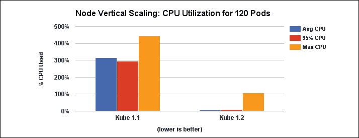
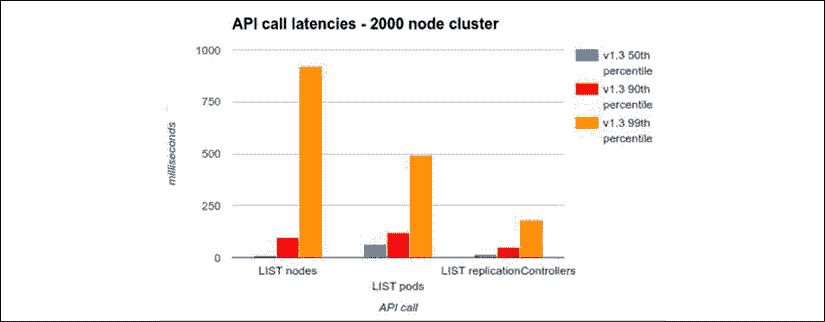
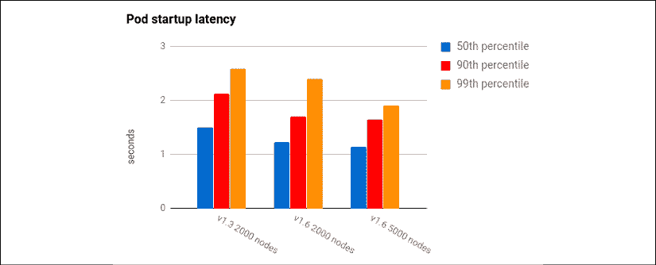

# 八、部署和更新应用

在本章中，我们将探讨 Kubernetes 提供的自动化 pod 可伸缩性，它如何影响滚动更新，以及它如何与配额交互。我们将讨论资源调配这一重要主题，以及如何选择和管理集群的大小。最后，我们将讨论 Kubernetes 团队如何提高 Kubernetes 的性能，以及他们如何使用 Kubemark 工具测试 Kubernetes 的极限。以下是我们将讨论的要点:

*   水平 POD 自动缩放
*   使用自动缩放执行滚动更新
*   用配额和限制处理稀缺资源
*   用 Kubernetes 的表演突破极限

在本章的最后，您将能够规划大规模集群，经济地调配它，并就性能、成本和可用性之间的各种权衡做出明智的决策。您还将了解如何设置水平 pod 自动缩放，并智能地使用资源配额，让 Kubernetes 自动处理数量的间歇性波动，以及将软件安全地部署到您的集群。

# 水平 POD 自动缩放

Kubernetes 可以监视您的豆荚，并在 CPU 利用率或其他指标超过阈值时对其进行缩放。自动缩放资源指定详细信息(CPU 百分比、检查频率)，如果需要，相应的自动缩放控制器会调整副本的数量。

下图说明了不同的参与者及其关系:


图 8.1: HPA 与 POD 的相互作用

如你所见，**水平 POD 自动缩放器** ( **HPA** )并不直接创建或破坏 POD。相反，它依赖于复制控制器或部署资源。这非常聪明，因为您不需要处理自动缩放与复制控制器冲突的情况，也不需要处理试图扩展 pods 数量的部署，而不知道自动缩放的努力。

自动缩放器自动完成我们以前必须自己做的事情。如果没有自动缩放器，如果我们有一个副本设置为 3 的复制控制器，但我们确定基于平均 CPU 利用率，我们实际上需要 4，那么我们将复制控制器从 3 更新为 4，并继续手动监控所有 pod 中的 CPU 利用率。自动缩放器会帮我们完成。

## 申报自置居所津贴

要声明一个 HPA，我们需要一个复制控制器，或者一个部署，以及一个自动伸缩资源。下面是一个简单的部署，配置为维护 3 个 Nginx POD:

```
apiVersion: apps/v1
kind: Deployment
metadata:
  name: nginx
spec:
  replicas: 3
  selector:
    matchLabels:
      run: nginx
  template:
    metadata:
      labels:
        run: nginx
    spec:
      containers:
      - name: nginx
        image: nginx
        resources:
          requests:
            cpu: 400m
        ports:
        - containerPort: 80 
```

请注意，为了参与自动缩放，容器必须请求特定数量的 CPU。

HPA 参考了`scaleTargetRef`中的 Nginx 部署:

```
apiVersion: autoscaling/v1
kind: HorizontalPodAutoscaler
metadata:
  name: nginx
spec:
  maxReplicas: 4
  minReplicas: 2
  targetCPUUtilizationPercentage: 90
  scaleTargetRef:
    apiVersion: apps/v1
    kind: Deployment
    name: nginx 
```

`minReplicas`和`maxReplicas`值指定缩放范围。这是必要的，以避免失控的情况，可能会因为一些问题发生。想象一下，由于某种 bug，无论实际负载如何，每个 pod 都会立即使用 100%的 CPU。没有了 `maxReplicas`的限制，Kubernetes 会不断创造越来越多的 POD，直到所有集群资源耗尽。

如果我们在具有虚拟机自动扩展的云环境中运行，那么我们将会产生巨大的成本。这个问题的另一面是，如果没有`minReplicas`并且活动暂停，那么所有的单元都可能被终止，并且当新的请求到来时，所有的单元都必须被创建并再次被调度。如果有开关活动的模式，那么这个循环可以重复多次。保持最少的副本运行可以消除这种现象。在上例中，`minReplicas`设置为`2`，`maxReplicas`设置为`4`。Kubernetes 将确保始终有 2 到 4 个 Nginx 实例在运行。

目标 CPU 利用率是一口一个。让我们把它缩写成 TCUP。您可以指定一个像 80%这样的数字，但是当超过阈值时，Kubernetes 不会立即开始向上和向下扩展。如果平均负载在 TCUP 附近徘徊，这可能会导致持续的颠簸。Kubernetes 将在添加更多副本和删除副本之间频繁交替。在 Kubernetes 1.12 中添加了一个新的扩展算法，可以自动处理集群的扩展。缩小由集群管理员决定，他们可以配置自动缩放器在缩小 pod 之前要等待多长时间。该机制是控制器管理器的一个特殊标志，称为`--horizontal-pod-autoscaler-downscale-stabilization`。它决定了连续降级操作之间的最小等待时间。默认值为五分钟。

让我们检查一下住房管理局:

```
$ kubectl get hpa
NAME    REFERENCE          TARGETS         MINPODS   MAXPODS   REPLICAS   AGE
nginx   Deployment/nginx   <unknown>/90%   2         4         0          4s 
```

如你所见，目标不明。HPA 需要一个度量服务器来测量 CPU 百分比。安装度量服务器最简单的方法之一是使用 Helm。我们已经在*第 3 章*、*高可用性和可靠性*中安装了 Helm。下面是将 Kubernetes 度量服务器安装到监控名称空间的命令:

```
$ helm install metrics-server bitnami/metrics-server
                                     --version 4.2.1       \
                                     --namespace monitoring 
```

重新部署`nginx`和 HPA 后，可以看到利用率，副本数为 3，在 2-4 的范围内:

```
$ kubectl get hpa
NAME    REFERENCE          TARGETS   MINPODS   MAXPODS   REPLICAS   AGE
nginx   Deployment/nginx   0%/90%    2         4         3          109s 
```

## 自定义指标

中央处理器利用率是一个重要的指标，用来衡量被太多请求轰炸的 POD 是否应该扩大规模，或者它们是否大部分空闲并可以缩小规模。但是中央处理器不是唯一的，有时甚至不是最好的跟踪指标。内存可能是限制因素，甚至是更专业的指标，例如 pod 内部磁盘队列的深度、请求的平均延迟或服务超时的平均次数。

水平 POD 定制度量是作为 1.2 版本中的 alpha 扩展添加的。在 1.6 版本中，它们被升级到测试版状态。现在，您可以基于多个自定义指标自动缩放您的 pods。自动缩放器将评估所有指标，并根据所需的最大副本数量自动缩放，因此所有指标的要求都会得到遵守。

将 HPA 与自定义指标结合使用需要在启动集群时进行一些配置。首先，您需要启用 API 聚合层。然后，您需要注册您的资源度量应用编程接口和您的自定义度量应用编程接口。Heapster 提供了您可以使用的资源度量 API 的实现。只需将`--api-server`标志设置为`true`即可启动 Heapster，但请注意，从 Kubernetes 1.11 开始，Heapster 已被弃用。您需要运行一个单独的服务器，该服务器公开了自定义指标应用编程接口。一个很好的起点是[。](https://github.com/kubernetes-incubator/custom-metrics-apiserver)

下一步是用以下标志开始`kube-controller-manager`:

*   `--horizontal-pod-autoscaler-use-rest-clients=true`
*   `--kubeconfig`或`--master`

如果两者都被指定，`--master`标志将覆盖`--kubeconfig`。这些标志指定了应用编程接口聚合层的位置，允许控制器管理器与应用编程接口服务器通信。

在 Kubernetes 1.7 中，Kubernetes 提供的标准聚合层与`kube-apiserver`一起在进程中运行，因此可以通过以下方式找到目标 IP 地址:

```
$ kubectl get pods --selector k8s-app=kube-apiserver -n kube-system -o jsonpath='{.items[0].status.podIP}' 
```

## 使用 Kubectl 自动缩放

Kubectl 可以使用标准的`create`命令和配置文件创建自动缩放资源。但是 Kubectl 也有一个特殊的命令，`autoscale`，可以让你在一个命令中轻松设置自动缩放器，而不需要特殊的配置文件。

首先，让我们开始一个部署，确保有三个简单 pod 的副本，它们只运行一个无限 bash 循环:

```
apiVersion: apps/v1
kind: Deployment
metadata: 
 name: bash-loop
spec: 
 replicas: 3
  selector:
    matchLabels:
      name: bash-loop
  template: 
   metadata: 
     labels: 
       name: bash-loop
    spec: 
     containers: 
       - name: bash-loop 
         image: g1g1/py-kube:0.2
          resources:
            requests:
              cpu: 100m
          command: ["/bin/bash", "-c", "while true; do sleep 10; done"] 
```

```
$ kubectl create -f bash-loop-deployment.yaml
deployment.apps/bash-loop created 
```

以下是最终的部署:

```
$ kubectl get deployment
NAME        READY   UP-TO-DATE   AVAILABLE   AGE
bash-loop   3/3     3            3           61m 
```

您可以看到期望计数和当前计数都是三，这意味着三个 POD 正在运行。让我们确保:

```
$ kubectl get pods
NAME                         READY   STATUS    RESTARTS   AGE
bash-loop-6746f7f75f-2w8ft   1/1     Running   0          62m
bash-loop-6746f7f75f-b2nks   1/1     Running   1          62m
bash-loop-6746f7f75f-g9j8t   1/1     Running   0          62m 
```

现在，让我们创建一个自动缩放器。为了有趣，我们将副本的最小数量设置为 4，最大数量设置为 6:

```
$ kubectl autoscale deployment bash-loop --min=4 --max=6 --cpu-percent=50
horizontalpodautoscaler.autoscaling/bash-loop autoscaled 
```

这是生成的 HPA(可以使用`hpa`)。它显示了引用的部署、目标和当前 CPU 百分比以及最小/最大单元。该名称与引用的部署`bash-loop`匹配:

```
$ kubectl get hpa
NAME        REFERENCE              TARGETS   MINPODS   MAXPODS   REPLICAS   AGE
bash-loop   Deployment/bash-loop   0%/50%    4         6         4          58s 
```

最初，部署设置为三个副本，但自动缩放器至少有四个 POD。对部署有什么影响？现在期望的副本数量是四个。如果平均 CPU 利用率超过 50%，那么它可能会攀升至 5 甚至 6:

```
$ kubectl get deployment
NAME        READY   UP-TO-DATE   AVAILABLE   AGE
bash-loop   4/4     4            4           65m 
```

为了确保一切正常，我们再来看看豆荚。请注意由于自动缩放而创建的新 pod (2 分 23 秒):

```
$ kubectl get po
NAME                         READY   STATUS    RESTARTS   AGE
bash-loop-6746f7f75f-2w8ft   1/1     Running   0          66m
bash-loop-6746f7f75f-b2nks   1/1     Running   1          66m
bash-loop-6746f7f75f-g9j8t   1/1     Running   0          66m
bash-loop-6746f7f75f-mvv74   1/1     Running   0          2m23s 
```

当我们删除 HPA 时，部署会保留最后所需数量的副本(本例中为四个)。没有人记得部署是用三个副本创建的:

```
$ kubectl delete hpa bash-loop
horizontalpodautoscaler.autoscaling "bash-loop" deleted 
```

正如您所看到的，部署没有重置，即使自动缩放器不在，仍然保持四个 POD:

```
$ kubectl get deployment
NAME        READY   UP-TO-DATE   AVAILABLE   AGE
bash-loop   4/4     4            4           68m 
```

让我们试试别的。如果我们创建一个范围为 2 到 6 且 CPU 目标为 50%的新 HPA，会发生什么？

```
$ kubectl autoscale deployment bash-loop --min=2 --max=6 --cpu-percent=50
horizontalpodautoscaler.autoscaling/bash-loop autoscaled 
```

嗯，部署仍然保持它的四个副本，这在范围内:

```
$ kubectl get deployment
NAME        READY   UP-TO-DATE   AVAILABLE   AGE
bash-loop   4/4     4            4           73m 
```

但是，实际的 CPU 利用率为零，或者接近于零。副本数量应该缩减到两个副本，但是由于 HPA 不会立即缩减，我们必须等待几分钟:

```
$ kubectl get deployment
NAME        READY   UP-TO-DATE   AVAILABLE   AGE
bash-loop   2/2     2            2           78m 
```

让我们来看看住房管理局本身:

```
$ kubectl get hpa
NAME        REFERENCE              TARGETS   MINPODS   MAXPODS   REPLICAS   AGE
bash-loop   Deployment/bash-loop   0%/50%    2         6         2          8m43s 
```

# 使用自动缩放执行滚动更新

滚动更新是管理大型集群的基石。Kubernetes 支持在复制控制器级别并通过使用部署进行滚动更新。使用复制控制器滚动更新与 HPA 不兼容。原因是在滚动部署期间，会创建一个新的复制控制器，并且 HPA 仍然绑定到旧的复制控制器。不幸的是，直观的 Kubectl `rolling-update`命令触发了复制控制器滚动更新。

由于滚动更新是如此重要的功能，我建议您始终将 HPA 绑定到部署对象，而不是复制控制器或副本集。当 HPA 绑定到部署时，它可以在部署规范中设置副本，并让部署处理必要的底层滚动更新和复制。

下面是我们用于部署`hue-reminders`服务的部署配置文件:

```
apiVersion: apps/v1
kind: Deployment
metadata:
  name: hue-reminders
spec:
  replicas: 2
  selector:
    matchLabels:
      app: hue
      service: reminders
  template:
    metadata:
      name: hue-reminders
      labels:
        app: hue
        service: reminders
    spec:
      containers:
      - name: hue-reminders
        image: g1g1/hue-reminders:2.2
        resources:
          requests:
            cpu: 100m
        ports:
        - containerPort: 80 
```

为了支持自动缩放 it 并确保始终有 10 到 15 个实例在运行，我们可以创建一个自动缩放配置文件:

```
apiVersion: autoscaling/v1
kind: HorizontalPodAutoscaler
metadata:
  name: hue-reminders
spec:
  maxReplicas: 15
  minReplicas: 10
  targetCPUUtilizationPercentage: 90
  scaleTargetRef:
    apiVersion: apps/v1
    kind: Deployment
    name: hue-reminders 
```

或者，我们可以使用`kubectl autoscale`命令:

```
$ kubectl autoscale deployment hue-reminders --min=10 --max=15 --cpu-percent=90 
```

让我们执行从 2.2 版到 3.0 版的滚动更新:

```
$ kubectl set image deployment/hue-reminders hue-reminders=g1g1/hue-reminders:3.0 --record 
```

我们可以使用`rollout status`检查状态:

```
$ kubectl rollout status deployment hue-reminders
Waiting for deployment "hue-reminders" rollout to finish: 7 out of 10 new replicas have been updated...
Waiting for deployment "hue-reminders" rollout to finish: 7 out of 10 new replicas have been updated...
Waiting for deployment "hue-reminders" rollout to finish: 7 out of 10 new replicas have been updated...
Waiting for deployment "hue-reminders" rollout to finish: 8 out of 10 new replicas have been updated...
Waiting for deployment "hue-reminders" rollout to finish: 8 out of 10 new replicas have been updated...
Waiting for deployment "hue-reminders" rollout to finish: 8 out of 10 new replicas have been updated...
Waiting for deployment "hue-reminders" rollout to finish: 8 out of 10 new replicas have been updated...
Waiting for deployment "hue-reminders" rollout to finish: 9 out of 10 new replicas have been updated...
Waiting for deployment "hue-reminders" rollout to finish: 4 old replicas are pending termination...
Waiting for deployment "hue-reminders" rollout to finish: 3 old replicas are pending termination...
Waiting for deployment "hue-reminders" rollout to finish: 3 old replicas are pending termination...
Waiting for deployment "hue-reminders" rollout to finish: 3 old replicas are pending termination...
Waiting for deployment "hue-reminders" rollout to finish: 2 old replicas are pending termination...
Waiting for deployment "hue-reminders" rollout to finish: 2 old replicas are pending termination...
Waiting for deployment "hue-reminders" rollout to finish: 2 old replicas are pending termination...
Waiting for deployment "hue-reminders" rollout to finish: 1 old replicas are pending termination...
Waiting for deployment "hue-reminders" rollout to finish: 1 old replicas are pending termination...
Waiting for deployment "hue-reminders" rollout to finish: 1 old replicas are pending termination...
Waiting for deployment "hue-reminders" rollout to finish: 8 of 10 updated replicas are available...
Waiting for deployment "hue-reminders" rollout to finish: 9 of 10 updated replicas are available...
deployment "hue-reminders" successfully rolled out 
```

最后，我们回顾一下的部署历史:

```
$ kubectl rollout history deployment hue-reminders
deployment.extensions/hue-reminders REVISION  CHANGE-CAUSE
1         <none>
2         kubectl set image deployment/hue-reminders hue-reminders=g1g1/hue-reminders:3.0 --record=true 
```

# 用限制和配额处理稀缺资源

随着 HPA 不断创造豆荚，我们需要考虑管理我们的资源。调度很容易失控，资源的低效使用是一个真正的问题。有几个因素会以微妙的方式相互影响:

*   集群总容量
*   每个节点的资源粒度
*   每个命名空间的工作负载划分
*   daemmonsets
*   状态集
*   亲和力、反亲和力、污点和耐受性

首先，让我们了解核心问题。Kubernetes 调度程序在调度 POD 时必须考虑所有这些因素。如果有冲突或大量重叠的需求，那么 Kubernetes 可能很难找到空间来安排新的 POD。例如，一个非常极端但简单的场景是，一个 DaemonSet 在每个节点上运行，一个 pod 需要 50%的可用内存。现在，Kubernetes 无法调度任何需要超过 50%内存的 pod，因为 DaemonSet pod 获得了优先权。即使您配置了新节点，DaemonSet 也会立即征用一半的内存。

状态集类似于 DaemonSets，因为它们需要新节点来扩展。向有状态集添加新成员的触发因素是数据的增长，但其影响是从 Kubernetes 可用的池中获取资源来调度其他成员。在多租户情况下，嘈杂的邻居问题可能会在供应或资源分配环境中出现。您可能会在您的命名空间中，在不同的 pods 和它们的资源需求之间精心计划精确的配额，但是您会与来自其他命名空间的邻居共享实际的节点，而您可能甚至看不到这些节点。

通过明智地使用名称空间资源配额，并谨慎管理跨多种资源类型(如 CPU、内存和存储)的集群容量，可以缓解大多数这些问题。

但是，在大多数情况下，更健壮和动态的方法是利用集群自动缩放器，它可以在需要时为集群增加容量。

## 启用资源配额

大多数 Kubernetes 发行版支持`ResourceQuota`开箱即用。应用编程接口服务器的`--admission-control`标志必须有`ResourceQuota`作为参数之一。您还必须创建一个`ResourceQuota`对象来执行它。请注意，每个名称空间最多只能有一个`ResourceQuota`对象，以防止潜在的冲突。这是由 Kubernetes 执行的。

## 资源配额类型

我们可以管理和控制不同类型的配额。类别包括计算、存储和对象。

### 计算资源配额

计算资源是 CPU 和内存。对于每一个，你可以指定一个限额或者要求一定的金额。这是与计算相关的字段列表。注意`requests.cpu`可以指定为刚好`cpu`，`requests.memory`可以指定为刚好`memory`:

*   `limits.cpu`:在所有处于非终端状态的 POD 中，CPU 限制的总和不能超过该值
*   `limits.memory`:在所有处于非终端状态的豆荚中，内存限制的总和不能超过该值
*   `requests.cpu`:在所有处于非终端状态的 POD 中，CPU 请求的总和不能超过该值
*   `requests.memory`:在所有处于非终端状态的豆荚中，内存请求的总和不能超过该值

由于 Kubernetes 1.10，您还可以为扩展资源(如 GPU 资源)指定配额。这里有一个例子:

```
requests.nvidia.com/gpu: 10 
```

### 存储资源配额

存储资源配额类型稍微复杂一点。对于每个命名空间，您可以限制两个实体:存储量和持久卷声明的数量。但是，除了在全局范围内设置总存储配额或永久卷声明总数之外，您还可以针对每个存储类别进行设置。存储类资源配额的表示法有点冗长，但它完成了工作:

*   `requests.storage`:所有持久卷声明中请求的存储总量
*   `persistentvolumeclaims`:命名空间中允许的持久卷声明的最大数量
*   `.storageclass.storage.k8s.io/requests.storage`:与存储类名相关联的所有持久卷声明中请求的存储总量
*   `.storageclass.storage.k8s.io/persistentvolumeclaims`:命名空间中允许的与存储类名相关联的最大持久卷声明数

Kubernetes 1.8 也增加了对临时存储配额的 alpha 支持:

*   `requests.ephemeral-storage`:名称空间声明中所有 pods 请求的临时存储总量
*   `limits.ephemeral-storage`:名称空间声明中所有 pods 的临时存储限制总量

### 对象计数配额

Kubernetes 还有另一类资源配额，那就是 API 对象。我的猜测是目标是保护 Kubernetes API 服务器不需要管理太多对象。请记住，Kubernetes 在引擎盖下做了很多工作。它通常必须查询多个对象来进行身份验证、授权，并确保操作不会违反可能存在的许多策略中的任何一个。一个简单的例子是基于复制控制器的 pod 调度。假设您有 1，000，000，000 个复制控制器对象。也许您只有三个 POD，大多数复制控制器没有副本。尽管如此，Kubernetes 仍将花费所有时间来验证所有这 10 亿个复制控制器确实没有它们的 pod 模板的副本，并且它们不需要杀死任何 pod。这是一个极端的例子，但这个概念适用。太多的 API 对象意味着 Kubernetes 要做很多工作。

自 Kubernetes 1.9 以来，您可以限制任何命名空间资源的数量(在此之前，可以限制的对象的覆盖范围有点不稳定)。语法很有趣:`count/<resource type>.<group>`。通常，在 YAML 文件和`kubectl`中，您首先按组识别对象，如在`<group>/<resource type>`中。

以下是您可能想要限制的一些对象(请注意，可以为两个独立的应用编程接口组限制部署):

```
count/configmaps
count/deployments.apps
count/deployments.extensions
count/persistentvolumeclaims
count/replicasets.apps
count/replicationcontrollers
count/secrets
count/services
count/statefulsets.apps
count/jobs.batch
count/cronjobs.batch 
```

由于 Kubernetes 1.5，您也可以限制自定义资源的数量。请注意，虽然自定义资源定义是集群范围的，但这允许您限制每个命名空间中自定义资源的实际数量。例如:

```
count/awesome.custom.resource 
```

最明显的省略是名称空间。命名空间的数量没有限制。因为所有的限制都是针对每个名称空间的，所以您可以通过创建太多的名称空间来轻松地压倒 Kubernetes，其中每个名称空间只有少量的 API 对象。

但是，创建名称空间的能力不需要资源配额来约束它们，应该只为集群管理员保留。

## 配额范围

一些资源，比如 pods，可能处于不同的状态，对于这些不同的状态有不同的配额是有用的。例如，如果有许多单元正在终止(这在滚动更新期间经常发生)，那么即使总数超过配额，也可以创建更多单元。这可以通过仅将 pod 对象计数配额应用于非终止 pod 来实现。以下是现有的范围:

*   `Terminating`:匹配 POD`activeDeadlineSeconds >= 0`
*   `NotTerminating`:匹配`activeDeadlineSeconds`为零的豆荚
*   `BestEffort`:匹配努力服务质量最好的豆荚
*   `NotBestEffort`:匹配没有尽力服务质量的 POD

虽然`BestEffort`范围仅适用于 POD，`Terminating`、`NotTerminating`和`NotBestEffort`范围也适用于中央处理器和内存。这很有趣，因为资源配额限制可以防止 pod 终止。以下是支持的对象:

*   `cpu`
*   `memory`
*   `limits.cpu`
*   `limits.memory`
*   `requests.cpu`
*   `requests.memory`
*   `pods`

## 资源配额和优先级

Kubernetes 1.9 引入了优先级类，作为在资源稀缺时优先调度 POD 的一种方式。在 Kubernetes 1.14 中，优先级等级变得稳定。但是，从 Kubernetes 1.12 开始，资源配额支持每个优先级的单独资源配额(测试版)。这意味着，使用优先级类，您甚至可以在一个名称空间内以非常细粒度的方式来塑造您的资源配额。

## 请求和限制

资源配额上下文中请求和限制的含义是，它要求容器明确指定目标属性。通过这种方式，Kubernetes 可以管理总配额，因为它确切地知道分配给每个容器的资源范围。

## 使用配额

那是很多理论。该动手了。让我们首先创建一个名称空间:

```
$ kubectl create namespace ns
namespace/ns created 
```

### 使用命名空间特定的上下文

当使用默认名称空间之外的名称空间时，我更喜欢使用上下文，这样我就不必为每个命令不停地键入`--namespace=ns`:

```
$ kubectl config set-context ns --namespace=ns --user=default --cluster=default
Context "ns" created.
$ kubectl config use-context ns
Switched to context "ns". 
```

### 创建配额

这里是计算的配额:

```
apiVersion: v1 
kind: ResourceQuota 
metadata: 
  name: compute-quota 
spec: 
  hard: 
    pods: 2 
    requests.cpu: 1 
    requests.memory: 20Mi 
    limits.cpu: 2 
    limits.memory: 2Gi 
```

我们通过键入以下内容来创建它:

```
$ kubectl apply -f compute-quota.yaml
resourcequota/compute-quota created 
```

这是一个计数配额:

```
apiVersion: v1 
kind: ResourceQuota 
metadata: 
  name: object-counts-quota 
spec: 
  hard: 
    count/configmaps: 10
    count/persistentvolumeclaims: 4
    count/jobs.batch: 20
    count/secrets: 3 
```

我们通过键入以下内容来创建它:

```
$ kubectl apply -f object-count-quota.yaml
resourcequota/object-counts-quota created 
```

我们可以观察所有的配额:

```
$ kubectl get quota
NAME                  CREATED AT
compute-quota         2020-06-08T16:44:28Z
object-counts-quota   2020-06-08T18:14:01Z 
```

我们可以通过使用`describe`获取两个资源配额的所有信息:

```
$ kubectl describe quota compute-quota
Name:            compute-quota
Namespace:       ns
Resource         Used  Hard
--------         ----  ----
limits.cpu       0     2
limits.memory    0     2Gi
pods             0     2
requests.cpu     0     1
requests.memory  0     20Mi
$ kubectl describe quota object-counts-quota
Name:                         object-counts-quota
Namespace:                    ns
Resource                      Used  Hard
--------                      ----  ----
count/configmaps               0     10
count/jobs.batch              0     20
count/persistentvolumeclaims  0     4
count/secrets                 1     3 
```

如您所见，它准确地反映了规范，并且是在`ns`命名空间中定义的。

该视图使我们能够即时了解集群中重要资源的全局资源使用情况，而无需深入太多单独的对象。

让我们在命名空间中添加一个 Nginx 服务器:

```
$ kubectl create -f nginx-deployment.yaml
deployment.apps/nginx created 
```

让我们检查一下 POD:

```
$ kubectl get pods
No resources found. 
```

哦哦。找不到资源。但是，创建部署时没有错误。让我们看看部署情况:

```
$ kubectl describe deployment nginx
Name:                   nginx
Namespace:              ns
CreationTimestamp:      Mon, 8 Jun 2020 21:13:02 -0700
Labels:                 <none>
Annotations:            deployment.kubernetes.io/revision: 1
Selector:               run=nginx
Replicas:               3 desired | 0 updated | 0 total | 0 available | 3 unavailable
StrategyType:           RollingUpdate
MinReadySeconds:        0
RollingUpdateStrategy:  25% max unavailable, 25% max surge
Pod Template:
  Labels:  run=nginx
  Containers:
   nginx:
    Image:      nginx
    Port:       80/TCP
    Host Port:  0/TCP
    Requests:
      cpu:        400m
    Environment:  <none>
    Mounts:       <none>
  Volumes:        <none>
Conditions:
  Type             Status  Reason
  ----             ------  ------
  Progressing      True    NewReplicaSetCreated
  Available        False   MinimumReplicasUnavailable
  ReplicaFailure   True    FailedCreate
OldReplicaSets:    <none>
NewReplicaSet:     nginx-5759dd6b5c (0/3 replicas created)
Events:
  Type    Reason             Age   From                   Message
  ----    ------             ----  ----                   -------
  Normal  ScalingReplicaSet  72s   deployment-controller  Scaled up replica set nginx-5759dd6b5c to 3 
```

就是这里，在`conditions`部分——状态为`True`，原因为`FailedCreate`。您可以看到部署创建了一个名为`5759dd6b5c`的新副本集，但是它无法创建它应该创建的 POD。我们仍然不知道为什么。我们来看看`ReplicaSet`对象。我使用 JSON 输出格式(`-o json`)并将其管道到`jq`以获得其漂亮的布局，这比`kubectl`本身支持的`jsonpath`输出格式要好得多:

```
$ kubectl get rs nginx-5759dd6b5c -o json | jq .status.conditions
[
  {
    "lastTransitionTime": "2020-06-08T04:13:02Z",
    "message": "pods \"nginx-5759dd6b5c-9wjk7\" is forbidden: failed quota: compute-quota: must specify limits.cpu,limits.memory,requests.memory",
    "reason": "FailedCreate",
    "status": "True",
    "type": "ReplicaFailure"
  }
] 
```

信息非常清楚。由于命名空间中有计算配额，每个容器都必须指定其 CPU、内存请求和限制。配额控制器必须考虑所有容器计算资源的使用情况，以确保遵守总的命名空间配额。

好的。我们理解这个问题，但如何解决呢？我们可以为每个想要使用的 pod 类型创建一个专用的部署对象，并仔细设置 CPU 和内存的请求和限制。

比如我们可以用资源定义`nginx`部署。由于资源配额指定了 2 个 pod 的硬限制，让我们将副本数量也从 3 个减少到 2 个:

```
apiVersion: apps/v1
kind: Deployment
metadata:
  name: nginx
spec:
  replicas: 2
  selector:
    matchLabels:
      run: nginx
  template:
    metadata:
      labels:
        run: nginx
    spec:
      containers:
      - name: nginx
        image: nginx
        resources:
          requests:
            cpu: 400m
            memory: 6Mi
          limits:
            cpu: 400m
            memory: 6Mi
        ports:
        - containerPort: 80 
```

让我们创建它并检查 POD:

```
$ kubectl create -f nginx-deployment-with-resources.yaml
deployment.apps/nginx created
$ kubectl get po
NAME                   READY   STATUS    RESTARTS   AGE
nginx-c6db6d7d-zpz96   1/1     Running   0          36s
nginx-c6db6d7d-dztkr   1/1     Running   0          36s 
```

是啊，成功了！然而，为每种豆荚类型指定限制和资源可能会令人筋疲力尽。有没有更简单或者更好的方法？

### 使用默认计算配额的限制范围

更好的方式是指定默认的计算限制。输入极限范围。下面是一个配置文件，它为容器设置了一些默认值:

```
apiVersion: v1 
kind: LimitRange 
metadata: 
  name: limits 
spec: 
  limits: 
  - default: 
      cpu: 400m 
      memory: 5Mi 
    defaultRequest: 
      cpu: 400m 
      memory: 5Mi 
    type: Container 
```

让我们创建它并遵守默认限制:

```
$ kubectl create -f limits.yaml
limitrange 'limits' created
$ kubectl describe limits
Name:       limits
Namespace:  ns
Type        Resource  Min  Max  Default Request  Default Limit  Max Limit/Request Ratio
----        --------  ---  ---  ---------------  -------------  -----------------------
Container   cpu       -    -    100m             200m           -
Container   memory    -    -    5Mi              6Mi            - 
```

为了测试它，让我们删除当前带有明确限制的`nginx`部署，并再次部署原始的`nginx`:

```
$ kubectl delete deployment nginx
deployment.extensions "nginx" deleted
$ kubectl create -f nginx-deployment.yaml
deployment.apps/nginx created
$ kubectl get deployment
NAME    READY   UP-TO-DATE   AVAILABLE   AGE
nginx   2/3     2            2           26s 
```

正如你所见，三个豆荚中只有两个准备好了。发生了什么事？默认限制是有效的，但是如果你回想一下，计算配额有一个名称空间的硬限制，即 2 个容器。没有办法用`RangeLimit`对象覆盖它，所以部署只能创建两个`nginx`POD。

# 选择和管理集群容量

通过 Kubernetes 的水平 POD 自动缩放、DaemonSets、StatefulSets 和配额，我们可以缩放和控制我们的 POD、存储和其他对象。然而，最终，我们受限于 Kubernetes 集群可用的物理(虚拟)资源。如果所有节点都以 100%的容量运行，则需要向集群中添加更多的节点。没有办法绕过它。Kubernetes 将无法扩展。另一方面，如果您有非常动态的工作负载，那么 Kubernetes 可以缩减您的豆荚，但是如果您不相应地缩减您的节点，您仍然需要为多余的容量付费。在云中，您可以按需停止和启动实例。将其与集群自动缩放器相结合，可以自动解决计算能力问题。这就是理论。实际上总是有细微差别的。

## 选择您的节点类型

最简单的解决方案是选择具有已知数量的 CPU、内存和本地存储的单节点类型。但这通常不是最高效、最具成本效益的解决方案。它使容量规划变得简单，因为唯一的问题是需要多少节点。无论何时添加节点，都会向集群中添加已知数量的 CPU 和内存，但是大多数 Kubernetes 集群和集群中的组件处理不同的工作负载。我们可能有一个流处理管道，其中许多 POD 接收一些数据，并在一个地方处理它。

这种工作负载是 CPU 密集型的，可能需要也可能不需要大量内存。其他组件，如分布式内存缓存，需要大量内存，但 CPU 非常少。其他组件，如 Cassandra 集群，需要多个固态硬盘连接到每个节点。

对于每种类型的节点，您都应该考虑适当的标记，并确保 Kubernetes 对设计为在该节点类型上运行的 pods 进行了调度。

## 选择您的存储解决方案

存储是扩展集群的一个重要因素。有三类可扩展存储解决方案:

*   滚自己的
*   使用您的云平台存储解决方案
*   使用集群外解决方案

当您使用自己的 roll 时，您可以在 Kubernetes 集群中安装某种类型的存储解决方案。好处是灵活性和完全控制，但你必须自己管理和扩展它。

当您使用云平台存储解决方案时，您可以获得很多现成的东西，但您会失去控制，通常会支付更多费用，具体取决于您可能锁定的服务提供商。

当您使用集群外解决方案时，数据传输的性能和成本可能会高得多。如果需要与现有系统集成，通常使用此选项。

当然，大型集群可能有来自所有类别的多个数据存储。这是您必须做出的最关键的决定之一，您的存储需求可能会随着时间的推移而变化和发展。

## 权衡成本和响应时间

如果资金不是问题，你可以超额配置集群。每个节点都将拥有最佳的可用硬件配置，您将拥有比处理工作负载所需更多的节点，并且您将拥有大量可用存储。但是你猜怎么着？钱永远是个问题！

当您刚刚起步，并且您的集群无法处理大量流量时，您可能会遇到过度配置的问题。您可能只运行五个节点，即使大多数情况下两个节点就足够了。将一切乘以 1000，如果你有成千上万的闲置机器和千兆字节的空存储，就会有人来问问题。

好的。所以，你测量并仔细优化，你得到了每一个资源 99.99999%的利用率。恭喜您，您刚刚创建了一个系统，该系统在不丢弃请求或延迟响应的情况下，无法处理一点额外负载或单个节点的故障。

你需要找到中间立场。了解工作负载的典型波动，并考虑拥有过剩容量与缩短响应时间或处理能力的成本/收益比。

有时，如果您有严格的可用性和可靠性要求，您可以在系统中构建冗余，然后通过设计过度配置。例如，您希望能够在不停机且没有明显影响的情况下热插拔故障组件。也许你连一笔交易都不会输。在这种情况下，您将拥有所有关键组件的实时备份，这些额外的容量可以用来减轻临时波动，而无需任何特殊操作。

## 有效使用多节点配置

有效的容量规划要求您了解系统的使用模式和每个组件可以处理的负载。这可能包括系统内部生成的大量数据流。当对典型的工作负载有了坚实的理解后，您可以查看工作流以及哪些组件处理负载的哪些部分。然后，您可以计算 POD 的数量及其资源需求。根据我的经验，有些工作负载是相对固定的，有些工作负载的变化是可预测的(例如办公时间和非办公时间)，然后你会看到行为不稳定的完全疯狂的工作负载。您必须根据每个工作负载进行规划，并且可以设计几个节点配置系列，用于调度与特定工作负载相匹配的单元。

## 受益于弹性云资源

大多数云提供商允许您自动扩展实例，这是对 Kubernetes 水平 pod 自动扩展的完美补充。如果您使用云存储，它也会神奇地增长，而无需您做任何事情。然而，您需要注意一些问题。

### 自动缩放实例

所有大型云提供商都有实例自动缩放功能。有一些区别，但是基于 CPU 利用率的向上和向下扩展总是可用的，有时自定义指标也可用。有时，也提供负载平衡。如您所见，这里与 Kubernetes 有一些重叠。

如果您的云提供商没有足够的自动缩放和适当的控制，那么您可以相对容易地滚动自己的云提供商，在这里您可以监控集群资源的使用情况，并调用云 API 来添加或删除实例。您可以从 Kubernetes 中提取指标。

下图显示了如何基于 CPU 负载监视器添加两个新实例:


图 8.2:添加负载实例

### 注意你的云配额

当与云提供商合作时，一些最令人讨厌的事情是配额。我曾与四家不同的云提供商(AWS、GCP、Azure 和阿里巴巴云)合作过，在某些时候我总是被配额所困扰。配额的存在是为了让云提供商进行他们自己的容量规划(也是为了防止您无意中启动您无法支付的 1，000，000 个实例)，但从您的角度来看，还有一件事会让您出错。想象一下，你建立了一个漂亮的自动缩放系统，它像魔法一样工作，当你达到 100 个节点时，系统突然不缩放了。您很快发现您被限制为 100 个节点，您打开了一个支持请求来增加配额。然而，一个人必须批准配额请求，这可能需要一两天的时间。同时，您的系统无法处理负载。

### 小心管理区域

云平台按区域和可用性区域组织。某些服务和机器配置仅在某些地区可用。云配额也在区域级别进行管理。区域内数据传输的性能和成本比跨区域低得多(通常是免费的)。规划集群时，您应该仔细考虑地理分布策略。如果您需要跨多个区域运行集群，您可能需要在冗余、可用性、性能和成本方面做出一些艰难的决定。

## 考虑容器原生解决方案

容器原生解决方案是指您的云提供商提供了一种将容器直接部署到其基础架构中的方法。您不需要配置实例，然后安装容器运行时(像 Docker 守护程序)，然后部署您的容器。相反，您只需提供您的容器，平台负责找到运行您的容器的机器。您完全脱离了容器运行的实际机器。

所有主要的云提供商现在都提供完全抽象实例的解决方案:

*   AWS Fargate
*   **蔚蓝色容器实例** ( **ACI** )
*   谷歌云运行

这些解决方案不是针对 Kubernetes 的，但是它们可以很好地与 Kubernetes 一起工作。云提供商已经为托管 Kubernetes 控制平面提供了谷歌的**谷歌 Kubernetes 引擎** ( **GKE** )、微软的 **Azure Kubernetes 服务** ( **AKS** )和亚马逊 Web Services 的**弹性 Kubernetes 服务** ( **EKS** )。但是管理数据平面(节点)是留给集群管理员的。

容器原生解决方案允许云提供商代表您这样做。谷歌 GKE 跑步和带有 ACI 的 AKS 已经提供了它。AWS EKS 将在不久的将来支持法盖特。

例如，在 AKS 中，您可以配置虚拟节点。虚拟节点没有由实际虚拟机备份。取而代之的是，它利用货物信息预报系统在必要时部署容器。只有当集群需要扩展到超过常规节点的容量时，您才需要为此付费。与使用需要调配实际虚拟机支持节点的集群自动缩放器相比，扩展速度更快。

下图说明了 ACI 方法的这种突发:


图 8.3:虚拟节点扩展

# 和 Kubernetes 一起挑战极限

在本节中，我们将看到 Kubernetes 团队如何将 Kubernetes 推向极限。数字很能说明问题，但是一些工具和技术，比如 Kubemark，很有独创性，你甚至可以用它们来测试你的集群。在野外，有一些 Kubernetes 集群有 3000-5000 个节点。在欧洲核子研究中心，OpenStack 团队实现了每秒 200 万次请求:

[http://super . open stack . org/articles/scaling-magnum-and-kubernetes-200 万-请求/秒/](http://superuser.openstack.org/articles/scaling-magnum-and-kubernetes-2-million-requests-per-second/)

Mirantis 在其扩展实验室进行了性能和扩展测试，他们在 500 台物理服务器上部署了 5，000 个 Kubernetes 节点(在虚拟机中)。

OpenAI 将他们的机器学习 Kubernetes 集群扩展到了 2500 个节点，并学到了一些宝贵的经验，例如关注日志代理的查询负载，以及将事件存储在单独的 etcd 集群中:

[https://blog.openai.com/scaling-kubernetes-to-2500-nodes/](https://blog.openai.com/scaling-kubernetes-to-2500-nodes/)

这里有许多更有趣的用例:

[https://www.cncf.io/projects/case-studies/](https://www.cncf.io/projects/case-studies/)

在本节结束时，您将欣赏大规模改进 Kubernetes 的努力和创造性，您将知道您可以将单个 Kubernetes 集群推进到什么程度以及预期的性能，并且您将深入了解一些工具和技术，这些工具和技术可以帮助您评估您自己的 Kubernetes 集群的性能。

## 提高 Kubernetes 的性能和可扩展性

Kubernetes 团队非常注重 Kubernetes 1.6 的性能和可扩展性。当 Kubernetes 1.2 发布时，它支持 Kubernetes 服务级别目标内多达 1000 个节点的集群。Kubernetes 1.3 将该数量增加了一倍，达到 2000 个节点，Kubernetes 1.6 使其达到每个集群惊人的 5000 个节点。我们将在稍后讨论这些数字，但首先让我们看看幕后，看看 Kubernetes 如何实现这些令人印象深刻的改进。

### 在应用编程接口服务器中缓存读取

Kubernetes 将系统状态保存在 etcd 中，这是非常可靠的，尽管不是超高速的(尽管 etcd 3 提供了巨大的改进，特别是为了支持更大的 Kubernetes 集群)。各种 Kubernetes 组件对该状态的快照进行操作，不依赖实时更新。这一事实允许用一些延迟来换取吞吐量。所有的快照过去都由 etcd 手表更新。现在，应用编程接口服务器有一个内存中的读缓存，用于更新状态快照。etcd 手表会更新内存中的读缓存。这些方案显著降低了 etcd 的负载，提高了 API 服务器的整体吞吐量。

### POD 生命周期事件生成器

增加集群中的节点数量是水平可伸缩性的关键，但 pod 密度也至关重要。荚果密度是库伯莱在一个节点上可以有效管理的荚果数量。

如果 POD 密度低，那么你不能在一个节点上运行太多 POD。这意味着您可能不会从更强大的节点(每个节点更多的 CPU 和内存)中受益，因为 Kubelet 将无法管理更多的 pods。另一种选择是迫使开发人员妥协他们的设计，创建粗粒度的容器，每个容器做更多的工作。理想情况下，在豆荚粒度方面，Kubernetes 不应该强迫你。Kubernetes 团队非常了解这一点，并在提高荚果密度方面投入了大量工作。

在 Kubernetes 1.1 中，官方(测试和广告)的数量是每个节点 30 个豆荚。实际上，我在 Kubernetes 1.1 上每个节点运行了 40 个 pods，但我为此付出了过多的 Kubelet 开销，从工作 pods 中窃取了 CPU。在 Kubernetes 1.2 中，这个数字跃升至每个节点 100 个豆荚。

Kubelet 用于不断轮询容器运行时，寻找其自身 goroutine 中的每个容器。这给容器运行时带来了很大的压力，在性能峰值期间会出现可靠性问题，尤其是 CPU 利用率。解决方案是**POD 生命周期事件发生器** ( **PLEG** )。PLEG 的工作方式是，它列出所有 POD 和容器的状态，并将其与之前的状态进行比较。所有的豆荚和容器都要这样做一次。然后，通过将状态与之前的状态进行比较，PLEG 知道哪些豆荚需要再次同步，并且只调用那些豆荚。这一变化导致库贝莱和容器运行时的 CPU 使用率显著降低了四倍。它还缩短了轮询周期，从而提高了响应速度。

下图显示了 Kubernetes 1.1 和 Kubernetes 1.2 上 120 个豆荚的 CPU 利用率。您可以非常清楚地看到 4X 因素:



图 8.4:采用 Kube 1.1 和 Kube 1.2 的 120 个豆荚的 CPU 利用率

### 用协议缓冲区序列化 API 对象

API 服务器有一个 REST API。REST APIs 通常使用 JSON 作为其序列化格式，而 Kubernetes API 服务器也没有什么不同。然而，JSON 序列化意味着将 JSON 封送和解封到本机数据结构。这是一个昂贵的手术。在大规模的 Kubernetes 集群中，大量组件需要频繁查询或更新 API 服务器。所有 JSON 解析和合成的成本很快就增加了。在 Kubernetes 1.3 中，Kubernetes 团队添加了一种高效的协议缓冲区序列化格式。JSON 格式仍然存在，但是 Kubernetes 组件之间的所有内部通信都使用协议缓冲区序列化格式。

### etcd3

Kubernetes 在 Kubernetes 1.6 中从 etcd2 切换到 etcd3。这是一件大事。由于 etcd2 的限制，尤其是与 watch 实现相关的，将 Kubernetes 扩展到 5，000 个节点是不可能的。Kubernetes 的可扩展性需求推动了 etcd3 的许多改进，因为 CoreOS 使用 Kubernetes 作为测量棒。这里讨论一些大项目。

#### GRPC 而不是 REST

etcd2 有一个 REST API，etcd3 有一个 gRPC API(还有一个通过 gRPC 网关的 REST API)。gRPC 基础上的`http/2`协议可以对多个请求和响应流使用单个 TCP 连接。

#### 租赁而不是 TTl

etcd2 使用**生存时间** ( **TTL** )每个密钥作为密钥过期的机制，而 etcd3 使用具有 TTL 的租约，其中多个密钥可以共享同一个密钥。这大大减少了保活流量。

#### 观察实施情况

etcd3 的 watch 实现利用了 gRPC 双向流，并保持单个 TCP 连接发送多个事件，这至少减少了一个数量级的内存占用。

#### 状态存储

通过 etcd3 Kubernetes 开始将所有状态存储为协议缓冲区，这消除了大量浪费的 JSON 序列化开销。

### 其他优化

Kubernetes 团队进行了许多其他优化，例如:

*   优化调度程序(导致调度吞吐量提高 5-10 倍)
*   使用共享通知器将所有控制器切换到新的推荐设计，减少了`controller-manager`的资源消耗
*   优化 API 服务器中的单个操作(转换、深度拷贝、补丁)
*   减少应用编程接口服务器中的内存分配(这会显著影响应用编程接口调用的延迟)

## 测量 Kubernetes 的性能和可伸缩性

为了提高性能和可伸缩性，您需要对您想要改进什么以及如何衡量改进有一个清晰的概念。您还必须确保在寻求提高性能和可伸缩性的过程中不违反基本属性和保证。我喜欢性能改进的地方是，他们经常免费为您购买可扩展性改进。例如，如果一个 pod 需要一个节点 50%的 CPU 来完成它的工作，而您提高了性能，这样 pod 就可以使用 33%的 CPU 完成同样的工作，那么您可以突然在该节点上运行三个而不是两个 pod，并且您已经将集群的可扩展性整体提高了 50%(或者将成本降低了 33%)。

### Kubernetes SLO

Kubernetes 有**服务水平目标** ( **SLOs** )。当试图提高性能和可伸缩性时，这些保证必须得到尊重。Kubernetes 对 API 调用有一秒钟的响应时间。那是 1000 毫秒。它实际上在大多数情况下实现了一个数量级的更快响应时间。

### 测量原料药的响应性

该应用编程接口有许多不同的端点。没有简单的 API 响应号。每次通话都要单独测量。此外，由于系统的复杂性和分布式，更不用说联网问题，结果可能会有很大的波动。一个可靠的方法是将原料药的测量分成独立的终点，然后随着时间的推移进行大量测试，并查看百分位数(这是标准做法)。

使用足够的硬件来管理大量对象也很重要。在这个测试中，Kubernetes 团队使用了一个 120 GB 的 32 核虚拟机作为主虚拟机。

下面的图描述了 Kubernetes 1.3 的各种重要 API 调用延迟的第 50、90 和 99 百分位。你可以看到第 90 百分位非常低，低于 20 毫秒。对于 DELETE pods 操作，即使是第 99 个百分点也小于 125 毫秒，对于所有其他操作，小于 100 毫秒:


图 8.5:应用编程接口调用延迟

另一类应用编程接口调用是列表操作。这些调用更具扩展性，因为它们需要在一个大型集群中收集大量信息，编写响应，并发送一个潜在的大型响应。这就是诸如内存读取缓存和协议缓冲区序列化等性能改进真正大放异彩的地方。可以理解，响应时间比单个 API 调用要长，但仍远低于 1 秒(1000 毫秒)的 SLO 值:



图 8.6:应用编程接口列表调用延迟

### 测量端到端 POD 启动时间

大型动态集群最重要的性能特征之一是端到端 pod 启动时间。Kubernetes 一直在创造、摧毁和洗牌豆荚。你可以说 Kubernetes 的主要功能是调度豆荚。

在下图中，您可以看到 pod 启动时间比 API 调用更不稳定。这是有意义的，因为有很多工作需要完成，比如启动一个新的运行时实例，这不依赖于集群的大小。在 1，000 节点集群上使用 Kubernetes 1.2，第 99 个百分点的端到端启动 pod 的时间不到 3 秒。使用 Kubernetes 1.3，发射 POD 的第 99 个百分点端到端时间略超过 2.5 秒。

值得注意的是，时间非常接近，但在 2000 节点集群上使用 Kubernetes 1.3 比使用 1000 节点集群要好一点:

 

图 8.7 和 8.8: Pod 启动延迟

## 大规模测试 Kubernetes

具有数千个节点的集群非常昂贵。即使是像 Kubernetes 这样得到谷歌等行业巨头支持的项目，也仍然需要拿出合理的方法，在不破银行的情况下进行测试。

Kubernetes 团队在一个真实的集群上运行一个成熟的测试，每个版本至少运行一次，以收集真实世界的性能和可伸缩性数据。然而，还需要一种轻量级且更便宜的方法来试验潜在的改进并检测回归。进入库比马克。

### 介绍 Kubemark 工具

Kubemark 是一个 Kubernetes 集群，运行被称为中空节点的模拟节点，用于针对大规模(中空)集群运行轻量级基准测试。在真实节点上可用的一些库贝内特组件，如库贝莱，被替换为空心库贝莱。中空的库布雷假造了许多真实库布雷的功能。一个中空的库布雷实际上并没有启动任何容器，也没有装载任何卷。但是从 Kubernetes 集群的角度来看——存储在 etcd 中的状态——所有这些对象都存在，您可以查询 API 服务器。中空的库贝莱实际上是真正的库贝莱，它注入了一个什么都不做的模拟 Docker 客户端。

另一个重要的空心组件是空心代理，它模仿了 Kubeproxy 组件。它再次使用真实的 Kubeproxy 代码，带有一个模拟的`proxier`界面，该界面什么也不做，避免接触 iptables。

### 设置 Kubemark 集群

一个库比马克集群使用 Kubernetes 的力量。要设置 Kubemark 集群，请执行以下步骤:

1.  创建一个常规的 Kubernetes 集群，我们可以在其中运行 N 个空心节点。
2.  创建一个专用虚拟机来启动 Kubemark 集群的所有主组件。
3.  在 Kubernetes 集群的基础上安排 N 个空心节点豆荚。这些中空节点被配置为与运行在专用虚拟机上的库比马克应用编程接口服务器进行通信。
4.  通过在基础集群上调度附加单元，并将其配置为与 Kubemark API 服务器对话，来创建附加单元。

这里有一份完整的指南:

[https://github . com/kubernetes/community/blob/master/contributor/dev/SIG-scalability/kube mark-guide . MD](https://github.com/kubernetes/community/blob/master/contributors/devel/sig-scalability/kubemark-guide.md)

### 将 Kubemark 集群与真实集群进行比较

Kubemark 集群的性能与真实集群的性能大多相似。对于 pod 启动端到端延迟，差异可以忽略不计。对于应用编程接口响应，差异更大，尽管通常小于两倍。然而，趋势是完全相同的:真实集群上的改进/回归在 Kubemark 上的度量中类似的百分比下降/增加是可见的。

# 摘要

在本章中，我们已经讨论了许多与扩展 Kubernetes 集群相关的主题。我们讨论了 HPA 如何基于 CPU 利用率或其他指标自动管理运行单元的数量，如何在自动扩展的情况下正确、安全地执行滚动更新，以及如何通过资源配额处理稀缺资源。然后，我们继续进行集群物理或虚拟资源的总体容量规划和管理。最后，我们深入研究了 Kubernetes 上性能基准测试的来龙去脉。

此时，您已经很好地了解了当 Kubernetes 集群面临动态且不断增长的工作负载时，所有起作用的因素。您可以选择多种工具来规划和设计自己的扩展策略。

在下一章中，我们将学习如何打包应用以便在 Kubernetes 上部署。我们将讨论 Helm 以及 Kustomize 和其他解决方案。