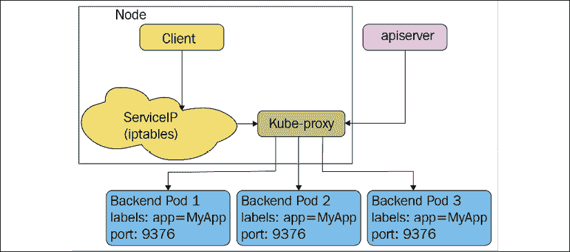
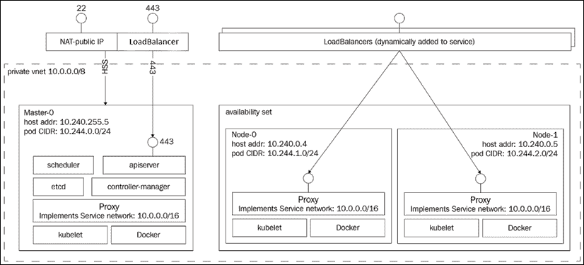
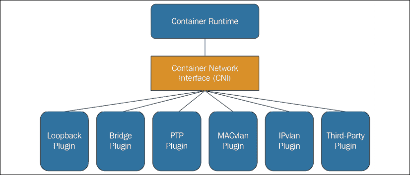
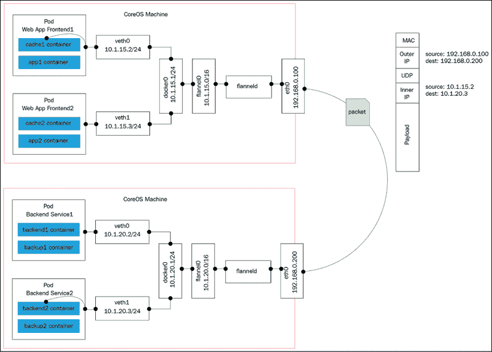
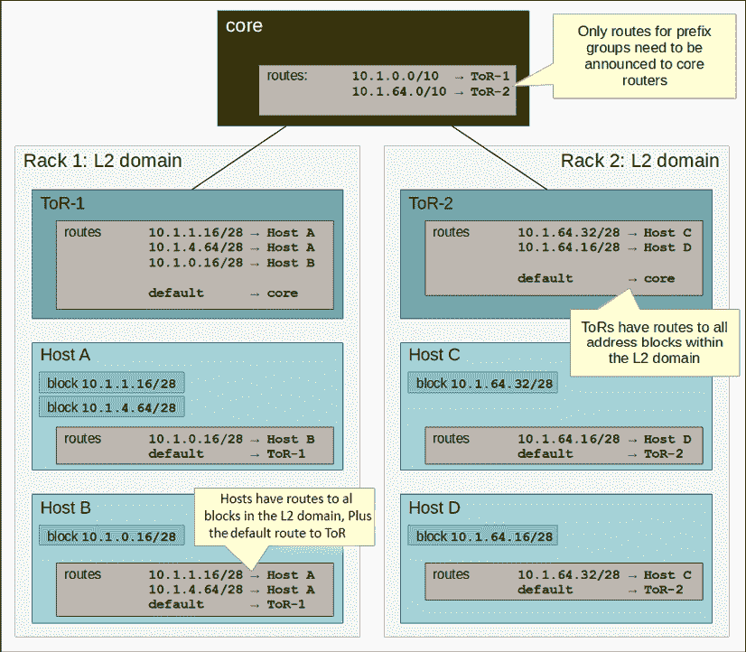
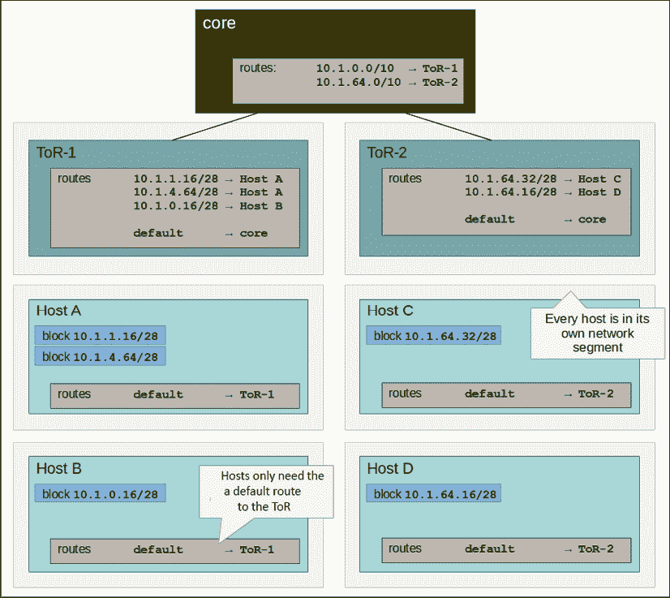
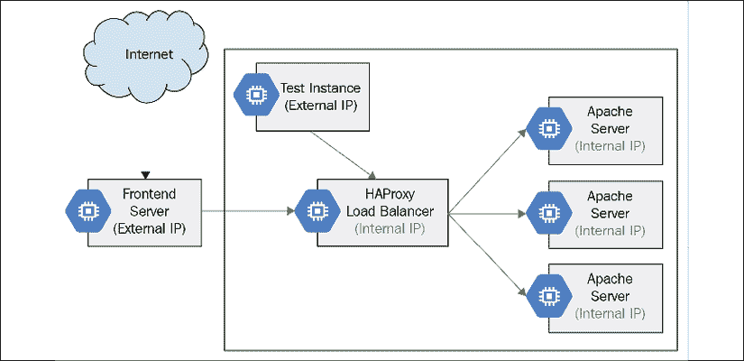

# Ten

# 探索高级网络

在这一章中，我们将研究网络这一重要话题。Kubernetes 作为一个编排平台，管理运行在不同机器(物理或虚拟)上的容器/pods，并且需要一个明确的网络模型。我们将研究以下主题:

*   Kubernetes网络模型
*   Kubernetes 支持的标准接口，例如 EXEC、Kubenet，特别是 CNI
*   满足 Kubernetes 网络需求的各种网络解决方案
*   网络策略和负载平衡选项
*   编写自定义 CNI 插件

到本章结束时，您将了解 Kubernetes 的网络方法，并熟悉标准接口、网络实现和负载平衡等方面的解决方案空间。如果你愿意，你甚至可以写自己的 CNI 插件。

# 理解Kubernetes网络模型

Kubernetes 网络模型基于平面地址空间。集群中的所有豆荚可以直接看到彼此。每个POD都有自己的 IP 地址。无需配置任何**网络地址转换** ( **NAT** )。此外，同一个 pod 中的容器共享其 pod 的 IP 地址，并且可以通过 localhost 相互通信。这个模型非常固执己见，但是一旦建立起来，它会让开发人员和管理员的生活变得更加容易。它使得将传统网络应用迁移到 Kubernetes 变得特别容易。pod 代表一个传统节点，每个容器代表一个传统流程。

## 舱内通信(容器到容器)

运行中的 pod 总是被安排在一个(物理或虚拟)节点上。这意味着所有的容器都运行在同一个节点上，并且可以以各种方式相互通信，例如使用本地文件系统、任何 IPC 机制或者使用本地主机和众所周知的端口。不同 pod 之间没有端口冲突的危险，因为每个 pod 都有自己的 IP 地址，当 pod 中的容器使用 localhost 时，它只适用于 pod 的 IP 地址。因此，如果容器 1 中的容器 1 连接到容器 2 在容器 1 上监听的端口 1234，它将不会与容器 2 中在同样监听端口 1234 的同一节点上运行的另一个容器冲突。唯一需要注意的是，如果您向主机公开端口，那么您应该注意 pod 到节点的关联性。这可以使用几种机制来处理，包括 DaemonSet 和 pod 反亲和。

## POD间通信(POD到POD)

Kubernetes 中的 Pods 被分配了一个网络可见的 IP 地址(对节点来说不是私有的)。Pods 可以直接通信，无需网络地址转换、隧道、代理或任何其他混淆层的帮助。众所周知的端口号可用于免配置通信方案。pod 的内部 IP 地址与其他 pod 看到的外部 IP 地址相同(在集群网络内；不暴露于外界)。这意味着标准的命名和发现机制，如域名系统，开箱即用。

## POD对服务通信

豆荚可以使用它们的 IP 地址和众所周知的端口直接相互对话，但这需要豆荚知道彼此的 IP 地址。在 Kubernetes 集群中，豆荚可以不断被摧毁和创造。同一 pod 规范也可能有多个副本，每个副本都有自己的 IP 地址。该服务提供了一个非常有用的间接层，因为即使响应请求的实际 pods 集不断变化，该服务也是稳定的。此外，您还可以获得自动的高可用性负载平衡，因为每个节点上的 kube 代理负责将流量重定向到正确的 pod:



图 10.1: kube 代理将流量重定向到 pods

## 从外部接近

最终，一些容器需要能够从外界接触到。pod 的 IP 地址在外部不可见。该服务是合适的工具，但外部访问通常需要两次重定向。例如，云提供商负载平衡器不知道 Kubernetes，因此它们不能将特定服务的流量直接导向运行能够处理请求的 pod 的节点。相反，公共负载平衡器只将流量定向到集群中的任何节点，如果当前节点没有运行必要的 pod，该节点上的 kube 代理将再次重定向到适当的 pod。

下图显示了右侧的外部负载平衡器如何将流量发送到任意节点，如果需要，kube-proxy 会在该节点上负责进一步的路由:



图 10.2:外部和内部负载平衡器

## 库网络与坞站网络

Docker 是现有的容器运行时。它也有自己单独的联网模型是 Kubernetes 没有使用的，但是理解起来还是很有用的。Docker networking 默认遵循不同的模式，尽管随着时间的推移，它开始倾向于 Kubernetes 模式。在 Docker 网络中，每个容器都有自己的私有 IP 地址，该地址来自限制在其自己节点的 172.xxx.xxx.xxx 地址空间。它可以通过自己的 172.xxx.xxx.xxx 不同的 IP 地址与同一个节点上的其他容器进行对话。这对 Docker 来说很有意义，因为它没有带有多个交互容器的 pod 的概念，所以它将每个容器建模为具有自己网络标识的轻量级虚拟机。请注意，使用 Kubernetes，在同一节点上运行的不同 pods 的容器不能通过 localhost 连接(除非公开主机端口，这是不鼓励的)。整个想法是，一般来说，Kubernetes 可以在任何地方杀死和创建豆荚，所以不同的豆荚通常不应该依赖于节点上可用的其他豆荚。DaemonSets 是一个值得注意的例外，但是 Kubernetes 网络模型被设计为适用于所有用例，并且没有为同一节点上不同 pod 之间的直接通信添加特殊情况。

Docker 容器如何跨节点通信？容器必须向主机发布端口。这显然需要端口协调，因为如果两个容器试图发布同一个主机端口，它们会相互冲突。然后，容器(或其他进程)将连接到主机的端口，该端口被引导到容器中。一个很大的缺点是容器不能向外部服务进行自我注册，因为它们不知道自己主机的 IP 地址是什么。您可以通过在运行容器时将主机的 IP 地址作为环境变量传递来解决这个问题，但这需要外部协调，并使过程变得复杂。

下图显示了使用桥接网络驱动程序的 Docker 网络设置。每个容器都有自己的 IP 地址；Docker 在每个节点上创建`docker0` 桥:


图 10.3:使用桥接网络驱动程序的 Docker 网络设置

Docker 现在用自己的型号支持其他网络驱动:

*   `host`:直接使用主机联网
*   `overlay`:使用覆盖网络代替操作系统路由来连接 Docker 守护程序
*   `macvlan`:给容器分配一个 MAC 地址，让它看起来像一个物理设备
*   `none`:使用自定义网络驱动程序时禁用网络

还有也有第三方网络插件。

现在我们已经理解了 Kubernetes 和 Docker 网络模型之间的差异，现在是时候讨论一下 pods 和 containers 如何找到彼此了。

## 查找和发现

为了让豆荚和容器相互交流，它们需要找到彼此。容器定位其他容器或自我宣告有几种方式。还有一些架构模式允许容器间接交互。每种方法都有其利弊。

### 自行注册

我们已经多次提到自我注册。让我们理解它的确切含义。当容器运行时，它知道它的容器的 IP 地址。希望集群中的其他容器可以访问的每个容器都可以连接到注册服务，并注册其 IP 地址和端口。其他容器可以向注册服务查询所有注册容器的 IP 地址和端口，并连接到它们。当容器被销毁时(优雅地)，它将注销自己。如果一个容器死得不光彩，那么需要建立一个机制来检测它。例如，注册服务可以定期 ping 所有注册的容器，或者要求容器定期向注册服务发送 keepalive 消息。

自我注册的好处是，一旦通用注册服务到位(不需要为不同的目的定制它)，就不需要担心跟踪容器。另一个巨大的好处是，容器可以采用复杂的策略，并根据本地条件决定是否暂时取消注册；例如，如果一个容器很忙，目前不想再接收任何请求。这种智能且分散的动态负载平衡很难在全球范围内实现。缺点是注册服务是容器需要知道的另一个非标准组件，以便定位其他容器。

### 服务和端点

Kubernetes 服务可视为注册服务。属于某项服务的豆荚会根据其标签自动注册。其他POD可以查找端点以找到所有服务POD，或者利用服务本身，直接向服务发送消息，该消息将被路由到后端POD之一，尽管大多数情况下，POD只会向服务本身发送消息，服务本身会将其转发到一个支持POD。动态成员资格可以通过结合部署副本计数、运行状况检查、就绪性检查和水平 pod 自动缩放来实现。

### 与队列的松散耦合连接

如果容器可以在不知道自己的 IP 地址和端口甚至服务 IP 地址或网络名称的情况下相互对话会怎么样？如果大部分通信可以是异步和解耦的呢？在许多情况下，系统可以由松散耦合的组件组成，这些组件不仅不知道其他组件的身份，而且不知道其他组件甚至存在。队列促进了这种松散耦合的系统。组件(容器)侦听来自队列的消息，响应消息，执行它们的工作，并将有关进度、完成状态和错误的消息发布到队列。队列有很多好处:

*   不协调很容易增加处理能力；只需添加更多监听队列的容器
*   通过队列深度很容易跟踪总负载
*   通过对消息和/或主题进行版本控制，很容易让组件的多个版本并行运行
*   通过让多个使用者以不同的模式处理请求，很容易实现负载平衡和冗余
*   动态添加或删除其他类型的侦听器很容易

队列的缺点如下:

*   有必要确保队列提供适当的持久性和高可用性，这样它就不会成为关键的单点故障 ( **SPOF**
*   容器需要使用异步队列应用编程接口(可以抽象出来)
*   实现请求-响应需要对响应队列进行一些繁琐的监听

总的来说，队列是大规模系统的优秀机制，它们可以在大型 Kubernetes 集群中使用，以简化协调。

### 与数据存储的松散耦合连接

另一种松散耦合的方法是使用数据存储(例如 Redis)来存储消息，然后其他容器可以读取它们。虽然这是可能的，但这不是数据存储的设计目标，其结果通常是麻烦、脆弱且没有最佳性能。数据存储针对数据存储而非通信进行了优化。

也就是说，数据存储可以与队列结合使用，在队列中，组件将一些数据存储在数据存储中，然后向队列发送消息，表明数据已准备好进行处理。多个组件监听消息，并开始并行处理数据。

### 永恒的入口

Kubernetes 提供了一个入口资源和控制器，旨在向外界公开 Kubernetes 服务。当然，您可以自己完成，但是定义入口涉及的许多任务在大多数特定类型入口的应用中都很常见，例如网络应用、CDN 或 DDoS 保护器。您也可以编写自己的入口对象。

入口对象通常用于智能负载平衡和 TLS 终止。您可以受益于内置的入口控制器，而不是配置和部署您自己的 Nginx 服务器。如果您需要复习，请跳到*第 5 章*、*在实践中使用 Kubernetes 资源*，在这里我们通过示例讨论了入口资源。

## 库网络插件

Kubernetes 有一个网络插件系统，因为网络是如此多样和不同，人们希望以不同的方式实现它。Kubernetes 足够灵活，可以支持任何场景。主要的网络插件是 CNI，我们将深入讨论。但是 Kubernetes 也有一个更简单的网络插件，叫做 **Kubenet** 。在详谈之前，我们先来了解一下 Linux 联网的基础知识(只是冰山一角)。

### 基本的 Linux 网络

默认情况下，Linux 有一个单一共享网络空间。物理网络接口都可以在这个命名空间中访问。但是，物理名称空间可以分为多个逻辑名称空间，这与容器联网非常相关。

### IP 地址和端口

网络实体通过其 IP 地址来识别。服务器可以监听多个端口上的传入连接。客户端可以连接到(TCP)或从(UDP)服务器发送/接收数据。

### 网络命名空间

名称空间将一堆网络设备分组，这样它们可以到达同一名称空间中的其他服务器，但不能到达其他服务器，即使它们物理上在同一网络上。链接网络或网段可以通过网桥、交换机、网关和路由来完成。

### 子网、网络掩码和 CIDRs

网段的粒度划分在设计和维护网络时非常有用。使用一个公共前缀将网络划分为更小的子网是一种常见的做法。这些子网可以通过代表子网大小(它可以包含多少台主机)的位掩码来定义。例如，255.255.255.0 的网络掩码意味着前 3 个八位字节用于路由，只有 256(实际上是 254)台主机可用。**无类域间路由** ( **CIDR** )符号经常用于此目的，因为它更简洁，编码更多信息，并且还允许来自多个遗留类(A、B、C、D、E)的主机进行组合。例如，172.27.15.0/24 意味着前 24 位(3 个八位字节)用于路由。

### 虚拟以太网设备

**虚拟以太网**(**)设备代表物理网络设备。当您创建一个链接到物理设备的 veth 设备时，您可以将该 veth 设备(以及扩展的物理设备)分配到一个命名空间，其他命名空间的设备无法直接访问该命名空间，即使它们在物理上位于同一个本地网络上。**

 **### 布里奇斯

网桥将多个网段连接到一个聚合网络，这样所有节点都可以相互通信。桥接是在现场视察网络模型的 L1(物理)和 L2(数据链路)层完成的。

### 按指定路线发送

路由连接不同的网络，通常基于路由表来指示网络设备如何将数据包转发到目的地。路由是通过各种网络设备完成的，如路由器、网桥、网关、交换机和防火墙，包括普通的 Linux 盒子。

### 最大传输单位

**最大传输单元** ( **MTU** )决定了数据包可以有多大。例如，在以太网网络上，MTU 是 1500 字节。MTU 越大，有效载荷和报头的比例越好是好事。然而，缺点是最小延迟被减少，因为你必须等待整个包到达，而且，在失败的情况下，你必须重新传输整个大的包。

### Pod 网络

这里有一张图，描述了 pod、主机和全球互联网之间通过 **veth0** 在网络层面的关系:


图 10.4: veth 关系

### 库本内

回到库本内斯。Kubenet 是一个网络插件。它非常初级，只是创建了一个名为 **cbr0** 的 Linux 桥，并为每个 pod 创建了一个 veth 设备。云提供商通常使用它来为节点之间或单节点环境中的通信设置路由规则。veth 对使用主机 IP 地址范围内的 IP 地址将每个 pod 连接到其主机节点。

#### 要求

库本内插件有以下要求:

*   必须为节点分配一个子网，以便为其 pod 分配 IP 地址
*   版本 0.2.0 或更高版本需要标准 CNI 桥、 **lo** 和主机本地插件
*   kubelet 必须使用`--network-plugin=kubenet`参数运行
*   kubelet 必须使用`--non-masquerade-cidr=<clusterCidr>`参数运行
*   kubelet 必须用`--pod-cidr`运行，或者 kube 控制器管理器必须用`--allocate-node-cidrs=true --cluster-cidr=<cidr>`运行

#### 设置 MTU

MTU 对于网络性能至关重要。Kubernetes】等 Kubernetes 网络插件尽最大努力推导最优 MTU，但有时需要帮助。如果一个现有的网络接口(例如 Docker docker0 桥)设置了一个小的 MTU，那么 Kubenet 将重用它。另一个例子是 IPSEC，由于 IPSEC 封装的额外开销，需要降低 MTU，但是 Kubenet 网络插件没有考虑到这一点。解决方案是避免依赖 MTU 的自动计算，只需通过提供给所有网络插件的`--network-plugin-mtu`命令行开关告诉 kubelet 网络插件应该使用什么 MTU，尽管目前只有 Kubenet 网络插件负责这个命令行开关。

### 容器网络接口

**容器网络接口** ( **CNI** )是一个规范，也是一套编写网络插件的库，用来配置 Linux 容器中的网络接口(不仅仅是 Docker)。该规范实际上是从 rkt 网络提案演变而来的。CNI 背后有很大的动力，这是既定的行业标准。使用 CNI 的一些组织如下:

*   KubernetesKubernetesKubernetesKubernetesKubernetesKubernetesKubernetesKubernetesKubernetesKubernetes
*   openshift(打开 hift)
*   介子
*   日期
*   云铸造
*   暖阁
*   国际商用机器公司
*   AWS EKS 和 ECS
*   拉起来

CNI 团队维护着一些核心插件，但是也有很多第三方插件为 CNI 的成功做出了贡献。这里有一个不完全的列表:

*   **卡利科项目**:第三层虚拟网络
*   **编织**:多主机 Docker 网络
*   **Contiv 网络**:基于策略的网络
*   **纤毛**:容器用 BPF 和 XDP
*   **木尔图**:多插件
*   **CNI-精灵**:一个通用的 CNI 网络插件
*   **法兰绒**:专为Kubernetes设计的容器用网络面料
*   **Infoblox** :容器的企业 IP 地址管理
*   **丝绸**:为云铸造设计的 CNI 插件
*   **亚麻布**:一个 CNI 插件，为带有开放虚拟交换机的覆盖网络设计，适合 SDN/OpenFlow 网络环境
*   **SR-IOV** :支持输入输出虚拟化的 CNI 插件
*   **ovn-kubernetes** :一个 CNI 插件，内置于**开放虚拟交换机** ( **OVS** )和**开放虚拟网络** ( **OVN** )
*   **DANM** :符合 CNI 标准的网络解决方案，适用于运行在 Kubernetes 上的电信工作负载

CNI 插件为任意网络解决方案提供标准网络接口。

#### 容器运行时

CNI 为网络应用容器定义了一个插件规范，但是插件必须插入到提供一些服务的容器运行时中。在 CNI 的上下文中，应用容器是一个网络可寻址实体(有自己的 IP 地址)。对于 Docker，每个容器都有自己的 IP 地址。对于 Kubernetes 来说，每个 pod 都有自己的 IP 地址，pod 是 CNI 容器，不是 pod 内的容器。

同样，rkt 的应用容器类似于 Kubernetes pods，因为它们可能包含多个 Linux 容器。如果有疑问，请记住，CNI 容器必须有自己的 IP 地址。运行库的工作是配置网络，然后执行一个或多个 CNI 插件，以 JSON 格式向它们传递网络配置。

下图显示了使用 CNI 插件接口与多个 CNI 插件通信的容器运行时:



图 10.5:实践中的 CNI 插件界面

#### CNI 插件

CNI 插件的工作是向容器网络命名空间添加一个网络接口，并通过 veth 对将容器桥接到主机。然后它应该通过一个 **IP 地址管理** ( **IPAM** )插件分配一个 IP 地址并设置路由。

容器运行时(Docker、rkt 或任何其他符合 CRI 的运行时)调用 CNI 插件作为可执行文件。插件需要支持以下操作:

*   向网络添加容器
*   从网络中移除容器
*   报告版本

该插件使用简单的命令行界面、标准输入/输出和环境变量。JSON 格式的网络配置通过标准输入传递给插件。其他参数被定义为环境变量:

*   `CNI_COMMAND`:表示需要的操作:`ADD`、`DEL`或`VERSION`
*   `CNI_CONTAINERID`:容器标识
*   `CNI_NETNS`:网络命名空间文件的路径
*   `CNI_IFNAME`:要设置的接口名称；插件必须使用这个接口名，否则会返回错误
*   `CNI_ARGS`:调用时用户传入的额外参数；由分号分隔的字母数字键值对，例如`FOO=BAR;ABC=123`
*   `CNI_PATH`:搜索 CNI 插件可执行文件的路径列表；路径由特定于操作系统的列表分隔符分隔，例如，Linux 上的`:`和 Windows 上的`;`

如果命令成功，插件返回一个零退出代码，生成的接口(在`ADD`命令的情况下)作为 JSON 流传输到标准输出。这个低技术的界面是智能的，因为它不需要任何特定的编程语言或组件技术或二进制 API。CNI 插件作者也可以使用他们最喜欢的编程语言。

使用`ADD`命令调用 CNI 插件的结果如下所示:

```
{
  "cniVersion": "0.3.0",
  "interfaces": [              (this key omitted by IPAM plugins)
      {
          "name": "<name>",
          "mac": "<MAC address>", (required if L2 addresses are meaningful)
          "sandbox": "<netns path or hypervisor identifier>" (required for container/hypervisor interfaces, empty/omitted for host interfaces)
      }
  ],
  "ip": [
      {
          "version": "<4-or-6>",
          "address": "<ip-and-prefix-in-CIDR>",
          "gateway": "<ip-address-of-the-gateway>",     (optional)
          "interface": <numeric index into 'interfaces' list>
      },
      ...
  ],
  "routes": [                                           (optional)
      {
          "dst": "<ip-and-prefix-in-cidr>",
          "gw": "<ip-of-next-hop>"                      (optional)
      },
      ...
  ]
  "dns": {
    "nameservers": <list-of-nameservers>                (optional)
    "domain": <name-of-local-domain>                    (optional)
    "search": <list-of-additional-search-domains>       (optional)
    "options": <list-of-options>                        (optional)
  }
} 
```

输入网络配置包含大量信息:`cniVersion`、`name`、`type`、`args`(可选)、`ipMasq`(可选)、`ipam`、`dns`。`ipam`和`dns`参数是有自己特定键的字典。下面是一个网络配置示例:

```
{
  "cniVersion": "0.3.0",
  "name": "dbnet",
  "type": "bridge",
  // type (plugin) specific
  "bridge": "cni0",
  "ipam": {
    "type": "host-local",
    // ipam specific
    "subnet": "10.1.0.0/16",
    "gateway": "10.1.0.1"
  },
  "dns": {
    "nameservers": ["10.1.0.1"]
  }
} 
```

请注意，可以添加额外的插件特定元素。在这种情况下，`bridge: cni0`元素是特定桥接插件理解的自定义元素。

CNI 规范还支持网络配置列表，其中可以按顺序调用多个 CNI 插件。

在本章的后面，我们将深入研究 CNI 插件的完整实现。

# 无与伦比的网络解决方案

网络是一个广阔的话题。有许多方法可以建立网络并连接设备、POD和容器。库本内斯对此不能固执己见。Kubernetes 只规定了 pods 的平面地址空间的高级网络模型。在这个空间中，许多有效的解决方案都是可能的，针对不同的环境有不同的功能和策略。在本节中，我们将研究一些可用的解决方案，并了解它们如何映射到 Kubernetes 网络模型。

## 裸机集群上的桥接

最基本的环境是只有一个 L2 物理网络的裸金属集群。您可以使用 Linux 桥接设备将容器连接到物理网络。程序相当复杂，需要熟悉低级别的 Linux 网络命令，如`brctl`、`ipaddr`、`iproute`、`iplink`和`nsenter`。如果您计划实施它，本指南可以作为一个良好的开端(搜索【带 Linux 桥设备的 T6】部分):[http://blog . odd bit . com/2014/08/11/四路连接 a-docker/](http://blog.oddbit.com/2014/08/11/four-ways-to-connect-a-docker/) 。

## Contiv

**Contiv** 是一个用于容器联网的通用网络插件，可以通过 CNI 插件直接与 Docker、Mesos、Docker Swarm，当然还有 Kubernetes 一起使用。Contiv 专注于与 Kubernetes 自己的网络策略对象有些重叠的网络策略。以下是孔蒂夫网络插件的一些功能:

*   支持图书馆网络的 CNM 和 CNI 规范
*   一个功能丰富的策略模型，用于提供安全、可预测的应用部署
*   容器工作负载的同类最佳吞吐量
*   多租户、隔离和重叠子网
*   集成 IPAM 和服务发现
*   各种物理拓扑:
*   第 2 层(VLAN)
*   第三层
*   叠加(VXLAN)
*   思科软件开发网络解决方案
*   IPv6 支持
*   可扩展的策略和路由分发

将与应用蓝图集成，包括以下内容:

*   复合坞站
*   Kubernetes 部署管理器
*   东西向微服务负载平衡中包含了服务负载平衡
*   存储、控制(例如，`etcd/consul`)、网络和管理流量的流量隔离

Contiv 有很多特性和能力。然而，我不确定它是否是 Kubernetes 的最佳选择，因为它的表面积很大，而且它可以迎合多个平台。

## 打开 vSwitch

**Open vsswitch**是一款成熟的基于软件的虚拟交换机解决方案，得到了众多大玩家的认可。**开放式虚拟化网络** ( **OVN** )解决方案让您构建各种虚拟网络拓扑。它有一个专用的 Kubernetes 插件，但是不容易设置，正如本指南所展示的:[https://github.com/openvswitch/ovn-kubernetes](https://github.com/openvswitch/ovn-kubernetes)。亚麻 CNI 插件可能更容易设置，尽管它不支持 OVN 的所有功能:

[https://github . com/John-Lin/linen-CNI](https://github.com/John-Lin/linen-cni )

这是亚麻 CNI 插件的示意图:


图 10.6:亚麻 CNI 插件

开放式虚拟交换机可以使用相同的逻辑网络连接裸机服务器、虚拟机和POD/容器。它实际上支持叠加和参考底图模式。

以下是它的一些关键特性:

*   带有中继和接入端口的标准 802.1Q VLAN 型号
*   上游交换机上有或没有 LACP 的网卡绑定
*   网络流、数据流和镜像提高了可视性
*   **服务质量(QoS)** 配置，外加监管
*   Geneve、GRE、VXLAN、STT 和 LISP 隧道
*   802.1ag 连通性故障管理
*   OpenFlow 1.0 加上许多扩展
*   带有 C 和 Python 绑定的事务性配置数据库
*   使用 Linux 内核模块的高性能转发

## VCS 云网络

暖阁网络的**虚拟化云服务**(**【VCS】**)产品提供了一个高度可扩展、基于策略的**软件定义网络** ( **SDN** )平台。它是企业级产品，建立在面向数据平面的开源开放 vSwitch 之上，以及基于开放标准构建的功能丰富的 SDN 控制器。

Nuage 平台使用覆盖层在 Kubernetes pods 和非 Kubernetes 环境(虚拟机和裸机服务器)之间提供无缝的基于策略的网络。Nuage 的策略抽象模型是为应用设计的，它使得为应用声明细粒度的策略变得容易。该平台的实时分析引擎支持 Kubernetes 应用的可见性和安全性监控。

此外，所有 VCS 组件都可以安装在容器中。没有特殊的硬件要求。

## 法兰绒

**法兰绒**是一个虚拟的网络，为每台主机分配一个子网，用于容器运行时。它在每台主机上运行一个`flanneld`代理，从存储在 etcd 中的保留地址空间中为节点分配一个子网。在容器之间以及最终在主机之间转发数据包是由多个后端之一完成的。最常见的后端使用默认情况下通过端口 8285 隧道传输的 TUN 设备上的 UDP(确保它在您的防火墙中打开)。

下图详细描述了法兰绒的各种组件、它创建的虚拟网络设备，以及它们如何通过 docker0 桥与主机和 pod 交互。

它还显示了数据包的 UDP 封装以及它们如何在主机之间传输:



图 10.7:法兰绒

其他后端包括以下内容:

*   **vxlan** :使用内核内 vxlan 封装数据包。
*   **主机网关**:通过远程机器 IP 创建到子网的 IP 路由。请注意，这需要运行法兰绒的主机之间的第 2 层直接连接。
*   **aws-vpc** :在亚马逊 vpc 路由表中创建 IP 路由。
*   **gce** :在谷歌计算引擎网络中创建 IP 路由。
*   **alloc** :只执行子网分配(不转发数据包)。
*   **阿里-vpc** :在阿里巴巴云 vpc 路由表中创建 IP 路由。

## 白棉布

Calico 是一款用于容器的多功能虚拟网络和网络安全解决方案。Calico 可以与所有主要的容器编排框架和运行时集成:

*   kubrines(CNI 外挂程式)
*   月份（CNI 插件）
*   坞站(Libnetwork plugin)
*   中子插件

Calico 还可以部署在内部或公共云上，具有完整的功能集。Calico 的网络策略执行可以针对每个工作负载进行专门化，并确保流量得到精确控制，数据包始终从其来源到达经过审查的目的地。Calico 可以将编排平台的网络策略概念自动映射到自己的网络策略。Kubernetes 网络政策的参考实现是 Calico。可以利用法兰绒网络层和卡利科的网络策略设施，将卡利科与法兰绒一起部署。

## 罗曼娜

Romana 是一个现代的云原生容器网络解决方案。它在第 3 层运行，利用标准的 IP 地址管理技术。整个网络可以成为隔离的单位，因为 Romana 使用 Linux 主机来创建网关和网络路由。在第 3 层操作意味着不需要封装。网络策略作为分布式防火墙在所有端点和服务之间实施。跨云平台的混合部署和内部部署更容易，因为不需要配置虚拟覆盖网络。新的罗马虚拟 IP 允许内部用户通过外部 IP 和服务规范公开第 2 层局域网上的服务。

使用真正可路由的 IP 地址的一些好处如下:

*   **性能**:流量由主机和网络设备全速转发处理；封装数据包不需要花费任何周期。
*   **可扩展性**:原生路由 IP 网络提供了巨大的可扩展性，正如互联网本身所展示的。Romana 为端点使用路由 IP 寻址意味着不需要管理或维护时间、CPU 或内存密集型隧道或其他封装，网络设备可以以最佳效率运行。
*   **可见性**:数据包痕迹显示真实的 IP 地址，便于故障排除和流量管理。

下图显示了 Romana 如何通过使用直接 L2 路由消除大量开销，其中 **ToR** 代表**架顶式**交换机:



图 10.8:L2 至主机数据中心中的 Romana 区块和路线

当网络被配置为 L3 到主机路由时，其中主机不一定共享一个 L2 网段，在这种情况下，没有必要在使用到 ToR 交换机的默认路由的主机之间配置路由。下面是一个图表来说明这一点:



图 10.9:在 L3 到主机的数据中心中，Romana 阻塞和路由

## 编织网

织网全是关于易用性和零配置。它在引擎盖下使用 VXLAN 封装，在每个节点上使用微型 DNS。作为开发人员，您在更高的抽象层次上操作。你命名你的容器，编织网让你连接到它们，并使用标准端口服务。这有助于将现有应用迁移到容器化应用和微服务中。编织网有一个 CNI 插件，用于与Kubernetes(和梅索斯)接口。在 Kubernetes 1.4 及更高版本上，您可以通过运行部署 DaemonSet 的单个命令将编织网与 Kubernetes 集成在一起:

```
kubectl apply -f https://git.io/weave-kube 
```

每个节点上的编织网荚将负责将您创建的任何新荚连接到编织网。Weave Net 支持网络策略应用编程接口，同时也提供了一个完整但易于设置的解决方案。

# 有效使用网络策略

Kubernetes 网络策略是关于管理到所选 pods 和名称空间的网络流量。在一个部署和编排了数百个微服务的世界中，正如 Kubernetes 经常出现的情况，管理POD之间的网络和连接是至关重要的。重要的是要理解它主要不是一种安全机制。如果攻击者能够到达内部网络，他们很可能能够创建符合现有网络策略的自己的POD，并与其他POD自由通信。在前一节中，我们研究了不同的 Kubernetes 网络解决方案，并重点介绍了容器网络接口。在本节中，重点是网络策略，尽管网络解决方案和网络策略在网络解决方案上的实施方式之间有很强的联系。

## 了解 Kubernetes 网络策略设计

网络策略是一种规范，说明了各种选择的POD如何相互通信以及如何与其他网络端点通信。网络策略资源使用标签来选择 pods 并定义白名单规则，除了给定命名空间的隔离策略允许的流量之外，这些规则还允许到所选 pods 的流量。

## 网络策略和 CNI 插件

网络策略和 CNI 插件之间有着错综复杂的关系。一些 CNI 插件实现了网络连接和网络策略，而另一些插件只实现了一个方面，但是它们可以与另一个实现另一个方面的 CNI 插件(例如，卡利科和法兰绒)协作。

## 配置网络策略

网络策略通过`NetworkPolicy resource`进行配置。下面是一个网络策略示例:

```
apiVersion: extensions/v1beta1networking.k8s.io/v1
kind: NetworkPolicy
metadata:
 name: test-network-policy
 namespace: default
spec:
 podSelector:
  matchLabels:
    role: db
 ingress:
  - from:
     - namespaceSelector:
        matchLabels:
         project: awesome-project
     - podSelector:
        matchLabels:
         role: frontend
    ports:
     - protocol: tcp
       port: 6379 
```

## 实施网络策略

虽然网络策略应用编程接口本身是通用的，并且是 Kubernetes 应用编程接口的一部分，但是实现与网络解决方案紧密耦合。这意味着，在每个节点上，都有一个执行以下操作的特殊代理或网关守护设备:

1.  拦截所有进入节点的流量
2.  验证它是否符合网络策略
3.  转发或拒绝每个请求

Kubernetes 提供了通过 API 定义和存储网络策略的工具。网络策略的实施由网络解决方案或与特定网络解决方案紧密集成的专用网络策略解决方案决定。卡利科和运河就是这种方法的好例子。Calico 有自己的网络解决方案和网络策略解决方案，可以协同工作。但是，它也可以在作为 Canal 一部分的法兰绒之上提供网络策略实施。在这两种情况下，这两个部分紧密结合。下图显示了 Kubernetes 策略控制器如何管理网络策略，以及节点上的代理如何执行网络策略:


图 10.10: Kubernetes 策略控制器

# 负载平衡选项

负载平衡是动态系统中的一项关键功能，例如 Kubernetes 集群。节点、虚拟机和POD来来去去，但客户端通常无法跟踪哪些单个实体可以服务它们的请求。即使他们可以，也需要一个复杂的过程来管理集群的动态图，经常刷新它，并处理断开的、无响应的或只是缓慢的节点。

这种所谓的客户端负载平衡仅适用于特殊情况。服务器端负载平衡是一种久经考验且广为人知的机制，它增加了一层间接性，对集群外的客户端或消费者隐藏了内部混乱。有外部和内部负载平衡器的选项。你也可以混合搭配使用两者。混合方法有其特定的优点和缺点，例如性能和灵活性。

## 外部负载平衡器

外部负载平衡器是运行在 Kubernetes 集群外部的负载平衡器。必须有一个外部负载平衡器提供者，Kubernetes 可以与之交互，以配置带有健康检查、防火墙规则的外部负载平衡器，并获取负载平衡器的外部 IP 地址。

下图显示了负载平衡器(云中)、Kubernetes API 服务器和集群节点之间的连接。外部负载平衡器具有哪个单元在哪个节点上运行的最新图片，它可以将外部服务流量定向到正确的单元:


图 10.11:基于云的负载平衡器

### 配置外部负载平衡器

外部负载均衡器通过服务配置文件配置，或者直接通过 Kubectl 配置。我们使用负载平衡器的服务类型，而不是使用集群 IP 的服务类型，这直接将 Kubernetes 节点公开为负载平衡器。这取决于是否在集群中正确安装和配置了外部负载平衡器提供程序。谷歌的 GKE 是测试最充分的提供商，但其他云平台在其云负载平衡器之上提供其集成解决方案。

#### 通过配置文件

这里是实现这个目标的示例服务配置文件:

```
apiVersion: v1
kind: Service
metadata:
  name: api-gateway
spec:
  type: LoadBalancer
  ports:
  - port:  80
    targetPort: 5000
  selector:
    svc: api-gateway
    app: delinkcious 
```

#### 通过库比克特尔

您也可以使用直接的`kubectl`命令来完成相同的结果:

```
$ kubectl expose deployment api-gateway --port=80 --target-port=5000 --name=api-gateway --type=LoadBalancer 
```

决定是否使用服务配置文件或`kubectl`命令通常取决于您设置基础设施的其余部分和部署系统的方式。配置文件更具声明性，可以说更适合生产应用，在生产应用中，您需要一种版本化的、可审核的和可重复的方式来管理您的基础架构。

### 查找负载平衡器的 IP 地址

负载平衡器将有两个感兴趣的 IP 地址。内部 IP 地址可以在集群内部使用，访问服务。群集外的客户端将使用外部 IP 地址。

为外部 IP 地址创建一个 DNS 条目是一个很好的做法。如果您想使用需要稳定主机名的 TLS/SSL，这一点尤其重要。要获取两个地址，请使用`kubectl describe service`命令。IP 字段表示内部 IP 地址，`LoadBalancer Ingress`字段表示外部 IP 地址:

```
$ kubectl describe services example-service
Name: example-service
Selector: app=example
Type: LoadBalancer
IP: 10.67.252.103
LoadBalancer Ingress: 123.45.678.9
Port: <unnamed> 80/TCP
NodePort: <unnamed> 32445/TCP
Endpoints: 10.64.0.4:80,10.64.1.5:80,10.64.2.4:80
Session Affinity: None
No events. 
```

### 保留客户端 IP 地址

有时，服务可能对客户端的源 IP 地址感兴趣。直到 Kubernetes 1.5，这个信息才可用。在 Kubernetes 1.5 中，有一个测试版功能，仅在 GKE 通过注释获得源 IP 地址。在 Kubernetes 1.7 中，保留原始客户端 IP 的功能被添加到了 API 中。

#### 指定原始客户端 IP 地址保留

您需要配置服务规范的以下两个字段:

*   `service.spec.externalTrafficPolicy`:此字段确定服务应该将外部流量路由到节点本地端点还是群集范围的端点，这是默认设置。群集选项不会显示客户端源 IP，可能会向不同的节点添加一跳，但会很好地分散负载。本地选项保留客户端源 IP，只要服务类型为`LoadBalancer`或`NodePort`，就不会增加额外的跳数。它的缺点是可能无法很好地平衡负载。
*   `service.spec.healthCheckNodePort`:此字段为可选项。如果使用，则服务运行状况检查将使用该端口号。默认为分配的节点端口。这对`externalTrafficPolicy`设置为`Local`的`LoadBalancer`类型的服务有影响。

这里有一个例子:

```
apiVersion: v1
kind: Service
metadata:
  name: api-gateway
spec:
  type: LoadBalancer
  externalTrafficPolicy: Local
  ports:
  - port:  80
    targetPort: 5000
  selector:
    svc: api-gateway
    app: delinkcious 
```

### 甚至理解外部负载平衡

外部负载平衡器在节点级运行；当它们将流量引导到特定的 pod 时，负载分配在节点级别完成。这意味着，如果您的服务有四个POD，其中三个在节点 A 上，最后一个在节点 B 上，那么外部负载平衡器可能会在节点 A 和节点 B 之间平均分配负载。这将使节点 A 上的三个POD处理一半的负载(每个 1/6)，节点 B 上的单个POD独自处理另一半的负载。未来可能会增加权重来解决这个问题。

## 服务负载平衡

服务负载平衡是为在 Kubernetes 集群内汇集内部流量而设计的，而不是为外部负载平衡而设计的。这是通过使用集群 IP 的服务类型来完成的。通过使用服务类型`NodePort`并将其用作外部负载平衡器，可以通过预分配的端口直接公开服务负载平衡器，但它不是为该用例设计的。诸如 SSL 终止和 HTTP 缓存之类的理想特性将不容易获得。

下图显示了服务负载平衡器(黄色云)如何将流量路由到它管理的一个后端 pod(当然是通过标签):


图 10.12:服务负载平衡器路由流量

## 进入

Kubernetes 中的入口在其核心是一组规则，允许入站连接到达集群服务。此外，一些入口控制器支持以下功能:

*   连接算法
*   请求限制
*   网址重写和重定向
*   TCP/UDP 负载平衡
*   SSL 终端
*   访问控制和授权

使用`Ingress`资源指定入口，并由入口控制器提供服务。重要的是注意，入口仍然处于测试阶段(自 Kubernetes 1.1 以来)，它还没有展示所有必要的功能。这里有一个入口资源的例子管理两个服务的流量。

规则将外部可见的[http://foo.bar.com/foo](http://foo.bar.com/foo)映射到 s1 服务，将[http://foo.bar.com/bar](http://foo.bar.com/bar)映射到 s2 服务:

```
apiVersion: extensions/v1beta1
kind: Ingress
metadata:
  name: test
spec:
  rules:
  - host: foo.bar.com
    http:
      paths:
      - path: /foo
        backend:
          serviceName: s1
          servicePort: 80
      - path: /bar
        backend:
          serviceName: s2
          servicePort: 80 
```

现在有两个官方入口控制器。其中一个是仅用于 GCE 的 L7 入口控制器，而另一个是更通用的 Nginx 入口控制器，允许您通过配置图配置 Nginx 网络服务器。NGNIX 入口控制器非常复杂，并带来了许多直接通过入口资源尚不可用的功能。它使用端点的应用编程接口将流量直接转发到POD。它支持 Minikube、GCE、AWS、Azure 和裸机集群。有关更多详细信息，请查看以下链接:

[https://github . com/kubrines/ingredient-engine](https://github.com/kubernetes/ingress-nginx)

但是，还有更多入口控制器可能更适合您的使用情况，例如:

*   大使
*   特拉菲克
*   轮廓
*   格洛

### 哈普西

我们讨论了使用云提供商外部负载平衡器使用负载平衡器服务类型和使用集群 IP 在集群内部使用内部服务负载平衡器。如果我们想要一个定制的外部负载平衡器，我们可以创建一个定制的外部负载平衡器提供程序，并使用负载平衡器或第三种服务类型，节点端口。**高可用性** **代理** ( **HAProxy** )是一个成熟且久经考验的负载平衡解决方案。它被认为是使用内部集群实现外部负载平衡的最佳选择之一。这可以通过几种方式实现:

*   利用节点端口并仔细管理端口分配
*   实现自定义负载平衡器提供程序接口
*   在集群内部运行 HAProxy，作为集群边缘的前端服务器的唯一目标(负载平衡与否)

你可以用 HAProxy 使用所有这些方法。无论如何，仍然建议使用入口对象。`service-loadbalancer`项目是一个社区项目，在 HAProxy 之上实现了负载平衡解决方案。你可以在这里找到:[https://github . com/kubernetes/contrib/tree/master/service-load balancer](https://github.com/kubernetes/contrib/tree/master/service-loadbalancer)。

#### 利用节点端口

每个服务将从预定义的范围分配一个专用端口。这通常是一个较高的范围，例如 30，000 或更高，以避免与使用低已知端口的其他应用冲突。在这种情况下，HAProxy 将在集群之外运行，并且将为每个服务配置正确的端口。然后，它可以通过内部服务将任何流量转发到任何节点和 Kubernetes，负载平衡器会将其路由到适当的 pod(双负载平衡)。这当然是次优的，因为它引入了另一跳。绕过它的方法是查询端点的应用编程接口，并为每个服务动态管理其后端POD的列表，并将流量直接转发到POD。

#### 使用 HAProxy 的自定义负载平衡器提供程序

这种方法稍微复杂一点，但是的好处是它更好地与 Kubernetes 集成，并且可以更容易地从/向云过渡到/从内部过渡。

#### 在 Kubernetes 集群中运行 HAProxy

在这种方法中，我们使用集群内部的内部 HAProxy 负载平衡器。可能有多个节点运行 HAProxy，它们将共享相同的配置来映射传入的请求，并在后端服务器(下图中的 Apache 服务器)之间进行负载平衡:



图 10.13: HAProxy 负载平衡

HAProxy 还开发了自己的入口控制器，这是 Kubernetes 知道的。这可以说是在 Kubernetes 集群中利用 HAProxy 的最简化的方法。以下是您在使用 HAProxy 入口控制器时获得的一些功能:

*   与 HAProxy 负载平衡器的简化集成
*   SSL 终端
*   限速
*   IP 白名单
*   多种负载平衡算法:循环、最少连接、网址散列和随机
*   一个仪表板，显示你的POD的健康状况，当前请求率，响应时间，等等
*   交通霸王保护

### 梅塔洛

**metalllb**还为裸机集群提供负载均衡解决方案。它是高度可配置的，支持多种模式，如 L2 和 BGP。我甚至成功地为 minikube 配置了它。

更多详情，请查看以下链接:

[https://metal lb . universe . TF](https://metallb.universe.tf )

### 保持贵宾身份

**Keepalived 虚拟 IP** ( **Keepalived VIP** )不一定是自己的负载均衡解决方案。

它可以是对 Nginx 入口控制器或基于 HAProxy 的服务负载平衡器的补充。主要动机是POD在 Kubernetes 中移动，包括您的负载平衡器。这给需要稳定端点的网络外部客户端带来了问题。由于性能问题，域名系统通常不够好。Keepalived 提供了一个高性能的虚拟 IP 地址，可以作为 Nginx 入口控制器或 HAProxy 负载平衡器的地址。Keepalived 利用核心 Linux 网络设施，如 IPVS (IP 虚拟服务器)，通过**虚拟冗余路由器协议** ( **VRRP** )实现高可用性。一切都在第 4 层运行。配置它需要一些努力和对细节的关注。幸运的是，有一个Kubernetes contrib 项目可以让你入门:[https://github . com/Kubernetes/contrib/tree/master/keepalived-VIP](https://github.com/kubernetes/contrib/tree/master/keepalived-vip)。

### 交通

**Traefic** 是现代的 HTTP 反向代理和负载均衡器。它旨在支持微服务。它与包括 Kubernetes 在内的许多后端一起工作，以自动和动态地管理其配置。与传统的负载平衡器相比，这是一个游戏规则的改变者。它有一系列令人印象深刻的功能:

*   它很快
*   单次执行可执行文件
*   微型官方 Docker 映像
*   休息应用编程接口
*   配置的热重装；不需要重新启动流程
*   断路器；重试
*   循环，再平衡，负载平衡器
*   指标(休息、普罗米修斯、数据狗、统计数据、流入数据库)
*   Clean AngularJS web UI(清理角度 JS web UI)
*   Websocket、HTTP/2、grpc ready
*   访问日志(CLF JSON)
*   让我们加密支持(自动 HTTPS 与更新)
*   集群模式下的高可用性

Kubernetes 上的负载平衡是一个令人兴奋的领域。它为南北和东西负载平衡提供了许多选项。现在我们已经详细介绍了负载平衡，让我们深入研究一下 CNI 插件以及它们是如何实现的。

# 写你自己的 CNI 插件

在这一节中，我们将看看如何编写自己的 CNI 插件。首先，我们将看看最简单的插件——环回插件。然后，我们将检查实现与编写 CNI 插件相关的大部分样板文件的插件框架。最后，我们将回顾桥插件的实现。在我们深入探讨之前，这里有一个快速提醒，什么是 CNI 插件:

*   CNI 插件是一个可执行文件
*   它负责将新容器连接到网络，为 CNI 容器分配唯一的 IP 地址，并负责路由
*   容器是一个网络命名空间(在 Kubernetes 中，pod 是一个 CNI 容器)
*   网络定义作为 JSON 文件进行管理，但是通过标准输入流向插件(插件不读取任何文件)
*   辅助信息可以通过环境变量提供

## 首先看看环回插件

环回插件只是简单的增加了环回接口。它非常简单，不需要任何网络配置信息。大多数 CNI 插件都是在 Golang 实现的，回环 CNI 插件也不例外。完整的源代码可以在这里找到:https://github . com/container network/plugins/blob/master/plugins/main/loopback。

GitHub 上的容器联网项目中有多个包，它们提供了实现 CNI 插件所需的许多构建模块，以及用于添加接口、移除接口、设置 IP 地址和设置路由的 netlink 包。我们先来看看`loopback.go`文件的导入:

```
package main
import (
    "encoding/json"
    "errors"
    "fmt"
    "net"
    "github.com/vishvananda/netlink"
    "github.com/containernetworking/cni/pkg/skel"
    "github.com/containernetworking/cni/pkg/types"
    "github.com/containernetworking/cni/pkg/types/current"
    "github.com/containernetworking/cni/pkg/version"
    "github.com/containernetworking/plugins/pkg/ns"
    bv "github.com/containernetworking/plugins/pkg/utils/buildversion") 
```

然后，插件实现两个命令，`cmdAdd`和`cmdDel`，当容器被添加到网络或从网络移除时调用这两个命令。下面是 add 命令，它完成所有繁重的工作:

```
func cmdAdd(args *skel.CmdArgs) error {
    conf, err := parseNetConf(args.StdinData)
    if err != nil {
        return err
    }
    var v4Addr, v6Addr *net.IPNet
    args.IfName = "lo" // ignore config, this only works for loopback
    err = ns.WithNetNSPath(args.Netns, func(_ ns.NetNS) error {
        link, err := netlink.LinkByName(args.IfName)
        if err != nil {
            return err // not tested
        }
        err = netlink.LinkSetUp(link)
        if err != nil {
            return err // not tested
        }
        v4Addrs, err := netlink.AddrList(link, netlink.FAMILY_V4)
        if err != nil {
            return err // not tested
        }
        if len(v4Addrs) != 0 {
            v4Addr = v4Addrs[0].IPNet
            // sanity check that this is a loopback address
            for _, addr := range v6Addrs {
                if !addr.IP.IsLoopback() {
                    return fmt.Errorf("loopback interface found with non-loopback address %q", addr.IP)
                }
            }
        }
        v6Addrs, err := netlink.AddrList(link, netlink.FAMILY_V6)
        if err != nil {
            return err // not tested
        }
        if len(v6Addrs) != 0 {
            v6Addr = v6Addrs[0].IPNet
            // sanity check that this is a loopback address
            for _, addr := range v6Addrs {
                if !addr.IP.IsLoopback() {
                    return fmt.Errorf("loopback interface found with non-loopback address %q", addr.IP)
                }
            }
        }
        return nil
    })
    if err != nil {
        return err // not tested
    }
    var result types.Result
    if conf.PrevResult != nil {
        // If loopback has previous result which passes from previous CNI plugin,
        // loopback should pass it transparently
        result = conf.PrevResult
    } else {
        loopbackInterface := &current.Interface{Name: args.IfName, Mac: "00:00:00:00:00:00", Sandbox: args.Netns}
        r := &current.Result{CNIVersion: conf.CNIVersion, Interfaces: []*current.Interface{loopbackInterface}}
        if v4Addr != nil {
            r.IPs = append(r.IPs, &current.IPConfig{
                Version:   "4",
                Interface: current.Int(0),
                Address:   *v4Addr,
            })
        }
        if v6Addr != nil {
            r.IPs = append(r.IPs, &current.IPConfig{
                Version:   "6",
                Interface: current.Int(0),
                Address:   *v6Addr,
            })
        }
        result = r
    }
    return types.PrintResult(result, conf.CNIVersion)
} 
```

该功能的核心是将接口名称设置为`lo`(用于环回)并将链接添加到容器的网络命名空间。它支持 IPv4 和 IPv6。

`del`命令的作用相反，而且简单得多:

```
func cmdDel(args *skel.CmdArgs) error {
    if args.Netns == "" {
        return nil
    }
    args.IfName = "lo" // ignore config, this only works for loopback
    err := ns.WithNetNSPath(args.Netns, func(ns.NetNS) error {
        link, err := netlink.LinkByName(args.IfName)
        if err != nil {
            return err // not tested
        }
        err = netlink.LinkSetDown(link)
        if err != nil {
            return err // not tested
        }
        return nil
    })
    if err != nil {
        return err // not tested
    }
    return nil
} 
```

`main`功能只是调用`skel`包的`PluginMain()`功能，传递命令功能。`skel`包将负责运行 CNI 插件可执行文件，并将在适当的时候调用`cmdAdd`和`cmdDel`功能:

```
func main() {
    skel.PluginMain(cmdAdd, cmdCheck, cmdDel, version.All, bv.BuildString("loopback"))
} 
```

### 建立在 CNI 插件框架上

让我们现在探索`skel`包，看看它在封面下做什么。`PluginMain()`入口点负责调用`PluginMainWithError()`，捕捉错误，将其打印到标准输出，然后退出:

```
func PluginMain(cmdAdd, cmdCheck, cmdDel func(_ *CmdArgs) error, versionInfo version.PluginInfo, about string) {
    if e := PluginMainWithError(cmdAdd, cmdCheck, cmdDel, versionInfo, about); e != nil {
        if err := e.Print(); err != nil {
            log.Print("Error writing error JSON to stdout: ", err)
        }
        os.Exit(1)
    }
} 
```

`PluginErrorWithMain()`函数实例化一个调度程序，用所有的输入/输出流和环境设置它，并调用它的内部`pluginMain()`方法:

```
func PluginMainWithError(cmdAdd, cmdCheck, cmdDel func(_ *CmdArgs) error, versionInfo version.PluginInfo, about string) *types.Error {
    return (&dispatcher{
        Getenv: os.Getenv,
        Stdin:  os.Stdin,
        Stdout: os.Stdout,
        Stderr: os.Stderr,
    }).pluginMain(cmdAdd, cmdCheck, cmdDel, versionInfo, about)
} 
```

最后，这是骨架的主要逻辑。它从环境中获取`cmd`参数(包括来自标准输入的配置)，检测哪个`cmd`被调用，并调用适当的插件函数(`cmdAdd`或`cmdDel`)。它还可以返回版本信息:

```
func (t *dispatcher) pluginMain(cmdAdd, cmdCheck, cmdDel func(_ *CmdArgs) error, versionInfo version.PluginInfo, about string) *types.Error {
    cmd, cmdArgs, err := t.getCmdArgsFromEnv()
    if err != nil {
        // Print the about string to stderr when no command is set
        if err.Code == types.ErrInvalidEnvironmentVariables && t.Getenv("CNI_COMMAND") == "" && about != "" {
            _, _ = fmt.Fprintln(t.Stderr, about)
            return nil
        }
        return err
    }
    if cmd != "VERSION" {
        if err = validateConfig(cmdArgs.StdinData); err != nil {
            return err
        }
        if err = utils.ValidateContainerID(cmdArgs.ContainerID); err != nil {
            return err
        }
        if err = utils.ValidateInterfaceName(cmdArgs.IfName); err != nil {
            return err
        }
    }
    switch cmd {
    case "ADD":
        err = t.checkVersionAndCall(cmdArgs, versionInfo, cmdAdd)
    case "CHECK":
        configVersion, err := t.ConfVersionDecoder.Decode(cmdArgs.StdinData)
        if err != nil {
            return types.NewError(types.ErrDecodingFailure, err.Error(), "")
        }
        if gtet, err := version.GreaterThanOrEqualTo(configVersion, "0.4.0"); err != nil {
            return types.NewError(types.ErrDecodingFailure, err.Error(), "")
        } else if !gtet {
            return types.NewError(types.ErrIncompatibleCNIVersion, "config version does not allow CHECK", "")
        }
        for _, pluginVersion := range versionInfo.SupportedVersions() {
            gtet, err := version.GreaterThanOrEqualTo(pluginVersion, configVersion)
            if err != nil {
                return types.NewError(types.ErrDecodingFailure, err.Error(), "")
            } else if gtet {
                if err := t.checkVersionAndCall(cmdArgs, versionInfo, cmdCheck); err != nil {
                    return err
                }
                return nil
            }
        }
        return types.NewError(types.ErrIncompatibleCNIVersion, "plugin version does not allow CHECK", "")
    case "DEL":
        err = t.checkVersionAndCall(cmdArgs, versionInfo, cmdDel)
    case "VERSION":
        if err := versionInfo.Encode(t.Stdout); err != nil {
            return types.NewError(types.ErrIOFailure, err.Error(), "")
        }
    default:
        return types.NewError(types.ErrInvalidEnvironmentVariables, fmt.Sprintf("unknown CNI_COMMAND: %v", cmd), "")
    }
    if err != nil {
        return err
    }
    return nil
} 
```

环回插件是最简单的 CNI 插件之一。现在，让我们来看看桥插件。

### 查看桥接插件

桥接插件更加充实。让我们看看它实现的一些关键部分。这里有完整的源代码:

[https://github . com/container network/plugins/tree/master/plugins/main/bridge](https://github.com/containernetworking/plugins/tree/master/plugins/main/bridge)

该插件在`bridge.go`文件中用以下字段定义网络配置结构:

```
type NetConf struct {
    types.NetConf
    BrName       string 'json:"bridge"'
    IsGW         bool   'json:"isGateway"'
    IsDefaultGW  bool   'json:"isDefaultGateway"'
    ForceAddress bool   'json:"forceAddress"'
    IPMasq       bool   'json:"ipMasq"'
    MTU          int    'json:"mtu"'
    HairpinMode  bool   'json:"hairpinMode"'
    PromiscMode  bool   'json:"promiscMode"'
    Vlan         int    'json:"vlan"'
} 
```

由于篇幅限制，我们将不介绍每个参数的作用以及它与其他参数的交互方式。目标是理解流程，如果你想实现自己的 CNI 插件，就要有一个起点。通过`loadNetConf()`功能从 JSON 加载配置。

它在`cmdAdd()`和`cmdDel()`函数的开头被调用:

```
n, cniVersion, err := loadNetConf(args.StdinData) 
```

这里是`cmdAdd()`功能的核心，使用网络配置的信息，建立网桥，建立 veth 设备:

```
br, brInterface, err := setupBridge(n)
    if err != nil {
        return err
    }
    netns, err := ns.GetNS(args.Netns)
    if err != nil {
        return fmt.Errorf("failed to open netns %q: %v", args.Netns, err)
    }
    defer netns.Close()
    hostInterface, containerInterface, err := setupVeth(netns, br, args.IfName, n.MTU, n.HairpinMode, n.Vlan)
    if err != nil {
        return err
    } 
```

稍后，该函数将处理 L3 模式及其多种情况:

```
 // Assume L2 interface only
    result := &current.Result{CNIVersion: cniVersion, Interfaces: []*current.Interface{brInterface, hostInterface, containerInterface}}
    if isLayer3 {
        // run the IPAM plugin and get back the config to apply
        r, err := ipam.ExecAdd(n.IPAM.Type, args.StdinData)
        if err != nil {
            return err
        }
        // release IP in case of failure
        defer func() {
            if !success {
                ipam.ExecDel(n.IPAM.Type, args.StdinData)
            }
        }()
        // Convert whatever the IPAM result was into the current Result type
        ipamResult, err := current.NewResultFromResult(r)
        if err != nil {
            return err
        }
        result.IPs = ipamResult.IPs
        result.Routes = ipamResult.Routes
        if len(result.IPs) == 0 {            return errors.New("IPAM plugin returned missing IP config")
        }
        // Gather gateway information for each IP family
        gwsV4, gwsV6, err := calcGateways(result, n)
        if err != nil {
            return err
        }
        // Configure the container hardware address and IP address(es)
        if err := netns.Do(func(_ ns.NetNS) error {
            ...
        }
        if n.IsGW {
            ...
        }
        if n.IPMasq {
            ...
        }
    } 
```

最后，它更新可能已经改变的媒体访问控制地址，并返回结果:

```
 // Refetch the bridge since its MAC address may change when the first
    // veth is added or after its IP address is set
    br, err = bridgeByName(n.BrName)
    if err != nil {
        return err
    }
    brInterface.Mac = br.Attrs().HardwareAddr.String()
    result.DNS = n.DNS
    // Return an error requested by testcases, if any
    if debugPostIPAMError != nil {
        return debugPostIPAMError
    }
    success = true
    return types.PrintResult(result, cniVersion) 
```

这只是全面实施的一部分。还有路由设置和硬件 IP 分配。如果你计划编写自己的 CNI 插件，我鼓励你追求完整的源代码，这是相当广泛的，以获得完整的图片。

# 摘要

在这一章中，我们涉及了很多方面。网络是一个如此广泛的话题，因为硬件、软件、操作环境和用户技能有如此多的组合。要想提出一个既健壮、安全、性能良好又易于维护的全面的网络解决方案是一项非常复杂的工作。对于 Kubernetes 集群，云提供商主要解决这些问题。但是，如果您运行内部集群或需要量身定制的解决方案，您有很多选择。Kubernetes 是一个非常灵活的平台，专为扩展而设计。尤其是网络是完全可插拔的。我们讨论的主要主题是 Kubernetes 网络模型(pods 可以到达其他 pods 并在 pods 内的所有容器之间共享 localhost 的平面地址空间)、查找和发现是如何工作的、Kubernetes 网络插件、不同抽象级别的各种网络解决方案(许多有趣的变体)、使用网络策略有效控制集群内的流量以及负载平衡解决方案的范围，最后，我们通过剖析现实世界的实现来了解如何编写 CNI 插件。

此时，你可能会不知所措，尤其是如果你不是主题专家的话。尽管如此，您应该对 Kubernetes 网络的内部有一个坚实的掌握，了解实现一个成熟的解决方案所需的所有互锁部分，并且能够基于对您的系统和技能水平有意义的权衡来设计您自己的解决方案。

在*第 11 章*、*在多个云上运行 Kubernetes 和集群联盟*中，我们将更深入地研究在多个集群、云提供商和联盟上运行 Kubernetes。这是 Kubernetes 故事中地理分布部署和最终可扩展性的重要部分。联合 Kubernetes 集群可以超越本地限制，但它们也带来了一系列挑战。**