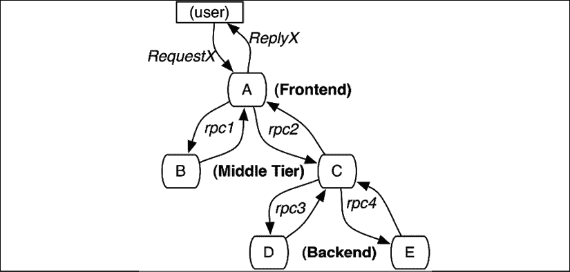
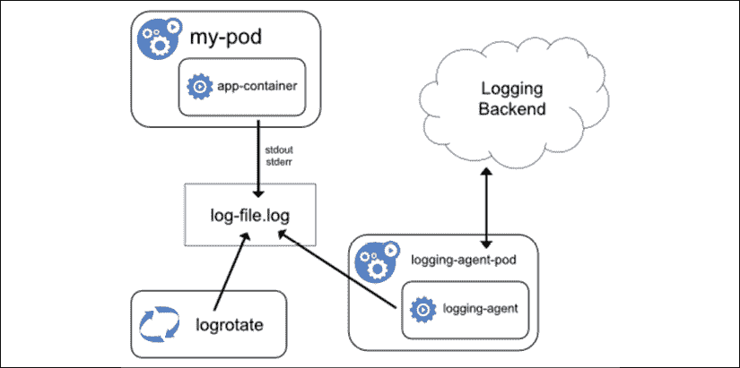
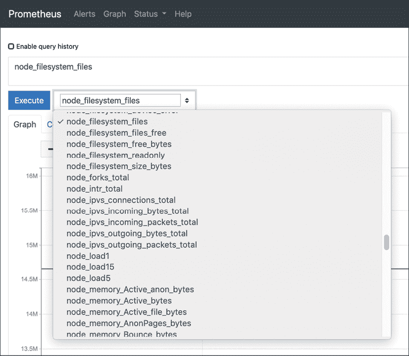
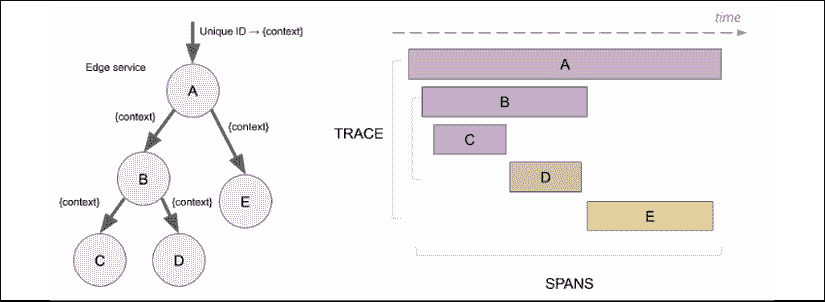
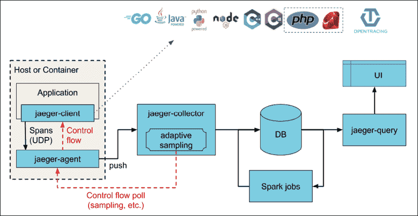
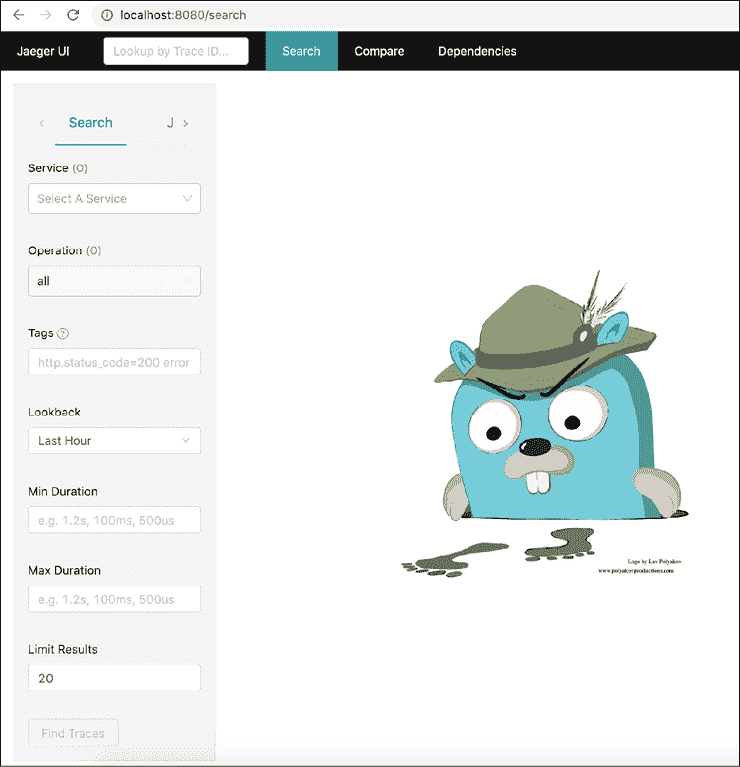

# Thirteen

# 监测库本内特星团

在前一章中，我们研究了无服务器计算及其在 Kubernetes 上的表现。这个领域有很多创新，跟随进化是非常有用和迷人的。

在本章中，我们将讨论如何确保您的系统正常运行，性能正常，以及在系统不正常时如何应对。在*第 3 章*、*高可用性和可靠性*中，我们讨论了相关话题。这里的重点是了解您的系统中发生了什么，以及您可以使用哪些实践和工具。

监控有许多方面，例如日志记录、度量、分布式跟踪、错误报告和警报。自动扩展和自我修复等实践依赖于监控来检测是否需要扩展或修复。

我们将在本章中讨论的主题包括:

*   理解可观测性
*   使用 Kubernetes 登录
*   用 Kubernetes 记录指标
*   耶格的分布式跟踪
*   故障排除问题

Kubernetes 社区认识到监控的重要性，并投入大量精力来确保 Kubernetes 有一个可靠的监控故事。**云原生计算基金会** ( **CNCF** )是云原生基础设施项目的实际策展人。到目前为止(2020 年初)已经毕业了八个项目。库本内斯是第一个毕业的项目，在其他七个项目中，有三个项目专注于监控:普罗米修斯、弗伦德和耶格。在我们深入研究 Kubernetes 监控和特定项目和工具的来龙去脉之前，我们应该更好地理解监控的意义。一个考虑监控的好框架是你的系统有多容易被观察到。事实上，可观察性是最近人们炫耀的另一个术语。

# 理解可观测性

可观察性是一个很大的词。在实践中意味着什么？有不同的定义，关于监测和可观测性如何相似和不同也有很大的争论。我的立场是，可观察性是系统的属性，它定义了我们现在和历史上可以告诉系统的状态和行为。特别是，我们对系统及其组件的健康状况感兴趣。监控是我们用来增加系统可观察性的收费、流程和技术的集合。

为了更好地了解我们的系统在做什么，我们需要收集、记录和汇总信息的不同方面。这些方面包括日志、度量、分布式跟踪和错误。监测或可观测性数据是多维的，并跨越许多层面。只是收藏也没多大帮助。我们需要能够查询它，可视化它，并在出现问题时提醒其他系统。让我们回顾一下可观测性的各个组成部分。

## 记录

测井是一个关键的监测工具。每一个自重的长时间运行的软件都必须有日志。日志捕获时间戳事件。它们对许多应用程序至关重要，如商业智能、安全、法规遵从性、审计、调试和故障排除。重要的是要理解，复杂的分布式系统对于不同的组件会有不同的日志，从日志中提取见解不是一件小事。

日志有几个关键属性:格式、存储和聚合。

### 日志格式

日志可能有多种格式。纯文本非常常见，并且易于阅读，但是需要大量工作来解析和合并其他日志。结构化日志更适合大型系统，因为可以大规模处理。二进制日志对于生成大量日志的系统很有意义，因为它们更节省空间，但是它们需要自定义工具和处理来提取信息。

### 日志存储

日志可以存储在内存、文件系统、数据库、云存储中，发送到远程日志，或者这些选项的任意组合。在云原生世界中，软件在容器中运行，了解日志存储在哪里以及必要时如何获取日志非常重要。

当集装箱来来去去时，人们会想到耐久性的问题。在 Kubernetes 上，容器的标准输出和错误被自动记录并可用，甚至当 pod 终止时。但是，诸如有足够的日志空间和日志轮换等问题总是相关的。

### 日志聚合

最后，当将本地日志发送到设计用于处理各种日志格式的集中式日志服务时，最好的做法是根据需要保存它们，并以可查询和推理的方式聚合许多类型的日志。

## 韵律学

度量标准随着时间的推移衡量系统的同一方面。指标是数值的时间序列(通常是浮点数)。每个指标都有一个名称通常是一组标签，有助于以后的切片和切割。例如，节点的 CPU 利用率或服务的错误率都是指标。

度量比日志经济得多。它们需要一个固定的空间，不会像日志一样随传入的流量起伏。

此外，由于度量本质上是数字的，它们不需要解析和转换，并且可以很容易地组合起来，使用统计方法进行分析，并用作事件和警报的触发器。

不同级别(节点、容器、进程、网络、磁盘)的许多指标通常由操作系统、云提供商或 Kubernetes 自动为您收集。

但是，您也可以创建自定义指标，这些指标映射到系统的高级关注点，并且可以使用应用程序级策略进行配置。

## 分布式跟踪

现代分布式系统通常使用基于微服务的架构，其中传入的请求在多个微服务之间跳跃，在队列中等待，并触发无服务器功能。当您尝试分析错误、故障、数据完整性问题或性能问题时，能够遵循请求的路径是至关重要的。这就是分布式跟踪的由来。

分布式跟踪是跨度和引用的集合。您可以将看作是一个**有向无环图** ( **DAG** )，它表示请求遍历分布式系统的组件。每个跨度记录请求在给定组件中花费的时间，而引用是将一个空间连接到后续跨度的图的边。

这里有一个例子:



图 13.1:有向无环图

分布式跟踪对于理解复杂的分布式系统是必不可少的。

## 应用程序错误报告

错误和异常报告有时作为日志记录的一部分来完成。你肯定想记录错误，出错时查看日志是由来已久的传统。但是，捕捉错误信息的级别不仅限于日志记录。当应用程序中出现错误时，捕获错误消息、错误在代码中的位置以及堆栈跟踪是很有用的。这是非常标准的，大多数编程语言都可以提供所有这些信息，尽管堆栈跟踪是多行的，不太适合基于行的日志。一个非常有用的附加信息是捕获堆栈跟踪的每一级的本地状态。

像 Sentry 或 Rollbar 这样的中央错误报告服务提供了许多超出日志记录范围的特定于错误的值，例如丰富的错误信息以及上下文和用户信息。

## 仪表板和可视化

好的。您在收集日志、定义指标、跟踪请求和报告大量错误方面做了大量工作。现在，你想弄清楚你的系统或它的一部分在做什么。基线是多少？全天、一周和节假日的交通如何波动？当系统受到压力时，哪些部分最容易受到伤害？

在一个包含成百上千个服务、数据存储和与外部系统集成的复杂系统中，您只需查看原始日志文件、指标和跟踪即可。

您需要能够组合大量信息并构建系统健康仪表板，可视化您的基础架构，并创建业务级别的报告和图表。

如果您使用云平台，您可能会自动获得其中的一部分(尤其是基础架构)。然而，您应该期望围绕可视化和仪表板做一些严肃的工作。

## 发信号

对于希望获得系统的广阔视图并能够深入了解其行为的人来说，仪表板非常有用。警报就是检测异常情况并触发一些动作。理想情况下，您的系统应该能够自我修复，并且能够在大多数情况下自行恢复。然而，你至少应该报告它，这样人类就可以在闲暇时回顾发生的事情，并决定是否需要进一步的行动。

警报可以与电子邮件、聊天室和呼叫系统集成。它通常与指标相关联，当某些条件适用时，就会发出警报。

现在，我们已经介绍了监控复杂系统所涉及的不同元素，让我们看看如何使用 Kubernetes 来实现。

# 使用 Kubernetes 登录

我们需要仔细考虑我们与 Kubernetes 的日志策略。有几种类型的日志与监控目的相关。我们的工作负载在容器中运行，当然，我们关心这些日志，但是我们也关心Kubernetes 组件的日志，例如 kubelets 和容器运行时。此外，跨多个节点和容器追踪日志是行不通的。最佳做法是使用中央日志记录(也称为日志聚合)。这里有几个选项，我们将很快探索。

## 集装箱日志

Kubernetes 存储每个容器的标准输出和标准误差。它们可以通过 kubectl logs 命令获得。

以下是每 10 秒打印一次当前日期和时间的 pod 清单:

```
apiVersion: v1
kind: Pod
metadata:
  name: now
spec:
  containers:
    - name: now
      image: g1g1/py-kube:0.2
      command: ["/bin/bash", "-c", "while true; do sleep 10; date; done"] 
```

我们可以将其保存到一个名为`now-pod.yaml`的文件中并创建它:

```
$ kubectl apply -f now-pod.yaml
pod/now created 
```

等到吊舱准备好。要查看日志，我们使用`kubectl logs`命令:

```
$ kubectl logs now
Thu Jun  11 00:32:38 UTC 2020
Thu Jun  11 00:32:48 UTC 2020
Thu Jun  11 00:32:58 UTC 2020
Thu Jun  11 00:33:08 UTC 2020
Thu Jun  11 00:33:18 UTC 2020 
```

关于集装箱原木的几点。`kubectl logs`需要一个 pod 名称。如果 pod 有多个容器，您还需要指定容器名称:

```
$ kubectl logs <pod name> -c <container name> 
```

此外，如果一个部署或复制集创建了同一个 pod 的多个副本，您仍然需要独立地查询每个 pod 的日志。没有办法在一次通话中获得多个吊舱的日志。

如果容器由于某种原因崩溃，可以使用`kubectl logs -p`命令查看容器中的日志。

## 组件日志

如果您在 GKE、EKS 或 AKS 等托管环境中运行 Kubernetes，您将无法访问 Kubernetes 组件日志，但这是意料之中的。你对库本内特斯的控制飞机没有责任。有在主节点上运行的 Kubernetes 组件，也有在每个工作节点上运行的组件:

以下是主组件及其日志位置:

*   **API 服务器** : `/var/log/kube-apiserver.log`
*   **调度器** : `/var/log/kube-scheduler.log`
*   **控制经理** : `/var/log/kube-controller-manager.log`

工人节点组件及其日志位置为:

*   **立方结构** : `/var/log/kubelet.log`
*   **多维数据集代理** ： `/var/log/kube-proxy.log`

请注意在基于系统的系统上，您需要使用`journalctl`来查看日志。

## 集中式日志记录

读取容器日志对于快速排除单个容器中的脏故障是很好的。为了诊断和调试系统范围的问题，我们需要集中日志记录(也称为日志聚合)。我们容器中的所有日志都应该被发送到一个中央存储库，并且可以使用过滤器和查询进行切片和切割。

在决定您的中央日志记录方法时，有几个重要的决定:我们如何收集日志？我们把日志存放在哪里？我们如何处理敏感的日志信息？

### 选择日志收集策略

日志通常由运行在生成日志的进程附近的代理收集。他们确保将它们交付给中央日志服务。

以下是常见的方法。

#### 直接测井

在这种方法中，没有日志代理。每个应用程序容器都有责任将日志发送到远程日志服务。这通常是通过客户端库完成的。这是一种高接触的方法，应用程序需要知道日志目标，并配置适当的凭据。如果您想更改日志收集策略，您需要对每个应用程序进行更改(至少要升级到新版本的库):


图 13.2:直接记录

#### 节点代理

当您控制工作节点并且想要从应用程序中抽象出日志聚合行为时，节点代理方法是最好的。每个应用程序容器都可以简单地写入标准输出和标准错误，运行在每个节点上的代理将截取日志并将其传递给远程日志服务。

通常，您将节点代理部署为 DaemonSet，这样，当节点从集群中添加或删除时，日志代理将始终存在，不需要任何额外的工作:



图 13.3:使用节点代理进行日志记录

#### 边车集装箱

当您无法控制集群节点时，或者如果您使用一些无服务器计算基础架构来部署容器，但是您不想使用直接日志记录方法时，sidecar 容器是最佳选择。节点代理方法是不可能的，但是您可以附加一个 sidecar 容器来收集日志并将它们传递给中央日志服务。它不如节点代理方法有效，因为每个容器都需要自己的日志记录 sidecar 容器，但是它可以在部署阶段完成，而不需要代码更改和应用程序知识:


图 13.4:使用边车容器进行记录

既然我们已经讨论了日志收集的主题，让我们考虑如何集中存储和管理这些日志。

### 集群级中央日志记录

如果您的整个系统运行在单个 Kubernetes 集群中，那么集群级日志记录可能是一个很好的选择。您可以在集群中安装像 Grafana Loki、ElasticSearch 或 Graylog 这样的中央日志服务，无需将您的日志数据发送到其他地方，即可享受内聚的日志聚合体验。

但是，对于集群内的中央日志记录，这并不总是可能的或理想的。

### 远程中央日志记录

有用例，集群内中央日志记录由于各种原因没有切断它:

*   日志用于审计目的，因此可能需要登录到单独的受控位置(例如，在 AWS 上，通常登录到单独的帐户)
*   您的系统运行在多个集群上，登录每个集群并不是真正的中心
*   您在云提供商上运行，并且更喜欢登录云平台日志服务(例如，GCP 的 StackDriver 或 AWS 的 CloudWatch)
*   您已经在使用一个远程中央日志服务，如 SumoLogic 或 Splunk，并且您更喜欢继续使用它们
*   你只是不想要收集和存储日志数据的麻烦

### 处理敏感的日志信息

好的。我们可以收集日志，将其发送到中央日志服务。如果中央日志服务是远程的，您可能需要对您记录的信息进行选择。

例如，**个人身份信息**(**【PII】**)和**受保护的健康信息** ( **PHI** )是两类信息，如果没有确保对日志的访问得到适当控制，您可能就不应该记录这些信息。

例如，在 Helix，我们像用户名和电子邮件一样编辑 PII。

## 使用 Fluentd 进行日志收集

**fluent**([https://www.fluentd.org/](https://www.fluentd.org/))是一个开源 CNCF 毕业项目。它被认为是 Kubernetes 上最好的类，它可以与您想要的几乎每个日志后端集成。如果想设置自己的集中日志解决方案，我推荐使用 Fluentd。下图显示了 Fluentd 如何在 Kubernetes 集群中部署为 DaemonSet:


图 13.5:在 Kubernetes 集群中作为 DaemonSet 的 Fluentd

最受欢迎的 DIY 集中式日志解决方案之一是 ELK，其中 E 代表 ElasticSearch，L 代表 LogStash，K 代表 Kibana。在 Kubernetes EFK 上，Fluentd 取代了 LogStash，这是非常常见的，并且有 Helm 图表和很多例子可以在 Kubernetes 上部署和操作它。

Fluentd 有一个基于插件的架构，所以不要觉得局限于 EFK。Fluentd 不需要很多资源，但是如果你真的需要一个高性能的解决方案，**Fluentbit**([https://fluentbit.io/](https://fluentbit.io/))是一个纯转发器，使用的内存只有 450 KB。

# 使用 Kubernetes 收集指标

如果你对库本内特斯有一些经验，你可能对 **cAdvisor** 和 **Heapster** 比较熟悉。cAdvisor 被集成到 kube-proxy 中，直到 Kubernetes 1.12，然后被移除。在 Kubernetes 1.13 中删除了 Heapster。如果你愿意，你可以安装它们，但是不再推荐它们，因为现在有更好的解决方案。

一个警告是 Kubernetes 仪表板 v1 仍然依赖于 Heapster。在撰写本文时，Kubernetes 仪表板 v2 仍处于测试阶段。希望在你读到这篇文章的时候，它能被广泛使用。

Kubernetes 现在有了一个 Metrics API。它支持现成的节点和 pod 指标。您还可以定义自己的自定义指标。

度量包含时间戳、使用字段和度量收集的时间范围(许多度量是在一段时间内累积的)。以下是节点指标的应用编程接口定义:

```
type NodeMetrics struct {
    metav1.TypeMeta
    metav1.ObjectMeta
    Timestamp metav1.Time
    Window    metav1.Duration
    Usage corev1.ResourceList
}
// NodeMetricsList is a list of NodeMetrics.
type NodeMetricsList struct {
    metav1.TypeMeta
    // Standard list metadata.
    // More info: https://git.k8s.io/community/contributors/devel/sig-architecture/api-conventions.md#types-kinds
    metav1.ListMeta
    // List of node metrics.
    Items []NodeMetrics
} 
```

使用字段类型是`ResourceList`，但它实际上是资源名称到数量的映射:

```
// ResourceList is a set of (resource name, quantity) pairs.
type ResourceList map[ResourceName]resource.Quantity 
```

`Quantity`([https://github . com/kubernetes/kubernetes/blob/master/staging/src/k8s . io/API machines/pkg/API/resource/quantity . go # L88](https://github.com/kubernetes/kubernetes/blob/master/staging/src/k8s.io/apimachinery/pkg/api/resource/quantity.go#L88))是一个数的定点表示。它在 JSON 和 YAML 提供了方便的封送/解封，以及`String()`和`Int64()`访问器:

```
type Quantity struct {
    // i is the quantity in int64 scaled form, if d.Dec == nil
    i int64Amount

    // d is the quantity in inf.Dec form if d.Dec != nil
    d infDecAmount
    // s is the generated value of this quantity to avoid recalculation
    s string
    // Change Format at will. See the comment for Canonicalize for more details.
    Format
} 
```

## 使用指标服务器进行监控

库本内特 `metrics-server`实现了库本内特度量应用编程接口。

您可以使用 Helm 3 进行部署:

```
helm install metrics-server bitnami/metrics-server --version 4.2.0 -n kube-system 
```

在 minikube 上，您可以将其作为附加组件启用:

```
$ minikube addons enable metrics-server
 metrics-server was successfully enabled 
```

等待几分钟让指标服务器收集一些数据后，您可以使用以下命令查询节点指标:

```
$ kubectl get --raw "/apis/metrics.k8s.io/v1beta1/nodes" | jq .
{
  "kind": "NodeMetricsList",
  "apiVersion": "metrics.k8s.io/v1beta1",
  "metadata": {
    "selfLink": "/apis/metrics.k8s.io/v1beta1/nodes"
  },
  "items": [
    {
      "metadata": {
        "name": "ip-192-168-13-100.ec2.internal",
        "selfLink": "/apis/metrics.k8s.io/v1beta1/nodes/ip-192-168-13-100.ec2.internal",
        "creationTimestamp": "2020-01-07T20:05:29Z"
      },
      "timestamp": "2020-01-07T20:04:54Z",
      "window": "30s",
      "usage": {
        "cpu": "85887417n",
        "memory": "885828Ki"
      }
    }
  ]
} 
```

此外，kubectl top 命令从度量服务器获取其信息:

```
$ kubectl top nodes
NAME                           CPU(cores) CPU% MEMORY(bytes) MEMORY%
ip-192-168-13-100.ec2.internal 85m        4%   863Mi         11%
$ kubectl top pods
NAME                                  CPU(cores) MEMORY(bytes)
api-gateway-795f7dcbdb-ml2tm          1m         23Mi
link-db-7445d6cbf7-2zs2m              1m         32Mi
link-manager-54968ff8cf-q94pj         0m         4Mi
nats-cluster-1                        1m         3Mi
nats-operator-55dfdc6868-fj5j2        2m         11Mi
news-manager-7f447f5c9f-c4pc4         0m         1Mi
news-manager-redis-0                  1m         1Mi
social-graph-db-7565b59467-dmdlw      1m         31Mi
social-graph-manager-64cdf589c7-4bjcn 0m         1Mi
user-db-0                             1m         32Mi
user-manager-699458447-6lwjq          1m         1Mi 
```

度量服务器也是 Kubernetes 仪表板中性能信息的来源。

## 使用 Kubernetes 仪表板探索您的集群

Kubernetes 仪表板是一个网络应用程序，您可以安装它，然后通过一个漂亮的用户界面深入到您的集群。根据您的 Kubernetes 发行版，它可能会安装，也可能不会安装。在 minikube 上，您可以将其安装为附加组件:

```
$ minikube addons enable dashboard
  dashboard was successfully enabled 
```

在其他发行版上，可以自己安装:

```
$ kubectl apply -f https://raw.githubusercontent.com/kubernetes/dashboard/v2.0.0-beta8/aio/deploy/recommended.yaml 
```

我非常喜欢仪表板，因为它提供了整个集群的非常简洁的视图，并且能够按名称空间、资源类型或标签进行深入查看，甚至执行一般搜索:


图 13.6:永恒的控制板

## 普罗米修斯的崛起

**普罗米修斯**([https://prometheus.io/](https://prometheus.io/))是又一个毕业的 CNCF 开源项目。它侧重于度量收集和警报管理。它有一个简单而强大的数据模型来管理时间序列数据，还有一种复杂的查询语言。它被认为是库本内特世界中最好的课堂。普罗米修斯让你定义定期发射的记录规则从目标收集数据。此外，您可以定义评估条件的警报规则，并在条件满足时触发警报。

与其他监控解决方案相比，它有几个独特的功能:

*   收集系统是拉过来的 HTTP。没有人需要向普罗米修斯推送指标(但是推送是通过网关支持的)。
*   多维数据模型(每个指标都是一个命名的时间序列，每个数据点附有一组键/值对)。
*   PromQL，一种强大而灵活的查询语言，可以对您的指标进行切片和切割。
*   普罗米修斯服务器节点是独立的，不依赖共享存储。
*   目标发现可以是动态的，也可以通过静态配置来完成。
*   内置时间序列存储，但必要时支持其他后端。
*   内置警报管理器和定义警报规则的能力。

下图说明了整个系统:


图 13.7:普罗米修斯系统

### 安装普罗米修斯

如你所见，普罗米修斯是一种复杂的野兽。安装的最好方法是使用**普罗米修斯操作器**([https://github.com/coreos/prometheus-operator](https://github.com/coreos/prometheus-operator))。

但是，在您安装它之前，如果您使用的是您在其上安装 knative 的同一个集群，请确保删除`knative-monitoring`命名空间。Knative 悄悄地将自己基于普罗米修斯的监控系统安装到您的集群中。

在 minikube 上，需要一些额外的步骤和配置来为 Prometheus 做准备(他们可能会将其作为一个附加组件)。

为了给普罗米修斯准备 minikube，我们需要从一些额外的参数开始:

```
$ minikube start --memory=4096 \
                 --bootstrapper=kubeadm \
                 --extra-config=scheduler.address=0.0.0.0 \
                 --extra-config=controller-manager.address=0.0.0.0 
```

下面的文章深入细节:[https://medium . com/faun/try-Prometheus-带舵操作员-minikube-b617a2dccfa3](https://medium.com/faun/trying-prometheus-operator-with-helm-minikube-b617a2dccfa3) 。

有一个由社区为普罗米修斯运营商管理的赫尔姆图表，但它与赫尔姆 3 不兼容(它使用可怕的`crd-install hook`)。我们将使用 Helm 2 安装它，您可能记得，这也需要安装 Tiller。如果您已经安装了前几章中的，您可以跳过这一步:

```
$ kubectl create serviceaccount tiller --namespace kube-system
$ kubectl create clusterrolebinding tiller-role-binding \
     --clusterrole cluster-admin --serviceaccount=kube-system:tiller
$ helm2 init --service-account tiller 
```

现在，我们可以安装普罗米修斯操作器了。这可能需要几分钟的时间，所以如果它似乎只是挂在那里，不要惊慌。`minikube_values.yaml`文件可以在代码目录的`prometheus`子目录中找到:

```
$ helm2 install stable/prometheus-operator \
       --version=8.5.4 \
       --name monitoring \
       --namespace monitoring \
       --values=minikube_values.yaml 
```

Helm 图表安装了一个全面的基于指标的监控堆栈，其中包含相当多的组件:

*   `prometheus-operator`
*   `prometheus`
*   `alertmanager`
*   `node-exporter`
*   `kube-state-metrics`
*   `grafana`

查看安装在监控命名空间中的 pods。它应该看起来像:

```
$ kubectl get po -n monitoring
NAME                                                     READY   STATUS    RESTARTS   AGE
alertmanager-monitoring-prometheus-oper-alertmanager-0   2/2     Running   0          15m
monitoring-grafana-697fd7b5cc-2rgmq                      2/2     Running   0          15m
monitoring-kube-state-metrics-574ccf8cd6-ng2mq           1/1     Running   0          15m
monitoring-prometheus-node-exporter-pgnj8                1/1     Running   0          15m
monitoring-prometheus-oper-operator-74d96f6ffb-r5zt7     2/2     Running   0          15m
prometheus-monitoring-prometheus-oper-prometheus-0       3/3     Running   1          15m 
```

普罗米修斯操作员通过四个 CRD 管理普罗米修斯及其警报管理器:

*   普罗米修斯-服务监视器-普罗米修斯规则-警报管理器

如果你想要一个更加完整和固执己见的安装体验，请查看**库贝-普罗米修斯**([https://github.com/coreos/kube-prometheus](https://github.com/coreos/kube-prometheus))。它使用高可用性配置、附加工具和默认规则以及仪表板来安装普罗米修斯和警报管理器。它甚至有自己的 Metrics API 服务器，所以不需要在 minikube 中启用`metrics-server`插件。

让我们检查普罗米修斯和其他组件。

### 与普罗米修斯互动

普罗米修斯有一个基本的网络用户界面，你可以用它来探索它的指标。让我们将端口转发到本地主机:

```
$ POD_NAME=$(kubectl get pods -n monitoring -l "app=prometheus" \
             -o jsonpath="{.items[0].metadata.name}")
$ kubectl port-forward -n monitoring $POD_NAME 9090 
```

然后，您可以浏览到`http://localhost:9090`，在这里您可以选择不同的指标并查看原始数据或图表:


图 13.8:普罗米修斯用户界面

普罗米修斯记录了大量的指标(990，在我目前的设置中)。Kubernetes 上最相关的度量是由 kube 状态度量和节点导出器公开的度量。

### 结合 kube 状态度量

普罗米修斯操作器已经安装了 kube 状态度量。这是一个服务，它监听 Kubernetes 事件，并通过`/metrics` HTTP 端点以普罗米修斯期望的格式公开它们。所以，它是普罗米修斯出口商。

这与 Kubernetes 度量服务器非常不同，后者是 Kubernetes 公开节点和 pods 度量的标准方式，并允许您公开自己的自定义度量。Kubernetes 度量服务器是一种定期向 Kubernetes 查询数据并将其存储在内存中的服务。它通过 Kubernetes 度量应用编程接口公开其数据。

kube-state-metrics 公开的度量是巨大的。这是指标组列表，它本身就相当庞大。每个组对应一个 Kubernetes API 对象，并包含多个指标:

*   证书注册请求度量
*   配置映射度量
*   CronJob 指标
*   DaemonSet 指标
*   部署指标
*   端点度量
*   水平吊舱自动缩放指标
*   入口度量
*   工作指标
*   限制范围指标
*   变更 webhook 配置指标
*   命名空间度量
*   网络策略度量
*   节点度量
*   持续卷度量
*   PersistentVolumeClaim 指标
*   吊舱中断预算指标
*   Pod 指标
*   复制设置指标
*   复制控制器指标
*   资源配额指标
*   秘密指标
*   服务指标
*   状态集合度量
*   存储类指标
*   验证网络配置指标
*   垂直自动缩放器指标
*   卷附件度量

例如，这里是为 Kubernetes 服务收集的指标:

*   `kube_service_info`
*   `kube_service_labels`
*   `kube_service_created`
*   `kube_service_spec_type`
*   `kube_service_spec_external_ip`
*   `kube_service_status_load_balancer_ingress`

### 利用节点导出器

kube-state-metrics 从 Kubernetes API 服务器收集节点信息，但这些信息相当有限。普罗米修斯自带节点导出器，可以收集大量关于节点的低级信息。请记住，普罗米修斯可能是 Kubernetes 上事实上的标准度量平台，但它不是 Kubernetes 特有的。对于其他使用普罗米修斯的系统来说，节点导出器是超级重要的。在 Kubernetes 上，如果您管理自己的节点，这些信息也是非常宝贵的。

以下是节点导出器公开的度量的一个小子集:



图 13.9:节点导出器公开的度量

### 纳入自定义指标

内置度量、节点度量和 Kubernetes 度量都很棒，但是最有趣的度量通常是特定于领域的，需要作为定制度量来捕获。有两种方法可以做到这一点:

*   写你自己的出口商，告诉普罗米修斯刮它
*   使用推送网关，它允许您将指标推送至普罗米修斯
*   在我的书《用 Kubernetes 实现微服务》中，我提供了一个如何从 Go 服务实现自己的导出器的完整例子

如果您在位置已经有了一个基于推送的度量收集器，并且您只想让普罗米修斯记录这些度量，那么推送网关更合适。它提供了从其他度量收集系统到普罗米修斯的便捷迁移路径。

### 警报管理器发出警报

收集指标是很好的，但是当事情变得糟糕时，或者最好是在事情变得糟糕之前，你想要得到通知。在普罗米修斯中，这是警报器管理员的工作。您可以将规则定义为基于表达式的度量，当这些表达式为真时，它们会触发警报。

警报有多种用途。它们可以由负责缓解特定问题的控制器自动处理，它们可以在凌晨 3 点唤醒一个糟糕的在线工程师，它们可以产生电子邮件或群聊消息，或者这些选项的任意组合。

警报管理器允许您将类似的警报分组到一个通知中，如果其他警报已经触发，则禁止通知，并使警报静音。当一个大规模系统陷入困境时，所有这些特性都是有用的。利益相关者意识到了这种情况，并且不需要在排除故障和试图找到根本原因的同时不断地发出重复的警报或同一警报的多个变体。

普罗米修斯操作器的一个很酷的地方是它管理着 CRDs 中的一切。这包括所有规则，包括警报规则:

```
$ kubectl get prometheusrules -n monitoring
NAME                                                              AGE
monitoring-prometheus-oper-alertmanager.rules                     2d9h
monitoring-prometheus-oper-etcd                                   2d9h
monitoring-prometheus-oper-general.rules                          2d9h
monitoring-prometheus-oper-k8s.rules                              2d9h
monitoring-prometheus-oper-kube-apiserver-error                   2d9h
monitoring-prometheus-oper-kube-apiserver.rules                   2d9h
monitoring-prometheus-oper-kube-prometheus-node-recording.rules   2d9h
monitoring-prometheus-oper-kube-scheduler.rules                   2d9h
monitoring-prometheus-oper-kubernetes-absent                      2d9h
monitoring-prometheus-oper-kubernetes-apps                        2d9h
monitoring-prometheus-oper-kubernetes-resources                   2d9h
monitoring-prometheus-oper-kubernetes-storage                     2d9h
monitoring-prometheus-oper-kubernetes-system                      2d9h
monitoring-prometheus-oper-kubernetes-system-apiserver            2d9h
monitoring-prometheus-oper-kubernetes-system-controller-manager   2d9h
monitoring-prometheus-oper-kubernetes-system-kubelet              2d9h
monitoring-prometheus-oper-kubernetes-system-scheduler            2d9h
monitoring-prometheus-oper-node-exporter                          2d9h
monitoring-prometheus-oper-node-exporter.rules                    2d9h
monitoring-prometheus-oper-node-network                           2d9h
monitoring-prometheus-oper-node-time                              2d9h
monitoring-prometheus-oper-node.rules                             2d9h
monitoring-prometheus-oper-prometheus                             2d9h
monitoring-prometheus-oper-prometheus-operator                    2d9h 
```

这里是节点时间规则，它每秒检查一次节点时间是否偏离运行 Prometheus pod 的节点的时间超过 0.05 秒(当然，您希望通过正确配置 NTP 来确保该节点的时钟正确):

```
$ kubectl get prometheusrules monitoring-prometheus-oper-node-time -n monitoring -o yaml
apiVersion: monitoring.coreos.com/v1
kind: PrometheusRule
metadata:
  ...
spec:
  groups:
  - name: node-time
    rules:
    - alert: ClockSkewDetected
      annotations:
        message: Clock skew detected on node-exporter {{ $labels.namespace }}/{{ $labels.pod
          }}. Ensure NTP is configured correctly on this host.
      expr: abs(node_timex_offset_seconds{job="node-exporter"}) > 0.05
      for: 2m
      labels:
        severity: warning 
```

警报非常重要，但是在某些情况下，您希望可视化系统的整体状态或深入到特定方面。这就是可视化发挥作用的地方。

### 使用 Grafana 可视化您的指标

您已经看到了普罗米修斯表达式浏览器，它可以将您的度量显示为图形或表格形式。但是，我们可以做得更好。**格拉夫纳**([https://grafana.com/](https://grafana.com/))是一个开源监控系统，专门研究令人惊叹的美丽指标可视化。它不存储度量本身，但可以与许多数据源一起工作，普罗米修斯就是其中之一。格拉夫纳也有警报功能，但在与普罗米修斯合作时，最好依靠它的警报器。

普罗米修斯操作员安装 Grafana 并配置大量有用的 Kubernetes 仪表板。查看这个漂亮的 Kubernetes 网络仪表板，按名称空间过滤:


图 13.10:按名称空间过滤的 Pods

要进入格拉夫纳，输入以下命令:

```
$ POD_NAME=$(kubectl get pods -n monitoring -l "app=grafana" \
             -o jsonpath="{.items[0].metadata.name}")
$ kubectl port-forward -n monitoring $POD_NAME 3000 
```

然后，你可以浏览到`http://localhost:3000`，和 Grafana 一起玩一玩。Grafana 需要用户名和密码。默认凭据是用户的`admin`和密码的`prom-operator`。

以下是预配置的仪表板:


图 13.11:预配置的仪表板

如您所见，列表非常广泛，但是如果您愿意，您可以定义自己的仪表板。你可以用 Grafana 创建很多奇特的可视化效果。我鼓励你进一步探索它。格拉夫纳仪表板存储为配置图。如果您想添加一个自定义仪表板，只需添加一个包含您的仪表板规范的配置映射。有一个专门的边车容器，观察新的配置地图被添加，它将确保添加您的自定义仪表板。

### 考虑到洛基

如果你喜欢普罗米修斯和格拉夫纳，并且你还没有确定一个集中的伐木解决方案(或者如果你对你目前的伐木解决方案不满意)，那么你应该考虑**格拉夫纳洛基**([https://grafana.com/oss/loki/](https://grafana.com/oss/loki/))。Loki 是一个日志聚合的开源项目，灵感来自普罗米修斯。与大多数日志聚合系统不同，它不索引日志内容，而是将一组标签应用于日志。这使得效率非常高。它还是比较新的(2018 年开始)，所以你应该在决定采用它之前评估它是否符合你的需求。有一点是肯定的:洛基有优秀的格拉夫纳支持。

当普罗米修斯被用作度量平台时，与 EFK 相比，洛基有几个优势。特别是，您用来标记度量的标签集也可以用来标记日志。此外，Grafana 被用作日志和度量的统一可视化平台这一事实也很有用。

我们花了很多时间讨论 Kubernetes 上的指标。让我们谈谈分布式跟踪和耶格项目。

# 耶格的分布式跟踪

在基于微服务的系统中，每个请求都可能在相互调用的多个微服务之间传递，在队列中等待，并触发无服务器功能。为了调试和排除这类系统的故障，您需要能够跟踪请求并沿着它们的路径跟踪它们。

分布式跟踪提供了几种功能，允许您、开发人员和操作员了解他们的分布式系统:

*   分布式事务监控
*   性能和延迟跟踪
*   根本原因分析
*   服务依赖分析
*   分布式上下文传播

分布式跟踪通常需要应用程序和服务参与检测端点。因为微服务世界是多语种的，所以可以使用多种编程语言。使用支持多种编程语言的共享分布式跟踪规范和框架是有意义的。输入 OpenTracing...

## 什么是 OpenTracing？

**OpenTracing**([https://opentracing.io/](https://opentracing.io/))是一个 API 规范和一套不同语言的框架和库。这也是一个正在酝酿中的 CNCF 项目。OpenTracing 得到了多个产品的支持，并成为事实上的标准。通过使用符合 OpenTracing 的产品，您不会被锁定，并且可以使用开发人员熟悉的应用编程接口。请注意，OpenTracing 最近与 OpenCensus 合并形成了 Note 遥测，这是一个用于收集度量和分布式跟踪的规范和平台。它仍处于早期开发阶段(沙盒 CNCF 项目)，因此我们将继续使用 OpenTracing。

以下是支持开放跟踪的跟踪程序列表:

*   贼鸥
*   LightStep
*   瞬间
*   阿帕奇·天行者
*   检查
*   舞台监视器
*   Datadog
*   VMware 开发的波前
*   弹性装甲运兵车

支持大多数主流编程语言:

*   去
*   Java Script 语言
*   Java 语言(一种计算机语言，尤用于创建网站)
*   计算机编程语言
*   红宝石
*   服务器端编程语言（Professional Hypertext Preprocessor 的缩写）
*   目标-C
*   C++
*   C#

### OpenTracing 概念

OpenTracing 的两个主要概念是 **Span** 和 **Trace** 。

A **Span** 是基本的工作或操作单位。它有名称、开始时间和持续时间。如果一个操作启动另一个操作，则跨度可以嵌套。跨度用唯一的标识和上下文传播。一个**轨迹**是一个非循环的跨度图，它源于同一个请求共享同一个上下文。一条**轨迹**代表整个系统中请求的执行路径。下图说明了跟踪和跨度之间的关系:



图 13.12:跟踪和跨度关系

我们来看看耶格。

## 介绍耶格

**耶格**([https://www.jaegertracing.io/](https://www.jaegertracing.io/))又是又一个 CNCF 毕业项目，就像 Fluentd 和普罗米修斯一样。它完成了库本内特三位一体的 CNCF 毕业可观测性项目。Jaeger 最初由优步开发，并很快成为 Kubernetes 分布式跟踪解决方案的先驱。

还有其他可用的开源分布式跟踪系统，如**齐普金**([https://zipkin.io/](https://zipkin.io/))和**AppDash**([https://github.com/sourcegraph/appdash](https://github.com/sourcegraph/appdash))。这些系统中的大部分(以及耶格)的灵感来自于谷歌的**Dapper**([https://research.google/pubs/pub36356/](https://research.google/pubs/pub36356/))。云平台提供自己的示踪剂，像 AWS X 射线。

所有这些系统之间有各种不同。耶格的强项是:

*   可扩展设计
*   多个兼容开放跟踪的客户端
*   轻内存占用
*   代理通过 UDP 收集指标

### 耶格尔建筑

Jaeger 是一个可扩展的系统。它可以作为单个二进制文件及其所有组件进行部署，并将数据存储在内存中，但也可以作为分布式系统进行部署，其中跨度和轨迹存储在持久存储中。

Jaeger 有几个组件可以协作来提供单词级的分布式跟踪体验。下图说明了体系结构:



图 13.13:耶格架构

让我们了解一下每个组件的目的是什么。

#### 耶格客户

耶格尔客户端是一个实现开放跟踪应用编程接口的库，以便为分布式跟踪提供服务或应用程序。服务或应用程序使用客户端库来创建范围和附加上下文，如跟踪标识、范围标识和附加负载。

耶格仪器的一个非常重要的方面是，它使用采样，1000 个走线中只有 1 个是实际采样的。这与记录每个事件的日志和度量非常不同。这使得分布式跟踪相对轻量级，同时仍然为大容量应用程序提供足够的洞察力。

#### 耶格特工

代理的角色在本地部署到每个节点。它在 UDP 上监听跨段，这使得它非常有性能，将它们批处理，并批量发送给收集器。这样，服务不需要发现收集器或担心连接到收集器。检测服务只是将它们的跨度发送给本地代理。代理也可以告知客户采样策略。

#### 耶格尔收集器

收集器接收来自所有代理的跟踪。它负责验证、索引、转换，并最终存储轨迹。存储组件可以是像 Cassandra 或 Elasticsearch 这样的数据存储。然而，它也可以是一个支持跟踪异步处理的卡夫卡实例。

#### 耶格查询

耶格查询服务负责提供一个用户界面来查询收集器存储的跟踪和跨度。

## 安装耶格

有掌舵图可以用来安装耶格和耶格操作器，在撰写本文的时候处于测试阶段。不过，让我们试一试，看看我们能走多远:

```
$ helm repo add jaegertracing https://jaegertracing.github.io/helm-charts
$ helm search repo jaegertracing
NAME                            CHART VERSION   APP VERSION DESCRIPTION
jaegertracing/jaeger            0.18.3          1.16.0      A Jaeger Helm chart for Kubernetes
jaegertracing/jaeger-operator   2.12.3          1.16.0      jaeger-operator Helm chart for Kubernetes 
```

让我们先安装耶格本身，进入`monitoring`命名空间:

```
$ helm install jaeger jaegertracing/jaeger -n monitoring
NAME: jaeger
LAST DEPLOYED: Fri Jun 12 20:03:24 2020
NAMESPACE: monitoring
STATUS: deployed
REVISION: 1
TEST SUITE: None
NOTES:
You can log into the Jaeger Query UI here:
  export POD_NAME=$(kubectl get pods --namespace monitoring -l "app.kubernetes.io/instance=jaeger,app.kubernetes.io/component=query" -o jsonpath="{.items[0].metadata.name}")
  echo http://127.0.0.1:8080/
  kubectl port-forward --namespace monitoring $POD_NAME 8080:16686 
```

遗憾的是，我们无法使用 Helm 3 安装耶格操作器。我们必须再次求助于赫尔姆 2:

```
$ helm2 install jaegertracing/jaeger-operator -n jaeger-operator --namespace monitoring
NAME:   jaeger-operator
LAST DEPLOYED: Sa Jun 13 00:42:17 2020
NAMESPACE: monitoring
STATUS: DEPLOYED
RESOURCES:
==> v1/Deployment
NAME             AGE
jaeger-operator  0s
==> v1/Pod(related)
NAME                             AGE
jaeger-operator-b7f44c755-fwmrr  0s
==> v1/Role
NAME             AGE
jaeger-operator  0s
==> v1/RoleBinding
NAME             AGE
jaeger-operator  0s
==> v1/Service
NAME                     AGE
jaeger-operator-metrics  0s
==> v1/ServiceAccount
NAME             AGE
jaeger-operator  0s
NOTES:
jaeger-operator is installed.
Check the jaeger-operator logs
  export POD=$(kubectl get pods -l app.kubernetes.io/instance=jaeger-operator -lapp.kubernetes.io/name=jaeger-operator --namespace monitoring --output name)
  kubectl logs $POD --namespace=monitoring 
```

让我们调出耶格界面:

```
$ export POD_NAME=$(kubectl get pods --namespace monitoring -l "app.kubernetes.io/instance=jaeger,app.kubernetes.io/component=query" -o jsonpath="{.items[0].metadata.name}")
$ kubectl port-forward --namespace monitoring $POD_NAME 8080:16686 
```

现在，我们可以浏览到`http://localhost:8080`并看到耶格 UI:



图 13.14:耶格用户界面

在下一章–*第 14 章*、*利用服务网格*–我们将看到更多耶格以及如何使用它。现在，让我们将注意力转向使用我们已经讨论过的所有监控和可观测性机制进行故障排除。

# 故障排除问题

排除复杂分布式系统的故障绝非易事。抽象、关注点分离、信息隐藏和封装在开发、测试和对系统进行更改时非常有用。但是，当事情出错时，您需要跨越所有这些边界和抽象层，从他们应用程序中的用户操作到整个堆栈，一直到基础架构，从而跨越所有业务逻辑、异步流程、遗留系统和第三方集成。这是一个挑战，即使是大型单片系统，但基于微服务的分布式系统更是如此。监控将对您有所帮助，但让我们先谈谈准备、流程和最佳实践。

## 利用临时环境

构建大型系统时，开发人员在他们的本地机器上工作(这里忽略云开发环境)，最终，代码被部署到生产环境中。然而，在这两个极端之间有几个步骤。复杂的系统在不容易在本地复制的环境中运行。您应该在类似于生产环境的环境中测试对代码或配置所做的更改。这是您的试运行环境，您应该在其中捕捉大多数开发人员在他们的开发环境中本地运行测试时无法捕捉到的问题。

软件交付过程应该尽早适应不良代码和配置的检测。然而，有时，坏的变化只会在生产中被发现，并导致事故。您还应该有一个适当的事件管理过程，这通常涉及恢复到导致问题的任何组件的先前版本，然后尝试找到根本原因，通常是通过在临时环境中进行调试。

但有时，问题不在于您的代码或配置。最终，您的 Kubernetes 集群在节点上运行(是的，即使它是受管理的)，这些节点可能会遇到许多问题。

## 在节点级别检测问题

在 Kubernetes 的概念模型中，工作单元是 pod。然而，吊舱被安排在节点上。说到基础设施的监控和可靠性，节点是最需要关注的，因为 Kubernetes 本身(调度器、副本集和水平吊舱自动缩放器)负责吊舱。节点可能会遇到 Kubernetes 没有意识到的各种问题。因此，它会一直将 pods 调度到坏节点，pods 可能无法正常运行。以下是节点在看起来正常工作时可能遇到的一些问题:

*   坏的中央处理器
*   糟糕的记忆
*   坏磁盘
*   内核死锁
*   损坏的文件系统
*   容器运行时的问题(例如，Docker 守护程序)

每个节点上运行的 kubelet 无法检测到这些问题。我们需要另一个解决方案。进入节点问题检测器。

节点问题检测器是运行在每个节点上的 pod。它需要解决一个难题。它必须检测不同环境、不同硬件和不同操作系统中的各种低级问题。它必须足够可靠，不会受到自身的影响(否则，它无法报告问题)，并且它需要具有相对较低的开销，以避免向主服务器发送垃圾邮件。此外，它需要在每个节点上运行。来源代码可以在[https://github.com/kubernetes/node-problem-detector](https://github.com/kubernetes/node-problem-detector)找到。

最自然的方法是将节点问题检测器部署为 DaemonSet，以便每个节点始终作为问题检测器。在谷歌的 GCE 集群上，它作为一个附加组件运行。

### 问题守护程序

节点问题检测器(双关)的问题是需要处理的问题太多了。试图把它们全部塞进一个单一的代码库中，会导致一个复杂的、臃肿的、永远不会稳定的代码库。节点问题检测器的设计要求将向主机报告节点问题的核心功能与特定问题检测分离开来。

报告应用编程接口基于通用条件和事件。问题检测应该由单独的问题守护程序来完成(每个守护程序都在自己的容器中)。这样，就有可能在不影响核心节点问题检测器的情况下添加和发展新的问题检测器。此外，控制平面可能有一个补救控制器，可以自动解决一些节点问题，从而实现自我修复。

在这个阶段(Kubernetes 1.18)，问题守护程序被烘焙到节点问题检测器二进制文件中，它们作为 Goroutines 执行，所以您还没有获得松耦合设计的好处。未来，每个问题守护进程都将在自己的容器中运行。

除了节点的问题之外，其他可能出现故障的领域是网络。我们前面讨论的各种监控工具可以帮助我们识别整个基础架构、代码或第三方依赖关系中的问题。

让我们谈谈工具箱中的各种选项，它们是如何比较的，以及如何利用它们来获得最大效果。

## 仪表板与警报

仪表盘纯粹是给人类用的。一个好的仪表板的想法是，一眼就能提供大量关于系统或特定组件状态的有用信息。设计好的仪表盘有很多用户体验元素，就像设计任何 UI 一样。监控仪表板可以长时间覆盖许多组件的大量数据，并且可以支持深入到越来越精细的细节级别。

另一方面，警报会不断检查某些条件(通常基于指标)，并且在触发时，可以自动解决警报的原因，或者最终通知人类，人类可能会通过查看一些仪表板来开始调查。

除了自动处理某些警报的自愈系统(或者理想情况下在警报发出之前解决问题)之外，人类通常还会参与故障排除。即使在系统自动从问题中恢复的情况下，在某个时候，人类也会检查系统采取的操作，并验证当前行为(包括从问题中自动恢复)是否足够。

在许多情况下，通过查看仪表板(不可扩展)发现的严重问题(事件)或通过警报通知的严重问题(事件)将需要一些调查、补救和事后分析。在所有这些阶段，下一层监控开始发挥作用。

## 日志对比指标对比错误报告

让我们了解一下这些工具各自的优势，以及如何最好地结合它们的优势来调试难题。让我们假设我们有良好的测试覆盖率，并且我们的业务/领域逻辑代码大体上是正确的。我们在生产环境中遇到了问题。可能有几种类型的问题只发生在生产中:

*   配置错误(生产配置不正确已过期)
*   基础设施供应
*   对数据、服务或第三方集成的权限和访问权限不足
*   环境特定代码
*   生产输入暴露的软件错误
*   可扩展性问题

这是一个相当大的列表，而且可能还不完整。通常，当某件事出错时，它是对某种变化的反应。我们在谈论什么样的变化？这里有几个:

*   部署新版本的代码
*   已部署应用程序的动态重新配置
*   新用户或现有用户改变他们与系统交互的方式
*   对底层基础架构的更改(例如，由云提供商)
*   首次使用代码中的新路径(例如，回退到另一个区域)

由于存在如此广泛的问题和原因，很难提出解决问题的线性途径。例如，如果失败导致错误，那么查看错误报告可能是最好的起点。然而，如果问题是一些应该发生的行为没有发生，那么就没有错误可看。在这种情况下，查看日志并将其与之前成功请求的日志进行比较可能是有意义的。在基础设施或可伸缩性问题的情况下，度量可能会给我们最好的初始洞察力。

底线是调试分布式系统需要同时使用多种工具来寻找难以捉摸的根本原因。

当然，在一个拥有大量组件和微服务的分布式系统中，甚至不清楚应该从哪里寻找。这就是分布式跟踪的优势所在，它可以帮助我们缩小范围并找出罪魁祸首。

## 使用分布式跟踪检测性能和根本原因

有了分布式跟踪，每个请求都会生成一个带有跨度图的跟踪。Jaeger 默认使用 1/1000 的采样，所以千载难逢，问题可能会逃过一劫，但是对于持续存在的问题，我们将能够跟随请求的路径，看看每个跨度需要多长时间，如果某个请求的处理由于某种原因退出，将很容易被注意到。此时，您需要返回到日志、指标和错误来寻找根本原因。

# 摘要

在这一章中，我们讨论了监控、可观测性和一般的第二天操作。我们首先回顾了监控的各个方面:日志、度量、错误报告和分布式跟踪。然后，我们讨论了如何将监控功能整合到您的 Kubernetes 集群中。我们查看了几个 CNCF 项目，如用于日志聚合的 Fluentd、用于度量收集和警报管理的 Prometheus、用于可视化的 Grafana 和用于分布式跟踪的 Jaeger。然后，我们探讨了大型分布式系统的故障排除。我们意识到这有多困难，为什么我们需要这么多不同的工具来解决这些问题。

在下一章中，我们将把事情推进到下一个层次，深入服务网格。我对服务网格感到非常兴奋，因为它们承担了许多与云原生的、基于微服务的应用程序相关的复杂性，并将它们外部化到微服务之外。这在现实世界中很有价值。