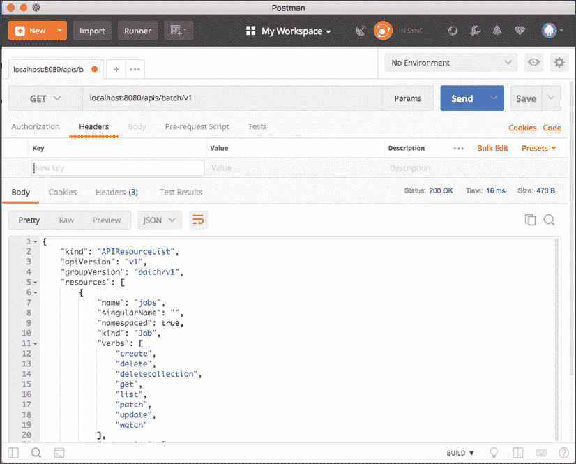
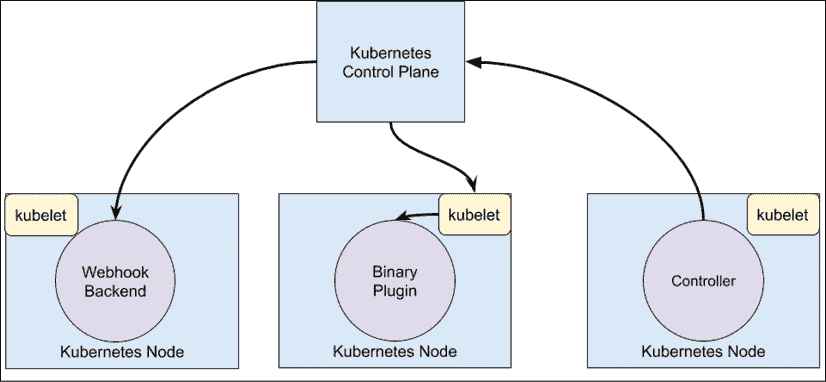
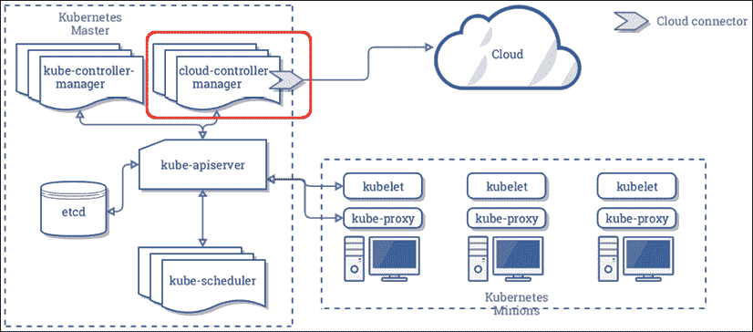
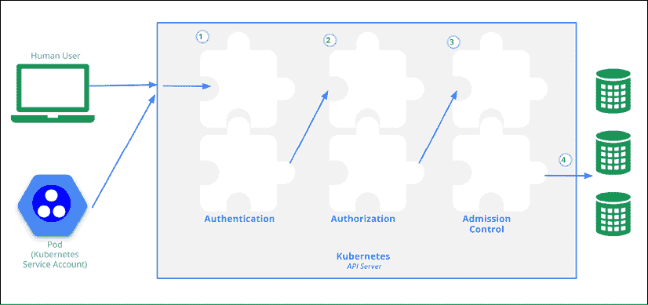

# 十五、扩展 Kubernetes

在这一章中，我们将深入挖掘 Kubernetes 的内部。我们将从 Kubernetes API 开始，学习如何通过直接访问 API、Python 客户端和自动化 Kubernetes 来以编程方式使用 Kubernetes。然后，我们将研究用定制资源扩展 Kubernetes API。最后一部分是关于 Kubernetes 支持的各种插件。Kubernetes 操作的许多方面都是模块化的，并且是为扩展而设计的。我们将检查 API 聚合层和几种类型的插件，例如自定义调度器、授权、准入控制、自定义指标和卷。最后，我们将研究扩展 Kubectl 并添加您自己的命令。

本章涵盖的主题如下:

*   使用 Kubernetes 应用编程接口
*   扩展 Kubernetes 应用编程接口
*   撰写立方结构与立方结构外挂程式
*   写网页挂钩

# 使用 Kubernetes 应用编程接口

Kubernetes API 是全面的，包含了 Kubernetes 的全部功能。正如你所料，它是巨大的。但是它使用最佳实践设计得非常好，并且是一致的。如果你理解了基本原理，你就能发现你需要知道的一切。

## 理解 OpenAPI

OpenAPI 允许 API 提供者定义他们的操作和模型，并使开发人员能够自动化他们的工具，并生成他们最喜欢的语言的客户端来与该 API 服务器对话。Kubernetes 支持 swagge 1.2(OpenAPI 规范的旧版本)已经有一段时间了，但是规范是不完整和无效的，使得很难基于它生成工具/客户端。

在 Kubernetes 1.4 中，通过升级当前的模型和操作，增加了对 OpenAPI 规范(在捐赠给 OpenAPI Initiative 之前，以前被称为 Swagger 2.0)的 alpha 支持。在 Kubernetes 1.5 中，对 OpenAPI 规范的支持已经通过直接从 Kubernetes 源自动生成规范来完成，这将使规范和文档与操作/模型的未来变化完全同步。

新规范实现了更好的应用编程接口文档和自动生成的 Python 客户端，我们将在后面探讨。

规范是模块化的，按组版本划分。这是面向未来的。您可以运行多个支持不同版本的应用编程接口服务器。应用可以逐渐过渡到更新的版本。

在 OpenAPI 规范定义中详细解释了规范的结构。Kubernetes 团队使用操作的标签来分隔每个组版本，并填写尽可能多的关于路径/操作和模型的信息。对于特定的操作，所有参数、调用方法和响应都被记录下来。结果令人印象深刻。

## 设置代理

为了简化访问，您可以使用 Kubectl 来设置代理:

```
$ kubectl proxy --port 8080 
```

现在，您可以访问`http://localhost:8080`上的应用编程接口服务器，它将到达 Kubernetes 为其配置的相同的应用编程接口服务器。

## 直接探索 Kubernetes 应用编程接口

Kubernetes 原料药非常容易被发现。您只需浏览到`http://localhost:8080`处的 API 服务器的 URL，就会得到一个漂亮的 JSON 文档，它描述了`paths`键下所有可用的操作。

由于空间限制，这里列出了部分列表:

```
{
  "paths": [
    "/api",
    "/api/v1",
    "/apis",
    "/apis/apps",
    "/apis/storage.k8s.io/v1",
    .
    .
    .
    "/healthz",
    "/healthz/ping",
    "/logs",
    "/metrics",
    "/swaggerapi/",
    "/ui/",
    "/version"
  ]
} 
```

您可以沿着任意一条路径钻取。例如，以下是来自`/api/v1/namespaces/default`端点的响应:

```
{
    "apiVersion": "v1",
    "kind": "Namespace",
    "metadata": {
        "creationTimestamp": "2017-12-25T10:04:26Z",
        "name": "default",
        "resourceVersion": "4",
        "selfLink": "/api/v1/namespaces/default",
        "uid": "fd497868-e95a-11e7-adce-080027c94384"
    },
    "spec": {
        "finalizers": [
            "kubernetes"
        ]
    },
    "status": {
        "phase": "Active"
    }
} 
```

我先去`/api`发现了这个端点，然后发现了`/api/v1`，它告诉我有`/api/v1/namespaces`，它把我指向了`/api/v1/namespaces/default`。

### 使用邮差探索 Kubernetes 应用编程接口

**邮差**([https://www.getpostman.com](https://www.getpostman.com))是一个非常精致的应用，用于使用 RESTful APIs。如果你更倾向于 GUI 端，你可能会发现它极其有用。

以下屏幕截图显示了批处理 V1 应用编程接口组中的可用端点:



图 15.1:批处理 V1 应用编程接口组中的可用端点

邮递员有很多选择，它以一种非常令人愉快的方式组织信息。试试看。

### 用 HTTPie 和 jq 过滤输出

API 的输出有时会过于冗长。通常，你只对 JSON 响应中的一个值感兴趣。例如，如果您想获得所有正在运行的服务的名称，您可以点击`/api/v1/services`端点。然而，回复中包含了许多不相关的附加信息。这里是输出的一个非常部分的子集:

```
$ http http://localhost:8080/api/v1/services
{
    "apiVersion": "v1",
    "items": [
        {
            "metadata": {
                "creationTimestamp": "2020-06-15T05:18:30Z",
                "labels": {
                    "component": "apiserver",
                    "provider": "kubernetes"
                },
                "name": "kubernetes",
                …
            },
            "spec": {
                …
            },
            "status": {
                "loadBalancer": {}
            }
        },
        …
    ],
    "kind": "ServiceList",
    "metadata": {
        "resourceVersion": "1076",
        "selfLink": "/api/v1/services"
    }
} 
```

完整的输出是 121 行长！让我们看看如何使用 **HTTPie** 和 **jq** 来获得对输出的完全控制，并且只显示服务的名称。比起 cURL，我更喜欢([https://httpie.org/](https://httpie.org/))在命令行上与 REST APIs 交互。`jq`([)https://stedolan.github.io/jq/](https://stedolan.github.io/jq/))命令行 JSON 处理器非常适合对 JSON 进行切片和划片。

查看的完整输出，可以看到的服务名称在的`metadata`部分`items`数组中的每一项。仅选择名称的 jq 表达式如下:

```
.items[].metadata.name 
```

以下是完整的命令和输出:

```
$ http http://localhost:8080/api/v1/services | jq .items[].metadata.name
"kubernetes"
"kube-dns"
"kubernetes-dashboard" 
```

## 通过 Kubernetes 应用编程接口创建一个 POD

应用编程接口也可以用于创建、更新和删除资源。与使用 Kubectl 不同，该 API 需要用 JSON 而不是 YAML 语法指定清单(尽管每个 JSON 文档也是有效的 YAML)。以下是 JSON pod 定义(`nginx-pod.json`):

```
{
  "kind": "Pod",
  "apiVersion": "v1",
  "metadata":{
    "name": "nginx",
    "namespace": "default",
    "labels": {
      "name": "nginx"
    }
  },
  "spec": {
    "containers": [{
                     "name": "nginx",
                     "image": "nginx",
                     "ports": [{"containerPort": 80}]
                   }]
  }
} 
```

以下命令将通过应用编程接口创建 pod:

```
$ http POST http://localhost:8080/api/v1/namespaces/default/pods @nginx-pod.json 
```

为了验证是否有效，让我们提取当前豆荚的名称和状态。终点为`/api/v1/namespaces/default/pods`。

jq 表达式为`items[].metadata.name,.items[].status.phase`。

以下是的完整命令和输出:

```
$ FILTER='.items[].metadata.name,.items[].status.phase'
$ http http://localhost:8080/api/v1/namespaces/default/pods | jq $FILTER
"nginx"
"Running" 
```

## 通过 Python 客户端访问 Kubernetes 应用编程接口

使用 httpie 和 jq 交互探索 API 是很棒的，但是当你消费并将其与其他软件集成时，API 的真正力量就来了。Kubernetes 孵化器项目提供了一个成熟的、文档非常丰富的 Python 客户端库。在[https://github.com/kubernetes-incubator/client-python](https://github.com/kubernetes-incubator/client-python)有售。

首先，确保您已经安装了 Python(2.7 和 3.5+ work)工作。然后安装 Kubernetes 包:

```
$ pip install kubernetes 
```

要开始与 Kubernetes 集群对话，您需要连接到它。开始交互式 Python 会话:

```
$ python
Python 3.8.0 (default, Jun 15 2020, 16:12:10)
[Clang 10.0.1 (clang-1001.0.46.4)] on Darwin
Type "help", "copyright", "credits" or "license" for more information.
>>> 
```

Python 客户端可以读取您的库贝斯克配置:

```
>>> from kubernetes import client, config
>>> config.load_kube_config()
>>> v1 = client.CoreV1Api() 
```

或者它可以直接连接到已经运行的代理:

```
>>> from kubernetes import client, config
>>> client.Configuration().host = 'http://localhost:8080'
>>> v1 = client.CoreV1Api() 
```

注意客户端模块提供方法获取不同组版本的访问权限，比如 CoreV1API。

### 剖析 CoreV1API 组

让我们深入并了解 CoreV1API 组。Python 对象有 397 个公共属性！

```
>>> attributes = [x for x in dir(v1) if not x.startswith('__')]
>>> len(attributes)
397 
```

我们忽略以双下划线开头的属性，因为它们是与 Kubernetes 无关的特殊类/实例方法。

让我们随机挑选十种方法，看看它们是什么样的:

```
>>> import random
>>> from pprint import pprint as pp
>>> pp(random.sample(attributes, 10))
['list_namespaced_secret',
 'connect_post_namespaced_pod_proxy',
 'patch_namespaced_replication_controller_with_http_info',
 'patch_node_status_with_http_info',
 'replace_persistent_volume',
 'read_namespaced_service_status',
 'read_namespaced_replication_controller_status',
 'list_namespaced_secret_with_http_info',
 'replace_namespaced_event_with_http_info',
 'replace_namespaced_resource_quota_with_http_info'] 
```

非常有趣。属性以动词开头，如 list、patch 或 read。他们中的许多人有一个命名空间的概念，许多人有一个`with_http_info`后缀。为了更好地理解，让我们计算存在多少个动词，以及每个动词使用多少个属性(其中动词是下划线之前的第一个标记):

```
>>> from collections import Counter
>>> verbs = [x.split('_')[0] for x in attributes] 
>>> pp(dict(Counter(verbs))) 
{'api': 1, 
 'connect': 96, 
 'create': 36, 
 'delete': 56, 
 'get': 2, 
 'list': 56, 
 'patch': 48, 
 'read': 52, 
 'replace': 50} 
```

我们可以进一步钻取，查看特定属性的交互式帮助:

```
>>> help(v1.create_node)
Help on method create_node in module kubernetes.client.apis.core_v1_api:
create_node(body, **kwargs) method of kubernetes.client.apis.core_v1_api.CoreV1Api instance 
create a Node
This method makes a synchronous HTTP request by default. To make 
an asynchronous HTTP request, please pass async_req=True:
>>> thread = api.create_node(body, async_req=True)
>>> result = thread.get()
:param async_req bool
:param V1Node body: (required)
:param str pretty: If 'true', then the output is pretty printed.
:param str dry_run: When present, indicates that modifications should not be persisted. An invalid or unrecognized dryRun directive will result in an error response and no further processing of the request. Valid values are: - All: all dry run stages will be processed :param str field_manager: fieldManager is a name associated with the actor or entity that is making these changes. The value must be less than or 128 characters long, and only contain printable characters, as defined by https://golang.org/pkg/unicode/#IsPrint.
:return: V1Node
         If the method is called asynchronously,
         returns the request thread. 
```

你可以自己逛逛，了解更多关于 API 的知识。让我们看看一些常见的操作，比如列出、创建、观察和删除对象。

### 列出对象

您可以列出不同种类的对象。方法名称以`list_`开头。下面是一个列出所有名称空间的示例:

```
for ns in v1.list_namespace().items:
... print(ns.metadata.name)
... 
default 
kube-public
kube-system 
```

### 创建对象

要创建对象，需要向`create`方法传递一个`body`参数。正文必须是一个 Python 字典，相当于您将与 Kubectl 一起使用的 YAML 配置文件。最简单的方法是实际使用 YAML 文件和然后使用 Python YAML 模块(不是标准库的一部分，必须单独安装)来读取 YAML 文件并将其加载到字典中。例如，要创建具有三个副本的 nginx 部署，我们可以使用这个 YAML 配置文件(`nginx-deployment.yaml`):

```
apiVersion: apps/v1
kind: Deployment
metadata:
  name: nginx-deployment
spec:
  replicas: 3
  selector:
    matchLabels:
      app: nginx  
  template:
    metadata:
      labels:
         app: nginx
    spec:
      containers:
        - name: nginx
          image: nginx:1.17.8
          ports:
            - containerPort: 80 
```

要安装 YAML Python 模块，请键入以下命令:

```
$ pip install pyyaml 
```

然后下面的 Python 3 程序(`create_nginx_deployment.py`)将创建部署:

```
from os import path
import yaml from kubernetes import client, config
def main():
# Configs can be set in Configuration class directly or using
# helper utility. If no argument provided, the config will be
# loaded from default location.
config.load_kube_config()
with open(path.join(path.dirname(__file__),
                    'nginx-deployment.yaml')) as f:
    dep = yaml.safe_load(f)
    k8s = client.AppsV1Api()
    dep = k8s.create_namespaced_deployment(body=dep,
                                           namespace="default")
    print(f"Deployment created. status='{dep.status}'")
if __name__ == '__main__': 
    main() 
```

### 观察物体

观看物体是一种高级能力。它是使用单独的手表模块实现的。下面是一个观察 10 个名称空间事件并将它们打印到屏幕上的示例(`watch_demo.py`):

```
from kubernetes import client, config, watch
# Configs can be set in Configuration class directly or using helper utility
config.load_kube_config()
v1 = client.CoreV1Api()
count = 3
w = watch.Watch()
for event in w.stream(v1.list_namespace, _request_timeout=60): 
    print(f"Event: {event['type']} {event['object'].metadata.name}")
    count -= 1 if count == 0: w.stop()
print('Done.') 
```

以下是输出:

```
$ python watch_demo.py
Event: ADDED default
Event: ADDED kube-public
Event: ADDED kube-system
Done. 
```

### 以编程方式调用 Kubectl

如果你不是 Python 开发人员，不想直接处理 REST API 或者客户端库，你还有另外一个选择。kube CTL 主要用作交互式命令行工具，但没有什么能阻止您自动化它，并通过脚本和程序调用它。使用 Kubernetes 作为您的 Kubernetes API 客户端有一些好处:

*   很容易找到任何用法的例子。
*   在命令行上进行实验以找到正确的命令和参数组合很容易。
*   Kubectl 支持 JSON 或 YAML 中的输出，以便快速解析。
*   身份验证是通过 Kubectl 配置内置的。

### 使用 Python 子进程运行 Kubectl

我将再次使用 Python，因此您可以比较使用官方 Python 客户端和滚动您自己的客户端。Python 有一个名为子流程的模块，可以运行外部流程，比如 Kubectl，并捕获输出。这里有一个 Python 3 的例子，它自己运行 Kubectl，并显示使用输出的开始:

```
>>> import subprocess 
>>> out = subprocess.check_output('kubectl').decode('utf-8')
>>> print(out[:276])
kubectl controls the Kubernetes cluster manager.
Find more information at: https://kubernetes.io/docs/reference/kubectl/overview/
Here are some basic Commands for beginners:
create          Create a resource from a file or from stdin. 
expose          Take a replication controller, servic 
```

`check_checkout()`函数将输出捕获为字节数组，需要将其解码到 UTF-8 才能正确显示。我们可以稍微概括一下，在`k.py`文件中创建一个名为`k()`的便利函数。它接受任何数量的参数并将其提供给库比特，然后解码输出并返回:

```
from subprocess import check_output
def k(*args): 
    out = check_output(['kubectl'] + list(args))
    return out.decode('utf-8') 
```

让我们使用它来列出默认名称空间中的所有运行豆荚:

```
>>> from k import k
>>> print(k('get', 'po'))
NAME                               READY   STATUS    RESTARTS    AGE
nginx                              1/1     Running   0           4h48m
nginx-deployment-679f9c75b-c79mv   1/1     Running   0           132m
nginx-deployment-679f9c75b-cnmvk   1/1     Running   0           132m
nginx-deployment-679f9c75b-gzfgk   1/1     Running   0           132m 
```

这对于展示来说很好，但是 Kubectl 已经这样做了。真正的力量来自于使用带有`-o`标志的结构化输出选项。然后结果可以自动转换成 Python 对象。这里是`k()`函数的修改版本，接受布尔`use_json`关键字参数(默认为`False`，如果`True`，则添加`-o json`，然后将 JSON 输出解析为 Python 对象(字典):

```
from subprocess import check_output 
import json
def k(*args, use_json=False):
    cmd = ['kubectl'] + list(args)
    if use_json:
        cmd += ['-o', 'json']
    out = check_output(cmd).decode('utf-8')
    if use_json:
        out = json.loads(out, )
return out 
```

这将返回一个完整的应用编程接口对象，可以像直接访问 REST 应用编程接口或使用官方 Python 客户端一样进行导航和深入研究:

```
>>> result = k('get', 'po', use_json=True)
>>> for r in result['items']: 
...     print(r['metadata']['name']) 
... 
nginx-deployment-679f9c75b-c79mv 
nginx-deployment-679f9c75b-cnmvk 
nginx-deployment-679f9c75b-gzfgk 
```

让我们看看如何删除部署并等到所有 POD 都消失。Kubectl `delete`命令不接受`-o` json 选项(虽然它有`-o`名称)，所以我们省略掉`use_json`:

```
k('delete', 'deployment', 'nginx-deployment') 
while len(k('get', 'po', use_json=True)['items']) > 0: 
    print('.') print('Done.')
.
.
.
.
Done. 
```

现在我们已经通过 Kubernetes 的 REST API 并通过控制 Kubernetes 以编程方式访问了 Kubernetes，是时候学习如何扩展 Kubernetes 了。

# 扩展 Kubernetes 应用编程接口

Kubernetes 是一个非常灵活的平台。它是从一开始就为可扩展性而设计的，随着它的发展，Kubernetes 的更多部分被打开，通过健壮的接口公开，它们可以被替代实现所取代。我冒昧地说初创公司、大公司、基础设施提供商和云提供商对 Kubernetes 的全面指数级采用是 Kubernetes 提供大量开箱即用的功能的直接结果，但也允许与其他参与者轻松集成。在本节中，我们将介绍许多可用的扩展点，例如:

*   用户定义的类型(自定义资源)
*   应用编程接口访问扩展
*   基础设施扩展
*   经营者
*   调度程序扩展

让我们了解你可以扩展 Kubernetes 的各种方式。

## 理解 Kubernetes 扩展点和模式

Kubernetes 由多个组件组成:API 服务器、etcd 状态存储、控制器管理器、kube-proxy、kubelet 和容器运行时。您可以深入扩展和定制每个和这些组件中的每一个，以及添加您自己的定制组件，这些组件监视事件并对事件做出反应，处理新的请求，以及修改关于传入请求的一切。

下图显示了一些可用的扩展点，以及它们如何连接到各种 Kubernetes 组件:



图 15.2:连接到 Kubernetes 组件的扩展点

### 用插件扩展 Kubernetes

Kubernetes 定义了几个接口，允许它与基础设施提供商提供的各种插件进行交互。我们在前面的章节中详细讨论了这些接口和插件。为了完整起见，我们将在此列出它们:

*   **CNI** :容器组网接口支持大量的连接节点和容器的组网方案。
*   **CSI** :容器存储界面支持 Kubernetes 大量的存储选项。
*   **设备插件**:这些允许节点发现 CPU 和内存之外的新节点资源(例如 GPU)。

### 用云控制器管理器扩展 Kubernetes

Kubernetes 最终需要部署在一些节点上，并使用一些存储和网络资源。最初，Kubernetes 只支持谷歌云平台和 AWS。其他云提供商不得不定制多个 Kubernetes 核心组件(Kubernetes、Kubernetes 控制器管理器、Kubernetes API 服务器)，以便与 Kubernetes 集成。Kubernetes 开发人员认为这是一个采用问题，并创建了**云控制器管理器** ( **CCM** )。CCM 清晰地定义了 Kubernetes 和它所部署的基础设施层之间的交互。现在，云提供商只需提供针对其基础设施定制的 CCM 实现，他们就可以利用上游的 Kubernetes，而无需对 Kubernetes 代码进行昂贵且容易出错的修改。所有 Kubernetes 组件都通过预定义的接口与 CCM 交互，Kubernetes 并不知道它运行在哪个云(或者没有云)上。下图展示了 Kubernetes 和云提供商之间通过 CCM 进行的交互:



图 15.3:云和 Kubernetes 通过 CCM 的交互

如果你想了解更多关于 CCM 的信息，请查看我几年前写的这篇简洁的文章:[https://medium . com/@ the . gigi/kubernetes-and-cloud-providers-b7a 6227d 3198](mailto:https://medium.com/@the.gigi/kubernetes-and-cloud-providers-b7a6227d3198)。

### 用网络钩子扩展 Kubernetes

插件在集群中运行，但是在某些情况下，更好的可扩展性模式是将一个功能委托给集群外的服务。这在访问控制领域非常常见，公司和组织可能已经有了一个集中的身份和访问控制解决方案。在这些情况下，webhook 可扩展性模式是有用的。想法是你可以用一个端点(webhook)来配置 Kubernetes。Kubernetes 将调用端点，在那里您可以实现自己的自定义功能，Kubernetes 将根据响应采取行动。当我们讨论身份验证、授权和动态准入控制时，我们已经看到了这种模式。

Kubernetes 为每个 webhook 定义了预期的有效负载。为了成功地与 Kubernetes 交互，webhook 实现必须遵守这些规则。

### 用控制器和操作器扩展 Kubernetes

控制器模式是您编写一个程序，该程序可以在集群内部或集群外部运行，监视事件并对其做出响应。控制器的概念模型是将集群的当前状态(控制器感兴趣的部分)与期望的状态相协调。控制器的常见做法是读取对象的`.spec`，采取一些动作，并更新其`.status`。Kubernetes 的很多核心逻辑都是由控制器管理器管理的一大组控制器实现的，但是没有什么能阻止我们将自己的控制器部署到集群中，或者运行远程访问 API 服务器的控制器。

操作员模式是控制器模式的另一种味道。将操作员想象成一个控制器，它也有自己的一组自定义资源，代表它所管理的某个应用。运营商的目标是管理部署在集群中的某些应用的生命周期。一个很好的例子是**etcd-operator**:[https://github.com/coreos/etcd-operator](https://github.com/coreos/etcd-operator)。

如果你计划打造自己的控制器，我推荐从**库伯 builder**([https://github.com/kubernetes-sigs/kubebuilder](https://github.com/kubernetes-sigs/kubebuilder))开始。这是一个由 Kubernetes API Machinery SIG 维护的项目，支持使用 CRD 定义多个定制 API，并在控制器代码之外构建框架来观察这些资源。

对于运营商考虑使用**运营商框架**([https://github.com/operator-framework](https://github.com/operator-framework))作为您的起点。

### 扩展 Kubernetes 调度

用一句话来说，Kubernetes 的工作就是为节点安排豆荚。调度是 Kubernetes 所做的事情的核心，它做得很好。Kubernetes 调度程序可以用非常高级的方式配置(守护程序集、污点、容忍等等)。但是 Kubernetes 开发人员认识到，可能会有特殊情况，您可能想要控制核心调度算法。可以用您自己的调度程序替换核心的 Kubernetes 调度程序，或者在内置调度程序旁边运行另一个调度程序来控制 pods 子集的调度。我们将在本章后面部分看到如何做到这一点。

### 用自定义容器运行时扩展 Kubernetes

Kubernetes 最初只支持 Docker 作为容器运行时。Docker 支持被嵌入到核心 Kubernetes 代码库中。后来，增加了对 rkt 的专门支持。但是 Kubernetes 的开发人员看到了曙光，并引入了 CRI(容器运行时接口)，一个 gRPC 接口，它使任何实现它的容器运行时都能够与 kubelet 通信。最终，对 Docker 和 rkt 的硬编码支持被淘汰，现在 kubelet 只通过 CRI 与容器运行时对话:


图 15.4: Kubelet 与容器运行时通信

自从引入 CRI 以来，使用 Kubernetes 的容器运行时数量激增。

## 引入定制资源

扩展 Kubernetes 的主要方法之一是定义新类型的资源，称为定制资源。您可以使用自定义资源做什么？很多。您可以使用它们来管理资源，这些资源位于 Kubernetes 集群之外，但是您的豆荚通过 Kubernetes API 与之通信。通过将这些外部资源添加为定制资源，您可以全面了解您的系统，并受益于许多 Kubernetes API 特性，例如:

*   自定义 CRUD REST 端点
*   版本控制
*   手表
*   与通用 Kubernetes 工具自动集成

自定义资源的其他用例是自定义控制器和自动化程序的元数据。

在 Kubernetes 1.7 中引入的定制资源是对现在已弃用的第三方资源的重大改进。让我们深入了解一下定制资源的全部内容。

为了让 Kubernetes API 服务器玩得好，定制资源必须符合一些基本要求。类似于内置的应用编程接口对象，它们必须具有以下字段:

*   `apiVersion` : `apiextensions.k8s.io/v1`
*   `metadata`:标准 Kubernetes 对象元数据
*   `kind` : `CustomResourceDefinition`
*   `spec`:描述资源如何出现在 API 和工具中
*   `status`:表示 CRD 的当前状态

规范有一个内部结构，包括诸如组、名称、范围、验证和版本等字段。状态包括字段`acceptedNames`和`Conditions`。在下一节中，我将向您展示一个阐明这些字段含义的示例。

## 开发自定义资源定义

您使用**自定义资源定义** ( **CRD** 开发自定义资源。意图是让 CRDs 与 Kubernetes 及其 API 和工装顺利集成，所以需要提供大量信息。下面是一个名为 **Candy** 的自定义资源示例:

```
apiVersion: apiextensions.k8s.io/v1
kind: CustomResourceDefinition
metadata:
  # name must match the spec fields below, and be in the form: <plural>.<group>
  name: candies.awesome.corp.com
spec:
  # group name to use for REST API: /apis/<group>/<version>
  group: awesome.corp.com
  # version name to use for REST API: /apis/<group>/<version>
  versions:
    - name: v1
      # Each version can be enabled/disabled by Served flag.
      served: true
      # One and only one version must be marked as the storage version.
      storage: true
      schema:
        openAPIV3Schema:
          type: object
          properties:
            spec:
              type: object
              properties:
                flavor:
                  type: string
  # either Namespaced or Cluster
  scope: Namespaced
  names:
    # plural name to be used in the URL: /apis/<group>/<version>/<plural>
    plural: candies
    # singular name to be used as an alias on the CLI and for display
    singular: candy
    # kind is normally the CamelCased singular type. Your resource manifests use this.
    kind: Candy
    # shortNames allow shorter string to match your resource on the CLI
    shortNames:
      - cn 
```

《糖果 CRD》有几个有趣的部分。元数据有一个完全限定的名称应该是唯一的，因为 CRD 是集群范围的。规范有一个版本条目，它可以包含多个版本，每个版本都有一个指定自定义资源字段的模式。模式遵循 OpenAPI v3([https://github . com/OAI/OpenAPI-Specification/blob/master/versions/3 . 0 . 0 . MD # SchemaObject](https://github.com/OAI/OpenAPI-Specification/blob/master/versions/3.0.0.md#schemaObject))规范。

范围字段可以是`Namespaced`或`Cluster`。如果范围是`Namespaced`，那么您从 CRD 创建的自定义资源将只存在于创建它们的命名空间中；集群范围的自定义资源在任何命名空间中都可用。

最后，`names`部分引用自定义资源的名称(而不是元数据部分的 CRD 名称)。名称有复数、单数、种类和简称选项。

让我们创建 CRD:

```
$ kubectl create -f candy-crd.yaml
customresourcedefinition.apiextensions.k8s.io/candies.awesome.corp.com created 
```

注意返回元数据名称。使用复数名称是很常见的。现在，让我们验证我们可以访问它:

```
$ kubectl get crd
NAME                     CREATED AT 
candies.awesome.corp.com 2020-06-15T10:19:09Z 
```

还有一个用于管理这一新资源的应用编程接口端点:

```
/apis/awesome.corp.com/v1/namespaces/<namespace>/candies/ 
```

## 集成定制资源

一旦创建了`CustomResourceDefinition`对象，您就可以创建该资源种类的自定义资源，在这种情况下为`Candy`(Candy 变成了 CamelCase Candy)。定制资源必须尊重来自 CRD 的模式。在以下示例中，`flavor`字段设置在名为巧克力的`Candy`对象上。`apiVersion`字段源自 CRD 规格的`group`和`version`字段:

```
apiVersion: awesome.corp.com/v1 
kind: Candy 
metadata: 
    name: chocolate 
spec: 
    flavor: sweeeeeeet 
```

让我们创建它:

```
$ k create -f chocolate.yaml 
candy.awesome.corp.com/chocolate created 
```

请注意，规范必须包含模式中的`flavor`字段。

在这一点上，Kubectl 可以像对内置对象一样对`Candy`对象进行操作。请注意，在使用 Kubectl 时，资源名称不区分大小写:

```
$ kubectl get candies 
NAME AGE chocolate 2m 
```

我们也可以使用标准的`-o json`标志查看原始 JSON 数据。这次我们就用这个简称`cn`吧:

```
$ kubectl get cn -o json
{
    "apiVersion": "v1",
    "items": [
        {
            "apiVersion": "awesome.corp.com/v1",
            "kind": "Candy",
            "metadata": {
                "creationTimestamp": "2020-06-15T10:22:25Z",
                "generation": 1,
                "name": "chocolate",
                "namespace": "default",
                "resourceVersion": "1664",
                "selfLink": "/apis/awesome.corp.com/v1/namespaces/default/candies/chocolate",
                "uid": "1b04f5a9-9ae8-475d-bc7d-245042759304"
            },
            "spec": {
                "flavor": "sweeeeeeet"
            }
        }
    ],
    "kind": "List",
    "metadata": {
        "resourceVersion": "",
        "selfLink": ""
    }
} 
```

### 处理未知字段

规范中的模式是随着在 Kubernetes 1.17 中变得稳定的 CRDs 的`apiextensions.k8s.io/v1`版本引入的。对于`apiextensions.k8s.io/v1beta`来说，不需要一个模式，所以任意字段是一条路。如果你只是试着把你的 CRD 版本从 v1beta 改成 v1，你会猛然醒悟。Kubernetes 将允许您更新 CRD，但是当您稍后尝试创建带有未知字段的自定义资源时，它将失败。

您必须为所有 CRD 定义一个模式。如果您必须处理可能有额外未知字段的自定义资源，您可以关闭验证，但额外的字段将被删除。

这里有一个`Candy`资源，它有一个模式中没有指定的额外的字段纹理:

```
apiVersion: awesome.corp.com/v1 
kind: Candy 
metadata: 
    name: gummy-bear 
spec: 
    flavor: delicious 
    texture: rubbery 
```

如果我们试图通过验证来创建它，它将会失败:

```
$ kubectl create -f gummy-bear.yaml
error: error validating "gummy-bear.yaml": error validating data: ValidationError(Candy.spec): unknown field "texture" in com.corp.awesome.v1.Candy.spec; if you choose to ignore these errors, turn validation off with --validate=false 
```

但是如果我们关闭验证，那么一切都很好，除了只有`flavor`字段将出现，而纹理字段不会出现:

```
$ kubectl create -f gummy-bear.yaml --validate=false 
candy.awesome.corp.com/gummy-bear created
$ kubectl get cn gummy-bear -o yaml 
apiVersion: awesome.corp.com/v1 
kind: Candy 
metadata: 
  creationTimestamp: "2020-06-15T22:02:18Z" 
  generation: 1 
  name: gummy-bear 
  namespace: default 
  resourceVersion: "93551" 
  selfLink: /apis/awesome.corp.com/v1/namespaces/default/candies/gummy-bear 
  uid: 1900b97e-55ba-4235-8366-24f469f449e3 
spec: 
  flavor: delicious 
```

如果要添加任意字段，需要用`--validate=false`关闭验证。

### 正在完成自定义资源

自定义资源支持终结器，就像标准的应用编程接口对象一样。终结器是一种机制，在这种机制下，对象不会立即被删除，而是必须等待在后台运行的特殊控制器，并监视删除请求。控制器可以执行任何必要的清理选项，然后从目标对象中移除其终结器。一个对象上可能有多个终结器。Kubernetes 将等待，直到所有终结器都被移除，然后才删除对象。元数据中的终结器只是它们对应的控制器可以识别的任意字符串。Kubernetes 不知道他们是什么意思。它只是耐心地等待删除所有终结器，然后再删除对象。下面是一个带有两个终结器的 candy 对象的示例:`eat-me`和`drink-me`:

```
apiVersion: awesome.corp.com/v1 
kind: Candy 
metadata: 
  name: chocolate 
  finalizers: 
  - eat-me 
  - drink-me 
spec: 
  flavor: sweeeeeeet 
```

### 添加自定义打印机列

默认情况下，当您使用 Kubectl 列出自定义资源时，您只会得到资源的名称和年限:

```
$ kubectl get cn 
NAME       AGE 
chocolate  11h 
gummy-bear 16m 
```

但是 CRD 模式允许您添加自己的列。让我们将`flavor`和`age`字段作为可打印列添加到糖果对象中:

```
apiVersion: apiextensions.k8s.io/v1 
kind: CustomResourceDefinition 
metadata: 
  name: candies.awesome.corp.com 
spec: 
  group: awesome.corp.com 
  versions: 
    - name: v1 
      ... 
      additionalPrinterColumns: 
      - name: Flavor 
        type: string 
        description: The flavor of the candy 
        jsonPath: .spec.flavor 
      - name: Age 
        type: date 
        jsonPath: .metadata.creationTimestamp 
  ... 
```

然后我们可以创建它，再次添加我们的糖果，并列出它们:

```
$ kubectl create -f candy-with-flavor-crd.yaml
customresourcedefinition.apiextensions.k8s.io/candies.awesome.corp.com created
$ kubectl create -f chocolate.yaml 
candy.awesome.corp.com/chocolate created
$ kubectl create -f gummy-bear.yaml --validate=false 
candy.awesome.corp.com/gummy-bear created
$ kubectl get candies 
NAME        FLAVOR      AGE 
chocolate   sweeeeeeet  64s 
gummy-bear  delicious   59s 
```

## 了解应用编程接口服务器聚合

当您只需要对自己的类型进行一些 CRUD 操作时，CRD 是很棒的。您可以将搭载在 Kubernetes API 服务器上，该服务器将存储您的对象，并提供 API 支持和与工具(如 Kubectl)的集成。如果你需要更多的能量，你可以运行监视你的定制资源的控制器，当它们被创建、更新或删除时执行一些操作。**kube builder**([https://github.com/kubernetes-sigs/kubebuilder](https://github.com/kubernetes-sigs/kubebuilder))项目是一个很好的框架，可以用你自己的控制器在 CRDs 上构建 Kubernetes APIs。

但是 CRD 有局限性。如果需要更高级的特性和定制，可以使用 API 服务器聚合，编写自己的 API 服务器，Kubernetes API 服务器将委托给它。您的应用编程接口服务器将使用与 Kubernetes 应用编程接口服务器本身相同的应用编程接口机制。仅通过聚合层可用的一些高级功能包括:

*   使您的 apiserver 采用不同的存储 API，而不是 etcd v3
*   为您自己的资源扩展长期运行的子资源/端点，例如 websockets
*   将您的 apiserver 与任何其他外部系统集成
*   控制对象的存储(自定义资源总是存储在 etcd 中)
*   为您自己的资源提供长期运行的资源，如网络套接字
*   CRUD 之外的自定义操作(例如，执行或扩展)
*   使用协议缓冲区有效负载
*   将您的应用编程接口服务器与任何外部系统集成

编写一个扩展 API 服务器是一项不平凡的工作。如果你认为你需要所有的能力，我推荐使用 API builder alpha 项目:[https://github.com/kubernetes-sigs/apiserver-builder-alpha](https://github.com/kubernetes-sigs/apiserver-builder-alpha)。

这是一个年轻的项目，但它需要处理大量必要的样板代码。应用编程接口生成器提供以下功能:

*   引导完整的类型定义、控制器和测试，以及文档。
*   您可以在本地、minikube 内部或实际的远程集群上运行的扩展控制平面。
*   您生成的控制器将能够观察和更新应用编程接口对象。
*   添加资源(包括子资源)。
*   如果需要，可以覆盖默认值。

## 利用服务目录

Kubernetes **目录**([【https://github.com/kubernetes-sigs/service-catalog】](https://github.com/kubernetes-sigs/service-catalog))项目允许您流畅、无痛地集成任何支持**开放服务代理 API** 规范:[https://github.com/openservicebrokerapi/servicebroker](https://github.com/openservicebrokerapi/servicebroker)的外部服务。

开放服务代理应用编程接口的意图是通过一个带有支持文档和全面测试套件的标准规范向任何云环境公开外部服务。这使得提供商可以实现单一规范并支持多个云环境。当前的环境包括 Kubernetes 和 Cloud Foundry。该项目致力于广泛的行业采用。

服务目录对于集成云平台提供商的服务尤其有用。以下是此类服务的一些示例:

*   Microsoft Azure 云队列
*   亚马逊简单队列服务
*   谷歌云发布/订阅

下面的图描述了服务目录的架构和工作流程，服务目录是使用聚合层作为 API 服务器扩展实现的:


图 15.5:服务目录

这一功能对于致力于云的组织来说是一个真正的福音。您可以在 Kubernetes 上构建您的系统，但是您不必自己部署、管理和维护集群中的每个服务。您可以将这些卸载到您的云提供商，享受深度集成，并专注于您的应用。

通过允许您通过服务代理调配云资源，服务目录有可能使您的 Kubernetes 集群完全自治。我们还没到那一步，但方向很有希望。

我们关于从外部访问和扩展 Kubernetes 的讨论到此结束。在下一部分，我们将把目光转向内部，通过插件定制 Kubernetes 本身的内部工作。

# 撰写非压缩外挂程式

在本节中，我们将深入 Kubernetes 的内部，并学习利用其著名的灵活性和可扩展性。我们将了解可以通过插件定制的不同方面，以及如何实现这些插件并将其与 Kubernetes 集成。

## 编写自定义调度程序

kubernetes 完全是为了编排容器化的工作负载。最基本的责任是安排 pods 在集群节点上运行。在我们能够编写自己的调度程序之前，我们需要了解调度在 Kubernetes 中是如何工作的。

### 了解 Kubernetes 调度程序的设计

Kubernetes 调度程序有一个非常简单的角色。当需要创建新的 pod 时，它会将其分配给目标节点。就这样。目标节点上的 Kubelet 将从那里获取它，并指示节点上的容器运行时运行 pod 的容器。

Kubernetes 调度器实现了控制器模式:

*   注意等待的 POD
*   为 pod 选择正确的节点
*   通过设置`nodeName`字段更新节点的规格

唯一复杂的部分是选择目标节点。这个过程包括两个步骤:

1.  过滤节点
2.  排名节点

调度程序考虑了大量的信息和配置。筛选从候选列表中移除不满足硬约束之一的节点。对节点进行排名会为剩余的每个节点分配一个分数，并选择最佳节点。

以下是调度程序在过滤节点时评估的因素:

*   检查节点是否有 pod 请求的 pod 端口的空闲端口
*   检查 pod 是否通过其主机名指定了特定节点
*   检查节点是否有足够的资源(CPU、内存等)来满足 pod 的要求
*   检查 pod 的节点选择器是否与节点标签匹配
*   根据该存储的故障区域限制，评估 pod 请求的卷在节点上是否可用
*   检查 pod 是否可以因其请求的卷和已装载的卷而适合节点
*   决定应该附加多少 CSI 卷，以及这是否超过配置的限制
*   检查节点是否报告内存压力
*   检查节点是否报告进程标识不足
*   检查节点是否报告文件系统已满或接近满
*   检查节点报告的其他情况，如网络不可用或 kubelet 未准备好
*   检查 pod 的容忍能力是否能够容忍节点的污染
*   检查 pod 是否能够满足其请求的容量

过滤节点后，调度程序将根据以下策略(您可以配置)对节点进行评分:

*   考虑到属于同一服务的单元，`StatefulSet`或`ReplicaSet`，将单元分布在主机上。
*   荚间相似性优先级。
*   请求最少的优先级—倾向于请求资源较少的节点。该策略在集群的所有节点上分布 pods。
*   最`requestedPriority`–偏爱请求资源最多的节点。该策略将把 POD 打包到最小的节点集中。
*   请求与能力比率优先级–使用默认资源评分函数形状创建基于`requestedToCapacity`的`ResourceAllocationPriority`。
*   平衡的资源分配–支持资源使用平衡的节点。
*   节点首选避免 pods 优先级–根据节点注释`scheduler.alpha.kubernetes.io/preferAvoidPods`对节点进行优先级排序。您可以用它来提示两个不同的 POD 不应该在同一个节点上运行。
*   节点相似性优先级–根据`PreferredDuringSchedulingIgnoredDuringExecution`中指示的节点相似性调度首选项对节点进行优先级排序。
*   污点容忍优先级–根据节点上不可容忍污点的数量，为所有节点准备优先级列表。该策略考虑到该列表来调整节点的等级。
*   映像位置优先级—优先选择已经拥有 pod 所需的容器映像的节点。
*   服务分布优先级—支持将支持服务的 pods 分布在不同的节点上。
*   荚果抗亲和。
*   同等优先级地图-所有节点获得相同的权重。没有收藏夹。

如您所见，默认调度程序非常复杂，可以通过非常细粒度的方式进行配置，以满足您的大部分需求。但在某些情况下，这可能不是最好的选择。特别是在具有许多节点(数百个或数千个)的大型集群中，每次调度 pod 时，所有节点都需要经过这种严格且重量级的过滤和评分过程。现在，考虑一种情况，您需要一次安排大量的 pods(例如，训练机器学习模型)。这会给集群带来很大压力，并导致性能问题。

Kubernetes 最近引入了一些方法，通过允许您只过滤和评分一些节点，使过滤和评分过程更加轻量级，但是您可能仍然想要更好的控制。

幸运的是，Kubernetes 允许我们以几种方式影响调度过程。这些方式包括:

*   将 POD 直接调度到节点
*   用您自己的调度程序替换调度程序
*   用附加过滤器扩展调度程序
*   添加与默认调度程序一起运行的另一个调度程序

### 手动调度 POD

你猜怎么着？当我们创建豆荚时，我们可以告诉 Kubernetes 在哪里放置豆荚。只需要在 pod 的规范中指定一个节点名称，调度程序就会忽略它。如果你考虑控制器模式的松散耦合性质，这一切都是有意义的。调度程序正在监视尚未分配节点名称的待处理单元。如果您自己传递节点名，那么目标节点上的 Kubelet(负责监视有节点名的待处理 pod)将会继续，并确保创建一个新的 pod。

这是一个具有预定义节点名称的 pod:

```
apiVersion: v1
kind: Pod 
metadata: 
name: some-pod-manual-scheduling 
spec: 
containers: 
- name: some-container 
image: gcr.io/google_containers/pause:2.0 
nodeName: k3d-k3s-default-worker-1 
schedulerName: no-such-scheduler 
```

如果我们创建并描述 pod，我们可以看到它确实按照请求被调度到`k3d-k3s-default-worker-1` 节点:

```
$ kubectl describe po some-pod-manual-scheduling 
Name: some-pod-manual-scheduling 
Node: k3d-k3s-default-worker-1/172.19.0.4 
Status: Running 
  ... 
Containers: 
  ... 
Conditions: 
  Type             Status 
  Initialized      True 
  Ready            True 
  ContainersReady  True 
  PodScheduled     True 
Events:      <none> 
```

当您想要将临时 pod 调度到任何受感染的节点而不增加容忍度时，直接调度对于故障排除也很有用。

现在让我们创建自己的定制调度程序。

### 准备我们自己的调度程序

我们的调度器将会非常简单。它只会将所有请求由`custom-scheduler`调度的待处理单元调度到节点`k3d-k3s-default-worker-1`。下面是使用 Kubernetes 客户端包的 Python 实现:

```
from kubernetes import client, config, watch
def schedule_pod(cli, name): 
    target = client.V1ObjectReference() 
    target.kind = 'Node' 
    target.apiVersion = 'v1' 
    target.name = 'k3d-k3s-default-worker-1' 
    meta = client.V1ObjectMeta() 
    meta.name = name 
    body = client.V1Binding(metadata=meta, target=target) 
    return cli.create_namespaced_binding('default', body)
def main(): 
    config.load_kube_config() 
    cli = client.CoreV1Api() 
    w = watch.Watch() 
    for event in w.stream(cli.list_namespaced_pod, 'default'): 
        o = event['object'] 
        if o.status.phase != 'Pending' or o.spec.scheduler_name != 'custom-scheduler': 
            continue

        schedule_pod(cli, o.metadata.name)
if __name__ == '__main__': 
    main() 
```

如果您希望长期运行自定义调度程序，那么您应该像部署其他工作负载一样将其部署到集群中。但是，如果您只是想玩玩它，或者您还在开发您的自定义调度程序逻辑，那么您可以在本地运行它，只要它有正确的凭据来访问集群，并且有权限监视挂起的 pods 并更新它们的节点名称。

### 将 POD 分配给自定义调度程序

好的。我们有一个定制的调度程序，可以和默认的调度程序一起运行。但是当有多个调度器时，Kubernetes 如何选择使用哪个调度器来调度一个 pod 呢？

答案是 Kubernetes 不在乎。pod 可以指定它想要调度哪个调度器。默认调度程序将调度任何未指定调度或明确指定`default-scheduler`的 pod。其他定制调度器应该负责，并且只调度请求它们的 POD。如果多个调度程序试图调度同一个 pod，我们将可能会以多个副本或命名冲突而告终。

例如，我们简单的定制调度器正在寻找指定调度器名称`custom-scheduler`的待处理单元。所有其他 POD 都将被它忽略:

```
if o.status.phase != 'Pending' or o.spec.scheduler_name != 'custom-scheduler':
    continue 
```

这里有一个 pod 规范，在其规范中指定了`custom-scheduler`:

```
apiVersion: v1
kind: Pod
metadata: 
  name: some-pod-with-custom-scheduler
spec:
  containers:
    - name: some-container
    image: gcr.io/google_containers/pause:2.0
  schedulerName: custom-scheduler 
```

如果我们的定制调度程序没有运行，而我们试图创建这个 pod，会发生什么？

```
$ kubectl create -f some-pod-with-custom-scheduler.yaml
pod/some-pod-with-custom-scheduler created
$ kubectl get po
NAME                            READY  STATUS   RESTARTS  AGE
some-pod-manual-scheduling      1/1    Running  0         23h
some-pod-with-custom-scheduler  0/1    Pending  0         25s 
```

pod 创建得很好(这意味着 Kubernetes API 服务器将它存储在 etcd 中)，但它处于挂起状态，这意味着它还没有被调度。由于它指定了显式调度程序，默认调度程序会忽略它。

但是如果我们运行调度程序...它将立即被安排:

```
$ python custom_scheduler.py
Waiting for pods to schedule
Scheduling pod some-pod-with-custom-scheduler 
```

现在我们可以看到 pod 被分配给了一个节点，并且处于运行状态:

```
$ kubectl get pod -o wide
NAME                            READY  STATUS   IP         NODE
some-pod-manual-scheduling      1/1    Running  10.42.0.5  k3d-k3s-default-worker-1
some-pod-with-custom-scheduler  1/1    Running  10.42.0.8  k3d-k3s-default-worker-1 
```

### 验证是否使用正确的调度程序调度了 POD

我们可以查看 pod 事件，看到对于使用默认调度器调度的 pod，您可以预期以下事件:

```
$ kubectl describe po some-pod | grep Events: -A 10
Events:
  Type    Reason     Age        From                               Message
  ----    ------     ----       ----                               -------
  Normal  Scheduled  <unknown>  default-scheduler                  Successfully assigned default/some-pod to k3d-k3s-default-worker-0
  Normal  Pulled     12m        kubelet, k3d-k3s-default-worker-0  Container image "gcr.io/google_containers/pause:2.0" already present on machine
  Normal  Created    12m        kubelet, k3d-k3s-default-worker-0  Created container some-container
  Normal  Started    12m        kubelet, k3d-k3s-default-worker-0  Started container some-container 
```

但是对于我们的自定义调度程序，没有`Scheduled`事件:

```
$ k describe po some-pod-with-custom-scheduler | grep Events: -A 10 
Events:
  Type    Reason   Age   From                               Message
  ----    ------   ----  ----                               -------
  Normal  Pulled   22m   kubelet, k3d-k3s-default-worker-1  Container image "gcr.io/google_containers/pause:2.0" already present on machine
  Normal  Created  22m   kubelet, k3d-k3s-default-worker-1  Created container some-container
  Normal  Started  22m   kubelet, k3d-k3s-default-worker-1  Started container some-container 
```

这是对调度和定制调度器的深入研究。让我们来看看 Kubectl 插件。

## 编写 Kubectl 插件

Kubectl 是有抱负的 Kubernetes 开发人员和管理员的主力。现在有非常好的视觉工具，比如**k9s**([https://github.com/derailed/k9s](https://github.com/derailed/k9s))**八度**([https://github.com/vmware-tanzu/octant](https://github.com/vmware-tanzu/octant))当然还有 Kubernetes 仪表盘。但是 Kubectl 是与您的集群交互工作并参与自动化工作流的最完整的方式。

Kubectl 包含了一系列令人印象深刻的功能，但是您通常需要将多个命令或一长串参数串在一起才能完成一些任务。您可能还想运行一些安装在集群中的附加工具。

您可以将这样的功能打包为脚本或容器或任何其他方式，但是接下来您将遇到在哪里放置它们、如何发现它们以及如何管理它们的问题。Kubectl 插件为您提供了这些扩展功能的一站式商店。例如，最近我需要定期在 SFTP 服务器上列出和移动文件，该服务器由运行在 Kubernetes 集群上的容器化应用管理。我很快编写了几个 Kubectl 插件，利用我的`KUBECONFIG`凭证来访问集群中的机密，这些机密包含访问 SFTP 服务器的凭证，然后实现了许多特定于应用的逻辑来访问和管理那些 SFTP 目录和文件。

### 理解 Kubectl 插件

在 Kubernetes 1.12 之前，Kubernetes 插件需要一个专用的 YAML 文件，在该文件中您指定了各种元数据和其他实现该功能的文件。在 Kubernetes 1.12 中，Kubectl 开始使用 Git 扩展模型，在该模型中，路径上任何前缀为`kubectl-`的可执行文件都被视为插件。

Kubectl 提供了`kubectl plugins list`命令来列出你当前所有的插件。这个模型在 Git 上非常成功，现在添加您自己的 Kubectl 插件非常简单。

如果你添加了一个名为`kubectl-foo`的可执行文件，那么你可以通过`kubectl foo`运行它。您也可以有嵌套的命令。将`kubectl-foo-bar`添加到您的路径中，并通过`kubectl foo bar`运行它。如果您想在命令中使用破折号，那么在可执行文件中使用下划线。例如，可执行文件`kubectl-do_stuff`可以使用`kubectl do-stuff`运行。

可执行文件本身可以用任何语言实现，有自己的命令行参数和标志，并显示自己的用法和帮助信息。

### 用 Krew 管理 Kubectl 插件

轻量级插件模型非常适合编写自己的插件，但是如果你想和社区分享你的插件呢？

**Krew**([https://github.com/kubernetes-sigs/krew](https://github.com/kubernetes-sigs/krew))是 Kubectl 插件的包管理器，可以让你发现、安装和管理精心策划的插件。

您可以在 Mac 上使用 brew 安装 Krew，也可以按照其他平台的安装说明进行安装。Krew 本身是一个 Kubectl 插件，因为它的可执行文件是`kubectl-krew`。这意味着你可以直接运行它，`kubectl-krew`，或者通过`kubectl krew`。如果你有一个`kubectl`的`k`别名，你可能会更喜欢后者:

```
$ k krew
  krew is the kubectl plugin manager.
  You can invoke krew through kubectl: "kubectl krew [command]..."
  Usage: 
    krew [command]
Available Commands: 
  help       Help about any command 
  info       Show information about a kubectl plugin 
  install    Install kubectl plugins 
  list       List installed kubectl plugins 
  search     Discover kubectl plugins 
  uninstall  Uninstall plugins 
  update     Update the local copy of the plugin index 
  upgrade    Upgrade installed plugins to newer versions 
  version    Show krew version and diagnostics
Flags: 
  -h, --help help for krew 
  -v, --v Level number for the log level verbosity
Use "krew [command] --help" for more information about a command. 
```

请注意，`krew list`命令只显示 Krew 管理的插件，而不是所有的 Kubectl 插件。它甚至不显示自己！

我建议您查看可用的插件。其中一些非常有用，它们可能会给你一些编写自己插件的想法。让我们看看编写自己的插件有多容易。

### 创建您自己的库比特插件

我最近接到了一份不愉快的工作，照看一个部署在 GKE Kubernetes 集群中的关键应用。最初的开发团队已经不在了，并且有比将其迁移到我们的 AWS 基础设施更高的优先级。我注意到一些部署拥有多个副本集，但所需的副本数量为零。周围没有人问为什么这些复制品还在。我的猜测是，这是一个工件或更新，其中旧的副本集被缩小到零，而新的副本集被放大，但是旧的副本集被留在那里等待部署。无论如何，让我们编写一个 Kubectl 插件，列出没有副本的陈旧副本集。

原来是超级简单。让我们使用 Python 和优秀的`sh`模块，它让我们自然地从 Python 中运行命令行命令。在这种情况下，我们只需运行 Kubectl 本身，并使用自定义列格式获取所有副本集，然后我们将保留没有副本的副本集，并使用它们自己的部署显示它们:

```
#!/usr/bin/env python3
import sh
def main():
    """ """
    o = "-o custom-columns='NAME:.metadata.name,DEPLOYMENT:.metadata.ownerReferences[0].name,REPLICAS:.spec.replicas"
    all_rs = sh.kubectl.get.rs(o.split()).stdout.decode('utf-8').split('\n')
    all_rs = [r.split() for r in all_rs if r]
    results = ((name, deployment) for (name, deployment, replicas) in all_rs[1:] if replicas == '0')
    for name, deployment in results:
        print(name, deployment)
if __name__ == '__main__':
    main() 
```

我们可以命名文件`kubectl-show-stale_replica_sets`并用`kubectl show stale-replica-sets`运行。在运行它之前，我们一定不要忘记使它可执行，并将其复制到路径:

```
$ chmod +x kubectl-show-stale_replica_sets
$ kubectl show stale-replica-sets
cool-app-559f7bd67c cool-app 
cool-app-55dc8c5949 cool-app 
mice-app-5bd847f99c nice-app 
```

如果你想让开发插件并在 Krew 上分享，那里有更严格的流程。我强烈建议在 Go 中开发插件，并利用 Kubernetes**CLI-runtime**([https://github.com/kubernetes/cli-runtime/](https://github.com/kubernetes/cli-runtime/))和**krew-plugin-template**([https://github.com/replicatedhq/krew-plugin-template](https://github.com/replicatedhq/krew-plugin-template))项目。

Kubectl 插件很棒，但是有些问题你应该注意。

### kubi treble goto 插件

我在使用 Kubectl 插件时遇到了一些这样的问题。

### 别忘了你的鞋子！

如果您不为您的可执行文件指定一个图标，您将会得到一个模糊的错误消息:

```
$ k show stale-replica-sets 
exec format error 
```

### 命名

为你的插件选择一个名字并不容易。幸运的是，这里有一些很好的指导方针:

这些命名准则不仅适用于 Krew 插件，而且适用于任何 Kubectl 插件。

### 覆盖现有的 Kubectl 命令

我最初把这个插件命名为`kubectl-get-stale_replica_sets`。理论上，库比特应该尝试匹配最长的插件名称来解决歧义。但是，很明显，它不能与内置命令如`kubectl get`一起工作。

这是我得到的错误:

```
$ kubectl get stale-replica-sets 
error: the server doesn't have a resource type "stale-replica-sets" 
```

重命名`kubectl-show-stale_replica_sets`解决了这个问题。

### Krew 插件的平面命名空间

Kubectl 插件的空间是平坦的。如果你选择一个通用的插件名称，比如`kubectl-login`，你会有很多问题。即使你用类似`kubectl-gcp-login`的东西来限定它，你也可能会与其他插件冲突。这是一个可伸缩性问题。我认为解决方案应该包括一些强大的插件命名方案，比如 DNS，然后为了方便起见，我们应该能够定义短名称和别名。

现在让我们看看如何用 webhooks 扩展访问控制。

# 使用访问控制网络挂钩

Kubernetes 总是为您提供自定义访问控制的方法。在 Kubernetes 中，访问控制可以表示为三重 A:认证、授权和准入控制。在早期版本中，需要通过插件进行编程、安装到集群中、注册和其他侵入性的过程。现在，Kubernetes 允许您自定义身份验证、授权和准入控制网络钩子。以下是访问控制工作流程:



图 15.6: Kubernetes 访问控制工作流

## 使用身份验证网络挂钩

Kubernetes 允许您通过为承载令牌注入一个网络钩子来扩展身份验证过程。它需要两条信息:如何访问远程认证服务和认证决定的持续时间(默认为两分钟)。

要提供此信息并启用身份验证 webhooks，请使用以下命令行参数启动 API 服务器:

*   `--authentication-token-webhook-config-file=`
*   `--authentication-token-webhook-cache-ttl (how long to cache auth decisions, default to 2 minutes)`

配置文件采用`kubeconfig`文件格式。这里有一个例子:

```
# Kubernetes API version
apiVersion: v1
# kind of the API object
kind: Config
# clusters refers to the remote service.
clusters:
  - name: name-of-remote-authn-service
    cluster:
      certificate-authority: /path/to/ca.pem         # CA for verifying the remote service.
      server: https://authn.example.com/authenticate # URL of remote service to query. Must use 'https'.
# users refers to the API server's webhook configuration.
users:
  - name: name-of-api-server
    user:
      client-certificate: /path/to/cert.pem # cert for the webhook plugin to use       client-key: /path/to/key.pem          # key matching the cert
# kubeconfig files require a context. Provide one for the API server.
current-context: webhook
contexts:
- context:
    cluster: name-of-remote-authn-service
    user: name-of-api-sever
  name: webhook 
```

请注意，必须向 Kubernetes 提供客户端证书和密钥，以便针对远程身份验证服务进行相互身份验证。

缓存 TTL 很有用，因为通常用户会向 Kubernetes 发出多个连续的请求。缓存身份验证决策可以节省到远程身份验证服务的大量往返行程。

当一个应用编程接口 HTTP 请求进入时，Kubernetes 从其报头中提取承载令牌，并通过网络钩子向远程认证服务发布一个`TokenReview` JSON 请求:

```
{
  "apiVersion": "authentication.k8s.io/v1beta1",
  "kind": "TokenReview",
  "spec": {
    "token": "<bearer token from original request headers>"
  }
} 
```

远程身份验证服务将做出决定。认证状态为`true`或`false`。下面是一个成功身份验证的示例:

```
{
  "apiVersion": "authentication.k8s.io/v1beta1",
  "kind": "TokenReview",
  "status": {
    "authenticated": true,
    "user": {
      "username": "gigi@gg.com",
      "uid": "42",
      "groups": [
        "developers",
      ],
      "extra": {
        "extrafield1": [
          "extravalue1",
          "extravalue2"
        ]
      }
    }
  }
} 
```

一个被拒绝的回应要简洁得多:

```
{
  "apiVersion": "authentication.k8s.io/v1beta1",
  "kind": "TokenReview",
  "status": {
    "authenticated": false
  }
} 
```

## 使用授权网络挂钩

授权网钩与认证网钩非常相似。它只需要一个配置文件，格式和认证网钩配置文件一样。没有授权缓存，因为与身份验证不同，同一个用户可能用不同的参数向不同的 API 端点发出大量请求，并且授权决策可能不同，因此缓存不是一个可行的选项。

您可以通过将以下命令行参数传递给 API 服务器来配置 webhook:

```
--authorization-webhook-config-file=<configuration filename> 
```

当一个请求通过身份验证时，Kubernetes 会向远程授权服务发送一个`SubjectAccessReview` JSON 对象。它将包含请求用户(及其所属的任何用户组)和其他属性:

*   请求的应用编程接口组
*   `namespace`
*   `resource`
*   `verb`

```
{
  "apiVersion": "authorization.k8s.io/v1beta1",
  "kind": "SubjectAccessReview",
  "spec": {
    "resourceAttributes": {
      "namespace": "awesome-namespace",
      "verb": "get",
      "group": "awesome.example.org",
      "resource": "pods"
    },
    "user": "gigi@gg.com",
    "group": [
      "group1",
      "group2"
    ]
  }
} 
```

可以允许请求:

```
{
  "apiVersion": "authorization.k8s.io/v1beta1",
  "kind": "SubjectAccessReview",
  "status": {
    "allowed": true
  }
} 
```

或者它可能会因为一个原因而被否定:

```
{
  "apiVersion": "authorization.k8s.io/v1beta1",
  "kind": "SubjectAccessReview",
  "status": {
    "allowed": false,
    "reason": "user does not have read access to the namespace"
  }
} 
```

用户可以被授权访问资源，但不能访问某些非资源属性，如`/api`、`/apis`、`/metrics`、`/resetMetrics`、`/logs`、`/debug`、`/healthz`、`/swagger-ui/`、`/swaggerapi/`、`/ui`和`/version`。

以下是如何请求访问日志:

```
{
  "apiVersion": "authorization.k8s.io/v1beta1",
  "kind": "SubjectAccessReview",
  "spec": {
    "nonResourceAttributes": {
      "path": "/logs",
      "verb": "get"
    },
    "user": "gigi@gg.com",
    "group": [
      "group1",
      "group2"
    ]
  }
} 
```

如果我们被授权使用`can-i`命令执行某些操作，我们可以使用 Kubectl 进行检查。例如，让我们看看我们是否可以创建部署:

```
$ kubectl auth can-i create deployments
yes 
```

我们还可以检查其他用户或服务帐户是否被授权做某事。默认服务帐户不允许创建部署:

```
$ kubectl auth can-i create deployments --as default
no 
```

## 使用准入控制网络挂钩

动态准入控制也支持网页挂钩。它通常从 Kubernetes 1.16 开始提供。您需要使用`--enable-admission-plugins=Mutating,ValidatingAdmissionWebhook`启用`MutatingAdmissionWebhook`和`ValidatingAdmissionWebhook`入场控制器。Kubernetes 开发人员建议您运行其他几个入场控制器(顺序很重要):

```
--admission-control=NamespaceLifecycle,LimitRanger,ServiceAccount,DefaultStorageClass,DefaultTolerationSeconds,MutatingAdmissionWebhook,ValidatingAdmissionWebhook,ResourceQuota 
```

### 动态配置网络挂钩准入控制器

启动应用编程接口服务器时，必须配置认证和授权网络挂钩。准入控制网络钩子可以通过创建`MutatingWebhookConfiguration`或`ValidatingWebhookConfiguration`应用编程接口对象来动态配置。这里有一个例子:

```
apiVersion: admissionregistration.k8s.io/v1
kind: ValidatingWebhookConfiguration
...
webhooks:
- name: admission-webhook.example.com
  rules:
  - operations: ["CREATE", "UPDATE"]
    apiGroups: ["apps"]
    apiVersions: ["v1", "v1beta1"]
    resources: ["deployments", "replicasets"]
    scope: "Namespaced"
  ... 
```

准入服务器访问`AdmissionReview`请求，例如:

```
{
  "apiVersion": "admission.k8s.io/v1",
  "kind": "AdmissionReview",
  "request": {
    "uid": "705ab4f5-6393-11e8-b7cc-42010a800002",
    "kind": {"group":"autoscaling","version":"v1","kind":"Scale"},
    "resource": {"group":"apps","version":"v1","resource":"deployments"},
    "subResource": "scale",
    "requestKind": {"group":"autoscaling","version":"v1","kind":"Scale"},
    "requestResource": {"group":"apps","version":"v1","resource":"deployments"},
    "requestSubResource": "scale",
    "name": "cool-deployment",
    "namespace": "cool-namespace",
    "operation": "UPDATE",
    "userInfo": {
      "username": "admin",
      "uid": "014fbff9a07c",
      "groups": ["system:authenticated","my-admin-group"],
      "extra": {
        "some-key":["some-value1", "some-value2"]
      }
    },
    "object": {"apiVersion":"autoscaling/v1","kind":"Scale",...},
    "oldObject": {"apiVersion":"autoscaling/v1","kind":"Scale",...},
    "options": {"apiVersion":"meta.k8s.io/v1","kind":"UpdateOptions",...},
    "dryRun": false
  }
} 
```

如果请求被接受，响应如下:

```
{
  "apiVersion": "admission.k8s.io/v1",
  "kind": "AdmissionReview",
  "response": {
    "uid": "<value from request.uid>",
    "allowed": true
  }
} 
```

如果请求不被接受，那么`allowed`将是`False`。准入服务器也可以向`status`部分提供 HTTP 状态`code`和消息:

```
{
  "apiVersion": "admission.k8s.io/v1",
  "kind": "AdmissionReview",
  "response": {
    "uid": "<value from request.uid>",
    "allowed": false,
    "status": {
      "code": 403,
      "message": "You cannot do this because I say so!!!!"
    }
  }
} 
```

## 为水平 POD 自动缩放提供自定义指标

在 Kubernetes 1.6 之前，定制度量是作为 Heapster 模型实现的。在 Kubernetes 1.6 中，新的定制度量 API 落地并逐渐成熟。从 Kubernetes 1.9 开始，它们被默认启用。自定义指标依赖于应用编程接口聚合。推荐的路径是从这里提供的自定义指标应用编程接口服务器样板开始:[https://github.com/kubernetes-sigs/custom-metrics-apiserver](https://github.com/kubernetes-sigs/custom-metrics-apiserver)。

然后，你实现`CustomMetricsProvider`界面:

```
type CustomMetricsProvider interface {
    // GetMetricByName fetches a particular metric for a particular object.
    // The namespace will be empty if the metric is root-scoped.
    GetMetricByName(name types.NamespacedName, 
                    info CustomMetricInfo, 
                    metricSelector labels.Selector) (*custom_metrics.MetricValue, error)
    // GetMetricBySelector fetches a particular metric for a set of objects matching
    // the given label selector.  The namespace will be empty if the metric is root-scoped.
    GetMetricBySelector(namespace string, selector labels.Selector, info CustomMetricInfo, metricSelector labels.Selector) (*custom_metrics.MetricValueList, error)
    // ListAllMetrics provides a list of all available metrics at
    // the current time.  Note that this is not allowed to return
    // an error, so it is reccomended that implementors cache and
    // periodically update this list, instead of querying every time.
    ListAllMetrics() []CustomMetricInfo
} 
```

## 利用定制存储扩展 Kubernetes

体积插件是又一种类型的插件。在 Kubernetes 1.8 之前，你必须编写一个 Kubernetes 插件，它需要向 Kubernetes 注册并链接到 kubernete。Kubernetes 1.8 引入了 FlexVolume，它的通用性强得多。Kubernetes 1.9 通过我们在*第 6 章*、*管理存储*中介绍的**容器存储接口** ( **CSI** )将它提升到了下一个层次。此时，如果你需要写存储插件，CSI 是必经之路。由于 CSI 使用 gRPC 协议，CSI 插件必须实现以下 gRPC 接口:

```
service Controller {
  rpc CreateVolume (CreateVolumeRequest)
    returns (CreateVolumeResponse) {}
  rpc DeleteVolume (DeleteVolumeRequest)
    returns (DeleteVolumeResponse) {}
  rpc ControllerPublishVolume (ControllerPublishVolumeRequest)
    returns (ControllerPublishVolumeResponse) {}
  rpc ControllerUnpublishVolume (ControllerUnpublishVolumeRequest)
    returns (ControllerUnpublishVolumeResponse) {}
  rpc ValidateVolumeCapabilities (ValidateVolumeCapabilitiesRequest)
    returns (ValidateVolumeCapabilitiesResponse) {}
  rpc ListVolumes (ListVolumesRequest)
    returns (ListVolumesResponse) {}
  rpc GetCapacity (GetCapacityRequest)
    returns (GetCapacityResponse) {}
  rpc ControllerGetCapabilities (ControllerGetCapabilitiesRequest)
    returns (ControllerGetCapabilitiesResponse) {}  
} 
```

这不是一件小事，通常只有存储解决方案提供商应该实现 CSI 插件。

# 摘要

在本章中，我们讨论了三个主要的主题:使用 Kubernetes API、扩展 Kubernetes API 和编写 Kubernetes 插件。Kubernetes API 支持 OpenAPI 规范，是遵循所有当前最佳实践的 REST API 设计的一个很好的例子。它非常一致，组织良好，并且有很好的文档记录。然而，这是一个很大的应用编程接口，不容易理解。您可以使用包括官方 Python 客户端在内的客户端库，甚至通过调用 Kubectl，通过 HTTP 上的 REST 直接访问该应用编程接口。

扩展 Kubernetes 应用编程接口包括定义您自己的定制资源，以及通过应用编程接口聚合来扩展应用编程接口服务器本身。当您在外部查询和更新自定义资源时，将它们与额外的自定义插件或控制器相结合是最有效的。

插件和网络挂钩是 Kubernetes 设计的基础。Kubernetes 总是被用户用来扩展以适应任何需求。我们看了各种各样的插件，比如定制调度器、Kubectl 插件和访问控制网络钩子。Kubernetes 为编写、注册和集成所有这些插件提供了如此无缝的体验，这非常酷。

我们还研究了自定义指标，甚至研究了如何使用自定义存储选项扩展 Kubernetes。

此时，您应该很清楚通过 API 访问、定制资源、控制器、操作器和定制插件来扩展、定制和控制 Kubernetes 的所有主要机制。您非常适合利用这些功能来增强 Kubernetes 的现有功能，并使其适应您的需求和系统。

在下一章，这将结束这本书，我们将看看 Kubernetes 的未来和未来的道路。剧透警报-未来非常光明。Kubernetes 已经成为云原生计算的黄金标准。它正在被全面使用，并以负责任的方式不断发展。围绕 Kubernetes 开发了一个完整的支持系统，包括培训、开源项目、工具和产品。社区令人惊叹，势头非常强劲。