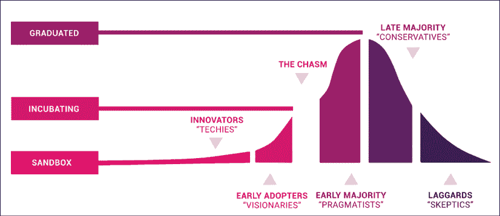
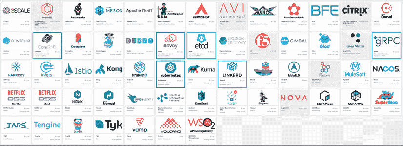

# Sixteen

# Kubernetes的未来

在本章中，我们将从多个角度来看 Kubernetes 的未来。我们将从 Kubernetes 成立以来的势头开始，跨越社区、生态系统和思想共享等维度。剧透警报——库本内斯以压倒性优势赢得了容器编排战。随着 Kubernetes 的成长和成熟，战线从击败竞争对手转向与自身的复杂性作斗争。可用性、工具和教育将发挥主要作用，因为容器编排仍然是新的、快速发展的，并且不是一个很好理解的领域。然后，我们将看看一些非常有趣的模式和趋势，最后，我们将回顾我在第二版中的预测，并做出一些新的预测。

我们将讨论的主题如下:

*   Kubernetes 的势头
*   CNCF 的重要性
*   无与伦比的可扩展性
*   服务网格集成
*   Kubernetes 上的无服务器计算
*   库比特和虚拟机
*   集群自动缩放
*   无处不在的运营商

# Kubernetes 的势头

Kubernetes 不可否认是一个庞然大物。Kubernetes 不仅击败了所有其他容器编排者，而且它还是公共云上事实上的解决方案，在许多私有云中得到利用，甚至虚拟机公司 VMware 也专注于 Kubernetes 解决方案，并将其产品与 Kubernetes 集成。

由于其可扩展的设计，Kubernetes 在多云和混合云场景中工作得非常好。

此外，Kubernetes 也在边缘领域取得了进展，定制发行版进一步扩展了其广泛的适用性。

Kubernetes 项目继续像钟表一样每 3 个月发布一次新版本。这个社区一直在发展。

Kubernetes GitHub 存储库([https://github.com/kubernetes/kubernetes](https://github.com/kubernetes/kubernetes))拥有 64，000 名明星，这一惊人增长的最主要驱动力之一是**云原生计算基金会** ( **CNCF** )。

## CNCF 的重要性

CNCF 已经成为云计算领域非常重要的组织。虽然它不是Kubernetes特有的，但Kubernetes的优势是不可否认的。Kubernetes 是第一个从它毕业的项目，其他大多数项目都严重倾向于 Kubernetes。特别是，CNCF 只为Kubernetes人提供认证和培训。除其他角色外，CNCF 确保云技术不会受到供应商的束缚。看看这张疯狂的整个 CNCF 风景图:[https://landscape.cncf.io/zoom=60](https://landscape.cncf.io/zoom=60)。

### 项目管理

CNCF([https://www.cncf.io/](https://www.cncf.io/))给项目分配了三个成熟度等级:毕业、孵化和沙箱:

图 16.1:项目成熟度等级

项目([https://www.cncf.io/projects/](https://www.cncf.io/projects/))从某个层面开始——沙箱或孵化——随着时间的推移可以毕业。这并不意味着只有毕业的项目才能安全使用。许多孵化甚至沙盒项目在生产中大量使用。例如，etcd 是 Kubernetes 本身的持久状态存储，它只是一个孵化项目。显然，它是一个高度可信的组件。Virtual Kubelet 是一个沙盒项目，为 AWS Fargate 和微软 ACI 提供动力。这些显然是企业级的软件。

CNCF 项目管理的主要好处是有助于驾驭Kubernetes周围令人难以置信的生态系统。当您开始寻求用额外的技术和工具来扩展您的 Kubernetes 解决方案时，CNCF 项目是一个很好的起点。

### 证书

当技术开始提供认证项目时，你可以看出他们会留下来。CNCF 提供几种认证:

*   经认证的 Kubernetes([https://www.cncf.io/certification/software-conformance/](https://www.cncf.io/certification/software-conformance/))，用于符合 Kubernetes 发行版和安装程序(约 90 个)； **Kubernetes 认证服务商**(**KCSP**)([https://www.cncf.io/certification/kcsp/](https://www.cncf.io/certification/kcsp/))，针对具有深厚 Kubernetes 经验的审核服务商(134 家提供商)；和**认证库伯内斯管理员**(**CKA**)([https://www.cncf.io/certification/cka/](https://www.cncf.io/certification/cka/))，为管理员。
*   **认证 Kubernetes 应用开发者**(**CKAD**)([https://www.cncf.io/certification/ckad/](https://www.cncf.io/certification/ckad/))为开发者。

### 培养

CNCF 也提供训练()https://www.cncf.io/certification/training/。有一个免费的Kubernetes课程介绍和几个与 CKA 和 CKAD 认证考试相一致的付费课程。此外，CNCF 还有一份Kubernetes培训合作伙伴名单。

如果您正在寻找免费的 Kubernetes 培训，这里有几个选择:

*   VMware〔t1〕kube 学院〔https://kube . academy/〔T2〕
*   Google kubriones引擎 on coursera([https://www . coursera . org/learn/Google-kubricks engine](https://www.coursera.org/learn/google-kubernetes-engine)

### 社区和教育

CNCF 还组织像 KubeCon、CloudNativeCon 这样的会议和集会，并维护几个沟通渠道，如闲置渠道和邮件列表。它还发布调查和报告。

与会者和参与者的数量逐年增长。

## 工具作业

管理容器和集群、各种插件、扩展和插件的工具数量不断增长。以下是参与 Kubernetes 生态系统的工具、项目和公司的子集:

图 16.2:库本内斯生态系统的参与者

# 托管 Kubernetes 平台的兴起

如今，几乎每个云提供商都有可靠的托管 Kubernetes 产品。有时，在给定的云提供商上运行 Kubernetes 有多种风格和方式。

## 公有云 Kubernetes 平台

以下是一些著名的托管平台:

*   谷歌GKE([https://cloud.google.com/kubernetes-engine/](https://cloud.google.com/kubernetes-engine/)
*   微软AK([https://azure . Microsoft . com/en-us/services/kubricks-service/](https://azure.microsoft.com/en-us/services/kubernetes-service/)中
*   亚马逊eks(https://AWS . Amazon . com/eks/
*   数字海洋([https://www.digitalocean.com/products/kubernetes/](https://www.digitalocean.com/products/kubernetes/)
*   甲骨文云([https://www . Oracle . com/Cloud/compute/container-engine-kubernetes . html](https://www.oracle.com/cloud/compute/container-engine-kubernetes.html))
*   IBM 云 Kubernetes 服务([https://www.ibm.com/cloud/container-service/](https://www.ibm.com/cloud/container-service/)
*   阿里巴巴ACK([https://www.alibabacloud.com/product/kubernetes](https://www.alibabacloud.com/product/kubernetes)
*   腾讯〔t1〕tke(https://intl . cloud .腾讯. com/product/tke〔T2〕

当然，你也可以像基础设施提供商一样，自己滚动使用公共云提供商。这是 Kubernetes 的一个非常常见的用例。

## 裸机、私有云和边缘的 Kubernetes

在这里，您可以找到 Kubernetes 发行版，这些发行版被设计或配置为在特殊环境中运行，通常在您自己的数据中心中作为私有云运行，或者在更受限制的环境中运行，如小型设备上的边缘计算:

*   Google antos用于【gke】(https://cloud . Google . com/antos/gke/
*   open stack([https://docs . open stack . org/open stack-helm/latest/install/developer/kubernetes-and-common-setup . html](https://docs.openstack.org/openstack-helm/latest/install/developer/kubernetes-and-common-setup.html))
*   牧场主k3S([https://rancher.com/docs/k3s/latest/en/](https://rancher.com/docs/k3s/latest/en/)
*   Kubernetes〔t0〕on raspberry pi([https://www . shogan . co . uk/kubrines/building-a-raspberry-pi-kubrites 集群第 1 部分路由/](https://www.shogan.co.uk/kubernetes/building-a-raspberry-pi-kubernetes-cluster-part-1-routing/)
*   Kubernetes〔t1〕https://Kubernetes. io/en/

## Kubernetes平台即服务(PaaS)

这一类产品旨在抽象出 Kubernetes 的一些复杂性，并在它前面放置一个更简单的外观。这里有很多品种。它们中的一些迎合了多云和混合云场景，一些将功能公开为服务接口，而一些则只关注更好的安装和支持体验:

*   谷歌云跑([https://cloud.google.com/run/](https://cloud.google.com/run/)
*   VMware〔t1〕PK〔https://tantu . VMware . com/kubrines-grid〕T2〕
*   9 号站台PMK([https://platform9.com/managed-kubernetes/](https://platform9.com/managed-kubernetes/)
*   巨人虫群([https://www.giantswarm.io/](https://www.giantswarm.io/)
*   open shift([https://www.openshift.com/](https://www.openshift.com/))
*   牧场主RKE([https://rancher.com/docs/rke/latest/en/](https://rancher.com/docs/rke/latest/en/)

# 即将到来的趋势

让我们来谈谈 Kubernetes 中一些在不久的将来会很重要的技术趋势。其中一些趋势已经出现。

## 安全

当然，安全性是大规模系统最关心的问题。Kubernetes 主要是一个管理容器化工作负载的平台。这些容器化的工作负载通常在多租户环境中运行。租户之间的隔离非常重要。容器是轻量级和高效的，因为它们共享一个操作系统，并通过各种机制(如命名空间隔离、文件系统隔离和组资源隔离)来维护它们的隔离。理论上，这应该足够了。实际上，表面面积很大，并且有多个容器隔离突破。

为了解决这一风险，设计了多个轻量级虚拟机来添加虚拟机管理程序(机器级虚拟化)，作为容器和操作系统内核之间的附加隔离级别。大型云提供商已经支持这些技术，Kubernetes CRI 接口提供了一种简化的方式来利用这些更安全的运行时。

例如，**鞭炮**([https://firecracker-microvm.github.io/](https://firecracker-microvm.github.io/))通过**鞭炮容器**([https://github . com/鞭炮-微伏/鞭炮容器](https://github.com/firecracker-microvm/firecracker-containerd))与容器集成。谷歌 gVisor 是另一个沙盒技术。它是一个用户空间内核，实现大多数 Linux 系统调用，并在应用和主机操作系统之间提供缓冲区。也可通过容器通过**容器垫片**([https://github.com/google/gvisor-containerd-shim](https://github.com/google/gvisor-containerd-shim))获得。

## 建立工作关系网

网络是另一个不断创新的领域。Kubernetes CNI 允许任何数量的创新网络解决方案在一个简单的界面下工作。一个主要的主题是将 eBPF——一种相对较新的 Linux 内核技术——结合到 Kubernetes 中。

**eBPF** 代表**扩展柏克莱包过滤**。eBPF 的核心是 Linux 内核中的一个小型虚拟机，当某些事件发生时，比如一个数据包被发送或接收，它会执行附加到内核对象的特殊程序。最初，只支持插座，这项技术被称为“BPF”。后来，额外的对象被添加到组合中，这就是“扩展”的“e”出现的时候。eBPF 之所以出名是因为它的性能，因为它在内核中运行高度优化的编译过的 BPF 程序，并且不需要用内核模块扩展内核。

eBPF 有很多应用:

*   **动态网络控制**:基于 iptables 的方法在像 Kubernetes 集群这样的动态环境中无法很好地扩展，在这种环境中，用 BPF 程序替换 iptables 既更具性能，又更易于管理。**cilium**([https://github.com/cilium/cilium](https://github.com/cilium/cilium))专注于使用 eBPF 路由和过滤流量
*   **监控连接**:通过附加一个跟踪套接字级事件的 BPF 程序 kprobes，可以创建容器之间 TCP 连接的最新映射。**WdeaveScope**([https://github.com/weaveworks/scope](https://github.com/weaveworks/scope))通过在每个节点上运行一个代理来收集这些信息，然后将其发送到一个服务器，该服务器通过一个光滑的用户界面提供可视化表示。
*   **限制系统调用**:Linux 内核提供 300 多个系统调用。在一个安全敏感的容器环境中，这是非常可取的。最初的**seccomp**([https://en.wikipedia.org/wiki/Seccomp](https://en.wikipedia.org/wiki/Seccomp))设施相当有条理。在 Linux 3.5 中，seccomp 被扩展到支持 BPF 的高级定制过滤器。
*   **原始性能** : eBPF 提供了显著的性能优势，像**Calico**([https://www.projectcalico.org/](https://www.projectcalico.org/))这样的项目利用并实现了使用更少资源的更快的数据平面。

## 定制硬件和设备

Kubernetes 以相对较高的级别管理节点、网络和存储。但是，在细粒度级别集成特定硬件有很多好处；例如GPU、高性能网卡、FPGAs、InfiniBand 适配器以及其他计算、网络和存储资源。这就是**设备插件**([https://github . com/kubernetes/community/blob/master/投稿人/设计提案/资源管理/设备插件. md](https://github.com/kubernetes/community/blob/master/contributors/design-proposals/resource-management/device-plugin.md) )框架的由来。它还在测试版中(从 Kubernetes 1.10 开始)，并且在这个领域有持续的创新。例如，自 Kubernetes 1.15 以来，监控设备插件资源也处于测试阶段。看到什么设备将与 Kubernetes 一起使用是非常有趣的。该框架本身通过利用 gRPC 遵循现代 Kubernetes 可扩展性实践。

## 服务网格

服务网格可以说是过去几年最重要的趋势。我们在*第 14 章*、*利用服务网格*中深入介绍了服务网格。采用情况令人印象深刻，我预测大多数 Kubernetes 发行版将提供默认服务网格，并允许与其他服务网格轻松集成。服务网格提供的好处实在是太有价值了，提供一个包含 Kubernetes 和集成服务网格的默认平台是有意义的。也就是说，Kubernetes 本身不会吸收一些服务网格，并通过其 API 将其公开。这违背了保持Kubernetes核心小的原则。

谷歌**Anthos**([https://cloud.google.com/anthos/](https://cloud.google.com/anthos/))就是一个很好的例子将 Kubernetes + Knative + Istio 结合起来，提供了一个统一的平台，提供了一个固执己见的最佳实践包。一个组织需要大量的时间和资源来建立在普通的 Kubernetes 之上。

这个方向的另一个推动是**边车容器**KEP([https://github . com/kubernetes/enhancements/blob/master/keps/SIG-apps/sidecarcontainers . MD](https://github.com/kubernetes/enhancements/blob/master/keps/sig-apps/sidecarcontainers.md))。

边车容器模式从一开始就是 Kubernetes 的主打产品。毕竟，豆荚可以容纳多个容器。然而，没有主容器和侧车容器的概念。容器中的所有容器都具有相同的状态。大多数服务网格使用边车容器来拦截流量并执行任务。将 sidecar 容器形式化将有助于这些努力，并进一步推动服务网格。

目前还不清楚，在这个阶段，Kubernetes 和服务网格是否会隐藏在大多数平台上更简单的抽象后面，或者它们是否会成为前端和中心。

## 无服务器计算

无服务器计算是另一个趋势。我们在*第 12 章*、*Kubernetes 上的无服务器计算*中详细讨论了这个问题。Kubernetes 和 serverless 可以在多个级别上进行组合。Kubernetes 可以利用像 AWS Fargate 和 AKS **Azure 容器实例** ( **ACI** )这样的无服务器云解决方案来节省集群管理员管理节点的时间。这种方法也适合将轻量级虚拟机透明地与 Kubernetes 集成，因为云平台不会将裸 Linux 容器用于其容器即服务平台。

另一种方法是颠倒角色，将容器作为一种由 Kubernetes 提供的服务公开。这正是谷歌**云跑**([https://cloud.google.com/run/](https://cloud.google.com/run/))正在做的事情。这里的界限很模糊，因为谷歌有多种产品来管理容器和/或Kubernetes，从仅 GKE 到安托斯 GKE(为您的私有数据中心将您自己的集群带到 GKE 环境)、安托斯(托管Kubernetes+服务网格)和安托斯云运行。

最后，还有在 Kubernetes 集群中运行的功能即服务和零规模项目。我相信 Knative 将成为这里的领导者，因为它已经被许多框架使用，并且通过各种谷歌产品进行了大量部署。

## 边缘上的 Kubernetes

Kubernetes 是云原生计算的海报男孩，但随着**物联网** ( **IoT** )革命，越来越需要在网络边缘执行计算。将所有数据发送到后端进行处理有几个缺点:

*   潜伏
*   需要足够的带宽
*   费用

随着边缘位置通过传感器、摄像机等收集大量数据，边缘数据量不断增长，在边缘执行越来越复杂的处理更有意义。Kubernetes 是从谷歌的博格公司发展而来的，博格公司绝对不是为了在网络边缘运行而设计的。然而，事实证明 Kubernetes 的设计足够灵活，可以容纳它。

我预计我们将在网络边缘看到越来越多的 Kubernetes 部署，这将导致由许多 Kubernetes 集群组成的非常有趣的系统，这些集群将需要集中管理。

**kube edge**([https://kubeedge.io/en/](https://kubeedge.io/en/))是一个开源框架，建立在 Kubernetes 和 mosque(MQTT 消息代理的开源实现)之上，为云和边缘之间的联网、应用部署和元数据同步提供基础。

## 本地CI/CD

对于开发人员来说，最重要的问题之一是 CI/CD 管道的构建。有很多选择，在它们之间做出选择可能很困难。**光盘基金会**([https://cd.foundation/](https://cd.foundation/))是一个开源基金会，成立于以标准化概念，如管道和工作流，以及定义行业规范，这将允许不同的工具和社区更好地互操作。目前的项目有:

*   詹金斯([https://www.jenkins.io/](https://www.jenkins.io/))
*   詹金斯 X([https://jenkins-x.io/](https://jenkins-x.io/))
*   泰克顿〔t1〕https://github . com/tectond/pipeline
*   吐丝机([https://www.spinnaker.io/](https://www.spinnaker.io/))

还有孵化项目:**螺丝刀. CD**([https://screwdriver.cd/](https://screwdriver.cd/))。

我最喜欢的原生 CD 项目之一**蓉城 CD**([https://github.com/argoproj/argo-cd](https://github.com/argoproj/argo-cd))目前还不是CD 基金会的一部分。我采取了行动，打开了一个 GitHub 问题([https://github.com/argoproj/argo-cd/issues/3265](https://github.com/argoproj/argo-cd/issues/3265))要求提交 argo-cd 给 CDF。

另一个值得关注的项目是**CNB**–**云原生建造包**([https://buildpacks.io/](https://buildpacks.io/))。该项目采用了一个来源，并创造了 OCI(认为码头工人)的形象。对于**功能即服务** ( **FaaS** )框架和本地集群内配置项来说很重要。这也是一个 CNCF 沙盒项目。

## 经营者

运营商模式2016 年从 CoreOS(被红帽收购，被 IBM 收购)中脱颖而出，在社区中获得了不小的成功。操作员是自定义资源和用于管理应用的控制器的组合。在我目前的工作中，我写运营商来管理基础设施的各个方面，这是一种乐趣。

它已经是向 Kubernetes 集群分发非平凡应用的既定方式。查看 https://operatorhub.io/现有运营商的庞大名单。我预计这一趋势将继续下去。

# 摘要

在这一章中，我们看到了 Kubernetes 的未来，它看起来很棒！技术基础、社区、广泛支持和势头都令人印象深刻。Kubernetes 还很年轻，但创新和稳定的步伐非常令人鼓舞。Kubernetes 的模块化和可扩展性原则使其成为现代云原生应用的通用基础。

在这一点上，你应该清楚地知道库本内斯现在在哪里，以及它将从这里走向何方。您应该有信心，Kubernetes 不仅仅会留在这里，它还将成为未来许多年的领先容器编排平台。它将能够与您所能想象的任何主要产品和环境集成，从全球规模的公共云平台、私有云、数据中心和边缘位置，一直到您的开发笔记本电脑和树莓皮。

就这样！这是这本书的结尾。

现在，就看你如何利用你所学到的东西，用 Kubernetes 构建令人惊叹的东西了！

# 参考

*   GitHub 上的 kubrites:t1]https://github . com/kubrites/kubrites
*   CNCF: [https://cncf.io](https://cncf.io)
*   光盘基金会:[https://cd.foundation/](https://cd.foundation/)
*   鞭炮:[https://firecracker-microvm.github.io/](https://firecracker-microvm.github.io/)
*   gvisor:[https://github . com/Google/gvisor-container d-shim](https://github.com/google/gvisor-containerd-shim)
*   单纯形:https://github . com/cilio/cilio
*   印花布:[https://www.projectcalico.org/](https://www.projectcalico.org/)
*   Google antos:[https://cloud . Google . com/antos/](https://cloud.google.com/anthos/)
*   谷歌云跑:[https://cloud.google.com/run/](https://cloud.google.com/run/)
*   Kubernetes:[https://Kubernetes. io/en/](https://kubeedge.io/en/)
*   接线员中枢:https://operator hub . io/